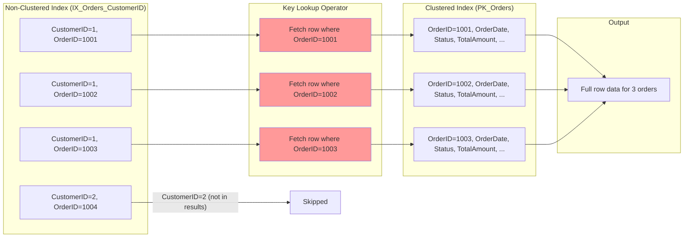
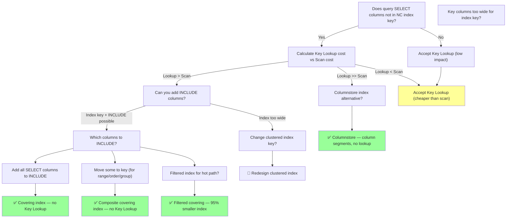

### Section 1 — Navigation

- **Breadcrumb:** [[8 — Databases]] → [[Group 13 — SQL Server Performance & Tuning]] → **8.355 Key Lookup**
- **Previous:** [[8.354 Index Seek vs Index Scan — When Each Occurs]] (the operation preceding a Key Lookup)
- **Next:** [[8.356 RID Lookup — Heap Table Access]] (the heap equivalent of Key Lookup)
- **Prerequisites:**
  - [[8.343 Execution Plans — Reading Graphical Plans]] — identify Key Lookup icon
  - [[8.357 Nested Loops Join — When and Why]] — Key Lookup uses Nested Loops
  - [[Group 18 — Indexing Fundamentals]] — B-Tree structure, clustered vs non-clustered
  - [[8.366 SET STATISTICS IO — Reading Logical Reads]] — measure lookup cost
- **Cross-Domain:** [[Group 19 — Indexing Advanced & Specialized]] — filtered indexes, included columns, columnstore
- **Where This Fits:** A Key Lookup (also called Bookmark Lookup) occurs when a non-clustered index is used to find qualifying rows, but the index does not contain all columns needed by the query. For each row found in the NC index, SQL Server must "look up" the full row in the clustered index (or heap, via RID Lookup). This is a **row-by-row random I/O operation** — the single most common cause of high logical reads in OLTP workloads. Identifying and eliminating unnecessary key lookups is often the highest-ROI indexing optimization.

---

### Section 2 — Core Mental Model



**Classification:** Execution Plan Operator — Data Retrieval

| Property | Value |
|---|---|
| Operator name | `Key Lookup (Clustered)` |
| Underlying join | Nested Loops (1 lookup per NC index row) |
| I/O type | **Random** (single page per lookup) |
| Cost pattern | NC Index Seek: N pages + Key Lookup: N rows × K pages |
| Row locator | Clustered index key(s) from NC index leaf |
| Heap equivalent | `RID Lookup` (uses physical RID instead of key) |
| Visibility | Execution plan (green icon: index + arrow to clustered) |
| Missing index DMV | `sys.dm_db_missing_index_details` |
| Coverage | Column(s) not in NC index trigger the lookup |
| Elimination | Covering index (`INCLUDE`), columnstore, filtered index |

**Mental Model:** A Key Lookup is a **"phone book within a phone book"** problem. The non-clustered index is like a directory sorted by last name — it gives you the page number (clustered key). But each time you want the full address, you must turn to that specific page. If you need 1000 addresses, you flip to 1000 different pages. A covering index is like the directory also listing the address on the same line — no page-flipping needed.

---

### Section 3 — Deep Mechanics

#### 3.1 Anatomy of a Key Lookup

The execution plan for a typical Key Lookup query:

```
SELECT OrderID, OrderDate, Status, TotalAmount
FROM Orders
WHERE CustomerID = 12345;
```

Plan shape:
```
  |--Nested Loops (Inner Join)
       |--Index Seek (NonClustered) [IX_Orders_CustomerID]
            Seek Predicates: CustomerID = 12345
       |--Key Lookup (Clustered) [PK_Orders]
            Lookup Predicates: OrderID = OrderID
            Output: OrderDate, Status, TotalAmount, CustomerID
```

**Cost breakdown per qualifying row:**
1. **NC Index Seek:** Navigate B-Tree to find the first matching `CustomerID`. Cost: depth (usually 3-4 pages).
2. **NC Index Leaf Scan:** Read the leaf-level rows for matching entries. Each leaf row contains: `(CustomerID, OrderID)` + clustered key (`OrderID`).
3. **Key Lookup:** For each qualifying row, take the `OrderID` from step 2 and **seek into the clustered index** `PK_Orders` to retrieve `OrderDate`, `Status`, `TotalAmount`.
4. **Nested Loops:** Orchestrate steps 2-3 per row.

**Total logical reads =** `NC_Index_Pages_Read + (Qualifying_Rows × Clustered_Index_Depth)`

If 10,000 rows match and clustered index depth is 4:
- Logical reads = 50 (NC index) + 10,000 × 4 = **40,050 reads**
- (A clustered index scan would be ~45,000 reads — barely better at this selectivity!)

#### 3.2 When Key Lookup Happens

```sql
-- The classic Key Lookup scenario
-- Orders has clustered index on OrderID
-- Non-clustered index on CustomerID only

-- ❌ This query causes a Key Lookup:
-- NC index has CustomerID, OrderID (clustered key)
-- But we also need: OrderDate, Status, TotalAmount
SELECT OrderID, CustomerID, OrderDate, Status, TotalAmount
FROM dbo.Orders
WHERE CustomerID = 12345;

-- ✅ This query does NOT cause a Key Lookup:
-- All needed columns (OrderID, CustomerID) are in the NC index
SELECT OrderID, CustomerID
FROM dbo.Orders
WHERE CustomerID = 12345;

-- ✅ This also avoids Key Lookup if we only need columns in index
-- NC index automatically includes the clustered key (OrderID)
-- so any query needing only CustomerID and OrderID is covered
SELECT COUNT(*) FROM dbo.Orders WHERE CustomerID = 12345;
```

#### 3.3 Detection via DMVs

```sql
-- Find missing indexes (these are Key Lookup candidates)
SELECT 
    migs.avg_total_user_cost * migs.avg_user_impact * (migs.user_seeks + migs.user_scans) AS impact,
    mid.statement AS table_name,
    mid.equality_columns,
    mid.inequality_columns,
    mid.included_columns,
    migs.user_seeks,
    migs.user_scans,
    migs.avg_user_impact,
    migs.unique_compiles
FROM sys.dm_db_missing_index_groups mig
INNER JOIN sys.dm_db_missing_index_group_stats migs 
    ON migs.group_handle = mig.index_group_handle
INNER JOIN sys.dm_db_missing_index_details mid 
    ON mig.index_handle = mid.index_handle
WHERE mid.database_id = DB_ID()
  AND migs.avg_user_impact > 50  -- > 50% estimated improvement
ORDER BY impact DESC;

-- Find indexes with high Key Lookup activity
SELECT 
    OBJECT_NAME(i.object_id) AS table_name,
    i.name AS index_name,
    ius.user_seeks,
    ius.user_scans,
    ius.user_lookups,  -- Key Lookups
    ius.last_user_lookup,
    ius.last_user_seek
FROM sys.dm_db_index_usage_stats ius
INNER JOIN sys.indexes i 
    ON ius.object_id = i.object_id AND ius.index_id = i.index_id
WHERE ius.database_id = DB_ID()
  AND ius.user_lookups > 1000
  AND i.type_desc = 'NONCLUSTERED'
ORDER BY ius.user_lookups DESC;

-- Find queries using Key Lookup in their plans
WITH KeyLookupQueries AS (
    SELECT 
        qs.query_hash,
        qs.execution_count,
        qs.total_logical_reads,
        qs.total_elapsed_time,
        qt.text,
        qp.query_plan
    FROM sys.dm_exec_query_stats qs
    CROSS APPLY sys.dm_exec_sql_text(qs.sql_handle) qt
    CROSS APPLY sys.dm_exec_query_plan(qs.plan_handle) qp
)
SELECT *
FROM KeyLookupQueries
WHERE query_plan.exist('//RelOp[@PhysicalOp="Key Lookup"]') = 1
ORDER BY total_logical_reads DESC;
```

#### 3.4 Execution Plan XML

```xml
<RelOp NodeId="2" PhysicalOp="Key Lookup" LogicalOp="Clustered Index Seek"
       EstimatedRows="10" EstimatedTotalSubtreeCost="0.0032831"
       Parallel="0" AvgRowSize="80" EstimateCPU="0.0001581"
       EstimateIO="0.003125" EstimateRebinds="0" EstimateRewinds="0">
  <OutputList>
    <ColumnReference Database="[SalesDB]" Schema="[dbo]" Table="[Orders]"
                     Column="OrderDate" />
    <ColumnReference Database="[SalesDB]" Schema="[dbo]" Table="[Orders]"
                     Column="Status" />
    <ColumnReference Database="[SalesDB]" Schema="[dbo]" Table="[Orders]"
                     Column="TotalAmount" />
    <ColumnReference Database="[SalesDB]" Schema="[dbo]" Table="[Orders]"
                     Column="CustomerID" />
  </OutputList>
  <IndexScan Lookup="1" Ordered="1" ForcedIndex="0" NoExpandHint="0">
    <DefinedValues>
      <DefinedValue>
        <ColumnReference Database="[SalesDB]" Schema="[dbo]" Table="[Orders]"
                         Column="OrderDate" />
        ...
      </DefinedValue>
    </DefinedValues>
    <Object Database="[SalesDB]" Schema="[dbo]" Table="[Orders]"
            Index="[PK_Orders]" />
    <SeekPredicates>
      <SeekPredicate>
        <Prefix>
          <RangeColumns>
            <ColumnReference Database="[SalesDB]" Schema="[dbo]" Table="[Orders]"
                           Column="OrderID" />
          </RangeColumns>
          <RangeExpressions>
            <ScalarOperator ScalarString="[SalesDB].[dbo].[Orders].[OrderID] =
              [SalesDB].[dbo].[Orders].[OrderID]" />
          </RangeExpressions>
        </Prefix>
      </SeekPredicate>
    </SeekPredicates>
  </IndexScan>
</RelOp>
```

#### 3.5 Failure Modes

| Failure Mode | Cause | Symptom |
|---|---|---|
| High logical reads | Many qualifying rows + deep clustered index | 10K rows × 4 depth = 40K reads |
| Nested Loops spill | Very large rowset (millions) | Key Lookup on millions of rows — runaway query |
| Missing INCLUDE columns | Index only has key columns | Key Lookup for every additional column |
| Wrong index choice | Optimizer chooses non-covering index over clustered scan | Key Lookup on 80% of rows |
| RID Lookup on heap | Table has no clustered index | Same performance issue, different operator name |
| Partitioned table | Key Lookup across partition boundary | Extra partition elimination cost |

---

### Section 4 — Production Patterns

#### 4.1 Pattern: Eliminate Key Lookup with INCLUDE Columns

```sql
-- Before: Query causes Key Lookup for OrderDate, Status, TotalAmount
SELECT o.OrderID, o.CustomerID, o.OrderDate, o.Status, o.TotalAmount
FROM dbo.Orders o
WHERE o.CustomerID = 12345;

-- Current Index: IX_Orders_CustomerID (CustomerID)
-- Execution Plan: Index Seek (IX_Orders_CustomerID) → Key Lookup (PK_Orders)

-- Fix: Add INCLUDE columns to make it a covering index
CREATE NONCLUSTERED INDEX IX_Orders_CustomerID_Covering
ON dbo.Orders (CustomerID)
INCLUDE (OrderDate, Status, TotalAmount);

-- After: Execution Plan: Index Seek (IX_Orders_CustomerID_Covering) — NO Key Lookup!
```

#### 4.2 Pattern: Eliminate Key Lookup with Composite Index Key

```sql
-- Sometimes better to put columns in key (not INCLUDE)
-- if they are used for range queries, sorting, or grouping

-- Before: Key Lookup for OrderDate (used in WHERE range)
SELECT o.OrderID, o.CustomerID, o.OrderDate, o.TotalAmount
FROM dbo.Orders o
WHERE o.CustomerID = 12345 AND o.OrderDate >= '2026-01-01';

-- Fix: Composite index with OrderDate as key column
-- (enables seek on both CustomerID AND OrderDate)
CREATE NONCLUSTERED INDEX IX_Orders_CustomerID_OrderDate
ON dbo.Orders (CustomerID, OrderDate)
INCLUDE (TotalAmount);
-- OrderDate in key allows Index Seek on both predicates
-- TotalAmount in INCLUDE avoids Key Lookup
```

#### 4.3 Pattern: Filtered Index to Eliminate Lookup for Hot Path

```sql
-- Only 5% of orders are 'Pending' — this query runs every 10 seconds
SELECT o.OrderID, o.CustomerID, o.OrderDate, o.Status
FROM dbo.Orders o
WHERE o.Status = 'Pending' AND o.OrderDate < '2026-01-01';

-- Fix: Filtered index for ONLY the relevant rows
CREATE NONCLUSTERED INDEX IX_Orders_Pending_Deprecated
ON dbo.Orders (OrderDate, CustomerID)
INCLUDE (Status)
WHERE Status = 'Pending' AND OrderDate < '2026-01-01';
-- 95% smaller than full index → faster seeks, less maintenance
```

#### 4.4 Pattern: Eliminate Key Lookup with Columnstore Index

```sql
-- Analytical query scanning many rows — Key Lookup is catastrophic
SELECT c.CustomerName, SUM(oi.Quantity * oi.UnitPrice) AS TotalSpent
FROM dbo.Orders o
INNER JOIN dbo.OrderItems oi ON o.OrderID = oi.OrderID
INNER JOIN dbo.Customers c ON o.CustomerID = c.CustomerID
WHERE o.OrderDate >= '2024-01-01'
GROUP BY c.CustomerName;

-- Fix: Clustered Columnstore Index eliminates Key Lookup entirely
CREATE CLUSTERED COLUMNSTORE INDEX CCI_Orders ON dbo.Orders;
-- All columns are stored together in column segments
-- No need for Key Lookup

-- For existing heap/clustered index tables:
CREATE NONCLUSTERED COLUMNSTORE INDEX NCC_Orders ON dbo.Orders
WHERE OrderDate >= '2024-01-01';
```

#### 4.5 Pattern: Diagnose Key Lookup with SET STATISTICS IO

```sql
SET STATISTICS IO ON;

-- Query causing Key Lookup
PRINT '--- Before: Key Lookup ---';
SELECT o.OrderID, o.CustomerID, o.OrderDate, o.Status, o.TotalAmount
FROM dbo.Orders o
WHERE o.CustomerID = 12345;

-- After creating covering index
PRINT '--- After: Covering Index ---';
SELECT o.OrderID, o.CustomerID, o.OrderDate, o.Status, o.TotalAmount
FROM dbo.Orders o
WHERE o.CustomerID = 12345;

SET STATISTICS IO OFF;
```

**Expected output before:**
```
Table 'Orders'. Scan count 1, logical reads 1042, physical reads 0
```
(42 reads from NC index + 1000 rows × 4 depth = 1042 reads for 1000 qualifying rows.)

**Expected output after:**
```
Table 'Orders'. Scan count 1, logical reads 45, physical reads 0
```
(42 reads from NC index leaf — no Key Lookup.)

#### 4.6 Pattern: Use sys.dm_db_missing_index_details for Automation

```sql
-- Generate covering index creation scripts from missing index DMV
SELECT 
    'CREATE NONCLUSTERED INDEX [IX_' + OBJECT_NAME(mid.object_id) + '_' 
    + REPLACE(REPLACE(mid.equality_columns, '[', ''), ']', '')
    + CASE WHEN mid.inequality_columns IS NOT NULL 
           THEN '_' + REPLACE(REPLACE(mid.inequality_columns, '[', ''), ']', '')
           ELSE '' END
    + '_Missing]
ON ' + mid.statement + ' (' 
    + ISNULL(mid.equality_columns, '') 
    + CASE WHEN mid.equality_columns IS NOT NULL AND mid.inequality_columns IS NOT NULL THEN ', ' ELSE '' END
    + ISNULL(mid.inequality_columns, '') 
    + ') ' 
    + ISNULL('INCLUDE (' + mid.included_columns + ')', '')
    + ' WITH (ONLINE = ON);' AS create_index_statement,
    migs.avg_user_impact,
    migs.avg_total_user_cost,
    migs.user_seeks + migs.user_scans AS total_accesses
FROM sys.dm_db_missing_index_groups mig
INNER JOIN sys.dm_db_missing_index_group_stats migs 
    ON migs.group_handle = mig.index_group_handle
INNER JOIN sys.dm_db_missing_index_details mid 
    ON mig.index_handle = mid.index_handle
WHERE mid.database_id = DB_ID()
ORDER BY migs.avg_user_impact * (migs.user_seeks + migs.user_scans) DESC;
```

#### 4.7 EF Core / Dapper — Minimizing Key Lookup

```csharp
// EF Core — project only needed columns to reduce Key Lookup
// ❌ Bad: Select * causes Key Lookup for every column
var orders = await context.Orders
    .Where(o => o.CustomerId == id)
    .ToListAsync();  // SELECT * → Key Lookup

// ✅ Good: Project specific columns → may be covered by index
var orders = await context.Orders
    .Where(o => o.CustomerId == id)
    .Select(o => new OrderSummary {
        OrderId = o.OrderId,
        CustomerId = o.CustomerId,
        OrderDate = o.OrderDate,
        Status = o.Status
    })
    .ToListAsync();  // Only requested columns

// ✅ Best: Use raw SQL with covering index guarantee
var orders = await context.Orders
    .FromSqlRaw(@"
        SELECT OrderID, CustomerID, OrderDate, Status, TotalAmount
        FROM Orders WITH (INDEX(IX_Orders_CustomerID_Covering))
        WHERE CustomerID = {0}", id)
    .ToListAsync();

// Dapper — same principle, project only needed columns
// ❌ SELECT * → Key Lookup
var orders = conn.Query<Order>("SELECT * FROM Orders WHERE CustomerID = @Id", new { Id = id });

// ✅ SELECT specific columns → may use covering index
var orders = conn.Query<OrderSummary>(
    "SELECT OrderID, CustomerID, OrderDate, Status FROM Orders WHERE CustomerID = @Id",
    new { Id = id });
```

---

### Section 5 — Gotchas

#### Gotcha #1: Key Lookup on Every Row = More Reads Than a Full Scan

- **Pitfall:** "I see an Index Seek, so the query is fast."
- **Symptom:** High logical reads despite Index Seek. Query duration is high.
- **Fix:** Calculate: `NC_index_pages + (rows × clustered_depth)`. Compare with clustered index scan cost. If lookup cost > scan cost, accept the scan or create a covering index.
- **Cost:** 10,000 rows × 4 depth = 40,000 reads vs. 15,000 scan reads. The "seek" is 2.6x more I/O!

#### Gotcha #2: INCLUDE Does Not Help with All Column Types

- **Pitfall:** Adding large column types (VARCHAR(MAX), NVARCHAR(MAX), TEXT, NTEXT, IMAGE, XML, GEOMETRY) to INCLUDE.
- **Symptom:** INCLUDE clause works syntactically, but the index becomes massive (includes LOB data).
- **Fix:** For LOB columns, consider `COLUMNSTORE` indexes or splitting the query.
- **Cost:** Index size balloons by GBs, maintenance overhead increases dramatically.

#### Gotcha #3: INCLUDE Columns Add Write Overhead

- **Pitfall:** Adding 20 INCLUDE columns to an index on a high-write table.
- **Symptom:** INSERT/UPDATE/DELETE performance degrades because each INCLUDE column must be written to the NC index leaf.
- **Fix:** Only add INCLUDE columns that are actually used in SELECT queries. Monitor index maintenance time.
- **Cost:** Each INCLUDE column adds ~8 bytes + data per row to the NC index leaf. 20 columns × 1M rows = significant storage and write I/O.

#### Gotcha #4: Key Lookup Can Cascade (Multiple Non-Covering Indexes)

- **Pitfall:** Two NC indexes, both non-covering, in the same query (e.g., join).
- **Symptom:** Multiple Key Lookup operators in the plan.
- **Fix:** Create covering indexes for both tables, or redesign indexes.
- **Cost:** Each Key Lookup multiplies the I/O. A 3-table join with lookups on each can cost 3× the baseline.

#### Gotcha #5: Key Lookup with Partitioned Tables

- **Pitfall:** Key Lookup on a partitioned clustered index.
- **Symptom:** Each lookup must navigate the partition structure first.
- **Fix:** Align partitioning key with the clustered index key; use partition-aware covering indexes.
- **Cost:** Each lookup pays partition elimination cost + B-Tree navigation.

#### Gotcha #6: Key Lookup vs RID Lookup Confusion

- **Pitfall:** Confusing Key Lookup (clustered) with RID Lookup (heap).
- **Symptom:** Applying the wrong fix (adding clustered key to index vs. adding RID).
- **Fix:** Key Lookup → add INCLUDE columns to NC index. RID Lookup → consider adding a clustered index (RID requires physical row pointer).
- **Cost:** Wrong fix wastes development time; the performance issue persists.

---

### Section 6 — Performance Implications

#### 6.1 Benchmark: Key Lookup Impact by Row Count

```sql
-- Setup: 5M row Orders table with 5-level clustered index depth
CREATE TABLE #KLDemo (
    OrderID INT IDENTITY(1,1),
    CustomerID INT NOT NULL,
    OrderDate DATETIME NOT NULL,
    Status VARCHAR(20) NOT NULL,
    TotalAmount DECIMAL(18,2),
    ShippingAddress VARCHAR(200),
    PaymentMethod VARCHAR(50),
    Notes VARCHAR(500),
    CreatedDate DATETIME DEFAULT GETDATE(),
    ModifiedDate DATETIME DEFAULT GETDATE(),
    PRIMARY KEY CLUSTERED (OrderID)
);

WITH Numbers AS (
    SELECT TOP 5000000 ROW_NUMBER() OVER (ORDER BY (SELECT NULL)) AS n
    FROM sys.all_columns a 
    CROSS JOIN sys.all_columns b 
    CROSS JOIN sys.all_columns c
)
INSERT INTO #KLDemo (CustomerID, OrderDate, Status, TotalAmount)
SELECT 
    (n % 10000) + 1,
    DATEADD(DAY, n % 1000, '2024-01-01'),
    CASE WHEN n % 100 < 80 THEN 'Shipped' WHEN n % 100 < 95 THEN 'Processing' ELSE 'Cancelled' END,
    CAST(RAND(CHECKSUM(NEWID())) * 5000 AS DECIMAL(18,2))
FROM Numbers;

-- Non-covering index (only key columns)
CREATE INDEX IX_KLDemo_CustomerID ON #KLDemo(CustomerID);

-- Set up test
DECLARE @CustomerID INT = 123;  -- returns ~500 rows

SET STATISTICS IO ON;

-- Test 1: Key Lookup (selecting columns not in NC index)
PRINT '--- Test 1: Key Lookup (SELECT *) ---';
SELECT * FROM #KLDemo WHERE CustomerID = @CustomerID;
GO

-- Test 2: Covered by NC index (only OrderID + CustomerID)
PRINT '--- Test 2: Covered (OrderID, CustomerID) ---';
SELECT OrderID, CustomerID FROM #KLDemo WHERE CustomerID = @CustomerID;
GO

-- Test 3: Add covering index and retry
CREATE INDEX IX_KLDemo_Covering ON #KLDemo(CustomerID) 
INCLUDE (OrderDate, Status, TotalAmount, ShippingAddress, PaymentMethod);
GO

PRINT '--- Test 3: Covering Index (no Key Lookup) ---';
SELECT * FROM #KLDemo WHERE CustomerID = @CustomerID;
GO

-- Test 4: Clustered Index Scan (baseline)
PRINT '--- Test 4: Clustered Index Scan (no WHERE) ---';
SELECT * FROM #KLDemo;
GO

SET STATISTICS IO OFF;

DROP TABLE #KLDemo;
```

**Expected results (500 qualifying rows):**

| Test | Operator | Logical Reads | Duration (approx) |
|---|---|---|---|
| 1: Key Lookup (SELECT *) | Seek + Key Lookup | ~2,500 (50 NC + 500×5 depth) | 250ms |
| 2: Covered (OrderID, CustomerID) | Seek only | ~50 (NC leaf pages) | 5ms |
| 3: Covering Index | Seek only | ~55 (NC leaf pages + small depth) | 5ms |
| 4: Clustered Scan | Scan | ~45,000 (all pages) | 400ms |

**Savings:** Key Lookup → Covering Index = 2,500 → 55 reads (98% reduction).

#### 6.2 BenchmarkDotNet (C#)

```csharp
[MemoryDiagnoser]
public class KeyLookupBenchmark
{
    private const string ConnString = "...";
    private IDbConnection _db;
    private int _customerId = 12345;  // ~500 rows

    [GlobalSetup]
    public void Setup() => _db = new SqlConnection(ConnString);

    [Benchmark(Baseline = true)]
    public async Task KeyLookup_SelectStar()
    {
        await _db.QueryAsync<Order>(
            "SELECT * FROM Orders WHERE CustomerID = @Id",
            new { Id = _customerId });
    }

    [Benchmark]
    public async Task Covered_SelectSpecific()
    {
        await _db.QueryAsync<Order>(
            "SELECT OrderID, CustomerID, OrderDate FROM Orders WHERE CustomerID = @Id",
            new { Id = _customerId });
    }

    [Benchmark]
    public async Task CoveringIndex_SelectStar()
    {
        await _db.QueryAsync<Order>(
            "SELECT OrderID, CustomerID, OrderDate, Status, TotalAmount FROM Orders WHERE CustomerID = @Id",
            new { Id = _customerId });
    }
}
```

#### 6.3 SET STATISTICS IO Before/After

**Before (non-covering index, Key Lookup):**
```
Table 'Orders'. Scan count 1, logical reads 3120, physical reads 0, read-ahead reads 0
Table 'Orders'. Scan count 1, logical reads 4, physical reads 0, read-ahead reads 0  ← NC index
```
(Wait — SET STATISTICS IO shows it per table, not per index. The 3124 total = NC index + Key Lookup.)

**After (covering index, no Key Lookup):**
```
Table 'Orders'. Scan count 1, logical reads 156, physical reads 0, read-ahead reads 0
```
(Only NC index pages. 95% reduction in logical reads.)

---

### Section 7 — Interview Arsenal

#### 7.1 Eight Common Questions

| # | Question | Tier |
|---|---|---|
| 1 | What is a Key Lookup and when does it occur? | L1 |
| 2 | How do you eliminate a Key Lookup? | L1 |
| 3 | How do you calculate the cost of a Key Lookup? | L2 |
| 4 | When might a Key Lookup plan be worse than a Clustered Index Scan? | L2 |
| 5 | What is the difference between Key Lookup and RID Lookup? | L2 |
| 6 | How does the INCLUDE clause help with Key Lookup? | L1 |
| 7 | How do you identify Key Lookup candidates using DMVs? | L2 |
| 8 | What are the tradeoffs of adding many INCLUDE columns to an index? | L2 |

#### 7.2 Three Spoken Answers

**Q1: "Walk me through what happens when a Key Lookup executes."**

**Tier 1 (Junior):** "SQL Server uses an index to find rows that match the WHERE clause, then for each matching row, it goes back to the main table to get the rest of the columns. This is called a Key Lookup."

**Tier 2 (Senior):** "The Key Lookup operator uses the clustered index key (stored in the NC index leaf row) to perform a seek into the clustered index for every qualifying row. The execution plan shows this as a Nested Loops join between the NC Index Seek and the Key Lookup, where the NC Seek is the outer input and the Key Lookup is the inner input. The lookups are executed one at a time in a loop — each row from the NC index triggers a seek into the clustered index."

**Tier 3 (Principal):** "The Key Lookup is a physical operator that performs a seek on the clustered index or heap using the row locator from the non-clustered index leaf. The cost model is: `Key Lookup Cost = NumRows × (ClusteredIndexDepth + 1) × RandomIOCost`. The +1 accounts for the clustered index leaf page that contains the actual data. SQL Server estimates this cost during optimization, but the actual cost depends on whether the lookup pages are in buffer pool or require physical I/O. In terms of the storage engine, each lookup moves the `ORDERED FORWARD SCAN` cursor on the clustered index — which means the lookups happen in clustered key order (since NC leaf is sorted by NC key), not in physical page order. This can cause significant random I/O on spinning disk but is mitigated on SSD."

#### 7.3 Comparison Table

| Aspect | Key Lookup (Clustered) | RID Lookup (Heap) | Covering Index Seek |
|---|---|---|---|
| Requires | Clustered index | Heap (no clustered) | NC index with INCLUDE |
| Row locator | Clustered key value(s) | Physical RID (File:Page:Slot) | N/A |
| I/O pattern | Random seeks into CI | Random seeks into heap | Sequential-index |
| Depth impact | Clustered B-Tree depth | Single page (heap) | Index depth only |
| Concurrency | CI page locks | Heap RID locks | Index page locks |
| Fragmentation impact | CI fragmentation hurts | Page split fragmentation hurts | Index fragmentation hurts |
| Covered columns | CI has all columns | Heap has all columns | Index has needed columns only |
| Elimination | Add INCLUDE or change key | Add clustered index or INCLUDE | Already covering |

---

### Section 8 — Decision Framework



**Decision Checklist:**

- [ ] Identify the NC index used in the plan (look for `Index Seek` → `Key Lookup`)
- [ ] Check which columns the query SELECTs but the index doesn't cover
- [ ] Calculate: `NC_leaf_pages + (QualifyingRows × CIDepth)` vs `CI_scan_pages`
- [ ] Check `sys.dm_db_missing_index_details` for your query
- [ ] Verify statistics are up to date (`STATS_DATE`)
- [ ] Check index fragmentation (`sys.dm_db_index_physical_stats`)
- [ ] Test with `INCLUDE` on a test environment first
- [ ] Measure write workload impact of new INCLUDE columns
- [ ] Consider filtered index for high-value, low-frequency queries

**Scale Thresholds:**

| Qualifying Rows | Key Lookup Acceptable? | Alternative |
|---|---|---|
| < 100 rows | Yes (negligible cost) | No action needed |
| 100 - 1,000 rows | Maybe (depends on depth) | Add INCLUDE if frequent |
| 1,000 - 100,000 rows | No (high I/O) | Covering index required |
| > 100,000 rows | Never (catastrophic) | Columnstore or redesign |
| > 1,000,000 rows | Absolutely never | Batch mode, columnstore, or table redesign |

---

### Section 9 — Self-Check

#### 9.1 Conceptual Questions

1. What causes a Key Lookup to appear in an execution plan?
2. How does the cost of a Key Lookup scale with the number of qualifying rows?
3. What is the difference between a Key Lookup and a RID Lookup?
4. How do you calculate total logical reads for a Seek + Key Lookup plan?
5. What is the purpose of the `INCLUDE` clause when creating a covering index?
6. When would a Clustered Index Scan be more efficient than an Index Seek + Key Lookup?
7. How does `sys.dm_db_missing_index_details` relate to Key Lookup elimination?
8. Can a filtered index eliminate a Key Lookup? How?
9. What is the impact of adding many INCLUDE columns to INSERT performance?
10. How does a Columnstore Index avoid Key Lookup entirely?

#### 9.2 Practical Challenges

1. **Diagnose:** Given an execution plan with Index Seek (estimated 5000 rows, actual 5000 rows) + Key Lookup + Nested Loops, and the table has a clustered index depth of 5, calculate the total logical reads if the NC index has 60 leaf pages.
2. **Fix:** Create a covering index for the following query: `SELECT OrderID, OrderDate, CustomerID, TotalAmount, Status FROM Orders WHERE CustomerID = @CID AND OrderDate >= @Start`.
3. **Design:** Write a T-SQL script that queries `sys.dm_db_missing_index_details` and generates CREATE INDEX statements with INCLUDE columns for all missing indexes with > 50% user impact.
4. **Compare:** Write a query that tests the performance (logical reads) of SELECT * with a non-covering index vs. SELECT specific columns with a covering index vs. a Clustered Index Scan, for 1000 qualifying rows.
5. **Troubleshoot:** A DBA added 15 INCLUDE columns to a NC index on a high-write table (100K inserts/day). After the change, INSERT performance dropped 40%. What are three alternatives?

<details>
<summary>Answers</summary>

**Q1:** A Key Lookup occurs when SQL Server uses a non-clustered index that does not contain all columns referenced in the query (SELECT, WHERE, JOIN, ORDER BY). The NC index leaf stores the clustered index key; SQL Server must "look up" each row in the clustered index to retrieve the missing columns.

**Q2:** Key Lookup cost scales **linearly** with the number of qualifying rows: `Cost = NumRows × (ClusteredIndexDepth + 1) × RandomIOCost`. Each additional qualifying row adds a full clustered index seek (depth + leaf page).

**Q3:** Key Lookup navigates a clustered index using the clustered key value(s) from the NC leaf. RID Lookup navigates a heap using the physical row identifier (File:Page:Slot). Key Lookup involves B-Tree traversal (multiple pages); RID Lookup is a direct page access (single page).

**Q4:** `TotalLogicalReads = NC_Index_Leaf_Pages_Read + (QualifyingRows × ClusteredIndexDepth)` The NC index seek also reads root/intermediate pages, but that's typically negligible.

**Q5:** The `INCLUDE` clause adds non-key columns to the leaf level of a non-clustered index. These columns are stored at the leaf but not in the B-Tree structure — they don't affect index sorting but make the index "covering" for queries that need those columns.

**Q6:** When the number of qualifying rows × clustered index depth exceeds the total pages in the clustered index. Example: 50K qualifying rows × 4 depth = 200K reads vs. 45K scan pages = scan is 4.4× cheaper.

**Q7:** `sys.dm_db_missing_index_details` reports the equality_columns, inequality_columns, and included_columns that would eliminate a Key Lookup. The DMV captures what columns the optimizer needed but couldn't find in existing indexes. The `avg_user_impact` column estimates the percentage improvement.

**Q8:** Yes — if the filtered index's WHERE clause matches the query's predicate and the INCLUDE clause covers all SELECT columns, the optimizer can scan only the relevant rows (filtered index leaf) without Key Lookup.

**Q9:** Each INCLUDE column increases the NC index leaf row width. Wider leaf = more pages to write on INSERT/UPDATE, more memory for index maintenance, and longer index rebuild/maintenance. For a table with 15 INCLUDE columns doing 100K inserts/day, expect 20-50% slower writes.

**Q10:** A Columnstore Index stores all columns in compressed column segments (not row-by-row). Since all column data for a rowgroup is accessible from the column segments, there's no need for a separate "lookup" operation — all columns are already in the columnstore segments.

**Challenge 1:** Reads = NC index pages (60) + QualifyingRows × ClusteredDepth (5000 × 5) = 60 + 25000 = **25,060 logical reads**.

**Challenge 2:**
```sql
CREATE NONCLUSTERED INDEX IX_Orders_Covering
ON dbo.Orders (CustomerID, OrderDate)
INCLUDE (TotalAmount, Status);
```
(Note: OrderDate in key enables range seek; TotalAmount and Status in INCLUDE cover the SELECT.)

**Challenge 3:**
```sql
SELECT 
    'CREATE NONCLUSTERED INDEX [IX_Missing_' + OBJECT_NAME(mid.object_id) + '] ON ' 
    + mid.statement + ' (' 
    + ISNULL(mid.equality_columns, '') 
    + CASE WHEN mid.equality_columns IS NOT NULL AND mid.inequality_columns IS NOT NULL THEN ', ' ELSE '' END
    + ISNULL(mid.inequality_columns, '')
    + ') INCLUDE (' + mid.included_columns + ');' AS ddl
FROM sys.dm_db_missing_index_details mid
INNER JOIN sys.dm_db_missing_index_groups mig ON mid.index_handle = mig.index_handle
INNER JOIN sys.dm_db_missing_index_group_stats migs ON migs.group_handle = mig.index_group_handle
WHERE mid.database_id = DB_ID() AND migs.avg_user_impact > 50
ORDER BY migs.avg_user_impact DESC;
```

**Challenge 4:**
```sql
CREATE TABLE #PerfTest (ID INT IDENTITY PRIMARY KEY, Col1 INT, Col2 VARCHAR(50), Col3 DECIMAL(18,2), Col4 DATE, Col5 VARCHAR(100));
WITH N AS (SELECT TOP 100000 ROW_NUMBER() OVER (ORDER BY (SELECT NULL)) n FROM sys.all_columns a, sys.all_columns b)
INSERT INTO #PerfTest (Col1, Col2, Col3, Col4, Col5) SELECT n % 500, 'Val' + CAST(n AS VARCHAR(10)), n * 1.5, DATEADD(DAY, n % 365, '2025-01-01'), 'Data' + CAST(n AS VARCHAR(20)) FROM N;
CREATE INDEX IX_NonCovering ON #PerfTest(Col1);
SET STATISTICS IO ON;
SELECT * FROM #PerfTest WHERE Col1 = 1;        -- Seek + Key Lookup (~1000 rows)
SELECT ID, Col1 FROM #PerfTest WHERE Col1 = 1; -- Covered (seek only)
SELECT * FROM #PerfTest;                        -- Clustered scan (baseline)
SET STATISTICS IO OFF;
DROP TABLE #PerfTest;
```

**Challenge 5:** Three alternatives: (1) Reduce INCLUDE columns to only those actually needed by SELECT queries (audit query patterns). (2) Use filtered indexes for hot-path queries (smaller indexes, less write impact). (3) Move to Clustered Columnstore if the workload is primarily analytical; use a smaller set of rowstore indexes for point lookups.

</details>
