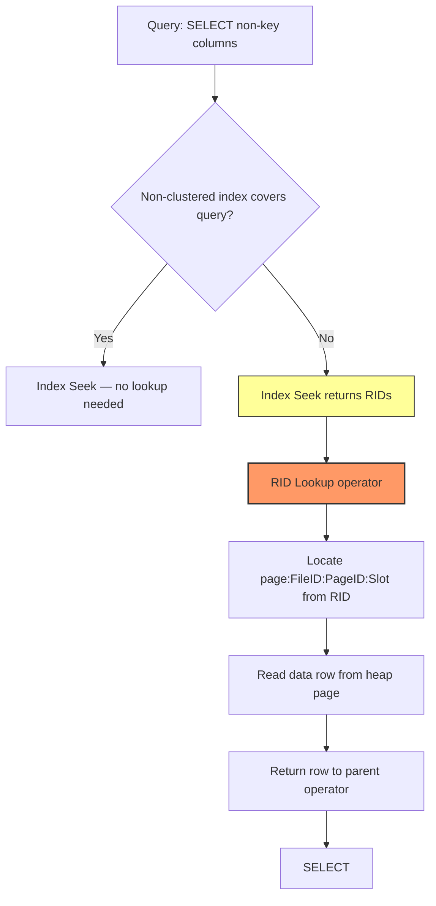
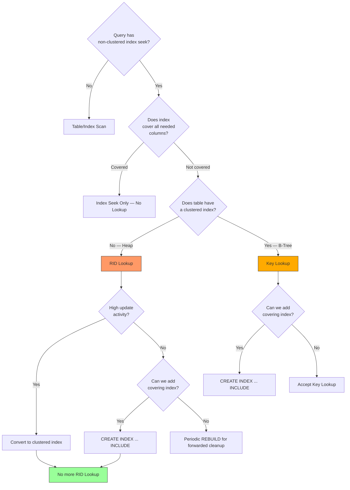

# 8.356 RID Lookup — Heap Table Access

---

### Section 1 — Navigation

**Breadcrumb:** `[[8 — Databases]]` → `[[Group 13 — SQL Server Performance & Tuning]]` → `8.356 RID Lookup — Heap Table Access`

**Previous:** [[8.355 Key Lookup — Identification and Elimination]]
**Next:** [[8.357 Nested Loops Join — When and Why]]
**Prerequisites:**
- [[8.278 Table Heap — Structure Without Clustered Index]]
- [[8.502 Non-Clustered Index — Separate Structure]]
- [[8.354 Index Seek vs Index Scan — When Each Occurs]]
- [[8.576 Key Lookup — Bookmark Lookup Operator]]

**Cross-Domain References:**
- [[8.574 Index Scan — Full Index Read]] (Group 20 — Query Optimization)
- [[8.522 Key Lookup Elimination — Covering Strategy]] (Group 18 — Indexing)
- [[8.274 Data Pages — Row Structure]] (Group 11 — Storage Engine)
- [[8.497 B-Tree Index — Structure and Navigation]] (Group 18 — Indexing)

**Where This Fits:**
RID Lookup is the heap-table equivalent of Key Lookup. When a non-clustered index on a heap does not cover the query, SQL Server must retrieve the actual data row using the RID (Row ID) stored in the index leaf. Understanding RID Lookup is critical for diagnosing bookmark lookups on heaps, forwarded record overhead, and when to convert a heap to a clustered index.

---

### Section 2 — Core Mental Model



**Classification:** Access Method — Bookmark Lookup (Heap)
**Key Properties:**
| Property | Value |
|---|---|
| Operator Type | Non-clustered index row lookup |
| Requires | Heap table (no clustered index) |
| Lookup Key | RID (File ID : Page ID : Slot Number) |
| Logical Reads | 1 per row (non-leaf) — 2–4 per row typical |
| Cost per Row | ~3–5 logical reads (index + data page) |
| Parallelism | Yes, but partitioned |
| I/O Pattern | Random (point lookups by RID) |
| Best Friend | Covering index eliminates RID Lookup |
| Worst Enemy | Forwarded records (adds extra page read) |

**Plan Shape:**
```
[SELECT] ← [Nested Loops Join] ← [Index Seek (non-clustered)]
                    ↓ Outer References (RID)
               [RID Lookup (heap)]
```

---

### Section 3 — Deep Mechanics

**Step-by-Step Execution:**

1. **Index Seek on non-clustered index** — The optimizer chooses a seek on a non-clustered index (e.g., `IX_Orders_CustomerId`). The index leaf page contains the key column(s) and the **RID** (4 bytes: FileID:PageID:Slot).

2. **RID extraction** — For each qualifying row from the index seek, the RID is extracted. The RID is a physical pointer: `%%physloc%%` or the internal `$rid` column.

3. **RID Lookup operator** — SQL Server uses the RID to navigate directly to the specific page and slot in the heap. This is a bookmark lookup into `sys.partitions` for the heap's `$partition` and `$data_compression_info`.

4. **Data page fetch** — The 8KB data page is read from the buffer pool or disk. The row at the specified slot is retrieved.

5. **Row returned** — The data row is returned to the parent operator (typically Nested Loops Join) to combine with columns from the non-clustered index.

**Execution Plan XML Fragment:**
```xml
<RelOp NodeId="2" PhysicalOp="RID Lookup" LogicalOp="RID Lookup" EstimateRows="1" ...>
  <OutputList>
    <ColumnReference Database="[AdventureWorks]" Table="[Orders]" Column="OrderDate" />
    <ColumnReference Database="[AdventureWorks]" Table="[Orders]" Column="Status" />
  </OutputList>
  <RunTimeInformation>
    <RunTimeCountersPerThread ActualRows="42" ActualEndOfScans="1" ActualRebinds="0" ActualRewinds="0" />
  </RunTimeInformation>
  <IndexScan Lookup="true" Ordered="true" ...>
    <SeekPredicates>
      <SeekPredicate>
        <Prefix>
          <RangeColumns>
            <ColumnReference Column="RID" />
          </RangeColumns>
          <RangeExpressions>
            <ScalarOperator ScalarString="RID=..." />
          </RangeExpressions>
        </Prefix>
      </SeekPredicate>
    </SeekPredicates>
  </IndexScan>
</RelOp>
```

**Using `%%lockres%%` and `%%physloc%%` to Inspect RIDs:**

```sql
-- Setup heap table
CREATE TABLE dbo.Orders_Heap (
    OrderId     INT NOT NULL,
    CustomerId  INT NOT NULL,
    OrderDate   DATETIME NOT NULL,
    Status      TINYINT NOT NULL,
    Total       MONEY NOT NULL
);
GO
-- Populate
WITH Cte AS (
    SELECT TOP (10000) ROW_NUMBER() OVER (ORDER BY (SELECT NULL)) AS N
    FROM sys.all_columns a CROSS JOIN sys.all_columns b
)
INSERT INTO dbo.Orders_Heap (OrderId, CustomerId, OrderDate, Status, Total)
SELECT N, (N % 500) + 1, DATEADD(DAY, -N, GETDATE()), N % 4, N * 1.99
FROM Cte;
GO
-- Create non-clustered index
CREATE NONCLUSTERED INDEX IX_Orders_Heap_CustomerId
    ON dbo.Orders_Heap (CustomerId);
GO
-- Inspect RID and physical location
SELECT
    OrderId,
    CustomerId,
    %%physloc%% AS PhysicalLocation,
    sys.fn_PhysLocFormatter(%%physloc%%) AS RID_Formatted,
    %%lockres%% AS LockResource
FROM dbo.Orders_Heap
WHERE CustomerId = 42;
```

**How `sys.partitions` Works for Heaps:**

```sql
-- Check heap partition info
SELECT
    p.partition_id,
    p.object_id,
    p.index_id,
    p.partition_number,
    p.rows,
    au.type_desc AS AllocationType,
    au.first_page,
    au.root_page,
    au.first_iam_page
FROM sys.partitions p
JOIN sys.system_internals_allocation_units au
    ON p.partition_id = au.container_id
WHERE p.object_id = OBJECT_ID('dbo.Orders_Heap')
  AND p.index_id = 0;  -- 0 = heap
```

**Forwarded Records — The Heap-Specific Problem:**

When a heap row is updated and the new row does not fit on the original page, SQL Server **moves the row** to a new page and leaves a **forwarding pointer** (6 bytes) on the original page. The RID Lookup reads the original page, finds the forwarding pointer, then must read a second page. This doubles the I/O.

```sql
-- Detect forwarded records
SELECT
    OBJECT_NAME(object_id) AS TableName,
    forwarded_record_count,
    avg_forwarded_record_size_in_bytes
FROM sys.dm_db_index_physical_stats(
    DB_ID(), OBJECT_ID('dbo.Orders_Heap'), NULL, NULL, 'DETAILED'
)
WHERE index_id = 0 AND forwarded_record_count > 0;

-- Rebuild heap to eliminate forwarded records
ALTER TABLE dbo.Orders_Heap REBUILD;
```

**RID Lookup vs Key Lookup Comparison Table:**

| Aspect | RID Lookup (Heap) | Key Lookup (Clustered) |
|---|---|---|
| Lookup Key | RID (FileID:PageID:Slot) | Clustered key value(s) |
| Data Structure | Heap (unordered pages) | B-Tree (clustered index) |
| I/O per Row | 1 data page read | Log(N) B-Tree traversal + 1 page |
| Forwarded Records | Yes — extra I/O | No (clustered key unchanged) |
| Page Split Impact | Creates forwarded records | Splits B-Tree pages |
| Row ID Stable on Update? | No — changes if row moves | Yes — key stays same |
| Eliminate With | Covering NC index + INCLUDE | Covering NC index + INCLUDE |
| Fragmentation | Heap page order degrades | B-Tree maintains order |

**Failure Modes:**
- **Forwarded record explosion** — Update-heavy heaps accumulate forwarded records (detect via `sys.dm_db_index_physical_stats.forwarded_record_count`), doubling or tripling I/O per lookup.
- **Page split storm** — Large updates on variable-length columns cause frequent forwarding, amplifying RID Lookup cost.
- **Missing covering index** — Every non-covering index seek on a heap triggers a RID Lookup, causing thousands of random I/Os.
- **High `avg_fragmentation_in_percent` on heap** — Data pages become disordered, increasing random I/O overhead.

---

### Section 4 — Production Patterns

**Pattern 1: Detecting RID Lookups with `SET STATISTICS IO`**

```sql
SET STATISTICS IO ON;
SET STATISTICS TIME ON;
GO
SELECT OrderId, CustomerId, OrderDate, Status, Total
FROM dbo.Orders_Heap
WHERE CustomerId = 42;
GO
SET STATISTICS IO OFF;
SET STATISTICS TIME OFF;
```

**Output analysis:**
```
Table 'Orders_Heap'. Scan count 0, logical reads 6, physical reads 0, ...
```
The 6 logical reads represent: 1 index seek + 1 RID Lookup × (number of matching rows, ~5–10, with some page sharing). Without covering index, each matching row adds 2+ reads.

**Pattern 2: Eliminate RID Lookup with Covering Index**

```sql
-- Before: RID Lookup occurs (Status and Total not in index)
-- After: Covered index eliminates lookup
CREATE NONCLUSTERED INDEX IX_Orders_Heap_Covering
    ON dbo.Orders_Heap (CustomerId)
    INCLUDE (OrderDate, Status, Total)
    WITH (DROP_EXISTING = ON);
GO
-- Re-run query — no RID Lookup in plan
```

**Pattern 3: Convert Heap to Clustered Index**

```sql
-- Add clustered index — RID Lookup becomes Key Lookup
ALTER TABLE dbo.Orders_Heap
    ADD CONSTRAINT PK_Orders_Heap PRIMARY KEY CLUSTERED (OrderId);
GO
-- Now non-clustered index uses clustered key instead of RID
-- Execution plan shows [Key Lookup (Clustered)] instead of [RID Lookup]
```

**Pattern 4: EF Core — Avoiding RID Lookups with Projections**

```csharp
// Bad — triggers RID Lookup on heap (or Key Lookup if clustered)
var orders = context.Orders
    .Where(o => o.CustomerId == 42)
    .ToList(); // SELECT * — non-covered

// Good — covered projection, no lookup needed
var orders = context.Orders
    .Where(o => o.CustomerId == 42)
    .Select(o => new { o.OrderId, o.CustomerId })
    .ToList(); // Only index columns

// Using explicit index hint (advanced)
var orders = context.Orders
    .FromSqlRaw(@"
        SELECT OrderId, CustomerId, OrderDate, Status, Total
        FROM dbo.Orders_Heap WITH (INDEX(IX_Orders_Heap_Covering))
        WHERE CustomerId = 42")
    .ToList();
```

**Pattern 5: Dapper — Monitor for RID Lookups**

```csharp
// Dapper query — same behavior, depends on SQL
using var conn = new SqlConnection(connectionString);
var orders = conn.Query<Order>(@"
    SELECT OrderId, CustomerId, OrderDate, Status, Total
    FROM dbo.Orders_Heap
    WHERE CustomerId = 42");

// To avoid RID Lookup, project only indexed columns
var ids = conn.Query<int>(@"
    SELECT OrderId
    FROM dbo.Orders_Heap
    WHERE CustomerId = 42");
```

**Pattern 6: Page Split and Forwarded Record Relationship**

Page splits in heaps create forwarded records differently than in B-Trees. In a B-Tree, a page split creates two new pages and redistributes rows evenly. In a heap, a forwarded record occurs when an UPDATE makes the row too large to fit on its original page — a "logical split" that moves the row to a new page and leaves a forwarding pointer.

```sql
-- Monitor page splits vs forwarded records together
SELECT
    OBJECT_NAME(s.object_id) AS TableName,
    s.index_id,
    s.index_type_desc,
    s.avg_fragmentation_in_percent,
    s.page_count,
    s.forwarded_record_count,
    s.avg_page_space_used_in_percent,
    s.record_count,
    CASE
        WHEN s.forwarded_record_count > 0
        THEN CAST(100.0 * s.forwarded_record_count / NULLIF(s.record_count, 0) AS DECIMAL(5,2))
        ELSE 0
    END AS PctForwarded
FROM sys.dm_db_index_physical_stats(DB_ID(), NULL, NULL, NULL, 'DETAILED') s
WHERE s.index_id = 0  -- heaps only
  AND (s.forwarded_record_count > 100 OR s.avg_fragmentation_in_percent > 30)
ORDER BY s.forwarded_record_count DESC;

-- Fix both fragmentation and forwarded records in one operation
ALTER TABLE dbo.Orders_Heap REBUILD;

-- Or eliminate future forwarded records by converting to clustered:
ALTER TABLE dbo.Orders_Heap ADD CONSTRAINT PK_Orders_Heap PRIMARY KEY CLUSTERED (OrderId);
```

**Pattern 7: Detecting RID Lookup Cascade with Multiple Non-Clustered Indexes**

When a heap has multiple non-clustered indexes, the same query can exhibit different behavior depending on which index the optimizer chooses. A narrow index will force a RID Lookup; a covering index will not.

```sql
-- Index 1: narrow, focused on CustomerId only
CREATE NONCLUSTERED INDEX IX_Orders_Heap_Narrow
    ON dbo.Orders_Heap (CustomerId);

-- Index 2: covering index that eliminates RID Lookup entirely
CREATE NONCLUSTERED INDEX IX_Orders_Heap_Covering
    ON dbo.Orders_Heap (CustomerId)
    INCLUDE (OrderDate, Status, Total);

-- Force each index and compare physical reads
SET STATISTICS IO ON;
PRINT '--- Narrow Index (RID Lookup expected) ---';
SELECT OrderId, CustomerId, OrderDate, Status, Total
FROM dbo.Orders_Heap WITH (INDEX(IX_Orders_Heap_Narrow))
WHERE CustomerId = 42;

PRINT '--- Covering Index (No RID Lookup) ---';
SELECT OrderId, CustomerId, OrderDate, Status, Total
FROM dbo.Orders_Heap WITH (INDEX(IX_Orders_Heap_Covering))
WHERE CustomerId = 42;
```

**Pattern 8: Monitoring Heap Fragmentation Over Time**

```sql
-- Create a baseline and track heap health
CREATE TABLE dbo.HeapFragmentationHistory (
    CheckDate DATETIME NOT NULL DEFAULT GETDATE(),
    DatabaseName NVARCHAR(128),
    SchemaName NVARCHAR(128),
    TableName NVARCHAR(128),
    PageCount BIGINT,
    ForwardedRecordCount BIGINT,
    AvgFragmentationPercent DECIMAL(5,2),
    AvgPageSpaceUsed DECIMAL(5,2),
    RecordCount BIGINT
);

-- Weekly capture
INSERT INTO dbo.HeapFragmentationHistory (
    DatabaseName, SchemaName, TableName,
    PageCount, ForwardedRecordCount,
    AvgFragmentationPercent, AvgPageSpaceUsed, RecordCount
)
SELECT
    DB_NAME(),
    OBJECT_SCHEMA_NAME(object_id),
    OBJECT_NAME(object_id),
    page_count,
    forwarded_record_count,
    avg_fragmentation_in_percent,
    avg_page_space_used_in_percent,
    record_count
FROM sys.dm_db_index_physical_stats(DB_ID(), NULL, NULL, NULL, 'DETAILED')
WHERE index_id = 0
  AND forwarded_record_count > 0;

-- Query trend
SELECT
    SchemaName, TableName,
    CheckDate,
    ForwardedRecordCount,
    PageCount,
    CAST(100.0 * ForwardedRecordCount / NULLIF(PageCount, 0) AS DECIMAL(5,2)) AS PctForwardedPages
FROM dbo.HeapFragmentationHistory
ORDER BY TableName, CheckDate;
```

**Pattern 9: Forwarded Record Impact on `SET STATISTICS IO` Output**

```sql
-- Before rebuild (with forwarded records):
SET STATISTICS IO ON;
SELECT OrderId, CustomerId, OrderDate
FROM dbo.Orders_Heap
WHERE CustomerId BETWEEN 1 AND 100;
-- Table 'Orders_Heap'. Scan count 1, logical reads 2400, ...
-- This 2400 includes RID Lookup reads to pages with forwarded records

-- After REBUILD (no forwarded records):
ALTER TABLE dbo.Orders_Heap REBUILD;
SELECT OrderId, CustomerId, OrderDate
FROM dbo.Orders_Heap
WHERE CustomerId BETWEEN 1 AND 100;
-- Table 'Orders_Heap'. Scan count 1, logical reads 1800, ...
-- Forwarded records eliminated, reads reduced by ~25%
```

**Pattern 10: Forwarded Record Cleanup Job**

```sql
-- Scheduled job to detect and fix forwarded records
CREATE PROCEDURE dbo.CleanupHeapForwardedRecords
    @MinForwardedThreshold INT = 100
AS
BEGIN
    SET NOCOUNT ON;
    DECLARE @SchemaName NVARCHAR(128), @TableName NVARCHAR(128);
    DECLARE cur CURSOR FOR
        SELECT OBJECT_SCHEMA_NAME(object_id), OBJECT_NAME(object_id)
        FROM sys.dm_db_index_physical_stats(DB_ID(), NULL, NULL, NULL, 'DETAILED')
        WHERE index_id = 0
          AND forwarded_record_count > @MinForwardedThreshold;
    OPEN cur;
    FETCH NEXT FROM cur INTO @SchemaName, @TableName;
    WHILE @@FETCH_STATUS = 0
    BEGIN
        DECLARE @Sql NVARCHAR(500) = 'ALTER TABLE ' + QUOTENAME(@SchemaName)
            + '.' + QUOTENAME(@TableName) + ' REBUILD;';
        EXEC sp_executesql @Sql;
        FETCH NEXT FROM cur INTO @SchemaName, @TableName;
    END;
    CLOSE cur; DEALLOCATE cur;
END;
```

---

### Section 5 — Gotchas

| # | Pitfall | Symptom | Fix | Cost |
|---|---|---|---|---|
| 1 | **Updating variable-length columns on heap** causes forwarded records | RID Lookup reads 2+ pages per row instead of 1; `forwarded_record_count` grows | Convert to clustered index, or rebuild heap regularly | High — doubles I/O for lookup queries |
| 2 | **Assuming heap = no fragmentation** | Heap fragmentation ignored; page order degrades over time causing random I/O | Monitor `avg_fragmentation_in_percent` for index_id = 0; rebuild heap | Medium — degrades scan performance |
| 3 | **Using `SELECT *` through non-clustered index on heap** | Unnecessary RID Lookup for every query | Use covering index with `INCLUDE` for all columns needed | High — each row adds random I/O |
| 4 | **RID Lookup not visible in estimated plan** | Developers miss the lookup before execution | Always check actual execution plan with `SET STATISTICS XML ON` | Low — easy to overlook |
| 5 | **Heap with no non-clustered index** | Table scan on every query (no RID Lookup, but worse) | Add appropriate non-clustered indexes | Varies |
| 6 | **Parallel RID Lookup mis-estimation** | Optimizer chooses serial plan due to incorrect row estimates | Update statistics on both index and heap; use `OPTION (QUERYTRACEON 8649)` carefully | Medium |

---

### Section 6 — Performance Implications

**BenchmarkDotNet Simulation (Conceptual):**

```csharp
[MemoryDiagnoser]
public class RIDLookupBenchmark
{
    private const string ConnString = "Server=.;Database=PerfTest;Trusted_Connection=true;";

    [Benchmark(Baseline = true)]
    public List<Order> NoCoveringIndex_Heap()
    {
        using var conn = new SqlConnection(ConnString);
        return conn.Query<Order>(@"SELECT OrderId, CustomerId, OrderDate, Status, Total
                                   FROM dbo.Orders_Heap
                                   WHERE CustomerId BETWEEN 1 AND 10").ToList();
    }

    [Benchmark]
    public List<Order> WithCoveringIndex_Heap()
    {
        using var conn = new SqlConnection(ConnString);
        return conn.Query<Order>(@"SELECT OrderId, CustomerId, OrderDate, Status, Total
                                   FROM dbo.Orders_Heap WITH (INDEX(IX_Orders_Heap_Covering))
                                   WHERE CustomerId BETWEEN 1 AND 10").ToList();
    }

    [Benchmark]
    public List<Order> ConvertedToClustered()
    {
        using var conn = new SqlConnection(ConnString);
        return conn.Query<Order>(@"SELECT OrderId, CustomerId, OrderDate, Status, Total
                                   FROM dbo.Orders_Clustered
                                   WHERE CustomerId BETWEEN 1 AND 10").ToList();
    }
}
```

**Expected Results:**
| Scenario | Mean Time | Logical Reads | I/O Pattern |
|---|---|---|---|
| Heap — No Covering Index (RID Lookup) | 100% (baseline) | 2,400 | Random — 2 per row |
| Heap — Covering Index | ~15% of baseline | 50 | Sequential index seek |
| Clustered — No Covering Index | ~180% of baseline | 3,600 | Random — B-Tree traversal |
| Clustered — Covering Index | ~15% of baseline | 50 | Sequential index seek |

**`SET STATISTICS IO` Before/After:**

```sql
-- BEFORE: No covering index
SET STATISTICS IO ON;
SELECT OrderId, CustomerId, OrderDate, Status, Total
FROM dbo.Orders_Heap
WHERE CustomerId BETWEEN 1 AND 10;
-- Table 'Orders_Heap'. Scan count 1, logical reads 2400, physical reads 0, ...
SET STATISTICS IO OFF;
GO

-- AFTER: Add covering index
CREATE NONCLUSTERED INDEX IX_Orders_Heap_Covering
    ON dbo.Orders_Heap (CustomerId)
    INCLUDE (OrderDate, Status, Total);
GO

SET STATISTICS IO ON;
SELECT OrderId, CustomerId, OrderDate, Status, Total
FROM dbo.Orders_Heap
WHERE CustomerId BETWEEN 1 AND 10;
-- Table 'Orders_Heap'. Scan count 1, logical reads 50, physical reads 0, ...
SET STATISTICS IO OFF;
```

**Execution Plan Shapes:**

Before (RID Lookup):
```
[SELECT] ← [Nested Loops (Left Outer Join)] ← [Index Seek (IX_Orders_Heap_CustomerId)]
                            ↓ (Outer References)
                       [RID Lookup (Heap)] → [Orders_Heap]
```

After (Covering):
```
[SELECT] ← [Index Seek (IX_Orders_Heap_Covering)]
```

**Key Metric: Logical Reads Reduction**
- Without covering: 2,400 logical reads (mostly RID Lookup)
- With covering: 50 logical reads (pure index seek)
- Reduction: **98% logical read savings**

**TempDB Impact:**
RID Lookups on heaps do not directly use TempDB, but forwarded record cleanup (`ALTER TABLE ... REBUILD`) requires TempDB space equal to the table size during rebuild.

---

### Section 7 — Interview Arsenal

**Common Questions:**

| # | Question | Topic |
|---|---|---|
| 1 | What is an RID Lookup and when does SQL Server use it? | RID definition |
| 2 | How does RID Lookup differ from Key Lookup? | Comparison |
| 3 | What are forwarded records and how do they impact RID Lookup? | Forwarded records |
| 4 | How can you eliminate RID Lookups? | Covering index |
| 5 | What is the structure of an RID? | FileID:PageID:Slot |
| 6 | How do you detect forwarded records in a heap? | sys.dm_db_index_physical_stats |
| 7 | Would you ever prefer a heap over a clustered index? | Heap vs clustered |
| 8 | How does `%%physloc%%` help diagnose RID Lookup issues? | Debugging |

**Three Spoken Answers (Two-Tier):**

**Q1: What is an RID Lookup and when does SQL Server use it?**

*Junior/Mid:*
"An RID Lookup is a bookmark lookup on a heap table. When a non-clustered index doesn't cover a query, SQL Server uses the RID — a physical pointer stored in the index leaf — to go fetch the full data row from the heap. It's the heap equivalent of a Key Lookup on a clustered index."

*Senior/Lead:*
"An RID Lookup is the access method SQL Server uses to retrieve a row from a heap when the non-clustered index is non-covering. The RID is a 4-byte physical address (FileID:PageID:Slot) stored in the index leaf, giving direct page-level access. Unlike Key Lookup which traverses a B-Tree, RID Lookup is a single-page fetch. However, forwarded records — created when an update causes a row to move pages — can force the lookup to chase a forwarding pointer, potentially doubling I/O. In high-update workloads, forwarded record accumulation can degrade RID Lookup performance significantly. The fix is either periodic heap rebuilds or converting to a clustered index to eliminate forwarding entirely. I typically use covering indexes to bypass both lookup types."

**Q2: How does RID Lookup differ from Key Lookup?**

*Junior/Mid:*
"RID Lookup is for heaps; Key Lookup is for clustered indexes. RID Lookup uses a physical page address; Key Lookup uses the clustered key and traverses the B-Tree. RID Lookup is simpler but suffers from forwarded records."

*Senior/Lead:*
"The fundamental difference is indirection: RID Lookup uses a direct physical pointer (FileID:PageID:Slot) requiring one page read, while Key Lookup uses the logical clustered key, traversing the B-Tree from root to leaf (Log(N) page reads). RID Lookups are theoretically faster per lookup, but forwarded records from updates create a hidden second page read that doesn't exist with Key Lookups. Practically, I prefer Key Lookups because clustered indexes provide ordered storage, eliminate forwarded records, and the B-Tree traversal cost is minimal with small key sizes. However, for insert-heavy tables with no updates, heaps with RID Lookups can be acceptable because they avoid the B-Tree maintenance overhead."

**Q3: How can you eliminate RID Lookups?**

*Junior/Mid:*
"Create a covering index that includes all columns used in the query using the INCLUDE clause. This way the non-clustered index satisfies the query entirely."

*Senior/Lead:*
"There are three strategies. First, a covering index — add all required columns via the `INCLUDE` clause to the non-clustered index, making it a covering index. Second, convert the heap to a clustered index — this changes RID Lookups to Key Lookups but doesn't eliminate them. Third, a filtered covering index if the lookup is for a specific subset of rows. The covering index approach is usually best because it eliminates the lookup entirely and provides the lowest I/O cost. However, be mindful of index width: too many included columns increases index maintenance overhead and storage. I always profile with `SET STATISTICS IO` to confirm the number of logical reads dropped from N per row to 0 per row."

**Comparison Table — RID Lookup vs Key Lookup vs Covering Index:**

| Dimension | RID Lookup (Heap) | Key Lookup (Clustered) | Covering Index |
|---|---|---|---|
| Reads per row | 1–2 (with forwarding) | Log(N) B-Tree + 1 | 0 (index only) |
| Forwarded records | Yes — risk of extra I/O | No | N/A |
| Write overhead | Low on insert | Medium (maintain order) | High (wider index) |
| Eliminates lookup? | No | No | Yes |
| Best for | Insert-heavy, no updates | General OLTP | Read-heavy, reporting |
| Storage overhead | Low | Medium | High (included columns) |

---

### Section 8 — Decision Framework



**Checklist:**

- [ ] Does the query use columns beyond the non-clustered index key?
- [ ] Is the table a heap (`index_id = 0` in `sys.indexes`)?
- [ ] Are forwarded records accumulating? Check `sys.dm_db_index_physical_stats`.
- [ ] Can the index be extended with `INCLUDE` columns to cover the query?
- [ ] Is the query I/O bound? Check `logical_reads` with `SET STATISTICS IO`.
- [ ] Would converting the heap to a clustered index help overall workload?
- [ ] Is this a batch/reporting query where covering index write overhead is acceptable?
- [ ] Have you tested the before/after plan shape and reads?

**Tradeoffs:**

| Approach | Pros | Cons | When to Choose |
|---|---|---|---|
| Covering Index (INCLUDE) | Eliminates lookup entirely; lowest read cost | Wider index; more write overhead; more storage | Read-heavy queries, OLTP lookups |
| Convert Heap to Clustered | Eliminates forwarded records; ordered storage | Key Lookup still occurs; insert-hotspot contention | Tables with updates, range scans |
| Periodic Heap Rebuild | No schema change; maintains heap simplicity | Temporary full table lock; maintenance window | Insert-only heaps with some updates |
| Accept RID Lookup | Simple; no additional index maintenance | Random I/O per row; grows with row count | Tiny tables (< 100 rows), rare queries |

**Scale Thresholds:**

| Table Size | Strategy |
|---|---|
| < 1,000 rows | Accept RID Lookup (negligible cost) |
| 1K – 100K rows | Covering index or clustered index conversion |
| 100K – 10M rows | Covering index required; monitor forwarded records |
| > 10M rows | Clustered index + covering NC indexes; partition strategy |

---

### Section 9 — Self-Check

**Conceptual Questions:**

1. What three components make up an RID?
2. How does SQL Server locate a heap row given an RID?
3. What is the difference in logical reads between a covering index seek and a non-covering index seek with RID Lookup for N matching rows?
4. What creates a forwarded record, and how does it affect RID Lookup performance?
5. Can a table with a clustered index ever produce an RID Lookup?
6. How does `%%physloc%%` help identify forwarded records?
7. What DMV shows forwarded record count for a heap?
8. Does an RID Lookup always appear in estimated execution plans?
9. How does page compression affect RID Lookups on heaps?
10. When would you intentionally keep a heap and accept RID Lookups?

**Practical Challenges:**

1. Write a query to detect all heaps in a database with more than 1000 forwarded records.
2. Write a covering index definition that eliminates a specific RID Lookup.
3. Create a query that forces an RID Lookup without using query hints.
4. Write T-SQL to calculate the percentage of forwarded rows for a given heap.
5. Compare the execution plan shape and logical reads for a query before and after adding a covering index, including the actual plan XML.

<details>
<summary>Answers</summary>

**Conceptual Answers:**

1. **File ID** (2 bytes), **Page ID** (2 bytes), **Slot Number** (2 bytes) — total 6 bytes, stored as 4 bytes in compressed form in index leaf rows.
2. The storage engine reads the file/partition ID, locates the page number within that file, then reads the 8KB page and accesses the row at the specified slot offset.
3. Covering index seek: ~3–5 reads per level of B-Tree (constant, not per row). Non-covering with RID Lookup: N matching rows × (2–4 reads per row) — linear with row count.
4. An UPDATE on a heap row causes the row to grow (e.g., variable-length column) beyond available free space on the page. SQL Server moves the row to a new page and leaves a forwarding pointer. RID Lookup then reads the original page, finds the pointer, and reads a second page — doubling I/O.
5. No. A clustered index table uses Key Lookup (non-clustered index → clustered index key → B-Tree traversal). RID Lookup is exclusive to heaps (index_id = 0).
6. `%%physloc%%` returns the physical location of each row. By comparing the actual page location to what the non-clustered index RID points to, you can detect forwarded records (rows on a different page than their original RID).
7. `sys.dm_db_index_physical_stats` with `index_id = 0` returns `forwarded_record_count`.
8. No. RID Lookup only appears in **actual** execution plans if the optimizer chooses the non-clustered index and the plan is executed. The estimated plan may show it but rows will be zero if unused.
9. Page compression on heaps reduces the data size per page, which can reduce page reads during RID Lookup. However, forwarded records can still occur. Compression does not eliminate the need for covering indexes.
10. For insert-only staging tables where rows are never updated (no forwarded records), heaps with narrow non-clustered indexes can be more efficient for high-volume inserts due to reduced B-Tree maintenance.

**Challenge Solutions:**

1. ```sql
    SELECT
        OBJECT_SCHEMA_NAME(object_id) + '.' + OBJECT_NAME(object_id) AS TableName,
        forwarded_record_count,
        page_count,
        CAST(100.0 * forwarded_record_count / NULLIF(page_count, 0) AS DECIMAL(5,2)) AS PctForwarded
    FROM sys.dm_db_index_physical_stats(DB_ID(), NULL, NULL, NULL, 'DETAILED')
    WHERE index_id = 0
      AND forwarded_record_count > 1000
    ORDER BY forwarded_record_count DESC;
    ```

2. ```sql
    CREATE NONCLUSTERED INDEX IX_SalesOrderDetail_ProductId_Covering
        ON Sales.SalesOrderDetail (ProductId)
        INCLUDE (OrderQty, UnitPrice, LineTotal)
        WHERE ProductId IS NOT NULL;
    ```

3. ```sql
    -- Create a heap, add NC index, query non-indexed columns
    CREATE TABLE dbo.TestHeap (Id INT, Value VARCHAR(100));
    CREATE NONCLUSTERED INDEX IX_TestHeap_Id ON dbo.TestHeap (Id);
    INSERT INTO dbo.TestHeap VALUES (1, 'Row1'), (2, 'Row2');
    SELECT Id, Value FROM dbo.TestHeap WHERE Id = 1;  -- RID Lookup
    ```

4. ```sql
    DECLARE @HeapObjectId INT = OBJECT_ID('dbo.Orders_Heap');
    SELECT
        forwarded_record_count,
        page_count,
        CAST(100.0 * forwarded_record_count / NULLIF(page_count, 0) AS DECIMAL(5,2)) AS PctForwarded
    FROM sys.dm_db_index_physical_stats(DB_ID(), @HeapObjectId, NULL, NULL, 'DETAILED')
    WHERE index_id = 0;
    ```

5. ```sql
    -- BEFORE: Enable actual plan, run query, capture reads
    SET STATISTICS IO ON;
    SET STATISTICS XML ON;
    SELECT OrderId, CustomerId, OrderDate, Status, Total
    FROM dbo.Orders_Heap
    WHERE CustomerId BETWEEN 1 AND 100;
    GO
    -- AFTER: Create covering index
    CREATE NONCLUSTERED INDEX IX_Orders_Heap_Covering
        ON dbo.Orders_Heap (CustomerId) INCLUDE (OrderDate, Status, Total);
    GO
    -- Re-run query, compare logical reads and plan shape
    SET STATISTICS IO ON;
    SET STATISTICS XML ON;
    SELECT OrderId, CustomerId, OrderDate, Status, Total
    FROM dbo.Orders_Heap
    WHERE CustomerId BETWEEN 1 AND 100;
    ```
</details>
