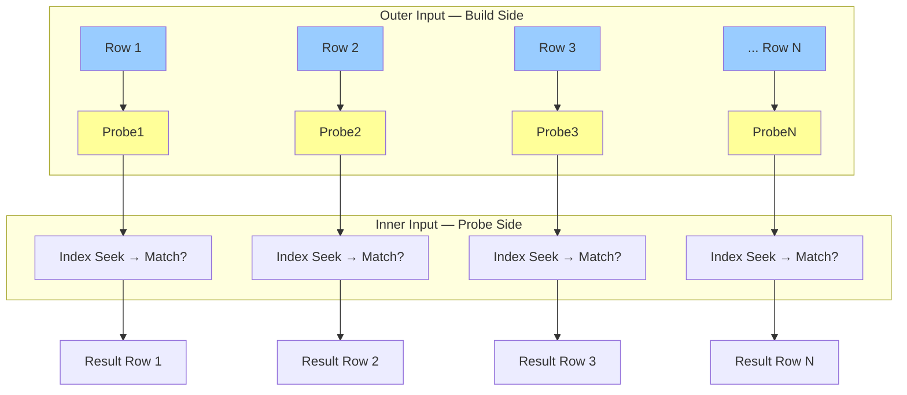
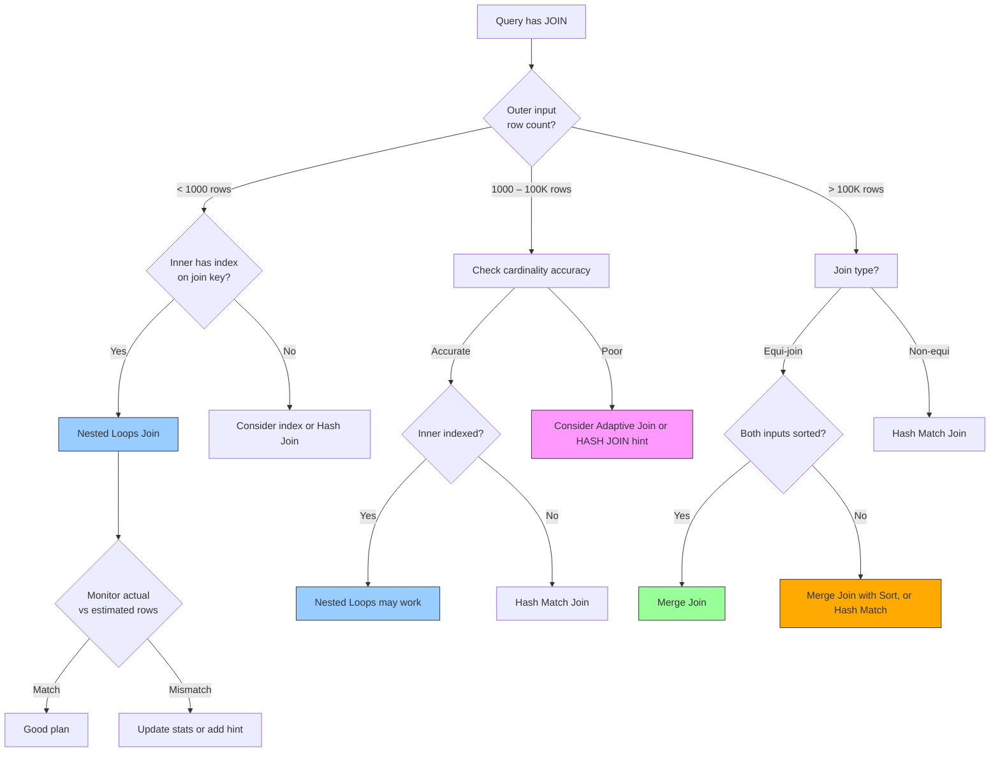

# 8.357 Nested Loops Join — When and Why

---

### Section 1 — Navigation

**Breadcrumb:** `[[8 — Databases]]` → `[[Group 13 — SQL Server Performance & Tuning]]` → `8.357 Nested Loops Join — When and Why`

**Previous:** [[8.356 RID Lookup — Heap Table Access]]
**Next:** [[8.358 Hash Match Join — Memory Grants and Spills]]
**Prerequisites:**
- [[8.577 Nested Loops Join — Small Outer, Large Inner]] (Group 20)
- [[8.504 Composite Index — Column Order Rules]]
- [[8.354 Index Seek vs Index Scan — When Each Occurs]]
- [[8.501 Clustered Index — Physical Row Order]]

**Cross-Domain References:**
- [[8.346 Plan Cache — How SQL Server Reuses Plans]] (Group 13)
- [[8.567 Join Reordering — Optimizer Freedom]] (Group 20 — Query Optimization)
- [[8.618 Optimistic Concurrency in EF Core — ConcurrencyToken]] (Group 21 — Transactions)
- [[8.873 Dapper — Performance — IL Emit Internals]] (Group 30 — Dapper)

**Where This Fits:**
Nested Loops Join is the simplest join algorithm — for each row in the outer (build) input, probe the inner (probe) input. It excels when the outer input is small and the inner input has an index supporting efficient seeks. Understanding when the optimizer chooses Nested Loops vs Hash vs Merge is fundamental to query performance tuning.

---

### Section 2 — Core Mental Model



**Classification:** Join Algorithm — Row-by-Row Iteration
**Key Properties:**

| Property | Value |
|---|---|
| Complexity | O(N × M) worst-case; O(N × log M) with index |
| Outer Input | "Build" side — iterated once per row |
| Inner Input | "Probe" side — probed for each outer row |
| Best When | Outer < 1000 rows, inner has index |
| Worst When | Outer large, or inner no index → O(N×M) scan |
| Memory Required | Minimal (no hash table, no sort) |
| TempDB Usage | None |
| Parallelism | Yes (outer rows distributed) |
| Join Types | Inner, Left Outer, Semi, Anti-Semi |
| Equality Required? | No — supports inequality predicates |

**Execution Plan Shape (Text):**
```
[SELECT] ← [Nested Loops (Inner Join)]
                  ↓ (Outer References)
             [Index Seek (TableA)] ← (outer)
             [Index Seek (TableB)] ← (inner with seek predicate)
```

**Actual Execution Plan XML Key Attributes:**
```xml
<RelOp NodeId="3" PhysicalOp="Nested Loops" LogicalOp="Inner Join">
  <RunTimeInformation>
    <RunTimeCountersPerThread ActualRows="5000" ActualEndOfScans="1" />
  </RunTimeInformation>
  <NestedLoops Optimized="false" WithUnorderedPrefetch="false">
    <OuterReferences>
      <ColumnReference Column="CustomerId" />
    </OuterReferences>
  </NestedLoops>
  ...
</RelOp>
```

---

### Section 3 — Deep Mechanics

**Step-by-Step Execution:**

1. **Build outer input** — SQL Server reads the outer (build) input, typically the smaller table. If no hints, the optimizer chooses the join order based on cardinality estimates.

2. **Row iteration** — Each row from the outer input is processed one at a time. The outer row's join key(s) are extracted.

3. **Probe inner input** — For each outer row, the inner input is probed. If an index exists on the inner join key, an **Index Seek** is performed using the outer row's key value as a seek predicate. If no index exists, a full **Table/Index Scan** occurs per outer row.

4. **Match evaluation** — The join predicate is evaluated. For inner joins, matching rows are concatenated and returned. For outer joins, NULL-extended rows are returned for non-matching outer rows.

5. **Row returned** — The concatenated row passes to the parent operator.

**With Index on Inner Table (Efficient):**

```
[SELECT] ← [Nested Loops] ← [Index Seek — Outer (10 rows)]
                  ↓
             [Index Seek — Inner (seek per row, ~3 logical reads each)]
```

Total complexity: 10 index seeks × 3 reads = ~30 logical reads.

**Without Index on Inner Table (Inefficient):**

```
[SELECT] ← [Nested Loops] ← [Table Scan — Outer (10 rows)]
                  ↓
             [Table Scan — Inner (100K rows × 10)]
```

Total complexity: 10 × 100K = 1,000,000 row comparisons. This is the worst case.

**Execution Plan Exploration:**

```sql
-- Setup tables for demo
CREATE TABLE dbo.Orders (
    OrderId INT IDENTITY PRIMARY KEY,
    CustomerId INT NOT NULL,
    OrderDate DATETIME NOT NULL,
    Total MONEY NOT NULL
);
CREATE TABLE dbo.Customers (
    CustomerId INT IDENTITY PRIMARY KEY,
    Name NVARCHAR(100) NOT NULL,
    Email NVARCHAR(200)
);

-- Insert data
WITH Nums AS (
    SELECT TOP (10000) ROW_NUMBER() OVER (ORDER BY (SELECT NULL)) AS N
    FROM sys.all_columns a CROSS JOIN sys.all_columns b
)
INSERT INTO dbo.Customers (Name, Email)
SELECT 'Customer ' + CAST(N AS VARCHAR(10)), 'email' + CAST(N AS VARCHAR(10)) + '@test.com'
FROM Nums;

WITH Nums AS (
    SELECT TOP (100000) ROW_NUMBER() OVER (ORDER BY (SELECT NULL)) AS N
    FROM sys.all_columns a CROSS JOIN sys.all_columns b CROSS JOIN sys.all_columns c
)
INSERT INTO dbo.Orders (CustomerId, OrderDate, Total)
SELECT (N % 10000) + 1, DATEADD(DAY, -N, GETDATE()), N * 1.99
FROM Nums;
GO

-- Create index on Orders.CustomerId (no covering — Total is fetched via Key Lookup)
CREATE INDEX IX_Orders_CustomerId ON dbo.Orders (CustomerId);
GO
```

**Query with Nested Loops:**

```sql
-- Query that triggers Nested Loops
SELECT c.Name, o.OrderDate, o.Total
FROM dbo.Customers c
JOIN dbo.Orders o ON o.CustomerId = c.CustomerId
WHERE c.CustomerId BETWEEN 1 AND 10;
```

**Actual plan:**
```
[SELECT] ← [Nested Loops (Inner Join)] ← [Index Seek — PK_Customers (10 rows)]
                  ↓ (Outer References: CustomerId)
             [Index Seek — IX_Orders_CustomerId (seek)]
                  ↓
             [Key Lookup — PK_Orders (fetch Total)]
```

**Failure Modes:**
- **No index on inner** — The optimizer might still choose Nested Loops if estimates are very wrong. This results in a full scan of the inner table per outer row.
- **Cardinality misestimate** — If the optimizer thinks outer is 10 rows but it's actually 1M rows, Nested Loops becomes catastrophic (1M × row scans).
- **Outer table too large** — Even with indexed inner, 100K outer rows × index seeks = high I/O.
- **Key Lookup amplification** — Index seek on inner + Key Lookup per seek can multiply I/O further.

---

### Section 4 — Production Patterns

**Pattern 1: Identifying Nested Loops in Query Plans**

```sql
-- Find queries with Nested Loops from plan cache
SELECT
    qs.query_hash,
    qs.total_logical_reads,
    qs.total_elapsed_time,
    SUBSTRING(st.text, (qs.statement_start_offset/2) + 1,
        ((CASE WHEN qs.statement_end_offset = -1
               THEN DATALENGTH(st.text)
               ELSE qs.statement_end_offset END
          - qs.statement_start_offset)/2) + 1) AS statement_text,
    qp.query_plan
FROM sys.dm_exec_query_stats qs
CROSS APPLY sys.dm_exec_sql_text(qs.sql_handle) st
CROSS APPLY sys.dm_exec_query_plan(qs.plan_handle) qp
WHERE qp.query_plan.value('
    declare namespace p="http://schemas.microsoft.com/sqlserver/2004/07/showplan";
    count(//p:RelOp[@PhysicalOp="Nested Loops"])', 'int') > 0
ORDER BY qs.total_logical_reads DESC;
```

**Pattern 2: Outer Join with Nested Loops**

```sql
-- LEFT JOIN typically uses Nested Loops for the outer side
SELECT c.Name, o.OrderDate
FROM dbo.Customers c
LEFT JOIN dbo.Orders o ON o.CustomerId = c.CustomerId
WHERE c.CustomerId BETWEEN 1 AND 100;

-- Plan: Nested Loops Left Outer Join
-- Outer: Index Seek on Customers (100 rows)
-- Inner: Index Seek on Orders (may return 0 rows for unmatched)
```

**Pattern 3: Semi Join (EXISTS) Uses Nested Loops**

```sql
-- EXISTS becomes Nested Loops Semi Join
SELECT c.CustomerId, c.Name
FROM dbo.Customers c
WHERE EXISTS (
    SELECT 1
    FROM dbo.Orders o
    WHERE o.CustomerId = c.CustomerId
      AND o.Total > 1000
);

-- Plan: Nested Loops (Left Semi Join)
-- More efficient than INNER JOIN because it stops after first match per outer row
```

**Pattern 4: EF Core — Controlling Join Strategy**

```csharp
// EF Core generates LEFT JOIN for navigation properties
// This often becomes Nested Loops if one side is small

// Bad — N+1 via lazy loading (each loop triggers separate query)
foreach (var customer in context.Customers.Take(10))
{
    foreach (var order in customer.Orders)  // Separate round trip each time
    {
        Console.WriteLine(order.Total);
    }
}

// Good — Eager loading uses JOIN (likely Nested Loops)
var customers = context.Customers
    .Where(c => c.CustomerId <= 10)
    .Include(c => c.Orders)
    .ToList();

// Good — Projection reduces columns, avoids Key Lookup
var data = context.Customers
    .Where(c => c.CustomerId <= 10)
    .Select(c => new {
        c.Name,
        Orders = c.Orders.Select(o => new { o.OrderDate, o.Total })
    })
    .ToList();
```

**Pattern 5: Dapper — Manual Query Control**

```csharp
// Dapper — explicit join control
using var conn = new SqlConnection(connectionString);

// Nested Loops friendly — small outer set
var customers = await conn.QueryAsync<Customer>(
    "SELECT * FROM Customers WHERE CustomerId BETWEEN 1 AND 10");

foreach (var c in customers)
{
    // This is the N+1 problem — each loop triggers a query
    // Better to JOIN in a single query
    c.Orders = (await conn.QueryAsync<Order>(
        "SELECT * FROM Orders WHERE CustomerId = @Id AND Total > 1000",
        new { Id = c.CustomerId })).ToList();
}

// Better — single query with JOIN
var results = await conn.QueryAsync<Customer, Order, Customer>(
    @"SELECT c.*, o.*
      FROM Customers c
      INNER JOIN Orders o ON o.CustomerId = c.CustomerId
      WHERE c.CustomerId BETWEEN 1 AND 10 AND o.Total > 1000",
    (c, o) => { c.Orders.Add(o); return c; },
    splitOn: "OrderId");
```

**Pattern 6: Forcing Join Order with Query Hints**

```sql
-- Force Nested Loops with specific join order
SELECT c.Name, o.OrderDate
FROM dbo.Customers c
INNER LOOP JOIN dbo.Orders o ON o.CustomerId = c.CustomerId
WHERE c.CustomerId BETWEEN 1 AND 10
OPTION (FORCE ORDER);

-- Or use OPTION (LOOP JOIN) to prefer Nested Loops for entire query
SELECT c.Name, o.OrderDate
FROM dbo.Customers c
JOIN dbo.Orders o ON o.CustomerId = c.CustomerId
WHERE c.CustomerId BETWEEN 1 AND 10
OPTION (LOOP JOIN);
```

---

### Section 5 — Gotchas

| # | Pitfall | Symptom | Fix | Cost |
|---|---|---|---|---|
| 1 | **No index on inner join column** | Every outer row triggers full inner table scan; high logical reads, long duration | Add index on inner table's join key | Catastrophic — O(N×M) |
| 2 | **Cardinality misestimate (outer appears small but is large)** | Nested Loops chosen for 1M outer rows; query runs for minutes | Update statistics; use `OPTION (HASH JOIN)` if needed | Very High |
| 3 | **N+1 from ORM lazy loading** | Hundreds of separate queries instead of one JOIN | Use `Include()` (EF Core) or single query (Dapper) | High (network round-trips) |
| 4 | **Nested Loops with large outer but good index** | Looks efficient but still high cumulative seek cost for 100K+ rows | Consider Hash Join or Merge Join for large sets | Medium |
| 5 | **Key Lookup cascading from inner seek** | Each Nested Loops iteration includes a Key Lookup — hidden I/O amplification | Add covering index on inner table | High |
| 6 | **Nested Loops chosen for non-equi join** | Scans inner for each outer row since index seek can't help for inequality | Ensure inner table smal or use Hash Join hint | High |
| 7 | **Parameter sniffing with Nested Loops** | Plan cached for small-parameter outer, reused for large-parameter causing Nested Loops on huge set | `OPTION (RECOMPILE)` or `OPTIMIZE FOR` | High |
| 8 | **Parallel Nested Loops with prefetch** | `WithUnorderedPrefetch` can cause excessive I/O if inner table is large | Consider MAXDOP 1 or adjust | Medium |

---

### Section 6 — Performance Implications

**BenchmarkDotNet Simulation:**

```csharp
[MemoryDiagnoser]
public class NestedLoopsBenchmark
{
    private const string Conn = "Server=.;Database=PerfTest;Trusted_Connection=true;";

    [Benchmark(Baseline = true)]
    public List<Result> SmallOuter_IndexedInner()
    {
        using var c = new SqlConnection(Conn);
        return c.Query<Result>(@"
            SELECT c.Name, o.OrderDate, o.Total
            FROM Customers c
            JOIN Orders o ON o.CustomerId = c.CustomerId
            WHERE c.CustomerId BETWEEN 1 AND 10  -- 10 outer rows
        ").ToList();
    }

    [Benchmark]
    public List<Result> LargeOuter_IndexedInner()
    {
        using var c = new SqlConnection(Conn);
        return c.Query<Result>(@"
            SELECT c.Name, o.OrderDate, o.Total
            FROM Customers c
            JOIN Orders o ON o.CustomerId = c.CustomerId
            WHERE c.CustomerId BETWEEN 1 AND 5000  -- 5000 outer rows
        ").ToList();
    }

    [Benchmark]
    public List<Result> LargeOuter_NoIndexInner()
    {
        using var c = new SqlConnection(Conn);
        return c.Query<Result>(@"
            SELECT c.Name, o.OrderDate, o.Total
            FROM Customers c
            JOIN Orders_NoIndex o ON o.CustomerId = c.CustomerId
            WHERE c.CustomerId BETWEEN 1 AND 10
        ").ToList();
    }
}
```

**Expected Benchmark Results:**

| Scenario | Mean Time | Logical Reads | I/O Pattern |
|---|---|---|---|
| Small outer (10 rows) + Indexed inner | ~2 ms (baseline) | ~50 | Index seeks × 10 |
| Large outer (5K rows) + Indexed inner | ~950 ms (475x) | ~25,000 | Index seeks × 5K |
| Large outer (10 rows) + No index inner | ~15,000 ms (7500x) | ~1,000,000+ | Full scan × 10 |

**`SET STATISTICS IO` Comparison:**

```sql
-- Efficient Nested Loops
SET STATISTICS IO ON;
SELECT c.Name, o.OrderDate, o.Total
FROM dbo.Customers c
JOIN dbo.Orders o ON o.CustomerId = c.CustomerId
WHERE c.CustomerId BETWEEN 1 AND 10;

/*
Table 'Orders'. Scan count 10, logical reads 30, ...
Table 'Customers'. Scan count 1, logical reads 2, ...
Total logical reads: 32
*/

-- Inefficient (no index on inner)
-- Drop index first: DROP INDEX IX_Orders_CustomerId ON dbo.Orders
SET STATISTICS IO ON;
SELECT c.Name, o.OrderDate, o.Total
FROM dbo.Customers c
JOIN dbo.Orders o ON o.CustomerId = c.CustomerId
WHERE c.CustomerId BETWEEN 1 AND 10;

/*
Table 'Orders'. Scan count 10, logical reads 25000, ...  ← 10 full scans
Table 'Customers'. Scan count 1, logical reads 2, ...
Total logical reads: 25002
*/
```

**Cost Breakdown:**

| Factor | Small Outer + Index | Large Outer + Index | Small Outer + No Index |
|---|---|---|---|
| Outer Reads | 2 (index seek) | 2 (index seek) | 2 (index seek) |
| Inner Reads per Row | ~3 (index seek) | ~3 (index seek) | ~2500 (full scan) |
| Total Inner Reads | 10 × 3 = 30 | 5000 × 3 = 15,000 | 10 × 2500 = 25,000 |
| Total Reads | 32 | 15,002 | 25,002 |
| CPU Cost | Low | Moderate | Extreme |

**Actual Plan with and without Index:**

**With index on inner:**
```
Nested Loops (Inner Join)
  ├── Index Seek (Customers.PK_Customers) — 10 rows
  └── Index Seek (Orders.IX_Orders_CustomerId) — seek per outer row
       └── Key Lookup (Orders.PK_Orders) — fetch Total
```

**Without index on inner:**
```
Nested Loops (Inner Join)
  ├── Index Seek (Customers.PK_Customers) — 10 rows
  └── Table Scan (Orders) — 100K rows × 10 times!
```

---

### Section 7 — Interview Arsenal

**Common Questions:**

| # | Question | Topic |
|---|---|---|
| 1 | When does SQL Server choose Nested Loops over Hash or Merge Join? | Optimizer decision |
| 2 | What is the complexity of Nested Loops with and without an index on the inner input? | O(N×M) vs O(N×log M) |
| 3 | How does the N+1 problem relate to Nested Loops in ORMs? | ORM patterns |
| 4 | Can Nested Loops support non-equi joins? | Inequality predicates |
| 5 | What happens if cardinality estimates are wrong for Nested Loops? | Performance disaster |
| 6 | How do Outer References work in the Nested Loops execution plan? | Plan internals |
| 7 | What join types are supported by Nested Loops? | Inner, Left Outer, Semi, Anti-Semi |
| 8 | How can you force SQL Server to avoid Nested Loops? | HASH JOIN hint |

**Three Spoken Answers (Two-Tier):**

**Q1: When does SQL Server choose Nested Loops over Hash or Merge Join?**

*Junior/Mid:*
"SQL Server chooses Nested Loops when one table is small (typically under 100–200 rows) and the other table has an index on the join key. The optimizer estimates the cost of iterating each outer row through an index seek on the inner table is cheaper than building a hash table or sorting both inputs."

*Senior/Lead:*
"The optimizer chooses Nested Loops when two conditions align: first, the cardinality estimate for the outer input is small enough that iterating per row is cheaper than the overhead of building a hash table (CPU and memory grant) or sorting both sides (sort cost). Second, the inner input must have a useful index so each probe is an efficient seek rather than a scan. The crossover point varies — with a highly selective index, Nested Loops can be optimal up to several thousand outer rows, especially for OLTP queries returning few rows. However, poor cardinality estimates are the biggest risk: if the optimizer thinks the outer is 10 rows but it's actually 1M, Nested Loops becomes catastrophic. I always check `ActualRows` vs `EstimatedRows` in the plan when troubleshooting Nested Loops problems. For large outer inputs, Hash Join or Merge Join will almost always outperform."

**Q2: How does the N+1 problem relate to Nested Loops in ORMs?**

*Junior/Mid:*
"The N+1 problem is when an ORM fires one query to get parent rows and then N queries for each parent's children — like Nested Loops at the application level instead of a database JOIN. It's solved by eager loading."

*Senior/Lead:*
"The N+1 problem is essentially application-level Nested Loops: you issue one query for the outer set (e.g., `SELECT * FROM Customers`), then for each customer, issue another query for orders. This mirrors exactly what SQL Server's Nested Loops does internally, but at the network round-trip level — far more expensive. With EF Core, the fix is using `.Include(x => x.Orders)` to generate a single JOIN query, letting SQL Server handle the Nested Loops internally (with all its optimization — indexing, prefetch, parallelism). With Dapper, the fix is writing a single multi-table JOIN query and using multi-mapping. The key insight is: Nested Loops at the database level with proper indexing is efficient; N+1 at the application level is devastating. Always push iteration down to the database engine."

**Q3: What happens if cardinality estimates are wrong for Nested Loops?**

*Junior/Mid:*
"If the optimizer underestimates the outer row count, it might choose Nested Loops for what turns out to be a very large outer input. The query will run slowly because the inner input is probed millions of times."

*Senior/Lead:*
"Cardinality misestimation is the single most dangerous failure mode for Nested Loops. If the optimizer estimates 10 outer rows but actual is 1M, Nested Loops will perform 1M index seeks (or full scans) on the inner input — potentially millions of logical reads. This is why I always validate actual vs estimated rows in the plan. The fix involves several approaches: updating statistics, using `OPTION (RECOMPILE)` to get accurate parameter-sniffed estimates, rewriting the query to be more sargable, or in extreme cases, using `OPTION (HASH JOIN)` to force a different join algorithm. SQL Server 2019+'s Adaptive Join was specifically designed to mitigate this — it starts as Nested Loops and switches to Hash Join at runtime if the outer input is larger than expected."

**Comparison Table — Join Algorithm Selection:**

| Factor | Nested Loops | Hash Match | Merge Join |
|---|---|---|---|
| Outer Size | Small (< 1K rows) | Any (build side should be smaller) | Large (sorted) |
| Inner Index | Required for efficiency | Not required | Required for sorted order |
| Join Type | All (incl. non-equi) | Equi-join only | Equi-join only |
| Memory | Negligible | High (hash table) | Low (no hash table) |
| TempDB | None | Yes (on spill) | Yes (on sort spill) |
| Complexity | O(N × M) | O(N + M) build + probe | O(N + M) |
| Parallelism | Yes | Yes | Yes (limited) |
| Best Use Case | OLTP point lookups | Data warehouse, large unsorted | Range scans, sorted data |

---

### Section 8 — Decision Framework



**Checklist:**

- [ ] Is the outer input small (< 1000 estimated rows)?
- [ ] Does the inner table have an index on the join key?
- [ ] Are the actual rows matching estimated rows?
- [ ] Is the join an equi-join? (Nested Loops supports non-equi, but Hash does not)
- [ ] Is the query OLTP (few rows) or reporting (many rows)?
- [ ] Can a covering index on the inner table eliminate Key Lookup cascade?
- [ ] Is parameter sniffing causing plan reuse with different cardinality?
- [ ] Have you verified with `SET STATISTICS IO` that reads are proportional to outer rows?

**Tradeoffs:**

| Approach | Pros | Cons | When to Use |
|---|---|---|---|
| Nested Loops | Minimal memory; supports all joins; no TempDB | O(N×M) worst-case; requires inner index | OLTP, small outer, indexed inner |
| Hash Match | Handles large unsorted data; no index needed | High memory grant; TempDB on spill; equi-join only | Data warehouse, large tables |
| Merge Join | O(N+M) one-pass; low memory; range queries | Requires sorted inputs; equi-join only; blocking | Large sorted datasets, reporting |
| Adaptive Join | Runtime switch; best of both worlds | SQL 2017+; batch mode; columnstore required | When cardinality is unpredictable |

**Scale Thresholds:**

| Outer Rows | Inner Size | Recommended Join |
|---|---|---|
| < 100 | Any | Nested Loops |
| 100 – 1K | < 100K | Nested Loops (if indexed inner) |
| 100 – 1K | > 100K | Nested Loops (if inner indexed) |
| 1K – 100K | Any | Hash Match (or Merge if presorted) |
| > 100K | Any | Merge (if sorted) or Hash Match |

---

### Section 9 — Self-Check

**Conceptual Questions:**

1. What is the complexity of a Nested Loops join without an index on the inner input?
2. What operator property in the execution plan XML identifies which columns are passed to the inner side?
3. Why can't a Hash Match join handle non-equi predicates?
4. What does `WithUnorderedPrefetch` mean in a Nested Loops plan?
5. How does `OPTION (LOOP JOIN)` affect the optimizer's choices?
6. What is the difference between a Nested Loops Semi Join and a Nested Loops Inner Join?
7. When would SQL Server choose a Nested Loops Left Outer Join vs a Merge Join Left Outer?
8. How does prefetching work in Nested Loops (the `WithUnorderedPrefetch` attribute)?
9. Can Nested Loops be used with parallel plans? What are the implications?
10. What is the impact of using `ORDER BY` on Nested Loops performance?

**Practical Challenges:**

1. Write a query that forces a Nested Loops join using hints, then verify the plan shape.
2. Create a scenario where Nested Loops is chosen but would be suboptimal, then measure the difference with `SET STATISTICS IO`.
3. Write T-SQL to find all queries in the plan cache that use Nested Loops and have high `total_logical_reads`.
4. Demonstrate the N+1 problem and its solution in pseudo-code for EF Core and Dapper.
5. Compare actual execution time and logical reads for Nested Loops vs Hash Match for a 50K-row join with and without an index on the inner table.

<details>
<summary>Answers</summary>

**Conceptual Answers:**

1. **O(N × M)** — each of N outer rows triggers a full scan of M inner rows. Without an index to accelerate the probe, every outer row requires reading the entire inner table.
2. **`<OuterReferences>`** — contains the list of columns from the outer input that are used as seek predicates for the inner input.
3. Hash Match requires an equality condition to determine which hash bucket to place rows into. Non-equi predicates (>, <, BETWEEN, !=) cannot be evaluated via hashing — there's no way to compute a hash bucket for a range.
4. `WithUnorderedPrefetch` means SQL Server will proactively read pages from the inner input into the buffer pool before they're needed for the probe. This can improve performance when I/O is sequential but may cause excessive reads if the prefetched pages aren't used.
5. `OPTION (LOOP JOIN)` tells the optimizer to prefer Nested Loops joins over other join strategies. The optimizer still considers cost but heavily biases toward Nested Loops. Use with caution — it can force bad plans.
6. Semi Join stops after the first match for each outer row (used for `EXISTS` / `IN` subqueries). Inner Join returns all matching pairs. Semi Join can be more efficient when only existence needs to be verified.
7. The optimizer compares costs: Nested Loops is favored when the outer table is small (even for outer joins). Merge Join is favored when both inputs are already sorted and one side preserves all rows (outer side for LEFT JOIN). Hash Match cannot be used for outer joins in some cases.
8. Prefetching in Nested Loops reads pages from the inner table's index ahead of the current probe position. This amortizes I/O latency by issuing multiple async reads in parallel. The `WithUnorderedPrefetch` variant does not guarantee order preservation.
9. Yes, Nested Loops can be parallelized by distributing outer rows across threads. Each thread probes the inner input independently. However, prefetching and thread synchronization add overhead. The `Gather Streams` operator combines results.
10. `ORDER BY` may add a Sort operator or change the join order. If the outer input is already sorted (e.g., from an index), Nested Loops can avoid an explicit Sort. If not, a Sort is added, increasing memory and TempDB usage.

**Challenge Solutions:**

1. ```sql
    SELECT c.Name, o.OrderDate
    FROM dbo.Customers c
    INNER LOOP JOIN dbo.Orders o ON o.CustomerId = c.CustomerId
    WHERE c.CustomerId BETWEEN 1 AND 10
    OPTION (FORCE ORDER);
    -- Verify with SET STATISTICS XML ON — look for PhysicalOp="Nested Loops"
    ```

2. ```sql
    -- Create scenario: No index on Orders.CustomerId
    DROP INDEX IX_Orders_CustomerId ON dbo.Orders;
    SET STATISTICS IO ON;
    SELECT c.Name, o.OrderDate
    FROM dbo.Customers c
    JOIN dbo.Orders o ON o.CustomerId = c.CustomerId
    WHERE c.CustomerId BETWEEN 1 AND 100;
    -- Observe: Table 'Orders'. Scan count 100, logical reads 25000+
    -- Recreate index and compare
    CREATE INDEX IX_Orders_CustomerId ON dbo.Orders(CustomerId);
    SELECT c.Name, o.OrderDate
    FROM dbo.Customers c
    JOIN dbo.Orders o ON o.CustomerId = c.CustomerId
    WHERE c.CustomerId BETWEEN 1 AND 100;
    -- Observe: Table 'Orders'. Scan count 100, logical reads ~300
    ```

3. ```sql
    SELECT TOP 10
        qs.total_logical_reads,
        qs.total_elapsed_time,
        SUBSTRING(st.text, 1, 200) AS query_text
    FROM sys.dm_exec_query_stats qs
    CROSS APPLY sys.dm_exec_sql_text(qs.sql_handle) st
    CROSS APPLY sys.dm_exec_query_plan(qs.plan_handle) qp
    WHERE qp.query_plan.exist('
        declare namespace p="http://schemas.microsoft.com/sqlserver/2004/07/showplan";
        //p:RelOp[@PhysicalOp="Nested Loops"]') = 1
    ORDER BY qs.total_logical_reads DESC;
    ```

4. ```csharp
    // EF Core N+1 (BAD)
    var customers = context.Customers.ToList();  // 1 query
    foreach (var c in customers)                   // N queries
        Console.WriteLine(c.Orders.Count);         // N+1 total
    
    // EF Core Solution (GOOD)
    var customers = context.Customers
        .Include(c => c.Orders)
        .ToList();  // 1 query with JOIN
    
    // Dapper N+1 (BAD)
    var customers = conn.Query<Customer>("SELECT * FROM Customers").ToList();
    foreach (var c in customers)
    {
        c.Orders = conn.Query<Order>(
            "SELECT * FROM Orders WHERE CustomerId = @Id", new {c.CustomerId}).ToList();
    }
    
    // Dapper Solution (GOOD)
    var lookup = new Dictionary<int, Customer>();
    conn.Query<Customer, Order, Customer>(
        @"SELECT c.*, o.* FROM Customers c
          LEFT JOIN Orders o ON o.CustomerId = c.CustomerId",
        (c, o) => {
            if (!lookup.TryGetValue(c.CustomerId, out var existing))
                lookup.Add(c.CustomerId, existing = c);
            existing.Orders.Add(o);
            return existing;
        },
        splitOn: "OrderId");
    ```

5. ```sql
    -- Setup: Two tables with 50K rows each
    -- Only on Orders_NoIndex, drop indexes to force Hash Match
    
    -- Nested Loops (with index)
    SET STATISTICS IO ON;
    SELECT COUNT(*)
    FROM dbo.Customers_Large c
    JOIN dbo.Orders_Large_Indexed o ON o.CustomerId = c.CustomerId
    WHERE c.CustomerId BETWEEN 1 AND 50000
    OPTION (LOOP JOIN);  -- Force Nested Loops
    -- EXPECTED: High logical reads (50K × index seeks)
    
    -- Hash Match (same data)
    SET STATISTICS IO ON;
    SELECT COUNT(*)
    FROM dbo.Customers_Large c
    JOIN dbo.Orders_Large_Indexed o ON o.CustomerId = c.CustomerId
    WHERE c.CustomerId BETWEEN 1 AND 50000
    OPTION (HASH JOIN);  -- Force Hash Match
    -- EXPECTED: Much lower logical reads (2 scans + hash table build)
    ```
</details>
