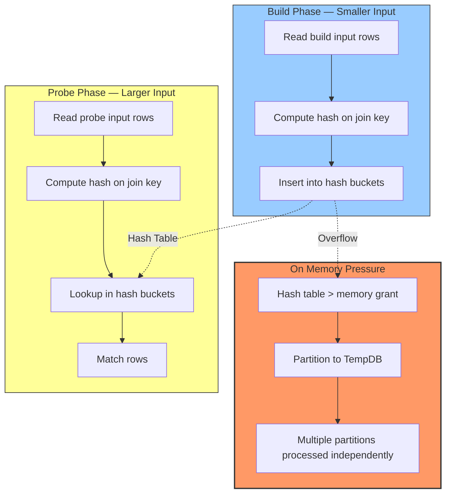

# 8.358 Hash Match Join — Memory Grants and Spills

---

### Section 1 — Navigation

**Breadcrumb:** `[[8 — Databases]]` → `[[Group 13 — SQL Server Performance & Tuning]]` → `8.358 Hash Match Join — Memory Grants and Spills`

**Previous:** [[8.357 Nested Loops Join — When and Why]]
**Next:** [[8.359 Merge Join — Requirements and Performance]]
**Prerequisites:**
- [[8.578 Hash Match Join — Large Unsorted Inputs]] (Group 20)
- [[8.364 TempDB Spills — Sort and Hash Spills]]
- [[8.363 Memory Grants — Diagnosing Insufficient Grants]]
- [[8.372 Memory Grant Feedback — Adaptive Memory]]

**Cross-Domain References:**
- [[8.588 Hash Aggregate — Memory-Based Aggregation]] (Group 20 — Query Optimization)
- [[8.283 TempDB — Architecture and Contention]] (Group 11 — Storage Engine)
- [[8.581 Batch Mode Hash Join — Columnar Optimization]] (Group 20)
- [[8.859 Dapper — ExecuteScalar — Single Value Return]] (Group 30 — Dapper)

**Where This Fits:**
Hash Match Join is the workhorse for large, unsorted data sets. It builds a hash table from the smaller input (build side) and probes it with the larger input. Understanding memory grants and hash spills is essential for data warehouse and reporting query performance.

---

### Section 2 — Core Mental Model



**Classification:** Join Algorithm — Hash-Based Partitioning
**Key Properties:**

| Property | Value |
|---|---|
| Complexity | O(N + M) — build + probe passes |
| Build Side | Smaller of the two inputs |
| Hash Function | XOR-based on join key value |
| Memory Requirement | Build input size × row overhead (~1.2x) |
| TempDB Spill | When hash table exceeds memory grant |
| Join Types | Inner, Left Outer, Right Outer, Full Outer, Semi, Anti-Semi |
| Equality Required? | Yes — equi-join only |
| Parallelism | Yes — hash partition distribution |
| Best For | Large unsorted data, data warehouse |
| Worst For | Small OLTP queries (hash table overhead) |

**Execution Plan Shape (Text):**
```
[SELECT] ← [Hash Match (Inner Join)]
               ↓ (Build)
          [Table Scan / Index Scan — Build Input]
               ↓ (Probe)
          [Table Scan / Index Scan — Probe Input]
```

**Actual Execution Plan XML Key Fragments:**
```xml
<RelOp NodeId="5" PhysicalOp="Hash Match" LogicalOp="Inner Join">
  <Hash>
    <HashKeysBuild>
      <ColumnReference Column="CustomerId" />
    </HashKeysBuild>
    <HashKeysProbe>
      <ColumnReference Column="CustomerId" />
    </HashKeysProbe>
    <BuildResidual>
      <ScalarOperator ScalarString="[AdventureWorks].[dbo].[Customers].[CustomerId]=
                                    [AdventureWorks].[dbo].[Orders].[CustomerId]" />
    </BuildResidual>
  </Hash>
  <RunTimeInformation>
    <RunTimeCountersPerThread ActualRows="500000" ActualEndOfScans="1" />
  </RunTimeInformation>
</RelOp>
```

**Grace Hash Join (Spill Variant):**

When the hash table exceeds the memory grant, SQL Server partitions both inputs into N partitions written to TempDB, then processes each partition independently. This is the "Grace Hash Join" algorithm:

```
Phase 1: Hash both inputs → partition to TempDB by hash value
Phase 2: Read each partition pair → build/probe within partition
Phase 3: If a partition still doesn't fit → recursive partitioning
```

---

### Section 3 — Deep Mechanics

**Step-by-Step Execution (In-Memory Hash Match):**

1. **Optimizer selects build side** — SQL Server chooses the smaller input as the build side based on cardinality estimates. The memory grant is calculated as: `estimated_build_rows × row_size × 1.2`.

2. **Read build input** — The build input is read sequentially (typically via an Index Scan or Table Scan). Rows are processed one at a time.

3. **Hash function applied** — The join key value is hashed using an XOR-based hash function to produce a hash value. The hash value determines the hash bucket (partition) for the row.

4. **Build hash table** — Build rows are inserted into the hash table in memory. Each hash bucket contains a linked list of rows that map to the same hash value (hash collisions are resolved via chaining).

5. **Read probe input** — The probe input is read sequentially. For each probe row:
   a. Compute the hash of the join key.
   b. Navigate to the corresponding hash bucket.
   c. Scan the linked list in the bucket, comparing actual join keys (residual predicate).
   d. For matches, concatenate build + probe columns and output.

6. **Output** — Matching rows are passed to the parent operator.

**Memory Grant Calculation:**

```sql
-- View memory grant details for a query
SELECT
    r.session_id,
    r.request_id,
    r.granted_query_memory AS memory_grant_kb,
    r.requested_memory_kb,
    r.required_memory_kb,
    r.used_memory_kb,
    r.max_used_memory_kb,
    r.wait_order,
    r.is_next_candidate
FROM sys.dm_exec_query_memory_grants r
WHERE r.session_id = @@SPID;
```

**Actual Hash Warning (Spill) in Execution Plan:**

```
<Warnings>
  <HashWarning>
    <HashSpillDetails SpillLevel="1" GrantedMemory="1048576"
                      RequestedMemory="2097152" />
  </HashWarning>
</Warnings>
```

**Simulating a Hash Spill:**

```sql
-- Large table join with insufficient memory grant
-- (Requires large data set or artificially constrained memory)
DBCC TRACEON (3650, -1);  -- Enable hash spill diagnostics

SELECT c.CustomerId, c.Name, o.OrderDate, o.Total
FROM dbo.Customers_Large c
JOIN dbo.Orders_Large o ON o.CustomerId = c.CustomerId
WHERE c.CustomerId BETWEEN 1 AND 100000
OPTION (HASH JOIN, MAXDOP 1);  -- Force Hash Match

-- Check for spills in actual plan XML
-- Look for <HashWarning> or <SpillToTempDb> elements
```

**Hash Match vs Grace Hash Join:**

| Phase | In-Memory | Grace (Spilled) |
|---|---|---|
| Build | Hash table in memory | Hash table partitioned; partitions written to TempDB |
| Probe | Probe against memory | Read/write partitions from TempDB |
| I/O | Scan only | Scan + TempDB writes + TempDB reads |
| Performance | Fast | 3–10x slower due to TempDB I/O |
| Memory | Estimated build size × 1.2 | Reduced per-partition memory |

**Failure Modes:**
- **Hash spill to TempDB** — Estimated memory was too low. Common with outdated statistics.
- **Allocation order scan** — When both inputs are large, Hash Match builds a hash table from the smaller side. If both are equal in size, SQL Server may hash probe both sides causing additional memory pressure.
- **Hash collision chain** — Many rows with same hash value (low cardinality join key) cause long collision chains and degrade probe performance to near O(N) instead of O(1).
- **Parallel hash skew** — Single thread handling a large partition because hash distribution is uneven.

---

### Section 4 — Production Patterns

**Pattern 1: Diagnosing Hash Spills with `sys.dm_exec_query_stats`**

```sql
-- Find queries with hash warnings from plan cache
SELECT
    qs.total_elapsed_time / 1000 AS elapsed_ms,
    qs.total_logical_reads,
    qs.total_work_table_reads,
    qs.total_work_table_writes,
    qs.execution_count,
    SUBSTRING(st.text, (qs.statement_start_offset/2) + 1,
        ((CASE WHEN qs.statement_end_offset = -1
               THEN DATALENGTH(st.text)
               ELSE qs.statement_end_offset END
          - qs.statement_start_offset)/2) + 1) AS query_text
FROM sys.dm_exec_query_stats qs
CROSS APPLY sys.dm_exec_sql_text(qs.sql_handle) st
CROSS APPLY sys.dm_exec_query_plan(qs.plan_handle) qp
WHERE qp.query_plan.exist('
    declare namespace p="http://schemas.microsoft.com/sqlserver/2004/07/showplan";
    //p:Warnings/p:HashWarning') = 1
ORDER BY qs.total_work_table_writes DESC;
```

**Pattern 2: Memory Grant Feedback (SQL Server 2017+)**

```sql
-- Enable Memory Grant Feedback (default in SQL Server 2019+)
ALTER DATABASE SCOPED CONFIGURATION SET MEMORY_GRANT_FEEDBACK = ON;

-- Run query — first execution may spill, feedback adjusts grant
SELECT c.CustomerId, c.Name, SUM(o.Total) AS TotalSpent
FROM dbo.Customers_Large c
JOIN dbo.Orders_Large o ON o.CustomerId = c.CustomerId
GROUP BY c.CustomerId, c.Name
OPTION (HASH JOIN, MAXDOP 1);

-- Check memory grant feedback in query_store
SELECT
    qsrs.plan_id,
    qsrs.avg_memory_grant_kb,
    qsrs.last_memory_grant_kb,
    qsrs.avg_spill_kb,
    qsrs.last_spill_kb,
    qsrs.memory_grant_feedback_occurred_count
FROM sys.query_store_plan qsp
JOIN sys.query_store_runtime_stats qsrs
    ON qsp.plan_id = qsrs.plan_id
WHERE qsrs.memory_grant_feedback_occurred_count > 0;
```

**Pattern 3: Monitoring Active Memory Grants**

```sql
-- Monitor current memory grants
SELECT
    session_id,
    request_time,
    grant_time,
    granted_memory_kb,
    requested_memory_kb,
    required_memory_kb,
    max_used_memory_kb,
    wait_order,
    CASE 
        WHEN granted_memory_kb < requested_memory_kb THEN 'WAITING'
        ELSE 'GRANTED'
    END AS status
FROM sys.dm_exec_query_memory_grants
WHERE session_id > 50;  -- Exclude system sessions

-- Detect memory grant waits
SELECT
    session_id,
    wait_type,
    wait_time_ms,
    wait_resource,
    blocking_session_id
FROM sys.dm_exec_requests
WHERE wait_type LIKE '%RESOURCE_SEMAPHORE%'
   OR wait_type LIKE '%RESOURCE_SEMAPHORE_QUERY_COMPILE%';
```

**Pattern 4: Force Hash Join for Large Data Sets**

```sql
-- Explicitly request Hash Join when optimizer chooses suboptimal join
SELECT c.Name, o.OrderDate
FROM dbo.Customers_Large c
INNER HASH JOIN dbo.Orders_Large o ON o.CustomerId = c.CustomerId
WHERE c.CustomerId BETWEEN 1 AND 100000;

-- Or use the global hint
SELECT c.Name, o.OrderDate
FROM dbo.Customers_Large c
JOIN dbo.Orders_Large o ON o.CustomerId = c.CustomerId
WHERE c.CustomerId BETWEEN 1 AND 100000
OPTION (HASH JOIN);
```

**Pattern 5: Large Join with Aggregation (Hash Match + Hash Aggregate)**

```sql
-- Hash Match Join followed by Hash Aggregate (common in DW queries)
SELECT
    c.CustomerId,
    c.Name,
    COUNT(DISTINCT o.OrderId) AS OrderCount,
    SUM(o.Total) AS TotalSpent
FROM dbo.Customers_Large c
JOIN dbo.Orders_Large o ON o.CustomerId = c.CustomerId
WHERE o.OrderDate >= '2025-01-01'
GROUP BY c.CustomerId, c.Name;

-- Plan shape:
-- [SELECT] ← [Hash Aggregate] ← [Hash Match Join]
--                   Build: Index Scan (Orders_Large)
--                   Probe: Index Scan (Customers_Large)
```

**Pattern 6: EF Core — Casting to Hash Join**

```csharp
// EF Core 7+ — Use query hints to force join strategy
var result = await context.Customers
    .Join(context.Orders,
        c => c.CustomerId,
        o => o.CustomerId,
        (c, o) => new { c.CustomerId, c.Name, o.OrderDate, o.Total })
    .TagWith("OPTION (HASH JOIN)")
    .ToListAsync();

// Equivalent raw SQL with hint
var result = await context.Database
    .SqlQuery<OrderSummary>(@"
        SELECT c.CustomerId, c.Name, o.OrderDate, o.Total
        FROM Customers c
        INNER JOIN Orders o ON o.CustomerId = c.CustomerId
        OPTION (HASH JOIN)")
    .ToListAsync();
```

---

### Section 5 — Gotchas

| # | Pitfall | Symptom | Fix | Cost |
|---|---|---|---|---|
| 1 | **Outdated statistics cause wrong build side selection** | Larger input chosen as build; hash table too large → spill | Update statistics on both tables; use `FULLSCAN` | High — spill overhead |
| 2 | **Low cardinality join key (e.g., bit, tinyint)** | Long hash collision chains degrade probe | Use different join strategy (Merge) or redesign key | Medium |
| 3 | **Hash spill due to memory pressure from concurrent queries** | RESOURCE_SEMAPHORE waits; queries wait for memory grant | Set `MAXDOP`; reduce concurrent large queries; increase `max server memory` | Very High — query failure |
| 4 | **Ignoring `worktable` reads in STATISTICS IO** | Spill goes undetected because only logical reads are monitored | Check `worktable` reads/writes in STATISTICS IO output | Medium |
| 5 | **Hash Match chosen for small OLTP queries** | Hash table overhead (memory allocation, hashing) dominates | Ensure good indexing so Nested Loops is cheaper | Low |
| 6 | **Implicit conversion on join key** | Hash compute on different types; cardinality misestimate | Ensure matching data types on both sides | High |
| 7 | **Using Hash Match with `DISTINCT` or `UNION`** | Hash Match is also used for Hash Aggregate — confusing plan analysis | Check operator type carefully in plan | Low |
| 8 | **Parallel hash build with skewed data** | One partition is much larger than others; single thread does most work | Use `MAXDOP 1` or distribute data better | Medium |

---

### Section 6 — Performance Implications

**BenchmarkDotNet Simulation:**

```csharp
[MemoryDiagnoser]
public class HashMatchBenchmark
{
    private const string Conn = "Server=.;Database=PerfTest;Trusted_Connection=true;";

    [Benchmark(Baseline = true)]
    public List<Result> HashMatch_InMemory()
    {
        using var c = new SqlConnection(Conn);
        return c.Query<Result>(@"
            SELECT c.CustomerId, c.Name, o.OrderDate, o.Total
            FROM Customers_Large c
            JOIN Orders_Large o ON o.CustomerId = c.CustomerId
            WHERE c.CustomerId BETWEEN 1 AND 100000
            OPTION (HASH JOIN)").ToList();
    }

    [Benchmark]
    public List<Result> HashMatch_Spilled()
    {
        using var c = new SqlConnection(Conn);
        // Run with artificially limited memory grant
        return c.Query<Result>(@"
            SELECT c.CustomerId, c.Name, o.OrderDate, o.Total
            FROM Customers_VeryLarge c
            JOIN Orders_VeryLarge o ON o.CustomerId = c.CustomerId
            OPTION (HASH JOIN)").ToList();
    }

    [Benchmark]
    public List<Result> MergeJoin_Sorted()
    {
        using var c = new SqlConnection(Conn);
        return c.Query<Result>(@"
            SELECT c.CustomerId, c.Name, o.OrderDate, o.Total
            FROM Customers_Large c
            JOIN Orders_Large o ON o.CustomerId = c.CustomerId
            WHERE c.CustomerId BETWEEN 1 AND 100000
            ORDER BY c.CustomerId
            OPTION (MERGE JOIN)").ToList();
    }
}
```

**Expected Results:**

| Scenario | Mean Time | Memory Grant | TempDB I/O |
|---|---|---|---|
| Hash Match (in memory) | 100% (baseline) | ~256 MB | None |
| Hash Match (spilled to TempDB) | 350–500% | ~64 MB (insufficient) | Yes — heavy reads/writes |
| Merge Join (pre-sorted) | 85–120% | ~10 MB | None (if sorted) |
| Nested Loops (no index) | >5000% | Minimal | None |

**`SET STATISTICS IO` Before/After:**

```sql
-- BEFORE: Hash Match with spill (outdated stats, no feedback)
SET STATISTICS IO ON;
SELECT c.CustomerId, c.Name, o.OrderDate, o.Total
FROM dbo.Customers_Large c
JOIN dbo.Orders_Large o ON o.CustomerId = c.CustomerId
WHERE c.CustomerId BETWEEN 1 AND 100000;

/*
Table 'Customers_Large'. Scan count 1, logical reads 4500, ...
Table 'Orders_Large'. Scan count 1, logical reads 32000, ...
Table 'worktable'. Scan count 4, logical reads 180000, logical writes 90000, ...
Total: ~220K logical operations
Worktable reads indicate spill!
*/

-- AFTER: Correct memory grant (updated stats or Memory Grant Feedback)
SET STATISTICS IO ON;
SELECT c.CustomerId, c.Name, o.OrderDate, o.Total
FROM dbo.Customers_Large c
JOIN dbo.Orders_Large o ON o.CustomerId = c.CustomerId
WHERE c.CustomerId BETWEEN 1 AND 100000;

/*
Table 'Customers_Large'. Scan count 1, logical reads 4500, ...
Table 'Orders_Large'. Scan count 1, logical reads 32000, ...
Table 'worktable'. Scan count 0, logical reads 0, ...
Total: ~36K logical operations
No worktable reads — no spill.
*/
```

**Memory Grant Analysis Script:**

```sql
-- Analyze memory grant for a specific query
DBCC FREEPROCCACHE;
GO

-- Capture the memory grant
SELECT
    r.session_id,
    r.requested_memory_kb,
    r.granted_memory_kb,
    r.required_memory_kb,
    r.used_memory_kb,
    r.max_used_memory_kb,
    r.query_cost
FROM sys.dm_exec_query_memory_grants r
WHERE r.session_id = @@SPID;
GO

SELECT c.CustomerId, c.Name, o.OrderDate, o.Total
FROM dbo.Customers_Large c
JOIN dbo.Orders_Large o ON o.CustomerId = c.CustomerId
WHERE c.CustomerId BETWEEN 1 AND 100000
OPTION (HASH JOIN);
GO
```

**Execution Plan Comparison:**

**Hash Match (In Memory):**
```
[SELECT] ← [Hash Match (Inner Join)]
               Build: [Index Scan — Customers_Large (4500 reads)]
               Probe: [Index Scan — Orders_Large (32000 reads)]
```

**Hash Match (Spilled):**
```
[SELECT] ← [Hash Match (Inner Join)]
               Build: [Index Scan — Customers_Large (4500 reads)]
               Probe: [Index Scan — Orders_Large (32000 reads)]
               Warnings: <HashWarning SpillLevel="1" ...>
```

**Spill levels:**
- Level 0: No spill (in-memory)
- Level 1: Single partition spill to TempDB
- Level 2: Recursive partitioning (multiple levels)
- Level 3+: Deep recursive partitioning (severe memory pressure)

---

### Section 7 — Interview Arsenal

**Common Questions:**

| # | Question | Topic |
|---|---|---|
| 1 | How does Hash Match Join work, step by step? | Algorithm |
| 2 | What is a Grace Hash Join and when does SQL Server use it? | Spill mechanism |
| 3 | How does SQL Server calculate the memory grant for a Hash Match? | Memory grant |
| 4 | What does a hash spill warning mean in an execution plan? | Spill detection |
| 5 | How does Memory Grant Feedback improve Hash Match performance? | Adaptive tuning |
| 6 | Why can't Hash Match handle non-equi joins? | Hash function limitation |
| 7 | What is hash collision and how does it impact performance? | Collision chains |
| 8 | How do you choose the build side for Hash Match? | Cardinality estimates |

**Three Spoken Answers (Two-Tier):**

**Q1: How does Hash Match Join work, step by step?**

*Junior/Mid:*
"Hash Match has two phases: Build and Probe. In the Build phase, SQL Server reads the smaller input, hashes each row's join key, and inserts rows into a hash table in memory. In the Probe phase, it reads the larger input, hashes each row's join key, and looks up matches in the hash table."

*Senior/Lead:*
"Hash Match Join operates in two phases. First, the Build phase reads the estimated-smaller input sequentially, computes a hash value from the join key using an XOR-based function, and inserts each row into a hash bucket in memory. Collisions are resolved via linked-list chaining within each bucket. The memory grant requested is based on the estimated build-side cardinality multiplied by an average row size, with a safety factor of roughly 1.2. Second, the Probe phase reads the larger input, computes the same hash for each row, navigates to the corresponding bucket, and scans the collision chain comparing actual join key values (the residual predicate). If the hash table exceeds the memory grant, SQL Server transitions to a Grace Hash Join — partitioning both inputs by hash value, writing overflow partitions to TempDB, and processing each partition independently. Memory Grant Feedback in SQL Server 2017+ monitors the actual vs requested memory and adjusts future grants automatically."

**Q2: What is a hash spill and how do you diagnose it?**

*Junior/Mid:*
"A hash spill happens when the hash table is larger than the available memory grant, so SQL Server has to write parts of it to TempDB. You can see it in the actual execution plan as a yellow warning triangle on the Hash Match operator."

*Senior/Lead:*
"A hash spill occurs when the build-side hash table exceeds the query's memory grant. SQL Server then partitions both inputs by hash value, writing overflow partitions to TempDB — this is the Grace Hash Join algorithm. Signs of a spill include: `worktable` reads/writes in `SET STATISTICS IO` output, `RESOURCE_SEMAPHORE` waits, and `<HashWarning>` XML elements in the actual plan with `SpillLevel` > 0. The impact is severe — spilled hash joins can be 3–10x slower than in-memory due to TempDB I/O. I diagnose spills using `sys.dm_exec_query_stats` with `total_work_table_writes > 0`, or by querying the plan cache for plans containing `<HashWarning>`. Fixing spills involves updating statistics for better memory estimates, enabling Memory Grant Feedback, or rewriting the query to reduce the build-side cardinality."

**Q3: How does Memory Grant Feedback optimize Hash Match performance?**

*Junior/Mid:*
"Memory Grant Feedback adjusts the memory grant for a query based on how much it actually used in previous executions. If the first execution spilled to TempDB, the next execution gets a larger grant."

*Senior/Lead:*
"Memory Grant Feedback is an Intelligent Query Processing feature introduced in SQL Server 2017 and enabled by default in SQL Server 2019+. For Hash Match joins specifically, MGF monitors two metrics per execution: `max_used_memory_kb` (peak memory used) and `spill_count`/`spill_level`. After the first execution, if the actual used memory exceeds 90% of the grant (spill), MGF increases the grant; if used memory is below 50% of the grant, it decreases it to avoid wasting memory. Crucially, this feedback persists in the plan cache, so subsequent executions benefit without recompilation. In Query Store, you can see `memory_grant_feedback_occurred_count` and compare `avg_memory_grant_kb` across plan versions. This is particularly valuable for Hash Match joins where cardinality misestimation is common — the feedback corrects for statistics drift without manual intervention."

**Comparison Table — Hash Match vs Other Join Algorithms:**

| Dimension | Hash Match | Nested Loops | Merge Join |
|---|---|---|---|
| Memory | High (hash table size) | Minimal | Low (sort may need memory) |
| TempDB Spill Risk | High | None | Moderate (sort spill) |
| Input Requirement | Unsorted, any size | Small outer, indexed inner | Sorted inputs |
| Join Predicate | Equi-join only | All types | Equi-join only |
| Complexity | O(N + M) | O(N × M) worst-case | O(N + M) |
| Parallelism | Excellent | Good | Limited |
| Best Use Case | DW, large reports | OLTP point lookups | Range scans, sorted data |

---

### Section 8 — Decision Framework

```mermaid
flowchart TD
    Start[Query has JOIN] --> JoinType{Join predicate type?}
    
    JoinType -->|Equi-join| Size{Table sizes?}
    JoinType -->|Non-equi| NLOnly[Nested Loops only option]
    
    Size -->|Both large| Sorted{Inputs sorted?}
    Size -->|One large, one small| SmallSide{Small side<br>< 1K rows?}
    Size -->|Both small| NLOpt[Nested Loops (if inner indexed)]
    
    Sorted -->|Yes| MergeOpt[Merge Join — best choice]
    Sorted -->|No| HashOpt[Hash Match Join]
    
    SmallSide -->|Yes| NLIndex{Nested Loops with index?}
    SmallSide -->|No| HashOpt2[Hash Match Join]
    
    NLIndex -->|Yes| NestedLoops[Nested Loops]
    NLIndex -->|No| HashOpt2
    
    HashOpt --> Memory{Sufficient memory<br>for hash table?}
    Memory -->|Yes| InMem[In-Memory Hash Match]
    Memory -->|No| Grace[Grace Hash Join — spill to TempDB]
    
    InMem --> MGF[Memory Grant Feedback adjusts on re-execute]
    Grace --> MGF
    
    style HashOpt fill:#fa0,stroke:#333
    style InMem fill:#9f9,stroke:#333
    style Grace fill:#f96,stroke:#333
    style MergeOpt fill:#9cf,stroke:#333
```

**Checklist:**

- [ ] Is the join an equi-join? (Hash Match only supports equality)
- [ ] Are both inputs large (>10K rows)?
- [ ] Is the join key highly selective (many distinct values)?
- [ ] Are statistics up to date on both tables?
- [ ] Have you checked for hash spills in the actual execution plan?
- [ ] Is there sufficient memory available (check `max server memory`)?
- [ ] Is Memory Grant Feedback enabled?
- [ ] Are there concurrent large queries competing for memory grants?
- [ ] Could the data be pre-sorted to use Merge Join instead?
- [ ] Have you verified the build side is the smaller input?

**Tradeoffs:**

| Approach | Pros | Cons | When to Choose |
|---|---|---|---|
| In-Memory Hash Match | Fast O(N+M); handles any size | Large memory grant; equi-join only | Large unsorted data, DW |
| Grace Hash Join (Spill) | Handles data larger than memory | 3–10x slower; TempDB I/O; blocking | Only when memory constrained |
| Hash Match with MGF | Self-correcting memory grants | SQL 2017+; first execution may still spill | Production with memory pressure |
| FORCE ORDER + Hash | Controls build side explicitly | May prevent optimizer from choosing better plan | When optimizer picks wrong build side |

**Scale Thresholds:**

| Build Side Size | Memory Grant Needed | Strategy |
|---|---|---|
| < 10 MB | ~12 MB | In-memory Hash Match (trivial) |
| 10 MB – 1 GB | ~12 MB – 1.2 GB | In-memory with adequate grant |
| 1 GB – 10 GB | ~1.2 GB – 12 GB | Risk of spill; enable MGF |
| > 10 GB | > 12 GB | Consider Merge Join, partitioning, or columnstore |

---

### Section 9 — Self-Check

**Conceptual Questions:**

1. What two phases does a Hash Match Join consist of?
2. How does SQL Server determine which input is the build side?
3. What is a Grace Hash Join and when is it used?
4. How does a hash collision affect Hash Match performance?
5. What is the structure of a hash table in the context of Hash Match Join?
6. How does `SET STATISTICS IO` indicate a hash spill?
7. What DMV shows active memory grants for running queries?
8. What is the difference between `Hash Match Join` and `Hash Aggregate` operators?
9. Why can't Hash Match handle non-equi join predicates?
10. How does Memory Grant Feedback adjust the grant for Hash Match joins?

**Practical Challenges:**

1. Write a query that forces a Hash Match join using a hint.
2. Create a scenario where a Hash Match join spills to TempDB and measure the spill level.
3. Write T-SQL to query `sys.dm_exec_query_memory_grants` for the current session during a large hash join.
4. Compare logical reads and execution time for an in-memory Hash Match vs a spilled Hash Match using the same data but constrained memory.
5. Enable Memory Grant Feedback and demonstrate grant reduction across multiple executions of the same Hash Match query.

<details>
<summary>Answers</summary>

**Conceptual Answers:**

1. **Build Phase** — reads the smaller input, hashes join keys, builds hash table in memory. **Probe Phase** — reads larger input, hashes join keys, probes the hash table for matches.
2. The optimizer estimates the cardinality of each input and selects the smaller one as the build side. This minimizes the memory grant and hash table size. The estimate comes from statistics.
3. A Grace Hash Join is the spill variant used when the hash table exceeds the memory grant. Both inputs are partitioned by hash value into TempDB, then each partition pair is processed independently. Named after the Grace database project where it was first implemented.
4. When many rows share the same hash value (low cardinality join key), the collision chain in the hash bucket becomes long. Probing requires scanning the entire chain, degrading from O(1) to O(N) per probe.
5. The hash table is an array of buckets, each containing a linked list of rows that hash to the same bucket. Each row entry stores: hash value, join key value, and all build-side columns needed by the query.
6. The presence of `worktable` logical reads and writes in the output indicates spill activity. `Table 'worktable'. Scan count 4, logical reads 180000` means the spilled hash table was read from TempDB four times.
7. `sys.dm_exec_query_memory_grants` shows current queries with their requested, granted, required, and used memory. `RESOURCE_SEMAPHORE` wait type indicates queries waiting for memory grants.
8. **Hash Match Join** matches rows from two inputs using a hash on the join key. **Hash Aggregate** groups rows from a single input using a hash on the group-by key. Both use the same hash table concept but for different purposes.
9. Hash functions map a set of values to a deterministic bucket. Non-equi predicates (>, <, BETWEEN) cannot be expressed as hash lookups — there's no way to compute which bucket contains matching rows without scanning all buckets.
10. MGF tracks `max_used_memory_kb` and spill indicators per execution. If actual usage exceeds 90% of grant (or spill occurred), the grant is increased on the next execution. If usage is below 50%, the grant is decreased. The adjusted grant is stored in the plan cache.

**Challenge Solutions:**

1. ```sql
    SELECT c.Name, o.OrderDate, o.Total
    FROM dbo.Customers_Large c
    INNER HASH JOIN dbo.Orders_Large o ON o.CustomerId = c.CustomerId
    WHERE c.CustomerId BETWEEN 1 AND 100000;
    ```

2. ```sql
    -- Create large tables with outdated statistics
    -- Force small memory grant using query hint
    SELECT c.Name, o.OrderNo, o.Total
    FROM dbo.Customers_VeryLarge c
    INNER HASH JOIN dbo.Orders_VeryLarge o ON o.CustomerId = c.CustomerId
    OPTION (MIN_GRANT_PERCENT = 0.1, MAX_GRANT_PERCENT = 0.1);
    -- Check actual plan for <HashWarning> element
    -- Check sys.dm_db_index_physical_stats for spilled partitions
    ```

3. ```sql
    -- In Session 1, run a large hash join
    -- In Session 2, query memory grants
    SELECT
        session_id,
        requested_memory_kb,
        granted_memory_kb,
        required_memory_kb,
        used_memory_kb,
        max_used_memory_kb,
        wait_order
    FROM sys.dm_exec_query_memory_grants
    WHERE session_id > 50;
    ```

4. ```sql
    -- Baseline: Regular Hash Match
    SET STATISTICS IO ON;
    SELECT c.CustomerId, SUM(o.Total) AS Total
    FROM dbo.Customers_Large c
    JOIN dbo.Orders_Large o ON o.CustomerId = c.CustomerId
    GROUP BY c.CustomerId
    OPTION (HASH JOIN);
    -- Record logical reads, worktable I/O, duration
    
    -- Constrained: Force spill with MIN_GRANT_PERCENT
    SET STATISTICS IO ON;
    SELECT c.CustomerId, SUM(o.Total) AS Total
    FROM dbo.Customers_Large c
    JOIN dbo.Orders_Large o ON o.CustomerId = c.CustomerId
    GROUP BY c.CustomerId
    OPTION (HASH JOIN, MIN_GRANT_PERCENT = 0.01, MAX_GRANT_PERCENT = 0.01);
    -- Record worktable I/O — should show significant spill
    ```

5. ```sql
    -- Enable MGF at database level
    ALTER DATABASE SCOPED CONFIGURATION SET MEMORY_GRANT_FEEDBACK = ON;
    GO
    
    -- Clear cache for this query
    DBCC FREEPROCCACHE;
    GO
    
    -- Run query 3 times
    SELECT c.CustomerId, SUM(o.Total) AS Total
    FROM dbo.Customers_Large c
    JOIN dbo.Orders_Large o ON o.CustomerId = c.CustomerId
    GROUP BY c.CustomerId
    OPTION (HASH JOIN, RECOMPILE);  -- First: may spill
    GO
    
    -- Query Query Store or memory grants
    SELECT
        deqs.query_hash,
        deqs.plan_handle,
        deqs.last_grant_kb,
        deqs.min_grant_kb,
        deqs.max_grant_kb
    FROM sys.dm_exec_query_stats deqs
    CROSS APPLY sys.dm_exec_sql_text(deqs.plan_handle) est
    WHERE est.text LIKE '%Customers_Large%Orders_Large%';
    ```
</details>
