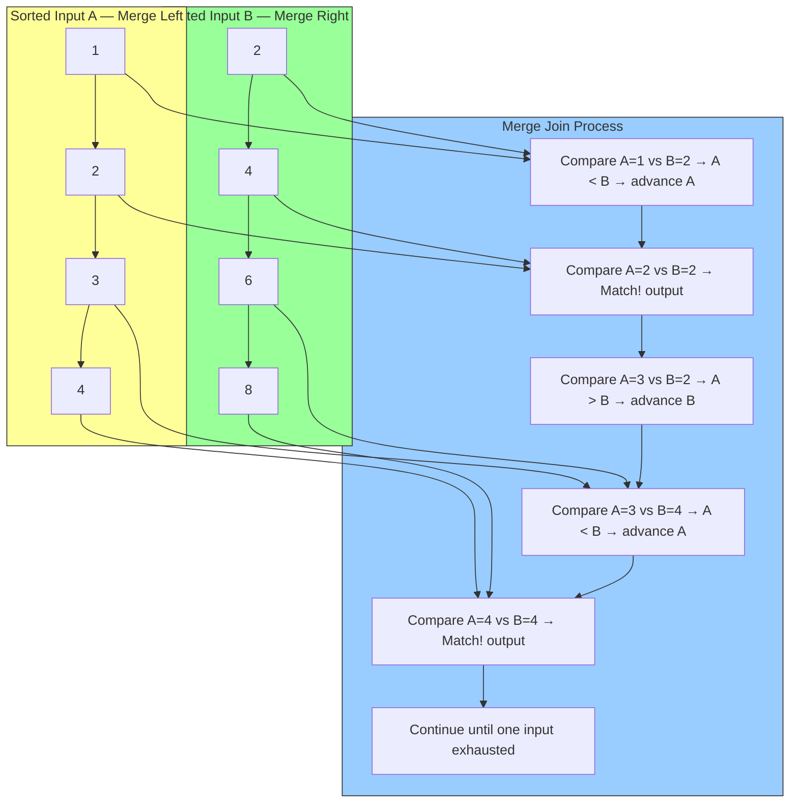

# 8.359 Merge Join — Requirements and Performance

---

### Section 1 — Navigation

**Breadcrumb:** `[[8 — Databases]]` → `[[Group 13 — SQL Server Performance & Tuning]]` → `8.359 Merge Join — Requirements and Performance`

**Previous:** [[8.358 Hash Match Join — Memory Grants and Spills]]
**Next:** [[8.360 Adaptive Join — Runtime Algorithm Selection]]
**Prerequisites:**
- [[8.579 Merge Join — Pre-Sorted Inputs Requirement]] (Group 20)
- [[8.582 Sort Operator — Memory and Disk Spill]]
- [[8.501 Clustered Index — Physical Row Order]]
- [[8.497 B-Tree Index — Structure and Navigation]]

**Cross-Domain References:**
- [[8.587 Stream Aggregate — Group and Aggregate]] (Group 20 — Query Optimization)
- [[8.567 Join Reordering — Optimizer Freedom]] (Group 20)
- [[8.599 PostgreSQL — Planner Method Configuration]] (Group 20 — PostgreSQL)
- [[8.906 Compiled Queries — EF.CompileQuery]] (Group 31 — Database Patterns in .NET)

**Where This Fits:**
Merge Join is the most efficient join algorithm for large sorted datasets, requiring only a single pass over each input. Understanding its sorted-input requirement and one-to-many/many-to-many variants is crucial for optimizing reporting queries, range scans, and any work with pre-ordered data.

---

### Section 2 — Core Mental Model



**Classification:** Join Algorithm — Two-Pointer Merge
**Key Properties:**

| Property | Value |
|---|---|
| Complexity | O(N + M) — single pass per input |
| Input Requirement | Both inputs sorted on join key |
| Sort Cost | O(N log N + M log M) if not pre-sorted |
| Memory Requirement | Low (no hash table, small sort memory if needed) |
| TempDB Usage | Only for Sort operator if inputs not pre-sorted |
| Join Types | Inner, Left Outer, Right Outer, Full Outer, Semi, Anti-Semi |
| Equality Required? | Yes — equi-join only |
| One-to-Many | Multiple matches per key handled via sequential scan |
| Many-to-Many | Requires worktable (TempDB) to track duplicates |
| Best For | Large sorted datasets, range queries |
| Worst For | Single-row lookups (Nested Loops better) |

**Execution Plan Shape (Text):**
```
[SELECT] ← [Merge Join (Inner Join)]
               ↓
          [Clustered Index Scan — Table A (sorted by join key)]
               ↓
          [Clustered Index Scan — Table B (sorted by join key)]
```

**With Explicit Sort:**
```
[SELECT] ← [Merge Join (Inner Join)]
               ↓
          [Sort — Table A (ORDER BY join key)]
               ↓
               [Table Scan — Table A]
               ↓
          [Sort — Table B (ORDER BY join key)]
               ↓
               [Table Scan — Table B]
```

**Execution Plan XML Key Fragments:**
```xml
<RelOp NodeId="4" PhysicalOp="Merge Join" LogicalOp="Inner Join">
  <Merge>
    <ManyToMany DataFlow="false" Order="[AdventureWorks].[dbo].[TableA].Key ASC" />
    <Order>
      <ColumnReference Column="Key" />
    </Order>
    <Residual>
      <ScalarOperator ScalarString="[TableA].[Key]=[TableB].[Key]" />
    </Residual>
    <PassThru>
      <ScalarOperator ScalarString="[TableA].[Key] IS NOT NULL" />
    </PassThru>
  </Merge>
  <RunTimeInformation>
    <RunTimeCountersPerThread ActualRows="500000" ActualEndOfScans="1" />
  </RunTimeInformation>
</RelOp>
```

---

### Section 3 — Deep Mechanics

**Step-by-Step Execution (One-to-Many Merge Join):**

1. **Sorted input retrieval** — Both inputs are retrieved in sorted order. This can come from:
   - Clustered index scan (already sorted by key)
   - Index seek with ordered=true
   - Explicit Sort operator
   - Pre-sorted table variable or CTE with ORDER BY

2. **Initialize pointers** — SQL Server opens a read cursor on each input. Current row pointers start at the first row of each input.

3. **Compare current keys** — The join key values from the current rows are compared:
   - If `Key_A < Key_B` → advance Input A (no match possible)
   - If `Key_A > Key_B` → advance Input B (no match possible)
   - If `Key_A == Key_B` → match found! Output concatenated row(s)

4. **Match output (One-to-Many)** — For each match, SQL Server outputs one row. Since keys can have multiple matches on either side:
   - One-to-Many: Advance the "many" side, keep the "one" side pointer
   - Many-to-Many: Requires a worktable (TempDB) to buffer duplicate keys

5. **Continue** — Steps 3–4 repeat until one input is exhausted.

**One-to-Many vs Many-to-Many:**

```sql
-- One-to-Many (simple): Each key in A has at most one row, B has many
-- No worktable needed
CREATE TABLE dbo.OneA (KeyCol INT PRIMARY KEY, Value VARCHAR(10));
CREATE TABLE dbo.ManyB (KeyCol INT, Value VARCHAR(10), FOREIGN KEY REFERENCES dbo.OneA(KeyCol));
INSERT INTO dbo.OneA VALUES (1, 'A'), (2, 'B');
INSERT INTO dbo.ManyB VALUES (1, 'X'), (1, 'Y'), (2, 'Z');

SELECT * FROM dbo.OneA a JOIN dbo.ManyB b ON a.KeyCol = b.KeyCol;
-- Merge Join (One-to-Many)
```

```sql
-- Many-to-Many: Both sides can have duplicates
-- Worktable required to track matched rows
-- SQL Server uses a worktable in TempDB to handle the duplicate key region
CREATE TABLE dbo.ManyA (KeyCol INT, Value VARCHAR(10));
CREATE TABLE dbo.ManyB (KeyCol INT, Value VARCHAR(10));
INSERT INTO dbo.ManyA VALUES (1, 'A1'), (1, 'A2'), (2, 'B');
INSERT INTO dbo.ManyB VALUES (1, 'X1'), (1, 'X2'), (2, 'Y');

SELECT * FROM dbo.ManyA a JOIN dbo.ManyB b ON a.KeyCol = b.KeyCol;
-- Merge Join (Many-to-Many) — note worktable in plan
```

**Sort Requirement and Impact:**

```sql
-- Merge Join requires sorted inputs
-- Self-sorted via index:
SELECT a.OrderId, a.OrderDate, b.ProductId
FROM dbo.Orders a
JOIN dbo.OrderDetails b ON a.OrderId = b.OrderId
-- Plan: Merge Join ← Clustered Index Scan (Orders: PK sorted)
--                           ← Clustered Index Scan (OrderDetails: PK sorted on OrderId, ProductId)

-- Sort required (no pre-sorted index):
SELECT a.OrderId, a.OrderDate, b.ProductId
FROM dbo.Orders a
JOIN dbo.OrderDetails b ON a.OrderDate = b.ShipDate
-- Plan: Merge Join ← Sort (on OrderDate) ← Table Scan
--                           ← Sort (on ShipDate) ← Table Scan
```

**Comparing Merge Join Execution Strategies:**

| Scenario | Plan | Cost |
|---|---|---|
| Both inputs sorted by index | `Merge ← CI Scan ← CI Scan` | O(N + M) |
| One input sorted | `Merge ← Sort ← CI Scan` | O(N log N + M) |
| Neither sorted | `Merge ← Sort ← Table Scan + Sort ← Table Scan` | O(N log N + M log M) |
| Implicit sort via ORDER BY | Merge Join may be preferred if sort already needed for output | Same as above |

**Failure Modes:**
- **Unnecessary Sort dominates** — If the optimizer adds Sort operators because neither input is pre-sorted, the total cost can exceed Hash Match or Nested Loops. Always check if the sort is necessary.
- **One-to-Many misidentified as Many-to-Many** — If unique key constraint is missing, SQL Server assumes Many-to-Many, adding worktable overhead. Adding a UNIQUE or PRIMARY KEY constraint clarifies cardinality.
- **Range join with Merge Join** — Merge Join only supports equi-joins. For range conditions (a.key BETWEEN b.key_low AND b.key_high), it cannot be used directly.
- **Row goal impact** — With a TOP or FAST N hint, Merge Join may be deprioritized because it's blocking (must consume both inputs fully).

---

### Section 4 — Production Patterns

**Pattern 1: Merge Join with Clustered Index (No Sort)**

```sql
-- Both tables have clustered index on join key
-- No Sort operators needed
SELECT
    c.CustomerId,
    c.Name,
    o.OrderId,
    o.OrderDate,
    o.Total
FROM dbo.Customers c
JOIN dbo.Orders o ON o.CustomerId = c.CustomerId
ORDER BY c.CustomerId, o.OrderId;

-- Plan shape:
-- [Merge Join (Inner Join)]
--   Input 1: [Clustered Index Scan (PK_Customers — sorted on CustomerId)]
--   Input 2: [Clustered Index Scan (PK_Orders — sorted on CustomerId, OrderId)]
```

**Pattern 2: Merge Join with Explicit Sort**

```sql
-- No index on join key → Sort operator added
SELECT c.CustomerId, c.Name, o.OrderDate
FROM dbo.Customers c
JOIN dbo.Orders o ON c.Name = o.ShipName
ORDER BY c.Name;

-- Plan shape:
-- [Merge Join (Inner Join)]
--   Input 1: [Sort (by Name)] ← [Table Scan (Customers)]
--   Input 2: [Sort (by ShipName)] ← [Index Scan (Orders)]
```

**Pattern 3: Range Query with Merge Join**

```sql
-- Merge Join excels when join is equi AND output needs sorting
-- The Merge Join provides sorted output for free

-- Query needs sorted output → Merge Join avoids extra Sort
SELECT TOP 100
    c.CustomerId,
    c.Name,
    SUM(o.Total) AS TotalSpent
FROM dbo.Customers c
JOIN dbo.Orders o ON o.CustomerId = c.CustomerId
WHERE c.CustomerId BETWEEN 1 AND 10000
GROUP BY c.CustomerId, c.Name
ORDER BY TotalSpent DESC;

-- Subquery with Merge Join for range:
SELECT c.CustomerId, c.Name, o.OrderId, o.OrderDate
FROM dbo.Customers c
JOIN dbo.Orders o ON o.CustomerId = c.CustomerId
WHERE o.OrderDate >= '2025-01-01'
  AND o.OrderDate < '2025-02-01'
ORDER BY c.CustomerId, o.OrderDate;
```

**Pattern 4: Merge Join with CTE or Derived Table**

```sql
-- Ensure sorted input via CTE
WITH SortedCustomers AS (
    SELECT CustomerId, Name
    FROM dbo.Customers
    WHERE CustomerId BETWEEN 1 AND 10000
),
SortedOrders AS (
    SELECT OrderId, CustomerId, OrderDate, Total
    FROM dbo.Orders
    WHERE OrderDate >= '2025-01-01'
      AND OrderDate < '2025-12-31'
)
SELECT sc.Name, so.OrderDate, so.Total
FROM SortedCustomers sc
JOIN SortedOrders so ON so.CustomerId = sc.CustomerId
ORDER BY sc.CustomerId, so.OrderDate
OPTION (MERGE JOIN);
```

**Pattern 5: Dapper — Merge Join Friendly Query**

```csharp
// Ensure sorted output for efficient Merge Join
using var conn = new SqlConnection(connectionString);

var results = await conn.QueryAsync<Customer, Order, Customer>(@"
    SELECT c.CustomerId, c.Name, o.OrderId, o.OrderDate, o.Total
    FROM Customers c WITH (NOLOCK)
    INNER JOIN Orders o WITH (NOLOCK) ON o.CustomerId = c.CustomerId
    WHERE c.CustomerId BETWEEN 1 AND 10000
    ORDER BY c.CustomerId, o.OrderId   -- Match index sort order
    OPTION (MERGE JOIN)",
    (c, o) => {
        c.Orders.Add(o);
        return c;
    },
    splitOn: "OrderId"
);
```

**Pattern 6: EF Core — Ensuring Merge Join Friendly Queries**

```csharp
// EF Core — using ordered includes (EF Core 6+)
var customers = await context.Customers
    .Where(c => c.CustomerId >= 1 && c.CustomerId <= 10000)
    .Include(c => c.Orders.OrderBy(o => o.OrderId))
    .AsSplitQuery()
    .TagWith("OPTION (MERGE JOIN)")
    .ToListAsync();

// Alternative with explicit hint
var customers = await context.Customers
    .FromSqlRaw(@"
        SELECT c.*
        FROM Customers c
        INNER JOIN Orders o ON o.CustomerId = c.CustomerId
        WHERE c.CustomerId BETWEEN 1 AND 10000
        ORDER BY c.CustomerId, o.OrderId
        OPTION (MERGE JOIN)")
    .ToListAsync();
```

---

### Section 5 — Gotchas

| # | Pitfall | Symptom | Fix | Cost |
|---|---|---|---|---|
| 1 | **Skipped Merge Join due to missing unique constraint** | Optimizer sees many-to-many and adds worktable overhead | Add PRIMARY KEY or UNIQUE constraint on join key | Medium |
| 2 | **Sort operator dominates total cost** | Merge Join + Sort is slower than Hash Match | Remove ORDER BY if not needed; create index to avoid sort | High |
| 3 | **One-to-Many assumed but data has duplicates** | Many-to-Many worktable creates unexpected I/O | Validate data uniqueness; add appropriate constraints | Medium |
| 4 | **Left outer join with Merge — pass-through predicate hidden** | Plan shows extra pass-through filter that reduces performance | Check `<PassThru>` element in plan XML; rewrite query if needed | Low |
| 5 | **Merge Join chosen for non-equi join** | Error or plan switches to Nested Loops silently | Ensure join predicate uses `=` operator | Low |
| 6 | **Parallel Merge Join not used** | DOP 1 forced for Merge Join internally | For large datasets, consider Hash Match for better parallelism | Medium |
| 7 | **TempDB worktable for many-to-many grows large** | High TempDB writes/reads, spill to disk | Create unique indexes to eliminate duplicates | High |
| 8 | **Range conditions in WHERE but equi-join only** | Merge Join does not help with the range filter | Ensure range filter is pushed to the scan/seek level | Medium |

---

### Section 6 — Performance Implications

**BenchmarkDotNet Simulation:**

```csharp
[MemoryDiagnoser]
public class MergeJoinBenchmark
{
    private const string Conn = "Server=.;Database=PerfTest;Trusted_Connection=true;";

    [Benchmark(Baseline = true)]
    public List<Result> MergeJoin_Presorted()
    {
        using var c = new SqlConnection(Conn);
        return c.Query<Result>(@"
            SELECT c.CustomerId, c.Name, o.OrderDate, o.Total
            FROM Customers c
            JOIN Orders o ON o.CustomerId = c.CustomerId
            WHERE c.CustomerId BETWEEN 1 AND 100000
            ORDER BY c.CustomerId, o.OrderId
            OPTION (MERGE JOIN)").ToList();
    }

    [Benchmark]
    public List<Result> HashMatch_Unsorted()
    {
        using var c = new SqlConnection(Conn);
        return c.Query<Result>(@"
            SELECT c.CustomerId, c.Name, o.OrderDate, o.Total
            FROM Customers c
            JOIN Orders o ON o.CustomerId = c.CustomerId
            WHERE c.CustomerId BETWEEN 1 AND 100000
            OPTION (HASH JOIN)").ToList();
    }

    [Benchmark]
    public List<Result> MergeJoin_WithSort()
    {
        using var c = new SqlConnection(Conn);
        return c.Query<Result>(@"
            SELECT c.CustomerId, c.Name, o.OrderDate, o.Total
            FROM Customers_NoIndex c
            JOIN Orders_NoIndex o ON o.CustomerId = c.CustomerId
            WHERE c.CustomerId BETWEEN 1 AND 100000
            ORDER BY c.CustomerId, o.OrderId
            OPTION (MERGE JOIN)").ToList();
    }
}
```

**Expected Results:**

| Scenario | Mean Time | Logical Reads | TempDB | Notes |
|---|---|---|---|---|
| Merge Join (pre-sorted via clustered index) | 85–100% (baseline) | ~36,000 | None | Fastest — single pass each |
| Hash Match (no sort needed) | 95–120% | ~36,500 | None | No sort, but hash table overhead |
| Merge Join (with explicit sort) | 180–300% | ~70,000 | Yes (sort spill) | Sort dominates cost |

**`SET STATISTICS IO` Comparison:**

```sql
-- Merge Join with pre-sorted inputs (clustered index on join key)
SET STATISTICS IO ON;
SELECT c.CustomerId, c.Name, o.OrderDate, o.Total
FROM dbo.Customers c
JOIN dbo.Orders o ON o.CustomerId = c.CustomerId
WHERE c.CustomerId BETWEEN 1 AND 100000
ORDER BY c.CustomerId, o.OrderDate;

/*
Table 'Orders'. Scan count 1, logical reads 32000, ...
Table 'Customers'. Scan count 1, logical reads 4500, ...
Table 'Worktable'. Scan count 0, logical reads 0, ...
Total: ~36,500 logical reads
No worktable I/O — pure Merge Join
*/

-- Merge Join with explicit sort (no index)
SET STATISTICS IO ON;
SELECT c.CustomerId, c.Name, o.OrderDate, o.Total
FROM dbo.Customers_NoIndex c
JOIN dbo.Orders_NoIndex o ON o.CustomerId = c.CustomerId
WHERE c.CustomerId BETWEEN 1 AND 100000
ORDER BY c.CustomerId, o.OrderDate
OPTION (MERGE JOIN);

/*
Table 'Orders_NoIndex'. Scan count 1, logical reads 45000, ...
Table 'Customers_NoIndex'. Scan count 1, logical reads 8000, ...
Table 'Worktable'. Scan count 2, logical reads 150000, logical writes 80000, ...
Total: ~203,000 logical reads + writes
Worktable I/O — Sort spills to TempDB
*/
```

**Memory Grant Comparison:**

| Join Type | Memory Grant (10M rows each) | Reason |
|---|---|---|
| Merge Join (pre-sorted) | ~10 MB | Only small sort helper memory |
| Merge Join (with sort) | ~500 MB | Sort buffers for both inputs |
| Hash Match | ~1.2 GB | Hash table size |
| Nested Loops | ~5 MB | No hash table, no sort |

**Execution Plan Comparison Shapes:**

**Merge Join (Pre-sorted — Optimal):**
```
[Merge Join (Inner Join)] ← [Clustered Index Scan (Customers — sorted by CustomerId)]
                            ← [Clustered Index Scan (Orders — sorted by CustomerId, OrderId)]
```

**Merge Join (With Sort — Less Optimal):**
```
[Merge Join (Inner Join)] ← [Sort (by CustomerId)] ← [Table Scan (Customers)]
                            ← [Sort (by CustomerId, OrderId)] ← [Table Scan (Orders)]
```

**Merge Join (Many-to-Many with Worktable):**
```
[Merge Join (Inner Join)] ← [Clustered Index Scan (ManyA — sorted)]
                            ← [Clustered Index Scan (ManyB — sorted)]
                            Worktable: [TempDB]
```

---

### Section 7 — Interview Arsenal

**Common Questions:**

| # | Question | Topic |
|---|---|---|
| 1 | What are the requirements for a Merge Join? | Sorted inputs |
| 2 | How does Merge Join differ from Hash Match in terms of memory and TempDB? | Resource usage |
| 3 | What is the difference between one-to-many and many-to-many Merge Join? | Variants |
| 4 | When would SQL Server choose Merge Join over Hash Match? | Optimizer decision |
| 5 | How does a Sort operator affect Merge Join performance? | Sort cost |
| 6 | Can Merge Join be used with parallel plans? | Parallelism limits |
| 7 | How does a unique constraint affect Merge Join choice? | Cardinality hint |
| 8 | What is the complexity of Merge Join with and without pre-sorted inputs? | O(N+M) vs O(N log N + M log M) |

**Three Spoken Answers (Two-Tier):**

**Q1: What are the requirements for a Merge Join?**

*Junior/Mid:*
"Merge Join requires both inputs to be sorted on the join key. The join must be an equi-join. If the inputs aren't already sorted, SQL Server adds Sort operators, which can make Merge Join slower than Hash Match."

*Senior/Lead:*
"Merge Join has three hard requirements. First, both inputs must be sorted on the join key in the same order (ascending or descending). Second, the join predicate must use equality — Merge Join does not support inequality joins. Third, the inputs must be positioned (opened) as ordered streams. If the sort order is naturally provided by a clustered index on the join key, Merge Join is exceptionally efficient — a single forward pass over both inputs with O(N + M) complexity and minimal memory. Without pre-sorted inputs, the optimizer adds Sort operators costing O(N log N + M log M), which often makes Merge Join more expensive than Hash Match. I always check whether the inputs are self-sorted by examining the plan for Sort operators. If I see Sort above a large table scan, I consider adding an index to eliminate the sort, or using a Hash Match hint instead. Also notable: Merge Join is not fully parallelizable — only one thread performs the merge, though scans can be parallel."

**Q2: How does Merge Join differ from Hash Match in memory and TempDB usage?**

*Junior/Mid:*
"Merge Join uses very little memory — just enough for comparison. Hash Match needs memory for the hash table. Merge Join writes to TempDB only if sorting is needed, while Hash Match writes to TempDB if the hash table spills."

*Senior/Lead:*
"Merge Join is significantly more memory-efficient than Hash Match. A pre-sorted Merge Join requires essentially no additional memory beyond the input buffers — typically under 10 MB regardless of data size. In contrast, Hash Match requires a memory grant equal to approximately 1.2× the build input size, which can be hundreds of megabytes or gigabytes. For TempDB, Merge Join only utilizes it in two scenarios: during explicit Sort operations if the sort spills, or for many-to-many joins where a worktable buffers duplicate keys. Hash Match uses TempDB when the hash table exceeds the memory grant (Grace Hash Join). The practical implication is that for memory-constrained servers or high-concurrency workloads, Merge Join is far safer — it won't cause RESOURCE_SEMAPHORE waits. This is why I often prefer Merge Join for large batch processing jobs on shared servers where memory is at a premium."

**Q3: When would SQL Server choose Merge Join over Hash Match?**

*Junior/Mid:*
"SQL Server chooses Merge Join when both inputs are already sorted on the join key, especially for large datasets. If the inputs aren't sorted but the output needs to be sorted anyway, Merge Join might still be chosen because it provides sorted output for free."

*Senior/Lead:*
"The optimizer chooses Merge Join when the combined cost of sorting (if needed) plus the single-pass merge is lower than the cost of building a hash table and probing it. This typically happens in three scenarios: (1) both inputs are naturally sorted from their clustered indexes on the join key, making Merge Join cheaper than Hash Match because no hash table is built; (2) the query already requires sorted output (has an ORDER BY matching the join key), so Merge Join avoids an extra Sort after the join; (3) the inputs are large and the estimated build side for Hash Match would require a large memory grant, which the optimizer may penalize due to memory grant wait risk. The crossover point is roughly at 10K–100K rows per input — below that, Hash Match overhead dominates; above that, Merge Join becomes competitive if sorted. For very large data warehouse queries (>10M rows), Merge Join with pre-sorted inputs is usually the fastest join strategy. I rely on `SET STATISTICS IO` to verify the choice — the absence of worktable reads confirms a clean Merge Join."

**Comparison Table — Merge Join vs Hash Match vs Nested Loops:**

| Dimension | Merge Join | Hash Match | Nested Loops |
|---|---|---|---|
| Input Requirement | Sorted | Unsorted | Small outer |
| Memory | Low (~10 MB) | High (hash table) | Minimal |
| TempDB | Only for sort | On spill | None |
| Complexity (prepared) | O(N + M) | O(N + M) | O(N × M) |
| Complexity (worst) | O(N log N + M log M) | O(N + M) + spill | O(N × M) |
| Parallelism | Limited | Excellent | Good |
| Sort Required? | Maybe | No | No |
| Best Use | Large sorted data | Large unsorted data | Small outer + indexed inner |

---

### Section 8 — Decision Framework

```mermaid
flowchart TD
    Start[Query with JOIN] --> Equi{Equi-join?}
    Equi -->|No| NLOnly[Nested Loops or Hash Bailout]
    Equi -->|Yes| Large{Both inputs<br>large? > 10K rows}
    
    Large -->|No — Small| NL[Nested Loops (if inner indexed)]
    Large -->|Yes| Sorted{Inputs already sorted<br>on join key?}
    
    Sorted -->|Both sorted| MergeOpt[Merge Join — optimal]
    Sorted -->|One sorted| PartSorted{Cost of Sort + Merge<br>vs Hash Match?}
    Sorted -->|Neither sorted| CompareCost
    
    PartSorted -->|Merge cheaper| MergeSort[Merge Join + Sort one side]
    PartSorted -->|Hash cheaper| HashOpt[Hash Match Join]
    
    CompareCost --> SortCost{Sort cost acceptable?}
    SortCost -->|Yes| MergeSort2[Merge Join + Sort both sides]
    SortCost -->|No| HashOpt2[Hash Match Join]
    
    MergeOpt --> Many{Many-to-many<br>duplicates?}
    Many -->|Yes| Work[Worktable in TempDB — check overhead]
    Many -->|No| OnePass[One-to-Many — optimal O(N+M)]
    
    MergeSort --> SpillRisk{Sort may spill?}
    SpillRisk -->|Yes| ConsiderHash[Consider Hash Match]
    SpillRisk -->|No| Proceed[OK]
    
    style MergeOpt fill:#9cf,stroke:#333
    style MergeSort fill:#9f9,stroke:#333
    style HashOpt fill:#fa0,stroke:#333
    style HashOpt2 fill:#fa0,stroke:#333
    style Work fill:#f96,stroke:#333
    style OnePass fill:#9f9,stroke:#333,stroke-width:2px
```

**Checklist:**

- [ ] Is the join an equi-join?
- [ ] Are both inputs sorted on the join key (check clustered index)?
- [ ] If sorts are needed, what is the estimated sort memory requirement?
- [ ] Could a covering/clustered index be added to eliminate the sort?
- [ ] Is the join one-to-many or many-to-many? (Check unique constraints)
- [ ] Is the output required to be sorted? (Merge Join provides free sort)
- [ ] Is the server memory-constrained? (Merge Join uses less memory)
- [ ] Are there concurrent queries competing for memory grants?
- [ ] Have you compared `SET STATISTICS IO` for Merge vs Hash?
- [ ] Would parallel Hash Match be more efficient for the data size?

**Tradeoffs:**

| Approach | Pros | Cons | When to Choose |
|---|---|---|---|
| Merge Join (pre-sorted) | Fastest for large data; low memory | Requires sorted inputs | Clustered/covering index matches join key |
| Merge Join + Sort | Handles any data; free sort order output | Sort may spill; slower than Hash Match | Output needs sorting; memory constrained |
| Hash Match | No sorting needed; good parallelism | Large memory grant; equi-join only | Large unsorted data; memory available |
| Nested Loops | Minimal resources | O(N×M) worst-case | Small outer; indexed inner |

**Scale Thresholds:**

| Input Size | Sort Status | Recommended Join |
|---|---|---|
| < 1K rows | Any | Nested Loops (if inner indexed) |
| 1K – 100K | Pre-sorted | Merge Join |
| 1K – 100K | Not sorted | Hash Match |
| 100K – 10M | Pre-sorted | Merge Join |
| 100K – 10M | Not sorted | Hash Match |
| > 10M | Pre-sorted | Merge Join (strongly preferred) |
| > 10M | Not sorted | Hash Match (or partition data) |

---

### Section 9 — Self-Check

**Conceptual Questions:**

1. What is the computational complexity of Merge Join on pre-sorted inputs?
2. What happens in a many-to-many Merge Join that doesn't happen in one-to-many?
3. How does the Sort operator affect the total cost of Merge Join?
4. Why does Merge Join require equi-join predicates?
5. What execution plan operator provides the sorted input for Merge Join when no index exists?
6. How does a unique constraint affect the optimizer's Merge Join decision?
7. What does the `<PassThru>` element represent in a Merge Join plan?
8. Can Merge Join be used with parallel execution? What are the limitations?
9. How does Merge Join handle NULL join key values?
10. When would Hash Match be preferred over Merge Join even if both inputs are sorted?

**Practical Challenges:**

1. Write a query that forces a Merge Join with pre-sorted inputs from clustered indexes.
2. Create a scenario where Merge Join with explicit Sort is slower than Hash Match, and prove it with `SET STATISTICS IO`.
3. Write T-SQL to detect Merge Join operators in the plan cache with many-to-many worktable usage.
4. Demonstrate the difference between one-to-many and many-to-many Merge Join by creating tables with and without unique constraints.
5. Compare the execution plan and logical reads for a Merge Join vs Hash Match on two 100K-row tables with pre-sorted inputs.

<details>
<summary>Answers</summary>

**Conceptual Answers:**

1. **O(N + M)** — a single forward pass through each sorted input. Each input is read exactly once, and the comparison pointer advances monotonically.
2. For many-to-many, SQL Server adds a worktable in TempDB to buffer the duplicate key region from one input while scanning duplicates from the other. This avoids missing matches but adds TempDB I/O overhead.
3. The Sort operator has O(N log N) complexity and may spill to TempDB if the sort data exceeds the memory grant. If both inputs need sorting, the Merge Join's effective cost becomes O(N log N + M log M + N + M), which is typically worse than Hash Match's O(N + M) with spill risk.
4. Merge Join works by comparing and advancing pointers based on key ordering. For inequality predicates (>, <, BETWEEN), there's no single matching point — one key could match multiple ranges. Only equality provides the unambiguous match-or-advance decision.
5. The **Sort** operator is added explicitly when neither input is naturally sorted. It consumes its entire input, sorts it by the join key, and produces a sorted stream for the Merge Join.
6. A unique constraint tells the optimizer that at most one row exists per key value on that side, enabling one-to-many Merge Join without a worktable. Without it, SQL Server assumes many-to-many and may add worktable overhead.
7. `<PassThru>` defines rows from the outer input (for outer joins) that should be passed through to the output even without a match. For a Left Outer Join, non-matching rows from the left input pass through.
8. Merge Join has limited parallelism. The merge operation itself runs on a single thread (the `Gather Streams` operator serializes the merge). However, the scans feeding the merge can be parallel. Hash Match can parallelize both build and probe phases.
9. NULL is treated as the lowest possible value in the sort order. Since NULL != NULL in SQL (equi-join never matches NULLs), Merge Join will skip NULL-keyed rows without matching — they won't be included in the output for inner joins.
10. Hash Match is preferred when: (a) parallel execution is critical for performance; (b) memory is available for the hash table; (c) the data is very large and sort spills are likely; (d) the join is part of a multi-join query where Hash Match enables better reordering.

**Challenge Solutions:**

1. ```sql
    -- Pre-sorted via clustered indexes on join key
    SELECT *
    FROM dbo.Customers c
    INNER MERGE JOIN dbo.Orders o ON o.CustomerId = c.CustomerId
    ORDER BY c.CustomerId
    OPTION (FORCE ORDER);
    -- Verify plan: no Sort operators, only Clustered Index Scans
    ```

2. ```sql
    -- Create tables without indexes on join key
    CREATE TABLE dbo.LargeA (Id INT PRIMARY KEY, KeyCol INT, Value VARCHAR(100));
    CREATE TABLE dbo.LargeB (Id INT PRIMARY KEY, KeyCol INT, Value VARCHAR(100));
    -- Insert 100K+ rows with random KeyCol values
    
    -- Merge Join with Sort
    SET STATISTICS IO ON;
    SET STATISTICS TIME ON;
    SELECT * FROM dbo.LargeA a
    INNER MERGE JOIN dbo.LargeB b ON b.KeyCol = a.KeyCol
    OPTION (FORCE ORDER);
    
    -- Hash Match (no sort needed)
    SET STATISTICS IO ON;
    SET STATISTICS TIME ON;
    SELECT * FROM dbo.LargeA a
    INNER HASH JOIN dbo.LargeB b ON b.KeyCol = a.KeyCol
    OPTION (FORCE ORDER);
    -- Compare: Hash Match should have lower reads and elapsed time
    ```

3. ```sql
    SELECT
        qs.total_work_table_writes,
        qs.total_work_table_reads,
        qs.total_logical_reads,
        qs.execution_count,
        SUBSTRING(st.text, 1, 200) AS query_text
    FROM sys.dm_exec_query_stats qs
    CROSS APPLY sys.dm_exec_sql_text(qs.sql_handle) st
    CROSS APPLY sys.dm_exec_query_plan(qs.plan_handle) qp
    WHERE qs.total_work_table_writes > 0
      AND qp.query_plan.exist('
          declare namespace p="http://schemas.microsoft.com/sqlserver/2004/07/showplan";
          //p:RelOp[@PhysicalOp="Merge Join"]') = 1
    ORDER BY qs.total_work_table_writes DESC;
    ```

4. ```sql
    -- One-to-Many (no worktable)
    CREATE TABLE dbo.DimDate (DateKey INT PRIMARY KEY, DayName VARCHAR(20));
    CREATE TABLE dbo.FactSales (SaleId INT IDENTITY, DateKey INT, Amount MONEY);
    -- Insert with foreign key
    -- Query: SELECT * FROM DimDate d JOIN FactSales s ON d.DateKey = s.DateKey;
    -- Plan: Merge Join (One-to-Many) — no worktable
    
    -- Many-to-Many (worktable)
    CREATE TABLE dbo.ManyA (KeyCol INT, Value VARCHAR(10));
    CREATE TABLE dbo.ManyB (KeyCol INT, Value VARCHAR(10));
    INSERT INTO dbo.ManyA VALUES (1,'A'),(1,'B');
    INSERT INTO dbo.ManyB VALUES (1,'X'),(1,'Y'),(1,'Z');
    -- Query: SELECT * FROM ManyA a JOIN ManyB b ON a.KeyCol = b.KeyCol;
    -- Plan: Merge Join (Many-to-Many) — worktable writes visible in STATISTICS IO
    ```

5. ```sql
    -- Create tables with clustered index on join key
    CREATE TABLE dbo.CustSort (CustomerId INT PRIMARY KEY, Name VARCHAR(100));
    CREATE TABLE dbo.OrdSort (OrderId INT IDENTITY, CustomerId INT, Total MONEY,
        PRIMARY KEY (CustomerId, OrderId));
    -- Insert 100K rows each
    
    -- Merge Join
    SET STATISTICS IO ON;
    SELECT c.CustomerId, c.Name, o.OrderId, o.Total
    FROM dbo.CustSort c
    JOIN dbo.OrdSort o ON o.CustomerId = c.CustomerId
    WHERE c.CustomerId BETWEEN 1 AND 100000
    ORDER BY c.CustomerId, o.OrderId
    OPTION (MERGE JOIN);
    
    -- Hash Match
    SET STATISTICS IO ON;
    SELECT c.CustomerId, c.Name, o.OrderId, o.Total
    FROM dbo.CustSort c
    JOIN dbo.OrdSort o ON o.CustomerId = c.CustomerId
    WHERE c.CustomerId BETWEEN 1 AND 100000
    OPTION (HASH JOIN);
    
    -- Compare: Merge Join should show no worktable, Hash Match no worktable
    -- Merge Join likely slightly fewer reads
    ```
</details>
