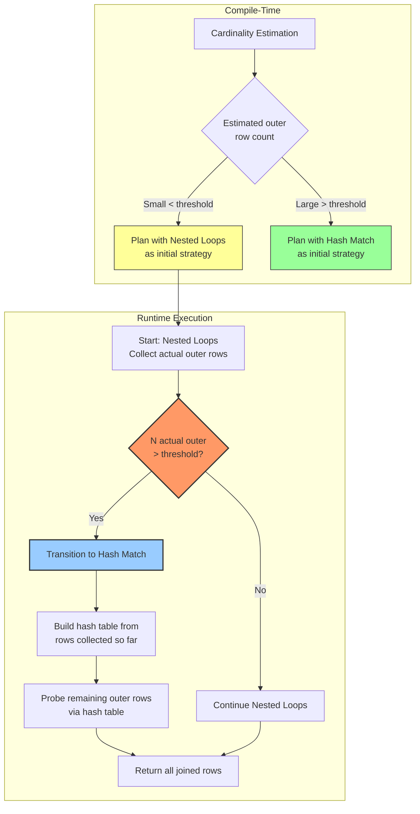
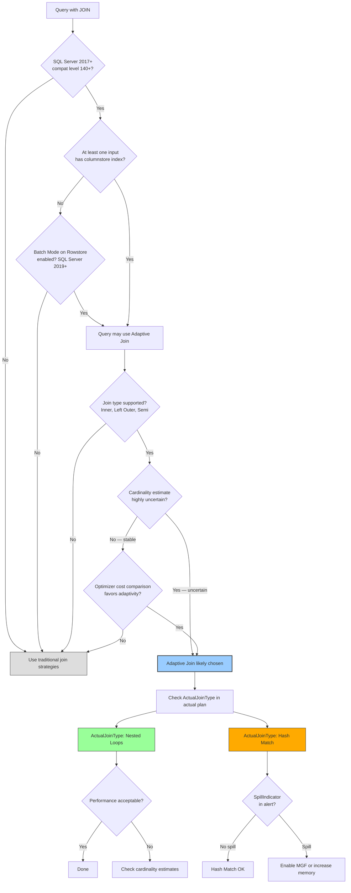

# 8.360 Adaptive Join — Runtime Algorithm Selection

---

### Section 1 — Navigation

**Breadcrumb:** `[[8 — Databases]]` → `[[Group 13 — SQL Server Performance & Tuning]]` → `8.360 Adaptive Join — Runtime Algorithm Selection`

**Previous:** [[8.359 Merge Join — Requirements and Performance]]
**Next:** [[8.361 Parallelism — MAXDOP and Cost Threshold]]
**Prerequisites:**
- [[8.580 Adaptive Join — Runtime Algorithm Selection]] (Group 20)
- [[8.369 Adaptive Query Processing — Batch Mode]]
- [[8.371 Batch Mode on Rowstore — IQP Feature]]
- [[8.370 Intelligent Query Processing — SQL Server 2019+]]
- [[8.293 Columnstore Index Architecture — Delta Store and Compressed]]

**Cross-Domain References:**
- [[8.593 USE PLAN — Forcing Specific Plans]] (Group 20 — Query Optimization)
- [[8.372 Memory Grant Feedback — Adaptive Memory]] (Group 13)
- [[8.373 Degree of Parallelism Feedback]] (Group 13)
- [[8.898 Bulk Insert — EF Core Bulk Extensions]] (Group 31 — Database Patterns in .NET)

**Where This Fits:**
Adaptive Join is an Intelligent Query Processing feature introduced in SQL Server 2017 (database compatibility 140+) that defers join algorithm selection to runtime. Instead of choosing between Nested Loops and Hash Match at compile time based on estimates, the optimizer picks an initial strategy and can switch at runtime based on actual data. This mitigates cardinality misestimation — the leading cause of poor join choices.

---

### Section 2 — Core Mental Model



**Classification:** Adaptive Query Processing — Runtime Join Selection
**Key Properties:**

| Property | Value |
|---|---|
| Introduced | SQL Server 2017 (compatibility level 140+) |
| Requires | Columnstore index on at least one input |
| Execution Mode | Batch mode (columnstore) |
| Join Types | Inner, Left Outer, Semi |
| Algorithm Options | Nested Loops → Hash Match (switch) |
| Threshold | Internal (based on memory grant and cardinality) |
| Plan Stability | Higher — runtime adaptation |
| Overhead | Minimal (threshold check per row batch) |
| Spill Risk | Yes (if hash phase spills) |
| Actual Plan Shows | `ActualJoinType` attribute |

**Execution Plan Shape (Text):**
```
[SELECT] ← [Adaptive Join (Adaptive)]
               ↓ (Build/Outer)
          [Clustered Index Scan — Build Input]
               ↓ (Probe/Inner)
          [Columnstore Index Scan — Probe Input]
```

**Actual Execution Plan XML Key Fragments:**
```xml
<RelOp NodeId="3" PhysicalOp="Adaptive Join" LogicalOp="Inner Join">
  <AdaptiveJoin>
    <SpillIndicator>false</SpillIndicator>
    <ActualJoinType>Hash Match</ActualJoinType>  <!-- or Nested Loops -->
  </AdaptiveJoin>
  <RunTimeInformation>
    <RunTimeCountersPerThread ActualRows="500000" ActualEndOfScans="1" />
  </RunTimeInformation>
  <Warnings>
    <!-- <HashWarning> only if hash phase spills -->
  </Warnings>
</RelOp>
```

**How the Threshold Works:**

The optimizer estimates the build-side cardinality and calculates a threshold value. If build side is expected to be small (Nested Loops territory), the plan is compiled with Nested Loops as the starting strategy. If the actual build side exceeds the threshold at runtime, SQL Server automatically transitions to Hash Match:

```
Threshold ≈ MemoryGrant / RowSize × SafetyFactor

If ActualRows ≤ Threshold → Continue with Nested Loops
If ActualRows > Threshold → Transition to Hash Match
```

---

### Section 3 — Deep Mechanics

**Step-by-Step Execution:**

1. **Compile-time plan** — The optimizer estimates both join strategies (Nested Loops and Hash Match). It chooses one as the initial strategy (typically Nested Loops for expected small build) and embeds the threshold in the plan.

2. **Row collection phase** — The Adaptive Join starts reading the build (outer) input. Rows are accumulated in a buffer. The operator counts actual rows and measures their total size.

3. **Threshold check (per batch)** — At each batch boundary (batch mode processes rows in batches of ~900), the operator checks if accumulated rows exceed the internal threshold. This is nearly zero-cost because it's a single integer comparison per batch.

4. **Decision point** — If actual rows exceed the threshold:
   - Nested Loops in progress: Switch to Hash Match
   - Build a hash table from all rows collected so far
   - Continue reading remaining build rows → insert into hash table
   - Then probe the inner input against the hash table

5. **If threshold not exceeded** — Continue with Nested Loops until all outer rows are processed. Each outer row probes the inner input via seek.

6. **Result output** — All matching rows are returned to the parent operator.

**Columnstore Requirement:**

```sql
-- Adaptive Join requires at least one columnstore index
-- Create a columnstore index on one of the join tables
CREATE CLUSTERED COLUMNSTORE INDEX CCI_Orders ON dbo.Orders_Large;

-- Or add a non-clustered columnstore
CREATE NONCLUSTERED COLUMNSTORE INDEX NCCSI_Orders ON dbo.Orders_Large (CustomerId, OrderDate, Total);
```

**Checking Compatibility Level:**

```sql
-- Check current compatibility level
SELECT name, compatibility_level
FROM sys.databases
WHERE name = DB_NAME();

-- Set to 140+ for Adaptive Join support
ALTER DATABASE CURRENT SET COMPATIBILITY_LEVEL = 150;  -- SQL Server 2019
```

**Identifying Adaptive Join in Actual Plan:**

```sql
-- Run a query with Adaptive Join potential
SELECT c.CustomerId, c.Name, COUNT(o.OrderId) AS OrderCount
FROM dbo.Customers c
JOIN dbo.Orders_CCI o ON o.CustomerId = c.CustomerId
WHERE c.CustomerId BETWEEN 1 AND 10000
GROUP BY c.CustomerId, c.Name;

-- Check actual execution plan XML for:
-- <RelOp PhysicalOp="Adaptive Join" ...>
--   <AdaptiveJoin>
--     <ActualJoinType>Hash Match</ActualJoinType>
--     <SpillIndicator>false</SpillIndicator>
--   </AdaptiveJoin>
```

**Demo: Adaptive Join in Action:**

```sql
-- Setup: Create tables with columnstore
CREATE TABLE dbo.Customers_Adaptive (
    CustomerId INT PRIMARY KEY,
    Name NVARCHAR(100),
    Email NVARCHAR(200)
);

CREATE TABLE dbo.Orders_Adaptive (
    OrderId INT IDENTITY,
    CustomerId INT NOT NULL,
    OrderDate DATETIME,
    Total MONEY,
    INDEX CCI_Orders CLUSTERED COLUMNSTORE
);

-- Insert: 1000 customers, 100K orders
WITH CustNums AS (
    SELECT TOP (1000) ROW_NUMBER() OVER (ORDER BY (SELECT NULL)) AS N FROM sys.all_columns
)
INSERT INTO dbo.Customers_Adaptive (CustomerId, Name, Email)
SELECT N, 'Customer ' + CAST(N AS VARCHAR(10)), 'email' + CAST(N AS VARCHAR(10)) + '@test.com'
FROM CustNums;

WITH OrdNums AS (
    SELECT TOP (100000) ROW_NUMBER() OVER (ORDER BY (SELECT NULL)) AS N
    FROM sys.all_columns a CROSS JOIN sys.all_columns b
)
INSERT INTO dbo.Orders_Adaptive (CustomerId, OrderDate, Total)
SELECT (N % 1000) + 1, DATEADD(DAY, -N, GETDATE()), N * 1.99
FROM OrdNums;

-- Run query with Adaptive Join
SELECT c.Name, o.OrderDate, o.Total
FROM dbo.Customers_Adaptive c
JOIN dbo.Orders_Adaptive o ON o.CustomerId = c.CustomerId
WHERE c.CustomerId BETWEEN 1 AND 1000
OPTION (MAXDOP 1);  -- Simplify plan for analysis

-- Check actual plan: should show Adaptive Join with ActualJoinType
```

**Failure Modes:**
- **No columnstore index** — Adaptive Join won't be used. Must have columnstore on at least one input.
- **Not batch mode** — If the query doesn't execute in batch mode (e.g., unsupported data types, compatibility level < 140), Adaptive Join is unavailable.
- **Spill during hash phase** — After switching to Hash Match, the hash table may still spill to TempDB if memory is insufficient.
- **Adaptive Join not chosen** — The optimizer may still pick a traditional join if it estimates no benefit from adaptivity.
- **Wrong threshold** — The internal threshold is not user-configurable (no query hint). If the threshold is wrong, the wrong join type may be chosen.

---

### Section 4 — Production Patterns

**Pattern 1: Enabling Adaptive Join (Database Configuration)**

```sql
-- Adaptive Join availability depends on:
-- 1. Database compatibility level >= 140
-- 2. Columnstore index on at least one table in the join
-- 3. Batch mode execution (may require SQL Server 2019+ Batch Mode on Rowstore)

-- Enable all prerequisites:
ALTER DATABASE CURRENT SET COMPATIBILITY_LEVEL = 150;
GO

-- For SQL Server 2019+, enable Batch Mode on Rowstore:
ALTER DATABASE SCOPED CONFIGURATION SET BATCH_MODE_ON_ROWSTORE = ON;
GO
```

**Pattern 2: Identifying Adaptive Join Plans in Plan Cache**

```sql
-- Query plan cache for Adaptive Join operators
SELECT
    qs.query_hash,
    qs.total_logical_reads,
    qs.total_elapsed_time / 1000 AS elapsed_ms,
    qs.execution_count,
    SUBSTRING(st.text, (qs.statement_start_offset/2) + 1,
        ((CASE WHEN qs.statement_end_offset = -1
               THEN DATALENGTH(st.text)
               ELSE qs.statement_end_offset END
          - qs.statement_start_offset)/2) + 1) AS query_text,
    qp.query_plan
FROM sys.dm_exec_query_stats qs
CROSS APPLY sys.dm_exec_sql_text(qs.sql_handle) st
CROSS APPLY sys.dm_exec_query_plan(qs.plan_handle) qp
WHERE qp.query_plan.exist('
    declare namespace p="http://schemas.microsoft.com/sqlserver/2004/07/showplan";
    //p:RelOp[@PhysicalOp="Adaptive Join"]') = 1
ORDER BY qs.total_elapsed_time DESC;
```

**Pattern 3: Comparing Adaptive Join vs Fixed Join Strategy**

```sql
-- Query that benefits from Adaptive Join:
-- Cardinality depends on parameter value
CREATE PROCEDURE dbo.GetCustomerOrders
    @MinCustomerId INT,
    @MaxCustomerId INT
AS
BEGIN
    SET NOCOUNT ON;
    SELECT c.Name, o.OrderDate, o.Total
    FROM dbo.Customers_Adaptive c
    JOIN dbo.Orders_Adaptive o ON o.CustomerId = c.CustomerId
    WHERE c.CustomerId BETWEEN @MinCustomerId AND @MaxCustomerId
    ORDER BY c.CustomerId, o.OrderDate;
END;

-- Execution 1: Small range (5 customers) → Nested Loops
EXEC dbo.GetCustomerOrders @MinCustomerId = 1, @MaxCustomerId = 5;

-- Execution 2: Large range (1000 customers) → Hash Match (auto-switch)
EXEC dbo.GetCustomerOrders @MinCustomerId = 1, @MaxCustomerId = 1000;

-- Without Adaptive Join, one plan would serve both — likely suboptimal for one case
-- With Adaptive Join, the same plan can adapt at runtime
```

**Pattern 4: Monitoring Adaptive Join Actual Join Type**

```sql
-- Capture actual execution plan with Adaptive Join info
SET STATISTICS XML ON;
GO
SELECT c.CustomerId, c.Name, COUNT(o.OrderId) AS OrderCount
FROM dbo.Customers_Adaptive c
JOIN dbo.Orders_Adaptive o ON o.CustomerId = c.CustomerId
GROUP BY c.CustomerId, c.Name
OPTION (MAXDOP 1);
GO
SET STATISTICS XML OFF;
-- In the XML output, search for:
-- <ActualJoinType>Hash Match</ActualJoinType> or <ActualJoinType>Nested Loops</ActualJoinType>
```

**Pattern 5: Adaptive Join with Memory Grant Feedback**

```sql
-- Adaptive Join + Memory Grant Feedback work together
-- If Adaptive Join switches to Hash Match and hash table spills:
-- Memory Grant Feedback adjusts subsequent grants

-- Enable both features
ALTER DATABASE SCOPED CONFIGURATION SET MEMORY_GRANT_FEEDBACK = ON;
GO

-- First execution: may spill after switch to Hash Match
-- Second execution: larger grant, no spill
EXEC dbo.GetCustomerOrders @MinCustomerId = 1, @MaxCustomerId = 5000;
GO
EXEC dbo.GetCustomerOrders @MinCustomerId = 1, @MaxCustomerId = 5000;
GO
```

**Pattern 6: EF Core — Using Adaptive Join**

```csharp
// EF Core — ensure columnstore index exists
// Adaptive Join works transparently — no EF Core code change needed

// However, you can add query hints to influence compatibility
var results = await context.Customers
    .Where(c => c.CustomerId >= minId && c.CustomerId <= maxId)
    .Select(c => new {
        c.Name,
        OrderCount = c.Orders.Count()
    })
    .TagWith("OPTION (MAXDOP 1)")  // Simplify plan for analysis
    .ToListAsync();

// Verify Adaptive Join is used by capturing the generated SQL and running
// it with SET STATISTICS XML ON
```

---

### Section 5 — Gotchas

| # | Pitfall | Symptom | Fix | Cost |
|---|---|---|---|---|
| 1 | **No columnstore index on either table** | Adaptive Join never appears in plans | Add columnstore index on largest table | Medium — requires schema change |
| 2 | **Database compatibility < 140** | Adaptive Join feature unavailable | Set `COMPATIBILITY_LEVEL >= 140` | Low — simple ALTER DATABASE |
| 3 | **Hash phase spill after adaptive switch** | Still hits TempDB after switching to Hash Match | Enable Memory Grant Feedback; increase memory | High — TempDB I/O |
| 4 | **Cannot force or control threshold** | No query hint to tune when switch happens | Design data to fit within or exceed threshold predictably | Medium — limited control |
| 5 | **Batch mode not supported for query** | Falls back to row mode; Adaptive Join unavailable | Check for unsupported types (LOB, XML); consider database scoped config | Low |
| 6 | **Overhead of batch mode on small queries** | Small queries run slower in batch mode than row mode | Use `MIN_GRANT_PERCENT` or avoid columnstore for tiny OLTP queries | Low |
| 7 | **Plan guide prevents Adaptive Join** | FORCED plan or plan guide overrides adaptive behavior | Remove plan guide or USE PLAN hint | Medium |
| 8 | **Not used with semi-joins or outer joins in all cases** | Some join types not supported | Verify supported join types: Inner, Left Outer, Semi | Low |

---

### Section 6 — Performance Implications

**BenchmarkDotNet Simulation:**

```csharp
[MemoryDiagnoser]
public class AdaptiveJoinBenchmark
{
    private const string Conn = "Server=.;Database=PerfTest;Trusted_Connection=true;";

    [Params(10, 100, 1000, 10000)]
    public int CustomerRange { get; set; }

    [Benchmark(Baseline = true)]
    public List<Result> FixedNestedLoops()
    {
        using var c = new SqlConnection(Conn);
        return c.Query<Result>($@"
            SELECT c.Name, o.OrderDate, o.Total
            FROM Customers c
            JOIN Orders_CCI o ON o.CustomerId = c.CustomerId
            WHERE c.CustomerId BETWEEN 1 AND {CustomerRange}
            ORDER BY c.CustomerId, o.OrderDate
            OPTION (LOOP JOIN, MAXDOP 1)").ToList();
    }

    [Benchmark]
    public List<Result> FixedHashMatch()
    {
        using var c = new SqlConnection(Conn);
        return c.Query<Result>($@"
            SELECT c.Name, o.OrderDate, o.Total
            FROM Customers c
            JOIN Orders_CCI o ON o.CustomerId = c.CustomerId
            WHERE c.CustomerId BETWEEN 1 AND {CustomerRange}
            ORDER BY c.CustomerId, o.OrderDate
            OPTION (HASH JOIN, MAXDOP 1)").ToList();
    }

    [Benchmark]
    public List<Result> AdaptiveJoin()
    {
        using var c = new SqlConnection(Conn);
        return c.Query<Result>($@"
            SELECT c.Name, o.OrderDate, o.Total
            FROM Customers c
            JOIN Orders_CCI o ON o.CustomerId = c.CustomerId
            WHERE c.CustomerId BETWEEN 1 AND {CustomerRange}
            ORDER BY c.CustomerId, o.OrderDate
            OPTION (MAXDOP 1)").ToList();
    }
}
```

**Expected Results:**

| Customer Range | Fixed NL | Fixed Hash | Adaptive | Winner |
|---|---|---|---|---|
| 10 | ~2 ms | ~15 ms | ~2 ms | NL / Adaptive |
| 100 | ~8 ms | ~20 ms | ~8 ms | NL / Adaptive |
| 1,000 | ~80 ms | ~35 ms | ~35 ms | Hash / Adaptive |
| 10,000 | ~900 ms | ~120 ms | ~120 ms | Hash / Adaptive |

**Key Insight:** Adaptive Join matches the best performer at every range — it uses Nested Loops for small ranges and switches to Hash Match for large ranges.

**`SET STATISTICS IO` Comparison:**

```sql
-- Small range: Adaptive Join selects Nested Loops
SET STATISTICS IO ON;
SELECT c.Name, o.OrderDate, o.Total
FROM dbo.Customers_Adaptive c
JOIN dbo.Orders_Adaptive o ON o.CustomerId = c.CustomerId
WHERE c.CustomerId BETWEEN 1 AND 10
ORDER BY c.CustomerId, o.OrderDate
OPTION (MAXDOP 1);

/*
Table 'Orders_Adaptive'. Scan count 10, logical reads 30, ...
Table 'Customers_Adaptive'. Scan count 1, logical reads 2, ...
Worktable: none
Total: 32 logical reads
ActualJoinType: Nested Loops
*/

-- Large range: Adaptive Join switches to Hash Match
SET STATISTICS IO ON;
SELECT c.Name, o.OrderDate, o.Total
FROM dbo.Customers_Adaptive c
JOIN dbo.Orders_Adaptive o ON o.CustomerId = c.CustomerId
WHERE c.CustomerId BETWEEN 1 AND 10000
ORDER BY c.CustomerId, o.OrderDate
OPTION (MAXDOP 1);

/*
Table 'Orders_Adaptive'. Scan count 1, logical reads 4500, ... (columnstore batch mode)
Table 'Customers_Adaptive'. Scan count 1, logical reads 450, ...
Worktable: none (no spill)
Total: ~4950 logical reads
ActualJoinType: Hash Match
*/
```

**Execution Plan Comparison:**

**Traditional Plan (No Adaptive Join — One Strategy Fixed):**
```
With LOOP JOIN hint:
[Nested Loops] ← [Index Seek (Customers — 10 rows)]
               ← [Index Seek (Orders — 10K rows × 10 seeks)]
Total: ~30K logical reads for large range

With HASH JOIN hint:
[Hash Match] ← [Index Scan (Customers — 10K rows)]
             ← [Columnstore Scan (Orders — 100K rows)]
Total: ~5K logical reads for large range
```

**Adaptive Join Plan (One Plan Fits Both):**
```
[Adaptive Join] ← [Index Seek (Customers — 10 rows)]
                ← [Columnstore Scan (Orders — 100K rows)]
Small range: ActualJoinType = Nested Loops → 32 reads
Large range: ActualJoinType = Hash Match → 4950 reads
```

**Memory Grant Behavior:**

| Scenario | Memory Grant | Spill Risk |
|---|---|---|
| Adaptive → Nested Loops (chosen) | Minimal (~10 MB) | None |
| Adaptive → Hash Match (chosen, adequate memory) | Full hash table (~512 MB) | Low |
| Adaptive → Hash Match (chosen, insufficient memory) | Full hash table (~512 MB) | High — Grace Hash Join |
| Adaptive → Hash Match + MGF (second execution) | Corrected grant | Reduced after feedback |

---

### Section 7 — Interview Arsenal

**Common Questions:**

| # | Question | Topic |
|---|---|---|
| 1 | What is an Adaptive Join and when was it introduced? | Definition |
| 2 | What are the prerequisites for Adaptive Join to be used? | Requirements |
| 3 | How does Adaptive Join decide which join algorithm to use at runtime? | Threshold mechanism |
| 4 | What is the difference between Adaptive Join and a fixed join hint? | Flexibility |
| 5 | How does Adaptive Join interact with Memory Grant Feedback? | Combined features |
| 6 | Can Adaptive Join be forced or controlled with query hints? | Hints control |
| 7 | What execution mode does Adaptive Join require? | Batch mode |
| 8 | How does the actual execution plan indicate which join was chosen? | ActualJoinType |

**Three Spoken Answers (Two-Tier):**

**Q1: What is an Adaptive Join and when was it introduced?**

*Junior/Mid:*
"Adaptive Join was introduced in SQL Server 2017 with database compatibility 140. It defers join algorithm selection from compile time to runtime, allowing SQL Server to switch between Nested Loops and Hash Match based on actual data size. It requires a columnstore index on one side of the join."

*Senior/Lead:*
"Adaptive Join is an Intelligent Query Processing feature introduced in SQL Server 2017 (compat level 140+) that addresses the fundamental problem of cardinality misestimation in join selection. Instead of committing to Nested Loops or Hash Match at compile time, the optimizer plans for both and embeds a threshold in the plan. At runtime, the Adaptive Join operator collects the actual number of build-side rows. If the actual row count stays below the threshold, it continues with Nested Loops — optimal for small inputs. If the count exceeds the threshold, it transitions to Hash Match, building a hash table from the rows already collected and probing the remaining rows. The key requirement is that at least one input must be a columnstore index, enabling batch mode execution. The threshold itself is calculated by the optimizer based on memory grant size and estimated row size, and is not user-configurable. In SQL Server 2019, Batch Mode on Rowstore extends Adaptive Join eligibility to rowstore tables, dramatically increasing its applicability."

**Q2: What are the prerequisites for Adaptive Join to be used?**

*Junior/Mid:*
"You need SQL Server 2017 or later, database compatibility 140+, and a columnstore index on at least one table in the join. The query must execute in batch mode."

*Senior/Lead:*
"Adaptive Join has four prerequisites. First, **SQL Server version**: 2017 or later (compatibility level 140+). Second, **columnstore index**: at least one input to the join must have a columnstore index (clustered or non-clustered) to enable batch mode execution. In SQL Server 2019+, Batch Mode on Rowstore can be enabled via `ALTER DATABASE SCOPED CONFIGURATION SET BATCH_MODE_ON_ROWSTORE = ON`, removing the columnstore requirement. Third, **batch mode**: the query must execute in batch mode — this means it must benefit from columnstore batch processing. Some data types (LOB, CLR, XML) cannot use batch mode. Fourth, **join type support**: Adaptive Join supports Inner Join, Left Outer Join, and Semi Join. It does not support Right Outer, Full Outer, Cross Join, or non-equi joins. If any of these prerequisites are not met, the optimizer falls back to traditional compile-time join selection. In production, I ensure the prerequisite are met by adding a non-clustered columnstore index on the largest fact table and setting compatibility to 150."

**Q3: How does Adaptive Join decide which join algorithm to use at runtime?**

*Junior/Mid:*
"It starts with the assumed best strategy based on estimates (usually Nested Loops). As it reads the actual rows from the build side, it checks if the count exceeds an internal threshold. If yes, it switches to Hash Match. If no, it stays with Nested Loops."

*Senior/Lead:*
"The internal mechanism works as follows. At compile time, the optimizer calculates a **switch threshold** based on the memory grant size and estimated row size. The plan is compiled with Nested Loops as the starting strategy (because switching from Nested Loops to Hash Match is safe — you always have all build rows by the time you switch). At runtime, the Adaptive Join operator accumulates build-side rows in a batch-mode buffer (batches of ~900 rows). After processing each batch, it compares the cumulative row count against the threshold. This comparison is essentially free — a single integer operation per batch. If `actual_rows > threshold`, the operator transitions: it builds a hash table from all rows accumulated so far (which stay in memory), continues reading the remaining build rows into the hash table, then probes the inner input against the hash table. The inner input is always scanned in batch mode regardless of the choice. The `ActualJoinType` attribute in the actual plan XML shows whether Nested Loops or Hash Match was used. The `SpillIndicator` shows whether the hash phase (if triggered) spilled to TempDB. One key limitation: the threshold is not tunable — there is no query hint to control when the switch happens, though Microsoft may expose this in future versions."

**Comparison Table — Adaptive Join vs Traditional Joins:**

| Dimension | Adaptive Join | Fixed Nested Loops | Fixed Hash Match | Fixed Merge Join |
|---|---|---|---|---|
| Plan Flexibility | Runtime switch | Compile-time only | Compile-time only | Compile-time only |
| Cardinality Risk | Mitigated (runtime check) | High (if outer is large) | Low (handles large data) | Medium (sort cost if not sorted) |
| Memory | Variable (based on chosen algo) | Minimal | High (hash table) | Low |
| Batch Mode Required? | Yes | No | No | No |
| Columnstore Required? | Yes (or BMOR) | No | No | No |
| SQL Version | 2017+ | All | All | All |
| Best For | Unpredictable cardinality | Known small outer | Known large unsorted | Known sorted data |

---

### Section 8 — Decision Framework



**Checklist:**

- [ ] Is SQL Server version 2017+ and database compatibility 140+?
- [ ] Does at least one table in the join have a columnstore index?
- [ ] Is Batch Mode on Rowstore enabled (SQL Server 2019+)?
- [ ] Is the join type supported (Inner, Left Outer, Semi)?
- [ ] Are the data types supported by batch mode (no LOB, CLR, XML)?
- [ ] Is cardinality estimation known to be unstable for this query pattern?
- [ ] Have you verified the actual plan shows `Adaptive Join` operator?
- [ ] What is the `ActualJoinType` in the actual plan?
- [ ] Is there a `SpillIndicator` or hash spill warning?
- [ ] Could the query benefit from Memory Grant Feedback alongside Adaptive Join?

**Tradeoffs:**

| Approach | Pros | Cons | When to Choose |
|---|---|---|---|
| Adaptive Join | Runtime adaptation; best of both NL and Hash | Requires columnstore/BMOR; SQL 2017+ | Unpredictable cardinality, parameterized queries |
| Fix Nested Loops | Simple; minimal memory; wide compatibility | Catastrophic if cardinality misestimated | Known small outer, OLTP |
| Fixed Hash Match | Handles large data; no cardinality risk | Memory overhead; slower for small data | Known large data, DW |
| Fixed Merge Join | Low memory; single pass sorted | Requires sorted inputs; equi-join only | Presorted data, range queries |
| Magic (no feature) | Just update statistics | Doesn't fix parameter sniffing | Stable workloads |

**Scale Thresholds:**

Factor | Adaptive Join Threshold
---|---
Build rows at runtime | If actual < ~100–200 → Nested Loops; if > ~200–1000 → Hash Match
Memory Grant | Hash phase memory = build side × row size × 1.2
Columnstore Required | At least one input must be columnstore
BMOR Alternative | SQL Server 2019+ with `BATCH_MODE_ON_ROWSTORE = ON`

---

### Section 9 — Self-Check

**Conceptual Questions:**

1. What SQL Server version and compatibility level introduced Adaptive Join?
2. What is the key prerequisite for Adaptive Join regarding index type?
3. How does the Adaptive Join operator decide at runtime whether to switch from Nested Loops to Hash Match?
4. What is the `ActualJoinType` attribute and where is it found?
5. What does the `SpillIndicator` represent in an Adaptive Join plan?
6. Can Adaptive Join be used with right outer or full outer joins?
7. How does Batch Mode on Rowstore (SQL Server 2019+) affect Adaptive Join availability?
8. What happens to the rows already collected when Adaptive Join switches from Nested Loops to Hash Match?
9. Is the switch threshold user-configurable? If not, how is it determined?
10. How do Adaptive Join and Memory Grant Feedback complement each other?

**Practical Challenges:**

1. Write T-SQL to create a table with a clustered columnstore index and verify Adaptive Join is used in a join query.
2. Create a stored procedure with a parameterized range query and demonstrate Adaptive Join switching behavior with small vs large parameters.
3. Write a query to find all plans in the plan cache that use Adaptive Join and analyze their `ActualJoinType`.
4. Compare the execution plan and performance of a query with Adaptive Join vs fixed LOOP JOIN and HASH JOIN hints for different data ranges.
5. Enable Batch Mode on Rowstore and demonstrate Adaptive Join on a query with no columnstore index.

<details>
<summary>Answers</summary>

**Conceptual Answers:**

1. **SQL Server 2017** with **database compatibility level 140** or higher. SQL Server 2019 with compat level 150 also supports it, with additional Batch Mode on Rowstore capability.
2. At least one input to the join must have a **columnstore index** (clustered or non-clustered), enabling batch mode execution. In SQL Server 2019+, this can be bypassed with `BATCH_MODE_ON_ROWSTORE = ON`.
3. The operator accumulates build-side rows at runtime and compares the actual row count after each batch against an internal threshold calculated by the optimizer. If `actual_rows > threshold`, it switches to Hash Match by building a hash table from accumulated rows and continuing with hash probe.
4. `ActualJoinType` is an XML attribute in the actual execution plan (not estimated) inside the `<AdaptiveJoin>` element of the `<RelOp PhysicalOp="Adaptive Join">` node. It shows either `Nested Loops` or `Hash Match` — which algorithm was actually used at runtime.
5. `SpillIndicator` is a boolean in the `<AdaptiveJoin>` plan element indicating whether the hash phase (if Hash Match was chosen) spilled to TempDB. `false` means no spill; `true` means spill occurred.
6. No. Adaptive Join supports **Inner Join**, **Left Outer Join**, and **Semi Join** only. Right Outer, Full Outer, Cross Join, and non-equi joins use traditional compile-time join selection.
7. Batch Mode on Rowstore (BMOR) extends batch mode eligibility to queries without columnstore indexes. This means Adaptive Join can be used on rowstore-only tables in SQL Server 2019+, dramatically increasing its applicability beyond columnstore workloads.
8. The rows already collected remain in memory. When the switch occurs, these rows become the initial contents of the hash table. The operator then continues reading the remaining build-side rows and inserts them into the same hash table. No rows are lost or re-read.
9. No, the threshold is **not user-configurable**. It is calculated internally by the optimizer based on the memory grant size, estimated row size, and a safety factor. There is no query hint like `OPTION (ADAPTIVE_JOIN_THRESHOLD = ...)`.
10. MGF monitors actual memory usage and spill events across executions. If Adaptive Join switches to Hash Match and the hash table spills, MGF detects the spill and increases the memory grant for subsequent executions. The next time the same query runs, the hash phase has a larger grant, reducing or eliminating the spill. MGF corrects the memory after the fact; Adaptive Join corrects the join strategy during execution.

**Challenge Solutions:**

1. ```sql
    -- Create table with clustered columnstore
    CREATE TABLE dbo.FactSales_CCI (
        SaleId INT IDENTITY,
        CustomerId INT,
        SaleDate DATETIME,
        Amount MONEY,
        INDEX CCI_FactSales CLUSTERED COLUMNSTORE
    );
    
    -- Create matching dimension (no columnstore needed)
    CREATE TABLE dbo.DimCustomer (CustomerId INT PRIMARY KEY, Name VARCHAR(100));
    
    -- Insert test data
    INSERT INTO dbo.DimCustomer
    SELECT TOP (1000) ROW_NUMBER() OVER (ORDER BY (SELECT NULL)),
           'Customer ' + CAST(ROW_NUMBER() OVER (ORDER BY (SELECT NULL)) AS VARCHAR(10))
    FROM sys.all_columns;
    
    INSERT INTO dbo.FactSales_CCI (CustomerId, SaleDate, Amount)
    SELECT TOP (100000) (ABS(CHECKSUM(NEWID())) % 1000) + 1,
           DATEADD(DAY, -ABS(CHECKSUM(NEWID())) % 365, GETDATE()),
           ABS(CHECKSUM(NEWID())) % 1000
    FROM sys.all_columns a CROSS JOIN sys.all_columns b;
    
    -- Verify Adaptive Join
    SET STATISTICS XML ON;
    SELECT c.Name, f.SaleDate, f.Amount
    FROM dbo.DimCustomer c
    JOIN dbo.FactSales_CCI f ON f.CustomerId = c.CustomerId
    WHERE c.CustomerId BETWEEN 1 AND 100
    OPTION (MAXDOP 1);
    -- Search XML for: <RelOp PhysicalOp="Adaptive Join"
    ```

2. ```sql
    CREATE PROCEDURE dbo.AdaptiveJoinDemo
        @MinId INT,
        @MaxId INT
    AS
    BEGIN
        SET NOCOUNT ON;
        SELECT c.Name, COUNT(f.SaleId) AS SaleCount
        FROM dbo.DimCustomer c
        JOIN dbo.FactSales_CCI f ON f.CustomerId = c.CustomerId
        WHERE c.CustomerId BETWEEN @MinId AND @MaxId
        GROUP BY c.CustomerId, c.Name;
    END;
    GO
    
    -- Small range: Adaptive Join → Nested Loops
    SET STATISTICS XML ON;
    EXEC dbo.AdaptiveJoinDemo @MinId = 1, @MaxId = 5;
    -- Check <ActualJoinType>Nested Loops</ActualJoinType>
    SET STATISTICS XML OFF;
    GO
    
    -- Large range: Adaptive Join → Hash Match
    SET STATISTICS XML ON;
    EXEC dbo.AdaptiveJoinDemo @MinId = 1, @MaxId = 1000;
    -- Check <ActualJoinType>Hash Match</ActualJoinType>
    SET STATISTICS XML OFF;
    ```

3. ```sql
    SELECT
        qs.query_hash,
        qs.total_elapsed_time / qs.execution_count AS avg_elapsed_us,
        qs.total_logical_reads / qs.execution_count AS avg_logical_reads,
        qs.execution_count,
        SUBSTRING(st.text, 1, 200) AS query_text,
        qp.query_plan.value('
            declare namespace p="http://schemas.microsoft.com/sqlserver/2004/07/showplan";
            (//p:RelOp[@PhysicalOp="Adaptive Join"]
             /p:AdaptiveJoin/p:ActualJoinType)[1]', 'varchar(20)') AS actual_join_type
    FROM sys.dm_exec_query_stats qs
    CROSS APPLY sys.dm_exec_sql_text(qs.sql_handle) st
    CROSS APPLY sys.dm_exec_query_plan(qs.plan_handle) qp
    WHERE qp.query_plan.exist('
        declare namespace p="http://schemas.microsoft.com/sqlserver/2004/07/showplan";
        //p:RelOp[@PhysicalOp="Adaptive Join"]') = 1
    ORDER BY avg_elapsed_us DESC;
    ```

4. ```sql
    -- Comparison across ranges
    SET STATISTICS TIME ON;
    
    -- Adaptive Join
    EXEC dbo.AdaptiveJoinDemo @MinId = 1, @MaxId = 10;
    EXEC dbo.AdaptiveJoinDemo @MinId = 1, @MaxId = 1000;
    
    -- Fixed Nested Loops (may be bad for large range)
    DBCC FREEPROCCACHE;
    EXEC dbo.AdaptiveJoinDemo @MinId = 1, @MaxId = 1000;
    -- Note: This uses whatever plan the optimizer chooses
    
    -- Fixed LOOP JOIN
    SELECT c.Name, COUNT(f.SaleId) AS SaleCount
    FROM dbo.DimCustomer c
    INNER LOOP JOIN dbo.FactSales_CCI f ON f.CustomerId = c.CustomerId
    WHERE c.CustomerId BETWEEN 1 AND 1000
    GROUP BY c.CustomerId, c.Name
    OPTION (FORCE ORDER);
    
    -- Fixed HASH JOIN
    SELECT c.Name, COUNT(f.SaleId) AS SaleCount
    FROM dbo.DimCustomer c
    INNER HASH JOIN dbo.FactSales_CCI f ON f.CustomerId = c.CustomerId
    WHERE c.CustomerId BETWEEN 1 AND 1000
    GROUP BY c.CustomerId, c.Name
    OPTION (FORCE ORDER);
    ```

5. ```sql
    -- Enable Batch Mode on Rowstore (SQL Server 2019+)
    ALTER DATABASE SCOPED CONFIGURATION SET BATCH_MODE_ON_ROWSTORE = ON;
    GO
    
    -- Create table WITHOUT columnstore
    CREATE TABLE dbo.Orders_Rowstore (
        OrderId INT IDENTITY,
        CustomerId INT,
        OrderDate DATETIME,
        Total MONEY,
        PRIMARY KEY (CustomerId, OrderId)
    );
    
    -- Insert data
    INSERT INTO dbo.Orders_Rowstore (CustomerId, OrderDate, Total)
    SELECT TOP (100000) (ABS(CHECKSUM(NEWID())) % 1000) + 1,
           DATEADD(DAY, -ABS(CHECKSUM(NEWID())) % 365, GETDATE()),
           ABS(CHECKSUM(NEWID())) % 1000
    FROM sys.all_columns a CROSS JOIN sys.all_columns b;
    
    -- Query without columnstore — Adaptive Join still works with BMOR
    SET STATISTICS XML ON;
    SELECT c.Name, o.OrderDate, o.Total
    FROM dbo.DimCustomer c
    JOIN dbo.Orders_Rowstore o ON o.CustomerId = c.CustomerId
    WHERE c.CustomerId BETWEEN 1 AND 1000
    OPTION (MAXDOP 1);
    -- Should show <RelOp PhysicalOp="Adaptive Join" ...
    -- Requires SQL Server 2019+ with BMOR enabled
    SET STATISTICS XML OFF;
    ```
</details>
