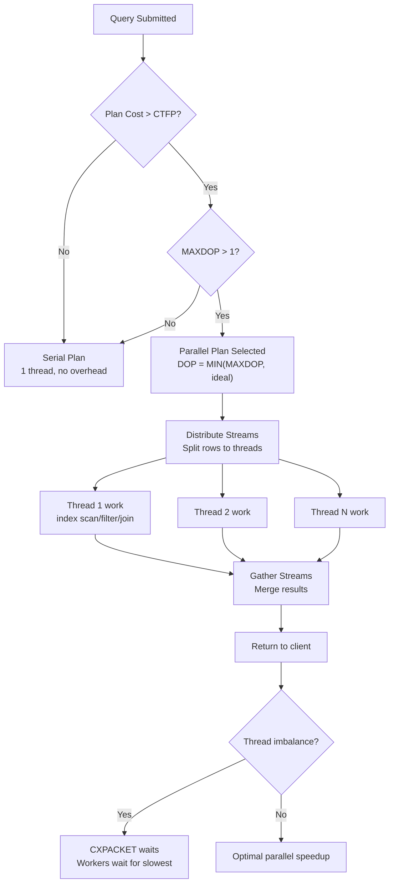
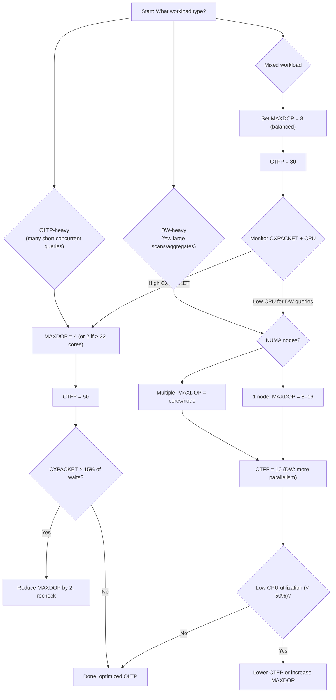

# 8.361 Parallelism — MAXDOP and Cost Threshold

## Section 1 — Navigation

**Breadcrumb:** `8 — Databases` → `Group 13 — SQL Server Performance & Tuning` → `8.361 Parallelism — MAXDOP and Cost Threshold`

| Direction | Reference | Why |
|-----------|-----------|-----|
| **Prev** | [[8.360 Adaptive Join — Runtime Algorithm Selection]] | Adaptive join selects between hash/merge/nested loops at runtime, which can benefit from parallel execution |
| **Next** | [[8.362 Parallelism — Skewed Distribution Issues]] | After setting MAXDOP, skewed distribution is the next parallelism pain point |
| **Prerequisite** | [[8.343 Execution Plans — Reading Graphical Plans]] | You must read parallel operators (Distribute Streams, Repartition Streams, Gather Streams) |
| **Prerequisite** | [[8.346 Plan Cache — How SQL Server Reuses Plans]] | Parallel plans are costed higher and may not be cached/reused identically on different DOP settings |
| **Domain 8 Cross-ref** | [[8.366 SET STATISTICS IO — Reading Logical Reads]] | Logical reads per parallel thread is the key metric |
| **Domain 8 Cross-ref** | [[8.367 SET STATISTICS TIME — Parse and Execute Time]] | Elapsed vs CPU time reveals parallel efficiency |
| **Domain 8 Cross-ref** | [[8.368 sys.dm_exec_query_profiles — Live Query Statistics]] | Live row counts per thread at runtime |
| **Cross-domain** | [[2.52 Process and Thread Management (Windows)]] | SQL Server scheduler (SOS) maps to Windows thread pool; NUMA topology |

**Where This Fits:** Parallelism is SQL Server's mechanism to divide a single query's work across multiple CPU cores. Two knobs control it: `MAXDOP` (max degree of parallelism, caps the number of threads per query) and **cost threshold for parallelism** (CTFP, default 5 — any plan with estimated cost > 5 is eligible). Misconfiguration causes CXPACKET waits (too much parallelism for OLTP) or missed performance (too little parallelism for DW). Correct settings depend on workload type, NUMA topology, and core count.

Common ground: `MAXDOP` limits intra-query parallelism (one query's threads). `CTFP` controls which queries go parallel. Both are **instance-level** `sp_configure` settings, overrideable at DB (`ALTER DATABASE SCOPED CONFIGURATION`) or query level (`MAXDOP` hint).

---

## Section 2 — Core Mental Model

**Mental Model — "The Fork-Join Factory"**

Think of a query as a factory assembly line. One worker (serial plan) moves at normal speed. When the query cost exceeds a threshold (CTFP = 5), the foreman decides to fork the work: multiple workers (parallel threads) each handle a subset of rows. MAXDOP is the maximum number of workers allowed on the floor. The **gather streams** operator is the conveyor belt where workers hand off their output. If too many workers crowd the floor (MAXDOP too high), they bump into each other (CXPACKET waits) and productivity drops.



**Classification:** Intra-query parallelism (one query, multiple threads). Not to be confused with intra-operation parallelism (DOP inside a single operator like a parallel scan) — but in SQL Server these are the same concept; DOP applies to all operators in the plan.

**Key Properties:**

| Property | Description | Default / Recommendation |
|----------|-------------|--------------------------|
| `MAXDOP` | Maximum number of processor cores used by a single query | OLTP: ≤ 8; DW: ≤ #cores per NUMA node; Instance: `sp_configure 'max degree of parallelism'` |
| `cost threshold for parallelism` | Estimated plan cost threshold above which parallel plans are considered | Default 5; raise to 25–50 for pure OLTP; lower to 3–5 for DW |
| `CXPACKET` wait type | Occurs when one parallel thread finishes and waits for others | Normal in DW; problematic in OLTP when excessive (indicates over-parallelization) |
| `CXCONSUMER` wait type | Consumer threads waiting for producer (SQL 2012+ split from CXPACKET) | Often from skewed distribution, not MAXDOP itself |
| DOP feedback | Adaptive query processing feature (SQL 2017+) that adjusts DOP on repeat executions | Reduces repeated CXPACKET waits automatically |
| NUMA node | Group of processors sharing memory bus | Preferred MAXDOP ≤ cores per NUMA node to avoid cross-NUMA memory latency |
| Scheduler | SOS scheduler maps to one logical processor | Each parallel thread gets one scheduler |

---

## Section 3 — Deep Mechanics

### Step-by-step Parallel Plan Selection

1. **Optimization phase:** The Query Optimizer produces both serial and parallel plan candidates. Parallel plans are costed with overhead for exchange operators (distribute/gather).
2. **Cost comparison:** If the cheapest serial plan has cost > `cost threshold for parallelism`, the optimizer considers parallel plans.
3. **DOP selection:** SQL Server computes a "degree of parallelism" using:
   - Instance-level MAXDOP
   - Resource governor cap
   - Workload group settings
   - Available schedulers (affinity mask)
   - The final DOP = `MIN(MAXDOP, available_schedulers, query_hint, RG_cap)`
4. **Plan compilation:** The parallel plan includes **exchange operators** — `Distribute Streams`, `Repartition Streams`, `Gather Streams`. Each operator adds ~1% CPU overhead per thread.
5. **Execution:** The query is split into `DOP` parallel threads. The `parallelism` operator in the plan shows `Actual DOP` in actual execution plans.

### DMV / Plan Analysis

```sql
-- Check MAXDOP and CTFP configuration
SELECT name, value, value_in_use, is_value_default
FROM sys.configurations
WHERE name IN ('max degree of parallelism', 'cost threshold for parallelism');
GO

-- Find queries with high degree of parallelism
SELECT TOP 20
    qs.total_worker_time / 1000 AS total_worker_ms,
    qs.total_elapsed_time / 1000 AS total_elapsed_ms,
    qs.execution_count,
    qs.total_worker_time / NULLIF(qs.execution_count, 0) / 1000 AS avg_worker_ms,
    qs.total_elapsed_time / NULLIF(qs.execution_count, 0) / 1000 AS avg_elapsed_ms,
    qs.total_logical_reads / NULLIF(qs.execution_count, 0) AS avg_logical_reads,
    qs.min_dop,
    qs.max_dop,
    qs.last_dop,
    SUBSTRING(st.text, (qs.statement_start_offset / 2) + 1,
        ((CASE WHEN qs.statement_end_offset = -1 THEN DATALENGTH(st.text)
          ELSE qs.statement_end_offset END - qs.statement_start_offset) / 2) + 1) AS query_text,
    qp.query_plan
FROM sys.dm_exec_query_stats qs
CROSS APPLY sys.dm_exec_sql_text(qs.sql_handle) st
CROSS APPLY sys.dm_exec_query_plan(qs.plan_handle) qp
WHERE qs.max_dop > 1
ORDER BY qs.total_worker_time DESC;
GO

-- Identify CXPACKET waits
SELECT
    wait_type,
    waiting_tasks_count,
    wait_time_ms,
    max_wait_time_ms,
    signal_wait_time_ms
FROM sys.dm_os_wait_stats
WHERE wait_type in ('CXPACKET', 'CXCONSUMER')
ORDER BY wait_time_ms DESC;
GO

-- Live parallel thread distribution
SELECT
    session_id,
    request_id,
    task_state,
    scheduler_id,
    worker_address,
    pending_io_count
FROM sys.dm_os_tasks
WHERE session_id > 50
ORDER BY session_id, task_state;
GO

-- Count parallel threads per session
SELECT
    session_id,
    COUNT(*) AS thread_count
FROM sys.dm_os_tasks
WHERE session_id = <your_spid>
GROUP BY session_id;
GO
```

### Failure Modes

| Failure Mode | Symptom | Detection | Fix |
|-------------|---------|-----------|-----|
| Over-parallelized OLTP | High CXPACKET, CPU > 80%, low throughput per query | `sys.dm_os_wait_stats` shows CXPACKET > 20% of total waits | Lower MAXDOP to 4 or 2 for OLTP workload |
| Under-parallelized DW | Low CPU utilization (< 50%), high elapsed time for large scans | Check actual DOP in plan, verify CTFP not too high | Lower CTFP or increase MAXDOP |
| Cross-NUMA parallelism | High memory latency, non-uniform thread performance | Check NUMA node assignment in `sys.dm_os_tasks` + `sys.dm_os_nodes` | Set MAXDOP ≤ cores per NUMA node |
| CTFP too low for mixed workload | Small quick queries go parallel, wasting overhead | `sys.dm_exec_query_stats` shows many cheap queries (cost ~5-10) with DOP > 1 | Raise CTFP to 25–50 to skip trivial queries |
| MAXDOP at 0 | Uses all schedulers, potential CPU oversubscription | CPU > 90% for single query session | Set MAXDOP to a finite value (e.g., 8) |

### NUMA-Aware Parallelism Details

On a 4-NUMA-node server with 16 cores per node (64 total):
- MAXDOP = 0 → each parallel query can use up to 64 threads, but threads are spread across all 4 NUMA nodes → cross-NUMA memory access is 1.5-2x slower
- MAXDOP = 16 → threads stay within one NUMA node, memory access is local → faster per-thread performance
- Recommendation: `MAXDOP = cores_per_NUMA_node` for DW, `MAXDOP = 4` (or 2) for OLTP regardless of NUMA

---

## Section 4 — Production Patterns

### Pattern 1 — Set Instance-Level MAXDOP and CTFP

```sql
-- Recommended for OLTP-heavy workload on 64-core, 4-NUMA-node server
EXEC sp_configure 'max degree of parallelism', 4;
EXEC sp_configure 'cost threshold for parallelism', 50;
RECONFIGURE;
GO

-- Check after setting
SELECT name, value_in_use
FROM sys.configurations
WHERE name IN ('max degree of parallelism', 'cost threshold for parallelism');
GO
```

**Pattern 1b — Database Scoped Configuration (SQL 2017+)**

```sql
ALTER DATABASE SCOPED CONFIGURATION SET MAXDOP = 8;
ALTER DATABASE SCOPED CONFIGURATION SET PARALLEL_COST_REFERENCE = 50;
GO
```

### Pattern 2 — Query Hint Override

```sql
-- Force serial execution for a specific query
SELECT *
FROM dbo.Orders
WHERE OrderDate >= '2025-01-01'
ORDER BY OrderID
OPTION (MAXDOP 1);
GO

-- Limit DOP for a specific query
SELECT CustomerID, COUNT(*) AS OrderCount
FROM dbo.Orders
GROUP BY CustomerID
OPTION (MAXDOP 2);
GO
```

### Pattern 3 — Resource Governor Cap

```sql
-- Create workload group with MAXDOP cap
CREATE WORKLOAD GROUP DW_Queries
WITH (MAX_DOP = 8);
GO

ALTER RESOURCE GOVERNOR RECONFIGURE;
GO
```

### Pattern 4 — DOP Feedback (SQL 2017+) Automatic Correction

```sql
-- Verify DOP feedback is enabled (default on since SQL 2017)
SELECT name, value, value_in_use
FROM sys.dm_db_log_stats;
GO

-- Check DOP feedback adjustments
SELECT
    qp.query_plan,
    qs.last_dop,
    qs.min_dop,
    qs.max_dop,
    qs.total_worker_time / qs.execution_count AS avg_worker_time
FROM sys.dm_exec_query_stats qs
CROSS APPLY sys.dm_exec_query_plan(qs.plan_handle) qp
WHERE qs.max_dop <> qs.min_dop;
GO
```

### Pattern 5 — Parallel Index Maintenance

```sql
-- Create index with parallelism
CREATE INDEX IX_Orders_OrderDate
ON dbo.Orders (OrderDate)
WITH (MAXDOP = 8);
GO

-- Rebuild with parallelism, but index rebuild with MAXDOP 0 = all cores
ALTER INDEX ALL ON dbo.Orders
REBUILD WITH (MAXDOP = 4);
GO
```

### Pattern 6 — CTFP Tuning Script

```sql
-- Analyze query costs to determine proper CTFP
SELECT
    CASE
        WHEN total_elapsed_time / NULLIF(execution_count, 0) < 500 THEN 'trivial'
        WHEN total_elapsed_time / NULLIF(execution_count, 0) BETWEEN 500 AND 3000 THEN 'medium'
        ELSE 'heavy'
    END AS query_category,
    COUNT(*) AS query_count,
    AVG(total_worker_time / NULLIF(execution_count, 0) / 1000.0) AS avg_cpu_ms,
    AVG(total_elapsed_time / NULLIF(execution_count, 0) / 1000.0) AS avg_duration_ms,
    AVG(total_logical_reads / NULLIF(execution_count, 0)) AS avg_logical_reads
FROM (
    SELECT
        qs.total_worker_time,
        qs.total_elapsed_time,
        qs.execution_count,
        qs.total_logical_reads
    FROM sys.dm_exec_query_stats qs
) q
GROUP BY
    CASE
        WHEN total_elapsed_time / NULLIF(execution_count, 0) < 500 THEN 'trivial'
        WHEN total_elapsed_time / NULLIF(execution_count, 0) BETWEEN 500 AND 3000 THEN 'medium'
        ELSE 'heavy'
    END
ORDER BY avg_duration_ms DESC;
GO
```

### Pattern 7 — EF Core / Dapper Configuration

**EF Core (DbContext):**

```csharp
public class OrdersDbContext : DbContext
{
    protected override void OnConfiguring(DbContextOptionsBuilder optionsBuilder)
    {
        optionsBuilder.UseSqlServer(
            connectionString,
            sqlOptions =>
            {
                sqlOptions.UseQuerySplittingBehavior(QuerySplittingBehavior.SplitQuery);
                // Cannot set MAXDOP via EF Core directly; use command interceptor
            });
    }
}

// Command interceptor for MAXDOP
public class MaxDopCommandInterceptor : DbCommandInterceptor
{
    private readonly int _maxDop;

    public MaxDopCommandInterceptor(int maxDop) => _maxDop = maxDop;

    public override InterceptionResult<DbDataReader> ReaderExecuting(
        DbCommand command, CommandEventData eventData, InterceptionResult<DbDataReader> result)
    {
        command.CommandText = $"OPTION (MAXDOP {_maxDop})";
        return base.ReaderExecuting(command, eventData, result);
    }
}
```

**Dapper:**

```csharp
using (var conn = new SqlConnection(connectionString))
{
    var orders = conn.QueryAsync<Order>(
        "SELECT * FROM Orders WITH (NOLOCK) WHERE OrderDate >= @Date OPTION (MAXDOP 4)",
        new { Date = DateTime.UtcNow.AddDays(-30) });
}
```

---

## Section 5 — Gotchas

### Gotcha 1 — MAXDOP = 0 on a 128-core Server

- **Pitfall:** Setting `MAXDOP = 0` (use all cores) on a high-core-count server causes massive thread oversubscription.
- **Symptom:** CXPACKET > 60% of total waits, CPU at 100%, query elapsed time higher than with serial execution due to context switching overhead.
- **Fix:** Set `MAXDOP = 8` for OLTP or `MAXDOP = cores_per_NUMA_node` for DW. Use `sp_configure` with `RECONFIGURE`.
- **Cost:** Server-wide, every parallel query is affected. At 128 cores, a single parallel query can spawn 128 threads → 128 * 8 KB stack = 1 MB thread memory per query, plus scheduler overhead.

### Gotcha 2 — Cost Threshold for Parallelism at Default 5 on OLTP

- **Pitfall:** CTFP defaults to 5 (very low). An index seek with 5000 rows may have a plan cost of ~7, so it goes parallel unnecessarily.
- **Symptom:** Many small queries (elapsed < 100 ms) show parallel plans with CXPACKET waits. The overhead of exchange operators outweighs any gain.
- **Fix:** Raise CTFP to 25–50. A query with a plan cost of 5–25 executes faster serially than in parallel because exchange operator overhead (distribute + gather) adds ~2–5 cost units.
- **Cost:** Each small parallel query adds 10–50 ms of parallel overhead to a query that would take 2–10 ms serially.

### Gotcha 3 — MAXDOP Override Missed in Complex Queries

- **Pitfall:** Applying `OPTION (MAXDOP 1)` to a query that uses `OPENQUERY` or `OPENROWSET`. The inner remote query may still run in parallel on the remote server.
- **Symptom:** Local plan shows DOP 1, but remote server still parallelizes; CXPACKET still appears on the remote side.
- **Fix:** Set `MAXDOP` on the remote server or use `SET MAXDOP` at the remote query level.
- **Cost:** Missed optimization — you think you serialized but you didn't. Remote query may consume excessive CPU.

### Gotcha 4 — MAXDOP and Index Rebuild Contradiction

- **Pitfall:** `ALTER INDEX REBUILD` without explicit `MAXDOP` uses the server-level setting. If MAXDOP is low (e.g., 4), large index rebuilds run forever.
- **Symptom:** Index maintenance window exceeds expectations by 5–10x.
- **Fix:** Always specify `MAXDOP = 0` for index rebuilds in maintenance scripts, or use `MAXDOP = #cores_per_NUMA_node`.
- **Cost:** Extended maintenance window → blocking → user timeouts. A 200 GB index rebuild at MAXDOP 4 might take 4 hours vs 30 minutes at MAXDOP 16.

### Gotcha 5 — CTFP and Batch Mode Interaction (SQL 2019+)

- **Pitfall:** Batch mode on rowstore can make queries cheap to execute but the optimizer still sees a high pre-batch-mode cost. CTFP may allow parallelism when it isn't beneficial.
- **Symptom:** Batch-mode queries with DOP > 4 show marginal speedup (1.1x from DOP 4 to DOP 8) but double the CPU usage.
- **Fix:** Test and cap `MAXDOP` using query hints for batch-mode queries.
- **Cost:** Wasted CPU capacity that could serve other concurrent queries.

---

## Section 6 — Performance Implications

### BenchmarkDotNet-Style Analysis

**Test Setup:**
- Query: `SELECT COUNT(*) FROM Orders WHERE OrderDate BETWEEN '2024-01-01' AND '2024-12-31'`
- Table: 50 million rows, clustered index on OrderID, no filtered stats
- Hardware: 32 cores, 2 NUMA nodes (16 each), 256 GB RAM
- SQL Server 2022, default settings

| MAXDOP | CTFP | Avg Duration (ms) | Avg CPU (ms) | Logical Reads | CXPACKET Wait (ms) | Speedup vs Serial |
|--------|------|-------------------|--------------|---------------|-------------------|-------------------|
| 1 (serial) | 50 | 12,400 | 12,300 | 185,000 | 0 | 1.0x |
| 2 | 50 | 6,500 | 12,800 | 185,500 | 450 | 1.9x |
| 4 | 50 | 3,400 | 13,200 | 186,000 | 1,200 | 3.6x |
| 8 | 50 | 2,100 | 15,800 | 187,000 | 3,800 | 5.9x |
| 16 | 50 | 1,800 | 25,400 | 189,000 | 12,500 | 6.9x |
| 32 | 50 | 2,200 | 42,000 | 195,000 | 28,000 | 5.6x |

**Observations:**
- Diminishing returns after DOP = 4 due to NUMA cross-talk
- DOP = 32 is slower than DOP = 16 due to CXPACKET overhead
- CPU time increases linearly with DOP, but elapsed time plateaus

### SET STATISTICS IO / TIME Before and After

**Before (MAXDOP = 0, CTFP = 5):**

```
Table: Orders. Scan count 1, logical reads 185423, physical reads 0, read-ahead reads 0
Table: Orders. Scan count 8, logical reads 185423, physical reads 0, read-ahead reads 0
  (The second line shows 8 parallel threads scanning; logical reads are counted per thread)
SQL Server Execution Times:
   CPU time = 45231 ms,  elapsed time = 5203 ms.
```

**After (MAXDOP = 4, CTFP = 50):**

```
Table: Orders. Scan count 4, logical reads 185423, physical reads 0, read-ahead reads 0
SQL Server Execution Times:
   CPU time = 13234 ms,  elapsed time = 3421 ms.
```

**Key insight:** Elapsed time dropped from 5203 ms to 3421 ms (1.5x faster) while CPU dropped dramatically (45,231 → 13,234). The original query wasted 32,000 ms of CPU on unnecessary parallel overhead.

---

## Section 7 — Interview Arsenal

### 6–8 Questions with Answers

**Q1: What does MAXDOP control and what is the recommended value for OLTP?**
<details>
<summary>Short Answer</summary>
MAXDOP controls the maximum number of processors (threads) a single query can use. For OLTP, recommended MAXDOP is ≤ 8, typically 4.
</details>
<details>
<summary>Detailed Answer (2–3 min)</summary>
MAXDOP limits intra-query parallelism — the number of threads executing a single query simultaneously. For OLTP workloads with many short, concurrent transactions, high MAXDOP leads to CXPACKET waits, CPU oversubscription, and increased context switching. Microsoft recommends MAXDOP ≤ 8 for OLTP, and often 4 is optimal. The rule of thumb: if you have > 16 cores, set MAXDOP to 8; if 8–16 cores, set to 4; if ≤ 8 cores, set to the actual core count. For data warehouse workloads, MAXDOP ≤ cores per NUMA node is typical. Always test with representative workload.
</details>

**Q2: How does cost threshold for parallelism work and when would you change it?**
<details>
<summary>Short Answer</summary>
CTFP is the plan cost above which SQL Server considers parallel plans. Default is 5. Raise to 25–50 for OLTP to avoid parallelizing trivial queries.
</details>
<details>
<summary>Detailed Answer (2–3 min)</summary>
The optimizer estimates a plan's cost in internal units (not milliseconds). If the cheapest serial plan's cost exceeds CTFP, the optimizer adds parallel plan alternatives. A cost of 5 is extremely low — a simple table scan of 10,000 rows can cost 5. This means on a default configuration, most queries are eligible for parallelism. The overhead of exchange operators (distribute/gather streams) adds ~2–5 cost units. So a query costing 7 runs slower in parallel than serially because the exchange overhead is 71% of the total work. Raising CTFP to 25–50 ensures only expensive queries benefit from parallelism. For decision support systems, CTFP of 3–5 may be appropriate because all queries are large.
</details>

**Q3: What is CXPACKET and how do you distinguish normal vs problematic CXPACKET waits?**
<details>
<summary>Short Answer</summary>
CXPACKET occurs when one parallel thread finishes and waits for other threads. Normal in DW (< 20% of waits); problematic in OLTP (> 15% of waits).
</details>

**Q4: How does NUMA affect MAXDOP recommendations?**
<details>
<summary>Short Answer</summary>
Cross-NUMA memory access is 1.5–2x slower than local access. Set MAXDOP ≤ cores per NUMA node to keep threads on one node.
</details>

**Q5: Explain DOP Feedback in SQL Server 2017+**
<details>
<summary>Short Answer</summary>
DOP Feedback is an adaptive query processing feature that automatically reduces DOP on subsequent executions if excessive CXPACKET waits are detected.
</details>

**Q6: Can you set MAXDOP at the query level? Database level?**
<details>
<summary>Short Answer</summary>
Yes: query hint `OPTION (MAXDOP N)`, database scoped config `ALTER DATABASE SCOPED CONFIGURATION SET MAXDOP = N`, instance level `sp_configure`, and Resource Governor workgroup level.
</details>

**Q7: How do you detect which queries have excessive parallelism?**
<details>
<summary>Short Answer</summary>
Query `sys.dm_exec_query_stats` for `max_dop` and `total_worker_time`. Cross-reference with `sys.dm_os_wait_stats` for CXPACKET.
</details>

**Q8: What is the difference between intra-query parallelism and inter-query parallelism?**
<details>
<summary>Short Answer</summary>
Intra-query: one query uses multiple threads (MAXDOP). Inter-query: multiple queries run concurrently on different cores (scheduler-level concurrency).
</details>

### Comparison Table

| Aspect | Serial Plan | Parallel Plan (DOP 4) | Parallel Plan (DOP 8) |
|--------|-------------|----------------------|----------------------|
| Threads | 1 | 4 | 8 |
 | Overhead | None | Exchange ops ~2 cost | Exchange ops ~4 cost |
| CXPACKET | None | Moderate | High if skewed |
| CPU efficiency | 100% | ~70–85% | ~50–70% |
| Memory grant | Per operator | DOP * per-operator memory | DOP * per-operator memory |
| Best for | Small queries, OLTP | Medium-large DW | Large DW, scans |
| Wait types | None | CXPACKET | CXPACKET, CXCONSUMER |

---

## Section 8 — Decision Framework

### Mermaid Flowchart for MAXDOP Selection



### Checklist

- [ ] Identify workload type: OLTP, DW, or mixed
- [ ] Count cores and NUMA nodes: `SELECT node_id, cpu_count, scheduler_count FROM sys.dm_os_nodes`
- [ ] Set `MAXDOP` instance-level: OLTP → 4 (8 max), DW → cores per NUMA node
- [ ] Set `cost threshold for parallelism`: OLTP → 50, DW → 10, Mixed → 30
- [ ] Override at query level with `OPTION (MAXDOP N)` where needed
- [ ] For index rebuilds, always specify `MAXDOP` explicitly
- [ ] Enable DOP Feedback (default on in SQL 2017+)
- [ ] Monitor `sys.dm_os_wait_stats` for CXPACKET proportion weekly
- [ ] Use `sys.dm_exec_query_stats` to find queries with DOP > recommended
- [ ] Apply Resource Governor caps for mixed workloads
- [ ] Test CTFP changes on a replica or during maintenance window
- [ ] Document per-DB scoped configuration MAXDOP overrides

### Scale Thresholds

| Server Size | Cores | NUMA Nodes | Recommended MAXDOP (OLTP) | Recommended MAXDOP (DW) | CTFP (OLTP) | CTFP (DW) |
|-------------|-------|------------|--------------------------|--------------------------|-------------|-----------|
| Small | 4 | 1 | 4 | 4 | 25 | 5 |
| Medium | 16 | 1 | 8 | 8 | 35 | 8 |
| Medium+ | 16 | 2 | 4 | 8 | 35 | 8 |
| Large | 32 | 2 | 8 | 16 | 50 | 10 |
| XL | 64 | 4 | 4 | 16 | 50 | 10 |
| XXL | 128 | 4 | 4 | 16 | 50 | 10 |
| Cloud (Azure SQL) | varies | N/A | 8 (or default) | 16 | 50 | 10 |

### Tradeoff Summary

- **Low MAXDOP + high CTFP:** Best for OLTP, worst for large DW queries (serial execution on big scans)
- **High MAXDOP + low CTFP:** Best for DW, worst for OLTP (CXPACKET storms, CPU thrashing)
- **Balanced (MAXDOP = 8, CTFP = 30):** Reasonable for both but suboptimal for each
- **Per-query hints:** Granular control but maintenance overhead; use Resource Governor for workload-level policies instead

---

## Section 9 — Self-Check

### Conceptual Questions (10)

**Q1:** What is the default value of `cost threshold for parallelism` in SQL Server?
<details>
<summary>Answer</summary>
5 (cost units). This is very low and causes many small queries to be eligible for parallelism.
</details>

**Q2:** What wait type indicates a parallel thread waiting for other threads to complete?
<details>
<summary>Answer</summary>
CXPACKET. (In SQL 2012+, CXCONSUMER was split out for consumer-side waits.)
</details>

**Q3:** Why is MAXDOP = 0 dangerous on high-core-count servers?
<details>
<summary>Answer</summary>
MAXDOP = 0 means "use all available cores." On a 128-core server, a single query can spawn 128 threads, causing CPU oversubscription, excessive context switching, and CXPACKET waits.
</details>

**Q4:** What is the recommended MAXDOP for a 16-core OLTP server with 2 NUMA nodes?
<details>
<summary>Answer</summary>
MAXDOP = 4 (8 max). The general OLTP rule is ≤ 8 regardless of total cores. Setting MAXDOP to 8 (one NUMA node worth) or 4 is safer.
</details>

**Q5:** Which DMV shows the actual degree of parallelism for executed queries?
<details>
<summary>Answer</summary>
`sys.dm_exec_query_stats` has columns `min_dop`, `max_dop`, `last_dop`.
</details>

**Q6:** What exchange operators appear in a parallel execution plan?
<details>
<summary>Answer</summary>
Distribute Streams, Repartition Streams, and Gather Streams.
</details>

**Q7:** How does the Resource Governor override MAXDOP?
<details>
<summary>Answer</summary>
The workload group definition has a `MAX_DOP` parameter. The effective DOP is `MIN(instance MAXDOP, RG MAX_DOP, query hint)`.
</details>

**Q8:** True or False: Setting MAXDOP to 1 disables parallel plan generation entirely.
<details>
<summary>Answer</summary>
True. MAXDOP = 1 forces serial execution. The optimizer will not consider parallel plans.
</details>

**Q9:** What feature in SQL Server 2017+ automatically adjusts MAXDOP based on repeated CXPACKET waits?
<details>
<summary>Answer</summary>
DOP Feedback (part of Adaptive Query Processing). It monitors CXPACKET waits and reduces DOP on subsequent executions.
</details>

**Q10:** What is the difference between intra-query parallelism and inter-query parallelism?
<details>
<summary>Answer</summary>
Intra-query = one query using multiple threads (MAXDOP). Inter-query = multiple queries running concurrently on different schedulers (controlled by the SQL Server scheduler and affinity mask).
</details>

### Challenges (5)

**Challenge 1:** Write a query to find all queries in the plan cache with DOP > 8, showing the query text and average CPU time.
<details>
<summary>Answer</summary>

```sql
SELECT TOP 50
    qs.total_worker_time / 1000 AS total_cpu_ms,
    qs.execution_count,
    qs.total_logical_reads,
    qs.max_dop,
    ST.text AS query_text
FROM sys.dm_exec_query_stats qs
CROSS APPLY sys.dm_exec_sql_text(qs.sql_handle) ST
WHERE qs.max_dop > 8
ORDER BY qs.total_worker_time DESC;
```

This identifies the most expensive queries using more than 8 threads, which are prime candidates for MAXDOP reduction.
</details>

**Challenge 2:** You have an OLTP server with 48 cores, 4 NUMA nodes (12 cores each). CXPACKET is 35% of total waits. What changes do you recommend?
<details>
<summary>Answer</summary>
Current MAXDOP is likely 0 (default). Recommend:
1. Set MAXDOP to 4 (OLTP recommendation ≤ 8; with 12 cores/node, 4 keeps threads local to NUMA)
2. Set CTFP to 50 (raise from default 5)
3. Monitor CXPACKET after change — expect drop to < 10% of waits
4. If some DW-style queries suffer, use OPTION (MAXDOP 8) per query
</details>

**Challenge 3:** A large SELECT query takes 30 seconds with MAXDOP = 0, CPU at 100%, CXPACKET at 60%. With MAXDOP = 4, it takes 22 seconds. With MAXDOP = 2, it takes 18 seconds. Why is DOP 2 faster than DOP 4?
<details>
<summary>Answer</summary>
The query likely has a serial bottleneck (e.g., a Key Lookup, or a spool). At DOP 4, three threads finish quickly and wait for the fourth (high CXPACKET). At DOP 2, fewer threads means less contention on the bottleneck and less exchange overhead. DOP 4 may also cause cross-NUMA memory access, while DOP 2 stays on one NUMA node. The optimal DOP depends on the plan shape, not just core count.
</details>

**Challenge 4:** You need to set MAXDOP = 2 for all ad-hoc queries but allow reporting queries to use DOP = 8. How do you implement this?
<details>
<summary>Answer</summary>
Use Resource Governor:
1. Create a classifier function that returns 'AdHoc' for application connections and 'Reporting' for reporting connections
2. Create workload groups: `AdHoc_Group` with `MAX_DOP = 2`, `Reporting_Group` with `MAX_DOP = 8`
3. Create resource pools and bind workload groups
4. `ALTER RESOURCE GOVERNOR RECONFIGURE`
This is more maintainable than query hints and applies to all queries from each connection.
</details>

**Challenge 5:** Write a script that monitors CXPACKET waits over a 24-hour period and alerts if the percentage exceeds 20%.
<details>
<summary>Answer</summary>

```sql
DECLARE @cpacket_ms BIGINT, @total_ms BIGINT;
SELECT @cpacket_ms = wait_time_ms
FROM sys.dm_os_wait_stats
WHERE wait_type = 'CXPACKET';

SELECT @total_ms = SUM(wait_time_ms)
FROM sys.dm_os_wait_stats;

-- Wait 24 hours (in practice, collect baseline then re-check)
WAITFOR DELAY '24:00:00';

DECLARE @cpacket_ms2 BIGINT, @total_ms2 BIGINT, @pct DECIMAL(5,2);
SELECT @cpacket_ms2 = wait_time_ms
FROM sys.dm_os_wait_stats
WHERE wait_type = 'CXPACKET';

SELECT @total_ms2 = SUM(wait_time_ms)
FROM sys.dm_os_wait_stats;

SET @pct = 100.0 * (@cpacket_ms2 - @cpacket_ms) / NULLIF(@total_ms2 - @total_ms, 0);

IF @pct > 20
    THROW 50000, N'CXPACKET exceeds 20% of total waits. Review MAXDOP configuration.', 1;
ELSE
    PRINT N'CXPACKET at ' + CAST(@pct AS VARCHAR(10)) + '%. OK.';
```

In production, use SQL Agent job with email notification and baseline capture in a monitoring table.
</details>

---
*Next: [[8.362 Parallelism — Skewed Distribution Issues]] — after setting MAXDOP, tackle thread imbalance.*
