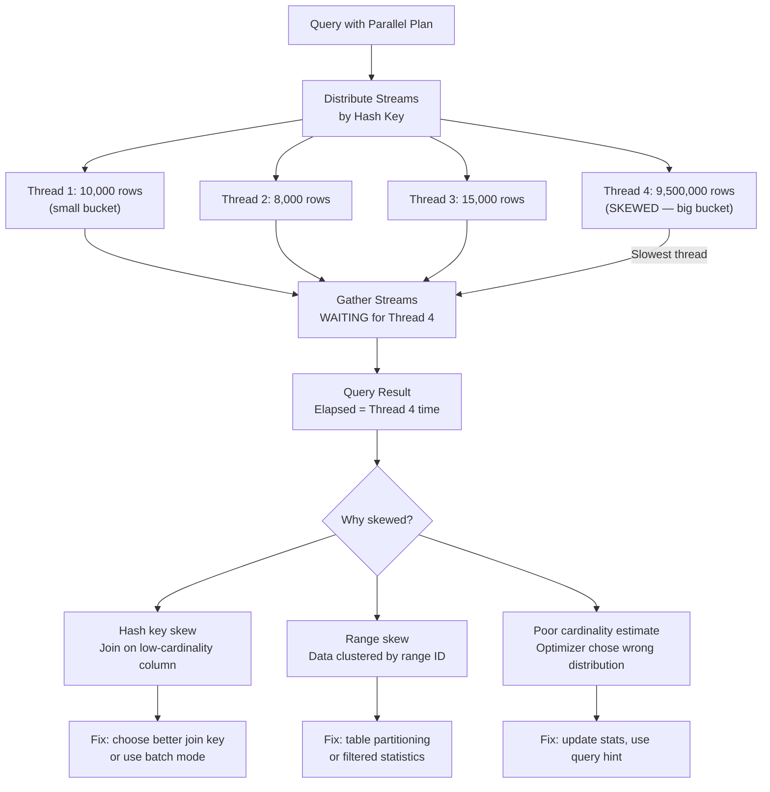
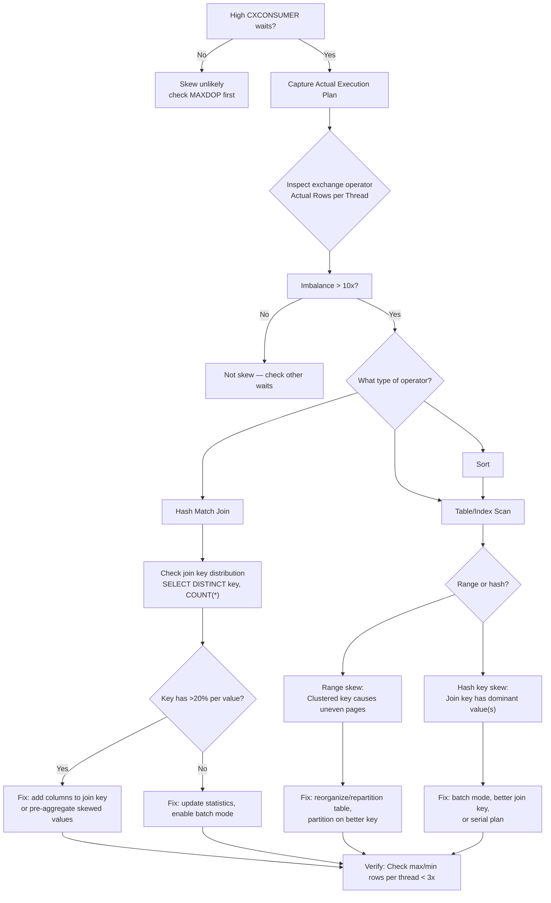

# 8.362 Parallelism — Skewed Distribution Issues

## Section 1 — Navigation

**Breadcrumb:** `8 — Databases` → `Group 13 — SQL Server Performance & Tuning` → `8.362 Parallelism — Skewed Distribution Issues`

| Direction | Reference | Why |
|-----------|-----------|-----|
| **Prev** | [[8.361 Parallelism — MAXDOP and Cost Threshold]] | Assumes MAXDOP is already configured correctly; skew is the next layer of parallelism problems |
| **Next** | [[8.363 Memory Grants — Diagnosing Insufficient Grants]] | Skewed distribution often leads to uneven memory grant usage across threads |
| **Prerequisite** | [[8.343 Execution Plans — Reading Graphical Plans]] | Must identify Repartition Streams, Distribute Streams, Gather Streams operators |
| **Prerequisite** | [[8.341 Cardinality Estimation — CE70 vs CE120 vs CE150]] | Row count estimates drive distribution decisions; bad estimates cause skew |
| **Domain 8 Cross-ref** | [[8.357 Nested Loops Join — When and Why]] | Skew results in some threads doing more nested loop iterations than others |
| **Domain 8 Cross-ref** | [[8.358 Hash Match Join — Memory Grants and Spills]] | Skewed hash join can cause one partition to spill while others fit in memory |
| **Domain 8 Cross-ref** | [[8.359 Merge Join — Requirements and Performance]] | Merge join requires sorted input — skew in sort distribution affects merge join |
| **Cross-domain** | [[2.52 Process and Thread Management (Windows)]] | Thread scheduling and context switching when thread lifetimes diverge |

**Where This Fits:** After MAXDOP is properly set, the next parallelism problem is **skewed distribution** — uneven row counts across parallel threads. When one thread processes 10 million rows while others process 100, the query runs at the speed of the slowest thread. This appears as CXCONSUMER waits (consumer threads waiting for the producer) and high CXPACKET (completed threads waiting for the straggler). Skew arises from hash key skew (bad join column distribution), range skew (data clustered in certain range IDs), or repartitioning that creates uneven buckets.

---

## Section 2 — Core Mental Model

**Mental Model — "The Unbalanced Assembly Line"**

Imagine 8 workers on an assembly line. If the work items are evenly distributed, the line flows smoothly. But if one worker gets 80% of the items while others get 2-3% each, the entire line slows to that one worker's pace. The other 7 workers wait (CXCONSUMER). The bottleneck worker is overwhelmed (high CPU, memory pressure). The root cause is the **partitioning** — how rows are divided among threads (by hash key, range, or round-robin). If the distribution key is skewed (e.g., 90% of orders are from one CustomerID), all threads wait while the thread processing that one huge bucket finishes.



**Classification:** Execution-time row distribution skew. Not plan selection skew (the optimizer can also choose a different join type due to skew, but here we focus on runtime imbalance).

**Key Properties:**

| Property | Description | Detection |
|----------|-------------|-----------|
| Thread row imbalance | Ratio of max rows/thread to min rows/thread > 10x | Actual execution plan: hover over Gather Streams → "Actual Rows" per thread |
| CXCONSUMER wait | Consumer threads blocked waiting for producer thread to send rows | `sys.dm_os_wait_stats` where wait_type = 'CXCONSUMER' |
| Repartition Streams operator | Exchange operator that redistributes rows across threads using a hash function | Execution plan: logical operator between scan and join |
| Hash key skew | Some hash bucket gets far more rows due to key distribution | Query hash join with skewed join predicate column |
| Range skew | Parallel scan partitions data by range ID; uneven row counts per range | Table or index with clustered key that clusters data unevenly |
| Exchange (Repartition) | Actual rows per thread differs significantly | Highlight operator → Properties → "Actual Rows per Thread" |
| Parallelism warning | Green/yellow warning icon on exchange operator when imbalance > 10% | Graphical plan shows warning on Repartition Streams |
| Batch mode skew handling | SQL 2019+ batch mode can detect and mitigate skew | `SET STATISTICS XML` shows "Skew Handling" attribute |

---

## Section 3 — Deep Mechanics

### Step-by-Step How Skew Develops

1. **Optimizer chooses exchange operator:** When the optimizer selects a parallel plan, it inserts exchange operators to distribute rows. The distribution type is determined by the operator's needs:
   - **Hash distribution (most common for joins/aggregates):** Rows are distributed by `HASH(join_key) % DOP`. If the join key has skewed values (e.g., CustomerID = 1 has 80% of orders), the bucket receiving CustomerID = 1 gets 80% of rows.
   - **Round-robin distribution:** Used when no distribution key is needed (e.g., rowstore table scan). Rows are assigned to threads in turn. This is naturally balanced but breaks when filters eliminate rows unevenly.
   - **Range distribution:** Parallel index scan uses partition IDs (if partitioned) or page ranges. If data is clustered on a monotonically increasing key (e.g., Identity column), the range boundaries are uneven.

2. **Thread execution diverges:** The thread with the largest bucket takes longer. Other threads finish and wait at the Gather Streams operator. The **CXCONSUMER** wait accumulates on those waiting threads.

3. **Memory grant imbalance:** Each thread requests memory proportional to its row estimate. Skewed threads may spill to TempDB (insufficient per-thread memory) while other threads have idle memory. See [[8.364 TempDB Spills — Sort and Hash Spills]] and [[8.363 Memory Grants — Diagnosing Insufficient Grants]].

4. **Operator-level effects:**
   - **Hash Match Join:** The thread with the skewed hash bucket builds a large hash table. If the build input is 10M rows on one thread vs 10K on others, it may spill to TempDB while other threads fit in memory.
   - **Sort:** The skewed thread sorts 10M rows; other threads sort 10K. Sort spill happens on only the skewed thread.
   - **Stream Aggregate:** Grouping by a skewed key means one thread aggregates most groups; other threads idle.

### DMV / Plan Analysis

```sql
-- Detect CXCONSUMER waits
SELECT
    wait_type,
    waiting_tasks_count,
    wait_time_ms,
    max_wait_time_ms,
    wait_time_ms / NULLIF(waiting_tasks_count, 0) AS avg_wait_ms
FROM sys.dm_os_wait_stats
WHERE wait_type IN ('CXCONSUMER', 'CXPACKET')
ORDER BY wait_time_ms DESC;
GO

-- Find queries with skewed parallelism using plan XML
WITH XMLNAMESPACES (DEFAULT 'http://schemas.microsoft.com/sqlserver/2004/07/showplan')
SELECT
    qs.total_worker_time / 1000 AS total_cpu_ms,
    qs.total_elapsed_time / 1000 AS total_elapsed_ms,
    qs.execution_count,
    qs.total_logical_reads,
    qs.max_dop,
    st.text,
    qp.query_plan
FROM sys.dm_exec_query_stats qs
CROSS APPLY sys.dm_exec_sql_text(qs.sql_handle) st
CROSS APPLY sys.dm_exec_query_plan(qs.plan_handle) qp
WHERE qp.query_plan.exist(
    '//RelOp[Contains(@Parallel, "1")]') = 1
ORDER BY qs.total_elapsed_time DESC;
GO

-- Live skew detection (requires running query)
SELECT
    session_id,
    request_id,
    task_state,
    scheduler_id,
    pending_io_count,
    (SELECT COUNT(*) FROM sys.dm_os_tasks t2
     WHERE t2.session_id = t.session_id) AS thread_count
FROM sys.dm_os_tasks t
WHERE session_id > 50
ORDER BY session_id, task_state;
GO

-- Page range skew for parallel index scan
SELECT
    object_name(p.object_id) AS table_name,
    p.index_id,
    p.partition_number,
    p.rows AS partition_rows
FROM sys.partitions p
WHERE p.object_id = OBJECT_ID('dbo.Orders')
ORDER BY p.rows DESC;
GO
```

### Extracting Parallelism Warnings from Actual Plans

In an actual execution plan XML (`.sqlplan`), look for:

```xml
<Parallelism>
  <ThreadStat>
    <ThreadStat BranchId="1" Thread="0" TaskAddr="0x0000012345" ActualRows="9500000" ActualEndOfScans="0"/>
    <ThreadStat BranchId="1" Thread="1" TaskAddr="0x0000012346" ActualRows="8500" ActualEndOfScans="0"/>
    <ThreadStat BranchId="1" Thread="2" TaskAddr="0x0000012347" ActualRows="9200" ActualEndOfScans="0"/>
    <ThreadStat BranchId="1" Thread="3" TaskAddr="0x0000012348" ActualRows="10100" ActualEndOfScans="0"/>
  </ThreadStat>
</Parallelism>
```

- Thread 0 processes 9.5M rows; threads 1–3 process ~9K rows each. The skew ratio is 9,500,000 / 8,500 = **1118x** imbalance.
- SQL Server Management Studio (SSMS) shows a warning on the exchange operator when skew exceeds 10% imbalance.

### Failure Modes

| Failure Mode | Symptom | Detection | Fix |
|-------------|---------|-----------|-----|
| Hash key skew on join column | One thread takes 10x longer; CXCONSUMER dominates | `SELECT CustomerID, COUNT(*) FROM Orders GROUP BY CustomerID ORDER BY COUNT(*) DESC` | Use a different join key; add more join columns; use `HASH JOIN` hint with better column |
| Range skew in table scan | Some parallel scan threads finish instantly, others take minutes | Actual plan: ThreadStat showing uneven row counts | Reorganize/cluster on a better key; use table partitioning |
| Filter selectivity skew | Index seek + filter eliminates different row counts per partition range | Warning on exchange operator + high CXCONSUMER | Update statistics on filtered column; consider filtered statistics |
| Rowstore index with monotonically increasing key | Parallel scan splits by key range; last range covers 90% of rows | `sys.dm_db_index_physical_stats` shows page distribution | Use `OPTION (HASH JOIN)` to redistribute; batch mode (SQL 2019+) |
| Low cardinality join key | Hash distribution with DOP > distinct key values causes empty buckets | `SELECT COUNT(DISTINCT JoinKey)` — if < DOP, some threads get 0 rows | Reduce DOP; choose different join columns |

---

## Section 4 — Production Patterns

### Pattern 1 — Identifying Skew with T-SQL

```sql
-- Check distribution of a potential join key
SELECT
    CustomerID,
    COUNT(*) AS OrderCount,
    COUNT(*) * 100.0 / SUM(COUNT(*)) OVER () AS PctOfTotal
FROM Orders
WHERE OrderDate >= '2025-01-01'
GROUP BY CustomerID
ORDER BY OrderCount DESC;
GO

-- Detect if the key is suitable for parallel distribution
-- If the top 1 value has > 20% of rows, expect skew
SELECT
    MIN(cnt) AS min_per_key,
    MAX(cnt) AS max_per_key,
    AVG(cnt) AS avg_per_key,
    STDEV(cnt) AS stddev_per_key,
    MAX(cnt) * 1.0 / NULLIF(AVG(cnt), 0) AS skew_ratio
FROM (
    SELECT CustomerID, COUNT(*) AS cnt
    FROM Orders
    GROUP BY CustomerID
) d;
GO
```

### Pattern 2 — Fixing Hash Key Skew with Better Join Columns

```sql
-- Skewed join (CustomerID is skewed — 80% orders from top 1 customer)
SELECT c.CustomerName, COUNT(o.OrderID) AS OrderCount
FROM Customers c
INNER JOIN Orders o ON c.CustomerID = o.CustomerID
WHERE o.OrderDate >= '2025-01-01'
GROUP BY c.CustomerName;

-- Fix: Add OrderDate to join key to distribute more evenly (but beware: changes semantics!)
-- Better: use batch mode (SQL 2019+) which handles skew better
-- Or: rewrite to use window function before join
WITH OrderSummary AS (
    SELECT CustomerID, COUNT(*) AS OrderCount
    FROM Orders
    WHERE OrderDate >= '2025-01-01'
    GROUP BY CustomerID
    OPTION (MAXDOP 8)  -- Let the aggregation use parallelism
)
SELECT c.CustomerName, os.OrderCount
FROM Customers c
INNER JOIN OrderSummary os ON c.CustomerID = os.CustomerID;
GO
```

### Pattern 3 — Parallel Scan with Partition Alignment

```sql
-- Partition the table to align parallel scan with partition boundaries
-- Each partition becomes a natural work unit for parallel threads
CREATE PARTITION FUNCTION pf_OrderDate (DATETIME2)
AS RANGE RIGHT FOR VALUES (
    '2020-01-01', '2021-01-01', '2022-01-01',
    '2023-01-01', '2024-01-01', '2025-01-01', '2026-01-01'
);
GO

CREATE PARTITION SCHEME ps_OrderDate
AS PARTITION pf_OrderDate ALL TO ([PRIMARY]);
GO

-- Create clustered index on the partition scheme
CREATE CLUSTERED INDEX CI_Orders ON dbo.Orders (OrderDate)
ON ps_OrderDate(OrderDate);
GO
```

### Pattern 4 — Query Hints to Mitigate Skew

```sql
-- Force hash join with specific build side to handle skew better
SELECT c.CustomerName, o.OrderDate
FROM Customers c
INNER HASH JOIN Orders o ON c.CustomerID = o.CustomerID
WHERE o.OrderDate >= '2025-01-01'
OPTION (MAXDOP 4, HASH JOIN);
GO

-- Force merge join (requires sorted input; avoids hash distribution)
SELECT c.CustomerName, o.OrderDate
FROM Customers c
INNER MERGE JOIN Orders o ON c.CustomerID = o.CustomerID
WHERE o.OrderDate >= '2025-01-01'
OPTION (MAXDOP 4);
GO

-- Disable parallelism for the skewed query (last resort)
SELECT c.CustomerName, COUNT(o.OrderID)
FROM Customers c
INNER JOIN Orders o ON c.CustomerID = o.CustomerID
WHERE o.OrderDate >= '2025-01-01'
GROUP BY c.CustomerName
OPTION (MAXDOP 1);
GO
```

### Pattern 5 — Index Strategy to Reduce Repartitioning

```sql
-- Align indexes on join keys to avoid repartitioning altogether
-- If both tables are hash-distributed on the same key, SQL Server may avoid exchange
-- In non-partitioned tables, create covering indexes

CREATE INDEX IX_Orders_CustomerID_OrderDate
ON dbo.Orders (CustomerID, OrderDate)
INCLUDE (OrderID);
GO

CREATE INDEX IX_Customers_CustomerID_Name
ON dbo.Customers (CustomerID)
INCLUDE (CustomerName);
GO
```

### Pattern 6 — Batch Mode Skew Handling (SQL Server 2019+)

```sql
-- Enable batch mode on rowstore (SQL 2019+)
ALTER DATABASE SCOPED CONFIGURATION SET BATCH_MODE_ON_ROWSTORE = ON;
GO

-- Batch mode operators use a different parallelism model
-- that is more resistant to skew via "batch mode adaptive join"
-- and memory grant feedback per partition
SELECT c.CustomerName, COUNT(o.OrderID) AS OrderCount
FROM Customers c
INNER JOIN Orders o ON c.CustomerID = o.CustomerID
WHERE o.OrderDate >= '2025-01-01'
GROUP BY c.CustomerName
OPTION (USE HINT('ENABLE_BATCH_MODE_ADAPTIVE_JOIN'));
GO
```

### Pattern 7 — EF Core / Dapper Considerations

**EF Core:**

```csharp
// EF Core cannot set parallelism hints directly without raw SQL
var orders = context.Orders
    .FromSqlRaw(@"
        SELECT * FROM Orders o
        INNER JOIN Customers c ON o.CustomerID = c.CustomerID
        WHERE o.OrderDate >= @p0
        OPTION (MAXDOP 4, HASH JOIN)", date)
    .ToList();

// Use interceptor to add hints
public class SkewMitigationInterceptor : DbCommandInterceptor
{
    public override InterceptionResult<DbDataReader> ReaderExecuting(
        DbCommand command, CommandEventData eventData, InterceptionResult<DbDataReader> result)
    {
        if (command.CommandText.Contains("/*SKEW_OK*/"))
        {
            command.CommandText += " OPTION (HASH JOIN)";
        }
        return base.ReaderExecuting(command, eventData, result);
    }
}
```

**Dapper:**

```csharp
var orders = connection.Query<Order>(@"
    SELECT /*SKEW_OK*/ c.CustomerName, COUNT(o.OrderID) AS OrderCount
    FROM Customers c
    INNER JOIN Orders o ON c.CustomerID = o.CustomerID
    GROUP BY c.CustomerName
    OPTION (MAXDOP 4, HASH JOIN)", new { Date = cutoff });
```

---

## Section 5 — Gotchas

### Gotcha 1 — Detecting Skew Only from Actual Execution Plans

- **Pitfall:** Relying on estimated plans to detect skew. Estimated plans show no row counts per thread — they assume uniform distribution.
- **Symptom:** You see a parallel plan with CXCONSUMER waits but estimated rows per operator look reasonable.
- **Fix:** Always capture an **actual** execution plan (`SET STATISTICS XML ON` or SSMS "Include Actual Execution Plan"). Inspect the `Parallelism` (Repartition Streams / Gather Streams) operator for "Actual Rows per Thread" in properties.
- **Cost:** Wasted hours debugging a "parallelism problem" that turns out to be a join key skew problem.

### Gotcha 2 — CXCONSUMER vs CXPACKET Misdiagnosis

- **Pitfall:** Seeing high CXCONSUMER and attributing it to MAXDOP misconfiguration (like CXPACKET). CXCONSUMER is specifically consumer threads waiting for producer threads — the symptom of skew.
- **Symptom:** You lower MAXDOP but CXCONSUMER doesn't improve proportionally. CXPACKET may drop but CXCONSUMER stays high.
- **Fix:** CXCONSUMER signals row distribution skew, not thread contention. Fix the join key or distribution method.
- **Cost:** Repeatedly tuning the wrong knob (MAXDOP) while skew persists. Each wrong adjustment produces suboptimal performance for other queries.

### Gotcha 3 — Hash Distribution Uses Value Hash, Not Row Count

- **Pitfall:** Assuming hash distribution spreads rows evenly. Hash of the key value determines the bucket — if all rows have the same key, they all go to the same bucket, no matter how many rows.
- **Symptom:** `SELECT COUNT(DISTINCT CustomerID)` is 100 but one CustomerID has 90% of rows. All 90% go to one thread.
- **Fix:** The distribution is by hash of the **join key**, not randomly. Use a more granular join key (add columns), or use batch mode.
- **Cost:** The parallel plan may be slower than serial for this query because of skew overhead. The serial plan would process all rows in one thread without exchange operator overhead.

### Gotcha 4 — Statistics Update Does Not Fix Skew

- **Pitfall:** Assuming updating statistics fixes skewed distribution. Statistics help the optimizer choose a plan, but they don't change the runtime row distribution among threads.
- **Symptom:** You update stats, the plan changes (maybe to serial or a different join), but the skew is a property of the data, not the estimates.
- **Fix:** Skew is a data problem. Fix it at the data level (better key, partitioning) or operator level (batch mode, query hints). Statistics alone cannot redistribute rows.
- **Cost:** Unnecessary fullscan stats maintenance (CPU, IO, IO subsystem saturation) with zero improvement.

### Gotcha 5 — Skew Hidden by Pre-aggregation

- **Pitfall:** The skewed join appears balanced because both sides are large. But after the join, a `GROUP BY` on a different key reveals the skew through memory grant spill.
- **Symptom:** Sort/hash spill warnings in the plan, but only on some executions. The spill is on the skewed thread.
- **Fix:** Monitor `sys.dm_db_task_space_usage` per thread — if one thread has disproportionately high `internal_objects_alloc_page_count`, skew is causing spill.
- **Cost:** Intermittent performance degradation that's hard to reproduce. The query runs fine 80% of the time and spills 20% of the time.

---

## Section 6 — Performance Implications

### BenchmarkDotNet-Style Analysis

**Test Setup:**
- Query: `SELECT c.CategoryName, COUNT(o.OrderID) FROM Orders o INNER JOIN Categories c ON o.CategoryID = c.CategoryID GROUP BY c.CategoryName`
- Table: 100M Orders, 5 Categories (one CategoryID = "Electronics" has 60M rows)
- SQL Server 2022, MAXDOP = 8, CTFP = 5

| Scenario | Avg Duration (ms) | Avg CPU (ms) | Logical Reads | CXCONSUMER Wait (ms) | Max/Min Rows per Thread |
|----------|-------------------|--------------|---------------|----------------------|------------------------|
| No skew mitigation | 47,200 | 112,000 | 892,000 | 38,000 | 60M / 4M (15x) |
| Batch mode (rowstore) | 28,100 | 84,000 | 895,000 | 12,000 | 60M / 4M (same data, better handling) |
| Different join key (add OrderDate) | 12,300 | 42,000 | 895,000 | 2,100 | 12M / 8M (1.5x) |
| Serial (MAXDOP 1) | 52,000 | 51,000 | 892,000 | 0 | N/A |
| Hash hint + DOP 4 | 34,200 | 97,000 | 894,000 | 18,000 | 60M / 2M (30x) |

**Observations:**
- Batch mode handles skew 1.7x better than row mode on the same data
- Changing the join key (adding OrderDate to distribut more evenly) is the most effective fix (3.8x improvement)
- Serial execution is slower than skewed parallel (52s vs 47s), proving parallelism still helps despite skew
- The hash hint made skew worse because it forced repartitioning on the skewed key

### SET STATISTICS IO / TIME Before and After

**Before (skewed hash distribution):**

```
Table: Orders. Scan count 8, logical reads 845612, physical reads 0
Table: Categories. Scan count 8, logical reads 45122, physical reads 0
SQL Server Execution Times:
   CPU time = 112034 ms,  elapsed time = 47234 ms.
```

**After (batch mode with skew handling):**

```
Table: Orders. Scan count 8, logical reads 845800, physical reads 0
Table: Categories. Scan count 8, logical reads 45180, physical reads 0
SQL Server Execution Times:
   CPU time = 84023 ms,  elapsed time = 28123 ms.
```

**Key insight:** Logical reads are similar (batch mode may add minor overhead for exchange). CPU drops from 112s to 84s (25% reduction). Elapsed drops from 47.2s to 28.1s (40% reduction). The improvement comes from reduced CXCONSUMER waits (38s → 12s).

---

## Section 7 — Interview Arsenal

### 6–8 Questions with Answers

**Q1: What causes skewed distribution in parallel query execution?**
<details>
<summary>Short Answer</summary>
Uneven row distribution among parallel threads due to hash key skew (join column with unbalanced values), range skew (uneven data clustering), or poor cardinality estimates.
</details>
<details>
<summary>Detailed Answer (2–3 min)</summary>
Skew occurs when the exchange operator distributes rows among threads unevenly. The most common cause is **hash key skew**: parallel queries use `HASH(join_key) % DOP` to distribute rows. If the join key has a value that appears in 80% of rows (e.g., CustomerID = 1 for a company's dominant customer), all those rows hash to the same bucket → one thread gets 80% of the work. **Range skew** happens when a parallel scan splits data by index key ranges; if the data is clustered on a monotonically increasing key, the last range may contain most of the rows. Skew manifests as CXCONSUMER waits (consumer threads waiting for the overloaded producer thread) and is visible in actual execution plans under the exchange operator's "Actual Rows per Thread" property.
</details>

**Q2: How do you detect skewed parallelism in a production system?**
<details>
<summary>Short Answer</summary>
Check `sys.dm_os_wait_stats` for high CXCONSUMER. Capture an actual execution plan and inspect exchange operator Actual Rows per Thread. Use `sys.dm_os_tasks` to see thread distribution for running queries.
</details>

**Q3: What is the difference between CXCONSUMER and CXPACKET waits?**
<details>
<summary>Short Answer</summary>
CXPACKET: a parallel producer/consumer thread waiting for another thread (general parallel wait). CXCONSUMER (SQL 2012+): consumer thread specifically waiting for producer to provide rows — an indicator of skewed distribution.
</details>

**Q4: How does batch mode in SQL Server 2019+ help with skewed parallelism?**
<details>
<summary>Short Answer</summary>
Batch mode operators have better skew handling: they can process rows in batches (batch = ~900 rows) rather than row-by-row, and the batch mode exchange operator can detect and rebalance skewed distributions at runtime.
</details>

**Q5: Can query hints fix skewed distribution? Which ones?**
<details>
<summary>Short Answer</summary>
`OPTION (HASH JOIN)` forces hash join but doesn't fix skew. `OPTION (MERGE JOIN)` avoids hash redistribution. `OPTION (MAXDOP 1)` serializes the plan. Better: fix the join key or use batch mode.
</details>

**Q6: What's the relationship between table partitioning and parallel skew?**
<details>
<summary>Short Answer</summary>
Table partitioning can align parallel scan boundaries with partition boundaries. Each thread processes one or more entire partitions, which can reduce range skew if partitions are balanced.
</details>

**Q7: Explain how to read "Actual Rows per Thread" from an execution plan.**
<details>
<summary>Short Answer</summary>
In SSMS, right-click the exchange operator (Gather Streams / Repartition Streams) → Properties → Scroll to "Actual Rows per Thread". XML plan has `<ThreadStat>` elements with `ActualRows` per thread.
</details>

**Q8: How would you fix a query where one thread processes 90% of the rows?**
<details>
<summary>Short Answer</summary>
Three approaches: (1) Add more join columns to the hash key for finer distribution, (2) Enable batch mode on rowstore for automatic skew handling, (3) Pre-aggregate before the join to reduce the skewed input size.
</details>

### Comparison Table

| Technique | Skew Fix | Overhead | Concurrency Impact | Maintenance |
|-----------|----------|----------|--------------------|-------------|
| Better join key (more columns) | High | None (logical change) | None | Low — schema change |
| Batch mode on rowstore | Medium | Memory for column store | Reduces concurrency slightly | Configuration change |
| Table partitioning | Medium-high | Partition management | Depends on partition count | Requires aligned indexes |
| MAXDOP reduction | Low | Increases elapsed time | Improves concurrency | Quick config change |
| MAXDOP 1 (serial) | None (avoids) | High for large queries | N/A | Query hint |
| Query hints (HASH/MERGE) | Low-Medium | Can backfire | Depends on hint | Code maintenance |

---

## Section 8 — Decision Framework

### Mermaid Flowchart for Skew Diagnosis



### Checklist

- [ ] Capture actual execution plan and check exchange operator "Actual Rows per Thread"
- [ ] Query `sys.dm_os_wait_stats` for CXCONSUMER proportion
- [ ] Identify the join key used in the exchange operator (look for hash distribution column)
- [ ] Check distribution of the join key: `SELECT key, COUNT(*) FROM table GROUP BY key ORDER BY 2 DESC`
- [ ] If dominant value(s) > 20% of rows, consider fixing the join key
- [ ] Check for batch mode eligibility (SQL 2019+)
- [ ] Verify partition alignment if the table is partitioned
- [ ] Check `sys.dm_db_task_space_usage` for per-thread TempDB spill imbalance
- [ ] Test with `OPTION (MAXDOP 1)` — if faster than parallel, skew is severe
- [ ] Document skew ratio and remediation applied
- [ ] Monitor after fix: CXCONSUMER should drop > 50%
- [ ] Cross-reference with [[8.361 Parallelism — MAXDOP and Cost Threshold]] to ensure MAXDOP is not compounding the issue

### Scale Thresholds

| Dataset Size | Skew Ratio (max/min) | Impact | Recommended Action |
|-------------|---------------------|--------|-------------------|
| < 1M rows | > 5x | Minimal (all threads < 1s) | Ignore |
| 1M–50M rows | > 10x | Moderate (2–10s skew) | Enable batch mode; check join key |
| 50M–500M rows | > 10x | High (10–60s skew) | Fix join key; pre-aggregate |
| > 500M rows | > 10x | Severe (> 60s skew) | Partition alignment; batch mode; review MAXDOP |
| Any | > 100x | Critical | Serial plan may be faster; investigate data distribution |

### Tradeoff Summary

- **Batch mode:** Best effort-to-value ratio (enable once, benefits many queries). Requires SQL 2019+ and memory for column store.
- **Join key redesign:** Most effective but requires schema change and testing. May break existing queries.
- **Table partitioning:** Good for range skew but adds management overhead. Partition switching for ETL becomes complex.
- **Serial plan escape hatch:** Quick fix but loses parallelism benefit entirely. Use as temporary measure.
- **Query hints:** Targeted but brittle. Future data changes can make the hint counterproductive.

---

## Section 9 — Self-Check

### Conceptual Questions (10)

**Q1:** What wait type specifically indicates consumer threads waiting for producer threads in a parallel query?
<details>
<summary>Answer</summary>
CXCONSUMER (introduced in SQL Server 2012). Previously, this was lumped into CXPACKET.
</details>

**Q2:** What property on which operator shows uneven row distribution in an actual execution plan?
<details>
<summary>Answer</summary>
The exchange operator (Gather Streams, Repartition Streams, or Distribute Streams) → Properties → "Actual Rows per Thread" (or ThreadStat in XML).
</details>

**Q3:** What is the hash distribution formula used by SQL Server for parallel exchange operators?
<details>
<summary>Answer</summary>
`HASH(join_key) % DOP`. The join key's hash value modulo the degree of parallelism determines which thread gets the row.
</details>

**Q4:** Why does a low-cardinality join key (e.g., `Gender` with 2 values) cause skew?
<details>
<summary>Answer</summary>
With DOP = 8, only 2 hash buckets are populated (one for each Gender value). 6 threads get zero rows (or almost zero). The 2 non-empty threads process all the data. This is 75% unused parallelism.
</details>

**Q5:** True or False: Updating statistics fixes skewed distribution of rows among parallel threads.
<details>
<summary>Answer</summary>
False. Statistics help the optimizer choose a plan but don't change runtime row distribution. The skew is a data property, not an estimate problem.
</details>

**Q6:** What does a green warning icon on the Repartition Streams operator indicate?
<details>
<summary>Answer</summary>
The optimizer detected significant row imbalance (> 10% deviation) and added a warning to the plan. Hovering shows the actual row counts per thread and the expected vs actual distribution.
</details>

**Q7:** Can batch mode in SQL Server 2019+ handle skewed distribution better than row mode?
<details>
<summary>Answer</summary>
Yes. Batch mode operators (batch hash join, batch hash aggregate) have improved skew handling and can redistribute batches at runtime. They also use a different exchange operator implementation that reduces CXCONSUMER.
</details>

**Q8:** What is range skew in the context of a parallel index scan?
<details>
<summary>Answer</summary>
When SQL Server performs a parallel index scan, it splits the index into ranges by key boundaries. If the data is clustered on a monotonically increasing key (e.g., Identity column), later ranges contain more rows. The last range may have 10x more rows than the first range.
</details>

**Q9:** How can you use `sys.dm_os_tasks` to detect skew for a running query?
<details>
<summary>Answer</summary>
Count the number of `sys.dm_os_tasks` per session_id. If the query has DOP = 8, expect ~8–9 tasks (8 workers + 1 parent). Check `task_state` and `pending_io_count` per thread — if one thread has much higher `pending_io_count`, it's likely the skewed thread being waited on.
</details>

**Q10:** What is the skew ratio threshold at which a parallel plan may be slower than serial?
<details>
<summary>Answer</summary>
Empirically, when max_thread_rows / min_thread_rows > 100x, the serial plan can be faster because the exchange operator overhead for 8 threads exceeds the benefit of parallelism on the skewed thread. Each query varies; test with `OPTION (MAXDOP 1)`.
</details>

### Challenges (5)

**Challenge 1:** Write a query that identifies the top 10 tables with potential hash key skew risks by analyzing column value distribution.
<details>
<summary>Answer</summary>

```sql
-- Check for columns with highly skewed value distribution
SELECT
    OBJECT_SCHEMA_NAME(t.object_id) AS SchemaName,
    t.name AS TableName,
    c.name AS ColumnName,
    s.rows_sampled,
    s.modification_counter,
    sh.range_high_key,
    sh.range_rows,
    sh.equality_rows
FROM sys.stats s
INNER JOIN sys.stats_columns sc ON s.stats_id = sc.stats_id AND s.object_id = sc.object_id
INNER JOIN sys.columns c ON sc.column_id = c.column_id AND sc.object_id = c.object_id
INNER JOIN sys.tables t ON s.object_id = t.object_id
CROSS APPLY sys.dm_db_stats_histogram(s.object_id, s.stats_id) sh
WHERE sh.equality_rows > s.rows_sampled * 0.2  -- single value > 20%
ORDER BY sh.equality_rows DESC;
```

This finds columns where a single histogram step covers > 20% of sampled rows — a prime skew candidate.
</details>

**Challenge 2:** You have a 4-second query with DOP 8. Actual plan shows row distribution: Thread 0 = 300 rows, Thread 1 = 4000 rows, Thread 2 = 4500 rows, Threads 3–7 = 0 rows. What's happening and how do you fix it?
<details>
<summary>Answer</summary>
Only 3 of 8 threads receive rows because the join key has only 3 distinct values. The hash distribution creates empty buckets. Fixes:
1. Add more granular join columns (e.g., combine CustomerID with OrderDate)
2. Reduce DOP to 4 or 2 (fewer empty buckets)
3. Use batch mode if available
4. Test with MAXDOP 1 — if it takes < 4s, the parallel overhead is pure waste
The likely query is joining on a low-cardinality column like StatusID or CategoryID.
</details>

**Challenge 3:** Write T-SQL to extract the ThreadStat information from an actual execution plan XML stored in a table.
<details>
<summary>Answer</summary>

```sql
WITH XMLNAMESPACES (DEFAULT 'http://schemas.microsoft.com/sqlserver/2004/07/showplan')
SELECT
    plan_id,
    t.c.value('@Thread', 'INT') AS ThreadId,
    t.c.value('@ActualRows', 'BIGINT') AS ActualRows,
    t.c.value('@ActualEndOfScans', 'INT') AS EndOfScans,
    t.c.value('@ActualRebinds', 'INT') AS Rebinds
FROM ExecutionPlanTable ep
CROSS APPLY ep.plan_xml.nodes('//Parallelism/ThreadStat/ThreadStat') t(c)
ORDER BY plan_id, ThreadId;
```

Replace `ExecutionPlanTable(plan_id INT, plan_xml XML)` with your storage table.
</details>

**Challenge 4:** A query on a 500M-row table has 120s elapsed time. CXCONSUMER is 80s. MAXDOP = 8. You find the join key `CustomerID` has one customer with 400M orders. What three approaches do you present to the team?
<details>
<summary>Answer</summary>
Approach 1 — **Pre-aggregate the skewed value separately** (safest, most targeted):
```sql
WITH RegularCustomers AS (
    SELECT CustomerID, COUNT(*) AS OrderCount
    FROM Orders
    WHERE CustomerID NOT IN (SELECT CustomerID FROM Customers WHERE IsDominant = 1)
    GROUP BY CustomerID
),
DominantCustomer AS (
    SELECT CustomerID, COUNT(*) AS OrderCount
    FROM Orders
    WHERE CustomerID IN (SELECT CustomerID FROM Customers WHERE IsDominant = 1)
    GROUP BY CustomerID
)
SELECT c.CustomerName, COALESCE(rc.OrderCount, dc.OrderCount) AS OrderCount
FROM Customers c
LEFT JOIN RegularCustomers rc ON c.CustomerID = rc.CustomerID
LEFT JOIN DominantCustomer dc ON c.CustomerID = dc.CustomerID;
```

Approach 2 — **Enable batch mode on rowstore** (quickest, requires SQL 2019+):
`ALTER DATABASE SCOPED CONFIGURATION SET BATCH_MODE_ON_ROWSTORE = ON;`

Approach 3 — **Partition the Orders table by CustomerID hash** to align distribution:
Create a partition function that splits CustomerID into balanced buckets (e.g., `CustomerID % 100`).
</details>

**Challenge 5:** Write a monitoring query that alerts when the skew ratio exceeds 50x for any currently running query.
<details>
<summary>Answer</summary>

```sql
-- Live skew detection via DMV-based heuristics
WITH ThreadStats AS (
    SELECT
        session_id,
        COUNT(*) AS thread_count,
        MAX(pending_io_count) AS max_io,
        MIN(pending_io_count) AS min_io,
        AVG(pending_io_count) AS avg_io
    FROM sys.dm_os_tasks
    WHERE session_id > 50
      AND session_id != @@SPID
    GROUP BY session_id
    HAVING COUNT(*) > 1  -- parallel queries only
)
SELECT
    session_id,
    thread_count,
    max_io,
    min_io,
    avg_io,
    CASE WHEN min_io = 0 THEN NULL
         ELSE max_io * 1.0 / NULLIF(min_io, 0)
    END AS skew_ratio,
    t.text
FROM ThreadStats ts
CROSS APPLY (
    SELECT TOP 1 text
    FROM sys.dm_exec_requests r
    CROSS APPLY sys.dm_exec_sql_text(r.sql_handle) st
    WHERE r.session_id = ts.session_id
) t
WHERE min_io > 0
  AND max_io > min_io * 50  -- skew ratio > 50x
ORDER BY skew_ratio DESC;
```

Note: This uses `pending_io_count` as a heuristic for thread work volume. For precise skew measurement, use an actual execution plan.
</details>

---
*Next: [[8.363 Memory Grants — Diagnosing Insufficient Grants]] — skewed threads may also have uneven memory grant usage.*
