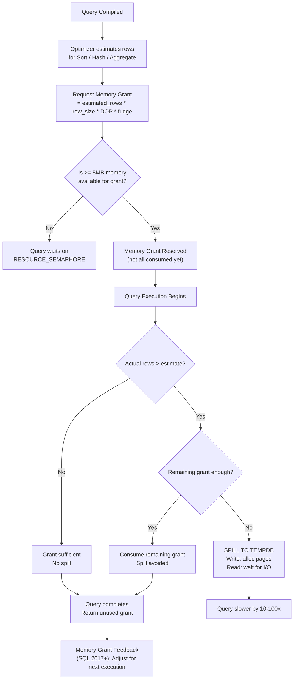
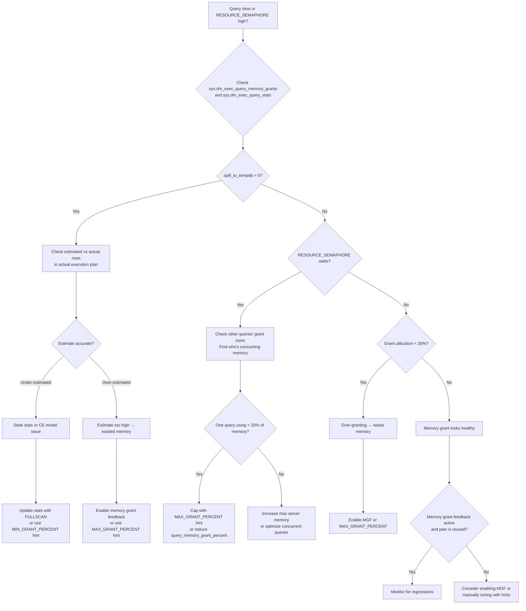

# 8.363 Memory Grants — Diagnosing Insufficient Grants

## Section 1 — Navigation

**Breadcrumb:** `8 — Databases` → `Group 13 — SQL Server Performance & Tuning` → `8.363 Memory Grants — Diagnosing Insufficient Grants`

| Direction | Reference | Why |
|-----------|-----------|-----|
| **Prev** | [[8.362 Parallelism — Skewed Distribution Issues]] | Skewed threads can have uneven memory grant consumption |
| **Next** | [[8.364 TempDB Spills — Sort and Hash Spills]] | Insufficient memory grants are the primary cause of TempDB spills |
| **Prerequisite** | [[8.358 Hash Match Join — Memory Grants and Spills]] | Hash join is the largest memory consumer in query plans |
| **Prerequisite** | [[8.359 Merge Join — Requirements and Performance]] | Merge join requires no memory grant but needs sorted input |
| **Domain 8 Cross-ref** | [[8.372 Memory Grant Feedback — Adaptive Memory]] | SQL 2017+ feature that auto-tunes memory grants |
| **Domain 8 Cross-ref** | [[8.354 Index Seek vs Index Scan — When Each Occurs]] | Index scan vs seek affects rows estimated → memory grant |
| **Domain 8 Cross-ref** | [[8.366 SET STATISTICS IO — Reading Logical Reads]] | Spills cause dramatic increases in logical reads |
| **Cross-domain** | [[2.56 Memory Management and Virtual Memory]] | SQL Server buffer pool, virtual address space, memory pressure |

**Where This Fits:** Memory grants are reservations of memory that SQL Server makes for sort, hash join, and hash aggregate operations before the query starts executing. They are estimated based on cardinality estimates. If the estimate is too low, the query spills to TempDB (slow). If too high, the query reserves memory that other queries can't use (RESOURCE_SEMAPHORE waits). Diagnosing insufficient grants is the first step to fixing TempDB spills and reducing RESOURCE_SEMAPHORE waits. This topic connects directly to cardinality estimation accuracy ([[8.341 Cardinality Estimation — CE70 vs CE120 vs CE150]]) and statistics quality ([[8.338 Statistics Objects — Creation and Maintenance]]).

---

## Section 2 — Core Mental Model

**Mental Model — "The Memory Rental Shop"**

Imagine a tool rental shop. Before a query starts (customer begins a project), it must rent memory tools (sort space, hash table space). The rental counter (Resource Governor / memory grant logic) reserves a certain number of tools based on the query's estimated row count. If the estimate is too low, the customer runs out of tools mid-project and must go to the basement (TempDB) to work — much slower. If the estimate is too high, the customer reserves tools they don't use, leaving fewer tools for other customers (RESOURCE_SEMAPHORE — they wait at the counter). Memory Grant Feedback (SQL 2017+) is the shop manager who adjusts the rental estimate after seeing how many tools the customer actually used.



**Classification:** Query execution memory management, part of SQL Server's Resource Governor / memory model. Memory grants are separate from the buffer pool (data cache). Buffer pool holds data pages; memory grants hold working memory for query operators.

**Key Properties:**

| Property | Description | Default / Recommendation |
|----------|-------------|--------------------------|
| `RESOURCE_SEMAPHORE` wait | Query waiting for memory grant to become available | Should be < 1% of total waits; > 5% indicates memory pressure |
| `granted_memory_kb` | Memory granted to a query (from `sys.dm_exec_query_stats`) | Should match `used_memory_kb` within 2x |
| `used_memory_kb` | Memory actually used by the query | If much less than granted → over-grant |
| `required_memory_kb` | Minimum memory needed for the query | Available in `sys.dm_exec_query_memory_grants` |
| `max_ideal_memory_kb` | Ideal memory (maximum beneficial) for the query | Grants between required and ideal |
| `query_memory_grant_percent` | Grant as % of max server memory | Default max is 25% per query (SQL 2014+); was 75% in older versions |
| Memory grant feedback | Adjusts grants on subsequent executions (SQL 2017+) | Enabled by default; `sys.dm_exec_query_stats` shows feedback stats |
| DOP multiplier | Memory grant ≈ DOP * per-thread estimate | Parallel queries get larger grants |
| Sort/hash spill | When used memory > granted memory | `spill_to_tempdb` in `sys.dm_exec_query_stats` |

---

## Section 3 — Deep Mechanics

### Step-by-Step Memory Grant Process

1. **Compile-time estimation:** The optimizer estimates the number of rows flowing into each operator. For a hash join, it estimates the **build input** row count and row size. For a sort, it estimates the number of rows to sort.
2. **Grant calculation:**
   - **Sort memory:** `estimated_rows * row_size * DOP * 1.1` (10% overhead)
   - **Hash join memory:** For hash join, the grant is based on the build input. SQL Server allocates memory in 64KB pages. The total needed is the number of "hash table buckets" × bucket size.
   - **Minimum grant:** At least 1024 KB (1 MB) per query for sort/hash operations.
   - **Maximum grant:** Capped at `max server memory * query_memory_grant_percent / 100`. Default `query_memory_grant_percent` is 25% (since SQL 2014 SP2 CU3).
   - The final grant is `MIN(ideal_memory, max_grant)`, but at least `required_memory`.
3. **Resource Semaphore check:** Before execution, the query requests its grant. If the total memory in use + this grant ≤ max server memory * target_memory_grant_percent, the grant is approved. Otherwise, the query waits on `RESOURCE_SEMAPHORE`.
4. **Execution:** If actual rows > estimated rows, the grant is consumed faster. When `used_memory_kb > granted_memory_kb`, the operator spills to TempDB.
5. **Grant release:** The grant is released only when the query finishes. `WAITFOR` or long-running queries hold their grants for their whole duration.

### DMV / Plan Analysis

```sql
-- Current memory grants (running queries)
SELECT
    session_id,
    request_id,
    grant_time,
    granted_memory_kb,
    used_memory_kb,
    max_used_memory_kb,
    ideal_memory_kb,
    required_memory_kb,
    query_cost,
    timeout_sec,
    is_small,
    dop
FROM sys.dm_exec_query_memory_grants
WHERE session_id > 50
ORDER BY granted_memory_kb DESC;
GO

-- Historical memory grant performance
SELECT TOP 20
    qs.total_worker_time / 1000 AS total_cpu_ms,
    qs.total_elapsed_time / 1000 AS total_elapsed_ms,
    qs.execution_count,
    qs.total_logical_reads,
    qs.granted_memory_kb / 1024 AS granted_mb,
    qs.used_memory_kb / 1024 AS used_mb,
    qs.max_ideal_memory_kb / 1024 AS ideal_mb,
    CAST((qs.used_memory_kb * 1.0 / NULLIF(qs.granted_memory_kb, 1)) * 100 AS DECIMAL(5,1)) AS grant_util_pct,
    qs.spill_to_tempdb,
    SUBSTRING(st.text, (qs.statement_start_offset / 2) + 1,
        ((CASE WHEN qs.statement_end_offset = -1 THEN DATALENGTH(st.text)
          ELSE qs.statement_end_offset END - qs.statement_start_offset) / 2) + 1) AS query_text
FROM sys.dm_exec_query_stats qs
CROSS APPLY sys.dm_exec_sql_text(qs.sql_handle) st
WHERE qs.granted_memory_kb > 0
ORDER BY qs.spill_to_tempdb DESC;
GO

-- RESOURCE_SEMAPHORE waits
SELECT
    wait_type,
    waiting_tasks_count,
    wait_time_ms,
    max_wait_time_ms,
    signal_wait_time_ms,
    wait_time_ms / NULLIF(waiting_tasks_count, 0) AS avg_wait_ms
FROM sys.dm_os_wait_stats
WHERE wait_type = 'RESOURCE_SEMAPHORE'
ORDER BY wait_time_ms DESC;
GO

-- Memory grant feedback information (SQL 2017+)
SELECT
    qp.query_plan,
    qs.last_grant_kb / 1024 AS last_grant_mb,
    qs.last_used_kb / 1024 AS last_used_mb,
    qs.min_grant_kb / 1024 AS min_grant_mb,
    qs.max_grant_kb / 1024 AS max_grant_mb,
    qs.total_grant_kb / 1024 AS total_grant_mb,
    qs.total_used_kb / 1024 AS total_used_mb,
    qs.grant_feedback_adjustments
FROM sys.dm_exec_query_stats qs
CROSS APPLY sys.dm_exec_query_plan(qs.plan_handle) qp
WHERE qs.grant_feedback_adjustments > 0
ORDER BY qs.grant_feedback_adjustments DESC;
GO

-- Total memory grant usage vs server memory
SELECT
    (SUM(granted_memory_kb) / 1024.0) / 1024.0 AS total_granted_gb,
    (SUM(used_memory_kb) / 1024.0) / 1024.0 AS total_used_gb,
    (SELECT value_in_use FROM sys.configurations WHERE name = 'max server memory (MB)') / 1024.0 AS max_server_memory_gb,
    CAST(100.0 * SUM(granted_memory_kb) / NULLIF(
        (SELECT value_in_use FROM sys.configurations WHERE name = 'max server memory (MB)') * 1024.0, 0) AS DECIMAL(5,1)) AS grant_pct
FROM sys.dm_exec_query_memory_grants;
GO
```

### Memory Grant and DOP Interaction

Memory grant for parallel queries:

- If the query runs at DOP = 8, each thread needs its own sort/hash memory.
- **Serial zone (memory grant * DOP):** Each thread's grant is multiplied by DOP. If a sort needs 100 MB per thread, total grant = 800 MB.
- **Memory grant feedback** on parallel queries adjusts the serial zone first, then the DOP-multiplied amount.

### Failure Modes

| Failure Mode | Symptom | Detection | Fix |
|-------------|---------|-----------|-----|
| Under-grant (spill) | Sort/hash warnings in actual plan, high TempDB IO | `spill_to_tempdb > 0` in `sys.dm_exec_query_stats` | Update stats; enable memory grant feedback; add `MIN_GRANT_PERCENT` hint |
| Over-grant (waste) | Low grant utilization (< 50%), high RESOURCE_SEMAPHORE for others | `granted_memory_kb >> used_memory_kb` | Enable memory grant feedback; use `MAX_GRANT_PERCENT` hint |
| RESOURCE_SEMAPHORE storm | Queries waiting with `wait_type = 'RESOURCE_SEMAPHORE'` | Multiple queries check `sys.dm_exec_query_memory_grants` with `grant_time IS NULL` | Reduce max memory grant per query; optimize memory-intensive queries |
| Memory grant for trivial sorts | Sort of small number of rows gets excessive grant | Check plan for Sort on small input; `estimated_rows >> actual_rows` | Create index to avoid sort; update stats |
| Memory grant size cap too high | One query takes 25% of server memory | Check `query_memory_grant_percent` configuration | Reduce to 10–15% for OLTP; raise for DW |

---

## Section 4 — Production Patterns

### Pattern 1 — Diagnosing Under-granted Queries

```sql
-- Find queries with highest spill to TempDB
SELECT TOP 20
    qs.total_worker_time / 1000 AS total_cpu_ms,
    qs.total_elapsed_time / 1000 AS total_elapsed_ms,
    qs.execution_count,
    qs.total_logical_reads,
    qs.granted_memory_kb / 1024 AS granted_mb,
    qs.used_memory_kb / 1024 AS used_mb,
    qs.max_ideal_memory_kb / 1024 AS ideal_mb,
    qs.spill_to_tempdb,
    qs.last_grant_kb / 1024 AS last_grant_mb,
    qs.last_used_kb / 1024 AS last_used_mb,
    qs.min_grant_kb / 1024 AS min_grant_mb,
    qs.max_grant_kb / 1024 AS max_grant_mb,
    st.text AS query_text
FROM sys.dm_exec_query_stats qs
CROSS APPLY sys.dm_exec_sql_text(qs.sql_handle) st
WHERE qs.spill_to_tempdb > 0
ORDER BY qs.spill_to_tempdb DESC;
GO
```

### Pattern 2 — Fixing Under-grant with Query Hints

```sql
-- Increase minimum memory grant percentage for a specific query
SELECT CustomerID, COUNT(*) AS OrderCount
FROM Orders
WHERE OrderDate >= '2025-01-01'
GROUP BY CustomerID
OPTION (MIN_GRANT_PERCENT = 25);
GO

-- Cap maximum memory grant (prevents over-granting for others)
SELECT CustomerID, COUNT(*) AS OrderCount
FROM Orders
WHERE OrderDate >= '2025-01-01'
GROUP BY CustomerID
OPTION (MAX_GRANT_PERCENT = 10);
GO

-- Both hints together (SQL 2019+)
SELECT CustomerID, COUNT(*) AS OrderCount
FROM Orders
WHERE OrderDate >= '2025-01-01'
GROUP BY CustomerID
OPTION (MIN_GRANT_PERCENT = 10, MAX_GRANT_PERCENT = 20);
GO
```

### Pattern 3 — Memory Grant Feedback Management

```sql
-- Check if memory grant feedback is enabled (default on)
SELECT name, value
FROM sys.dm_db_log_stats
WHERE name = 'memory_grant_feedback';
GO

-- Disable (not recommended unless causing plan regression)
ALTER DATABASE SCOPED CONFIGURATION SET MEMORY_GRANT_FEEDBACK = OFF;
GO

-- Force feedback to be more aggressive (SQL 2019+)
ALTER DATABASE SCOPED CONFIGURATION SET MEMORY_GRANT_FEEDBACK_PERCENTILE = 0.5;
GO
```

### Pattern 4 — Reducing RESOURCE_SEMAPHORE Waits

```sql
-- Check current memory grant waiters
SELECT
    session_id,
    request_id,
    grant_time,
    granted_memory_kb / 1024 AS granted_mb,
    required_memory_kb / 1024 AS required_mb,
    ideal_memory_kb / 1024 AS ideal_mb,
    dop,
    query_cost
FROM sys.dm_exec_query_memory_grants
WHERE grant_time IS NULL  -- waiting for grant
ORDER BY required_memory_kb DESC;
GO

-- Reduce max memory grant per query (SQL 2014+)
EXEC sp_configure 'max server memory (MB)', 51200;  -- 50 GB
RECONFIGURE;

-- The query_memory_grant_percent defaults to 25% of max server memory
-- On a 50 GB server, max per-query grant = 12.5 GB
-- Reduce if needed:
ALTER DATABASE SCOPED CONFIGURATION SET QUERY_MEMORY_GRANT_PERCENT = 15;
GO
```

### Pattern 5 — Index Strategy to Eliminate Memory Grants

```sql
-- Instead of sort (needs memory grant), index the ORDER BY column
CREATE INDEX IX_Orders_OrderDate_Amount
ON dbo.Orders (OrderDate, Amount DESC)
INCLUDE (CustomerID);
GO

-- Now this query avoids sort → no memory grant needed
SELECT OrderDate, CustomerID, Amount
FROM dbo.Orders
WHERE OrderDate >= '2025-01-01'
ORDER BY OrderDate, Amount DESC;
GO

-- Instead of hash join (needs memory grant), index the join column for merge/nested loops
CREATE INDEX IX_Orders_CustomerID
ON dbo.Orders (CustomerID)
INCLUDE (OrderDate, Amount);
GO
```

### Pattern 6 — EF Core / Dapper Memory Grant Management

**EF Core — Interceptor for MIN_GRANT_PERCENT:**

```csharp
public class MemoryGrantInterceptor : DbCommandInterceptor
{
    private readonly int? _minGrant;
    private readonly int? _maxGrant;

    public MemoryGrantInterceptor(int? minGrant = null, int? maxGrant = null)
    {
        _minGrant = minGrant;
        _maxGrant = maxGrant;
    }

    public override InterceptionResult<DbDataReader> ReaderExecuting(
        DbCommand command, CommandEventData eventData, InterceptionResult<DbDataReader> result)
    {
        var hints = new List<string>();
        if (_minGrant.HasValue)
            hints.Add($"MIN_GRANT_PERCENT = {_minGrant.Value}");
        if (_maxGrant.HasValue)
            hints.Add($"MAX_GRANT_PERCENT = {_maxGrant.Value}");

        if (hints.Count > 0)
            command.CommandText += $" OPTION ({string.Join(", ", hints)})";

        return base.ReaderExecuting(command, eventData, result);
    }
}

// Usage in DbContext
protected override void OnConfiguring(DbContextOptionsBuilder optionsBuilder)
{
    optionsBuilder.UseSqlServer(connectionString)
        .AddInterceptors(new MemoryGrantInterceptor(minGrant: 10));
}
```

**Dapper:**

```csharp
public async Task<IEnumerable<OrderSummary>> GetOrderSummariesAsync()
{
    using var conn = new SqlConnection(_connectionString);
    return await conn.QueryAsync<OrderSummary>(@"
        SELECT CustomerID, COUNT(*) AS OrderCount, SUM(Amount) AS TotalAmount
        FROM Orders
        WHERE OrderDate >= @Cutoff
        GROUP BY CustomerID
        OPTION (MIN_GRANT_PERCENT = 15, MAX_GRANT_PERCENT = 25)",
        new { Cutoff = DateTime.UtcNow.AddMonths(-6) });
}
```

---

## Section 5 — Gotchas

### Gotcha 1 — Memory Grant Is Reserved Until Query Completes, Not Operator Completes

- **Pitfall:** Assuming a hash join releases its memory grant when the hash join finishes. The grant is held until the **entire query** finishes.
- **Symptom:** A query with early hash join + later sort holds both grants simultaneously, even though the hash join is done. The sort's grant is added on top.
- **Fix:** Queries with multiple memory-consuming operators (hash join + sort + hash aggregate) stack their grants. Identify such plans and break them into separate queries or use indexed views.
- **Cost:** The same query may request 2 GB for hash join + 2 GB for sort = 4 GB total grant, even when only 2 GB is needed at any moment.

### Gotcha 2 — Memory Grant Feedback Only Helps If the Same Query Executes Again

- **Pitfall:** Relying on memory grant feedback for ad-hoc or one-off queries. Feedback adjusts grants on subsequent executions of the **same query plan**.
- **Symptom:** A monthly report that runs once and spills every time. MGF never kicks in because the plan is evicted from cache between runs.
- **Fix:** Use `MIN_GRANT_PERCENT` hint on the query. Consider keeping the plan in cache (`USE PLAN` hint or plan guide). Alternatively, ensure the plan is reused if parameters are consistent.
- **Cost:** The query spills every single execution. On a 100M-row monthly report, this could add 30+ minutes each run.

### Gotcha 3 — DOP Multiplier on Memory Grant Can Mask Under-grant Per Thread

- **Pitfall:** A parallel query's memory grant is DOP * per-thread estimate. If the per-thread rows are skewed ([[8.362 Parallelism — Skewed Distribution Issues]]), one thread gets more rows than its per-thread grant allows, causing *that thread* to spill even though the total grant looks sufficient.
- **Symptom:** `sys.dm_db_task_space_usage` shows one thread with high `internal_objects_alloc_page_count` while others are low. Total `used_memory_kb` is close to `granted_memory_kb`.
- **Fix:** Address skew first (better join key, batch mode). Then consider raising per-thread memory via `MIN_GRANT_PERCENT`.
- **Cost:** Hard-to-diagnose intermittent spills. The query appears in `sys.dm_exec_query_stats` with `spill_to_tempdb = 1` but the grant utilization looks reasonable.

### Gotcha 4 — Memory Grant Can Exceed Available RAM, Forcing RESOURCE_SEMAPHORE on Other Queries

- **Pitfall:** A single query is granted 12 GB (25% of 50 GB server). During its 5-minute execution, all other queries needing > 100 MB must wait on RESOURCE_SEMAPHORE.
- **Symptom:** Periodic "all queries slow" every time the big ETL query runs. RESOURCE_SEMAPHORE wait time spikes.
- **Fix:** Reduce `MAX_GRANT_PERCENT` for that query via hint. Or reduce the instance-level `query_memory_grant_percent` from 25% to 10%. Or break the ETL query into batches.
- **Cost:** Concurrency collapse. A single query monopolizes the memory grant pool, serializing all other memory-requiring queries.

### Gotcha 5 — Estimate Change Causes Over-Grant, Wasting Memory

- **Pitfall:** Statistics are updated and the optimizer now overestimates rows by 100x. Memory grant is 100x too large. Other queries suffer RESOURCE_SEMAPHORE.
- **Symptom:** After a nightly statistics update, memory pressure increases for 2 hours (the plan cache lifetime for the over-granted query).
- **Fix:** Enable memory grant feedback to auto-reduce on next execution. Also, consider `MAX_GRANT_PERCENT` hint as a safety cap.
- **Cost:** Transient memory pressure. Neighboring queries that previously ran fine now wait on RESOURCE_SEMAPHORE for hours.

---

## Section 6 — Performance Implications

### BenchmarkDotNet-Style Analysis

**Test Setup:**
- Query: `SELECT CustomerID, COUNT(*) FROM Orders GROUP BY CustomerID ORDER BY COUNT(*) DESC`
- Table: 100M Orders, 500K unique CustomerIDs
- Without index (forces hash aggregate or sort + stream aggregate)
- SQL Server 2022, 64 GB RAM, MAXDOP = 8

| Scenario | Avg Duration (s) | Memory Grant (MB) | Used (MB) | Grant Util | TempDB Spill Pages | Logical Reads |
|----------|-----------------|-------------------|-----------|------------|-------------------|---------------|
| Correct estimate (stats updated) | 12.4 | 2048 | 1890 | 92% | 0 | 684,000 |
| Under-estimated (stale stats) | 187.3 | 512 | 3450 | 148%* | 8,500,000 | 12,400,000 |
| Over-estimated (new CE, wrong) | 15.1 | 8192 | 1890 | 23% | 0 | 685,000 |
| MIN_GRANT_PERCENT = 25 | 13.2 | 4096 | 3450 | 84% | 0 | 684,500 |
| MAX_GRANT_PERCENT = 5 | 195.0 | 512 | 3400 | 148%* | 9,100,000 | 13,200,000 |
| Memory grant feedback (2nd run) | 13.0 | 2048 | 1890 | 92% | 0 | 684,000 |

\* Used > granted causes spill. Grant utilization > 100% indicates spill occurred.

**Observations:**
- Under-estimated runs 15x slower (187s vs 12.4s) due to TempDB spill (8.5M pages)
- Over-estimated wastes 6 GB of memory that other queries could use
- Memory grant feedback on the 2nd execution matches the correct estimate
- MIN_GRANT hint is a safety net; MAX_GRANT without enough headroom forces spill

### SET STATISTICS IO / TIME Before and After

**Before (under-grant — stale stats):**

```
Table: Orders. Scan count 8, logical reads 684124, physical reads 0, read-ahead reads 0
Table: Worktable. Scan count 8, logical reads 11718542, physical reads 89203, read-ahead reads 42300
SQL Server Execution Times:
   CPU time = 342103 ms,  elapsed time = 187342 ms.
```

Note the `Worktable` lines — these are TempDB spills. 11.7M extra logical reads from spill activity.

**After (correct grant — updated stats):**

```
Table: Orders. Scan count 8, logical reads 684124, physical reads 0, read-ahead reads 0
SQL Server Execution Times:
   CPU time = 12403 ms,  elapsed time = 12412 ms.
```

**Key insight:** Logical reads dropped from 12.4M to 684K (18x reduction). Elapsed time dropped from 187s to 12.4s (15x). The spill pages caused 11.7M additional logical reads on Worktable (TempDB). No worktable lines appear after the fix — no spill.

---

## Section 7 — Interview Arsenal

### 6–8 Questions with Answers

**Q1: What is a memory grant and which operators require one?**
<details>
<summary>Short Answer</summary>
A memory grant is a reservation of memory for sort, hash join, and hash aggregate operators. It is estimated at compile time based on row count estimates.
</details>
<details>
<summary>Detailed Answer (2–3 min)</summary>
A memory grant is memory reserved from the server's buffer pool (separate from data cache) for query execution operators that need working memory. The three operators that require memory grants are: **Sort** (ORDER BY, GROUP BY, MERGE JOIN), **Hash Match Join** (builds a hash table on the build input), and **Hash Aggregate** (GROUP BY without ordered input). The grant size is calculated as `estimated_rows * row_size * DOP * safety_factor`. The grant is made before execution begins and held until the query completes. If actual rows exceed estimated rows, the grant may be insufficient, causing a spill to TempDB — dramatically slower. Memory Grant Feedback in SQL Server 2017+ can adjust the grant on subsequent executions.
</details>

**Q2: What is the RESOURCE_SEMAPHORE wait type and when does it occur?**
<details>
<summary>Short Answer</summary>
RESOURCE_SEMAPHORE occurs when a query requests a memory grant but the total memory in use exceeds the server's grant cap. The query waits until memory is freed.
</details>

**Q3: How do you detect queries that spill to TempDB?**
<details>
<summary>Short Answer</summary>
Check `sys.dm_exec_query_stats` for `spill_to_tempdb > 0`. Also check `sys.dm_db_task_space_usage` for high `internal_objects_alloc_page_count`. In actual execution plans, look for yellow "Sort Warnings" or "Hash Warnings" on operators.
</details>

**Q4: What is the difference between `required_memory_kb` and `ideal_memory_kb` in sys.dm_exec_query_memory_grants?**
<details>
<summary>Short Answer</summary>
`required_memory_kb` is the minimum memory to avoid spilling. `ideal_memory_kb` is the memory needed for optimal performance (no spill + no repeated passes). SQL Server grants between required and ideal, capped by server limits.
</details>

**Q5: How does Memory Grant Feedback work?**
<details>
<summary>Short Answer</summary>
Introduced in SQL Server 2017. On a query's first execution, it records grant vs used. On re-execution, if the plan is the same, MGF adjusts the grant closer to `used_memory_kb`. It can both increase (to avoid spills) and decrease (to avoid waste). The adjustment persists while the plan is in cache.
</details>

**Q6: What is `query_memory_grant_percent` and what is the default?**
<details>
<summary>Short Answer</summary>
Maximum percentage of `max server memory` that a single query can reserve. Default is 25% (since SQL 2014 SP2 CU3). Previously was 75%. The cap prevents one query from starving all others.
</details>

**Q7: How do you fix a query that consistently spills to TempDB due to underestimation?**
<details>
<summary>Short Answer</summary>
(1) Update statistics with FULLSCAN, (2) Use MIN_GRANT_PERCENT hint to increase minimum grant, (3) Enable memory grant feedback, (4) Improve index to avoid sort/hash, (5) Rewrite query with better estimates.
</details>

**Q8: What's the relationship between DOP and memory grant size?**
<details>
<summary>Short Answer</summary>
Memory grant for parallel queries is multiplied by DOP: `grant = per_thread_estimate * DOP`. Higher DOP = larger grant. Thread skew (uneven rows) can cause per-thread spills despite adequate total grant.
</details>

### Comparison Table

| Aspect | Sort Operator | Hash Match Join | Hash Aggregate |
|--------|-------------|----------------|----------------|
| Memory grant needed | Yes | Yes (build input) | Yes |
| Grant calculation | rows * row_size * DOP | build_rows * bucket_size * DOP | group_rows * bucket_size * DOP |
| Spill behavior | Sorts to TempDB, merge passes | Partition to TempDB, reprocess | Partition to TempDB |
| Avoid by indexing | Index on ORDER BY | Index for merge/nested loops | Index for stream aggregate |
| Grant feedback works? | Yes | Yes | Yes |
| Typical grant per row | 8–50 bytes | 64–200 bytes | 64–200 bytes |

---

## Section 8 — Decision Framework

### Mermaid Flowchart for Memory Grant Diagnosis



### Checklist

- [ ] Identify queries with `spill_to_tempdb > 0` in `sys.dm_exec_query_stats`
- [ ] Capture actual execution plan for spilling queries
- [ ] Compare estimated rows vs actual rows on Sort/Hash operators
- [ ] If under-estimated: update statistics, try `MIN_GRANT_PERCENT` hint
- [ ] If over-estimated: enable memory grant feedback, try `MAX_GRANT_PERCENT` hint
- [ ] Check `sys.dm_os_wait_stats` for `RESOURCE_SEMAPHORE` proportion
- [ ] Review `query_memory_grant_percent` configuration (default 25%)
- [ ] Ensure `max server memory` is set appropriately (not default 2 PB)
- [ ] Consider index changes to eliminate sorts and hash joins
- [ ] Enable memory grant feedback (default on since SQL 2017)
- [ ] For parallel queries, check per-thread memory skew via `sys.dm_db_task_space_usage`
- [ ] Test with `MAX_GRANT_PERCENT = 5` to see if the query still runs without spill
- [ ] Cross-reference with [[8.364 TempDB Spills — Sort and Hash Spills]] for spill analysis

### Scale Thresholds

| Server Memory | Max Query Grant (25%) | Grant Threshold for Concern | Spill Threshold |
|--------------|----------------------|----------------------------|-----------------|
| 32 GB | 8 GB | Grant > 4 GB on OLTP | Used > 90% of granted |
| 64 GB | 16 GB | Grant > 8 GB on OLTP | Used > 90% of granted |
| 128 GB | 32 GB | Grant > 16 GB on OLTP | Used > 90% of granted |
| 256 GB | 64 GB | Grant > 32 GB on OLTP | Used > 90% of granted |
| 512 GB | 128 GB | Grant > 64 GB on OLTP | Used > 90% of granted |
| Any | n/a | RESOURCE_SEMAPHORE > 5% waits | Any spill event |

### Tradeoff Summary

- **MIN_GRANT_PERCENT hint:** Safe — eliminates spills but reduces memory for other queries
- **MAX_GRANT_PERCENT hint:** Risky if set too low (forces spills) but protects concurrency
- **Memory grant feedback:** Best automatic solution; requires plan reuse
- **Index tuning:** Eliminates the need for memory grants entirely — most effective but most work
- **Update stats:** Simple check — often fixes under-estimation without code changes
- **query_memory_grant_percent reduction:** Global setting that protects concurrency but may cause spills on large queries

---

## Section 9 — Self-Check

### Conceptual Questions (10)

**Q1:** What three query operators require memory grants?
<details>
<summary>Answer</summary>
Sort, Hash Match Join, and Hash Aggregate (including Hash Match Aggregate).
</details>

**Q2:** What DMV shows current memory grant waiters and grantees?
<details>
<summary>Answer</summary>
`sys.dm_exec_query_memory_grants`. Queries with `grant_time IS NULL` are waiting; those with a `grant_time` have been granted.
</details>

**Q3:** What does `spill_to_tempdb` column in `sys.dm_exec_query_stats` indicate?
<details>
<summary>Answer</summary>
It indicates how many times the query's operators spilled data to TempDB due to insufficient memory grant. 0 = clean, >0 = spill happened.
</details>

**Q4:** What is the default `query_memory_grant_percent` in SQL Server 2019+?
<details>
<summary>Answer</summary>
25% of `max server memory`. This was changed from 75% in SQL 2014 SP2 CU3 to prevent one query from consuming too much memory and causing RESOURCE_SEMAPHORE waits.
</details>

**Q5:** How does a sort operator spill to TempDB?
<details>
<summary>Answer</summary>
The sort operator sorts as much as fits in its memory grant, writes intermediate results to TempDB as "run" files, then merges the runs in a final pass. Each pass reads and writes from TempDB, causing significant I/O.
</details>

**Q6:** True or False: Memory grant feedback can both increase and decrease memory grants on subsequent executions.
<details>
<summary>Answer</summary>
True. MGF detects both under-grant (spills) and over-grant (low utilization) and adjusts accordingly.
</details>

**Q7:** What does `used_memory_kb > granted_memory_kb` in `sys.dm_exec_query_memory_grants` indicate?
<details>
<summary>Answer</summary>
It indicates the query used more memory than was granted — meaning a spill to TempDB occurred. The actual memory used includes TempDB pages allocated for spill data.
</details>

**Q8:** What is the relationship between statistics quality and memory grant accuracy?
<details>
<summary>Answer</summary>
The memory grant is calculated from the optimizer's row estimates, which come from statistics. If statistics are stale or sampled insufficiently, row estimates are inaccurate → memory grant is incorrect → spill (if under-estimated) or waste (if over-estimated).
</details>

**Q9:** How does DOP affect memory grant size?
<details>
<summary>Answer</summary>
Memory grant for parallel queries is multiplied by DOP because each thread needs its own working memory. For example, if a sort needs 100 MB per thread and DOP = 8, total grant = 800 MB.
</details>

**Q10:** What query hint forces a minimum memory grant percentage?
<details>
<summary>Answer</summary>
`MIN_GRANT_PERCENT = N` (from 0 to 100). The grant will be at least N% of the ideal memory. Available in SQL Server 2019+ (and 2017 with certain CU).
</details>

### Challenges (5)

**Challenge 1:** Write a query to find the top 10 queries by memory grant size in the plan cache, showing execution count, average CPU, and spill count.
<details>
<summary>Answer</summary>

```sql
SELECT TOP 10
    qs.total_worker_time / 1000 AS total_cpu_ms,
    qs.execution_count,
    qs.total_logical_reads,
    qs.total_elapsed_time / 1000 AS total_elapsed_ms,
    qs.granted_memory_kb / 1024 AS granted_mb,
    qs.used_memory_kb / 1024 AS used_mb,
    qs.max_ideal_memory_kb / 1024 AS ideal_mb,
    qs.spill_to_tempdb,
    SUBSTRING(st.text, (qs.statement_start_offset / 2) + 1,
        ((CASE WHEN qs.statement_end_offset = -1 THEN DATALENGTH(st.text)
          ELSE qs.statement_end_offset END - qs.statement_start_offset) / 2) + 1) AS query_text
FROM sys.dm_exec_query_stats qs
CROSS APPLY sys.dm_exec_sql_text(qs.sql_handle) st
ORDER BY qs.granted_memory_kb DESC;
```

This identifies the biggest memory consumers and whether they spill. Prioritize queries with both high grant and high spill count.
</details>

**Challenge 2:** You have a query that runs nightly and spills to TempDB every time. Plan cache does not persist between nights. What do you recommend?
<details>
<summary>Answer</summary>
Since plan cache is cleared (or the plan is not reused), memory grant feedback won't help. Recommendations:
1. Add `OPTION (MIN_GRANT_PERCENT = 25)` to ensure a minimum grant.
2. Verify statistics are updated with FULLSCAN before the nightly run.
3. If possible, use `sp_create_plan_guide` to force the hint without changing code.
4. Consider indexing to eliminate the sort or hash join entirely.
5. If the query is a stored procedure, ensure parameterization doesn't cause different plans.
</details>

**Challenge 3:** Write a query that monitors memory grant usage percentage and alerts if > 80% of available grant memory is in use.
<details>
<summary>Answer</summary>

```sql
DECLARE @max_memory_mb INT, @total_granted_mb INT, @pct_used DECIMAL(5,2);

SELECT @max_memory_mb = value_in_use
FROM sys.configurations
WHERE name = 'max server memory (MB)';

SELECT @total_granted_mb = SUM(COALESCE(granted_memory_kb, 0)) / 1024
FROM sys.dm_exec_query_memory_grants;

SET @pct_used = 100.0 * @total_granted_mb / (@max_memory_mb * 0.25);
-- 0.25 = default query_memory_grant_percent (25%)

IF @pct_used > 80
    THROW 50001, 'Memory grant pool usage exceeds 80% — risk of RESOURCE_SEMAPHORE waits.', 1;
ELSE
    PRINT FORMATMESSAGE('Memory grant usage: %s%%', CAST(@pct_used AS VARCHAR(10)));
```

In production, set up as a SQL Agent job running every minute with email alert.
</details>

**Challenge 4:** A parallel hash join query uses DOP = 8. `sys.dm_exec_query_memory_grants` shows `granted_memory_kb = 1024000` (1 GB), `used_memory_kb = 2048000` (2 GB). Why did this happen and what would you check?
<details>
<summary>Answer</summary>
`used_memory_kb > granted_memory_kb` means the query spilled to TempDB. Since this is parallel, check:
1. `sys.dm_db_task_space_usage` per session_id to see which thread(s) spilled. Likely one thread spilled (skew) while others didn't.
2. Actual execution plan — check the hash join's estimated vs actual rows. The skewed thread may have 10x more rows than estimated.
3. Check hash join build key distribution — if the key is skewed, one thread's hash partition has more rows.
4. Fix: address skew; increase MIN_GRANT_PERCENT; reduce DOP to reduce per-thread skew.
The total grant of 1 GB = 128 MB * 8 threads, but the skewed thread needed 2 GB alone.
</details>

**Challenge 5:** Design a testing methodology to determine the optimal `query_memory_grant_percent` for an instance running both OLTP (50%) and DW (50%).
<details>
<summary>Answer</summary>
Methodology:
1. **Baseline:** Capture `sys.dm_os_wait_stats` RESOURCE_SEMAPHORE waits, `sys.dm_exec_query_memory_grants` for a full business day.
2. **Classify queries:** Tag queries as OLTP or DW (by application_name, database, or login).
3. **Test iterations:** Change `query_memory_grant_percent` via `ALTER DATABASE SCOPED CONFIGURATION` (per database, safer) from 5% to 50% in steps.
4. **Measure per iteration:**
   - OLTP: average elapsed time, RESOURCE_SEMAPHORE waits, P95 latency
   - DW: spill frequency, elapsed time for large queries
5. **Optimal point:** Find the setting where OLTP RESOURCE_SEMAPHORE waits < 1% and DW spill rate < 5%.
6. **Validation:** Run for 24h at the candidate setting. Check for regressions.
Typical result: 15-20% for mixed workload. OLTP-heavy → 10-15%. DW-heavy → 25%.
</details>

---
*Next: [[8.364 TempDB Spills — Sort and Hash Spills]] — the direct consequence of insufficient memory grants.*
