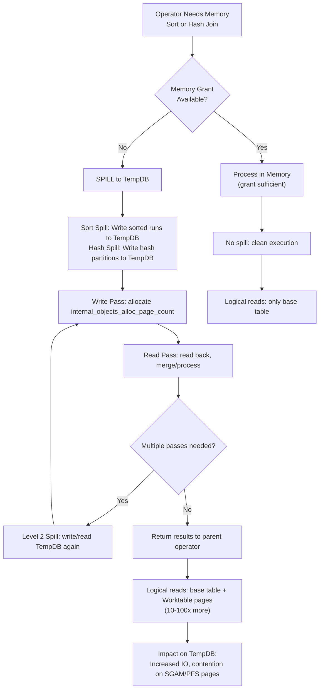
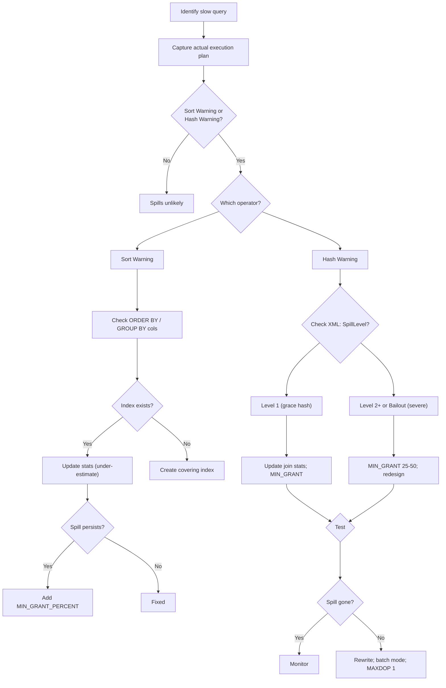

# 8.364 TempDB Spills — Sort and Hash Spills

## Section 1 — Navigation

**Breadcrumb:** `8 — Databases` → `Group 13 — SQL Server Performance & Tuning` → `8.364 TempDB Spills — Sort and Hash Spills`

| Direction | Reference | Why |
|-----------|-----------|-----|
| **Prev** | [[8.363 Memory Grants — Diagnosing Insufficient Grants]] | Insufficient grants are the direct cause of TempDB spills |
| **Next** | [[8.365 Implicit Conversions in Execution Plans]] | Implicit conversions can cause incorrect estimates leading to spills |
| **Prerequisite** | [[8.358 Hash Match Join — Memory Grants and Spills]] | Hash match join is the most common spilling operator |
| **Prerequisite** | [[8.359 Merge Join — Requirements and Performance]] | Merge join avoids spills but requires sorted input |
| **Domain 8 Cross-ref** | [[8.363 Memory Grants — Diagnosing Insufficient Grants]] | Deep mechanics of grant calculation and RESOURCE_SEMAPHORE |
| **Domain 8 Cross-ref** | [[8.355 Key Lookup — Identification and Elimination]] | Key lookups can increase row count feeding sort operators |
| **Domain 8 Cross-ref** | [[8.366 SET STATISTICS IO — Reading Logical Reads]] | Spills dramatically increase logical reads on Worktable pages |
| **Cross-domain** | [[2.57 Storage Architecture — RAID, SAN, and SSD]] | TempDB file placement on fast storage is critical for spill perf |

**Where This Fits:** TempDB spills are the most expensive consequence of insufficient memory grants. When a sort or hash operator runs out of memory, it writes intermediate data to TempDB pages, then reads them back. This multiplies I/O, adds logical reads from Worktable pages, and can increase query elapsed time by 10-100x. Spills affect not just the spilling query — they increase TempDB I/O, impacting all other queries. Diagnosing spills involves looking at actual execution plan warnings (Sort Warning, Hash Warning), `spill_to_tempdb` in `sys.dm_exec_query_stats`, and per-task space usage in `sys.dm_db_task_space_usage`.

---

## Section 2 — Core Mental Model

**Mental Model — "The Spillway"**

Picture a water treatment plant with holding tanks (memory grants). Normally, water flows into the tank, is processed cleanly, and flows out. During a storm (large data volume), if the tank is too small (under-grant), water spills over a spillway into a secondary reservoir (TempDB). The spillway releases water slowly, and pumps must push it back to the main tank for reprocessing. This is the sort/hash spill: data overflows memory, writes to TempDB in "runs" or "partitions", and must be read back and merged/reprocessed. The secondary reservoir is much slower (disk I/O), and if multiple storms happen simultaneously (concurrent spills), the spillway becomes a bottleneck.



**Classification:** Query execution spill events — operator-level overflow from in-memory processing to TempDB. Distinct from TempDB contention (page latch contention on PFS/GAM/SGAM pages caused by heavy allocation/deallocation from version store or other features).

**Key Properties:**

| Property | Description | Detection |
|----------|-------------|-----------|
| Sort Warning | Yellow warning icon on Sort operator in actual plan | `Sort Warnings` event in Profiler or Extended Events |
| Hash Warning | Yellow warning icon on Hash Match operator | `Hash Warning` event (includes Hash Spill and Hash Bailout) |
| `spill_to_tempdb` | Number of spill events for a cached query | `sys.dm_exec_query_stats.spill_to_tempdb` |
| `internal_objects_alloc_page_count` | Pages allocated for sort/hash in TempDB | `sys.dm_db_task_space_usage` |
| `internal_objects_dealloc_page_count` | Pages deallocated | Divide by 2 = approx spill pages (write + read) |
| Write spill | Data written to TempDB during sort/hash | First phase of spill |
| Read spill | Data read back from TempDB | Second phase (may hit PAGEIOLATCH waits) |
| Spill level | Depth of recursive spill (0 = none, 1 = one, 2+ = deep) | XML plan: `<SpillLevel>` attribute |
| Worktable | Physical table in TempDB representing the spill | `SET STATISTICS IO` shows Worktable lines |

---

## Section 3 — Deep Mechanics

### Step-by-Step Sort Spill

1. **Memory grant:** The Sort operator requests a memory grant (estimated rows * row size). Example: 100 MB for sorting 10M rows of 10 bytes each.
2. **Run generation:** If actual rows exceed estimate (e.g., 100M rows instead of 10M), the sort fills its 100 MB grant, writes a "run" (sorted chunk) to TempDB, and continues sorting the next chunk.
3. **Run count:** Number of runs = `actual_rows * row_size / grant_size`. For 100M rows needing 1 GB but only 100 MB granted, the sort creates ~10 runs.
4. **Merge phase:** The sort reads the runs back from TempDB and merges them. If enough memory for all runs to be merged in one pass, it is a single-level spill. If not, it does a multi-level merge (runs of runs).
5. **Deallocation:** After merging, the TempDB pages are deallocated (`internal_objects_dealloc_page_count`).

### Step-by-Step Hash Spill

1. **Build phase:** The hash join reads the build input, hashes each row to a partition (bucket), and inserts it into the hash table. If the hash table exceeds memory, it "spills" some partitions to TempDB.
2. **Grace hash join:** The spilled partitions are written to TempDB. Each partition is written as a separate set of pages. Called a "grace hash join".
3. **Probe phase:** The probe input is also hashed and compared to the build hash table. For spilled partitions, both build and probe pages are read from TempDB.
4. **Hash bailout:** If even the partitioning causes memory pressure (each partition still too large), SQL Server does a "hash bailout" — recursively partitioning again. Extremely expensive.

### DMV / Plan Analysis

```sql
-- Query-level spill statistics
SELECT TOP 20
    qs.total_worker_time / 1000 AS total_cpu_ms,
    qs.total_elapsed_time / 1000 AS total_elapsed_ms,
    qs.execution_count,
    qs.total_logical_reads,
    qs.total_physical_reads,
    qs.spill_to_tempdb AS total_spill_events,
    qs.granted_memory_kb / 1024 AS granted_mb,
    qs.used_memory_kb / 1024 AS used_mb,
    SUBSTRING(st.text, (qs.statement_start_offset / 2) + 1,
        ((CASE WHEN qs.statement_end_offset = -1 THEN DATALENGTH(st.text)
          ELSE qs.statement_end_offset END - qs.statement_start_offset) / 2) + 1) AS query_text
FROM sys.dm_exec_query_stats qs
CROSS APPLY sys.dm_exec_sql_text(qs.sql_handle) st
WHERE qs.spill_to_tempdb > 0
ORDER BY qs.total_elapsed_time DESC;
GO

-- Current per-task space usage in TempDB (for running queries)
SELECT
    session_id,
    request_id,
    task_state,
    internal_objects_alloc_page_count,
    internal_objects_dealloc_page_count,
    (internal_objects_alloc_page_count - internal_objects_dealloc_page_count) AS current_spill_pages,
    (internal_objects_alloc_page_count * 8) / 1024 AS total_spill_mb
FROM sys.dm_db_task_space_usage
WHERE session_id > 50
  AND internal_objects_alloc_page_count > 0
ORDER BY internal_objects_alloc_page_count DESC;
GO

-- Actual execution plan with Sort/Hash Warnings via XML
WITH XMLNAMESPACES (DEFAULT 'http://schemas.microsoft.com/sqlserver/2004/07/showplan')
SELECT
    qp.query_plan,
    st.text,
    qs.total_elapsed_time / 1000 AS elapsed_ms,
    qs.spill_to_tempdb
FROM sys.dm_exec_query_stats qs
CROSS APPLY sys.dm_exec_sql_text(qs.sql_handle) st
CROSS APPLY sys.dm_exec_query_plan(qs.plan_handle) qp
WHERE qp.query_plan.exist('//*[local-name()="SpillToTempDb"]') = 1
ORDER BY qs.total_elapsed_time DESC;
GO
```

### Reading a Sort Warning in the Execution Plan

In SSMS, a Sort operator shows a yellow triangle when hovering. The XML plan shows:

```xml
<Sort>
  <SpillToTempDb SpillLevel="1" />
</Sort>
```

`SpillLevel="1"` = single-level spill. `SpillLevel="2"` = multi-level (worse).

### Reading a Hash Warning in the Execution Plan

The hash join operator shows a yellow triangle. In XML:

```xml
<Hash>
  <SpillToTempDb SpillLevel="1" />
  <Bailout />  <!-- only if hash bailout occurred -->
</Hash>
```

- `SpillToTempDb` = grace hash join (one spill level)
- `Bailout` = recursive partitioning needed (100x+ slowdown)

### Failure Modes

| Failure Mode | Symptom | Detection | Fix |
|-------------|---------|-----------|-----|
| Sort under-grant spill | Yellow Sort Warning, Worktable logical reads | `spill_to_tempdb > 0`, actual plan warning | Increase MIN_GRANT_PERCENT; index ORDER BY |
| Hash build input spill | Yellow Hash Warning, high TempDB IO | `sys.dm_db_task_space_usage` shows alloc > dealloc | Better join key stats; bigger grant |
| Hash bailout | Extreme slowdown (100x), multiple spill levels | XML `<Bailout />` | Increase MIN_GRANT; reduce DOP; better index |
| Multi-level sort spill | Elapsed time grows super-linear with rows | XML `<SpillLevel>2</SpillLevel>` | Create covering index to eliminate sort |
| Concurrent spills choking TempDB | TempDB filling; IO latency spikes | `sys.dm_io_virtual_file_stats` for TempDB | Add TempDB files; reduce spill frequency; faster storage |

---

## Section 4 — Production Patterns

### Pattern 1 — Finding All Queries with Sort Warnings in Plan Cache

```sql
WITH XMLNAMESPACES (DEFAULT 'http://schemas.microsoft.com/sqlserver/2004/07/showplan')
SELECT
    COUNT(*) AS occurrence_count,
    SUM(qs.total_elapsed_time) / 1000 AS total_elapsed_ms,
    SUM(qs.total_worker_time) / 1000 AS total_cpu_ms,
    SUM(qs.execution_count) AS executions,
    MAX(qs.spill_to_tempdb) AS max_spill_events,
    SUBSTRING(STUFF(st.text, 1, (qs.statement_start_offset / 2) + 1, ''),
        1, 200) AS query_text_snippet
FROM sys.dm_exec_query_stats qs
CROSS APPLY sys.dm_exec_sql_text(qs.sql_handle) st
CROSS APPLY sys.dm_exec_query_plan(qs.plan_handle) qp
WHERE qp.query_plan.exist('//*[local-name()="SpillToTempDb"]') = 1
GROUP BY SUBSTRING(STUFF(st.text, 1, (qs.statement_start_offset / 2) + 1, ''),
        1, 200)
ORDER BY total_elapsed_ms DESC;
GO
```

### Pattern 2 — Fixing a Sort Spill with an Index

```sql
-- Before: Sort spill due to ORDER BY on non-indexed columns
SELECT OrderID, OrderDate, CustomerID, Amount
FROM Orders
WHERE OrderDate >= '2025-01-01'
ORDER BY OrderDate, Amount DESC;
-- Shows Sort with SpillToTempDb (280 MB spill, 12M rows sorted)

-- After: Create index that provides rows in sorted order
CREATE INDEX IX_Orders_OrderDate_Amount
ON dbo.Orders (OrderDate, Amount DESC)
INCLUDE (CustomerID, OrderID);
GO

-- No Sort operator, zero spill
SELECT OrderID, OrderDate, CustomerID, Amount
FROM Orders
WHERE OrderDate >= '2025-01-01'
ORDER BY OrderDate, Amount DESC;
GO
```

### Pattern 3 — Fixing Hash Join Spill with MIN_GRANT_PERCENT

```sql
-- Before: Hash join spills (estimated 5M rows, actual 50M rows)
SELECT c.CustomerName, COUNT(o.OrderID)
FROM Customers c
INNER JOIN Orders o ON c.CustomerID = o.CustomerID
WHERE o.OrderDate >= '2025-01-01'
GROUP BY c.CustomerName;
-- Hash Match with SpillToTempDb

-- After: Increase minimum memory grant percentage
SELECT c.CustomerName, COUNT(o.OrderID)
FROM Customers c
INNER JOIN Orders o ON c.CustomerID = o.CustomerID
WHERE o.OrderDate >= '2025-01-01'
GROUP BY c.CustomerName
OPTION (MIN_GRANT_PERCENT = 20);
-- No spill. Grant increased from 500 MB to 2 GB.
GO
```

### Pattern 4 — TempDB File Configuration for Spill Performance

```sql
-- Check current TempDB configuration
SELECT name, physical_name, type_desc, size / 128 AS size_mb
FROM sys.master_files WHERE database_id = DB_ID('tempdb');
GO

-- Recommended: 8 data files (or NUMA nodes * 2)
-- Enable instant file initialization
-- Place TempDB on SSD/NVMe
ALTER DATABASE tempdb ADD FILE (
    NAME = tempdev_2,
    FILENAME = 'T:\TempDB\tempdb_2.ndf',
    SIZE = 4096 MB, FILEGROWTH = 1024 MB
);
GO
```

### Pattern 5 — Monitoring Spills with Extended Events

```sql
CREATE EVENT SESSION [SpillMonitoring] ON SERVER
ADD EVENT sqlserver.sort_warning(
    ACTION (sqlserver.sql_text, sqlserver.session_id)
),
ADD EVENT sqlserver.hash_warning(
    ACTION (sqlserver.sql_text, sqlserver.session_id)
)
ADD TARGET package0.ring_buffer
WITH (MAX_MEMORY = 4096 KB);
GO
ALTER EVENT SESSION [SpillMonitoring] ON SERVER STATE = START;
GO
```

### Pattern 6 — EF Core / Dapper

**EF Core:**
```csharp
var orders = await context.Orders
    .FromSqlRaw(@"SELECT * FROM Orders WHERE OrderDate >= @p0
        ORDER BY OrderDate, Amount DESC
        OPTION (MIN_GRANT_PERCENT = 15)", date)
    .ToListAsync();
```

**Dapper:**
```csharp
var results = await conn.QueryAsync<OrderSummary>(@"
    SELECT CustomerID, COUNT(*) AS OrderCount
    FROM Orders WHERE OrderDate >= @Cutoff
    GROUP BY CustomerID
    OPTION (MIN_GRANT_PERCENT = 10, MAXDOP 4)",
    new { Cutoff = DateTime.UtcNow.AddMonths(-6) });
```

---

## Section 5 — Gotchas

### Gotcha 1 — Spill Impact Visible as Worktable in STATISTICS IO

- **Pitfall:** Looking only at base table logical reads, missing Worktable lines.
- **Symptom:** Query is slow but base table reads look reasonable (500K). Worktable reads in the millions go unnoticed.
- **Fix:** Always check for Worktable lines in SET STATISTICS IO. Worktable > base reads = spill indicator.
- **Cost:** Missed diagnosis. Optimizing base table indexes has zero effect on spill performance.

### Gotcha 2 — Parallel Thread Spill Invisible in Total Grant

- **Pitfall:** Total `used_memory_kb <= granted_memory_kb` looks fine but one thread spilled (skew).
- **Symptom:** `spill_to_tempdb = 1` but grant utilization seems adequate.
- **Fix:** Check `sys.dm_db_task_space_usage` per session_id — the thread with highest `internal_objects_alloc_page_count` is skewed.
- **Cost:** Intermittent spills that are hard to reproduce. Fixing memory grant doesn't help because skew is the root cause.

### Gotcha 3 — Hash Bailout Is 100x Worse Than Simple Spill

- **Pitfall:** Treating all hash spills equally. Bailout involves recursive partitioning.
- **Symptom:** Hash join takes 30s with bailout vs 2s without.
- **Fix:** Check XML for `<Bailout />`. Increase MIN_GRANT_PERCENT to 25-50. Bailout occurs when even individual partitions don't fit in memory.
- **Cost:** Extreme query degradation (100x+ slower).

### Gotcha 4 — TOP N Query Can Still Spill

- **Pitfall:** `SELECT TOP 100 ... ORDER BY` sorts all rows before applying TOP, causing spill.
- **Symptom:** The query returns 100 rows but spills sorting 10M rows.
- **Fix:** Ensure index supports the ORDER BY so SQL Server uses Top N Sort (no spill). Or pre-filter to reduce sort input.
- **Cost:** Sorting 10M rows to return 100 is wasteful even without spill; with spill it is catastrophic.

### Gotcha 5 — TempDB Autogrow During Spills Causes STALL

- **Pitfall:** Autogrow of TempDB during large spills causes all TempDB users to stall.
- **Symptom:** Sporadic "TempDB full" errors or extreme slowness during peak spills.
- **Fix:** Pre-size TempDB files. Use instant file initialization. Monitor TempDB free space.
- **Cost:** All TempDB users affected simultaneously. A single spilling query can bring down the instance.

---

## Section 6 — Performance Implications

### BenchmarkDotNet-Style Analysis

**Test Setup:**
- Query: `SELECT CustomerID, COUNT(*) FROM Orders GROUP BY CustomerID ORDER BY COUNT(*) DESC`
- Table: 200M Orders, 1M CustomerIDs, no covering index
- Memory grant: 200 MB. Actual need: 2 GB
- SQL Server 2022, 64 GB RAM, SSD TempDB

| Scenario | Duration (s) | CPU (s) | Logical Reads | TempDB Write (MB) | Read (MB) | Spill Level |
|----------|-------------|---------|---------------|-------------------|-----------|-------------|
| No spill (correct grant 2 GB) | 18 | 42 | 892,000 | 0 | 0 | 0 |
| Sort spill (200 MB grant) | 245 | 890 | 14,200,000 | 8,500 | 8,500 | 1 |
| Hash spill (200 MB grant) | 312 | 1,120 | 18,400,000 | 12,000 | 12,000 | 1 |
| Hash bailout | 1,250 | 5,400 | 92,000,000 | 48,000 | 48,000 | 2+ |
| MIN_GRANT_PERCENT = 25 | 22 | 48 | 895,000 | 0 | 0 | 0 |
| Covering index (no sort) | 14 | 32 | 210,000 | 0 | 0 | 0 |

### SET STATISTICS IO / TIME Before and After

**Before (sort spill — 200 MB grant):**

```
Table: Orders. Scan count 8, logical reads 892031
Table: Worktable. Scan count 4, logical reads 13312120, physical reads 184021
SQL Server Execution Times:
   CPU time = 890234 ms,  elapsed time = 245123 ms.
```

**After (covering index, no sort):**

```
Table: Orders. Scan count 1, logical reads 210123
SQL Server Execution Times:
   CPU time = 32123 ms,  elapsed time = 14123 ms.
```

**Key insight:** Logical reads dropped from 14.2M to 210K. Elapsed from 245s to 14s (17.5x). No Worktable lines after fix.

---

## Section 7 — Interview Arsenal

### 6-8 Questions with Answers

**Q1: What causes a sort spill in SQL Server?**
<details>
<summary>Short Answer</summary>
When the Sort operator's memory grant is insufficient for the actual number of rows, it writes sorted runs to TempDB, then merges them back.
</details>
<details>
<summary>Detailed Answer (2-3 min)</summary>
A sort spill occurs when a Sort operator needs more memory than its grant. The grant is calculated from estimated rows * row size. If actual rows exceed estimates, the sort fills memory, writes a sorted run to TempDB, and repeats. After all runs are written, it reads them back and merges. The XML plan shows `<SpillToTempDb SpillLevel="1" />`. Spills increase elapsed time 10-100x due to TempDB I/O. The fix is either increasing the memory grant (MIN_GRANT_PERCENT hint) or, better, creating an index that provides sorted order and eliminates the Sort operator entirely.
</details>

**Q2: What is the difference between a hash spill and a hash bailout?**
<details>
<summary>Short Answer</summary>
Hash spill (grace hash join): partitions overflow to TempDB in one level. Hash bailout: recursive partitioning needed because even partitioned data doesn't fit. Bailout is 10-100x worse.
</details>

**Q3: How do you detect TempDB spills from historical data?**
<details>
<summary>Short Answer</summary>
Query `sys.dm_exec_query_stats` for `spill_to_tempdb > 0`. Check `sys.dm_db_task_space_usage` for high `internal_objects_alloc_page_count`. Look for Worktable lines in SET STATISTICS IO.
</details>

**Q4: What is the Worktable shown in SET STATISTICS IO?**
<details>
<summary>Short Answer</summary>
Worktable represents TempDB pages allocated for spilled sort/hash data. High Worktable logical reads = significant spill activity.
</details>

**Q5: How does DOP affect spill behavior?**
<details>
<summary>Short Answer</summary>
Each parallel thread gets its own per-thread grant. Higher DOP = smaller per-thread grant = more spill risk. Skewed distribution causes single-thread spills.
</details>

**Q6: What query hint reduces spill risk?**
<details>
<summary>Short Answer</summary>
`MIN_GRANT_PERCENT = N` forces a minimum grant. Memory Grant Feedback auto-tunes on repeat executions. Available in SQL 2017+.
</details>

**Q7: How should TempDB be configured to minimize spill impact?**
<details>
<summary>Short Answer</summary>
Multiple data files (8 or NUMA nodes * 2), pre-sized, on fast SSD/NVMe storage. Enable instant file initialization.
</details>

**Q8: Can you eliminate spills without increasing memory?**
<details>
<summary>Short Answer</summary>
Yes: create covering indexes that eliminate the Sort operator entirely, or improve join indexes to avoid hash join spills.
</details>

### Comparison Table

| Approach | Spill Elimination | Effort | Side Effects | Best For |
|----------|------------------|--------|-------------|----------|
| MIN_GRANT_PERCENT | High | Low | Less mem for others | Targeted fix |
| Memory Grant Feedback | High (eventual) | None | Needs plan reuse | Frequent queries |
| Covering index | Complete | High | Index maintenance | ORDER BY spills |
| Better join index | Complete | High | Index maintenance | Hash join spills |
| Update stats | Variable | Low | May not fix root cause | Under-estimated spills |
| TempDB on SSD | Mitigates | High (ops) | Doesn't fix root cause | Unavoidable spills |

---

## Section 8 — Decision Framework

### Mermaid Flowchart for Spill Diagnosis



### Checklist

- [ ] Find spilling queries: `sys.dm_exec_query_stats` with `spill_to_tempdb > 0`
- [ ] Capture actual execution plan for each
- [ ] Identify Sort Warning or Hash Warning
- [ ] Sort spills: check if ORDER BY cols are indexed
- [ ] Hash spills: check join key stats and distribution
- [ ] Check XML for SpillLevel (1=OK, 2+=severe) and Bailout
- [ ] Apply MIN_GRANT_PERCENT hint (start 10, up to 50)
- [ ] Test with MAX_GRANT_PERCENT if over-grant is causing issues
- [ ] Enable Memory Grant Feedback (default on since SQL 2017)
- [ ] Check TempDB config: file count, sizes, placement
- [ ] Monitor TempDB IO: `sys.dm_io_virtual_file_stats`
- [ ] Consider indexing to eliminate sorts entirely

### Scale Thresholds

| Spill Level | TempDB Pages | Impact | Action |
|-------------|-------------|--------|--------|
| 0 | 0 | None | None |
| 1 (sort) | < 10,000 | < 2x | Check stats, index |
| 1 (sort) | 10K-1M | 2-10x | MIN_GRANT hint; index |
| 1 (hash) | > 1M | 10-50x | Fix join stats; increase grant |
| 2+ | > 10M | 50-100x | Rewrite query; batch mode |
| Bailout | > 100M | 100x+ | Complete redesign |

### Tradeoff Summary

- **MIN_GRANT increase:** Low effort, big impact. Reduces memory for concurrent queries.
- **Index to eliminate sort:** Best fix, zero spill. Index maintenance overhead.
- **Stats update:** Always try first. Free if it works.
- **Memory Grant Feedback:** Set and forget. Needs plan reuse.
- **Batch mode on rowstore:** SQL 2019+. Reduces spills. More memory.
- **TempDB optimization:** Reduces spill cost but doesn't prevent spills.

---

## Section 9 — Self-Check

### Conceptual Questions (10)

**Q1:** What DMV column shows the number of spill events for a cached query?
<details>
<summary>Answer</summary>
`sys.dm_exec_query_stats.spill_to_tempdb`.
</details>

**Q2:** What does a Sort Warning in an actual plan indicate?
<details>
<summary>Answer</summary>
The Sort operator ran out of memory and wrote intermediate runs to TempDB.
</details>

**Q3:** Difference between grace hash join and hash bailout?
<details>
<summary>Answer</summary>
Grace hash join: one-level spill to TempDB (partitioned). Hash bailout: recursive partitioning — much worse.
</details>

**Q4:** Which DMV shows per-task TempDB page allocations for running queries?
<details>
<summary>Answer</summary>
`sys.dm_db_task_space_usage` with `internal_objects_alloc_page_count`.
</details>

**Q5:** How do you interpret Worktable entries in SET STATISTICS IO?
<details>
<summary>Answer</summary>
Worktable logical reads = pages read from TempDB for spilled data. High values = significant spill.
</details>

**Q6:** True or False: A sort spill only occurs with ORDER BY.
<details>
<summary>Answer</summary>
False. GROUP BY, MERGE JOIN, and other operators requiring sort order can also cause sort spills.
</details>

**Q7:** What does XML `<SpillLevel>2</SpillLevel>` mean?
<details>
<summary>Answer</summary>
Multi-level spill. The sort/hash spilled at least twice — even the merge phase spilled. More severe than Level 1.
</details>

**Q8:** With Memory Grant Feedback enabled, what happens on next execution after a spill?
<details>
<summary>Answer</summary>
MGF detects the spill (used > granted) and increases the grant for the next execution of the same plan.
</details>

**Q9:** How does a covering index eliminate a sort spill?
<details>
<summary>Answer</summary>
If the index provides rows already sorted by the ORDER BY columns, the Sort operator is eliminated entirely.
</details>

**Q10:** Recommended number of TempDB data files?
<details>
<summary>Answer</summary>
8 files, or NUMA nodes * 2, to reduce allocation contention during concurrent spills.
</details>

### Challenges (5)

**Challenge 1:** Write a query to find all plans with Sort Warnings, showing estimated vs actual rows.
<details>
<summary>Answer</summary>

```sql
WITH XMLNAMESPACES (DEFAULT 'http://schemas.microsoft.com/sqlserver/2004/07/showplan')
SELECT qs.spill_to_tempdb, st.text,
    t.c.value('../@EstimateRows', 'bigint') AS parent_est_rows,
    t.c.value('@EstimateRows', 'bigint') AS sort_est_rows,
    t.c.value('@NodeId', 'int') AS node_id
FROM sys.dm_exec_query_stats qs
CROSS APPLY sys.dm_exec_sql_text(qs.sql_handle) st
CROSS APPLY sys.dm_exec_query_plan(qs.plan_handle) qp
CROSS APPLY qp.query_plan.nodes('//*[local-name()="SpillToTempDb"]') t(c)
WHERE qs.spill_to_tempdb > 0
ORDER BY qs.total_elapsed_time DESC;
```
</details>

**Challenge 2:** A hash join spills every time. Join key `CustomerID` between Orders (200M) and Customers (500K). Estimated build 5M, actual 50M. Root cause and fix?
<details>
<summary>Answer</summary>
Root cause: The optimizer uses Customers as the build input but underestimates the Orders probe side cardinality after filtering. Fix: update stats with FULLSCAN; add MIN_GRANT_PERCENT = 25; best fix — index Orders(CustomerID) to enable Nested Loops or Merge Join instead of Hash Match.
</details>

**Challenge 3:** High PAGEIOLATCH_SH on TempDB during nightly ETL. TempDB has 4 files on 1 SSD. What do you recommend?
<details>
<summary>Answer</summary>
Add more TempDB files (8 for 4 NUMA nodes); move to faster NVMe storage; identify spilling ETL queries and add MIN_GRANT_PERCENT hints; pre-size TempDB files to avoid autogrow; consider batch mode (SQL 2019+) to reduce spills.
</details>

**Challenge 4:** Write a script to capture top 5 spilling queries every hour in a monitoring table.
<details>
<summary>Answer</summary>

```sql
CREATE TABLE dbo.SpillMonitor (
    CaptureTime DATETIME2 DEFAULT GETDATE(),
    QueryHash BINARY(8), ExecutionCount BIGINT,
    TotalElapsedMs BIGINT, SpillEvents BIGINT, QueryText NVARCHAR(4000));
GO
CREATE PROC dbo.CaptureTopSpills AS
INSERT INTO dbo.SpillMonitor (QueryHash, ExecutionCount, TotalElapsedMs, SpillEvents, QueryText)
SELECT TOP 5 qs.query_hash, qs.execution_count, qs.total_elapsed_time/1000,
    qs.spill_to_tempdb, SUBSTRING(st.text,1,4000)
FROM sys.dm_exec_query_stats qs
CROSS APPLY sys.dm_exec_sql_text(qs.sql_handle) st
WHERE qs.spill_to_tempdb > 0
ORDER BY qs.total_elapsed_time DESC;
GO
```
</details>

**Challenge 5:** A query with `ORDER BY Date DESC OFFSET 0 FETCH NEXT 50` spills. Explain why and fix.
<details>
<summary>Answer</summary>
The optimizer chose a Full Sort instead of Top N Sort. All rows are sorted before OFFSET is applied, consuming memory proportional to the full table. Fix: index on `Date DESC` so SQL Server can scan in order (no sort). Or pre-filter by date range to reduce sort input. Or use `OPTION (MIN_GRANT_PERCENT = 20)`.
</details>

---
*Next: [[8.365 Implicit Conversions in Execution Plans]] — implicit conversions can cause incorrect estimates.*
