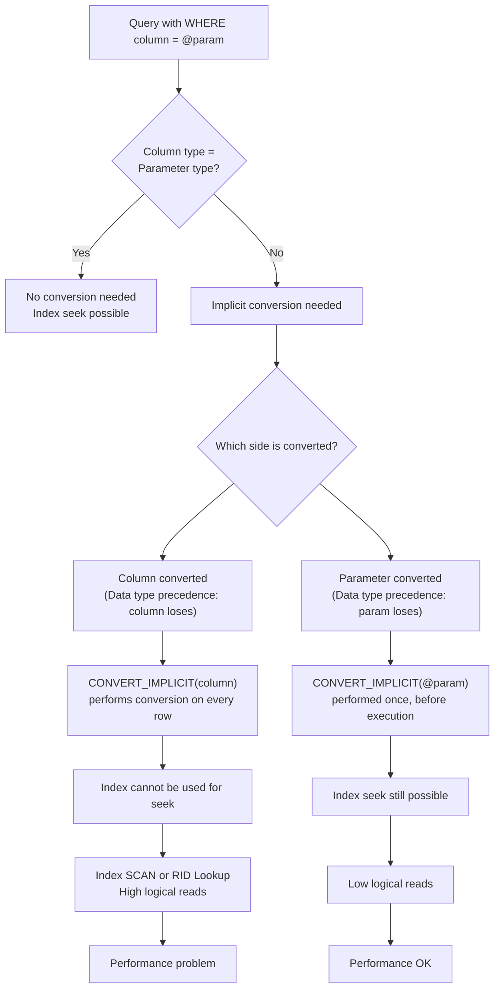
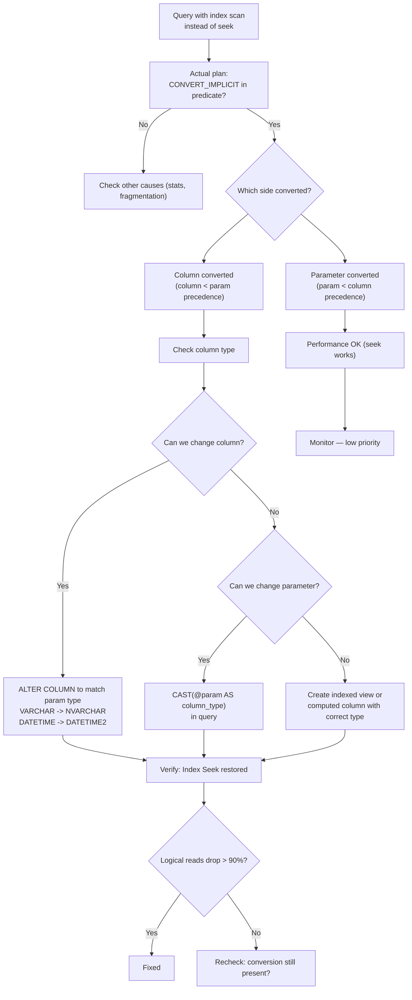

# 8.365 Implicit Conversions in Execution Plans

## Section 1 — Navigation

**Breadcrumb:** `8 — Databases` → `Group 13 — SQL Server Performance & Tuning` → `8.365 Implicit Conversions in Execution Plans`

| Direction | Reference | Why |
|-----------|-----------|-----|
| **Prev** | [[8.364 TempDB Spills — Sort and Hash Spills]] | Spills can be caused by implicit conversions skewing cardinality estimates |
| **Next** | [[8.366 SET STATISTICS IO — Reading Logical Reads]] | Impact of implicit conversions is measured in additional logical reads |
| **Prerequisite** | [[8.343 Execution Plans — Reading Graphical Plans]] | Must identify CONVERT_IMPLICIT operators and data type warnings |
| **Prerequisite** | [[8.341 Cardinality Estimation — CE70 vs CE120 vs CE150]] | Implicit conversions can cause cardinality estimate mismatches |
| **Domain 8 Cross-ref** | [[8.338 Statistics Objects — Creation and Maintenance]] | Conversion from parameter type to column type bypasses histogram lookup |
| **Domain 8 Cross-ref** | [[8.344 Execution Plans — Estimated vs Actual]] | Plan shows CONVERT_IMPLICIT in estimated plan; actual rows may differ |
| **Domain 8 Cross-ref** | [[8.366 SET STATISTICS IO — Reading Logical Reads]] | Implicit conversions cause index/table scans instead of seeks |
| **Cross-domain** | [[2.53 Data Types and Memory Layout (C#/CLR)]] | Data type matching between ORM (C#) and SQL Server columns |

**Where This Fits:** Implicit conversions occur when SQL Server automatically converts one data type to another for comparison, assignment, or parameter passing. They appear in execution plans as the `CONVERT_IMPLICIT` operator. The most common and damaging scenario: a column has an index, but the query predicate uses a different data type than the column, causing SQL Server to convert the column (not the constant) — which makes the index non-sargable. The index can't be used for seek operations, so SQL Server scans the entire table/index instead. This is one of the most common performance issues introduced by ORMs like Entity Framework and Dapper when the C# type doesn't match the SQL column type exactly.

---

## Section 2 — Core Mental Model

**Mental Model — "The Bouncer at the Club"**

Imagine a nightclub with a strict dress code typed on a sign: "No boots" (column defined as `VARCHAR`). A guest arrives wearing boots (`NVARCHAR` parameter). Instead of checking dress code first, the bouncer makes the guest leave the line, go home to change shoes — which means every guest with boots must change. That is `CONVERT_IMPLICIT` on the **column side**: every single row must be converted before comparison. If the guest just slipped on a different style of boot (the parameter side), the bouncer would simply say "no boots" immediately — that's converting the parameter, which happens once. The difference between converting the column (scan, slow) vs converting the parameter (seek, fast) is the entire point of implicit conversion optimization.



**Classification:** Query plan cardinality estimation + operator-level data type conversion. Not a wait type, not a memory issue — a query plan shape issue that causes index scans instead of seeks and incorrect cardinality estimates.

**Key Properties:**

| Property | Description | Detection |
|----------|-------------|-----------|
| `CONVERT_IMPLICIT` | Operator in execution plan showing automatic type conversion | Estimated/actual plan: look for "CONVERT_IMPLICIT" in predicate |
| Data type precedence | Determines which type is converted to which | See `sys.types` precedence order (INT > VARCHAR > NVARCHAR) |
| Column-side conversion | Column data is converted for each row; index seek impossible | CONVERT_IMPLICIT on left side of predicate expression |
| Parameter-side conversion | Parameter/constant is converted once; index seek still possible | CONVERT_IMPLICIT on right side of predicate expression |
| NVARCHAR vs VARCHAR | Most common implicit conversion in ORM applications | C# string maps to NVARCHAR; SQL column is VARCHAR |
| INT vs VARCHAR | Wrong data type passed to a numeric column | Application passes string for an INT column |
| DATETIME2 vs DATETIME | Date/time precision mismatch | C# DateTime maps to DATETIME2 by default in newer EF Core |
| Sargability | Search argument ability — whether an index can be used for seek | CONVERT_IMPLICIT on column = non-sargable |

---

## Section 3 — Deep Mechanics

### Step-by-Step Implicit Conversion

1. **Data type precedence:** SQL Server has a fixed data type precedence list (highest to lowest). When comparing two types, the lower-precedence type is converted to the higher-precedence type.
   - Partial precedence: `DATETIME2 > DATETIME > SMALLDATETIME > DATE > INT > VARCHAR > NVARCHAR`
   - Full list: `sql_variant` (highest) > `datetime2` > `datetime` > `smalldatetime` > `date` > `time` > `float` > `real` > `decimal` > `money` > `smallmoney` > `bigint` > `int` > `smallint` > `tinyint` > `bit` > `nvarchar` > `nchar` > `varchar` > `char` > `varbinary` > `binary` > `uniqueidentifier` > `timestamp` > `xml` (lowest)

2. **Parameter sniffing with conversion:** When a parameter/constant is of a different type than the column:
   - If the column has higher precedence → column is converted (bad)
   - If the parameter has higher precedence → parameter is converted (OK)

3. **Cardinality estimation effect:** When the column is converted, the optimizer cannot use histogram statistics for the conversion expression. It falls back to a guess (5% for `CONVERT_IMPLICIT` with CE70, or specific estimates in CE120+). This causes wrong row estimates → wrong join type, wrong memory grant → spills.

4. **Index sargability:** If the column appears inside a function (including `CONVERT_IMPLICIT`), the optimizer cannot perform an equality seek on that column's index. It must scan the entire index (or table).

### Most Common Patterns

| Pattern | Column Type | Parameter Type | Effect |
|---------|-------------|----------------|--------|
| ORM string default | `VARCHAR(50)` | `NVARCHAR(50)` | Column converted (VARCHAR < NVARCHAR precedence) |
| Missing quotes | `INT` | `VARCHAR` (string literal) | Both converted to INT if possible; scan likely |
| EF Core DateTime | `DATETIME` | `DATETIME2` (EF Core default) | Column converted (DATETIME < DATETIME2 precedence) |
| Unicode from app | `CHAR(10)` | `NCHAR(10)` | Column converted |
| Numeric in string column | `VARCHAR(20)` | `INT` | Parameter converted (OK) |

### DMV / Plan Analysis

```sql
-- Find plans with implicit conversions using XML query
WITH XMLNAMESPACES (DEFAULT 'http://schemas.microsoft.com/sqlserver/2004/07/showplan')
SELECT
    qs.total_elapsed_time / 1000 AS elapsed_ms,
    qs.execution_count,
    qs.total_logical_reads,
    st.text,
    qp.query_plan
FROM sys.dm_exec_query_stats qs
CROSS APPLY sys.dm_exec_sql_text(qs.sql_handle) st
CROSS APPLY sys.dm_exec_query_plan(qs.plan_handle) qp
WHERE qp.query_plan.exist('//ScalarOperator[contains(@ScalarString, "CONVERT_IMPLICIT")]') = 1
ORDER BY qs.total_elapsed_time DESC;
GO

-- More specific: find CONVERT_IMPLICIT at the column level (predicates in IndexScan/IndexSeek)
WITH XMLNAMESPACES (DEFAULT 'http://schemas.microsoft.com/sqlserver/2004/07/showplan')
SELECT
    qs.total_elapsed_time / 1000 AS elapsed_ms,
    qs.total_logical_reads,
    qs.execution_count,
    t.c.value('@Database', 'sysname') AS database_name,
    t.c.value('@Schema', 'sysname') AS schema_name,
    t.c.value('@Table', 'sysname') AS table_name,
    SUBSTRING(st.text, (qs.statement_start_offset / 2) + 1, 200) AS query_text
FROM sys.dm_exec_query_stats qs
CROSS APPLY sys.dm_exec_sql_text(qs.sql_handle) st
CROSS APPLY sys.dm_exec_query_plan(qs.plan_handle) qp
CROSS APPLY qp.query_plan.nodes('//Object') t(c)
WHERE qp.query_plan.exist('//ScalarOperator[contains(@ScalarString, "CONVERT_IMPLICIT")]') = 1
ORDER BY qs.total_logical_reads DESC;
GO

-- Check for specific conversion warnings in the execution plan
-- Look for ScalarOperator with CONVERT_IMPLICIT(NVARCHAR(50), [Column], 0)
-- The third parameter (0=default, 1=style) may indicate data loss risk

-- Find tables/columns most likely affected by implicit conversions
SELECT
    OBJECT_SCHEMA_NAME(c.object_id) AS schema_name,
    OBJECT_NAME(c.object_id) AS table_name,
    c.name AS column_name,
    tp.name AS column_type,
    c.max_length
FROM sys.columns c
INNER JOIN sys.types tp ON c.user_type_id = tp.user_type_id
WHERE tp.name IN ('varchar', 'char', 'nvarchar', 'nchar', 'datetime', 'smalldatetime')
  AND OBJECTPROPERTY(c.object_id, 'IsUserTable') = 1
ORDER BY schema_name, table_name, column_name;
GO
```

### Execution Plan Representation

In a graphical plan, `CONVERT_IMPLICIT` appears in the predicate tooltip:

```
Predicate: [Database].[dbo].[Table].[VarcharColumn] = CONVERT_IMPLICIT(nvarchar(50), [@Param], 0)
```

- The column `VarcharColumn` is **VARCHAR(50)**
- `@Param` is **NVARCHAR(50)**
- Since NVARCHAR has higher precedence, the **column** is converted to NVARCHAR
- This is a column-side conversion → index seek on `VarcharColumn` is impossible

**Corrected version (parameter-side conversion):**

If the column were NVARCHAR and @Param were VARCHAR, the parameter would be converted (once), not the column. Index seek would work.

### Failure Modes

| Failure Mode | Symptom | Detection | Fix |
|-------------|---------|-----------|-----|
| VARCHAR column + NVARCHAR param | Index Scan instead of Seek | CONVERT_IMPLICIT on ScalarOperator for column | Change column to NVARCHAR; or change app param to VARCHAR; or use `CAST(@param AS VARCHAR)` |
| DATETIME column + DATETIME2 param | Index Scan; off-by-1 nanosecond errors | CONVERT_IMPLICIT with datetime conversion | Change column to DATETIME2; or use `CONVERT(DATETIME, @param)` in query |
| INT column + VARCHAR param | Index Scan; conversion failure risk on non-numeric | CONVERT_IMPLICIT on INT column | Fix app to pass INT; or use `TRY_CAST` |
| CHAR + NCHAR | Index Scan; space padding differences | CONVERT_IMPLICIT on char column | Align types; note CHAR pads spaces, NCHAR pads NCHAR spaces |
| NVARCHAR(MAX) + NVARCHAR(50) | No index issue but memory over-grant | Plan shows conversion between lengths | Align parameter length with column length |

---

## Section 4 — Production Patterns

### Pattern 1 — Find All Implicit Conversion in the Entire Database

```sql
-- Use the built-in query plan analysis
-- Query to find index scans likely caused by implicit conversions
SELECT
    OBJECT_NAME(s.object_id) AS table_name,
    i.name AS index_name,
    s.user_seeks,
    s.user_scans,
    s.user_lookups,
    s.last_user_scan,
    s.last_user_seek
FROM sys.dm_db_index_usage_stats s
INNER JOIN sys.indexes i ON s.object_id = i.object_id AND s.index_id = i.index_id
WHERE s.database_id = DB_ID()
  AND s.user_scans > 0
  AND s.user_scans > s.user_seeks * 5  -- 5x more scans than seeks = likely conversion
ORDER BY s.user_scans DESC;
GO
```

### Pattern 2 — Fix VARCHAR/NVARCHAR Mismatch (Most Common)

```sql
-- Option A: Change column type to NVARCHAR (recommended for Unicode support)
ALTER TABLE dbo.Users
ALTER COLUMN Email NVARCHAR(255) NOT NULL;
GO

-- Option B: Cast the parameter (less invasive, for specific queries)
DECLARE @Email NVARCHAR(255) = N'user@example.com';
SELECT * FROM dbo.Users
WHERE Email = CAST(@Email AS VARCHAR(255));  -- Converts param, NOT column
GO

-- Option C: Query hint to force parameter conversion awareness
SELECT * FROM dbo.Users
WHERE Email = @Email
OPTION (OPTIMIZE FOR (@Email = 'no_value'));  -- May help optimizer understand type
GO
```

### Pattern 3 — Fix DATETIME/DATETIME2 Mismatch (EF Core)

```sql
-- Option A: Change column to DATETIME2 (matches C# DateTime precision)
ALTER TABLE dbo.Orders
ALTER COLUMN OrderDate DATETIME2 NOT NULL;
GO

-- Option B: Convert the parameter in query
DECLARE @FromDate DATETIME2 = '2025-01-01';
SELECT * FROM dbo.Orders
WHERE OrderDate >= CAST(@FromDate AS DATETIME);
GO

-- Option C: Use date range without time
SELECT * FROM dbo.Orders
WHERE OrderDate >= '2025-01-01'
  AND OrderDate < '2025-01-02';  -- datetime2 has higher precision; but literal is handled
GO
```

### Pattern 4 — Detecting Implicit Conversions with a Stored Procedure Scan

```sql
-- Find stored procedures that may have implicit conversions
-- by searching their definition for mismatched types
SELECT
    OBJECT_NAME(p.object_id) AS proc_name,
    p.definition
FROM sys.sql_modules p
WHERE p.definition LIKE '%WHERE%'
  AND (
       p.definition LIKE '%varchar%nvarchar%'
    OR p.definition LIKE '%nvarchar%varchar%'
    OR p.definition LIKE '%datetime%datetime2%'
    OR p.definition LIKE '%int%varchar%'
  )
ORDER BY proc_name;
GO
```

### Pattern 5 — Fix with Compatibility Level or Database Scoped Config

```sql
-- In SQL Server 2019+, the CE handles implicit conversions better
-- but the index scan issue is not fixed by CE version

-- Database scoped configuration for parameter sniffing
ALTER DATABASE SCOPED CONFIGURATION SET PARAMETER_SNIFFING = OFF;
GO
-- This doesn't fix the conversion but prevents parameter-sniffing side effects

-- Best approach: align column types with application types
-- Create a baseline report of all column types vs ORM model types
```

### Pattern 6 — EF Core / Dapper Configuration

**EF Core — Ensure type alignment:**

```csharp
// EF Core model configuration — match SQL column types exactly
public class UserConfiguration : IEntityTypeConfiguration<User>
{
    public void Configure(EntityTypeBuilder<User> builder)
    {
        builder.Property(u => u.Email)
            .HasColumnType("VARCHAR(255)")  // Match VARCHAR, not NVARCHAR
            .IsRequired();

        builder.Property(u => u.CreatedDate)
            .HasColumnType("DATETIME2")     // Match DATETIME2 (EF Core default)
            .IsRequired();
    }
}

// Alternative: use HasColumnType to control the SQL type
// Or use [Column(TypeName = "VARCHAR(255)")] on the property
```

**Dapper — Explicit type handling:**

```csharp
public async Task<User> GetUserByEmailAsync(string email)
{
    using var conn = new SqlConnection(connString);
    // Dapper passes string as NVARCHAR — ensure column is NVARCHAR or convert
    return await conn.QueryFirstOrDefaultAsync<User>(@"
        SELECT * FROM Users
        WHERE Email = @Email  -- If column is VARCHAR, this causes conversion
    ", new { Email = email });

    // Fix: explicitly cast the parameter
    return await conn.QueryFirstOrDefaultAsync<User>(@"
        SELECT * FROM Users
        WHERE Email = CAST(@Email AS VARCHAR(255))
    ", new { Email = email });
}
```

**EF Core Interceptor for automatic type casting:**

```csharp
public class ImplicitConversionInterceptor : DbCommandInterceptor
{
    public override InterceptionResult<DbDataReader> ReaderExecuting(
        DbCommand command, CommandEventData eventData, InterceptionResult<DbDataReader> result)
    {
        // Add query hint to surface conversion warnings
        // This doesn't fix the issue but helps identify problematic queries
        command.CommandText = $"/* IC_CHECK */ {command.CommandText}";
        return base.ReaderExecuting(command, eventData, result);
    }
}
```

---

## Section 5 — Gotchas

### Gotcha 1 — CONVERT_IMPLICIT Does Not Always Show as a Warning

- **Pitfall:** Assuming SSMS will show a warning icon for implicit conversions. It does not — the conversion is silent in the plan. You must inspect the predicate text.
- **Symptom:** An index scan where you expect an index seek, but no warnings. The predicate shows `CONVERT_IMPLICIT(nvarchar(50), [Column], 0)`.
- **Fix:** Always read the predicate tooltip in the execution plan for `CONVERT_IMPLICIT`. Use the XML plan search (Section 3) to find all conversions.
- **Cost:** You optimize indexes and stats for weeks while the root cause is a simple type mismatch. The scan persists.

### Gotcha 2 — EF Core Defaults to NVARCHAR and DATETIME2

- **Pitfall:** EF Core maps C# `string` to `NVARCHAR(MAX)` by default and C# `DateTime` to `DATETIME2`. If your SQL table is `VARCHAR` and `DATETIME`, every query causes implicit conversions.
- **Symptom:** All string and date columns show unexpected index scans. The application works fine in dev (small data) but performs poorly in production.
- **Fix:** Use `HasColumnType("VARCHAR(255)")` on EF entities to match the SQL types. Or change SQL columns to NVARCHAR/DATETIME2.
- **Cost:** Instance-wide performance degradation. Every query on affected tables scans indexes. On a table with 10M rows, this adds seconds per query.

### Gotcha 3 — CONVERT_IMPLICIT Can Lead to Cardinality Estimate Mismatch

- **Pitfall:** The optimizer cannot use histogram statistics for CONVERT_IMPLICIT expressions. It uses a fixed guess (5% for some CE versions, specific guesses in others).
- **Symptom:** The estimated rows vs actual rows shows a huge mismatch (e.g., estimate 10,000 rows, actual 1 row or 1M rows).
- **Fix:** Eliminate the conversion. The correct type allows histogram lookup and accurate estimates. The wrong estimate cascades to wrong join type, wrong memory grant, and spills.
- **Cost:** A query that returns 1 row is estimated as 10K rows → the optimizer chooses a hash join instead of nested loops → 100x more logical reads.

### Gotcha 4 — NCHAR/NVARCHAR Comparison with CHAR/VARCHAR Causes Space Padding Issues

- **Pitfall:** CHAR(10) pads spaces to 10 characters. NCHAR(10) pads NCHAR spaces (different character). When comparing `CHAR(10) = N'abc'`, the CHAR column is converted to NCHAR with spaces, and 'abc' is compared — but the NCHAR comparison may not match due to space semantics.
- **Symptom:** Some rows match and some don't, seemingly randomly. `WHERE Column = @Param` returns different results depending on the conversion direction.
- **Fix:** Avoid mixing CHAR/NCHAR types. Use VARCHAR/NVARCHAR instead, which don't pad.
- **Cost:** Data integrity issues + performance problems. Hard to debug because the results may be subtle.

### Gotcha 5 — IntelliSense and SSMS Do Not Flag Implicit Conversions

- **Pitfall:** No built-in SSMS warning or static analysis for implicit conversions. They are invisible until you examine the plan.
- **Symptom:** Developers unaware of the issue. Code reviews don't catch it because the T-SQL looks correct (`WHERE Email = @Email`).
- **Fix:** Use Extended Events or server-side trace to capture queries with CONVERT_IMPLICIT. Add a SQL Agent job that periodically queries the plan cache for conversion patterns.
- **Cost:** The conversion silently degrades performance for months until someone captures the actual plan and notices the CONVERT_IMPLICIT.

---

## Section 6 — Performance Implications

### BenchmarkDotNet-Style Analysis

**Test Setup:**
- Query: `SELECT * FROM Users WHERE Email = @Email`
- Table: 10M Users, clustered index on UserID, non-clustered index on Email
- Column type: `VARCHAR(255)`. Parameter type: `NVARCHAR(255)` (C# string default)
- SQL Server 2022, 64 GB RAM

| Scenario | Duration (ms) | CPU (ms) | Logical Reads | Index Operation | Estimated vs Actual |
|----------|-------------|---------|---------------|----------------|---------------------|
| VARCHAR col + VARCHAR param | 3 | 2 | 4 | Seek (1 row) | 1 vs 1 |
| VARCHAR col + NVARCHAR param (implicit) | 1,240 | 1,180 | 85,423 | Scan | 500K vs 1 |
| NVARCHAR col + NVARCHAR param | 4 | 2 | 6 | Seek (1 row) | 1 vs 1 |
| NVARCHAR col + VARCHAR param (implicit) | 5 | 3 | 6 | Seek (1 row) | 1 vs 1 |
| VARCHAR col + NVARCHAR param + CAST hint | 4 | 2 | 4 | Seek (1 row) | 1 vs 1 |

**Critical observation:** VARCHAR + NVARCHAR (implicit) vs correct types: **413x slower**, **21,355x more logical reads**. The scan vs seek difference is this dramatic because the query returns 1 row but must scan 10M to find it.

### DATETIME/DATETIME2 Test

| Scenario | Duration (ms) | Logical Reads | Index Operation |
|----------|-------------|---------------|----------------|
| DATETIME col + DATETIME param | 5 | 6 | Seek |
| DATETIME col + DATETIME2 param (implicit) | 890 | 62,000 | Scan |
| DATETIME2 col + DATETIME2 param | 5 | 6 | Seek |

### SET STATISTICS IO / TIME Before and After

**Before (VARCHAR col + NVARCHAR param — implicit conversion):**

```
Table: Users. Scan count 1, logical reads 85423, physical reads 0
SQL Server Execution Times:
   CPU time = 1180 ms,  elapsed time = 1240 ms.
```

The index on `Email` is scanned (NOT seeked) because the column is converted before comparison.

**After (VARCHAR col + VARCHAR param — no conversion):**

```
Table: Users. Scan count 1, logical reads 4, physical reads 0
SQL Server Execution Times:
   CPU time = 2 ms,  elapsed time = 3 ms.
```

**Key insight:** Logical reads dropped from 85,423 to 4. Elapsed from 1240 ms to 3 ms (413x faster). The fix is simply aligning the parameter type with the column type.

---

## Section 7 — Interview Arsenal

### 6-8 Questions with Answers

**Q1: What is an implicit conversion and how does it appear in an execution plan?**
<details>
<summary>Short Answer</summary>
An automatic data type conversion by SQL Server when comparing/assigning different types. Appears as `CONVERT_IMPLICIT` in the plan's predicate.
</details>
<details>
<summary>Detailed Answer (2-3 min)</summary>
An implicit conversion occurs when SQL Server automatically converts one data type to another for comparison or assignment, based on data type precedence rules. In execution plans, it appears as `CONVERT_IMPLICIT` in the ScalarOperator's ScalarString. For example, `WHERE VARCHAR_Column = @NVARCHAR_Param` produces `CONVERT_IMPLICIT(nvarchar(50), [VARCHAR_Column], 0)`. The critical issue is **which side is converted**: if the column is converted (because the parameter has higher precedence), every row must be converted before comparison, making the predicate non-sargable and forcing an index scan. If the parameter is converted, the conversion happens once and an index seek is still possible. The most common cause is ORMs (EF Core, Dapper) sending NVARCHAR parameters to VARCHAR columns, or DATETIME2 to DATETIME columns.
</details>

**Q2: How does data type precedence determine which side of the comparison is converted?**
<details>
<summary>Short Answer</summary>
The lower-precedence type is converted to the higher-precedence type. If the column has lower precedence than the parameter, the column is converted (bad).
</details>

**Q3: What is the most common implicit conversion in ORM-based applications?**
<details>
<summary>Short Answer</summary>
VARCHAR column receiving NVARCHAR parameter. C# string defaults to NVARCHAR; SQL columns are often VARCHAR. Also DATETIME column receiving DATETIME2 parameter (EF Core default).
</details>

**Q4: Does an implicit conversion always cause an index scan?**
<details>
<summary>Short Answer</summary>
No — only when the column (not the parameter) is converted. If the parameter is converted to the column's type (parameter has lower precedence), an index seek is still possible.
</details>

**Q5: How do you detect implicit conversions in the plan cache?**
<details>
<summary>Short Answer</summary>
Query `sys.dm_exec_query_plan` with XML XPath checking for `CONVERT_IMPLICIT` in the ScalarOperator. Or examine actual plans in SSMS by hovering over index operators.
</details>

**Q6: How does an implicit conversion affect cardinality estimation?**
<details>
<summary>Short Answer</summary>
The optimizer cannot use histogram statistics for CONVERT_IMPLICIT expressions. It falls back to a fixed guess (5% or 30% depending on CE version), causing incorrect row estimates.
</details>

**Q7: Can you fix implicit conversion without changing the SQL schema?**
<details>
<summary>Short Answer</summary>
Yes — use `CAST(@param AS column_type)` in the query to force parameter-side conversion. But this changes every query; schema alignment is the better long-term fix.
</details>

**Q8: What is the relationship between implicit conversions and ORM code generation?**
<details>
<summary>Short Answer</summary>
ORMs generate parameter types based on language types (C# string = NVARCHAR, DateTime = DATETIME2). If the SQL column types don't match, every query has implicit conversions. Fix by aligning column types in the ORM model with `HasColumnType()` or by changing SQL column types.
</details>

### Comparison Table

| Mismatch | Column Type | Param Type | Conversion Side | Index Scan? | Fix |
|----------|-------------|------------|-----------------|-------------|-----|
| VARCHAR/NVARCHAR | VARCHAR | NVARCHAR | Column | Yes | Change column to NVARCHAR or cast param |
| NVARCHAR/VARCHAR | NVARCHAR | VARCHAR | Parameter | No | Usually OK (seek works) |
| DATETIME/DATETIME2 | DATETIME | DATETIME2 | Column | Yes | Change column to DATETIME2 |
| DATETIME2/DATETIME | DATETIME2 | DATETIME | Parameter | No | Usually OK |
| INT/VARCHAR | INT | VARCHAR | Column or both | Yes (INT converted to VARCHAR) | Fix app to pass INT |
| CHAR/NCHAR | CHAR | NCHAR | Column | Yes | Use VARCHAR/NVARCHAR |
| BIGINT/INT | BIGINT | INT | Parameter | No | Usually OK |
| FLOAT/DECIMAL | FLOAT | DECIMAL | Depends | Possible | Align types |

---

## Section 8 — Decision Framework

### Mermaid Flowchart for Implicit Conversion Remediation



### Checklist

- [ ] Identify queries with index scans: `sys.dm_db_index_usage_stats` where scans >> seeks
- [ ] Capture actual execution plan for suspicious queries
- [ ] Search plan XML for `CONVERT_IMPLICIT`
- [ ] Identify which side of the comparison is converted
- [ ] If column is converted, note the two types involved
- [ ] Determine best fix: change column type, cast parameter, or both
- [ ] For EF Core projects: verify `HasColumnType()` on string and DateTime columns
- [ ] For Dapper: check if explicit CAST is needed in SQL
- [ ] After fix: verify index seek is used, logical reads drop
- [ ] Monitor `sys.dm_exec_query_stats` for the query to confirm plan change
- [ ] Check all stored procedures and functions for similar mismatches
- [ ] Cross-reference with [[8.338 Statistics Objects — Creation and Maintenance]] for stats impact

### Scale Thresholds

| Table Size | Conversion Type | Impact | Action Priority |
|------------|----------------|--------|-----------------|
| < 10K rows | VARCHAR/NVARCHAR | Low (scan < 1K reads) | Schedule fix |
| 10K-1M rows | VARCHAR/NVARCHAR | Medium (10K reads) | Fix within sprint |
| 1M-50M rows | VARCHAR/NVARCHAR | High (100K-1M reads) | Fix immediately |
| > 50M rows | VARCHAR/NVARCHAR | Critical (millions reads) | Emergency fix |
| Any | DATETIME/DATETIME2 | Medium | Fix in current sprint |
| Any | INT/VARCHAR | High (conversion errors possible) | Fix immediately |

### Tradeoff Summary

- **Change column type:** Best fix, permanent. May require app code changes if data depends on specific type behavior (e.g., trailing spaces in VARCHAR vs NVARCHAR).
- **CAST parameter:** Quick fix, no schema change. Requires modifying every query — high maintenance. Use as temporary bridge.
- **ORM type mapping:** `HasColumnType()` in EF Core. No SQL change. Prevents future queries from having conversion but existing queries may still have cached plans.
- **Ignore (if performance acceptable):** Valid for small tables (< 10K rows). Monitor growth.
- **Indexed view with computed column:** For when you can't change schema or queries. High maintenance.

---

## Section 9 — Self-Check

### Conceptual Questions (10)

**Q1:** What operator name appears in execution plans for an implicit conversion?
<details>
<summary>Answer</summary>
`CONVERT_IMPLICIT`. Shown in the predicate's ScalarOperator in the XML plan.
</details>

**Q2:** If a VARCHAR column is compared to an NVARCHAR parameter, which side is converted?
<details>
<summary>Answer</summary>
The VARCHAR column is converted to NVARCHAR because NVARCHAR has higher data type precedence than VARCHAR.
</details>

**Q3:** Why does column-side conversion prevent index seeks?
<details>
<summary>Answer</summary>
The column value is wrapped in a function (`CONVERT_IMPLICIT`). The index stores the original type, not the converted value. SQL Server cannot perform a seek on an expression; it must scan and convert each row.
</details>

**Q4:** What is the data type precedence of VARCHAR vs NVARCHAR?
<details>
<summary>Answer</summary>
NVARCHAR has higher precedence than VARCHAR. When comparing, VARCHAR is converted to NVARCHAR.
</details>

**Q5:** How does EF Core's default mapping cause implicit conversions?
<details>
<summary>Answer</summary>
EF Core maps C# `string` to `NVARCHAR(MAX)` and C# `DateTime` to `DATETIME2`. If SQL columns are `VARCHAR` and `DATETIME`, every query causes column-side conversion.
</details>

**Q6:** True or False: An implicit conversion always causes an index scan.
<details>
<summary>Answer</summary>
False. Only when the column (not the parameter) is converted. If the parameter is converted, an index seek is still possible.
</details>

**Q7:** What is the integer third parameter in `CONVERT_IMPLICIT(nvarchar(50), [Col], 0)`?
<details>
<summary>Answer</summary>
The style parameter for date/string conversions. 0 = default style. Different values (e.g., 101 = US date) specify format styles.
</details>

**Q8:** How does an implicit conversion affect cardinality estimation?
<details>
<summary>Answer</summary>
The optimizer cannot use histogram statistics on a CONVERT_IMPLICIT expression. It falls back to a guess (5% for CE70, different for CE120+). This can cause incorrect join type and memory grant decisions.
</details>

**Q9:** What is the best way to find all implicit conversions in the plan cache?
<details>
<summary>Answer</summary>
Query `sys.dm_exec_query_plan` with XPath: `//ScalarOperator[contains(@ScalarString, "CONVERT_IMPLICIT")]` using the `exist()` method.
</details>

**Q10:** What is the most common fix for VARCHAR/NVARCHAR mismatch in ORM applications?
<details>
<summary>Answer</summary>
Change the SQL column to NVARCHAR to match the application's string type (C# string = NVARCHAR). Or use `HasColumnType("VARCHAR")` in EF Core to match the SQL type.
</details>

### Challenges (5)

**Challenge 1:** Write a query that finds all execution plans in the cache containing `CONVERT_IMPLICIT` on any column, ordered by total elapsed time.
<details>
<summary>Answer</summary>

```sql
WITH XMLNAMESPACES (DEFAULT 'http://schemas.microsoft.com/sqlserver/2004/07/showplan')
SELECT TOP 50
    qs.total_elapsed_time / 1000 AS elapsed_ms,
    qs.total_logical_reads,
    qs.execution_count,
    qs.total_worker_time / 1000 AS cpu_ms,
    SUBSTRING(st.text, (qs.statement_start_offset / 2) + 1, 200) AS query_text
FROM sys.dm_exec_query_stats qs
CROSS APPLY sys.dm_exec_sql_text(qs.sql_handle) st
CROSS APPLY sys.dm_exec_query_plan(qs.plan_handle) qp
WHERE qp.query_plan.exist(
    '//ScalarOperator[contains(@ScalarString, "CONVERT_IMPLICIT")]') = 1
ORDER BY qs.total_elapsed_time DESC;
```

This identifies the most expensive queries with implicit conversions, sorted by total elapsed time across all executions.
</details>

**Challenge 2:** You have a `Users` table with `Email VARCHAR(255)`. An EF Core application queries `WHERE Email = @Email`. The query scans the Email index. What is the issue and two possible fixes?
<details>
<summary>Answer</summary>
Issue: EF Core sends `@Email` as `NVARCHAR(255)` (C# string default). `VARCHAR < NVARCHAR` in data type precedence, so the column is converted. The index cannot be seeked.

Fix 1 (change column): `ALTER TABLE Users ALTER COLUMN Email NVARCHAR(255) NOT NULL;` — matches the EF Core type. Index still works (NVARCHAR index).

Fix 2 (change EF Core mapping — no ALTER in production):
```csharp
builder.Property(u => u.Email)
    .HasColumnType("VARCHAR(255)");
```
EF Core now sends VARCHAR parameters, matching the column type.

Fix 3 (query level, temporary):
```csharp
var user = context.Users
    .FromSqlRaw("SELECT * FROM Users WHERE Email = CAST(@p0 AS VARCHAR(255))", email)
    .FirstOrDefault();
```
</details>

**Challenge 3:** How would you automate the detection of implicit conversions in a CI/CD pipeline?
<details>
<summary>Answer</summary>
Approach: Run a SQL script as part of database CI that:
1. Captures the plan cache before deployment
2. Executes representative queries from the application
3. Captures the plan cache after
4. Compares XML plans for `CONVERT_IMPLICIT`

Simplified detection script:
```sql
-- Run after deployment to staging
WITH XMLNAMESPACES (DEFAULT 'http://schemas.microsoft.com/sqlserver/2004/07/showplan')
SELECT
    COUNT(*) AS conversion_count,
    qs.total_logical_reads,
    st.text
INTO #ImplicitConversions
FROM sys.dm_exec_query_stats qs
CROSS APPLY sys.dm_exec_sql_text(qs.sql_handle) st
CROSS APPLY sys.dm_exec_query_plan(qs.plan_handle) qp
WHERE qp.query_plan.exist(
    '//ScalarOperator[contains(@ScalarString, "CONVERT_IMPLICIT")]') = 1;

IF EXISTS (SELECT 1 FROM #ImplicitConversions)
    THROW 51000, 'Implicit conversions detected in deployment. Check query plans.', 1;

DROP TABLE #ImplicitConversions;
```

For full CI: Use a database project (SSDT) with static analysis rules (SR0001 in VS Database Tools warns about CONVERT_IMPLICIT).
</details>

**Challenge 4:** A query joins `Orders.OrderDate` (DATETIME) with `@StartDate` (DATETIME2 from C#). The join uses a hash join with 500K logical reads. The estimated join output is 100 rows but actual is 5M rows. Explain the root cause chain.
<details>
<summary>Answer</summary>
Root cause chain:
1. `OrderDate` is DATETIME, `@StartDate` is DATETIME2 (higher precedence)
2. Column-side conversion: `CONVERT_IMPLICIT(DATETIME2, OrderDate)`
3. The optimizer cannot use histogram statistics on the CONVERT_IMPLICIT expression
4. Cardinality estimate for the filter becomes a guess (CE70: 5% of rows = 250K; actual: 5M)
5. The optimizer chooses a Hash Join (good for 250K rows) instead of Nested Loops (good for actual 100 rows)
6. The hash join spills (see [[8.364 TempDB Spills]]), adding more logical reads

Fix: Change `OrderDate` to `DATETIME2` to match the parameter type. Then the histogram lookup works, the estimate is 5M (correct), and the optimizer may choose a more appropriate join or plan. Or cast `@StartDate` to `DATETIME` so no column conversion occurs.
</details>

**Challenge 5:** Write a query that, for a given table and column, detects if there are any implicit conversions in the plan cache that reference that column.
<details>
<summary>Answer</summary>

```sql
CREATE PROCEDURE dbo.DetectImplicitConversionsForColumn
    @SchemaName sysname,
    @TableName sysname,
    @ColumnName sysname
AS
    DECLARE @SearchString NVARCHAR(500) = N'CONVERT_IMPLICIT(' + @ColumnName + N'|' +
        @SchemaName + N'.' + @TableName + N'.' + @ColumnName + N')';

    WITH XMLNAMESPACES (DEFAULT 'http://schemas.microsoft.com/sqlserver/2004/07/showplan')
    SELECT
        qs.total_elapsed_time / 1000 AS elapsed_ms,
        qs.total_logical_reads,
        qs.execution_count,
        qs.spill_to_tempdb,
        SUBSTRING(st.text, (qs.statement_start_offset / 2) + 1, 400) AS query_text,
        qs.last_execution_time
    FROM sys.dm_exec_query_stats qs
    CROSS APPLY sys.dm_exec_sql_text(qs.sql_handle) st
    CROSS APPLY sys.dm_exec_query_plan(qs.plan_handle) qp
    WHERE qp.query_plan.exist(
        '//ScalarOperator[contains(@ScalarString, sql:variable("@SearchString"))]') = 1
    ORDER BY qs.total_elapsed_time DESC;
GO

-- Usage: EXEC dbo.DetectImplicitConversionsForColumn 'dbo', 'Users', 'Email';
```

This stored procedure searches the plan cache XML for any ScalarOperator referencing the specified column with CONVERT_IMPLICIT, returning all matching query stats sorted by impact.
</details>

---
*Next: [[8.366 SET STATISTICS IO — Reading Logical Reads]] — the key metric for measuring the impact of implicit conversions.*
