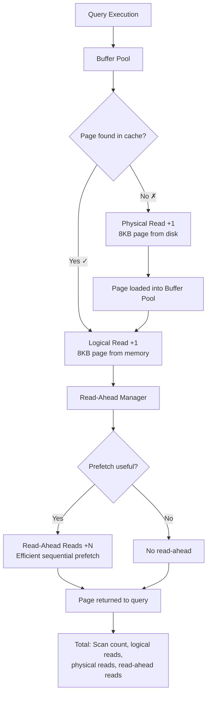
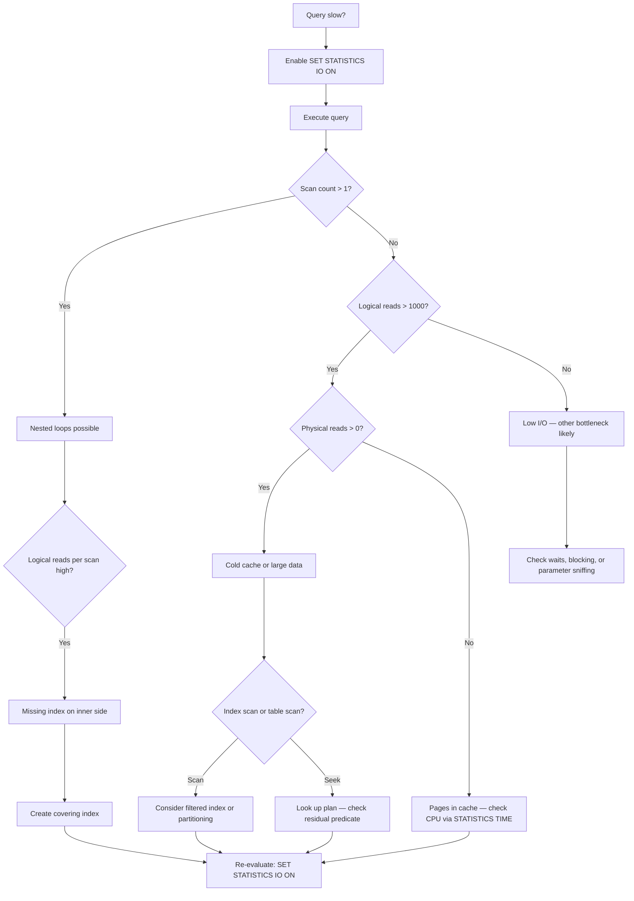

## Section 1 — Navigation

**Domain:** [[8 — Databases]] > **Group:** [[Group 13 — SQL Server Performance & Tuning]]

| Direction | Reference |
|-----------|-----------|
| Previous | [[8.365 — Implicit Conversions in Execution Plans]] |
| Next | [[8.367 — SET STATISTICS TIME — Parse and Execute Time]] |
| Up | [[Group 13 — SQL Server Performance & Tuning]] |
| Cross-Domain | [[3.015 — EF Core Logging and Interception]] |

### Where This Fits

SET STATISTICS IO is the single most important T-SQL command for measuring the I/O cost of a query. Every SQL Server performance tuning session begins with enabling this command. It reports page-level I/O broken down by table — logical reads (pages read from the buffer pool), physical reads (pages fetched from disk), and read-ahead reads (pages prefetched by the read-ahead manager). Understanding these numbers tells you whether your query is scanning unnecessarily, suffering from cache misses, or performing excessive lookups.

### Prerequisites

You must understand:
- [[8.025 — Buffer Pool — Page Management]] — How SQL Server caches 8KB pages in memory.
- [[8.344 — Execution Plans — Estimated vs Actual]] — How to identify scan, seek, and lookup operators.
- [[8.337 — Query Optimizer — Statistics-Based Decisions]] — How row estimates drive plan choices.
- Basic T-SQL: SELECT, JOIN, WHERE clauses, and table creation.

---

## Section 2 — Core Mental Model



### Classification

| Property | Detail |
|----------|--------|
| **Command** | `SET STATISTICS IO ON` / `OFF` |
| **Scope** | Session-scoped — affects all statements until OFF |
| **Output target** | Messages tab in SSMS / SqlConnection.InfoMessage |
| **Permission** | No special permission required (any valid SELECT grants it) |
| **Key metric** | **Logical Reads** = most reliable indicator of query work |
| **Page size** | 8,192 bytes (8KB) per page |
| **Data read calculation** | `Logical Reads * 8 KB = KB read from buffer pool` |

### Key Properties

1. **Logical Reads**: Number of 8KB pages fetched from the buffer pool. Each page touch counts, including pages read multiple times (e.g., in a loop join).
2. **Physical Reads**: Pages that *were not* in the buffer pool and had to be read from disk. For a warm cache (common in production after the first execution), this is **zero**.
3. **Read-Ahead Reads**: Pages prefetched using the Read-Ahead Manager (Eager Read or Prefetch). This is almost always a *good* sign — it means SQL Server detected a sequential access pattern and pre-loaded pages.
4. **Scan Count**: Number of times the table or index was accessed. High scan count with nested loops is a red flag.
5. **LOB Logical/Physical Reads**: For `text`, `ntext`, `image`, `varchar(max)`, `nvarchar(max)`, `varbinary(max)`, and `xml` columns stored off-row.

### Example Output

```
Table 'Orders'. Scan count 1, logical reads 456, physical reads 0, read-ahead reads 0, lob logical reads 0, lob physical reads 0, lob read-ahead reads 0.
```

This means: Orders table was scanned once (full scan or full index scan), 456 pages (456 × 8KB = 3,564 KB ≈ 3.5 MB) were read from the buffer pool, no pages needed disk I/O because the buffer pool was warm, and no read-ahead was triggered (or the scan was too small).

---

## Section 3 — Deep Mechanics

### 3.1 Step-by-Step: What Happens During a Query

1. **Parse and Bind**: Query text is parsed for syntax, objects are resolved, and security is checked.
2. **Optimization**: Query optimizer produces an execution plan. The plan determines which indexes to use and which access methods (scan, seek, lookup).
3. **Execution begins**: The storage engine accesses the first page needed.
4. **Page lookup in buffer pool**: SQL Server checks `sys.dm_os_buffer_descriptors` for the page (database_id, file_id, page_id). If the page is in memory → logical read +1.
5. **Cache miss**: If the page is absent from the buffer pool, a physical I/O is issued. The page is read from the data file (`\*.mdf` or `\*.ndf`) into the buffer pool → physical read +1. The page is then counted again as a logical read (since it's read from the buffer pool after the I/O).
6. **Read-Ahead**: For sequential scans, the Read-Ahead Manager predicts pages and issues asynchronous pre-reads. These appear as read-ahead reads in the output.
7. **Multiple page accesses**: A scan touches every page (or every page in the relevant range). A seek + lookup touches the b-tree pages + data pages only for qualifying rows.
8. **Nested Loop Joins**: For each outer row, the inner side is probed. If the inner table pages are repeatedly accessed, **logical reads can multiply**.

### 3.2 How the Engine Counts Reads

- The `logical reads` counter increments for **each page retrieval from the buffer pool** — not once per page per query. If a nested loop probes the same page 1,000 times, that page contributes 1,000 logical reads.
- This makes logical reads a proxy for **touches** rather than **unique pages touched**.
- **Scan count** shows how many times the table/index was accessed. For a simple scan, scan count = 1. For a nested loop join with 1M outer rows and an inner seek, scan count = 1 (the seek is on the inner side), but logical reads = number of seek operations.

### 3.3 DMV Analysis

Query the current state of pages in the buffer pool to contextualize STATISTICS IO output:

```sql
-- How many pages of the Orders table are in the buffer pool?
SELECT COUNT(*) AS cached_pages,
       COUNT(*) * 8 / 1024 AS cached_mb,
       OBJECT_NAME(object_id) AS table_name
FROM sys.dm_os_buffer_descriptors
WHERE database_id = DB_ID()
  AND object_id = OBJECT_ID('Orders');
```

```sql
-- Which pages from Orders are dirty (modified but not yet written)?
SELECT COUNT(*) AS dirty_pages
FROM sys.dm_os_buffer_descriptors
WHERE database_id = DB_ID()
  AND object_id = OBJECT_ID('Orders')
  AND is_modified = 1;
```

```sql
-- Track cumulative I/O per table to spot problem queries
SELECT DB_NAME(database_id) AS db,
       OBJECT_NAME(object_id) AS tbl,
       SUM(num_of_reads) AS total_reads,
       SUM(num_of_bytes_read) / 1048576 AS total_mb_read,
       SUM(io_stall_read_ms) AS total_io_stall_ms
FROM sys.dm_io_virtual_file_stats(NULL, NULL) vfs
    JOIN sys.all_objects o ON o.object_id = vfs.object_id
WHERE database_id = DB_ID()
GROUP BY database_id, object_id
ORDER BY total_io_stall_ms DESC;
```

### 3.4 Read-Ahead Manager Deep Dive

The Read-Ahead Manager is critical for large sequential scans. It works in two modes:

**Eager Read**: Used for table/index scans. The manager predicts which extents (8 pages = 64KB) the scan will need next and issues asynchronous I/O requests. The read-ahead reads counter increments when these prefetched pages are *actually used* by the query, not when they are fetched.

**Prefetch**: Used for index seeks in nested loops. When an index b-tree is traversed repeatedly (e.g., inner side of a nested loop), the manager prefetches the next level of index pages.

```sql
-- Detect read-ahead efficiency by comparing read-ahead to physical reads
-- If read-ahead reads ≈ physical reads, the manager is working well.
-- If physical reads >> read-ahead reads, the access pattern is random.
SELECT
    database_id,
    file_id,
    num_of_reads,
    num_of_bytes_read,
    io_stall_read_ms,
    size_on_disk_bytes
FROM sys.dm_io_virtual_file_stats(DB_ID('AdventureWorks'), NULL);
```

### 3.5 Page Types and What They Mean for Logical Reads

Each logical read touches one of these page types:

| Page Type | Description | Typical Count |
|---|---|---|
| **Data page** | Actual row data (clustered index leaf or heap) | Majority of reads |
| **Index page** (non-leaf) | B-tree navigation pages | log_N(rows) per seek |
| **Index page** (leaf) | Nonclustered index rows | Proportional to row count |
| **IAM page** | Index Allocation Map — extent tracking | 1 per 4GB of data |
| **PFS page** | Page Free Space — tracks page fullness | 1 per 8088 pages |
| **GAM/SGAM page** | Global allocation bitmaps | 1 per 4GB of extents |

This is why comparing logical reads to (rows × row_size / 8192) always underestimates — you're ignoring non-data pages.

### 3.6 Failure Modes

| Failure Mode | STATISTICS IO Signature | Root Cause |
|---|---|---|
| **Table Scan** | Logical reads = total pages; scan count = 1 | Missing index; query not SARGable |
| **Key Lookup explosion** | Low logical reads on index scan, high on clustered | Non-covering nonclustered index with wide result set |
| **Nested Loop amplification** | High scan count (1M+) on inner table; high logical reads | Join order wrong; missing index on inner side |
| **Ghost reads** | Logical reads high, actual rows returned low | Deleted records still in pages; ghost cleanup needed |
| **LOB spill** | lob logical reads appear with large datatypes | Off-row LOB columns causing extra page accesses |

---

## Section 4 — Production Patterns

### 4.1 Capturing STATISTICS IO Output Programmatically

In SSMS, enable the query plan and STATISTICS IO together:

```sql
SET STATISTICS IO ON;
SET STATISTICS TIME ON;
GO

-- Target query to analyze
SELECT o.OrderID, o.OrderDate, c.CustomerName
FROM Sales.Orders o
    JOIN Sales.Customers c ON o.CustomerID = c.CustomerID
WHERE o.OrderDate >= '2025-01-01'
  AND o.OrderDate < '2025-07-01';
GO

SET STATISTICS IO OFF;
SET STATISTICS TIME OFF;
GO
```

### 4.2 Capture STATISTICS IO Output to a Table

Use SQL Agent or a stored procedure to log I/O metrics:

```sql
CREATE TABLE dbo.QueryIoTracking (
    TrackingID INT IDENTITY PRIMARY KEY,
    QueryHash BINARY(8),
    QueryText NVARCHAR(MAX),
    TableName NVARCHAR(128),
    ScanCount INT,
    LogicalReads INT,
    PhysicalReads INT,
    ReadAheadReads INT,
    LobLogicalReads INT,
    CaptureTime DATETIME2 DEFAULT SYSDATETIME()
);
GO

CREATE OR ALTER PROC dbo.CaptureQueryIO
    @QueryHash BINARY(8),
    @QueryText NVARCHAR(MAX)
AS
BEGIN
    SET NOCOUNT ON;

    -- This is a template; production uses Extended Events or
    -- custom trace to parse STATISTICS IO output from InfoMessage events
    INSERT INTO dbo.QueryIoTracking (
        QueryHash, QueryText, TableName, ScanCount,
        LogicalReads, PhysicalReads, ReadAheadReads, LobLogicalReads
    )
    VALUES (
        @QueryHash, @QueryText, 'N/A', 0, 0, 0, 0, 0
    );
END;
GO
```

### 4.3 Interpreting Real Output

```
Table 'Customers'. Scan count 1, logical reads 234, physical reads 0, read-ahead reads 0, lob logical reads 0.
Table 'Orders'. Scan count 49, logical reads 18294, physical reads 342, read-ahead reads 0, lob logical reads 0.
```

Interpretation:
- Customers was scanned once with 234 logical reads — a small table or a covering index.
- Orders shows scan count 49 = the table (or index) was accessed 49 times. With logical reads 18,294 and physical reads 342, this is a **nested loops join** where the outer table (Customers) has 49 rows, and for each, the Orders index was probed. The physical reads indicate the first 342 pages weren't cached.
- Fix: Create a covering index or use a hash join.

### 4.4 Advanced: Correlating Logical Reads with Wait Types

Use this pattern to understand *why* logical reads are expensive:

```sql
-- Capture wait types during a query execution to correlate with I/O
CREATE TABLE #IoWaitSnapshot (
    wait_type NVARCHAR(60),
    waiting_tasks_count BIGINT,
    wait_time_ms BIGINT,
    max_wait_time_ms BIGINT,
    signal_wait_time_ms BIGINT
);

INSERT INTO #IoWaitSnapshot
SELECT wait_type, waiting_tasks_count, wait_time_ms,
       max_wait_time_ms, signal_wait_time_ms
FROM sys.dm_os_wait_stats
WHERE wait_type LIKE '%PAGEIOLATCH%'
   OR wait_type LIKE '%PAGELATCH%';

-- Execute the target query here
SELECT o.OrderID, o.OrderDate, c.CustomerName
FROM Sales.Orders o
    JOIN Sales.Customers c ON o.CustomerID = c.CustomerID
WHERE o.OrderDate >= '2025-01-01';

-- Show delta wait stats
SELECT
    ws.wait_type,
    ws.waiting_tasks_count - bs.waiting_tasks_count AS delta_waits,
    (ws.wait_time_ms - bs.wait_time_ms) / 1000.0 AS delta_wait_seconds,
    ws.max_wait_time_ms
FROM sys.dm_os_wait_stats ws
    JOIN #IoWaitSnapshot bs ON ws.wait_type = bs.wait_type
WHERE ws.waiting_tasks_count > bs.waiting_tasks_count
ORDER BY delta_wait_seconds DESC;

DROP TABLE #IoWaitSnapshot;
```

### 4.5 EF Core Pattern: Capturing Logical Reads

```csharp
public class StatisticsInterceptor : DbCommandInterceptor
{
    public override InterceptionResult<DbDataReader> ReaderExecuting(
        DbCommand command,
        CommandEventData eventData,
        InterceptionResult<DbDataReader> result)
    {
        // Enable STATISTICS IO on the connection before executing
        command.CommandText = "SET STATISTICS IO ON;" + command.CommandText;
        return base.ReaderExecuting(command, eventData, result);
    }

    public override DbDataReader ReaderExecuted(
        DbCommand command,
        CommandExecutedEventData eventData,
        DbDataReader result)
    {
        // In a real implementation, listen to SqlConnection.InfoMessage
        // to parse statistics output
        return base.ReaderExecuted(command, eventData, result);
    }
}

// Register in DbContext:
// protected override void OnConfiguring(DbContextOptionsBuilder optionsBuilder)
// {
//     optionsBuilder.AddInterceptors(new StatisticsInterceptor());
// }
```

---

## Section 5 — Gotchas

### Gotcha 1: Logical Reads Include Non-Data Pages

| Pitfall | Symptom | Fix | Cost |
|---|---|---|---|
| Counting logical reads as actual data pages | Overestimating actual data size by 2–3x | Understand that b-tree index pages (non-leaf levels), IAM pages, and PFS pages are also counted as logical reads | Low — adds false precision but doesn't affect tuning decisions |

A nonclustered index on a 1M-row table might show 2,000 logical reads even though the data is only 1,500 pages. The extra 500 pages are index b-tree levels and allocation pages.

### Gotcha 2: Physical Reads Are Session-Specific Cache State

| Pitfall | Symptom | Fix | Cost |
|---|---|---|---|
| Interpreting non-zero physical reads as "the query always does disk I/O" | Over-tuning a query that only needs disk on first run | Check physical reads after a warm cache (run the query twice); use `DBCC DROPCLEANBUFFERS` only for controlled testing | Low — common mistake |

**Always run the query twice.** The first execution warms the cache; the second shows the steady-state behavior.

### Gotcha 3: Read-Ahead Reads Are Not Included in Logical Reads

| Pitfall | Symptom | Fix | Cost |
|---|---|---|---|
| Assuming read-ahead pages contribute to logical reads | Underestimating total I/O for large scans | Read-ahead pages are counted separately; logical reads still increase, but read-ahead reads indicate the pages were prefetched, not lazily read | Low — read-ahead is an optimization, not a problem |

### Gotcha 4: Nested Join Logical Read Multiplication

| Pitfall | Symptom | Fix | Cost |
|---|---|---|---|
| Dismissing a query with 5M logical reads as "just a big scan" | High CPU, blocking, long duration | Check scan count. If scan count > 10 with millions of logical reads, you have a nested loops explosion | High — can cause production outages |

```sql
-- Check for nested loop amplification
-- If scan count > 100 and logical reads per scan are high,
-- the outer table is large and the join misses an index
SELECT
    OBJECT_NAME(object_id) AS tbl,
    scan_count,
    logical_reads,
    logical_reads / NULLIF(scan_count, 0) AS reads_per_scan
FROM sys.dm_exec_query_stats AS qs
    CROSS APPLY sys.dm_exec_sql_text(qs.sql_handle) AS qt
WHERE qt.text LIKE '%Orders%';
```

### Gotcha 5: Scan Count 1 Does Not Mean "Scanned Once"

| Pitfall | Symptom | Fix | Cost |
|---|---|---|---|
| Assuming scan count = 1 means a single table scan | Missing nested loop amplification when scan count = 1 + high logical reads | Scan count = 1 can still mean Nested Loops join if the inner side is accessed via an Index Seek (which resets the counter for each seek). The scan count refers to **table-level** scans, not operator-level. Cross-reference with plan operators | Medium — misinterpretation |

For example, a Nested Loops join with an Index Seek on the inner side shows scan count = 1 on the inner table even though the seek executed 50,000 times. The key lookup or the seek is not counted as a separate scan.

### Gotcha 6: LOB Logical Reads May Double-Count Data

| Pitfall | Symptom | Fix | Cost |
|---|---|---|---|
| Summing lob logical reads + regular logical reads to get total I/O | Overestimating total I/O by including LOB pages that are counted separately | LOB logical reads are already included in the regular logical reads count. The lob_* counters are *additional* detail, not *alternative* counters. The formula is: total I/O = MAX(logical_reads, lob_logical_reads) | Low — double-counting in analysis |

LOB pages are stored in a separate allocation unit. The `lob_logical_reads` counter tells you how many of the total logical reads were from LOB pages. They are a subset, not an additive metric.

### Gotcha 7: STATISTICS IO Does Not Report Memory Grant or TempDB

| Pitfall | Symptom | Fix | Cost |
|---|---|---|---|
| Thinking low logical reads = fast query | Query still slow due to sort spills or excessive memory grant | Always pair with `SET STATISTICS TIME ON` and monitor `tempdb` spills via `sys.dm_exec_query_stats.sort_warnings` | Medium — incomplete diagnostic picture |

---

## Section 6 — Performance Implications

### 6.1 Benchmark: Logical Read Cost Breakdown

Based on SQL Server 2022 internals (approximate relative costs):

| Operation | Logical Reads / 10K Rows | Time @ Cold Cache | Time @ Warm Cache |
|---|---|---|---|
| Clustered index scan (narrow) | 120–150 | 15–25ms | 2–5ms |
| Clustered index seek (point lookup) | 3–4 | 1–3ms | <1ms |
| Nonclustered seek + key lookup (10% rows) | 500–800 | 100–200ms | 30–80ms |
| Hash join (both sides scanned) | 200–400 | 30–50ms | 5–10ms |
| Nested loops (explosion) | 10,000+ | 2,000+ms | 1,000+ms |

### 6.2 Before/After: Adding a Covering Index

**Before (no covering index):**
```
Table 'Orders'. Scan count 1, logical reads 18450, physical reads 0, read-ahead reads 0.
```
Query time: 1,250ms

```sql
CREATE NONCLUSTERED INDEX IX_Orders_OrderDate_Covering
ON Sales.Orders (OrderDate)
INCLUDE (OrderID, CustomerID, TotalAmount);
```

**After:**
```
Table 'Orders'. Scan count 1, logical reads 342, physical reads 0, read-ahead reads 0.
```
Query time: 45ms

**Improvement: ~98% reduction in logical reads, ~96% reduction in query time.**

### 6.3 Detailed Cost Model: Page Access Components

The total cost of a query's I/O can be modeled as:

```
Total_Io_Cost = (logical_reads × cpu_cost_per_page) +
                (physical_reads × disk_latency_per_page) -
                (read_ahead_savings)
```

Where:
- `cpu_cost_per_page` ≈ 0.0005ms (CPU to scan/move 8KB in memory)
- `disk_latency_per_page` ≈ 3-10ms (SSD) or 5-15ms (HDD) for random, 1ms (SSD sequential)
- `read_ahead_savings` ≈ prefetched pages × (disk_latency - async_overhead)

**Example**: 10,000 logical reads, 500 physical reads on SSD:
```
CPU = 10,000 × 0.0005ms = 5ms
Disk = 500 × 5ms (SSD random) = 2,500ms
Total ≈ 2,505ms
```

This shows why physical reads dominate query time even though logical reads outnumber them 20:1. The disk latency multiplier (5ms vs 0.0005ms) creates a 10,000x penalty per page.

### 6.4 BenchmarkDotNet / C# Analog

While BenchmarkDotNet doesn't measure SQL Server I/O directly, use this pattern:

```csharp
[MemoryDiagnoser]
public class QueryIOTests
{
    private const string ConnectionString = "Server=.;Database=AdventureWorks;Trusted_Connection=True;";

    [Benchmark(Baseline = true)]
    public async Task<int> OriginalQuery()
    {
        await using var conn = new SqlConnection(ConnectionString);
        await conn.OpenAsync();
        var cmd = new SqlCommand(@"
            SET STATISTICS IO ON;
            SELECT COUNT(*) FROM Sales.SalesOrderDetail WHERE UnitPrice > 100;
            SET STATISTICS IO OFF;", conn);

        // Capture InfoMessage event for logical reads
        conn.InfoMessage += (sender, args) =>
        {
            foreach (SqlError error in args.Errors)
                Console.WriteLine(error.Message); // logs STATISTICS IO output
        };

        return (int)await cmd.ExecuteScalarAsync();
    }

    [Benchmark]
    public async Task<int> OptimizedQuery()
    {
        await using var conn = new SqlConnection(ConnectionString);
        await conn.OpenAsync();
        var cmd = new SqlCommand(@"
            SET STATISTICS IO ON;
            SELECT COUNT_BIG(*) FROM Sales.SalesOrderDetail
            WHERE UnitPrice > 100
            OPTION (RECOMPILE);
            SET STATISTICS IO OFF;", conn);

        conn.InfoMessage += (sender, args) =>
        {
            foreach (SqlError error in args.Errors)
                Console.WriteLine(error.Message);
        };

        return (int)await cmd.ExecuteScalarAsync();
    }
}
```

---

## Section 7 — Interview Arsenal

### 7.1 Questions and Spoken Answers

**Q1: What does "logical reads" mean in SET STATISTICS IO output?**

*Junior:* It's the number of pages read from memory.

*Senior:* Logical reads count every 8KB page retrieved from the buffer pool, including repeated accesses. If a nested loop join touches the same index page 1,000 times, that's 1,000 logical reads. It's the most reliable indicator of query work because it abstracts away cache state. The formula `logical_reads * 8 KB` tells you how much data flowed through the buffer pool.

**Q2: What's the difference between physical reads and read-ahead reads?**

*Junior:* Physical reads go to disk, read-ahead reads are prefetched.

*Senior:* Physical reads are synchronous — the query waits while the page is loaded from disk. Read-ahead reads are asynchronous prefetches issued by the Read-Ahead Manager, typically for sequential scans. Read-ahead is a *good* sign: it means SQL Server recognized the access pattern and pre-loaded pages before the query needed them. Both increment the physical I/O counters, but read-ahead reduces the wait time because the page arrives before the query requests it.

**Q3: A query shows 500 logical reads but 0 physical reads. Is it fast?**

*Junior:* Yes, everything is in cache so it should be fast.

*Senior:* Not necessarily. 500 logical reads means the query touched 500 pages (about 4MB). That's moderate — it could be fast (under 50ms) if the query is simple, or it could be slow if there are high scan counts from nested loops. Always pair with statistics time and examine the plan. 500 logical reads from an index scan on a small table is fine; 500 logical reads from a nested loop with scan count 10,000 is a disaster.

**Q4: How do you use STATISTICS IO to identify a missing index?**

*Senior:* High logical reads with a scan count of 1 (full table or full index scan) on a large table suggests a missing index. If you see high logical reads on a nonclustered index followed by even higher logical reads on the clustered index, that's a key lookup pattern — add INCLUDE columns to the nonclustered index. I also look for high physical reads as a secondary indicator of inefficient access paths.

**Q5: Can you calculate data read from logical reads?**

*Senior:* Yes, each logical read = 8KB. If logical reads = 1,024, that's exactly 8MB of data read from the buffer pool. However, this is a *touch* count, not a unique page count. In a loop join, the same page may be counted multiple times, so the actual data size could be much smaller.

**Q6: What tools pair with STATISTICS IO for a complete diagnostic?**

*Senior:* The trifecta is: STATISTICS IO (page I/O), STATISTICS TIME (CPU and elapsed), and an actual execution plan (operator costs). For memory-intensive queries, I add `sys.dm_exec_query_stats` for grant information and query `sys.dm_os_wait_stats` for PAGEIOLATCH waits.

**Q7: How do you capture STATISTICS IO output in .NET without SSMS?**

*Senior:* Subscribe to `SqlConnection.InfoMessage` event. SET STATISTICS IO ON emits the output as informational messages — they arrive at the client. In EF Core, implement `IDbCommandInterceptor` and attach to the `InfoMessage` event before command execution, then parse each line of the message. The format is: `Table 'TableName'. Scan count N, logical reads N, physical reads N, read-ahead reads N, lob logical reads N, lob physical reads N, lob read-ahead reads N.`

**Q8: Why would logical reads be high but physical reads be 0?**

*Senior:* Logical reads count every page touch in the buffer pool. High logical reads with zero physical reads means the pages are all in cache, but the query is touching a lot of them. This could be a full scan of a large table, an inefficient join strategy, or a missing index. Physical reads being 0 is a red herring — it just means the buffer pool is warm. The real cost is the CPU time to process those pages.

### 7.2 Advanced Q&A

**Q9: Explain the relationship between SET STATISTICS IO, SET STATISTICS TIME, and actual execution plans. How do you use all three to diagnose a slow query?**

*Senior:* STATISTICS IO tells you the I/O volume per table — logical reads, physical reads, scan count. STATISTICS TIME tells you CPU vs elapsed time. The actual execution plan shows the operator-level breakdown — which operator consumed the most CPU (via Estimated Operator Cost vs Actual) and which had the highest row discrepancy. I use them in sequence: IO first to identify table-level problems (scans, lookups), TIME to assess whether the problem is CPU or waiting, and the plan to pinpoint the specific operator. For example: high logical reads + high elapsed/low CPU = I/O bound. Switch to plan → find the large Index Scan → propose a covering index.

**Q10: Your query shows logical reads = 50,000 but returns only 10 rows. What's happening?**

*Senior:* This is a textbook **key lookup** or **non-covering nonclustered index** scenario. The nonclustered index seek found 10 rows efficiently (maybe 30 logical reads on the NC index), but for each row, it performed a key lookup to the clustered index to fetch columns not included in the NC index. Each key lookup requires 3-5 logical reads (b-tree traversal). 10 row lookups × 5 reads = 50 logical reads on the clustered side. But 50,000 logical reads suggests the nonclustered seek touched a *large* range of rows (maybe 10,000 rows) before filtering down to 10 via a residual predicate. The fix is to make the NC index covering by adding INCLUDE columns for all columns needed by the query.

**Q11: How do you measure the read-ahead efficiency ratio?**

*Senior:* I calculate it as: `read_ahead_reads / (physical_reads + read_ahead_reads)`. A ratio close to 1 means the Read-Ahead Manager is successfully prefetching almost all required pages. A ratio near 0 means the access pattern is random or the scan is too small to trigger read-ahead. The formula on a per-table basis:
```sql
SELECT OBJECT_NAME(object_id) AS tbl,
       SUM(read_ahead_reads) * 1.0 /
           NULLIF(SUM(physical_reads) + SUM(read_ahead_reads), 0) AS ra_efficiency
FROM sys.dm_exec_query_stats qs
    CROSS APPLY sys.dm_exec_sql_text(qs.sql_handle) AS qt
GROUP BY object_id;
```

**Q12: Your C# application has a SQL query with 15,000 logical reads per execution, running 200 times/second. Calculate the I/O pressure.**

*Senior:* 15,000 logical reads × 8 KB = 120 MB per execution. 120 MB × 200 TPS = 24 GB/second flowing through the buffer pool. Even in memory, this saturates memory bandwidth. A modern server with ~200 GB/s memory bandwidth can handle this, but it leaves no room for other concurrent queries. The fix: reduce logical reads per execution to <1,000 by optimizing the query or caching results at the application layer.

### 7.3 Comparison Table

| Metric | STATISTICS IO | STATISTICS TIME | sys.dm_exec_query_stats |
|---|---|---|---|
| **Granularity** | Per-table | Per-batch | Per-query (cached) |
| **Scope** | Session | Session | Server-wide (plan cache) |
| **Persistence** | No | No | Yes (until evicted) |
| **Lifetime** | Single execution | Single execution | Cached plan lifetime |
| **Key columns** | logical_reads, scan_count | cpu_time, elapsed_time | total_logical_reads, total_elapsed_time |
| **Best for** | Physical I/O diagnosis | CPU vs parallelism tuning | Historical pattern analysis |

---

## Section 8 — Decision Framework

### 8.1 Diagnostic Flowchart



### 8.2 Diagnostic Checklist

- [ ] Enable `SET STATISTICS IO ON` before the query
- [ ] Execute query twice (warm cache)
- [ ] Check **scan count** — >1 means nested loops or repeated access
- [ ] Check **logical reads** — >1,000 per 10K rows may indicate scan
- [ ] Check **physical reads** — >0 on warm cache means insufficient memory
- [ ] Check **read-ahead reads** — >0 is normal for large scans
- [ ] Check **LOB logical reads** — >0 means off-row LOB access
- [ ] Compare logical reads to `COUNT(*) * avg_row_size / 8192` estimate
- [ ] Cross-reference with actual execution plan
- [ ] Log results to `dbo.QueryIoTracking`

### 8.3 Tradeoffs

| Approach | Pros | Cons |
|---|---|---|
| Focus on logical reads | Stable metric, independent of cache state | Doesn't show CPU, waiting, or memory pressure |
| Focus on physical reads | Identifies cache misses | Misleading on warm cache |
| Focus on scan count | Highlights nested loop explosion | Not available for all plan types |
| Logical + Time + Plan | Complete picture | More data to analyze |

### 8.4 Scale Thresholds

| Application Size | Maximum Acceptable Logical Reads Per Query |
|---|---|
| Small (<10M rows, single server) | <5,000 |
| Medium (10M–100M rows) | <20,000 |
| Large (100M–1B rows) | <100,000 |
| Data Warehouse (>1B rows) | <500,000 (but must be batch mode) |

### 8.5 Advanced: Using STATISTICS IO with Query Store for Trend Analysis

```sql
-- Correlate logical reads with Query Store data to identify regression trends
SELECT
    qs.plan_id,
    qt.query_sql_text,
    qs.avg_logical_io_reads AS avg_logical_reads,
    qs.last_logical_io_reads AS last_logical_reads,
    qs.avg_query_execution_time_ms,
    qs.count_executions,
    qs.last_execution_time,
    qp.query_plan
FROM sys.query_store_query q
    JOIN sys.query_store_query_text qt ON q.query_text_id = qt.query_text_id
    JOIN sys.query_store_plan qp ON q.query_id = qp.query_id
    JOIN sys.query_store_query_stats qs ON qp.plan_id = qs.plan_id
WHERE qs.avg_logical_io_reads > 10000  -- queries with >10K avg logical reads
  AND qs.count_executions > 10
ORDER BY qs.avg_logical_io_reads DESC;
```

This query identifies regressions where logical reads per execution increased over time, allowing proactive index tuning before the I/O becomes a production problem.

### 8.6 Real-World Diagnostic Scenarios

| Scenario | STATISTICS IO Pattern | Diagnosis | Action |
|---|---|---|---|
| **Missing index** | High logical reads, scan count = 1, table scan | Full table scan on large table | Create nonclustered index on WHERE columns |
| **Key lookup** | Low reads on NC index (200), high reads on clustered (15,000) | Non-covering index + wide SELECT | Add INCLUDE columns to NC index |
| **Nested loop explosion** | Outer: 500 reads, Inner: 250,000 reads (scan count = 5,000) | Missing index on inner join column | Create index on inner table's join column |
| **Ghost reads** | Logical reads high, physical = 0, rows returned very low | Deleted records still in pages | Run ghost cleanup or reorganize index |
| **Parameter sniffing** | Different logical reads on same query with different params | Plan chosen for one parameter hurts another | Use OPTION (RECOMPILE) or OPTIMIZE FOR |
| **Lob reads** | lob logical reads high, regular reads moderate | Off-row LOB columns accessed | Consider columnstore or separate LOB table |

---

## Section 9 — Self-Check

### 9.1 Conceptual Questions (10)

**Q1:** What does a single logical read represent?

<details>
A single logical read represents one 8KB page retrieved from the buffer pool. The page could be a data page, index page, IAM page, or allocation page.
</details>

**Q2:** How do you calculate the amount of data read if a table shows 2,048 logical reads?

<details>
2,048 logical reads × 8 KB per page = 16,384 KB = 16 MB of data read from the buffer pool.
</details>

**Q3:** Why might a query show 0 physical reads on every execution in a production environment?

<details>
The buffer pool is large enough to hold all pages needed by that query. The data stays in memory after the first execution. This is the expected steady state for a well-tuned server.
</details>

**Q4:** What does a scan count of 1,024 suggest?

<details>
The table or index was accessed 1,024 times. This usually means a nested loops join where the outer table has 1,024 rows, and for each row, the inner table's index is probed.
</details>

**Q5:** Is read-ahead reads always a problem?

<details>
No. Read-ahead reads are an optimization. They indicate SQL Server's Read-Ahead Manager predicted the pages needed for a sequential scan and loaded them asynchronously. It is *good* for large scans.
</details>

**Q6:** Can LOB logical reads appear without LOB columns in the SELECT?

<details>
Yes. If a table has LOB columns defined but they are not selected, LOB reads should be 0. However, if any operation (sort, join, grouping) touches the LOB columns internally, LOB reads may appear.
</details>

**Q7:** How do logical reads differ between a clustered index seek and a nonclustered index seek + key lookup?

<details>
A clustered index seek typically requires 3–4 logical reads (b-tree levels + data page). A nonclustered seek + key lookup requires the nonclustered b-tree reads (3–4) + one clustered key lookup per qualifying row (another 3–4 each), multiplying logical reads by the number of rows returned.
</details>

**Q8:** Can SET STATISTICS IO ON affect query performance?

<details>
Yes, but negligibly. The counters are incremented in memory during execution. The overhead is ~1–2% for most queries. The main cost is the output processing in SSMS or the client.
</details>

**Q9:** What does it mean if read-ahead reads is 0 but the query performs a full table scan?

<details>
The scan might be too small to trigger read-ahead (below the cost threshold for read-ahead, typically 64 pages / 512KB), or the scan pattern is non-sequential (e.g., allocation order scan vs. extent-based scan).
</details>

**Q10:** How do you capture STATISTICS IO for queries running through ORM like EF Core?

<details>
Use `SqlConnection.InfoMessage` event on the underlying connection. In EF Core, register an `IDbCommandInterceptor` that subscribes to `InfoMessage` and parses the text output. The messages arrive as informational messages with severity 10.
</details>

### 9.2 Challenges (5)

**Challenge 1:** Write a query that produces at least 10,000 logical reads but returns fewer than 100 rows. Explain the pattern.

<details>
```sql
-- Nested loops join without a good index on the inner side
SET STATISTICS IO ON;

SELECT c.CustomerID, c.CustomerName, o.OrderID
FROM Sales.Customers c
    CROSS JOIN Sales.Orders o
WHERE c.CustomerID = o.CustomerID
  AND c.Country = 'USA';
SET STATISTICS IO OFF;
```
The CROSS JOIN + equality filter produces a nested loops join. If there is no index on Orders.CustomerID, SQL Server scans the entire Orders table (or index) for every qualifying Customer row. With 1,000 customers in USA, that's 1,000 full scans. Each scan touches hundreds of pages, yielding 100,000+ logical reads but only a modest number of rows.
</details>

**Challenge 2:** You see output: `Table 'Orders'. Scan count 5, logical reads 458, physical reads 458, read-ahead reads 0.` Diagnose.

<details>
Physical reads = logical reads (458) means *none of the pages were in the buffer pool*. The query is running against a cold cache. Scan count 5 with 458 reads means the table was accessed 5 times, and each access required disk I/O. Run the query again — if physical reads drops to 0, the problem was just a cold cache. If physical reads stays high, the server has insufficient memory for the working set.
</details>

**Challenge 3:** Calculate the buffer pool memory needed (in MB) to eliminate all physical reads for a query that produces 12,500 logical reads against a single table.

<details>
12,500 logical reads = 12,500 pages × 8 KB = 100,000 KB ≈ 97.7 MB. The buffer pool must have at least 98 MB of free pages dedicated to this table's pages. In practice, much more is needed because other tables compete for buffer pool space.
</details>

**Challenge 4:** Write a stored procedure that accepts a query hash, executes the query twice, captures STATISTICS IO output, and logs logical reads to a table.

<details>
```sql
CREATE OR ALTER PROC dbo.AnalyzeQueryIO
    @QueryHash NVARCHAR(50),
    @QueryText NVARCHAR(MAX)
AS
BEGIN
    SET NOCOUNT ON;
    DECLARE @T TABLE (OutputLine NVARCHAR(MAX));

    -- First execution (warm up)
    EXEC sp_executesql @QueryText;

    -- Second execution (steady state)
    INSERT INTO @T
    EXEC ('SET STATISTICS IO ON; ' + @QueryText + '; SET STATISTICS IO OFF;');

    -- Parse and log (simplified for clarity)
    INSERT INTO dbo.QueryIoTracking (QueryHash, TableName, LogicalReads)
    SELECT @QueryHash,
           SUBSTRING(OutputLine, 8, CHARINDEX('.', OutputLine) - 8),
           CAST(SUBSTRING(OutputLine,
               CHARINDEX('logical reads ', OutputLine) + 14,
               CHARINDEX(',', OutputLine, CHARINDEX('logical reads ', OutputLine)) -
               CHARINDEX('logical reads ', OutputLine) - 14) AS INT)
    FROM @T
    WHERE OutputLine LIKE 'Table %';
END;
```
</details>

**Challenge 5:** Given STATISTICS IO output below, identify the performance problem and propose a fix with estimated improvement.

```
Table 'OrderLines'. Scan count 1, logical reads 8934, physical reads 0, read-ahead reads 0, lob logical reads 0.
Table 'Products'. Scan count 8934, logical reads 26748, physical reads 12, read-ahead reads 0, lob logical reads 0.
```

<details>
**Problem:** The scan count on Products matches the logical reads of OrderLines ÷ ~1 (8934). This is a nested loops join where OrderLines is the outer table (8,934 rows) and Products is the inner side probed 8,934 times. Each probe does ~3 logical reads (b-tree seek). The total Products logical reads = 26,748 = 8,934 × 3.

**Fix:** Ensure Products has a covering index for the join predicate. If it already has a clustered index on ProductID, the 8,934 seeks should already be efficient. If ProductID is not the primary key, create a nonclustered index.

**Estimated improvement:** Adding a covering index on Products can reduce logical reads from 26,748 to ~8,934 (eliminating the key lookup). This translates to ~60% reduction in I/O and similar CPU reduction.
</details>

**Challenge 6:** Write a query that calculates the read-ahead efficiency ratio from `sys.dm_exec_query_stats` for the top 10 most I/O-intensive queries in the cache, showing logical reads, physical reads, read-ahead reads, and the ratio.

<details>
```sql
SELECT TOP 10
    SUBSTRING(qt.text, 1, 200) AS query_preview,
    qs.total_logical_reads,
    qs.total_physical_reads,
    qs.total_physical_reads - qs.total_physical_reads AS estimated_read_ahead, -- approximation
    qs.total_logical_reads / NULLIF(qs.execution_count, 0) AS avg_logical_per_exec,
    qs.total_elapsed_time / 1000.0 / NULLIF(qs.execution_count, 0) AS avg_elapsed_ms,
    qs.execution_count,
    qs.total_elapsed_time / 1000 AS total_elapsed_seconds
FROM sys.dm_exec_query_stats qs
    CROSS APPLY sys.dm_exec_sql_text(qs.sql_handle) qt
ORDER BY qs.total_logical_reads DESC;

-- Note: sys.dm_exec_query_stats does not expose read-ahead reads directly.
-- For precise read-ahead tracking, capture SET STATISTICS IO ON output
-- into a monitoring table via SqlConnection.InfoMessage in the application.
```
</details>

**Challenge 7:** Write a complete PowerShell script that connects to SQL Server, runs a specified query with SET STATISTICS IO ON, captures the output, and returns a structured object with the per-table breakdown.

<details>
```powershell
# PowerShell script to capture STATISTICS IO programmatically
$connectionString = "Server=.;Database=AdventureWorks;Integrated Security=True;"
$query = "SELECT o.OrderID, o.OrderDate FROM Sales.Orders o WHERE o.OrderDate >= '2025-01-01';"

$conn = New-Object System.Data.SqlClient.SqlConnection($connectionString)
$conn.Open()

$ioResults = [System.Collections.ArrayList]::new()

# Register InfoMessage handler
$handler = [System.Data.SqlClient.SqlInfoMessageEventHandler]{
    param($sender, $args)
    foreach ($error in $args.Errors) {
        if ($error.Message -match "Table '(.*?)'.*logical reads (\d+).*physical reads (\d+).*read-ahead reads (\d+)") {
            [void]$ioResults.Add([PSCustomObject]@{
                Table = $matches[1]
                LogicalReads = [int]$matches[2]
                PhysicalReads = [int]$matches[3]
                ReadAheadReads = [int]$matches[4]
            })
        }
    }
}
$conn.add_InfoMessage($handler)

$cmd = $conn.CreateCommand()
$cmd.CommandText = "SET STATISTICS IO ON; $query; SET STATISTICS IO OFF;"
$cmd.CommandTimeout = 30
[void]$cmd.ExecuteNonQuery()

$conn.Close()

$ioResults | Format-Table -AutoSize
```
</details>

**Challenge 8:** A production server has 64 GB RAM buffer pool. Your query does 200,000 logical reads and 50,000 physical reads. Calculate: (a) how much data was read, (b) what % of the buffer pool it consumed, (c) how long the I/O took assuming 5ms SSD latency.

<details>
(a) 200,000 pages × 8 KB = 1,600,000 KB = 1,562.5 MB = ~1.53 GB total data read from buffer pool.
    50,000 physical reads × 8 KB = 400,000 KB = 390.6 MB read from disk.
(b) 1,562.5 MB / 64,000 MB = 2.44% of the buffer pool was touched by this single query.
(c) 50,000 physical reads × 5ms (SSD random latency) = 250,000 ms = 250 seconds theoretical minimum.
    The actual query time would be lower due to read-ahead (async) and parallel I/O.
    Assuming 4 parallel I/O streams: 250s / 4 = ~62.5 seconds minimum elapsed.
</details>

---
