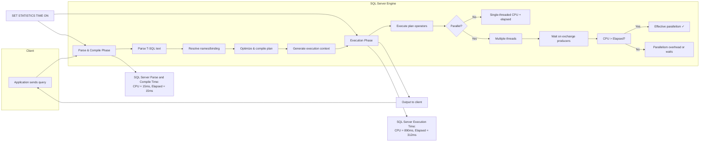
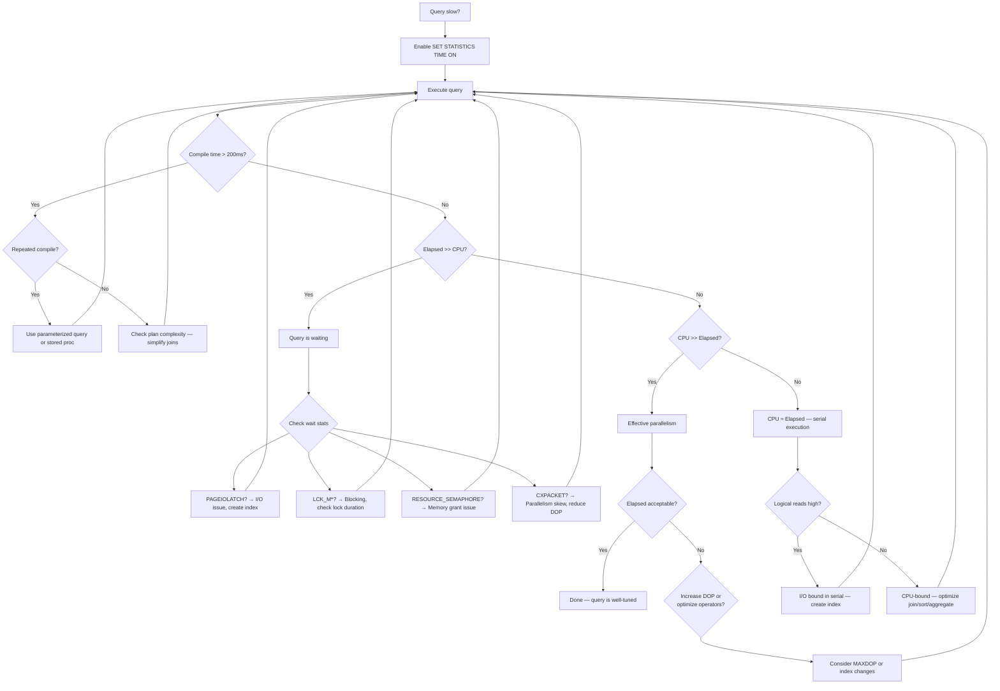

## Section 1 — Navigation

**Domain:** [[8 — Databases]] > **Group:** [[Group 13 — SQL Server Performance & Tuning]]

| Direction | Reference |
|-----------|-----------|
| Previous | [[8.366 — SET STATISTICS IO — Reading Logical Reads]] |
| Next | [[8.368 — sys.dm_exec_query_profiles — Live Query Statistics]] |
| Up | [[Group 13 — SQL Server Performance & Tuning]] |
| Cross-Domain | [[3.015 — EF Core Logging and Interception]] |

### Where This Fits

SET STATISTICS TIME reports the CPU and elapsed time for two distinct phases of query execution: (1) SQL Server Parse and Compile time, and (2) SQL Server Execution time. The output reveals how much CPU work the query required, how long it ran in wall-clock time, and — critically — whether parallelism is being effective. When CPU time exceeds elapsed time, the query is using parallelism. When elapsed time far exceeds CPU time, the query is waiting (blocking, I/O, or memory pressure).

### Prerequisites

You must understand:
- [[8.366 — SET STATISTICS IO — Reading Logical Reads]] — The companion I/O profiling command.
- [[8.362 — Parallelism — Skewed Distribution Issues]] — How parallelism skew affects time metrics.
- [[8.361 — Parallelism — MAXDOP and Cost Threshold]] — How MAXDOP changes CPU vs elapsed time.
- [[8.344 — Execution Plans — Estimated vs Actual]] — Reading execution plans to correlate with time.

---

## Section 2 — Core Mental Model



### Classification

| Property | Detail |
|----------|--------|
| **Command** | `SET STATISTICS TIME ON` / `OFF` |
| **Scope** | Session-scoped — affects all statements until OFF |
| **Output target** | Messages tab in SSMS / InfoMessage event |
| **Permission** | No special permission required |
| **Key metric** | **CPU time vs Elapsed time ratio** |
| **Precision** | Milliseconds |
| **Phase 1** | Parse and Compile (one-time per plan) |
| **Phase 2** | Execution (per statement execution) |

### Key Properties

1. **Parse and Compile Times**: CPU and elapsed time spent parsing, binding, optimizing, and compiling the execution plan. This happens once per plan lifetime (unless recompiled). High compile time indicates complex optimization (many joins, partitioned tables, multi-statement TVFs).
2. **Execution CPU Time**: Total CPU time consumed across all threads. In a parallel plan, this is the sum of CPU time across all threads.
3. **Execution Elapsed Time**: Wall-clock time from start to finish of execution. Includes waits (I/O, locks, memory grants, exchange buffers).
4. **CPU/Elapsed Ratio**:
   - **CPU ≈ Elapsed**: Serial execution, no waiting.
   - **CPU > Elapsed**: Parallel execution — work is distributed across multiple CPUs.
   - **CPU < Elapsed**: Waiting on resources (I/O, blocking, memory, exchange) — the query is not CPU-bound.

---

## Section 3 — Deep Mechanics

### 3.1 Phase 1: Parse and Compile

1. **Parse**: The T-SQL text is tokenized, syntax-checked, and converted into a parse tree. This is purely CPU-bound and typically takes <5ms for simple queries.
2. **Bind (Algebrizer)**: Names are resolved to object IDs, column types are validated, and implicit conversion decisions are made.
3. **Optimization**: The query optimizer heuristically searches for a low-cost plan. This phase dominates compile time for complex queries (15–30 joins, partitioned views).
4. **Compilation**: The selected plan tree is compiled into an executable format.
5. **Timing sample**: `SQL Server Parse and Compile Time: CPU = 65 ms, elapsed = 65 ms.`

### 3.2 Phase 2: Execution

1. The execution context is loaded and the plan starts running.
2. Each operator (scan, join, aggregate, sort) consumes CPU as it processes rows.
3. In a serial plan, only one thread runs — CPU time and elapsed time are nearly equal.
4. In a parallel plan, multiple threads process data simultaneously:
   - **Exchange operators** (Distribute Streams, Gather Streams, Repartition Streams) coordinate threads.
   - Each thread reports its CPU time; the `CPU time` in STATISTICS TIME is the *sum* across all threads.
   - Elapsed time is the real wall-clock time from first thread start to last thread finish.
5. **Timing sample**: `SQL Server Execution Times: CPU time = 2812 ms, elapsed time = 734 ms.`

### 3.3 Interpreting Sample Output

```
SQL Server Parse and Compile Time:
   CPU time = 8 ms, elapsed time = 8 ms.

SQL Server Execution Times:
   CPU time = 1340 ms, elapsed time = 312 ms.
```

Interpretation:
- **Compile** was negligible (8ms) — simple query or cached plan.
- **CPU (1340ms) >> Elapsed (312ms)**: The query used parallelism effectively. Approximately 4 threads (1340 / 312 ≈ 4.3) were busy during execution. This is a *good* sign.

```
SQL Server Execution Times:
   CPU time = 1250 ms, elapsed time = 4780 ms.
```

Interpretation:
- **Elapsed (4780ms) >> CPU (1250ms)**: The query spent most of its time waiting — likely PAGEIOLATCH (I/O), LCK (blocking), or memory grant waits. The CPU was idle for 3,500+ ms while waiting.

### 3.4 Detailed Timing Breakdown: What Happens During Each Phase

| Phase | Start | End | What Happens | CPU Cost | Notes |
|---|---|---|---|---|---|
| **Parse** | Query text received | Syntax tree built | Tokenization, syntax validation, keyword resolution | Very low (<1ms) | Cached in plan cache — repeat parse = 0 |
| **Bind (Algebrize)** | Syntax tree complete | Query tree resolved | Object resolution (table names to IDs), column type checking, implicit conversion decisions | Low (<5ms) | Fails if objects are missing or permissions denied |
| **Optimization (trivial)** | Query tree built | Plan found | Trivial plan matching (single table, simple predicate) | Low (<10ms) | 80% of OLTP queries use trivial optimization |
| **Optimization (full)** | Trivial fails | Cost-based plan | Transformation rules, memo exploration, cost calculation | Medium to High (10ms–5s) | Dominates compile time for complex queries |
| **Compilation** | Plan tree selected | Executable plan | Code generation, parallelization decisions, memory grant calculation | Medium (5–100ms) | Produces the executable plan |
| **Execution** | Plan starts | Last row returned | Row processing, operator execution | Variable | Measured by execution time in STATISTICS TIME |

### 3.5 DMV Analysis

```sql
-- Find queries with high compile time
SELECT TOP 10
    qs.total_worker_time / 1000 AS total_cpu_ms,
    qs.total_elapsed_time / 1000 AS total_elapsed_ms,
    qs.total_worker_time / NULLIF(qs.total_elapsed_time, 0) AS cpu_elapsed_ratio,
    qs.execution_count,
    qs.plan_generation_num,
    SUBSTRING(st.text, (qs.statement_start_offset/2)+1,
        ((CASE WHEN qs.statement_end_offset = -1
              THEN DATALENGTH(st.text)
              ELSE qs.statement_end_offset
          END - qs.statement_start_offset)/2)+1) AS query_text,
    qp.query_plan
FROM sys.dm_exec_query_stats qs
    CROSS APPLY sys.dm_exec_sql_text(qs.sql_handle) st
    CROSS APPLY sys.dm_exec_query_plan(qs.plan_handle) qp
WHERE qs.total_elapsed_time > 0
ORDER BY qs.total_worker_time DESC;
```

```sql
-- Find queries with high compile CPU (repeated recompilations)
SELECT TOP 10
    qs.plan_generation_num AS recompiles,
    qs.total_worker_time / 1000 AS total_cpu_ms,
    qs.total_elapsed_time / 1000 AS total_elapsed_ms,
    qs.execution_count,
    st.text
FROM sys.dm_exec_query_stats qs
    CROSS APPLY sys.dm_exec_sql_text(qs.sql_handle) st
WHERE qs.plan_generation_num > 10
ORDER BY recompiles DESC;
```

```sql
-- Check parallelism effectiveness: CPU/elapsed ratio per query
SELECT
    qs.query_hash,
    SUM(qs.total_worker_time) / 1000 AS total_cpu_ms,
    SUM(qs.total_elapsed_time) / 1000 AS total_elapsed_ms,
    SUM(qs.total_worker_time) / NULLIF(SUM(qs.total_elapsed_time), 0) AS avg_parallel_degree,
    COUNT(DISTINCT qs.plan_handle) AS plan_count,
    MAX(qs.last_execution_time) AS last_run
FROM sys.dm_exec_query_stats qs
GROUP BY qs.query_hash
HAVING SUM(qs.total_elapsed_time) > 5000000  -- >5s total elapsed
ORDER BY total_cpu_ms DESC;
```

### 3.5 Failure Modes

| Failure Mode | STATISTICS TIME Signature | Root Cause |
|---|---|---|
| **High compile time** | Parse and Compile > 500ms repeatedly | Complex query with no plan reuse; OPTION (RECOMPILE) overuse; multi-statement TVFs |
| **Parallelism overhead** | CPU > Elapsed but both very high (elapsed > 5s per 1M rows) | Too many threads for the data skew; exchange operator bottleneck |
| **I/O bound** | Elapsed >> CPU, high logical reads from STATISTICS IO | Missing indexes; large scans; insufficient buffer pool |
| **Blocking** | Elapsed >> CPU, low logical reads | Lock contention from concurrent writes; long-running transaction |
| **Memory grant waits** | Elapsed >> CPU, high sort/hash warnings | Insufficient memory grant; spills to TempDB |

---

## Section 4 — Production Patterns

### 4.1 Standard Profiling Template

```sql
SET STATISTICS IO ON;
SET STATISTICS TIME ON;
GO

-- Profile target query
SELECT o.OrderID, o.OrderDate, ol.Quantity, ol.UnitPrice,
       p.ProductName
FROM Sales.Orders o
    JOIN Sales.OrderLines ol ON o.OrderID = ol.OrderID
    JOIN Production.Products p ON ol.ProductID = p.ProductID
WHERE o.OrderDate >= '2025-01-01'
  AND o.OrderDate < '2025-02-01'
ORDER BY o.OrderDate;
GO

SET STATISTICS TIME OFF;
SET STATISTICS IO OFF;
GO
```

### 4.2 Capturing in Stored Procedure for Trend Analysis

```sql
CREATE TABLE dbo.QueryTimeTracking (
    TrackingID INT IDENTITY PRIMARY KEY,
    QueryHash BINARY(8),
    DatabaseName NVARCHAR(128),
    ParseCompileCPUMs INT,
    ParseCompileElapsedMs INT,
    ExecutionCPUMs INT,
    ExecutionElapsedMs INT,
    ExecutionCount BIGINT,
    CaptureTime DATETIME2 DEFAULT SYSDATETIME()
);
GO

CREATE OR ALTER PROC dbo.CaptureQueryStats
    @QueryHash BINARY(8)
AS
BEGIN
    SET NOCOUNT ON;

    INSERT INTO dbo.QueryTimeTracking (
        QueryHash, DatabaseName,
        ParseCompileCPUMs, ParseCompileElapsedMs,
        ExecutionCPUMs, ExecutionElapsedMs,
        ExecutionCount
    )
    SELECT
        @QueryHash,
        DB_NAME(),
        qs.total_worker_time / 1000,
        qs.total_elapsed_time / 1000,
        qs.last_worker_time / 1000,
        qs.last_elapsed_time / 1000,
        qs.execution_count
    FROM sys.dm_exec_query_stats qs
    WHERE qs.query_hash = @QueryHash;
END;
GO
```

### 4.3 Detecting Parallelism Skew via Ratio Analysis

```sql
-- Classify queries by parallelism health
SELECT
    SUBSTRING(st.text, 1, 200) AS query_preview,
    qs.total_worker_time / 1000 AS total_cpu_ms,
    qs.total_elapsed_time / 1000 AS total_elapsed_ms,
    CASE
        WHEN qs.total_worker_time > qs.total_elapsed_time * 0.8
            AND qs.total_worker_time < qs.total_elapsed_time * 1.2
            THEN 'Serial or Low Parallelism'
        WHEN qs.total_worker_time >= qs.total_elapsed_time * 3
            THEN 'Good Parallelism (3x+ CPU/Elapsed)'
        WHEN qs.total_elapsed_time >= qs.total_worker_time * 3
            THEN 'WAITING (Elapsed > CPU)'
        ELSE 'Mixed'
    END AS parallelism_health,
    qs.total_logical_reads,
    qs.execution_count,
    qs.last_execution_time
FROM sys.dm_exec_query_stats qs
    CROSS APPLY sys.dm_exec_sql_text(qs.sql_handle) st
WHERE qs.total_elapsed_time > 1000000  -- 1 second
ORDER BY qs.total_worker_time DESC;
```

### 4.4 Detecting Compile-Time Regressions Automatically

```sql
-- Create a table to track compile time trends
CREATE TABLE dbo.CompileTimeTracking (
    TrackingID INT IDENTITY PRIMARY KEY,
    QueryHash BINARY(8),
    QueryText NVARCHAR(MAX),
    CompileCPUMs BIGINT,
    CompileElapsedMs BIGINT,
    ExecutionCPUMs BIGINT,
    ExecutionElapsedMs BIGINT,
    PlanGenerationNum BIGINT,
    CaptureTime DATETIME2 DEFAULT SYSDATETIME()
);
GO

CREATE OR ALTER PROC dbo.CheckCompileTimeRegressions
    @CompileThresholdMs INT = 200
AS
BEGIN
    SET NOCOUNT ON;

    -- Insert current compile times for all cached queries
    INSERT INTO dbo.CompileTimeTracking
        (QueryHash, QueryText, CompileCPUMs, CompileElapsedMs,
         ExecutionCPUMs, ExecutionElapsedMs, PlanGenerationNum)
    SELECT
        qs.query_hash,
        SUBSTRING(st.text, 1, 1000),
        qs.total_worker_time / qs.execution_count / 1000,
        qs.total_elapsed_time / qs.execution_count / 1000,
        qs.last_worker_time / 1000,
        qs.last_elapsed_time / 1000,
        qs.plan_generation_num
    FROM sys.dm_exec_query_stats qs
        CROSS APPLY sys.dm_exec_sql_text(qs.sql_handle) st
    WHERE qs.total_elapsed_time > 0
      AND qs.execution_count > 0;

    -- Report queries with compile time above threshold
    SELECT
        ct.QueryHash,
        ct.QueryText,
        ct.CompileCPUMs,
        ct.CompileElapsedMs,
        ct.CaptureTime,
        CASE
            WHEN ct.CompileElapsedMs > @CompileThresholdMs
            THEN 'High Compile Time — investigate OPTION (RECOMPILE) or parameterization'
            ELSE 'OK'
        END AS status
    FROM dbo.CompileTimeTracking ct
        INNER JOIN (
            SELECT QueryHash, MAX(CaptureTime) AS Latest
            FROM dbo.CompileTimeTracking
            GROUP BY QueryHash
        ) latest ON ct.QueryHash = latest.QueryHash
                 AND ct.CaptureTime = latest.Latest
    WHERE ct.CompileElapsedMs > @CompileThresholdMs
    ORDER BY ct.CompileElapsedMs DESC;
END;
GO
```

### 4.5 EF Core Logging for Execution Time

```csharp
public class ExecutionTimeInterceptor : DbCommandInterceptor
{
    private readonly ILogger<ExecutionTimeInterceptor> _logger;
    private static long _thresholdMs = 500; // log queries >500ms

    public ExecutionTimeInterceptor(ILogger<ExecutionTimeInterceptor> logger)
    {
        _logger = logger;
    }

    public override ValueTask<InterceptionResult<DbDataReader>> ReaderExecutingAsync(
        DbCommand command,
        CommandEventData eventData,
        InterceptionResult<DbDataReader> result,
        CancellationToken ct = default)
    {
        command.CommandText = "SET STATISTICS TIME ON;" + command.CommandText;
        return base.ReaderExecutingAsync(command, eventData, result, ct);
    }

    public override async ValueTask<DbDataReader> ReaderExecutedAsync(
        DbCommand command,
        CommandExecutedEventData eventData,
        DbDataReader result,
        CancellationToken ct = default)
    {
        var elapsed = eventData.Duration.TotalMilliseconds;
        if (elapsed > _thresholdMs)
        {
            _logger.LogWarning("Slow SQL ({ElapsedMs}ms): {Sql}",
                elapsed, command.CommandText);
        }
        return await base.ReaderExecutedAsync(command, eventData, result, ct)
            .ConfigureAwait(false);
    }
}
```

---

## Section 5 — Gotchas

### Gotcha 1: CPU Time Is Sum-of-All-Threads, Not Average

| Pitfall | Symptom | Fix | Cost |
|---|---|---|---|
| Misinterpreting CPU time as single-thread duration | Overestimating actual CPU pressure | Remember: CPU = sum of all parallel threads. If elapsed = 200ms and CPU = 800ms, four threads were each busy for ~200ms | Low — mostly confusion |

On a server with 8 cores, CPU time of 10s with elapsed of 2s means all 8 cores were only partially utilized (about 62% across 8 threads).

### Gotcha 2: Compile Time Is Only Measured for *New* Compilations

| Pitfall | Symptom | Fix | Cost |
|---|---|---|---|
| Seeing 0ms compile time on first run | Assuming the query is not being compiled | STATISTICS TIME shows compile time only when a plan is actually compiled. If the plan is already cached, compile time = 0ms. Use `DBCC FREEPROCCACHE` or a new query to force compilation | Medium — can mislead during optimization testing |

Always test with a fresh plan or run `DBCC FREEPROCCACHE` before compile-time benchmarks:
```sql
DBCC FREEPROCCACHE;
GO
SET STATISTICS TIME ON;
EXEC dbo.MyComplexProc;
SET STATISTICS TIME OFF;
```

### Gotcha 3: Elapsed Time Includes Client Processing (Partial)

| Pitfall | Symptom | Fix | Cost |
|---|---|---|---|
| Comparing elapsed time across tools (SSMS vs .NET vs SQLCMD) | Elapsed varies even for same query | STATISTICS TIME elapsed ends when the last result set is returned to the client, but SSMS may add UI rendering time. Use `sqlcmd -q` or `SqlCommand.ExecuteReader` for consistent timing | Low — affects absolute values, not relative comparisons |

### Gotcha 4: Elapsed Time = 0ms for Fast Queries

| Pitfall | Symptom | Fix | Cost |
|---|---|---|---|
| Very fast queries show 0ms elapsed time | Cannot distinguish sub-millisecond differences | Use `SET STATISTICS TIME ON` with `sys.dm_exec_query_stats` for microsecond precision. Or use `DATEDIFF` at the application level | Low — sub-ms measurement not needed for most tuning |

STATISTICS TIME rounds to the nearest millisecond. A query that completes in 100 microseconds shows 0ms.

### Gotcha 5: SET STATISTICS TIME Adds Overhead for High-Frequency Queries

| Pitfall | Symptom | Fix | Cost |
|---|---|---|---|
| Leaving STATISTICS TIME ON in production for all queries | 3–5% CPU overhead | Use server-side tracing (Extended Events) or query-store-based monitoring instead | Medium — avoid in production |

### Gotcha 6: CPU Time Can Decrease While Elapsed Time Increases

| Pitfall | Symptom | Fix | Cost |
|---|---|---|---|
| Adding an index reduces CPU but increases elapsed | Confusing optimization outcome | A covering index may reduce logical reads (less CPU) but if the index is nonclustered and narrow, a subsequent key lookup adds serial I/O that increases elapsed time. Always consider the CPU/elapsed ratio and the absolute values | Medium — counterintuitive |

Example: Before index — scan 50,000 pages (CPU 500ms, elapsed 600ms). After NC index — seek 200 pages + 10,000 key lookups (CPU 120ms, elapsed 1,200ms). CPU decreased but elapsed increased because each lookup is serialized.

### Gotcha 7: STATISTICS TIME Reports in Milliseconds, Not Microseconds

| Pitfall | Symptom | Fix | Cost |
|---|---|---|---|
| Comparing two sub-millisecond queries | Both show 0ms | For sub-ms queries, use `sys.dm_exec_query_stats` which stores times in microseconds. `last_worker_time`, `last_elapsed_time`, `total_worker_time`, `total_elapsed_time` are all microsecond-precision | Low — affects only fast queries |

### Gotcha 8: The "Elapsed" in Compile Time Is Not Query Execution

| Pitfall | Symptom | Fix | Cost |
|---|---|---|---|
| Adding compile time + execution time = total? | Incorrect total query duration | Compile and execution are sequential, not overlapping. The total user-perceived time = compile_elapsed + execution_elapsed + client_processing. However, compile time only occurs on the first execution or recompilation | Low — additive confusion |

---

## Section 6 — Performance Implications

### 6.1 CPU/Elapsed Ratio Reference Table

| Scenario | CPU Time | Elapsed Time | Ratio (CPU/Elapsed) | Interpretation |
|---|---|---|---|---|
| Serial scan (1 thread) | 1,200ms | 1,150ms | ~1.0 | No parallelism, no waiting |
| Parallel scan (4 threads) | 4,500ms | 1,200ms | ~3.75 | Good parallelism (4x) |
| I/O bound | 200ms | 4,500ms | ~0.04 | Severe I/O waiting |
| Blocking | 50ms | 3,000ms | ~0.02 | Lock or wait bottleneck |
| Oversized parallelism | 12,000ms | 3,500ms | ~3.4 | Many threads but diminishing returns |
| Memory grant wait | 300ms | 10,000ms | ~0.03 | RESOURCE_SEMAPHORE wait |

### 6.2 Before/After: Reducing Parallelism Overhead

**Before (MAXDOP 0 — unlimited, DOP = 8):**
```
SQL Server Execution Times:
   CPU time = 5840 ms, elapsed time = 1880 ms.
```
Wait stats: CXPACKET = 65% of total wait time

**Fix:** `OPTION (MAXDOP 4)`

**After:**
```
SQL Server Execution Times:
   CPU time = 4320 ms, elapsed time = 1150 ms.
```
Wait stats: CXPACKET = 12%

**Improvement: ~26% less CPU, ~39% faster elapsed. Fewer threads reduced exchange overhead.**

### 6.3 Before/After: Compile Time Reduction

**Before (no parameterization — ad-hoc query):**
```
SQL Server Parse and Compile Time:
   CPU time = 42 ms, elapsed time = 44 ms.
```
(Executed 10,000 times — 420,000ms compile cost)

**Fix:** Use parameterized query or stored procedure.

**After (parameterized):**
```
SQL Server Parse and Compile Time:
   CPU time = 0 ms, elapsed time = 0 ms.
```
(Reuses cached plan — 0 compile cost on subsequent executions)

**Improvement: 100% compile cost elimination after first execution.**

---

## Section 7 — Interview Arsenal

### 7.1 Questions and Spoken Answers

**Q1: What does "SQL Server Execution Times: CPU time = 4500ms, elapsed time = 1200ms" tell you?**

*Junior:* The query used 4.5 seconds of CPU and took 1.2 seconds real time.

*Senior:* CPU time (4,500ms) is the sum of CPU used across all threads, while elapsed time (1,200ms) is the wall-clock duration. The ratio ~3.75 indicates roughly 4 threads were active during execution. This is effective parallelism — the query benefits from multiple CPUs. However, the absolute elapsed time of 1.2 seconds may still be too high for a low-latency query, so I would check if this is acceptable for the workload.

**Q2: How do you distinguish between a query that is slow because of parallelism vs slow because of I/O?**

*Senior:* Compare CPU time to elapsed time. If CPU >> elapsed, the query is CPU-bound and parallelism is helping. If elapsed >> CPU, the query is waiting — check `sys.dm_os_wait_stats` for PAGEIOLATCH_SH (I/O), LCK_M_S (blocking), or RESOURCE_SEMAPHORE (memory grant). STATISTICS IO then confirms whether I/O is the root cause.

**Q3: What causes high parse and compile time, and how do you reduce it?**

*Senior:* High compile time is caused by complex optimization — many joins (15+), multi-statement TVFs, partitioned views, or queries with many OR conditions. Reducing compile time requires plan reuse (parameterization, stored procedures), simplifying the query, or using `OPTION (RECOMPILE)` judiciously (which eliminates caching but avoids plan-quality issues). For extremely complex queries, consider breaking them into temp table stages.

**Q4: Can SET STATISTICS TIME show sub-millisecond precision?**

*Junior:* No, it shows milliseconds.

*Senior:* SET STATISTICS TIME rounds to whole milliseconds. For sub-millisecond measurements, use `sys.dm_exec_query_stats` which reports in microseconds (1 millionth of a second). The columns are `last_worker_time`, `last_elapsed_time`, `total_worker_time`, and `total_elapsed_time` — all in microseconds.

**Q5: How do you determine the effective degree of parallelism from STATISTICS TIME output?**

*Senior:* The effective DOP is approximately `CPU_time / elapsed_time` — but this is an approximation. It assumes all threads were equally busy and no thread was waiting for synchronization. The actual DOP is reported in the plan XML (`<Exchange>` element's `@DegreeOfParallelism` attribute). For precise analysis, use the plan XML rather than the ratio.

**Q6: What does it mean if compile CPU time = 500ms but execution CPU time = 100ms?**

*Senior:* The optimizer spent more time finding a plan than the plan took to execute. This is a red flag for query design. The query is too complex for its simple output. Options: simplify the query, break it into steps with temp tables, or use plan guides to force a known-good plan. If this query runs hundreds of times per second, that 500ms compile cost is multiplied across all executions.

**Q7: In EF Core, how do you log execution time for queries that exceed a threshold?**

*Senior:* Implement `IDbCommandInterceptor` and override `ReaderExecutedAsync`. Compare the `CommandExecutedEventData.Duration` to your threshold. Before execution, prepend `SET STATISTICS TIME ON` to the command, then subscribe to `SqlConnection.InfoMessage` on the underlying connection to capture the output.

**Q8: Why might elapsed time be higher on the first execution of a stored procedure than subsequent executions?**

*Senior:* First execution requires compilation (plan caching), but more importantly, it encounters a cold buffer pool. STATISTICS TIME's execution elapsed includes I/O wait time. On the first run, pages are read from disk (physical reads). On subsequent runs, the pages are in the buffer pool (logical reads only). Compare STATISTICS IO output from the two runs to confirm.

### 7.2 Comparison Table

| Aspect | STATISTICS TIME | Extended Events (sql_statement_completed) | Query Store |
|---|---|---|---|
| **Scope** | Single session | Server-wide (filtered) | Database-wide |
| **CPU measurement** | ms precision | microsecond precision | microsecond |
| **Overhead** | ~1–2% | ~2–5% | ~3–5% |
| **Persistence** | No (session only) | Yes (file/target) | Yes (disk) |
| **Historical trends** | No | Custom | Built-in |
| **Plan association** | Manual | Yes (via attach_activity_id) | Automatic |
| **Best for** | Ad-hoc tuning | Production monitoring | Continuous regression detection |

---

## Section 8 — Decision Framework

### 8.1 Diagnostic Flowchart



### 8.2 Diagnostic Checklist

- [ ] Enable `SET STATISTICS TIME ON`
- [ ] Enable `SET STATISTICS IO ON` (pair always)
- [ ] Execute query twice (warm cache, cached plan)
- [ ] Note **compile time** — high? check for parameterization
- [ ] Compare **CPU vs Elapsed** — calculate ratio
- [ ] If CPU >> Elapsed (3x+): good parallelism
- [ ] If Elapsed >> CPU (3x+): waiting — identify wait type
- [ ] If CPU ≈ Elapsed: serial — check logical reads
- [ ] Cross-reference with actual execution plan
- [ ] Check `sys.dm_exec_query_stats` for microsecond precision
- [ ] Log to `dbo.QueryTimeTracking` for trend analysis

### 8.3 Tradeoffs

| Approach | Pros | Cons |
|---|---|---|
| STATISTICS TIME (session) | No config needed, instant output | No persistence, ms precision only |
| sys.dm_exec_query_stats | Historical, microsecond precision | Only cached plans, plan could be evicted |
| Extended Events | Server-wide, low overhead, persistent | Requires setup, more complex analysis |
| Query Store | Built-in, automatic, regressions detection | Database-level, 3–5% overhead |

### 8.4 Scale Thresholds

| Application Size | Maximum Acceptable Execution Elapsed |
|---|---|
| OLTP (web, API) | <100ms per query (p99 <200ms) |
| Medium OLTP | <500ms per query |
| Reporting / Batch | <5s per query |
| Data Warehouse | <30s per query |
| Compile time (any workload) | <100ms, ideally <10ms |

---

## Section 9 — Self-Check

### 9.1 Conceptual Questions (10)

**Q1:** What two phases does SET STATISTICS TIME report?

<details>
Phase 1: SQL Server Parse and Compile Time — time spent parsing, binding, optimizing, and compiling the plan. Phase 2: SQL Server Execution Time — time spent executing the compiled plan.
</details>

**Q2:** If CPU = 2,000ms and elapsed = 500ms, what does this tell you?

<details>
The query used parallelism with approximately 4 threads (2000/500 = 4). CPU time is the sum across all threads; elapsed is the wall-clock time. Parallelism is working effectively.
</details>

**Q3:** Why might elapsed time be 10x higher than CPU time?

<details>
The query is waiting — not CPU-bound. Common causes: I/O waits (PAGEIOLATCH), blocking waits (LCK), memory grant waits (RESOURCE_SEMAPHORE), or exchange/buffer waits in parallel plans (CXPACKET).
</details>

**Q4:** Does SET STATISTICS TIME report compile time on every execution?

<details>
No. It reports compile time only when a new plan is compiled. If the plan is already cached and reused, compile time is 0ms. To force compilation, use `DBCC FREEPROCCACHE` or `OPTION (RECOMPILE)`.
</details>

**Q5:** What precision does STATISTICS TIME use?

<details>
Milliseconds — values are rounded to the nearest millisecond. For sub-millisecond precision, use sys.dm_exec_query_stats (microsecond resolution).
</details>

**Q6:** How do you calculate the effective degree of parallelism from STATISTICS TIME output?

<details>
Effective DOP ≈ CPU_time / elapsed_time. But this is approximate — it assumes uniform thread utilization. The actual DOP is in the execution plan XML under the Exchange operator's DegreeOfParallelism attribute. The formula CPU/elapsed is slightly inflated because it excludes the coordinating thread's wait time.
</details>

**Q7:** What does high compile time (500ms+) indicate about query design?

<details>
The query has a complex optimization phase — many joins, subqueries, partitioned tables, or multi-statement TVFs. The optimizer spends significant time searching the plan space. Consider simplifying the query, using temp tables, or using plan guides.
</details>

**Q8:** Can SET STATISTICS TIME be used safely in production?

<details>
Yes, for targeted sessions. The overhead is 1–2%. However, leaving it on globally or for all application connections adds unnecessary CPU. Use Extended Events or Query Store for production-wide monitoring instead.
</details>

**Q9:** How do you pair STATISTICS TIME with STATISTICS IO for a complete picture?

<details>
Enable both: SET STATISTICS IO ON produces per-table page read counts; SET STATISTICS TIME ON produces CPU and elapsed. Together: high logical reads + high elapsed/low CPU → I/O bound. Medium logical reads + high CPU → CPU-bound. Low logical reads + high elapsed → blocking or memory grant waits.
</details>

**Q10:** If a parallel query shows CPU = 4,000ms and elapsed = 4,100ms, what is wrong?

<details>
CPU ≈ elapsed in a parallel query means parallelism is NOT helping. The threads are not working in parallel — either the DOP = 1 (serial plan despite being parallel eligible), or the parallel threads are waiting on each other (CXPACKET). This indicates parallelism overhead outweighs the benefits.
</details>

### 9.2 Challenges (5)

**Challenge 1:** Write a query to find the top 5 queries with the highest CPU/elapsed ratio (most effective parallelism).

<details>
```sql
SELECT TOP 5
    qs.query_hash,
    SUM(qs.total_worker_time) / 1000 AS total_cpu_ms,
    SUM(qs.total_elapsed_time) / 1000 AS total_elapsed_ms,
    SUM(qs.total_worker_time) / NULLIF(SUM(qs.total_elapsed_time), 0) AS cpu_elapsed_ratio,
    COUNT(*) AS plan_versions,
    MAX(qs.last_execution_time) AS last_execution
FROM sys.dm_exec_query_stats qs
GROUP BY qs.query_hash
HAVING SUM(qs.total_elapsed_time) > 1000000  -- at least 1s total elapsed
ORDER BY cpu_elapsed_ratio DESC;
```
</details>

**Challenge 2:** Simulate a query that will show CPU time significantly higher than elapsed time.

<details>
```sql
SET STATISTICS TIME ON;

-- Use large fact table with aggregation (parallel eligible)
SELECT YEAR(o.OrderDate) AS OrderYear,
       COUNT_BIG(*) AS OrderCount,
       SUM(ol.Quantity * ol.UnitPrice) AS Revenue
FROM Sales.Orders o
    JOIN Sales.OrderLines ol ON o.OrderID = ol.OrderID
GROUP BY YEAR(o.OrderDate)
OPTION (MAXDOP 4);  -- Force parallelism

SET STATISTICS TIME OFF;
```
The hash aggregation and GROUP BY on a large fact table triggers a parallel plan. With MAXDOP 4, four threads process data simultaneously, producing CPU ≈ 4× elapsed.
</details>

**Challenge 3:** Given output `CPU = 100ms, elapsed = 2500ms` with 50 logical reads, diagnose the bottleneck.

<details>
Elapsed (2,500ms) greatly exceeds CPU (100ms) with very low logical reads (50 pages = 400KB). This is NOT an I/O problem (50 logical reads is tiny). The bottleneck is almost certainly **blocking** (lock waits) or **memory grant waits** (RESOURCE_SEMAPHORE). Check `sys.dm_exec_requests` for `wait_type` and `wait_time` at the time of execution.
</details>

**Challenge 4:** Create a query that forces a high compile time.

<details>
```sql
SET STATISTICS TIME ON;

-- A query with many joins in a CTE forces the optimizer to evaluate many plans
WITH ManyJoins AS (
    SELECT o1.*
    FROM Sales.Orders o1
        JOIN Sales.Orders o2 ON o1.CustomerID = o2.CustomerID
        JOIN Sales.Orders o3 ON o2.CustomerID = o3.CustomerID
        JOIN Sales.Orders o4 ON o3.CustomerID = o4.CustomerID
        JOIN Sales.Orders o5 ON o4.CustomerID = o5.CustomerID
        JOIN Sales.Orders o6 ON o5.CustomerID = o6.CustomerID
        JOIN Sales.Orders o7 ON o6.CustomerID = o7.CustomerID
        JOIN Sales.Orders o8 ON o7.CustomerID = o8.CustomerID
        JOIN Sales.Orders o9 ON o8.CustomerID = o9.CustomerID
        JOIN Sales.Orders o10 ON o9.CustomerID = o10.CustomerID
)
SELECT COUNT(*) FROM ManyJoins;

SET STATISTICS TIME OFF;
```
The many self-joins of Orders on CustomerID force the optimizer to explore many permutations, resulting in elevated compile CPU and elapsed time.
</details>

**Challenge 5:** Write a query that calculates the effective parallelism for all cached queries and flags those with poor parallelism (CPU/elapsed < 1.5).

<details>
```sql
SELECT
    SUBSTRING(st.text, 1, 200) AS query_preview,
    qs.query_hash,
    qs.total_worker_time / 1000 AS total_cpu_ms,
    qs.total_elapsed_time / 1000 AS total_elapsed_ms,
    ROUND(qs.total_worker_time * 1.0 / NULLIF(qs.total_elapsed_time, 0), 2) AS eff_parallelism,
    qs.execution_count,
    qs.max_dop,
    CASE
        WHEN qs.max_dop > 1 AND
             (qs.total_worker_time * 1.0 / NULLIF(qs.total_elapsed_time, 0)) < 1.2
             THEN 'POOR — parallelism not helping'
        WHEN qs.max_dop > 1 AND
             (qs.total_worker_time * 1.0 / NULLIF(qs.total_elapsed_time, 0)) > 3
             THEN 'GOOD — effective parallelism'
        WHEN qs.max_dop = 1 THEN 'N/A — serial'
        ELSE 'MODERATE — some benefit'
    END AS parallel_health,
    qs.total_logical_reads / NULLIF(qs.execution_count, 0) AS avg_logical_reads
FROM sys.dm_exec_query_stats qs
    CROSS APPLY sys.dm_exec_sql_text(qs.sql_handle) st
WHERE qs.total_elapsed_time > 500000  -- at least 500ms total elapsed
ORDER BY eff_parallelism ASC;
```
</details>

**Challenge 6:** Write a .NET (C#) method that runs a SQL query, captures both STATISTICS IO and TIME output, and logs them to a console with formatted output.

<details>
```csharp
public static async Task<(int LogicalReads, int CPUMs, int ElapsedMs)> ProfileQueryAsync(
    string connectionString, string query)
{
    await using var conn = new SqlConnection(connectionString);
    await conn.OpenAsync();

    var logicalReads = 0;
    var cpuMs = 0;
    var elapsedMs = 0;

    conn.InfoMessage += (_, args) =>
    {
        foreach (SqlError error in args.Errors)
        {
            var msg = error.Message;
            Console.WriteLine($"[SQL] {msg}");

            if (msg.Contains("logical reads"))
            {
                var match = System.Text.RegularExpressions.Regex.Match(
                    msg, @"logical reads (\d+)");
                if (match.Success)
                    logicalReads += int.Parse(match.Groups[1].Value);
            }
            else if (msg.Contains("CPU time"))
            {
                var match = System.Text.RegularExpressions.Regex.Match(
                    msg, @"CPU time = (\d+) ms");
                if (match.Success)
                    cpuMs = int.Parse(match.Groups[1].Value);
            }
            else if (msg.Contains("elapsed time"))
            {
                var match = System.Text.RegularExpressions.Regex.Match(
                    msg, @"elapsed time = (\d+) ms");
                if (match.Success)
                    elapsedMs = int.Parse(match.Groups[1].Value);
            }
        }
    };

    var cmd = new SqlCommand($"SET STATISTICS IO ON; SET STATISTICS TIME ON; {query}",
        conn);
    await cmd.ExecuteNonQueryAsync();

    Console.WriteLine($"\nIO: {logicalReads} logical reads | " +
                      $"CPU: {cpuMs}ms | Elapsed: {elapsedMs}ms");
    return (logicalReads, cpuMs, elapsedMs);
}
```
</details>

---
