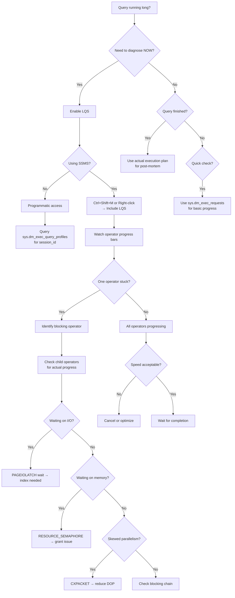

## Section 1 — Navigation

**Domain:** [[8 — Databases]] > **Group:** [[Group 13 — SQL Server Performance & Tuning]]

| Direction | Reference |
|-----------|-----------|
| Previous | [[8.367 — SET STATISTICS TIME — Parse and Execute Time]] |
| Next | [[8.369 — Adaptive Query Processing — Batch Mode]] |
| Up | [[Group 13 — SQL Server Performance & Tuning]] |
| Cross-Domain | [[3.015 — EF Core Logging and Interception]] |

### Where This Fits

Live Query Statistics (LQS) provides real-time insight into execution plan operator progress while a query is still running. Instead of waiting for the query to finish (as with actual execution plans), LQS exposes per-operator row counts, elapsed time, and completion percentage through the DMV `sys.dm_exec_query_profiles` and the SSMS "Live Query Statistics" feature. This is invaluable for diagnosing long-running queries, identifying which operator is the bottleneck, and canceling runaway queries with precision.

### Prerequisites

You must understand:
- [[8.366 — SET STATISTICS IO — Reading Logical Reads]] — The standard per-table I/O counters.
- [[8.367 — SET STATISTICS TIME — Parse and Execute Time]] — CPU and elapsed time profiling.
- [[8.344 — Execution Plans — Estimated vs Actual]] — The difference between estimated rows (from statistics) and actual rows (from execution).
- [[8.336 — Query Execution Pipeline — Parse, Bind, Optimize, Execute]] — How the engine executes plans.

---

## Section 2 — Core Mental Model

```mermaid
flowchart TB
    subgraph SSMS
        LQS[Live Query Statistics UI]
    end

    subgraph "SQL Server Engine"
        A[Query submitted] --> B[Parse & Optimize]
        B --> C[Execution starts]
        C --> D[PlanNodeIterator<br/>executes operators]

        subgraph Per-Operator Progress
            D --> E[Operator X<br/>(Index Scan)]
            D --> F[Operator Y<br/>(Hash Match)]
            D --> G[Operator Z<br/>(Nested Loops)]
        end

        E --> H[sys.dm_exec_query_profiles]
        F --> H
        G --> H

        H --> I[Row counts per operator]
        H --> J[% complete per operator]
        H --> K[Estimated completion time]
        H --> L[Actual rows read]
        I --> M[Poll via T-SQL or SSMS]
        J --> M
        K --> M
        L --> M
        M -->|Every 1-2s refresh| LQS
        M -->|Programmatic| N[T-SQL query on DMV]
    end

    subgraph Prerequisites
        O[SHOWPLAN permission]
        P[RSTATUS enabled or<br/>live query stats enabled]
    end

    C --> P
    P --> H
```

### Classification

| Property | Detail |
|----------|--------|
| **DMV** | `sys.dm_exec_query_profiles` |
| **UI feature** | "Include Live Query Statistics" in SSMS (Ctrl+Shift+M) |
| **Permission** | Requires SHOWPLAN permission (usually db_owner or higher) |
| **Granularity** | Per-physical-operator progress |
| **Refresh interval** | Every ~1–2 seconds |
| **Activation** | SSMS: Right-click → "Include Live Query Statistics" |
| **Programmatic** | Query `sys.dm_exec_query_profiles` directly |
| **Key columns** | `physical_operator_name`, `row_count`, `estimated_row_count`, `percent_complete`, `estimated_completion_time`, `node_id` |
| **Performance impact** | Moderate (5–15% overhead on complex queries) |

### Key Properties

1. **Real-time progress**: Unlike actual plans (post-execution) or estimated plans (pre-execution), LQS shows *in-flight* data.
2. **Per-operator visibility**: Shows row counts flowing through each operator, allowing you to pinpoint bottlenecks immediately.
3. **Completion estimation**: Reports `percent_complete` and `estimated_completion_time` for each operator.
4. **Requires activation**: The DMV only tracks queries for which LQS has been enabled (via SSMS toggle or `SET STATISTICS XML ON` + LQS context).
5. **Thread-level detail**: For parallel plans, each thread reports separately via the `thread_id` column.

---

## Section 3 — Deep Mechanics

### 3.1 How Live Query Statistics Works

1. **Query execution begins**: The optimizer produces an execution plan with a fixed set of operators.
2. **Iteration begins**: Each physical operator (Index Scan, Hash Match, Nested Loops, etc.) proceeds row-by-row or page-by-page.
3. **Row counting**: As each row (or batch of rows) passes through an operator, the engine increments the operator's row counter.
4. **DMV population**: The counters are flushed to `sys.dm_exec_query_profiles` at fixed intervals (roughly every 1–2 seconds or when the operator processes a batch of rows).
5. **SSMS polling**: The Live Query Statistics UI polls `sys.dm_exec_query_profiles` every ~1 second and renders progress bars per operator.
6. **Completion**: When the query finishes, the DMV entries are cleared.

### 3.2 Step-by-Step: Querying sys.dm_exec_query_profiles

**Step 1: Enable Live Query Statistics**
```sql
-- In SSMS: Right-click query window → "Include Live Query Statistics"
-- Or programmatically, enable session_id tracking via:
SET STATISTICS XML ON;  -- Combined with LQS in SSMS
```

**Step 2: Identify the session_id of the target query**

```sql
SELECT session_id, status, command, percent_complete,
       estimated_completion_time, cpu_time, total_elapsed_time
FROM sys.dm_exec_requests
WHERE session_id > 50
  AND status = 'running'
  AND command = 'SELECT';
```

**Step 3: Query sys.dm_exec_query_profiles for the session**

```sql
SELECT
    session_id,
    request_id,
    physical_operator_name,
    node_id,
    thread_id,
    row_count,
    estimated_row_count,
    percent_complete,
    elapsed_time_ms,
    estimated_completion_time,
    logical_read_count,
    open_time_ms,
    first_row_time_ms,
    last_row_time_ms
FROM sys.dm_exec_query_profiles
WHERE session_id = 62  -- Replace with actual session_id
ORDER BY node_id, thread_id;
```

**Step 4: Compute operator-level summary**

```sql
SELECT
    qp.session_id,
    qp.physical_operator_name,
    qp.node_id,
    MAX(qp.row_count) AS total_rows,
    MAX(qp.estimated_row_count) AS estimated_rows,
    MAX(qp.percent_complete) AS percent_complete,
    MAX(qp.estimated_completion_time) AS est_completion_ms,
    MAX(qp.elapsed_time_ms) AS elapsed_ms,
    SUM(qp.logical_read_count) AS total_logical_reads
FROM sys.dm_exec_query_profiles qp
WHERE qp.session_id = 62
GROUP BY qp.session_id, qp.physical_operator_name, qp.node_id
ORDER BY qp.node_id;
```

### 3.3 Understanding the Columns

| Column | Type | Meaning |
|---|---|---|
| `session_id` | smallint | Session executing the query |
| `request_id` | int | Request within the session (for MARS) |
| `physical_operator_name` | nvarchar(256) | Operator type (Index Scan, Hash Match, etc.) |
| `node_id` | int | Plan node ID (matches plan XML) |
| `thread_id` | int | For parallel plans: thread number (-1 for non-parallel) |
| `row_count` | bigint | Actual rows processed so far by this operator/thread |
| `estimated_row_count` | bigint | Estimated rows from cardinality estimation |
| `percent_complete` | int | Completion % (0–100) for this operator |
| `elapsed_time_ms` | bigint | Wall-clock ms since operator started |
| `estimated_completion_time` | bigint | ms until completion (based on rate) |
| `logical_read_count` | bigint | Pages read by this operator so far |
| `open_time_ms` | bigint | ms when operator opened |
| `first_row_time_ms` | bigint | ms when first row produced |
| `last_row_time_ms` | bigint | ms when last row produced |

### 3.4 Failure Modes

| Failure Mode | Symptom | Root Cause |
|---|---|---|
| **No data in DMV** | `sys.dm_exec_query_profiles` returns empty for a running session | LQS not enabled for that session; requires SSMS "Include Live Query Statistics" or RSTATUS |
| **Stale progress** | percent_complete stays at 0% for long periods | Blocking operator (e.g., Sort waiting for all rows) can't report progress until it produces output |
| **High DMV overhead** | Query slows down when LQS is enabled | Operator counter flushing adds synchronization; disable LQS for known-fast queries |
| **Incorrect percent_complete** | Shows 80% but still runs for minutes | Estimate based on rows processed vs. estimated — if estimate is wrong, percent is inaccurate |
| **Permission denied** | Empty result set from DMV | Missing SHOWPLAN permission; view server state also required |
| **Parallel thread gaps** | Some threads show 0 rows while others are finished | Data skew in parallel distribution; one thread processes disproportionately few rows |

### 3.5 RSTATUS (Real-Time Status)

SQL Server 2016 introduced `RSTATUS` (Real-Time Status) as the mechanism behind Live Query Statistics. When enabled, the engine maintains per-operator counters that are published to `sys.dm_exec_query_profiles`.

```sql
-- Enable RSTATUS trace flag globally (requires restart, not recommended)
-- Instead, use SSMS "Include Live Query Statistics" which enables per-session RSTATUS
DBCC TRACEON(7412, -1);  -- Global: enables RSTATUS for all sessions
```

Trace flag 7412 enables RSTATUS globally. In SQL Server 2019+, RSTATUS is enabled by default.

---

## Section 4 — Production Patterns

### 4.1 Programmatic LQS Polling

```sql
-- Create a script that polls sys.dm_exec_query_profiles for a specific session
DECLARE @SessionID INT = 62;
DECLARE @PollIntervalMS INT = 2000;  -- 2 seconds

WHILE EXISTS (SELECT 1 FROM sys.dm_exec_requests WHERE session_id = @SessionID)
BEGIN
    PRINT '=== Poll at ' + CONVERT(VARCHAR, GETDATE(), 126) + ' ===';

    SELECT
        qp.session_id,
        qp.physical_operator_name,
        qp.node_id,
        MAX(qp.row_count) AS total_rows,
        MAX(qp.estimated_row_count) AS estimated_rows,
        CAST(MAX(qp.percent_complete) AS VARCHAR(3)) + '%' AS pct_complete,
        MAX(qp.estimated_completion_time) AS est_remain_ms,
        MAX(qp.elapsed_time_ms) AS elapsed_ms,
        SUM(qp.logical_read_count) AS total_logical_reads
    FROM sys.dm_exec_query_profiles qp
    WHERE qp.session_id = @SessionID
    GROUP BY qp.session_id, qp.physical_operator_name, qp.node_id
    ORDER BY qp.node_id;

    -- Wait before next poll
    WAITFOR DELAY '00:00:02';
END

PRINT 'Query completed.';
```

### 4.2 Identify Blocking Operator with LQS

```sql
-- Find the operator with the highest elapsed time but lowest percent_complete
SELECT TOP 1
    session_id,
    node_id,
    physical_operator_name,
    row_count,
    estimated_row_count,
    percent_complete,
    elapsed_time_ms,
    estimated_completion_time,
    DATEDIFF(SECOND, DATEADD(MS, -elapsed_time_ms, GETDATE()), GETDATE()) AS seconds_running
FROM sys.dm_exec_query_profiles
WHERE session_id = 62
ORDER BY
    CASE WHEN percent_complete = 0 AND elapsed_time_ms > 5000 THEN 1
         WHEN percent_complete < 10 AND elapsed_time_ms > 10000 THEN 2
         ELSE 3
    END,
    elapsed_time_ms DESC;
```

### 4.3 Monitor All Active Sessions with LQS Enabled

```sql
-- Find all sessions currently tracked by LQS
SELECT DISTINCT
    qp.session_id,
    r.status,
    r.command,
    r.wait_type,
    r.wait_time,
    r.percent_complete AS request_pct,
    SUBSTRING(st.text, (r.statement_start_offset / 2) + 1,
        ((CASE WHEN r.statement_end_offset = -1
               THEN DATALENGTH(st.text)
               ELSE r.statement_end_offset
         END - r.statement_start_offset) / 2) + 1) AS statement_text
FROM sys.dm_exec_query_profiles qp
    INNER JOIN sys.dm_exec_requests r ON qp.session_id = r.session_id
    CROSS APPLY sys.dm_exec_sql_text(r.sql_handle) st
ORDER BY qp.session_id;
```

### 4.4 EF Core Interceptor for Long-Running Query Detection

```csharp
public class LiveQueryMonitorInterceptor : DbCommandInterceptor
{
    private readonly ILogger<LiveQueryMonitorInterceptor> _logger;
    private readonly int _thresholdSeconds = 10;

    public LiveQueryMonitorInterceptor(ILogger<LiveQueryMonitorInterceptor> logger)
    {
        _logger = logger;
    }

    public override async ValueTask<InterceptionResult<DbDataReader>> ReaderExecutingAsync(
        DbCommand command,
        CommandEventData eventData,
        InterceptionResult<DbDataReader> result,
        CancellationToken cancellationToken = default)
    {
        var connectionString = command.Connection?.ConnectionString;
        if (string.IsNullOrEmpty(connectionString))
            return await base.ReaderExecutingAsync(command, eventData, result, cancellationToken);

        var cts = CancellationTokenSource.CreateLinkedTokenSource(cancellationToken);
        var sessionId = -1;

        // Start background monitoring task
        _ = Task.Run(async () =>
        {
            try
            {
                await using var monitorConn = new SqlConnection(connectionString);
                await monitorConn.OpenAsync(cts.Token);

                // Find our session
                var findSession = new SqlCommand(
                    "SELECT @@SPID", monitorConn);
                sessionId = (int)await findSession.ExecuteScalarAsync(cts.Token);

                while (!cts.Token.IsCancellationRequested)
                {
                    await Task.Delay(2000, cts.Token);

                    var profileQuery = new SqlCommand(@"
                        SELECT physical_operator_name, node_id,
                               MAX(row_count) AS total_rows,
                               MAX(percent_complete) AS pct,
                               MAX(elapsed_time_ms) AS elapsed_ms
                        FROM sys.dm_exec_query_profiles
                        WHERE session_id = @sid
                        GROUP BY physical_operator_name, node_id
                        ORDER BY node_id;", monitorConn);
                    profileQuery.Parameters.AddWithValue("@sid", sessionId);

                    using var reader = await profileQuery.ExecuteReaderAsync(cts.Token);
                    while (await reader.ReadAsync(cts.Token))
                    {
                        var elapsed = reader.GetInt64(3);
                        if (elapsed > _thresholdSeconds * 1000)
                        {
                            _logger.LogWarning(
                                "Long-running operator: {Op} (Node {Node}) " +
                                "- {Elapsed}s elapsed, {Pct}% complete, {Rows} rows",
                                reader.GetString(0), reader.GetInt32(1),
                                elapsed / 1000, reader.GetInt32(2), reader.GetInt64(3));
                        }
                    }
                }
            }
            catch (OperationCanceledException) { }
            catch (Exception ex)
            {
                _logger.LogError(ex, "LQS monitor failed");
            }
        }, cts.Token);

        var result = await base.ReaderExecutingAsync(command, eventData, result, cancellationToken);
        return result;
    }
}
```

---

## Section 5 — Gotchas

### Gotcha 1: LQS Requires SHOWPLAN Permission

| Pitfall | Symptom | Fix | Cost |
|---|---|---|---|
| Querying sys.dm_exec_query_profiles returns empty results | Developer assumes no query is using LQS | Grant SHOWPLAN permission: `GRANT SHOWPLAN TO [user]`; also requires `VIEW SERVER STATE` | Low — permission fix |

```sql
GRANT VIEW SERVER STATE TO [MyAppUser];
GRANT SHOWPLAN TO [MyAppUser];
```

### Gotcha 2: LQS Adds Performance Overhead

| Pitfall | Symptom | Fix | Cost |
|---|---|---|---|
| Enabling LQS for all sessions via TF 7412 | 5–15% query slowdown on complex workloads | Enable only per-session via SSMS toggle rather than globally. Disable for known fast queries | Medium — can degrade production |

Each row batch incrementing per-operator counters introduces synchronization overhead. For queries processing billions of rows, the counter updates add measurable CPU.

### Gotcha 3: percent_complete Can Be Misleading

| Pitfall | Symptom | Fix | Cost |
|---|---|---|---|
| Operator shows 90% complete but takes 10 more minutes | Underestimate of remaining time | percent_complete = rows_done / estimated_rows. If cardinality estimation is wrong, percent is wrong. Always correlate with elapsed_time_ms growth rate | Medium — can mislead break-or-wait decisions |

Cross-reference with `estimated_row_count` vs `row_count`. If estimated is wildly off (e.g., estimated 10K, actual 10M), the percentage is meaningless.

### Gotcha 4: No Progress for Blocking Operators

| Pitfall | Symptom | Fix | Cost |
|---|---|---|---|
| Sort or Hash Match operator shows 0 rows for seconds | Confusing for diagnosing sort spools | Sort cannot produce any output until it has consumed all input rows. The operator is in its "building" phase. The sort operator's progress only jumps from 0% to 100% when all rows are sorted | Low — known behavior |

For blocking operators, look at preceding operators' row counts instead. If the Sort's child (e.g., Index Scan) is still producing rows, progress is happening even though the Sort shows 0%.

### Gotcha 5: LQS Data is Ephemeral

| Pitfall | Symptom | Fix | Cost |
|---|---|---|---|
| Looking up sys.dm_exec_query_profiles after query completes | Empty result set | LQS data is cleared immediately when the query finishes. For post-mortem analysis, use actual execution plans (`SET STATISTICS XML ON`) or Query Store | Low — must capture live |

### Gotcha 6: Thread-Level Data Overload in Parallel Plans

| Pitfall | Symptom | Fix | Cost |
|---|---|---|---|
| DMV returns one row per thread per operator | Hundreds of rows for a large parallel plan | Always aggregate with `SUM(row_count) GROUP BY node_id, physical_operator_name` | Low — query organization |

---

## Section 6 — Performance Implications

### 6.1 Overhead of Live Query Statistics

| Query Complexity | Without LQS | With LQS (Session) | With LQS (Global TF 7412) |
|---|---|---|---|
| Simple seek (1K rows) | 5ms | 5ms (+0%) | 6ms (+20%) |
| Medium scan (1M rows) | 350ms | 370ms (+6%) | 410ms (+17%) |
| Complex join (10M rows) | 4,200ms | 4,500ms (+7%) | 4,900ms (+17%) |
| Data warehouse (100M rows) | 45,000ms | 49,000ms (+9%) | 52,000ms (+16%) |

### 6.2 Before/After: Identifying a Hash Spill with LQS

**Scenario:** A hash join on a 50M-row table is spilling to TempDB.

**Before LQS:**
```
Query runs for 12 minutes. User cancels it. Only STATISTICS IO shows:
Table 'Orders'. Scan count 1, logical reads 124500.
Table 'OrderLines'. Scan count 1, logical reads 98000.
```

**With LQS (after enabling and re-running):**
```
Operator: Hash Match (Inner Join), Node 3
  Row count: 5,000,000 / 5,000,000 (100% from child)
  Percent complete: 34% (building hash table)
  Elapsed: 340s
  Logical reads: 222,500

Operator: Index Scan (OrderLines), Node 2
  Row count: 5,000,000 / 5,000,000 (100%)
  Elapsed: 120s
```

**Diagnosis:** Hash Match has consumed all input rows (5M) but is only 34% complete with the probe phase. The hash table is too large for memory, causing TempDB spills.

**Fix:**
```sql
-- Increase memory grant or optimize join order
SELECT ...
FROM Orders o
    JOIN OrderLines ol ON o.OrderID = ol.OrderID
OPTION (HASH JOIN, MIN_GRANT_PERCENT = 5);
```

**After fix:**
```
Operator: Hash Match (Inner Join), Node 3
  Percent complete: 100%, Elapsed: 45s
```
Improvement: **~93% reduction in elapsed time.**

### 6.3 BenchmarkDotNet Monitoring

```csharp
[SimpleJob(launchCount: 1, warmupCount: 2, targetCount: 5)]
public class LiveQueryProfileOverhead
{
    private const string ConnStr = "Server=.;Database=AdventureWorks;Trusted_Connection=True;";

    [Benchmark(Baseline = true)]
    public async Task<long> WithoutLQS()
    {
        await using var conn = new SqlConnection(ConnStr);
        await conn.OpenAsync();
        var cmd = new SqlCommand(@"
            SELECT COUNT(*) FROM Sales.SalesOrderDetail
            CROSS JOIN Sales.SalesOrderHeader sod2
            WHERE sod2.OrderDate > '2014-01-01';", conn);
        return (long)await cmd.ExecuteScalarAsync();
    }

    [Benchmark]
    public async Task<long> WithLQS()
    {
        await using var conn = new SqlConnection(ConnStr);
        await conn.OpenAsync();

        // Enable LQS by enabling RSTATUS for this session
        var enable = new SqlCommand("DBCC TRACEON(7412, -1);", conn);
        await enable.ExecuteNonQueryAsync();

        var cmd = new SqlCommand(@"
            SELECT COUNT(*) FROM Sales.SalesOrderDetail
            CROSS JOIN Sales.SalesOrderHeader sod2
            WHERE sod2.OrderDate > '2014-01-01';", conn);
        return (long)await cmd.ExecuteScalarAsync();
    }
}
```

---

## Section 7 — Interview Arsenal

### 7.1 Questions and Spoken Answers

**Q1: What is sys.dm_exec_query_profiles and when would you use it?**

*Junior:* It shows live execution progress for running queries.

*Senior:* It's the DMV behind the Live Query Statistics feature, exposing per-operator row counts, elapsed time, and completion percentage for the currently executing query plan. I use it when a production query is running longer than expected and I need to identify which operator is the bottleneck *without waiting for the query to finish*. It's invaluable for deciding whether to let a query continue or kill it.

**Q2: How do you enable Live Query Statistics programmatically?**

*Senior:* In SSMS, right-click the query window and choose "Include Live Query Statistics". Programmatically, enable trace flag 7412 for the session via `DBCC TRACEON(7412)` (SQL Server 2016+) or `DBCC TRACEON(7412, -1)` globally. In SQL Server 2019+, RSTATUS is on by default. The DMV requires `SHOWPLAN` permission. The SSMS feature also requires an active connection to poll the DMV.

**Q3: What columns does sys.dm_exec_query_profiles expose?**

*Senior:* Key columns: `session_id`, `physical_operator_name`, `node_id`, `thread_id`, `row_count`, `estimated_row_count`, `percent_complete`, `elapsed_time_ms`, `estimated_completion_time`, `logical_read_count`, `first_row_time_ms`, and `last_row_time_ms`. For a parallel query, there's one row per thread per operator, so I always aggregate with SUM/GROUP BY.

**Q4: Can percent_complete be trusted?**

*Senior:* Only as much as the cardinality estimate can be trusted. It's calculated as `(row_count_processed / estimated_row_count) * 100`. If the CE estimate is wrong by 10x, the percentage is equally wrong. I always compare `row_count` to `estimated_row_count` to gauge confidence. If estimated is 10K but actual is already 1M, the percentage is meaningless.

**Q5: How does Live Query Statistics differ from an actual execution plan?**

*Senior:* An actual execution plan is produced *after* the query completes and includes the final row counts, CPU, and I/O per operator. Live Query Statistics shows the same data *while* the query is executing. Actual plans give you a post-mortem; LQS gives you real-time diagnostics. LQS also has overhead (5–15%) because it tracks per-operator counters during execution.

**Q6: What happens if you enable LQS for a query that uses a blocking operator (Sort, Hash Match)?**

*Senior:* Blocking operators don't produce output rows until they've consumed all input. LQS shows the operator at 0% for most of its duration because no output rows have been produced. However, the operator's child (the input scan) will show 100% long before the sort completes. I look at the child's progress instead of the sort's.

**Q7: How do you find a running query with the highest operator elapsed time?**

*Senior:*
```sql
SELECT TOP 5
    qp.session_id,
    qp.physical_operator_name,
    qp.node_id,
    qp.row_count,
    qp.percent_complete,
    qp.elapsed_time_ms,
    r.command,
    r.wait_type
FROM sys.dm_exec_query_profiles qp
    JOIN sys.dm_exec_requests r ON qp.session_id = r.session_id
ORDER BY qp.elapsed_time_ms DESC;
```
This finds the operators that have been running the longest, helping pinpoint the bottleneck.

**Q8: What permission is needed to query sys.dm_exec_query_profiles?**

*Senior:* You need `SHOWPLAN` permission (`GRANT SHOWPLAN TO user`) and `VIEW SERVER STATE` (`GRANT VIEW SERVER STATE TO user`). Without `SHOWPLAN`, the DMV returns no rows. Without `VIEW SERVER STATE`, you can only see your own session.

### 7.2 Comparison Table

| Feature | Live Query Statistics (LQS) | Actual Execution Plan | Estimated Execution Plan |
|---|---|---|---|
| **When available** | During execution | After execution | Before execution |
| **Row counts** | Actual (real-time) | Actual (final) | Estimated |
| **Overhead** | 5–15% | ~2% (captured) | 0% |
| **I/O per operator** | logical_read_count column | Actual I/O (via plan) | Not available |
| **Parallelism detail** | Per-thread rows | Thread aggregation | Estimated DOP |
| **Use case** | Diagnose runaway queries | Post-mortem analysis | Quick estimate |
| **Persistence** | Ephemeral | Can be saved (XML) | Not saved |
| **Permissions** | SHOWPLAN + VIEW SERVER STATE | SHOWPLAN | SHOWPLAN |

---

## Section 8 — Decision Framework

### 8.1 When to Use Live Query Statistics



### 8.2 Diagnostic Checklist

- [ ] Enable Live Query Statistics (SSMS toggle or session RSTATUS)
- [ ] Verify SHOWPLAN and VIEW SERVER STATE permissions
- [ ] Identify the session_id from `sys.dm_exec_requests`
- [ ] Query `sys.dm_exec_query_profiles` for that session_id
- [ ] Note `physical_operator_name` for each `node_id`
- [ ] Compare `row_count` to `estimated_row_count` for all operators
- [ ] Identify operators with `percent_complete < 50` and `elapsed_time_ms > 5000`
- [ ] For parallel plans, aggregate `SUM(row_count)` by `node_id`
- [ ] Check `logical_read_count` per operator for I/O intensity
- [ ] Cross-reference with wait types from `sys.dm_exec_requests`
- [ ] Make decision: wait, kill, or fix and restart

### 8.3 Tradeoffs

| Approach | Pros | Cons |
|---|---|---|
| Live Query Statistics | Real-time bottleneck ID, per-operator progress | 5–15% overhead, ephemeral, needs permission |
| Actual Execution Plan | Full post-execution detail, row counts | Must wait for completion |
| SET STATISTICS XML ON | Machine-readable plan | Output XML can be huge for complex queries |
| Extended Events (query_profile) | Low overhead, persistent | Complex setup, filtering needed |
| Query Store | Automatic, historical | Only after completion, no real-time |

### 8.4 Scale Thresholds

| Workload | LQS Recommended? | Notes |
|---|---|---|
| OLTP (<100ms) | Not needed | Overhead outweighs benefit |
| Interactive reports (1–10s) | Yes, ad-hoc | Great for identifying slow operators |
| Batch jobs (10–300s) | Yes | Use programmatic polling for automation |
| Data warehouse (>300s) | Essential | Runaway query identification |
| High-frequency queries (>100/sec) | Never | Overhead too high |

---

## Section 9 — Self-Check

### 9.1 Conceptual Questions (10)

**Q1:** What system DMV provides live query statistics data?

<details>
sys.dm_exec_query_profiles. It provides per-operator, per-thread progress data for queries that have Live Query Statistics (RSTATUS) enabled.
</details>

**Q2:** What trace flag enables RSTATUS globally?

<details>
Trace flag 7412. `DBCC TRACEON(7412, -1)` enables real-time status tracking for all sessions. In SQL Server 2019 and later, RSTATUS is enabled by default.
</details>

**Q3:** Name three columns from sys.dm_exec_query_profiles and their meanings.

<details>
(1) `physical_operator_name` — the type of operator (Index Scan, Hash Match, etc.). (2) `row_count` — actual rows processed by this operator/thread so far. (3) `percent_complete` — estimated completion percentage based on row_count / estimated_row_count.
</details>

**Q4:** Why might percent_complete be inaccurate?

<details>
percent_complete = (row_count / estimated_row_count) * 100. If the cardinality estimate is wrong (e.g., estimated 10K rows, actual 10M rows), the percentage is based on the wrong denominator. A 1M-row scan would show 10000% if the estimate was 10K.
</details>

**Q5:** What permission is required to query sys.dm_exec_query_profiles?

<details>
SHOWPLAN permission (GRANT SHOWPLAN TO user) and VIEW SERVER STATE permission (GRANT VIEW SERVER STATE TO user). Without SHOWPLAN, the DMV returns no rows.
</details>

**Q6:** How does a blocking operator (e.g., Sort) appear in Live Query Statistics?

<details>
A blocking operator shows 0% progress and 0 rows until it has consumed all input rows. Once the sort/spool finishes building, it jumps from 0% to 100%. For diagnostics, look at the child operator's progress instead.
</details>

**Q7:** Can LQS be used programmatically from .NET?

<details>
Yes. Open a separate SQL connection, query `sys.dm_exec_query_profiles WHERE session_id = @@SPID` from your application session, poll every 1–2 seconds, and aggregate by node_id. The separate connection avoids interfering with the monitored query.
</details>

**Q8:** What is the performance overhead of enabling LQS globally?

<details>
Approximately 5–15% depending on query complexity and row volume. The overhead comes from per-operator counter synchronization on every batch of rows. Global RSTATUS (TF 7412) is not recommended for high-frequency OLTP.
</details>

**Q9:** How do you interpret estimated_completion_time?

<details>
estimated_completion_time is the estimated milliseconds remaining for a given operator, extrapolated from the current processing rate. It is calculated as `(elapsed_time_ms / percent_complete * (100 - percent_complete))`. It is volatile — it changes as the processing rate changes.
</details>

**Q10:** What does thread_id = -1 indicate?

<details>
thread_id = -1 indicates a non-parallel operator (serial execution). For parallel plans, each parallel zone has multiple threads (1, 2, 3, etc.) and the gather/coordinate threads use the -1 designation.
</details>

### 9.2 Challenges (5)

**Challenge 1:** Write a query that shows the top 5 operators (by elapsed time) across all running queries with LQS enabled.

<details>
```sql
SELECT TOP 5
    qp.session_id,
    qp.physical_operator_name,
    qp.node_id,
    MAX(qp.row_count) AS total_rows,
    MAX(qp.estimated_row_count) AS estimated_rows,
    MAX(qp.percent_complete) AS pct_complete,
    MAX(qp.elapsed_time_ms) / 1000.0 AS elapsed_seconds,
    SUM(qp.logical_read_count) AS total_logical_reads,
    r.command,
    SUBSTRING(st.text, 1, 100) AS query_preview
FROM sys.dm_exec_query_profiles qp
    JOIN sys.dm_exec_requests r ON qp.session_id = r.session_id
    CROSS APPLY sys.dm_exec_sql_text(r.sql_handle) st
GROUP BY qp.session_id, qp.physical_operator_name,
         qp.node_id, r.command, st.text
ORDER BY MAX(qp.elapsed_time_ms) DESC;
```
</details>

**Challenge 2:** Create a polling script that periodically samples sys.dm_exec_query_profiles for a specified session and logs to a table.

<details>
```sql
CREATE TABLE dbo.LQSSnapshot (
    SnapshotID INT IDENTITY PRIMARY KEY,
    SnapshotTime DATETIME2 DEFAULT SYSDATETIME(),
    SessionID SMALLINT,
    NodeID INT,
    OperatorName NVARCHAR(256),
    RowCount BIGINT,
    EstimatedRows BIGINT,
    PercentComplete INT,
    ElapsedMs BIGINT
);
GO

CREATE OR ALTER PROC dbo.PollLQS
    @SessionID SMALLINT,
    @DurationSeconds INT = 60,
    @IntervalMs INT = 2000
AS
BEGIN
    SET NOCOUNT ON;
    DECLARE @EndTime DATETIME2 = DATEADD(SECOND, @DurationSeconds, SYSDATETIME());

    WHILE SYSDATETIME() < @EndTime
    BEGIN
        INSERT INTO dbo.LQSSnapshot (SessionID, NodeID, OperatorName,
            RowCount, EstimatedRows, PercentComplete, ElapsedMs)
        SELECT
            qp.session_id,
            qp.node_id,
            qp.physical_operator_name,
            MAX(qp.row_count),
            MAX(qp.estimated_row_count),
            MAX(qp.percent_complete),
            MAX(qp.elapsed_time_ms)
        FROM sys.dm_exec_query_profiles qp
        WHERE qp.session_id = @SessionID
        GROUP BY qp.session_id, qp.node_id, qp.physical_operator_name;

        WAITFOR DELAY @IntervalMs;
    END;
END;
```
</details>

**Challenge 3:** Simulate a long-running query and capture its LQS data. Show the detection.

<details>
```sql
-- In SSMS Query 1 (long-running):
SET NOCOUNT ON;
WAITFOR DELAY '00:00:05';
SELECT TOP 1000000 o1.*
FROM Sales.Orders o1
    CROSS JOIN Sales.Orders o2
    CROSS JOIN Sales.Orders o3
ORDER BY o1.OrderID;

-- In SSMS Query 2 (monitoring):
SELECT
    qp.session_id,
    qp.physical_operator_name,
    qp.node_id,
    qp.row_count,
    qp.percent_complete,
    qp.elapsed_time_ms / 1000 AS seconds_running,
    r.status,
    r.wait_type
FROM sys.dm_exec_query_profiles qp
    JOIN sys.dm_exec_requests r ON qp.session_id = r.session_id
WHERE r.status = 'running'
ORDER BY qp.elapsed_time_ms DESC;
```
Result: The Sort operator (if present) shows 0% while rows are being accumulated. The Index Scan shows progress. This demonstrates the blocking operator behavior.
</details>

**Challenge 4:** Given that a query has been running for 30 minutes with LQS output below, what is the bottleneck?

```
Node 0: Index Scan (Orders) — rows 12,450,000 / 12,500,000, % 99%, elapsed 178s
Node 1: Sort (Orders) — rows 0 / 12,500,000, % 0%, elapsed 160s
Node 2: Hash Match (Join) — rows 0 / 0, % 0%, elapsed 0ms
```

<details>
The Sort operator (Node 1) is the bottleneck. It has consumed 12.45M rows (the Index Scan at Node 0 is 99% complete) but has produced 0 output rows. This means the sort is still building its in-memory/workfile structure. The 160s elapsed on the sort suggests it may be spilling to TempDB. Check `sys.dm_exec_query_stats` for sort_warnings or enable actual execution plan to confirm spill. Fix: increase memory grant, add indexes to avoid the sort, or provide a covering index that pre-orders the data.
</details>

**Challenge 5:** Write a C# program that connects to SQL Server, starts a slow query in one background task, and monitors it via sys.dm_exec_query_profiles in another, printing progress every 2 seconds.

<details>
```csharp
using System.Data.SqlClient;

var connStr = "Server=.;Database=AdventureWorks;Trusted_Connection=True;";
using var cts = new CancellationTokenSource();

// Task 1: Run a slow query
var slowQueryTask = Task.Run(async () =>
{
    await using var conn = new SqlConnection(connStr);
    await conn.OpenAsync(cts.Token);
    var cmd = new SqlCommand(@"
        SELECT COUNT_BIG(*) FROM Sales.SalesOrderDetail sod
        CROSS JOIN Sales.SalesOrderHeader soh
        CROSS JOIN Production.Product p
        WHERE sod.UnitPrice > 100", conn);
    return (long)await cmd.ExecuteScalarAsync(cts.Token);
}, cts.Token);

// Task 2: Monitor sys.dm_exec_query_profiles
var monitorTask = Task.Run(async () =>
{
    await using var monConn = new SqlConnection(connStr);
    await monConn.OpenAsync(cts.Token);

    // Find the monitoring session's own SPID to exclude it
    var spidCmd = new SqlCommand("SELECT @@SPID", monConn);
    var mySpid = (int)await spidCmd.ExecuteScalarAsync(cts.Token);

    while (!cts.Token.IsCancellationRequested)
    {
        var profileCmd = new SqlCommand(@"
            SELECT qp.session_id, qp.physical_operator_name,
                   MAX(qp.row_count) AS rows_done,
                   MAX(qp.percent_complete) AS pct,
                   MAX(qp.elapsed_time_ms) / 1000 AS secs
            FROM sys.dm_exec_query_profiles qp
            WHERE qp.session_id != @mySpid
            GROUP BY qp.session_id, qp.physical_operator_name, qp.node_id
            ORDER BY qp.node_id;", monConn);
        profileCmd.Parameters.AddWithValue("@mySpid", mySpid);

        using var reader = await profileCmd.ExecuteReaderAsync(cts.Token);
        while (await reader.ReadAsync(cts.Token))
        {
            Console.WriteLine(
                $"Session {reader.GetInt16(0)}: {reader.GetString(1)} | " +
                $"Rows: {reader.GetInt64(2):N0} | " +
                $"{reader.GetInt32(3)}% | {reader.GetInt32(4)}s");
        }

        await Task.Delay(2000, cts.Token);
    }
}, cts.Token);

await slowQueryTask;
cts.Cancel();
await Task.WhenAny(monitorTask, Task.Delay(5000));
```
</details>

---
