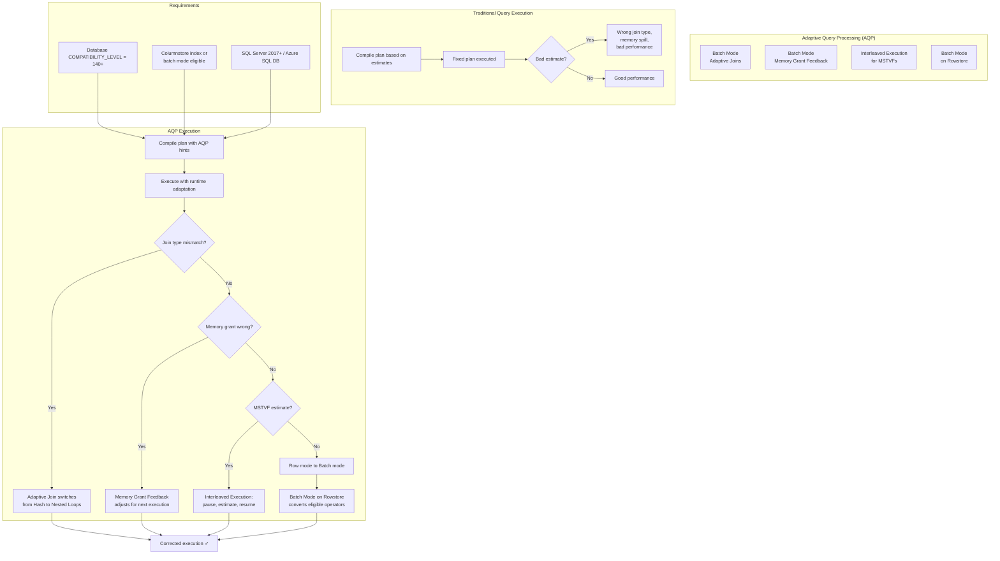
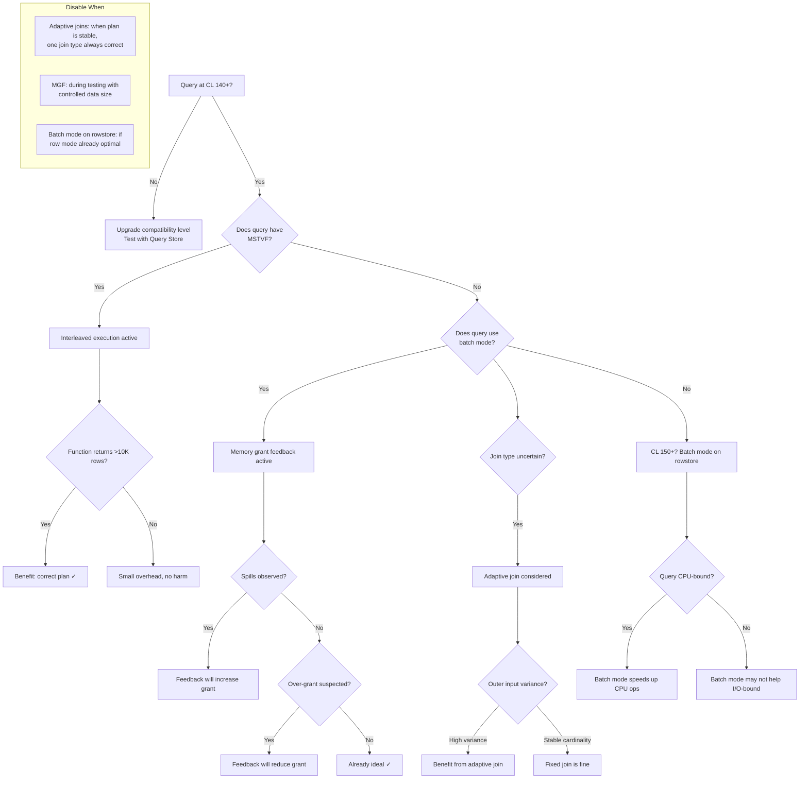

## Section 1 — Navigation

**Domain:** [[8 — Databases]] > **Group:** [[Group 13 — SQL Server Performance & Tuning]]

| Direction | Reference |
|-----------|-----------|
| Previous | [[8.368 — sys.dm_exec_query_profiles — Live Query Statistics]] |
| Next | [[8.370 — Intelligent Query Processing — SQL Server 2019+]] |
| Up | [[Group 13 — SQL Server Performance & Tuning]] |
| Cross-Domain | [[3.015 — EF Core Logging and Interception]] |

### Where This Fits

Adaptive Query Processing (AQP) is a set of features introduced in SQL Server 2017 (database compatibility level 140) that allows the query engine to adjust execution strategies based on runtime observations. Unlike traditional static plans that are fixed after compilation, AQP enables plan adjustments *during* execution (batch mode adaptive joins, interleaved execution) or across executions (memory grant feedback). AQP was significantly expanded in SQL Server 2019 with batch mode on rowstore and additional feedback mechanisms.

### Prerequisites

You must understand:
- [[8.344 — Execution Plans — Estimated vs Actual]] — Plans are chosen based on estimates; AQP fixes estimate-based mistakes.
- [[8.358 — Hash Match Join — Memory Grants and Spills]] — Memory grant sizing and spills.
- [[8.371 — Batch Mode on Rowstore — IQP Feature]] — Batch mode vs row mode execution.
- [[8.359 — Merge Join — Requirements and Performance]] — Join algorithm characteristics.
- Database compatibility level 140+ concepts.

---

## Section 2 — Core Mental Model



### Classification

| Property | Detail |
|----------|--------|
| **Introduced** | SQL Server 2017 (14.x), DB compatibility 140 |
| **Key features** | Batch mode adaptive joins, memory grant feedback, interleaved execution for MSTVFs |
| **2019 additions** | Batch mode on rowstore, table variable deferred compilation, scalar UDF inlining |
| **Requirement** | Database compatibility level ≥ 140 (150 for 2019 features) |
| **Activation type** | Automatic (no code changes needed) at correct compatibility level |

### Key Properties

1. **Batch Mode Adaptive Joins**: At runtime, the engine chooses between Hash Join and Nested Loops Join after the outer input has been read. A "decider" operator reads the outer rows, and if they're few enough, switches to Nested Loops; otherwise continues with Hash Join.
2. **Batch Mode Memory Grant Feedback**: After each execution, the engine adjusts the memory grant for the next execution. If the grant was too high (wasted memory) or too low (spills to TempDB), it corrects up or down.
3. **Interleaved Execution for MSTVFs**: The engine pauses optimization, executes the multi-statement table-valued function (MSTVF) once to get actual row counts, then optimizes the rest of the plan with accurate cardinality.
4. **Batch Mode on Rowstore (2019)**: Allows batch mode execution without requiring a columnstore index. The engine automatically detects eligible operators and converts them to batch mode.

---

## Section 3 — Deep Mechanics

### 3.1 Batch Mode Adaptive Joins

1. **Compilation**: The optimizer identifies that a join's outer input cardinality is uncertain. It generates a plan with a **Window Aggregate** switch operator, prepending an adaptive join with both Hash Join and Nested Loops sub-trees.
2. **Execution begins**: The outer input (build side) starts producing rows. The adaptive threshold is set at compile time (typically ~100,000 rows for 64KB thresholds).
3. **Decision point**: After the outer input is fully consumed, the actual row count is compared to the threshold.
   - If outer rows <= threshold → use **Nested Loops** (next inner input processed via seeks).
   - If outer rows > threshold → use **Hash Join** (build hash table from outer, probe from inner).
4. **Transition**: The switch is transparent. The unused sub-plan is discarded. The plan XML includes `<IsAdaptive>1</IsAdaptive>` and `<AdaptiveThresholdRowCount>`.

```sql
-- View adaptive join properties in plan XML
SELECT qp.query_plan
FROM sys.dm_exec_query_stats qs
    CROSS APPLY sys.dm_exec_query_plan(qs.plan_handle) qp
WHERE qs.query_hash = 0x...;  -- specific query hash

-- In XML: <RelOp ... IsAdaptive="1">
--   <AdaptiveJoin ...>
--     <HashMatch .../>
--     <NestedLoops .../>
--   </AdaptiveJoin>
```

### 3.2 Batch Mode Memory Grant Feedback

1. **First execution**: Query requests a memory grant based on cardinality estimates (row count × row size × operator memory requirement).
2. **Execution**: The grant is allocated. After execution, the engine compares:
   - **Granted memory** vs **Used memory**
   - Whether spills occurred (`sort_warnings`, `hash_warnings` in `sys.dm_exec_query_stats`)
3. **Feedback**: For the next execution:
   - If used < 50% of granted → reduce grant by 50% (for the next execution).
   - If spills occurred → increase grant by 25%.
   - The correction is persisted in the plan's `MemoryGrantInfo` in the plan cache.
4. **Persisted feedback (SQL Server 2022+)**: Memory grant feedback survives plan cache evictions in 2022 by persisting to the query store.
5. The DMV `sys.dm_exec_query_stats` exposes `last_grant_kb`, `last_used_grant_kb`, and `last_ideal_grant_kb` to track feedback iterations.

```sql
-- Monitor memory grant feedback iterations
SELECT
    qt.text AS query_text,
    qs.last_grant_kb,
    qs.last_used_grant_kb,
    qs.last_ideal_grant_kb,
    qs.max_ideal_grant_kb,
    qs.grant_count,
    qs.plan_handle
FROM sys.dm_exec_query_stats qs
    CROSS APPLY sys.dm_exec_sql_text(qs.sql_handle) qt
WHERE qs.last_grant_kb > qs.last_used_grant_kb * 1.5
   OR qs.last_grant_kb < qs.last_used_grant_kb * 0.5
ORDER BY (qs.last_grant_kb - qs.last_used_grant_kb) DESC;
```

### 3.3 Interleaved Execution for MSTVFs

1. **Optimization begins**: The optimizer encounters a multi-statement table-valued function reference in the query. Traditional optimization would use the fixed estimate (100 rows).
2. **Interleave point**: With AQP, the optimizer pauses at the function reference.
3. **Execution of MSTVF**: The function is actually executed with the calling query's parameters. The actual row count and schema are obtained.
4. **Resume optimization**: With the real row count, the optimizer re-plans the remainder of the query (joins, aggregations, etc.) using accurate cardinality.
5. **Benefits**: Eliminates the catastrophic plan choices caused by the default 100-row estimate for MSTVFs.

```sql
-- Create an MSTVF that would benefit from interleaved execution
CREATE OR ALTER FUNCTION dbo.GetCustomerOrders
    (@CustomerID INT)
RETURNS @Orders TABLE
(
    OrderID INT,
    OrderDate DATETIME,
    TotalAmount DECIMAL(18,2)
)
AS
BEGIN
    INSERT INTO @Orders
    SELECT OrderID, OrderDate, TotalAmount
    FROM Sales.Orders
    WHERE CustomerID = @CustomerID;

    RETURN;
END;
GO

-- With interleaved execution, the function is actually executed during optimization
-- Produces accurate join estimates when joined to other tables
SELECT c.CustomerName, o.OrderID, o.TotalAmount
FROM Sales.Customers c
    CROSS APPLY dbo.GetCustomerOrders(c.CustomerID) o
WHERE c.Country = 'USA';
```

### 3.4 Batch Mode on Rowstore (SQL Server 2019)

1. **Compatibility level**: Requires `ALTER DATABASE ... SET COMPATIBILITY_LEVEL = 150`.
2. **Eligibility**: The engine scans the plan for operators that are batch-mode eligible even without a columnstore index. Eligibility includes: scans (if below a threshold), joins, aggregates.
3. **Conversion**: Eligible row-mode operators are converted to batch-mode operators transparently.
4. **Batch mode advantages**:
   - Column-based processing (up to 900 rows per batch) improves CPU cache efficiency.
   - Vectorized operations reduce branch mispredictions.
   - Batch-mode-specific memory optimizations.

```sql
-- Verify batch mode on rowstore is active
SELECT
    qt.text,
    qp.query_plan
FROM sys.dm_exec_query_stats qs
    CROSS APPLY sys.dm_exec_sql_text(qs.sql_handle) qt
    CROSS APPLY sys.dm_exec_query_plan(qs.plan_handle) qp
WHERE qp.query_plan.exist(
    '//*:RelOp[contains(@ExecutionMode, "Batch")]') = 1;
```

### 3.5 USE HINTs for Controlling AQP

```sql
-- Disable adaptive joins for a specific query
SELECT *
FROM Orders o
    JOIN OrderLines ol ON o.OrderID = ol.OrderID
OPTION (USE HINT('DISABLE_BATCH_MODE_ADAPTIVE_JOINS'));

-- Disable memory grant feedback
SELECT *
FROM Orders o
    JOIN OrderLines ol ON o.OrderID = ol.OrderID
OPTION (USE HINT('DISABLE_BATCH_MODE_MEMORY_GRANT_FEEDBACK'));

-- Force interleaved execution
SELECT *
FROM Orders o
    CROSS APPLY dbo.GetCustomerOrders(o.CustomerID) co
OPTION (USE HINT('ENABLE_INTERLEAVED_EXECUTION_TVF'));

-- Disable batch mode on rowstore
SELECT *
FROM Orders o
    JOIN OrderLines ol ON o.OrderID = ol.OrderID
OPTION (USE HINT('DISABLE_BATCH_MODE_ON_ROWSTORE'));
```

---

## Section 4 — Production Patterns

### 4.1 Monitoring Adaptive Join Usage

```sql
-- Find queries using adaptive joins
WITH XMLNAMESPACES ('http://schemas.microsoft.com/sqlserver/2004/07/showplan' AS sp)
SELECT
    qt.text AS query_text,
    qs.execution_count,
    qs.total_elapsed_time / 1000 AS total_elapsed_ms,
    qs.total_logical_reads,
    qp.query_plan
FROM sys.dm_exec_query_stats qs
    CROSS APPLY sys.dm_exec_sql_text(qs.sql_handle) qt
    CROSS APPLY sys.dm_exec_query_plan(qs.plan_handle) qp
WHERE qp.query_plan.exist(
    '//sp:RelOp/@IsAdaptive[. = "1"]') = 1
ORDER BY qs.total_elapsed_time DESC;
```

### 4.2 Monitoring Memory Grant Feedback Corrections

```sql
-- Track memory grant feedback changes over time
SELECT
    qt.text AS query_text,
    qs.grant_count AS feedback_iterations,
    qs.last_grant_kb,
    qs.last_used_grant_kb,
    qs.last_ideal_grant_kb,
    CASE
        WHEN qs.last_ideal_grant_kb > 0
        THEN (1.0 - (qs.last_used_grant_kb * 1.0 / qs.last_ideal_grant_kb)) * 100
    END AS pct_grant_efficiency,
    qs.min_grant_kb,
    qs.max_grant_kb
FROM sys.dm_exec_query_stats qs
    CROSS APPLY sys.dm_exec_sql_text(qs.sql_handle) qt
WHERE qs.grant_count > 1
ORDER BY feedback_iterations DESC;
```

### 4.3 Detecting Interleaved Execution in Plans

```sql
-- Find plans with interleaved execution
WITH XMLNAMESPACES ('http://schemas.microsoft.com/sqlserver/2004/07/showplan' AS sp)
SELECT
    qt.text,
    qs.execution_count,
    qs.total_elapsed_time / 1000 AS elapsed_ms,
    qp.query_plan
FROM sys.dm_exec_query_stats qs
    CROSS APPLY sys.dm_exec_sql_text(qs.sql_handle) qt
    CROSS APPLY sys.dm_exec_query_plan(qs.plan_handle) qp
WHERE qp.query_plan.exist(
    '//sp:UserDefinedFunction[contains(@FunctionType, "MultiStatement")]') = 1
ORDER BY qs.total_elapsed_time DESC;
```

### 4.4 Setting Up AQP Correctly

```sql
-- Step 1: Verify current compatibility level
SELECT name, compatibility_level
FROM sys.databases
WHERE name = DB_NAME();

-- Step 2: Upgrade to 150 for full AQP + IQP
ALTER DATABASE CURRENT
SET COMPATIBILITY_LEVEL = 150;

-- Step 3: Verify batch mode eligibility
SELECT
    name AS index_name,
    type_desc,
    is_columnstore
FROM sys.indexes
WHERE is_columnstore = 1;
-- Batch mode on rowstore works WITHOUT columnstore in CL 150+
```

### 4.5 EF Core and AQP Considerations

```csharp
public class AqpAwareDbContext : DbContext
{
    protected override void OnModelCreating(ModelBuilder modelBuilder)
    {
        // Ensure database compatibility level supports AQP
        // This is a server-side setting, not a code setting
    }

    // For queries that need AQP hints, use raw SQL
    public async Task<List<Order>> GetOrdersWithHintAsync(int customerId)
    {
        return await Database.SqlQueryRaw<Order>(@"
            SELECT * FROM Sales.Orders
            WHERE CustomerID = @customerId
            ORDER BY OrderDate
            OPTION (USE HINT('ENABLE_INTERLEAVED_EXECUTION_TVF'))",
            new SqlParameter("@customerId", customerId))
            .ToListAsync();
    }
}
```

---

## Section 5 — Gotchas

### Gotcha 1: Adaptive Join Has a Fixed Threshold

| Pitfall | Symptom | Fix | Cost |
|---|---|---|---|
| Adaptive join chooses wrong algorithm because threshold doesn't match data | Query uses Hash Join when Nested Loops would be faster (or vice versa) | The threshold is based on estimated row size and available memory. Override with query hints: `OPTION (USE HINT('DISABLE_BATCH_MODE_ADAPTIVE_JOINS'))` or force join type with `OPTION (LOOP JOIN)` | Medium — can miss optimization |

The adaptive join threshold is not user-configurable. It's calculated at compile time based on available memory and row size. For edge cases, you cannot adjust it directly.

### Gotcha 2: Memory Grant Feedback Only Works for Batch Mode

| Pitfall | Symptom | Fix | Cost |
|---|---|---|---|
| Memory grant feedback doesn't correct grants for row-mode queries | Query continues to spill to TempDB despite multiple executions | Upgrade to SQL Server 2019+ with batch mode on rowstore, or use `sys.dm_exec_query_stats` to identify and manually fix grants | High — spills cause significant performance degradation |

Memory Grant Feedback only applies to batch-mode queries. In SQL Server 2017, row-mode queries don't get feedback. In 2019+, enable batch mode on rowstore to extend feedback to more queries.

### Gotcha 3: Interleaved Execution Adds Compile-Time Overhead

| Pitfall | Symptom | Fix | Cost |
|---|---|---|---|
| First execution is slow because interleaved execution executes the MSTVF during optimization | Unexpected delay on first execution | For MSTVFs that return millions of rows, the interleaved execution time adds to compile time. Consider replacing MSTVF with inline TVF or temp table | Medium — tradeoff between plan quality and compile time |

Interleaved execution executes the function *during optimization*, so the function's runtime (excluding the calling query) is added to compile time.

### Gotcha 4: AQP Features Require Specific Compatibility Levels

| Pitfall | Symptom | Fix | Cost |
|---|---|---|---|
| Query runs on CL 130 (SQL Server 2016) and gets no AQP benefits | None of the adaptive features activate | `ALTER DATABASE CURRENT SET COMPATIBILITY_LEVEL = 150;` to unlock all AQP and IQP features. Validate no queries regress with the new CE | Low — configuration fix |

| Feature | CL 140 (2017) | CL 150 (2019) | CL 160 (2022) |
|---|---|---|---|
| Adaptive joins | ✓ | ✓ | ✓ |
| Memory grant feedback | ✓ (batch mode) | ✓ (batch + rowstore) | ✓ (persisted) |
| Interleaved execution | ✓ | ✓ | ✓ |
| Batch mode on rowstore | ✗ | ✓ | ✓ |
| DOP feedback | ✗ | ✓ | ✓ |
| PS-POP | ✗ | ✗ | ✓ |

### Gotcha 5: Adaptive Join Not Used for All Join Types

| Pitfall | Symptom | Fix | Cost |
|---|---|---|---|
| Merge Join is never part of adaptive join | Assumption that AQP covers all join scenarios | Adaptive join only switches between Hash Join and Nested Loops. Merge Join is never used in the adaptive switch pair | Low — documented behavior |

---

## Section 6 — Performance Implications

### 6.1 Memory Grant Feedback: Before and After

**Before (first execution — over-grant):**
```
Memory grant: 1,024,000 KB (1 GB)
Memory used: 124,500 KB  (~12%)
Spills: 0
```
Result: 900 MB wasted memory that could have served other concurrent queries.

**After (feedback reduces grant):**
```
Memory grant: 256,000 KB (256 MB)
Memory used: 124,500 KB (~49%)
Spills: 0
```
Improvement: **75% memory reduction, no negative performance impact.** More concurrent queries fit in memory.

**Before (first execution — under-grant):**
```
Memory grant: 98,304 KB (96 MB)
Memory used: 245,000 KB (spills 147 MB to TempDB)
Spills: 2,345 pages
Elapsed: 12,800ms
```

**After (feedback increased grant):**
```
Memory grant: 262,144 KB (256 MB)
Memory used: 245,000 KB (~93%)
Spills: 0
Elapsed: 1,200ms
```
Improvement: **~91% reduction in elapsed time, 0 spills.**

### 6.2 Adaptive Join: Before and After

**Before (non-adaptive Hash Join on small outer input):**
```
Table 'Orders'. Scan count 1, logical reads 89,400.
Table 'OrderLines'. Scan count 1, logical reads 15,200.
CPU: 1,450ms, Elapsed: 1,520ms
(Full hash join built and probed — outer table had only 50 qualifying rows)
```

**After (adaptive join selects Nested Loops):**
```
Table 'Orders'. Scan count 1, logical reads 89,400.
Table 'OrderLines'. Scan count 50, logical reads 150.
CPU: 85ms, Elapsed: 78ms
```
Improvement: **~95% reduction in CPU and elapsed time.**

### 6.3 Interleaved Execution: Before and After

**Before (CL 130, no interleaved execution — MSTVF estimated at 100 rows):**
```
Estimated: 100 rows from GetCustomerOrders
Actual: 134,820 rows
Plan: Hash Join (inner side) chosen for 100 rows → Nested Loops used (wrong)
Elapsed: 45s
```

**After (CL 140+, interleaved execution):**
```
Actual row count: 134,820 used in optimization
Plan chosen: Hash Join (correct for large input)
Elapsed: 3.2s
```
Improvement: **~93% reduction in elapsed time.**

### 6.4 BenchmarkDotNet: AQP Impact

```csharp
[MemoryDiagnoser]
public class AqpBenchmarks
{
    private const string ConnStr = "Server=.;Database=AdventureWorks;Trusted_Connection=True;";

    [Benchmark(Baseline = true)]
    public async Task<long> WithoutAQP_CL130()
    {
        await using var conn = new SqlConnection(ConnStr);
        await conn.OpenAsync();
        // Force compatibility level 130 for this connection
        var cmd = new SqlCommand(@"
            ALTER DATABASE CURRENT SET COMPATIBILITY_LEVEL = 130;
            SELECT COUNT(*) FROM Sales.SalesOrderDetail d
            JOIN Sales.SalesOrderHeader h ON d.SalesOrderID = h.SalesOrderID
            WHERE h.OrderDate >= '2013-01-01';", conn);
        return (long)await cmd.ExecuteScalarAsync();
    }

    [Benchmark]
    public async Task<long> WithAQP_CL150()
    {
        await using var conn = new SqlConnection(ConnStr);
        await conn.OpenAsync();
        var cmd = new SqlCommand(@"
            ALTER DATABASE CURRENT SET COMPATIBILITY_LEVEL = 150;
            SELECT COUNT(*) FROM Sales.SalesOrderDetail d
            JOIN Sales.SalesOrderHeader h ON d.SalesOrderID = h.SalesOrderID
            WHERE h.OrderDate >= '2013-01-01';", conn);
        return (long)await cmd.ExecuteScalarAsync();
    }
}
```

---

## Section 7 — Interview Arsenal

### 7.1 Questions and Spoken Answers

**Q1: What is Adaptive Query Processing and what features does it include in SQL Server 2017?**

*Junior:* It's a feature that makes queries run faster by adapting.

*Senior:* AQP is a set of database engine capabilities that adjust execution strategies based on runtime observations rather than static compile-time assumptions. In SQL Server 2017 (CL 140), it includes: (1) batch mode adaptive joins — the engine switches between Hash Join and Nested Loops after seeing the actual outer input size; (2) batch mode memory grant feedback — the engine adjusts memory grant size for subsequent executions; (3) interleaved execution for multi-statement TVFs — the engine executes the function during optimization to get accurate row counts. SQL Server 2019 adds batch mode on rowstore, making all AQP features available without needing a columnstore index.

**Q2: How does an adaptive join work at runtime?**

*Senior:* At compile time, the optimizer generates a plan with a "decider" operator that has two sub-plans: a Hash Match join and a Nested Loops join. Execution starts by reading the outer input. Once the outer input is fully consumed, the decider compares the actual row count to a compile-time threshold. If the outer input is small enough, it uses the Nested Loops plan (efficient seeks); otherwise it uses the Hash Join plan. The unused sub-plan is discarded. The decision is irreversible for that execution.

**Q3: How does memory grant feedback improve query performance across executions?**

*Senior:* On the first execution, the query requests a memory grant based on cardinality estimates. After execution, the engine compares the granted memory to the memory actually used. If the grant was excessive (used < 50% of granted), the grant is halved for the next execution. If spills occurred, the grant is increased. This feedback iterates until the grant stabilizes at the ideal value. In SQL Server 2022, the feedback is persisted in Query Store, surviving plan cache evictions.

**Q4: What problem does interleaved execution solve?**

*Senior:* Multi-statement table-valued functions (MSTVFs) have a fixed cardinality estimate of 100 rows, regardless of how many rows they actually return. If an MSTVF returns 500,000 rows, the optimizer treats it as 100 rows, leading to catastrophic plan choices — like choosing a Nested Loops join when a Hash Join is needed. Interleaved execution pauses optimization, actually executes the MSTVF, gets the real row count, and then re-optimizes the rest of the query with correct cardinality.

**Q5: How do you enable AQP features?**

*Senior:* AQP is enabled by setting the database compatibility level to 140 (SQL Server 2017) or 150 (SQL Server 2019). No code changes are needed. For individual query control, use `OPTION (USE HINT(...))` hints to enable or disable specific features like `DISABLE_BATCH_MODE_ADAPTIVE_JOINS`, `DISABLE_BATCH_MODE_MEMORY_GRANT_FEEDBACK`, or `ENABLE_INTERLEAVED_EXECUTION_TVF`.

**Q6: Can adaptive joins use Merge Join?**

*Senior:* No. Adaptive joins only switch between Hash Match and Nested Loops. Merge Join is never part of the adaptive pair. This is because Merge Join requires sorted inputs, which adds complexity to the switch mechanism.

**Q7: How does batch mode on rowstore extend AQP benefits?**

*Senior:* Before SQL Server 2019, batch mode (and thus memory grant feedback and adaptive joins) required a columnstore index in the query. Batch mode on rowstore, introduced in CL 150, allows batch-mode execution without any columnstore index. The engine detects eligible operators and converts them. This extends AQP benefits (memory grant feedback, adaptive joins) to any query running at CL 150 or higher.

**Q8: What are the limits of memory grant feedback?**

*Senior:* (1) It only works for batch-mode queries (2017); with batch mode on rowstore (2019+), more queries qualify. (2) There's no immediate correction — only the *next* execution benefits. (3) The feedback is in the plan cache, so plan eviction resets it (unless persisted in SQL Server 2022). (4) The correction granularity is coarse — 50% reduction or 25% increase per iteration.

### 7.2 Comparison Table

| Feature | Adaptive Joins | Memory Grant Feedback | Interleaved Execution |
|---|---|---|---|
| **Scope** | Single execution | Cross-execution | Single execution (compile) |
| **What it adjusts** | Join algorithm at runtime | Memory grant per plan | Cardinality at compile time |
| **Overhead** | Two sub-plans compiled; one is discarded | ~1% for feedback tracking | Executes MSTVF during compile |
| **Target problem** | Cardinality misestimate for join inputs | Over/under memory grant | MSTVF 100-row fixed estimate |
| **Requires batch mode?** | Yes | Yes | No (works in row mode) |
| **Controls** | `DISABLE_BATCH_MODE_ADAPTIVE_JOINS` | `DISABLE_BATCH_MODE_MEMORY_GRANT_FEEDBACK` | `ENABLE_INTERLEAVED_EXECUTION_TVF` |
| **SQL Server version** | 2017+ | 2017+ | 2017+ |

---

## Section 8 — Decision Framework

### 8.1 When to Use (or Disable) AQP Features



### 8.2 Diagnostic Checklist

- [ ] Verify database compatibility level ≥ 140
- [ ] Check for batch mode eligibility (columnstore index or CL ≥ 150)
- [ ] Query `sys.dm_exec_query_stats` for `grant_count > 1` (feedback iterations)
- [ ] Check plan XML for `<IsAdaptive>1</IsAdaptive>` (adaptive joins)
- [ ] Check plan XML for interleaved execution indicators
- [ ] Monitor `sys.dm_exec_query_stats.last_grant_kb` vs `last_used_grant_kb`
- [ ] Compare query performance at CL 130 vs CL 140/150 using Query Store
- [ ] Identify MSTVFs and evaluate replacing with inline TVFs
- [ ] Test `USE HINT` to disable features if regressions occur

### 8.3 Tradeoffs

| Decision | Pros | Cons |
|---|---|---|
| Enable CL 140+ for AQP | Free performance for many queries | Risk of CE version regression (use Query Store to force old CE per query) |
| Disable adaptive joins | Predictable plan, less plan cache bloat | Misses runtime optimization for variable inputs |
| Enable interleaved execution | Fixes MSTVF estimate problem | Compile-time overhead of actually running the MSTVF |
| Disable memory grant feedback | Saves ~1% CPU on feedback tracking | Queries may continue to over/under-grant |

### 8.4 Scale Thresholds

| Workload Type | AQP Feature Benefit |
|---|---|
| OLTP (small queries, <10K rows) | Minimal — most queries are already optimal |
| Mixed OLTP with MSTVFs | **High** — interleaved execution prevents catastrophic plans |
| Reporting (10K–1M rows) | **Medium-High** — adaptive joins help with variable parameters |
| Data warehouse (>1M rows) | **Very High** — memory grant feedback and batch mode are critical |
| High-frequency queries (>1000/s) | Caution — trace feedback overhead and plan cache churn |

---

## Section 9 — Self-Check

### 9.1 Conceptual Questions (10)

**Q1:** What compatibility level introduced Adaptive Query Processing?

<details>
Database compatibility level 140, introduced with SQL Server 2017.
</details>

**Q2:** What three features constitute AQP in SQL Server 2017?

<details>
(1) Batch mode adaptive joins — runtime join type selection. (2) Batch mode memory grant feedback — per-plan grant adjustment across executions. (3) Interleaved execution for multi-statement table-valued functions.
</details>

**Q3:** How does an adaptive join decide between Hash and Nested Loops at runtime?

<details>
After the outer input is fully consumed, the actual row count is compared to a compile-time threshold (based on row size and memory). If outer rows ≤ threshold, Nested Loops is used; otherwise, Hash Join. The decision is made once per execution.
</details>

**Q4:** Can adaptive join use Merge Join as one of the options?

<details>
No. Adaptive join only switches between Hash Match and Nested Loops. Merge Join is not supported because it requires sorted inputs.
</details>

**Q5:** What memory grant correction does feedback apply after an under-grant (spill)?

<details>
The engine increases the memory grant by 25% for the next execution. If spills persist, the grant is increased again (up to the maximum available memory).
</details>

**Q6:** What is the default cardinality estimate for a multi-statement TVF?

<details>
100 rows. This is the hardcoded default regardless of the function's actual implementation or the number of rows inserted into the returned table variable.
</details>

**Q7:** How does interleaved execution fix the MSTVF estimate problem?

<details>
The optimizer pauses during compilation, executes the MSTVF with the calling query's parameters, observes the actual row count, and then resumes optimization with the accurate cardinality for the remainder of the query.
</details>

**Q8:** What additional AQP feature was added in SQL Server 2019 (CL 150)?

<details>
Batch mode on rowstore — enables batch mode execution without requiring a columnstore index, extending memory grant feedback and adaptive joins to more queries.
</details>

**Q9:** How do you disable adaptive joins for a single query?

<details>
Use the query hint: `OPTION (USE HINT('DISABLE_BATCH_MODE_ADAPTIVE_JOINS'))`.
</details>

**Q10:** Why might memory grant feedback not work for a query even at CL 140+?

<details>
Memory grant feedback only works for batch-mode queries. If the query uses only row-mode operators and there's no columnstore index (or batch mode on rowstore isn't enabled), the feedback mechanism won't activate.
</details>

### 9.2 Challenges (5)

**Challenge 1:** Write a query that verifies a database is at compatibility level 140 or higher.

<details>
```sql
SELECT name,
       compatibility_level,
       CASE
           WHEN compatibility_level >= 150 THEN 'CL 150 – Full AQP + IQP'
           WHEN compatibility_level >= 140 THEN 'CL 140 – AQP Features'
           WHEN compatibility_level >= 130 THEN 'CL 130 – SQL Server 2016'
           ELSE 'Pre-2016 – No AQP'
       END AS aqp_support
FROM sys.databases
WHERE name = DB_NAME();
```
</details>

**Challenge 2:** Create a query that forces memory grant feedback to activate, then verify the correction.

<details>
```sql
-- Step 1: Create a query with a large memory grant using a big aggregation
SELECT COUNT_BIG(*), CustomerID, YEAR(OrderDate)
FROM Sales.Orders
GROUP BY CustomerID, YEAR(OrderDate)
ORDER BY CustomerID;

-- Step 2: Force plan cache clear for this query type
ALTER DATABASE SCOPED CONFIGURATION CLEAR PROCEDURE_CACHE;

-- Step 3: Run the query twice
-- First execution: estimates the grant based on statistics
SELECT COUNT_BIG(*), CustomerID, YEAR(OrderDate)
FROM Sales.Orders
GROUP BY CustomerID, YEAR(OrderDate)
ORDER BY CustomerID;

-- Wait for feedback to be applied (plan must remain cached)
WAITFOR DELAY '00:00:03';

-- Second execution: uses adjusted grant
SELECT COUNT_BIG(*), CustomerID, YEAR(OrderDate)
FROM Sales.Orders
GROUP BY CustomerID, YEAR(OrderDate)
ORDER BY CustomerID;

-- Step 4: Check the grant feedback
SELECT
    qt.text,
    qs.last_grant_kb,
    qs.last_used_grant_kb,
    qs.last_ideal_grant_kb,
    qs.grant_count
FROM sys.dm_exec_query_stats qs
    CROSS APPLY sys.dm_exec_sql_text(qs.sql_handle) qt
WHERE qt.text LIKE '%COUNT_BIG(*)%CustomerID%YEAR(OrderDate)%'
  AND qt.text NOT LIKE '%sys.dm_exec_query_stats%';
```
</details>

**Challenge 3:** Create an MSTVF and demonstrate the interleaved execution behavior.

<details>
```sql
-- Prepare: Create MSTVF
CREATE OR ALTER FUNCTION dbo.SlowMSTVF (@MinID INT)
RETURNS @Result TABLE (ID INT, Value NVARCHAR(100))
AS
BEGIN
    INSERT INTO @Result
    SELECT TOP 10000 ProductID, Name
    FROM Production.Product
    WHERE ProductID >= @MinID
    ORDER BY ProductID;
    RETURN;
END;
GO

-- Run without interleaved (CL 130)
ALTER DATABASE CURRENT SET COMPATIBILITY_LEVEL = 130;
-- Enable actual execution plan
SET STATISTICS TIME ON;
SELECT p.ProductID, f.Value
FROM Production.Product p
    CROSS APPLY dbo.SlowMSTVF(p.ProductID) f
WHERE p.ProductID < 10;
SET STATISTICS TIME OFF;

-- Run with interleaved (CL 140+)
ALTER DATABASE CURRENT SET COMPATIBILITY_LEVEL = 150;
SET STATISTICS TIME ON;
SELECT p.ProductID, f.Value
FROM Production.Product p
    CROSS APPLY dbo.SlowMSTVF(p.ProductID) f
WHERE p.ProductID < 10;
SET STATISTICS TIME OFF;
```
Compare the actual execution plans. At CL 130, the plan likely shows a Nested Loops join with the MSTVF estimated at 100 rows. At CL 150, the actual plan should have a more accurate estimate and potentially a different join strategy.
</details>

**Challenge 4:** Write a query that uses USE HINT to disable all AQP features for a specific query.

<details>
```sql
SELECT o.OrderID, o.OrderDate, c.CustomerName
FROM Sales.Orders o
    JOIN Sales.Customers c ON o.CustomerID = c.CustomerID
WHERE o.OrderDate >= '2025-01-01'
OPTION (
    USE HINT('DISABLE_BATCH_MODE_ADAPTIVE_JOINS'),
    USE HINT('DISABLE_BATCH_MODE_MEMORY_GRANT_FEEDBACK'),
    USE HINT('DISABLE_INTERLEAVED_EXECUTION_TVF')
);
```
</details>

**Challenge 5:** Using sys.dm_exec_query_stats, find the top 5 queries with the highest memory grant feedback iterations.

<details>
```sql
SELECT TOP 5
    SUBSTRING(qt.text, 1, 200) AS query_text_preview,
    qs.grant_count AS feedback_iterations,
    qs.last_grant_kb,
    qs.last_used_grant_kb,
    qs.last_ideal_grant_kb,
    qs.min_grant_kb,
    qs.max_grant_kb,
    (qs.last_grant_kb - qs.last_ideal_grant_kb) AS grant_deviation_kb,
    CASE
        WHEN qs.last_ideal_grant_kb > 0
        THEN ROUND((1.0 - (qs.last_used_grant_kb * 1.0 / qs.last_ideal_grant_kb)) * 100, 2)
    END AS grant_efficiency_pct,
    qs.execution_count,
    qs.total_elapsed_time / 1000 AS total_elapsed_ms
FROM sys.dm_exec_query_stats qs
    CROSS APPLY sys.dm_exec_sql_text(qs.sql_handle) qt
WHERE qs.grant_count > 1
ORDER BY qs.grant_count DESC;
```
</details>

---
