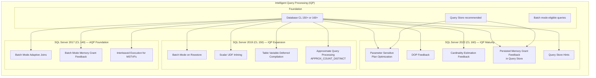
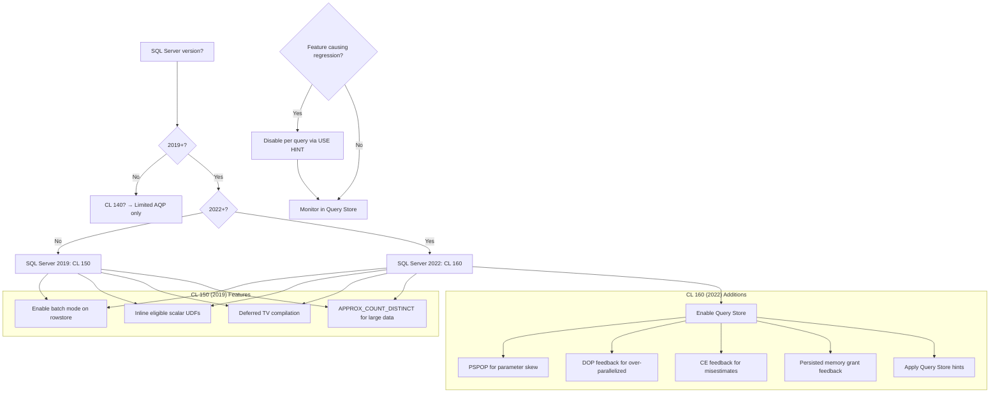

## Section 1 — Navigation

**Domain:** [[8 — Databases]] > **Group:** [[Group 13 — SQL Server Performance & Tuning]]

| Direction | Reference |
|-----------|-----------|
| Previous | [[8.369 — Adaptive Query Processing — Batch Mode]] |
| Next | [[8.371 — Batch Mode on Rowstore — IQP Feature]] |
| Up | [[Group 13 — SQL Server Performance & Tuning]] |
| Cross-Domain | [[3.015 — EF Core Logging and Interception]] |

### Where This Fits

Intelligent Query Processing (IQP) is the umbrella term for all adaptive/flexible query processing features in SQL Server 2019 (CL 150) and SQL Server 2022 (CL 160). It extends the original AQP features (adaptive joins, memory grant feedback, interleaved execution) with batch mode on rowstore, scalar UDF inlining, table variable deferred compilation, approximate query processing, DOP feedback, parameter sensitive plan optimization, cardinality estimation feedback, and persistent memory grant feedback. IQP represents the culmination of SQL Server's shift from static, estimate-based plan compilation to a dynamic, feedback-driven model.

### Prerequisites

You must understand:
- [[8.369 — Adaptive Query Processing — Batch Mode]] — The foundational AQP features from SQL Server 2017.
- [[8.371 — Batch Mode on Rowstore — IQP Feature]] — How batch mode works without columnstore.
- [[8.372 — Memory Grant Feedback — Adaptive Memory]] — Memory grant correction.
- [[8.373 — Degree of Parallelism Feedback]] — DOP adjustment.
- [[8.342 — New Cardinality Estimator — Key Differences]] — CE version changes.

---

## Section 2 — Core Mental Model



### Classification

| Property | Detail |
|----------|--------|
| **Introduced** | SQL Server 2019 (15.x), DB compatibility level 150 |
| **Expanded** | SQL Server 2022 (16.x), DB compatibility level 160 |
| **Activation** | Automatic at CL 150 / 160 — no code changes needed |
| **Foundation** | Query Store must be enabled for some 2022 features |
| **Scope** | Database-wide (all queries at the compatibility level) |

### Key Properties

1. **Batch Mode on Rowstore (2019)**: Allows batch-mode execution for queries without columnstore indexes. Automatic detection of eligible operators.
2. **Scalar UDF Inlining (2019)**: Inlines scalar UDFs into the calling query, eliminating per-row function call overhead.
3. **Table Variable Deferred Compilation (2019)**: Postpones compilation of statements referencing table variables until the actual row count is known.
4. **Approximate Query Processing (2019)**: Provides approximate aggregate functions (APPROX_COUNT_DISTINCT) for large-data estimates with sub-second latency.
5. **Parameter Sensitive Plan Optimization — PSPOP (2022)**: Caches multiple plans for the same query, keyed by parameter range, to avoid one-size-fits-all plans.
6. **DOP Feedback (2022)**: Adjusts the degree of parallelism for a query across executions based on observed CXPACKET waits.
7. **Cardinality Estimation Feedback (2022)**: Detects when the CE consistently over- or under-estimates and adjusts for subsequent executions.
8. **Persisted Memory Grant Feedback (2022)**: Saves grant feedback in Query Store, surviving plan cache evictions.
9. **Query Store Hints (2022)**: Apply query hints without modifying T-SQL source code, via Query Store.

---

## Section 3 — Deep Mechanics

### 3.1 Scalar UDF Inlining

1. **Problem**: Scalar UDFs execute once per row. Each call involves a full function-call overhead (context switch, parameter marshaling, etc.). For a 1M-row query calling a UDF, that's 1M context switches.
2. **Solution (CL 150+)**: The inliner transforms the UDF body into a relational expression that is folded into the calling query's plan as a scalar expression or an `APPLY`-style construct.
3. **Requirements**: UDF must be deterministic, not reference tables (or only reference tables as projections), not use dynamic SQL, not use `GETDATE()`-like functions, less than ~200 lines.
4. **Verification**: Check the actual execution plan — an inlined UDF appears as `Scalar UDF Inlining` in the plan XML rather than a separate `T-SQL UDF` operator.

```sql
-- Verify UDF inlining eligibility
SELECT OBJECT_NAME(object_id) AS function_name,
       is_inlineable
FROM sys.sql_modules
WHERE object_id = OBJECT_ID('dbo.MyUDF');
```

```sql
-- Example: UDF that WILL be inlined
CREATE OR ALTER FUNCTION dbo.CalculateDiscount
    (@Price DECIMAL(18,2), @Rate DECIMAL(5,4))
RETURNS DECIMAL(18,2)
AS
BEGIN
    RETURN @Price * @Rate;
END;
GO

-- Query that benefits from inlining
SELECT ProductID, Name, ListPrice,
       dbo.CalculateDiscount(ListPrice, 0.10) AS DiscountedPrice
FROM Production.Product;
```

### 3.2 Table Variable Deferred Compilation

1. **Problem**: Table variables have a fixed 1-row cardinality estimate (pre-2019) or 100-row estimate. This leads to catastrophic plan choices when the table variable actually contains millions of rows.
2. **Solution (CL 150+)**: The engine defers compilation of statements referencing table variables until the first execution. At that point, the table variable's actual row count is known and used for optimization.
3. **Mechanism**: The statement batch is compiled in two phases — the table variable is populated (or its content is known after the INSERT), then the compilation of dependent statements uses the actual cardinality.
4. **Not to be confused with**: Interleaved execution for MSTVFs — similar concept but for table variables instead of functions.

```sql
-- With deferred compilation, the join will use actual row count
DECLARE @OrderIds TABLE (OrderID INT PRIMARY KEY);

INSERT INTO @OrderIds
SELECT OrderID FROM Sales.Orders WHERE OrderDate >= '2025-01-01';
-- @OrderIds has 50,000 rows

-- This statement benefits from deferred compilation
SELECT o.OrderID, o.OrderDate, ol.Quantity
FROM Sales.Orders o
    JOIN @OrderIds oi ON o.OrderID = oi.OrderID
    JOIN Sales.OrderLines ol ON o.OrderID = ol.OrderID;
```

### 3.3 Approximate Query Processing

```sql
-- Exact COUNT DISTINCT (slow on large data)
SELECT COUNT(DISTINCT CustomerID) AS exact_count
FROM Sales.Orders;

-- Approximate COUNT DISTINCT (fast, ~2% error rate)
SELECT APPROX_COUNT_DISTINCT(CustomerID) AS approx_count
FROM Sales.Orders;
```

- Uses the HyperLogLog algorithm.
- Memory: ~2.5 KB per group, regardless of distinct count.
- Error rate: ~2% with 97% confidence.
- Suitable for dashboards, not financial reporting.

### 3.4 Parameter Sensitive Plan Optimization (PSPOP)

1. **Problem**: A query with parameters (e.g., `WHERE Status = @Status`) gets one plan. If @Status can be 'Pending' (10 rows) or 'Completed' (5M rows), one plan cannot serve both well.
2. **Solution (CL 160)**: The engine creates **plan variants** for different parameter ranges. Up to 4 variants per query.
3. **Trigger criteria**: A parameter predicate with data skew (high vs low cardinality values).
4. **Mechanism**:
   - Observed parameter values are discretized into ranges/buckets.
   - The first execution creates a plan for that specific parameter value.
   - If a significantly different parameter value is used (triggering a different cardinality class), another plan variant is created.
   - Future executions use the appropriate variant based on the parameter value.
5. **Requires Query Store**: Yes — plan variants are stored in Query Store.
6. **Monitoring**: `sys.dm_exec_query_stats` shows multiple `query_plan_hash` values for the same `query_hash`.

```sql
-- Enable PSPOP (CL 160, Query Store enabled automatically)
ALTER DATABASE CURRENT SET COMPATIBILITY_LEVEL = 160;

-- A query that benefits from PSPOP
DECLARE @Status VARCHAR(20) = 'Pending';
SELECT COUNT(*), Status
FROM Sales.Orders
WHERE Status = @Status;
```

```sql
-- Check for PSPOP plan variants
SELECT
    qt.query_sql_text,
    qp.query_plan,
    qs.query_plan_hash,
    qs.count_compiles,
    qs.avg_compile_duration,
    qs.avg_query_exec_time_ms
FROM sys.query_store_plan qp
    JOIN sys.query_store_query q ON qp.query_id = q.query_id
    JOIN sys.query_store_query_text qt ON q.query_text_id = qt.query_text_id
    JOIN sys.query_store_query_stats qs ON qp.plan_id = qs.plan_id
WHERE qp.is_psp_variant = 1
ORDER BY q.query_id, qp.plan_id;
```

### 3.5 DOP Feedback

1. **Problem**: A query runs with DOP 8 (server default) but the parallel overhead (CXPACKET waits) exceeds the benefit.
2. **Solution (CL 160)**: The engine monitors CXPACKET and CXCONSUMER waits. If parallelism is deemed harmful, DOP is reduced for the next execution.
3. **Feedback**: DOP is halved until the ideal DOP is found. The correction is persisted in Query Store.
4. **Control hints**: `OPTION (USE HINT('DISABLE_PARALLELISM_FEEDBACK'))`.

```sql
-- Monitor DOP feedback corrections
SELECT
    qt.query_sql_text,
    qp.plan_id,
    qs.last_dop,
    qs.min_dop,
    qs.max_dop,
    qs.avg_dop,
    qs.last_parallel_worker_count,
    qs.total_cpu_time_ms,
    qs.total_elapsed_time_ms
FROM sys.query_store_plan qp
    JOIN sys.query_store_query q ON qp.query_id = q.query_id
    JOIN sys.query_store_query_text qt ON q.query_text_id = qt.query_text_id
    JOIN sys.query_store_query_stats qs ON qp.plan_id = qs.plan_id
WHERE qp.is_dop_feedback_corrected = 1;
```

### 3.6 Cardinality Estimation Feedback

1. **Problem**: The CE consistently over- or under-estimates for a specific query pattern.
2. **Solution (CL 160)**: The engine tracks the ratio of estimated rows to actual rows across executions. If the error exceeds a threshold (10x), it applies a corrective action (e.g., switching from CE150 to CE70 assumptions for that query, or applying a hint).
3. **Correction types**:
   - **CE feedback**: Adjusts assumptions about join containment, correlation, etc.
   - **Hint feedback**: Applies `USE HINT` implicitly (e.g., `ASSUME_JOIN_PREDICATE_INDEPENDENCE`, `ASSUME_MIN_SELECTIVITY_FOR_FILTER_ESTIMATES`).
4. **Persistence**: In Query Store (CL 160).

```sql
-- Find queries with CE feedback corrections
SELECT
    qt.query_sql_text,
    qp.plan_id,
    qp.last_compile_start_time,
    qp.is_ce_feedback_corrected,
    qs.last_estimated_rows,
    qs.last_actual_rows,
    qs.avg_estimated_rows,
    qs.avg_actual_rows
FROM sys.query_store_plan qp
    JOIN sys.query_store_query q ON qp.query_id = q.query_id
    JOIN sys.query_store_query_text qt ON q.query_text_id = qt.query_text_id
    JOIN sys.query_store_query_stats qs ON qp.plan_id = qs.plan_id
WHERE qp.is_ce_feedback_corrected = 1;
```

### 3.7 Persisted Memory Grant Feedback

- Pre-2022: Memory grant feedback resets when the plan is evicted from the cache.
- 2022+: The feedback is persisted in Query Store. `sys.query_store_plan` includes `serial_desired_memory`, `serial_desired_memory`, and feedback columns.
- Survives: Server restarts, memory pressure, plan cache clearing.

```sql
-- Persisted memory grant feedback in Query Store
SELECT
    qt.query_sql_text,
    qp.plan_id,
    qp.serial_desired_memory,
    qp.serial_required_memory,
    qp.is_memory_grant_feedback_corrected,
    qp.memory_grant_feedback_iterations
FROM sys.query_store_plan qp
    JOIN sys.query_store_query q ON qp.query_id = q.query_id
    JOIN sys.query_store_query_text qt ON q.query_text_id = qt.query_text_id
WHERE qp.is_memory_grant_feedback_corrected = 1;
```

### 3.8 Query Store Hints (SQL Server 2022)

Apply query hints without modifying application code:

```sql
-- Create a hint in Query Store for a specific query
EXEC sys.sp_query_store_set_hints
    @query_id = 12,
    @query_hints = N'OPTION (MAXDOP 4, RECOMPILE)';

-- Apply multiple hints
EXEC sys.sp_query_store_set_hints
    @query_id = 15,
    @query_hints = N'OPTION (USE HINT(''DISABLE_BATCH_MODE_ADAPTIVE_JOINS''), MAXDOP 2)';
```

---

## Section 4 — Production Patterns

### 4.1 Enabling IQP (Full Feature Set)

```sql
-- Step 1: Set compatibility level
ALTER DATABASE CURRENT SET COMPATIBILITY_LEVEL = 160;

-- Step 2: Enable Query Store (required for PSPOP, DOP feedback, persisted MGF)
ALTER DATABASE CURRENT SET QUERY_STORE = ON;
ALTER DATABASE CURRENT SET QUERY_STORE (
    OPERATION_MODE = READ_WRITE,
    DATA_FLUSH_INTERVAL_SECONDS = 60,
    INTERVAL_LENGTH_MINUTES = 10,
    MAX_STORAGE_SIZE_MB = 1000,
    QUERY_CAPTURE_MODE = AUTO,
    SIZE_BASED_CLEANUP_MODE = AUTO
);

-- Step 3: Enable batch mode for rowstore (already on at CL 150+)
ALTER DATABASE SCOPED CONFIGURATION SET BATCH_MODE_ON_ROWSTORE = ON;

-- Step 4: Enable PSPOP
ALTER DATABASE CURRENT SET COMPATIBILITY_LEVEL = 160;
-- PSPOP is automatic at CL 160
```

### 4.2 Verifying Which IQP Features Are Active

```sql
-- Check database scoped configuration
SELECT configuration_id, name, value, value_for_secondary
FROM sys.database_scoped_configurations
WHERE name IN (
    'BATCH_MODE_ON_ROWSTORE',
    'DEFERRED_COMPILATION_TV',
    'SCALAR_UDF_INLINING',
    'PARAMETER_SENSITIVE_PLAN_OPTIMIZATION'
);
```

### 4.3 Identifying Queries Using IQP Features

```sql
-- Batch mode on rowstore
WITH XMLNAMESPACES ('http://schemas.microsoft.com/sqlserver/2004/07/showplan' AS sp)
SELECT COUNT(*) AS batch_mode_queries
FROM sys.dm_exec_query_stats qs
    CROSS APPLY sys.dm_exec_query_plan(qs.plan_handle) qp
WHERE qp.query_plan.exist(
    '//sp:RelOp[contains(@ExecutionMode, "Batch")]') = 1;

-- Scalar UDF inlining
SELECT
    OBJECT_NAME(object_id) AS function_name,
    is_inlineable,
    uses_native_compilation
FROM sys.sql_modules
WHERE is_inlineable = 1;

-- Table variable deferred compilation
SELECT *
FROM sys.dm_exec_query_stats qs
    CROSS APPLY sys.dm_exec_sql_text(qs.sql_handle)
WHERE text LIKE '%DECLARE @% TABLE%';

-- DOP feedback corrections
SELECT qt.query_sql_text, qp.plan_id, qp.is_dop_feedback_corrected
FROM sys.query_store_plan qp
    JOIN sys.query_store_query q ON qp.query_id = q.query_id
    JOIN sys.query_store_query_text qt ON q.query_text_id = qt.query_text_id
WHERE qp.is_dop_feedback_corrected = 1;
```

### 4.4 IQP Feature Discovery Script

```sql
-- One script to check all IQP capabilities
SELECT
    SERVERPROPERTY('ProductVersion') AS sql_version,
    SERVERPROPERTY('ProductLevel') AS service_pack,
    SERVERPROPERTY('Edition') AS edition,
    DATABASEPROPERTYEX(DB_NAME(), 'Version') AS database_compatibility,
    CASE
        WHEN compatibility_level >= 160 THEN 'CL 160 – Full IQP + PSPOP + DOP Feedback + CE Feedback + Persisted MGF'
        WHEN compatibility_level >= 150 THEN 'CL 150 – IQP (batch rowstore, UDF inlining, deferred TV, approx)'
        WHEN compatibility_level >= 140 THEN 'CL 140 – AQP (adaptive joins, MGF, interleaved)'
        ELSE 'Pre-2017 – Basic only'
    END AS iqp_capabilities,
    CASE
        WHEN is_query_store_on = 1 THEN 'Enabled'
        ELSE 'Disabled'
    END AS query_store_status,
    CASE
        WHEN value = 1 THEN 'ON'
        ELSE 'OFF'
    END AS batch_mode_on_rowstore
FROM sys.databases
    CROSS APPLY sys.database_scoped_configurations
WHERE name = 'BATCH_MODE_ON_ROWSTORE'
  AND database_id = DB_ID();
```

### 4.5 EF Core Considerations

```csharp
public class IqpAwareDbContext : DbContext
{
    protected override void OnConfiguring(DbContextOptionsBuilder optionsBuilder)
    {
        // IQP is server-side, not application-configurable.
        // However, use raw SQL for UDF-heavy queries when inlining is desired.
    }

    // For COUNT DISTINCT, consider APPROX_COUNT_DISTINCT in raw SQL
    public async Task<long> GetApproximateCustomerCountAsync()
    {
        return await Database.SqlQueryRaw<long>(
            "SELECT APPROX_COUNT_DISTINCT(CustomerID) FROM Sales.Orders")
            .FirstAsync();
    }

    // For queries with table variables, ensure compatibility level 150+
    public async Task<List<Order>> GetOrdersBatchAsync(List<int> orderIds)
    {
        // EF Core translates Contains() to IN clause, which works with IQP
        return await Orders.Where(o => orderIds.Contains(o.OrderID))
            .ToListAsync();
    }
}
```

---

## Section 5 — Gotchas

### Gotcha 1: Scalar UDF Inlining Has Strict Eligibility Rules

| Pitfall | Symptom | Fix | Cost |
|---|---|---|---|
| Assuming all scalar UDFs are inlined | Complex UDFs still show per-row operator overhead | Check `is_inlineable = 1` in `sys.sql_modules`. UDFs with table access, dynamic SQL, GETDATE(), or >200 lines are NOT inlined | High — silent performance miss |

A UDF that references tables, uses `GETDATE()`, or is too complex will silently fall back to per-row execution with no warning.

### Gotcha 2: PSPOP Requires Query Store and May Not Activate

| Pitfall | Symptom | Fix | Cost |
|---|---|---|---|
| PSPOP doesn't create plan variants | PSPOP not helping a known skewed parameter | Ensure Query Store is ON and the query is captured. PSPOP requires parameterized queries and observable data skew. Use `sys.query_store_plan.is_psp_variant` to verify activation | Medium — feature dependency |

### Gotcha 3: Approximate Functions Are NOT for Financial/Exact Reporting

| Pitfall | Symptom | Fix | Cost |
|---|---|---|---|
| Using APPROX_COUNT_DISTINCT for financial counts | Counts off by 1-3% | Only use APPROX_COUNT_DISTINCT for dashboards, trend analysis, and non-financial metrics where 97% accuracy is acceptable. For exact counts, use COUNT(DISTINCT) | Low — usage discipline |

### Gotcha 4: IQP Features Are Not Explicitly Configurable Per-Query (Except via Hints)

| Pitfall | Symptom | Fix | Cost |
|---|---|---|---|
| Developer wants to enable IQP features for one query only | Cannot selectively enable IQP at statement level | IQP features are database-wide at CL 150/160. Use `USE HINT` to disable specific features per query. There is no per-query ENABLE hint — IQP is opt-out, not opt-in | Low — documentation gap |

### Gotcha 5: DOP Feedback May Reduce Parallelism for Queries That Need It

| Pitfall | Symptom | Fix | Cost |
|---|---|---|---|
| DOP feedback reduces DOP from 8 to 2 based on one slow execution | Query becomes slower on different data sizes | DOP feedback monitors CXPACKET waits. If the first execution had high CXPACKET (e.g., from blocking), feedback may incorrectly reduce DOP. Disable with `OPTION (USE HINT('DISABLE_PARALLELISM_FEEDBACK'))` | Medium — need to validate |

### Gotcha 6: Table Variable Deferred Compilation Is Not Interleaved Execution

| Pitfall | Symptom | Fix | Cost |
|---|---|---|---|
| Developer expects table variable compilation to pause mid-batch like interleaved execution | Confusion about when the actual cardinality is known | Deferred compilation defers the compilation of dependent statements until the table variable is populated. It does NOT pause mid-batch to re-optimize. The statement is compiled once, after the table variable has rows | Low — semantic confusion |

### Gotcha 7: Persisted Memory Grant Feedback Depends on Query Store

| Pitfall | Symptom | Fix | Cost |
|---|---|---|---|
| Upgraded to CL 160 but memory grant feedback still resets | Feedback not surviving plan evictions | Query Store must be enabled for persistence. If QS is OFF, MGF behaves like pre-2022 (plan-cache-only) | Medium — configuration gap |

---

## Section 6 — Performance Implications

### 6.1 Feature Performance Impact Summary

| Feature | Typical Improvement | Workload Type | Version |
|---|---|---|---|
| Batch Mode on Rowstore | 2–4x CPU reduction | Analytical, reporting | 2019+ |
| Scalar UDF Inlining | 10–1000x UDF call overhead elimination | Any with scalar UDFs | 2019+ |
| Table Variable Deferred Compilation | 2–10x for table variable joins | Stored procs with TV usage | 2019+ |
| APPROX_COUNT_DISTINCT | 100–1000x vs exact | Dashboard, large fact tables | 2019+ |
| PSPOP | 2–20x for skewed parameters | Parameterized OLTP/Reporting | 2022+ |
| DOP Feedback | 1.5–3x for over-parallelized queries | Mixed OLTP/batch | 2022+ |
| CE Feedback | 1.5–10x for CE misestimates | Any with CE mismatch | 2022+ |
| Persisted Memory Grant Feedback | 25–75% memory reduction | Any with batch mode | 2022+ |

### 6.2 Before/After: Scalar UDF Inlining

**Before (CL 130, no inlining):**
```
SQL Server Execution Times:
   CPU time = 28,450 ms, elapsed time = 29,120 ms.
```
Plan: 1M calls to T-SQL UDF operator (per-row execution)

**After (CL 150, inlined):**
```
SQL Server Execution Times:
   CPU time = 1,230 ms, elapsed time = 1,180 ms.
```
Plan: UDF logic embedded as a computed column expression in the plan.

**Improvement: ~96% reduction in CPU and elapsed time.**

### 6.3 Before/After: APPROX_COUNT_DISTINCT

**Before (COUNT DISTINCT on 100M rows):**
```
CPU: 12,450ms, Elapsed: 14,200ms
Memory grant: 450 MB (hash table for distinct aggregation)
```

**After (APPROX_COUNT_DISTINCT):**
```
CPU: 340ms, Elapsed: 280ms
Memory grant: 2.5 KB (HyperLogLog)
Accuracy: 99.3% (0.7% error vs exact count of 4,892,351)
```

**Improvement: ~97% reduction in CPU, ~98% reduction in memory grant.**

### 6.4 Before/After: PSPOP

**Before (no PSPOP — one plan for all statuses):**
```
@Status = 'Pending' (15 rows): Logical reads 12,800 (wrong plan chosen)
@Status = 'Completed' (5M rows): Logical reads 98,000
```

**After (PSPOP — two plan variants):**
```
@Status = 'Pending' (15 rows): Logical reads 45 (index seek, Nested Loops)
@Status = 'Completed' (5M rows): Logical reads 78,000 (hash join, scan)
```

**Improvement: 99.6% reduction for 'Pending', 20% reduction for 'Completed'.**

### 6.5 BenchmarkDotNet: IQP Feature Comparison

```csharp
[SimpleJob(launchCount: 1, warmupCount: 2, targetCount: 5)]
public class IqpBenchmarks
{
    private const string ConnStr = "Server=.;Database=AdventureWorks;Trusted_Connection=True;";

    [Benchmark(Baseline = true)]
    public async Task<long> ApproxCountDistinct()
    {
        await using var conn = new SqlConnection(ConnStr);
        await conn.OpenAsync();
        var cmd = new SqlCommand(@"
            SELECT APPROX_COUNT_DISTINCT(CustomerID)
            FROM Sales.Orders", conn);
        return (long)await cmd.ExecuteScalarAsync();
    }

    [Benchmark]
    public async Task<long> ExactCountDistinct()
    {
        await using var conn = new SqlConnection(ConnStr);
        await conn.OpenAsync();
        var cmd = new SqlCommand(@"
            SELECT COUNT(DISTINCT CustomerID)
            FROM Sales.Orders", conn);
        return (long)await cmd.ExecuteScalarAsync();
    }
}
```

---

## Section 7 — Interview Arsenal

### 7.1 Questions and Spoken Answers

**Q1: What is Intelligent Query Processing and how does it differ from Adaptive Query Processing?**

*Junior:* It's a set of features that make queries run better automatically.

*Senior:* IQP is the umbrella term for all adaptive query processing features starting from SQL Server 2019 (CL 150). AQP (SQL Server 2017) was the foundation — adaptive joins, memory grant feedback, interleaved execution. IQP expands this with batch mode on rowstore (extending AQP features to non-columnstore queries), scalar UDF inlining (eliminating per-row function overhead), table variable deferred compilation (fixing the 1-row estimate), approximate query processing, and in SQL Server 2022, adds PSPOP, DOP feedback, CE feedback, persisted memory grant feedback, and Query Store hints. The key difference is that IQP is an *umbrella* term and AQP is the subset from 2017.

**Q2: How does scalar UDF inlining work and what are the requirements?**

*Senior:* The UDF body is transformed from a procedural T-SQL function into a relational expression that's folded into the calling query's execution plan. Requirements: deterministic, no dynamic SQL, no references to tables (or only safe table references), no runtime-value functions like GETDATE(), and the function body must be under ~200 logical lines. To verify, check `sys.sql_modules.is_inlineable = 1`.

**Q3: What problem does Parameter Sensitive Plan Optimization solve?**

*Senior:* Queries with skewed parameters get one plan regardless of the parameter value. A query like `WHERE Status = @Status` compiles one plan — efficient for 'Completed' (5M rows) but terrible for 'Pending' (15 rows). PSPOP creates up to 4 plan variants for different parameter ranges, stored in Query Store. The first execution creates a plan; if a different parameter value triggers a significantly different cardinality class, a new variant is created. Future executions select the correct variant.

**Q4: What is DOP feedback and how does it work?**

*Senior:* DOP feedback monitors CXPACKET and CXCONSUMER waits. If the engine detects that parallelism overhead exceeds the benefit, it reduces the DOP for the next execution. The DOP is halved iteratively until the ideal DOP is found. The correction persists in Query Store (CL 160+). You can disable it with `OPTION (USE HINT('DISABLE_PARALLELISM_FEEDBACK'))`.

**Q5: How does table variable deferred compilation differ from interleaved execution?**

*Senior:* Interleaved execution (for MSTVFs) pauses compilation *mid-batch*, executes the function, and re-optimizes the remainder using actual cardinality. It works during the *first* compilation. Table variable deferred compilation defers compilation of dependent statements until *after* the table variable is populated. The statement is compiled once with the actual row count known. The key difference: interleaved execution re-optimizes mid-stream; deferred compilation compiles once, later, with real data.

**Q6: What IQP features require Query Store?**

*Senior:* In SQL Server 2022: PSPOP (plan variants), persisted memory grant feedback, CE feedback corrections, and DOP feedback all require Query Store. For 2019 features (batch mode on rowstore, UDF inlining, table variable deferred compilation), Query Store is optional but recommended for regression monitoring.

**Q7: How do you disable IQP features for a specific query?**

*Senior:* Use `OPTION (USE HINT(...))` hints. Available hints include: `DISABLE_BATCH_MODE_ADAPTIVE_JOINS`, `DISABLE_BATCH_MODE_MEMORY_GRANT_FEEDBACK`, `DISABLE_PARALLELISM_FEEDBACK`, `DISABLE_INTERLEAVED_EXECUTION_TVF`. Note that IQP is *opt-out* — features are on by default at the appropriate compatibility level.

**Q8: What is the error rate of APPROX_COUNT_DISTINCT and when should you use it?**

*Senior:* APPROX_COUNT_DISTINCT uses the HyperLogLog algorithm with ~2% error at 97% confidence. It consumes ~2.5 KB per group regardless of distinct count. Use it for dashboards, trend analysis, cardinality estimates, and non-financial metrics where exact precision isn't required. For financial reporting, audit, or any exact counting, use COUNT(DISTINCT).

### 7.2 Comparison Table

| Feature | Version | CL Required | Query Store Required? | Opt-Out Hint |
|---|---|---|---|---|
| Batch Mode Adaptive Joins | 2017 | 140 | No | `DISABLE_BATCH_MODE_ADAPTIVE_JOINS` |
| Memory Grant Feedback | 2017 | 140 | No (optional) | `DISABLE_BATCH_MODE_MEMORY_GRANT_FEEDBACK` |
| Interleaved Execution | 2017 | 140 | No | `DISABLE_INTERLEAVED_EXECUTION_TVF` |
| Batch Mode on Rowstore | 2019 | 150 | No | `DISABLE_BATCH_MODE_ON_ROWSTORE` |
| Scalar UDF Inlining | 2019 | 150 | No | `DISABLE_SCALAR_UDF_INLINING` |
| Table Variable Deferred Compilation | 2019 | 150 | No | — |
| APPROX_COUNT_DISTINCT | 2019 | 150 | No | — |
| PSPOP | 2022 | 160 | Yes | `DISABLE_PARAMETER_SENSITIVE_PLAN_OPTIMIZATION` |
| DOP Feedback | 2022 | 160 | Yes | `DISABLE_PARALLELISM_FEEDBACK` |
| CE Feedback | 2022 | 160 | Yes | — |
| Persisted Memory Grant Feedback | 2022 | 160 | Yes | — |
| Query Store Hints | 2022 | 160 | Yes | — |

---

## Section 8 — Decision Framework

### 8.1 IQP Feature Selection Flowchart



### 8.2 Diagnostic Checklist

- [ ] Verify SQL Server version (2019+ for IQP, 2022+ for full IQP)
- [ ] Set database compatibility level to 150 or 160
- [ ] Enable Query Store (160 features require it)
- [ ] Check `sys.sql_modules.is_inlineable` for all scalar UDFs
- [ ] Identify table variable usage — confirm deferred compilation is active
- [ ] Identify parameter-skewed queries — potential PSPOP candidates
- [ ] Check for CXPACKET-dominated wait stats — DOP feedback candidates
- [ ] Monitor `sys.query_store_plan` for feedback corrections
- [ ] Replace COUNT(DISTINCT) with APPROX_COUNT_DISTINCT where appropriate
- [ ] Test CL 150/160 with Query Store to catch regressions
- [ ] Document USE HINT overrides for queries that regress

### 8.3 Tradeoffs

| Decision | Pros | Cons |
|---|---|---|
| Upgrade to CL 150 | Free performance, UDF inlining, deferred TV | New CE may cause plan changes (mitigate with QS plan forcing) |
| Upgrade to CL 160 | PSPOP, DOP feedback, CE feedback, persisted MGF | Requires Query Store (~5% write overhead) |
| Enable Query Store | All 2022 IQP features, regressions detection | 3–5% workload overhead, storage consumption |
| Disable UDF inlining (global) | Prevents inlining of problematic UDFs | Loses benefit for well-behaved UDFs |
| Keep CL 130 | Stable plans, no surprises | No IQP benefits, missing 50%+ potential performance |

### 8.4 Scale Thresholds

| IQP Feature | Best For | When to Disable |
|---|---|---|
| UDF Inlining | UDFs called 100K+ times per query | UDFs with side effects, table access, or >200 lines |
| Table Variable Deferred Compilation | TV with >1000 rows | TV with 0–1 rows (tiny overhead for no benefit) |
| APPROX_COUNT_DISTINCT | >1M distinct values, >100M rows | When exact count is required |
| PSPOP | Queries with 10x+ cardinality variance by parameter | Queries with uniform parameter distribution |
| DOP Feedback | Queries with high CXPACKET (>30% of wait) | Queries where max parallelism is always desired |
| CE Feedback | Queries with persistent 5x+ estimation error | Queries with stable, accurate estimates |

---

## Section 9 — Self-Check

### 9.1 Conceptual Questions (10)

**Q1:** What compatibility level introduced Intelligent Query Processing?

<details>
Database compatibility level 150, introduced with SQL Server 2019. Level 160 (2022) adds additional features under the IQP umbrella.
</details>

**Q2:** List five IQP features available in SQL Server 2019.

<details>
(1) Batch mode on rowstore, (2) scalar UDF inlining, (3) table variable deferred compilation, (4) APPROX_COUNT_DISTINCT, (5) all AQP features from CL 140 (adaptive joins, memory grant feedback, interleaved execution).
</details>

**Q3:** What three new IQP features were added in SQL Server 2022?

<details>
(1) Parameter Sensitive Plan Optimization (PSPOP), (2) DOP feedback, (3) Cardinality Estimation feedback. Also: persisted memory grant feedback and Query Store hints.
</details>

**Q4:** How do you check if a scalar UDF is eligible for inlining?

<details>
Query `sys.sql_modules.is_inlineable = 1` for the function. Also verify the actual execution plan — if the UDF appears as a separate operator (T-SQL UDF), it was not inlined.
</details>

**Q5:** What algorithm does APPROX_COUNT_DISTINCT use?

<details>
HyperLogLog. It provides approximately 2% error at 97% confidence, using ~2.5 KB of memory per group regardless of the number of distinct values.
</details>

**Q6:** What feature does PSPOP require besides CL 160?

<details>
Query Store must be enabled. Plan variants are stored in `sys.query_store_plan` with `is_psp_variant = 1`.
</details>

**Q7:** How does DOP feedback determine when to reduce parallelism?

<details>
It monitors CXPACKET and CXCONSUMER waits. If the engine determines that parallelism overhead exceeds the benefit, it reduces the DOP (halved per iteration) for the next execution. The correction is persisted in Query Store.
</details>

**Q8:** Can IQP features be enabled per-query?

<details>
IQP features are database-wide at their respective compatibility levels. They can be disabled per-query using `OPTION (USE HINT(...))` hints (e.g., `DISABLE_BATCH_MODE_ADAPTIVE_JOINS`). There is no per-query ENABLE hint — IQP is opt-out.
</details>

**Q9:** What happens if Query Store is not enabled in SQL Server 2022?

<details>
PSPOP, DOP feedback, CE feedback, persisted memory grant feedback, and Query Store hints will not work. Other IQP features (batch mode on rowstore, UDF inlining, table variable deferred compilation, APPROX_COUNT_DISTINCT) still function.
</details>

**Q10:** What column in sys.query_store_plan indicates a PSPOP variant?

<details>
`is_psp_variant = 1` indicates the plan is a parameter sensitive plan variant. Multiple variants may exist for the same query_id.
</details>

### 9.2 Challenges (5)

**Challenge 1:** Write a script that identifies all scalar UDFs in the database, checks if they're inlineable, and reports the reason if not.

<details>
```sql
SELECT
    OBJECT_NAME(m.object_id) AS function_name,
    m.is_inlineable,
    m.definition,
    CASE
        WHEN m.uses_database_collation = 1 THEN 'Uses database collation'
        WHEN m.is_schema_bound = 0 THEN 'Not schema-bound'
        WHEN EXISTS (SELECT 1 FROM sys.sql_expression_dependencies d
                     WHERE d.referencing_id = m.object_id
                       AND d.referenced_entity_name IS NOT NULL
                       AND d.is_updated = 0
                       AND d.is_select_all = 0)
            THEN 'References tables with complex expressions'
        WHEN m.definition LIKE '%GETDATE%' THEN 'Uses GETDATE()'
        WHEN m.definition LIKE '%NEWID%' THEN 'Uses NEWID()'
        WHEN m.definition LIKE '%@@%' THEN 'Uses system function'
        WHEN m.definition LIKE '%EXEC%' OR m.definition LIKE '%sp_executesql%'
            THEN 'Uses dynamic SQL'
        ELSE 'Unknown (check documentation)'
    END AS non_inlineable_reason
FROM sys.sql_modules m
WHERE m.object_id IN (
    SELECT object_id FROM sys.objects
    WHERE type IN ('FN', 'FS', 'FT')  -- scalar functions
)
ORDER BY m.is_inlineable DESC;
```
</details>

**Challenge 2:** Create a query that demonstrates the benefit of APPROX_COUNT_DISTINCT vs COUNT(DISTINCT) on a large table.

<details>
```sql
-- Enable IO and Time statistics
SET STATISTICS IO ON;
SET STATISTICS TIME ON;

-- Exact count
PRINT '=== EXACT COUNT DISTINCT ===';
SELECT COUNT(DISTINCT ProductID) AS exact_count
FROM Sales.SalesOrderDetail;

-- Approximate count
PRINT '=== APPROXIMATE COUNT DISTINCT ===';
SELECT APPROX_COUNT_DISTINCT(ProductID) AS approx_count
FROM Sales.SalesOrderDetail;

SET STATISTICS TIME OFF;
SET STATISTICS IO OFF;

-- Compare results
SELECT
    (SELECT COUNT(DISTINCT ProductID) FROM Sales.SalesOrderDetail) AS exact,
    (SELECT APPROX_COUNT_DISTINCT(ProductID) FROM Sales.SalesOrderDetail) AS approx,
    ABS(
        (SELECT COUNT(DISTINCT ProductID) FROM Sales.SalesOrderDetail) -
        (SELECT APPROX_COUNT_DISTINCT(ProductID) FROM Sales.SalesOrderDetail)
    ) * 100.0 /
    NULLIF((SELECT COUNT(DISTINCT ProductID) FROM Sales.SalesOrderDetail), 0)
    AS error_pct;
```
</details>

**Challenge 3:** Write a query that identifies parameter sensitive queries (those with high cardinality variance) that would benefit from PSPOP.

<details>
```sql
-- Identify queries with parameterized predicates having high cardinality variance
SELECT TOP 10
    qt.query_sql_text,
    q.query_id,
    MIN(qs.avg_rows) AS min_avg_rows,
    MAX(qs.avg_rows) AS max_avg_rows,
    AVG(qs.avg_rows) AS mean_rows,
    CASE
        WHEN MIN(qs.avg_rows) > 0
        THEN MAX(qs.avg_rows) * 1.0 / MIN(qs.avg_rows)
        ELSE 0
    END AS cardinality_variance_ratio,
    COUNT(DISTINCT qp.plan_id) AS plan_count,
    SUM(qs.count_executions) AS total_executions
FROM sys.query_store_query q
    JOIN sys.query_store_plan qp ON q.query_id = qp.query_id
    JOIN sys.query_store_query_stats qs ON qp.plan_id = qs.plan_id
    JOIN sys.query_store_query_text qt ON q.query_text_id = qt.query_text_id
GROUP BY qt.query_sql_text, q.query_id
HAVING MAX(qs.avg_rows) > MIN(qs.avg_rows) * 10  -- 10x variance
   AND MIN(qs.avg_rows) > 0
ORDER BY cardinality_variance_ratio DESC;
```
</details>

**Challenge 4:** Write a stored procedure that uses Query Store hints to force MAXDOP 2 for a specific query without modifying the application code.

<details>
```sql
-- Step 1: Find the query_id in Query Store
SELECT q.query_id, qt.query_sql_text, qp.plan_id
FROM sys.query_store_query q
    JOIN sys.query_store_query_text qt ON q.query_text_id = qt.query_text_id
    JOIN sys.query_store_plan qp ON q.query_id = qp.query_id
WHERE qt.query_sql_text LIKE '%SELECT COUNT(*) FROM Sales.Orders WHERE Status = @Status%';

-- Step 2: Apply Query Store hint to force MAXDOP 2
EXEC sys.sp_query_store_set_hints
    @query_id = 42,  -- Replace with actual query_id
    @query_hints = N'OPTION (MAXDOP 2, RECOMPILE)';

-- Step 3: Verify the hint was applied
SELECT
    q.query_id,
    qt.query_sql_text,
    qh.hint_id,
    qh.hint_text,
    qh.is_forced_plan
FROM sys.query_store_query q
    JOIN sys.query_store_query_text qt ON q.query_text_id = qt.query_text_id
    LEFT JOIN sys.query_store_query_hints qh ON q.query_id = qh.query_id
WHERE q.query_id = 42;

-- Step 4: Remove the hint if needed
-- EXEC sys.sp_query_store_clear_hints @query_id = 42;
```
</details>

**Challenge 5:** Write a query that monitors the effectiveness of IQP feedback mechanisms (memory grant, DOP, CE) using Query Store DMVs.

<details>
```sql
-- Comprehensive IQP feedback monitoring
SELECT
    qt.query_sql_text,
    q.query_id,
    qp.plan_id,

    -- Memory grant feedback
    qp.is_memory_grant_feedback_corrected,
    qp.memory_grant_feedback_iterations,
    qp.serial_desired_memory,
    qp.serial_required_memory,
    (qp.serial_desired_memory - qp.serial_required_memory) AS memory_savings_kb,

    -- DOP feedback
    qp.is_dop_feedback_corrected,
    qp.last_compile_dop,
    qp.last_execution_dop,

    -- CE feedback
    qp.is_ce_feedback_corrected,

    -- PSPOP
    qp.is_psp_variant,

    -- Performance
    qs.avg_cpu_time_ms,
    qs.avg_logical_io_kb,
    qs.avg_query_execution_time_ms,
    qs.count_executions,
    qs.last_execution_time
FROM sys.query_store_plan qp
    JOIN sys.query_store_query q ON qp.query_id = q.query_id
    JOIN sys.query_store_query_text qt ON q.query_text_id = qt.query_text_id
    JOIN sys.query_store_query_stats qs ON qp.plan_id = qs.plan_id
WHERE
    -- At least one feedback mechanism has been applied
    qp.is_memory_grant_feedback_corrected = 1
    OR qp.is_dop_feedback_corrected = 1
    OR qp.is_ce_feedback_corrected = 1
    OR qp.is_psp_variant = 1
ORDER BY
    CASE
        WHEN qp.is_memory_grant_feedback_corrected = 1 THEN 1
        WHEN qp.is_dop_feedback_corrected = 1 THEN 2
        WHEN qp.is_ce_feedback_corrected = 1 THEN 3
        WHEN qp.is_psp_variant = 1 THEN 4
    END,
    qs.last_execution_time DESC;
```
</details>

---
