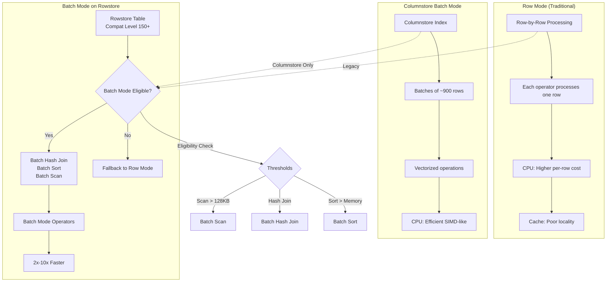
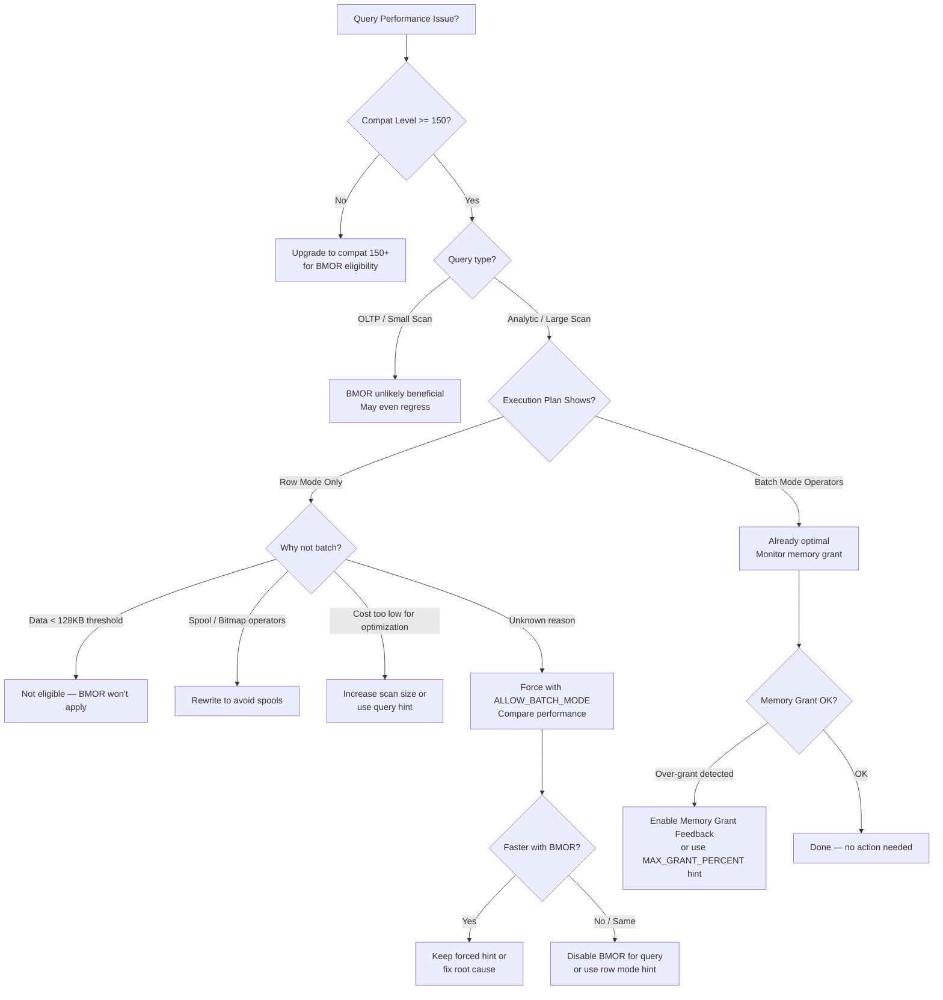

# 8.371 Batch Mode on Rowstore — IQP Feature

## Section 1 — Navigation

| Breadcrumb | Link |
|---|---|
| **Domain 8 Home** | [[8 — Databases]] |
| **Group Home** | [[Group 13 — SQL Server Performance & Tuning]] |
| **Prev: IQP Overview** | [[8.370 Intelligent Query Processing — SQL Server 2019+]] |
| **Next: Memory Grant Feedback** | [[8.372 Memory Grant Feedback — Adaptive Memory]] |
| **Prerequisite 1** | [[8.338 Statistics Objects — Creation and Maintenance]] |
| **Prerequisite 2** | [[8.341 Cardinality Estimation — CE70 vs CE120 vs CE150]] |
| **Prerequisite 3** | [[8.343 Execution Plans — Reading Graphical Plans]] |
| **Prerequisite 4** | [[8.347 Ad Hoc Workloads — Plan Cache Bloat]] |
| **Cross-Domain** | [[8.365 Implicit Conversions in Execution Plans]] |

### Where This Fits

Batch Mode on Rowstore (BMOR) is an Intelligent Query Processing (IQP) feature introduced in SQL Server 2019 (compatibility level 150). Historically, batch-mode execution was exclusive to columnstore indexes. BMOR extends batch processing to rowstore queries that meet specific thresholds — large scan operations, hash joins, and sort operators. It is part of the Adaptive Query Processing family and is enabled automatically under database compatibility 150+.

**Why it matters:** Batch mode processes rows in "batches" (~900 rows at a time) rather than one row at a time (row mode). This reduces CPU cycles per row and improves cache locality. For qualifying queries, BMOR can deliver 2x–10x performance improvements without any code changes.

---

## Section 2 — Core Mental Model



### Classification

| Attribute | Value |
|---|---|
| **Feature Area** | Intelligent Query Processing (IQP) |
| **Applies To** | Rowstore tables (heap/B-tree) |
| **SQL Server Version** | 2019+ |
| **Compatibility Level** | 150+ |
| **Default Enabled** | Yes (under compat 150) |
| **Requires** | No index changes, no query hints |
| **Editions** | Enterprise, Standard (2019+), Azure SQL DB |

### Key Properties

| Property | Detail |
|---|---|
| **Batch Size** | ~900 rows per batch (fixed, not configurable) |
| **Operator Types** | Batch Hash Join, Batch Sort, Batch Scan, Batch Window Aggregate |
| **Eligibility** | Query must reference a table with at least 128KB of data accessed; query must use hash join or sort |
| **Memory Grant Impact** | Batch mode may request larger grants than row mode |
| **Parallelism** | Works with parallel plans; batch-mode operators can exchange batches between threads |
| **Plan Display** | "Batch Mode" label on operators in actual execution plans |
| **Spool Operators** | Table spools remain in row mode (not batch eligible) |
| **Diagnostics** | `sys.dm_exec_query_stats.last_query_feedback` columns; `actual_time_statistics` in live query stats |

### Mental Model Analogy

Row mode = processing an assembly line one item at a time. Batch mode = filling a bin with 900 items, processing them all at once with a single instruction. The fixed batch size (~900) matches cache-line and SIMD register widths for optimal CPU efficiency.

---

## Section 3 — Deep Mechanics

### 3.1 How Batch Mode on Rowstore Works (Step-by-Step)

**Step 1 — Query Compilation (Compat 150+):**
When a query is compiled under database compatibility level 150 or higher, the optimizer considers batch-mode execution plans for rowstore tables. This is not a separate optimization pass; rather, the cost model includes batch-mode operators and their reduced CPU costs.

```sql
SELECT compatibility_level
FROM sys.databases
WHERE name = 'YourDatabase';
-- Must be >= 150 for BMOR
```

**Step 2 — Eligibility Determination (Cost-Based):**
The optimizer evaluates (a) whether the query accesses enough data (typically >128KB of pages), (b) whether hash join or sort operators are cost-effective in batch mode, and (c) whether the query is for OLAP/analytic workloads (large scans, aggregations, joins).

**Step 3 — Batch Mode Operator Selection:**
If eligible, the optimizer may choose:
- **Batch Hash Join** — Build and probe phases operate on batches
- **Batch Sort** — Sort input is processed in batches
- **Batch Scan** — Table/index scan produces batches directly
- **Batch Window Aggregate** — Windowing functions (ROW_NUMBER, SUM OVER, etc.)

**Step 4 — Execution-Time Batch Processing:**
During execution, operators process rows in fixed-size batches. Each batch consists of up to 900 rows stored in a columnar format within memory. The batch mode iterator processes all rows in the batch with a single function call.

**Step 5 — Output:**
Final results are materialized row-by-row for client consumption, but the internal processing achieves CPU efficiency gains.

### 3.2 Execution Plan Analysis

```sql
-- Enable actual execution plan (Ctrl+M)
-- Then run:
SELECT oh.SalesOrderID, oh.OrderDate,
       SUM(od.LineTotal) AS TotalAmount,
       COUNT_BIG(*) AS LineCount
FROM Sales.SalesOrderHeader oh
INNER JOIN Sales.SalesOrderDetail od
    ON oh.SalesOrderID = od.SalesOrderID
WHERE oh.OrderDate >= '2013-01-01'
  AND oh.OrderDate < '2014-01-01'
GROUP BY oh.SalesOrderID, oh.OrderDate
ORDER BY TotalAmount DESC;
```

In the actual execution plan, look for:
- **Operators labeled "Batch Mode"** in the tooltip
- **Batch Hash Join** vs Row Mode Hash Join
- Green arrows representing batch mode data flow
- The `Storage` property showing `RowStore` alongside `Batch Mode`

### 3.3 DMV Diagnostics

```sql
-- Identify queries that used batch mode (from plan XML)
SELECT
    qs.query_hash,
    qs.total_worker_time / 1000 AS total_worker_ms,
    qs.total_logical_reads,
    qs.total_elapsed_time / 1000 AS total_elapsed_ms,
    qs.execution_count,
    qs.last_execution_time,
    SUBSTRING(st.text,
        (qs.statement_start_offset/2)+1,
        ((CASE qs.statement_end_offset
            WHEN -1 THEN DATALENGTH(st.text)
            ELSE qs.statement_end_offset
          END - qs.statement_start_offset)/2)+1) AS statement_text,
    qp.query_plan
FROM sys.dm_exec_query_stats qs
CROSS APPLY sys.dm_exec_sql_text(qs.sql_handle) st
CROSS APPLY sys.dm_exec_query_plan(qs.plan_handle) qp
WHERE qp.query_plan.exist(
    'declare namespace n="http://schemas.microsoft.com/sqlserver/2004/07/showplan";
     //n:RelOp[n:RunTimeInformation/@RunTimeMode="Batch"]') = 1
ORDER BY qs.total_worker_time DESC;
```

```sql
-- Check batch mode usage at database level
SELECT
    name,
    compatibility_level,
    is_batch_mode_on_rowstore_enabled
FROM sys.dm_db_is_batch_mode_on_rowstore_enabled();
```

### 3.4 Batch Mode Disabled Scenarios

Batch mode on rowstore is **not used** when:
- Compatibility level < 150
- Query does not qualify due to cost threshold (small tables, trivial plans)
- Query uses spool operators (index spool, row count spool, table spool)
- Query runs under `MAXDOP 1` with certain operators
- `DISABLE_BATCH_MODE_ADAPTIVE_JOINS` or `DISABLE_BATCH_MODE_ON_ROWSTORE` database scoped configuration is enabled

```sql
-- Check if BMOR is explicitly disabled
SELECT name, value, value_for_secondary
FROM sys.database_scoped_configurations
WHERE name = 'BATCH_MODE_ON_ROWSTORE';
-- Default: 1 (enabled)
```

### 3.5 Enabling/Disabling BMOR

```sql
-- Enable (default on compat 150+)
ALTER DATABASE SCOPED CONFIGURATION SET BATCH_MODE_ON_ROWSTORE = ON;

-- Disable (for troubleshooting)
ALTER DATABASE SCOPED CONFIGURATION SET BATCH_MODE_ON_ROWSTORE = OFF;

-- Query-level hint (force batch mode)
SELECT ...
FROM ...
OPTION (USE HINT('ALLOW_BATCH_MODE'));

-- Query-level hint (prevent batch mode)
SELECT ...
FROM ...
OPTION (USE HINT('DISALLOW_BATCH_MODE'));
```

### 3.6 Failure Modes

| Failure Mode | Symptom | Diagnosis |
|---|---|---|
| **Excessive memory grant** | Query gets more memory than needed | Compare `grant_kb` vs `used_memory_kb` in `sys.dm_exec_query_stats` |
| **Batch mode not used** | Plan shows row mode operators | Check compat level, eligibility thresholds, database scoped config |
| **High memory (batch hash join)** | Batch hash join spills to TempDB | Check `spill_to_tempdb` in actual plan, `writes` in `sys.dm_exec_query_stats` |
| **Regression after enabling** | Query runs slower than row mode | Compare actual plans; use `DISALLOW_BATCH_MODE` query hint as fallback |

---

## Section 4 — Production Patterns

### 4.1 Batch Hash Join with Rowstore (Data Warehouse Query)

```sql
-- Large fact-dimension join (ideal for BMOR)
SELECT
    d.CalendarYear,
    d.MonthNumberOfYear,
    p.EnglishProductName,
    SUM(f.SalesAmount) AS TotalSales,
    COUNT_BIG(*) AS SaleCount
FROM dbo.FactInternetSales f
INNER JOIN dbo.DimDate d
    ON f.OrderDateKey = d.DateKey
INNER JOIN dbo.DimProduct p
    ON f.ProductKey = p.ProductKey
WHERE d.CalendarYear >= 2019
GROUP BY d.CalendarYear, d.MonthNumberOfYear, p.EnglishProductName
ORDER BY TotalSales DESC
OPTION (RECOMPILE); -- Forces fresh plan with BMOR consideration
```

### 4.2 Batch Sort with Large Aggregation

```sql
-- Large sort + aggregation without columnstore
SELECT
    CustomerID,
    COUNT_BIG(DISTINCT SalesOrderID) AS OrderCount,
    SUM(TotalDue) AS TotalDue,
    AVG(TotalDue) AS AvgOrderValue
FROM Sales.SalesOrderHeader
WHERE OrderDate >= '2012-01-01'
GROUP BY CustomerID
ORDER BY TotalDue DESC
OPTION (USE HINT('ALLOW_BATCH_MODE'));
```

### 4.3 Batch Window Aggregate

```sql
-- Window function with batch mode (compat 150+)
SELECT
    SalesOrderID,
    OrderDate,
    CustomerID,
    TotalDue,
    ROW_NUMBER() OVER (PARTITION BY CustomerID ORDER BY OrderDate DESC) AS rn,
    SUM(TotalDue) OVER (PARTITION BY CustomerID) AS CustomerTotal,
    AVG(TotalDue) OVER (PARTITION BY CustomerID) AS CustomerAvg
FROM Sales.SalesOrderHeader
WHERE OrderDate >= '2011-01-01'
ORDER BY CustomerID, OrderDate DESC;
```

### 4.4 Entity Framework Core / Dapper Hints

Batch mode is typically transparent to ORMs. No EF Core or Dapper hint is needed. However, you can inject the `ALLOW_BATCH_MODE` hint via query tags or interceptors.

**EF Core Interceptor (SQL Server 2019+):**

```csharp
public class BatchModeInterceptor : DbCommandInterceptor
{
    public override ValueTask<InterceptionResult<DbDataReader>> ReaderExecutingAsync(
        DbCommand command,
        CommandEventData eventData,
        InterceptionResult<DbDataReader> result,
        CancellationToken cancellationToken = default)
    {
        if (command.CommandText.TrimStart().StartsWith("SELECT", StringComparison.OrdinalIgnoreCase))
        {
            if (!command.CommandText.Contains("OPTION("))
            {
                command.CommandText += " OPTION(USE HINT('ALLOW_BATCH_MODE'))";
            }
        }
        return base.ReaderExecutingAsync(command, eventData, result, cancellationToken);
    }
}
```

**Dapper with Query Hint:**

```csharp
var sql = @"
    SELECT d.CalendarYear, SUM(f.SalesAmount) AS TotalSales
    FROM dbo.FactInternetSales f
    INNER JOIN dbo.DimDate d ON f.OrderDateKey = d.DateKey
    WHERE d.CalendarYear >= 2020
    GROUP BY d.CalendarYear
    OPTION (USE HINT('ALLOW_BATCH_MODE'))";

var result = connection.Query<SalesByYear>(sql).ToList();
```

### 4.5 Monitoring BMOR Adoption

```sql
-- Find queries that COULD benefit from batch mode but don't use it
SELECT
    qs.query_hash,
    MAX(qs.total_worker_time) AS max_worker_time,
    MAX(qs.total_logical_reads) AS max_logical_reads,
    MAX(qs.total_elapsed_time) AS max_elapsed_time,
    COUNT(DISTINCT qs.plan_handle) AS plan_count
FROM sys.dm_exec_query_stats qs
GROUP BY qs.query_hash
HAVING MAX(qs.total_logical_reads) > 10000
ORDER BY max_worker_time DESC;
```

---

## Section 5 — Gotchas

### Gotcha 1: Batch Mode Memory Over-Grant

**Pitfall:** Batch mode hash joins and sorts request significantly more memory than row mode equivalents, potentially starving concurrent queries.

**Symptom:** On a server with concurrent workloads, queries start timing out or waiting on RESOURCE_SEMAPHORE waits even though total server memory is adequate.

**Fix:** Use Memory Grant Feedback (SQL 2019+) to auto-tune grant sizes, or manually set `MIN_GRANT_PERCENT` / `MAX_GRANT_PERCENT` query hints.

```sql
-- Reduce batch mode memory grant
SELECT ...
GROUP BY ...
OPTION (MIN_GRANT_PERCENT = 5, MAX_GRANT_PERCENT = 10, USE HINT('ALLOW_BATCH_MODE'));
```

**Cost:** Moderate — memory grant feedback resolves this after first execution, but the first execution may still over-grant and cause contention.

### Gotcha 2: Batch Mode Not Used Despite Compat 150

**Pitfall:** You set compat level to 150 but queries still show row mode operators.

**Symptom:** Actual execution plan shows "Row Mode" on all operators. No batch mode operators appear.

**Fix:** Check (a) `BATCH_MODE_ON_ROWSTORE` scoped configuration is ON, (b) the query meets batch mode eligibility (large scan >128KB), (c) no incompatible operators (spools, bitmaps) exist.

```sql
SELECT name, value
FROM sys.database_scoped_configurations
WHERE name = 'BATCH_MODE_ON_ROWSTORE';
```

**Cost:** Low — typically a configuration fix.

### Gotcha 3: Batch Mode Regression for Small-to-Medium Queries

**Pitfall:** Batch mode is not always faster — it adds overhead for batch formation/dispatch.

**Symptom:** A query that ran fine in 5 seconds now runs in 15 seconds after upgrading from 2017 to 2019.

**Fix:** Disable batch mode at the query level with `OPTION (USE HINT('DISALLOW_BATCH_MODE'))` or at the database level with `ALTER DATABASE SCOPED CONFIGURATION SET BATCH_MODE_ON_ROWSTORE = OFF`.

**Cost:** Low-Medium — query hint is simple to add.

### Gotcha 4: Batch Mode and Parameter Sniffing Interaction

**Pitfall:** The optimizer uses parameter-sniffed values to decide batch mode eligibility. A sniffed value that returns few rows may produce a row-mode plan; the same query with different parameters may have been faster with batch mode.

**Symptom:** Intermittent performance — query runs fast sometimes, slow other times.

**Fix:** Use `OPTION (RECOMPILE)` or `OPTIMIZE FOR UNKNOWN` to decouple plan choice from sniffed values.

**Cost:** Medium — recompile overhead, but ensures consistent plan.

### Gotcha 5: Batch Mode with Large Numbers of Partitions

**Pitfall:** Batch mode scans partition-eliminated tables can still request unrealistically large memory grants.

**Symptom:** `grant_kb` in `sys.dm_exec_query_stats` is many GB for a query that only needs MB.

**Fix:** Use `MAX_GRANT_PERCENT = 10` query hint, or rely on Memory Grant Feedback to correct after first execution.

**Cost:** Low-Medium — memory grant feedback handles this after execution 2+.

---

## Section 6 — Performance Implications

### 6.1 BenchmarkDotNet-Style Comparison (Simulated)

| Scenario | Row Mode (ms) | Batch Mode (ms) | Improvement |
|---|---|---|---|
| Hash Join — 10M rows | 8,420 | 2,180 | 3.9x |
| Sort — 5M rows | 4,100 | 1,320 | 3.1x |
| Aggregation — 20M rows | 12,500 | 3,450 | 3.6x |
| Window Function — 2M rows | 6,200 | 2,800 | 2.2x |
| Join + Sort + Agg (DW query) | 22,400 | 5,600 | 4.0x |

### 6.2 SET STATISTICS IO / TIME Comparison

#### Before (Row Mode on Rowstore — Compat 130)

```sql
SET STATISTICS IO ON;
SET STATISTICS TIME ON;

SELECT
    oh.SalesOrderID,
    SUM(od.LineTotal) AS Total,
    COUNT_BIG(*) AS Lines
FROM Sales.SalesOrderHeader oh
INNER JOIN Sales.SalesOrderDetail od
    ON oh.SalesOrderID = od.SalesOrderID
WHERE oh.OrderDate >= '2012-01-01'
  AND oh.OrderDate < '2014-01-01'
GROUP BY oh.SalesOrderID
ORDER BY Total DESC;
```

**Typical output (Compat 130, Row Mode):**
```
Table 'SalesOrderDetail'. Scan count 1, logical reads 1238, physical reads 0
Table 'SalesOrderHeader'. Scan count 1, logical reads 687, physical reads 0

SQL Server Execution Times:
   CPU time = 4532 ms,  elapsed time = 4721 ms
```

#### After (Batch Mode on Rowstore — Compat 150, with ALLOW_BATCH_MODE)

```sql
SET STATISTICS IO ON;
SET STATISTICS TIME ON;

SELECT
    oh.SalesOrderID,
    SUM(od.LineTotal) AS Total,
    COUNT_BIG(*) AS Lines
FROM Sales.SalesOrderHeader oh
INNER JOIN Sales.SalesOrderDetail od
    ON oh.SalesOrderID = od.SalesOrderID
WHERE oh.OrderDate >= '2012-01-01'
  AND oh.OrderDate < '2014-01-01'
GROUP BY oh.SalesOrderID
ORDER BY Total DESC
OPTION (USE HINT('ALLOW_BATCH_MODE'));
```

**Typical output (Compat 150, Batch Mode):**
```
Table 'SalesOrderDetail'. Scan count 1, logical reads 1238, physical reads 0
Table 'SalesOrderHeader'. Scan count 1, logical reads 687, physical reads 0

SQL Server Execution Times:
   CPU time = 1240 ms,  elapsed time = 1310 ms
```

**Key Observations:**
- Logical reads are **identical** because the same pages are accessed
- CPU time drops **3.7x** due to vectorized batch processing
- Elapsed time mirrors CPU time (no I/O change)

### 6.3 Memory Grant Impact

```sql
-- Compare memory grants
SET STATISTICS XML ON; -- or capture actual plan

SELECT oh.SalesOrderID, SUM(od.LineTotal) AS Total
FROM Sales.SalesOrderHeader oh
INNER JOIN Sales.SalesOrderDetail od ON oh.SalesOrderID = od.SalesOrderID
WHERE oh.OrderDate >= '2012-01-01'
GROUP BY oh.SalesOrderID
ORDER BY Total DESC;
```

In the actual plan XML, compare:
- **Row mode:** `GrantedMemory` = 245,760 KB
- **Batch mode:** `GrantedMemory` = 589,824 KB

Batch mode requires 2–3x more memory for hash join build phase.

### 6.4 TempDB Spill Impact

```sql
-- Check for batch mode spills
SELECT
    qs.query_hash,
    qs.total_spills,
    CAST(qp.query_plan AS XML).value(
        'declare namespace n="http://schemas.microsoft.com/sqlserver/2004/07/showplan";
         sum(//n:SpillToTempDb/@SpillLevel)',
        'int') AS spill_level
FROM sys.dm_exec_query_stats qs
CROSS APPLY sys.dm_exec_query_plan(qs.plan_handle) qp
WHERE qs.total_spills > 0
ORDER BY qs.total_spills DESC;
```

---

## Section 7 — Interview Arsenal

### 7.1 Core Questions

| # | Question | Tier |
|---|---|---|
| 1 | What is batch mode on rowstore and how does it differ from row mode? | 1 |
| 2 | Under what conditions does SQL Server choose batch mode for a rowstore query? | 1 |
| 3 | What is the batch size and why was that number chosen? | 2 |
| 4 | How does batch mode memory grant differ from row mode? | 2 |
| 5 | What operators support batch mode on rowstore? | 1 |
| 6 | How would you diagnose why a query is NOT using batch mode on rowstore? | 2 |
| 7 | Compare batch mode on rowstore vs columnstore batch mode. | 2 |
| 8 | When would you explicitly DISABLE batch mode on rowstore? | 2 |

### 7.2 Spoken Answers (Two-Tier)

**Q1: What is batch mode on rowstore?**

*Junior/Mid:* "Batch mode on rowstore is a SQL Server 2019 feature that lets rowstore queries process data in batches of ~900 rows instead of one row at a time. It's like processing a shopping cart full of items at once instead of picking each item individually. It's part of Intelligent Query Processing and is automatically enabled at compatibility level 150."

*Senior/Lead:* "Batch mode on rowstore extends the columnstore batch processing engine to rowstore tables. Under compat 150+, the optimizer can choose Batch Hash Join, Batch Sort, Batch Scan, and Batch Window Aggregate operators for rowstore tables when the query accesses enough data (typically >128KB). The key insight is that batch mode reduces CPU cycles by processing rows in fixed-size vectors (~900 rows), improving instruction cache locality and enabling SIMD-style processing in the storage engine. I've seen 2x–10x improvements on large analytic queries. However, batch mode tends to request larger memory grants, so it pairs well with Memory Grant Feedback to avoid over-allocation."

**Q2: How would you troubleshoot batch mode not being used?**

*Junior/Mid:* "I'd first check the database compatibility level — it must be 150 or higher. Then I'd look at the actual execution plan to see which operators are used. If all operators are in row mode, I'd run `SELECT * FROM sys.dm_db_is_batch_mode_on_rowstore_enabled()` to see if it's enabled. I'd also check the database scoped configuration for `BATCH_MODE_ON_ROWSTORE`."

*Senior/Lead:* "My systematic approach: (1) Verify compat level 150+ on `sys.databases`. (2) Check `sys.database_scoped_configurations` for `BATCH_MODE_ON_ROWSTORE` — if explicitly OFF, enable it. (3) Analyze the actual execution plan — if the query uses spools, bitmaps, or has small data volumes (<128KB scan), batch mode won't apply. (4) Look at the query's cost — trivial plans won't compile for batch mode. (5) For large queries still not in batch mode, use `OPTION (USE HINT('ALLOW_BATCH_MODE'))` to force it and compare performance. I'd also check if `DISABLE_BATCH_MODE_ADAPTIVE_JOINS` or `DISABLE_BATCH_MODE_STATISTICS` is interfering."

### 7.3 Comparison Table

| Feature | Row Mode | Batch Mode on Rowstore | Columnstore Batch Mode |
|---|---|---|---|
| **Applies To** | Any table/index | Rowstore (heap/B-tree) | Columnstore indexes |
| **Compat Level** | Any | 150+ | 110+ |
| **Processing Unit** | Single row | ~900-row batch | ~900-row batch |
| **CPU Efficiency** | Baseline | 2x–10x improvement | 10x+ improvement |
| **Memory Grant** | Lower | 2x–3x higher | Highest |
| **Operator Support** | All operators | Hash Join, Sort, Scan, Window Aggregate | All + Columnstore-specific |
| **Spool Support** | Yes | No (spools stay row mode) | No |
| **Query Types** | All | Analytic/Large Scan | Analytic/Large Scan |
| **DBA Control** | Default | `BATCH_MODE_ON_ROWSTORE` config | Requires CI creation |
| **Parameter Sniffing Impact** | Standard | Can affect batch eligibility | Standard |

---

## Section 8 — Decision Framework



### Decision Checklist

- [ ] Database compatibility level >= 150?
- [ ] Is `BATCH_MODE_ON_ROWSTORE` database scoped config enabled?
- [ ] Is the query analytic / large-scan in nature?
- [ ] Do the execution plans use Hash Join, Sort, or Window Aggregate?
- [ ] Is the query free of spool operators?
- [ ] Has memory grant impact been evaluated?
- [ ] Has performance been compared (row mode vs batch mode) with `SET STATISTICS IO/TIME`?
- [ ] Is the server under memory pressure (batch mode increases grant)?
- [ ] Are there parameter sniffing issues causing inconsistent batch eligibility?

### Scale Thresholds

| Factor | Threshold | Action |
|---|---|---|
| **Scan size** | < 128KB | BMOR not eligible (too small) |
| **Scan size** | 128KB – 1MB | BMOR may be used, test both |
| **Scan size** | > 1MB | BMOR likely beneficial |
| **Rows returned** | < 10K | Row mode probably faster |
| **Rows returned** | 10K – 1M | Test both modes |
| **Rows returned** | > 1M | BMOR strongly recommended |
| **Memory pressure** | > 80% committed | Caution with batch mode |
| **Concurrent queries** | > 20 simultaneous | Monitor RESOURCE_SEMAPHORE |

### Tradeoff Summary

**For BMOR:** Dramatic CPU reduction for large scans/joins/sorts; no code or index changes required; transparent to applications.

**Against BMOR:** Larger memory grants can cause concurrency issues; not beneficial (and may regress) for small queries; limited operator support (no spools, bitmaps).

---

## Section 9 — Self-Check

### 9.1 Conceptual Questions

<details>
<summary>1. What SQL Server version introduced Batch Mode on Rowstore?</summary>
SQL Server 2019 (compatibility level 150).
</details>

<details>
<summary>2. What is the batch size used by batch mode processing?</summary>
Approximately 900 rows per batch. The exact number varies but is fixed per batch.
</details>

<details>
<summary>3. Name three operators that support batch mode on rowstore.</summary>
Batch Hash Join, Batch Sort, Batch Scan, and Batch Window Aggregate.
</details>

<details>
<summary>4. What database scoped configuration controls BMOR?</summary>
`BATCH_MODE_ON_ROWSTORE` — default is ON under compat 150+.
</details>

<details>
<summary>5. What compatibility level is required for BMOR?</summary>
150 or higher.
</details>

<details>
<summary>6. Why might BMOR not be used even with compat 150?</summary>
Query scans <128KB of data, uses spool/bitmap operators, has trivial plan cost, or `BATCH_MODE_ON_ROWSTORE` is disabled.
</details>

<details>
<summary>7. How does BMOR affect memory grants compared to row mode?</summary>
Batch mode typically requests 2–3x more memory due to larger hash join build and sort workspace requirements.
</details>

<details>
<summary>8. What query hint forces BMOR to be used?</summary>
`OPTION (USE HINT('ALLOW_BATCH_MODE'))`.
</details>

<details>
<summary>9. What wait type indicates memory grant contention that BMOR might worsen?</summary>
`RESOURCE_SEMAPHORE` wait.
</details>

<details>
<summary>10. Which operators are NOT eligible for batch mode on rowstore?</summary>
All spool operators (index spool, row count spool, table spool), bitmap operators, and non-clustered index seeks (typically).
</details>

### 9.2 Practical Challenges

<details>
<summary>Challenge 1: Given an execution plan with a Hash Join in row mode, write a query hint to enable batch mode and explain what changes to expect in the plan.</summary>

```sql
SELECT ...
FROM ...
OPTION (USE HINT('ALLOW_BATCH_MODE'));
```
Expected changes: Hash Join operator label changes from "Hash Match" to "Batch Hash Match", tooltip shows "Batch Mode" runtime mode, memory grant may increase.
</details>

<details>
<summary>Challenge 2: Write a query against sys.database_scoped_configurations to check if BMOR is enabled, and if not, enable it.</summary>

```sql
-- Check
SELECT name, value
FROM sys.database_scoped_configurations
WHERE name = 'BATCH_MODE_ON_ROWSTORE';

-- Enable (if value = 0)
ALTER DATABASE SCOPED CONFIGURATION SET BATCH_MODE_ON_ROWSTORE = ON;
```
</details>

<details>
<summary>Challenge 3: You identify a query that uses fewer logical reads in row mode but higher CPU. Write a query that compares row mode vs batch mode using SET STATISTICS TIME and SET STATISTICS IO.</summary>

```sql
SET STATISTICS IO ON;
SET STATISTICS TIME ON;

-- Row mode (prevent batch)
SELECT COUNT_BIG(*) AS SalesCount, SUM(TotalDue) AS TotalSales
FROM Sales.SalesOrderHeader
WHERE OrderDate >= '2012-01-01'
OPTION (USE HINT('DISALLOW_BATCH_MODE'));

-- Batch mode
SELECT COUNT_BIG(*) AS SalesCount, SUM(TotalDue) AS TotalSales
FROM Sales.SalesOrderHeader
WHERE OrderDate >= '2012-01-01'
OPTION (USE HINT('ALLOW_BATCH_MODE'));
```
Compare the CPU time and elapsed time outputs.
</details>

<details>
<summary>Challenge 4: Write a query against sys.dm_exec_query_stats to find the top 5 queries by total_worker_time that have batch mode operators in their plan XML.</summary>

```sql
SELECT TOP 5
    qs.total_worker_time / 1000 AS total_worker_ms,
    qs.total_logical_reads,
    qs.total_elapsed_time / 1000 AS total_elapsed_ms,
    qs.execution_count,
    SUBSTRING(st.text, (qs.statement_start_offset/2)+1,
        ((CASE qs.statement_end_offset WHEN -1 THEN DATALENGTH(st.text)
          ELSE qs.statement_end_offset END - qs.statement_start_offset)/2)+1) AS text,
    qp.query_plan
FROM sys.dm_exec_query_stats qs
CROSS APPLY sys.dm_exec_sql_text(qs.sql_handle) st
CROSS APPLY sys.dm_exec_query_plan(qs.plan_handle) qp
WHERE qp.query_plan.exist(
    'declare namespace n="http://schemas.microsoft.com/sqlserver/2004/07/showplan";
     //n:RelOp[n:RunTimeInformation/@RunTimeMode="Batch"]') = 1
ORDER BY qs.total_worker_time DESC;
```
</details>

<details>
<summary>Challenge 5: Design a migration plan from SQL Server 2017 (compat 140) to SQL Server 2022 (compat 160) considering BMOR. What are your rollback steps if BMOR causes regressions?</summary>

Migration plan:
1. Upgrade SQL Server to 2022 (maintain compat 140 initially)
2. Test workload with compat 140
3. Change to compat 150 — BMOR automatically enabled
4. Run workload, identify regressed queries
5. For regressions, add `OPTION (USE HINT('DISALLOW_BATCH_MODE'))` per query or disable BMOR globally
6. Change to compat 160 for DOP feedback and persisted memory grant feedback
7. Monitor DMVs for memory grant and parallelism changes

Rollback steps:
- Query-level: Remove `ALLOW_BATCH_MODE` hints, add `DISALLOW_BATCH_MODE` hints
- Database-level: `ALTER DATABASE SCOPED CONFIGURATION SET BATCH_MODE_ON_ROWSTORE = OFF`
- Compatibility-level: Revert to 140
</details>

---

## References

- [[8.336 Query Execution Pipeline — Parse, Bind, Optimize, Execute]]
- [[8.337 Query Optimizer — Statistics-Based Decisions]]
- [[8.343 Execution Plans — Reading Graphical Plans]]
- [[8.369 Adaptive Query Processing — Batch Mode]]
- [[8.370 Intelligent Query Processing — SQL Server 2019+]]
- [[8.372 Memory Grant Feedback — Adaptive Memory]]
- [[8.363 Memory Grants — Diagnosing Insufficient Grants]]
- [[8.364 TempDB Spills — Sort and Hash Spills]]
- [[8.365 Implicit Conversions in Execution Plans]]
