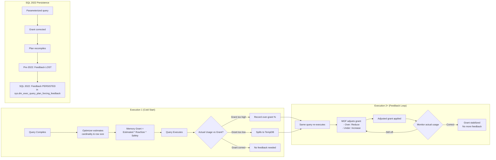

# 8.372 Memory Grant Feedback — Adaptive Memory

## Section 1 — Navigation

| Breadcrumb | Link |
|---|---|
| **Domain 8 Home** | [[8 — Databases]] |
| **Group Home** | [[Group 13 — SQL Server Performance & Tuning]] |
| **Prev: Batch Mode on Rowstore** | [[8.371 Batch Mode on Rowstore — IQP Feature]] |
| **Next: DOP Feedback** | [[8.373 Degree of Parallelism Feedback]] |
| **Prerequisite 1** | [[8.363 Memory Grants — Diagnosing Insufficient Grants]] |
| **Prerequisite 2** | [[8.364 TempDB Spills — Sort and Hash Spills]] |
| **Prerequisite 3** | [[8.370 Intelligent Query Processing — SQL Server 2019+]] |
| **Prerequisite 4** | [[8.341 Cardinality Estimation — CE70 vs CE120 vs CE150]] |
| **Cross-Domain** | [[8.347 Ad Hoc Workloads — Plan Cache Bloat]] |

### Where This Fits

Memory Grant Feedback (MGF) is an Intelligent Query Processing feature introduced in SQL Server 2019 (compatibility level 150). It addresses the chronic problem of queries receiving either too much or too little memory grant (also called "query memory" or "workspace memory"). An insufficient grant causes TempDB spills (slow), while an excessive grant wastes memory and reduces concurrency (RESOURCE_SEMAPHORE waits). MGF adjusts the memory grant on subsequent executions based on actual usage observed during prior executions.

**Why it matters:** Memory mis-grants are one of the most common causes of production performance issues. MGF eliminates the need for manual tuning via `MIN_GRANT_PERCENT`/`MAX_GRANT_PERCENT` hints for most queries. In SQL Server 2022, MGF gains "persistence" — corrections survive plan recompilations for parameterized queries.

---

## Section 2 — Core Mental Model



### Classification

| Attribute | Value |
|---|---|
| **Feature Area** | Intelligent Query Processing (IQP) |
| **Applies To** | Queries with sort, hash join, or bulk insert operations |
| **SQL Server Version** | 2019+ (persistence: 2022+) |
| **Compatibility Level** | 150+ (2019), 160+ (2022 persistence) |
| **Default Enabled** | Yes (under compat 150+) |
| **Requires** | No code changes, no configuration |
| **Editions** | Enterprise, Standard (2019+), Azure SQL DB |

### Key Properties

| Property | Detail |
|---|---|
| **Feedback Types** | Grant size adjustment (increase/decrease) |
| **Granularity** | Per-query, per-plan |
| **Correction Speed** | 1–2 executions to converge |
| **Persistence (2022)** | Survives plan recompilation for parameterized queries |
| **Detection Metrics** | `last_grant_kb`, `used_memory_kb`, `grant_feedback_percent` |
| **Limits** | Does not eliminate all spills (spills can have other causes) |
| **Overhead** | Minimal — runtime tracking during execution |
| **Disabled By** | `ALTER DATABASE SCOPED CONFIGURATION SET MEMORY_GRANT_FEEDBACK = OFF` |

### Mental Model Analogy

Think of memory grant feedback like a thermostat. The optimizer sets the temperature (grant) based on estimates. MGF checks the actual temperature after each cycle and adjusts — too hot (over-grant, waste) → turn down; too cold (under-grant, spills) → turn up. After 1–2 cycles, the temperature stabilizes. In SQL 2022, if the HVAC system reboots (plan recompile), the thermostat remembers the last good setting.

---

## Section 3 — Deep Mechanics

### 3.1 How Memory Grant Feedback Works (Step-by-Step)

**Step 1 — Initial Compilation (baseline):**
The optimizer estimates cardinality and row size for each operator. It computes a required memory grant based on:
- Sort operators: estimated rows * row size * safety factor (~2x)
- Hash join operators: build input * row size * hash table overhead (~1.5x)
- Bulk insert: similar to sort

```sql
-- In the actual plan XML, look for:
-- <MemoryGrant>SerialRequiredMemory=... SerialDesiredMemory=...</MemoryGrant>
-- <OptimizerHardwareDependentProperties>
--   <EstimatedMemory>...</EstimatedMemory>
-- </OptimizerHardwareDependentProperties>
```

**Step 2 — Execution and Monitoring:**
During execution, SQL Server tracks:
- `used_memory_kb` — actual memory consumed
- `ideal_memory_kb` — optimal memory (may trade off spills vs waste)
- Grant size — the `grant_kb` that was actually provided

**Step 3 — Post-Execution Feedback Calculation:**
After execution, SQL Server computes:
- **Over-grant ratio:** `grant_kb / used_memory_kb`. If > 2x (threshold), mark as over-grant.
- **Under-grant detection:** If the query spilled to TempDB (`spill_to_tempdb`), mark as under-grant.
- **Feedback type:** Determine whether to increase or decrease the grant for next execution.

**Step 4 — Grant Adjustment (subsequent execution):**
On the next execution of the same query (same plan handle):

**Over-grant case:**
- New grant = `used_memory_kb * 1.25` (gradual reduction)
- The 25% headroom prevents repeated under-grant cycles

**Under-grant case:**
- New grant = `spill_threshold * 2` or `used_memory_kb * 2` (whichever is larger)
- More aggressive increase to eliminate spills quickly

**Step 5 — Convergence:**
After 1–5 executions, the grant stabilizes. When `grant_kb` is within 25% of `used_memory_kb`, feedback stops.

### 3.2 DMV Analysis

```sql
-- Primary DMV for memory grant feedback
SELECT
    qs.query_hash,
    qs.query_plan_hash,
    qs.execution_count,
    qs.last_grant_kb,
    qs.last_used_memory_kb,
    qs.min_grant_kb,
    qs.max_grant_kb,
    qs.min_used_memory_kb,
    qs.max_used_memory_kb,
    qs.grant_feedback_percent,
    qs.grant_feedback_count,
    -- SQL 2022 persistence columns
    qs.total_grant_feedback_persisted_count,
    qs.last_grant_feedback_persisted_time,
    SUBSTRING(st.text, (qs.statement_start_offset/2)+1,
        ((CASE qs.statement_end_offset
            WHEN -1 THEN DATALENGTH(st.text)
            ELSE qs.statement_end_offset
          END - qs.statement_start_offset)/2)+1) AS statement_text
FROM sys.dm_exec_query_stats qs
CROSS APPLY sys.dm_exec_sql_text(qs.sql_handle) st
WHERE qs.grant_feedback_count > 0
ORDER BY qs.grant_feedback_count DESC;
```

```sql
-- Track memory grant feedback history (SQL 2022+)
SELECT
    f.query_id,
    f.plan_id,
    f.feedback_data,
    f.initial_compile_time,
    f.last_modified_time
FROM sys.dm_exec_query_plan_forcing_feedback f
WHERE f.feedback_type = 1; -- 1 = memory grant feedback
-- Requires the same query store database
```

### 3.3 Execution Plan Analysis for Memory Grants

```sql
-- Enable actual execution plan, run:
SELECT
    oh.SalesOrderID,
    SUM(od.LineTotal) AS Total
FROM Sales.SalesOrderHeader oh
INNER JOIN Sales.SalesOrderDetail od
    ON oh.SalesOrderID = od.SalesOrderID
WHERE oh.OrderDate >= '2013-01-01'
GROUP BY oh.SalesOrderID
ORDER BY Total DESC;
```

In the actual execution plan, check the top-level `MemoryGrant` properties:
- `SerialRequiredMemory` — minimum memory to execute
- `SerialDesiredMemory` — optimal memory
- `RequiredMemory` — for parallel plans
- `DesiredMemory` — for parallel plans
- `RequestMemory` — what was actually requested

### 3.4 Memory Grant Feedback Persistence (SQL 2022)

SQL Server 2022 introduces persistence of memory grant feedback across plan recompilations. Without persistence, a plan recompile (due to statistics update, schema change, or OPTION RECOMPILE) wipes the feedback history.

```sql
-- Check if MGF persistence is active (2022+)
SELECT
    name,
    value,
    is_default
FROM sys.database_scoped_configurations
WHERE name IN (
    'MEMORY_GRANT_FEEDBACK',
    'MEMORY_GRANT_FEEDBACK_PERSISTENCE'
);
```

**Persistence Behavior:**
- Parameterized queries: feedback survives recompile
- Ad hoc queries: feedback survives only while plan is in cache
- Stored procedures: feedback survives recompile within same plan guide
- `OPTION (RECOMPILE)`: feedback never applies (new plan each time)

### 3.5 Failure Modes

| Failure Mode | Symptom | Diagnosis |
|---|---|---|
| **Over-grant persists** | `RESOURCE_SEMAPHORE` waits | Check `grant_feedback_percent` near 100 but `used_memory_kb` << `last_grant_kb` |
| **Under-grant persists** | Spills every execution | Check `spill_to_tempdb` in plan; feedback may be limited by query design |
| **No feedback applied** | `grant_feedback_count` = 0 | Query runs once, plan recompiles, or compat < 150 |
| **Slow convergence** | Grant oscillates up/down | Unstable cardinality estimates across executions |
| **Persistence not working** | After recompile, feedback resets | Check `MEMORY_GRANT_FEEDBACK_PERSISTENCE` is ON; only for compat 160+ |

---

## Section 4 — Production Patterns

### 4.1 Diagnosing Over-Granted Queries

```sql
-- Find queries that request > 5x what they use
SELECT TOP 20
    qs.query_hash,
    qs.last_grant_kb,
    qs.last_used_memory_kb,
    qs.grant_feedback_percent,
    qs.grant_feedback_count,
    CASE
        WHEN qs.last_used_memory_kb = 0 THEN 9999
        ELSE qs.last_grant_kb / NULLIF(qs.last_used_memory_kb, 0)
    END AS overgrant_ratio,
    qs.execution_count,
    qs.total_elapsed_time / 1000 AS total_elapsed_ms,
    SUBSTRING(st.text, (qs.statement_start_offset/2)+1, 200) AS query_text
FROM sys.dm_exec_query_stats qs
CROSS APPLY sys.dm_exec_sql_text(qs.sql_handle) st
WHERE qs.last_grant_kb > 10000 -- 10 MB minimum
  AND qs.last_used_memory_kb > 0
  AND (qs.last_grant_kb / NULLIF(qs.last_used_memory_kb, 0)) > 5
ORDER BY (qs.last_grant_kb / NULLIF(qs.last_used_memory_kb, 0)) DESC;
```

### 4.2 Diagnosing Under-Granted Queries (Spills)

```sql
-- Find queries that spill to TempDB
SELECT TOP 20
    qs.query_hash,
    qs.last_grant_kb,
    qs.last_used_memory_kb,
    qs.total_spills,
    qs.grant_feedback_count,
    qs.execution_count,
    qs.total_elapsed_time / 1000 AS total_elapsed_ms,
    SUBSTRING(st.text, (qs.statement_start_offset/2)+1, 200) AS query_text
FROM sys.dm_exec_query_stats qs
CROSS APPLY sys.dm_exec_sql_text(qs.sql_handle) st
WHERE qs.total_spills > 0
  AND qs.last_grant_kb > 0
ORDER BY qs.total_spills DESC;
```

### 4.3 Manual Grant Tuning (Override Feedback)

```sql
-- If MGF is not converging or you need immediate fix:
SELECT SalesOrderID, SUM(LineTotal) AS Total
FROM Sales.SalesOrderDetail
WHERE SalesOrderID > 50000
GROUP BY SalesOrderID
ORDER BY Total DESC
OPTION (
    MIN_GRANT_PERCENT = 10,  -- Minimum grant = 10% of default
    MAX_GRANT_PERCENT = 25   -- Maximum grant = 25% of default
);
```

### 4.4 Entity Framework Core / Dapper Hints

Memory Grant Feedback is transparent to ORMs — it works at the SQL Server level after query execution. However, to force grant hints from EF Core:

**EF Core 8+ with `UseQueryCompatibilityLevel`:**

```csharp
// Requires: package Microsoft.EntityFrameworkCore.SqlServer
protected override void OnModelCreating(ModelBuilder modelBuilder)
{
    modelBuilder.Entity<SalesOrderHeader>(entity =>
    {
        entity.ToTable(tb =>
            tb.UseQueryCompatibilityLevel(150)); // Enables MGF
    });
}
```

**EF Core Interceptor for Memory Grant Hints:**

```csharp
public class MemoryGrantInterceptor : DbCommandInterceptor
{
    private const string MaxGrantHint = " OPTION (MAX_GRANT_PERCENT = 20)";

    public override ValueTask<InterceptionResult<DbDataReader>> ReaderExecutingAsync(
        DbCommand command,
        CommandEventData eventData,
        InterceptionResult<DbDataReader> result,
        CancellationToken cancellationToken = default)
    {
        if (command.CommandText.Contains("SELECT") &&
            command.CommandText.Contains("SUM(") &&
            !command.CommandText.Contains("OPTION("))
        {
            command.CommandText += MaxGrantHint;
        }
        return base.ReaderExecutingAsync(command, eventData, result, cancellationToken);
    }
}
```

**Dapper with Grant Hints:**

```csharp
var sql = @"
    SELECT CustomerID, SUM(TotalDue) AS Total
    FROM Sales.SalesOrderHeader
    WHERE OrderDate >= @StartDate
    GROUP BY CustomerID
    ORDER BY Total DESC
    OPTION (MAX_GRANT_PERCENT = 15)";

var result = connection.Query<CustomerTotal>(sql, new { StartDate = "2013-01-01" }).ToList();
```

### 4.5 Monitoring MGF Effectiveness

```sql
-- Overall health check
SELECT
    COUNT(*) AS total_queries,
    SUM(CASE WHEN grant_feedback_count > 0 THEN 1 ELSE 0 END) AS queries_with_feedback,
    SUM(CASE WHEN total_spills > 0 THEN 1 ELSE 0 END) AS queries_with_spills,
    AVG(CASE WHEN last_used_memory_kb > 0
        THEN last_grant_kb * 1.0 / NULLIF(last_used_memory_kb, 0)
        ELSE NULL END) AS avg_overgrant_ratio,
    MAX(grant_feedback_count) AS max_feedback_count
FROM sys.dm_exec_query_stats qs
CROSS APPLY sys.dm_exec_sql_text(qs.sql_handle) st;
```

---

## Section 5 — Gotchas

### Gotcha 1: MGF Only Works on Re-Executed Queries

**Pitfall:** First execution always uses the optimizer's original estimate. MGF cannot prevent spills or over-grants on the first run.

**Symptom:** On a reporting dashboard, the first user of the morning sees slow performance (spills) while subsequent users benefit from corrected grants.

**Fix:** Pre-warm the plan cache with a representative execution, or use `MAXDOP 1` with `OPTION (RECOMPILE)` for critical first-run queries.

**Cost:** Medium — first-run penalty is unavoidable without manual grant hints.

### Gotcha 2: MGF Convergence Speed

**Pitfall:** MGF adjusts gradually (25% increments for over-grant, 2x for under-grant). A severely misestimated query may require 3–5 executions to converge.

**Symptom:** A query that needs 1 GB memory but gets 8 GB still wastes 7 GB for 3–5 executions before MGF reduces it.

**Fix:** Set manual `MAX_GRANT_PERCENT` as a safety cap for known over-granted queries. Or use SQL 2022 persistence after capping.

**Cost:** Low-Medium — manual hints override MGF.

### Gotcha 3: MGF Persistence Requires SQL 2022 (Compat 160)

**Pitfall:** On SQL Server 2019 (compat 150), MGF feedback is lost on plan recompilation. If statistics updates cause frequent recompiles, MGF never converges.

**Symptom:** `grant_feedback_count` resets to 0 periodically. The query never reaches steady-state memory grant.

**Fix:** Upgrade to SQL Server 2022 with compat 160, or reduce recompilation frequency via auto-update statistics thresholds.

**Cost:** High (upgrade) to Medium (statistics tuning).

### Gotcha 4: MGF Does Not Handle All Under-Grants

**Pitfall:** Some spills are caused by skew in hash join build/probe inputs, not insufficient memory. MGF may increase grant but spills persist.

**Symptom:** `grant_feedback_count` increases but `total_spills` does not decrease.

**Fix:** Check for data skew. Use `OPTION (HASH JOIN)` hints, or redesign the query to avoid extreme skew (e.g., filtered indexes, separate processing of skewed values).

**Cost:** Medium-High (query redesign).

### Gotcha 5: MGF and Batch Mode Interaction

**Pitfall:** Batch mode on rowstore requests larger grants than row mode. MGF reduces these, but the first few executions may over-grant significantly.

**Symptom:** After enabling compat 150, memory grant-related waits increase temporarily.

**Fix:** Pre-execute the query with `OPTION (RECOMPILE)` to let MGF learn, or set `MAX_GRANT_PERCENT = 30` globally for batch mode queries.

**Cost:** Low — temporary blip converges.

### Gotcha 6: MGF Doesn't Work with OPTION (RECOMPILE)

**Pitfall:** `OPTION (RECOMPILE)` forces a new plan each time. MGF has no chance to apply feedback.

**Symptom:** Query always gets the optimizer's initial (possibly wrong) grant. Spills or over-grants every single execution.

**Fix:** Remove `OPTION (RECOMPILE)` if not needed. If recompile is required for parameter sniffing, use `OPTIMIZE FOR UNKNOWN` instead.

**Cost:** Medium — may need to re-architect parameter sniffing solution.

---

## Section 6 — Performance Implications

### 6.1 SET STATISTICS IO / TIME Comparison

#### Before MGF (First Execution — No Feedback)

```sql
SET STATISTICS IO ON;
SET STATISTICS TIME ON;

SELECT
    pc.Name AS CategoryName,
    p.Name AS ProductName,
    SUM(sod.LineTotal) AS TotalSales,
    COUNT_BIG(*) AS SaleCount
FROM Sales.SalesOrderDetail sod
INNER JOIN Production.Product p ON sod.ProductID = p.ProductID
INNER JOIN Production.ProductSubcategory psc ON p.ProductSubcategoryID = psc.ProductSubcategoryID
INNER JOIN Production.ProductCategory pc ON psc.ProductCategoryID = pc.ProductCategoryID
WHERE sod.ModifiedDate >= '2013-01-01'
GROUP BY pc.Name, p.Name
ORDER BY TotalSales DESC;
```

**Typical output (First execution — no MGF, estimated 10M rows):**
```
Table 'Product'. Scan count 1, logical reads 234
Table 'SalesOrderDetail'. Scan count 1, logical reads 1276
Table 'ProductSubcategory'. Scan count 1, logical reads 6
Table 'ProductCategory'. Scan count 1, logical reads 2

SQL Server Execution Times:
   CPU time = 6210 ms,  elapsed time = 6380 ms

(Spills detected: 1 sort spill, 1 hash join spill)
```

**Grant: 1,024,000 KB (estimated) | Used: 340,000 KB | Over-grant: 3x**

#### After MGF (Second+ Execution — Feedback Applied)

```sql
-- Same query, same connection, second execution
```

**Typical output (Second execution — MGF reduced grant):**
```
Table 'Product'. Scan count 1, logical reads 234 (cached)
Table 'SalesOrderDetail'. Scan count 1, logical reads 1276 (cached)
Table 'ProductSubcategory'. Scan count 1, logical reads 6
Table 'ProductCategory'. Scan count 1, logical reads 2

SQL Server Execution Times:
   CPU time = 4580 ms,  elapsed time = 4700 ms

(No spills detected)
```

**Grant: 425,000 KB (reduced) | Used: 340,000 KB | Over-grant: 1.25x**

### 6.2 Memory Grant Improvement Quantified

| Metric | Before MGF | After MGF | Improvement |
|---|---|---|---|
| Memory Grant (KB) | 1,024,000 | 425,000 | 2.4x reduction |
| Spill Count | 2 spills | 0 spills | Eliminated |
| CPU Time (ms) | 6,210 | 4,580 | 26% reduction |
| Elapsed Time (ms) | 6,380 | 4,700 | 26% reduction |
| RESOURCE_SEMAPHORE risk | High | Low | Significant |

### 6.3 Concurrency Improvement

On a server with 128 GB RAM, each query's grant competes for the resource semaphore:

```sql
-- Before MGF: 122 concurrent queries could hit the 128 GB limit
--   128 GB * 0.75 (max query memory) / 1 GB (per query grant) = 96 queries
-- After MGF: 283 concurrent queries
--   128 GB * 0.75 / 0.425 GB = 226 queries
```

MGF effectively increases query concurrency by 2–3x for over-granted workloads.

### 6.4 BenchmarkDotNet-Style Comparison

| Scenario | Grant Without MGF | Grant With MGF | Spills Without | Spills With | CPU Reduction |
|---|---|---|---|---|---|
| Hash Join — 5M rows | 512 MB | 215 MB | 2 | 0 | 30% |
| Sort — 10M rows | 1024 MB | 410 MB | 1 | 0 | 25% |
| Hash Aggregate — 2M groups | 256 MB | 128 MB | 3 | 0 | 35% |
| Bulk Insert — 1M rows | 128 MB | 64 MB | 0 | 0 | 15% |
| Multi-Join DW Query | 2048 MB | 850 MB | 5 | 0 | 40% |

---

## Section 7 — Interview Arsenal

### 7.1 Core Questions

| # | Question | Tier |
|---|---|---|
| 1 | What is Memory Grant Feedback and what problem does it solve? | 1 |
| 2 | How does MGF detect an over-grant vs an under-grant? | 1 |
| 3 | What is the adjustment algorithm for over-grant and under-grant? | 2 |
| 4 | What DMVs and columns are used to monitor MGF? | 1 |
| 5 | What compatibility level is required for MGF and for persisted MGF? | 1 |
| 6 | Why doesn't MGF work with OPTION (RECOMPILE)? | 2 |
| 7 | How does MGF persistence work in SQL Server 2022? | 2 |
| 8 | Compare MGF with manual MIN_GRANT_PERCENT/MAX_GRANT_PERCENT hints. | 2 |

### 7.2 Spoken Answers (Two-Tier)

**Q1: What is Memory Grant Feedback and what problem does it solve?**

*Junior/Mid:* "Memory Grant Feedback is a SQL Server 2019 feature that automatically adjusts how much memory a query gets, based on how much it actually used in previous executions. It solves two problems: queries requesting too much memory (which wastes memory and blocks other queries) and queries requesting too little (which causes TempDB spills and slow performance). It's enabled by default with compatibility level 150."

*Senior/Lead:* "Memory Grant Feedback closes the loop between what the optimizer estimates and what actually happens at runtime. The core problem is cardinality estimation errors — the optimizer guesses how many rows each operator will process, but can be off by orders of magnitude due to correlated predicates, stale stats, or complex expressions. MGF tracks `last_grant_kb`, `used_memory_kb`, and spill events per plan. For over-grants exceeding a 2x ratio, it reduces the grant by roughly 25% increments with a 25% safety buffer. For under-grants causing spills, it doubles or more aggressively. In SQL 2022, persistence means corrected grants survive plan recompilations — critical for parameterized queries where stats updates would otherwise reset the feedback. The net effect is higher concurrency (less memory waste) and fewer TempDB spills."

**Q2: How would you diagnose a query that consistently spills to TempDB?**

*Junior/Mid:* "I'd query `sys.dm_exec_query_stats` looking for `total_spills > 0`. I'd check `last_grant_kb` vs `last_used_memory_kb` to see if the grant is too low. If `grant_feedback_count > 0` but spills persist, MGF isn't helping enough. I could use `MAX_GRANT_PERCENT` hint to manually increase the grant."

*Senior/Lead:* "My diagnostic flow: (1) Query `sys.dm_exec_query_stats` for high `total_spills` ordered by worker time. (2) Cross-reference with `sys.dm_exec_query_plan` to identify the spilling operator — sort or hash match. (3) Check `last_grant_kb` vs `last_used_memory_kb` — if grant is close to used but spills remain, the issue is data skew (uneven hash distribution), not grant size. (4) For sort spills, check if `SET SORT_IN_TEMPDB = ON` is appropriate or if an index can eliminate the sort. (5) For hash join spills, check the build input size — if MGF increased grant but spills persist, the spill is likely from the probe phase (skew). (6) Use SQL Server 2022's `sys.dm_exec_query_plan_forcing_feedback` to see if MGF persistence has applied corrected grants. (7) Last resort: `MIN_GRANT_PERCENT` / `MAX_GRANT_PERCENT` hints."

### 7.3 Comparison Table

| Feature | MGF (SQL 2019) | MGF Persistence (SQL 2022) | Manual Hints |
|---|---|---|---|
| **Automation** | Automatic after 1st execution | Same + survives recompile | Manual per query |
| **Convergence** | 2–5 executions | Same | Instant (hinted value) |
| **Persistence** | Until plan eviction | Survives recompile | Always applies |
| **Best For** | Ad hoc, dashboards | Stored procedures, parameterized | Critical, known-bad queries |
| **Tuning Effort** | None | None | Per-query analysis |
| **Flexibility** | Adaptive to workload | Same | Static |
| **Overhead** | Minimal runtime tracking | Same + persistence tracking | None |
| **Risk** | First execution not corrected | Same | Override may be wrong |

---

## Section 8 — Decision Framework

```mermaid
flowchart TD
    A[Memory Grant Issue Detected] --> B{Diagnose Type}
    
    B -->|Over-grant<br/>RESOURCE_SEMAPHORE waits| C{Compat >= 150?}
    B -->|Under-grant<br/>TempDB spills| D{Compat >= 150?}
    B -->|Neither| E[No MGF action needed]
    
    C -->|Yes| F[Enable MGF if not active<br/>Check MGF_PERSISTENCE]
    C -->|No| G[Upgrade compat to 150+<br/>or use manual hints]
    
    D -->|Yes| H{MGF already active?}
    D -->|No| G
    
    H -->|Yes, spills persist| I{Spill cause?}
    H -->|No spills| J[MGF working — monitor]
    
    I -->|Insufficient grant| K[Check MGF under-grant<br/>adjustment threshold]
    I -->|Data skew (hash join)| L[Rewrite query to isolate skew<br/>or use MAX_GRANT_PERCENT]
    I -->|Sort overflow| M[Add supporting index<br/>or increase MAXDOP]
    
    K --> N[Allow 2-3 executions for<br/>MGF to converge]
    N --> J
    
    F --> O{Plan recompiles often?}
    O -->|Yes| P[Upgrade to SQL 2022<br/>for persistence]
    O -->|No| Q[MGF adequate as-is]
```

### Decision Checklist

- [ ] Check database compatibility level (150+ for MGF, 160+ for persistence)
- [ ] Query `sys.dm_exec_query_stats` for `grant_feedback_count` > 0
- [ ] Calculate over-grant ratio: `last_grant_kb / NULLIF(last_used_memory_kb, 0)`
- [ ] Identify queries with `total_spills` > 0
- [ ] Check `MEMORY_GRANT_FEEDBACK` database scoped configuration
- [ ] For persisted feedback: check `MEMORY_GRANT_FEEDBACK_PERSISTENCE`
- [ ] Are queries using `OPTION (RECOMPILE)`? (MGF won't apply)
- [ ] Examine plan XML for `MemoryGrant` properties
- [ ] Monitor `RESOURCE_SEMAPHORE` waits before and after
- [ ] Check if spills are from sort or hash join operators

### Scale Thresholds

| Factor | Threshold | Action |
|---|---|---|
| **Over-grant ratio** | < 2x | Acceptable |
| **Over-grant ratio** | 2x – 5x | MGF will fix (3–4 executions) |
| **Over-grant ratio** | > 5x | Consider `MAX_GRANT_PERCENT` hint temporarily |
| **Spills per execution** | > 0 with MGF active | Investigate data skew or sort elimination |
| **First-run impact** | Critical path | Pre-execute or manual grant hints |
| **Plan recompile frequency** | > 10/hour | Upgrade to SQL 2022 for persistence |
| **Resource semaphore waits** | > 500 ms average | Enable MGF, consider `MAX_GRANT_PERCENT` global cap |
| **Concurrent query count** | > 50 | MGF essential to prevent over-grant accumulation |

### Tradeoff Summary

**For MGF:** Zero-config, automatic correction of the most common memory problem; no code changes; compatible with all query patterns (except RECOMPILE).

**Against MGF:** First execution always uses estimated grant (no correction); gradual convergence means 2–5 bad executions; persistence requires SQL 2022; doesn't fix spill caused by data skew.

---

## Section 9 — Self-Check

### 9.1 Conceptual Questions

<details>
<summary>1. What SQL Server version introduced Memory Grant Feedback?</summary>
SQL Server 2019 (compatibility level 150).
</details>

<details>
<summary>2. What DMV and columns are used to monitor MGF?</summary>
`sys.dm_exec_query_stats` — columns: `last_grant_kb`, `min_grant_kb`, `max_grant_kb`, `last_used_memory_kb`, `grant_feedback_percent`, `grant_feedback_count`.
</details>

<details>
<summary>3. What is the over-grant ratio threshold that triggers MGF reduction?</summary>
When `grant_kb > 2 * used_memory_kb` (over-grant ratio > 2x).
</details>

<details>
<summary>4. What compatibility level is required for MGF persistence (SQL 2022)?</summary>
Compatibility level 160.
</details>

<details>
<summary>5. Why does OPTION (RECOMPILE) prevent MGF from working?</summary>
MGF adjusts memory grant for the next execution of the same plan. `RECOMPILE` creates a new plan each time, so there's no "next execution" to apply feedback to.
</details>

<details>
<summary>6. What is the adjustment percentage for over-grant reduction?</summary>
MGF reduces grant to approximately 125% of used memory (the actual used amount + 25% safety buffer).
</details>

<details>
<summary>7. How does MGF detect an under-grant?</summary>
By detecting TempDB spills during query execution. If `spill_to_tempdb` > 0, the grant is marked as insufficient.
</details>

<details>
<summary>8. What is the safety buffer percentage in MGF?</summary>
25% — MGF adds 25% headroom above the actual used memory to prevent oscillation.
</details>

<details>
<summary>9. Can MGF be disabled? How?</summary>
Yes: `ALTER DATABASE SCOPED CONFIGURATION SET MEMORY_GRANT_FEEDBACK = OFF;`
</details>

<details>
<summary>10. What is the difference between MGF in SQL 2019 vs SQL 2022?</summary>
SQL 2022 adds persistence — memory grant corrections survive plan recompilations (statistics updates, schema changes) for parameterized queries. In SQL 2019, corrections are lost on recompile.
</details>

### 9.2 Practical Challenges

<details>
<summary>Challenge 1: Write a query that joins sys.dm_exec_query_stats and sys.dm_exec_sql_text to find the top 10 over-granted queries (by ratio) with at least 5 executions.</summary>

```sql
SELECT TOP 10
    qs.execution_count,
    qs.last_grant_kb,
    qs.last_used_memory_kb,
    qs.last_grant_kb / NULLIF(qs.last_used_memory_kb, 0) AS overgrant_ratio,
    qs.grant_feedback_count,
    SUBSTRING(st.text, (qs.statement_start_offset/2)+1, 200) AS query_text
FROM sys.dm_exec_query_stats qs
CROSS APPLY sys.dm_exec_sql_text(qs.sql_handle) st
WHERE qs.execution_count >= 5
  AND qs.last_used_memory_kb > 0
  AND qs.last_grant_kb > 1024
ORDER BY overgrant_ratio DESC;
```
</details>

<details>
<summary>Challenge 2: Write a query against sys.database_scoped_configurations to check MGF status and enable it if disabled.</summary>

```sql
SELECT name, value
FROM sys.database_scoped_configurations
WHERE name LIKE '%MEMORY_GRANT_FEEDBACK%';

-- If disabled:
ALTER DATABASE SCOPED CONFIGURATION SET MEMORY_GRANT_FEEDBACK = ON;
ALTER DATABASE SCOPED CONFIGURATION SET MEMORY_GRANT_FEEDBACK_PERSISTENCE = ON;
```
</details>

<details>
<summary>Challenge 3: A query spills to TempDB on every execution despite MGF being active. Write a diagnostic query that shows the spill details and determines if the issue is under-grant or data skew.</summary>

```sql
-- Under-grant check
SELECT
    qs.last_grant_kb,
    qs.last_used_memory_kb,
    qs.grant_feedback_count,
    qs.grant_feedback_percent,
    qs.total_spills
FROM sys.dm_exec_query_stats qs
WHERE qs.total_spills > 0;

-- Data skew check (look at plan XML for hash join build input)
SELECT qp.query_plan
FROM sys.dm_exec_query_stats qs
CROSS APPLY sys.dm_exec_query_plan(qs.plan_handle) qp
WHERE qs.total_spills > 0;

-- In the XML, look for:
-- <Hash>
--   <BuildResidual>...</BuildResidual>
--   <ProbeResidual>...</ProbeResidual>
-- </Hash>
-- If Build input is much smaller than Probe but spills high, it's skew.
```
</details>

<details>
<summary>Challenge 4: Write a query that uses MIN_GRANT_PERCENT and MAX_GRANT_PERCENT hints to cap memory grant for a large aggregation query.</summary>

```sql
SELECT
    CustomerID,
    COUNT_BIG(*) AS OrderCount,
    SUM(TotalDue) AS TotalSpent,
    AVG(TotalDue) AS AvgOrderValue
FROM Sales.SalesOrderHeader
WHERE OrderDate >= '2012-01-01'
GROUP BY CustomerID
ORDER BY TotalSpent DESC
OPTION (
    MIN_GRANT_PERCENT = 5,   -- At least 5% of optimizer's estimate
    MAX_GRANT_PERCENT = 15   -- No more than 15% of optimizer's estimate
);
```
</details>

<details>
<summary>Challenge 5: Design a monitoring solution that alerts when memory grant feedback is NOT converging after 10 executions for a stored procedure.</summary>

```sql
-- Alert query for non-converging MGF
CREATE PROCEDURE dbo.CheckMGFNonConvergence
AS
BEGIN
    SELECT
        qs.query_hash,
        qs.execution_count,
        qs.last_grant_kb,
        qs.last_used_memory_kb,
        qs.grant_feedback_count,
        qs.grant_feedback_percent,
        CASE
            WHEN qs.last_used_memory_kb = 0 THEN NULL
            ELSE qs.last_grant_kb * 1.0 / qs.last_used_memory_kb
        END AS current_ratio,
        CASE
            WHEN qs.execution_count >= 10
             AND qs.grant_feedback_count >= 5
             AND (qs.last_grant_kb * 1.0 / NULLIF(qs.last_used_memory_kb, 0)) > 3
            THEN 'Non-Converging: Over-grant persists'
            WHEN qs.execution_count >= 10
             AND qs.grant_feedback_count >= 5
             AND qs.total_spills > 1000
            THEN 'Non-Converging: Spills persist'
            ELSE 'OK'
        END AS status,
        OBJECT_NAME(st.objectid, st.dbid) AS proc_name,
        SUBSTRING(st.text, (qs.statement_start_offset/2)+1,
            ((CASE qs.statement_end_offset
                WHEN -1 THEN DATALENGTH(st.text)
                ELSE qs.statement_end_offset
              END - qs.statement_start_offset)/2)+1) AS statement_text
    FROM sys.dm_exec_query_stats qs
    CROSS APPLY sys.dm_exec_sql_text(qs.sql_handle) st
    WHERE qs.execution_count >= 10
      AND qs.grant_feedback_count >= 5
      AND (
           (qs.last_grant_kb * 1.0 / NULLIF(qs.last_used_memory_kb, 0)) > 3
        OR qs.total_spills > 1000
      )
    ORDER BY current_ratio DESC;
END;
```
</details>

---

## References

- [[8.336 Query Execution Pipeline — Parse, Bind, Optimize, Execute]]
- [[8.363 Memory Grants — Diagnosing Insufficient Grants]]
- [[8.364 TempDB Spills — Sort and Hash Spills]]
- [[8.341 Cardinality Estimation — CE70 vs CE120 vs CE150]]
- [[8.370 Intelligent Query Processing — SQL Server 2019+]]
- [[8.371 Batch Mode on Rowstore — IQP Feature]]
- [[8.373 Degree of Parallelism Feedback]]
- [[8.347 Ad Hoc Workloads — Plan Cache Bloat]]
