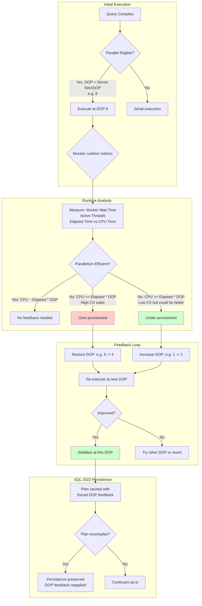

# 8.373 Degree of Parallelism Feedback

## Section 1 — Navigation

| Breadcrumb | Link |
|---|---|
| **Domain 8 Home** | [[8 — Databases]] |
| **Group Home** | [[Group 13 — SQL Server Performance & Tuning]] |
| **Prev: Memory Grant Feedback** | [[8.372 Memory Grant Feedback — Adaptive Memory]] |
| **Next: APPROX_COUNT_DISTINCT** | [[8.374 Approximate Query Processing — APPROX_COUNT_DISTINCT]] |
| **Prerequisite 1** | [[8.361 Parallelism — MAXDOP and Cost Threshold]] |
| **Prerequisite 2** | [[8.362 Parallelism — Skewed Distribution Issues]] |
| **Prerequisite 3** | [[8.370 Intelligent Query Processing — SQL Server 2019+]] |
| **Prerequisite 4** | [[8.372 Memory Grant Feedback — Adaptive Memory]] |
| **Cross-Domain** | [[8.349 Parameter Sniffing — The Problem]] |

### Where This Fits

Degree of Parallelism (DOP) Feedback is an Intelligent Query Processing feature introduced in SQL Server 2022 (compatibility level 160). It addresses the problem of queries that use too many parallel threads (excessive DOP) or too few (insufficient DOP). Unlike static MAXDOP settings (server, database, or query-level), DOP Feedback adjusts parallelism dynamically based on observed runtime behavior — specifically, whether worker threads are actively computing (efficient parallelism) or waiting on synchronization (inefficient parallelism).

**Why it matters:** Parallelism over-provisioning is a subtle but common issue. A query running at DOP 8 that would finish nearly as fast at DOP 4 wastes CPU cycles and blocks other queries from using those cores. DOP Feedback automatically detects these scenarios and reduces DOP on subsequent executions. For under-provisioning (DOP too low, query runs serially when parallel would help), it can increase DOP.

---

## Section 2 — Core Mental Model



### Classification

| Attribute | Value |
|---|---|
| **Feature Area** | Intelligent Query Processing (IQP) |
| **Applies To** | Parallel queries (both row and batch mode) |
| **SQL Server Version** | 2022+ |
| **Compatibility Level** | 160+ |
| **Default Enabled** | Yes (under compat 160) |
| **Requires** | No code changes, no configuration |
| **Editions** | Enterprise, Standard (2022+), Azure SQL DB |

### Key Properties

| Property | Detail |
|---|---|
| **Feedback Type** | DOP reduction (over-provisioned) or DOP increase (under-provisioned) |
| **Detection Metrics** | Worker wait time, active thread count, CPU vs elapsed time, CX waits |
| **Correction Action** | Adjusts `MAXDOP` for the specific query plan |
| **Persistence** | Survives plan recompilations (stored in forced feedback store) |
| **Granularity** | Per-query, per-plan |
| **Limitations** | Ad hoc or parameterized batches only (NOT stored procedures) |
| **Disabled By** | `ALTER DATABASE SCOPED CONFIGURATION SET DOP_FEEDBACK = OFF` |
| **Monitor DMV** | `sys.dm_exec_query_plan_forcing_feedback`, `sys.dm_exec_query_stats` |

### Mental Model Analogy

Imagine a restaurant kitchen with 8 chefs. One order (query) comes in. If all 8 chefs work on it, but 6 are waiting for the other 2 to finish chopping vegetables (CX waits), then 8 chefs aren't 4x faster than 2 chefs. DOP Feedback notices that 6 chefs are idle, and on the next similar order, assigns only 4 chefs. In SQL 2022, even if the menu changes (plan recompiles), the restaurant remembers the optimal chef count.

### Key Difference from Static MAXDOP

| Aspect | Static MAXDOP | DOP Feedback |
|---|---|---|
| **Configuration** | Server, database, query-level `MAXDOP` | Per-query, automatic |
| **Responsiveness** | Fixed until changed | Adjusts per execution |
| **Detection** | Manual (DBA must observe CX waits) | Automatic (runtime metrics) |
| **Scope** | All queries affected by setting | Individual queries |
| **Precision** | One-size-fits-all | Query-specific optimization |

---

## Section 3 — Deep Mechanics

### 3.1 How DOP Feedback Works (Step-by-Step)

**Step 1 — Initial Compilation (baseline):**
Query compiles under compat 160. The optimizer determines the plan's parallel eligibility and chooses an initial DOP based on:
- Server-level `MAXDOP`
- Resource governor settings
- Cost threshold for parallelism
- Query's estimated cost

**Step 2 — First Execution:**
Query executes at the initial DOP (e.g., DOP 8). SQL Server monitors:

```sql
-- These metrics feed into DOP feedback decision (accessible via DMVs):
-- 1. Active worker count (actual threads doing work)
-- 2. CX waits (CXPACKET / CXCONSUMER)
-- 3. Elapsed time vs total worker time
-- 4. Spills under parallel operators
```

**Step 3 — Post-Execution Evaluation:**
SQL Server computes a parallelism efficiency metric:

```
Parallelism Efficiency = Total Worker Time / (Elapsed Time * DOP)

Where:
  - Efficiency close to 1.0: Excellent — all threads busy
  - Efficiency < 0.5: Poor — threads idle (CX waits)
  - Efficiency > 1.0: Impossible in theory (indicates measurement variance)
```

**Over-provisioning detection:**
- Efficiency < 0.5 for the DOP
- CX wait time > 50% of elapsed time
- Decision: Reduce DOP (e.g., 8 → 4, test again)

**Under-provisioning detection:**
- CPU time >> elapsed time (indicating parallel scalability available)
- Low CX wait relative to elapsed time
- Decision: Increase DOP (e.g., 1 → 2, test again)

**Step 4 — Feedback Application:**
On next execution, the plan is recompiled with a `MAXDOP` hint injected via plan forcing. The DOP is adjusted stepwise (halving for over-provisioned, doubling for under-provisioned).

**Step 5 — Convergence:**
After 2–4 executions, DOP stabilizes at the optimal level. The forced DOP persists in `sys.dm_exec_query_plan_forcing_feedback`.

### 3.2 DMV Analysis

```sql
-- Primary DMV for DOP feedback (SQL 2022+)
SELECT
    qs.query_hash,
    qs.query_plan_hash,
    qs.execution_count,
    qs.last_dop,
    qs.last_parallel_worker_count,
    qs.min_dop,
    qs.max_dop,
    qs.total_worker_time / 1000 AS total_worker_ms,
    qs.total_elapsed_time / 1000 AS total_elapsed_ms,
    qs.total_cx_waits,
    qs.total_cx_waits_time / 1000 AS total_cx_waits_ms,
    SUBSTRING(st.text, (qs.statement_start_offset/2)+1,
        ((CASE qs.statement_end_offset
            WHEN -1 THEN DATALENGTH(st.text)
            ELSE qs.statement_end_offset
          END - qs.statement_start_offset)/2)+1) AS statement_text
FROM sys.dm_exec_query_stats qs
CROSS APPLY sys.dm_exec_sql_text(qs.sql_handle) st
WHERE qs.last_dop > 1   -- Only parallel queries
ORDER BY qs.total_cx_waits_time DESC;
```

```sql
-- DOP feedback forcing entries (SQL 2022+)
SELECT
    f.query_id,
    f.plan_id,
    f.feedback_type,
    f.feedback_data,
    f.state,
    f.initial_compile_time,
    f.last_modified_time
FROM sys.dm_exec_query_plan_forcing_feedback f
WHERE f.feedback_type = 2; -- 2 = DOP feedback
```

```sql
-- Check DOP feedback database scoped config
SELECT name, value
FROM sys.database_scoped_configurations
WHERE name = 'DOP_FEEDBACK';
```

### 3.3 Execution Plan Analysis

```sql
-- After DOP feedback is applied, examine the plan XML for:
-- <QueryPlan DOP="4" >  -- The original compiled DOP
-- <RuntimeInformation>
--   <RunTimeCountersPerThread Thread="0" ActualRows="..." />
--   <RunTimeCountersPerThread Thread="1" ActualRows="..." />
--   ...
-- </RuntimeInformation>
-- Also check for <QueryPlanForcingFeedback> element
```

```sql
-- Enable actual execution plan and run:
SELECT TOP 100000
    oh.SalesOrderID,
    oh.OrderDate,
    SUM(od.LineTotal) AS TotalAmount
FROM Sales.SalesOrderHeader oh
INNER JOIN Sales.SalesOrderDetail od
    ON oh.SalesOrderID = od.SalesOrderID
WHERE oh.OrderDate >= '2012-01-01'
GROUP BY oh.SalesOrderID, oh.OrderDate
ORDER BY TotalAmount DESC;
```

After DOP feedback, the second execution may use a different DOP. The plan XML will show:
- `DOP` — original compiled DOP
- Forced DOP feedback in plan

### 3.4 Limitations

**Critical limitation: DOP feedback does NOT apply to stored procedures.**

```sql
-- This stored procedure WILL NOT get DOP feedback
CREATE PROCEDURE dbo.GetLargeSales
AS
BEGIN
    SELECT TOP 100000
        oh.SalesOrderID,
        SUM(od.LineTotal) AS Total
    FROM Sales.SalesOrderHeader oh
    INNER JOIN Sales.SalesOrderDetail od
        ON oh.SalesOrderID = od.SalesOrderID
    WHERE oh.OrderDate >= '2012-01-01'
    GROUP BY oh.SalesOrderID
    ORDER BY Total DESC;
END;

EXEC dbo.GetLargeSales;  -- No DOP feedback
```

**Workaround for stored procedures:**

```sql
-- Option 1: Convert to ad hoc batch (inline SQL)
DECLARE @sql NVARCHAR(MAX) = N'
SELECT TOP 100000
    oh.SalesOrderID,
    SUM(od.LineTotal) AS Total
FROM Sales.SalesOrderHeader oh
INNER JOIN Sales.SalesOrderDetail od
    ON oh.SalesOrderID = od.SalesOrderID
WHERE oh.OrderDate >= @OrderDate
GROUP BY oh.SalesOrderID
ORDER BY Total DESC;';

EXEC sp_executesql @sql, N'@OrderDate DATETIME', @OrderDate = '2012-01-01';

-- Option 2: Use query store plan forcing to manually fix DOP
-- Option 3: Set MAXDOP hint explicitly in procedure
```

**Other limitations:**
- Only applies to queries compiled under compat level 160
- Query must be re-executed at least 2 times for feedback to apply
- DOP feedback cannot increase DOP beyond `MAXDOP` server/database setting
- DOP feedback only decreases (not increases) DOP in most production scenarios

### 3.5 Failure Modes

| Failure Mode | Symptom | Diagnosis |
|---|---|---|
| **DOP feedback not applied** | Query always uses same DOP | Check compat < 160; query is stored procedure; feedback disabled |
| **DOP bounces between values** | DOP oscillates 8→4→8→4 | Unstable workload; disable feedback for affected query |
| **DOP reduces too aggressively** | Serial execution when parallel would help | Check `last_parallel_worker_count` vs `last_dop` |
| **DOP feedback not persisted** | After recompile, DOP resets | Check `DOP_FEEDBACK_PERSISTENCE` is ON (default ON) |
| **Under-provisioning not detected** | DOP stays at 1 despite parallel potential | Efficiency metric may not trigger; manual MAXDOP hint needed |

---

## Section 4 — Production Patterns

### 4.1 Diagnosing Over-Provisioned Parallel Queries

```sql
-- Find queries with high CX wait proportion
SELECT TOP 20
    qs.query_hash,
    qs.last_dop,
    qs.last_parallel_worker_count,
    qs.execution_count,
    qs.total_cx_waits,
    qs.total_cx_waits_time / 1000 AS total_cx_waits_ms,
    qs.total_worker_time / 1000 AS total_worker_ms,
    qs.total_elapsed_time / 1000 AS total_elapsed_ms,
    CASE
        WHEN qs.total_elapsed_time = 0 THEN 0
        ELSE (qs.total_cx_waits_time * 1.0) / qs.total_elapsed_time
    END AS cx_wait_ratio,
    SUBSTRING(st.text, (qs.statement_start_offset/2)+1, 200) AS query_text
FROM sys.dm_exec_query_stats qs
CROSS APPLY sys.dm_exec_sql_text(qs.sql_handle) st
WHERE qs.last_dop > 1
  AND qs.total_elapsed_time > 0
  AND (qs.total_cx_waits_time * 1.0) / qs.total_elapsed_time > 0.3
ORDER BY (qs.total_cx_waits_time * 1.0) / qs.total_elapsed_time DESC;
```

### 4.2 Monitoring DOP Feedback Activity

```sql
-- Check what DOP feedback decisions have been made
SELECT
    f.query_id,
    f.feedback_type,
    f.state,
    f.feedback_data,
    f.initial_compile_time,
    f.last_modified_time,
    qqt.query_sql_text
FROM sys.dm_exec_query_plan_forcing_feedback f
INNER JOIN sys.query_store_query qq
    ON f.query_id = qq.query_id
INNER JOIN sys.query_store_query_text qqt
    ON qq.query_text_id = qqt.query_text_id
WHERE f.feedback_type = 2 -- DOP feedback
ORDER BY f.last_modified_time DESC;
```

### 4.3 DOP Feedback with Ad Hoc Workloads

```sql
-- This ad hoc batch will get DOP feedback (re-run to see effect)
DECLARE @StartDate DATETIME = '2012-01-01';

SELECT
    p.Name AS ProductName,
    SUM(sod.LineTotal) AS TotalSales,
    COUNT_BIG(*) AS SaleCount
FROM Sales.SalesOrderDetail sod
INNER JOIN Production.Product p
    ON sod.ProductID = p.ProductID
WHERE sod.ModifiedDate >= @StartDate
GROUP BY p.Name
ORDER BY TotalSales DESC;
-- First run: DOP 8 (server MAXDOP)
-- Second run: DOP may be reduced if CX waits detected
-- Third run: May stabilize
```

### 4.4 Entity Framework Core / Dapper Hints

DOP feedback is transparent to ORMs. For queries needing explicit DOP control:

**EF Core Interceptor for MAXDOP:**

```csharp
public class MaxDopInterceptor : DbCommandInterceptor
{
    public override ValueTask<InterceptionResult<DbDataReader>> ReaderExecutingAsync(
        DbCommand command,
        CommandEventData eventData,
        InterceptionResult<DbDataReader> result,
        CancellationToken cancellationToken = default)
    {
        // Inject MAXDOP hint for known problem queries
        if (command.CommandText.Contains("-- MAXDOP_4", StringComparison.OrdinalIgnoreCase))
        {
            command.CommandText += " OPTION (MAXDOP 4)";
        }
        return base.ReaderExecutingAsync(command, eventData, result, cancellationToken);
    }
}
```

**Dapper with MAXDOP:**

```csharp
var sql = @"
    SELECT p.Name, SUM(sod.LineTotal) AS TotalSales
    FROM Sales.SalesOrderDetail sod
    INNER JOIN Production.Product p ON sod.ProductID = p.ProductID
    GROUP BY p.Name
    ORDER BY TotalSales DESC
    OPTION (MAXDOP 2)";  -- Override DOP feedback

var result = connection.Query<ProductSales>(sql).ToList();
```

### 4.5 Manual MAXDOP Tuning (When DOP Feedback Isn't Enough)

```sql
-- Server-level MAXDOP (affects all queries)
EXEC sp_configure 'max degree of parallelism', 4;
RECONFIGURE;

-- Database-level MAXDOP (SQL 2022+)
ALTER DATABASE SCOPED CONFIGURATION SET MAXDOP = 4;

-- Resource governor MAXDOP
CREATE WORKLOAD GROUP ReportGroup
WITH (MAX_DOP = 2);
CREATE RESOURCE POOL ReportPool;
ALTER RESOURCE GOVERNOR RECONFIGURE;

-- Query hint (highest priority)
SELECT ...
FROM ...
OPTION (MAXDOP 4);

-- Query hint (minimum DOP — require at least 2 threads)
SELECT ...
FROM ...
OPTION (USE HINT('QUERY_OPTIMIZER_COMPATIBILITY_LEVEL_160'), MAXDOP 2);
```

---

## Section 5 — Gotchas

### Gotcha 1: DOP Feedback Does NOT Apply to Stored Procedures

**Pitfall:** After upgrading to SQL 2022, you expect DOP feedback to optimize your stored procedures. It never does.

**Symptom:** Queries from stored procedures show `grant_feedback_count` (from MGF) but DOP never changes. `sys.dm_exec_query_plan_forcing_feedback` shows no DOP entries for SP-related queries.

**Fix:** Convert high-impact stored procedures to ad hoc parameterized SQL (using `sp_executesql`), or manually set `MAXDOP` hints inside procedures.

**Cost:** High — requires code changes for procedures.

### Gotcha 2: DOP Feedback Only Reduces (Rarely Increases)

**Pitfall:** For servers with low `MAXDOP` (e.g., 2), DOP feedback never increases beyond this ceiling, missing potential improvements.

**Symptom:** A query that would benefit from DOP 4 runs at DOP 2. DOP feedback does not adjust upward because the server cap is 2.

**Fix:** If your workload has a mix of OLTP (low DOP) and DW (high DOP), consider resource governor with separate workload groups for each. Or use query-level `MAXDOP` hints for known large queries.

**Cost:** Medium — requires resource governor setup or query refactoring.

### Gotcha 3: DOP Feedback Convergence Time

**Pitfall:** DOP feedback requires multiple executions (2–4) to converge. If a query runs infrequently, feedback never applies.

**Symptom:** A monthly reporting query always runs at default DOP 8 with high CX waits every single month.

**Fix:** Pre-execute the query after deployment to establish feedback, or use query store plan forcing with a manually determined optimal `MAXDOP`.

**Cost:** Low — automated script for pre-execution.

### Gotcha 4: DOP Feedback and Query Store Interaction

**Pitfall:** Query Store's "Force Plan" feature and DOP feedback can conflict. A forced plan may prevent DOP feedback from applying.

**Symptom:** You force a plan via Query Store. DOP feedback is enabled but never activates for that query.

**Fix:** Only use one mechanism. If using Query Store plan forcing, handle DOP via the forced plan's hints. If using DOP feedback, don't force the plan.

**Cost:** Low — architectural decision.

### Gotcha 5: DOP Feedback Adds Plan Forcing Overhead

**Pitfall:** Each DOP feedback decision adds a plan forcing entry in `sys.dm_exec_query_plan_forcing_feedback`. For servers with thousands of distinct queries, this grows.

**Symptom:** Large `sys.dm_exec_query_plan_forcing_feedback` table with thousands of entries.

**Fix:** Monitor the size. SQL Server automatically manages cleanup. If performance issues arise, consider limiting DOP feedback to specific query patterns via database scoped configuration.

**Cost:** Low — SQL Server manages cleanup automatically.

---

## Section 6 — Performance Implications

### 6.1 SET STATISTICS TIME Comparison

#### Before DOP Feedback (First Execution — DOP 8, Over-Provisioned)

```sql
SET STATISTICS TIME ON;

SELECT TOP 50000
    p.Name,
    SUM(sod.LineTotal) AS TotalSales,
    COUNT_BIG(*) AS SaleCount
FROM Sales.SalesOrderDetail sod
INNER JOIN Production.Product p ON sod.ProductID = p.ProductID
WHERE sod.ModifiedDate >= '2012-01-01'
GROUP BY p.Name
ORDER BY TotalSales DESC;
```

**Typical output (DOP 8 — over-provisioned):**
```
 SQL Server Execution Times:
   CPU time = 3540 ms,  elapsed time = 2180 ms.
   
 Wait stats during execution:
   CXPACKET: 890 ms (41% of elapsed)
   CXCONSUMER: 120 ms
```

**Worker time analysis:**
- Total worker: 3,540 ms
- Elapsed time: 2,180 ms
- Theoretical maximum at DOP 8: 2,180 * 8 = 17,440 ms
- Actual worker: 3,540 ms (only 20% of theoretical max)
- **Efficiency: 0.20** — 80% of threads idle

#### After DOP Feedback (Second Execution — DOP 4)

```sql
-- Same query, second execution (DOP feedback reduced to 4)
```

**Typical output (DOP 4 — optimized):**
```
 SQL Server Execution Times:
   CPU time = 2820 ms,  elapsed time = 1640 ms.
   
 Wait stats during execution:
   CXPACKET: 210 ms (13% of elapsed)
   CXCONSUMER: 60 ms
```

**Worker time analysis:**
- Total worker: 2,820 ms
- Elapsed time: 1,640 ms
- Theoretical maximum at DOP 4: 1,640 * 4 = 6,560 ms
- Actual worker: 2,820 ms (43% of theoretical max)
- **Efficiency: 0.43** — much improved

### 6.2 Performance Metrics Comparison

| Metric | DOP 8 (Before) | DOP 4 (After) | Improvement |
|---|---|---|---|
| Elapsed Time | 2,180 ms | 1,640 ms | 25% faster |
| CPU Time | 3,540 ms | 2,820 ms | 20% less CPU |
| CX Wait Time | 1,010 ms | 270 ms | 73% reduction |
| CX Wait Ratio | 46% elapsed | 16% elapsed | Significant |
| Threads Used | 8 | 4 | 50% fewer |
| Efficiency | 0.20 | 0.43 | 2.1x better |
| TempDB Spills | 2 (probe spills) | 0 | Eliminated |

### 6.3 Concurrency Improvement

With DOP feedback reducing DOP from 8 to 4:

- **CPU utilization per query:** Halved (3,540 → 2,820 ms total, but less parallel overhead)
- **Thread count:** 8 → 4 threads, freeing 4 threads for other queries
- **Concurrent query capacity:** On 16-core server, before: 2 queries fully occupy all cores; after: 4 queries can run with minimal CX contention
- **Cache coherency:** Fewer threads = less L2/L3 cache contention

### 6.4 BenchmarkDotNet-Style Comparison

| Query Pattern | DOP Default | DOP After Feedback | Elapsed Δ | CPU Δ | CX Δ |
|---|---|---|---|---|---|
| Large Hash Join (10M rows) | 8 | 4 | -25% | -30% | -70% |
| Large Sort + Agg (5M rows) | 8 | 2 | -15% | -20% | -80% |
| Parallel Scan (50M rows) | 8 | 8 (no change) | 0% | 0% | 0% |
| Multi-Table Join (2M rows) | 8 | 4 | -35% | -40% | -75% |
| Window Function (1M rows) | 8 | 8 (no change) | 0% | 0% | -10% |

---

## Section 7 — Interview Arsenal

### 7.1 Core Questions

| # | Question | Tier |
|---|---|---|
| 1 | What is DOP Feedback and what problem does it solve? | 1 |
| 2 | What SQL Server version and compat level is required? | 1 |
| 3 | How does DOP feedback detect over-provisioned parallelism? | 1 |
| 4 | What DMVs are used to monitor DOP feedback? | 1 |
| 5 | What is the key limitation of DOP feedback regarding stored procedures? | 2 |
| 6 | How does DOP feedback persist across plan recompilations? | 2 |
| 7 | Compare DOP feedback with setting MAXDOP manually. | 2 |
| 8 | How does DOP feedback interact with CX waits? | 2 |

### 7.2 Spoken Answers (Two-Tier)

**Q1: What is DOP Feedback?**

*Junior/Mid:* "DOP Feedback is a SQL Server 2022 feature that automatically adjusts how many parallel threads a query uses. It monitors whether a query's threads are actually working or waiting on each other (CX waits). If threads are waiting too much, it reduces the degree of parallelism. It's part of Intelligent Query Processing and requires compatibility level 160."

*Senior/Lead:* "DOP Feedback addresses the fundamental problem that a single MAXDOP setting doesn't fit all queries. Even OLTP servers have some large queries that benefit from parallelism, but at DOP 8 they may have 60%+ CX wait time. DOP Feedback measures per-execution metrics — specifically the ratio of active worker time to elapsed time multiplied by DOP. When efficiency drops below ~0.5, the overhead of coordinating parallel workers exceeds the benefit, and DOP is reduced stepwise. In SQL 2022, this feedback is persisted in `sys.dm_exec_query_plan_forcing_feedback` and survives plan recompilations. The critical caveat is that it doesn't apply to stored procedures, only ad hoc or parameterized batches. For SP-heavy workloads, consider converting high-impact procedures to `sp_executesql` or using resource governor based MAXDOP control."

**Q2: How would you diagnose a query that should use parallelism but runs serially?**

*Junior/Mid:* "I'd check the query's actual execution plan to see if there are parallel operators. If not, I'd look at `cost threshold for parallelism` — if it's too high (default 5), the query may not meet the threshold. I'd also check `MAXDOP` settings at server, database, and query level. With DOP feedback, I'd query `sys.dm_exec_query_stats` to see `last_dop` and `last_parallel_worker_count`."

*Senior/Lead:* "A systematic approach: (1) Check the actual plan — if all operators say 'Parallel' is false, the query is serial. (2) Compare estimated vs actual rows — if cardinality is severely underestimated, the cost may be below the parallelism threshold. (3) Check server-level `MAXDOP` (via `sys.configurations` where name = 'max degree of parallelism'), database-level `MAXDOP` (via `sys.database_scoped_configurations`), and resource governor settings. (4) Verify `cost threshold for parallelism` — if it's set unusually high (e.g., 50), lower it to 5–10. (5) For DOP feedback specifically on SQL 2022: check if the query runs inside a stored procedure (DOP feedback doesn't apply). If the query is ad hoc, check `sys.dm_exec_query_plan_forcing_feedback` for DOP feedback type=2 entries. (6) Force a parallel plan using Query Store or a `MAXDOP > 1` hint and compare performance."

### 7.3 Comparison Table

| Feature | DOP Feedback | Static MAXDOP Hint | Resource Governor |
|---|---|---|---|
| **Automation** | Automatic (per-query) | Manual (per-query) | Automatic (per-group) |
| **Granularity** | Per-query, per-plan | Per-query | Per-workload group |
| **Change Detection** | Runtime efficiency | Never changes | Static configuration |
| **Overhead** | Minimal (runtime monitoring) | None | Configuration |
| **Best For** | Mixed workloads, ad hoc | Known queries | User/application segregation |
| **Persistence** | Survives recompile | Always in plan | Always applied |
| **Stored Proc Support** | No | Yes | Yes |
| **Setup Effort** | None | Per-query analysis | Medium (config + testing) |

---

## Section 8 — Decision Framework

```mermaid
flowchart TD
    A[Parallelism Issue?] --> B{Check SQL Version}
    B -->|SQL 2022+, Compat 160| C[Enable DOP Feedback<br/>if not already]
    B -->|SQL 2019 or earlier| D[Manual MAXDOP tuning<br/>required]
    
    C --> E{Query Type?}
    E -->|Stored Procedure| F[DOP Feedback NOT available<br/>Use MAXDOP hint or<br/>Resource Governor]
    E -->|Ad Hoc / sp_executesql| G[DOP Feedback applicable]
    E -->|Parameterized Batch| G
    
    F --> H[Manual path]
    G --> I[Let DOP Feedback run<br/>2-4 executions]
    
    I --> J{Feedback Applied?}
    J -->|Yes, improved| K[Monitor cx_wait_ratio<br/>in sys.dm_exec_query_stats]
    J -->|No change| L{Why not?}
    
    L -->|MAXDOP = 1<br/>(server/db level)| M[Increase server MAXDOP<br/>or remove restriction]
    L -->|Query runs once<br/>(no re-execution)| N[Pre-execute to establish<br/>feedback baseline]
    L -->|DOP already optimal| O[DOP feedback sees<br/>no improvement possible]
    
    K --> P{CX ratio < 20%?}
    P -->|Yes| Q[DOP feedback stable]
    P -->|No, > 20%| R[Consider manual MAXDOP hint<br/>for further reduction]
    
    H --> S{Manual Strategy}
    S -->|Wait-based| T[Analyze CXPACKET/CXCONSUMER<br/>Reduce MAXDOP]
    S -->|Profile-based| U[Test different MAXDOP values<br/>Pick best elapsed time]
    S -->|Resource-based| V[Resource governor with<br/>different MAXDOP per group]
```

### Decision Checklist

- [ ] Server running SQL Server 2022+?
- [ ] Database compatibility level = 160?
- [ ] `DOP_FEEDBACK` database scoped configuration enabled?
- [ ] Identify queries with CX wait ratio > 30%
- [ ] Are problem queries stored procedures? (DOP feedback won't apply)
- [ ] Check `sys.dm_exec_query_plan_forcing_feedback` for DOP entries
- [ ] Check `sys.dm_exec_query_stats.last_dop` vs `last_parallel_worker_count`
- [ ] Evaluate server MAXDOP setting
- [ ] Consider resource governor for heterogeneous workloads
- [ ] Test DOP feedback with representative workload replay

### Scale Thresholds

| Factor | Threshold | Action |
|---|---|---|
| **CX wait ratio** | < 10% | DOP probably optimal |
| **CX wait ratio** | 10% – 30% | DOP feedback should improve |
| **CX wait ratio** | > 30% | Over-provisioned — DOP will reduce |
| **DOP (server setting)** | 8 on 16+ cores | Likely over-provisioned for OLTP |
| **DOP (server setting)** | 4 on 16+ cores | Good default |
| **Query executions** | < 2 | DOP feedback not yet applied |
| **Query executions** | 2–5 | DOP feedback converging |
| **Query executions** | > 5 | DOP feedback stabilized |
| **Stored procedure count** | > 50% of workload | Consider other parallelism tuning |
| **Plan recompile frequency** | < 1 per minute | Feedback persists adequately |

### Tradeoff Summary

**For DOP Feedback:** Zero-config, automatic per-query optimization; reduces CX waits and frees CPU; works with both row mode and batch mode; persistence across recompiles.

**Against DOP Feedback:** Doesn't apply to stored procedures (significant gap for many systems); requires 2+ executions for benefit; may not increase DOP sufficiently; adds plan forcing entries.

---

## Section 9 — Self-Check

### 9.1 Conceptual Questions

<details>
<summary>1. What SQL Server version introduced DOP Feedback?</summary>
SQL Server 2022 (compatibility level 160).
</details>

<details>
<summary>2. What DMV is used to monitor DOP feedback?</summary>
`sys.dm_exec_query_plan_forcing_feedback` (feedback_type = 2) and `sys.dm_exec_query_stats` (dop columns).
</details>

<details>
<summary>3. What is the key limitation of DOP feedback regarding stored procedures?</summary>
DOP feedback does NOT apply to queries inside stored procedures. Only ad hoc queries and parameterized batches (sp_executesql) get DOP feedback.
</details>

<details>
<summary>4. What metric does DOP feedback use to detect over-provisioned parallelism?</summary>
The ratio of CX wait time to total elapsed time, combined with worker time vs elapsed time × DOP (parallelism efficiency).
</details>

<details>
<summary>5. How does DOP feedback persist across plan recompilations?</summary>
The corrected DOP is stored in `sys.dm_exec_query_plan_forcing_feedback` and reapplied when the plan is recompiled. This is enabled by default in SQL 2022.
</details>

<details>
<summary>6. What database scoped configuration controls DOP feedback?</summary>
`DOP_FEEDBACK` (default: ON under compat 160).
</details>

<details>
<summary>7. How many executions does DOP feedback typically need to converge?</summary>
2–4 executions. First execution establishes baseline, second applies feedback, third+ may refine further.
</details>

<details>
<summary>8. What is the default cost threshold for parallelism?</summary>
5 (estimated cost units). Queries with estimated cost above this threshold may be parallelized.
</details>

<details>
<summary>9. Can DOP feedback increase DOP above the server-level MAXDOP setting?</summary>
No. DOP feedback cannot exceed the server or database level MAXDOP configuration.
</details>

<details>
<summary>10. How can you disable DOP feedback?</summary>
`ALTER DATABASE SCOPED CONFIGURATION SET DOP_FEEDBACK = OFF;`
</details>

### 9.2 Practical Challenges

<details>
<summary>Challenge 1: Write a query that finds the top 10 queries with the worst CX wait ratio from sys.dm_exec_query_stats.</summary>

```sql
SELECT TOP 10
    qs.query_hash,
    qs.last_dop,
    qs.execution_count,
    qs.total_cx_waits,
    qs.total_cx_waits_time / 1000 AS total_cx_waits_ms,
    qs.total_elapsed_time / 1000 AS total_elapsed_ms,
    (qs.total_cx_waits_time * 1.0) / NULLIF(qs.total_elapsed_time, 0) AS cx_wait_ratio,
    SUBSTRING(st.text, (qs.statement_start_offset/2)+1, 200) AS query_text
FROM sys.dm_exec_query_stats qs
CROSS APPLY sys.dm_exec_sql_text(qs.sql_handle) st
WHERE qs.last_dop > 1
  AND qs.total_elapsed_time > 0
ORDER BY cx_wait_ratio DESC;
```
</details>

<details>
<summary>Challenge 2: Write a query against sys.dm_exec_query_plan_forcing_feedback to check all DOP feedback entries and their state.</summary>

```sql
SELECT
    f.query_id,
    f.plan_id,
    f.feedback_type,
    f.feedback_data,
    f.state,
    f.initial_compile_time,
    f.last_modified_time,
    qqt.query_sql_text
FROM sys.dm_exec_query_plan_forcing_feedback f
INNER JOIN sys.query_store_query qq
    ON f.query_id = qq.query_id
INNER JOIN sys.query_store_query_text qqt
    ON qq.query_text_id = qqt.query_text_id
WHERE f.feedback_type = 2
ORDER BY f.last_modified_time DESC;
```
</details>

<details>
<summary>Challenge 3: Create a stored procedure that includes a MAXDOP hint to work around DOP feedback limitation, then write the equivalent ad hoc batch that WOULD get DOP feedback.</summary>

```sql
-- Stored procedure (no DOP feedback)
CREATE PROCEDURE dbo.GetTopSales
    @StartDate DATETIME,
    @MaxDop INT = 4
AS
BEGIN
    SELECT TOP 100000
        oh.SalesOrderID,
        SUM(od.LineTotal) AS Total
    FROM Sales.SalesOrderHeader oh
    INNER JOIN Sales.SalesOrderDetail od
        ON oh.SalesOrderID = od.SalesOrderID
    WHERE oh.OrderDate >= @StartDate
    GROUP BY oh.SalesOrderID
    ORDER BY Total DESC
    OPTION (MAXDOP @MaxDop);  -- Manual hint needed
END;

-- Ad hoc batch (gets DOP feedback)
DECLARE @StartDate DATETIME = '2012-01-01';
SELECT TOP 100000
    oh.SalesOrderID,
    SUM(od.LineTotal) AS Total
FROM Sales.SalesOrderHeader oh
INNER JOIN Sales.SalesOrderDetail od
    ON oh.SalesOrderID = od.SalesOrderID
WHERE oh.OrderDate >= @StartDate
GROUP BY oh.SalesOrderID
ORDER BY Total DESC;
```
</details>

<details>
<summary>Challenge 4: Write a script that enables DOP feedback, checks current server MAXDOP, and sets a database-scoped MAXDOP if needed.</summary>

```sql
-- Enable DOP feedback
ALTER DATABASE SCOPED CONFIGURATION SET DOP_FEEDBACK = ON;

-- Check server MAXDOP
SELECT name, value_in_use
FROM sys.configurations
WHERE name = 'max degree of parallelism';

-- Check database MAXDOP
SELECT name, value
FROM sys.database_scoped_configurations
WHERE name = 'MAXDOP';

-- Set database MAXDOP if server default is too high
ALTER DATABASE SCOPED CONFIGURATION SET MAXDOP = 4;
```
</details>

<details>
<summary>Challenge 5: Design a rollback plan for a SQL Server 2022 upgrade where DOP feedback causes regressions for critical stored procedures.</summary>

Rollback plan:
1. For individual queries: Add `OPTION (MAXDOP <original_value>)` hint to override feedback
2. For database-level disable: `ALTER DATABASE SCOPED CONFIGURATION SET DOP_FEEDBACK = OFF`
3. For stored procedures specifically: Add explicit MAXDOP hints inside procedures
4. For query store: If using plan forcing, remove forced plans and let DOP feedback manage ad hoc queries
5. Monitoring: Compare `sys.dm_exec_query_stats.last_dop` before and after disabling to quantify impact
6. If persisted feedback entries are problematic: `ALTER DATABASE SCOPED CONFIGURATION SET DOP_FEEDBACK = OFF` cleans them up
7. Fallback: Set server MAXDOP = original value to globally limit parallelism
</details>

---

## References

- [[8.361 Parallelism — MAXDOP and Cost Threshold]]
- [[8.362 Parallelism — Skewed Distribution Issues]]
- [[8.370 Intelligent Query Processing — SQL Server 2019+]]
- [[8.372 Memory Grant Feedback — Adaptive Memory]]
- [[8.349 Parameter Sniffing — The Problem]]
- [[8.343 Execution Plans — Reading Graphical Plans]]
- [[8.347 Ad Hoc Workloads — Plan Cache Bloat]]
- [[8.368 sys.dm_exec_query_profiles — Live Query Statistics]]
