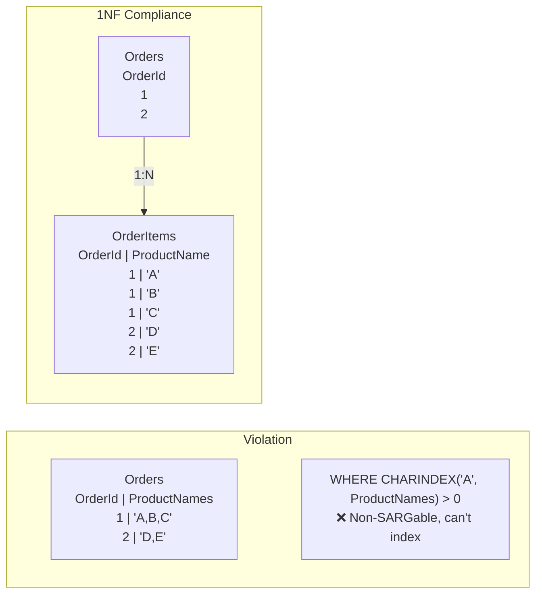
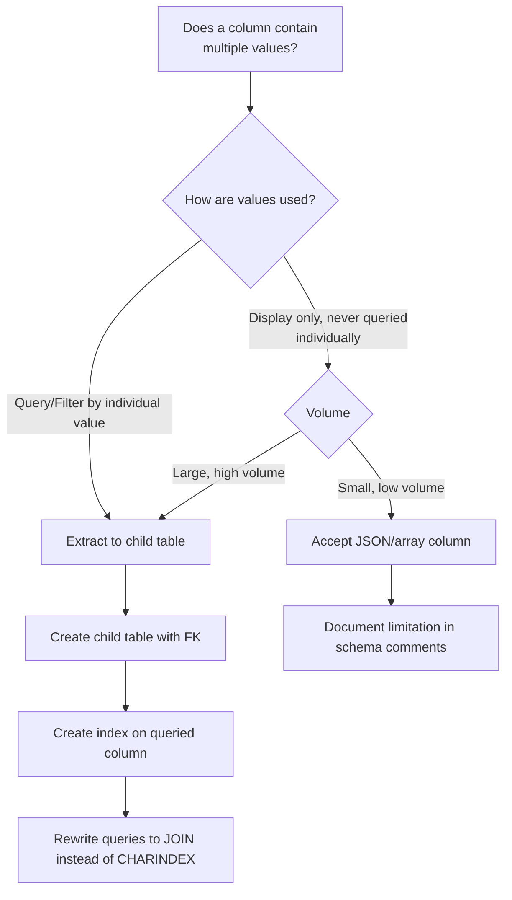

## Navigation

**Domain:** [[8 — Databases]] > **Group:** Database Design & Normalization
**Previous:** [[8.030 — Relational Model vs Document Model — Decision]] | **Next:** [[8.032 — Second Normal Form (2NF) — Eliminating Partial Dependencies]]

### Prerequisites
- [[8.001 — The Relational Model]] — 1NF is the foundational rule for relations; the definition of "relation" requires atomic attributes.
- [[8.029 — Entity Integrity — Primary Key Rules]] — 1NF requires a primary key to uniquely identify each row.

### Where This Fits
First normal form is the rule that every column in a table must contain atomic (indivisible) values — no lists, no arrays, no comma-separated strings, no repeating groups of columns. A .NET backend engineer encounters 1NF violations in legacy databases where someone stored phone numbers as "555-0101,555-0102" in a single column, or defined Phone1, Phone2, Phone3 columns. These violations make querying individual values impossible without string parsing, break indexing on individual items, and force application-level logic to interpret the structure. The interview signal is whether you can recognize a 1NF violation by looking at a table definition and explain why it prevents the database engine from treating individual values as first-class data.

## Core Mental Model

1NF requires that each row-and-column intersection contains exactly one value of the declared type — never a collection, a delimited string, or any structure that needs parsing to access individual elements. The invariant is that the database engine can identify, compare, and index every value independently. The recognition pattern: if you need to use a string function (CHARINDEX, STRING_SPLIT) or check multiple columns (Phone1, Phone2, Phone3) to find a single atomic value, the table violates 1NF. The fix is always to extract the repeating group into a child table with a foreign key.



### Classification

**For normalization topics:** 1NF is the foundational form. All higher normal forms assume 1NF is already satisfied. The optimizer cannot seek or scan individual elements within a delimited column — the entire column value is opaque. The fix splits one row into N rows in a child table, enabling index seeks, WHERE clause filters, and aggregate operations on individual values.

|Property|Value|Notes|
|---|---|---|
|Violation pattern|Repeating group or multi-valued column|Comma-separated, array, or Phone1/Phone2/Phone3 columns|
|Fix|Extract to child table with FK|One row per value, linked to parent|
|SARGability after fix|Yes — individual values indexable|WHERE ProductName = 'A' can seek|
|Query complexity|Higher (need JOIN) vs delimited column|But JOIN is SARGable; CHARINDEX is not|
|Write overhead|Additional rows in child table|Each value is a separate INSERT|

## Deep Mechanics

### How the Engine Executes This

**1NF violation (bad design):**
1. Query arrives: `SELECT * FROM Orders WHERE CHARINDEX('A', ProductNames) > 0`.
2. Parser builds a plan with a Clustered Index Scan — every row must be read.
3. For each row, the engine reads the ProductNames string and passes it to CHARINDEX.
4. No index can support this — the predicate is non-SARGable. The string is opaque to the storage engine.
5. If the string is large (NVARCHAR(MAX) with 100+ product names), each evaluation allocates CPU for the scan.

**1NF compliant (normalized):**
1. Query arrives: `SELECT o.* FROM Orders o INNER JOIN OrderItems oi ON o.OrderId = oi.OrderId WHERE oi.ProductName = 'A'`.
2. Optimizer estimates cardinality based on statistics on ProductName index.
3. If ProductName has an index, the optimizer chooses Index Seek -> Nested Loops -> Clustered Index Seek on Orders.
4. Individual values are found via B-tree traversal — ~3 logical reads per seek.
5. The result set is joined back to the parent table, returning the full order rows.

### SQL Visibility

```sql
-- ❌ 1NF violation: comma-separated values in a single column
CREATE TABLE Orders (
    OrderId      INT           NOT NULL IDENTITY(1,1),
    CustomerId   INT           NOT NULL,
    ProductNames VARCHAR(500)  NOT NULL,  -- 'Laptop,Mouse,Keyboard'
    CONSTRAINT PK_Orders PRIMARY KEY (OrderId)
);

-- Query that tries to find orders containing 'Mouse'
-- Non-SARGable: full table scan required
SELECT OrderId, CustomerId, ProductNames
FROM Orders
WHERE CHARINDEX('Mouse', ProductNames) > 0;
```

```sql
-- ✅ 1NF compliant: split into Orders and OrderItems
CREATE TABLE Orders (
    OrderId    INT           NOT NULL IDENTITY(1,1),
    CustomerId INT           NOT NULL,
    CONSTRAINT PK_Orders PRIMARY KEY (OrderId)
);

CREATE TABLE OrderItems (
    OrderId     INT           NOT NULL,
    ProductName VARCHAR(100)  NOT NULL,
    Quantity    SMALLINT      NOT NULL,
    CONSTRAINT PK_OrderItems PRIMARY KEY (OrderId, ProductName),
    CONSTRAINT FK_OrderItems_Orders FOREIGN KEY (OrderId) REFERENCES Orders(OrderId)
);

-- SARGable query: index seek on ProductName
SELECT o.OrderId, o.CustomerId, oi.ProductName, oi.Quantity
FROM Orders o
INNER JOIN OrderItems oi ON o.OrderId = oi.OrderId
WHERE oi.ProductName = 'Mouse';
```

```csharp
// EF Core — 1NF compliant
public class Order
{
    public int OrderId { get; set; }
    public int CustomerId { get; set; }
    public ICollection<OrderItem> Items { get; set; } = new List<OrderItem>();
}

public class OrderItem
{
    public int OrderId { get; set; }
    public string ProductName { get; set; } = string.Empty;
    public short Quantity { get; set; }
    public Order Order { get; set; } = null!;
}

var ordersWithMouse = await dbContext.Orders
    .Where(o => o.Items.Any(i => i.ProductName == "Mouse"))
    .Include(o => o.Items)
    .ToListAsync(cancellationToken);
```

**Generated SQL (from EF Core logs):**

```sql
SELECT [o].[OrderId], [o].[CustomerId]
FROM [Orders] [o]
WHERE EXISTS (
    SELECT 1
    FROM [OrderItems] [i]
    WHERE [i].[OrderId] = [o].[OrderId] AND [i].[ProductName] = N'Mouse')
```

### Execution Plan Analysis

For the compliant query with `INNER JOIN ... WHERE oi.ProductName = 'Mouse'`:

Expected plan shape:
```
Index Seek (IX_OrderItems_ProductName) -> Nested Loops -> Clustered Index Seek (PK_Orders) -> SELECT
Estimated Cost: 30% Index Seek + 60% Nested Loops + 10% Clustered Index Seek | Logical Reads: ~3 (seek) + ~1 per matching order
```

- **Operators:** Index Seek on OrderItems.ProductName (assuming index exists), Nested Loops Join, Clustered Index Seek on Orders.
- **Seek vs Scan:** Seek on ProductName index — B-tree traversal to find 'Mouse'. Seek on Orders PK for each matching row.
- **Estimated vs Actual rows:** Estimated from histogram on ProductName; if 'Mouse' appears in 5% of rows, estimate is proportional.
- **Cost driver:** The Nested Loops join — for each matching OrderItem, one seek on Orders. With 10K matches, that is 10K seeks. If Orders has 100M rows, each seek is ~3 logical reads = 30K total.
- **Without index on ProductName:** Full scan of OrderItems (500K logical reads for 10M items) + Nested Loops.

### Cost Visibility

```sql
SET STATISTICS IO ON;
SET STATISTICS TIME ON;

-- 1NF compliant query
SELECT o.OrderId, oi.ProductName, oi.Quantity
FROM Orders o
INNER JOIN OrderItems oi ON o.OrderId = oi.OrderId
WHERE oi.ProductName = 'Mouse';

-- Expected output:
-- Table 'OrderItems'. Scan count 1, logical reads 3 (Index Seek)
-- Table 'Orders'. Scan count 1, logical reads 3 (Clustered Index Seek)
-- SQL Server Execution Times: CPU time = 0ms, elapsed time = 1ms

-- 1NF violation query (same data, but ProductNames column is delimited)
SELECT OrderId, ProductNames
FROM Orders
WHERE CHARINDEX('Mouse', ProductNames) > 0;

-- Expected output:
-- Table 'Orders'. Scan count 1, logical reads 50,000 (full clustered scan)
-- SQL Server Execution Times: CPU time = 450ms, elapsed time = 800ms
```

### Failure Modes

- **Delimited column breaks aggregation:** "How many orders have both 'Mouse' and 'Keyboard'?" requires checking CHARINDEX for both and verifying they are distinct values. `CHARINDEX('Mouse', ProductNames) > 0 AND CHARINDEX('Keyboard', ProductNames) > 0` returns a false positive if ProductNames = 'Keyboard,Mousepad' (contains 'Mouse' as substring) or if the string is 'Mouse,Keyboard' — the order of values matters when parsing but is meaningless in a set.
- **Missing values break queries:** `NULL` values cannot be stored in a delimited list — there is no way to represent "no product name for this item" vs "empty string" vs "item not applicable." In normalized form each row either exists or does not.
- **Update anomaly:** To rename a product from 'Mouse' to 'Wireless Mouse' across all orders, the delimited column requires scanning every row, parsing, replacing, and updating — a cursor with string manipulation. In normalized form it is a single `UPDATE OrderItems SET ProductName = 'Wireless Mouse' WHERE ProductName = 'Mouse'` that affects N rows.
- **String length overflow:** Growing a product name list beyond VARCHAR(500) silently truncates or throws. In normalized form there is no practical limit — each value is its own row.

## Production Patterns and Implementation

### Primary SQL Implementation

```sql
-- Example: Customer contacts with multiple phone numbers
-- ❌ 1NF violation: Phone1, Phone2, Phone3 columns
CREATE TABLE Customers (
    CustomerId INT           NOT NULL IDENTITY(1,1),
    Name       VARCHAR(100)  NOT NULL,
    Phone1     VARCHAR(20)   NULL,
    Phone2     VARCHAR(20)   NULL,
    Phone3     VARCHAR(20)   NULL,
    CONSTRAINT PK_Customers PRIMARY KEY (CustomerId)
);

-- Query: find customer by any phone number
SELECT CustomerId, Name
FROM Customers
WHERE Phone1 = '555-0101'
   OR Phone2 = '555-0101'
   OR Phone3 = '555-0101';
-- Three OR conditions — no single index covers all columns
-- Solution: index merge or full scan

-- ✅ 1NF compliant: separate child table
CREATE TABLE CustomerPhones (
    PhoneId    INT          NOT NULL IDENTITY(1,1),
    CustomerId INT          NOT NULL,
    PhoneType  VARCHAR(10)  NOT NULL,  -- 'Mobile', 'Work', 'Home'
    PhoneNumber VARCHAR(20) NOT NULL,
    CONSTRAINT PK_CustomerPhones PRIMARY KEY (PhoneId),
    CONSTRAINT FK_CustomerPhones_Customers FOREIGN KEY (CustomerId) REFERENCES Customers(CustomerId),
    CONSTRAINT UQ_CustomerPhones_Customer_Type UNIQUE (CustomerId, PhoneType)
);

-- Query: find customer by any phone number (SARGable)
SELECT c.CustomerId, c.Name
FROM Customers c
INNER JOIN CustomerPhones cp ON c.CustomerId = cp.CustomerId
WHERE cp.PhoneNumber = '555-0101';

-- Alternative: also handle JSON arrays (acceptable if read-only and parsed at app layer)
CREATE TABLE Customers (
    CustomerId INT            NOT NULL IDENTITY(1,1),
    Name       VARCHAR(100)   NOT NULL,
    Phones     NVARCHAR(MAX)  NULL,   -- JSON array: ["555-0101", "555-0102"]
    CONSTRAINT PK_Customers PRIMARY KEY (CustomerId)
);

-- But querying inside JSON is still non-SARGable:
SELECT CustomerId, Name
FROM Customers
CROSS APPLY OPENJSON(Phones) WITH (Phone VARCHAR(20) '$')
WHERE Phone = '555-0101';
-- OPENJSON must parse every document — no index support
```

### EF Core Implementation

```csharp
// 1NF compliant — owned collection for phone numbers
public class Customer
{
    public int CustomerId { get; set; }
    public string Name { get; set; } = string.Empty;
    public ICollection<CustomerPhone> PhoneNumbers { get; set; } = new List<CustomerPhone>();
}

public class CustomerPhone
{
    public int PhoneId { get; set; }
    public int CustomerId { get; set; }
    public string PhoneType { get; set; } = string.Empty;
    public string PhoneNumber { get; set; } = string.Empty;
    public Customer Customer { get; set; } = null!;
}

public class CustomerConfiguration : IEntityTypeConfiguration<Customer>
{
    public void Configure(EntityTypeBuilder<Customer> builder)
    {
        builder.HasKey(c => c.CustomerId);
        builder.HasMany(c => c.PhoneNumbers)
               .WithOne(p => p.Customer)
               .HasForeignKey(p => p.CustomerId);
    }
}

// Query: find by phone number
var customer = await dbContext.Customers
    .Where(c => c.PhoneNumbers.Any(p => p.PhoneNumber == "555-0101"))
    .Include(c => c.PhoneNumbers)
    .FirstOrDefaultAsync(cancellationToken);
```

### Dapper Implementation

```csharp
public class CustomerRepository
{
    private readonly IDbConnectionFactory _connectionFactory;

    public CustomerRepository(IDbConnectionFactory connectionFactory)
    {
        _connectionFactory = connectionFactory;
    }

    public async Task<Customer?> GetByPhoneNumberAsync(
        string phoneNumber,
        CancellationToken cancellationToken = default)
    {
        const string sql = @"
            SELECT c.CustomerId, c.Name,
                   cp.PhoneId, cp.CustomerId, cp.PhoneType, cp.PhoneNumber
            FROM Customers c
            INNER JOIN CustomerPhones cp ON c.CustomerId = cp.CustomerId
            WHERE cp.PhoneNumber = @PhoneNumber";

        await using var connection = _connectionFactory.Create();

        var customerMap = new Dictionary<int, Customer>();

        var result = await connection.QueryAsync<Customer, CustomerPhone, Customer>(
            new CommandDefinition(sql, new { PhoneNumber = phoneNumber },
                cancellationToken: cancellationToken),
            (customer, phone) =>
            {
                if (!customerMap.TryGetValue(customer.CustomerId, out var existing))
                {
                    existing = customer;
                    existing.PhoneNumbers = new List<CustomerPhone>();
                    customerMap.Add(existing.CustomerId, existing);
                }
                existing.PhoneNumbers.Add(phone);
                return existing;
            },
            splitOn: "PhoneId");

        return customerMap.Values.FirstOrDefault();
    }
}

public class Customer
{
    public int CustomerId { get; set; }
    public string Name { get; set; } = string.Empty;
    public List<CustomerPhone> PhoneNumbers { get; set; } = new();
}

public class CustomerPhone
{
    public int PhoneId { get; set; }
    public int CustomerId { get; set; }
    public string PhoneType { get; set; } = string.Empty;
    public string PhoneNumber { get; set; } = string.Empty;
}
```

### Configuration and Wiring

```csharp
builder.Services.AddDbContext<ApplicationDbContext>(options =>
    options.UseSqlServer(
        connectionString,
        sqlOptions => sqlOptions.EnableRetryOnFailure(3)));

builder.Services.AddSingleton<IDbConnectionFactory, SqlConnectionFactory>();
builder.Services.AddScoped<CustomerRepository>();
```

### SQL Server vs PostgreSQL Differences

```sql
-- PostgreSQL supports array columns natively
CREATE TABLE customers (
    customer_id INT GENERATED ALWAYS AS IDENTITY PRIMARY KEY,
    name        VARCHAR(100) NOT NULL,
    phone_numbers VARCHAR(20)[]  -- native array type
);

-- Query array elements (SARGable with GIN index)
CREATE INDEX idx_customers_phone_numbers ON customers USING GIN (phone_numbers);

SELECT customer_id, name
FROM customers
WHERE phone_numbers @> ARRAY['555-0101'];  -- contains '555-0101'
```

PostgreSQL's native array type with GIN index makes array columns queryable with index seeks — a middle ground between strict 1NF and the delimited string anti-pattern. The array still violates formal 1NF (the column is not atomic), but the GIN index makes it practically queryable. SQL Server has no equivalent — the JSON array via OPENJSON is the closest but cannot be indexed directly.

## Gotchas and Production Pitfalls

### 1. Comma-Separated VARCHAR Column for Tags

**Pitfall:** Storing product tags as a comma-separated string in a single column.

```sql
-- ❌ Wrong
CREATE TABLE Products (
    ProductId INT           NOT NULL IDENTITY(1,1),
    Name      VARCHAR(200)  NOT NULL,
    Tags      VARCHAR(500)  NOT NULL  -- 'electronics,sale,new-arrival'
);
```

**Symptom:** "Find products tagged 'sale'" requires `CHARINDEX('sale', Tags) > 0` — but this also matches 'sale-item', 'clearance-sale', or 'sale' as a substring. Full table scan every time. Cannot enforce tag values via FK.

**Fix:**

```sql
-- ✅ Correct: separate Tags and ProductTags tables
CREATE TABLE Tags (
    TagId   INT          NOT NULL IDENTITY(1,1),
    TagName VARCHAR(50)  NOT NULL,
    CONSTRAINT PK_Tags PRIMARY KEY (TagId),
    CONSTRAINT UQ_Tags_TagName UNIQUE (TagName)
);

CREATE TABLE ProductTags (
    ProductId INT NOT NULL,
    TagId     INT NOT NULL,
    CONSTRAINT PK_ProductTags PRIMARY KEY (ProductId, TagId),
    CONSTRAINT FK_ProductTags_Products FOREIGN KEY (ProductId) REFERENCES Products(ProductId),
    CONSTRAINT FK_ProductTags_Tags FOREIGN KEY (TagId) REFERENCES Tags(TagId)
);

-- SARGable: find all products tagged 'sale'
SELECT p.ProductId, p.Name
FROM Products p
INNER JOIN ProductTags pt ON p.ProductId = pt.ProductId
INNER JOIN Tags t ON pt.TagId = t.TagId
WHERE t.TagName = 'sale';
```

**Cost of not fixing:** 30-second query on a 500K product catalog when "find by tag" is the most common search pattern. Index cannot be added to fix it.

### 2. Phone1, Phone2, Phone3 Columns

**Pitfall:** Defining multiple nullable columns for repeated attributes.

```sql
-- ❌ Wrong: fixed number of phone columns
CREATE TABLE Customers (
    CustomerId INT          NOT NULL,
    Phone1     VARCHAR(20)  NULL,
    Phone2     VARCHAR(20)  NULL,
    Phone3     VARCHAR(20)  NULL
);
```

**Symptom:** Customer adds a fourth phone number — cannot without ALTER TABLE to add Phone4. Query to find by any phone requires OR on three columns — no single index covers all three. Application code must check all columns to display phone numbers.

**Fix:** Normalize to a child table (shown in Production Patterns section).

**Cost of not fixing:** Schema change for every new phone instance. Application bug when Phone3 is missing but Phone4 was added. OR query scans the full table.

### 3. JSON Array Column Treated as 1NF Compliant

**Pitfall:** Assuming a JSON array column satisfies 1NF because it is in a relational database.

```sql
-- ❌ Still violates 1NF — the column contains multiple values
CREATE TABLE Orders (
    OrderId    INT            NOT NULL,
    ProductIds NVARCHAR(MAX)  NOT NULL  -- '[101, 202, 303]'
);
```

**Symptom:** Queries use OPENJSON for filtering, which parses every row. JOINs to the Products table require CROSS APPLY OPENJSON, which is not SARGable and has high CPU cost.

**Fix:** Normalize or accept the limitation for truly read-only JSON payloads where individual elements are never queried.

**Cost of not fixing:** 5x CPU usage on any query filtering by product IDs within the JSON array.

### 4. EF Core Owned Entity Collections Misconfigured

**Pitfall:** Using EF Core owned entities to store a collection of value objects but storing them as JSON in a single column (EF Core 2.1+ stores owned collections as JSON in some providers).

```csharp
public class Order
{
    public int OrderId { get; set; }
    public List<OrderLine> Lines { get; set; } = new();
}

public class OrderLine
{
    public string ProductName { get; set; } = string.Empty;
    public int Quantity { get; set; }
}

// EF Core stores this as JSON in a single column on the Order table
```

**Symptom:** Cannot query individual OrderLine values from SQL — they are buried in JSON. Index seeks on ProductName are impossible. The ORM abstracts this but the SQL layer is opaque.

**Fix:** Use separate entity with explicit foreign key for queryable collections.

**Cost of not fixing:** Reporting queries that need to aggregate product quantities across all orders must parse JSON. Future schema migrations that add indexes on OrderLine fields require rewriting the JSON storage approach.

### 5. STRING_SPLIT on Demand Instead of Proper Normalization

**Pitfall:** Using `STRING_SPLIT` at query time to work around a 1NF violation instead of fixing the schema.

```sql
-- ❌ Query-time band-aid
SELECT o.OrderId
FROM Orders o
CROSS APPLY STRING_SPLIT(o.ProductNames, ',')
WHERE value = 'Mouse';
```

**Symptom:** STRING_SPLIT must read and parse every row — full table scan. No index support. At 1M rows, the query takes seconds.

**Fix:** Redesign the schema to be 1NF compliant (separate OrderItems table) and backfill existing data.

**Cost of not fixing:** Every query that filters by product scans the entire table. At 10M rows, production outage on the order lookup page.

## Performance Implications

### Benchmark: Delimited Column vs Normalized Child Table

```sql
-- Baseline (1NF violation): find orders containing 'Mouse'
SET STATISTICS IO ON;

SELECT OrderId
FROM Orders
WHERE CHARINDEX('Mouse', ProductNames) > 0;
-- Logical reads: 50,000 (full clustered scan, 1M rows)
-- CPU time: 450ms (CHARINDEX on every row)

-- Optimized (1NF compliant): seek on ProductName
SELECT o.OrderId
FROM Orders o
INNER JOIN OrderItems oi ON o.OrderId = oi.OrderId
WHERE oi.ProductName = 'Mouse';
-- Logical reads: ~15 (Index Seek + FK seeks)
-- CPU time: 2ms
```

**Improvement:** 3,300x reduction in logical reads (50,000 to 15) and 200x reduction in CPU time.

### BenchmarkDotNet

```csharp
[MemoryDiagnoser]
[SimpleJob(RuntimeMoniker.Net90)]
public class FirstNormalFormBenchmark
{
    private IDbConnection _connection = default!;

    [GlobalSetup]
    public void Setup()
    {
        _connection = new SqlConnection("Server=.;Database=BenchmarkDB;Trusted_Connection=True;");
        // Seed 1M orders: 500K with delimited ProductNames, 500K with OrderItems rows
        _connection.Execute("""
            -- Bad: delimited column
            CREATE TABLE #Orders_Bad (OrderId INT NOT NULL IDENTITY(1,1), ProductNames VARCHAR(500));
            INSERT INTO #Orders_Bad (ProductNames) VALUES ('Laptop,Mouse,Keyboard');
            -- (repeat 500K times)

            -- Good: normalized
            CREATE TABLE #Orders_Good (OrderId INT NOT NULL IDENTITY(1,1));
            CREATE TABLE #OrderItems_Good (OrderId INT NOT NULL, ProductName VARCHAR(100) NOT NULL);
            CREATE INDEX IX_Items_ProductName ON #OrderItems_Good(ProductName);
            INSERT INTO #Orders_Good DEFAULT VALUES;
            INSERT INTO #OrderItems_Good VALUES (1, 'Mouse');
            -- (repeat 500K times with various products)
        """);
    }

    [Benchmark(Baseline = true)]
    public async Task<List<int>> FindProductInDelimitedColumn()
    {
        var results = await _connection.QueryAsync<int>(
            "SELECT OrderId FROM #Orders_Bad WHERE CHARINDEX('Mouse', ProductNames) > 0");
        return results.AsList();
    }

    [Benchmark]
    public async Task<List<int>> FindProductNormalized()
    {
        var results = await _connection.QueryAsync<int>(
            @"SELECT o.OrderId FROM #Orders_Good o
              INNER JOIN #OrderItems_Good oi ON o.OrderId = oi.OrderId
              WHERE oi.ProductName = 'Mouse'");
        return results.AsList();
    }
}
```

**Expected results (approximate, SQL Server 2022, NVMe, 500K orders):**

|Method|Mean|Logical Reads|Allocated|
|---|---|---|---|
|FindProductInDelimitedColumn|~450 ms|~50,000|500 KB|
|FindProductNormalized|~2 ms|~15|8 KB|

### Write Amplification

|Operation|Delimited Column (1NF Violation)|Normalized (1NF Compliant)|
|---|---|---|
|INSERT order with 3 products|1 write (single row)|4 writes (1 order + 3 items) + index maintenance|
|UPDATE product name|Scan + update all rows containing the name|1 UPDATE on OrderItems (index seek + row update)|
|DELETE product from order|Parse + rewrite entire column|1 DELETE on OrderItems|
|ADD product to order|Read + parse + append + update column|1 INSERT on OrderItems|

## Interview Arsenal

### Question Bank

1. What is first normal form and what problem does it solve?
2. How does a 1NF violation affect query execution in SQL Server — trace the execution plan difference?
3. What is the performance cost of querying a comma-separated column vs a normalized child table — be specific with logical reads?
4. What goes wrong when you store phone numbers in Phone1, Phone2, Phone3 columns?
5. 1NF vs 2NF — what is the relationship and how do they build on each other?
6. How does the execution plan differ between `CHARINDEX` in a WHERE clause and an index seek on a normalized column?
7. How does 1NF affect write performance — what do you gain and what do you pay?
8. How do EF Core and Dapper handle 1NF-compliant vs violating schemas differently?

### Spoken Answers

**Q: What is first normal form and what problem does it solve?**

> **Average answer:** 1NF means each column has atomic values, no repeating groups. It eliminates comma-separated lists and multiple columns like Phone1, Phone2.

> **Great answer:** First normal form requires that every column in a table contains atomic, indivisible values — one value per row-column intersection. This solves two problems. First, queryability: without 1NF, finding a value requires string parsing (CHARINDEX, STRING_SPLIT) or OR conditions across multiple columns, both of which are non-SARGable and force full table scans. Second, data integrity: a delimited string like 'Laptop,Mouse,Keyboard' cannot enforce referential integrity per product, and updating a single product name requires scanning and rewriting every row that contains it. The fix is always to extract the repeating group into a child table with a foreign key — one row per value. This turns a non-SARGable CHARINDEX scan into an index seek on the child table, reducing logical reads from 50,000 to 15 for a 1M row table. The cost is more writes: an order with 3 products requires 4 INSERTs instead of 1, plus index maintenance on the child table.

**Q: 1NF vs 2NF — what is the relationship and how do they build on each other?**

> **Great answer:** 2NF requires 1NF as a prerequisite — you cannot have partial dependencies until you have eliminated repeating groups. 1NF addresses the "one cell, one value" rule; 2NF addresses the "every non-key column depends on the whole key, not part of it" rule. In a 1NF-compliant table with a composite key like (OrderId, ProductId), 2NF is violated if a column like ProductCategory depends only on ProductId (part of the key). The practical progression: 1NF eliminates lists and repeating columns, 2NF eliminates partial key dependencies in composite keys, and 3NF eliminates transitive dependencies. Each form builds on the previous one, and together they produce a schema where every non-key column depends on "the key, the whole key, and nothing but the key."

**Q: How does the execution plan differ between CHARINDEX in a WHERE clause and an index seek on a normalized column?**

> **Great answer:** CHARINDEX in the WHERE clause forces a Clustered Index Scan (or Table Scan if the table is a heap). The optimizer has no choice because the predicate `CHARINDEX('Mouse', ProductNames) > 0` wraps the column in a function — it is non-SARGable. The execution plan shows a single Scan operator reading every page of the table: 50,000 logical reads for a 1M row table with 500-byte rows. In the normalized version, the query `INNER JOIN OrderItems oi ON o.OrderId = oi.OrderId WHERE oi.ProductName = 'Mouse'` produces an Index Seek on the ProductName index — the B-tree is traversed from root to leaf, touching ~3 pages. The plan shows Index Seek (non-clustered) -> Nested Loops -> Clustered Index Seek on Orders. The estimated number of rows for the seek is based on the histogram density for 'Mouse'. If ProductName is 'Mouse' and it appears in 1% of rows, the estimate is 5K rows out of 500K. Logical reads: 3 for the seek plus 3 per matched order (6 total for a single match). The difference is between a scan of every page and a traversal of 3 index pages.

### Interview Trigger

First normal form appears in interviews as a schema design question: "Design a table for storing customer orders" — then the follow-up "How would you handle multiple products per order?" The candidate who says "comma-separated ProductNames" fails 1NF; the candidate who creates an OrderItems table passes. The deep follow-up is "What happens when you need to find all orders containing a specific product?" — testing whether the candidate understands the execution plan difference between CHARINDEX on a delimited column and an index seek on a normalized column with specific logical read numbers.

### Comparison Table

| | 1NF Violation (Delimited) | 1NF Compliant (Normalized) |
|---|---|---|
| Query by individual value | CHARINDEX scan | Index Seek |
| Logical reads (1M rows) | ~50,000 | ~15 |
| Index support | None | Yes — on child column |
| Referential integrity | No | Yes — FK constraint |
| Update individual value | Scan + parse + rewrite | Single UPDATE on child row |
| Write cost | Low (1 row) | Higher (N child rows) |
| .NET mapping | String property | Navigation collection |

## Decision Framework

### When to Apply



### Application Checklist

- [ ] Every column contains exactly one value of its declared type — no lists, arrays, or delimited strings
- [ ] No repeating column groups (Phone1, Phone2, Phone3 pattern)
- [ ] A primary key uniquely identifies each row
- [ ] Every query that filters by an atomic value can use an index seek on that value
- [ ] The table has no CHARINDEX, STRING_SPLIT, or OR-chain of columns for value lookup
- [ ] All columns in the repeating group have been extracted to a child table with a FK

### Tradeoff Summary

|What You Gain|What You Pay|
|---|---|
|Index seeks on individual values|More INSERTs for multi-valued attributes|
|Referential integrity on individual values|JOIN complexity in queries|
|Atomic updates (single row vs string rewrite)|Storage cost of FK columns and index pages|
|No string parsing in queries or application|Slightly wider result sets (JOIN adds columns)|

### Scale Thresholds

- "1NF compliance is required above ~10K rows — below that, full scans on a delimited column are fast enough to not cause incidents."
- "Above 500K rows, a 1NF violation on a frequently-filtered column causes a production incident (scan time exceeds 5 seconds)."
- "Above 10 rows per parent (e.g., 10 phone numbers per customer), the normalized form is always more efficient — a delimited string grows linearly and parsing cost increases proportionally."

## Self-Check

### Conceptual Questions

1. What is first normal form and what two rules does it define?
2. How does SQL Server execute a query with CHARINDEX in the WHERE clause — what plan operator is used?
3. Which SET STATISTICS or DMV shows the performance difference between a 1NF violation and a compliant schema?
4. What common mistake leads to a 1NF violation in a legacy database schema?
5. Does EF Core generate SARGable SQL for a 1NF-compliant schema?
6. How would you implement a many-to-many tag system in a 1NF-compliant way with Dapper?
7. 1NF vs 2NF — how do they differ and how does 2NF depend on 1NF?
8. At what row count does a 1NF violation become a production problem?
9. What index supports querying individual values in a 1NF-compliant schema?
10. Explain 1NF in 60 seconds to a senior interviewer who asks "design a product catalog where each product can have multiple categories."

<details>
<summary>Answers</summary>

1. Every column must contain atomic (indivisible) values — no repeating groups, no multi-valued columns. A primary key must uniquely identify each row (entity integrity).
2. A Clustered Index Scan (or Table Scan for heaps). The scan reads every page, passes each row to CHARINDEX, and returns matches. No seek possible because the predicate wraps the column in a scalar function.
3. `SET STATISTICS IO ON` — shows logical reads. A 1NF violation scan shows reads = all pages in the table (e.g., 50,000). A compliant schema shows reads = index depth + leaf pages (e.g., 3–15).
4. Storing comma-separated values in a VARCHAR column (tags, product names, phone numbers) or defining multiple nullable columns for repeated attributes (Phone1, Phone2, Phone3).
5. Yes — EF Core generates EXISTS with a correlated subquery or INNER JOIN on the child table, both of which are SARGable when the child column has an index.
6. Use three tables: Products, Tags, ProductTags. Dapper QueryAsync with splitOn to map the many-to-many relationship:
   ```csharp
   var result = await connection.QueryAsync<Product, Tag, Product>(
       sql, (product, tag) => { product.Tags.Add(tag); return product; }, splitOn: "TagId");
   ```
7. 1NF eliminates repeating groups (ensures atomic values). 2NF eliminates partial dependencies (non-key columns depending on part of a composite key). 2NF requires 1NF because a composite key cannot exist if values are not atomic.
8. Above ~50K rows for a frequently-filtered column. At 100K rows, a CHARINDEX scan takes ~500ms; at 1M rows it exceeds 5 seconds.
9. A non-clustered index on the child table's value column (e.g., `CREATE INDEX IX_OrderItems_ProductName ON OrderItems(ProductName)`). The index allows an Index Seek for equality predicates.
10. "First normal form requires that each column stores exactly one value — no lists, no arrays, no separate phone number columns. For the product catalog, I would create three tables: Products (ProductId PK, Name, Price), Categories (CategoryId PK, Name), and ProductCategories (ProductId FK, CategoryId FK) as a junction table. This allows me to find all products in a category with `INNER JOIN ProductCategories pc ON p.ProductId = pc.ProductId INNER JOIN Categories c ON pc.CategoryId = c.CategoryId WHERE c.Name = 'Electronics'` — a query that uses index seeks on both foreign keys, with ~3 logical reads per seek. The alternative of a comma-separated Categories column would force a full table scan with CHARINDEX for the same query."

</details>

---

### Query Challenges

**Challenge 1 — Write the SQL**

You have a legacy Customers table with a comma-separated `PhoneNumbers` column: `"555-0101,555-0102,555-0103"`. Write the migration SQL to normalize this into 1NF-compliant tables. Assume the Customers table has 500K rows.

<details>
<summary>Solution</summary>

```sql
-- Step 1: Create the normalized child table
CREATE TABLE dbo.CustomerPhones (
    PhoneId      INT           NOT NULL IDENTITY(1,1),
    CustomerId   INT           NOT NULL,
    PhoneNumber  VARCHAR(20)   NOT NULL,
    CONSTRAINT PK_CustomerPhones PRIMARY KEY (PhoneId),
    CONSTRAINT FK_CustomerPhones_Customers FOREIGN KEY (CustomerId)
        REFERENCES dbo.Customers(CustomerId)
);

-- Step 2: Migrate existing data using STRING_SPLIT
INSERT INTO dbo.CustomerPhones (CustomerId, PhoneNumber)
SELECT c.CustomerId, TRIM(s.value) AS PhoneNumber
FROM dbo.Customers c
CROSS APPLY STRING_SPLIT(c.PhoneNumbers, ',') s
WHERE c.PhoneNumbers IS NOT NULL
  AND TRIM(s.value) <> '';

-- Step 3: Verify migration
SELECT COUNT(*) AS OriginalRows FROM dbo.Customers WHERE PhoneNumbers IS NOT NULL;
SELECT COUNT(DISTINCT CustomerId) AS MigratedCustomers FROM dbo.CustomerPhones;
SELECT CustomerId, COUNT(*) AS PhoneCount FROM dbo.CustomerPhones GROUP BY CustomerId;

-- Step 4: Drop the old column (or keep as deprecated with a comment)
-- ALTER TABLE dbo.Customers DROP COLUMN PhoneNumbers;
```

**Logical reads:** Full scan of Customers (50,000) + INSERT into CustomerPhones (1 per phone number). **Execution plan:** Clustered Index Scan -> Compute Scalar (TRIM) -> Nested Loops (STRING_SPLIT) -> Table Insert. **EF Core equivalent:** Not applicable for migration scripts — execute via raw SQL in migration.

</details>

---

**Challenge 2 — Fix the performance problem**

```sql
-- This query searches for customers by tag. It takes 8 seconds on a 1M row table.

SELECT CustomerId, Name, Email, Tags
FROM Customers
WHERE CHARINDEX('vip', Tags) > 0
   OR CHARINDEX('premium', Tags) > 0;

-- SET STATISTICS IO: logical reads = 120,000
-- Tags format: 'vip,new-york,electronics,frequent-buyer'
```

<details> <summary>Solution**

**Root cause:** The Tags column is a comma-separated VARCHAR. The predicate uses CHARINDEX, forcing a full table scan. Two OR conditions double the scan cost (two CHARINDEX calls per row).

**Fix:**
1. Normalize Tags into a separate table.
2. Create index on TagName.

```sql
-- Step 1: Create normalized tables
CREATE TABLE Tags (
    TagId   INT          NOT NULL IDENTITY(1,1),
    TagName VARCHAR(50)  NOT NULL,
    CONSTRAINT PK_Tags PRIMARY KEY (TagId),
    CONSTRAINT UQ_Tags_TagName UNIQUE (TagName)
);

CREATE TABLE CustomerTags (
    CustomerId INT NOT NULL,
    TagId      INT NOT NULL,
    CONSTRAINT PK_CustomerTags PRIMARY KEY (CustomerId, TagId),
    CONSTRAINT FK_CustomerTags_Customers FOREIGN KEY (CustomerId) REFERENCES Customers(CustomerId),
    CONSTRAINT FK_CustomerTags_Tags FOREIGN KEY (TagId) REFERENCES Tags(TagId)
);

CREATE INDEX IX_CustomerTags_TagId ON CustomerTags(TagId);

-- Step 2: Migrate
INSERT INTO Tags (TagName)
SELECT DISTINCT TRIM(s.value)
FROM Customers
CROSS APPLY STRING_SPLIT(Tags, ',') s
WHERE TRIM(s.value) <> '';

INSERT INTO CustomerTags (CustomerId, TagId)
SELECT DISTINCT c.CustomerId, t.TagId
FROM Customers c
CROSS APPLY STRING_SPLIT(c.Tags, ',') s
INNER JOIN Tags t ON TRIM(s.value) = t.TagName
WHERE TRIM(s.value) <> '';

-- Step 3: Query
SELECT c.CustomerId, c.Name, c.Email
FROM Customers c
INNER JOIN CustomerTags ct ON c.CustomerId = ct.CustomerId
INNER JOIN Tags t ON ct.TagId = t.TagId
WHERE t.TagName IN ('vip', 'premium');
```

**Index to create:**

```sql
CREATE INDEX IX_CustomerTags_TagId ON CustomerTags(TagId);
```

**After fix — logical reads:** ~30 (Index Seek on TagName + Nested Loops + Clustered Index Seek on Customers) from 120,000.

</details>

---

**Challenge 3 — Explain the execution plan**

Two queries on a table with 10M rows. Query A uses `WHERE CHARINDEX('value', Column) > 0`. Query B uses `WHERE NormalizedColumn = 'value'` with an index on NormalizedColumn. Explain each plan and why they differ.

<details> <summary>Solution**

**Query A plan:**
```
Clustered Index Scan (Table: TableName)
  |-- Predicate: CHARINDEX('value', [Column]) > 0
  |-- Cost: 100% (trivial — only possible plan)
  |-- Logical reads: ~500,000 (all pages in the table)
  |-- Actual rows: depends on data density
  |-- CPU: high (CHARINDEX called per row)
```

The optimizer has no choice because CHARINDEX is a non-SARGable predicate. It cannot use any index because the column is wrapped in a function — the B-tree stores the full VARCHAR value, not the result of CHARINDEX. Every row must be read from the clustered index and evaluated.

**Query B plan:**
```
Index Seek (IX_Table_NormalizedColumn)
  |-- Seek Keys: NormalizedColumn = 'value'
  |-- Cost: ~30% of total
  |-- Logical reads: ~3 (B-tree depth for 10M rows)
  |-- Estimated rows: based on histogram density
  |
  Nested Loops (Inner Join)
  |-- Cost: ~60% of total
  |
  Clustered Index Seek (PK_Table)
  |-- Seek Keys: KeyColumn = outer.NormalizedColumn
  |-- Cost: ~10% of total
  |-- Logical reads: ~3 per row
```

The optimizer can seek because the predicate is on the column directly — SARGable. The B-tree is traversed from root to leaf in ~3 reads, finding the exact rows. For each matched row, a clustered index seek retrieves the full row (if the NC index is not covering).

**Why not Hash Match:** With a single-table predicate (no JOIN), Hash Match is not applicable. If this were a JOIN, Hash Match would be considered for large unsorted inputs.

**To get Query A's plan:** This is forced — there is no way to make CHARINDEX SARGable. The only fix is to normalize the schema.

</details>

---

**Challenge 4 — Diagnose the concurrency problem**

An e-commerce application uses a `Products` table with a `RelatedProductIds` column (VARCHAR(500), comma-separated list of product IDs). When the inventory team runs a bulk update that renames a product category (affecting 50K products), the operation causes a 15-minute blocking chain that brings down the product page for all users.

<details> <summary>Solution**

**Root cause:** The update needs to scan every row in the Products table, parse the RelatedProductIds column, find and replace the old product ID with the new one, and update the row. Each row update holds an exclusive lock on the row (and potentially the page). Because the scan reads every page and updates many of them, lock escalation to table-level (TABLE lock) occurs, blocking all readers.

**Detection query:**

```sql
-- See current blocking
SELECT blocking_session_id, wait_type, wait_time, wait_resource
FROM sys.dm_exec_requests
WHERE blocking_session_id > 0;

-- Show the update statement involved
SELECT t.text, r.session_id, r.cpu_time, r.total_elapsed_time
FROM sys.dm_exec_requests r
CROSS APPLY sys.dm_exec_sql_text(r.sql_handle) t
WHERE r.session_id IN (SELECT blocking_session_id FROM sys.dm_exec_requests WHERE blocking_session_id > 0);
```

**Fix:**
1. Normalize RelatedProductIds into a child table `RelatedProducts(ProductId, RelatedProductId)`.
2. Now the rename is a single index seek on RelatedProductId + update of one column per affected row — no scan, no parsing, no blocking.

**In .NET:** Dapper with batch UPDATE:
```csharp
await connection.ExecuteAsync(
    "UPDATE RelatedProducts SET RelatedProductId = @NewId WHERE RelatedProductId = @OldId",
    new { OldId = oldProductId, NewId = newProductId });
```

</details>

---

**Challenge 5 — Design the index**

**Scenario:** You have an `Orders` table where each order stores a comma-separated list of promotion codes applied: `PromoCodes VARCHAR(200)` like `"SUMMER20,WELCOME10,FREESHIP"`. The marketing team frequently queries: "How many orders used promo code SUMMER20?" and "List all orders that used both SUMMER20 and WELCOME10." The table has 10M rows. Design the migration and indexing strategy.

<details> <summary>Solution**

**Migration:**
1. Create a PromoCodes lookup table and an OrderPromoCodes junction table.
2. Split the existing data using STRING_SPLIT and migrate.
3. Create a filtered index on the most frequently queried promo codes.

```sql
-- Step 1: Normalize
CREATE TABLE PromoCodes (
    PromoCodeId INT          NOT NULL IDENTITY(1,1),
    CodeName    VARCHAR(50)  NOT NULL,
    CONSTRAINT PK_PromoCodes PRIMARY KEY (PromoCodeId),
    CONSTRAINT UQ_PromoCodes_CodeName UNIQUE (CodeName)
);

CREATE TABLE OrderPromoCodes (
    OrderId     INT NOT NULL,
    PromoCodeId INT NOT NULL,
    CONSTRAINT PK_OrderPromoCodes PRIMARY KEY (OrderId, PromoCodeId),
    CONSTRAINT FK_OrderPromoCodes_Orders FOREIGN KEY (OrderId) REFERENCES Orders(OrderId),
    CONSTRAINT FK_OrderPromoCodes_PromoCodes FOREIGN KEY (PromoCodeId) REFERENCES PromoCodes(PromoCodeId)
);

-- Step 2: Migrate
INSERT INTO PromoCodes (CodeName)
SELECT DISTINCT TRIM(s.value)
FROM Orders
CROSS APPLY STRING_SPLIT(PromoCodes, ',') s
WHERE TRIM(s.value) <> '';

INSERT INTO OrderPromoCodes (OrderId, PromoCodeId)
SELECT DISTINCT o.OrderId, pc.PromoCodeId
FROM Orders o
CROSS APPLY STRING_SPLIT(o.PromoCodes, ',') s
INNER JOIN PromoCodes pc ON TRIM(s.value) = pc.CodeName
WHERE TRIM(s.value) <> '';

-- Step 3: Indexes
-- Index for finding orders by promo code
CREATE INDEX IX_OrderPromoCodes_PromoCodeId ON OrderPromoCodes(PromoCodeId);

-- Filtered index for the most queried code
CREATE INDEX IX_OrderPromoCodes_SUMMER20 ON OrderPromoCodes(OrderId)
    WHERE PromoCodeId = (SELECT PromoCodeId FROM PromoCodes WHERE CodeName = 'SUMMER20');

-- Step 4: Queries
-- "How many orders used SUMMER20?"
SELECT COUNT(*)
FROM OrderPromoCodes
WHERE PromoCodeId = (SELECT PromoCodeId FROM PromoCodes WHERE CodeName = 'SUMMER20');
-- Index seek: ~3 logical reads

-- "Orders that used both SUMMER20 and WELCOME10"
SELECT op1.OrderId
FROM OrderPromoCodes op1
INNER JOIN OrderPromoCodes op2
    ON op1.OrderId = op2.OrderId
    AND op2.PromoCodeId = (SELECT PromoCodeId FROM PromoCodes WHERE CodeName = 'WELCOME10')
WHERE op1.PromoCodeId = (SELECT PromoCodeId FROM PromoCodes WHERE CodeName = 'SUMMER20');
-- Index seek on both -> Nested Loops -> ~6 logical reads
```

**Tradeoffs:**
- Read performance: from CHARINDEX scan (500K logical reads) to index seek (~3 logical reads).
- Write cost: Each order with 2 promo codes now requires 3 INSERTs (1 order + 2 junction rows) instead of 1.
- Storage: The junction table adds ~80 bytes per order-promo pair (PK + FK indexes).

**What NOT to index:**
- Do not index every PromoCodeId separately — a single composite index (PromoCodeId, OrderId) covers all code-lookup queries.

</details>
