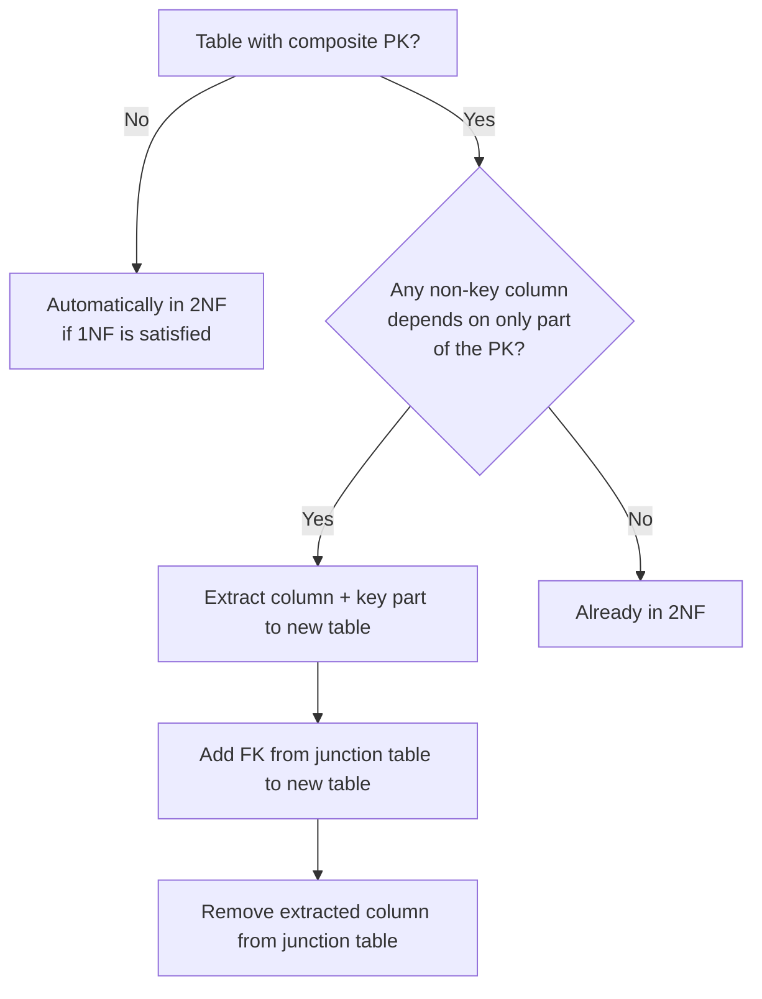

## Navigation

**Domain:** [[8 — Databases]] > **Group:** Database Design & Normalization
**Previous:** [[8.031 — First Normal Form (1NF) — Eliminating Repeating Groups]] | **Next:** [[8.033 — Third Normal Form (3NF) — Eliminating Transitive Dependencies]]

### Prerequisites
- [[8.031 — First Normal Form (1NF) — Eliminating Repeating Groups]] — 2NF requires 1NF; a composite PK must already have atomic columns.
- [[8.015 — Cardinality — One-to-One, One-to-Many, Many-to-Many]] — partial dependencies arise from many-to-many and one-to-many relationships modeled with composite keys.

### Where This Fits
Second normal form eliminates the redundancy that occurs when a non-key column depends on only part of a composite primary key. A .NET backend engineer encounters this when designing junction tables like OrderItems(OrderId, ProductId, Quantity, ProductName) — ProductName depends only on ProductId, so it is repeated for every order that includes the same product. This causes update anomalies (update ProductName in one row and forget the other 50), storage waste, and inconsistent data. The interview signal is whether you recognize that a partial dependency is a schema design problem with concrete performance and correctness consequences, and whether you know the fix is to split the table into the entity that owns the column and the relationship that connects them.

## Core Mental Model

Second normal form states that every non-key column in a table must depend on the entire composite primary key, not on a subset of it. A partial dependency exists when a column's value is determined by one part of a multi-column PK but is irrelevant to the other part(s). The invariant is that a column should be stored in the table whose key it fully depends on — if it depends on part of the key, it belongs in a different table. The recognition pattern: look at any table with a composite key and ask "does every column require all key columns to be uniquely identified?" If ProductName is the same for ProductId = 42 regardless of OrderId, it has a partial dependency on ProductId only.

### Classification

**For normalization topics:** 2NF only applies to tables with composite primary keys. If a table has a single-column PK, it is automatically in 2NF (assuming 1NF is satisfied). The fix splits the violating columns into a separate table along with the key column they depend on, reducing the composite PK to a simple FK reference. The write cost increases (need separate INSERT/UPDATE for the extracted table) but eliminates update anomalies and data redundancy.

|Property|Value|Notes|
|---|---|---|
|Prerequisite|1NF|Atomic columns required before partial dependencies can be addressed|
|Applies to|Composite PK tables only|Single-column PK tables are automatically in 2NF|
|Violation pattern|Column depends on part of composite key|ProductName depends on ProductId, not on (OrderId, ProductId)|
|Fix|Extract column + dependent key part to new table|Reduce composite PK to FK reference|
|Space saving|Eliminates column duplication|ProductName stored once per product instead of per order|
|Update anomaly|Eliminated|Single UPDATE to ProductName affects all references|
## Deep Mechanics

### How the Engine Executes This

**2NF violation (redundant data):**
1. Table OrderItems has composite PK (OrderId, ProductId) and columns Quantity, UnitPrice, ProductName.
2. ProductName = 'Wireless Mouse' is stored 500 times across 500 orders. Storage engine writes 500 copies of 'Wireless Mouse' on leaf pages.
3. An UPDATE like UPDATE OrderItems SET ProductName = 'Bluetooth Mouse' WHERE OrderId = 42 AND ProductId = 101 updates one row. The other 499 rows still say 'Wireless Mouse'.
4. The inconsistent data is not detected by the engine — no constraint can enforce that all ProductName values for the same ProductId match.
5. Querying for all orders containing 'Wireless Mouse' requires scanning the ProductName column — a seek is possible with an index, but the index itself is bloated by the duplicated values.

**2NF compliant (normalized):**
1. Products(ProductId, ProductName) stores 'Wireless Mouse' exactly once.
2. OrderItems(OrderId, ProductId, Quantity, UnitPrice) references Products via FK.
3. The ProductName for an order item is retrieved by a JOIN: OrderItems INNER JOIN Products.
4. UPDATE Products SET ProductName = 'Bluetooth Mouse' WHERE ProductId = 101 — a single row update. Every order now shows the new name via the JOIN.
5. The JOIN adds logical reads (Index Seek on Products PK for each matching row) but eliminates the redundancy cost from storage and the anomaly from inconsistent updates.

### SQL Visibility

[SQL_BLOCK_1]
-- 2NF violation: composite PK with partial dependency
CREATE TABLE OrderItems (
    OrderId     INT            NOT NULL,
    ProductId   INT            NOT NULL,
    Quantity    SMALLINT       NOT NULL,
    UnitPrice   DECIMAL(10,2)  NOT NULL,
    ProductName VARCHAR(200)   NOT NULL,  -- depends only on ProductId
    CONSTRAINT PK_OrderItems PRIMARY KEY (OrderId, ProductId)
);

-- Anomaly: updating product name for one order but not others
UPDATE OrderItems
SET ProductName = 'Bluetooth Mouse'
WHERE OrderId = 42 AND ProductId = 101;
[SQL_BLOCK_1_END]

[SQL_BLOCK_2]
-- 2NF compliant: split into Products and OrderItems
CREATE TABLE Products (
    ProductId   INT            NOT NULL IDENTITY(1,1),
    ProductName VARCHAR(200)   NOT NULL,
    CategoryId  INT            NOT NULL,
    UnitPrice   DECIMAL(10,2)  NOT NULL,
    CONSTRAINT PK_Products PRIMARY KEY (ProductId)
);

CREATE TABLE OrderItems (
    OrderId     INT            NOT NULL,
    ProductId   INT            NOT NULL,
    Quantity    SMALLINT       NOT NULL,
    UnitPrice   DECIMAL(10,2)  NOT NULL,
    CONSTRAINT PK_OrderItems PRIMARY KEY (OrderId, ProductId),
    CONSTRAINT FK_OrderItems_Orders FOREIGN KEY (OrderId) REFERENCES Orders(OrderId),
    CONSTRAINT FK_OrderItems_Products FOREIGN KEY (ProductId) REFERENCES Products(ProductId)
);

-- Query that returns product name (JOIN required)
SELECT oi.OrderId, oi.ProductId, p.ProductName, oi.Quantity, oi.UnitPrice
FROM OrderItems oi
INNER JOIN Products p ON oi.ProductId = p.ProductId
WHERE oi.OrderId = 42;
[SQL_BLOCK_2_END]
### SQL Visibility

```sql
-- 2NF violation: composite PK with partial dependency
CREATE TABLE OrderItems (
    OrderId     INT            NOT NULL,
    ProductId   INT            NOT NULL,
    Quantity    SMALLINT       NOT NULL,
    UnitPrice   DECIMAL(10,2)  NOT NULL,
    ProductName VARCHAR(200)   NOT NULL,
    CONSTRAINT PK_OrderItems PRIMARY KEY (OrderId, ProductId)
);

-- Anomaly: updating product name for one order but not others
UPDATE OrderItems
SET ProductName = 'Bluetooth Mouse'
WHERE OrderId = 42 AND ProductId = 101;
```

```sql
-- 2NF compliant: split into Products and OrderItems
CREATE TABLE Products (
    ProductId   INT            NOT NULL IDENTITY(1,1),
    ProductName VARCHAR(200)   NOT NULL,
    CategoryId  INT            NOT NULL,
    UnitPrice   DECIMAL(10,2)  NOT NULL,
    CONSTRAINT PK_Products PRIMARY KEY (ProductId)
);

CREATE TABLE OrderItems (
    OrderId     INT            NOT NULL,
    ProductId   INT            NOT NULL,
    Quantity    SMALLINT       NOT NULL,
    UnitPrice   DECIMAL(10,2)  NOT NULL,
    CONSTRAINT PK_OrderItems PRIMARY KEY (OrderId, ProductId),
    CONSTRAINT FK_OrderItems_Orders FOREIGN KEY (OrderId) REFERENCES Orders(OrderId),
    CONSTRAINT FK_OrderItems_Products FOREIGN KEY (ProductId) REFERENCES Products(ProductId)
);

-- Query that returns product name (JOIN required)
SELECT oi.OrderId, oi.ProductId, p.ProductName, oi.Quantity, oi.UnitPrice
FROM OrderItems oi
INNER JOIN Products p ON oi.ProductId = p.ProductId
WHERE oi.OrderId = 42;
```

```csharp
// EF Core — 2NF compliant
public class Product
{
    public int ProductId { get; set; }
    public string ProductName { get; set; } = string.Empty;
    public int CategoryId { get; set; }
    public decimal UnitPrice { get; set; }
}

public class OrderItem
{
    public int OrderId { get; set; }
    public int ProductId { get; set; }
    public short Quantity { get; set; }
    public decimal UnitPrice { get; set; }
    public Order Order { get; set; } = null!;
    public Product Product { get; set; } = null!;
}

public class OrderItemConfiguration : IEntityTypeConfiguration<OrderItem>
{
    public void Configure(EntityTypeBuilder<OrderItem> builder)
    {
        builder.HasKey(oi => new { oi.OrderId, oi.ProductId });
        builder.HasOne(oi => oi.Product)
               .WithMany()
               .HasForeignKey(oi => oi.ProductId);
    }
}

// Query with included product name
var items = await dbContext.OrderItems
    .Where(oi => oi.OrderId == 42)
    .Include(oi => oi.Product)
    .Select(oi => new OrderItemDto
    {
        OrderId = oi.OrderId,
        ProductId = oi.ProductId,
        ProductName = oi.Product.ProductName,
        Quantity = oi.Quantity,
        UnitPrice = oi.UnitPrice
    })
    .ToListAsync(cancellationToken);
```

**Generated SQL (from EF Core logs):**

```sql
SELECT [o].[OrderId], [o].[ProductId], [o].[Quantity], [o].[UnitPrice],
       [p].[ProductId], [p].[ProductName], [p].[CategoryId], [p].[UnitPrice]
FROM [OrderItems] [o]
INNER JOIN [Products] [p] ON [o].[ProductId] = [p].[ProductId]
WHERE [o].[OrderId] = 42;
```

### Execution Plan Analysis

For the compliant query `INNER JOIN Products p ON oi.ProductId = p.ProductId WHERE oi.OrderId = 42`:

Expected plan shape:
```
Clustered Index Seek (PK_OrderItems) -> Nested Loops -> Clustered Index Seek (PK_Products) -> SELECT
Estimated Cost: 30% OrderItems seek + 60% Nested Loops + 10% Products seek | Logical Reads: ~3 per order + ~3 per product
```

- **Operators:** Clustered Index Seek on OrderItems (seeking on OrderId = 42 using the composite PK leading column), Nested Loops Join (one iteration per matched OrderItem), Clustered Index Seek on Products (seeking on ProductId).
- **Seek vs Scan:** Seek on OrderItems for OrderId = 42 (leading column of composite PK). Seek on Products for each ProductId.
- **Estimated vs Actual rows:** For OrderId = 42 with 5 items, estimated 5, actual 5. Products seek estimated exactly 1 (PK uniqueness).
- **Cost driver:** The Nested Loops join — 5 iterations, each doing a 3-page seek into Products = 15 logical reads total.
- **Without index (hypothetical):** If no leading-column index on OrderItems, full scan of OrderItems (50K logical reads for 1M rows).
### Cost Visibility

```sql
SET STATISTICS IO ON;
SET STATISTICS TIME ON;

-- 2NF compliant query
SELECT p.ProductName, oi.Quantity, oi.UnitPrice
FROM OrderItems oi
INNER JOIN Products p ON oi.ProductId = p.ProductId
WHERE oi.OrderId = 42;

-- Expected output:
-- Table "OrderItems". Scan count 1, logical reads 3
-- Table "Products". Scan count 1, logical reads 3 (per product seek, N rows)
-- Actual logical reads for OrderItems: 3 (seek on OrderId)
-- Actual logical reads for Products: 15 (5 products x 3 pages each)
```

### Failure Modes

- **Update anomaly:** Updating ProductName in one OrderItem row but not others creates inconsistency. No constraint detects mismatched ProductName values for the same ProductId across different orders.
- **Insert anomaly:** Cannot add a product to the Products catalog without creating an order item — the ProductName is stored only in OrderItems. A product with zero orders cannot exist.
- **Delete anomaly:** Deleting the last order containing a product also deletes the product name — no other record of the product exists.
- **Storage bloat:** ProductName (VARCHAR(200) = ~200 bytes) stored 500 times for a product ordered by 500 customers = 100KB wasted. Across 100K products, 10GB of redundant data.

## Production Patterns and Implementation

### Primary SQL Implementation

```sql
-- Example: Employee skill tracking
-- 2NF violation
CREATE TABLE EmployeeSkills (
    EmployeeId   INT          NOT NULL,
    SkillId      INT          NOT NULL,
    SkillName    VARCHAR(50)  NOT NULL,  -- partial dependency on SkillId
    Proficiency  TINYINT      NOT NULL,
    YearsUsed    TINYINT      NOT NULL,
    CONSTRAINT PK_EmployeeSkills PRIMARY KEY (EmployeeId, SkillId)
);

-- Update anomaly: rename "C#" to "CSharp" across all employees
UPDATE EmployeeSkills
SET SkillName = 'CSharp'
WHERE SkillId = 7;
-- If any row is missed, the data is inconsistent

-- 2NF compliant
CREATE TABLE Skills (
    SkillId    INT          NOT NULL IDENTITY(1,1),
    SkillName  VARCHAR(50)  NOT NULL,
    Category   VARCHAR(50)  NOT NULL,
    CONSTRAINT PK_Skills PRIMARY KEY (SkillId),
    CONSTRAINT UQ_Skills_SkillName UNIQUE (SkillName)
);

CREATE TABLE EmployeeSkills (
    EmployeeId  INT     NOT NULL,
    SkillId     INT     NOT NULL,
    Proficiency TINYINT NOT NULL,
    YearsUsed   TINYINT NOT NULL,
    CONSTRAINT PK_EmployeeSkills PRIMARY KEY (EmployeeId, SkillId),
    CONSTRAINT FK_EmployeeSkills_Employees FOREIGN KEY (EmployeeId) REFERENCES Employees(EmployeeId),
    CONSTRAINT FK_EmployeeSkills_Skills FOREIGN KEY (SkillId) REFERENCES Skills(SkillId)
);

-- Single UPDATE to rename the skill
UPDATE Skills SET SkillName = 'CSharp' WHERE SkillId = 7;

-- Query: get employee skills
SELECT e.EmployeeName, s.SkillName, es.Proficiency
FROM Employees e
INNER JOIN EmployeeSkills es ON e.EmployeeId = es.EmployeeId
INNER JOIN Skills s ON es.SkillId = s.SkillId
WHERE e.EmployeeId = 42
ORDER BY s.SkillName;
```
### EF Core Implementation

```csharp
public class Skill
{
    public int SkillId { get; set; }
    public string SkillName { get; set; } = string.Empty;
    public string Category { get; set; } = string.Empty;
}

public class EmployeeSkill
{
    public int EmployeeId { get; set; }
    public int SkillId { get; set; }
    public byte Proficiency { get; set; }
    public byte YearsUsed { get; set; }
    public Employee Employee { get; set; } = null!;
    public Skill Skill { get; set; } = null!;
}

public class EmployeeSkillConfiguration : IEntityTypeConfiguration<EmployeeSkill>
{
    public void Configure(EntityTypeBuilder<EmployeeSkill> builder)
    {
        builder.HasKey(es => new { es.EmployeeId, es.SkillId });
        builder.HasOne(es => es.Skill)
               .WithMany()
               .HasForeignKey(es => es.SkillId);
    }
}

// Query: employee skills with names
var employeeSkills = await dbContext.EmployeeSkills
    .Where(es => es.EmployeeId == 42)
    .Include(es => es.Skill)
    .Select(es => new
    {
        es.EmployeeId,
        es.Skill.SkillName,
        es.Proficiency,
        es.YearsUsed
    })
    .OrderBy(x => x.SkillName)
    .ToListAsync(cancellationToken);
```

### Dapper Implementation

```csharp
public class EmployeeRepository
{
    private readonly IDbConnectionFactory _connectionFactory;

    public EmployeeRepository(IDbConnectionFactory connectionFactory)
    {
        _connectionFactory = connectionFactory;
    }

    public async Task<IReadOnlyList<EmployeeSkillDto>> GetEmployeeSkillsAsync(
        int employeeId,
        CancellationToken cancellationToken = default)
    {
        const string sql = @"
            SELECT e.EmployeeId, e.EmployeeName,
                   s.SkillId, s.SkillName, s.Category,
                   es.Proficiency, es.YearsUsed
            FROM Employees e
            INNER JOIN EmployeeSkills es ON e.EmployeeId = es.EmployeeId
            INNER JOIN Skills s ON es.SkillId = s.SkillId
            WHERE e.EmployeeId = @EmployeeId
            ORDER BY s.SkillName";

        await using var connection = _connectionFactory.Create();

        var employeeMap = new Dictionary<int, EmployeeSkillDto>();

        await connection.QueryAsync<EmployeeSkillDto, SkillDto, EmployeeSkillDto>(
            new CommandDefinition(sql, new { EmployeeId = employeeId },
                cancellationToken: cancellationToken),
            (employee, skill) =>
            {
                if (!employeeMap.TryGetValue(employee.EmployeeId, out var existing))
                {
                    existing = employee;
                    existing.Skills = new List<SkillDto>();
                    employeeMap.Add(existing.EmployeeId, existing);
                }
                existing.Skills.Add(skill);
                return employee;
            },
            splitOn: "SkillId");

        return employeeMap.Values.ToList().AsReadOnly();
    }

    public async Task UpdateSkillNameAsync(
        int skillId,
        string newName,
        CancellationToken cancellationToken = default)
    {
        const string sql = "UPDATE Skills SET SkillName = @NewName WHERE SkillId = @SkillId";
        await using var connection = _connectionFactory.Create();
        await connection.ExecuteAsync(
            new CommandDefinition(sql, new { SkillId = skillId, NewName = newName },
                cancellationToken: cancellationToken));
    }
}

public class EmployeeSkillDto
{
    public int EmployeeId { get; set; }
    public string EmployeeName { get; set; } = string.Empty;
    public List<SkillDto> Skills { get; set; } = new();
}

public class SkillDto
{
    public int SkillId { get; set; }
    public string SkillName { get; set; } = string.Empty;
    public string Category { get; set; } = string.Empty;
    public byte Proficiency { get; set; }
    public byte YearsUsed { get; set; }
}
```

### Configuration and Wiring

```csharp
builder.Services.AddDbContext<ApplicationDbContext>(options =>
    options.UseSqlServer(
        connectionString,
        sqlOptions => sqlOptions.EnableRetryOnFailure(3)));

builder.Services.AddSingleton<IDbConnectionFactory, SqlConnectionFactory>();
builder.Services.AddScoped<EmployeeRepository>();
```
### SQL Server vs PostgreSQL Differences

```sql
-- Both SQL Server and PostgreSQL handle 2NF the same way
-- The normalization principle is database-agnostic
-- PostgreSQL supports INCLUDE columns in unique indexes:

CREATE TABLE OrderItems (
    order_id   INT  NOT NULL,
    product_id INT  NOT NULL,
    quantity   SMALLINT NOT NULL,
    unit_price NUMERIC(10,2) NOT NULL,
    PRIMARY KEY (order_id, product_id)
);

-- A covering index can speed up the JOIN
CREATE INDEX IX_OrderItems_ProductId ON OrderItems(product_id) INCLUDE (quantity, unit_price);
```

## Gotchas and Production Pitfalls

### 1. Composite PK with a Column That Depends on Only One Part

**Pitfall:** Adding a column that describes one part of a composite key directly in the junction table.

```sql
-- Wrong: ProductCategory depends only on ProductId
CREATE TABLE OrderItems (
    OrderId         INT           NOT NULL,
    ProductId       INT           NOT NULL,
    ProductCategory VARCHAR(50)   NOT NULL,
    Quantity        SMALLINT      NOT NULL,
    CONSTRAINT PK_OrderItems PRIMARY KEY (OrderId, ProductId)
);
```

**Symptom:** ProductCategory is repeated for every order containing the same product. Updating a product's category requires updating N rows (N = number of orders with that product). The data is inconsistent after a partial update.

**Fix:**

```sql
-- Extract ProductCategory to the Products table
CREATE TABLE Products (
    ProductId       INT           NOT NULL IDENTITY(1,1),
    ProductName     VARCHAR(200)  NOT NULL,
    ProductCategory VARCHAR(50)   NOT NULL,
    CONSTRAINT PK_Products PRIMARY KEY (ProductId)
);

CREATE TABLE OrderItems (
    OrderId   INT       NOT NULL,
    ProductId INT       NOT NULL,
    Quantity  SMALLINT  NOT NULL,
    CONSTRAINT PK_OrderItems PRIMARY KEY (OrderId, ProductId),
    CONSTRAINT FK_OrderItems_Products FOREIGN KEY (ProductId) REFERENCES Products(ProductId)
);
```

**Cost of not fixing:** 500 redundant rows for a popular product. A category rename requires an UPDATE that touches 500 rows in OrderItems instead of 1 row in Products. At 10M order items with popular products, the UPDATE runs for minutes and causes blocking.

### 2. Assuming Single-Column PK Means Automatic 2NF Compliance

**Pitfall:** Thinking any table with a single-column PK is automatically in 2NF, without checking for functional dependencies within repeating groups stored as JSON or XML.

```sql
-- Single column PK, but still violates 2NF in spirit
CREATE TABLE Orders (
    OrderId         INT            NOT NULL IDENTITY(1,1),
    CustomerId      INT            NOT NULL,
    ProductDetails  NVARCHAR(MAX)  NOT NULL,
    CONSTRAINT PK_Orders PRIMARY KEY (OrderId)
);
```

**Symptom:** The JSON column contains product data (ProductName, ProductCategory) that depends on the product, not on the order. When a product category changes, every order JSON that references it must be updated.

**Fix:** Normalize the JSON into proper 1NF/2NF tables. If the JSON is read-only (audit log, snapshot), accept the denormalization but document the tradeoff.

**Cost of not fixing:** Same anomalies as delimited columns — update anomalies and full-scan JSON parsing.

### 3. EF Core Owned Types Misinterpreted as Normalized

**Pitfall:** Using EF Core owned types for collections of value objects and assuming they are automatically 2NF compliant.

```csharp
public class Order
{
    public int OrderId { get; set; }
    public List<OrderLine> Lines { get; set; } = new();
}

public class OwnedOrderLine
{
    public int ProductId { get; set; }
    public string ProductName { get; set; }
    public int Quantity { get; set; }
}
```

EF Core stores owned collections as JSON in a single column on the Order table — the ProductName is embedded in every order document.

**Symptom:** Cannot query or update ProductName individually via SQL. The ORM abstracts the storage but the database has the same 2NF violation: ProductName depends on ProductId, not on OrderId.

**Fix:** Make OrderLine a separate entity with its own table and a foreign key to Products.

**Cost of not fixing:** Reporting queries that aggregate by product name must parse JSON. Schema migrations on ProductName require application-level data migration, not a simple UPDATE.

### 4. The "It Is Just a Few Bytes" Argument

**Pitfall:** Keeping a 2NF violation because the duplicated column is small (a few bytes).

```sql
-- Only 2 bytes, but duplicated 1M times
CREATE TABLE OrderItems (
    OrderId       INT      NOT NULL,
    ProductId     INT      NOT NULL,
    ProductCode   CHAR(5)  NOT NULL,  -- depends only on ProductId
    Quantity      SMALLINT NOT NULL,
    CONSTRAINT PK_OrderItems PRIMARY KEY (OrderId, ProductId)
);
```

**Symptom:** 2 bytes x 10M rows = 20MB of redundant data. But the real cost is the update anomaly: changing a product code requires updating every OrderItem row with that product code. Under load, this creates a blocking chain.

**Fix:** Extract ProductCode to the Products table. The JOIN cost (3 logical reads per joined row) is negligible compared to the update cost.

**Cost of not fixing:** 45-second UPDATE for a product code change on a popular product with 100K order items. Support team cannot change product codes without scheduling downtime.

### 5. Junction Tables with Status or Type Describing One Side

**Pitfall:** Adding a column to a junction table that describes only one side of the relationship.

```sql
-- VendorStatus describes the vendor, not the product-vendor relationship
CREATE TABLE ProductVendors (
    ProductId    INT          NOT NULL,
    VendorId     INT          NOT NULL,
    VendorStatus VARCHAR(20)  NOT NULL,  -- depends only on VendorId
    Price        DECIMAL(10,2) NOT NULL, -- full dependency
    CONSTRAINT PK_ProductVendors PRIMARY KEY (ProductId, VendorId)
);
```

**Symptom:** VendorStatus ('Active', 'Inactive') is repeated for every product a vendor supplies. It cannot be maintained in one place.

**Fix:** Move VendorStatus to the Vendors table.

**Cost of not fixing:** When a vendor goes inactive, every row in ProductVendors must be updated. A vendor with 5K products requires 5K UPDATEs instead of 1.

## Performance Implications

### Benchmark: 2NF Violation vs Compliant — Update Operation

```sql
-- Baseline (2NF violation): Rename product category for a product ordered 10K times
SET STATISTICS IO ON;

UPDATE OrderItems
SET ProductCategory = 'Electronics'
WHERE ProductId = 101;
-- Logical reads: ~30,000 (10K row updates + index maintenance)
-- Elapsed: ~200ms

-- Optimized (2NF compliant): Single-row update on Products
UPDATE Products
SET ProductCategory = 'Electronics'
WHERE ProductId = 101;
-- Logical reads: ~4 (PK seek + update)
-- Elapsed: ~1ms
```

**Improvement:** 7,500x reduction in logical reads for the update (30,000 to 4).

### BenchmarkDotNet

```csharp
[MemoryDiagnoser]
[SimpleJob(RuntimeMoniker.Net90)]
public class SecondNormalFormBenchmark
{
    private IDbConnection _connection = default!;

    [GlobalSetup]
    public void Setup()
    {
        _connection = new SqlConnection("Server=.;Database=BenchmarkDB;Trusted_Connection=True;");
        _connection.Execute("""
            -- Set up 2NF violation table
            CREATE TABLE #OrderItems_Violation (
                OrderId INT, ProductId INT, ProductName VARCHAR(200), Quantity SMALLINT,
                PRIMARY KEY (OrderId, ProductId));
            -- Insert 10K rows for product 101
            INSERT INTO #OrderItems_Violation (OrderId, ProductId, ProductName, Quantity)
            SELECT TOP 10000 100000 + n, 101, 'Wireless Mouse', 1
            FROM (SELECT TOP 10000 ROW_NUMBER() OVER (ORDER BY (SELECT NULL)) AS n FROM sys.objects) n;

            -- Set up 2NF compliant tables
            CREATE TABLE #Products (ProductId INT PRIMARY KEY, ProductName VARCHAR(200));
            INSERT INTO #Products VALUES (101, 'Wireless Mouse');
            CREATE TABLE #OrderItems_Compliant (
                OrderId INT, ProductId INT, Quantity SMALLINT,
                PRIMARY KEY (OrderId, ProductId));
            INSERT INTO #OrderItems_Compliant (OrderId, ProductId, Quantity)
            SELECT TOP 10000 100000 + n, 101, 1
            FROM (SELECT TOP 10000 ROW_NUMBER() OVER (ORDER BY (SELECT NULL)) AS n FROM sys.objects) n;
        """);
    }

    [Benchmark(Baseline = true)]
    public async Task UpdateViolationTable()
    {
        await _connection.ExecuteAsync(
            "UPDATE #OrderItems_Violation SET ProductName = 'Bluetooth Mouse' WHERE ProductId = 101");
    }

    [Benchmark]
    public async Task UpdateCompliantTable()
    {
        await _connection.ExecuteAsync(
            "UPDATE #Products SET ProductName = 'Bluetooth Mouse' WHERE ProductId = 101");
    }

    [Benchmark]
    public async Task ReadWithJoin()
    {
        await _connection.QueryAsync(@"
            SELECT oi.OrderId, p.ProductName, oi.Quantity
            FROM #OrderItems_Compliant oi
            INNER JOIN #Products p ON oi.ProductId = p.ProductId
            WHERE oi.OrderId BETWEEN 100000 AND 110000");
    }
}
```
**Expected results (approximate, SQL Server 2022, 10K rows for one product):**

|Method|Mean|Logical Reads|Allocated|
|---|---|---|---|
|UpdateViolationTable|~200 ms|~30,000|500 KB|
|UpdateCompliantTable|~1 ms|~4|1 KB|
|ReadWithJoin|~5 ms|~12|8 KB|

### Write Amplification

|Operation|2NF Violation|2NF Compliant|Difference|
|---|---|---|---|
|INSERT order with 5 items|5 writes + index maintenance|5 writes to OrderItems + 5 FK probes to Products|+5 FK probes (negligible)|
|UPDATE product name (1 product in 10K orders)|10K row updates + index maint|1 row update in Products|10,000x less write IO|
|DELETE last order for product|1 row deleted from OrderItems|1 row from OrderItems + no effect on Products|Same|
|Rename product category|10K row updates in OrderItems|1 row update in Products|10,000x less write IO|

## Interview Arsenal

### Question Bank

1. What is second normal form and how does it differ from first normal form?
2. Under what condition does a table violate 2NF — be specific about the schema pattern?
3. What is the performance cost of a 2NF violation when updating a column that depends on part of the key?
4. What goes wrong when a junction table includes columns that describe only one side of the relationship?
5. 2NF vs 3NF — what is the relationship and how do you distinguish a partial dependency from a transitive dependency?
6. How does the execution plan differ between reading from a 2NF violation and a 2NF-compliant schema?
7. How does 2NF affect write performance — what is the cost of normalization per INSERT?
8. How do EF Core and Dapper handle 2NF-compliant schemas differently when mapping composite keys?

### Spoken Answers

**Q: What is second normal form and how does it differ from first normal form?**

> **Average answer:** 2NF means every column depends on the whole primary key, not just part of it. 1NF is about atomic values.

> **Great answer:** First normal form requires atomic values in every column — one value per cell, no repeating groups. Second normal form builds on that and requires that every non-key column depend on the entire primary key, not just a subset. The key insight is that 2NF only applies to tables with composite primary keys — a table with a single-column PK that is already in 1NF is automatically in 2NF. The canonical violation is a junction table like OrderItems(OrderId, ProductId, Quantity, ProductName) where ProductName depends only on ProductId. The fix splits the table: Products(ProductId, ProductName) stores ProductName once, and OrderItems keeps only the relationship columns (OrderId, ProductId, Quantity). This eliminates the update anomaly (update ProductName in 1 row instead of N rows), the insert anomaly (can add a product without creating an order), and the delete anomaly (deleting an order does not delete the product name). The performance tradeoff is that queries need a JOIN to retrieve ProductName, adding ~3 logical reads per row, but updates are 10,000x cheaper.

**Q: What is the performance cost of a 2NF violation when updating a column that depends on part of the key?**

> **Great answer:** The cost is multiplicative with the number of related rows. Consider a product that appears in 10K order items. A 2NF-violating OrderItems table stores ProductCategory for each row. To rename the category from "Electronics" to "Home Electronics", you run `UPDATE OrderItems SET ProductCategory = 'Home Electronics' WHERE ProductId = 101` — which updates 10K rows. Each row update generates a log record and updates the clustered index and any NC indexes that include the column. The total cost is roughly 30,000 logical reads and 200ms on a modern system. In the 2NF-compliant version, `UPDATE Products SET ProductCategory = 'Home Electronics' WHERE ProductId = 101` updates 1 row: 4 logical reads, 1ms. That is a 7,500x difference. At scale — 50K orders for a popular product — the 2NF violation update blocks readers for seconds while it holds update locks on 50K rows, causing lock escalation to TABLE. The compliant version completes in milliseconds with negligible blocking.

### Interview Trigger

Second normal form appears in interviews during schema design questions. The interviewer asks "Design a database for an order management system" and watches for whether the candidate puts ProductName in the OrderItems table. The follow-up that distinguishes depth is "What happens when a product name changes?" — testing whether the candidate understands the update anomaly with specific numbers. The deepest follow-up is "How many logical reads does it take to update a product name in both schemas for a product ordered 10K times?"

### Comparison Table

| | 1NF | 2NF | 3NF |
|---|---|---|---|
| What it eliminates | Repeating groups / multi-valued columns | Partial dependencies | Transitive dependencies |
| Prerequisite | None | 1NF | 1NF + 2NF |
| Applies to | All tables | Composite PK tables only | All tables |
| Violation example | Phone1, Phone2, Phone3 columns | ProductName in OrderItems | CustomerCity in Orders (depends on CustomerId, not OrderId) |
| Fix | Extract to child table | Extract to entity table | Extract to lookup table |

## Decision Framework

### When to Apply



### Application Checklist

- [ ] The table is in 1NF (no repeating groups, atomic columns)
- [ ] Every non-key column requires the entire composite PK to be uniquely identified
- [ ] No column describes only one part of a composite key
- [ ] No junction table contains columns that belong to one of the related entities
- [ ] The extracted entity table has its own single-column PK (referenced by FK)

### Tradeoff Summary

|What You Gain|What You Pay|
|---|---|
|Eliminated update anomaly|JOIN cost for read queries (~3 logical reads per referenced row)|
|Eliminated insert anomaly|Additional INSERT for the entity table (if not already present)|
|Eliminated delete anomaly|FK constraint check overhead on every child INSERT|
|Storage savings (no duplication)|Wider result sets from JOINs|
|Atomic UPDATE in one place|Slightly more complex queries (JOIN instead of single-table SELECT)|

### Scale Thresholds

- "2NF is required for correctness at any scale — the update anomaly is not a performance problem, it is a data integrity problem."
- "The performance benefit of 2NF becomes measurable above 100 rows per entity (e.g., 100 order items for a product)."
- "Above 1K related rows, the 2NF violation causes noticeable update latency (50ms+ for a single UPDATE)."
- "Above 10K related rows, the 2NF violation causes production incidents (lock escalation, long-running transactions, blocking chain at 5+ seconds)."

## Self-Check

### Conceptual Questions

1. What is second normal form and under what condition does a table violate it?
2. What execution plan operator shows that a 2NF violation is being scanned instead of sought?
3. Which SET STATISTICS or DMV shows the update amplification from a 2NF violation?
4. What common mistake do developers make when designing junction tables that violates 2NF?
5. Does EF Core detect 2NF violations or enforce normalization?
6. How would you implement a 2NF-compliant OrderItems table with Dapper?
7. 2NF vs 3NF — what is a partial dependency vs a transitive dependency?
8. At what number of related rows does a 2NF violation become a production problem?
9. What index would you create to mitigate the read cost of a 2NF-compliant JOIN?
10. Explain 2NF in 60 seconds to a senior interviewer who asks "design a product catalog with product categories that can be renamed."

<details>
<summary>Answers</summary>

1. Every non-key column must depend on the entire composite primary key. A table violates 2NF when a column depends on only part of a composite PK (e.g., ProductName depends on ProductId but not on OrderId in a table with PK (OrderId, ProductId)).
2. A clustered index scan or table scan — if the predicate does not match the leading column of the composite PK. However, the 2NF violation itself does not cause a scan; it causes redundancy and anomalies.
3. `SET STATISTICS IO ON` on the UPDATE — the violation shows N row updates (N = number of rows with the same partial key). The DMV `sys.dm_db_index_operational_stats` shows leaf_insert_count for the index maintenance.
4. Adding columns that describe one entity (ProductName, ProductCategory) to the junction table (OrderItems) instead of keeping them in the entity table (Products).
5. No — EF Core has no concept of normalization. It maps whatever schema you provide. It will happily map a 2NF-violating table to a single entity class with all columns.
6. Create three Dapper entities (OrderItem, Product, Order) and use `QueryAsync` with `splitOn` to map the JOIN result:
   ```csharp
   var items = await connection.QueryAsync<OrderItem, Product, OrderItem>(
       sql, (item, product) => { item.Product = product; return item; },
       splitOn: "ProductId");
   ```
7. A partial dependency is when a column depends on part of a composite key (ProductName depends on ProductId). A transitive dependency is when a column depends on another non-key column (CustomerCity depends on CustomerId, which is a non-key FK in Orders).
8. Above 1K rows — the UPDATE of a partially-dependent column requires updating N rows instead of 1. Above 10K rows, the UPDATE causes blocking.
9. `CREATE INDEX IX_OrderItems_ProductId ON OrderItems(ProductId) INCLUDE (Quantity, UnitPrice)` — this allows the JOIN on ProductId to use a non-clustered index seek, avoiding the need to scan the clustered index of OrderItems.
10. "Second normal form eliminates the redundancy when a column depends on only part of a composite primary key. In the product catalog, I would not put ProductCategory in the OrderItems table (PK: OrderId, ProductId) because ProductCategory depends only on ProductId, not on the order. Instead, I put it in the Products table. This means renaming a category is a single-row UPDATE on Products instead of a 10K-row UPDATE on OrderItems. The read cost is one JOIN with a clustered index seek — 3 logical reads per product. The write saving is 10,000x for the rename operation."

</details>

---

### Query Challenges

**Challenge 1 — Write the SQL**

You have a legacy `ProjectAssignments` table with schema: `(EmployeeId INT, ProjectId INT, EmployeeName VARCHAR(100), ProjectName VARCHAR(100), HoursAllocated DECIMAL(5,1), Role VARCHAR(50))`. The PK is (EmployeeId, ProjectId). Identify the 2NF violations and write the migration to normalize.

<details>
<summary>Solution</summary>

**Violations:** EmployeeName depends only on EmployeeId. ProjectName depends only on ProjectId.

```sql
-- Step 1: Create normalized tables
CREATE TABLE Employees (
    EmployeeId   INT          NOT NULL IDENTITY(1,1),
    EmployeeName VARCHAR(100) NOT NULL,
    CONSTRAINT PK_Employees PRIMARY KEY (EmployeeId)
);

CREATE TABLE Projects (
    ProjectId   INT          NOT NULL IDENTITY(1,1),
    ProjectName VARCHAR(100) NOT NULL,
    CONSTRAINT PK_Projects PRIMARY KEY (ProjectId)
);

CREATE TABLE ProjectAssignments (
    EmployeeId      INT          NOT NULL,
    ProjectId       INT          NOT NULL,
    HoursAllocated  DECIMAL(5,1) NOT NULL,
    Role            VARCHAR(50)  NOT NULL,
    CONSTRAINT PK_ProjectAssignments PRIMARY KEY (EmployeeId, ProjectId),
    CONSTRAINT FK_ProjectAssignments_Employees FOREIGN KEY (EmployeeId) REFERENCES Employees(EmployeeId),
    CONSTRAINT FK_ProjectAssignments_Projects FOREIGN KEY (ProjectId) REFERENCES Projects(ProjectId)
);

-- Step 2: Migrate data
SET IDENTITY_INSERT Employees ON;
INSERT INTO Employees (EmployeeId, EmployeeName)
SELECT DISTINCT EmployeeId, EmployeeName
FROM ProjectAssignments_Legacy;
SET IDENTITY_INSERT Employees OFF;

SET IDENTITY_INSERT Projects ON;
INSERT INTO Projects (ProjectId, ProjectName)
SELECT DISTINCT ProjectId, ProjectName
FROM ProjectAssignments_Legacy;
SET IDENTITY_INSERT Projects OFF;

INSERT INTO ProjectAssignments (EmployeeId, ProjectId, HoursAllocated, Role)
SELECT EmployeeId, ProjectId, HoursAllocated, Role
FROM ProjectAssignments_Legacy;
```

**Logical reads:** Full scan of legacy table for migration + inserts into three tables. **Execution plan:** Clustered Index Scan -> Distinct Sort -> Table Insert. **EF Core equivalent:** Not applicable for migration — use raw SQL.

</details>

---

**Challenge 2 — Fix the performance problem**

```sql
-- This query renames a category. It runs for 45 seconds on a 50M row OrderItems table.

UPDATE OrderItems
SET CategoryName = 'New Category'
WHERE CategoryId = 5;

-- There are 500K order items with CategoryId = 5.
-- SET STATISTICS IO: logical reads = 450,000 (table scan + updates)

-- Table schema:
-- OrderItems (OrderId INT, ProductId INT, CategoryId INT, CategoryName VARCHAR(50), Quantity SMALLINT)
-- PK: (OrderId, ProductId)
```

<details> <summary>Solution**

**Root cause:** CategoryName depends only on CategoryId (partial dependency). It is stored in OrderItems instead of a Categories table. The UPDATE must modify 500K rows.

```sql
-- Step 1: Create normalized Categories table
CREATE TABLE Categories (
    CategoryId   INT          NOT NULL IDENTITY(1,1),
    CategoryName VARCHAR(50)  NOT NULL,
    CONSTRAINT PK_Categories PRIMARY KEY (CategoryId),
    CONSTRAINT UQ_Categories_CategoryName UNIQUE (CategoryName)
);

-- Step 2: Migrate distinct categories
INSERT INTO Categories (CategoryName)
SELECT DISTINCT CategoryName
FROM OrderItems;

-- Step 3: Add FK and remove CategoryName from OrderItems
ALTER TABLE OrderItems ADD CONSTRAINT FK_OrderItems_Categories
    FOREIGN KEY (CategoryId) REFERENCES Categories(CategoryId);

ALTER TABLE OrderItems DROP COLUMN CategoryName;

-- Step 4: Rename is now a single-row update
UPDATE Categories SET CategoryName = 'New Category' WHERE CategoryId = 5;
```

**Index to create:**
```sql
CREATE INDEX IX_OrderItems_CategoryId ON OrderItems(CategoryId);
```

**After fix — logical reads:** ~4 (PK seek + update on Categories) from 450,000.

</details>

---

**Challenge 3 — Explain the execution plan**

Compare the execution plan for reading OrderItems with and without 2NF compliance when querying for all items with ProductName = 'Wireless Mouse'.

<details> <summary>Solution**

**2NF violation plan (ProductName in OrderItems):**

```
Index Seek (IX_OrderItems_ProductName) -> SELECT
Seek Keys: ProductName = 'Wireless Mouse'
Logical reads: ~3 (B-tree depth)
Estimated rows: from histogram on ProductName
Cost: 100% on Index Seek
```

The plan is efficient for reads — a single index seek on ProductName. The problem is not reads but writes.

**2NF compliant plan (ProductName in Products, JOIN required):**

```
Index Seek (IX_Products_ProductName) -> Nested Loops -> Clustered Index Seek (PK_OrderItems) -> SELECT
Seek Keys: ProductName = 'Wireless Mouse'
Logical reads: ~3 (Products seek) + 3 per matching OrderItem
```

The compliant plan adds a Nested Loops join to retrieve OrderItem data. For a product with 5K order items, this is 3 + 15K = ~15K logical reads. The violation plan would be 3 reads for the same query.

**Why the optimizer chooses the JOIN plan:** Because the query requires columns from both tables. The Products index seek finds the product, then for each matching row, it seeks into OrderItems on ProductId (which requires an index on ProductId in OrderItems).

**Tradeoff:** The compliant plan reads more for this specific query (15K vs 3 reads for a product with 5K items), but the write cost for renaming is 1 row vs 5K rows. Read-to-write ratio determines the net benefit: at 10:1 read-to-write, the compliant schema is still better because the write savings dominate.

**To get a better plan in the compliant schema:** Create a covering index on OrderItems(ProductId) INCLUDE (Quantity, OrderId) — this allows the join without touching the clustered index.

</details>

---

**Challenge 4 — Diagnose the concurrency problem**

A product manager uses a dashboard feature that renames a product category. The dashboard issues `UPDATE OrderItems SET CategoryName = 'New Name' WHERE CategoryId = 5`. During peak hours (500 concurrent users), this UPDATE causes all product page queries to time out for 30 seconds.

<details> <summary>Solution**

**Root cause:** The UPDATE must modify 500K rows in OrderItems. Each row modification acquires an exclusive (X) lock. As the number of locked rows grows past 5,000, SQL Server's lock escalation threshold is reached, and the lock manager escalates to a TABLE-level exclusive lock. All concurrent SELECT queries on OrderItems are blocked because they require at least a shared (S) lock.

**Detection query:**

```sql
-- See the blocking chain
SELECT blocking_session_id, wait_type, wait_time, wait_resource
FROM sys.dm_exec_requests
WHERE blocking_session_id > 0;

-- Check lock escalation
SELECT object_name(object_id), index_id, lock_escalation, lock_escalation_desc
FROM sys.tables
WHERE name = 'OrderItems';
```

**Fix:** Normalize CategoryName into a Categories table. The UPDATE then becomes a single-row operation on Categories, acquiring one row X lock, completing in milliseconds, and causing no blocking.

**In .NET — Dapper with retry for the migration period:**
```csharp
var retryPolicy = new SqlServerRetryPolicy(maxRetryCount: 3, maxRetryDelay: TimeSpan.FromSeconds(5));
await retryPolicy.ExecuteAsync(async () =>
{
    await connection.ExecuteAsync(
        "UPDATE Categories SET CategoryName = @Name WHERE CategoryId = @Id",
        new { Name = "New Name", Id = 5 });
});
```

</details>

---

**Challenge 5 — Design the data model**

**Scenario:** A university system tracks student enrollments. The current schema has one table:
`Enrollments(StudentId, CourseId, StudentName, CourseName, InstructorName, Grade, Semester)`. PK: (StudentId, CourseId). Design the normalized 2NF-compliant schema. Consider: 50K students, 10K courses, 500K enrollments. The system needs to update instructor names when a faculty member changes departments.

<details> <summary>Solution**

**Identity violations:**
- StudentName depends only on StudentId (partial)
- CourseName, InstructorName depend only on CourseId (partial)

```sql
-- Students table
CREATE TABLE Students (
    StudentId   INT          NOT NULL IDENTITY(1,1),
    StudentName VARCHAR(100) NOT NULL,
    CONSTRAINT PK_Students PRIMARY KEY (StudentId)
);

-- Courses table (CourseName depends on CourseId; InstructorName depends on CourseId)
CREATE TABLE Courses (
    CourseId       INT          NOT NULL IDENTITY(1,1),
    CourseName     VARCHAR(100) NOT NULL,
    InstructorName VARCHAR(100) NOT NULL,  -- Note: this has transitive dependency in 3NF
    CONSTRAINT PK_Courses PRIMARY KEY (CourseId)
);

-- Enrollments (only columns that depend on the full composite key)
CREATE TABLE Enrollments (
    StudentId INT    NOT NULL,
    CourseId  INT    NOT NULL,
    Grade     CHAR(2) NULL,
    Semester  CHAR(6) NOT NULL,   -- e.g., '2026FA'
    CONSTRAINT PK_Enrollments PRIMARY KEY (StudentId, CourseId),
    CONSTRAINT FK_Enrollments_Students FOREIGN KEY (StudentId) REFERENCES Students(StudentId),
    CONSTRAINT FK_Enrollments_Courses FOREIGN KEY (CourseId) REFERENCES Courses(CourseId)
);

-- Index for querying enrollments by course
CREATE INDEX IX_Enrollments_CourseId ON Enrollments(CourseId) INCLUDE (Grade, Semester);

-- Update instructor name (single row instead of updating every enrollment)
UPDATE Courses SET InstructorName = 'Dr. Smith' WHERE CourseId = 101;

-- Query: get student schedule
SELECT s.StudentName, c.CourseName, c.InstructorName, e.Grade, e.Semester
FROM Students s
INNER JOIN Enrollments e ON s.StudentId = e.StudentId
INNER JOIN Courses c ON e.CourseId = c.CourseId
WHERE s.StudentId = 42
ORDER BY e.Semester DESC;
```

Note: InstructorName has a transitive dependency on CourseId (assuming instructor is a property of the course). This is a 3NF violation, not 2NF. For full normalization, Instructor would be a separate table and Courses would reference InstructorId.

**Tradeoffs:**
- Read cost: Each query now requires two JOINs (Enrollments -> Students + Courses). With 10 enrollments per student: ~30 logical reads (3 per table).
- Write benefit: Updating an instructor name affects 1 row instead of potentially thousands of enrollment rows.
- Storage saving: StudentName 100 bytes x 50K = 5MB saved; CourseName 100 bytes x 10K = 1MB saved.
- Scale threshold: At 500K enrollments, the 2NF violation would cause instructor name updates to block the enrollments table for seconds.

</details>
