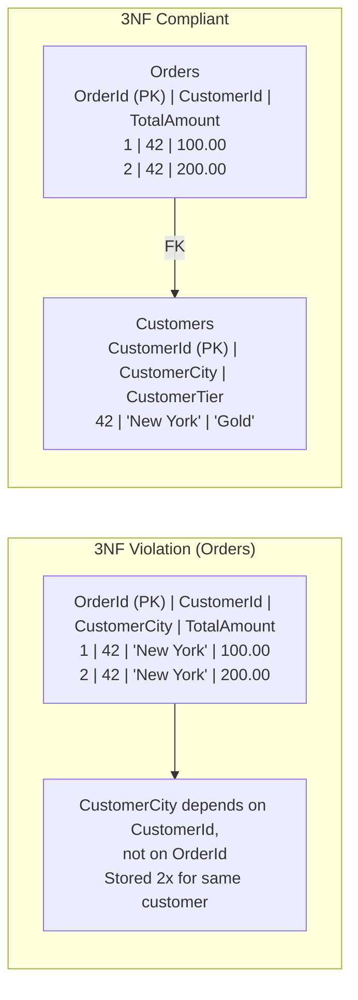
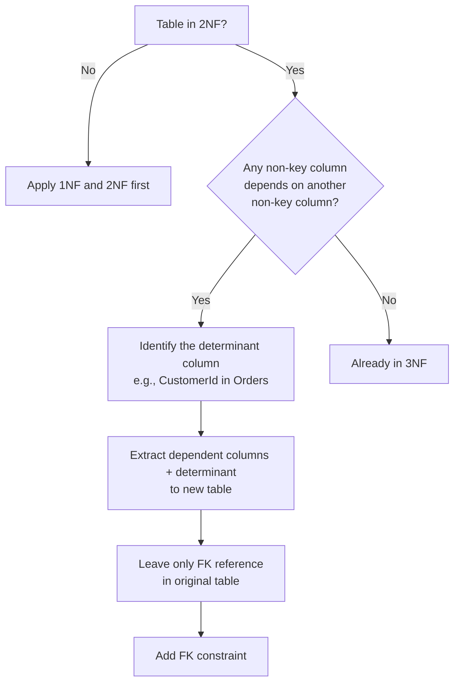

## Navigation

**Domain:** [[8 — Databases]] > **Group:** Database Design & Normalization
**Previous:** [[8.032 — Second Normal Form (2NF) — Eliminating Partial Dependencies]] | **Next:** [[8.034 — Boyce-Codd Normal Form — Stronger 3NF]]

### Prerequisites
- [[8.031 — First Normal Form (1NF) — Eliminating Repeating Groups]] — 3NF requires atomic columns.
- [[8.032 — Second Normal Form (2NF) — Eliminating Partial Dependencies]] — 3NF builds on 2NF by addressing dependencies on non-key columns.

### Where This Fits
Third normal form eliminates transitive dependencies: when a non-key column depends on another non-key column rather than directly on the primary key. A .NET backend engineer encounters this when a table like `Orders(OrderId, CustomerId, CustomerCity, CustomerTier)` stores customer attributes that should be in a Customers table. When CustomerTier changes from 'Gold' to 'Platinum', every order row for that customer must be updated — causing an update anomaly. The interview signal is whether you can distinguish a transitive dependency from a partial dependency, and whether you know that fixing 3NF violations is about eliminating data redundancy caused by functional dependencies that pass through a non-key column.

## Core Mental Model

Third normal form requires that every non-key column in a table depend directly on the primary key — never on another non-key column. A transitive dependency exists when column C depends on column B, and column B depends on the PK column A (A -> B -> C). The invariant is that every non-key column should be a fact about the key, not a fact about another non-key column. The recognition pattern: look for columns that describe another column rather than the key — in `Orders(OrderId, CustomerId, CustomerCity)`, CustomerCity describes the customer (CustomerId), not the order (OrderId). The fix is to extract the columns that describe the non-key entity into their own table, leaving only the FK reference.



### Classification

**For normalization topics:** 3NF applies to all tables (unlike 2NF which only applies to composite PKs). Both single-column and composite PK tables can have transitive dependencies. The classic example is a table where a non-key column is a FK to another entity — any columns describing that FK target are transitive dependencies. The fix eliminates redundancy and update/insert/delete anomalies. The query cost increases by one JOIN per extracted entity.

|Property|Value|Notes|
|---|---|---|
|Prerequisite|1NF + 2NF|Atomic columns and no partial dependencies required|
|Applies to|All tables|Both single and composite PK tables|
|Violation pattern|Non-key column depends on another non-key column|CustomerCity depends on CustomerId, not on OrderId|
|Fix|Extract dependent columns + the column they depend on to new table|Leave only FK in original table|
|Rule of thumb|"Nothing but the key"|Every column describes the key, not another column|

## Deep Mechanics

### How the Engine Executes This

**3NF violation (redundant data):**
1. Table `Orders` has PK = OrderId and columns `CustomerId`, `CustomerCity`, `CustomerTier`.
2. Customer 'Acme Corp' has CustomerTier = 'Gold' and CustomerCity = 'New York'.
3. Acme Corp places 1,000 orders. CustomerTier and CustomerCity are stored 1,000 times across 1,000 rows.
4. When Acme Corp moves to 'Boston', an UPDATE must touch all 1,000 rows — a write amplification of 1,000x.
5. If only 999 rows are updated (e.g., a batch job fails midway), the data is inconsistent. No constraint detects it.

**3NF compliant (normalized):**
1. `Customers(CustomerId, CustomerName, CustomerCity, CustomerTier)` stores each customer's attributes once.
2. `Orders(OrderId, CustomerId, TotalAmount)` references Customers via FK.
3. When Acme Corp moves to Boston, one UPDATE on Customers changes the city. Every subsequent query via JOIN shows the new city.
4. The JOIN from Orders to Customers adds ~3 logical reads per query, but the 1,000-row UPDATE is eliminated.

### SQL Visibility

```sql
-- 3NF violation: transitive dependency on CustomerId
CREATE TABLE Orders (
    OrderId       INT            NOT NULL IDENTITY(1,1),
    OrderDate     DATETIME2      NOT NULL,
    CustomerId    INT            NOT NULL,
    CustomerName  VARCHAR(100)   NOT NULL,  -- depends on CustomerId, not OrderId
    CustomerCity  VARCHAR(100)   NOT NULL,  -- depends on CustomerId
    CustomerTier  VARCHAR(20)    NOT NULL,  -- depends on CustomerId
    TotalAmount   DECIMAL(10,2)  NOT NULL,  -- depends on OrderId (correct)
    CONSTRAINT PK_Orders PRIMARY KEY (OrderId)
);

-- Update anomaly: customer moves to Boston
UPDATE Orders
SET CustomerCity = 'Boston'
WHERE CustomerId = 42;
-- Must update ALL 1,000 rows for CustomerId = 42
```

```sql
-- 3NF compliant: extract Customer details
CREATE TABLE Customers (
    CustomerId   INT           NOT NULL IDENTITY(1,1),
    CustomerName VARCHAR(100)  NOT NULL,
    CustomerCity VARCHAR(100)  NOT NULL,
    CustomerTier VARCHAR(20)   NOT NULL,
    CONSTRAINT PK_Customers PRIMARY KEY (CustomerId)
);

CREATE TABLE Orders (
    OrderId     INT            NOT NULL IDENTITY(1,1),
    OrderDate   DATETIME2      NOT NULL,
    CustomerId  INT            NOT NULL,
    TotalAmount DECIMAL(10,2)  NOT NULL,
    CONSTRAINT PK_Orders PRIMARY KEY (OrderId),
    CONSTRAINT FK_Orders_Customers FOREIGN KEY (CustomerId) REFERENCES Customers(CustomerId)
);

-- Single-row update for city change
UPDATE Customers SET CustomerCity = 'Boston' WHERE CustomerId = 42;

-- Query that returns order with customer city (JOIN required)
SELECT o.OrderId, o.OrderDate, c.CustomerName, c.CustomerCity, o.TotalAmount
FROM Orders o
INNER JOIN Customers c ON o.CustomerId = c.CustomerId
WHERE o.OrderId = 123;
```

```csharp
// EF Core — 3NF compliant
public class Customer
{
    public int CustomerId { get; set; }
    public string CustomerName { get; set; } = string.Empty;
    public string CustomerCity { get; set; } = string.Empty;
    public string CustomerTier { get; set; } = string.Empty;
}

public class Order
{
    public int OrderId { get; set; }
    public DateTime OrderDate { get; set; }
    public int CustomerId { get; set; }
    public decimal TotalAmount { get; set; }
    public Customer Customer { get; set; } = null!;
}

// Query with included customer data
var order = await dbContext.Orders
    .Where(o => o.OrderId == 123)
    .Include(o => o.Customer)
    .Select(o => new OrderDto
    {
        OrderId = o.OrderId,
        OrderDate = o.OrderDate,
        CustomerName = o.Customer.CustomerName,
        CustomerCity = o.Customer.CustomerCity,
        TotalAmount = o.TotalAmount
    })
    .FirstOrDefaultAsync(cancellationToken);
```

**Generated SQL (from EF Core logs):**

```sql
SELECT [o].[OrderId], [o].[OrderDate], [o].[TotalAmount],
       [c].[CustomerId], [c].[CustomerName], [c].[CustomerCity], [c].[CustomerTier]
FROM [Orders] [o]
INNER JOIN [Customers] [c] ON [o].[CustomerId] = [c].[CustomerId]
WHERE [o].[OrderId] = 123;
```

### Execution Plan Analysis

For the compliant query:

Expected plan shape:
```
Clustered Index Seek (PK_Orders) -> Nested Loops -> Clustered Index Seek (PK_Customers) -> SELECT
Estimated Cost: 30% Orders seek + 60% Nested Loops + 10% Customers seek | Logical Reads: ~3 + ~3
```

- **Operators:** Clustered Index Seek on PK_Orders (OrderId = 123, exactly 1 row), Nested Loops Join, Clustered Index Seek on PK_Customers (CustomerId from the matched order).
- **Seek vs Scan:** Both are seeks — PK seeks are SARGable and return exactly one row.
- **Estimated vs Actual rows:** Both exactly 1 (PK uniqueness).
- **Cost driver:** The Nested Loops join is negligible with 1 row.
- **Without index (hypothetical):** If there were no PK on Orders or Customers, both would be full scans — 500K logical reads for 10M rows.

### Cost Visibility

```sql
SET STATISTICS IO ON;

-- 3NF compliant query
SELECT o.OrderId, c.CustomerCity, o.TotalAmount
FROM Orders o
INNER JOIN Customers c ON o.CustomerId = c.CustomerId
WHERE o.OrderId = 123;

-- Expected output:
-- Table "Orders". Scan count 1, logical reads 3
-- Table "Customers". Scan count 1, logical reads 3

-- Equivalent 3NF violation query (if CustomerCity stored in Orders):
SELECT OrderId, CustomerCity, TotalAmount
FROM Orders
WHERE OrderId = 123;
-- Table "Orders". Scan count 1, logical reads 3
-- Same reads for a single-order lookup, but CustomerCity is duplicated across 1K rows
```

### Failure Modes

- **Update anomaly:** Customer moves to Boston. In the 3NF violation, UPDATE must modify every Order row for that customer. If one row is missed, the database has two cities for the same customer. No constraint detects this.
- **Insert anomaly:** Cannot add a new customer to the database without creating an order — because customer data lives only in the Orders table.
- **Delete anomaly:** Deleting a customer's last order also deletes the customer's name, city, and tier. If the customer is still active but has zero orders, their data is lost.
- **Storage bloat:** CustomerCity (100 bytes) stored 1,000 times for a customer with 1K orders = 100KB wasted per customer. For 10K customers with 500 orders each = 500MB.

## Production Patterns and Implementation

### Primary SQL Implementation

```sql
-- Example: Invoices with vendor details
-- 3NF violation
CREATE TABLE Invoices (
    InvoiceId      INT            NOT NULL IDENTITY(1,1),
    VendorId       INT            NOT NULL,
    VendorName     VARCHAR(100)   NOT NULL,  -- depends on VendorId
    VendorCity     VARCHAR(100)   NOT NULL,  -- depends on VendorId
    VendorTaxId    VARCHAR(20)    NOT NULL,  -- depends on VendorId
    InvoiceDate    DATE           NOT NULL,
    TotalAmount    DECIMAL(12,2)  NOT NULL,
    CONSTRAINT PK_Invoices PRIMARY KEY (InvoiceId)
);

-- 3NF compliant
CREATE TABLE Vendors (
    VendorId    INT           NOT NULL IDENTITY(1,1),
    VendorName  VARCHAR(100)  NOT NULL,
    VendorCity  VARCHAR(100)  NOT NULL,
    VendorTaxId VARCHAR(20)   NOT NULL,
    CONSTRAINT PK_Vendors PRIMARY KEY (VendorId)
);

CREATE TABLE Invoices (
    InvoiceId   INT            NOT NULL IDENTITY(1,1),
    VendorId    INT            NOT NULL,
    InvoiceDate DATE           NOT NULL,
    TotalAmount DECIMAL(12,2)  NOT NULL,
    CONSTRAINT PK_Invoices PRIMARY KEY (InvoiceId),
    CONSTRAINT FK_Invoices_Vendors FOREIGN KEY (VendorId) REFERENCES Vendors(VendorId)
);

-- Query: get invoices with vendor details
SELECT i.InvoiceId, i.InvoiceDate, v.VendorName, v.VendorCity, i.TotalAmount
FROM Invoices i
INNER JOIN Vendors v ON i.VendorId = v.VendorId
WHERE i.InvoiceId = 1001;
```

### EF Core Implementation

```csharp
public class Vendor
{
    public int VendorId { get; set; }
    public string VendorName { get; set; } = string.Empty;
    public string VendorCity { get; set; } = string.Empty;
    public string VendorTaxId { get; set; } = string.Empty;
    public ICollection<Invoice> Invoices { get; set; } = new List<Invoice>();
}

public class Invoice
{
    public int InvoiceId { get; set; }
    public int VendorId { get; set; }
    public DateTime InvoiceDate { get; set; }
    public decimal TotalAmount { get; set; }
    public Vendor Vendor { get; set; } = null!;
}

public class InvoiceConfiguration : IEntityTypeConfiguration<Invoice>
{
    public void Configure(EntityTypeBuilder<Invoice> builder)
    {
        builder.HasKey(i => i.InvoiceId);
        builder.HasOne(i => i.Vendor)
               .WithMany(v => v.Invoices)
               .HasForeignKey(i => i.VendorId);
    }
}

// Query with included vendor
var invoice = await dbContext.Invoices
    .Where(i => i.InvoiceId == 1001)
    .Include(i => i.Vendor)
    .Select(i => new InvoiceDto
    {
        InvoiceId = i.InvoiceId,
        InvoiceDate = i.InvoiceDate,
        VendorName = i.Vendor.VendorName,
        VendorCity = i.Vendor.VendorCity,
        TotalAmount = i.TotalAmount
    })
    .FirstOrDefaultAsync(cancellationToken);
```

### Dapper Implementation

```csharp
public class InvoiceRepository
{
    private readonly IDbConnectionFactory _connectionFactory;

    public InvoiceRepository(IDbConnectionFactory connectionFactory)
    {
        _connectionFactory = connectionFactory;
    }

    public async Task<InvoiceDto?> GetInvoiceWithVendorAsync(
        int invoiceId,
        CancellationToken cancellationToken = default)
    {
        const string sql = @"
            SELECT i.InvoiceId, i.InvoiceDate, i.TotalAmount,
                   v.VendorId, v.VendorName, v.VendorCity, v.VendorTaxId
            FROM Invoices i
            INNER JOIN Vendors v ON i.VendorId = v.VendorId
            WHERE i.InvoiceId = @InvoiceId";

        await using var connection = _connectionFactory.Create();

        var results = await connection.QueryAsync<InvoiceDto, VendorDto, InvoiceDto>(
            new CommandDefinition(sql, new { InvoiceId = invoiceId },
                cancellationToken: cancellationToken),
            (invoice, vendor) =>
            {
                invoice.Vendor = vendor;
                return invoice;
            },
            splitOn: "VendorId");

        return results.FirstOrDefault();
    }

    public async Task UpdateVendorCityAsync(
        int vendorId,
        string newCity,
        CancellationToken cancellationToken = default)
    {
        const string sql = "UPDATE Vendors SET VendorCity = @NewCity WHERE VendorId = @VendorId";
        await using var connection = _connectionFactory.Create();
        await connection.ExecuteAsync(
            new CommandDefinition(sql, new { VendorId = vendorId, NewCity = newCity },
                cancellationToken: cancellationToken));
    }
}

public class InvoiceDto
{
    public int InvoiceId { get; set; }
    public DateTime InvoiceDate { get; set; }
    public decimal TotalAmount { get; set; }
    public VendorDto? Vendor { get; set; }
}

public class VendorDto
{
    public int VendorId { get; set; }
    public string VendorName { get; set; } = string.Empty;
    public string VendorCity { get; set; } = string.Empty;
    public string VendorTaxId { get; set; } = string.Empty;
}
```

### Configuration and Wiring

```csharp
builder.Services.AddDbContext<ApplicationDbContext>(options =>
    options.UseSqlServer(
        connectionString,
        sqlOptions => sqlOptions.EnableRetryOnFailure(3)));

builder.Services.AddSingleton<IDbConnectionFactory, SqlConnectionFactory>();
builder.Services.AddScoped<InvoiceRepository>();
```

### SQL Server vs PostgreSQL Differences

```sql
-- Both databases handle 3NF identically
-- PostgreSQL can defer FK constraint checking,
-- which helps when inserting related data in complex scenarios:
SET CONSTRAINTS fk_invoices_vendors DEFERRED;

-- PostgreSQL also supports MATERIALIZED VIEWS
-- to pre-join normalized data for read-heavy workloads:
CREATE MATERIALIZED VIEW InvoiceSummary AS
SELECT i.InvoiceId, i.InvoiceDate, v.VendorName, v.VendorCity, i.TotalAmount
FROM Invoices i
INNER JOIN Vendors v ON i.VendorId = v.VendorId;

-- Refresh periodically:
REFRESH MATERIALIZED VIEW InvoiceSummary;
```

## Gotchas and Production Pitfalls

### 1. Storing Customer Details in Orders Table for "Performance"

**Pitfall:** Denormalizing customer name/address into Orders to avoid a JOIN.

```sql
-- "It is faster to avoid the JOIN"
CREATE TABLE Orders (
    OrderId      INT            NOT NULL IDENTITY(1,1),
    CustomerId   INT            NOT NULL,
    CustomerName VARCHAR(100)   NOT NULL,
    ShipAddress  VARCHAR(200)   NOT NULL,
    ShipCity     VARCHAR(100)   NOT NULL,
    ShipZip      VARCHAR(10)    NOT NULL,
    TotalAmount  DECIMAL(10,2)  NOT NULL,
    CONSTRAINT PK_Orders PRIMARY KEY (OrderId)
);
```

**Symptom:** The JOIN is avoided but at the cost of storing addresses for every order. When a customer moves, all historical orders now show the old address — or worse, they are all updated to the new address (destroying shipping history). The "performance optimization" costs data integrity.

**Fix:** Keep shipping address per order (it is part of the order, not the customer) but normalize customer name/tier into Customers.

```sql
CREATE TABLE Customers (
    CustomerId   INT           NOT NULL IDENTITY(1,1),
    CustomerName VARCHAR(100)  NOT NULL,
    CONSTRAINT PK_Customers PRIMARY KEY (CustomerId)
);

CREATE TABLE Orders (
    OrderId      INT            NOT NULL IDENTITY(1,1),
    CustomerId   INT            NOT NULL,
    ShipAddress  VARCHAR(200)   NOT NULL,  -- belongs to the order (snapshot)
    ShipCity     VARCHAR(100)   NOT NULL,  -- belongs to the order
    ShipZip      VARCHAR(10)    NOT NULL,  -- belongs to the order
    TotalAmount  DECIMAL(10,2)  NOT NULL,
    CONSTRAINT PK_Orders PRIMARY KEY (OrderId),
    CONSTRAINT FK_Orders_Customers FOREIGN KEY (CustomerId) REFERENCES Customers(CustomerId)
);
```

**Cost of not fixing:** Customer address history is destroyed. At audit time, the business cannot prove what address an order was shipped to. Legal liability for compliance violations.

### 2. Tier or Status Column That Changes Frequently

**Pitfall:** Storing CustomerTier ('Gold', 'Silver') in the Orders table.

**Symptom:** Customer tier changes affect all order history. A query like "What tier were our customers when they placed each order?" becomes impossible — the tier reflects the current state, not the historical state at order time.

**Fix:** If tier history is needed, create a separate `CustomerTierHistory` table. If only the current tier is needed, keep it in Customers and accept that order reports show the current tier.

**Cost of not fixing:** Incorrect business reporting. Marketing runs a campaign for Gold customers but includes orders placed when the customer was Silver.

### 3. "Lookup Table" Columns That Are Never Extracted

**Pitfall:** Adding a CityName column to Orders because "it is just a lookup."

```sql
CREATE TABLE Orders (
    OrderId  INT NOT NULL,
    CityId   INT NOT NULL,  -- FK to Cities
    CityName VARCHAR(100)  -- transitive dependency on CityId
);
```

**Symptom:** CityName is duplicated across every order in the same city. Changing 'New York City' to 'New York' requires updating every order with CityId = 100.

**Fix:** Keep only CityId. JOIN to Cities when CityName is needed.

**Cost of not fixing:** When a city is renamed (e.g., Bombay to Mumbai), the application must update millions of order rows. With normalized lookup, one row in Cities is updated.

### 4. JSON Blob with Customer Data in Orders

**Pitfall:** Storing a JSON blob with customer details in the Orders table.

```sql
CREATE TABLE Orders (
    OrderId    INT            NOT NULL IDENTITY(1,1),
    CustomerId INT            NOT NULL,
    CustomerSnapshot NVARCHAR(MAX) NOT NULL,
    CONSTRAINT PK_Orders PRIMARY KEY (OrderId)
);
```

**Symptom:** The JSON stores CustomerName, CustomerCity, CustomerTier — a transitive dependency in JSON form. If a customer tier changes, the JSON in historical orders is either updated (destroying history) or left stale (inconsistent with current tier).

**Fix:** Keep the JSON only if it is an intentional snapshot (e.g., "customer details at time of order"). Use a separate Customers table for current data. Never update the JSON when customer data changes.

**Cost of not fixing:** Confusion between current customer data and order-time customer data. Application bugs when the wrong source is used.

### 5. Denormalized Audit Columns

**Pitfall:** Storing CreatedByName in every table instead of just CreatedByUserId.

```sql
CREATE TABLE Orders (
    OrderId         INT           NOT NULL IDENTITY(1,1),
    CreatedByUserId INT           NOT NULL,
    CreatedByName   VARCHAR(100)  NOT NULL,  -- depends on CreatedByUserId
    CONSTRAINT PK_Orders PRIMARY KEY (OrderId)
);
```

**Symptom:** When an employee changes their name (marriage), every order they created must be updated.

**Fix:** Store only UserId. JOIN to Users table for the name.

**Cost of not fixing:** 10-minute UPDATE of 500K rows for a name change. Employee name changes require DBA involvement.

## Performance Implications

### Benchmark: 3NF Violation vs Compliant — Update Operation

```sql
-- Baseline (3NF violation): Update City for a customer with 1,000 orders
SET STATISTICS IO ON;

UPDATE Orders
SET CustomerCity = 'Boston'
WHERE CustomerId = 42;
-- Logical reads: ~3,000 (1,000 row updates + index maintenance)
-- Elapsed: ~20ms

-- Optimized (3NF compliant): Single-row update on Customers
UPDATE Customers
SET CustomerCity = 'Boston'
WHERE CustomerId = 42;
-- Logical reads: ~4 (PK seek + update)
-- Elapsed: ~1ms
```

**Improvement:** 750x reduction in logical reads for the city update (3,000 to 4).

### BenchmarkDotNet

```csharp
[MemoryDiagnoser]
[SimpleJob(RuntimeMoniker.Net90)]
public class ThirdNormalFormBenchmark
{
    private IDbConnection _connection = default!;

    [GlobalSetup]
    public void Setup()
    {
        _connection = new SqlConnection("Server=.;Database=BenchmarkDB;Trusted_Connection=True;");
        _connection.Execute("""
            -- 3NF violation: customer data in Orders
            CREATE TABLE #Orders_Violation (
                OrderId INT NOT NULL IDENTITY(1,1),
                CustomerId INT NOT NULL,
                CustomerCity VARCHAR(100) NOT NULL,
                TotalAmount DECIMAL(10,2) NOT NULL);
            INSERT INTO #Orders_Violation (CustomerId, CustomerCity, TotalAmount)
            SELECT 42, 'New York', 100.00
            FROM (SELECT TOP 1000 ROW_NUMBER() OVER (ORDER BY (SELECT NULL)) AS n FROM sys.objects) n;

            -- 3NF compliant: separate tables
            CREATE TABLE #Customers (CustomerId INT PRIMARY KEY, CustomerCity VARCHAR(100));
            INSERT INTO #Customers VALUES (42, 'New York');
            CREATE TABLE #Orders_Compliant (
                OrderId INT NOT NULL IDENTITY(1,1),
                CustomerId INT NOT NULL,
                TotalAmount DECIMAL(10,2) NOT NULL);
            INSERT INTO #Orders_Compliant (CustomerId, TotalAmount)
            SELECT 42, 100.00
            FROM (SELECT TOP 1000 ROW_NUMBER() OVER (ORDER BY (SELECT NULL)) AS n FROM sys.objects) n;
        """);
    }

    [Benchmark(Baseline = true)]
    public async Task UpdateViolation()
    {
        await _connection.ExecuteAsync(
            "UPDATE #Orders_Violation SET CustomerCity = 'Boston' WHERE CustomerId = 42");
    }

    [Benchmark]
    public async Task UpdateCompliant()
    {
        await _connection.ExecuteAsync(
            "UPDATE #Customers SET CustomerCity = 'Boston' WHERE CustomerId = 42");
    }

    [Benchmark]
    public async Task ReadWithJoin()
    {
        await _connection.QueryAsync(@"
            SELECT o.OrderId, c.CustomerCity, o.TotalAmount
            FROM #Orders_Compliant o
            INNER JOIN #Customers c ON o.CustomerId = c.CustomerId
            WHERE o.OrderId BETWEEN 1 AND 100");
    }
}
```

**Expected results (approximate, SQL Server 2022, NVMe, 1K orders for one customer):**

|Method|Mean|Logical Reads|Allocated|
|---|---|---|---|
|UpdateViolation|~20 ms|~3,000|50 KB|
|UpdateCompliant|~1 ms|~4|1 KB|
|ReadWithJoin|~2 ms|~6|4 KB|

### Write Amplification

|Operation|3NF Violation|3NF Compliant|Difference|
|---|---|---|---|
|INSERT 1 order + customer data|1 write (Order row)|2 writes (Customer maybe + Order)|Same if Customer exists|
|UPDATE customer city (1K orders)|1K row updates|1 row update|1,000x less write IO|
|UPDATE customer city (100K orders)|100K row updates|1 row update|100,000x less write IO|
|DELETE last order for customer|Loses customer data|No effect on customer|Data loss prevented|
|SELECT order with customer city|3 reads (PK seek)|6 reads (2 seeks + JOIN)|2x reads|

## Interview Arsenal

### Question Bank

1. What is third normal form and what problem does it solve beyond 2NF?
2. How can you distinguish a transitive dependency from a partial dependency — give an example of each?
3. What is the performance cost of a 3NF violation when updating a column like CustomerCity?
4. What goes wrong when customer address is stored in every order row?
5. 3NF vs BCNF — what is the relationship and when is 3NF insufficient?
6. How does the execution plan change when you add a JOIN to resolve a transitive dependency?
7. How does 3NF affect write performance — is the JOIN worth it?
8. How do EF Core and Dapper handle 3NF-compliant schemas with navigation properties vs manual JOINs?

### Spoken Answers

**Q: What is third normal form and what problem does it solve beyond 2NF?**

> **Average answer:** 3NF means every column depends on the primary key. No transitive dependencies.

> **Great answer:** Third normal form requires that every non-key column depend directly on the primary key — not on another non-key column. This is the classic "the key, the whole key, and nothing but the key" rule, where 2NF gives you "the whole key" and 3NF gives you "nothing but the key." Beyond 2NF, which eliminates partial dependencies in composite-key tables, 3NF addresses transitive dependencies that occur in any table regardless of key type. The canonical example is Orders(OrderId, CustomerId, CustomerCity) — CustomerCity depends on CustomerId, not on OrderId. The fix splits CustomerCity into a Customers table. This eliminates the update anomaly (1 UPDATE instead of N), the insert anomaly (can add customer without an order), and the delete anomaly (deleting last order does not delete customer data). The cost is one additional JOIN per query — ~3 logical reads — which is negligible compared to the write amplification of updating N rows.

**Q: What is the performance cost of a 3NF violation when updating a column like CustomerCity?**

> **Great answer:** The cost is proportional to the number of related rows. For a customer with 1,000 orders, updating CustomerCity from 'New York' to 'Boston' in the 3NF violation requires modifying 1,000 rows. SQL Server reads and writes each row, updates the clustered index, generates 1,000 log records, and if the number of locks exceeds 5,000, escalates to a table lock. Total cost: ~3,000 logical reads and ~20ms. In the 3NF-compliant version, the UPDATE touches 1 row: 4 logical reads, <1ms. At 100,000 orders: 300,000 logical reads and 2 seconds for the violation versus 4 reads and 1ms for the compliant version. The difference is not linear — it is multiplicative because lock escalation and transaction log growth compound the cost.

### Interview Trigger

Third normal form appears in interviews as a follow-up to 2NF. After the candidate identifies OrderItems(OrderId, ProductId, ProductName) as a 2NF violation, the interviewer says "Now look at Orders(OrderId, CustomerId, CustomerCity)" — testing whether they identify the transitive dependency. The deep follow-up: "Is storing the shipping address in Orders a 3NF violation?" — testing the understanding that shipping address is a snapshot of the order, not a transitive dependency (it depends on the order, not on the customer).

### Comparison Table

| | 2NF | 3NF | BCNF |
|---|---|---|---|
| What it eliminates | Partial dependencies | Transitive dependencies | All non-trivial FDs where left side is not a candidate key |
| Applies to | Composite PK tables only | All tables | All tables |
| Violation example | ProductName in OrderItems (depends on ProductId) | CustomerCity in Orders (depends on CustomerId) | Professor -> Department in a table where (Student, Course) is PK |
| Fix | Extract column + key part to new table | Extract dependent columns + FK column to new table | Split table so every determinant is a candidate key |
| Read cost | 1 JOIN | 1 JOIN | Additional JOINs depending on split |

## Decision Framework

### When to Apply



### Application Checklist

- [ ] The table is in 1NF and 2NF
- [ ] Every non-key column directly describes the primary key
- [ ] No non-key column describes another non-key column (e.g., CustomerCity describes CustomerId, not OrderId)
- [ ] FK columns are the only bridge between entities — they do not carry descriptive columns about the referenced entity
- [ ] Historical snapshots (like shipping address) are intentionally kept per row and are not transitive dependencies

### Tradeoff Summary

|What You Gain|What You Pay|
|---|---|
|Eliminated update anomaly (1 UPDATE vs N)|JOIN cost for read queries (~3 logical reads per JOIN)|
|Eliminated insert anomaly|Additional table creation and FK constraint|
|Eliminated delete anomaly|Slightly more complex queries|
|Storage savings (no duplication of customer data)|Application must JOIN for display|
|Consistent data (one source of truth)|Caching or denormalization may be needed for read-heavy workloads|

### Scale Thresholds

- "3NF is required for correctness at any scale — the data integrity issue exists from row 1."
- "The write performance benefit of 3NF becomes measurable above 10 rows per entity (e.g., 10 orders per customer)."
- "Above 1K related rows, the 3NF violation causes noticeable update latency (20ms+)."
- "Above 100K related rows, the 3NF violation causes production incidents (lock escalation, blocking, transaction log growth)."

## Self-Check

### Conceptual Questions

1. What is a transitive dependency and how does it differ from a partial dependency?
2. What execution plan operator is added when you resolve a transitive dependency by extracting a table?
3. Which SET STATISTICS or DMV shows the write amplification from a 3NF violation?
4. What common mistake do developers make when storing customer addresses in an Orders table?
5. Does EF Core distinguish between a transitive dependency and a navigation property?
6. How would you implement a 3NF-compliant query with Dapper to return orders with customer city?
7. 3NF vs BCNF — what is the difference and why was BCNF created?
8. At what number of related rows does a 3NF violation become a production problem?
9. What index supports the JOIN used to resolve a transitive dependency?
10. Explain 3NF in 60 seconds to a senior interviewer who asks "design an order management system where customers can change their city."

<details>
<summary>Answers</summary>

1. A transitive dependency is a functional dependency where column C depends on column B, and column B depends on the PK A (A -> B -> C). A partial dependency is when a column depends on a subset of a composite PK. Partial requires a composite PK; transitive can occur in any table.
2. A Nested Loops join operator (for the INNER JOIN between the two tables).
3. `SET STATISTICS IO ON` when running the UPDATE. The 3NF violation shows N logical reads for N row updates. The DMV `sys.dm_db_index_operational_stats` shows leaf_insert_count for index maintenance.
4. They confuse the shipping address (a per-order snapshot, belongs in Orders) with the customer's current address (a customer attribute, belongs in Customers). The solution is to keep both: the customer's current address in Customers and the order-time shipping address in Orders.
5. No — EF Core has no concept of normalization. A navigation property to Customer is not a transitive dependency; it is the correct mapping of a 3NF-compliant schema. EF Core maps whatever schema you provide.
6. Use `QueryAsync` with `splitOn`:
   ```csharp
   var orders = await connection.QueryAsync<Order, Customer, Order>(
       sql, (order, customer) => { order.Customer = customer; return order; },
       splitOn: "CustomerId");
   ```
7. 3NF eliminates transitive dependencies (non-key -> non-key). BCNF requires that every determinant be a candidate key. BCNF is stronger because it also addresses cases where the left side of a functional dependency is not a candidate key, even if it is not driven by a non-key column. For example, (Student, Course) -> Professor, Professor -> Department — this is 3NF (Department depends on Professor, a non-key? Actually Professor is part of a candidate key here...) — BCNF handles overlapping candidate keys that 3NF misses.
8. Above 1K related rows. The UPDATE of a transitively-dependent column requires updating N rows instead of 1. Lock escalation starts at 5K locks.
9. An index on the FK column in the original table: `CREATE INDEX IX_Orders_CustomerId ON Orders(CustomerId)` — this allows efficient JOINs from Orders to Customers without scanning Orders.
10. "Third normal form eliminates transitive dependencies — columns that describe another non-key column rather than the key. In the order system, CustomerCity belongs in the Customers table, not in Orders. When a customer moves from New York to Boston, the 3NF-compliant schema requires one UPDATE on Customers. The 3NF-violating schema requires updating every order row for that customer — potentially thousands of rows. The read cost is one JOIN: 3 logical reads. The write saving is N:1. The shipping address, however, stays in Orders because it is a per-order snapshot — that is not a transitive dependency, it is an order attribute."

</details>

---

### Query Challenges

**Challenge 1 — Write the SQL**

You have a legacy `Shipments` table: `(ShipmentId INT PK, OrderId INT, CarrierId INT, CarrierName VARCHAR(50), CarrierPhone VARCHAR(20), TrackingNumber VARCHAR(50), ShipDate DATE)`. Identify the 3NF violations and write the migration to normalize to 3NF.

<details>
<summary>Solution</summary>

**Violations:** CarrierName and CarrierPhone depend on CarrierId, not on ShipmentId.

```sql
-- Step 1: Create Carriers table
CREATE TABLE Carriers (
    CarrierId    INT          NOT NULL IDENTITY(1,1),
    CarrierName  VARCHAR(50)  NOT NULL,
    CarrierPhone VARCHAR(20)  NOT NULL,
    CONSTRAINT PK_Carriers PRIMARY KEY (CarrierId)
);

-- Step 2: Insert distinct carriers from legacy data
INSERT INTO Carriers (CarrierName, CarrierPhone)
SELECT DISTINCT CarrierName, CarrierPhone
FROM Shipments_Legacy;

-- Step 3: Create normalized Shipments table
CREATE TABLE Shipments (
    ShipmentId      INT      NOT NULL IDENTITY(1,1),
    OrderId         INT      NOT NULL,
    CarrierId       INT      NOT NULL,
    TrackingNumber  VARCHAR(50) NOT NULL,
    ShipDate        DATE     NOT NULL,
    CONSTRAINT PK_Shipments PRIMARY KEY (ShipmentId),
    CONSTRAINT FK_Shipments_Orders FOREIGN KEY (OrderId) REFERENCES Orders(OrderId),
    CONSTRAINT FK_Shipments_Carriers FOREIGN KEY (CarrierId) REFERENCES Carriers(CarrierId)
);

-- Step 4: Migrate data
INSERT INTO Shipments (OrderId, CarrierId, TrackingNumber, ShipDate)
SELECT sl.OrderId, c.CarrierId, sl.TrackingNumber, sl.ShipDate
FROM Shipments_Legacy sl
INNER JOIN Carriers c ON sl.CarrierName = c.CarrierName AND sl.CarrierPhone = c.CarrierPhone;
```

**Logical reads:** Full scan of legacy table + inserts into Carriers and Shipments. **Execution plan:** Clustered Index Scan -> Distinct Sort -> Table Insert (Carriers); then Nested Loops -> Table Insert (Shipments). **EF Core equivalent:** Migration with raw SQL.

</details>

---

**Challenge 2 — Fix the performance problem**

```sql
-- This query updates the tier for a Gold customer. It runs for 30 seconds.

UPDATE Orders
SET CustomerTier = 'Platinum'
WHERE CustomerId = 42;

-- Customer 42 has 500K orders.
-- SET STATISTICS IO: logical reads = 1,500,000

-- Table schema:
-- Orders (OrderId INT PK, CustomerId INT, CustomerName VARCHAR(100),
--         CustomerTier VARCHAR(20), CustomerCity VARCHAR(100), TotalAmount DECIMAL)
```

<details> <summary>Solution**

**Root cause:** CustomerTier depends on CustomerId (transitive dependency). The UPDATE must modify 500K rows. Lock escalation to TABLE causes blocking for all other queries on Orders.

```sql
-- Step 1: Create Customers table
CREATE TABLE Customers (
    CustomerId   INT           NOT NULL,
    CustomerName VARCHAR(100)  NOT NULL,
    CustomerTier VARCHAR(20)   NOT NULL,
    CustomerCity VARCHAR(100)  NOT NULL,
    CONSTRAINT PK_Customers PRIMARY KEY (CustomerId)
);

-- Step 2: Migrate distinct customers
INSERT INTO Customers (CustomerId, CustomerName, CustomerTier, CustomerCity)
SELECT DISTINCT CustomerId, CustomerName, CustomerTier, CustomerCity
FROM Orders;

-- Step 3: Remove transitive columns from Orders
ALTER TABLE Orders
DROP COLUMN CustomerName, CustomerTier, CustomerCity;

-- Step 4: Add FK
ALTER TABLE Orders ADD CONSTRAINT FK_Orders_Customers
    FOREIGN KEY (CustomerId) REFERENCES Customers(CustomerId);

-- Now the tier update is:
UPDATE Customers SET CustomerTier = 'Platinum' WHERE CustomerId = 42;
```

**Index to create:**
```sql
CREATE INDEX IX_Orders_CustomerId ON Orders(CustomerId);
```

**After fix — logical reads:** ~4 (PK seek + update on Customers) from 1,500,000. **Write amplification eliminated:** 1 row update instead of 500K.

</details>

---

**Challenge 3 — Explain the execution plan**

Compare the execution plans for:
- Query A: `SELECT OrderId, CustomerCity FROM Orders WHERE OrderId = 123` (3NF violation)
- Query B: `SELECT o.OrderId, c.CustomerCity FROM Orders o INNER JOIN Customers c ON o.CustomerId = c.CustomerId WHERE o.OrderId = 123` (3NF compliant)

Explain why they differ and what the cost difference is.

<details> <summary>Solution**

**Query A plan (3NF violation):**
```
Clustered Index Seek (PK_Orders) -> SELECT
Seek Keys: OrderId = 123
Logical reads: 3
Cost: 100% on Clustered Index Seek
```

Single-table, single seek. CustomerCity is available on the same page as the order row. Very efficient for reads.

**Query B plan (3NF compliant):**
```
Clustered Index Seek (PK_Orders) -> Nested Loops -> Clustered Index Seek (PK_Customers) -> SELECT
Seek Keys (outer): OrderId = 123
Seek Keys (inner): CustomerId = Orders.CustomerId
Logical reads: 3 (Orders) + 3 (Customers) = 6
Cost: 30% Orders seek + 60% Nested Loops + 10% Customers seek
```

The compliant plan adds one Nested Loops join and one additional Clustered Index Seek. The Nested Loops is efficient because the outer input returns exactly 1 row (PK equality).

**Cost comparison:**
- Query A: 3 logical reads
- Query B: 6 logical reads (3 + 3)

The compliant plan reads 2x more for a single-order lookup. However, for a customer city UPDATE, the compliant plan is 1 update vs 500K updates. The read-to-write ratio determines the net benefit. At 10:1 reads to writes with 1K orders per customer, the compliant schema is still net positive.

**What would change the plan:** If the query did not filter by OrderId (e.g., all orders for a date range), the plan would change to:
- Query A: Clustered Index Scan (500K reads for 500K orders)
- Query B: Clustered Index Scan on Orders -> Nested Loops -> Clustered Index Seek on Customers (Nested Loops is expensive for 500K iterations — optimizer might choose Hash Match instead)

</details>

---

**Challenge 4 — Diagnose the concurrency problem**

An order management system stores CustomerName, CustomerEmail, and CustomerTier directly in the Orders table. The marketing team runs a weekly campaign update that changes tier for 5,000 customers based on spending. Each update takes 30 seconds and causes all order-related APIs to time out during the update window.

<details> <summary>Solution**

**Root cause:** Each tier update modifies every order for that customer. With 5,000 customers averaging 200 orders each = 1M row updates. Each UPDATE acquires exclusive locks on all rows for that customer. Lock escalation (5,000 locks threshold) escalates to TABLE-level exclusive lock, blocking every SELECT on Orders.

**Detection query:**

```sql
-- See current blocking chain
SELECT blocking_session_id, wait_type, wait_time, wait_resource
FROM sys.dm_exec_requests
WHERE blocking_session_id > 0;

-- Check lock escalation setting
SELECT name, lock_escalation_desc FROM sys.tables WHERE name = 'Orders';

-- Find the long-running update
SELECT r.session_id, r.cpu_time, r.total_elapsed_time, t.text
FROM sys.dm_exec_requests r
CROSS APPLY sys.dm_exec_sql_text(r.sql_handle) t
WHERE r.command = 'UPDATE';
```

**Fix:** Normalize customer attributes into Customers table:

```sql
-- Extract customer data
CREATE TABLE Customers (
    CustomerId    INT           NOT NULL PRIMARY KEY,
    CustomerName  VARCHAR(100)  NOT NULL,
    CustomerEmail VARCHAR(255)  NOT NULL,
    CustomerTier  VARCHAR(20)   NOT NULL
);

INSERT INTO Customers (CustomerId, CustomerName, CustomerEmail, CustomerTier)
SELECT DISTINCT CustomerId, CustomerName, CustomerEmail, CustomerTier
FROM Orders;

ALTER TABLE Orders DROP COLUMN CustomerName, CustomerEmail, CustomerTier;
ALTER TABLE Orders ADD CONSTRAINT FK_Orders_Customers FOREIGN KEY (CustomerId) REFERENCES Customers(CustomerId);

-- Tier update is now per-customer, per-row
UPDATE Customers SET CustomerTier = 'Platinum' WHERE CustomerId IN (SELECT ...);
```

**In .NET — shutdown the batch operation with batching to avoid lock escalation during migration period:**
```csharp
public async Task BatchUpdateTierAsync(
    IEnumerable<(int CustomerId, string Tier)> updates,
    CancellationToken ct)
{
    foreach (var batch in updates.Chunk(100))
    {
        var sql = string.Join("\nUNION ALL\n",
            batch.Select((_, i) => $"SELECT @CustomerId{i} AS CustomerId, @Tier{i} AS Tier"));

        var parameters = new DynamicParameters();
        for (int i = 0; i < batch.Length; i++)
        {
            parameters.Add($"CustomerId{i}", batch[i].CustomerId);
            parameters.Add($"Tier{i}", batch[i].Tier);
        }

        await _connection.ExecuteAsync(
            $"UPDATE c SET CustomerTier = u.Tier FROM Customers c INNER JOIN ({sql}) u ON c.CustomerId = u.CustomerId",
            parameters);
    }
}
```

</details>

---

**Challenge 5 — Design the data model**

**Scenario:** A hospital management system tracks patient visits. The current schema has one table:
`Visits(VisitId INT PK, PatientId INT, PatientName VARCHAR(100), PatientDOB DATE, DoctorId INT, DoctorName VARCHAR(100), Department VARCHAR(50), VisitDate DATE, Diagnosis VARCHAR(500), TreatmentCost DECIMAL(10,2))`

Design the 3NF-compliant schema. Consider: 100K patients, 5K doctors, 10M visits. The system needs to update doctor names when a doctor changes specialization, and patient names when a patient gets married.

<details> <summary>Solution**

**Violations identified:**
- PatientName, PatientDOB depend on PatientId (transitive via PatientId in Visits)
- DoctorName, Department depend on DoctorId (transitive via DoctorId in Visits)

```sql
-- Patients
CREATE TABLE Patients (
    PatientId   INT           NOT NULL IDENTITY(1,1),
    PatientName VARCHAR(100)  NOT NULL,
    PatientDOB  DATE          NOT NULL,
    CONSTRAINT PK_Patients PRIMARY KEY (PatientId)
);

-- Doctors
CREATE TABLE Doctors (
    DoctorId   INT          NOT NULL IDENTITY(1,1),
    DoctorName VARCHAR(100) NOT NULL,
    Department VARCHAR(50)  NOT NULL,
    CONSTRAINT PK_Doctors PRIMARY KEY (DoctorId)
);

-- Visits (3NF compliant — only Visit-specific data)
CREATE TABLE Visits (
    VisitId      INT            NOT NULL IDENTITY(1,1),
    PatientId    INT            NOT NULL,
    DoctorId     INT            NOT NULL,
    VisitDate    DATE           NOT NULL,
    Diagnosis    VARCHAR(500)   NOT NULL,
    TreatmentCost DECIMAL(10,2) NOT NULL,
    CONSTRAINT PK_Visits PRIMARY KEY (VisitId),
    CONSTRAINT FK_Visits_Patients FOREIGN KEY (PatientId) REFERENCES Patients(PatientId),
    CONSTRAINT FK_Visits_Doctors FOREIGN KEY (DoctorId) REFERENCES Doctors(DoctorId)
);

-- Index for common queries
CREATE INDEX IX_Visits_PatientId ON Visits(PatientId) INCLUDE (VisitDate, Diagnosis);
CREATE INDEX IX_Visits_DoctorId ON Visits(DoctorId) INCLUDE (VisitDate, TreatmentCost);

-- Query: get visit summary with patient and doctor names
SELECT v.VisitId, v.VisitDate, p.PatientName, d.DoctorName, v.Diagnosis, v.TreatmentCost
FROM Visits v
INNER JOIN Patients p ON v.PatientId = p.PatientId
INNER JOIN Doctors d ON v.DoctorId = d.DoctorId
WHERE v.VisitId = 10001;

-- Update patient name after marriage (1 row, <1ms)
UPDATE Patients SET PatientName = 'Jane Smith' WHERE PatientId = 42;

-- Update doctor department (1 row, <1ms)
UPDATE Doctors SET Department = 'Cardiology' WHERE DoctorId = 101;
```

**Tradeoffs:**
- Read cost: Each visit query requires 2 JOINs. With 3 logical reads per table seek = 9 logical reads per visit lookup.
- Write benefit: Patient name change updates 1 row instead of potentially hundreds of visit rows.
- Storage saving: PatientName (100 bytes) x duplicate count per patient; DoctorName (100 bytes) x duplicate count per doctor.
- Scale: At 10M visits, updating a doctor name in the violation schema would require updating up to 100K visit rows (10 visits/doctor x 10K doctors). Lock escalation would block the entire Visits table for seconds.

</details>
