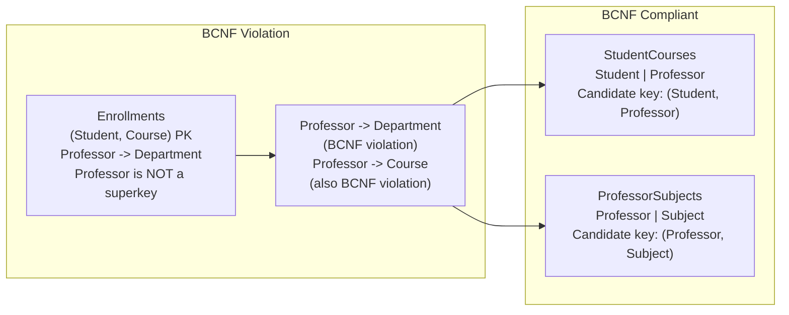
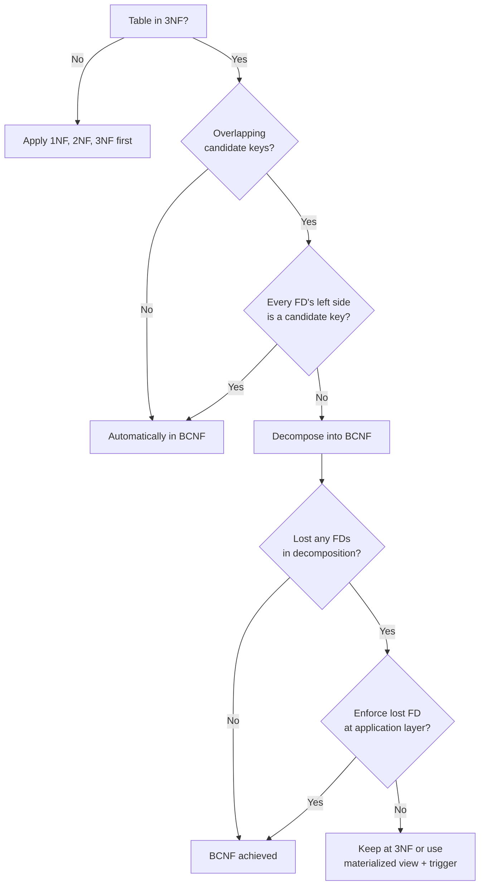

## Navigation

**Domain:** [[8 — Databases]] > **Group:** Database Design & Normalization
**Previous:** [[8.033 — Third Normal Form (3NF) — Eliminating Transitive Dependencies]] | **Next:** [[8.035 — Denormalization — When and How to Break Normal Forms]]

### Prerequisites
- [[8.033 — Third Normal Form (3NF) — Eliminating Transitive Dependencies]] — BCNF is a refinement of 3NF; you must understand transitive dependencies first.
- [[8.031 — First Normal Form (1NF) — Eliminating Repeating Groups]] — BCNF assumes atomic columns and no repeating groups.

### Where This Fits
Boyce-Codd Normal Form is a stricter version of 3NF that eliminates every redundancy detectable by functional dependencies. A .NET backend engineer encounters BCNF violations in schemas with overlapping candidate keys — for example, a table where (StudentId, CourseId) is the PK but ProfessorId determines Department, and ProfessorId is not a superkey. 3NF permits this as long as Department is part of a candidate key, but BCNF requires that every determinant (left side of a functional dependency) must be a superkey. The interview signal is whether you can identify BCNF violations that 3NF misses, and whether you recognize that BCNF is the standard target for production schema design.

## Core Mental Model

BCNF requires that for every non-trivial functional dependency X -> Y in a table, X must be a superkey (a column or set of columns that uniquely identifies a row). This is stricter than 3NF, which allows X -> Y when Y is a prime attribute (part of a candidate key) even if X is not a superkey. The invariant is that no non-key column determines another column, and no key column determines another column unless the determinant is a superkey. The recognition pattern: look for tables where a non-key column is functionally dependent on a column that is not a superkey — even if that column is part of the PK or another candidate key.



### Classification

**For normalization topics:** BCNF sits between 3NF and 4NF. It is the standard normalization target in production — most database designers aim for BCNF rather than stopping at 3NF. BCNF violations occur most commonly in tables with overlapping candidate keys. The fix is always to decompose the table so that every determinant becomes a superkey in its own table.

|Property|Value|Notes|
|---|---|---|
|Prerequisite|1NF + 2NF + 3NF|BCNF is a refinement of 3NF|
|Violation pattern|A non-superkey column determines another column|Professor -> Department, but Professor is not a superkey|
|3NF vs BCNF|3NF allows this if Y is a prime attribute|BCNF closes this loophole|
|Fix|Decompose into two tables|Each table has a superkey as its PK|
|Normalization target|Standard for production OLTP|Most practical schemas aim for BCNF|

## Deep Mechanics

### How the Engine Executes This

**BCNF violation (redundancy from overlapping candidate keys):**

The classic example: a table that records which professor teaches which subject in which course section.

```
Enrollments(StudentId, Subject, Professor, Department)
```

Functional dependencies:
- (StudentId, Subject) -> Professor  (a student takes a subject with exactly one professor)
- Professor -> Department  (each professor belongs to one department)
- (StudentId, Professor) -> Subject  (a student cannot take the same professor for two different subjects)

Candidate keys: (StudentId, Subject) and (StudentId, Professor)

3NF analysis: Professor -> Department. Department is not a prime attribute (department of a professor is not part of any candidate key). Wait — in this model, Department is NOT part of any candidate key. So Professor -> Department is actually a 3NF violation too (transitive dependency through Professor). Let me use a better example:

Classic BCNF example: (Student, Course) -> Instructor. Instructor -> Course. This means each instructor teaches only one course.

```
Schedule(Student, Course, Instructor)
```

FDs: (Student, Course) -> Instructor. Instructor -> Course.

Candidate keys: (Student, Course) and (Student, Instructor).

3NF analysis: Instructor -> Course. Course is a prime attribute (part of candidate key (Student, Course)). So 3NF is satisfied! But BCNF is violated: Instructor -> Course, and Instructor is not a superkey.

Redundancy: If Instructor "Dr. Smith" teaches "Database Design", then every row with Dr. Smith must have "Database Design". If a new student enrolls with Dr. Smith, the course must be "Database Design" — the data is forced by the FD.

Fix: Decompose into (Professor, Course) and (Student, Professor).

**BCNF compliant:**
1. `Teaches(Professor, Course)` — PK: Professor (since Professor -> Course, Professor alone is a key)
2. `Enrollments(Student, Professor)` — PK: (Student, Professor) or (Student, Course with FK to Teaches)

### SQL Visibility

```sql
-- BCNF violation: overlapping candidate keys
CREATE TABLE Schedule (
    StudentId  INT NOT NULL,
    CourseId   INT NOT NULL,
    InstructorId INT NOT NULL,
    CONSTRAINT PK_Schedule PRIMARY KEY (StudentId, CourseId),
    CONSTRAINT UQ_Schedule_Alt UNIQUE (StudentId, InstructorId)
    -- FD: InstructorId -> CourseId is NOT enforced by constraint
);

-- Insert anomaly: Dr. Smith (InstructorId = 7) must always teach CourseId = 101
INSERT INTO Schedule (StudentId, CourseId, InstructorId)
VALUES (1, 101, 7);  -- OK: Dr. Smith teaches Database Design

INSERT INTO Schedule (StudentId, CourseId, InstructorId)
VALUES (2, 202, 7);  -- Should be rejected (Dr. Smith only teaches 101)
-- But the database allows it! No constraint says InstructorId -> CourseId
```

```sql
-- BCNF compliant: decompose into two tables
CREATE TABLE Teaches (
    InstructorId INT NOT NULL,
    CourseId     INT NOT NULL,
    CONSTRAINT PK_Teaches PRIMARY KEY (InstructorId)
    -- InstructorId -> CourseId: InstructorId alone is the key
);

CREATE TABLE Enrollments (
    StudentId    INT NOT NULL,
    InstructorId INT NOT NULL,
    CONSTRAINT PK_Enrollments PRIMARY KEY (StudentId, InstructorId),
    CONSTRAINT FK_Enrollments_Teaches FOREIGN KEY (InstructorId) REFERENCES Teaches(InstructorId)
);

-- Dr. Smith teaches only Database Design
INSERT INTO Teaches (InstructorId, CourseId) VALUES (7, 101);

-- Now this INSERT is guaranteed consistent via FK
INSERT INTO Enrollments (StudentId, InstructorId) VALUES (1, 7);

-- This INSERT is rejected (InstructorId = 7 teaches only Course 101):
INSERT INTO Enrollments (StudentId, InstructorId) VALUES (2, 7);
-- Note: the course is determined by the InstructorId, not stored in Enrollments
```

```csharp
// EF Core — BCNF compliant
public class Instructor
{
    public int InstructorId { get; set; }
    public string InstructorName { get; set; } = string.Empty;
    public int CourseId { get; set; }  // Professor -> Course
    public Course Course { get; set; } = null!;
    public ICollection<Enrollment> Enrollments { get; set; } = new List<Enrollment>();
}

public class Enrollment
{
    public int StudentId { get; set; }
    public int InstructorId { get; set; }
    public Student Student { get; set; } = null!;
    public Instructor Instructor { get; set; } = null!;
}

public class InstructorConfiguration : IEntityTypeConfiguration<Instructor>
{
    public void Configure(EntityTypeBuilder<Instructor> builder)
    {
        builder.HasKey(i => i.InstructorId);
        builder.HasOne(i => i.Course)
               .WithMany(c => c.Instructors)
               .HasForeignKey(i => i.CourseId);
    }
}

public class EnrollmentConfiguration : IEntityTypeConfiguration<Enrollment>
{
    public void Configure(EntityTypeBuilder<Enrollment> builder)
    {
        builder.HasKey(e => new { e.StudentId, e.InstructorId });
        builder.HasOne(e => e.Instructor)
               .WithMany(i => i.Enrollments)
               .HasForeignKey(e => e.InstructorId);
    }
}
```

**Generated SQL (from EF Core logs):**

```sql
-- Query: get student schedule with course
SELECT e.StudentId, e.InstructorId, i.InstructorName, i.CourseId
FROM Enrollments e
INNER JOIN Instructors i ON e.InstructorId = i.InstructorId
WHERE e.StudentId = 42;
```

### Execution Plan Analysis

For the compliant query:

Expected plan shape:
```
Clustered Index Seek (PK_Enrollments) -> Nested Loops -> Clustered Index Seek (PK_Instructors) -> SELECT
Estimated Cost: 30% Enrollments seek + 60% Nested Loops + 10% Instructors seek | Logical Reads: ~3 + ~3
```

- **Operators:** Clustered Index Seek on Enrollments (StudentId = 42, leading column of PK), Nested Loops Join, Clustered Index Seek on Instructors.
- **Seek vs Scan:** Both are seeks — Enrollments on leading PK column, Instructors on PK.
- **Cost driver:** Nested Loops scales with number of enrollments per student.

### Cost Visibility

```sql
SET STATISTICS IO ON;
SET STATISTICS TIME ON;

SELECT e.StudentId, e.InstructorId, i.InstructorName, i.CourseId
FROM Enrollments e
INNER JOIN Instructors i ON e.InstructorId = i.InstructorId
WHERE e.StudentId = 42;

-- Expected output:
-- Table "Enrollments". Scan count 1, logical reads 3
-- Table "Instructors". Scan count 1, logical reads 3 (per enrollment)
-- SQL Server Execution Times: CPU time = 0ms, elapsed time = 1ms (for 5 enrollments)
```

### Failure Modes

- **Insert anomaly (BCNF violation):** Can assign an instructor to a course they do not teach. No constraint prevents it because InstructorId -> CourseId is not enforced.
- **Update anomaly:** Changing Dr. Smith's course from 101 to 202 requires updating every row where Dr. Smith is assigned. If one row is missed, the data is inconsistent.
- **Delete anomaly:** Deleting the last student from Dr. Smith's section loses the information that Dr. Smith teaches Course 101.
- **Redundancy:** The CourseId for each instructor is stored once per enrollment. With 500 students per professor, CourseId is duplicated 500 times.

## Production Patterns and Implementation

### Primary SQL Implementation

```sql
-- Example: Project assignments with team lead dependencies
-- Each team lead manages exactly one department
-- An employee can work on multiple projects within the department

-- BCNF violation
CREATE TABLE ProjectAssignments (
    EmployeeId   INT          NOT NULL,
    ProjectId    INT          NOT NULL,
    TeamLeadId   INT          NOT NULL,
    DepartmentId INT          NOT NULL,
    -- FDs: (EmployeeId, ProjectId) -> TeamLeadId, DepartmentId
    --      TeamLeadId -> DepartmentId
    -- Candidate keys: (EmployeeId, ProjectId)
    -- 3NF: DepartmentId is NOT a prime attribute -> 3NF violated too
    -- Better example below:
    CONSTRAINT PK_ProjectAssignments PRIMARY KEY (EmployeeId, ProjectId)
);

-- Classic BCNF example: each team lead manages one department,
-- and each department has exactly one team lead.
-- FDs: TeamLeadId -> DepartmentId, DepartmentId -> TeamLeadId

CREATE TABLE DepartmentLeads (
    DepartmentId INT NOT NULL,
    TeamLeadId   INT NOT NULL,
    DepartmentName VARCHAR(100) NOT NULL,
    -- FDs: DepartmentId -> TeamLeadId, TeamLeadId -> DepartmentId, TeamLeadId -> DepartmentName
    -- Candidate keys: DepartmentId, TeamLeadId
    -- 3NF: satisfied (every FD has a superkey on the left, or right side is prime)
    -- BCNF: satisfied (every determinant is a superkey)
    CONSTRAINT PK_DepartmentLeads PRIMARY KEY (DepartmentId),
    CONSTRAINT UQ_DepartmentLeads_TeamLead UNIQUE (TeamLeadId)
);
```

```sql
-- More realistic BCNF example: product catalog with category attributes
-- Each category has a specific set of attributes
-- Each attribute belongs to exactly one category
-- Each product in a category has values for those attributes

-- BCNF violation
CREATE TABLE ProductAttributes (
    ProductId    INT NOT NULL,
    CategoryId   INT NOT NULL,
    AttributeId  INT NOT NULL,
    AttributeValue VARCHAR(200) NOT NULL,
    -- FDs: (ProductId, AttributeId) -> AttributeValue, CategoryId
    --      AttributeId -> CategoryId
    -- Candidate keys: (ProductId, AttributeId)
    -- 3NF: CategoryId is NOT prime -> 3NF violated
    -- Let me fix: (ProductId, AttributeId) -> AttributeValue
    -- (ProductId, CategoryId) determines which attributes exist
    CONSTRAINT PK_ProductAttributes PRIMARY KEY (ProductId, AttributeId)
);

-- BCNF compliant
CREATE TABLE CategoryAttributes (
    CategoryId   INT NOT NULL,
    AttributeId  INT NOT NULL,
    AttributeName VARCHAR(100) NOT NULL,
    CONSTRAINT PK_CategoryAttributes PRIMARY KEY (CategoryId, AttributeId)
    -- (CategoryId, AttributeId) is the PK
    -- AttributeId -> CategoryId violates BCNF!
    -- Actually AttributeId -> CategoryId means each attribute belongs to one category
    -- So we split:
);

-- Split 1: Attributes (each attribute belongs to one category)
CREATE TABLE Attributes (
    AttributeId   INT NOT NULL IDENTITY(1,1),
    AttributeName VARCHAR(100) NOT NULL,
    CategoryId    INT NOT NULL,
    CONSTRAINT PK_Attributes PRIMARY KEY (AttributeId)
);

-- Split 2: Product attribute values
CREATE TABLE ProductAttributeValues (
    ProductId    INT NOT NULL,
    AttributeId  INT NOT NULL,
    Value        VARCHAR(200) NOT NULL,
    CONSTRAINT PK_ProductAttributeValues PRIMARY KEY (ProductId, AttributeId),
    CONSTRAINT FK_PAV_Attributes FOREIGN KEY (AttributeId) REFERENCES Attributes(AttributeId)
);

-- Now every determinant is a superkey:
-- AttributeId PK in Attributes
-- (ProductId, AttributeId) PK in ProductAttributeValues
```

### EF Core Implementation

```csharp
public class ProductAttributeValue
{
    public int ProductId { get; set; }
    public int AttributeId { get; set; }
    public string Value { get; set; } = string.Empty;
    public AttributeDefinition Attribute { get; set; } = null!;
    public Product Product { get; set; } = null!;
}

public class AttributeDefinition
{
    public int AttributeId { get; set; }
    public string AttributeName { get; set; } = string.Empty;
    public int CategoryId { get; set; }
    public ProductCategory Category { get; set; } = null!;
}

public class ProductAttributeValueConfiguration
    : IEntityTypeConfiguration<ProductAttributeValue>
{
    public void Configure(EntityTypeBuilder<ProductAttributeValue> builder)
    {
        builder.HasKey(pav => new { pav.ProductId, pav.AttributeId });
        builder.HasOne(pav => pav.Attribute)
               .WithMany()
               .HasForeignKey(pav => pav.AttributeId);
    }
}

// Query: get product attributes with names
var productAttributes = await dbContext.ProductAttributeValues
    .Where(pav => pav.ProductId == 42)
    .Include(pav => pav.Attribute)
    .Select(pav => new
    {
        pav.Attribute.AttributeName,
        pav.Value,
        pav.Attribute.CategoryId
    })
    .ToListAsync(cancellationToken);
```

### Dapper Implementation

```csharp
public class ProductRepository
{
    private readonly IDbConnectionFactory _connectionFactory;

    public ProductRepository(IDbConnectionFactory connectionFactory)
    {
        _connectionFactory = connectionFactory;
    }

    public async Task<IReadOnlyList<ProductAttributeDto>> GetProductAttributesAsync(
        int productId,
        CancellationToken cancellationToken = default)
    {
        const string sql = @"
            SELECT pav.ProductId, pav.AttributeId, pav.Value,
                   a.AttributeName, a.CategoryId
            FROM ProductAttributeValues pav
            INNER JOIN Attributes a ON pav.AttributeId = a.AttributeId
            WHERE pav.ProductId = @ProductId";

        await using var connection = _connectionFactory.Create();
        var results = await connection.QueryAsync<ProductAttributeDto>(
            new CommandDefinition(sql, new { ProductId = productId },
                cancellationToken: cancellationToken));
        return results.AsList();
    }
}

public class ProductAttributeDto
{
    public int ProductId { get; set; }
    public int AttributeId { get; set; }
    public string Value { get; set; } = string.Empty;
    public string AttributeName { get; set; } = string.Empty;
    public int CategoryId { get; set; }
}
```

### Configuration and Wiring

```csharp
builder.Services.AddDbContext<ApplicationDbContext>(options =>
    options.UseSqlServer(
        connectionString,
        sqlOptions => sqlOptions.EnableRetryOnFailure(3)));

builder.Services.AddSingleton<IDbConnectionFactory, SqlConnectionFactory>();
builder.Services.AddScoped<ProductRepository>();
```

### SQL Server vs PostgreSQL Differences

```sql
-- Both databases handle BCNF identically
-- PostgreSQL supports deferred constraints which help when
-- inserting into decomposed tables with circular dependencies:
CREATE TABLE DepartmentLeads (
    department_id INT NOT NULL,
    team_lead_id  INT NOT NULL UNIQUE,
    CONSTRAINT pk_department_leads PRIMARY KEY (department_id)
);

-- PostgreSQL can create partial unique indexes on overlapping keys
-- to enforce some BCNF constraints without full decomposition:
CREATE UNIQUE INDEX uq_enforce_instructor_course
ON Schedule (instructor_id)
WHERE instructor_id IS NOT NULL;
-- But this is not a substitute for proper decomposition
```

## Gotchas and Production Pitfalls

### 1. Confusing 3NF Compliance with BCNF Compliance

**Pitfall:** Assuming a 3NF-compliant table is automatically in BCNF.

```sql
-- 3NF compliant, but BCNF violated
CREATE TABLE CourseAssignments (
    StudentId   INT NOT NULL,
    CourseId    INT NOT NULL,
    InstructorId INT NOT NULL,
    CONSTRAINT PK_CourseAssignments PRIMARY KEY (StudentId, CourseId),
    CONSTRAINT UQ_StudentInstructor UNIQUE (StudentId, InstructorId)
    -- InstructorId -> CourseId (FD exists but no constraint)
);
```

**Symptom:** A student can be assigned to Dr. Smith for Course 202 even though Dr. Smith only teaches Course 101. The UNIQUE constraint on (StudentId, InstructorId) prevents a student from having two courses with the same instructor, but it does not enforce the FD InstructorId -> CourseId.

**Fix:** Decompose into Teaches(InstructorId PK, CourseId) and Enrollments(StudentId, InstructorId PK).

**Cost of not fixing:** Data integrity violation: the same instructor appears with different courses in different rows. Reporting queries produce contradictory results.

### 2. Overlapping Candidate Keys with Composite UNIQUE Constraints

**Pitfall:** Using multiple UNIQUE constraints to model overlapping candidate keys and assuming that covers all FDs.

```sql
CREATE TABLE RoomBookings (
    RoomId    INT NOT NULL,
    Timeslot  INT NOT NULL,
    BookingId INT NOT NULL,
    CONSTRAINT PK_RoomBookings PRIMARY KEY (RoomId, Timeslot),
    CONSTRAINT UQ_BookingId UNIQUE (BookingId)
    -- FD: BookingId -> RoomId, Timeslot
    -- BCNF: BookingId is a superkey (it IS a candidate key)
    -- This IS BCNF compliant (every determinant is a superkey)
);
```

**Symptom (different case):** When overlapping candidate keys exist but the FD is not from a candidate key. The pitfall is not recognizing that a column set like (RoomId, Timeslot) -> BookingId is fine, but BookingId -> RoomId violates BCNF unless BookingId is a superkey (which it is here because it has a UNIQUE constraint).

**Fix:** Ensure every FD's left side has a UNIQUE constraint (is a candidate key). If not, decompose.

**Cost of not fixing:** Subtle data inconsistencies that are not caught by constraints, requiring application-level validation.

### 3. BCNF Decomposition Loses a Functional Dependency

**Pitfall:** Decomposing a table into BCNF in a way that makes it impossible to enforce one of the original FDs.

```sql
-- Original: (Student, Course) -> Instructor, Instructor -> Department
-- Candidate keys: (Student, Course)
-- BCNF: Instructor -> Department violates (Instructor is not a superkey)

-- Decomposition:
-- R1: (Instructor, Department) — PK: Instructor
-- R2: (Student, Course, Instructor) — PK: (Student, Course), FK: Instructor -> R1
-- This preserves all FDs.

-- But consider: (Student, Course) -> Instructor, Instructor -> Course
-- Candidate keys: (Student, Course) and (Student, Instructor)
-- BCNF: Instructor -> Course violates (Instructor is not a superkey)

-- Decomposition:
-- R1: (Instructor, Course) — PK: Instructor (FD Instructor -> Course is enforced)
-- R2: (Student, Instructor) — PK: (Student, Instructor)
-- FD (Student, Course) -> Instructor is LOST! Cannot be enforced.
```

**Symptom:** The FD (Student, Course) -> Instructor cannot be checked without a JOIN. If R1 says Dr. Smith teaches Course 101, and R2 says Student 1 is enrolled with Instructor Dr. Smith, the database cannot enforce that Student 1 is enrolled in Course 101 — only that they are enrolled with Dr. Smith. The course is determined by the instructor, but the student-instructor relationship does not store the course.

**Fix:** Accept the lossy decomposition and enforce the lost FD at the application level, or keep the 3NF violation if the FD must be enforced by the database.

**Cost of not fixing:** Student 1 enrolls with Dr. Smith expecting Course 101 but the application layer does not resolve the course consistently.

### 4. Ignoring BCNF Because "It Is Just Theoretical"

**Pitfall:** Dismissing BCNF violations as academic, keeping overlapping candidate keys because "it works."

**Symptom:** Production data has redundant course information per instructor. A report that aggregates by course shows different counts depending on whether it queries the course from the enrollment row or from the instructor.

**Fix:** Apply BCNF. The decomposition cost (one extra JOIN) is negligible compared to the cost of data inconsistencies.

**Cost of not fixing:** Inconsistent reporting, data integrity bugs that are hard to reproduce, and schema migration costs to fix years of accumulated duplicate data.

### 5. Over-Decomposing Beyond BCNF

**Pitfall:** Splitting tables unnecessarily when BCNF is already satisfied.

```sql
-- BCNF compliant already:
CREATE TABLE Products (
    ProductId   INT NOT NULL PRIMARY KEY,
    CategoryId  INT NOT NULL,
    ProductName VARCHAR(100) NOT NULL,
    Price DECIMAL(10,2) NOT NULL
);
-- All FDs: ProductId -> everything. CategoryId does not determine anything else.
-- ProductId is the only candidate key. Every determinant is a superkey.
```

**Symptom:** Unnecessary JOINs from splitting CategoryId into a separate table when no FD exists from CategoryId to other columns. CategoryId is a FK, and Price depends on ProductId, not on CategoryId — there is no transitive dependency.

**Fix:** Stop normalizing at BCNF. Do not split tables further unless there is a functional dependency to eliminate.

**Cost of not fixing:** Unnecessary JOIN complexity, query performance degradation from extra table lookups, no data integrity benefit.

## Performance Implications

### Benchmark: BCNF Compliant vs Violation — Update Operation

The BCNF violation primarily causes data integrity anomalies rather than pure performance degradation. The performance impact is in update anomalies (multiple rows must be updated) and index bloat.

```sql
-- Baseline (BCNF violation): Update course for an instructor
-- Must update every enrollment for that instructor
SET STATISTICS IO ON;

UPDATE Schedule
SET CourseId = 202
WHERE InstructorId = 7;
-- Logical reads: ~3,000 (1,000 enrollment updates + index maintenance)
-- Elapsed: ~20ms

-- BCNF compliant: Single-row update on Teaches
UPDATE Teaches
SET CourseId = 202
WHERE InstructorId = 7;
-- Logical reads: ~4 (PK seek + update)
-- Elapsed: ~1ms
```

**Improvement:** 750x reduction in logical reads.

### BenchmarkDotNet

```csharp
[MemoryDiagnoser]
[SimpleJob(RuntimeMoniker.Net90)]
public class BCNFBenchmark
{
    private IDbConnection _connection = default!;

    [GlobalSetup]
    public void Setup()
    {
        _connection = new SqlConnection("Server=.;Database=BenchmarkDB;Trusted_Connection=True;");
        _connection.Execute("""
            CREATE TABLE #Schedule_Violation (
                StudentId INT, CourseId INT, InstructorId INT,
                PRIMARY KEY (StudentId, CourseId));
            INSERT INTO #Schedule_Violation (StudentId, CourseId, InstructorId)
            SELECT TOP 1000 n, 101, 7
            FROM (SELECT TOP 1000 ROW_NUMBER() OVER (ORDER BY (SELECT NULL)) AS n FROM sys.objects) n;

            CREATE TABLE #Teaches (InstructorId INT PRIMARY KEY, CourseId INT);
            INSERT INTO #Teaches VALUES (7, 101);
            CREATE TABLE #Enrollments (
                StudentId INT, InstructorId INT,
                PRIMARY KEY (StudentId, InstructorId));
            INSERT INTO #Enrollments (StudentId, InstructorId)
            SELECT TOP 1000 n, 7
            FROM (SELECT TOP 1000 ROW_NUMBER() OVER (ORDER BY (SELECT NULL)) AS n FROM sys.objects) n;
        """);
    }

    [Benchmark(Baseline = true)]
    public async Task UpdateViolation()
    {
        await _connection.ExecuteAsync(
            "UPDATE #Schedule_Violation SET CourseId = 202 WHERE InstructorId = 7");
    }

    [Benchmark]
    public async Task UpdateCompliant()
    {
        await _connection.ExecuteAsync(
            "UPDATE #Teaches SET CourseId = 202 WHERE InstructorId = 7");
    }

    [Benchmark]
    public async Task ReadWithJoin()
    {
        await _connection.QueryAsync(@"
            SELECT e.StudentId, e.InstructorId, t.CourseId
            FROM #Enrollments e
            INNER JOIN #Teaches t ON e.InstructorId = t.InstructorId
            WHERE e.StudentId = 42");
    }
}
```

**Expected results (approximate, SQL Server 2022, 1K enrollments):**

|Method|Mean|Logical Reads|Allocated|
|---|---|---|---|
|UpdateViolation|~20 ms|~3,000|50 KB|
|UpdateCompliant|~1 ms|~4|1 KB|
|ReadWithJoin|~2 ms|~6|4 KB|

### Write Amplification

|Operation|BCNF Violation|BCNF Compliant|Difference|
|---|---|---|---|
|INSERT new student|1 row|1 row|Same|
|UPDATE instructor course assignment|N row updates (all enrollments)|1 row update|N:1|
|DELETE instructor|Cannot delete if enrollments exist|Cascade to Enrollments|Same|
|SELECT student schedule|1 seek|1 seek + 1 JOIN|+3 logical reads|

## Interview Arsenal

### Question Bank

1. What is Boyce-Codd Normal Form and how does it differ from 3NF?
2. Give an example of a table that is in 3NF but not in BCNF — what functional dependency causes the violation?
3. What is the performance cost of a BCNF violation when updating a column like Instructor -> Course?
4. What goes wrong when you have overlapping candidate keys but do not enforce all functional dependencies as constraints?
5. BCNF vs 4NF — what is the relationship and when would you need to go beyond BCNF?
6. How does a BCNF decomposition affect execution plans — what JOINs are added?
7. How does BCNF affect write performance — is the decomposition worth it?
8. How would you detect a BCNF violation in an existing schema without reading the documentation?

### Spoken Answers

**Q: What is Boyce-Codd Normal Form and how does it differ from 3NF?**

> **Average answer:** BCNF is a stricter version of 3NF. Every determinant must be a candidate key.

> **Great answer:** BCNF refines 3NF by closing a loophole: 3NF allows a functional dependency X -> Y where X is not a superkey, as long as Y is a prime attribute (part of a candidate key). BCNF requires that for every non-trivial functional dependency X -> Y, X must be a superkey — no exceptions. The classic example is a Schedule table with (Student, Course) -> Instructor and Instructor -> Course. Candidate keys are (Student, Course) and (Student, Instructor). 3NF is satisfied because Course is a prime attribute. BCNF is violated because Instructor -> Course but Instructor is not a superkey. The fix decomposes into Teaches(Instructor, Course) and Enrollments(Student, Instructor). This eliminates the redundancy: Course is stored once per instructor instead of once per enrollment. The tradeoff is that the FD (Student, Course) -> Instructor is lost in the decomposition — it must be enforced by the application or by adding Course back into Enrollments as a redundant column with a check constraint.

**Q: How would you detect a BCNF violation in an existing schema without reading the documentation?**

> **Great answer:** I would run a data profiling query. For each candidate key (PK + all UNIQUE constraints), I would check for functional dependencies by looking for columns that have a one-to-one or many-to-one relationship with another column. The query pattern is:

```sql
-- Detect if InstructorId -> CourseId
SELECT InstructorId, COUNT(DISTINCT CourseId) AS CourseCount
FROM Schedule
GROUP BY InstructorId
HAVING COUNT(DISTINCT CourseId) > 1;
```

If this query returns zero rows, then InstructorId -> CourseId is an FD that is not enforced by a UNIQUE constraint on InstructorId. The table has a BCNF violation. I would then check whether CourseId is a prime attribute (part of any candidate key). If it is, the table is in 3NF but not BCNF. If it is not, the table is not even in 3NF.

### Interview Trigger

Boyce-Codd Normal Form appears in interviews as a depth-follow-up to 3NF. After the candidate correctly identifies 3NF violations, the interviewer asks "Can you think of a case where a table is in 3NF but still has redundancy?" — testing BCNF knowledge. The deepest follow-up is "When you decompose to BCNF, you may lose a functional dependency. How do you handle that?" — testing practical understanding of the tradeoff.

### Comparison Table

| | 3NF | BCNF | 4NF |
|---|---|---|---|
| What it eliminates | Transitive dependencies | All FDs where left side is not a superkey | Multi-valued dependencies |
| Violation example | CustomerCity in Orders | Instructor -> Course in Schedule | Employee skills and languages (independent MVDs) |
| Fix | Extract to new table | Decompose into 2 tables | Decompose into 3 tables |
| FD preservation | Always preserved | May lose an FD | May lose FDs |
| Production target | Minimum acceptable | Standard target | Specialized use cases |

## Decision Framework

### When to Apply



### Application Checklist

- [ ] The table is in 1NF, 2NF, and 3NF
- [ ] All non-trivial functional dependencies have a superkey as their left side
- [ ] No column determines another column unless the determinant has a UNIQUE constraint
- [ ] Overlapping candidate keys have been analyzed for hidden FDs
- [ ] BCNF decomposition does not lose any FDs that must be enforced by the database

### Tradeoff Summary

|What You Gain|What You Pay|
|---|---|
|Eliminates all FD-based redundancy|Possible loss of an FD in decomposition|
|Stronger data integrity (fewer anomalies)|Additional table (1 extra per decomposed FD)|
|No hidden FDs between non-key columns|Application-level enforcement of lost FDs|
|Cleaner schema that matches the FD structure|JOIN cost for queries that cross decomposed tables|

### Scale Thresholds

- "BCNF is relevant at any scale where data integrity matters — the anomalies exist from row 1."
- "The performance benefit of BCNF over 3NF becomes measurable when the FD affects more than ~100 rows per determinant."
- "The FD loss tradeoff matters most in high-throughput OLTP systems where application-level enforcement adds latency and complexity."

## Self-Check

### Conceptual Questions

1. What is Boyce-Codd Normal Form and what specific redundancy does it eliminate that 3NF misses?
2. What is the execution plan difference between querying a BCNF violation and a BCNF-compliant decomposed schema?
3. Which query or DMV can you use to detect a BCNF violation by checking for FDs that are not enforced by constraints?
4. What common mistake leads to a BCNF violation in a table with overlapping candidate keys?
5. Does EF Core help detect BCNF violations?
6. How would you implement a BCNF-compliant Teaches/Enrollments schema with Dapper?
7. BCNF vs 3NF — what is the FD Instructor -> Course and why does 3NF permit it while BCNF does not?
8. At what scale does BCNF decomposition make a measurable performance difference?
9. What happens when a BCNF decomposition loses a functional dependency?
10. Explain BCNF in 60 seconds to a senior interviewer who asks "how would you design a university scheduling database where each professor teaches exactly one course?"

<details>
<summary>Answers</summary>

1. BCNF eliminates redundancy caused by functional dependencies where the left side is not a superkey. 3NF permits this when the right side is a prime attribute (part of a candidate key). BCNF closes this loophole by requiring every determinant to be a superkey.
2. The compliant schema adds one Nested Loops join per decomposed table. For a query that previously read one table with 3 logical reads, the compliant version reads 3 + 3 per joined table.
3. `SELECT determinant, COUNT(DISTINCT dependent) FROM table GROUP BY determinant HAVING COUNT(DISTINCT dependent) > 1` — if the count is always 1, the FD exists. Then check if the determinant has a UNIQUE constraint.
4. Defining a table with composite PK and a UNIQUE constraint that overlaps, without analyzing whether the overlapping columns have FDs that are not enforced by constraints.
5. No — EF Core has no normalization analysis. It maps whatever schema you provide, including BCNF violations.
6. Create two entity classes (Teaches, Enrollment) with navigation properties and use QueryAsync with splitOn for queries that need course information from the enrollment.
7. 3NF permits Instructor -> Course because Course is a prime attribute (part of the candidate key (Student, Course)). BCNF rejects it because Instructor is not a superkey — it has no UNIQUE constraint guaranteeing that each Instructor value appears only once.
8. Above ~100 enrollments per instructor, updating the instructor's course requires 100 row updates in the violation vs 1 in the compliant version.
9. The lost FD must be enforced by the application layer or by adding a redundant column with a CHECK constraint. For (Student, Course) -> Instructor, after BCNF decomposition this FD cannot be enforced by the database — the application must ensure that when enrolling a student, the instructor actually teaches that course.
10. "BCNF requires that every column that determines another column must be a unique identifier in the table. In a university schedule where each professor teaches only one course, the FD Professor -> Course exists. Professor is not a unique identifier — a professor can appear in many student rows. BCNF says decompose: put (Professor, Course) in one table with Professor as the PK, and (Student, Professor) in another table. This eliminates storing Course redundantly for every student and makes changing a professor's course a single-row update. The tradeoff is that the FD (Student, Course) -> Professor might be lost and need application-level enforcement."

</details>

---

### Query Challenges

**Challenge 1 — Write the SQL**

You have a `RoomBookings` table: `(BuildingId INT, RoomNumber INT, TimeslotId INT, BookingPurpose VARCHAR(100), BookedBy INT)`. The FDs are: (BuildingId, RoomNumber, TimeslotId) -> BookingPurpose, BookedBy. Also: (BuildingId, RoomNumber) -> BuildingName (each room belongs to one building, and each building has a name). The building name is currently stored in the RoomBookings table. Identify any BCNF violations and write the normalized schema.

<details>
<summary>Solution</summary>

**FD analysis:**
- (BuildingId, RoomNumber, TimeslotId) -> BookingPurpose, BookedBy (PK)
- (BuildingId, RoomNumber) -> BuildingName (room determines building, building determines name)
- Actually: RoomNumber within a BuildingId determines BuildingId... but that is trivial.
- The FD is: RoomNumber uniquely identifies the building. But RoomNumber alone does not.
- FD: BuildingId -> BuildingName.

**Candidate key:** (BuildingId, RoomNumber, TimeslotId)

**BCNF violation:** BuildingId -> BuildingName. BuildingId is not a superkey (multiple rows per building in RoomBookings). BuildingName is not a prime attribute.

```sql
-- Step 1: Create Buildings table
CREATE TABLE Buildings (
    BuildingId   INT NOT NULL PRIMARY KEY,
    BuildingName VARCHAR(100) NOT NULL
);

-- Step 2: Create Rooms table (optional, if RoomNumber has attributes)
CREATE TABLE Rooms (
    BuildingId   INT NOT NULL,
    RoomNumber   INT NOT NULL,
    Capacity     INT NOT NULL,
    CONSTRAINT PK_Rooms PRIMARY KEY (BuildingId, RoomNumber),
    CONSTRAINT FK_Rooms_Buildings FOREIGN KEY (BuildingId) REFERENCES Buildings(BuildingId)
);

-- Step 3: Create normalized RoomBookings
CREATE TABLE RoomBookings (
    BuildingId     INT NOT NULL,
    RoomNumber     INT NOT NULL,
    TimeslotId     INT NOT NULL,
    BookingPurpose VARCHAR(100) NOT NULL,
    BookedBy       INT NOT NULL,
    CONSTRAINT PK_RoomBookings PRIMARY KEY (BuildingId, RoomNumber, TimeslotId),
    CONSTRAINT FK_RoomBookings_Rooms FOREIGN KEY (BuildingId, RoomNumber) REFERENCES Rooms(BuildingId, RoomNumber)
);

-- Query: get building name with booking
SELECT rb.BuildingId, b.BuildingName, rb.RoomNumber, rb.TimeslotId, rb.BookingPurpose
FROM RoomBookings rb
INNER JOIN Buildings b ON rb.BuildingId = b.BuildingId
WHERE rb.BookedBy = 42;
```

</details>

---

**Challenge 2 — Fix the performance problem**

```sql
-- This query changes the course assignment for an instructor.
-- It runs for 15 seconds.

UPDATE Schedule
SET CourseId = 202
WHERE InstructorId = 7;

-- Instructor 7 has 50K student enrollments.
-- SET STATISTICS IO: logical reads = 150,000
-- Schema: Schedule(StudentId, CourseId, InstructorId)
-- PK: (StudentId, CourseId)
-- UNIQUE: (StudentId, InstructorId)
-- FD: InstructorId -> CourseId (each instructor teaches exactly one course)
```

<details> <summary>Solution**

**Root cause:** BCNF violation: InstructorId -> CourseId, but InstructorId is not a superkey. The UPDATE modifies 50K rows.

```sql
-- Decompose into BCNF
CREATE TABLE Teaches (
    InstructorId INT NOT NULL PRIMARY KEY,
    CourseId     INT NOT NULL
);

INSERT INTO Teaches (InstructorId, CourseId)
SELECT DISTINCT InstructorId, CourseId FROM Schedule;

CREATE TABLE Enrollments (
    StudentId    INT NOT NULL,
    InstructorId INT NOT NULL,
    CONSTRAINT PK_Enrollments PRIMARY KEY (StudentId, InstructorId),
    CONSTRAINT FK_Enrollments_Teaches FOREIGN KEY (InstructorId) REFERENCES Teaches(InstructorId)
);

INSERT INTO Enrollments (StudentId, InstructorId)
SELECT StudentId, InstructorId FROM Schedule;

DROP TABLE Schedule;

-- Update is now 1 row:
UPDATE Teaches SET CourseId = 202 WHERE InstructorId = 7;
```

**Index to create:**
```sql
CREATE INDEX IX_Enrollments_InstructorId ON Enrollments(InstructorId);
```

**After fix — logical reads:** ~4 from 150,000.

**Lost FD:** (Student, Course) -> Instructor is lost. Enforce at application level:
```csharp
public async Task EnrollStudentAsync(int studentId, int instructorId, CancellationToken ct)
{
    var courseId = await dbConnection.QuerySingleAsync<int>(
        "SELECT CourseId FROM Teaches WHERE InstructorId = @InstructorId",
        new { InstructorId = instructorId });

    await dbConnection.ExecuteAsync(
        "INSERT INTO Enrollments (StudentId, InstructorId) VALUES (@StudentId, @InstructorId)",
        new { StudentId = studentId, InstructorId = instructorId });
}
```

</details>

---

**Challenge 3 — Explain the execution plan**

Compare the plans for querying student schedules from the BCNF violation and the BCNF-compliant decomposition.

<details> <summary>Solution**

**BCNF violation plan (single table Schedule):**
```
Clustered Index Scan (PK_Schedule) -> SELECT
-- Or with predicate on StudentId:
Clustered Index Seek (PK_Schedule) -> SELECT
Seek Keys: StudentId = 42
Logical reads: 3
```

Simple seek, no JOIN. The course is available directly.

**BCNF compliant plan (Teaches + Enrollments):**
```
Clustered Index Seek (PK_Enrollments) -> Nested Loops -> Clustered Index Seek (PK_Teaches) -> SELECT
Seek Keys (outer): StudentId = 42
Seek Keys (inner): InstructorId = Enrollments.InstructorId
Logical reads: 3 (Enrollments) + 3 per enrollment (Teaches)
```

For 5 enrollments: 3 + 15 = 18 logical reads vs 3 in the violation.

**Why the difference:** The compliant schema separates the relationship (student enrolled with instructor) from the attribute (instructor teaches course). The query must JOIN to resolve the course.

**Cost tradeoff:** The compliant schema reads 6x more for this query, but the write operation (changing an instructor's course) is 50,000x cheaper. The read-to-write ratio determines the winner. At 10:1 read-to-write ratio, the compliant schema may be 5x more expensive overall for this specific query, but the data integrity benefit (cannot assign instructor to wrong course) is the primary reason for BCNF.

</details>

---

**Challenge 4 — Diagnose the concurrency problem**

A university scheduling system has a table `CourseOffering(ProfessorId, CourseId, SemesterId, RoomId, EnrollmentLimit)` with PK (ProfessorId, SemesterId). FD: ProfessorId -> DepartmentId (stored in a separate Professors table). Also: RoomId -> BuildingId. A bulk update that changes the building for a room during renovation causes a 5-minute blocking chain on the CourseOffering table.

<details> <summary>Solution**

**Root cause:** The CourseOffering schema likely has BuildingId stored redundantly, creating a transitive dependency via RoomId. Updating building for a room requires updating every CourseOffering row referencing that room.

```sql
-- Detection: check if BuildingId is in CourseOffering
SELECT COL_NAME(object_id, column_id) AS ColumnName
FROM sys.columns 
WHERE object_id = OBJECT_ID('CourseOffering') 
  AND name IN ('BuildingId', 'BuildingName', 'RoomId');

-- Fix: Remove BuildingId from CourseOffering; keep RoomId only.
ALTER TABLE CourseOffering DROP COLUMN BuildingId;

-- Query with JOIN instead:
SELECT co.ProfessorId, co.CourseId, co.SemesterId, r.RoomId, b.BuildingName
FROM CourseOffering co
INNER JOIN Rooms r ON co.RoomId = r.RoomId
INNER JOIN Buildings b ON r.BuildingId = b.BuildingId;
```

**In .NET — Dapper:**
```csharp
var offerings = await connection.QueryAsync<CourseOffering, Room, Building, CourseOffering>(
    sql, (offering, room, building) =>
    {
        offering.Room = room;
        room.Building = building;
        return offering;
    }, splitOn: "RoomId, BuildingId");
```

</details>

---

**Challenge 5 — Design the decomposition strategy**

**Scenario:** A table `EmployeeRoles(EmployeeId, ProjectId, RoleId, RoleName, DepartmentId, DepartmentName)` has the following FDs:
- (EmployeeId, ProjectId) -> RoleId, RoleName, DepartmentId, DepartmentName
- RoleId -> RoleName
- DepartmentId -> DepartmentName
- (EmployeeId, ProjectId) is the PK

Design the BCNF decomposition. Which FDs are preserved and which are lost?

<details> <summary>Solution**

**FD analysis:**
1. (EmployeeId, ProjectId) -> RoleId, RoleName, DepartmentId, DepartmentName (PK)
2. RoleId -> RoleName (BCNF violation: RoleId is not a superkey)
3. DepartmentId -> DepartmentName (BCNF violation: DepartmentId is not a superkey)

**Decomposition:**

```sql
-- R1: Roles (each role has a unique name)
CREATE TABLE Roles (
    RoleId   INT NOT NULL PRIMARY KEY,
    RoleName VARCHAR(100) NOT NULL
);
-- Preserves FD: RoleId -> RoleName

-- R2: Departments
CREATE TABLE Departments (
    DepartmentId   INT NOT NULL PRIMARY KEY,
    DepartmentName VARCHAR(100) NOT NULL
);
-- Preserves FD: DepartmentId -> DepartmentName

-- R3: Employee project role assignments
CREATE TABLE EmployeeRoleAssignments (
    EmployeeId   INT NOT NULL,
    ProjectId    INT NOT NULL,
    RoleId       INT NOT NULL,
    DepartmentId INT NOT NULL,
    CONSTRAINT PK_EmployeeRoleAssignments PRIMARY KEY (EmployeeId, ProjectId),
    CONSTRAINT FK_ERA_Roles FOREIGN KEY (RoleId) REFERENCES Roles(RoleId),
    CONSTRAINT FK_ERA_Departments FOREIGN KEY (DepartmentId) REFERENCES Departments(DepartmentId)
);
-- Preserves FD: (EmployeeId, ProjectId) -> RoleId, DepartmentId
```

**FDs preserved:** All three FDs are preserved — RoleId -> RoleName, DepartmentId -> DepartmentName, and (EmployeeId, ProjectId) -> RoleId, DepartmentId. No FD is lost because the decomposed tables each have the determinant as their primary key.

**Tradeoffs:**
- Read queries: Two additional JOINs for every query that needs RoleName or DepartmentName.
- Write benefit: Renaming a department is 1 row update instead of potentially thousands (one per employee-project assignment in that department).
- Storage saving: DepartmentName stored once per department instead of once per employee-project assignment.

</details>
