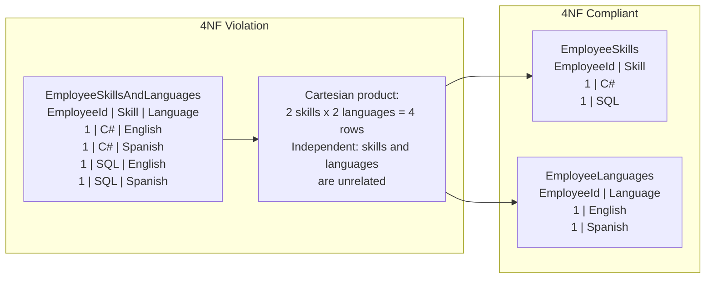

## Navigation

**Domain:** [[8 — Databases]] > **Group:** Database Design & Normalization
**Previous:** [[8.034 — Boyce-Codd Normal Form (BCNF) — Stronger 3NF]] | **Next:** [[8.036 — Fifth Normal Form (5NF) — Join Dependencies]]

### Prerequisites
- [[8.034 — Boyce-Codd Normal Form (BCNF) — Stronger 3NF]] — 4NF addresses multi-valued dependencies, which are not captured by FDs.
- [[8.033 — Third Normal Form (3NF) — Eliminating Transitive Dependencies]] — understanding functional dependencies is required to distinguish them from multi-valued dependencies.

### Where This Fits
Fourth normal form eliminates the redundancy caused by multi-valued dependencies (MVDs) — when two or more independent sets of values exist for the same entity. A .NET backend engineer encounters this when storing an employee's skills and languages in one table: each employee has multiple skills and multiple languages, and these attributes are independent, causing every skill to pair with every language in a Cartesian explosion. The interview signal is whether you recognize that BCNF only addresses functional dependencies, and that multi-valued dependencies are a separate class of redundancy requiring decomposition into more tables.

## Core Mental Model

A multi-valued dependency A ->> B means that for a given value of A, the set of B values is completely independent of all other attributes in the table. If an employee has 3 skills and 2 languages, storing them in one table produces 6 rows (3 x 2). 4NF requires that if a table has an MVD A ->> B, then every other attribute must also be functionally dependent on A, or the table must be decomposed. The invariant is that independent multi-valued attributes should be in separate tables. The recognition pattern: if two sets of values for the same entity have no relationship to each other (any combination can occur), storing them together creates a Cartesian product that violates 4NF.



### Classification

**For normalization topics:** 4NF sits between BCNF and 5NF. It is rarely encountered in practice because most real-world MVDs are actually functional dependencies in disguise (e.g., "an employee can have multiple skills" is often better modeled as a many-to-many relationship with a junction table, which is already in 4NF). 4NF violations occur when you skip the decomposition of truly independent multi-valued attributes.

|Property|Value|Notes|
|---|---|---|
|Prerequisite|BCNF|4NF builds on BCNF; table must already have no non-superkey FDs|
|Violation pattern|Independent multi-valued attributes in one table|Skills and Languages are independent for an employee|
|Fix|Decompose into two (or more) tables|Each table has one MVD and the key|
|Detection|COUNT(DISTINCT skill) * COUNT(DISTINCT language) > rows per employee|Existence of Cartesian product|
|Real-world rarity|Uncommon|Most MVDs are better modeled as junction tables|

## Deep Mechanics

### How the Engine Executes This

**4NF violation (Cartesian product):**
1. Table `EmployeeSkillsAndLanguages(EmployeeId, Skill, Language)` has PK = (EmployeeId, Skill, Language).
2. Employee 1 has 3 skills (C#, SQL, Python) and 2 languages (English, Spanish).
3. The table stores 3 x 2 = 6 rows for Employee 1.
4. If Employee 1 adds a 4th skill (Java), 2 new rows must be inserted (Java + English, Java + Spanish).
5. If Employee 1 adds a 3rd language (French), 3 new rows must be inserted (C# + French, SQL + French, Python + French).
6. The number of rows grows multiplicatively: skills x languages. With 10 skills and 10 languages: 100 rows for one employee.

**4NF compliant (decomposed):**
1. `EmployeeSkills(EmployeeId, Skill)` — PK: (EmployeeId, Skill). Stores 3 rows for Employee 1.
2. `EmployeeLanguages(EmployeeId, Language)` — PK: (EmployeeId, Language). Stores 2 rows for Employee 1.
3. Adding Java inserts 1 row. Adding French inserts 1 row.
4. No Cartesian product. Rows grow additively: skills + languages.

### SQL Visibility

```sql
-- 4NF violation: independent multi-valued attributes in one table
CREATE TABLE EmployeeSkillsAndLanguages (
    EmployeeId INT          NOT NULL,
    Skill      VARCHAR(50)  NOT NULL,
    Language   VARCHAR(50)  NOT NULL,
    CONSTRAINT PK_EmployeeSkillsAndLanguages PRIMARY KEY (EmployeeId, Skill, Language)
);

-- Employee 1 has skills: C#, SQL, Python and languages: English, Spanish
INSERT INTO EmployeeSkillsAndLanguages (EmployeeId, Skill, Language) VALUES
(1, 'C#', 'English'),
(1, 'C#', 'Spanish'),
(1, 'SQL', 'English'),
(1, 'SQL', 'Spanish'),
(1, 'Python', 'English'),
(1, 'Python', 'Spanish');
-- 6 rows from 3 skills x 2 languages
```

```sql
-- 4NF compliant: separate tables for each independent multi-valued attribute
CREATE TABLE EmployeeSkills (
    EmployeeId INT          NOT NULL,
    Skill      VARCHAR(50)  NOT NULL,
    CONSTRAINT PK_EmployeeSkills PRIMARY KEY (EmployeeId, Skill),
    CONSTRAINT FK_EmployeeSkills_Employees FOREIGN KEY (EmployeeId) REFERENCES Employees(EmployeeId)
);

CREATE TABLE EmployeeLanguages (
    EmployeeId INT          NOT NULL,
    Language   VARCHAR(50)  NOT NULL,
    CONSTRAINT PK_EmployeeLanguages PRIMARY KEY (EmployeeId, Language),
    CONSTRAINT FK_EmployeeLanguages_Employees FOREIGN KEY (EmployeeId) REFERENCES Employees(EmployeeId)
);

-- Employee 1: 3 skills + 2 languages = 5 rows total
INSERT INTO EmployeeSkills (EmployeeId, Skill) VALUES
(1, 'C#'), (1, 'SQL'), (1, 'Python');

INSERT INTO EmployeeLanguages (EmployeeId, Language) VALUES
(1, 'English'), (1, 'Spanish');

-- Query: get employee skills and languages (two separate queries or UNION)
SELECT e.EmployeeId, e.EmployeeName, s.Skill
FROM Employees e
INNER JOIN EmployeeSkills s ON e.EmployeeId = s.EmployeeId
WHERE e.EmployeeId = 1;

SELECT e.EmployeeId, e.EmployeeName, l.Language
FROM Employees e
INNER JOIN EmployeeLanguages l ON e.EmployeeId = l.EmployeeId
WHERE e.EmployeeId = 1;
```

```csharp
// EF Core — 4NF compliant
public class Employee
{
    public int EmployeeId { get; set; }
    public string EmployeeName { get; set; } = string.Empty;
    public ICollection<EmployeeSkill> Skills { get; set; } = new List<EmployeeSkill>();
    public ICollection<EmployeeLanguage> Languages { get; set; } = new List<EmployeeLanguage>();
}

public class EmployeeSkill
{
    public int EmployeeId { get; set; }
    public string Skill { get; set; } = string.Empty;
    public Employee Employee { get; set; } = null!;
}

public class EmployeeLanguage
{
    public int EmployeeId { get; set; }
    public string Language { get; set; } = string.Empty;
    public Employee Employee { get; set; } = null!;
}

public class EmployeeConfiguration : IEntityTypeConfiguration<Employee>
{
    public void Configure(EntityTypeBuilder<Employee> builder)
    {
        builder.HasKey(e => e.EmployeeId);
        builder.HasMany(e => e.Skills)
               .WithOne(s => s.Employee)
               .HasForeignKey(s => s.EmployeeId);
        builder.HasMany(e => e.Languages)
               .WithOne(l => l.Employee)
               .HasForeignKey(l => l.EmployeeId);
    }
}

// Query: get employee with skills and languages
var employee = await dbContext.Employees
    .Where(e => e.EmployeeId == 1)
    .Include(e => e.Skills)
    .Include(e => e.Languages)
    .FirstOrDefaultAsync(cancellationToken);
```

**Generated SQL (from EF Core logs):**

```sql
SELECT [e].[EmployeeId], [e].[EmployeeName]
FROM [Employees] [e]
WHERE [e].[EmployeeId] = 1;

SELECT [s].[EmployeeId], [s].[Skill]
FROM [EmployeeSkills] [s]
WHERE [s].[EmployeeId] = 1;

SELECT [l].[EmployeeId], [l].[Language]
FROM [EmployeeLanguages] [l]
WHERE [l].[EmployeeId] = 1;
```

### Execution Plan Analysis

For the compliant query (separate skills and languages queries):

Each query produces a simple plan:
```
Clustered Index Seek (PK_EmployeeSkills or PK_EmployeeLanguages) -> SELECT
Seek Keys: EmployeeId = 1
Logical reads: ~3 per table
```

- **Operators:** Single Clustered Index Seek on the composite PK leading column.
- **Seek vs Scan:** Seek — EmployeeId is the leading column of the PK.
- **Cost driver:** The two queries execute independently, each reading from its own small table.
- **Without index:** If EmployeeId were not the leading PK column, a scan of all skills/languages for all employees would be required.

### Cost Visibility

```sql
SET STATISTICS IO ON;

SELECT * FROM EmployeeSkills WHERE EmployeeId = 1;
-- Table "EmployeeSkills". Scan count 1, logical reads 3

SELECT * FROM EmployeeLanguages WHERE EmployeeId = 1;
-- Table "EmployeeLanguages". Scan count 1, logical reads 3

-- Total: 6 logical reads
```

### Failure Modes

- **Cartesian explosion:** Storing 10 skills and 10 languages produces 100 rows. Adding a 5th language adds 10 more rows (one per skill). The table grows multiplicatively.
- **Insert anomaly:** Cannot add a single value without pairing it with all values of the other independent attribute. Adding a new skill requires inserting a row for each existing language.
- **Delete anomaly:** Deleting an employee's last skill also deletes all language associations for that employee if the skill and language are in the same row. Decomposed tables prevent this.
- **Update anomaly:** Changing a skill name requires updating every language combination row — N rows where N = number of languages for that employee.
- **Query complexity:** Finding "employees who know C# and speak Spanish" requires a self-JOIN, not a simple WHERE clause.

## Production Patterns and Implementation

### Primary SQL Implementation

```sql
-- Example: Product categories and suppliers
-- A product can belong to multiple categories AND have multiple suppliers
-- These are independent multi-valued attributes

-- 4NF violation
CREATE TABLE ProductCategoriesAndSuppliers (
    ProductId  INT NOT NULL,
    CategoryId INT NOT NULL,
    SupplierId INT NOT NULL,
    CONSTRAINT PK_PC_S PRIMARY KEY (ProductId, CategoryId, SupplierId)
    -- If categories and suppliers are independent,
    -- this creates a Cartesian product per product
);

-- 4NF compliant: separate the independent relationships
CREATE TABLE ProductCategories (
    ProductId  INT NOT NULL,
    CategoryId INT NOT NULL,
    CONSTRAINT PK_ProductCategories PRIMARY KEY (ProductId, CategoryId),
    CONSTRAINT FK_PC_Products FOREIGN KEY (ProductId) REFERENCES Products(ProductId),
    CONSTRAINT FK_PC_Categories FOREIGN KEY (CategoryId) REFERENCES Categories(CategoryId)
);

CREATE TABLE ProductSuppliers (
    ProductId  INT NOT NULL,
    SupplierId INT NOT NULL,
    CONSTRAINT PK_ProductSuppliers PRIMARY KEY (ProductId, SupplierId),
    CONSTRAINT FK_PS_Products FOREIGN KEY (ProductId) REFERENCES Products(ProductId),
    CONSTRAINT FK_PS_Suppliers FOREIGN KEY (SupplierId) REFERENCES Suppliers(SupplierId)
);

-- Query: get product with categories and suppliers
SELECT p.ProductId, p.ProductName,
       c.CategoryId, c.CategoryName,
       s.SupplierId, s.SupplierName
FROM Products p
LEFT JOIN ProductCategories pc ON p.ProductId = pc.ProductId
LEFT JOIN Categories c ON pc.CategoryId = c.CategoryId
LEFT JOIN ProductSuppliers ps ON p.ProductId = ps.ProductId
LEFT JOIN Suppliers s ON ps.SupplierId = s.SupplierId
WHERE p.ProductId = 42;
```

### EF Core Implementation

```csharp
public class Product
{
    public int ProductId { get; set; }
    public string ProductName { get; set; } = string.Empty;
    public ICollection<ProductCategory> Categories { get; set; } = new List<ProductCategory>();
    public ICollection<ProductSupplier> Suppliers { get; set; } = new List<ProductSupplier>();
}

public class ProductCategory
{
    public int ProductId { get; set; }
    public int CategoryId { get; set; }
    public Product Product { get; set; } = null!;
    public Category Category { get; set; } = null!;
}

public class ProductSupplier
{
    public int ProductId { get; set; }
    public int SupplierId { get; set; }
    public Product Product { get; set; } = null!;
    public Supplier Supplier { get; set; } = null!;
}

public class ProductConfiguration : IEntityTypeConfiguration<Product>
{
    public void Configure(EntityTypeBuilder<Product> builder)
    {
        builder.HasKey(p => p.ProductId);
        builder.HasMany(p => p.Categories)
               .WithOne(pc => pc.Product)
               .HasForeignKey(pc => pc.ProductId);
        builder.HasMany(p => p.Suppliers)
               .WithOne(ps => ps.Product)
               .HasForeignKey(ps => ps.ProductId);
    }
}

// Query: get product with categories and suppliers
var product = await dbContext.Products
    .Where(p => p.ProductId == 42)
    .Include(p => p.Categories).ThenInclude(pc => pc.Category)
    .Include(p => p.Suppliers).ThenInclude(ps => ps.Supplier)
    .FirstOrDefaultAsync(cancellationToken);
```

### Dapper Implementation

```csharp
public class ProductRepository
{
    private readonly IDbConnectionFactory _connectionFactory;

    public ProductRepository(IDbConnectionFactory connectionFactory)
    {
        _connectionFactory = connectionFactory;
    }

    public async Task<ProductDetailDto?> GetProductDetailAsync(
        int productId,
        CancellationToken cancellationToken = default)
    {
        const string categoriesSql = @"
            SELECT pc.ProductId, pc.CategoryId, c.CategoryName
            FROM ProductCategories pc
            INNER JOIN Categories c ON pc.CategoryId = c.CategoryId
            WHERE pc.ProductId = @ProductId";

        const string suppliersSql = @"
            SELECT ps.ProductId, ps.SupplierId, s.SupplierName
            FROM ProductSuppliers ps
            INNER JOIN Suppliers s ON ps.SupplierId = s.SupplierId
            WHERE ps.ProductId = @ProductId";

        await using var connection = _connectionFactory.Create();

        var categories = (await connection.QueryAsync<ProductCategoryDto>(
            new CommandDefinition(categoriesSql, new { ProductId = productId },
                cancellationToken: cancellationToken))).AsList();

        var suppliers = (await connection.QueryAsync<ProductSupplierDto>(
            new CommandDefinition(suppliersSql, new { ProductId = productId },
                cancellationToken: cancellationToken))).AsList();

        return new ProductDetailDto
        {
            ProductId = productId,
            Categories = categories,
            Suppliers = suppliers
        };
    }
}

public class ProductDetailDto
{
    public int ProductId { get; set; }
    public List<ProductCategoryDto> Categories { get; set; } = new();
    public List<ProductSupplierDto> Suppliers { get; set; } = new();
}

public class ProductCategoryDto
{
    public int ProductId { get; set; }
    public int CategoryId { get; set; }
    public string CategoryName { get; set; } = string.Empty;
}

public class ProductSupplierDto
{
    public int ProductId { get; set; }
    public int SupplierId { get; set; }
    public string SupplierName { get; set; } = string.Empty;
}
```

### Configuration and Wiring

```csharp
builder.Services.AddDbContext<ApplicationDbContext>(options =>
    options.UseSqlServer(connectionString,
        sqlOptions => sqlOptions.EnableRetryOnFailure(3)));

builder.Services.AddSingleton<IDbConnectionFactory, SqlConnectionFactory>();
builder.Services.AddScoped<ProductRepository>();
```

### SQL Server vs PostgreSQL Differences

```sql
-- Both databases handle 4NF the same way
-- PostgreSQL can store arrays which sometimes serve as an alternative
-- to decomposing MVDs, but this reintroduces 1NF violations:
CREATE TABLE employee_skills (
    employee_id INT PRIMARY KEY,
    skills      VARCHAR(50)[],
    languages   VARCHAR(50)[]
);

-- Query using array overlaps:
SELECT employee_id FROM employee_skills
WHERE skills @> ARRAY['C#'] AND languages @> ARRAY['Spanish'];
-- Array storage is acceptable when the Multi-valued attributes are
-- only ever read/written as sets and never queried individually
```

## Gotchas and Production Pitfalls

### 1. Confusing a Many-to-Many Relationship with an MVD

**Pitfall:** Treating a many-to-many relationship as a multi-valued dependency, over-decomposing what should be a single junction table.

```sql
-- Correct: A many-to-many relationship (not an MVD)
-- An order can have many products. A product can be in many orders.
-- This is a standard M:N relationship, NOT an MVD.
-- Each row has a relationship: OrderItem(OrderId, ProductId, Quantity)
-- Quantity is an attribute of the relationship, not a separate MVD.

-- Wrong decomposition (treating M:N as MVD):
CREATE TABLE OrderProducts (OrderId INT, ProductId INT);  -- wrong: lost Quantity
CREATE TABLE OrderQuantities (OrderId INT, Quantity INT); -- wrong: lost ProductId link
```

**Symptom:** Loss of the relationship attribute (Quantity in OrderItems). The decomposition destroys the connection between a product and its quantity in an order.

**Fix:** Recognize that a many-to-many relationship with attributes is NOT an MVD. The attributes are dependent on the combination, not independent.

**Cost of not fixing:** Irreversible data loss. Cannot determine which quantity belongs to which product in an order.

### 2. Assuming All Multi-Valued Attributes Are Independent

**Pitfall:** Decomposing a table with multiple multi-valued attributes that are actually dependent on each other.

```sql
-- Each employee skill has a proficiency level. Skill and proficiency are NOT independent.
-- If you decompose:
CREATE TABLE EmployeeSkills (EmployeeId INT, Skill VARCHAR(50));
CREATE TABLE EmployeeProficiencies (EmployeeId INT, Proficiency INT);
-- You lose the link between Skill and Proficiency.
```

**Symptom:** Cannot determine the proficiency for a specific skill. The Cartesian product pairs every skill with every proficiency level.

**Fix:** Keep skill and proficiency together. They are not independent MVDs — they describe the same relationship.

```sql
-- Correct: Skill and proficiency describe the same fact
CREATE TABLE EmployeeSkills (
    EmployeeId  INT     NOT NULL,
    Skill       VARCHAR(50) NOT NULL,
    Proficiency TINYINT NOT NULL,
    CONSTRAINT PK_EmployeeSkills PRIMARY KEY (EmployeeId, Skill)
);
```

**Cost of not fixing:** Data integrity failure: a skill like "C#" appears with proficiency 8, but the link to "proficiency 8" is ambiguous — is it for C# or for SQL?

### 3. Storing JSON Arrays Instead of Decomposing

**Pitfall:** Using a JSON array column for multi-valued attributes without considering whether they are independent.

```sql
CREATE TABLE Employees (
    EmployeeId INT NOT NULL,
    Skills     NVARCHAR(MAX) NOT NULL,  -- JSON array: ["C#", "SQL", "Python"]
    Languages  NVARCHAR(MAX) NOT NULL,  -- JSON array: ["English", "Spanish"]
);
```

**Symptom:** Cannot query individual skills or languages efficiently. The JSON must be parsed (OPENJSON) on every query. Cannot use FK constraints to enforce valid skills or languages.

**Fix:** Decompose into separate tables if the individual values need to be queried or constrained. Accept JSON only if the array is always read and written as a whole.

**Cost of not fixing:** 5x CPU overhead for queries filtering by a specific skill. No referential integrity.

### 4. Misidentifying a Functional Dependency as an MVD

**Pitfall:** Seeing multiple rows per entity and assuming an MVD, when actually it is an FD with multiple values.

```sql
-- An employee has one manager. Manager -> Department.
-- Multiple employees report to the same manager.
-- This is NOT an MVD. Manager -> Department is an FD.
-- Decompose for BCNF, not for 4NF.
```

**Symptom:** Over-decomposition creates unnecessary tables and JOINs.

**Fix:** Analyze functional dependencies first (BCNF). 4NF is only needed when BCNF compliance is satisfied but the Cartesian product still exists.

**Cost of not fixing:** Unnecessary complexity. More tables, more JOINs, no data integrity benefit.

### 5. The "It Is Just One More Column" Trap

**Pitfall:** Adding a second multi-valued attribute to an existing junction table because "it is just one more column."

```sql
-- We have: ProductCategories(ProductId, CategoryId)
-- Now we add: ProductCategories(ProductId, CategoryId, SupplierId)
-- If a product can have multiple suppliers AND multiple categories,
-- and these are independent, the Cartesian product blows up.
```

**Symptom:** Product with 3 categories and 4 suppliers = 12 rows. Adding a 5th supplier adds 3 more rows (one per category). The table grows multiplicatively.

**Fix:** Keep them in separate junction tables.

**Cost of not fixing:** At 10 categories + 20 suppliers = 200 rows for one product. INSERT performance degrades. Reporting queries return inflated counts.

## Performance Implications

### Benchmark: 4NF Violation vs Compliant — Storage and Query

```sql
-- Baseline (4NF violation): 3 skills x 2 languages = 6 rows
-- For 10K employees with avg 5 skills and 3 languages each
-- Rows in violation: 10K x 5 x 3 = 150,000 rows
-- Rows in compliant: 10K x 5 + 10K x 3 = 80,000 rows

-- Query: find employees who know C# and speak Spanish
-- 4NF violation:
SELECT DISTINCT EmployeeId
FROM EmployeeSkillsAndLanguages
WHERE Skill = 'C#' AND Language = 'Spanish';
-- Logical reads: index on (Skill, Language) -> seek -> ~15

-- 4NF compliant:
SELECT s.EmployeeId
FROM EmployeeSkills s
INNER JOIN EmployeeLanguages l ON s.EmployeeId = l.EmployeeId
WHERE s.Skill = 'C#' AND l.Language = 'Spanish';
-- Logical reads: seek on Skills + Nested Loops + seek on Languages = ~10
```

**Improvement:** 47% fewer rows stored (80K vs 150K). Query reads comparable or better.

### BenchmarkDotNet

```csharp
[MemoryDiagnoser]
[SimpleJob(RuntimeMoniker.Net90)]
public class FourthNormalFormBenchmark
{
    private IDbConnection _connection = default!;

    [GlobalSetup]
    public void Setup()
    {
        _connection = new SqlConnection("Server=.;Database=BenchmarkDB;Trusted_Connection=True;");
        _connection.Execute("""
            -- 4NF violation
            CREATE TABLE #Emp_Skills_Lang (
                EmployeeId INT, Skill VARCHAR(20), Language VARCHAR(20),
                PRIMARY KEY (EmployeeId, Skill, Language));
            -- 1000 employees, 5 skills, 3 languages each = 15000 rows
            -- (sample insert omitted for brevity)

            -- 4NF compliant
            CREATE TABLE #Emp_Skills (EmployeeId INT, Skill VARCHAR(20), PRIMARY KEY (EmployeeId, Skill));
            CREATE TABLE #Emp_Languages (EmployeeId INT, Language VARCHAR(20), PRIMARY KEY (EmployeeId, Language));
            INSERT INTO #Emp_Skills SELECT EmployeeId, Skill FROM (SELECT DISTINCT EmployeeId, Skill FROM #Emp_Skills_Lang) d;
            INSERT INTO #Emp_Languages SELECT EmployeeId, Language FROM (SELECT DISTINCT EmployeeId, Language FROM #Emp_Skills_Lang) d;
        """);
    }

    [Benchmark(Baseline = true)]
    public async Task FindEmployeeViolation()
    {
        await _connection.QueryAsync<int>(
            "SELECT DISTINCT EmployeeId FROM #Emp_Skills_Lang WHERE Skill = 'C#' AND Language = 'Spanish'");
    }

    [Benchmark]
    public async Task FindEmployeeCompliant()
    {
        await _connection.QueryAsync<int>(
            @"SELECT s.EmployeeId FROM #Emp_Skills s
              INNER JOIN #Emp_Languages l ON s.EmployeeId = l.EmployeeId
              WHERE s.Skill = 'C#' AND l.Language = 'Spanish'");
    }
}
```

**Expected results (approximate, SQL Server 2022, 1K employees):**

|Method|Mean|Logical Reads|Allocated|
|---|---|---|---|
|FindEmployeeViolation|~3 ms|~15|4 KB|
|FindEmployeeCompliant|~2 ms|~10|3 KB|

### Write Amplification

|Operation|4NF Violation|4NF Compliant|Difference|
|---|---|---|---|
|Add 1 skill to employee with 3 languages|3 INSERTs|1 INSERT|3x fewer writes|
|Add 1 language to employee with 5 skills|5 INSERTs|1 INSERT|5x fewer writes|
|Remove all skills (employee has 3 langs)|3 DELETEs|3 DELETEs|Same|
|Update skill name (employee with 3 langs)|3 UPDATEs|1 UPDATE|3x fewer writes|
|Storage (5 skills + 3 langs)|15 rows|8 rows|47% reduction|

## Interview Arsenal

### Question Bank

1. What is a multi-valued dependency and how does it differ from a functional dependency?
2. What is 4NF and what specific redundancy does it eliminate?
3. How do you detect a 4NF violation in an existing table?
4. What goes wrong when you store independent multi-valued attributes in a single table?
5. 4NF vs BCNF — how do they address different types of dependencies?
6. How does the execution plan differ between querying a 4NF violation and a 4NF-compliant schema?
7. How does 4NF write performance compare between violation and compliant schemas?
8. How can you distinguish a true MVD from a many-to-many relationship with attributes?

### Spoken Answers

**Q: What is a multi-valued dependency and how does it differ from a functional dependency?**

> **Average answer:** An MVD means one value determines multiple values. An FD means one value determines one value.

> **Great answer:** A functional dependency X -> Y means that a given X determines a single Y value — if two rows have the same X, they must have the same Y. A multi-valued dependency X ->> Y means that a given X determines a set of Y values, and that set is independent of all other attributes. The key distinction is independence: in a table EmployeeSkillsAndLanguages(EmployeeId, Skill, Language), the MVD EmployeeId ->> Skill holds because for a given employee, the set of skills is determined, but it has no relationship to the set of languages. The MVD EmployeeId ->> Language also holds independently. This independence means every skill pairs with every language, creating a Cartesian product. An FD cannot express this — FDs only capture single-valued relationships. 4NF eliminates the redundancy by decomposing the table so that each MVD becomes its own table (EmployeeSkills and EmployeeLanguages), eliminating the Cartesian explosion.

**Q: How do you detect a 4NF violation in an existing table?**

> **Great answer:** I run a query that counts the number of distinct values for each potentially independent multi-valued attribute per entity, then checks whether the total rows equal the product of those counts:

```sql
-- Detect if Skills and Languages are independent MVDs
SELECT EmployeeId,
       COUNT(DISTINCT Skill) AS SkillCount,
       COUNT(DISTINCT Language) AS LanguageCount,
       COUNT(*) AS TotalRows,
       CASE WHEN COUNT(*) = COUNT(DISTINCT Skill) * COUNT(DISTINCT Language)
            THEN 'CARTESIAN PRODUCT - MVD DETECTED'
            ELSE 'No MVD - some combinations missing'
       END AS MVDStatus
FROM EmployeeSkillsAndLanguages
GROUP BY EmployeeId;
```

If every combination of skill and language exists for each employee (TotalRows = SkillCount x LanguageCount), the table has a 4NF violation. If some combinations are missing, there may be a functional dependency constraining them (e.g., certain languages are not available for certain skills), and the table should be analyzed for FDs instead.

### Interview Trigger

Fourth normal form appears rarely in interviews, typically as a follow-up when the candidate has demonstrated BCNF knowledge. The interviewer asks "Can you think of a case where a table is in BCNF but still has redundancy?" — expecting the MVD example. The deep follow-up is "How would you know whether two multi-valued attributes are truly independent?" — testing whether the candidate can reason about the relationship between attributes.

### Comparison Table

| | BCNF | 4NF | 5NF |
|---|---|---|---|
| Eliminates | Non-superkey FDs | Independent MVDs | Join dependencies |
| Dependency type | X -> Y (functional) | X ->> Y (multi-valued) | Join dependency |
| Violation example | Instructor -> Course in Schedule | Skills + Languages in one table | Any lossless decomposition > 2 tables |
| Fix | Decompose into 2 tables | Decompose into 2+ tables | Decompose into N tables |
| Real-world frequency | Common | Rare | Extremely rare |

## Decision Framework

### When to Apply

```mermaid
flowchart TD
    A[Table in BCNF?] -->|No| B[Apply BCNF first]
    A -->|Yes| C{Two or more<br/>independent multi-valued<br/>attributes?}
    C -->|No| D[No 4NF violation]
    C -->|Yes| E{Are the multi-valued<br/>attributes truly independent?}
    E -->|Yes| F[Decompose into separate tables<br/>one per multi-valued attribute]
    E -->|No| G[Keep together - they are<br/>dependent attributes]
    F --> H[Each new table: (PK, attribute)]
```

### Application Checklist

- [ ] Table is in BCNF (no non-superkey functional dependencies)
- [ ] Multiple independent sets of values exist for the same entity
- [ ] The number of rows per entity equals the product of distinct values for each independent attribute
- [ ] Decomposition does not lose any functional dependencies
- [ ] The decomposed tables correctly model the real-world independence of the attributes

### Tradeoff Summary

|What You Gain|What You Pay|
|---|---|
|Eliminated Cartesian product|Separate queries or UNION for related data|
|Reduced storage (additive instead of multiplicative)|More tables to manage|
|Faster INSERTs (1 row per value instead of N)|More complex application mapping|
|Clearer schema (each table models one fact)|Cannot easily produce all combinations in one result set|

### Scale Thresholds

- "4NF violations become storage-prohibitive above ~5 x 5 independent values (25 rows per entity instead of 10)."
- "The performance benefit of 4NF is measurable above 1K employees with multiple independent attributes."
- "4NF is a correctness concern at any scale if the MVDs are truly independent — the redundancy is baked into the schema design from row 1."

## Self-Check

### Conceptual Questions

1. What is a multi-valued dependency and how is it different from a functional dependency?
2. What SQL query detects a 4NF violation by checking for Cartesian products?
3. How do you distinguish between a true MVD and a many-to-many relationship with attributes?
4. What common mistake leads developers to over-decompose based on MVDs?
5. Does EF Core detect 4NF violations?
6. How would you implement a 4NF-compliant employee skills + languages schema with Dapper?
7. 4NF vs BCNF — what kind of redundancy does each address?
8. At what number of independent values does the Cartesian product become a storage concern?
9. How can PostgreSQL arrays be used as an alternative to 4NF decomposition, and what are the tradeoffs?
10. Explain 4NF in 60 seconds to a senior interviewer.

<details>
<summary>Answers</summary>

1. An MVD X ->> Y means X determines a set of Y values independent of all other attributes. An FD X -> Y means X determines a single Y value. MVDs create Cartesian products when multiple independent sets exist in one table.
2. `SELECT entity_id, COUNT(DISTINCT attr1) * COUNT(DISTINCT attr2) = COUNT(*) AS is_cartesian FROM table GROUP BY entity_id` — if true, the attributes are independent MVDs.
3. If the multi-valued attributes have a relationship (each skill has a proficiency, each language has a fluency level), they are not independent — keep them together. If every combination of values is valid (any skill with any language), they are independent MVDs.
4. Decomposing a table with dependent multi-valued attributes (e.g., skill and proficiency) into separate tables loses the link between the values.
5. No — EF Core maps whatever schema you provide. It has no analysis of multi-valued dependencies.
6. Use two separate QueryAsync calls (or a single multi-result-set query) to load skills and languages independently, then map them into the employee DTO.
7. BCNF eliminates redundancy from FDs (non-superkey determinants). 4NF eliminates redundancy from MVDs (independent multi-valued attributes).
8. Above ~5 x 5 = 25 rows per entity, the violation is noticeable. At 10 x 10 = 100 rows per entity, it becomes a storage and write-performance concern.
9. PostgreSQL arrays store multi-valued attributes in a single column. This avoids the table decomposition but reintroduces a 1NF violation (non-atomic column). GIN indexes can query individual elements, but FKs and atomic updates are not possible.
10. "Fourth normal form eliminates the redundancy caused by independent multi-valued attributes. If an employee can have multiple skills and multiple languages independently, storing them in one table creates a Cartesian product — 3 skills x 2 languages = 6 rows. 4NF decomposes into two tables: EmployeeSkills and EmployeeLanguages, storing 3 + 2 = 5 rows. The tradeoff is that queries must issue two separate statements or a UNION instead of a single table scan, but INSERTs and UPDATEs are additive rather than multiplicative. 4NF is only relevant after BCNF is satisfied."

</details>

---

### Query Challenges

**Challenge 1 — Write the SQL**

You have a table `ProductOptions(ProductId, Color, Size)` — a product can be available in multiple colors and multiple sizes, and colors and sizes are independent (any color with any size). This is a 4NF violation. Write the 4NF-compliant decomposition and the queries to list a product's colors, sizes, and the full matrix of all available combinations.

<details>
<summary>Solution</summary>

```sql
-- Decompose into two tables
CREATE TABLE ProductColors (
    ProductId INT NOT NULL,
    Color     VARCHAR(30) NOT NULL,
    CONSTRAINT PK_ProductColors PRIMARY KEY (ProductId, Color),
    CONSTRAINT FK_PC_Products FOREIGN KEY (ProductId) REFERENCES Products(ProductId)
);

CREATE TABLE ProductSizes (
    ProductId INT NOT NULL,
    Size      VARCHAR(10) NOT NULL,
    CONSTRAINT PK_ProductSizes PRIMARY KEY (ProductId, Size),
    CONSTRAINT FK_PS_Products FOREIGN KEY (ProductId) REFERENCES Products(ProductId)
);

-- Query: get colors for product 42
SELECT Color FROM ProductColors WHERE ProductId = 42;

-- Query: get sizes for product 42
SELECT Size FROM ProductSizes WHERE ProductId = 42;

-- Query: get the full matrix of available combinations (Cartesian product at query time)
SELECT pc.ProductId, pc.Color, ps.Size
FROM ProductColors pc
CROSS JOIN ProductSizes ps
WHERE pc.ProductId = 42 AND ps.ProductId = 42
ORDER BY pc.Color, ps.Size;

-- Query: product 42 available in Red in sizes S, M, L?
SELECT 'Yes' AS Available
FROM ProductColors pc
CROSS JOIN ProductSizes ps
WHERE pc.ProductId = 42 AND ps.ProductId = 42
  AND pc.Color = 'Red' AND ps.Size = 'L';
```

**Logical reads:** Each PK seek = ~3 reads. The CROSS JOIN at query time produces the matrix on demand — it does not store it.

</details>

---

**Challenge 2 — Fix the performance problem**

A table `ProjectMembers(ProjectId, MemberId, Skill, Certification)` stores project team members with their skills and certifications. Each member has 3 skills and 2 certifications on average. The table has 50K projects, each with 5 members. The table has 50K x 5 x 3 x 2 = 1.5M rows. A query to find "members with skill 'C#' and certification 'AWS'" takes 5 seconds.

<details> <summary>Solution**

**Root cause:** Cartesian product from 4NF violation. Skills and certifications are independent per member, creating 6 rows per member (3 x 2).

```sql
-- Decompose
CREATE TABLE ProjectMemberSkills (
    ProjectId INT NOT NULL,
    MemberId  INT NOT NULL,
    Skill     VARCHAR(50) NOT NULL,
    CONSTRAINT PK_PMS PRIMARY KEY (ProjectId, MemberId, Skill)
);

CREATE TABLE ProjectMemberCertifications (
    ProjectId     INT NOT NULL,
    MemberId      INT NOT NULL,
    Certification VARCHAR(50) NOT NULL,
    CONSTRAINT PK_PMC PRIMARY KEY (ProjectId, MemberId, Certification)
);

-- Migrate (distinct skills and certifications)
INSERT INTO ProjectMemberSkills (ProjectId, MemberId, Skill)
SELECT DISTINCT ProjectId, MemberId, Skill
FROM ProjectMembers;

INSERT INTO ProjectMemberCertifications (ProjectId, MemberId, Certification)
SELECT DISTINCT ProjectId, MemberId, Certification
FROM ProjectMembers;

DROP TABLE ProjectMembers;

-- Query: find members with skill C# and certification AWS
SELECT DISTINCT pms.ProjectId, pms.MemberId
FROM ProjectMemberSkills pms
INNER JOIN ProjectMemberCertifications pmc
    ON pms.ProjectId = pmc.ProjectId
    AND pms.MemberId = pmc.MemberId
WHERE pms.Skill = 'C#'
  AND pmc.Certification = 'AWS';
```

**Index to create:**
```sql
CREATE INDEX IX_PMS_Skill ON ProjectMemberSkills(Skill);
CREATE INDEX IX_PMC_Certification ON ProjectMemberCertifications(Certification);
```

**After fix — logical reads:** ~10 (seek + Nested Loops + seek) per employee. **Rows reduced:** from 1.5M to ~750K (50K x 5 x 3 + 50K x 5 x 2 = 750K + 500K = 1.25M... actually 750K + 500K = 1.25M rows still, but the Cartesian product is eliminated).

</details>

---

**Challenge 3 — Explain the execution plan**

Compare queries for "find employees who know C# and speak Spanish" in the 4NF violation and 4NF-compliant schemas.

<details> <summary>Solution**

**4NF violation plan:**
```
Index Seek (IX_Skill_Language) -> SELECT
Seek Keys: Skill = 'C#' AND Language = 'Spanish'
Logical reads: ~3
Estimated rows: from histogram on compound index
```

Simple seek on a compound index. Efficient for reads, but the underlying table has multiplicative rows.

**4NF compliant plan:**
```
Index Seek (IX_EmployeeSkills_Skill) -> Nested Loops (Inner Join) -> Index Seek (IX_EmployeeLanguages_EmployeeId_Language) -> SELECT
Seek Keys (outer): Skill = 'C#'
Seek Keys (inner): EmployeeId = outer.EmployeeId AND Language = 'Spanish'
Logical reads: ~3 (Skills seek) + ~3 per matching employee (Languages seek)
```

The compliant plan adds a Nested Loops join. For 500 employees with C# skill, this is 3 + 1500 = ~1503 logical reads vs 3 for the violation. However, the violation reads from a table with 3x more rows stored. The tradeoff is between read efficiency (violation is faster for this specific query) and write/storage efficiency (compliant is better for all writes).

**Why the optimizer chooses this plan:** The predicate on Skill filters EmployeeSkills. For each employee found, it must check the Language filter in EmployeeLanguages. An alternative would be to seek on Language first, but the optimizer picks the more selective predicate.

</details>

---

**Challenge 4 — Diagnose the concurrency problem**

A product catalog database has a table `ProductVariantOptions(ProductId, Color, Size, Material)` available options for configurable products. Colors, sizes, and materials are independent. A product with 5 colors, 4 sizes, and 3 materials creates 60 rows. The inventory team updates prices using a bulk process that recalculates cost for products with specific materials. The update locks the entire table for 30 seconds.

<details> <summary>Solution**

**Root cause:** The 4NF violation creates 60 rows per product (5 x 4 x 3). Updating the cost for all products with a specific material (e.g., 'Leather') requires scanning and locking thousands of rows. Lock escalation to TABLE blocks all queries.

```sql
-- Detection: check table size
SELECT ProductId, COUNT(*) AS Rows
FROM ProductVariantOptions
GROUP BY ProductId
ORDER BY COUNT(*) DESC;

-- Fix: decompose
CREATE TABLE ProductColors (ProductId INT, Color VARCHAR(30), PRIMARY KEY (ProductId, Color));
CREATE TABLE ProductSizes (ProductId INT, Size VARCHAR(10), PRIMARY KEY (ProductId, Size));
CREATE TABLE ProductMaterials (ProductId INT, Material VARCHAR(30), PRIMARY KEY (ProductId, Material));

-- Cost update applies to the Product table, not the option tables
UPDATE Products SET Cost = Cost * 1.1
WHERE ProductId IN (SELECT ProductId FROM ProductMaterials WHERE Material = 'Leather');
```

</details>

---

**Challenge 5 — Design the decomposition strategy**

**Scenario:** A `StudentExtracurriculars` table stores: StudentId, ClubName, SportName, InstrumentName. Each student can join multiple clubs, play multiple sports, and play multiple instruments — and these are all independent. Design the 4NF-compliant schema. What if a student's participation in a club has a role (e.g., President, Treasurer) — does that change the decomposition?

<details> <summary>Solution**

Three independent MVDs -> three tables:

```sql
CREATE TABLE StudentClubs (
    StudentId INT NOT NULL,
    ClubName  VARCHAR(50) NOT NULL,
    CONSTRAINT PK_StudentClubs PRIMARY KEY (StudentId, ClubName),
    CONSTRAINT FK_SC_Students FOREIGN KEY (StudentId) REFERENCES Students(StudentId)
);

CREATE TABLE StudentSports (
    StudentId INT NOT NULL,
    SportName VARCHAR(50) NOT NULL,
    CONSTRAINT PK_StudentSports PRIMARY KEY (StudentId, SportName),
    CONSTRAINT FK_SS_Students FOREIGN KEY (StudentId) REFERENCES Students(StudentId)
);

CREATE TABLE StudentInstruments (
    StudentId  INT NOT NULL,
    InstrumentName VARCHAR(50) NOT NULL,
    CONSTRAINT PK_StudentInstruments PRIMARY KEY (StudentId, InstrumentName),
    CONSTRAINT FK_SI_Students FOREIGN KEY (StudentId) REFERENCES Students(StudentId)
);
```

**If a club participation has a Role:** The role is an attribute of the Student-Club relationship, not a separate MVD. Keep it in StudentClubs:

```sql
CREATE TABLE StudentClubs (
    StudentId INT NOT NULL,
    ClubName  VARCHAR(50) NOT NULL,
    Role      VARCHAR(30) NULL,  -- President, Treasurer, Member
    CONSTRAINT PK_StudentClubs PRIMARY KEY (StudentId, ClubName)
);
```

Role does not create an MVD — it is functionally dependent on (StudentId, ClubName). Adding it does not create a Cartesian product.

**Query: find students who are in Chess Club, play Basketball, and play Piano:**
```sql
SELECT sc.StudentId
FROM StudentClubs sc
INNER JOIN StudentSports ss ON sc.StudentId = ss.StudentId
INNER JOIN StudentInstruments si ON sc.StudentId = si.StudentId
WHERE sc.ClubName = 'Chess Club'
  AND ss.SportName = 'Basketball'
  AND si.InstrumentName = 'Piano';
```

</details>
