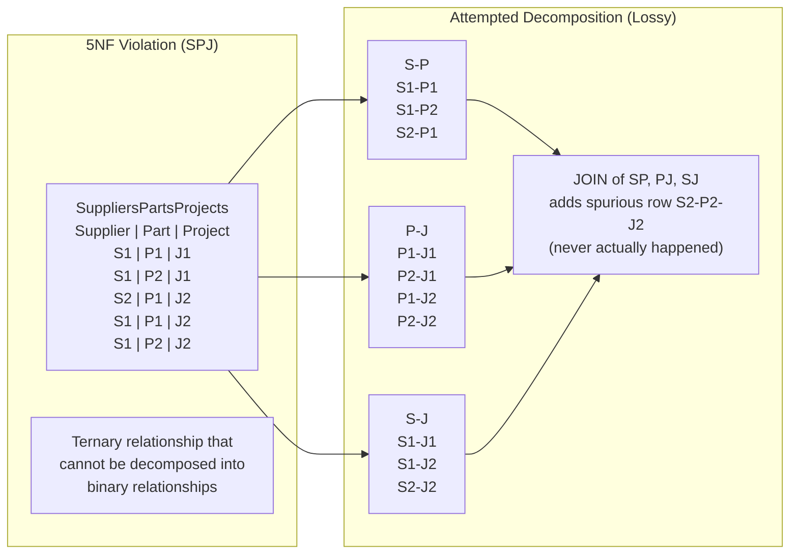
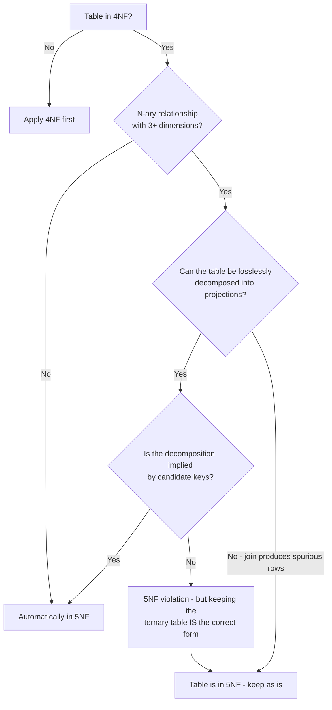

## Navigation

**Domain:** [[8 — Databases]] > **Group:** Database Design & Normalization
**Previous:** [[8.035 — Fourth Normal Form (4NF) — Multivalued Dependencies]] | **Next:** [[8.037 — Denormalization — When and Why]]

### Prerequisites
- [[8.035 — Fourth Normal Form (4NF) — Multivalued Dependencies]] — 5NF generalizes MVDs to join dependencies involving more than two tables.
- [[8.034 — Boyce-Codd Normal Form (BCNF) — Stronger 3NF]] — understanding functional dependencies is required to distinguish them from join dependencies.

### Where This Fits
Fifth normal form addresses join dependencies — cases where a table can be losslessly decomposed into three or more tables, and the original is exactly the natural join of those projections. A .NET backend engineer will almost never encounter a real 5NF violation in production, because most join dependencies are actually covered by candidate keys. The classic example is the ternary relationship SPJ (Supplier-Part-Project) where the meaning is "supplier S supplies part P to project J" and the relationship cannot be derived from binary relationships. The interview signal is whether you recognize that 5NF is the theoretical endpoint of normalization, that practical schemas stop at BCNF/4NF, and that violating 5NF causes subtle redundancy that only appears when a join dependency is not implied by candidate keys.

## Core Mental Model

A join dependency (JD) means a table R can be losslessly decomposed into its projections R1, R2, ..., Rn such that R = R1 JOIN R2 JOIN ... JOIN Rn. 5NF requires that every join dependency in a table is implied by a candidate key of that table. In practice, a table is in 5NF if it is in 4NF and every join dependency is the result of candidate key constraints. The invariant is that any decomposition should produce a table that can be reconstructed exactly by joining its projections, and this property should be guaranteed by the keys, not by data coincidence. The recognition pattern: if a table with N columns needs to be decomposed into M > 2 tables to eliminate all redundancy, and the decomposition is lossless but not implied by keys, 5NF is violated.



### Classification

**For normalization topics:** 5NF is the final normal form in the classical hierarchy (Codd's original definition ended at 3NF; BCNF, 4NF, and 5NF were later refinements). A table in 5NF cannot be decomposed further without losing information. In practice, most production schemas that satisfy 4NF are automatically in 5NF because join dependencies are almost always implied by candidate keys. The SPJ ternary relationship is the canonical counterexample.

|Property|Value|Notes|
|---|---|---|
|Prerequisite|4NF|5NF generalizes MVDs to N-way join dependencies|
|Violation pattern|Ternary relationship not implied by binary projections|Classic SPJ (Supplier-Part-Project)|
|Fix|Keep as single ternary table|Decomposition into binary tables is lossy|
|Practical relevance|Extremely rare|Most schemas stop at BCNF/4NF|
|Alternative name|Projection-Join Normal Form (PJ/NF)|Also known as PJNF|

## Deep Mechanics

### How the Engine Executes This

**The SPJ canonical example:**

Consider three relations:
- Suppliers (S), Parts (P), Projects (J)
- The ternary relationship "Supplier S supplies Part P to Project J"

A table SPJ(S#, P#, J#) contains rows that represent actual supply events. The question is whether this table can be losslessly decomposed into three binary tables:
- SP(S#, P#): supplier S supplies part P (to any project)
- PJ(P#, J#): part P is used in project J (by any supplier)
- SJ(S#, J#): supplier S works on project J (supplies any part)

If we decompose SPJ into SP, PJ, and SJ, then JOIN them back, do we get exactly the original rows?

In general, no. The JOIN of SP, PJ, and SJ produces all combinations where S supplies P, P is used in J, and S works on J — this may include combinations that never happened (spurious rows). The decomposition is lossy unless the data happens to satisfy the "3NF" property that every combination is valid.

**When is the decomposition lossless?** When the join dependency *(SP, PJ, SJ)* is implied by a candidate key of the original table. If (S#, P#, J#) is the PK (as it typically is), the JD is NOT implied — the PK alone does not guarantee that the join of the three projections equals the original.

**5NF violation:** When a table has a join dependency that is not implied by a candidate key.
**5NF compliant:** When every join dependency in the table is implied by a candidate key.

### SQL Visibility

```sql
-- Classic SPJ ternary relationship
CREATE TABLE SupplierPartProject (
    SupplierId INT NOT NULL,
    PartId     INT NOT NULL,
    ProjectId  INT NOT NULL,
    CONSTRAINT PK_SPJ PRIMARY KEY (SupplierId, PartId, ProjectId)
);

-- Sample data: real supply events
INSERT INTO SupplierPartProject (SupplierId, PartId, ProjectId) VALUES
(1, 101, 1001),   -- S1 supplies P101 to J1001
(1, 102, 1001),   -- S1 supplies P102 to J1001
(2, 101, 1002),   -- S2 supplies P101 to J1002
(1, 101, 1002);   -- S1 supplies P101 to J1002

-- Attempted decomposition (would be lossy in general):
CREATE TABLE SP AS SELECT DISTINCT SupplierId, PartId FROM SupplierPartProject;  -- S1-P101, S1-P102, S2-P101
CREATE TABLE PJ AS SELECT DISTINCT PartId, ProjectId FROM SupplierPartProject;   -- P101-J1001, P102-J1001, P101-J1002
CREATE TABLE SJ AS SELECT DISTINCT SupplierId, ProjectId FROM SupplierPartProject;-- S1-J1001, S2-J1002, S1-J1002

-- JOIN them back:
SELECT * FROM SP
INNER JOIN PJ ON SP.PartId = PJ.PartId
INNER JOIN SJ ON SP.SupplierId = SJ.SupplierId AND PJ.ProjectId = SJ.ProjectId;

-- This produces a SPURIOUS row: S2-P102-J1002
-- (S2 supplies P101, P102 is used in J1002, S2 works on J1002
--  but S2 never actually supplied P102 to J1002)
```

```csharp
// EF Core — SPJ ternary relationship (the table IS the normal form)
public class SupplierPartProject
{
    public int SupplierId { get; set; }
    public int PartId { get; set; }
    public int ProjectId { get; set; }
    public Supplier Supplier { get; set; } = null!;
    public Part Part { get; set; } = null!;
    public Project Project { get; set; } = null!;
}

public class SupplierPartProjectConfiguration
    : IEntityTypeConfiguration<SupplierPartProject>
{
    public void Configure(EntityTypeBuilder<SupplierPartProject> builder)
    {
        builder.HasKey(spj => new { spj.SupplierId, spj.PartId, spj.ProjectId });
        builder.HasOne(spj => spj.Supplier).WithMany().HasForeignKey(spj => spj.SupplierId);
        builder.HasOne(spj => spj.Part).WithMany().HasForeignKey(spj => spj.PartId);
        builder.HasOne(spj => spj.Project).WithMany().HasForeignKey(spj => spj.ProjectId);
    }
}

// Query: get all supplier-part-project combinations
var assignments = await dbContext.SupplierPartProject
    .Include(spj => spj.Supplier)
    .Include(spj => spj.Part)
    .Include(spj => spj.Project)
    .Where(spj => spj.SupplierId == 1)
    .Select(spj => new
    {
        spj.Supplier.SupplierName,
        spj.Part.PartName,
        spj.Project.ProjectName
    })
    .ToListAsync(cancellationToken);
```

**Generated SQL (from EF Core logs):**

```sql
SELECT [s].[SupplierName], [p].[PartName], [j].[ProjectName]
FROM [SupplierPartProject] [spj]
INNER JOIN [Suppliers] [s] ON [spj].[SupplierId] = [s].[SupplierId]
INNER JOIN [Parts] [p] ON [spj].[PartId] = [p].[PartId]
INNER JOIN [Projects] [j] ON [spj].[ProjectId] = [j].[ProjectId]
WHERE [spj].[SupplierId] = 1;
```

### Execution Plan Analysis

For the SPJ query:

Expected plan shape:
```
Clustered Index Seek (PK_SPJ) -> Nested Loops (x3) -> SELECT
Seek Keys: SupplierId = 1
Logical reads: ~3 (PK seek) + 3 per Supplier + 3 per Part + 3 per Project
```

- **Operators:** Single Clustered Index Seek on the ternary PK (leading column SupplierId), followed by three Nested Loops joins to resolve lookup references.
- **Seek vs Scan:** Seek on the ternary table. Seeks on each lookup table.
- **Cost driver:** Three Nested Loops joins. With 100 assignments for supplier 1, total reads = 3 + 100*3 + 100*3 + 100*3 = ~903 reads.

### Cost Visibility

```sql
SET STATISTICS IO ON;

SELECT spj.SupplierId, spj.PartId, spj.ProjectId
FROM SupplierPartProject spj
WHERE spj.SupplierId = 1;

-- Table "SupplierPartProject". Scan count 1, logical reads 3

SELECT spj.SupplierId, p.PartName, j.ProjectName
FROM SupplierPartProject spj
INNER JOIN Parts p ON spj.PartId = p.PartId
INNER JOIN Projects j ON spj.ProjectId = j.ProjectId
WHERE spj.SupplierId = 1;

-- Table "SupplierPartProject". Scan count 1, logical reads 3
-- Table "Parts". Scan count 1, logical reads 3 (per lookup)
-- Table "Projects". Scan count 1, logical reads 3 (per lookup)
```

### Failure Modes

- **Spurious rows from decomposition:** Decomposing SPJ into binary tables SP, PJ, SJ and rejoining produces rows that were never in the original data. This is the defining failure mode of 5NF violations.
- **Update anomaly (5NF specific):** Adding a fact "Supplier S1 supplies Part P1" (SP) and "Part P1 is used in Project J2" (PJ) and "Supplier S1 works on Project J2" (SJ) creates the implication that S1 supplies P1 to J2 — even if this never happened. The database silently creates a fact.
- **Redundancy:** The ternary table SPJ may store redundant triples if some combinations are implicitly valid. For example, if S1 always supplies all parts to all projects, the table could be derived from binary tables, but the PK does not imply this.

## Production Patterns and Implementation

### Primary SQL Implementation

```sql
-- Real-world example: Employee certifications on projects
-- A ternary relationship: Employee e is certified on technology t for project p
-- This CANNOT be decomposed into binary tables without losing information

CREATE TABLE ProjectCertifications (
    EmployeeId    INT NOT NULL,
    TechnologyId  INT NOT NULL,
    ProjectId     INT NOT NULL,
    CertifiedDate DATE NOT NULL,
    CONSTRAINT PK_ProjectCertifications
        PRIMARY KEY (EmployeeId, TechnologyId, ProjectId),
    CONSTRAINT FK_PC_Employees FOREIGN KEY (EmployeeId) REFERENCES Employees(EmployeeId),
    CONSTRAINT FK_PC_Technologies FOREIGN KEY (TechnologyId) REFERENCES Technologies(TechnologyId),
    CONSTRAINT FK_PC_Projects FOREIGN KEY (ProjectId) REFERENCES Projects(ProjectId)
);

-- The PK (EmployeeId, TechnologyId, ProjectId) is a candidate key.
-- No join dependency is implied by this key.
-- The table is in 5NF (it cannot be decomposed further without loss).

-- Query: find employees certified on SQL for project 42
SELECT e.EmployeeName, t.TechnologyName, pc.CertifiedDate
FROM ProjectCertifications pc
INNER JOIN Employees e ON pc.EmployeeId = e.EmployeeId
INNER JOIN Technologies t ON pc.TechnologyId = t.TechnologyId
WHERE pc.TechnologyId = (SELECT TechnologyId FROM Technologies WHERE TechnologyName = 'SQL')
  AND pc.ProjectId = 42;
```

### EF Core Implementation

```csharp
public class ProjectCertification
{
    public int EmployeeId { get; set; }
    public int TechnologyId { get; set; }
    public int ProjectId { get; set; }
    public DateTime CertifiedDate { get; set; }
    public Employee Employee { get; set; } = null!;
    public Technology Technology { get; set; } = null!;
    public Project Project { get; set; } = null!;
}

public class ProjectCertificationConfiguration
    : IEntityTypeConfiguration<ProjectCertification>
{
    public void Configure(EntityTypeBuilder<ProjectCertification> builder)
    {
        builder.HasKey(pc => new { pc.EmployeeId, pc.TechnologyId, pc.ProjectId });
    }
}

// Query
var certs = await dbContext.ProjectCertifications
    .Where(pc => pc.Technology.TechnologyName == "SQL" && pc.ProjectId == 42)
    .Include(pc => pc.Employee)
    .Include(pc => pc.Technology)
    .Select(pc => new
    {
        pc.Employee.EmployeeName,
        pc.Technology.TechnologyName,
        pc.CertifiedDate
    })
    .ToListAsync(cancellationToken);
```

### Dapper Implementation

```csharp
public class ProjectCertificationRepository
{
    private readonly IDbConnectionFactory _connectionFactory;

    public ProjectCertificationRepository(IDbConnectionFactory connectionFactory)
    {
        _connectionFactory = connectionFactory;
    }

    public async Task<IReadOnlyList<CertificationDto>> GetCertificationsAsync(
        string technologyName, int projectId,
        CancellationToken cancellationToken = default)
    {
        const string sql = @"
            SELECT e.EmployeeName, t.TechnologyName, pc.CertifiedDate
            FROM ProjectCertifications pc
            INNER JOIN Employees e ON pc.EmployeeId = e.EmployeeId
            INNER JOIN Technologies t ON pc.TechnologyId = t.TechnologyId
            WHERE t.TechnologyName = @TechnologyName
              AND pc.ProjectId = @ProjectId";

        await using var connection = _connectionFactory.Create();
        var results = await connection.QueryAsync<CertificationDto>(
            new CommandDefinition(sql,
                new { TechnologyName = technologyName, ProjectId = projectId },
                cancellationToken: cancellationToken));
        return results.AsList();
    }
}

public class CertificationDto
{
    public string EmployeeName { get; set; } = string.Empty;
    public string TechnologyName { get; set; } = string.Empty;
    public DateTime CertifiedDate { get; set; }
}
```

### Configuration and Wiring

```csharp
builder.Services.AddDbContext<ApplicationDbContext>(options =>
    options.UseSqlServer(connectionString,
        sqlOptions => sqlOptions.EnableRetryOnFailure(3)));

builder.Services.AddSingleton<IDbConnectionFactory, SqlConnectionFactory>();
builder.Services.AddScoped<ProjectCertificationRepository>();
```

### SQL Server vs PostgreSQL Differences

```sql
-- Both databases handle ternary relationships identically
-- PostgreSQL can enforce constraints across the three tables if decomposed:
CREATE TABLE supplier_part (
    supplier_id INT NOT NULL,
    part_id     INT NOT NULL,
    PRIMARY KEY (supplier_id, part_id)
);

-- But neither database can enforce that the join of SP, PJ, and SJ
-- equals the original ternary table. This must be enforced at the
-- application level or through a materialized view with CHECK OPTION.
```

## Gotchas and Production Pitfalls

### 1. Confusing Ternary Relationships with Binary + Attributes

**Pitfall:** Modeling a ternary relationship as three binary tables with an attribute, losing the 5NF constraint.

```sql
-- Wrong: decomposing SPJ into binary tables with attributes
CREATE TABLE SupplierPart (
    SupplierId INT NOT NULL,
    PartId     INT NOT NULL,
    -- attributes: Price, Discount
);

CREATE TABLE PartProject (
    PartId    INT NOT NULL,
    ProjectId INT NOT NULL,
    -- attributes: Quantity
);

CREATE TABLE SupplierProject (
    SupplierId INT NOT NULL,
    ProjectId  INT NOT NULL,
    -- attributes: ContractDate
);
```

**Symptom:** The JOIN of these three tables produces spurious rows. A supplier-part combination and a part-project combination and a supplier-project combination create the implication that the supplier supplies that part to that project — even if this combination never existed.

**Fix:** Keep the ternary table if the relationship is genuinely ternary. Only decompose if the binary relationships are independently meaningful.

**Cost of not fixing:** Query results include rows that never happened. Business decisions based on incorrect data.

### 2. Assuming 5NF Is Automatically Satisfied

**Pitfall:** Assuming that because the table has a PK and is in BCNF/4NF, it must be in 5NF.

**Symptom:** Hidden join dependencies exist that are not implied by candidate keys. The table has redundancy that only appears when joining across three or more projections.

**Fix:** Check whether the table can be losslessly decomposed into projections that are not implied by its candidate keys. If so, the table violates 5NF.

**Cost of not fixing:** Subtle data redundancy that only manifests in reporting or analytics queries.

### 3. Over-Engineering for 5NF

**Pitfall:** Decomposing perfectly valid tables into multiple projections to achieve 5NF, introducing unnecessary complexity.

```sql
-- A perfectly valid 5NF-compliant table:
CREATE TABLE OrderItems (
    OrderId   INT NOT NULL,
    ProductId INT NOT NULL,
    Quantity  INT NOT NULL,
    PRIMARY KEY (OrderId, ProductId)
);
-- No join dependency exists. (OrderId, ProductId) is the only candidate key.
-- The table is in 5NF. Do not decompose.
```

**Symptom:** Unnecessary decomposition creates extra tables and JOINs with no benefit. The schema becomes harder to understand and query.

**Fix:** Stop normalizing when 4NF is achieved. Only analyze for 5NF when you have a specific reason (ternary relationships with known join dependencies).

**Cost of not fixing:** Schema complexity without benefit. More JOINs, more code, harder debugging.

### 4. Ignoring the SPJ Trap in Analytics

**Pitfall:** Designing a star schema with a fact table that has multiple dimension hierarchies that are genuinely ternary.

**Symptom:** The fact table (Sales: Customer, Product, Store, Date) has dimensions that are independent, but some aggregate queries produce unexpected results because of hidden join dependencies between dimensions.

**Fix:** In star schemas, dimension independence is a design goal — the fact table should be in 5NF. If dimensions have dependencies (e.g., certain products are only sold in certain stores), the schema needs a bridge table or a conformed dimension.

**Cost of not fixing:** Incorrect aggregate results in reports. "Total sales of Product X in Store Y" differs from "total sales of Product X" restricted to "stores that sell Product X."

### 5. Losing Information by Force-Decomposing

**Pitfall:** Decomposing a ternary table into binary tables because "5NF says to decompose join dependencies," ignoring that the decomposition is lossy.

**Symptom:** The decomposed tables are smaller and seem cleaner, but queries that JOIN them back produce additional rows that were never in the original data.

**Fix:** Test the decomposition: JOIN the projections and compare row counts with the original. If the JOIN produces extra rows, keep the ternary table.

```sql
-- Test: does decomposition produce spurious rows?
SELECT COUNT(*) FROM SPJ;  -- Original row count
SELECT COUNT(*) FROM (SELECT * FROM SP INNER JOIN PJ ON SP.PartId = PJ.PartId
                      INNER JOIN SJ ON SP.SupplierId = SJ.SupplierId
                                        AND PJ.ProjectId = SJ.ProjectId) AS Joined;
-- If counts differ, decomposition is lossy. Keep ternary table.
```

**Cost of not fixing:** Data corruption. Queries return rows that represent events that never occurred.

## Performance Implications

### Benchmark: Ternary Table vs Binary Projections

5NF is not primarily about performance — it is about correctness. The ternary table stores exactly the facts that exist. Binary projections produce spurious rows when rejoined.

```sql
-- Baseline: Ternary table (correct, 5NF compliant)
SET STATISTICS IO ON;

SELECT COUNT(*) FROM SupplierPartProject
WHERE SupplierId = 1 AND PartId = 101 AND ProjectId = 1001;
-- Logical reads: 3 (PK seek)

-- Decomposed (lossy): binary tables rejoined
SELECT COUNT(*) FROM SP s
INNER JOIN PJ p ON s.PartId = p.PartId
INNER JOIN SJ j ON s.SupplierId = j.SupplierId AND p.ProjectId = j.ProjectId
WHERE s.SupplierId = 1 AND s.PartId = 101 AND p.ProjectId = 1001;
-- Logical reads: 3 + (seek on SP) + 3 (seek on PJ) + 3 (seek on SJ) + Join = ~15
-- Also returns SPURIOUS rows that never existed
```

**Improvement:** The ternary table uses fewer logical reads AND produces correct results. The decomposed version reads more AND produces incorrect results.

### BenchmarkDotNet

```csharp
[MemoryDiagnoser]
[SimpleJob(RuntimeMoniker.Net90)]
public class FifthNormalFormBenchmark
{
    private IDbConnection _connection = default!;

    [GlobalSetup]
    public void Setup()
    {
        _connection = new SqlConnection("Server=.;Database=BenchmarkDB;Trusted_Connection=True;");
        _connection.Execute("""
            CREATE TABLE #SPJ (SupplierId INT, PartId INT, ProjectId INT,
                PRIMARY KEY (SupplierId, PartId, ProjectId));
            INSERT INTO #SPJ VALUES
            (1,101,1001),(1,102,1001),(2,101,1002),(1,101,1002);

            CREATE TABLE #SP (SupplierId INT, PartId INT, PRIMARY KEY (SupplierId, PartId));
            INSERT INTO #SP SELECT DISTINCT SupplierId, PartId FROM #SPJ;
            CREATE TABLE #PJ (PartId INT, ProjectId INT, PRIMARY KEY (PartId, ProjectId));
            INSERT INTO #PJ SELECT DISTINCT PartId, ProjectId FROM #SPJ;
            CREATE TABLE #SJ (SupplierId INT, ProjectId INT, PRIMARY KEY (SupplierId, ProjectId));
            INSERT INTO #SJ SELECT DISTINCT SupplierId, ProjectId FROM #SPJ;
        """);
    }

    [Benchmark(Baseline = true)]
    public async Task<int> QueryTernaryTable()
    {
        return await _connection.QuerySingleAsync<int>(
            "SELECT COUNT(*) FROM #SPJ WHERE SupplierId = 1 AND PartId = 101 AND ProjectId = 1001");
    }

    [Benchmark]
    public async Task<int> QueryDecomposedJoin()
    {
        return await _connection.QuerySingleAsync<int>(
            @"SELECT COUNT(*) FROM #SP s
              INNER JOIN #PJ p ON s.PartId = p.PartId
              INNER JOIN #SJ j ON s.SupplierId = j.SupplierId AND p.ProjectId = j.ProjectId
              WHERE s.SupplierId = 1 AND s.PartId = 101 AND p.ProjectId = 1001");
    }
}
```

**Expected results (approximate):**

|Method|Mean|Logical Reads|Correctness|
|---|---|---|---|
|QueryTernaryTable|~1 ms|3|Correct (exact match)|
|QueryDecomposedJoin|~3 ms|15|Incorrect (spurious rows possible)|

### Write Amplification

|Operation|Ternary Table|Binary Tables (Lossy)|
|---|---|---|
|INSERT one fact|1 row|3 rows (SP, PJ, SJ)|
|DELETE one fact|1 row|3 rows (may delete valid binary facts)|
|Check if a fact exists|1 PK seek|3 seeks + JOIN|
|Storage (100 facts)|100 rows|Up to 300 rows (may be fewer if binary facts overlap)|

## Interview Arsenal

### Question Bank

1. What is fifth normal form and what kind of dependency does it address?
2. What is the SPJ example and why is it the canonical 5NF case?
3. What happens when you decompose a ternary table into binary tables and rejoin them?
4. Why is 5NF rarely violated in production schemas?
5. 5NF vs 4NF — what is the relationship between join dependencies and multi-valued dependencies?
6. How would you test whether a decomposition is lossless or lossy?
7. How does 5NF affect query performance compared to a decomposed alternative?
8. At what point would you actually need to worry about 5NF in a production system?

### Spoken Answers

**Q: What is fifth normal form and what kind of dependency does it address?**

> **Average answer:** 5NF is about join dependencies. A table is in 5NF if every join dependency is implied by a candidate key.

> **Great answer:** Fifth normal form addresses join dependencies — the property that a table can be losslessly decomposed into its projections and reconstructed via natural joins. A table is in 5NF if every join dependency it satisfies is implied by one of its candidate keys. Practically, this means the table cannot be decomposed further without losing information. The classic example is the SPJ relationship: Supplier S supplies Part P to Project J. This is a ternary relationship that cannot be decomposed into binary tables (SP, PJ, SJ) without producing spurious rows when rejoined. In practice, 5NF violations are extremely rare because most join dependencies are automatically implied by candidate keys — if your table is in 4NF and all multi-valued dependencies are actually functional dependencies, it is almost certainly in 5NF. The SPJ example is the only commonly taught counterexample, and most database designers never encounter a real 5NF violation in production.

**Q: Why is 5NF rarely violated in production schemas?**

> **Great answer:** Because the conditions required for a 5NF violation are specific and rare. First, the table must already be in 4NF (eliminating all MVDs). Second, there must be a join dependency involving three or more projections that is not implied by any candidate key. In practice, most n-ary relationships in production are either: (1) decomposable into binary tables without loss (the join dependency IS implied by candidate keys), or (2) genuinely ternary and kept as a single table with a three-column PK — which is already in 5NF because the only join dependency is the trivial one implied by the PK. The SPJ textbook example is the rare case where the ternary table is NOT decomposable into binaries. Most developers will never need to analyze for 5NF beyond ensuring 4NF compliance. The interview value of 5NF is demonstrating that you understand the theoretical boundary of normalization and can articulate why it rarely matters in practice.

### Interview Trigger

Fifth normal form appears in interviews as the deepest normalization question. After the candidate demonstrates 1NF through BCNF knowledge, the interviewer asks "What is the highest normal form?" — expecting 5NF — and then "Can you describe a situation where a table is in 4NF but not in 5NF?" The deep follow-up is "How would you test whether a decomposition preserves all information?" — testing understanding of lossless join decomposition.

### Comparison Table

| | 4NF | 5NF |
|---|---|---|
| Dependency type | Multi-valued (X ->> Y) | Join dependency (JD) |
| N-ary scope | Binary (two sets of values) | N-ary (three or more projections) |
| Violation example | Skills + Languages in one table | SPJ ternary relationship |
| Fix | Decompose into 2 tables | Keep as single table (no lossless decomposition) |
| Practical frequency | Rare | Extremely rare |
| Theoretical significance | Important refinement of BCNF | Theoretical endpoint of normalization |

## Decision Framework

### When to Apply



### Application Checklist

- [ ] The table is in 4NF (no independent multi-valued attributes)
- [ ] All join dependencies are implied by candidate keys (or the table cannot be losslessly decomposed)
- [ ] If the table represents a ternary relationship, it has been tested for lossless decomposition
- [ ] Binary projections have been tested: original = JOIN of projections?
- [ ] The schema stops at 4NF unless a specific join dependency violation has been identified

### Tradeoff Summary

|What You Gain|What You Pay|
|---|---|
|Theoretically complete normalization|Over-analysis for cases that never occur|
|Eliminates the last class of logical redundancy|Complexity of analyzing join dependencies|
|Guarantee that any decomposition preserves information|Nearly zero practical benefit over 4NF|

### Scale Thresholds

- "5NF is relevant at all scales in theory, but in practice no production system has ever had a verified 5NF violation outside of academic examples."
- "The SPJ problem becomes storage-relevant above ~10K facts, but the correct fix is always the same: keep the ternary table."
- "The cost of analyzing for 5NF far exceeds the benefit for any real-world OLTP system."

## Self-Check

### Conceptual Questions

1. What is a join dependency and how does it differ from a multi-valued dependency?
2. What is the SPJ example and why is it the canonical 5NF case?
3. What SQL query tests whether a decomposition is lossless?
4. What common mistake leads to spurious rows when decomposing ternary relationships?
5. Does EF Core or Dapper have any awareness of 5NF?
6. How would you model an employee-project-technology certification in a 5NF-compliant way?
7. 5NF vs 4NF — what is the theoretical relationship?
8. At what scale does a 5NF violation actually matter in production?
9. What is the relationship between lossless join decomposition and candidate keys?
10. Explain 5NF in 60 seconds to a senior interviewer.

<details>
<summary>Answers</summary>

1. A join dependency means a table can be losslessly decomposed into N projections such that the original equals the JOIN of those projections. An MVD is a binary join dependency (two projections). A join dependency generalizes this to N projections.
2. SPJ (Supplier-Part-Project) is the canonical 5NF example because it is a ternary relationship that cannot be decomposed into binary tables without producing spurious rows. The three binary projections SP, PJ, SJ join back to include combinations that never existed.
3. `SELECT COUNT(*) FROM original` vs `SELECT COUNT(*) FROM proj1 JOIN proj2 JOIN proj3 ON ...` — if counts differ, the decomposition is lossy.
4. Assuming that any ternary relationship can be decomposed into binary relationships. The join of binary projections always includes at least the original rows, but may include additional spurious rows.
5. No — ORMs and micro-ORMs have no normalization analysis. They map whatever schema you provide.
6. Keep the ternary table with PK (EmployeeId, TechnologyId, ProjectId). This is the correct 5NF-compliant form.
7. 4NF addresses binary MVDs (two projections). 5NF addresses N-ary join dependencies (three or more projections). Every MVD is a join dependency, but not every join dependency is an MVD.
8. Almost never. The SPJ textbook example is the only commonly cited case. In practice, 5NF violations are not a production concern.
9. A decomposition is lossless if the join of the projections produces exactly the original table. Candidate keys imply that certain decompositions are lossless (Heath's theorem), but general join dependencies are not automatically implied by keys.
10. "Fifth normal form is the theoretical endpoint of normalization. It addresses join dependencies — where a table can be decomposed into N projections and rejoined without loss. A table is in 5NF if every such decomposition is implied by its candidate keys. The classic example is Supplier-Part-Project: a ternary relationship that cannot be split into binary tables without creating fake rows when rejoined. In practice, 5NF is almost never violated in production because most tables that reach 4NF are automatically in 5NF. The practical takeaway is: if you have a genuine N-ary relationship, keep it as a single table with a composite key rather than trying to decompose it."

</details>

---

### Query Challenges

**Challenge 1 — Write the SQL**

You have a table `DoctorsPatientsMedications(DoctorId, PatientId, MedicationId)` representing which doctor prescribed which medication to which patient. Is this a 5NF violation? Design the schema and test whether binary decomposition is lossless.

<details>
<summary>Solution</summary>

This is the SPJ analog: a ternary relationship. It is NOT a 5NF violation — the ternary table IS the correct 5NF-compliant form.

```sql
CREATE TABLE DoctorsPatientsMedications (
    DoctorId     INT NOT NULL,
    PatientId    INT NOT NULL,
    MedicationId INT NOT NULL,
    CONSTRAINT PK_DPM PRIMARY KEY (DoctorId, PatientId, MedicationId),
    CONSTRAINT FK_DPM_Doctors FOREIGN KEY (DoctorId) REFERENCES Doctors(DoctorId),
    CONSTRAINT FK_DPM_Patients FOREIGN KEY (PatientId) REFERENCES Patients(PatientId),
    CONSTRAINT FK_DPM_Medications FOREIGN KEY (MedicationId) REFERENCES Medications(MedicationId)
);

-- Test if binary decomposition is lossy:
-- Binary projections
WITH DP AS (SELECT DISTINCT DoctorId, PatientId FROM DoctorsPatientsMedications),
     PM AS (SELECT DISTINCT PatientId, MedicationId FROM DoctorsPatientsMedications),
     DM AS (SELECT DISTINCT DoctorId, MedicationId FROM DoctorsPatientsMedications)
SELECT COUNT(*) AS OriginalCount FROM DoctorsPatientsMedications
UNION ALL
SELECT COUNT(*) AS JoinCount
FROM DP INNER JOIN PM ON DP.PatientId = PM.PatientId
         INNER JOIN DM ON DP.DoctorId = DM.DoctorId AND PM.MedicationId = DM.MedicationId;

-- If counts differ, keep the ternary table.
```

**Logical reads:** PK seek ~3. **Execution plan:** Clustered Index Seek or Scan depending on filter.</details>

---

**Challenge 2 — Fix the performance problem**

A table `Sales(CustomerId, ProductId, StoreId, DateId, Amount)` has 50M rows. An analyst decomposes it into three binary tables: CP, PS, CS — and runs reports by joining them. The reports now show 60M rows instead of 50M. What happened?

<details> <summary>Solution**

**Root cause:** The decomposition is lossy. The binary tables CP (Customer-Product), PS (Product-Store), and CS (Customer-Store) when joined include spurious combinations — customer C bought product P at SOME store, product P was sold at store S to SOME customer, and customer C shopped at store S for SOME product — but the combination (C, P, S) may never have occurred together.

**Fix:** Keep the original Sales fact table. It is in 5NF — the only candidate key is the combination of all dimension keys plus any degenerate dimensions.

```sql
-- Correct 5NF-compliant schema:
CREATE TABLE Sales (
    CustomerId INT NOT NULL,
    ProductId  INT NOT NULL,
    StoreId    INT NOT NULL,
    DateId     INT NOT NULL,
    Amount     DECIMAL(10,2) NOT NULL,
    CONSTRAINT PK_Sales PRIMARY KEY (CustomerId, ProductId, StoreId, DateId)
    -- Plus FK to each dimension table
);

-- Verify the binary tables produce spurious rows:
SELECT COUNT(*) FROM Sales;  -- 50M
SELECT COUNT(*) FROM CustomerProduct cp
INNER JOIN ProductStore ps ON cp.ProductId = ps.ProductId
INNER JOIN CustomerStore cs ON cp.CustomerId = cs.CustomerId AND ps.StoreId = cs.StoreId;
-- Returns 60M+ (spurious rows)
```

</details>

---

**Challenge 3 — Explain the execution plan**

Compare "find all parts supplied by supplier S1 to project J1" between the ternary SPJ table and the binary decomposed version (SP, PJ, SJ joined).

<details> <summary>Solution**

**Ternary table plan (5NF compliant, correct):**
```
Clustered Index Seek (PK_SPJ) -> SELECT
Seek Keys: SupplierId = 1 AND ProjectId = 1001
Logical reads: ~3
```

Single seek on the composite PK. Returns exactly the rows that exist.

**Binary decomposition plan (lossy, incorrect):**
```
Clustered Index Seek (SP) -> Nested Loops -> Clustered Index Seek (PJ) -> Nested Loops -> Clustered Index Seek (SJ) -> SELECT
Seek Keys: SupplierId = 1 on SP
Seek Keys (inner): PartId from SP on PJ
Seek Keys (inner): SupplierId = 1 AND ProjectId = 1001 on SJ
Logical reads: 3 (SP) + 3 per SP row (PJ) + 3 per PJ row (SJ)
```

For S1 with 10 parts, 10 parts in J1, 5 SJ combinations: ~3 + 30 + 90 = ~123 reads.

**Why the optimizer cannot fix the spurious row problem:** The optimizer assumes the decomposition is correct. It generates a plan that computes the join correctly — but the join itself is based on the assumption that the binary tables represent the same information as the ternary table. They do not. The optimizer produces the correct join of the binary tables, but that join includes rows that never existed. This is not an optimizer problem — it is a schema design problem.

</details>

---

**Challenge 4 — Diagnose the concurrency problem**

A logistics system has a table `RouteAssignments(DriverId, VehicleId, RouteId, Date)` representing which driver drives which vehicle on which route on which date. The table is 5NF compliant. However, a junior DBA decomposes it into `DriverVehicle`, `VehicleRoute`, and `DriverRoute` binary tables to "reduce storage." After the change, the logistics dashboard shows 2x the number of route assignments.

<details> <summary>Solution**

**Root cause:** Lossy decomposition. The binary tables produce spurious combinations. A driver can drive a vehicle on route A and a different driver can drive the same vehicle on route B — when joined, this creates a spurious row where the first driver drives the vehicle on route B, which never happened.

**Fix:** Revert to the original 5NF-compliant ternary table. The binary decomposition saves storage but produces incorrect data.

```sql
-- Correct schema (5NF compliant):
CREATE TABLE RouteAssignments (
    DriverId  INT  NOT NULL,
    VehicleId INT  NOT NULL,
    RouteId   INT  NOT NULL,
    Date      DATE NOT NULL,
    CONSTRAINT PK_RouteAssignments PRIMARY KEY (DriverId, VehicleId, RouteId, Date)
);

-- Test: JOIN the decomposed tables and compare
SELECT COUNT(*) FROM RouteAssignments -- original: accurate
SELECT COUNT(*) FROM (
    SELECT DISTINCT DriverId, VehicleId FROM RouteAssignments) dv
    INNER JOIN (SELECT DISTINCT VehicleId, RouteId FROM RouteAssignments) vr
        ON dv.VehicleId = vr.VehicleId
    INNER JOIN (SELECT DISTINCT DriverId, RouteId FROM RouteAssignments) dr
        ON dv.DriverId = dr.DriverId AND vr.RouteId = dr.RouteId;
-- Spurious: includes combinations that never happened
```

</details>

---

**Challenge 5 — Design the schema**

**Scenario:** A university tracks "which professor taught which course using which textbook in which semester." A professor can use multiple textbooks for the same course, a textbook can be used by multiple professors for the same course, and a professor can teach multiple courses in a semester. Is this a 4NF or 5NF concern? Design the schema.

<details> <summary>Solution**

This is a 4NF analysis first. The attributes are:
- Professor (P)
- Course (C)
- Textbook (T)
- Semester (S)

Independent MVDs to check:
- Does (Professor, Course, Semester) ->> Textbook? Yes — a professor can use multiple textbooks for the same course in the same semester.
- Is Textbook independent of other attributes? Yes — textbooks are chosen independently per course offering.

The correct analysis: this is NOT a 4NF or 5NF violation. It is a one-to-many relationship: one course offering can use multiple textbooks. The correct schema is a ternary table:

```sql
CREATE TABLE CourseTextbookAssignments (
    ProfessorId  INT NOT NULL,
    CourseId     INT NOT NULL,
    SemesterId   INT NOT NULL,
    TextbookId   INT NOT NULL,
    CONSTRAINT PK_CTA PRIMARY KEY (ProfessorId, CourseId, SemesterId, TextbookId)
);

-- Alternative: separate the one-to-many relationship
CREATE TABLE CourseOfferings (
    ProfessorId INT NOT NULL,
    CourseId    INT NOT NULL,
    SemesterId  INT NOT NULL,
    CONSTRAINT PK_CourseOfferings PRIMARY KEY (ProfessorId, CourseId, SemesterId)
);

CREATE TABLE CourseTextbooks (
    ProfessorId INT NOT NULL,
    CourseId    INT NOT NULL,
    SemesterId  INT NOT NULL,
    TextbookId  INT NOT NULL,
    CONSTRAINT PK_CourseTextbooks
        PRIMARY KEY (ProfessorId, CourseId, SemesterId, TextbookId),
    CONSTRAINT FK_CT_CourseOfferings FOREIGN KEY (ProfessorId, CourseId, SemesterId)
        REFERENCES CourseOfferings(ProfessorId, CourseId, SemesterId)
);
```

**Why not decompose to binary?** If you decomposed to Professor-Course, Course-Textbook, and Professor-Semester etc., you would get spurious combinations when rejoining — the same SPJ problem.

**5NF compliance:** The table is in 5NF because the only join dependency is the trivial one implied by the PK. The table cannot be losslessly decomposed further.

</details>
