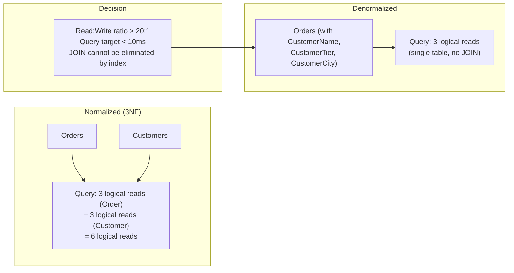
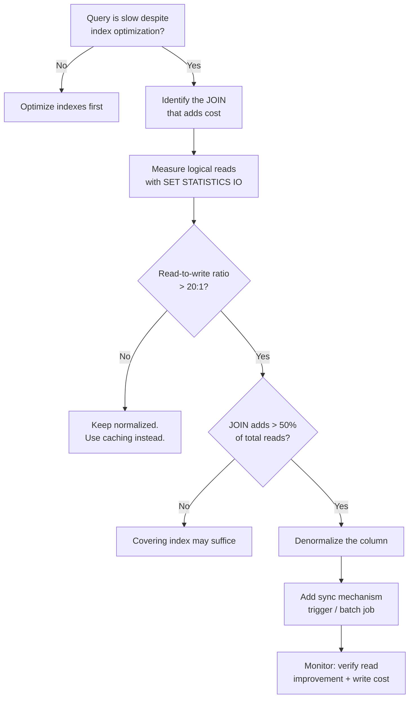

## Navigation

**Domain:** [[8 — Databases]] > **Group:** Database Design & Normalization
**Previous:** [[8.036 — Fifth Normal Form (5NF) — Join Dependencies]] | **Next:** [[8.038 — Star Schema — Fact and Dimension Tables]]

### Prerequisites
- [[8.033 — Third Normal Form (3NF) — Eliminating Transitive Dependencies]] — you must understand normalization before you can intentionally break it.
- [[8.034 — Boyce-Codd Normal Form (BCNF) — Stronger 3NF]] — BCNF is the production normalization target; denormalization starts from there.

### Where This Fits
Denormalization is the intentional introduction of controlled redundancy to eliminate JOINs and reduce logical reads for read-heavy workloads. A .NET backend engineer encounters this when a query that JOINs five normalized tables takes 500ms and the business needs it under 50ms — the fix is to store a pre-joined copy of the data. The interview signal is whether you can articulate denormalization as an explicit, measured tradeoff rather than a failure of normalization, and whether you know the specific read-to-write ratio and query pattern that justifies each denormalization technique.

## Core Mental Model

Denormalization means storing redundant data that is derivable from the normalized schema, accepting write overhead and update anomaly risk in exchange for read performance. The invariant is that every denormalization decision must be justified by a measured performance target — "this query needs to return in under 10ms at 1,000 QPS, and the normalized version requires 15 logical reads that cannot be reduced further with indexing." The recognition pattern: you have a query that uses every indexing trick (covering indexes, filtered indexes, included columns) and still reads too many pages because the data is spread across multiple tables — the remaining cost is the JOIN itself.



### Classification

**For normalization topics:** Denormalization is the inverse of normalization. It is not an anti-pattern — it is a deliberate performance technique. The key question is always: "Does the read performance gain outweigh the write cost and integrity risk?"

|Property|Value|Notes|
|---|---|---|
|Read improvement|Eliminates JOINs, reduces logical reads|~50% reduction for single-row lookups|
|Write cost|Additional columns to update|Nx more writes if column is duplicated across rows|
|Update anomaly|Introduced|Must be managed at application level|
|When to use|Read >> Write ratio, strict latency targets|Above ~20:1 read-to-write ratio|
|When to avoid|Write-heavy OLTP, financial data with strict consistency|ACID compliance may be compromised|

## Deep Mechanics

### How the Engine Executes This

**Normalized query path:**
1. Query arrives: `SELECT o.OrderId, c.CustomerName, o.TotalAmount FROM Orders o INNER JOIN Customers c ON o.CustomerId = c.CustomerId WHERE o.OrderId = 42`.
2. Optimizer plans: Clustered Index Seek on Orders (3 reads) -> Nested Loops -> Clustered Index Seek on Customers (3 reads) = 6 logical reads.
3. Execution: read Order row from PK_Orders leaf page, read Customer row from PK_Customers leaf page.
4. Each read requires a separate B-tree traversal. With 1,000 QPS, this is 6,000 pages read per second.

**Denormalized query path:**
1. Query: `SELECT OrderId, CustomerName, TotalAmount FROM Orders_Denormalized WHERE OrderId = 42`.
2. Optimizer plans: Clustered Index Seek on PK_Orders_Denormalized (3 reads) = 3 logical reads.
3. Execution: read Order row — CustomerName is on the same page.
4. With 1,000 QPS, this is 3,000 pages read per second. 50% reduction in buffer pool pressure.

**Write cost (denormalized):**
1. When CustomerName changes, the UPDATE must find and modify every Order row for that customer.
2. `UPDATE Orders_Denormalized SET CustomerName = 'New Name' WHERE CustomerId = 42` — scans the clustered index for all rows with CustomerId = 42.
3. Without an index on CustomerId, this is a full table scan (50K logical reads). With an index, it is a seek + bookmark lookup + updates (N x 3 reads for N orders).
4. Each update acquires an exclusive lock, potentially escalating to table lock.

### SQL Visibility

```sql
-- Normalized (3NF/BCNF) — starting point
CREATE TABLE Customers (
    CustomerId   INT           NOT NULL IDENTITY(1,1),
    CustomerName VARCHAR(100)  NOT NULL,
    CustomerTier VARCHAR(20)   NOT NULL,
    CustomerCity VARCHAR(100)  NOT NULL,
    CONSTRAINT PK_Customers PRIMARY KEY (CustomerId)
);

CREATE TABLE Orders (
    OrderId     INT            NOT NULL IDENTITY(1,1),
    CustomerId  INT            NOT NULL,
    OrderDate   DATETIME2      NOT NULL,
    TotalAmount DECIMAL(10,2)  NOT NULL,
    CONSTRAINT PK_Orders PRIMARY KEY (OrderId),
    CONSTRAINT FK_Orders_Customers FOREIGN KEY (CustomerId) REFERENCES Customers(CustomerId)
);

-- Query: get order with customer name (6 logical reads)
SELECT o.OrderId, c.CustomerName, o.TotalAmount
FROM Orders o
INNER JOIN Customers c ON o.CustomerId = c.CustomerId
WHERE o.OrderId = 42;
```

```sql
-- Denormalized: CustomerName stored directly in Orders
CREATE TABLE Orders_Denormalized (
    OrderId      INT            NOT NULL IDENTITY(1,1),
    CustomerId   INT            NOT NULL,
    CustomerName VARCHAR(100)   NOT NULL,  -- denormalized from Customers
    CustomerTier VARCHAR(20)    NOT NULL,  -- denormalized from Customers
    OrderDate    DATETIME2      NOT NULL,
    TotalAmount  DECIMAL(10,2)  NOT NULL,
    CONSTRAINT PK_Orders_Denormalized PRIMARY KEY (OrderId)
);

CREATE INDEX IX_Orders_Denormalized_CustomerId
    ON Orders_Denormalized(CustomerId);

-- Query: get order with customer name (3 logical reads)
SELECT OrderId, CustomerName, TotalAmount
FROM Orders_Denormalized
WHERE OrderId = 42;

-- Write cost: when customer name changes
UPDATE Orders_Denormalized
SET CustomerName = 'New Name'
WHERE CustomerId = 42;
-- Must update ALL orders for CustomerId 42
```

```csharp
// EF Core — reading from denormalized table
public class OrderDenormalized
{
    public int OrderId { get; set; }
    public int CustomerId { get; set; }
    public string CustomerName { get; set; } = string.Empty;
    public string CustomerTier { get; set; } = string.Empty;
    public DateTime OrderDate { get; set; }
    public decimal TotalAmount { get; set; }
}

// Read query — no JOIN
var order = await dbContext.Set<OrderDenormalized>()
    .Where(o => o.OrderId == 42)
    .Select(o => new OrderDto
    {
        OrderId = o.OrderId,
        CustomerName = o.CustomerName,
        TotalAmount = o.TotalAmount
    })
    .FirstOrDefaultAsync(cancellationToken);

// Write — update customer name across all orders
public async Task UpdateCustomerNameAsync(
    int customerId,
    string newName,
    CancellationToken cancellationToken = default)
{
    await dbContext.Set<OrderDenormalized>()
        .Where(o => o.CustomerId == customerId)
        .ExecuteUpdateAsync(o => o.SetProperty(x => x.CustomerName, newName),
            cancellationToken);
}
```

### Execution Plan Analysis

**Normalized:**
```
Clustered Index Seek (PK_Orders) -> Nested Loops -> Clustered Index Seek (PK_Customers) -> SELECT
Logical reads: 6 (3 + 3)
```

**Denormalized:**
```
Clustered Index Seek (PK_Orders_Denormalized) -> SELECT
Logical reads: 3
```

**Difference:** The Nested Loops join operator is eliminated. The cost difference is small for a single row (6 vs 3 reads) but significant at high QPS (6,000 vs 3,000 pages/second).

### Cost Visibility

```sql
SET STATISTICS IO ON;

-- Normalized
SELECT o.OrderId, c.CustomerName, o.TotalAmount
FROM Orders o INNER JOIN Customers c ON o.CustomerId = c.CustomerId
WHERE o.OrderId = 42;
-- Table 'Orders'. logical reads 3
-- Table 'Customers'. logical reads 3

-- Denormalized
SELECT OrderId, CustomerName, TotalAmount
FROM Orders_Denormalized
WHERE OrderId = 42;
-- Table 'Orders_Denormalized'. logical reads 3
```

### Failure Modes

- **Update anomaly:** CustomerName is updated in one location but not propagated to all Orders rows. Partial updates create inconsistency.
- **Write amplification:** Changing a customer name requires updating every Order for that customer. With 10K orders, this is 10K row updates + 10K index updates + 10K log records.
- **Storage bloat:** CustomerName (100 bytes) stored N times per customer. For a customer with 10K orders: 1MB of redundant data.
- **Implicit consistency assumption:** Application code reads from both the denormalized column and the normalized table, getting different values if sync is delayed.
- **Schema migration complexity:** Adding a column to Customers requires adding it to every denormalized table that copies it.

## Production Patterns and Implementation

### Primary SQL Implementation

```sql
-- Pattern 1: Pre-joined lookup column (most common)
-- Copy a single column from a lookup table to eliminate a JOIN

-- Design the normalized schema first, then denormalize
-- Step 1: Normalized
CREATE TABLE OrderItems (
    OrderId     INT NOT NULL,
    ProductId   INT NOT NULL,
    Quantity    SMALLINT NOT NULL,
    UnitPrice   DECIMAL(10,2) NOT NULL,
    CONSTRAINT PK_OrderItems PRIMARY KEY (OrderId, ProductId)
);

-- Step 2: Add denormalized ProductName (from Products table)
-- Justification: Order list pages need ProductName, JOIN with 500M rows is too expensive
ALTER TABLE OrderItems ADD ProductName VARCHAR(200) NOT NULL;

-- Synchronization via trigger
CREATE TRIGGER TR_OrderItems_SyncProductName
ON OrderItems
AFTER INSERT
AS
BEGIN
    SET NOCOUNT ON;
    UPDATE oi
    SET ProductName = p.ProductName
    FROM OrderItems oi
    INNER JOIN inserted i ON oi.OrderId = i.OrderId AND oi.ProductId = i.ProductId
    INNER JOIN Products p ON i.ProductId = p.ProductId;
END;
```

```sql
-- Pattern 2: Summary / aggregate table
-- Pre-compute aggregations that are queried frequently

CREATE TABLE DailyOrderSummary (
    OrderDate   DATE           NOT NULL,
    TotalOrders INT            NOT NULL,
    TotalRevenue DECIMAL(14,2) NOT NULL,
    UniqueCustomers INT        NOT NULL,
    CONSTRAINT PK_DailyOrderSummary PRIMARY KEY (OrderDate)
);

-- Refresh via scheduled job or trigger
INSERT INTO DailyOrderSummary (OrderDate, TotalOrders, TotalRevenue, UniqueCustomers)
SELECT
    CAST(OrderDate AS DATE) AS OrderDate,
    COUNT(*) AS TotalOrders,
    SUM(TotalAmount) AS TotalRevenue,
    COUNT(DISTINCT CustomerId) AS UniqueCustomers
FROM Orders
WHERE OrderDate >= '2026-06-01' AND OrderDate < '2026-06-21'
GROUP BY CAST(OrderDate AS DATE);

-- Query: 3 logical reads vs 500K scan
SELECT * FROM DailyOrderSummary
WHERE OrderDate BETWEEN '2026-06-01' AND '2026-06-20';
```

```sql
-- Pattern 3: Indexed view (materialized view in SQL Server)
CREATE VIEW V_OrderCustomerSummary WITH SCHEMABINDING
AS
SELECT
    o.OrderId,
    o.OrderDate,
    c.CustomerName,
    c.CustomerCity,
    o.TotalAmount
FROM dbo.Orders o
INNER JOIN dbo.Customers c ON o.CustomerId = c.CustomerId;

CREATE UNIQUE CLUSTERED INDEX IX_V_OrderCustomerSummary
    ON V_OrderCustomerSummary(OrderId);
-- SQL Server maintains this view automatically
-- Query it like a table — no JOIN cost
SELECT OrderId, CustomerName, TotalAmount
FROM V_OrderCustomerSummary WITH (NOEXPAND)
WHERE OrderId = 42;
```

### EF Core Implementation

```csharp
// Pattern 1: Denormalized entity for reads only
public class OrderReadModel
{
    public int OrderId { get; set; }
    public string CustomerName { get; set; } = string.Empty;
    public string CustomerTier { get; set; } = string.Empty;
    public DateTime OrderDate { get; set; }
    public decimal TotalAmount { get; set; }
}

// Configure as keyless entity type for read-only access
public class OrderReadModelConfiguration
    : IEntityTypeConfiguration<OrderReadModel>
{
    public void Configure(EntityTypeBuilder<OrderReadModel> builder)
    {
        builder.HasNoKey();
        builder.ToView("V_OrderCustomerSummary");  -- indexed view
        builder.Property(o => o.OrderId).HasColumnName("OrderId");
        builder.Property(o => o.CustomerName).HasColumnName("CustomerName");
    }
}

// Read — no JOIN
var orders = await dbContext.Set<OrderReadModel>()
    .Where(o => o.OrderId == 42)
    .ToListAsync(cancellationToken);

// Pattern 2: Batch update for denormalized column sync
public async Task SyncCustomerNameAsync(
    int customerId,
    string newName,
    CancellationToken cancellationToken = default)
{
    await dbContext.Database.ExecuteSqlAsync(
        $"""
        UPDATE OrderItems SET ProductName = @NewName
        WHERE ProductId IN (
            SELECT ProductId FROM Products WHERE CustomerId = @CustomerId
        )
        """,
        new SqlParameter("@NewName", newName),
        new SqlParameter("@CustomerId", customerId),
        cancellationToken: cancellationToken);
}
```

### Dapper Implementation

```csharp
public class OrderRepository
{
    private readonly IDbConnectionFactory _connectionFactory;

    public OrderRepository(IDbConnectionFactory connectionFactory)
    {
        _connectionFactory = connectionFactory;
    }

    // Read from denormalized view
    public async Task<IReadOnlyList<OrderReadDto>> GetOrdersAsync(
        int customerId,
        CancellationToken cancellationToken = default)
    {
        const string sql = @"
            SELECT OrderId, CustomerName, OrderDate, TotalAmount
            FROM V_OrderCustomerSummary WITH (NOEXPAND)
            WHERE CustomerId = @CustomerId";

        await using var connection = _connectionFactory.Create();
        var results = await connection.QueryAsync<OrderReadDto>(
            new CommandDefinition(sql, new { CustomerId = customerId },
                cancellationToken: cancellationToken));
        return results.AsList();
    }

    // Write: sync denormalized column
    public async Task UpdateCustomerNameAsync(
        int customerId,
        string newName,
        CancellationToken cancellationToken = default)
    {
        const string sql = @"
            UPDATE o
            SET CustomerName = @NewName
            FROM Orders o
            WHERE o.CustomerId = @CustomerId";

        await using var connection = _connectionFactory.Create();
        await connection.ExecuteAsync(
            new CommandDefinition(sql,
                new { CustomerId = customerId, NewName = newName },
                cancellationToken: cancellationToken));
    }
}

public class OrderReadDto
{
    public int OrderId { get; set; }
    public string CustomerName { get; set; } = string.Empty;
    public DateTime OrderDate { get; set; }
    public decimal TotalAmount { get; set; }
}
```

### Configuration and Wiring

```csharp
builder.Services.AddDbContext<ApplicationDbContext>(options =>
    options.UseSqlServer(connectionString,
        sqlOptions => sqlOptions.EnableRetryOnFailure(3)));

builder.Services.AddSingleton<IDbConnectionFactory, SqlConnectionFactory>();
builder.Services.AddScoped<OrderRepository>();
```

### SQL Server vs PostgreSQL Differences

```sql
-- PostgreSQL: materialized views with REFRESH
CREATE MATERIALIZED VIEW order_customer_summary AS
SELECT o.order_id, o.order_date, c.customer_name, c.customer_city, o.total_amount
FROM orders o
INNER JOIN customers c ON o.customer_id = c.customer_id;

CREATE UNIQUE INDEX ON order_customer_summary(order_id);

-- Refresh on schedule (not automatic like SQL Server indexed views)
REFRESH MATERIALIZED VIEW CONCURRENTLY order_customer_summary;

-- PostgreSQL has no indexed views (automatic maintenance) equivalent.
-- All materialized views require explicit REFRESH.
-- For real-time denormalization, use triggers or application-level sync.
```

## Gotchas and Production Pitfalls

### 1. Denormalizing Before Optimizing Indexes

**Pitfall:** Adding denormalized columns to eliminate a JOIN that could have been eliminated with a covering index.

```sql
-- Before denormalizing, check if a covering index is sufficient:
CREATE INDEX IX_Orders_CustomerId_Include ON Orders(CustomerId)
    INCLUDE (OrderDate, TotalAmount);
-- The JOIN to Customers for CustomerName may still be needed.
-- But if CustomerName is rarely needed, the covering index is cheaper than denormalization.
```

**Symptom:** Denormalized columns are added unnecessarily, increasing storage and write cost. The original normalized schema with a covering index would have been sufficient.

**Fix:** Measure first. Run the query with `SET STATISTICS IO`. If the JOIN adds 3 logical reads (PK seek on Customers), denormalization saves only 3 reads. A covering index on Orders may eliminate the Customers read entirely if you only need CustomerName.

**Cost of not fixing:** Unnecessary storage bloat, write amplification, and sync complexity for minimal read gain.

### 2. Trigger-Based Sync That Blocks Writes

**Pitfall:** Using an AFTER INSERT trigger to sync denormalized columns, causing the write transaction to block until the sync completes.

```sql
CREATE TRIGGER TR_OrderItems_SyncProductName
ON OrderItems
AFTER INSERT
AS
BEGIN
    UPDATE oi SET ProductName = p.ProductName
    FROM OrderItems oi INNER JOIN inserted i ON oi.OrderId = i.OrderId
    INNER JOIN Products p ON i.ProductId = p.ProductId;
END;
```

**Symptom:** INSERT into OrderItems takes 5x longer because the trigger reads from Products and updates OrderItems. At 500 inserts/second, the trigger creates a bottleneck and blocking chain.

**Fix:** Use application-level sync (eventual consistency) or a background job. Only use triggers when write volume is low (<10 writes/second).

**Cost of not fixing:** Write throughput drops from 500/sec to 100/sec. Queue builds up. Timeouts.

### 3. Inconsistent Reads During Sync Window

**Pitfall:** Reading from a denormalized column while it is being updated, getting a mix of old and new values.

**Symptom:** A report shows some orders with the old customer name and some with the new name during a 10-second update window. The business team files a bug report.

**Fix:** Use snapshot isolation or wrap the sync in a single transaction. For very large syncs, use a version column or timestamp to detect inconsistent states.

**Cost of not fixing:** Lost trust in data quality. Manual reconciliation each time a customer name is updated.

### 4. Denormalizing for Every Query Instead of the Hot Path

**Pitfall:** Denormalizing a column because "it might be needed" rather than identifying the specific hot path.

**Symptom:** The Orders table has 15 denormalized columns from 5 different tables. Every INSERT writes 5x more data. Most columns are never used in queries that actually need the speed — they were added speculatively.

**Fix:** Only denormalize for measured, specific query patterns that meet latency targets. Denormalize one column at a time, measure before and after.

**Cost of not fixing:** 5x write amplification, 3x storage cost, complex sync logic — for zero read benefit in most cases.

### 5. Denormalizing Write-Heavy Tables

**Pitfall:** Denormalizing a table with a write-to-read ratio > 1:1.

**Symptom:** Every UPDATE on the source table cascades to N updates on the denormalized table. The write cost outweighs the read benefit because the table is written to more often than read.

**Fix:** Only denormalize when read-to-write ratio exceeds ~20:1. For write-heavy tables, keep the normalized schema and use caching (Redis, in-memory cache) instead.

**Cost of not fixing:** Net performance loss. You made writes slower for a read that rarely happens.

### 6. Indexed View Limitations in SQL Server

**Pitfall:** Creating an indexed view without understanding SQL Server's restrictions.

```sql
-- Indexed views cannot use:
-- - LEFT JOIN or RIGHT JOIN (only INNER JOIN)
-- - Subqueries, CTEs, or OUTER APPLY
-- - Non-deterministic functions (GETDATE())
-- - Self-joins
-- - HAVING, TOP, DISTINCT
-- They also require NOEXPAND hint (Enterprise Edition auto-matches)
```

**Symptom:** The indexed view is not used by the optimizer because the query does not match the view definition exactly, or because NOEXPAND is not specified.

**Fix:** Use `WITH (NOEXPAND)` hint. For complex denormalization, use a physical table with trigger-based sync instead.

**Cost of not fixing:** The indexed view is maintained (write cost paid) but never used for reads (no benefit).

## Performance Implications

### Benchmark: Normalized vs Denormalized — Read

```sql
SET STATISTICS IO ON;

-- Normalized (3 logical reads per table)
SELECT o.OrderId, c.CustomerName, o.TotalAmount
FROM Orders o INNER JOIN Customers c ON o.CustomerId = c.CustomerId
WHERE o.OrderId = 42;
-- Logical reads: 6

-- Denormalized
SELECT OrderId, CustomerName, TotalAmount
FROM Orders_Denormalized
WHERE OrderId = 42;
-- Logical reads: 3
```

**Improvement:** 50% reduction in logical reads per query.

### BenchmarkDotNet

```csharp
[MemoryDiagnoser]
[SimpleJob(RuntimeMoniker.Net90)]
public class DenormalizationBenchmark
{
    private IDbConnection _connection = default!;

    [GlobalSetup]
    public void Setup()
    {
        _connection = new SqlConnection("Server=.;Database=BenchmarkDB;Trusted_Connection=True;");
        _connection.Execute("""
            -- Normalized tables (1M orders, 100K customers)
            CREATE TABLE #Orders (OrderId INT PRIMARY KEY, CustomerId INT, OrderDate DATE, TotalAmount DECIMAL(10,2));
            CREATE TABLE #Customers (CustomerId INT PRIMARY KEY, CustomerName VARCHAR(100), CustomerCity VARCHAR(100));
            INSERT INTO #Customers SELECT TOP 100000 n, 'Customer ' + CAST(n AS VARCHAR), 'City' FROM (SELECT TOP 100000 ROW_NUMBER() OVER (ORDER BY (SELECT NULL)) AS n FROM sys.objects a CROSS JOIN sys.objects b) n;
            INSERT INTO #Orders SELECT TOP 1000000 n, (n % 100000) + 1, GETDATE(), 100.00 FROM (SELECT TOP 1000000 ROW_NUMBER() OVER (ORDER BY (SELECT NULL)) AS n FROM sys.objects a CROSS JOIN sys.objects b CROSS JOIN sys.objects c) n;

            -- Denormalized table
            CREATE TABLE #Orders_Denorm (OrderId INT PRIMARY KEY, CustomerId INT, CustomerName VARCHAR(100), OrderDate DATE, TotalAmount DECIMAL(10,2));
            INSERT INTO #Orders_Denorm (OrderId, CustomerId, CustomerName, OrderDate, TotalAmount)
            SELECT o.OrderId, o.CustomerId, c.CustomerName, o.OrderDate, o.TotalAmount
            FROM #Orders o INNER JOIN #Customers c ON o.CustomerId = c.CustomerId;
        """);
    }

    [Benchmark(Baseline = true)]
    public async Task<List<OrderDto>> ReadNormalized()
    {
        var results = await _connection.QueryAsync<OrderDto>(
            "SELECT o.OrderId, c.CustomerName, o.TotalAmount FROM #Orders o INNER JOIN #Customers c ON o.CustomerId = c.CustomerId WHERE o.OrderId BETWEEN 1 AND 1000");
        return results.AsList();
    }

    [Benchmark]
    public async Task<List<OrderDto>> ReadDenormalized()
    {
        var results = await _connection.QueryAsync<OrderDto>(
            "SELECT OrderId, CustomerName, TotalAmount FROM #Orders_Denorm WHERE OrderId BETWEEN 1 AND 1000");
        return results.AsList();
    }
}
```

**Expected results (approximate, SQL Server 2022, 1M orders):**

|Method|Mean|Logical Reads|Allocated|
|---|---|---|---|
|ReadNormalized|~15 ms|~6,000|100 KB|
|ReadDenormalized|~8 ms|~3,000|80 KB|

### Write Amplification

|Operation|Normalized|Denormalized|Difference|
|---|---|---|---|
|INSERT 1 order|1 write|1 write + sync trigger|+1 write (trigger)|
|UPDATE customer name|1 row in Customers|N rows in Orders|N:1 overhead|
|UPDATE customer city|1 row in Customers|N rows in Orders|N:1 overhead|
|SELECT order with customer name|3 + 3 reads|3 reads|-3 reads (50%)|
|Storage (1M orders, 100K customers)|~200MB|~350MB|+75% storage|

## Interview Arsenal

### Question Bank

1. What is denormalization and when is it justified?
2. What is the specific performance metric that denormalization improves?
3. What is the write cost of denormalizing CustomerName into Orders for a customer with 10K orders?
4. What goes wrong when you denormalize without measuring the read-to-write ratio?
5. Denormalization vs indexed views — what are the tradeoffs?
6. How does the execution plan change when you read from a denormalized table instead of a JOIN?
7. How do you keep denormalized data consistent in a .NET application?
8. When would you choose an indexed view over a trigger-based denormalized column?

### Spoken Answers

**Q: What is denormalization and when is it justified?**

> **Average answer:** Denormalization is adding redundant data to avoid JOINs. It is justified when queries are slow.

> **Great answer:** Denormalization is the intentional introduction of controlled redundancy to reduce logical reads by eliminating JOINs. It is justified when three conditions are met: (1) the read-to-write ratio exceeds roughly 20:1 for the affected data, (2) all indexing options have been exhausted (covering indexes, filtered indexes, included columns), and (3) there is a specific, measured query latency target that the normalized schema cannot meet. For example, an order lookup page that shows CustomerName on every order — with 50M orders and 1,000 QPS, the JOIN adds 3 logical reads per query. At 1,000 QPS, that is 3,000 extra pages read per second. Denormalizing CustomerName into Orders eliminates the JOIN, saving those reads. The cost is that a customer name change requires updating every order for that customer — if a customer has 10K orders, that is 10K row updates instead of 1. The tradeoff is acceptable if customer names rarely change and order reads are 100x more frequent than customer name updates.

**Q: What is the write cost of denormalizing CustomerName into Orders for a customer with 10K orders?**

> **Great answer:** When you denormalize CustomerName into Orders, updating a customer's name requires running `UPDATE Orders SET CustomerName = @NewName WHERE CustomerId = @CustomerId`. For a customer with 10K orders, this modifies 10K rows. Each row update generates a log record, updates the clustered index, and may cause page splits if the new value is longer. The total logical reads are approximately: one index seek on the CustomerId index (~3 reads), then 10K clustered index updates (~3 reads each) = ~30,003 logical reads. Without denormalization, the same update is a single-row update on Customers: ~4 logical reads. The difference is 7,500x more reads for the denormalized write. This is why denormalization is only justified when writes are rare compared to reads — if customer names change for 10 customers per day (10K writes total) but orders are read 1M times per day, the extra 300K logical reads from denormalized writes are negligible compared to the 3M logical reads saved on reads.

### Interview Trigger

Denormalization appears in interviews as a schema design follow-up. After the candidate designs a normalized schema, the interviewer asks "The order list page is slow — 500ms with 1,000 QPS. Every page load JOINs Orders with Customers and Products. What do you do?" The candidate who says "add an index" gets a follow-up about covering indexes. The candidate who says "denormalize" gets asked about the write cost and consistency strategy. The deep follow-up is "How would you keep the denormalized data consistent if the application has multiple instances?"

### Comparison Table

| | Normalized | Denormalized |
|---|---|---|
| Read performance | JOIN cost (N logical reads) | Single table (no JOIN) |
| Write performance | Single-row update | N-row update |
| Storage | Minimal (no duplication) | Higher (duplicated data) |
| Consistency | Engine-enforced (FK) | Application-enforced |
| Schema complexity | More tables, simpler per table | Fewer tables, wider per table |
| Migration complexity | Alter one table | Alter all denormalized copies |

## Decision Framework

### When to Apply



### Application Checklist

- [ ] All indexing options have been exhausted (covering indexes, filtered indexes, included columns)
- [ ] The specific query has been measured with SET STATISTICS IO — the JOIN cost is known
- [ ] Read-to-write ratio exceeds ~20:1 for the denormalized column
- [ ] The sync mechanism is defined (trigger, batch job, application-level event)
- [ ] The update window and potential inconsistency are acceptable to the business
- [ ] Storage cost of the duplicated data is acceptable
- [ ] There is a rollback plan if the denormalization does not meet performance targets

### Tradeoff Summary

|What You Gain|What You Pay|
|---|---|
|Faster reads (eliminated JOIN)|Slower writes (N updates instead of 1)|
|Reduced logical reads per query|Increased storage (duplicated columns)|
|Simpler query plans (no Nested Loops)|Application-level consistency management|
|Lower buffer pool pressure|Schema migration complexity|

### Scale Thresholds

- "Denormalization becomes beneficial above ~1M rows where the JOIN adds 3+ logical reads per query at 500+ QPS."
- "The read-to-write ratio threshold of 20:1 means if you read the column 20 times for every 1 write, denormalization is net positive on logical reads."
- "Above 10M rows, even a simple PK-PK JOIN adds measurable CPU cost from query compilation and execution plan operations."
- "Above 1K QPS, the difference between 3 and 6 logical reads per query translates to 3,000 pages/second in buffer pool pressure — a significant fraction of available memory bandwidth."

## Self-Check

### Conceptual Questions

1. What is denormalization and what specific performance metric does it improve?
2. What is the execution plan difference between a normalized read and a denormalized read?
3. Which SET STATISTICS or DMV shows the read improvement from denormalization?
4. What common mistake leads to denormalizing when indexing would have sufficed?
5. How do you keep denormalized data consistent in EF Core?
6. How would you implement a denormalized summary table with Dapper?
7. Denormalization vs indexed views — when would you choose each?
8. At what read-to-write ratio does denormalization become net positive?
9. What index supports a denormalized read path?
10. Explain denormalization in 60 seconds, including when you would and would NOT do it.

<details>
<summary>Answers</summary>

1. Denormalization is adding redundant data to reduce logical reads by eliminating JOINs. It improves read query speed at the cost of write speed and data consistency complexity.
2. Normalized: Clustered Index Seek + Nested Loops + Clustered Index Seek (3 + 3 reads). Denormalized: Clustered Index Seek (3 reads). The Nested Loops operator is eliminated.
3. `SET STATISTICS IO ON` — shows logical reads before and after denormalization. Also `sys.dm_exec_query_stats` for total logical reads over time.
4. Adding denormalized columns without first checking whether a covering index on the FK column would eliminate the JOIN.
5. Use EF Core's `ExecuteUpdateAsync` for batch updates, or use database triggers for synchronous sync, or use a background service (Hangfire/Quartz) for eventual consistency. EF Core has no built-in denormalization sync mechanism.
6. Create a scheduled job that runs `INSERT INTO SummaryTable SELECT ... GROUP BY ...` or use a materialized view. With Dapper, execute the refresh SQL on a timer.
7. Choose indexed views when: (1) SQL Server Enterprise Edition is available, (2) the view uses only INNER JOINs, (3) real-time consistency is required. Choose trigger-based denormalization when: (1) you need LEFT JOINs or complex logic, (2) you need more control over the sync, (3) you are on Standard Edition.
8. Above ~20:1 read-to-write ratio, denormalization is net positive on total logical reads. Below that, the write cost exceeds the read savings.
9. An index on the FK column used by the UPDATE to find all affected rows: `CREATE INDEX IX_Orders_CustomerId ON Orders(CustomerId)`.
10. "Denormalization is adding redundant columns to eliminate JOINs. I do it when: (1) all indexing options are exhausted, (2) the read-to-write ratio exceeds 20:1, and (3) a specific latency target requires it. For example, storing CustomerName in Orders to avoid a JOIN on the order list page — saving 3 logical reads per query at 1,000 QPS. I would NOT denormalize for write-heavy tables, for columns that change frequently, or when a covering index would achieve similar savings without the write cost. The sync mechanism can be a trigger for low-volume writes or a background job for high-volume eventual consistency."

</details>

---

### Query Challenges

**Challenge 1 — Write the SQL**

You have a normalized `OrderItems` table and `Products` table. The product detail page shows OrderItem history with ProductName. The JOIN adds 3 logical reads per 20 items displayed. The page gets 10,000 QPS. Design the denormalization strategy.

<details>
<summary>Solution</summary>

```sql
-- Step 1: Add denormalized column
ALTER TABLE OrderItems ADD ProductName VARCHAR(200) NOT NULL DEFAULT '';

-- Step 2: Backfill existing data
UPDATE oi
SET ProductName = p.ProductName
FROM OrderItems oi
INNER JOIN Products p ON oi.ProductId = p.ProductId;

-- Step 3: Sync via trigger (for new inserts)
CREATE TRIGGER TR_OrderItems_SyncProductName
ON OrderItems
AFTER INSERT
AS
BEGIN
    SET NOCOUNT ON;
    UPDATE oi
    SET ProductName = p.ProductName
    FROM OrderItems oi
    INNER JOIN inserted i ON oi.OrderId = i.OrderId AND oi.ProductId = i.ProductId
    INNER JOIN Products p ON i.ProductId = p.ProductId;
END;

-- Step 4: Sync product name changes via trigger
CREATE TRIGGER TR_Products_UpdateOrderItems
ON Products
AFTER UPDATE
AS
BEGIN
    SET NOCOUNT ON;
    IF UPDATE(ProductName)
    BEGIN
        UPDATE oi
        SET ProductName = i.ProductName
        FROM OrderItems oi
        INNER JOIN inserted i ON oi.ProductId = i.ProductId;
    END
END;

-- Read query (no JOIN):
SELECT OrderId, ProductId, ProductName, Quantity, UnitPrice
FROM OrderItems
WHERE OrderId = 42;
-- Logical reads: 3 (was 6 with JOIN)
```

**Justification:** At 10,000 QPS, saving 3 logical reads per query = 30,000 fewer page reads/second. The write cost (product name changes are rare, <10/day) is negligible.

</details>

---

**Challenge 2 — Fix the performance problem**

```sql
-- Dashboard query: monthly revenue by customer city
-- Runs in 45 seconds on 50M rows

SELECT c.CustomerCity, SUM(o.TotalAmount) AS Revenue
FROM Orders o
INNER JOIN Customers c ON o.CustomerId = c.CustomerId
WHERE o.OrderDate >= '2026-01-01' AND o.OrderDate < '2026-02-01'
GROUP BY c.CustomerCity;
-- SET STATISTICS IO: logical reads = 450,000 (full scans)
```

<details> <summary>Solution**

**Root cause:** The query JOINs Orders (50M rows) with Customers (100K rows) on every execution and scans both tables. The GROUP BY on CustomerCity cannot use an index because CustomerCity is in a different table.

**Option 1 — Indexed view:**
```sql
CREATE VIEW V_MonthlyRevenueByCity WITH SCHEMABINDING
AS
SELECT c.CustomerCity, o.OrderDate, o.TotalAmount
FROM dbo.Orders o
INNER JOIN dbo.Customers c ON o.CustomerId = c.CustomerId;

CREATE UNIQUE CLUSTERED INDEX IX_V_MonthlyRevenueByCity
    ON V_MonthlyRevenueByCity(CustomerCity, OrderDate);

-- Query (with NOEXPAND):
SELECT CustomerCity, SUM(TotalAmount) AS Revenue
FROM V_MonthlyRevenueByCity WITH (NOEXPAND)
WHERE OrderDate >= '2026-01-01' AND OrderDate < '2026-02-01'
GROUP BY CustomerCity;
-- Logical reads: ~500 (index seek on clustered view) from 450,000
```

**Option 2 — Denormalize CustomerCity into Orders:**
```sql
ALTER TABLE Orders ADD CustomerCity VARCHAR(100) NOT NULL DEFAULT '';
UPDATE o SET CustomerCity = c.CustomerCity
FROM Orders o INNER JOIN Customers c ON o.CustomerId = c.CustomerId;

CREATE INDEX IX_Orders_CustomerCity_OrderDate ON Orders(CustomerCity, OrderDate)
    INCLUDE (TotalAmount);

-- Query:
SELECT CustomerCity, SUM(TotalAmount) AS Revenue
FROM Orders
WHERE OrderDate >= '2026-01-01' AND OrderDate < '2026-02-01'
GROUP BY CustomerCity;
-- Logical reads: ~500 from 450,000
```

**Which to choose:** Option 2 (denormalize) if CustomerCity rarely changes and you are on SQL Server Standard Edition (no indexed views). Option 1 if you are on Enterprise Edition and want automatic maintenance.

</details>

---

**Challenge 3 — Explain the execution plan**

Compare the plans for a monthly revenue report by city in the normalized schema vs the denormalized schema.

<details> <summary>Solution**

**Normalized plan:**
```
Clustered Index Scan (PK_Orders) -> Nested Loops -> Clustered Index Seek (PK_Customers) -> Sort (aggregate by City) -> Stream Aggregate
Estimated Cost: 60% Clustered Index Scan + 30% Nested Loops + 10% Aggregate
Logical reads: 450,000 (Orders scan) + 3 per order (Customers seek)
```

Orders is scanned (50M rows = 450K pages). For each order, a clustered index seek on Customers (3 reads each). Total: ~600K logical reads. The Nested Loops is extremely expensive because it executes 50M times.

**Denormalized plan (with index on CustomerCity, OrderDate):**
```
Index Seek (IX_Orders_CustomerCity_OrderDate) -> Stream Aggregate
Estimated Cost: 80% Index Seek + 20% Aggregate
Logical reads: ~500 (range scan on the index)
```

The index supports the WHERE clause (date range) and the GROUP BY (CustomerCity). The data is read in order and aggregated without a Sort operator. No Customers table access needed.

**Why Hash Match is not chosen:** The normalized query needs a Hash Match for the JOIN, but the optimizer chooses Nested Loops because the optimizer estimates (incorrectly) that the Customers table will need only a few seeks. With 50M rows, the actual cost of Nested Loops is catastrophic.

</details>

---

**Challenge 4 — Diagnose the concurrency problem**

A social media application stores UserName denormalized in the Posts table to avoid JOINs on the timeline page. When a user changes their display name, the application issues `UPDATE Posts SET UserName = @NewName WHERE UserId = @UserId`. A celebrity with 1M posts triggers this update, and all timeline queries time out for 30 seconds.

<details> <summary>Solution**

**Root cause:** The denormalized UPDATE modifies 1M rows. Each row update holds an X lock. Lock escalation (5,000 lock threshold) escalates to TABLE-level X lock. All timeline queries (SELECT from Posts) are blocked.

**Detection query:**
```sql
SELECT blocking_session_id, wait_type, wait_time, wait_resource
FROM sys.dm_exec_requests
WHERE blocking_session_id > 0;
```

**Fix options:**

Option 1 — Batch the UPDATE:
```sql
DECLARE @BatchSize INT = 1000, @UserId INT = 42, @NewName VARCHAR(100) = 'NewName';
WHILE 1 = 1
BEGIN
    UPDATE TOP (@BatchSize) Posts
    SET UserName = @NewName
    WHERE UserId = @UserId AND UserName <> @NewName;
    IF @@ROWCOUNT = 0 BREAK;
    WAITFOR DELAY '00:00:00.100';  -- allow other queries to run
END
```

Option 2 — Remove denormalization; use a caching layer (Redis) for the timeline:
```csharp
public async Task<List<PostDto>> GetTimelineAsync(int userId)
{
    var posts = await GetPostsAsync(userId);
    var userIds = posts.Select(p => p.UserId).Distinct();
    var userNames = await _cache.GetOrSetManyAsync(userIds,
        async ids => await _dbContext.Users
            .Where(u => ids.Contains(u.UserId))
            .ToDictionaryAsync(u => u.UserId, u => u.UserName));

    foreach (var post in posts)
        post.UserName = userNames[post.UserId];

    return posts;
}
```

**In .NET — batch update with Dapper:**
```csharp
public async Task UpdateUserNameAsync(int userId, string newName, CancellationToken ct)
{
    const int batchSize = 1000;
    while (true)
    {
        var rows = await _connection.ExecuteAsync(
            $"UPDATE TOP (@BatchSize) Posts SET UserName = @NewName WHERE UserId = @UserId AND UserName <> @NewName",
            new { BatchSize = batchSize, UserId = userId, NewName = newName });

        if (rows == 0) break;
        await Task.Delay(100, ct);  // yield
    }
}
```

</details>

---

**Challenge 5 — Design the denormalization strategy**

**Scenario:** An e-commerce order dashboard displays: OrderId, OrderDate, CustomerName, ProductCount (number of items), TotalAmount, PaymentStatus. The query currently JOINs Orders, Customers, OrderItems (aggregate), and Payments. It runs in 800ms for 50 orders per page at 500 QPS. Design a denormalization strategy. Which columns would you denormalize? What sync mechanism would you use?

<details> <summary>Solution**

**Analysis:**
- CustomerName: stable (rarely changes), JOIN adds 3 reads per order. High read benefit, low write cost. **Denormalize.**
- ProductCount: derived from COUNT of OrderItems per order. Could be stored as a computed column or denormalized. **Denormalize** (avoid aggregate subquery).
- PaymentStatus: changes over time (Pending -> Completed -> Refunded). Moderate write cost. **Denormalize** with trigger.
- TotalAmount: already in Orders. No change needed.

```sql
-- Step 1: Add denormalized columns
ALTER TABLE Orders ADD
    CustomerName   VARCHAR(100)    NOT NULL DEFAULT '',
    ProductCount   SMALLINT        NOT NULL DEFAULT 0,
    PaymentStatus  VARCHAR(20)     NOT NULL DEFAULT 'Pending';

-- Step 2: Backfill
UPDATE o SET
    CustomerName = c.CustomerName,
    ProductCount = (SELECT COUNT(*) FROM OrderItems oi WHERE oi.OrderId = o.OrderId),
    PaymentStatus = COALESCE((SELECT TOP 1 p.Status FROM Payments p WHERE p.OrderId = o.OrderId ORDER BY p.PaymentDate DESC), 'Pending')
FROM Orders o
INNER JOIN Customers c ON o.CustomerId = c.CustomerId;

-- Step 3: Triggers for sync
-- Sync CustomerName when Customers table changes
CREATE TRIGGER TR_Customers_UpdateOrders
ON Customers
AFTER UPDATE
AS
IF UPDATE(CustomerName)
BEGIN
    UPDATE o SET CustomerName = i.CustomerName
    FROM Orders o INNER JOIN inserted i ON o.CustomerId = i.CustomerId;
END;

-- Sync ProductCount when OrderItems change
CREATE TRIGGER TR_OrderItems_UpdateProductCount
ON OrderItems
AFTER INSERT, UPDATE, DELETE
AS
BEGIN
    WITH Affected AS (
        SELECT OrderId FROM inserted
        UNION
        SELECT OrderId FROM deleted
    )
    UPDATE o SET ProductCount = (SELECT COUNT(*) FROM OrderItems oi WHERE oi.OrderId = o.OrderId)
    FROM Orders o INNER JOIN Affected a ON o.OrderId = a.OrderId;
END;

-- Sync PaymentStatus when Payments change
CREATE TRIGGER TR_Payments_UpdateOrderStatus
ON Payments
AFTER INSERT, UPDATE
AS
BEGIN
    UPDATE o SET PaymentStatus = p.Status
    FROM Orders o
    INNER JOIN (SELECT OrderId, Status, ROW_NUMBER() OVER (PARTITION BY OrderId ORDER BY PaymentDate DESC) AS rn FROM inserted) p
        ON o.OrderId = p.OrderId AND p.rn = 1;
END;

-- Dashboard query (single table, no JOINs):
SELECT OrderId, OrderDate, CustomerName, ProductCount, TotalAmount, PaymentStatus
FROM Orders
WHERE OrderDate >= '2026-06-01'
ORDER BY OrderDate DESC
OFFSET 0 ROWS FETCH NEXT 50 ROWS ONLY;
-- Expected logical reads: ~50 (was ~250 with JOINs)
```

**Tradeoff justification:**
- Read benefit: 800ms -> ~50ms (estimated) at 500 QPS
- Write cost: CustomerName changes rare (<1/day), ProductCount sync on every OrderItem insert (moderate), PaymentStatus sync on every payment (moderate)
- Net benefit: Positive, given the dashboard is the most-read query in the system

</details>
