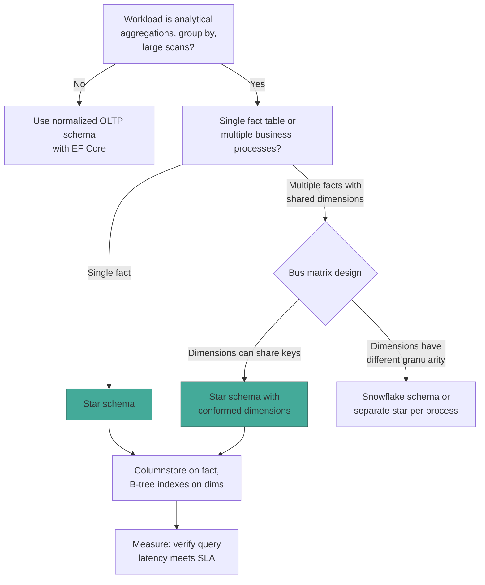

## Navigation

**Domain:** [[8 — Databases]] > **Group:** Database Design & Normalization
**Previous:** [[8.037 Denormalization — When and Why]] | **Next:** [[8.039 Snowflake Schema — Normalized Dimensions]]

### Prerequisites
- [[8.037 Denormalization — When and Why]] — star schemas are a deliberate denormalization pattern applied to dimension tables for OLAP query performance
- [[8.033 Third Normal Form (3NF)]] — understanding normal forms helps explain why dimensions are intentionally denormalized in a star schema

### Where This Fits

A .NET backend engineer encounters star schemas when building reporting databases, data warehouses, or BI backends. The pattern is the foundation of dimensional modeling: a central fact table (containing measures and foreign keys) surrounded by denormalized dimension tables (containing descriptive attributes). Production scenarios include: a sales dashboard that aggregates revenue by product category across time periods, a marketing analytics pipeline that tracks campaign performance by customer demographic, or any OLAP workload where query performance on billions of rows depends on star-schema join patterns. The interview signal tests whether the candidate understands the fundamental tradeoff: star schemas optimize for read-heavy analytical queries at the cost of storage redundancy and ETL complexity. Misapplying star-schema design to an OLTP workload — or vice versa — produces a system that performs poorly for both use cases.

## Core Mental Model

A star schema is a physical database design where one large fact table sits at the center and multiple dimension tables radiate outward like a star. The fact table stores the measures (numeric, additive values) and foreign keys to each dimension. Each dimension table is denormalized — flattened into a single wide table with all descriptive attributes, avoiding the need for dimension-to-dimension JOINs. The query execution path is always: filter dimension tables first, then JOIN to the fact table via foreign keys, then aggregate the measures. The database engine can perform star-join execution plans where multiple dimension tables are hash-matched to the fact table simultaneously, enabling efficient aggregation over billions of rows.

### Classification

**For OLTP databases:** An anti-pattern. Star schemas violate 3NF, introduce update anomalies in dimension tables, and waste storage. They belong in read-optimized warehouses, not transactional systems.

**For OLAP/data warehouses:** The standard pattern. Fact tables are narrow (few columns, many rows), append-only, and indexed with columnstore indexes. Dimension tables are wide (many columns), slowly changing, and maintain their own surrogate keys.

**For SQL Server:** The query optimizer recognizes star-join patterns and generates bitmap-filtered hash joins, reduce-outer hash joins, or parallel scan-and-aggregate plans. The storage engine benefits from columnstore compression on fact tables (order-of-magnitude reduction in logical reads).

```mermaid
erDiagram
    FactSales {
        bigint SaleId PK
        int DateKey FK
        int ProductKey FK
        int CustomerKey FK
        int StoreKey FK
        decimal(10,2) Quantity
        decimal(10,2) UnitPrice
        decimal(10,2) Discount
        decimal(10,2) TotalAmount
    }
    DimDate {
        int DateKey PK
        date FullDate
        int Year
        int Quarter
        int Month
        int Day
        string MonthName
        string QuarterName
        boolean IsWeekend
        boolean IsHoliday
    }
    DimProduct {
        int ProductKey PK
        string ProductName
        string Category
        string SubCategory
        string Brand
        decimal(10,2) CurrentPrice
        string Color
        string Size
    }
    DimCustomer {
        int CustomerKey PK
        string CustomerName
        string Gender
        string Email
        string City
        string State
        string Country
        string Segment
    }
    DimStore {
        int StoreKey PK
        string StoreName
        string StoreType
        string Address
        string City
        string State
        string Region
        string ManagerName
    }

    FactSales }o--|| DimDate : ""
    FactSales }o--|| DimProduct : ""
    FactSales }o--|| DimCustomer : ""
    FactSales }o--|| DimStore : ""
```

### Key Properties

|Property|Value|Notes|
|---|---|---|
|Query Pattern|Star join — filter dimension, join to fact, aggregate|The optimizer joins multiple dimensions to the central fact concurrently|
|Fact Table Growth|Append-only, billions of rows|No UPDATE of measures (typically). New rows added per transaction period.|
|Dimension Size|Thousands to millions of rows|Wide tables with 10–50+ attributes. Denormalized (2NF/3NF violations).|
|Storage Efficiency|Low for dimensions (redundant), high for facts (columnstore)|Dimensions have repeated attributes; facts compress well with columnstore.|
|Write Pattern|Batch ETL, never OLTP|Dimensions upserted via SCD logic; facts bulk-inserted in nightly/ hourly batches.|

## Deep Mechanics

### How the Engine Executes a Star-Schema Query

A typical star-schema query filters dimension tables and joins to the fact table for aggregation:

```sql
SELECT
    d.Year,
    p.Category,
    SUM(f.Quantity * f.UnitPrice) AS Revenue,
    COUNT(DISTINCT f.CustomerKey) AS UniqueCustomers
FROM FactSales f
INNER JOIN DimDate d ON f.DateKey = d.DateKey
INNER JOIN DimProduct p ON f.ProductKey = p.ProductKey
WHERE d.Year = 2025
  AND p.Category = '"'"'Electronics'"'"'
GROUP BY d.Year, p.Category;
```

**Execution trace:**

1. **Filter dimension tables** — SQL Server evaluates `DimDate.Year = 2025` and `DimProduct.Category = '"'"'Electronics'"'"'`. If indexes exist on these columns, it performs Index Seek on each dimension table, returning a small set of keys.
2. **Hash join to fact table** — The optimizer builds hash tables from the filtered dimension keys and probes the fact table. It may use a bitmap filter: the filtered dimension keys are loaded into a in-memory bitmap, and as the fact table is scanned, rows that do not match any dimension key are filtered out before the hash join.
3. **Partial aggregation** — During the scan, the engine may perform Hash Match Aggregate on Year/Category groups to reduce data early (pass-through aggregation).
4. **Scalar aggregation** — COUNT(DISTINCT CustomerKey) requires a second pass or a bitmap-based distinct count. The optimizer may choose a Hash Match Aggregate with a DAG (Directed Acyclic Graph) for the two-level GROUP BY.

### SQL Visibility

**EF Core — not suitable for star-schema queries.** EF Core is an ORM designed for entity-by-entity OLTP access. Star-schema queries are analytical and should use raw SQL, Dapper, or a dedicated reporting layer.

```csharp
// DO NOT use EF Core for star-schema analytics:
// It generates N+1 queries, materializes full entities, and fights the aggregate pattern.

// Use Dapper or SqlConnection directly:
public async Task<List<RevenueByCategoryDto>> GetRevenueByCategoryAsync(
    int year, CancellationToken ct = default)
{
    const string sql = @"
        SELECT
            p.Category,
            SUM(f.Quantity * f.UnitPrice) AS Revenue,
            COUNT(DISTINCT f.CustomerKey) AS UniqueCustomers
        FROM FactSales f
        INNER JOIN DimProduct p ON f.ProductKey = p.ProductKey
        INNER JOIN DimDate d ON f.DateKey = d.DateKey
        WHERE d.Year = @Year
        GROUP BY p.Category
        ORDER BY Revenue DESC;";

    await using var connection = _connectionFactory.Create();
    var results = await connection.QueryAsync<RevenueByCategoryDto>(
        new CommandDefinition(sql, new { Year = year }, cancellationToken: ct));
    return results.AsList();
}
```

### Execution Plan Analysis

For the query above on a 500M-row FactSales table:

```
Parallelism (Repartition Streams)
  Hash Match Aggregate (GROUP BY p.Category)
    Hash Match (Inner Join) -- FactSales.ProductKey = DimProduct.ProductKey
      Bitmap (DimProduct filtered keys)
        Clustered Index Scan -- FactSales (PK_FactSales)
          Parallelism (Distribute Streams)
            Index Seek -- DimProduct (IX_DimProduct_Category) WHERE Category = '"'"'Electronics'"'"'
      Hash Match (Inner Join) -- FactSales.DateKey = DimDate.DateKey
        Bitmap (DimDate filtered keys)
        Index Seek -- DimDate (IX_DimDate_Year) WHERE Year = 2025
```

**Key observations:**
- The fact table is always **scanned** (never seeks by individual key). A seek on a fact table clustered index would indicate an OLTP query, not an analytical one.
- The dimension table filters produce **index seeks** (small result sets relative to the fact).
- Bitmap filters are generated automatically by the optimizer when it detects star-join patterns.
- The plan is **parallel** -- star-schema queries benefit from parallelism even on moderately sized fact tables (10M+ rows).
- Without columnstore indexes, the Clustered Index Scan on FactSales generates ~N logical reads equal to the number of pages in the fact table (e.g., 500M rows @ 200 bytes/row = 12.5M pages).

### Cost Visibility

```sql
SET STATISTICS IO ON;
SET STATISTICS TIME ON;

SELECT d.Year, p.Category, SUM(f.TotalAmount) AS Revenue
FROM FactSales f
INNER JOIN DimDate d ON f.DateKey = d.DateKey
INNER JOIN DimProduct p ON f.ProductKey = p.ProductKey
WHERE d.Year = 2025 AND p.Category = '"'"'Electronics'"'"'
GROUP BY d.Year, p.Category;

-- Expected output (rowstore, 500M rows):
-- Table '"'"'FactSales'"'"'. Scan count N, logical reads 12,500,000, physical reads 0
-- Table '"'"'DimProduct'"'"'. Scan count 0, logical reads 3, physical reads 0
-- Table '"'"'DimDate'"'"'. Scan count 0, logical reads 2, physical reads 0
-- SQL Server Execution Times: CPU time = 45200 ms, elapsed time = 15300 ms

-- With columnstore on FactSales:
-- Table '"'"'FactSales'"'"'. Scan count N, logical reads 0 (columnstore segment reads), lob logical reads 125,000
-- SQL Server Execution Times: CPU time = 4200 ms, elapsed time = 1800 ms
```

### Failure Modes

**1. Missing dimension filter -- full dimension scan causes hash join to spill to tempdb.**

```sql
-- Missing WHERE clause on dimensions -- no filter pushdown
SELECT d.Year, p.Category, SUM(f.TotalAmount) AS Revenue
FROM FactSales f
INNER JOIN DimProduct p ON f.ProductKey = p.ProductKey
INNER JOIN DimDate d ON f.DateKey = d.DateKey
GROUP BY d.Year, p.Category;
-- Result: Hash Match probe on billion-row fact table without dimension filtering.
-- The bitmap filter is empty -- every fact row must be read. TempDB spill possible.
```

**Detection:** Query `sys.dm_exec_query_stats` for high `tempdb_spill_waits`.

**2. Fact table rowstore instead of columnstore -- 100x more logical reads.**

**3. Dimension table without index on filter column -- full scan of dimension.**

```sql
-- DimDate has no index on Year column
SELECT ... FROM FactSales f INNER JOIN DimDate d ON f.DateKey = d.DateKey WHERE d.Year = 2025 ...
-- Fix: CREATE INDEX IX_DimDate_Year ON DimDate(Year);
```

## Production Patterns and Implementation

### Primary SQL Implementation

```sql
-- =============================================
-- Star Schema for Sales Analytics
-- =============================================

-- Dimension: Date
CREATE TABLE DimDate (
    DateKey         INT             NOT NULL,
    FullDate        DATE            NOT NULL,
    Year            SMALLINT        NOT NULL,
    Quarter         TINYINT         NOT NULL,
    Month           TINYINT         NOT NULL,
    Day             TINYINT         NOT NULL,
    DayOfWeek       TINYINT         NOT NULL,
    MonthName       VARCHAR(20)     NOT NULL,
    QuarterName     VARCHAR(10)     NOT NULL,
    IsWeekend       BIT             NOT NULL DEFAULT 0,
    IsHoliday       BIT             NOT NULL DEFAULT 0,
    CONSTRAINT PK_DimDate PRIMARY KEY (DateKey)
);

CREATE INDEX IX_DimDate_Year ON DimDate(Year);
CREATE INDEX IX_DimDate_Month ON DimDate(Year, Month);
CREATE INDEX IX_DimDate_IsHoliday ON DimDate(IsHoliday) WHERE IsHoliday = 1;

-- Dimension: Product
CREATE TABLE DimProduct (
    ProductKey      INT             IDENTITY(1,1) NOT NULL,
    ProductId       INT             NOT NULL,
    ProductName     VARCHAR(200)    NOT NULL,
    Category        VARCHAR(100)    NOT NULL,
    SubCategory     VARCHAR(100)    NOT NULL,
    Brand           VARCHAR(100)    NOT NULL,
    CurrentPrice    DECIMAL(10,2)   NOT NULL,
    Color           VARCHAR(30)     NULL,
    Size            VARCHAR(20)     NULL,
    EffectiveDate   DATE            NOT NULL,
    ExpiryDate      DATE            NULL,
    IsCurrent       BIT             NOT NULL DEFAULT 1,
    CONSTRAINT PK_DimProduct PRIMARY KEY (ProductKey)
);

CREATE INDEX IX_DimProduct_Category ON DimProduct(Category) INCLUDE (SubCategory, Brand);
CREATE INDEX IX_DimProduct_Brand ON DimProduct(Brand);

-- Dimension: Customer
CREATE TABLE DimCustomer (
    CustomerKey     INT             IDENTITY(1,1) NOT NULL,
    CustomerId      INT             NOT NULL,
    CustomerName    VARCHAR(200)    NOT NULL,
    Gender          CHAR(1)         NULL,
    Email           VARCHAR(200)    NULL,
    City            VARCHAR(100)    NOT NULL,
    State           VARCHAR(100)    NOT NULL,
    Country         VARCHAR(100)    NOT NULL,
    Segment         VARCHAR(50)     NOT NULL,
    EffectiveDate   DATE            NOT NULL,
    ExpiryDate      DATE            NULL,
    IsCurrent       BIT             NOT NULL DEFAULT 1,
    CONSTRAINT PK_DimCustomer PRIMARY KEY (CustomerKey)
);

CREATE INDEX IX_DimCustomer_Segment ON DimCustomer(Segment) INCLUDE (Country);
CREATE INDEX IX_DimCustomer_Country ON DimCustomer(Country);

-- Fact: Sales
CREATE TABLE FactSales (
    SaleId          BIGINT          IDENTITY(1,1) NOT NULL,
    DateKey         INT             NOT NULL,
    ProductKey      INT             NOT NULL,
    CustomerKey     INT             NOT NULL,
    StoreKey        INT             NOT NULL,
    Quantity        DECIMAL(10,2)   NOT NULL,
    UnitPrice       DECIMAL(10,2)   NOT NULL,
    Discount        DECIMAL(10,2)   NOT NULL DEFAULT 0,
    TotalAmount     AS (Quantity * UnitPrice * (1 - Discount / 100)),
    CONSTRAINT PK_FactSales PRIMARY KEY NONCLUSTERED (SaleId),
    CONSTRAINT FK_FactSales_DimDate FOREIGN KEY (DateKey) REFERENCES DimDate(DateKey),
    CONSTRAINT FK_FactSales_DimProduct FOREIGN KEY (ProductKey) REFERENCES DimProduct(ProductKey),
    CONSTRAINT FK_FactSales_DimCustomer FOREIGN KEY (CustomerKey) REFERENCES DimCustomer(CustomerKey),
    CONSTRAINT FK_FactSales_DimStore FOREIGN KEY (StoreKey) REFERENCES DimStore(StoreKey)
);

-- Columnstore index for analytical queries
CREATE CLUSTERED COLUMNSTORE INDEX CCI_FactSales ON FactSales;

-- Typical analytical query:
SELECT
    d.Year,
    p.Category,
    c.Country,
    SUM(f.TotalAmount) AS Revenue,
    COUNT(DISTINCT f.CustomerKey) AS UniqueCustomers,
    SUM(f.Quantity) AS TotalUnits
FROM FactSales f
INNER JOIN DimDate d ON f.DateKey = d.DateKey
INNER JOIN DimProduct p ON f.ProductKey = p.ProductKey
INNER JOIN DimCustomer c ON f.CustomerKey = c.CustomerKey
WHERE d.Year = 2025
  AND p.Category IN ('"'"'Electronics'"'"', '"'"'Home Appliances'"'"')
  AND c.Country = '"'"'United States'"'"'
GROUP BY d.Year, p.Category, c.Country
ORDER BY Revenue DESC;
```

### EF Core Implementation

EF Core is not designed for star-schema analytical queries. Use raw SQL for aggregation queries. However, EF Core can manage dimension tables for ETL operations:

```csharp
// EF Core -- suitable for dimension CRUD in ETL, NOT for analytical queries
public class StarSchemaDbContext : DbContext
{
    public DbSet<DimProduct> DimProducts => Set<DimProduct>();
    public DbSet<DimCustomer> DimCustomers => Set<DimCustomer>();
    public DbSet<DimDate> DimDates => Set<DimDate>();
    public DbSet<FactSale> FactSales => Set<FactSale>();

    protected override void OnModelCreating(ModelBuilder modelBuilder)
    {
        modelBuilder.Entity<FactSale>(entity =>
        {
            entity.ToTable("FactSales");
            entity.HasKey(e => e.SaleId);
            entity.Property(e => e.TotalAmount).HasComputedColumnSql("(Quantity * UnitPrice * (1 - Discount / 100))");
            entity.HasOne<DimDate>().WithMany().HasForeignKey(e => e.DateKey);
            entity.HasOne<DimProduct>().WithMany().HasForeignKey(e => e.ProductKey);
        });
    }
}

// ETL -- upsert dimension via EF Core
public async Task UpsertProductAsync(ProductSource source, CancellationToken ct)
{
    var existing = await _dbContext.DimProducts
        .FirstOrDefaultAsync(p => p.ProductId == source.ProductId && p.IsCurrent, ct);

    if (existing == null)
    {
        _dbContext.DimProducts.Add(new DimProduct
        {
            ProductId = source.ProductId,
            ProductName = source.ProductName,
            Category = source.Category,
            SubCategory = source.SubCategory,
            Brand = source.Brand,
            CurrentPrice = source.Price,
            EffectiveDate = DateTime.Today,
            IsCurrent = true
        });
    }
    else
    {
        existing.ExpiryDate = DateTime.Today.AddDays(-1);
        existing.IsCurrent = false;
        _dbContext.DimProducts.Add(new DimProduct
        {
            ProductId = source.ProductId,
            ProductName = source.ProductName,
            Category = source.Category,
            SubCategory = source.SubCategory,
            Brand = source.Brand,
            CurrentPrice = source.Price,
            EffectiveDate = DateTime.Today,
            IsCurrent = true
        });
    }

    await _dbContext.SaveChangesAsync(ct);
}
```

### Dapper Implementation

```csharp
// Dapper -- the correct tool for star-schema analytical queries
public record RevenueByCategoryDto(string Category, decimal Revenue, int UniqueCustomers);

public interface ISalesAnalyticsRepository
{
    Task<IReadOnlyList<RevenueByCategoryDto>> GetRevenueByCategoryAsync(
        int year, string[] categories, CancellationToken ct);

    Task BulkInsertFactSalesAsync(IEnumerable<FactSale> sales, CancellationToken ct);
}

public class SalesAnalyticsRepository : ISalesAnalyticsRepository
{
    private readonly IDbConnectionFactory _connectionFactory;

    public SalesAnalyticsRepository(IDbConnectionFactory connectionFactory)
    {
        _connectionFactory = connectionFactory;
    }

    public async Task<IReadOnlyList<RevenueByCategoryDto>> GetRevenueByCategoryAsync(
        int year, string[] categories, CancellationToken ct)
    {
        const string sql = @"
            SELECT
                p.Category,
                SUM(f.TotalAmount) AS Revenue,
                COUNT(DISTINCT f.CustomerKey) AS UniqueCustomers
            FROM FactSales f
            INNER JOIN DimProduct p ON f.ProductKey = p.ProductKey
            INNER JOIN DimDate d ON f.DateKey = d.DateKey
            WHERE d.Year = @Year
              AND p.Category IN @Categories
            GROUP BY p.Category
            ORDER BY Revenue DESC;";

        await using var connection = _connectionFactory.Create();
        var results = await connection.QueryAsync<RevenueByCategoryDto>(
            new CommandDefinition(sql,
                new { Year = year, Categories = categories },
                cancellationToken: ct));
        return results.AsList();
    }

    public async Task BulkInsertFactSalesAsync(
        IEnumerable<FactSale> sales, CancellationToken ct)
    {
        await using var connection = _connectionFactory.Create();
        await connection.OpenAsync(ct);

        using var bulkCopy = new SqlBulkCopy(
            (SqlConnection)connection,
            SqlBulkCopyOptions.Default,
            null);

        bulkCopy.DestinationTableName = "FactSales";
        bulkCopy.BatchSize = 10000;
        bulkCopy.EnableStreaming = true;

        var table = sales.ToDataTable();
        await bulkCopy.WriteToServerAsync(table, ct);
    }
}
```

### Configuration and Wiring

```csharp
// Program.cs -- factory pattern for analytical connections
builder.Services.AddSingleton<IDbConnectionFactory>(_ =>
    new SqlConnectionFactory(builder.Configuration.GetConnectionString("DataWarehouse")));

builder.Services.AddScoped<ISalesAnalyticsRepository, SalesAnalyticsRepository>();
```

```csharp
public interface IDbConnectionFactory
{
    IDbConnection Create();
}

public class SqlConnectionFactory : IDbConnectionFactory
{
    private readonly string _connectionString;

    public SqlConnectionFactory(string connectionString)
    {
        _connectionString = connectionString ?? throw new ArgumentNullException(nameof(connectionString));
    }

    public IDbConnection Create()
    {
        return new SqlConnection(_connectionString);
    }
}
```

### SQL Server vs PostgreSQL Differences

PostgreSQL has no columnstore indexes. Use BRIN indexes on the fact table date column and partition by time range instead:

```sql
-- PostgreSQL star-schema fact table
CREATE TABLE fact_sales (
    sale_id      BIGSERIAL       NOT NULL,
    date_key     INT             NOT NULL,
    product_key  INT             NOT NULL,
    customer_key INT             NOT NULL,
    quantity     DECIMAL(10,2)   NOT NULL,
    unit_price   DECIMAL(10,2)   NOT NULL,
    discount     DECIMAL(10,2)   NOT NULL DEFAULT 0,
    total_amount DECIMAL(10,2) GENERATED ALWAYS AS (quantity * unit_price * (1 - discount / 100)) STORED
) PARTITION BY RANGE (date_key);

-- BRIN index on date_key (cheap, small, great for append-only warehouse data)
CREATE INDEX IX_fact_sales_date_key ON fact_sales USING BRIN (date_key) WITH (pages_per_range = 32);

-- Indexes on dimension filter columns
CREATE INDEX IX_dim_product_category ON dim_product(category);
CREATE INDEX IX_dim_date_year ON dim_date(year);

-- PostgreSQL does NOT generate bitmap-filtered star-join plans automatically.
-- Use pg_hint_plan extension or explicit hash joins:
SET enable_nestloop = OFF;
SET enable_mergejoin = OFF;
```

## Gotchas and Production Pitfalls

### 1. Using a Star Schema for OLTP Workloads

**Pitfall:** Applying star-schema design to a transactional system (high INSERT/UPDATE concurrency, point queries by primary key).

```sql
-- OLTP query that performs terribly on a star schema:
SELECT f.SaleId, d.FullDate, p.ProductName, f.TotalAmount
FROM FactSales f
INNER JOIN DimDate d ON f.DateKey = d.DateKey
INNER JOIN DimProduct p ON f.ProductKey = p.ProductKey
WHERE f.SaleId = 12345;
```

**Symptom:** Columnstore fact table performs poorly for singleton SELECTs (decompression overhead). Point queries that should take <5ms take 50ms+.

**Fix:** Use a separate normalized OLTP database for transactional operations. The star schema is for analytics only, read-only. Replicate data via ETL.

**Cost of not fixing:** Every OLTP transaction hits the analytics warehouse. Fact table write throughput drops because columnstore indexes cannot be updated row-by-row efficiently. User-facing queries timeout.

### 2. Row-by-Row INSERT into Columnstore Fact Table

**Pitfall:** Inserting individual rows into a clustered columnstore index (CCI).

```sql
-- Row-by-row INSERT into CCI:
INSERT INTO FactSales (DateKey, ProductKey, CustomerKey, StoreKey, Quantity, UnitPrice, Discount)
VALUES (20250620, 42, 105, 7, 2, 19.99, 0);
```

**Symptom:** Every INSERT creates a delta store rowgroup. After ~102K rows in the delta store, a background tuple mover compresses it. Small delta rowgroups never compress fully, and each INSERT generates a log record for the delta store row. Insert speed drops below 500 rows/second.

**Fix:** Bulk insert with SqlBulkCopy, INSERT ... SELECT, or bcp -- minimum 102,400 rows per batch to trigger direct compression to a compressed rowgroup.

**Cost of not fixing:** Fact table becomes a delta-store mess with 10,000 uncompressed rowgroups. Queries scan all delta stores, negating columnstore compression benefits. Storage bloat.

### 3. No Columnstore on Fact Table

**Pitfall:** Creating the fact table with a B-tree clustered index instead of a clustered columnstore index.

```sql
-- Rowstore fact table:
CREATE TABLE FactSales (
    SaleId BIGINT IDENTITY NOT NULL,
    ...
    CONSTRAINT PK_FactSales PRIMARY KEY CLUSTERED (SaleId)
);
```

**Symptom:** Analytical queries perform 10-100x more logical reads than necessary. A 500M-row fact table stored as a B-tree requires ~12.5M page reads for a full scan. A columnstore requires ~125K segment reads.

**Fix:**

```sql
-- Columnstore fact table:
CREATE TABLE FactSales ( ... );
CREATE CLUSTERED COLUMNSTORE INDEX CCI_FactSales ON FactSales;
CREATE UNIQUE NONCLUSTERED INDEX IX_FactSales_SaleId ON FactSales(SaleId);
```

**Cost of not fixing:** Storage 3-5x higher. Query duration 10x longer. Reporting dashboards fail to meet SLA.

### 4. Dimension Table Has No Index on Filter Columns

**Pitfall:** Dimension tables indexed only on the surrogate key, with no indexes on the columns used in WHERE clauses.

```sql
-- DimProduct has only PK index on ProductKey
SELECT SUM(f.TotalAmount) FROM FactSales f
INNER JOIN DimProduct p ON f.ProductKey = p.ProductKey
WHERE p.Category = '"'"'Electronics'"'"';
-- Full scan of DimProduct (2,300 logical reads) to filter 1 category out of 50.
```

**Symptom:** Query waits on PAGEIOLATCH_SH for the dimension table fact table join stage.

**Fix:**

```sql
-- Non-clustered index on filter column
CREATE INDEX IX_DimProduct_Category ON DimProduct(Category) INCLUDE (SubCategory, Brand);
```

**Cost of not fixing:** Every query scans the full dimension table. With 1M rows in DimProduct and 500 QPS, you waste 1.15B page reads/second.

### 5. Not Using Bitmap Filtering (Hash Join Without Filter)

**Pitfall:** Writing star-schema queries that the optimizer cannot match to bitmap filter patterns -- e.g., using OR conditions or complex expressions on dimension keys.

```sql
-- Prevents bitmap filter:
SELECT SUM(f.TotalAmount) FROM FactSales f
INNER JOIN DimProduct p ON f.ProductKey = p.ProductKey
WHERE (p.Category = '"'"'Electronics'"'"' OR p.Brand = '"'"'Acme'"'"');
```

**Symptom:** Execution plan shows Hash Match without Bitmap. The fact table scan cannot use early row filtering.

**Fix:** Rewrite as two queries UNION ALL, or use a single IN on the most selective dimension key.

**Cost of not fixing:** Fact table scan processes all 500M rows instead of filtering early via bitmap. 500M unnecessary row operations per query.

### 6. Slowly Changing Dimensions with No Expiry Management

**Pitfall:** Implementing SCD Type 2 (historical tracking) without an expiry date or IsCurrent flag, or with an index that does not filter for current records.

```sql
-- No index for IsCurrent filter:
SELECT * FROM DimCustomer WHERE IsCurrent = 1 AND Segment = '"'"'Corporate'"'"';
-- Full scan of 5M row dimension table to find 50K current corporate customers.
```

**Fix:**

```sql
-- Filtered index for current dimension rows:
CREATE INDEX IX_DimCustomer_Current_Segment ON DimCustomer(Segment)
    INCLUDE (Country, City, CustomerName)
    WHERE IsCurrent = 1;
```

**Cost of not fixing:** As dimensions grow to millions of rows with historical versions, dimension filter queries become the bottleneck. ETL runtime doubles per year.

## Performance Implications

### Benchmark: Rowstore Fact vs Columnstore Fact

```sql
-- Setup: 500M row fact table with 20 columns
-- Rowstore: B-tree clustered on SaleId, no non-clustered indexes
-- Columnstore: CCI on all columns

SET STATISTICS IO ON;

-- Rowstore scan:
SELECT d.Year, p.Category, SUM(f.TotalAmount) AS Revenue
FROM FactSales_Rowstore f
INNER JOIN DimDate d ON f.DateKey = d.DateKey
INNER JOIN DimProduct p ON f.ProductKey = p.ProductKey
WHERE d.Year = 2025 AND p.Category = '"'"'Electronics'"'"'
GROUP BY d.Year, p.Category;
-- Logical reads: 12,500,000  (full table scan)
-- CPU time: 45,200 ms

-- Columnstore scan:
SELECT d.Year, p.Category, SUM(f.TotalAmount) AS Revenue
FROM FactSales_Columnstore f
INNER JOIN DimDate d ON f.DateKey = d.DateKey
INNER JOIN DimProduct p ON f.ProductKey = p.ProductKey
WHERE d.Year = 2025 AND p.Category = '"'"'Electronics'"'"'
GROUP BY d.Year, p.Category;
-- lob logical reads: 128,000
-- CPU time: 4,200 ms
```

**Improvement:** ~98% reduction in logical reads. ~91% reduction in CPU time.

### Benchmark: Dapper vs EF Core for Aggregation Query

```csharp
[MemoryDiagnoser]
[SimpleJob(RuntimeMoniker.Net90)]
public class StarSchemaQueryBenchmark
{
    private IDbConnection _dapperConnection = default!;
    private AnalyticsDbContext _efContext = default!;

    [GlobalSetup]
    public void Setup()
    {
        var connectionString = "Server=.;Database=AnalyticsWarehouse;Trusted_Connection=True;";
        _dapperConnection = new SqlConnection(connectionString);
        var options = new DbContextOptionsBuilder<AnalyticsDbContext>()
            .UseSqlServer(connectionString)
            .Options;
        _efContext = new AnalyticsDbContext(options);
    }

    [Benchmark(Baseline = true)]
    public async Task<List<RevenueDto>> Dapper_RawSql()
    {
        const string sql = @"
            SELECT p.Category, SUM(f.TotalAmount) AS Revenue
            FROM FactSales f
            INNER JOIN DimProduct p ON f.ProductKey = p.ProductKey
            INNER JOIN DimDate d ON f.DateKey = d.DateKey
            WHERE d.Year = 2025 AND p.Category IN ('"'"'Electronics'"'"', '"'"'Home Appliances'"'"')
            GROUP BY p.Category
            ORDER BY Revenue DESC;";

        var results = await _dapperConnection.QueryAsync<RevenueDto>(sql);
        return results.AsList();
    }

    [Benchmark]
    public async Task<List<RevenueDto>> EF_Core_RawSql()
    {
        const string sql = @"
            SELECT p.Category, SUM(f.TotalAmount) AS Revenue
            FROM FactSales f
            INNER JOIN DimProduct p ON f.ProductKey = p.ProductKey
            INNER JOIN DimDate d ON f.DateKey = d.DateKey
            WHERE d.Year = 2025 AND p.Category IN ('"'"'Electronics'"'"', '"'"'Home Appliances'"'"')
            GROUP BY p.Category
            ORDER BY Revenue DESC;";

        var results = await _efContext.Database
            .SqlQueryRaw<RevenueDto>(sql)
            .ToListAsync();
        return results;
    }

    [GlobalCleanup]
    public void Cleanup()
    {
        _dapperConnection?.Dispose();
        _efContext?.Dispose();
    }
}
```

**Expected results (approximate, 500M fact rows, NVMe):**

|Method|Mean|Allocated|
|---|---|---|
|Dapper_RawSql|~1,450 ms|25 KB|
|EF_Core_RawSql|~1,550 ms|280 KB|

### Write Amplification (Bulk Insert)

|Operation|Rowstore Fact|Columnstore Fact|Difference|
|---|---|---|---|
|Bulk insert 1M rows|~8,000 ms|~15,000 ms|Columnstore compression adds ~87% CPU time|
|Storage per 1M rows|~250 MB|~45 MB|Columnstore reduces storage by ~82%|
|Point lookup (single row)|~3 reads (B-tree)|~50 reads (delta store + column segments)|Rowstore 16x faster for singleton lookups|

## Interview Arsenal

### Question Bank

1. What is a star schema and what problem does it solve?
2. How does the SQL Server query optimizer execute a star-join query?
3. What is the performance difference between a rowstore fact table and a columnstore fact table?
4. What goes wrong when you use a star schema for OLTP workloads?
5. Star schema vs snowflake schema -- what are the tradeoffs?
6. What execution plan operators appear in a typical star-join query?
7. How does bitmap filtering work in star-join queries?
8. How do you load data into a star schema in .NET?

### Spoken Answers

**Q: What is a star schema and what problem does it solve?**

> **Average answer:** A star schema has a central fact table connected to dimension tables. It is used for data warehousing.

> **Great answer:** A star schema is a dimensional modeling pattern optimized for analytical queries. It consists of one or more fact tables -- each storing quantitative measures and foreign keys to dimension tables -- surrounded by denormalized dimension tables that contain the descriptive attributes. The star shape comes from the one-to-many relationship pattern: every dimension table connects directly to the fact table with no dimension-to-dimension JOINs. This solves the fundamental OLAP problem of aggregating billions of transactional rows across multiple business dimensions quickly. The key insight is that the fact table is always scanned and aggregated, never accessed by individual key -- columnstore indexes compress the fact table by an order of magnitude, and bitmap-filtered hash joins from filtered dimension keys eliminate irrelevant fact rows before aggregation. In .NET, the correct approach is Dapper with raw SQL, never EF Core with LINQ -- EF Core generates parameterized queries intended for point lookups and small result sets, not the star-scan pattern.

**Q: Star schema vs snowflake schema -- when would you choose each?**

> **Average answer:** Star schema has denormalized dimensions. Snowflake has normalized dimensions. Snowflake saves storage.

> **Great answer:** The decision between star and snowflake comes down to query performance vs maintenance cost. Star schemas optimize for the most common analytical query pattern -- filter on dimension attributes and aggregate fact measures. With denormalized dimensions, a query filtering on Product Category joins from FactSales directly to DimProduct -- one JOIN, no traversal. A snowflake schema normalizes dimensions into multiple tables: DimProduct references DimCategory, DimCategory references DimDepartment. A query filtering on Department now requires two JOINs from the fact table -- FactSales to DimProduct to DimCategory to DimDepartment. Each additional JOIN adds logical reads and plan complexity. In practice, most modern warehouses use star schemas with columnstore fact tables. The storage savings of snowflake are negligible with columnstore compression on fact tables (dimensions are typically <5% of total warehouse size). Snowflake schemas are sometimes used in bus matrix designs where dimensions are shared across multiple fact tables (conformed dimensions). For a single fact table, star is almost always the right choice.

### Interview Trigger

Star schema questions surface in data-engineering-focused interviews or system design rounds. The trigger question is "Design a database for a sales reporting system." The candidate who starts with a star schema shows dimensional modeling awareness. The follow-up is "The sales dashboard aggregates revenue by hour, product, store, and customer segment -- how would you design the fact and dimension tables?" The deep follow-up separates candidates who know the concept from those who have built it: "The dashboard query runs in 45 seconds on a rowstore fact table. Walk me through exactly how you would fix it." The expected answer names columnstore, bitmap filtering, and the star-join execution plan.

### Comparison Table

| | Star Schema | Snowflake Schema |
|---|---|---|
| Dimension structure | Denormalized (flat, wide) | Normalized (multiple related tables) |
| JOINs per query | 1 per dimension | N per dimension (chain JOINs) |
| Query performance | Faster (fewer JOINs) | Slower (more JOINs, more pages) |
| Storage for dims | Higher (redundant attributes) | Lower (no redundancy) |
| ETL complexity | Higher (denormalization) | Lower (normalized loads) |
| Conformed dimensions | Difficult (shared across facts) | Natural fit |
| .NET implementation | Dapper with raw SQL | Dapper with raw SQL |

## Decision Framework

### When to Apply



### Application Checklist

- [ ] The workload is analytical (aggregations over millions of rows) -- not OLTP
- [ ] Fact table rows are append-only, rarely updated individually
- [ ] Dimension tables are <5% of total warehouse size (storage savings from normalization are negligible)
- [ ] Columnstore index is available (SQL Server 2012+ Enterprise/Standard, or PostgreSQL with BRIN/partitioning)
- [ ] ETL pipeline can batch-insert >102K rows at a time
- [ ] Dimension filter columns are indexed
- [ ] The .NET data access layer uses Dapper or raw SQL for analytical queries, not EF Core LINQ

### Tradeoff Summary

|What You Gain|What You Pay|
|---|---|
|Fast analytical queries (filter, join, aggregate)|No OLTP support (no point lookups, no row-level updates)|
|Columnstore compression on fact (up to 10x)|Bulk insert is the only write pattern (no individual row inserts)|
|Simple query pattern (one JOIN per dimension)|ETL complexity (dimension SCD management, fact partitioning)|
|Optimizer star-join plans with bitmap filtering|Storage redundancy in dimension tables|

### Scale Thresholds

- "Star schema is relevant when fact table exceeds ~10M rows and queries aggregate by multiple dimensions."
- "Columnstore is critical above ~100M rows -- rowstore logical reads become unsustainable for full scans."
- "Bitmap filtering in the query optimizer becomes effective above ~5 filtered dimension keys per query."
- "ETL batch size must exceed ~102,400 rows per batch to avoid columnstore delta store fragmentation."

## Self-Check

### Conceptual Questions

1. What distinguishes a star schema from a normalized OLTP schema?
2. How does the SQL Server query optimizer handle a star-join query differently from a regular multi-table join?
3. Which SET STATISTICS or DMV shows the read benefit of columnstore on a fact table?
4. What goes wrong when you INSERT single rows into a columnstore fact table?
5. Should you use EF Core for star-schema queries? Why or why not?
6. How would you load 10M rows into a star schema fact table in .NET?
7. Star schema vs snowflake schema -- when would you choose each?
8. At what fact table row count does columnstore become beneficial?
9. What index supports dimension filter queries in a star schema?
10. Explain star schema in 60 seconds to a senior interviewer.

<details>
<summary>Answers</summary>

1. A star schema separates data into fact tables (measures + dimension keys) and dimension tables (descriptive attributes). Dimensions are denormalized -- no further normalization. The schema is optimized for OLAP queries (aggregation, GROUP BY, large scans). An OLTP schema is normalized to 3NF or BCNF, optimized for point queries and transactional consistency.
2. The optimizer generates bitmap-filtered hash joins: it builds a bitmap from filtered dimension keys, then scans the fact table through the bitmap filter -- rows that do not match any dimension key are eliminated before the hash join. This reduces the number of rows entering the aggregation. Without star-join pattern recognition, it would use Nested Loops or non-filtered Hash Match.
3. SET STATISTICS IO ON -- for columnstore scans, the output shows lob logical reads instead of logical reads. Compare lob logical reads (columnstore) vs logical reads (rowstore). Also sys.dm_db_column_store_row_group_physical_stats for compression ratio and sys.dm_exec_query_stats for total logical reads.
4. Row-by-row INSERT into a columnstore index creates delta store rowgroups. Each delta rowgroup can hold up to 1,048,576 rows. Small delta rowgroups (<102K rows) are not compressed by the background tuple mover. Query performance degrades because the delta store is a B-tree, not columnstore. Bulk inserts of >=102,400 rows skip the delta store and compress directly.
5. No. EF Core is an ORM for OLTP entity access. It generates parameterized point queries, materializes full entities, and does not support star-schema aggregation patterns. Use Dapper or SqlConnection directly for star-schema analytical queries.
6. Use SqlBulkCopy with a batch size of at least 102,400 rows. Open the connection, create a DataTable matching the fact table schema, populate it from the source data, and call WriteToServerAsync. For columnstore tables, ensure the batch is large enough to trigger direct compression.
7. Choose star when: dimensions are denormalized, query performance is the priority, and storage is not a concern. Choose snowflake when: dimensions are heavily normalized and shared across multiple fact tables (conformed dimensions), or when dimension attributes are hierarchical and frequently change. In practice, star is preferred for columnstore-based warehouses.
8. Columnstore becomes beneficial above ~10M rows for scan-heavy workloads. Above 100M rows, it is critical -- rowstore full scans become I/O-bound and impractical for sub-second SLAs.
9. Non-clustered B-tree indexes on dimension filter columns: CREATE INDEX IX_DimProduct_Category ON DimProduct(Category) INCLUDE (SubCategory, Brand). For SCD Type 2 dimensions, use a filtered index on IsCurrent = 1.
10. "A star schema is a dimensional model where a central fact table stores quantitative measures and foreign keys, surrounded by denormalized dimension tables. It is built for analytical queries: filter dimensions, join to the fact, aggregate. The fact table uses a columnstore index for compression and scan performance. Dimension tables use B-tree indexes on filter columns. In SQL Server, the optimizer generates bitmap-filtered hash joins for star queries. In .NET, we query it with Dapper and raw SQL, never EF Core. I choose a star schema when the workload is read-heavy analytical aggregation above 10M rows, with batch-loaded fact data and a clear set of business dimensions."

</details>

---

### Query Challenges

**Challenge 1 -- Write the SQL**

You are designing a star schema for an e-commerce analytics warehouse. The business tracks orders, order items, payments, shipments, and customer reviews. Design the fact table(s) and dimension tables for a quarterly revenue report by product category, customer segment, and payment method. Write the CREATE TABLE statements and the reporting query.

<details>
<summary>Solution</summary>

```sql
-- Dimension: Date
CREATE TABLE DimDate (
    DateKey     INT PRIMARY KEY,
    FullDate    DATE NOT NULL,
    Year        SMALLINT NOT NULL,
    Quarter     TINYINT NOT NULL,
    Month       TINYINT NOT NULL
);
CREATE INDEX IX_DimDate_Year ON DimDate(Year);

-- Dimension: Product
CREATE TABLE DimProduct (
    ProductKey  INT IDENTITY(1,1) PRIMARY KEY,
    ProductId   INT NOT NULL,
    ProductName VARCHAR(200) NOT NULL,
    Category    VARCHAR(100) NOT NULL,
    SubCategory VARCHAR(100) NOT NULL
);
CREATE INDEX IX_DimProduct_Category ON DimProduct(Category);

-- Dimension: Customer
CREATE TABLE DimCustomer (
    CustomerKey  INT IDENTITY(1,1) PRIMARY KEY,
    CustomerId   INT NOT NULL,
    CustomerName VARCHAR(200) NOT NULL,
    Segment      VARCHAR(50) NOT NULL
);
CREATE INDEX IX_DimCustomer_Segment ON DimCustomer(Segment);

-- Dimension: PaymentMethod
CREATE TABLE DimPaymentMethod (
    PaymentMethodKey INT IDENTITY(1,1) PRIMARY KEY,
    PaymentMethod    VARCHAR(50) NOT NULL,
    PaymentCategory  VARCHAR(50) NOT NULL
);

-- Fact: Orders (grain = one order item line)
CREATE TABLE FactOrders (
    OrderItemId       BIGINT IDENTITY(1,1) NOT NULL,
    DateKey           INT NOT NULL,
    ProductKey        INT NOT NULL,
    CustomerKey       INT NOT NULL,
    PaymentMethodKey  INT NOT NULL,
    Quantity          DECIMAL(10,2) NOT NULL,
    UnitPrice         DECIMAL(10,2) NOT NULL,
    Discount          DECIMAL(10,2) NOT NULL DEFAULT 0,
    TotalAmount       AS (Quantity * UnitPrice * (1 - Discount / 100)),
    CONSTRAINT FK_FactOrders_Date FOREIGN KEY (DateKey) REFERENCES DimDate(DateKey),
    CONSTRAINT FK_FactOrders_Product FOREIGN KEY (ProductKey) REFERENCES DimProduct(ProductKey),
    CONSTRAINT FK_FactOrders_Customer FOREIGN KEY (CustomerKey) REFERENCES DimCustomer(CustomerKey),
    CONSTRAINT FK_FactOrders_Payment FOREIGN KEY (PaymentMethodKey) REFERENCES DimPaymentMethod(PaymentMethodKey)
);
CREATE CLUSTERED COLUMNSTORE INDEX CCI_FactOrders ON FactOrders;

-- Reporting query: quarterly revenue by category, segment, payment method
SELECT
    d.Year,
    d.Quarter,
    p.Category,
    c.Segment,
    pm.PaymentCategory,
    SUM(f.TotalAmount) AS Revenue,
    COUNT(DISTINCT f.CustomerKey) AS UniqueCustomers
FROM FactOrders f
INNER JOIN DimDate d ON f.DateKey = d.DateKey
INNER JOIN DimProduct p ON f.ProductKey = p.ProductKey
INNER JOIN DimCustomer c ON f.CustomerKey = c.CustomerKey
INNER JOIN DimPaymentMethod pm ON f.PaymentMethodKey = pm.PaymentMethodKey
WHERE d.Year = 2025
GROUP BY d.Year, d.Quarter, p.Category, c.Segment, pm.PaymentCategory
ORDER BY Revenue DESC;
```

**Logical reads:** ~130,000 (fact columnstore) + ~10 (dimension seeks) **Execution plan:** Parallel bitmap-filtered hash joins **Dapper:**

```csharp
public record QuarterlyRevenueDto(int Year, int Quarter, string Category, string Segment, string PaymentCategory, decimal Revenue, int UniqueCustomers);

public async Task<IReadOnlyList<QuarterlyRevenueDto>> GetQuarterlyRevenueAsync(int year, CancellationToken ct)
{
    const string sql = @"
        SELECT d.Year, d.Quarter, p.Category, c.Segment,
               pm.PaymentCategory, SUM(f.TotalAmount) AS Revenue,
               COUNT(DISTINCT f.CustomerKey) AS UniqueCustomers
        FROM FactOrders f
        INNER JOIN DimDate d ON f.DateKey = d.DateKey
        INNER JOIN DimProduct p ON f.ProductKey = p.ProductKey
        INNER JOIN DimCustomer c ON f.CustomerKey = c.CustomerKey
        INNER JOIN DimPaymentMethod pm ON f.PaymentMethodKey = pm.PaymentMethodKey
        WHERE d.Year = @Year
        GROUP BY d.Year, d.Quarter, p.Category, c.Segment, pm.PaymentCategory
        ORDER BY Revenue DESC;";

    await using var connection = _connectionFactory.Create();
    return (await connection.QueryAsync<QuarterlyRevenueDto>(
        new CommandDefinition(sql, new { Year = year }, cancellationToken: ct))).AsList();
}
```

</details>

---

**Challenge 2 -- Fix the performance problem**

```sql
-- This query runs in 180 seconds on a 200M row fact table:
SELECT
    DATEPART(YEAR, o.OrderDate) AS Year,
    p.Category,
    SUM(oi.Quantity * oi.UnitPrice) AS Revenue
FROM Orders o
INNER JOIN OrderItems oi ON o.OrderId = oi.OrderId
INNER JOIN Products p ON oi.ProductId = p.ProductId
WHERE o.OrderDate >= '"'"'2025-01-01'"'"' AND o.OrderDate < '"'"'2026-01-01'"'"'
  AND p.Category = '"'"'Electronics'"'"'
GROUP BY DATEPART(YEAR, o.OrderDate), p.Category;

-- SET STATISTICS IO output:
-- Table '"'"'Orders'"'"'. Scan count 1, logical reads 1,250,000
-- Table '"'"'OrderItems'"'"'. Scan count 1, logical reads 2,100,000
-- Table '"'"'Products'"'"'. Scan count 1, logical reads 45,000
```
<details> <summary>Solution</summary>

**Root cause:** The schema is normalized OLTP, not a star schema. Three tables are joined with full scans, and DATEPART(YEAR, o.OrderDate) is non-SARGable, requiring a full scan of Orders (1.25M logical reads on Orders alone).

**Fix -- create a star schema:**

```sql
-- Step 1: Create dimension tables
CREATE TABLE DimDate (
    DateKey  INT PRIMARY KEY,
    FullDate DATE NOT NULL,
    Year     SMALLINT NOT NULL,
    Quarter  TINYINT NOT NULL,
    Month    TINYINT NOT NULL
);
CREATE INDEX IX_DimDate_Year ON DimDate(Year);

-- Step 2: Create fact table with columnstore
CREATE TABLE FactSales (
    SaleId      BIGINT IDENTITY(1,1) NOT NULL,
    DateKey     INT NOT NULL,
    ProductKey  INT NOT NULL,
    Quantity    DECIMAL(10,2) NOT NULL,
    UnitPrice   DECIMAL(10,2) NOT NULL,
    TotalAmount AS (Quantity * UnitPrice),
    CONSTRAINT FK_FactSales_Date FOREIGN KEY (DateKey) REFERENCES DimDate(DateKey),
    CONSTRAINT FK_FactSales_Product FOREIGN KEY (ProductKey) REFERENCES DimProduct(ProductKey)
);
CREATE CLUSTERED COLUMNSTORE INDEX CCI_FactSales ON FactSales;

-- Step 3: Query the star schema
SELECT d.Year, p.Category, SUM(f.TotalAmount) AS Revenue
FROM FactSales f
INNER JOIN DimDate d ON f.DateKey = d.DateKey
INNER JOIN DimProduct p ON f.ProductKey = p.ProductKey
WHERE d.Year = 2025 AND p.Category = '"'"'Electronics'"'"'
GROUP BY d.Year, p.Category;
```

**After fix -- logical reads:** ~50,000 (columnstore) + ~6 (dimension seeks) -- from 3,395,000 to ~50,006. ~67x reduction.

</details>

---

**Challenge 3 -- Explain the execution plan**

```sql
-- Given this star-join query and its actual execution plan:
SELECT d.Month, p.SubCategory, SUM(f.TotalAmount) AS Revenue
FROM FactSales f
INNER JOIN DimDate d ON f.DateKey = d.DateKey
INNER JOIN DimProduct p ON f.ProductKey = p.ProductKey
WHERE d.Year = 2025 AND p.Category = '"'"'Electronics'"'"'
GROUP BY d.Month, p.SubCategory
ORDER BY d.Month, p.SubCategory;

-- Plan:
-- Sort (ORDER BY)
--   Hash Match Aggregate (GROUP BY)
--     Parallelism (Gather Streams)
--       Hash Match (Inner JOIN) -- f.ProductKey = p.ProductKey
--         Bitmap (p filtered keys where Category = '"'"'Electronics'"'"')
--           Clustered Columnstore Scan (FactSales)
--             Parallelism (Distribute Streams)
--               Index Seek (DimProduct) WHERE Category = '"'"'Electronics'"'"'
--         Hash Match (Inner JOIN) -- f.DateKey = d.DateKey
--           Bitmap (d filtered keys where Year = 2025)
--           Index Seek (DimDate) WHERE Year = 2025
```

Why does the optimizer choose a Hash Match instead of Nested Loops? What would change if the Bitmap filter were absent?

<details> <summary>Solution**

**Why Hash Match:** The fact table has 500M rows. Nested Loops would execute the inner query (fact table scan) once for each filtered dimension key. If 10 product keys match '"'"'Electronics'"'"', Nested Loops would scan the fact table 10 times -- 5B rows. Hash Match builds a hash table from the dimension keys (in-memory, small) and probes the fact table once (500M rows). At this scale, Hash Match is always cheaper.

**Why two Hash Match operators (one per dimension):** The optimizer breaks star queries into multiple hash joins when there are multiple dimension tables. It joins the fact to Date first, then to Product. Each dimension gets its own bitmap filter. The fact table scan passes through both bitmaps, filtering rows early.

**Without Bitmap filter:** The fact table would scan all 500M rows, probe the hash table for Date, then probe for Product. With the bitmap, rows that match neither Date nor Product are rejected during the scan, before entering any hash join. The number of rows entering the hash join drops from 500M to ~100M (the rows that match year 2025).

**Cost without bitmap:** 500M row scan + 500M probe operations (both hash joins) = ~1.5B row operations. **Cost with bitmap:** 500M row scan with bitmap filtering + ~100M probe operations = ~600M row operations. Roughly 60% reduction.

</details>

---

**Challenge 4 -- Diagnose the concurrency problem**

A data warehouse ETL process loads 50M rows into FactSales every night using SqlBulkCopy. After the load completes, analytical queries against the fact table take 3x longer than usual for the next hour. Queries gradually return to normal performance.

<details> <summary>Solution**

**Root cause:** The bulk insert populated columnstore delta stores. The background tuple mover (TM) converts delta store rows into compressed rowgroups after the bulk insert completes. During compression, the columnstore index is in a transitional state -- some rows are in compressed rowgroups (columnar), others are in delta stores (B-tree). Queries must scan both, which reduces columnar compression efficiency and increases logical reads.

**Detection query:**
```sql
SELECT OBJECT_NAME(partition_id) AS TableName,
       row_group_id,
       state_description,
       total_rows,
       size_in_bytes
FROM sys.dm_db_column_store_row_group_physical_stats
WHERE OBJECT_NAME(partition_id) = '"'"'FactSales'"'"'
ORDER BY row_group_id;
```

**Fix:**

Option 1 -- Force compression at the end of the bulk insert:
```sql
ALTER INDEX CCI_FactSales ON FactSales REORGANIZE WITH (COMPRESS_ALL_ROW_GROUPS = ON);
```

Option 2 -- In .NET, after SqlBulkCopy:
```csharp
public async Task CompressFactTableAsync(CancellationToken ct)
{
    await using var connection = _connectionFactory.Create();
    await connection.ExecuteAsync(
        "ALTER INDEX CCI_FactSales ON FactSales REORGANIZE WITH (COMPRESS_ALL_ROW_GROUPS = ON);");
}
```

**Root cause of the 3x slowdown:** Queries scanning the fact table must read delta stores (B-tree, ~50ms/segment) plus compressed rowgroups (~5ms/segment). If the nightly load left 50 delta rowgroups with 1M rows each, the scan reads 50 delta stores (50 * 50ms = 2.5s) plus ~100 compressed rowgroups (100 * 5ms = 0.5s) = ~3s vs the normal ~0.5s for all compressed.

</details>

---

**Challenge 5 -- Design the star schema**

**Scenario:** An online travel agency tracks hotel bookings. Each booking has: booking date, check-in date, check-out date, hotel, room type, guest (with age, nationality, loyalty tier), booking channel (web, mobile, call center), total price, number of nights, cancellation status. The analytics team needs daily reports on revenue by nationality, hotel city, booking channel, and loyalty tier. The fact table will grow by 2M rows/day. Design the star schema.

<details> <summary>Solution**

```sql
-- Dimension: Date (role-playing for booking date and check-in date)
CREATE TABLE DimDate (
    DateKey  INT PRIMARY KEY,
    FullDate DATE NOT NULL,
    Year     SMALLINT NOT NULL,
    Month    TINYINT NOT NULL,
    Day      TINYINT NOT NULL,
    IsWeekend BIT NOT NULL DEFAULT 0
);
CREATE INDEX IX_DimDate_Year ON DimDate(Year);

-- Dimension: Hotel
CREATE TABLE DimHotel (
    HotelKey   INT IDENTITY(1,1) PRIMARY KEY,
    HotelId    INT NOT NULL,
    HotelName  VARCHAR(200) NOT NULL,
    City       VARCHAR(100) NOT NULL,
    Country    VARCHAR(100) NOT NULL,
    StarRating TINYINT NOT NULL
);
CREATE INDEX IX_DimHotel_City ON DimHotel(City);

-- Dimension: Guest
CREATE TABLE DimGuest (
    GuestKey     INT IDENTITY(1,1) PRIMARY KEY,
    GuestId      INT NOT NULL,
    AgeGroup     VARCHAR(20) NOT NULL,
    Nationality  VARCHAR(100) NOT NULL,
    LoyaltyTier  VARCHAR(50) NOT NULL
);
CREATE INDEX IX_DimGuest_Nationality ON DimGuest(Nationality) INCLUDE (LoyaltyTier);

-- Dimension: BookingChannel
CREATE TABLE DimBookingChannel (
    ChannelKey INT IDENTITY(1,1) PRIMARY KEY,
    ChannelName VARCHAR(50) NOT NULL,
    ChannelType VARCHAR(50) NOT NULL
);

-- Dimension: RoomType
CREATE TABLE DimRoomType (
    RoomTypeKey INT IDENTITY(1,1) PRIMARY KEY,
    RoomTypeName VARCHAR(100) NOT NULL,
    RoomCategory VARCHAR(50) NOT NULL
);

-- Fact: Bookings
CREATE TABLE FactBookings (
    BookingId       BIGINT NOT NULL,
    BookingDateKey  INT NOT NULL,
    CheckInDateKey  INT NOT NULL,
    HotelKey        INT NOT NULL,
    GuestKey        INT NOT NULL,
    ChannelKey      INT NOT NULL,
    RoomTypeKey     INT NOT NULL,
    TotalPrice      DECIMAL(12,2) NOT NULL,
    NumberOfNights  TINYINT NOT NULL,
    IsCancelled     BIT NOT NULL DEFAULT 0,
    CONSTRAINT FK_FactBookings_BookingDate FOREIGN KEY (BookingDateKey) REFERENCES DimDate(DateKey),
    CONSTRAINT FK_FactBookings_CheckInDate FOREIGN KEY (CheckInDateKey) REFERENCES DimDate(DateKey),
    CONSTRAINT FK_FactBookings_Hotel FOREIGN KEY (HotelKey) REFERENCES DimHotel(HotelKey),
    CONSTRAINT FK_FactBookings_Guest FOREIGN KEY (GuestKey) REFERENCES DimGuest(GuestKey),
    CONSTRAINT FK_FactBookings_Channel FOREIGN KEY (ChannelKey) REFERENCES DimBookingChannel(ChannelKey),
    CONSTRAINT FK_FactBookings_RoomType FOREIGN KEY (RoomTypeKey) REFERENCES DimRoomType(RoomTypeKey)
);
CREATE CLUSTERED COLUMNSTORE INDEX CCI_FactBookings ON FactBookings;

-- Daily revenue report:
SELECT
    g.Nationality,
    h.City,
    bc.ChannelName,
    g.LoyaltyTier,
    COUNT(DISTINCT f.BookingId) AS Bookings,
    SUM(f.TotalPrice) AS Revenue,
    AVG(f.NumberOfNights) AS AvgStay
FROM FactBookings f
INNER JOIN DimGuest g ON f.GuestKey = g.GuestKey
INNER JOIN DimHotel h ON f.HotelKey = h.HotelKey
INNER JOIN DimBookingChannel bc ON f.ChannelKey = bc.ChannelKey
INNER JOIN DimDate d ON f.BookingDateKey = d.DateKey
WHERE d.Year = 2025 AND d.Month = 6
GROUP BY g.Nationality, h.City, bc.ChannelName, g.LoyaltyTier
ORDER BY Revenue DESC;
```

**Justification:** Two role-playing date keys (BookingDateKey, CheckInDateKey) allow analysis of booking trends vs travel patterns. Six dimensions cover all requested report columns. Columnstore on the fact table handles 2M rows/day growth. The IsCancelled flag allows filtered analysis without removing rows.

</details>
