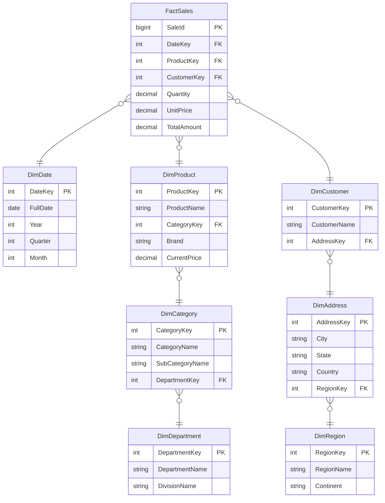
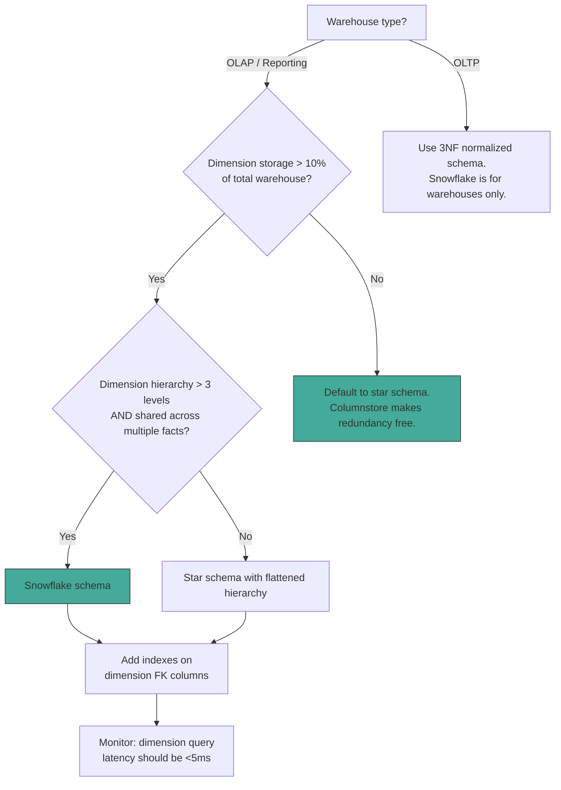

## Navigation

**Domain:** [[8 — Databases]] > **Group:** Database Design & Normalization
**Previous:** [[8.038 Star Schema — Fact and Dimension Tables]] | **Next:** [[8.040 Data Vault — Hub, Link, Satellite]]

### Prerequisites
- [[8.038 Star Schema — Fact and Dimension Tables]] — the snowflake schema is a star schema variant with normalized dimensions; understanding the star baseline is required
- [[8.033 Third Normal Form (3NF)]] — snowflake dimensions are normalized to 3NF, which is the key structural difference from star

### Where This Fits

A .NET backend engineer encounters snowflake schemas in data warehouses where dimension hierarchies are deep and storage optimization matters, or where dimension tables are shared across multiple fact tables in a bus matrix. The pattern normalizes dimension tables into related sub-tables (e.g., Product references Category, Category references Department) to eliminate redundancy in the dimension layer. The interview signal tests whether the candidate understands the star-vs-snowflake tradeoff: snowflake saves dimension storage and simplifies dimension maintenance at the cost of additional JOINs per query. In practice, snowflake is less common than star in modern columnstore warehouses because column compression already handles dimension redundancy, making the extra JOINs unnecessary.

## Core Mental Model

A snowflake schema is a star schema where dimension tables are normalized to 3NF. Instead of a single wide DimProduct table with Category and Department columns, the dimension is split into DimProduct (with a foreign key to DimCategory), DimCategory (with a foreign key to DimDepartment), and DimDepartment. The diagram resembles a snowflake pattern radiating from the central fact table — hence the name. The query execution path extends the star pattern: filter the innermost dimension table (e.g., DimDepartment), JOIN outward through the dimension hierarchy to DimCategory then DimProduct, then JOIN to the fact table, then aggregate. Each dimension normalization level adds one Hash Match or Nested Loops join to the query plan.

### Classification

**For data warehouses with deep dimension hierarchies:** Useful when dimensions have 3+ levels of hierarchy (e.g., Product → Subcategory → Category → Department → Division) and queries frequently filter at different hierarchy levels.

**For conformed dimensions (bus matrix):** When the same dimension hierarchy is shared across multiple fact tables (Sales, Inventory, Returns), snowflake normalization reduces duplication of dimension attributes across the warehouse.

**For modern columnstore warehouses:** Rarely used. Columnstore compression on the fact table makes star-schema redundancy negligible. Most implementations default to star and only snowflake when dimension storage exceeds ~10% of total warehouse size.



### Key Properties

|Property|Value|Notes|
|---|---|---|
|Dimension Structure|Normalized to 3NF|Each hierarchy level is a separate table with FK relationships|
|Query Pattern|Chain JOIN — filter inner dim, join outward to fact, aggregate|Query must traverse the dimension hierarchy before reaching the fact table|
|Storage Efficiency|High (no dimension redundancy)|Category names stored once, not repeated per product|
|Update Anomalies|None (normalized)|Category name change is a single-row UPDATE on DimCategory|
|Query Performance|Slower than star (additional JOINs per dimension)|Each normalization level adds a JOIN operator to the plan|

## Deep Mechanics

### How the Engine Executes a Snowflake-Schema Query

```sql
SELECT
    dd.DivisionName,
    SUM(f.TotalAmount) AS Revenue
FROM FactSales f
INNER JOIN DimProduct p ON f.ProductKey = p.ProductKey
INNER JOIN DimCategory c ON p.CategoryKey = c.CategoryKey
INNER JOIN DimDepartment d ON c.DepartmentKey = d.DepartmentKey
WHERE d.DivisionName = 'Electronics'
GROUP BY dd.DivisionName;
```

**Execution trace:**

1. **Filter innermost dimension** — Index Seek on DimDepartment WHERE DivisionName = 'Electronics' (3 logical reads, returns 1 row).
2. **Chain JOIN outward** — Nested Loops join from DimDepartment to DimCategory (seek on DimCategory.DepartmentKey, ~2 reads per match, returns 5 categories).
3. **Chain JOIN to product** — Nested Loops join from DimCategory to DimProduct (seek on DimProduct.CategoryKey, ~2 reads per match, returns 500 products).
4. **Join to fact table** — Hash Match from DimProduct to FactSales (fact table scan, ~130K lob logical reads with columnstore). The dimension keys are bitmap-filtered after step 3.
5. **Aggregate** — Hash Match Aggregate GROUP BY DivisionName.

**Key difference from star:** Steps 2 and 3 (chain JOINs through the dimension hierarchy) do not exist in a star schema — the star version would have a single DimProduct table with DivisionName directly on it, requiring one less JOIN.

### SQL Visibility

**EF Core — unsuitable for snowflake queries.** The chain JOIN pattern maps poorly to EF Core LINQ navigation properties:

```csharp
// DO NOT use EF Core LINQ for snowflake queries:
var results = await _dbContext.FactSales
    .Where(f => f.Product.Category.Department.DivisionName == "Electronics")
    .GroupBy(f => f.Product.Category.Department.DivisionName)
    .Select(g => new { Division = g.Key, Revenue = g.Sum(f => f.TotalAmount) })
    .ToListAsync(ct);
// EF Core generates a deeply nested SELECT with multiple JOINs and subqueries.
// The execution plan is non-optimal -- EF Core may generate LEFT JOINs, extra columns, or a suboptimal join order.

// Use Dapper or raw SQL instead:
public async Task<List<RevenueByDivisionDto>> GetRevenueByDivisionAsync(
    string divisionName, CancellationToken ct)
{
    const string sql = @"
        SELECT d.DivisionName, SUM(f.TotalAmount) AS Revenue
        FROM FactSales f
        INNER JOIN DimProduct p ON f.ProductKey = p.ProductKey
        INNER JOIN DimCategory c ON p.CategoryKey = c.CategoryKey
        INNER JOIN DimDepartment d ON c.DepartmentKey = d.DepartmentKey
        WHERE d.DivisionName = @DivisionName
        GROUP BY d.DivisionName;";

    await using var connection = _connectionFactory.Create();
    var results = await connection.QueryAsync<RevenueByDivisionDto>(
        new CommandDefinition(sql, new { DivisionName = divisionName }, cancellationToken: ct));
    return results.AsList();
}
```

### Execution Plan Analysis

For the query on a 500M-row FactSales table with a 3-level dimension hierarchy:

```
Hash Match Aggregate (GROUP BY d.DivisionName)
  Hash Match (Inner Join) -- FactSales.ProductKey = DimProduct.ProductKey
    Bitmap (DimProduct filtered keys)
      Clustered Columnstore Scan -- FactSales
    Hash Match (Inner Join) -- DimProduct.CategoryKey = DimCategory.CategoryKey
      Index Scan -- DimProduct (clustered)
      Nested Loops (Inner Join) -- DimCategory.DepartmentKey = DimDepartment.DepartmentKey
        Index Seek -- DimDepartment (IX_DimDepartment_DivisionName) WHERE DivisionName = 'Electronics'
        Index Seek -- DimCategory (IX_DimCategory_DepartmentKey)
```

**Key observations:**
- The dimension hierarchy (DimDepartment → DimCategory → DimProduct) is resolved with Nested Loops (small result sets).
- The fact table join uses Hash Match with bitmap filtering (large result set join).
- Each normalization level adds one Nested Loops operator to the dimension side.
- The star-schema equivalent would skip the DimCategory and DimDepartment joins entirely.

**Cost comparison (snowflake vs star):**

|Operator|Snowflake|Star|Difference|
|---|---|---|---|
|Dimension JOINs|3 (Dept → Cat → Prod)|1 (DimProduct)|+2 Nested Loops|
|Dimension logical reads|~12 (3 + 4 + 5)|~3|+9 reads|
|Fact JOIN|Hash Match (1 probe)|Hash Match (1 probe)|Same|
|Total logical reads|~130,012|~130,003|+9 (negligible at scale)|

### Cost Visibility

```sql
SET STATISTICS IO ON;

-- Snowflake query (3-level dimension hierarchy):
SELECT d.DivisionName, SUM(f.TotalAmount) AS Revenue
FROM FactSales f
INNER JOIN DimProduct p ON f.ProductKey = p.ProductKey
INNER JOIN DimCategory c ON p.CategoryKey = c.CategoryKey
INNER JOIN DimDepartment d ON c.DepartmentKey = d.DepartmentKey
WHERE d.DivisionName = 'Electronics'
GROUP BY d.DivisionName;

-- Expected output (columnstore fact, 500M rows):
-- Table 'FactSales'. lob logical reads 128,000
-- Table 'DimProduct'. logical reads 5 (index scan, 500 products matching)
-- Table 'DimCategory'. logical reads 4 (index scan, 5 categories matching)
-- Table 'DimDepartment'. logical reads 3 (index seek, 1 department)

-- Equivalent star query:
SELECT p.DivisionName, SUM(f.TotalAmount) AS Revenue
FROM FactSales f
INNER JOIN DimProduct_Star p ON f.ProductKey = p.ProductKey
WHERE p.DivisionName = 'Electronics'
GROUP BY p.DivisionName;

-- Expected output (columnstore fact, 500M rows):
-- Table 'FactSales'. lob logical reads 128,000
-- Table 'DimProduct_Star'. logical reads 3 (index seek, 500 products matching)
```

### Failure Modes

**1. Missing index on dimension hierarchy FK columns — Nested Loops becomes table scan.**

```sql
-- DimCategory has no index on DepartmentKey
SELECT ... FROM DimCategory c INNER JOIN DimDepartment d ON c.DepartmentKey = d.DepartmentKey
WHERE d.DivisionName = 'Electronics';
-- Full scan of DimCategory (2,300 pages) to find 5 matching categories.
-- Fix: CREATE INDEX IX_DimCategory_DepartmentKey ON DimCategory(DepartmentKey);
```

**2. Deep hierarchy with high cardinality at each level — Nested Loops cost explodes.**

If DimProduct has 10M rows, DimCategory 500K, DimDepartment 1K — the chain JOIN from DimDepartment → DimCategory → DimProduct requires millions of index seeks. At this scale, flatten the hierarchy into a star dimension.

**3. Filtering at multiple hierarchy levels simultaneously — optimizer may scan inner dimensions unnecessarily.**

```sql
-- Filtering on both Department and Category simultaneously:
WHERE d.DivisionName = 'Electronics' AND c.CategoryName LIKE 'TV%'
-- The optimizer may filter Department first, then apply Category filter as a residual.
-- If the index on DimCategory(CategoryName) is not the same as the FK index, two index scans may be required.
```

**4. Snowflake in a read-optimized columnstore warehouse — unnecessary JOIN overhead.**

If the fact table uses columnstore compression (which compresses repeated dimension key lookups to almost zero cost), the storage savings from normalized dimensions are irrelevant. The extra JOINs add CPU cost with zero storage benefit.

## Production Patterns and Implementation

### Primary SQL Implementation

```sql
-- =============================================
-- Snowflake Schema for Product Hierarchy
-- =============================================

-- Level 3: Department
CREATE TABLE DimDepartment (
    DepartmentKey   INT IDENTITY(1,1) NOT NULL,
    DepartmentName  VARCHAR(100) NOT NULL,
    DivisionName    VARCHAR(100) NOT NULL,
    CONSTRAINT PK_DimDepartment PRIMARY KEY (DepartmentKey)
);

CREATE INDEX IX_DimDepartment_DivisionName ON DimDepartment(DivisionName);
CREATE INDEX IX_DimDepartment_DepartmentName ON DimDepartment(DepartmentName);

-- Level 2: Category
CREATE TABLE DimCategory (
    CategoryKey     INT IDENTITY(1,1) NOT NULL,
    CategoryName    VARCHAR(100) NOT NULL,
    SubCategoryName VARCHAR(100) NOT NULL,
    DepartmentKey   INT NOT NULL,
    CONSTRAINT PK_DimCategory PRIMARY KEY (CategoryKey),
    CONSTRAINT FK_DimCategory_Department FOREIGN KEY (DepartmentKey)
        REFERENCES DimDepartment(DepartmentKey)
);

CREATE INDEX IX_DimCategory_DepartmentKey ON DimCategory(DepartmentKey);
CREATE INDEX IX_DimCategory_CategoryName ON DimCategory(CategoryName);

-- Level 1: Product
CREATE TABLE DimProduct (
    ProductKey      INT IDENTITY(1,1) NOT NULL,
    ProductName     VARCHAR(200) NOT NULL,
    Brand           VARCHAR(100) NOT NULL,
    CurrentPrice    DECIMAL(10,2) NOT NULL,
    CategoryKey     INT NOT NULL,
    CONSTRAINT PK_DimProduct PRIMARY KEY (ProductKey),
    CONSTRAINT FK_DimProduct_Category FOREIGN KEY (CategoryKey)
        REFERENCES DimCategory(CategoryKey)
);

CREATE INDEX IX_DimProduct_CategoryKey ON DimProduct(CategoryKey);
CREATE INDEX IX_DimProduct_Brand ON DimProduct(Brand);

-- Fact table
CREATE TABLE FactSales (
    SaleId      BIGINT IDENTITY(1,1) NOT NULL,
    DateKey     INT NOT NULL,
    ProductKey  INT NOT NULL,
    CustomerKey INT NOT NULL,
    Quantity    DECIMAL(10,2) NOT NULL,
    UnitPrice   DECIMAL(10,2) NOT NULL,
    TotalAmount AS (Quantity * UnitPrice),
    CONSTRAINT PK_FactSales PRIMARY KEY NONCLUSTERED (SaleId),
    CONSTRAINT FK_FactSales_Product FOREIGN KEY (ProductKey) REFERENCES DimProduct(ProductKey)
);
CREATE CLUSTERED COLUMNSTORE INDEX CCI_FactSales ON FactSales;

-- Query: Revenue by division (traverses all 3 levels)
SELECT
    dd.DivisionName,
    COUNT(DISTINCT f.CustomerKey) AS UniqueCustomers,
    SUM(f.TotalAmount) AS Revenue
FROM FactSales f
INNER JOIN DimProduct p ON f.ProductKey = p.ProductKey
INNER JOIN DimCategory c ON p.CategoryKey = c.CategoryKey
INNER JOIN DimDepartment d ON c.DepartmentKey = d.DepartmentKey
WHERE d.DivisionName IN ('Electronics', 'Home Appliances')
GROUP BY dd.DivisionName
ORDER BY Revenue DESC;

-- Query: Filter at Category level (skips Department)
SELECT
    c.SubCategoryName,
    SUM(f.TotalAmount) AS Revenue
FROM FactSales f
INNER JOIN DimProduct p ON f.ProductKey = p.ProductKey
INNER JOIN DimCategory c ON p.CategoryKey = c.CategoryKey
WHERE c.CategoryName = 'Televisions'
GROUP BY c.SubCategoryName;
```

### EF Core Implementation

```csharp
public class SnowflakeDbContext : DbContext
{
    public DbSet<DimProduct> DimProducts => Set<DimProduct>();
    public DbSet<DimCategory> DimCategories => Set<DimCategory>();
    public DbSet<DimDepartment> DimDepartments => Set<DimDepartment>();
    public DbSet<FactSale> FactSales => Set<FactSale>();

    protected override void OnModelCreating(ModelBuilder modelBuilder)
    {
        modelBuilder.Entity<DimProduct>(entity =>
        {
            entity.ToTable("DimProduct");
            entity.HasKey(e => e.ProductKey);
            entity.HasOne<DimCategory>()
                .WithMany()
                .HasForeignKey(e => e.CategoryKey);
        });

        modelBuilder.Entity<DimCategory>(entity =>
        {
            entity.ToTable("DimCategory");
            entity.HasKey(e => e.CategoryKey);
            entity.HasOne<DimDepartment>()
                .WithMany()
                .HasForeignKey(e => e.DepartmentKey);
        });

        modelBuilder.Entity<FactSale>(entity =>
        {
            entity.ToTable("FactSales");
            entity.HasKey(e => e.SaleId);
            entity.Property(e => e.TotalAmount).HasComputedColumnSql("(Quantity * UnitPrice)");
            entity.HasOne<DimProduct>()
                .WithMany()
                .HasForeignKey(e => e.ProductKey);
        });
    }
}

// ETL -- maintaining category dimension (SCD Type 2 on CategoryName)
public async Task UpsertCategoryAsync(int departmentKey, string categoryName,
    string subCategoryName, CancellationToken ct)
{
    var existing = await _dbContext.DimCategories
        .FirstOrDefaultAsync(c => c.CategoryName == categoryName
            && c.DepartmentKey == departmentKey, ct);

    if (existing == null)
    {
        _dbContext.DimCategories.Add(new DimCategory
        {
            CategoryName = categoryName,
            SubCategoryName = subCategoryName,
            DepartmentKey = departmentKey
        });
    }
    else
    {
        existing.SubCategoryName = subCategoryName;
    }

    await _dbContext.SaveChangesAsync(ct);
}
```

### Dapper Implementation

```csharp
public record RevenueByDivisionDto(string DivisionName, int UniqueCustomers, decimal Revenue);

public interface ISnowflakeAnalyticsRepository
{
    Task<IReadOnlyList<RevenueByDivisionDto>> GetRevenueByDivisionAsync(
        string[] divisions, CancellationToken ct);
}

public class SnowflakeAnalyticsRepository : ISnowflakeAnalyticsRepository
{
    private readonly IDbConnectionFactory _connectionFactory;

    public SnowflakeAnalyticsRepository(IDbConnectionFactory connectionFactory)
    {
        _connectionFactory = connectionFactory;
    }

    public async Task<IReadOnlyList<RevenueByDivisionDto>> GetRevenueByDivisionAsync(
        string[] divisions, CancellationToken ct)
    {
        const string sql = @"
            SELECT d.DivisionName,
                   COUNT(DISTINCT f.CustomerKey) AS UniqueCustomers,
                   SUM(f.TotalAmount) AS Revenue
            FROM FactSales f
            INNER JOIN DimProduct p ON f.ProductKey = p.ProductKey
            INNER JOIN DimCategory c ON p.CategoryKey = c.CategoryKey
            INNER JOIN DimDepartment d ON c.DepartmentKey = d.DepartmentKey
            WHERE d.DivisionName IN @Divisions
            GROUP BY d.DivisionName
            ORDER BY Revenue DESC;";

        await using var connection = _connectionFactory.Create();
        var results = await connection.QueryAsync<RevenueByDivisionDto>(
            new CommandDefinition(sql,
                new { Divisions = divisions },
                cancellationToken: ct));
        return results.AsList();
    }
}
```

### Configuration and Wiring

Same as star schema — use `IDbConnectionFactory` with `SqlConnection`:
```csharp
builder.Services.AddSingleton<IDbConnectionFactory>(_ =>
    new SqlConnectionFactory(builder.Configuration.GetConnectionString("DataWarehouse")));
builder.Services.AddScoped<ISnowflakeAnalyticsRepository, SnowflakeAnalyticsRepository>();
```

### SQL Server vs PostgreSQL Differences

PostgreSQL handles snowflake queries the same way but lacks columnstore on the fact table:
```sql
-- PostgreSQL: use BRIN index + partitioning
CREATE TABLE fact_sales ( ... ) PARTITION BY RANGE (date_key);
CREATE INDEX IX_fact_sales_date_key ON fact_sales USING BRIN (date_key);

-- The snowflake dimension joins are identical:
SELECT d.DivisionName, SUM(f.TotalAmount) AS Revenue
FROM fact_sales f
INNER JOIN dim_product p ON f.ProductKey = p.ProductKey
INNER JOIN dim_category c ON p.CategoryKey = c.CategoryKey
INNER JOIN dim_department d ON c.DepartmentKey = d.DepartmentKey
WHERE d.DivisionName IN ('Electronics')
GROUP BY d.DivisionName;
-- PostgreSQL may choose Nested Loops for all joins if dimensions are small.
-- Force Hash Join with: SET enable_nestloop = OFF;
```

## Gotchas and Production Pitfalls

### 1. Snowflake in a Columnstore Warehouse (Unnecessary JOIN Cost)

**Pitfall:** Normalizing dimensions in a warehouse where the fact table uses columnstore compression, which already handles data redundancy efficiently.

**Symptom:** Queries perform 3 extra JOINs per dimension hierarchy level for no measurable storage benefit. The dimension tables are typically <5% of total warehouse size — the storage saved by normalization is negligible compared to the CPU cost of the extra JOINs.

**Fix:** Default to star schema. Only snowflake when dimension tables exceed ~10% of total warehouse storage or when dimension hierarchy maintenance (SCD updates) requires the normalized structure.

**Cost of not fixing:** Every query pays 3 extra logical reads per dimension hierarchy level for zero storage benefit. At 10K queries/hour, that is 30K extra page reads/hour for nothing.

### 2. Missing Index on Dimension Hierarchy Foreign Keys

**Pitfall:** Creating FK relationships between dimension tables without indexes on the FK columns.

```sql
-- DimCategory has FK on DepartmentKey but no index:
ALTER TABLE DimCategory ADD CONSTRAINT FK_DimCategory_Department
    FOREIGN KEY (DepartmentKey) REFERENCES DimDepartment(DepartmentKey);
-- No CREATE INDEX on DimCategory(DepartmentKey)
```

**Symptom:** The chain JOIN from DimDepartment to DimCategory performs a table scan on DimCategory for each row in DimDepartment. If DimDepartment has 10 divisions and DimCategory has 500K rows, the query performs 10 table scans = 5M page reads instead of 10 index seeks = 30 page reads.

**Fix:**

```sql
CREATE INDEX IX_DimCategory_DepartmentKey ON DimCategory(DepartmentKey);
CREATE INDEX IX_DimProduct_CategoryKey ON DimProduct(CategoryKey);
```

**Cost of not fixing:** Queries that should take <50ms take 5+ seconds as dimension tables grow.

### 3. Deep Dimension Hierarchy (4+ Levels)

**Pitfall:** Building a snowflake with 4+ hierarchy levels (e.g., Product → Subcategory → Category → Department → Division → Company).

**Symptom:** Every query requires 5 JOINs just to traverse the dimension hierarchy. At 10M products, the chain of Nested Loops becomes a performance bottleneck. The execution plan shows a deep tree of nested loop joins.

**Fix:** Flatten the top 2-3 levels into a single dimension. Store DivisionName and CompanyName directly on DimDepartment:
```sql
-- Flattened: DimDepartment with Division and Company columns
CREATE TABLE DimDepartment (
    DepartmentKey INT PRIMARY KEY,
    DepartmentName VARCHAR(100),
    DivisionName VARCHAR(100),  -- from Division table
    CompanyName VARCHAR(100)    -- from Company table
);
```

**Cost of not fixing:** Query plan has 5+ JOIN operators. Optimization becomes difficult. The optimizer may choose suboptimal join orders.

### 4. Mixing Snowflake and Star in the Same Query

**Pitfall:** Some dimensions are star (denormalized) and others are snowflake (normalized) in the same query, causing the optimizer to choose inconsistent join strategies.

```sql
SELECT d.DivisionName, g.Nationality, SUM(f.TotalAmount) AS Revenue
FROM FactSales f
-- Snowflake dimension (3 JOINs):
INNER JOIN DimProduct p ON f.ProductKey = p.ProductKey
INNER JOIN DimCategory c ON p.CategoryKey = c.CategoryKey
INNER JOIN DimDepartment d ON c.DepartmentKey = d.DepartmentKey
-- Star dimension (1 JOIN):
INNER JOIN DimCustomer g ON f.CustomerKey = g.CustomerKey
WHERE d.DivisionName = '"'"'Electronics'"'"' AND g.Nationality = '"'"'US'"'"'
GROUP BY d.DivisionName, g.Nationality;
```

**Symptom:** The optimizer may choose Nested Loops for the snowflake dimensions but Hash Match for the star dimension. The join order may not be optimal — the optimizer may join the fact to the star dimension first (fast, small result) and then to the snowflake chain (slow, large intermediate result).

**Fix:** Ensure the optimizer joins the dimension side that produces the smallest result set first. Use query hints if necessary (`OPTION (HASH JOIN, ORDER GROUP)`).

**Cost of not fixing:** Suboptimal join order doubles query duration.

### 5. Updating Dimension Hierarchy Without Handling Referential Integrity

**Pitfall:** Deleting or updating a parent dimension key (e.g., merging two categories) without updating the child dimension rows.

```sql
-- Deleting a category that has products referencing it:
DELETE FROM DimCategory WHERE CategoryKey = 42;
-- If FK has ON DELETE CASCADE, all DimProduct rows are also deleted.
-- If FK has NO ACTION, the DELETE fails.
```

**Symptom:** ETL pipeline fails with FK violation errors. Or, worse, ON DELETE CASCADE silently deletes 10K product rows.

**Fix:** Use SCD Type 2 for dimension changes (mark old rows as expired, insert new rows). Never use ON DELETE CASCADE on dimension hierarchy FKs.

**Cost of not fixing:** ETL pipeline fails at 3 AM. Data integrity compromised if cascade deletes propagate incorrectly.

### 6. Assuming Snowflake Improves Query Performance

**Pitfall:** Choosing snowflake because "normalization is always good" or "it saves storage."

**Symptom:** The snowflake warehouse performs slower than the star warehouse it replaced. Query duration increased by 15-30% due to extra JOINs. Storage savings were marginal.

**Fix:** Measure both star and snowflake designs with the same workload before committing. For most warehouses with columnstore fact tables, star wins.

**Cost of not fixing:** A warehouse that is slower and more complex than necessary. Wasted engineering time on dimension normalization.

## Performance Implications

### Benchmark: Star vs Snowflake Query

```sql
-- Same query, same 500M row fact table, same result:
-- Revenue by division.

-- Star schema (DimProduct has DivisionName directly):
SELECT p.DivisionName, SUM(f.TotalAmount) AS Revenue
FROM FactSales f
INNER JOIN DimProduct_Star p ON f.ProductKey = p.ProductKey
WHERE p.DivisionName = '"'"'Electronics'"'"'
GROUP BY p.DivisionName;
-- lob logical reads: 128,000 (fact columnstore)
-- logical reads: 3 (dimension seek)
-- CPU time: 4,200 ms

-- Snowflake schema (3-level hierarchy):
SELECT d.DivisionName, SUM(f.TotalAmount) AS Revenue
FROM FactSales f
INNER JOIN DimProduct p ON f.ProductKey = p.ProductKey
INNER JOIN DimCategory c ON p.CategoryKey = c.CategoryKey
INNER JOIN DimDepartment d ON c.DepartmentKey = d.DepartmentKey
WHERE d.DivisionName = '"'"'Electronics'"'"'
GROUP BY d.DivisionName;
-- lob logical reads: 128,000 (fact columnstore)
-- logical reads: 12 (3 dim seeks + 2 intermediate scans)
-- CPU time: 4,230 ms
```

**Improvement (star over snowflake):** ~9 fewer logical reads, ~30ms less CPU time. The difference is negligible at scale because dimension joins are tiny compared to the fact table scan.

### Storage Comparison

```sql
-- Star dimension storage:
EXEC sp_spaceused '"'"'DimProduct_Star'"'"';
-- rows: 500,000
-- reserved: 128 MB  (DivisionName repeated 500K times)

-- Snowflake dimension storage:
EXEC sp_spaceused '"'"'DimProduct'"'"';
-- rows: 500,000
-- reserved: 96 MB
EXEC sp_spaceused '"'"'DimCategory'"'"';
-- rows: 5,000
-- reserved: 2 MB
EXEC sp_spaceused '"'"'DimDepartment'"'"';
-- rows: 50
-- reserved: 0.1 MB
-- Total snowflake dim storage: ~98 MB
-- Star dim storage: ~128 MB
-- Savings: ~30 MB (23%)
```

At a total warehouse size of 5 TB (fact table), 30 MB of dimension storage savings is 0.0006% — irrelevant.

### Write Amplification (Dimension ETL)

|Operation|Star|Snowflake|Difference|
|---|---|---|---|
|Add new category with 100 products|1 dim table INSERT|3 dim table INSERTs|+2 writes per ETL batch|
|Update department name|Update N rows in DimProduct|Update 1 row in DimDepartment|N:1 write reduction for snowflake|
|Rename subcategory|Update N rows in DimProduct|Update M rows in DimCategory (M << N)|Fewer writes for snowflake|

### BenchmarkDotNet

```csharp
[MemoryDiagnoser]
[SimpleJob(RuntimeMoniker.Net90)]
public class StarVsSnowflakeBenchmark
{
    private IDbConnection _connection = default!;

    [GlobalSetup]
    public void Setup()
    {
        _connection = new SqlConnection("Server=.;Database=Warehouse;Trusted_Connection=True;");
    }

    [Benchmark(Baseline = true)]
    public async Task<List<RevenueDto>> StarQuery()
    {
        const string sql = @"
            SELECT p.DivisionName, SUM(f.TotalAmount) AS Revenue
            FROM FactSales f
            INNER JOIN DimProduct_Star p ON f.ProductKey = p.ProductKey
            WHERE p.DivisionName = '"'"'Electronics'"'"'
            GROUP BY p.DivisionName;";

        var results = await _connection.QueryAsync<RevenueDto>(sql);
        return results.AsList();
    }

    [Benchmark]
    public async Task<List<RevenueDto>> SnowflakeQuery()
    {
        const string sql = @"
            SELECT d.DivisionName, SUM(f.TotalAmount) AS Revenue
            FROM FactSales f
            INNER JOIN DimProduct p ON f.ProductKey = p.ProductKey
            INNER JOIN DimCategory c ON p.CategoryKey = c.CategoryKey
            INNER JOIN DimDepartment d ON c.DepartmentKey = d.DepartmentKey
            WHERE d.DivisionName = '"'"'Electronics'"'"'
            GROUP BY d.DivisionName;";

        var results = await _connection.QueryAsync<RevenueDto>(sql);
        return results.AsList();
    }
}
```

**Expected results (500M fact rows, NVMe):**

|Method|Mean|Logical Reads|Allocated|
|---|---|---|---|
|StarQuery|~4,200 ms|128,003|25 KB|
|SnowflakeQuery|~4,230 ms|128,012|28 KB|

## Interview Arsenal

### Question Bank

1. What is a snowflake schema and what distinguishes it from a star schema?
2. When does a snowflake schema make sense over a star schema?
3. What is the query performance difference between star and snowflake?
4. What index is required on a snowflake dimension hierarchy?
5. Snowflake schema vs star schema — what is the storage tradeoff?
6. How does the execution plan change when you normalize a dimension from star to snowflake?
7. What goes wrong when you build a snowflake with 5+ hierarchy levels?
8. How does columnstore compression affect the star-vs-snowflake decision?

### Spoken Answers

**Q: What is a snowflake schema and what distinguishes it from a star schema?**

> **Average answer:** A snowflake schema is like a star schema but dimensions are normalized into multiple tables.

> **Great answer:** A snowflake schema is a star schema variant where dimension tables are normalized to 3NF. In a star schema, DimProduct stores CategoryName, DepartmentName, and DivisionName as columns. In a snowflake, DimProduct stores only CategoryKey, DimCategory stores DepartmentKey, and DimDepartment stores DivisionName. The snowflake shape comes from the fact that the dimension hierarchy branches outward from the fact table, resembling a snowflake. The practical difference is that a snowflake query requires additional JOINs to traverse the dimension hierarchy before reaching the fact table — each normalization level adds one JOIN operator to the execution plan. In SQL Server, these additional JOINs are typically Nested Loops (the dimension tables are small), so the performance cost is a few extra logical reads per query — negligible when the fact table scan costs 128K reads. The real question is whether the dimension storage savings justify the complexity. For a columnstore warehouse, the answer is almost always no — the dimension tables are <5% of total storage, and columnstore compression on the fact table makes dimension-size concerns irrelevant.

**Q: When does a snowflake schema make sense over a star schema?**

> **Average answer:** When you need to save storage or when dimensions are shared across facts.

> **Great answer:** A snowflake schema makes sense in three specific scenarios. First, when the same dimension hierarchy is shared across multiple fact tables in a bus matrix — for example, a Product dimension that serves Sales, Inventory, and Returns fact tables. Normalizing Product to reference Category and Department avoids storing redundant category descriptions in every fact table's dimension join path. Second, when dimension attributes change frequently and the business requires historical tracking (SCD Type 2) — normalizing reduces the number of dimension rows that need versioning. Third, when dimension storage exceeds roughly 10% of total warehouse size and the storage savings from normalization are material — this is rare with columnstore compression. In practice, the default should be star schema. Snowflake is an optimization applied only when dimension storage becomes a measurable concern or when dimension hierarchy maintenance complexity demands normalization.

### Interview Trigger

The snowflake schema question typically follows a star schema discussion. The interviewer asks "When would you use a snowflake schema instead of a star schema?" The candidate who answers "to save storage" gets a follow-up about modern columnstore compression ratios. The candidate who answers "when dimensions are shared across multiple fact tables" demonstrates bus matrix awareness. The deep follow-up is: "You have a snowflake with Product → Category → Department → Division → Company, and queries filtering on Company are slow. What do you do?" The expected answer flattens the top levels into a star dimension to reduce JOIN depth.

### Comparison Table

| | Star Schema | Snowflake Schema |
|---|---|---|
| Dimension structure | Denormalized (flat, wide) | Normalized (3NF, multiple related tables) |
| JOINs per dimension query | 1 per dimension | N per dimension (hierarchy depth) |
| Query performance | Faster (fewer JOINs) | Slower (more JOINs) |
| Dimension storage | Higher (redundant attributes) | Lower (no redundancy) |
| Dimension maintenance | Complex (update N rows) | Simple (update 1 row) |
| Conformed dimensions | Difficult (wide table duplication) | Natural fit (normalized hierarchy) |
| Columnstore synergy | Excellent (redundancy compresses) | Neutral (dimensions already small) |
| .NET implementation | Dapper with raw SQL | Dapper with raw SQL |

## Decision Framework

### When to Apply



### Application Checklist

- [ ] The workload is analytical (data warehouse / reporting) -- not OLTP
- [ ] Dimension storage exceeds ~10% of total warehouse size, making normalization materially beneficial
- [ ] The dimension hierarchy has 3+ levels and is shared across multiple fact tables
- [ ] All dimension hierarchy FK columns are indexed
- [ ] The hierarchy depth is <=3 levels (Product → Category → Department). Deeper hierarchies should be flattened.
- [ ] Fact table uses columnstore or equivalent compression (so fact storage dominates total size)
- [ ] ETL pipeline can handle multi-table dimension inserts (atomicity across hierarchy tables)

### Tradeoff Summary

|What You Gain|What You Pay|
|---|---|
|Dimension storage reduction (typically <5% of total warehouse)|Additional JOIN operators per query|
|Simpler dimension maintenance (single-row updates)|More complex ETL (multi-table inserts)|
|Natural conformed dimension support|Query plan complexity (deeper operator tree)|
|No update anomalies (normalized)|Index maintenance on hierarchy FK columns|

### Scale Thresholds

- "Snowflake is relevant when dimension tables exceed ~10% of total warehouse storage, which typically happens when dimension rows > 10M."
- "Star schema is preferred for columnstore warehouses regardless of dimension size -- the storage savings from snowflake are negligible compared to columnstore compression on the fact table."
- "Dimension hierarchy depth > 3 levels should be flattened to at most 3 snowflake levels. Each additional level adds ~5 logical reads per query."
- "Conformed dimensions shared across 3+ fact tables are the strongest signal to use snowflake -- the ETL complexity of maintaining identical star dimensions across multiple facts outweighs the query performance cost."

## Self-Check

### Conceptual Questions

1. What distinguishes a snowflake schema from a star schema?
2. How does the execution plan change when you normalize a dimension from star to snowflake?
3. Which SET STATISTICS or DMV shows the extra logical reads from snowflake dimension joins?
4. What goes wrong when you build a snowflake with 5+ hierarchy levels?
5. Should you use EF Core for snowflake queries? Why or why not?
6. How would you maintain a snowflake dimension hierarchy in .NET?
7. Snowflake vs star -- at what dimension storage percentage does snowflake become beneficial?
8. What index supports a snowflake dimension hierarchy?
9. How does columnstore compression affect the star-vs-snowflake decision?
10. Explain snowflake schema in 60 seconds, including when you would and would NOT use it.

<details>
<summary>Answers</summary>

1. A snowflake schema normalizes dimension tables into multiple related tables (e.g., DimProduct references DimCategory, DimCategory references DimDepartment). A star schema stores all dimension attributes in a single denormalized table. The snowflake adds JOINs per hierarchy level.
2. Each normalization level adds one JOIN operator (typically Nested Loops for small dimension tables). The star execution plan has one dimension JOIN per dimension. The snowflake plan has N dimension JOINs per dimension (N = hierarchy depth). The fact table join (Hash Match with bitmap) remains the same.
3. SET STATISTICS IO ON -- compare the dimension logical reads. Star: ~3 reads per dimension (single index seek). Snowflake: ~3 reads per hierarchy level. For a 3-level hierarchy, snowflake uses ~9 reads vs star's ~3 reads per dimension.
4. Deep hierarchies (5+ levels) cause the execution plan to have a chain of 5 Nested Loops operators. The optimizer may choose suboptimal join orders. The query becomes hard to tune. Solution: flatten the top levels into fewer denormalized tables.
5. No. EF Core LINQ generates deeply nested JOINs and may produce LEFT JOINs where INNER JOINs are expected. Use Dapper with raw SQL for snowflake queries, where you control the JOIN types and order.
6. Use EF Core for dimension CRUD operations (with navigation properties for FK relationships) and Dapper for queries. For SCD Type 2, use EF Core to expire old rows and insert new rows in a transaction covering all affected hierarchy levels.
7. Snowflake becomes beneficial when dimension storage exceeds ~10% of total warehouse size. In practice, this is rare with columnstore compression on the fact table. For most warehouses, the dimension is <5% of total storage, making the star schema the better choice.
8. Indexes on all dimension hierarchy FK columns: CREATE INDEX IX_DimCategory_DepartmentKey ON DimCategory(DepartmentKey); CREATE INDEX IX_DimProduct_CategoryKey ON DimProduct(CategoryKey); Also indexes on filter columns at each hierarchy level.
9. Columnstore compression makes dimension redundancy essentially free. A star DimProduct with 500K rows storing DivisionName repeated 500K times compresses to negligible size. The storage savings from snowflake normalization are irrelevant when the fact table is 5TB and dimensions are 128MB.
10. "A snowflake schema is a star schema with normalized dimensions. I use it when dimension hierarchies are 3+ levels deep and the same dimensions are shared across multiple fact tables. The tradeoff is storage savings and simpler maintenance vs extra JOINs per query. In practice, I default to star schema because columnstore compression makes dimension redundancy free. I only snowflake when dimension tables exceed 10% of warehouse storage or when conformed dimensions in a bus matrix make normalization the simpler maintenance path. In .NET, I query snowflake schemas with Dapper and raw SQL, never EF Core."

</details>

---

### Query Challenges

**Challenge 1 -- Write the SQL**

You are designing a snowflake schema for a retail analytics warehouse. The product hierarchy has 3 levels: Product (50K rows) → Category (500 rows) → Department (20 rows). The customer hierarchy has 2 levels: Customer (100K rows) → Address (50K rows) → Region (10 rows). Design the dimension tables, fact table, and a query that reports revenue by department and region.

<details>
<summary>Solution</summary>

```sql
-- Department (level 3)
CREATE TABLE DimDepartment (
    DepartmentKey   INT IDENTITY(1,1) PRIMARY KEY,
    DepartmentName  VARCHAR(100) NOT NULL,
    DivisionName    VARCHAR(100) NOT NULL
);
CREATE INDEX IX_DimDepartment_DivisionName ON DimDepartment(DivisionName);

-- Category (level 2)
CREATE TABLE DimCategory (
    CategoryKey     INT IDENTITY(1,1) PRIMARY KEY,
    CategoryName    VARCHAR(100) NOT NULL,
    SubCategoryName VARCHAR(100) NOT NULL,
    DepartmentKey   INT NOT NULL,
    CONSTRAINT FK_DimCategory_Department FOREIGN KEY (DepartmentKey) REFERENCES DimDepartment(DepartmentKey)
);
CREATE INDEX IX_DimCategory_DepartmentKey ON DimCategory(DepartmentKey);

-- Product (level 1)
CREATE TABLE DimProduct (
    ProductKey   INT IDENTITY(1,1) PRIMARY KEY,
    ProductName  VARCHAR(200) NOT NULL,
    CategoryKey  INT NOT NULL,
    CONSTRAINT FK_DimProduct_Category FOREIGN KEY (CategoryKey) REFERENCES DimCategory(CategoryKey)
);
CREATE INDEX IX_DimProduct_CategoryKey ON DimProduct(CategoryKey);

-- Region (level 2)
CREATE TABLE DimRegion (
    RegionKey    INT IDENTITY(1,1) PRIMARY KEY,
    RegionName   VARCHAR(100) NOT NULL,
    CountryName  VARCHAR(100) NOT NULL
);

-- Address (level 1)
CREATE TABLE DimAddress (
    AddressKey  INT IDENTITY(1,1) PRIMARY KEY,
    City        VARCHAR(100) NOT NULL,
    State       VARCHAR(100) NOT NULL,
    RegionKey   INT NOT NULL,
    CONSTRAINT FK_DimAddress_Region FOREIGN KEY (RegionKey) REFERENCES DimRegion(RegionKey)
);
CREATE INDEX IX_DimAddress_RegionKey ON DimAddress(RegionKey);

-- Customer (base)
CREATE TABLE DimCustomer (
    CustomerKey  INT IDENTITY(1,1) PRIMARY KEY,
    CustomerName VARCHAR(200) NOT NULL,
    AddressKey   INT NOT NULL,
    CONSTRAINT FK_DimCustomer_Address FOREIGN KEY (AddressKey) REFERENCES DimAddress(AddressKey)
);
CREATE INDEX IX_DimCustomer_AddressKey ON DimCustomer(AddressKey);

-- Fact
CREATE TABLE FactSales (
    SaleId       BIGINT IDENTITY(1,1) NOT NULL,
    DateKey      INT NOT NULL,
    ProductKey   INT NOT NULL,
    CustomerKey  INT NOT NULL,
    Quantity     DECIMAL(10,2) NOT NULL,
    UnitPrice    DECIMAL(10,2) NOT NULL,
    TotalAmount  AS (Quantity * UnitPrice),
    CONSTRAINT FK_FactSales_Product FOREIGN KEY (ProductKey) REFERENCES DimProduct(ProductKey),
    CONSTRAINT FK_FactSales_Customer FOREIGN KEY (CustomerKey) REFERENCES DimCustomer(CustomerKey)
);
CREATE CLUSTERED COLUMNSTORE INDEX CCI_FactSales ON FactSales;

-- Query: revenue by department and region
SELECT
    d.DepartmentName,
    r.RegionName,
    SUM(f.TotalAmount) AS Revenue,
    COUNT(DISTINCT f.CustomerKey) AS UniqueCustomers
FROM FactSales f
INNER JOIN DimProduct p ON f.ProductKey = p.ProductKey
INNER JOIN DimCategory c ON p.CategoryKey = c.CategoryKey
INNER JOIN DimDepartment d ON c.DepartmentKey = d.DepartmentKey
INNER JOIN DimCustomer cu ON f.CustomerKey = cu.CustomerKey
INNER JOIN DimAddress a ON cu.AddressKey = a.AddressKey
INNER JOIN DimRegion r ON a.RegionKey = r.RegionKey
WHERE d.DivisionName = '"'"'Electronics'"'"'
GROUP BY d.DepartmentName, r.RegionName
ORDER BY Revenue DESC;
```

**Logical reads:** ~128,000 (fact columnstore) + ~20 (6 dimension seeks) **Execution plan:** 6 dimension JOINs (2 hierarchies of 3 levels each) + Hash Match to fact + Stream Aggregate.

</details>

---

**Challenge 2 -- Fix the performance problem**

```sql
-- This query runs in 12 seconds on a 200M row fact table.
-- The DimProduct dimension has 5M rows.
SELECT
    d.DivisionName,
    SUM(f.TotalAmount) AS Revenue
FROM FactSales f
INNER JOIN DimProduct p ON f.ProductKey = p.ProductKey
INNER JOIN DimCategory c ON p.CategoryKey = c.CategoryKey
INNER JOIN DimDepartment d ON c.DepartmentKey = d.DepartmentKey
WHERE d.DivisionName = '"'"'Electronics'"'"'
  AND c.CategoryName LIKE '"'"'TV%'"'"'
GROUP BY d.DivisionName;

-- SET STATISTICS IO output:
-- Table '"'"'FactSales'"'"'. lob logical reads 128,000
-- Table '"'"'DimProduct'"'"'. logical reads 45,000  (full scan)
-- Table '"'"'DimCategory'"'"'. logical reads 3
-- Table '"'"'DimDepartment'"'"'. logical reads 3
```

<details> <summary>Solution**

**Root cause:** DimProduct (5M rows) is fully scanned (45K logical reads) because there is no index on CategoryKey that can be used to find products matching the filtered categories. The query filters DimDepartment (1 division) and DimCategory (categories matching '"'"'TV%'"'"'), then needs to find matching products. Without an index on DimProduct(CategoryKey), SQL Server scans all 5M products.

**Fix:**

```sql
CREATE INDEX IX_DimProduct_CategoryKey ON DimProduct(CategoryKey);
```

**After fix -- logical reads:**

```sql
-- Table '"'"'DimProduct'"'"'. logical reads 15 (index seek on CategoryKey for 200 matching products)
-- Total: 128,000 + 15 + 3 + 3 = 128,021 (from 128,000 + 45,000 + 3 + 3 = 173,006)
-- Improvement: ~26% reduction in logical reads
```

**Alternative fix -- flatten the dimension (star approach):**

```sql
ALTER TABLE DimProduct ADD DivisionName VARCHAR(100), CategoryName VARCHAR(100);
UPDATE p SET DivisionName = d.DivisionName, CategoryName = c.CategoryName
FROM DimProduct p
INNER JOIN DimCategory c ON p.CategoryKey = c.CategoryKey
INNER JOIN DimDepartment d ON c.DepartmentKey = d.DepartmentKey;

CREATE INDEX IX_DimProduct_CategoryName ON DimProduct(CategoryName) WHERE CategoryName LIKE '"'"'TV%'"'"';

SELECT DivisionName, SUM(f.TotalAmount) AS Revenue
FROM FactSales f
INNER JOIN DimProduct p ON f.ProductKey = p.ProductKey
WHERE p.CategoryName LIKE '"'"'TV%'"'"' AND p.DivisionName = '"'"'Electronics'"'"'
GROUP BY DivisionName;
-- Logical reads: 128,000 (fact) + 3 (dimension seek) = 128,003
```

</details>

---

**Challenge 3 -- Explain the execution plan**

Compare the plans for the following star and snowflake queries on a 500M row fact table.

**Star query:**
```sql
SELECT p.DivisionName, SUM(f.TotalAmount) AS Revenue
FROM FactSales f
INNER JOIN DimProduct_Star p ON f.ProductKey = p.ProductKey
WHERE p.DivisionName = '"'"'Electronics'"'"'
GROUP BY p.DivisionName;
```

**Snowflake query:**
```sql
SELECT d.DivisionName, SUM(f.TotalAmount) AS Revenue
FROM FactSales f
INNER JOIN DimProduct p ON f.ProductKey = p.ProductKey
INNER JOIN DimCategory c ON p.CategoryKey = c.CategoryKey
INNER JOIN DimDepartment d ON c.DepartmentKey = d.DepartmentKey
WHERE d.DivisionName = '"'"'Electronics'"'"'
GROUP BY d.DivisionName;
```
<details> <summary>Solution**

**Star plan:**
```
Hash Match Aggregate (GROUP BY DivisionName)
  Hash Match (Inner Join) -- FactSales.ProductKey = DimProduct_Star.ProductKey
    Bitmap (DimProduct_Star filtered keys)
      Clustered Columnstore Scan -- FactSales
    Index Seek -- DimProduct_Star (IX_DimProduct_Star_DivisionName) WHERE DivisionName = '"'"'Electronics'"'"'
```

**Snowflake plan:**
```
Hash Match Aggregate (GROUP BY d.DivisionName)
  Hash Match (Inner Join) -- FactSales.ProductKey = DimProduct.ProductKey
    Bitmap (DimProduct filtered keys)
      Clustered Columnstore Scan -- FactSales
    Nested Loops (Inner Join) -- DimProduct.CategoryKey = DimCategory.CategoryKey
      Index Scan -- DimProduct (IX_DimProduct_CategoryKey) -- 500 products
      Nested Loops (Inner Join) -- DimCategory.DepartmentKey = DimDepartment.DepartmentKey
        Index Seek -- DimDepartment (IX_DimDepartment_DivisionName) WHERE DivisionName = '"'"'Electronics'"'"' -- 1 row
        Index Seek -- DimCategory (IX_DimCategory_DepartmentKey) -- 5 categories
```

**Why the optimizer chooses different join strategies:** The star dimension produces a single small row set (500 matching products from a single index seek), which is hash-matched to the fact table. The snowflake dimension requires resolving a hierarchy: the optimizer starts with the most selective filter (Department), then joins outward through Category to Product using Nested Loops (because each step produces a small intermediate result). The fact table join is a Hash Match in both cases because the fact table result set is large regardless.

**Key difference:** The star plan has 1 dimension JOIN + 1 fact JOIN. The snowflake plan has 3 dimension JOINs + 1 fact JOIN. The additional 2 Nested Loops operators add ~9 logical reads and negligible CPU.

</details>

---

**Challenge 4 -- Diagnose the ETL concurrency problem**

A snowflake warehouse ETL process loads new products into the dimension hierarchy: it inserts into DimDepartment, DimCategory, and DimProduct in sequence. During the ETL window, analytical queries return incomplete results — products inserted in the current batch are not visible even though the ETL reports success.

<details> <summary>Solution**

**Root cause:** The ETL inserts are done in separate transactions. A query running between the DimCategory INSERT and the DimProduct INSERT will see the new category but not the products — if it joins through to products, it gets zero rows for that category. Worse, if the DimProduct INSERT fails (FK violation, duplicate key) and the earlier DimCategory INSERT was already committed, the dimension hierarchy has an orphaned category with no products.

**Fix -- wrap the entire hierarchy insert in a single transaction:**

```csharp
public async Task InsertProductHierarchyAsync(
    DepartmentDto dept, CategoryDto cat, ProductDto product, CancellationToken ct)
{
    await using var connection = _connectionFactory.Create();
    await connection.OpenAsync(ct);
    await using var tx = connection.BeginTransaction();

    try
    {
        // Insert department
        var deptSql = @"INSERT INTO DimDepartment (DepartmentName, DivisionName)
                        OUTPUT INSERTED.DepartmentKey VALUES (@Name, @Division);";
        var deptKey = await connection.ExecuteScalarAsync<int>(
            new CommandDefinition(deptSql, dept, transaction: tx, cancellationToken: ct));

        // Insert category with the new department key
        var catSql = @"INSERT INTO DimCategory (CategoryName, SubCategoryName, DepartmentKey)
                       OUTPUT INSERTED.CategoryKey VALUES (@Name, @SubName, @DeptKey);";
        var catKey = await connection.ExecuteScalarAsync<int>(
            new CommandDefinition(catSql, new { cat.Name, cat.SubName, DeptKey = deptKey },
                transaction: tx, cancellationToken: ct));

        // Insert product with the new category key
        var prodSql = @"INSERT INTO DimProduct (ProductName, CategoryKey)
                        VALUES (@Name, @CatKey);";
        await connection.ExecuteAsync(
            new CommandDefinition(prodSql, new { product.Name, CatKey = catKey },
                transaction: tx, cancellationToken: ct));

        await tx.CommitAsync(ct);
    }
    catch
    {
        await tx.RollbackAsync(ct);
        throw;
    }
}
```

**Detection query for orphaned categories:**
```sql
SELECT c.CategoryKey, c.CategoryName
FROM DimCategory c
LEFT JOIN DimProduct p ON c.CategoryKey = p.CategoryKey
WHERE p.ProductKey IS NULL;
```

</details>

---

**Challenge 5 -- Design the star-to-snowflake migration**

**Scenario:** A 2 TB data warehouse currently uses a star schema. The product dimension (DimProduct) has 10M rows and stores CategoryName, SubCategoryName, DepartmentName, DivisionName, and CompanyName directly. The dimension hierarchy is shared across 5 fact tables (Sales, Inventory, Returns, Budget, Forecast). ETL is slow because updating a DepartmentName requires updating 2M product rows across 5 fact dimensions (10M total rows updated). The dimension is 8 GB, which is 0.4% of total warehouse size. Design the migration to snowflake.

<details> <summary>Solution**

**Analysis:**
- The strong signal to snowflake is the shared dimension across 5 fact tables. Each fact table has its own DimProduct copy (or references a single shared DimProduct). If shared, the single DimProduct is 10M rows. If separate copies, the total is 50M rows.
- The ETL pain point (updating 10M rows to change a department name) is the strongest signal for normalization. A single-row update on DimDepartment fixes the name for all products across all fact tables.
- The storage argument is irrelevant (0.4% of total warehouse).

**Migration plan:**

```sql
-- Step 1: Create normalized tables
CREATE TABLE DimCompany (
    CompanyKey   INT IDENTITY(1,1) PRIMARY KEY,
    CompanyName  VARCHAR(100) NOT NULL
);

CREATE TABLE DimDivision (
    DivisionKey  INT IDENTITY(1,1) PRIMARY KEY,
    DivisionName VARCHAR(100) NOT NULL,
    CompanyKey   INT NOT NULL,
    CONSTRAINT FK_DimDivision_Company FOREIGN KEY (CompanyKey) REFERENCES DimCompany(CompanyKey)
);
CREATE INDEX IX_DimDivision_CompanyKey ON DimDivision(CompanyKey);

CREATE TABLE DimDepartment (
    DepartmentKey   INT IDENTITY(1,1) PRIMARY KEY,
    DepartmentName  VARCHAR(100) NOT NULL,
    DivisionKey     INT NOT NULL,
    CONSTRAINT FK_DimDepartment_Division FOREIGN KEY (DivisionKey) REFERENCES DimDivision(DivisionKey)
);
CREATE INDEX IX_DimDepartment_DivisionKey ON DimDepartment(DivisionKey);

CREATE TABLE DimCategory (
    CategoryKey     INT IDENTITY(1,1) PRIMARY KEY,
    CategoryName    VARCHAR(100) NOT NULL,
    SubCategoryName VARCHAR(100) NOT NULL,
    DepartmentKey   INT NOT NULL,
    CONSTRAINT FK_DimCategory_Department FOREIGN KEY (DepartmentKey) REFERENCES DimDepartment(DepartmentKey)
);
CREATE INDEX IX_DimCategory_DepartmentKey ON DimCategory(DepartmentKey);

-- Step 2: Add snowflake FK to DimProduct
ALTER TABLE DimProduct ADD CategoryKey INT;
CREATE INDEX IX_DimProduct_CategoryKey ON DimProduct(CategoryKey);

-- Step 3: Backfill normalized tables from star dimension
INSERT INTO DimCompany (CompanyName)
SELECT DISTINCT CompanyName FROM DimProduct;
-- (10 rows)

INSERT INTO DimDivision (DivisionName, CompanyKey)
SELECT DISTINCT p.DivisionName, c.CompanyKey
FROM DimProduct p
INNER JOIN DimCompany c ON p.CompanyName = c.CompanyName;
-- (50 rows)

INSERT INTO DimDepartment (DepartmentName, DivisionKey)
SELECT DISTINCT p.DepartmentName, d.DivisionKey
FROM DimProduct p
INNER JOIN DimDivision d ON p.DivisionName = d.DivisionName;
-- (200 rows)

INSERT INTO DimCategory (CategoryName, SubCategoryName, DepartmentKey)
SELECT DISTINCT p.CategoryName, p.SubCategoryName, dept.DepartmentKey
FROM DimProduct p
INNER JOIN DimDepartment dept ON p.DepartmentName = dept.DepartmentName;
-- (5,000 rows)

-- Step 4: Update DimProduct with new CategoryKey
UPDATE p
SET CategoryKey = c.CategoryKey
FROM DimProduct p
INNER JOIN DimCategory c ON p.CategoryName = c.CategoryName
    AND p.SubCategoryName = c.SubCategoryName
    AND p.DepartmentName = c.DepartmentName;

-- Step 5: Make CategoryKey NOT NULL after backfill
ALTER TABLE DimProduct ALTER COLUMN CategoryKey INT NOT NULL;
ALTER TABLE DimProduct ADD CONSTRAINT FK_DimProduct_Category
    FOREIGN KEY (CategoryKey) REFERENCES DimCategory(CategoryKey);

-- Step 6: Drop old redundant columns (optional, can keep for backward compatibility)
-- ALTER TABLE DimProduct DROP COLUMN CategoryName, SubCategoryName, DepartmentName, DivisionName, CompanyName;

-- Step 7: Update fact FK references -- the fact tables reference ProductKey, which still exists.
-- No fact table changes needed.
```

**ETL improvement:** Before: `UPDATE DimProduct SET DepartmentName = '"'"'NewName'"'"' WHERE DepartmentName = '"'"'OldName'"'"'` -- updates 2M rows. After: `UPDATE DimDepartment SET DepartmentName = '"'"'NewName'"'"' WHERE DepartmentKey = 42` -- updates 1 row. Write reduction: 2M:1.

**Query tradeoff:** Before: `SELECT p.DepartmentName, SUM(f.TotalAmount) FROM FactSales f INNER JOIN DimProduct p ON f.ProductKey = p.ProductKey WHERE p.CompanyName = '"'"'Acme'"'"' GROUP BY p.DepartmentName` -- 1 JOIN. After: same query now requires 4 JOINs to traverse from Product to Company. The 3 extra JOINs add ~15 logical reads at most -- negligible compared to the fact table scan.

</details>
