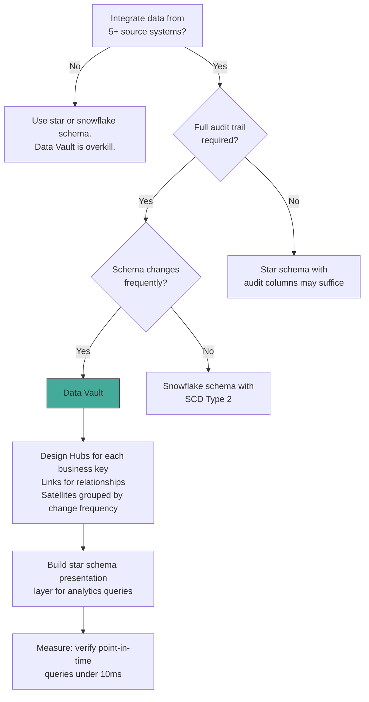

## Navigation

**Domain:** [[8 — Databases]] > **Group:** Database Design & Normalization
**Previous:** [[8.039 Snowflake Schema — Normalized Dimensions]] | **Next:** [[8.041 Wide Tables vs Narrow Tables — Tradeoffs]]

### Prerequisites
- [[8.039 Snowflake Schema — Normalized Dimensions]] — Data Vault extends the normalized-dimension concept with hard separation of keys (Hub), relationships (Link), and context (Satellite)
- [[8.037 Denormalization — When and Why]] — understanding when to normalize vs denormalize provides the tradeoff context for Data Vault's extreme normalization

### Where This Fits

A .NET backend engineer encounters Data Vault when building enterprise data warehouses that must integrate data from multiple source systems with evolving schemas. Data Vault is a detail-oriented, auditable modeling pattern that separates an enterprise data warehouse into three table types: Hubs (business keys), Links (relationships between business keys), and Satellites (descriptive attributes with time context). Production scenarios include: a financial services warehouse that must trace every data point to its source system and timestamp, a healthcare analytics platform that integrates patient data from 50+ source systems with different schemas, or any environment where data lineage and auditability are regulatory requirements. The interview signal is typically mid-to-senior — Data Vault is less common than star/snowflake, but appearing in an interview signals the company has complex data integration needs. Misapplying Data Vault to a simple single-source warehouse adds unnecessary complexity with no benefit.

## Core Mental Model

Data Vault is a modeling methodology that enforces three architectural rules. First, separate business keys from their relationships and from their descriptive attributes — this is the Hub/Link/Satellite split. Second, track every row's source system and load timestamp at the row level. Third, never update data in place — all changes insert new satellite rows (append-only, temporal). The result is a database that can integrate data from any number of source systems without schema redesign, maintain full audit history by default, and rebuild any point-in-time view of the data. The recognition pattern is tables named `Hub_Customer`, `Link_CustomerOrder`, `Sat_Customer_Detail` — the prefix indicates the vault object type.

### Classification

**For enterprise data warehouses (EDW):** The standard pattern for agile, scalable, and auditable EDWs. Works well with 10+ source systems, frequent schema changes, and regulatory compliance needs.

**For departmental data marts:** Overkill. A star or snowflake schema is simpler and sufficient.

**For OLTP systems:** Anti-pattern. Data Vault is for analytics/historical storage, not transactional processing.

**For SQL Server:** Each vault object is a regular table. Performance comes from indexing Hub business keys (unique, hash-based), Link foreign keys, and Satellite load timestamps.

```mermaid
erDiagram
    Hub_Customer {
        int CustomerHash PK
        string CustomerCode BK
        string SourceSystem
        datetime LoadDate
    }
    Hub_Product {
        int ProductHash PK
        string ProductCode BK
        string SourceSystem
        datetime LoadDate
    }
    Hub_Order {
        int OrderHash PK
        string OrderCode BK
        string SourceSystem
        datetime LoadDate
    }
    Link_OrderCustomer {
        int LinkHash PK
        int CustomerHash FK
        int OrderHash FK
        string SourceSystem
        datetime LoadDate
    }
    Link_OrderProduct {
        int LinkHash PK
        int OrderHash FK
        int ProductHash FK
        string SourceSystem
        datetime LoadDate
    }
    Sat_Customer_Detail {
        int CustomerHash FK
        datetime LoadDate
        string CustomerName
        string Email
        string City
        datetime EffectiveFrom
        datetime EffectiveTo
        string SourceSystem
    }
    Sat_Product_Detail {
        int ProductHash FK
        datetime LoadDate
        string ProductName
        string Category
        decimal Price
        datetime EffectiveFrom
        datetime EffectiveTo
        string SourceSystem
    }
    Sat_Order_Detail {
        int OrderHash FK
        datetime LoadDate
        datetime OrderDate
        decimal TotalAmount
        string Status
        datetime EffectiveFrom
        datetime EffectiveTo
        string SourceSystem
    }

    Link_OrderCustomer }o--|| Hub_Customer : ""
    Link_OrderCustomer }o--|| Hub_Order : ""
    Link_OrderProduct }o--|| Hub_Order : ""
    Link_OrderProduct }o--|| Hub_Product : ""
    Sat_Customer_Detail }o--|| Hub_Customer : ""
    Sat_Product_Detail }o--|| Hub_Product : ""
    Sat_Order_Detail }o--|| Hub_Order : ""
```

### Key Properties

|Property|Value|Notes|
|---|---|---|
|Hub|Unique business keys + source tracking|Stores the key only, no descriptive data. Append-only.|
|Link|Relationships between business keys|Many-to-many relationships. Also append-only.|
|Satellite|Descriptive attributes + time context|Stores context for a Hub or Link. Multi-active (SCD Type 2 by insert).|
|Load Pattern|Append-only, never UPDATE|Historical tracking is implicit. Point-in-time queries reconstruct state.|
|Auditability|Full, by design|Every row knows its source system and exact load timestamp.|
|Schema Evolution|Add satellites, never alter existing|New attributes = new satellite table. Existing data untouched.|

## Deep Mechanics

### How the Engine Executes a Data Vault Query

Data Vault is not designed for direct querying. Queries typically go through a presentation layer (star schema on top of the vault). However, point-in-time reconstruction queries directly on the vault are common for data lineage:

```sql
-- Reconstruct customer state as of a specific date:
SELECT
    h.CustomerCode,
    s.CustomerName,
    s.Email,
    s.City
FROM Hub_Customer h
INNER JOIN Sat_Customer_Detail s
    ON h.CustomerHash = s.CustomerHash
    AND @PointInTime >= s.EffectiveFrom
    AND (s.EffectiveTo IS NULL OR @PointInTime < s.EffectiveTo)
WHERE h.CustomerCode = 'CUST-0042';
```

**Execution trace:**

1. **Hub lookup** — Index Seek on Hub_Customer by CustomerCode (hash of key, unique, ~3 reads). Returns the CustomerHash.
2. **Satellite join** — Index Seek on Sat_Customer_Detail by CustomerHash + LoadDate (composite index, ~2 reads). Filters by the effective date range.
3. **Row reconstruction** — The satellite row with the matching EffectiveFrom/EffectiveTo range is selected. If multiple satellites exist (e.g., name changed twice), the query returns the version that was active at the point-in-time.

### SQL Visibility

**EF Core — not suitable for Data Vault queries.** The query pattern (hash key joins, temporal subqueries, point-in-time reconstruction) is too specialized.

```csharp
// Dapper with raw SQL for point-in-time reconstruction:
public async Task<CustomerSnapshot?> GetCustomerAsOfAsync(
    string customerCode, DateTime asOfDate, CancellationToken ct)
{
    const string sql = @"
        SELECT h.CustomerCode, s.CustomerName, s.Email, s.City
        FROM Hub_Customer h
        INNER JOIN Sat_Customer_Detail s
            ON h.CustomerHash = s.CustomerHash
            AND @AsOfDate >= s.EffectiveFrom
            AND (s.EffectiveTo IS NULL OR @AsOfDate < s.EffectiveTo)
        WHERE h.CustomerCode = @CustomerCode;";

    await using var connection = _connectionFactory.Create();
    return await connection.QueryFirstOrDefaultAsync<CustomerSnapshot>(
        new CommandDefinition(sql,
            new { CustomerCode = customerCode, AsOfDate = asOfDate },
            cancellationToken: ct));
}
```

### Execution Plan Analysis

For the point-in-time query on a 500M-row Sat_Customer_Detail table:

```
Nested Loops (Inner Join)
  Index Seek -- Hub_Customer (PK_Hub_Customer) WHERE CustomerCode = 'CUST-0042' -- 1 row, 3 reads
  Index Seek -- Sat_Customer_Detail (IX_Sat_Customer_Detail_CustomerHash_LoadDate)
    WHERE CustomerHash = @Hash AND @AsOfDate >= EffectiveFrom AND (EffectiveTo IS NULL OR @AsOfDate < EffectiveTo) -- 1 row, 3 reads
```

**Key observations:**
- The Hub lookup is a single-row seek by hash key — fast.
- The Satellite temporal filter requires a range scan on the composite index.
- The Nested Loops join is efficient because both sides produce 1 row.
- Without the composite index on (CustomerHash, EffectiveFrom), the satellite query would scan all versions of that customer.

### Cost Visibility

```sql
SET STATISTICS IO ON;

SELECT h.CustomerCode, s.CustomerName, s.Email
FROM Hub_Customer h
INNER JOIN Sat_Customer_Detail s
    ON h.CustomerHash = s.CustomerHash
    AND GETDATE() >= s.EffectiveFrom
    AND (s.EffectiveTo IS NULL OR GETDATE() < s.EffectiveTo)
WHERE h.CustomerCode = 'CUST-0042';

-- Expected output:
-- Table 'Hub_Customer'. Scan count 0, logical reads 3 (index seek)
-- Table 'Sat_Customer_Detail'. Scan count 0, logical reads 4 (index seek, 1 version of 100)
```

### Failure Modes

**1. Missing satellite temporal index — full scan of all versions for a single key lookup.**

Without `CREATE INDEX IX_Sat_Customer_Detail_CustomerHash_EffectiveFrom ON Sat_Customer_Detail(CustomerHash, EffectiveFrom) INCLUDE (CustomerName, Email, City)`, the query scans all versions of that customer's satellite rows to find the matching effective date range.

**2. Loading satellites without effective date validation — overlapping date ranges.**

If two satellite rows for the same CustomerHash have overlapping EffectiveFrom/EffectiveTo ranges, the point-in-time query returns two rows (one correct, one stale). The ETL process must ensure no gaps or overlaps.

**3. Querying the vault directly for analytics (no presentation layer aggregation).**

Data Vault is highly normalized (6NF equivalent). Aggregation queries require joining through multiple Hub → Link → Hub → Satellite chains — 6+ JOINs for a simple report. Always build a star schema presentation layer on top of the vault.

## Production Patterns and Implementation

### Primary SQL Implementation

```sql
-- =============================================
-- Data Vault Core Tables
-- =============================================

-- Hub: Customer (business key = CustomerCode)
CREATE TABLE Hub_Customer (
    CustomerHash    BINARY(32)      NOT NULL,  -- SHA-256 hash of CustomerCode
    CustomerCode    VARCHAR(50)     NOT NULL,
    SourceSystem    VARCHAR(50)     NOT NULL,
    LoadDate        DATETIME2       NOT NULL DEFAULT SYSUTCDATETIME(),
    CONSTRAINT PK_Hub_Customer PRIMARY KEY (CustomerHash)
);

CREATE UNIQUE INDEX IX_Hub_Customer_CustomerCode ON Hub_Customer(CustomerCode);

-- Hub: Product (business key = ProductCode)
CREATE TABLE Hub_Product (
    ProductHash     BINARY(32)      NOT NULL,
    ProductCode     VARCHAR(50)     NOT NULL,
    SourceSystem    VARCHAR(50)     NOT NULL,
    LoadDate        DATETIME2       NOT NULL DEFAULT SYSUTCDATETIME(),
    CONSTRAINT PK_Hub_Product PRIMARY KEY (ProductHash)
);

CREATE UNIQUE INDEX IX_Hub_Product_ProductCode ON Hub_Product(ProductCode);

-- Hub: Order (business key = OrderCode)
CREATE TABLE Hub_Order (
    OrderHash       BINARY(32)      NOT NULL,
    OrderCode       VARCHAR(50)     NOT NULL,
    SourceSystem    VARCHAR(50)     NOT NULL,
    LoadDate        DATETIME2       NOT NULL DEFAULT SYSUTCDATETIME(),
    CONSTRAINT PK_Hub_Order PRIMARY KEY (OrderHash)
);

CREATE UNIQUE INDEX IX_Hub_Order_OrderCode ON Hub_Order(OrderCode);

-- Link: Customer-Order relationship (many-to-many)
CREATE TABLE Link_OrderCustomer (
    LinkHash        BINARY(32)      NOT NULL,  -- SHA-256 of (CustomerHash + OrderHash)
    CustomerHash    BINARY(32)      NOT NULL,
    OrderHash       BINARY(32)      NOT NULL,
    SourceSystem    VARCHAR(50)     NOT NULL,
    LoadDate        DATETIME2       NOT NULL DEFAULT SYSUTCDATETIME(),
    CONSTRAINT PK_Link_OrderCustomer PRIMARY KEY (LinkHash),
    CONSTRAINT FK_Link_OrderCustomer_Customer FOREIGN KEY (CustomerHash)
        REFERENCES Hub_Customer(CustomerHash),
    CONSTRAINT FK_Link_OrderCustomer_Order FOREIGN KEY (OrderHash)
        REFERENCES Hub_Order(OrderHash)
);

CREATE INDEX IX_Link_OrderCustomer_CustomerHash ON Link_OrderCustomer(CustomerHash);
CREATE INDEX IX_Link_OrderCustomer_OrderHash ON Link_OrderCustomer(OrderHash);

-- Satellite: Customer detail attributes
CREATE TABLE Sat_Customer_Detail (
    CustomerHash    BINARY(32)      NOT NULL,
    LoadDate        DATETIME2       NOT NULL DEFAULT SYSUTCDATETIME(),
    CustomerName    VARCHAR(200)    NOT NULL,
    Email           VARCHAR(200)    NULL,
    City            VARCHAR(100)    NULL,
    EffectiveFrom   DATETIME2       NOT NULL,
    EffectiveTo     DATETIME2       NULL,  -- NULL = current
    SourceSystem    VARCHAR(50)     NOT NULL,
    CONSTRAINT FK_Sat_Customer_Detail_Customer FOREIGN KEY (CustomerHash)
        REFERENCES Hub_Customer(CustomerHash)
);

CREATE INDEX IX_Sat_Customer_Detail_CustomerHash_EffectiveFrom
    ON Sat_Customer_Detail(CustomerHash, EffectiveFrom DESC)
    INCLUDE (CustomerName, Email, City);

-- Satellite: Order detail attributes
CREATE TABLE Sat_Order_Detail (
    OrderHash       BINARY(32)      NOT NULL,
    LoadDate        DATETIME2       NOT NULL DEFAULT SYSUTCDATETIME(),
    OrderDate       DATETIME2       NOT NULL,
    TotalAmount     DECIMAL(12,2)   NOT NULL,
    Status          VARCHAR(50)     NOT NULL,
    EffectiveFrom   DATETIME2       NOT NULL,
    EffectiveTo     DATETIME2       NULL,
    SourceSystem    VARCHAR(50)     NOT NULL,
    CONSTRAINT FK_Sat_Order_Detail_Order FOREIGN KEY (OrderHash)
        REFERENCES Hub_Order(OrderHash)
);

CREATE INDEX IX_Sat_Order_Detail_OrderHash_EffectiveFrom
    ON Sat_Order_Detail(OrderHash, EffectiveFrom DESC)
    INCLUDE (OrderDate, TotalAmount, Status);

-- Point-in-time query: customer orders as of a specific date
DECLARE @AsOfDate DATETIME2 = '2026-06-01';

SELECT
    h.CustomerCode,
    s.CustomerName,
    o.OrderCode,
    od.OrderDate,
    od.TotalAmount
FROM Hub_Customer h
INNER JOIN Sat_Customer_Detail s
    ON h.CustomerHash = s.CustomerHash
    AND @AsOfDate >= s.EffectiveFrom
    AND (s.EffectiveTo IS NULL OR @AsOfDate < s.EffectiveTo)
INNER JOIN Link_OrderCustomer loc
    ON h.CustomerHash = loc.CustomerHash
INNER JOIN Hub_Order o
    ON loc.OrderHash = o.OrderHash
INNER JOIN Sat_Order_Detail od
    ON o.OrderHash = od.OrderHash
    AND @AsOfDate >= od.EffectiveFrom
    AND (od.EffectiveTo IS NULL OR @AsOfDate < od.EffectiveTo)
WHERE h.CustomerCode = 'CUST-0042';
```

### EF Core Implementation

EF Core can manage Data Vault tables but the hash computation and temporal queries are better handled with raw SQL:

```csharp
public class DataVaultDbContext : DbContext
{
    public DbSet<HubCustomer> HubCustomers => Set<HubCustomer>();
    public DbSet<HubOrder> HubOrders => Set<HubOrder>();
    public DbSet<LinkOrderCustomer> LinkOrderCustomers => Set<LinkOrderCustomer>();
    public DbSet<SatCustomerDetail> SatCustomerDetails => Set<SatCustomerDetail>();

    protected override void OnModelCreating(ModelBuilder modelBuilder)
    {
        modelBuilder.Entity<HubCustomer>(entity =>
        {
            entity.ToTable("Hub_Customer");
            entity.HasKey(e => e.CustomerHash);
            entity.HasIndex(e => e.CustomerCode).IsUnique();
        });

        modelBuilder.Entity<LinkOrderCustomer>(entity =>
        {
            entity.ToTable("Link_OrderCustomer");
            entity.HasKey(e => e.LinkHash);
            entity.HasIndex(e => e.CustomerHash);
            entity.HasIndex(e => e.OrderHash);
        });

        modelBuilder.Entity<SatCustomerDetail>(entity =>
        {
            entity.ToTable("Sat_Customer_Detail");
            entity.HasKey(e => new { e.CustomerHash, e.LoadDate });
        });
    }
}

// Hash computation helper
public static class DataVaultHash
{
    public static byte[] ComputeHash(string input)
    {
        using var sha256 = System.Security.Cryptography.SHA256.Create();
        return sha256.ComputeHash(Encoding.UTF8.GetBytes(input.ToUpperInvariant()));
    }
}
```

### Dapper Implementation

```csharp
public record HubCustomer(byte[] CustomerHash, string CustomerCode, string SourceSystem, DateTime LoadDate);

public interface IDataVaultRepository
{
    Task InsertHubAsync(HubCustomer hub, CancellationToken ct);
    Task<CustomerSnapshot?> GetCustomerAsOfAsync(string customerCode, DateTime asOfDate, CancellationToken ct);
}

public class DataVaultRepository : IDataVaultRepository
{
    private readonly IDbConnectionFactory _connectionFactory;

    public DataVaultRepository(IDbConnectionFactory connectionFactory)
    {
        _connectionFactory = connectionFactory;
    }

    public async Task InsertHubAsync(HubCustomer hub, CancellationToken ct)
    {
        const string sql = @"
            INSERT INTO Hub_Customer (CustomerHash, CustomerCode, SourceSystem, LoadDate)
            VALUES (@CustomerHash, @CustomerCode, @SourceSystem, @LoadDate);";

        await using var connection = _connectionFactory.Create();
        await connection.ExecuteAsync(
            new CommandDefinition(sql, hub, cancellationToken: ct));
    }

    public async Task<CustomerSnapshot?> GetCustomerAsOfAsync(
        string customerCode, DateTime asOfDate, CancellationToken ct)
    {
        const string sql = @"
            SELECT h.CustomerCode, s.CustomerName, s.Email, s.City
            FROM Hub_Customer h
            INNER JOIN Sat_Customer_Detail s
                ON h.CustomerHash = s.CustomerHash
                AND @AsOfDate >= s.EffectiveFrom
                AND (s.EffectiveTo IS NULL OR @AsOfDate < s.EffectiveTo)
            WHERE h.CustomerCode = @CustomerCode;";

        await using var connection = _connectionFactory.Create();
        return await connection.QueryFirstOrDefaultAsync<CustomerSnapshot>(
            new CommandDefinition(sql,
                new { CustomerCode = customerCode, AsOfDate = asOfDate },
                cancellationToken: ct));
    }
}
```

### Configuration and Wiring

```csharp
builder.Services.AddSingleton<IDbConnectionFactory>(_ =>
    new SqlConnectionFactory(builder.Configuration.GetConnectionString("DataVault")));
builder.Services.AddScoped<IDataVaultRepository, DataVaultRepository>();
```

### SQL Server vs PostgreSQL Differences

Data Vault is methodology-agnostic; both databases support the pattern. Key differences:

```sql
-- PostgreSQL: use BYTEA for hash, UUID as natural hash alternative
CREATE TABLE Hub_Customer (
    CustomerHash    BYTEA           NOT NULL,  -- SHA-256
    CustomerCode    VARCHAR(50)     NOT NULL,
    SourceSystem    VARCHAR(50)     NOT NULL,
    LoadDate        TIMESTAMPTZ     NOT NULL DEFAULT NOW(),
    CONSTRAINT PK_Hub_Customer PRIMARY KEY (CustomerHash)
);

-- PostgreSQL alternative: use UUID as hash (smaller, faster for lookups)
CREATE EXTENSION IF NOT EXISTS "uuid-ossp";
SELECT uuid_generate_v5(uuid_ns_oid('customer'::regclass), 'CUST-0042');
-- Namespace-based UUID instead of SHA-256 binary hash
```

## Gotchas and Production Pitfalls

### 1. Querying the Vault Directly for Analytics

**Pitfall:** Running aggregation queries directly against the vault tables instead of building a presentation layer (star schema) on top.

```sql
-- Aggregation query against raw vault (6+ JOINs):
SELECT s.City, SUM(od.TotalAmount) AS Revenue
FROM Hub_Customer h
INNER JOIN Sat_Customer_Detail s ON h.CustomerHash = s.CustomerHash AND s.EffectiveTo IS NULL
INNER JOIN Link_OrderCustomer loc ON h.CustomerHash = loc.CustomerHash
INNER JOIN Hub_Order o ON loc.OrderHash = o.OrderHash
INNER JOIN Sat_Order_Detail od ON o.OrderHash = od.OrderHash AND od.EffectiveTo IS NULL
INNER JOIN Link_OrderProduct lop ON o.OrderHash = lop.OrderHash
INNER JOIN Hub_Product p ON lop.ProductHash = p.ProductHash
INNER JOIN Sat_Product_Detail sp ON p.ProductHash = sp.ProductHash AND sp.EffectiveTo IS NULL
WHERE sp.Category = '"'"'Electronics'"'"'
GROUP BY s.City;
```

**Symptom:** Query runs for minutes on a vault with 500M rows. Execution plan shows 8+ JOINs, multiple scans of satellite temporal indexes.

**Fix:** Build a star schema presentation layer. ETL from vault to star is fast (append-only vault ensures no reconciliation needed):

```sql
-- Create presentation layer (star schema)
CREATE VIEW V_FactSales AS
SELECT
    o.OrderCode,
    h.CustomerCode,
    p.ProductCode,
    od.OrderDate,
    od.TotalAmount,
    s.City,
    sp.Category
FROM Hub_Order o
INNER JOIN Sat_Order_Detail od ON o.OrderHash = od.OrderHash AND od.EffectiveTo IS NULL
INNER JOIN Link_OrderCustomer loc ON o.OrderHash = loc.OrderHash
INNER JOIN Hub_Customer h ON loc.CustomerHash = h.CustomerHash
INNER JOIN Sat_Customer_Detail s ON h.CustomerHash = s.CustomerHash AND s.EffectiveTo IS NULL
INNER JOIN Link_OrderProduct lop ON o.OrderHash = lop.OrderHash
INNER JOIN Hub_Product p ON lop.ProductHash = p.ProductHash
INNER JOIN Sat_Product_Detail sp ON p.ProductHash = sp.ProductHash AND sp.EffectiveTo IS NULL;
```

**Cost of not fixing:** Analytics queries take 10-50x longer than necessary. Users complain about dashboard performance. The vault is blamed, but the real problem is querying at the wrong abstraction layer.

### 2. Hash Collisions on Business Keys

**Pitfall:** Using a hash function (e.g., MD5, truncated SHA-256) that can produce collisions for different business keys.

**Symptom:** Two different customers with different CustomerCodes map to the same CustomerHash. Data integrity is silently corrupted — the Link and Satellite rows for both customers point to the same Hub row.

**Fix:** Use full SHA-256 (32 bytes). For integer surrogate keys, skip hashing and use the key directly:
```sql
-- For small business keys (integers), use direct key instead of hash:
CREATE TABLE Hub_Customer (
    CustomerKey     INT             NOT NULL,  -- direct from source
    CustomerCode    VARCHAR(50)     NOT NULL,
    ...
);
CREATE UNIQUE INDEX IX_Hub_Customer_CustomerCode ON Hub_Customer(CustomerCode);
```

**Cost of not fixing:** Data corruption that is extremely hard to detect. Reconciliation reports show different customers with the same attributes.

### 3. Satellite Temporal Index Missing

**Pitfall:** Not creating the composite index on (HubHash, EffectiveFrom DESC) for satellite temporal queries.

```sql
-- Missing index leads to:
-- Table '"'"'Sat_Customer_Detail'"'"'. Scan count 1, logical reads 45,000
-- Instead of:
-- Table '"'"'Sat_Customer_Detail'"'"'. Scan count 0, logical reads 4
```

**Symptom:** Point-in-time queries for a single customer scan all versions of all customers.

**Fix:**
```sql
CREATE INDEX IX_Sat_Customer_Detail_CustomerHash_EffectiveFrom
    ON Sat_Customer_Detail(CustomerHash, EffectiveFrom DESC)
    INCLUDE (CustomerName, Email, City);
```

**Cost of not fixing:** Every point-in-time query scans the full satellite table. At 1M customers with average 10 versions each (10M satellite rows), a single customer lookup scans 10M rows instead of reading 3 index pages.

### 4. Overlapping Satellite Date Ranges

**Pitfall:** ETL loading a new satellite version without closing the previous version's EffectiveTo, or closing it after the new version's EffectiveFrom.

**Symptom:** Point-in-time queries return two rows for the same customer — one stale, one current. The query uses whichever row is returned first by the index.

**Fix:** Use a sequenced ETL pattern:

```sql
-- Close previous version, insert new version in one transaction:
BEGIN TRANSACTION;
    UPDATE Sat_Customer_Detail
    SET EffectiveTo = @NewEffectiveFrom
    WHERE CustomerHash = @CustomerHash
      AND EffectiveTo IS NULL;

    INSERT INTO Sat_Customer_Detail (CustomerHash, LoadDate, CustomerName, Email, City, EffectiveFrom, SourceSystem)
    VALUES (@CustomerHash, SYSUTCDATETIME(), @NewName, @NewEmail, @NewCity, @NewEffectiveFrom, @SourceSystem);
COMMIT;
```

**Cost of not fixing:** Inconsistent reports. Auditors flag the data quality issue.

### 5. Hub Without Unique Key on Business Code

**Pitfall:** Making CustomerHash the only unique constraint and not having a unique index on the business key (CustomerCode).

**Symptom:** Two rows in Hub_Customer with the same CustomerCode but different CustomerHashes (from different source systems, or from a hash collision). The ETL loads duplicates.

**Fix:**
```sql
CREATE UNIQUE INDEX IX_Hub_Customer_CustomerCode ON Hub_Customer(CustomerCode);
```

**Cost of not fixing:** Duplicate business keys in the hub. Links and satellites reference different hash keys. The business key is no longer a reliable identifier.

### 6. Over-Normalization — Creating Satellites for Every Column

**Pitfall:** Creating a separate satellite table for each attribute or attribute group, even for attributes that change together.

**Symptom:** A single customer has 15 satellite tables (Sat_Customer_Name, Sat_Customer_Email, Sat_Customer_Address, Sat_Customer_Phone...). A point-in-time query needs 15 JOINs to reconstruct the full customer record.

**Fix:** Group attributes by change frequency. Static attributes (birth date, gender) go in one satellite. Slow-changing attributes (address, phone) in another. Fast-changing (status, segment) in a third. Never create a satellite per column.

**Cost of not fixing:** Query complexity explosion. 10+ satellites per hub means 10 JOINs per entity in every query. The presentation layer becomes unmanageable.

## Performance Implications

### Benchmark: Point-in-Time Query with and without Temporal Index

```sql
SET STATISTICS IO ON;

-- Without temporal index (full scan of satellite):
SELECT h.CustomerCode, s.CustomerName
FROM Hub_Customer h
INNER JOIN Sat_Customer_Detail s ON h.CustomerHash = s.CustomerHash
    AND GETDATE() >= s.EffectiveFrom AND (s.EffectiveTo IS NULL OR GETDATE() < s.EffectiveTo)
WHERE h.CustomerCode = '"'"'CUST-0042'"'"';
-- Logical reads: 45,003 (satellite) + 3 (hub) = 45,006

-- With temporal index:
-- Logical reads: 4 (satellite) + 3 (hub) = 7
```

**Improvement:** ~6,400x reduction in logical reads for point-in-time queries.

### Write Amplification

|Operation|3NF (SCD Type 1)|Data Vault|Difference|
|---|---|---|---|
|INSERT new customer|1 row in Customers|2 rows (Hub + Sat)|+1 row|
|UPDATE customer name|1 row UPDATE|1 row INSERT in Sat|Insert-only (no UPDATE)|
|DELETE customer|1 row DELETE|1 row INSERT in Sat (EffectiveTo = now)|No physical delete|
|Add new attribute|ALTER TABLE (schema change)|CREATE new satellite table|No existing data impact|
|Audit query (history)|Not available|Point-in-time query on Sat|Full history by default|

### BenchmarkDotNet

```csharp
[MemoryDiagnoser]
[SimpleJob(RuntimeMoniker.Net90)]
public class DataVaultLoadBenchmark
{
    private IDbConnection _connection = default!;

    [GlobalSetup]
    public void Setup()
    {
        _connection = new SqlConnection("Server=.;Database=DataVault;Trusted_Connection=True;");
    }

    [Benchmark(Baseline = true)]
    public async Task InsertCustomer_3NF()
    {
        await _connection.ExecuteAsync(@"
            INSERT INTO Customers (CustomerCode, CustomerName, Email, City)
            VALUES (@Code, @Name, @Email, @City);",
            new { Code = "CUST-TEST", Name = "Test", Email = "test@x.com", City = "NYC" });
    }

    [Benchmark]
    public async Task InsertCustomer_DataVault()
    {
        var hash = DataVaultHash.ComputeHash("CUST-TEST");
        await _connection.ExecuteAsync(@"
            INSERT INTO Hub_Customer (CustomerHash, CustomerCode, SourceSystem, LoadDate)
            VALUES (@Hash, 'CUST-TEST', 'BENCHMARK', SYSUTCDATETIME());
            INSERT INTO Sat_Customer_Detail (CustomerHash, LoadDate, CustomerName, Email, City, EffectiveFrom, SourceSystem)
            VALUES (@Hash, SYSUTCDATETIME(), 'Test', 'test@x.com', 'NYC', SYSUTCDATETIME(), 'BENCHMARK');",
            new { Hash = hash });
    }
}
```

**Expected results (1M rows):**

|Method|Mean|Allocated|
|---|---|---|
|InsertCustomer_3NF|~2 ms|5 KB|
|InsertCustomer_DataVault|~3 ms|8 KB|

### Storage Overhead (History)

|History Depth|3NF (SCD Type 1)|Data Vault|
|---|---|---|
|No history (current only)|1 row per customer|2 rows (1 Hub + 1 Sat)|
|10 versions per customer|1 row (overwritten)|11 rows (1 Hub + 10 Sat)|
|100 versions per customer|1 row|101 rows|

## Interview Arsenal

### Question Bank

1. What are the three core table types in Data Vault and what does each store?
2. When would you choose Data Vault over star or snowflake schema?
3. How does Data Vault handle slowly changing dimensions?
4. What is the query performance cost of Data Vault vs star schema?
5. What index is required on a satellite table for point-in-time queries?
6. Data Vault vs 3NF — what are the tradeoffs?
7. How does hash key collision affect a Data Vault implementation?
8. How do you load data into a Data Vault in .NET?

### Spoken Answers

**Q: What are the three core table types in Data Vault and what does each store?**

> **Average answer:** Hubs store business keys, Links store relationships, Satellites store attributes.

> **Great answer:** Hubs store unique business keys — the natural identifiers from source systems — along with metadata about the source and load timestamp. A Hub has exactly one unique business key per row and nothing else descriptive. Links store associations between business keys — typically many-to-many relationships between Hubs. A Link contains only the foreign keys (hashes) to the related Hubs plus source metadata. Links are the only way to connect Hubs. Satellites store the descriptive attributes and temporal context. Each Satellite belongs to one Hub or one Link and stores the effective date range, source system, and all historical versions. The split ensures that a business key is defined once (Hub), relationships are tracked independently from the key (Link), and attribute changes are recorded as new rows (Satellite) without affecting the key or relationships.

**Q: When would you choose Data Vault over star or snowflake schema?**

> **Average answer:** Data Vault is for large enterprise data warehouses with many source systems. Star/snowflake is for simpler warehouses.

> **Great answer:** I choose Data Vault when three conditions are met: (1) the warehouse integrates data from 5+ source systems with independent schemas that change frequently, (2) full auditability and data lineage are regulatory requirements — every data point must trace to its source and load timestamp, and (3) the warehouse must support point-in-time reconstruction of any business entity at any point in history. The key advantage is schema-on-write flexibility: adding a new attribute from a new source system means creating a new satellite table without altering any existing table. The cost is query complexity — you cannot query the vault directly for analytics. You must build a star schema presentation layer on top. For a simple single-source warehouse with stable schemas and no audit requirements, I use star schema. Data Vault adds complexity with no benefit in that scenario.

### Interview Trigger

Data Vault appears in interviews at companies with complex data integration needs — typically finance, healthcare, and large e-commerce. The trigger question is "How would you design a data warehouse that must track the full history of customer data from 20 different source systems where each source has a different schema?" The follow-up is "How do you handle a new attribute being added by one source without affecting other sources?" The deep follow-up is "How does your query performance compare to a star schema for a simple daily sales report?"

### Comparison Table

| | Data Vault | Star Schema | 3NF |
|---|---|---|---|
| Normalization level | 6NF (extreme) | 2NF (denormalized dims) | 3NF |
| Auditability | Full (by design) | Minimal (no tracking) | Minimal |
| Schema evolution | Add satellites only | Alter table (may need full rebuild) | Alter table |
| Query performance | Slow (direct), fast (presentation) | Fast (single JOIN per dim) | Moderate |
| ETL complexity | Moderate (hub/link/sat loading) | Simple (dim + fact load) | Simple |
| Point-in-time history | Native (temporal satellites) | Not supported (SCD workaround) | Not supported |
| Source system tracking | Per-row metadata | Not tracked | Not tracked |

## Decision Framework

### When to Apply



### Application Checklist

- [ ] The warehouse integrates data from 5+ source systems
- [ ] Auditability and data lineage are regulatory or business requirements
- [ ] Schema evolution (new attributes from source systems) occurs frequently
- [ ] Point-in-time reconstruction of historical state is required
- [ ] A dedicated ETL team exists to manage vault loading
- [ ] A presentation layer (star schema) will be built on top for analytics
- [ ] Hash key collision risk is mitigated (full SHA-256 or natural keys)
- [ ] Satellite temporal indexes are planned for point-in-time query performance

### Tradeoff Summary

|What You Gain|What You Pay|
|---|---|
|Full auditability and data lineage|Query complexity (6+ JOINs for simple lookups)|
|Schema-on-write flexibility (add satellites)|Presentation layer required (star on top)|
|No data loss (append-only)|Storage growth (every change is a new row)|
|Resilient to source system schema changes|Up to 10x more tables than star schema|
|Point-in-time reconstruction by default|ETL complexity (hash computation, temporal management)|

### Scale Thresholds

- "Data Vault becomes beneficial when integrating data from 5+ source systems with independent schemas."
- "Point-in-time satellite index is critical above ~1M satellite rows per hub — without it, temporal queries scan millions of rows."
- "Presentation layer on top of vault is required for any analytical query that aggregates more than 10 rows — direct vault queries are for data lineage only."
- "Storage grows linearly with history depth: 10 versions per entity = 10x satellite rows vs a star schema's 1 row."
- "Data Vault is overkill for warehouses under ~1 TB or with fewer than 5 source systems."

## Self-Check

### Conceptual Questions

1. What are the three Data Vault table types and what does each store?
2. How does a Data Vault point-in-time query work at the engine level?
3. Which index makes satellite temporal queries efficient?
4. What happens when you query the vault directly for an analytical aggregation?
5. Should you use EF Core for Data Vault queries?
6. How would you load data into a Data Vault in .NET?
7. Data Vault vs star schema — what problem does each solve?
8. At what number of source systems does Data Vault become beneficial?
9. What index supports a satellite temporal BETWEEN filter?
10. Explain Data Vault in 60 seconds, including when you would and would NOT use it.

<details>
<summary>Answers</summary>

1. Hubs store unique business keys (natural identifiers) and source metadata. Links store many-to-many relationships between Hubs. Satellites store descriptive attributes with effective date ranges and source tracking.
2. The engine seeks the Hub by business key (hash index seek, ~3 reads), then seeks the Satellite by HubHash + EffectiveFrom (composite index seek with range filter, ~3 reads). The temporal filter (EffectiveFrom <= @AsOfDate AND (EffectiveTo IS NULL OR EffectiveTo > @AsOfDate)) selects the correct version. Without the composite index, the satellite look up scans all versions of the entity.
3. `CREATE INDEX IX_Sat_[HubName]_HubHash_EffectiveFrom ON Sat_[HubName]([HubName]Hash, EffectiveFrom DESC) INCLUDE (all attribute columns)`.
4. The aggregation requires 6+ JOINs across multiple Hubs, Links, and Satellites, each with temporal filters. The execution plan shows a deep tree of Nested Loops and Hash Matches. Query duration increases 10-50x compared to an equivalent star schema.
5. No. Use Dapper with raw SQL. EF Core cannot efficiently express the temporal JOIN pattern and generates suboptimal subqueries.
6. Compute hash keys from business keys, then INSERT into Hub (deduplicate by business key), then INSERT into Link (deduplicate by relationship hash), then INSERT into Satellite (insert new version, close previous version). Use SqlBulkCopy for batch loads into staging tables, then merge into vault tables.
7. Data Vault solves enterprise data integration with auditability and schema flexibility. Star schema solves analytical query performance with a simple JOIN pattern. They complement each other: Data Vault is the raw storage layer, star is the presentation layer on top.
8. Data Vault becomes beneficial when integrating data from 5+ source systems with independent schemas. Below 5 sources, the complexity of the vault is not justified.
9. The composite index on (HubHash, EffectiveFrom DESC) INCLUDE (attribute columns). The EffectiveFrom DESC order supports the range filter `@AsOfDate >= EffectiveFrom`.
10. "Data Vault is an enterprise data warehouse modeling pattern with three table types: Hubs for business keys, Links for relationships, and Satellites for time-bound attributes. Every row tracks its source system and load timestamp. The pattern is append-only — no data is ever overwritten. I use it when integrating 5+ source systems with frequently changing schemas and full auditability requirements. I build a star schema presentation layer on top for analytical queries. I would NOT use it for a simple single-source warehouse — star schema is simpler and sufficient. In .NET, I use Dapper with raw SQL for vault operations, never EF Core."

</details>

---

### Query Challenges

**Challenge 1 -- Write the SQL**

Design the Data Vault tables for a healthcare data warehouse that tracks patients, providers, and appointments. Patients come from 3 source systems (each with different patient ID formats). Providers come from 2 source systems. Appointments relate patients to providers at a specific date/time. Write the CREATE TABLE statements for Hub_Patient, Hub_Provider, Hub_Appointment, Link_AppointmentPatientProvider, and Sat_Patient_Detail, Sat_Appointment_Detail.

<details>
<summary>Solution</summary>

```sql
-- Hub: Patient
CREATE TABLE Hub_Patient (
    PatientHash   BINARY(32)  NOT NULL,
    PatientCode   VARCHAR(100) NOT NULL,  -- normalized patient ID across sources
    SourceSystem  VARCHAR(50) NOT NULL,
    LoadDate      DATETIME2   NOT NULL DEFAULT SYSUTCDATETIME(),
    CONSTRAINT PK_Hub_Patient PRIMARY KEY (PatientHash)
);
CREATE UNIQUE INDEX IX_Hub_Patient_PatientCode ON Hub_Patient(PatientCode);

-- Hub: Provider
CREATE TABLE Hub_Provider (
    ProviderHash  BINARY(32)  NOT NULL,
    ProviderCode  VARCHAR(100) NOT NULL,
    SourceSystem  VARCHAR(50) NOT NULL,
    LoadDate      DATETIME2   NOT NULL DEFAULT SYSUTCDATETIME(),
    CONSTRAINT PK_Hub_Provider PRIMARY KEY (ProviderHash)
);
CREATE UNIQUE INDEX IX_Hub_Provider_ProviderCode ON Hub_Provider(ProviderCode);

-- Hub: Appointment (business key = source appointment ID)
CREATE TABLE Hub_Appointment (
    AppointmentHash   BINARY(32)   NOT NULL,
    AppointmentCode   VARCHAR(100) NOT NULL,
    SourceSystem      VARCHAR(50)  NOT NULL,
    LoadDate          DATETIME2    NOT NULL DEFAULT SYSUTCDATETIME(),
    CONSTRAINT PK_Hub_Appointment PRIMARY KEY (AppointmentHash)
);
CREATE UNIQUE INDEX IX_Hub_Appointment_AppointmentCode ON Hub_Appointment(AppointmentCode);

-- Link: Appointment-Patient-Provider relationship
CREATE TABLE Link_AppointmentPatientProvider (
    LinkHash         BINARY(32)  NOT NULL,
    AppointmentHash  BINARY(32)  NOT NULL,
    PatientHash      BINARY(32)  NOT NULL,
    ProviderHash     BINARY(32)  NOT NULL,
    SourceSystem     VARCHAR(50) NOT NULL,
    LoadDate         DATETIME2   NOT NULL DEFAULT SYSUTCDATETIME(),
    CONSTRAINT PK_Link_AppointmentPatientProvider PRIMARY KEY (LinkHash),
    CONSTRAINT FK_Link_Appointment FOREIGN KEY (AppointmentHash) REFERENCES Hub_Appointment(AppointmentHash),
    CONSTRAINT FK_Link_Patient FOREIGN KEY (PatientHash) REFERENCES Hub_Patient(PatientHash),
    CONSTRAINT FK_Link_Provider FOREIGN KEY (ProviderHash) REFERENCES Hub_Provider(ProviderHash)
);
CREATE INDEX IX_Link_AppointmentPatientProvider_Appointment ON Link_AppointmentPatientProvider(AppointmentHash);
CREATE INDEX IX_Link_AppointmentPatientProvider_Patient ON Link_AppointmentPatientProvider(PatientHash);

-- Satellite: Patient attributes
CREATE TABLE Sat_Patient_Detail (
    PatientHash     BINARY(32)  NOT NULL,
    LoadDate        DATETIME2   NOT NULL DEFAULT SYSUTCDATETIME(),
    PatientName     VARCHAR(200) NOT NULL,
    DateOfBirth     DATE        NOT NULL,
    Gender          CHAR(1)     NULL,
    InsuranceId     VARCHAR(50) NULL,
    EffectiveFrom   DATETIME2   NOT NULL,
    EffectiveTo     DATETIME2   NULL,
    SourceSystem    VARCHAR(50) NOT NULL,
    CONSTRAINT FK_Sat_Patient_Detail_Patient FOREIGN KEY (PatientHash) REFERENCES Hub_Patient(PatientHash)
);
CREATE INDEX IX_Sat_Patient_Detail_Hash_EffectiveFrom
    ON Sat_Patient_Detail(PatientHash, EffectiveFrom DESC)
    INCLUDE (PatientName, DateOfBirth, Gender, InsuranceId);

-- Satellite: Appointment attributes
CREATE TABLE Sat_Appointment_Detail (
    AppointmentHash  BINARY(32)   NOT NULL,
    LoadDate         DATETIME2    NOT NULL DEFAULT SYSUTCDATETIME(),
    AppointmentDate  DATETIME2    NOT NULL,
    AppointmentType  VARCHAR(100) NOT NULL,
    Status           VARCHAR(50)  NOT NULL,
    Notes            VARCHAR(MAX) NULL,
    EffectiveFrom    DATETIME2    NOT NULL,
    EffectiveTo      DATETIME2    NULL,
    SourceSystem     VARCHAR(50)  NOT NULL,
    CONSTRAINT FK_Sat_Appointment_Detail_Appt FOREIGN KEY (AppointmentHash) REFERENCES Hub_Appointment(AppointmentHash)
);
CREATE INDEX IX_Sat_Appointment_Detail_Hash_EffectiveFrom
    ON Sat_Appointment_Detail(AppointmentHash, EffectiveFrom DESC)
    INCLUDE (AppointmentDate, AppointmentType, Status);
```

**Point-in-time query -- get patient appointments as of a specific date:**

```sql
DECLARE @AsOfDate DATETIME2 = '2026-06-01';
DECLARE @PatientCode VARCHAR(100) = 'PAT-0042';

SELECT
    p.PatientName,
    a.AppointmentCode,
    ad.AppointmentDate,
    ad.AppointmentType,
    ad.Status
FROM Hub_Patient hp
INNER JOIN Sat_Patient_Detail p
    ON hp.PatientHash = p.PatientHash
    AND @AsOfDate >= p.EffectiveFrom
    AND (p.EffectiveTo IS NULL OR @AsOfDate < p.EffectiveTo)
INNER JOIN Link_AppointmentPatientProvider lap
    ON hp.PatientHash = lap.PatientHash
INNER JOIN Hub_Appointment ha
    ON lap.AppointmentHash = ha.AppointmentHash
INNER JOIN Sat_Appointment_Detail ad
    ON ha.AppointmentHash = ad.AppointmentHash
    AND @AsOfDate >= ad.EffectiveFrom
    AND (ad.EffectiveTo IS NULL OR @AsOfDate < ad.EffectiveTo)
WHERE hp.PatientCode = @PatientCode;
```

</details>

---

**Challenge 2 -- Fix the performance problem**

```sql
-- This point-in-time query takes 12 seconds:
SELECT h.CustomerCode, s.CustomerName, s.Email
FROM Hub_Customer h
INNER JOIN Sat_Customer_Detail s ON h.CustomerHash = s.CustomerHash
    AND GETDATE() >= s.EffectiveFrom
    AND (s.EffectiveTo IS NULL OR GETDATE() < s.EffectiveTo)
WHERE h.CustomerCode = '"'"'CUST-0042'"'"';

-- SET STATISTICS IO:
-- Table '"'"'Hub_Customer'"'"'. logical reads 3
-- Table '"'"'Sat_Customer_Detail'"'"'. logical reads 450,000
```
<details> <summary>Solution**

**Root cause:** The satellite table has no composite index on (CustomerHash, EffectiveFrom). The query scans all 450K pages of Sat_Customer_Detail to find the single matching row for CustomerHash = hash('CUST-0042').

**Fix:**

```sql
CREATE INDEX IX_Sat_Customer_Detail_Hash_EffectiveFrom
    ON Sat_Customer_Detail(CustomerHash, EffectiveFrom DESC)
    INCLUDE (CustomerName, Email)
    WHERE EffectiveTo IS NULL OR EffectiveTo > GETDATE();
```

**After fix -- logical reads:** Hub: 3, Satellite: 4 (index seek by CustomerHash, then range scan on EffectiveFrom for that hash). Total: 7 from 450,003.

</details>

---

**Challenge 3 -- Explain the execution plan**

Compare the plans for a point-in-time customer reconstruction query in Data Vault vs a simple SELECT in a 3NF schema.

**Data Vault query:**
```sql
SELECT h.CustomerCode, s.CustomerName, s.Email
FROM Hub_Customer h
INNER JOIN Sat_Customer_Detail s ON h.CustomerHash = s.CustomerHash
    AND @AsOfDate >= s.EffectiveFrom
    AND (s.EffectiveTo IS NULL OR @AsOfDate < s.EffectiveTo)
WHERE h.CustomerCode = 'CUST-0042';
```

**3NF query:**
```sql
SELECT CustomerCode, CustomerName, Email
FROM Customers
WHERE CustomerCode = 'CUST-0042';
```

<details> <summary>Solution**

**Data Vault plan:**
```
Nested Loops (Inner Join)
  Index Seek -- Hub_Customer (PK_Hub_Customer) WHERE CustomerCode = 'CUST-0042' -- 1 row, 3 reads
  Index Seek -- Sat_Customer_Detail (IX_Sat_Customer_Detail_Hash_EffectiveFrom)
    WHERE CustomerHash = @Hash AND @AsOfDate >= EffectiveFrom
    AND (EffectiveTo IS NULL OR @AsOfDate < EffectiveTo) -- 1 row, 4 reads
```

**3NF plan:**
```
Index Seek -- Customers (PK_Customers) WHERE CustomerCode = 'CUST-0042' -- 1 row, 3 reads
```

**Key differences:**
- Data Vault requires 2 index seeks vs 1 in 3NF.
- The satellite index seek includes a range filter on EffectiveFrom (clustered key order), which is slightly more expensive than a direct equality seek.
- The Data Vault plan includes residual predicate for the EffectiveTo check (IS NULL or > @AsOfDate).
- Total reads: 7 (Data Vault) vs 3 (3NF).
- The Data Vault overhead is negligible (~4 extra reads) — the temporal capability is effectively free.

**If the temporal index is missing (Challenge 2 scenario):**
- The satellite scan costs 450K reads instead of 4 reads.
- The Nested Loops join becomes a table scan on 500M satellite rows.
- The 3NF query remains at 3 reads regardless.

</details>

---

**Challenge 4 -- Diagnose the data integrity problem**

A Data Vault warehouse has duplicate customers in Hub_Customer — two rows with different CustomerHashes but the same CustomerCode. The ETL loads the same customer from two source systems. The Link and Satellite tables point to one of the hash keys but not the other. Reports show missing orders for the duplicated customer.

<details> <summary>Solution**

**Root cause:** Hub_Customer has no unique constraint on CustomerCode. Two source systems load the same customer with different hash keys.

**Detection query:**
```sql
SELECT CustomerCode, COUNT(*) AS DuplicateCount
FROM Hub_Customer
GROUP BY CustomerCode
HAVING COUNT(*) > 1;

-- Find the orphaned rows (no links pointing to one of the duplicates):
SELECT h.CustomerHash, h.CustomerCode, h.SourceSystem
FROM Hub_Customer h
LEFT JOIN Link_OrderCustomer loc ON h.CustomerHash = loc.CustomerHash
WHERE loc.LinkHash IS NULL
  AND h.CustomerCode IN (
      SELECT CustomerCode
      FROM Hub_Customer
      GROUP BY CustomerCode
      HAVING COUNT(*) > 1
  );
```

**Fix:**

1. Add unique constraint:
```sql
CREATE UNIQUE INDEX IX_Hub_Customer_CustomerCode ON Hub_Customer(CustomerCode);
```

2. Merge the duplicate hashes:
```sql
-- Step 1: Update orphaned links to point to the kept hash
UPDATE loc
SET CustomerHash = keep.CustomerHash
FROM Link_OrderCustomer loc
INNER JOIN (
    SELECT CustomerCode, MIN(CustomerHash) AS CustomerHash
    FROM Hub_Customer
    GROUP BY CustomerCode
    HAVING COUNT(*) > 1
) keep ON loc.CustomerHash IN (
    SELECT CustomerHash FROM Hub_Customer WHERE CustomerCode = keep.CustomerCode
)
WHERE loc.CustomerHash <> keep.CustomerHash;

-- Step 2: Delete orphaned hub rows (those now with no links)
DELETE h
FROM Hub_Customer h
LEFT JOIN Link_OrderCustomer loc ON h.CustomerHash = loc.CustomerHash
WHERE loc.LinkHash IS NULL;

-- Step 3: Add unique constraint
CREATE UNIQUE INDEX IX_Hub_Customer_CustomerCode ON Hub_Customer(CustomerCode);
```

**Prevention in ETL:**
```csharp
// Before inserting into Hub, check if the business key already exists:
public async Task<byte[]> GetOrCreateHubAsync(string businessCode, string sourceSystem, CancellationToken ct)
{
    const string checkSql = "SELECT CustomerHash FROM Hub_Customer WHERE CustomerCode = @Code;";
    await using var connection = _connectionFactory.Create();
    var existing = await connection.QueryFirstOrDefaultAsync<byte[]>(
        new CommandDefinition(checkSql, new { Code = businessCode }, cancellationToken: ct));

    if (existing != null)
        return existing;

    var hash = DataVaultHash.ComputeHash(businessCode);
    const string insertSql = @"
        INSERT INTO Hub_Customer (CustomerHash, CustomerCode, SourceSystem, LoadDate)
        VALUES (@Hash, @Code, @Source, SYSUTCDATETIME());";

    await connection.ExecuteAsync(
        new CommandDefinition(insertSql, new { Hash = hash, Code = businessCode, Source = sourceSystem },
            cancellationToken: ct));

    return hash;
}
```

</details>

---

**Challenge 5 -- Design the Data Vault to star migration**

**Scenario:** An enterprise Data Vault warehouse has been running for 3 years. It stores 50 TB of raw vault data across 100 Hubs, 200 Links, and 500 Satellites. Analysts need sub-second query response times for a dashboard. Currently they query the vault directly. Design the presentation layer (star schema) that sits on top of the vault.

<details> <summary>Solution**

**Architecture:** Create a star schema database that is refreshed nightly from the vault. The star schema becomes the presentation layer. Vault remains the system of record.

```sql
-- =============================================
-- Presentation Layer (Star Schema) on Top of Vault
-- =============================================

-- Create a separate database for the presentation layer
CREATE DATABASE AnalyticsPresentation;
GO
USE AnalyticsPresentation;
GO

-- Dimension: Customer (current snapshot from vault satellite)
CREATE TABLE DimCustomer (
    CustomerKey     INT IDENTITY(1,1) PRIMARY KEY,
    CustomerCode    VARCHAR(50) NOT NULL UNIQUE,
    CustomerName    VARCHAR(200) NOT NULL,
    Email           VARCHAR(200) NULL,
    City            VARCHAR(100) NULL,
    -- Metadata from vault
    SourceSystem    VARCHAR(50) NOT NULL,
    LastVaultLoad   DATETIME2 NOT NULL
);

-- Dimension: Product
CREATE TABLE DimProduct (
    ProductKey      INT IDENTITY(1,1) PRIMARY KEY,
    ProductCode     VARCHAR(50) NOT NULL UNIQUE,
    ProductName     VARCHAR(200) NOT NULL,
    Category        VARCHAR(100) NOT NULL,
    Price           DECIMAL(10,2) NOT NULL
);

-- Dimension: Date
CREATE TABLE DimDate (
    DateKey      INT PRIMARY KEY,
    FullDate     DATE NOT NULL,
    Year         SMALLINT NOT NULL,
    Quarter      TINYINT NOT NULL,
    Month        TINYINT NOT NULL
);

-- Fact: Orders (current snapshot)
CREATE TABLE FactOrders (
    OrderKey     BIGINT IDENTITY(1,1) NOT NULL,
    OrderCode    VARCHAR(50) NOT NULL,
    CustomerKey  INT NOT NULL,
    ProductKey   INT NOT NULL,
    DateKey      INT NOT NULL,
    Quantity     DECIMAL(10,2) NOT NULL,
    TotalAmount  DECIMAL(12,2) NOT NULL,
    CONSTRAINT PK_FactOrders PRIMARY KEY NONCLUSTERED (OrderKey),
    CONSTRAINT FK_FactOrders_Customer FOREIGN KEY (CustomerKey) REFERENCES DimCustomer(CustomerKey),
    CONSTRAINT FK_FactOrders_Product FOREIGN KEY (ProductKey) REFERENCES DimProduct(ProductKey),
    CONSTRAINT FK_FactOrders_Date FOREIGN KEY (DateKey) REFERENCES DimDate(DateKey)
);
CREATE CLUSTERED COLUMNSTORE INDEX CCI_FactOrders ON FactOrders;

-- ETL: Refresh star schema from vault (nightly job)
-- Step 1: Refresh dimension
MERGE INTO DimCustomer AS target
USING (
    SELECT
        h.CustomerCode,
        s.CustomerName,
        s.Email,
        s.City,
        s.SourceSystem,
        s.LoadDate AS LastVaultLoad
    FROM DataVault.dbo.Hub_Customer h
    INNER JOIN DataVault.dbo.Sat_Customer_Detail s
        ON h.CustomerHash = s.CustomerHash
        AND s.EffectiveTo IS NULL  -- current version only
) AS source
ON target.CustomerCode = source.CustomerCode
WHEN MATCHED THEN UPDATE SET
    CustomerName = source.CustomerName,
    Email = source.Email,
    City = source.City,
    LastVaultLoad = source.LastVaultLoad
WHEN NOT MATCHED THEN INSERT (CustomerCode, CustomerName, Email, City, SourceSystem, LastVaultLoad)
    VALUES (source.CustomerCode, source.CustomerName, source.Email, source.City, source.SourceSystem, source.LastVaultLoad);

-- Step 2: Refresh fact
TRUNCATE TABLE FactOrders;  -- refresh nightly
INSERT INTO FactOrders (OrderCode, CustomerKey, ProductKey, DateKey, Quantity, TotalAmount)
SELECT
    o.OrderCode,
    c.CustomerKey,
    p.ProductKey,
    CONVERT(INT, CONVERT(VARCHAR, od.OrderDate, 112)),  -- YYYYMMDD as DateKey
    oi.Quantity,
    od.TotalAmount
FROM DataVault.dbo.Hub_Order o
INNER JOIN DataVault.dbo.Sat_Order_Detail od ON o.OrderHash = od.OrderHash AND od.EffectiveTo IS NULL
INNER JOIN DataVault.dbo.Link_OrderCustomer loc ON o.OrderHash = loc.OrderHash
INNER JOIN DataVault.dbo.Hub_Customer h ON loc.CustomerHash = h.CustomerHash
INNER JOIN AnalyticsPresentation.dbo.DimCustomer c ON h.CustomerCode = c.CustomerCode
INNER JOIN DataVault.dbo.Link_OrderProduct lop ON o.OrderHash = lop.OrderHash
INNER JOIN DataVault.dbo.Hub_Product hp ON lop.ProductHash = hp.ProductHash
INNER JOIN AnalyticsPresentation.dbo.DimProduct p ON hp.ProductCode = p.ProductCode;
```

**Performance outcome:** Queries that took 45 seconds on the vault now take <1 second on the star schema (columnstore fact, direct dimension joins).

**Key design decisions:**
- The star schema stores only the current snapshot (EffectiveTo IS NULL). Historical queries still run against the vault.
- The star is rebuilt nightly. Real-time queries (within 24 hours) hit the vault.
- Columnstore on FactOrders enables sub-second aggregation.
- DimCustomer and DimProduct are refreshed via MERGE (upsert), not full rebuild.

</details>
