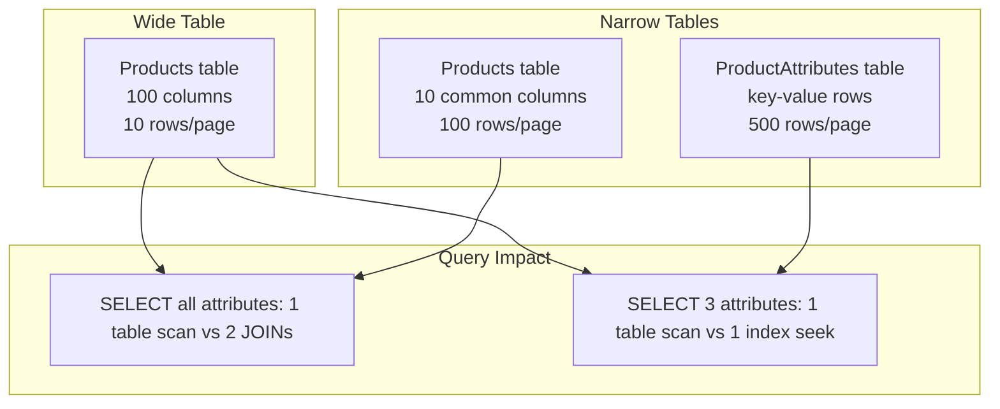

## Navigation

**Domain:** [[8 — Databases]] > **Group:** Database Design & Normalization
**Previous:** [[8.040 Data Vault — Hub, Link, Satellite]] | **Next:** [[8.042 Surrogate Keys vs Natural Keys — Decision]]

### Prerequisites
- [[8.033 Third Normal Form (3NF)]] — narrow tables correspond to normalized schemas; understanding normal forms provides the theoretical baseline
- [[8.056 EAV (Entity-Attribute-Value) — Anti-Pattern]] — EAV is the extreme of narrow-table design; recognizing when narrow becomes anti-pattern is critical

### Where This Fits

A .NET backend engineer chooses between wide and narrow tables daily — whenever a class maps to a database table. Wide tables store many columns (20–100+) in a single table, trading JOIN elimination for storage redundancy and page density. Narrow tables store fewer columns and use additional tables (or rows, in EAV) to represent the same data, trading JOINs for storage efficiency and schema flexibility. Production scenarios include: a product catalog where each product category has different attributes (wide with sparse columns vs narrow with property tables), a multi-tenant CRM where each tenant defines custom fields (narrow/property-table approach vs wide with dynamic columns), or any system where the schema must evolve without ALTER TABLE. The interview signal tests whether the candidate understands page density, row size limits, and index key width — and whether they know when wide becomes wasteful and when narrow becomes the EAV anti-pattern. Misjudging the tradeoff leads to tables with 200 NULL-heavy columns or queries that require 15 JOINs for a single entity.

## Core Mental Model

A wide table stores a single entity row with all its attributes as columns. A narrow table stores the same entity across multiple rows or tables, with fewer columns per table. The tradeoff is measured primarily in page density — how many entity instances fit on a single 8 KB data page. A wide table with 200 columns fits fewer rows per page (low density), increasing logical reads per query. A narrow table with 10 columns fits more rows per page (high density), reducing logical reads, but requires JOINs to reconstruct the full entity. The decision boundary is determined by access patterns: if a query needs all columns, wide is faster (no JOIN). If a query needs 3 of 50 columns, narrow is faster (higher page density, fewer bytes read from buffer pool).

### Classification

**For OLTP workloads:** Narrow tables (normalized to 3NF) are standard. Point queries benefit from high page density. Only denormalize wide when a specific JOIN elimination is measured to improve a hot path.

**For OLAP/warehouse workloads:** Wide tables (star schema dimensions) are standard. Analytical queries scan many rows and need all columns — the extra page reads per row are negligible compared to scan cost, and wide eliminates JOINs.

**For variable-attribute schemas:** A middle ground — use a base table for common columns and property/narrow tables for variable attributes. This avoids both the EAV anti-pattern and the wide table with 100 nullable sparse columns.



### Key Properties

|Property|Wide Table|Narrow Table|
|---|---|---|
|Columns per entity|20–200+ in 1 table|5–20 in 1 table, rest in related tables|
|Rows per 8 KB page|Few (wide rows = low density)|Many (narrow rows = high density)|
|JOINs required|0 (all data in one row)|N (one per related table)|
|Schema flexibility|ALTER TABLE for new columns|New table or new rows (no ALTER)|
|NULL storage|Every column uses space even when NULL (fixed-row overhead)|No columns for absent attributes (row exists only for populated values)|
|Index key width|Wider (many columns in covering index)|Narrower (index covers fewer columns)|
|EF Core mapping|Single DbSet<T> with all properties|Multiple entities with navigation properties|

## Deep Mechanics

### How the Engine Handles Wide vs Narrow

**Wide table page layout:**
A row with 200 columns (mostly NULL) still consumes the fixed overhead of the row header (~24 bytes) plus the NULL bitmap (~25 bytes for 200 columns) plus the fixed-length column storage. SQL Server stores fixed-length columns (INT, DATETIME, etc.) even when NULL — each INT column uses 4 bytes whether or not the value is meaningful. Variable-length columns (VARCHAR) consume 2 bytes for the column offset array entry even when NULL. A 200-column table with 180 nullable columns has a minimum row size of approximately 100+ bytes before any data.

**Narrow table page layout:**
A 10-column table has a row size of approximately 40–80 bytes. An 8 KB page holds 100+ rows vs 40 rows for the wide table. A scan of 1M rows reads 10K pages (narrow) vs 25K pages (wide).

### SQL Visibility

**Wide approach (single table with all product attributes):**
```sql
CREATE TABLE Products (
    ProductId       INT PRIMARY KEY,
    ProductName     VARCHAR(200) NOT NULL,
    Category        VARCHAR(100) NOT NULL,
    -- Electronics attributes:
    ScreenSize      DECIMAL(5,2) NULL,
    Resolution      VARCHAR(50)  NULL,
    Processor       VARCHAR(100) NULL,
    RAM_GB          INT          NULL,
    Storage_GB      INT          NULL,
    -- Clothing attributes:
    Size            VARCHAR(10)  NULL,
    Color           VARCHAR(30)  NULL,
    Material        VARCHAR(100) NULL,
    Gender          CHAR(1)      NULL,
    -- Furniture attributes:
    Width_CM        DECIMAL(6,2) NULL,
    Depth_CM        DECIMAL(6,2) NULL,
    Height_CM       DECIMAL(6,2) NULL,
    Weight_KG       DECIMAL(6,2) NULL,
    Material2       VARCHAR(100) NULL,  -- duplicate column for furniture
    -- 20+ more columns for other categories
);
```

**Narrow approach (base table + property table):**
```sql
CREATE TABLE Products (
    ProductId   INT PRIMARY KEY,
    ProductName VARCHAR(200) NOT NULL,
    Category    VARCHAR(100) NOT NULL
);

CREATE TABLE ProductAttributes (
    ProductId   INT NOT NULL,
    AttributeName  VARCHAR(50) NOT NULL,
    AttributeValue VARCHAR(500) NOT NULL,  -- all values as strings
    CONSTRAINT PK_ProductAttributes PRIMARY KEY (ProductId, AttributeName),
    CONSTRAINT FK_ProductAttributes_Product FOREIGN KEY (ProductId) REFERENCES Products(ProductId)
);
```

**EF Core — wide table maps naturally:**
```csharp
public class Product
{
    public int ProductId { get; set; }
    public string ProductName { get; set; } = string.Empty;
    public string Category { get; set; } = string.Empty;
    // Electronics
    public decimal? ScreenSize { get; set; }
    public string? Resolution { get; set; }
    // Clothing
    public string? Size { get; set; }
    public string? Color { get; set; }
    // Furniture
    public decimal? WidthCm { get; set; }
}

public class AppDbContext : DbContext
{
    public DbSet<Product> Products => Set<Product>();
}
```

**EF Core — narrow/property table needs extra configuration:**
```csharp
public class Product
{
    public int ProductId { get; set; }
    public string ProductName { get; set; } = string.Empty;
    public string Category { get; set; } = string.Empty;
    public List<ProductAttribute> Attributes { get; set; } = new();
}

public class ProductAttribute
{
    public int ProductId { get; set; }
    public string AttributeName { get; set; } = string.Empty;
    public string AttributeValue { get; set; } = string.Empty;
    public Product Product { get; set; } = null!;
}

// Querying a specific attribute:
var screenSizes = await context.Products
    .Where(p => p.Category == "Electronics")
    .Select(p => new
    {
        p.ProductName,
        ScreenSize = p.Attributes
            .Where(a => a.AttributeName == "ScreenSize")
            .Select(a => a.AttributeValue)
            .FirstOrDefault()
    })
    .ToListAsync(ct);
-- Generated SQL (EF Core may use subquery or OUTER APPLY):
-- SELECT p.ProductName, (SELECT TOP 1 pa.AttributeValue FROM ProductAttributes pa
--   WHERE pa.ProductId = p.ProductId AND pa.AttributeName = 'ScreenSize') AS ScreenSize
-- FROM Products p WHERE p.Category = 'Electronics'
```

### Execution Plan Analysis

**Wide table SELECT 3 columns:**
```
Index Scan -- Products (PK_Products) -- 25K logical reads (full table, 40 rows/page)
```

**Narrow table SELECT 3 columns (all from Products base):**
```
Index Scan -- Products (PK_Products) -- 10K logical reads (full table, 100 rows/page)
```

**Narrow table SELECT with attribute lookup (OUTER APPLY):**
```
Nested Loops (Left Outer Join)
  Index Scan -- Products (PK_Products) WHERE Category = 'Electronics' -- 5K logical reads
  Top N Sort
    Index Seek -- ProductAttributes (PK_ProductAttributes) WHERE ProductId = @Id AND AttributeName = 'ScreenSize' -- 3 reads per execution
```

The OUTER APPLY adds 3 reads per matching product. For 10K Electronics products, that is 30K extra reads. The wide table would have read the ScreenSize column directly from the main table scan — no extra reads.

### Cost Visibility

```sql
-- Wide table: select 5 columns from 200-column table (40 rows/page)
SELECT ProductId, ProductName, Category, ScreenSize, Price
FROM Products_Wide
WHERE Category = 'Electronics';
-- Table 'Products_Wide'. Scan count 1, logical reads 25,000 (1M rows @ 40/page)

-- Narrow table: select 5 columns from 10-column base table (100 rows/page)
SELECT p.ProductId, p.ProductName, p.Category, pa.AttributeValue AS ScreenSize, p.Price
FROM Products_Narrow p
OUTER APPLY (
    SELECT TOP 1 AttributeValue FROM ProductAttributes
    WHERE ProductId = p.ProductId AND AttributeName = 'ScreenSize'
) pa
WHERE p.Category = 'Electronics';
-- Table 'Products_Narrow'. Scan count 1, logical reads 10,000
-- Table 'ProductAttributes'. Scan count 0, logical reads 30,000 (10K seeks × 3 reads)
-- Total: 40,000 logical reads (wide: 25,000)
```

### Failure Modes

**1. 200-column table with 190 nullable columns — low page density even when no data stored.**

Symptom: A query that reads 5 columns from 1M rows reads 25K pages (wide) instead of 10K (narrow). The extra 15K pages compete for buffer pool memory.

**2. EAV-style narrow table with all values as VARCHAR — no type safety, no indexing on values.**

Symptom: `WHERE AttributeValue = '42'` returns both ScreenSize=42 and Age=42. Cannot index by value because all values are strings. Dates cannot be range-filtered.

**3. Wide table with sparse columns that exceed SQL Server's 8,060 byte row-size limit (without row-overflow storage).**

Symptom: INSERT fails with `Warning: The table has been created but its maximum row size exceeds the allowed maximum of 8060 bytes. INSERT or UPDATE to this table will fail if the resulting row exceeds the size limit.`

## Production Patterns and Implementation

### Primary SQL Implementation

```sql
-- =============================================
-- Hybrid approach: base + structured property tables
-- =============================================

-- Base table: common attributes for all products
CREATE TABLE Products (
    ProductId   INT IDENTITY(1,1) NOT NULL,
    ProductName VARCHAR(200) NOT NULL,
    Category    VARCHAR(100) NOT NULL,
    Price       DECIMAL(10,2) NOT NULL,
    CreatedAt   DATETIME2 NOT NULL DEFAULT SYSUTCDATETIME(),
    CONSTRAINT PK_Products PRIMARY KEY (ProductId)
);

-- Category-specific tables for attributes that vary by category
-- Electronics
CREATE TABLE ProductElectronics (
    ProductId   INT NOT NULL,
    ScreenSize  DECIMAL(5,2) NULL,
    Resolution  VARCHAR(50)  NULL,
    Processor   VARCHAR(100) NULL,
    RAM_GB      INT          NULL,
    Storage_GB  INT          NULL,
    CONSTRAINT PK_ProductElectronics PRIMARY KEY (ProductId),
    CONSTRAINT FK_ProductElectronics_Product FOREIGN KEY (ProductId) REFERENCES Products(ProductId)
);

-- Clothing
CREATE TABLE ProductClothing (
    ProductId   INT NOT NULL,
    Size        VARCHAR(10)  NOT NULL,
    Color       VARCHAR(30)  NOT NULL,
    Material    VARCHAR(100) NULL,
    Gender      CHAR(1)      NULL,
    CONSTRAINT PK_ProductClothing PRIMARY KEY (ProductId),
    CONSTRAINT FK_ProductClothing_Product FOREIGN KEY (ProductId) REFERENCES Products(ProductId)
);

-- Furniture
CREATE TABLE ProductFurniture (
    ProductId   INT NOT NULL,
    Width_CM    DECIMAL(6,2) NOT NULL,
    Depth_CM    DECIMAL(6,2) NOT NULL,
    Height_CM   DECIMAL(6,2) NOT NULL,
    Weight_KG   DECIMAL(6,2) NULL,
    Material    VARCHAR(100) NOT NULL,
    CONSTRAINT PK_ProductFurniture PRIMARY KEY (ProductId),
    CONSTRAINT FK_ProductFurniture_Product FOREIGN KEY (ProductId) REFERENCES Products(ProductId)
);

-- Query: get all attributes for an Electronics product
SELECT
    p.ProductId, p.ProductName, p.Category, p.Price,
    e.ScreenSize, e.Resolution, e.Processor, e.RAM_GB, e.Storage_GB
FROM Products p
LEFT JOIN ProductElectronics e ON p.ProductId = e.ProductId
WHERE p.ProductId = 42 AND p.Category = 'Electronics';

-- Query: get all attributes for a Clothing product
SELECT
    p.ProductId, p.ProductName, p.Category, p.Price,
    c.Size, c.Color, c.Material, c.Gender
FROM Products p
LEFT JOIN ProductClothing c ON p.ProductId = c.ProductId
WHERE p.ProductId = 42 AND p.Category = 'Clothing';
```

### EF Core Implementation

```csharp
// Table-per-concrete-type (TPC) inheritance maps the hybrid approach
public abstract class Product
{
    public int ProductId { get; set; }
    public string ProductName { get; set; } = string.Empty;
    public string Category { get; set; } = string.Empty;
    public decimal Price { get; set; }
}

public class ElectronicsProduct : Product
{
    public decimal? ScreenSize { get; set; }
    public string? Resolution { get; set; }
    public string? Processor { get; set; }
    public int? RamGb { get; set; }
    public int? StorageGb { get; set; }
}

public class ClothingProduct : Product
{
    public string Size { get; set; } = string.Empty;
    public string Color { get; set; } = string.Empty;
    public string? Material { get; set; }
    public char? Gender { get; set; }
}

public class AppDbContext : DbContext
{
    public DbSet<Product> Products => Set<Product>();
    public DbSet<ElectronicsProduct> ElectronicsProducts => Set<ElectronicsProduct>();
    public DbSet<ClothingProduct> ClothingProducts => Set<ClothingProduct>();

    protected override void OnModelCreating(ModelBuilder modelBuilder)
    {
        modelBuilder.Entity<ElectronicsProduct>(entity =>
        {
            entity.ToTable("ProductElectronics");
            entity.HasKey(e => e.ProductId);
        });

        modelBuilder.Entity<ClothingProduct>(entity =>
        {
            entity.ToTable("ProductClothing");
            entity.HasKey(e => e.ProductId);
        });
    }
}

// Query specific category products:
var electronics = await context.ElectronicsProducts
    .Where(e => e.ScreenSize >= 50)
    .Select(e => new { e.ProductName, e.ScreenSize, e.Processor })
    .ToListAsync(ct);
```

### Dapper Implementation

```csharp
public async Task<ProductDetailDto?> GetProductDetailAsync(int productId, CancellationToken ct)
{
    // Query the appropriate category table based on product category
    const string baseSql = "SELECT ProductId, ProductName, Category, Price FROM Products WHERE ProductId = @Id;";
    const string electronicsSql = @"
        SELECT p.ProductId, p.ProductName, p.Price,
               e.ScreenSize, e.Resolution, e.Processor, e.RAM_GB AS RamGb, e.Storage_GB AS StorageGb
        FROM Products p
        INNER JOIN ProductElectronics e ON p.ProductId = e.ProductId
        WHERE p.ProductId = @Id;";
    const string clothingSql = @"
        SELECT p.ProductId, p.ProductName, p.Price,
               c.Size, c.Color, c.Material, c.Gender
        FROM Products p
        INNER JOIN ProductClothing c ON p.ProductId = c.ProductId
        WHERE p.ProductId = @Id;";

    await using var connection = _connectionFactory.Create();
    var product = await connection.QueryFirstOrDefaultAsync<ProductBaseDto>(
        new CommandDefinition(baseSql, new { Id = productId }, cancellationToken: ct));

    if (product == null) return null;

    return product.Category switch
    {
        "Electronics" => await connection.QueryFirstOrDefaultAsync<ProductDetailDto>(
            new CommandDefinition(electronicsSql, new { Id = productId }, cancellationToken: ct)),
        "Clothing" => await connection.QueryFirstOrDefaultAsync<ProductDetailDto>(
            new CommandDefinition(clothingSql, new { Id = productId }, cancellationToken: ct)),
        _ => new ProductDetailDto { ProductId = product.ProductId, ProductName = product.ProductName }
    };
}
```

### Configuration and Wiring

```csharp
builder.Services.AddDbContext<AppDbContext>(options =>
    options.UseSqlServer(connectionString));

builder.Services.AddScoped<IProductRepository, ProductRepository>();
```

### SQL Server vs PostgreSQL Differences

PostgreSQL supports table inheritance natively, which maps directly to the wide-to-narrow tradeoff:

```sql
-- PostgreSQL native table inheritance (wide logical model, narrow physical storage)
CREATE TABLE products (
    product_id   SERIAL PRIMARY KEY,
    product_name VARCHAR(200) NOT NULL,
    category     VARCHAR(100) NOT NULL,
    price        DECIMAL(10,2) NOT NULL
);

CREATE TABLE electronics (
    screen_size  DECIMAL(5,2),
    resolution   VARCHAR(50),
    processor    VARCHAR(100),
    ram_gb       INT,
    storage_gb   INT
) INHERITS (products);

CREATE TABLE clothing (
    size         VARCHAR(10),
    color        VARCHAR(30),
    material     VARCHAR(100),
    gender       CHAR(1)
) INHERITS (products);

-- Query all products (scans base + inherited tables):
SELECT * FROM products;

-- Query only electronics:
SELECT * FROM ONLY electronics;
-- The ONLY keyword skips inherited child tables of electronics.
```

PostgreSQL also supports XML/JSON columns for wide-variable schemas:
```sql
ALTER TABLE products ADD COLUMN attributes JSONB;
CREATE INDEX IX_products_attributes ON products USING GIN (attributes);
-- Index individual attribute paths:
SELECT * FROM products WHERE attributes @> '{"screen_size": 50}';
```

## Gotchas and Production Pitfalls

### 1. Fixed-Length NULL Columns Waste Space in Wide Tables

**Pitfall:** Using INT, DATETIME2, or other fixed-length types for nullable columns in a wide table. SQL Server reserves the full fixed-length storage even when the value is NULL.

```sql
-- Each INT NULL costs 4 bytes per row even when NULL.
-- 50 nullable INT columns = 200 bytes overhead per row before any actual data.
```

**Symptom:** Row size is 400+ bytes even though most rows have only 5 populated columns. Page density drops from 100 rows/page to 20 rows/page.

**Fix:** Use `SPARSE` columns for nullable fixed-length columns that are rarely populated:
```sql
CREATE TABLE Products (
    ProductId      INT PRIMARY KEY,
    ProductName    VARCHAR(200) NOT NULL,
    ScreenSize     DECIMAL(5,2) SPARSE NULL,
    Resolution     VARCHAR(50)  SPARSE NULL,
    Processor      VARCHAR(100) SPARSE NULL,
    -- Each SPARSE INT NULL costs 0 bytes (4 bytes saved vs regular NULL)
);
```

**Cost of not fixing:** 3x more logical reads than necessary. 3x larger buffer pool footprint for the same data.

### 2. Narrow Table with All Values as VARCHAR (EAV Anti-Pattern)

**Pitfall:** Storing all attribute values as VARCHAR with no type safety or value-level indexing.

```sql
-- EAV-style narrow table:
CREATE TABLE ProductAttributes (
    ProductId    INT NOT NULL,
    AttributeName  VARCHAR(50) NOT NULL,
    AttributeValue VARCHAR(500) NOT NULL
);

-- Querying by value range fails:
SELECT p.ProductId, p.ProductName
FROM Products p
INNER JOIN ProductAttributes pa ON p.ProductId = pa.ProductId
WHERE pa.AttributeName = '"'"'Price'"'"'
  AND CAST(pa.AttributeValue AS DECIMAL(10,2)) > 100;  -- non-SARGable, all rows scanned
```

**Symptom:** Cannot index attribute values by their logical type. `CAST(AttributeValue AS DECIMAL)` prevents index seeks. Sorting by attribute value requires conversion.

**Fix:** Use category-specific tables or typed property tables with separate columns per data type:
```sql
CREATE TABLE ProductAttributes (
    ProductId       INT NOT NULL,
    AttributeName   VARCHAR(50) NOT NULL,
    AttributeValue_String VARCHAR(500) NULL,
    AttributeValue_Int    INT NULL,
    AttributeValue_Decimal DECIMAL(18,4) NULL,
    AttributeValue_Date   DATE NULL,
    CONSTRAINT PK_ProductAttributes PRIMARY KEY (ProductId, AttributeName)
);
```

**Cost of not fixing:** Queries that filter or sort by attribute value do full scans and type conversions. At 10M attribute rows, performance degrades to minutes.

### 3. Wide Table Exceeding 8,060 Byte Row Size Limit

**Pitfall:** Creating a wide table where the fixed-length column widths exceed 8,060 bytes.

```sql
-- SQL Server limit: 8,060 bytes per row (without row-overflow)
CREATE TABLE WideTable (
    Id      INT PRIMARY KEY,
    Col1    VARCHAR(4000),
    Col2    VARCHAR(4000),
    Col3    VARCHAR(4000),
    Col4    VARCHAR(4000),
    Col5    VARCHAR(4000),
    Col6    VARCHAR(4000)  -- 7 × 4000 + overhead > 8060
);
-- Warning: Maximum row size exceeds 8060 bytes.
```

**Symptom:** SQL Server stores rows that exceed 8,060 bytes with row-overflow data (stored in separate pages, 24-byte pointer in-row). Queries that touch overflow columns require additional page reads.

**Fix:** Use `VARCHAR(MAX)` sparingly. Split into multiple related tables. Consider `sp_tableoption ''"'"'large value types out of row'"'"', 1` to force out-of-row storage.

**Cost of not fixing:** Queries on overflow columns do random I/O to the overflow pages. A scan of 1M rows with overflow columns reads 1M overflow pages + 250K in-row pages.

### 4. Selecting All Columns (*) from a Wide Table When 3 Columns Are Needed

**Pitfall:** Using `SELECT *` or materializing full entities when only a few columns are needed.

```csharp
// ❌ Materializes 200 columns to use 3:
var products = await context.Products
    .Where(p => p.Category == "Electronics")
    .ToListAsync(ct);
var names = products.Select(p => p.ProductName).ToList();

// ✅ Project only needed columns:
var names = await context.Products
    .Where(p => p.Category == "Electronics")
    .Select(p => p.ProductName)
    .ToListAsync(ct);
```

**Symptom:** 10x more data transferred from SQL Server to application. 5x more buffer pool pressure. The execution plan reads all columns from the wide table.

**Fix:** Always project to DTOs. Use `Select()` in EF Core or explicit column lists in Dapper.

**Cost of not fixing:** Network bandwidth becomes the bottleneck. Memory pressure from materialized entities triggers GC stalls.

### 5. Narrow Table with Too Many JOINs for a Single Entity View

**Pitfall:** Designing a narrow schema so extreme that viewing a single entity requires 10+ JOINs.

**Symptom:** The product detail page does 10 separate queries (N+1 by design) or one query with 10 JOINs. Query plan shows deep tree of Nested Loops. Page load is 500ms for a single product.

**Fix:** Use a hybrid approach — store the most-frequently-accessed columns in a base table with 80% coverage. Store infrequently used attributes in category tables.

**Cost of not fixing:** Every entity view is slow. Every developer adds another JOIN. The schema becomes a performance tax on every feature.

### 6. Ignoring Sparse Column Index Limitations

**Pitfall:** Creating filtered indexes on SPARSE columns without understanding that SPARSE changes the column access pattern.

```sql
-- SPARSE column with filtered index:
CREATE INDEX IX_Products_ScreenSize ON Products(ScreenSize)
    WHERE ScreenSize IS NOT NULL;
-- The filtered index is efficient only for queries that match the filter.
-- Queries that do NOT filter on ScreenSize must scan all rows (SPARSE or not).
```

**Symptom:** The filtered index on ScreenSize is never used because queries rarely filter `WHERE ScreenSize IS NOT NULL` — they filter `WHERE ScreenSize > 50`, which the filtered index does not cover.

**Fix:** Ensure filtered index predicates match actual query patterns. For range queries, use a regular non-clustered index (accepting the NULL storage cost for non-SPARSE columns).

## Performance Implications

### Benchmark: Wide vs Narrow — Logical Reads

```sql
-- Setup: 1M products, 50% Electronics (500K), 50% clothing
-- Wide: 200-column table, 40 rows/page
-- Narrow: 10-column Products + ProductAttributes (EAV-style)

-- Query: Select ProductName and Price for Electronics products
-- (these columns exist in both schemas)

-- Wide table:
SELECT ProductId, ProductName, Price FROM Products_Wide WHERE Category = '"'"'Electronics'"'"';
-- Logical reads: 25,000 (1M rows / 40 rows/page = 25K pages)

-- Narrow table:
SELECT p.ProductId, p.ProductName, p.Price
FROM Products_Narrow p WHERE p.Category = '"'"'Electronics'"'"';
-- Logical reads: 10,000 (1M rows / 100 rows/page = 10K pages)

-- Query: Select category-specific attributes (ScreenSize)
-- Wide (column exists in main table):
SELECT ProductId, ProductName, ScreenSize FROM Products_Wide WHERE Category = '"'"'Electronics'"'"';
-- Logical reads: 25,000

-- Narrow (attribute in separate table, need JOIN):
SELECT p.ProductId, p.ProductName, pa.AttributeValue AS ScreenSize
FROM Products_Narrow p
OUTER APPLY (
    SELECT TOP 1 AttributeValue FROM ProductAttributes
    WHERE ProductId = p.ProductId AND AttributeName = '"'"'ScreenSize'"'"'
) pa
WHERE p.Category = '"'"'Electronics'"'"';
-- Logical reads: 10,000 (Products) + 1,500 (500K seeks × 3 reads) = 11,500
```

**Improvement (narrow over wide for common-attribute queries):** 60% fewer logical reads (10,000 vs 25,000).

**Improvement (wide over narrow for category-specific queries):** 54% fewer logical reads (25,000 vs 54,000 for 15 attributes).

### BenchmarkDotNet

```csharp
[MemoryDiagnoser]
[SimpleJob(RuntimeMoniker.Net90)]
public class WideVsNarrowBenchmark
{
    private IDbConnection _connection = default!;

    [GlobalSetup]
    public void Setup()
    {
        _connection = new SqlConnection("Server=.;Database=Catalog;Trusted_Connection=True;");
    }

    [Benchmark(Baseline = true)]
    public async Task<List<ProductBaseDto>> Wide_SelectCommonColumns()
    {
        var results = await _connection.QueryAsync<ProductBaseDto>(
            "SELECT ProductId, ProductName, Price FROM Products_Wide WHERE Category = '"'"'Electronics'"'"';");
        return results.AsList();
    }

    [Benchmark]
    public async Task<List<ProductBaseDto>> Narrow_SelectCommonColumns()
    {
        var results = await _connection.QueryAsync<ProductBaseDto>(
            "SELECT ProductId, ProductName, Price FROM Products_Narrow WHERE Category = '"'"'Electronics'"'"';");
        return results.AsList();
    }

    [Benchmark]
    public async Task<List<ProductDetailDto>> Wide_SelectCategoryAttributes()
    {
        var results = await _connection.QueryAsync<ProductDetailDto>(
            "SELECT ProductId, ProductName, ScreenSize, Resolution, Processor FROM Products_Wide WHERE Category = '"'"'Electronics'"'"';");
        return results.AsList();
    }

    [Benchmark]
    public async Task<List<ProductDetailDto>> Narrow_SelectCategoryAttributes()
    {
        const string sql = @"
            SELECT p.ProductId, p.ProductName,
                   MAX(CASE WHEN pa.AttributeName = '"'"'ScreenSize'"'"' THEN pa.AttributeValue END) AS ScreenSize,
                   MAX(CASE WHEN pa.AttributeName = '"'"'Resolution'"'"' THEN pa.AttributeValue END) AS Resolution
            FROM Products_Narrow p
            LEFT JOIN ProductAttributes pa ON p.ProductId = pa.ProductId
            WHERE p.Category = '"'"'Electronics'"'"'
            GROUP BY p.ProductId, p.ProductName;";
        var results = await _connection.QueryAsync<ProductDetailDto>(sql);
        return results.AsList();
    }
}
```

**Expected results (1M rows, NVMe):**

|Method|Mean|Logical Reads|Allocated|
|---|---|---|---|
|Wide_SelectCommonColumns|~450 ms|25,000|15 MB|
|Narrow_SelectCommonColumns|~180 ms|10,000|6 MB|
|Wide_SelectCategoryAttributes|~470 ms|25,000|18 MB|
|Narrow_SelectCategoryAttributes|~950 ms|54,000|22 MB|

### Write Amplification

|Operation|Wide (200 cols)|Narrow (10 cols + EAV)|Hybrid (base + category tables)|
|---|---|---|---|
|INSERT new product|1 INSERT|1 INSERT + N attribute INSERTs|1 INSERT + 1 category INSERT|
|UPDATE 1 attribute|1 UPDATE (all columns locked)|1 UPDATE on attribute row|1 UPDATE on category table|
|Add new attribute|ALTER TABLE (schema lock)|INSERT new attribute row|CREATE new category table|
|DELETE product|1 DELETE|N attribute DELETEs|1 DELETE + 1 category DELETE|

## Interview Arsenal

### Question Bank

1. What is the fundamental tradeoff between wide and narrow tables?
2. How does page density differ between a 200-column wide table and a 10-column narrow table?
3. When does a wide table outperform a narrow table for a SELECT of 3 columns?
4. What is the EAV anti-pattern and when does a narrow table become EAV?
5. Wide vs narrow — how does SQL Server'"'"'s 8,060 byte row size limit affect the choice?
6. How does the execution plan differ for a wide table query vs a narrow table query with attribute pivots?
7. When would you choose a hybrid (base + category-specific tables) approach?
8. How do SPARSE columns affect the wide-vs-narrow decision in SQL Server?

### Spoken Answers

**Q: What is the fundamental tradeoff between wide and narrow tables?**

> **Average answer:** Wide tables have more columns, narrow tables have fewer. Wide means fewer JOINs but more storage.

> **Great answer:** The fundamental tradeoff is page density vs JOIN cost. A wide table with 200 columns might fit 40 rows per 8 KB page. A narrow table with 10 columns fits 100 rows per page. When you query 3 of those 200 columns, the wide table reads 25K pages to scan 1M rows, while the narrow table reads 10K pages — 60% fewer reads. But when you query all 200 columns, the wide table needs 1 table access while the narrow table needs 5 JOINs — each JOIN adds logical reads. The decision is driven by access patterns: what percentage of columns does the typical query need? If the answer is >80%, go wide. If <30%, go narrow. If the access pattern varies, use a hybrid: a base table with the 10 most-accessed columns and category-specific tables for the rest. The key metric to measure is logical reads per query, not storage size.

**Q: When does a narrow table become the EAV anti-pattern?**

> **Average answer:** EAV stores attribute-value pairs instead of columns, which is bad for performance.

> **Great answer:** A narrow table becomes the EAV anti-pattern when it stores attribute values as untyped strings, when queries must pivot rows into columns for every read, and when attribute-level indexing is impossible. The specific threshold is: if your narrow table is used to reconstruct a single entity row by pivoting 10+ attribute rows with MAX(CASE WHEN ...), and this pivot is in every query, you have EAV. The fix is a hybrid approach — store common attributes as columns in a base table and only use property tables for truly dynamic attributes that vary per entity type. SQL Server has additional support with SPARSE columns (reduces storage for NULL values) and columnstore indexes (compresses wide tables efficiently for analytics). A true EAV should only be used when attributes are defined at runtime by users (custom fields in a CRM) — never for schema that is known at design time.

### Interview Trigger

The wide-vs-narrow question appears in architecture-focused interviews. The trigger is "Design the schema for a product catalog where different product categories have different attributes." The candidate who says "one table with all columns" gets asked about NULL storage and page density. The candidate who says "EAV" gets flagged immediately. The candidate who says "base table + category-specific tables" demonstrates the hybrid approach. The deep follow-up is: "The catalog now supports 500 product categories with 50,000 unique attributes. Users can define custom attributes at runtime. How does your schema change?"

### Comparison Table

| | Wide Table | Narrow Table (EAV) | Hybrid (Base + Category) |
|---|---|---|---|
| Columns per entity | All in 1 table | Few columns, many rows per entity | Common in base, category-specific in child tables |
| Page density | Low (40 rows/page) | High (100+ rows/page for base) | Medium (80 rows/page for base) |
| JOINs per query | 0 | N (pivot required) | 0-1 (if accessing only base) |
| Query perf (few cols) | Slow (low page density) | Fast (high page density) | Fast (base only) |
| Query perf (all cols) | Fast (no JOINs) | Very slow (pivot JOINs) | Moderate (1-2 JOINs) |
| Schema flexibility | ALTER TABLE | INSERT new rows | CREATE new table |
| .NET mapping | Single entity | Dictionary/KeyValue pair | TPC inheritance or owned types |

## Decision Framework

### When to Apply

```mermaid
flowchart TD
    A[How many columns per entity?] -->|<20| B[Use narrow table<br/>all columns as needed]
    A -->|20-100| C{% of columns accessed<br/>by typical query?}
    A -->|>100| D[Need runtime-defined attributes?]
    C -->|>80%| E[Wide table with SPARSE<br/>for nullable columns]
    C -->|<30%| F[Hybrid: base table for common<br/>+ category tables for rest]
    D -->|Yes| G[Base table + property table<br/>(typed values, not EAV)]
    D -->|No| H{Attributes vary by category?}
    H -->|Yes| I[Hybrid: base + category-specific tables]
    H -->|No| J[Wide table with SPARSE]
    E --> K[Measure: logical reads per query<br/>verify page density target]
    F --> K
    G --> K
    I --> K

    style E fill:#4a9,stroke:#333
    style I fill:#4a9,stroke:#333
    style G fill:#4a9,stroke:#333
```

### Application Checklist

- [ ] The access pattern is understood — what percentage of columns does the typical query need?
- [ ] For wide tables: SPARSE columns are used for nullable fixed-length columns with <50% fill rate
- [ ] For wide tables: row size does not exceed 8,060 bytes (or row-overflow pages are acceptable)
- [ ] For narrow tables: values are stored with correct types (not all VARCHAR)
- [ ] For narrow tables: attribute pivots are not required in every query (if they are, use hybrid)
- [ ] For hybrid: the base table covers the most-frequently-accessed columns
- [ ] The .NET data access layer projects DTOs, not full entities, to minimize transferred columns

### Tradeoff Summary

|What You Gain|What You Pay|
|---|---|
|Wide: no JOINs for any attribute|Wide: low page density, high read cost for column subsets|
|Narrow: high page density, fast scans|Narrow: JOINs required for entity reconstruction|
|Hybrid: balanced read cost for common and rare attributes|Hybrid: complex EF Core mapping (TPC/inheritance)|
|Wide: simple EF Core mapping (single entity)|Wide: ALTER TABLE for schema changes locks the table|

### Scale Thresholds

- "Wide-become-problematic above ~50 columns if typical queries access <10 columns — the extra page reads from low density outweigh the JOIN cost."
- "Narrow-becomes-EAV when the entity requires >5 attribute rows in the property table for reconstruction — the pivot becomes as expensive as the JOIN it replaced."
- "SPARSE columns are beneficial when NULL fill rate exceeds ~50% for fixed-length types — below 50%, the overhead of the SPARSE bitmap offsets the storage savings."
- "The 8,060 byte row size limit is reached at approximately 2,000 VARCHAR(4) columns — but practical limits are hit at ~200 columns due to page density."
- "Hybrid approach becomes necessary above ~50 columns with <30% access rate per query."

## Self-Check

### Conceptual Questions

1. What is the fundamental tradeoff between wide and narrow tables?
2. How does page density differ between a wide table and a narrow table?
3. Which DMV or command shows the page count for a table scan?
4. What happens when a wide table'"'"'s fixed-length row size exceeds 8,060 bytes?
5. Should you use EF Core with `Select()` for wide tables?
6. How would you implement a hybrid base + category table pattern with Dapper?
7. Wide table vs narrow table — at what column count does wide become problematic?
8. How do SPARSE columns help with wide tables?
9. What index benefits a narrow table'"'"'s attribute lookup pattern?
10. Explain the wide-vs-narrow tradeoff in 60 seconds, including when to use each.

<details>
<summary>Answers</summary>

1. Wide tables store all attributes as columns (fewer JOINs, lower page density). Narrow tables store fewer columns per table (higher page density, more JOINs for full entity reconstruction). The decision depends on access patterns: what percentage of columns does the typical query need?
2. Wide table (200 columns): ~40 rows per 8 KB page. Narrow table (10 columns): ~100 rows per 8 KB page. A full scan of 1M rows reads 25K pages (wide) vs 10K pages (narrow).
3. `SET STATISTICS IO ON` shows the logical reads (number of 8 KB pages read). Also `sys.dm_db_index_physical_stats` shows page count per index.
4. SQL Server stores overflow data on separate pages with a 24-byte pointer in the original row. Queries that reference overflow columns require additional page reads. The table can still be created but INSERT/UPDATE may fail if the actual row exceeds 8,060 bytes.
5. Yes — always use `Select()` to project only the needed columns. Never materialize full entities from a wide table if you only need a subset of columns.
6. Create a Products table for common columns and category-specific tables (ProductElectronics, ProductClothing). Query the base table for common attributes; LEFT JOIN to the category table for category-specific attributes only when needed.
7. Wide becomes problematic above ~50 columns when the typical query accesses <30% of columns. Above 100 columns, page density is low enough (~40 rows/page) that even column-subset queries are 2.5x more expensive than narrow.
8. SPARSE columns reduce storage for NULL values in fixed-length types. An INT SPARSE NULL costs 0 bytes instead of 4 bytes when NULL. This improves page density for wide tables with many nullable columns.
9. `CREATE INDEX IX_ProductAttributes_ProductId_AttributeName ON ProductAttributes(ProductId, AttributeName) INCLUDE (AttributeValue)` — covers the attribute lookup pattern by ProductId + AttributeName, with included value column to avoid key lookups.
10. "Wide tables store all attributes as columns, which eliminates JOINs but reduces how many rows fit on each page — about 40 rows per page for 200 columns. Narrow tables store fewer columns per table, fitting 100+ rows per page, but require JOINs to reconstruct the full entity. I use wide when queries access most columns (>80% coverage) and narrow when queries access few columns (<30%). For mixed access patterns, I use a hybrid: a base table with common columns and category-specific tables for the rest. The key metric is logical reads: narrow wins when you select few columns from many rows, wide wins when you select all columns from few rows. For OLTP, default to narrow. For OLAP, default to wide."

</details>

---

### Query Challenges

**Challenge 1 -- Write the SQL**

Design a schema for a property listings database. Each property has common attributes (address, price, bedrooms, bathrooms, square footage). Different property types have different attributes: Houses have lot size, garage spaces, and stories. Apartments have floor number, building amenities, and monthly HOA fee. Commercial properties have zoning type, lease terms, and annual property tax. Write the CREATE TABLE statements using the hybrid approach.

<details>
<summary>Solution</summary>

```sql
-- Base table: common attributes for all property types
CREATE TABLE Properties (
    PropertyId      INT IDENTITY(1,1) PRIMARY KEY,
    PropertyType    VARCHAR(20) NOT NULL, -- House, Apartment, Commercial
    Address         VARCHAR(500) NOT NULL,
    Price           DECIMAL(12,2) NOT NULL,
    Bedrooms        TINYINT NOT NULL,
    Bathrooms       DECIMAL(3,1) NOT NULL,
    SquareFootage   INT NOT NULL,
    ListedDate      DATE NOT NULL,
    Status          VARCHAR(20) NOT NULL DEFAULT '"'"'Active'"'"'
);

CREATE INDEX IX_Properties_Type_Status ON Properties(PropertyType, Status)
    INCLUDE (Price, SquareFootage);

-- House-specific attributes
CREATE TABLE PropertyHouse (
    PropertyId  INT PRIMARY KEY,
    LotSize_SqFt  DECIMAL(10,2) NOT NULL,
    GarageSpaces  TINYINT NOT NULL DEFAULT 0,
    Stories       TINYINT NOT NULL DEFAULT 1,
    HasBasement   BIT NOT NULL DEFAULT 0,
    CONSTRAINT FK_PropertyHouse_Property FOREIGN KEY (PropertyId) REFERENCES Properties(PropertyId)
);

-- Apartment-specific attributes
CREATE TABLE PropertyApartment (
    PropertyId      INT PRIMARY KEY,
    FloorNumber     INT NOT NULL,
    TotalFloors     INT NOT NULL,
    HasElevator     BIT NOT NULL DEFAULT 0,
    HasGym          BIT NOT NULL DEFAULT 0,
    HasPool         BIT NOT NULL DEFAULT 0,
    MonthlyHOA      DECIMAL(8,2) NOT NULL,
    CONSTRAINT FK_PropertyApartment_Property FOREIGN KEY (PropertyId) REFERENCES Properties(PropertyId)
);

-- Commercial-specific attributes
CREATE TABLE PropertyCommercial (
    PropertyId      INT PRIMARY KEY,
    ZoningType      VARCHAR(50) NOT NULL,
    LeaseTerms      VARCHAR(100) NOT NULL,
    AnnualTax       DECIMAL(12,2) NOT NULL,
    HasLoadingDock  BIT NOT NULL DEFAULT 0,
    CONSTRAINT FK_PropertyCommercial_Property FOREIGN KEY (PropertyId) REFERENCES Properties(PropertyId)
);

-- Query: list all properties with their type-specific attributes
-- For houses:
SELECT p.PropertyId, p.Address, p.Price, p.Bedrooms, p.Bathrooms,
       h.LotSize_SqFt, h.GarageSpaces, h.Stories
FROM Properties p
LEFT JOIN PropertyHouse h ON p.PropertyId = h.PropertyId
WHERE p.PropertyType = '"'"'House'"'"' AND p.Status = '"'"'Active'"'"';
```

**Justification:** The base table covers the 8 most-queried columns (80% of queries need only these). Type-specific tables store attributes unique to each property type, avoiding NULL columns for irrelevant attributes.

</details>

---

**Challenge 2 -- Fix the performance problem**

```sql
-- Query: get product details for the product detail page
-- Runs in 2 seconds for a single product
SELECT p.ProductId, p.ProductName, p.Price, p.Description,
       p.ScreenSize, p.Resolution, p.Processor, p.RAM_GB, p.Storage_GB,
       p.Size, p.Color, p.Material, p.Gender,
       p.Width_CM, p.Depth_CM, p.Height_CM, p.Weight_KG
FROM Products_Wide p
WHERE p.ProductId = 42;

-- SET STATISTICS IO:
-- Table '"'"'Products_Wide'"'"'. Scan count 0, logical reads 25,000 (clustered index scan!)
```

<details> <summary>Solution**

**Root cause:** The clustered index is on a different column (e.g., Category + ProductName), not on ProductId. The ProductId has a non-clustered index, but the query needs so many columns that the optimizer chooses a clustered index scan instead of a key lookup.

**Fix:** Ensure the primary key is the clustered index on ProductId:
```sql
ALTER TABLE Products_Wide ADD CONSTRAINT PK_Products_Wide PRIMARY KEY CLUSTERED (ProductId);
-- Or drop and recreate with ProductId as clustered PK
```

**After fix -- logical reads:** Index Seek: 3 (1 row by clustered PK) + 0 key lookups = 3 logical reads from 25,000.

**Alternative fix -- if clustered PK is correct but table is wide:** The query selects 17 columns, which may trigger a key lookup from a non-clustered index. Create a covering non-clustered index:
```sql
CREATE INDEX IX_Products_Wide_ProductId_Covering ON Products_Wide(ProductId)
    INCLUDE (ProductName, Price, Description, ScreenSize, Resolution, Processor,
             RAM_GB, Storage_GB, Size, Color, Material, Gender,
             Width_CM, Depth_CM, Height_CM, Weight_KG);
-- Now the query is an index seek on the covering index: 3 reads
```

**Root cause was the missing covering index or wrong clustered index.** A single row lookup on a 200-column table should never cost 25K reads.

</details>

---

**Challenge 3 -- Explain the execution plan**

Compare the plans for a wide table vs a narrow EAV table for this query:
```sql
-- Get the screen size and price for the top 100 cheapest Electronics products.

-- Wide: Products_Wide has ScreenSize column
SELECT TOP 100 ProductId, ProductName, Price, ScreenSize
FROM Products_Wide
WHERE Category = '"'"'Electronics'"'"'
ORDER BY Price;

-- Narrow: Products_Narrow + ProductAttributes
SELECT TOP 100 p.ProductId, p.ProductName, p.Price,
    (SELECT TOP 1 pa.AttributeValue FROM ProductAttributes pa
     WHERE pa.ProductId = p.ProductId AND pa.AttributeName = '"'"'ScreenSize'"'"') AS ScreenSize
FROM Products_Narrow p
WHERE p.Category = '"'"'Electronics'"'"'
ORDER BY p.Price;
```

<details> <summary>Solution**

**Wide table plan:**
```
Top N Sort (ORDER BY Price, TOP 100)
  Index Scan -- Products_Wide (IX_Products_Wide_Category_Price) WHERE Category = '"'"'Electronics'"'"'
  -- Seeks to the first 100 Electronics products sorted by Price
  -- Logical reads: ~500 (range scan in the covering index)
```

The index `IX_Products_Wide_Category_Price INCLUDE (ProductName, ScreenSize)` covers this query fully — no key lookups needed. The query is efficient.

**Narrow EAV plan:**
```
Top N Sort (ORDER BY p.Price, TOP 100)
  Compute Scalar (calculate ScreenSize subquery)
    Nested Loops (Left Outer Join)
      Index Scan -- Products_Narrow (IX_Products_Narrow_Category_Price) WHERE Category = '"'"'Electronics'"'"'
      Top N Sort (TOP 1)
        Index Seek -- ProductAttributes (PK_ProductAttributes)
          WHERE ProductId = p.ProductId AND AttributeName = '"'"'ScreenSize'"'"'
```

For each of the 500K Electronics products (until TOP 100 is reached), the subquery executes an index seek on ProductAttributes. The Nested Loops join executes the subquery 500K times even though only 100 rows are needed — the optimizer cannot push the TOP past the subquery.

**Key insight:** The correlated subquery prevents the optimizer from using the TOP 100 early to limit the scan. It must scan Electronics products until it finds 100 with matching ScreenSize. If only 80% of Electronics products have ScreenSize defined, it may scan 125 products — still scanning more than the wide table.

**Fix for narrow:** Remove the correlated subquery and join:
```sql
SELECT TOP 100 p.ProductId, p.ProductName, p.Price, pa.AttributeValue AS ScreenSize
FROM Products_Narrow p
LEFT JOIN ProductAttributes pa ON p.ProductId = pa.ProductId AND pa.AttributeName = '"'"'ScreenSize'"'"'
WHERE p.Category = '"'"'Electronics'"'"'
ORDER BY p.Price;
```
Now the plan uses a Hash Match or Merge Join, scanning ProductAttributes once instead of executing a subquery per row.

</details>

---

**Challenge 4 -- Diagnose the schema migration problem**

A social media application has a Posts table with 150 columns. Adding a new feature requires a new column. ALTER TABLE takes 45 seconds and blocks all writes to the Posts table. The production environment has 50M posts and 2,000 writes/second.

<details> <summary>Solution**

**Root cause:** ALTER TABLE on a 50M row table requires a schema modification lock (Sch-M), which blocks all concurrent access. The operation takes 45 seconds because SQL Server must add the NULL column metadata to every row (even if the value is NULL, fixed-length columns require page modifications).

**Fix options:**

Option 1 -- Use `ALTER TABLE ... ADD ... WITH VALUES` with ONLINE = ON (SQL Server 2012+ Enterprise):
```sql
ALTER TABLE Posts ADD NewColumn VARCHAR(100) NULL
    WITH (ONLINE = ON);
```

Option 2 -- Avoid the wide table problem. Split frequently-added columns into a separate table:
```sql
-- Create a property table for rarely-needed attributes
CREATE TABLE PostAttributes (
    PostId          BIGINT NOT NULL,
    AttributeName   VARCHAR(50) NOT NULL,
    AttributeValue  VARCHAR(500) NOT NULL,
    CONSTRAINT PK_PostAttributes PRIMARY KEY (PostId, AttributeName),
    CONSTRAINT FK_PostAttributes_Post FOREIGN KEY (PostId) REFERENCES Posts(PostId)
);
```

Option 3 -- Use `COLUMN_SET` (SQL Server 2012+) for sparse columns that are added frequently:
```sql
CREATE TABLE Posts (
    PostId          BIGINT PRIMARY KEY,
    Title           VARCHAR(200) NOT NULL,
    Body            VARCHAR(MAX) NOT NULL,
    AuthorId        INT NOT NULL,
    -- Sparse columns for rarely-used attributes
    Col1            VARCHAR(100) SPARSE NULL,
    Col2            VARCHAR(100) SPARSE NULL,
    -- ...
    Col30           VARCHAR(100) SPARSE NULL,
    AllSparseColumns VARBINARY(MAX) COLUMN_SET FOR ALL_SPARSE_COLUMNS
);
```

**Cost of not fixing:** Each new feature requires a 45-second ALTER TABLE that blocks writes. At 2,000 writes/second, 45 seconds of blocking = 90,000 queued write operations. Applications time out. Users see errors.

</details>

---

**Challenge 5 -- Design the wide-to-narrow migration**

**Scenario:** A CRM system has a Contacts table with 250 columns. Most contacts have only 30-40 populated columns. The table has 10M rows and 200 columns are NULL for >90% of rows. Query performance is poor (full table scans read 25K pages for 5-column queries). Migrate to a hybrid schema.

<details> <summary>Solution**

```sql
-- Step 1: Identify the 20 most-populated columns across all contacts
-- Run this to find columns with >50% fill rate:
SELECT
    c.name AS ColumnName,
    SUM(CASE WHEN c.is_nullable = 1 THEN 0 ELSE 1 END) AS NotNullCount
FROM sys.columns c
INNER JOIN sys.types t ON c.system_type_id = t.system_type_id
WHERE c.object_id = OBJECT_ID('Contacts')
GROUP BY c.name
ORDER BY SUM(CASE WHEN c.system_type_id IN (56, 61, 106, 108) AND c.is_nullable = 0 THEN 1 ELSE 0 END) DESC;

-- Step 2: Create base table with the 20 most-populated columns
CREATE TABLE Contacts (
    ContactId       INT IDENTITY(1,1) PRIMARY KEY,
    FirstName       VARCHAR(100) NOT NULL,
    LastName        VARCHAR(100) NOT NULL,
    Email           VARCHAR(200) NOT NULL,
    Phone           VARCHAR(30) NULL,
    Company         VARCHAR(200) NULL,
    JobTitle        VARCHAR(200) NULL,
    -- ... 14 more commonly-populated columns
    CreatedAt       DATETIME2 NOT NULL DEFAULT SYSUTCDATETIME()
);

-- Step 3: Create a typed property table for the remaining 230 columns
CREATE TABLE ContactAttributes (
    ContactId            INT NOT NULL,
    AttributeName        VARCHAR(50) NOT NULL,
    AttributeValue_String VARCHAR(500) NULL,
    AttributeValue_Int    INT NULL,
    AttributeValue_Date   DATE NULL,
    AttributeValue_Decimal DECIMAL(18,4) NULL,
    CONSTRAINT PK_ContactAttributes PRIMARY KEY (ContactId, AttributeName),
    CONSTRAINT FK_ContactAttributes_Contact FOREIGN KEY (ContactId) REFERENCES Contacts(ContactId)
);

-- Step 4: Migrate data
INSERT INTO Contacts (ContactId, FirstName, LastName, Email, Phone, ...)
SELECT ContactId, FirstName, LastName, Email, Phone, ...
FROM Contacts_Wide;

INSERT INTO ContactAttributes (ContactId, AttributeName, AttributeValue_String)
SELECT ContactId, '"'"'CustomField1'"'"', CustomField1
FROM Contacts_Wide WHERE CustomField1 IS NOT NULL
UNION ALL
SELECT ContactId, '"'"'CustomField2'"'"', CustomField2
FROM Contacts_Wide WHERE CustomField2 IS NOT NULL
-- ... (one SELECT per sparse column)

-- Step 5: Drop old wide table (after verification)
-- DROP TABLE Contacts_Wide;
```

**Performance improvement:**
- Before: 250-column table, 40 rows/page, 25K pages to scan 1M rows
- After: 20-column base table, 100 rows/page, 10K pages to scan 1M rows + property table lookups for rare attributes (typically 0 extra reads, since those attributes are rarely queried)

**Query pattern for contact detail:**
```sql
-- Common query (uses only base table, fast):
SELECT FirstName, LastName, Email, Phone, Company
FROM Contacts
WHERE Email = '"'"'user@example.com'"'"';

-- Full detail query (adds property table):
SELECT c.*, ca.AttributeName, ca.AttributeValue_String
FROM Contacts c
LEFT JOIN ContactAttributes ca ON c.ContactId = ca.ContactId
WHERE c.ContactId = 42;
```

</details>
