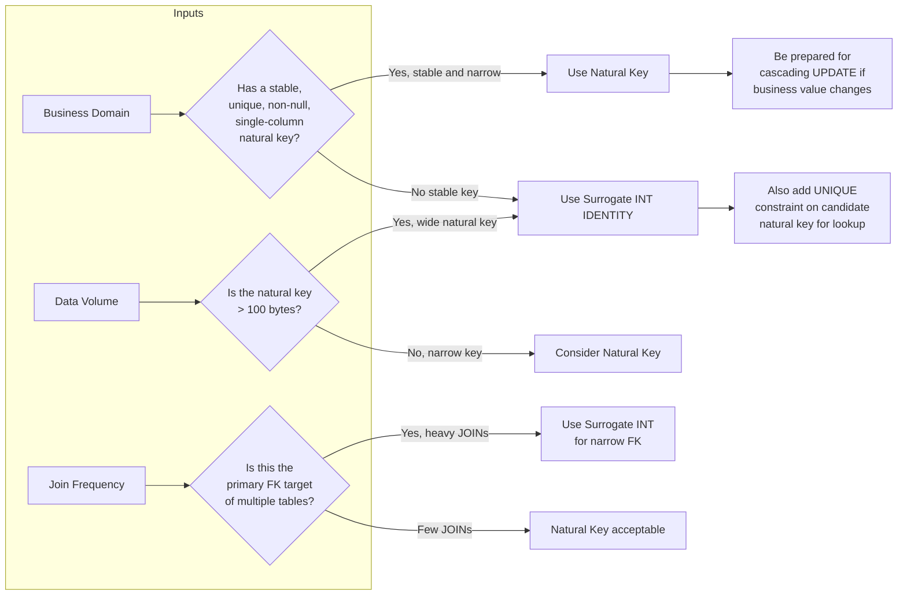

## Navigation

**Domain:** [[8 — Databases]] > **Group:** Database Design & Normalization
**Previous:** [[8.041 Wide Tables vs Narrow Tables — Tradeoffs]] | **Next:** [[8.043 UUID vs Sequential ID — Performance Implications]]

### Prerequisites
- [[8.002 Keys — Primary, Foreign, Candidate, Surrogate, Natural]] — defines the vocabulary of key types; this note applies that vocabulary to the surrogate-vs-natural decision
- [[8.043 UUID vs Sequential ID — Performance Implications]] — surrogate keys are often UUIDs or sequential INTs; the performance characteristics of each ID generation strategy directly inform the decision

### Where This Fits

Every table in every production database has a primary key. The choice between a surrogate key (artificial, system-generated, meaningless) and a natural key (derived from domain data, meaningful) is the most consequential schema design decision a .NET backend engineer makes. It determines JOIN performance, index fragmentation, referential integrity behavior, and whether an `UPDATE` on a business column cascades through a million foreign key rows. Production systems fail when a natural key like `Email` changes after it has been referenced in a million-order `CustomerId` column, or when a surrogate `INT` identity column reaches 2.1 billion and rolls over. The interview signal tests whether the candidate understands the page-splitting cost of GUIDs as clustered keys, the referential integrity implications of natural key changes, and the EF Core configuration required for each approach.

## Core Mental Model

A surrogate key is an integer, UUID, or other value generated by the database or application with no meaning in the domain. A natural key is a column or column combination that has meaning in the business domain — `Email`, `TaxId`, `ProductCode`, `(CountryCode, TaxpayerId)`. The database engine does not distinguish between them; both are just columns with a unique constraint. The difference is in how they interact with the application: surrogate keys never change, never leak business meaning, and are narrow (4–16 bytes), making them fast for clustering and JOINs. Natural keys eliminate the need for a separate unique constraint and make queries readable without JOINs, but they change when the business value changes, and a change to a natural key cascades through every foreign key reference.

### Classification

**For schema design:** The decision belongs to the physical design phase after logical normalization. A natural key exists as a candidate key in the logical model; the question is whether to use it as the primary key or to introduce a surrogate.

**For performance:** Surrogate `INT IDENTITY` keys are the fastest possible clustered key — 4 bytes, monotonically increasing, zero page splits. `UNIQUEIDENTIFIER` (GUID) surrogates cause page splits and fragmentation unless used with `NEWSEQUENTIALID()` or as a non-clustered key. Natural keys are wider (strings, composite) and cause larger, slower non-clustered index trees.

**For .NET:** EF Core handles both transparently via `HasDatabaseGeneratedOption` or value conversion. The difference appears in the entity class: a natural key property has domain meaning (and often a setter), while a surrogate key is typically a `readonly`-style generated property.



### Key Properties

|Property|Surrogate Key (INT IDENTITY)|Surrogate Key (GUID)|Natural Key (VARCHAR(50))|
|---|---|---|---|
|Byte width|4 bytes|16 bytes|~50–100+ bytes|
|Clustered index fragmentation|None (monotonically increasing)|High (random GUID) or None (Sequential GUID)|Depends on insert order|
|JOIN cost per row|Lowest (narrow key)|Higher (wider key)|Higher (wider key)|
|Business meaning changes|Never — no cascade impact|Never — no cascade impact|May change — cascading UPDATE|
|Query readability|Requires JOIN to get business value|Requires JOIN to get business value|Self-contained|
|EF Core generation|`ValueGeneratedOnAdd()`|`Guid.NewGuid()` or server-side|User-assigned|

## Deep Mechanics

### How the Engine Executes This

**Surrogate INT IDENTITY as clustered primary key:**
1. A new row is inserted. The storage engine calls `IDENT_CURRENT` to get the next value.
2. The row is written to the last page of the clustered index (the rightmost leaf page). Because the IDENTITY value is monotonically increasing, every new row goes to the same page until it fills.
3. When the page fills (at ~8060 bytes), a page split occurs: half the rows stay, half go to a new page. This is the most efficient possible page split — it happens at the page boundary, not mid-page.
4. Non-clustered indexes store the 4-byte clustering key in every row of every index. With a 4-byte key, each non-clustered index page holds ~2000 entries, keeping the B-tree shallow.
5. On JOIN, the optimizer uses the 4-byte key directly. A Nested Loops JOIN probing into a clustered index with a 4-byte key costs 3 logical reads per probe (root → intermediate → leaf).

**Natural key (VARCHAR(50)) as clustered primary key:**
1. A new row is inserted. The value must be placed in B-tree order, not at the end.
2. Unless inserts happen in alphabetical order (rare), new rows go to random pages throughout the tree. Every insert causes a page split at a random location, fragmenting the index.
3. Non-clustered indexes store the 50-byte clustering key in every row of every index. Each non-clustered index page holds ~160 entries (8000 / 50) instead of ~2000 for INT. The B-tree is 3–4 levels deeper.
4. On JOIN, each probe reads more pages because the non-clustered index is deeper. A Nested Loops JOIN that would read 3 logical reads with INT now reads 5–7 reads.

### SQL Visibility

**Surrogate key pattern:**

```sql
CREATE TABLE Customers (
    CustomerId   INT IDENTITY(1,1) NOT NULL,
    Email        VARCHAR(255) NOT NULL,
    FullName     VARCHAR(200) NOT NULL,
    CreatedAt    DATETIME2 NOT NULL DEFAULT SYSUTCDATETIME(),
    CONSTRAINT PK_Customers PRIMARY KEY CLUSTERED (CustomerId),
    CONSTRAINT UQ_Customers_Email UNIQUE (Email)
);

CREATE TABLE Orders (
    OrderId      INT IDENTITY(1,1) NOT NULL,
    CustomerId   INT NOT NULL,
    OrderDate    DATETIME2 NOT NULL DEFAULT SYSUTCDATETIME(),
    CONSTRAINT PK_Orders PRIMARY KEY CLUSTERED (OrderId),
    CONSTRAINT FK_Orders_Customers FOREIGN KEY (CustomerId)
        REFERENCES Customers(CustomerId)
);
```

```csharp
public class Customer
{
    public int CustomerId { get; set; }
    public string Email { get; set; } = string.Empty;
    public string FullName { get; set; } = string.Empty;
    public DateTime CreatedAt { get; set; }
    public List<Order> Orders { get; set; } = new();
}

public class Order
{
    public int OrderId { get; set; }
    public int CustomerId { get; set; }
    public DateTime OrderDate { get; set; }
    public Customer Customer { get; set; } = null!;
}

public class AppDbContext : DbContext
{
    public DbSet<Customer> Customers => Set<Customer>();
    public DbSet<Order> Orders => Set<Order>();

    protected override void OnModelCreating(ModelBuilder modelBuilder)
    {
        modelBuilder.Entity<Customer>(e =>
        {
            e.HasKey(c => c.CustomerId);
            e.Property(c => c.CustomerId).ValueGeneratedOnAdd();
            e.HasIndex(c => c.Email).IsUnique();
        });

        modelBuilder.Entity<Order>(e =>
        {
            e.HasKey(o => o.OrderId);
            e.Property(o => o.OrderId).ValueGeneratedOnAdd();
            e.HasOne(o => o.Customer)
                .WithMany(c => c.Orders)
                .HasForeignKey(o => o.CustomerId);
        });
    }
}
```

**Natural key pattern:**

```sql
CREATE TABLE Customers (
    Email        VARCHAR(255) NOT NULL,
    FullName     VARCHAR(200) NOT NULL,
    CreatedAt    DATETIME2 NOT NULL DEFAULT SYSUTCDATETIME(),
    CONSTRAINT PK_Customers PRIMARY KEY CLUSTERED (Email)
);

CREATE TABLE Orders (
    OrderId      INT IDENTITY(1,1) NOT NULL,
    CustomerEmail VARCHAR(255) NOT NULL,
    OrderDate    DATETIME2 NOT NULL DEFAULT SYSUTCDATETIME(),
    CONSTRAINT PK_Orders PRIMARY KEY CLUSTERED (OrderId),
    CONSTRAINT FK_Orders_Customers FOREIGN KEY (CustomerEmail)
        REFERENCES Customers(Email)
);
```

```csharp
public class Customer
{
    public string Email { get; set; } = string.Empty;  // natural PK
    public string FullName { get; set; } = string.Empty;
    public DateTime CreatedAt { get; set; }
    public List<Order> Orders { get; set; } = new();
}

public class Order
{
    public int OrderId { get; set; }
    public string CustomerEmail { get; set; } = string.Empty;
    public DateTime OrderDate { get; set; }
    public Customer Customer { get; set; } = null!;
}

// EF Core configuration:
modelBuilder.Entity<Customer>(e =>
{
    e.HasKey(c => c.Email);  // natural key as PK
    e.Property(c => c.Email).HasMaxLength(255);
});

modelBuilder.Entity<Order>(e =>
{
    e.HasKey(o => o.OrderId);
    e.HasOne(o => o.Customer)
        .WithMany(c => c.Orders)
        .HasForeignKey(o => o.CustomerEmail);
});
```

### Execution Plan Analysis

**Surrogate INT JOIN (CustomerId = 42):**

```
Clustered Index Seek — PK_Customers (CustomerId = 42) — 3 logical reads
Clustered Index Seek — PK_Orders (OrderId = ...) — 3 logical reads per matched row
```

The clustered index seek on a 4-byte key reads exactly 3 pages (root → intermediate → leaf) regardless of table size. The B-tree has ~3 levels for 1B rows.

**Natural VARCHAR JOIN (Email = 'user@example.com'):**

```
Clustered Index Seek — PK_Customers (Email = 'user@example.com') — 4 logical reads
Clustered Index Seek — PK_Orders (OrderId = ...) — 3 logical reads per matched row
```

The clustered index seek on a 50-byte VARCHAR key reads 4 pages for 1M rows (wider key → fewer entries per page → deeper tree). At 100M rows, the key difference widens: INT stays at 3–4 levels, while a 200-byte natural key reaches 5–6 levels.

### Cost Visibility

```sql
SET STATISTICS IO ON;

-- Surrogate key lookup
SELECT c.CustomerId, c.Email, o.OrderId, o.OrderDate
FROM Customers c
INNER JOIN Orders o ON c.CustomerId = o.CustomerId
WHERE c.CustomerId = 42;
-- Table 'Customers'. Scan count 0, logical reads 3
-- Table 'Orders'. Scan count 0, logical reads 3

-- Natural key lookup (same data)
SELECT c.Email, c.FullName, o.OrderId, o.OrderDate
FROM Customers c
INNER JOIN Orders o ON c.Email = o.CustomerEmail
WHERE c.Email = 'user@example.com';
-- Table 'Customers'. Scan count 0, logical reads 4
-- Table 'Orders'. Scan count 0, logical reads 3

-- Non-clustered index on natural key in surrogate design (covering)
SELECT c.Email FROM Customers WHERE Email = 'user@example.com';
-- Table 'Customers'. Scan count 0, logical reads 3 (non-clustered idx on Email)
```

### Failure Modes

**1. Natural key changes after data exists.** If `Email` is the PK and a customer changes their email, the `ON UPDATE CASCADE` must update the PK in `Customers` and the FK in `Orders`, `Invoices`, `Shipments`, etc. This generates page splits in every related table's clustered index.

**2. Hot right-page contention with INT IDENTITY.** All inserts target the last page of the clustered index. At >10K inserts/second, this page becomes a latch contention point. Solution: use `OPTIMIZE_FOR_SEQUENTIAL_KEY` or a hash-distributed key.

**3. GUID clustered key with random values.** `UNIQUEIDENTIFIER DEFAULT NEWID()` causes page splits on every insert, fragmenting the index to >90% within minutes at high insert rates.

## Production Patterns and Implementation

### Primary SQL Implementation

```sql
-- Scenario: E-commerce Customers table
-- Decision: Use surrogate INT IDENTITY because Email can change
CREATE TABLE Customers (
    CustomerId   INT IDENTITY(1,1) NOT NULL,
    Email        VARCHAR(255) NOT NULL,
    FullName     VARCHAR(200) NOT NULL,
    BillingAddress VARCHAR(500) NOT NULL DEFAULT '',
    CreatedAt    DATETIME2 NOT NULL DEFAULT SYSUTCDATETIME(),
    ModifiedAt   DATETIME2 NOT NULL DEFAULT SYSUTCDATETIME(),
    CONSTRAINT PK_Customers PRIMARY KEY CLUSTERED (CustomerId),
    CONSTRAINT UQ_Customers_Email UNIQUE (Email)
);

-- Scenario: Lookup table (e.g., US States) where natural key is stable
CREATE TABLE USStates (
    StateCode    CHAR(2) NOT NULL,       -- natural key: 'CA', 'NY'
    StateName    VARCHAR(100) NOT NULL,
    CONSTRAINT PK_USStates PRIMARY KEY CLUSTERED (StateCode)
);

-- Scenario: Composite natural key for a junction table
CREATE TABLE ProductCategories (
    ProductId    INT NOT NULL,
    CategoryCode VARCHAR(20) NOT NULL,
    CONSTRAINT PK_ProductCategories PRIMARY KEY CLUSTERED (ProductId, CategoryCode),
    CONSTRAINT FK_ProductCategories_Product FOREIGN KEY (ProductId)
        REFERENCES Products(ProductId),
    CONSTRAINT FK_ProductCategories_Category FOREIGN KEY (CategoryCode)
        REFERENCES Categories(CategoryCode)
);
```

### EF Core Implementation

```csharp
public class Customer
{
    public int CustomerId { get; set; }
    public string Email { get; set; } = string.Empty;
    public string FullName { get; set; } = string.Empty;
    public string BillingAddress { get; set; } = string.Empty;
    public DateTime CreatedAt { get; set; }
    public DateTime ModifiedAt { get; set; }
}

public class USState
{
    public string StateCode { get; set; } = string.Empty;  // natural PK
    public string StateName { get; set; } = string.Empty;
}

public class ProductCategory
{
    public int ProductId { get; set; }
    public string CategoryCode { get; set; } = string.Empty;
    public Product Product { get; set; } = null!;
    public Category Category { get; set; } = null!;
}

public class AppDbContext : DbContext
{
    public DbSet<Customer> Customers => Set<Customer>();
    public DbSet<USState> USStates => Set<USState>();

    protected override void OnModelCreating(ModelBuilder modelBuilder)
    {
        modelBuilder.Entity<Customer>(e =>
        {
            e.HasKey(c => c.CustomerId);
            e.Property(c => c.CustomerId).ValueGeneratedOnAdd();
            e.Property(c => c.Email).HasMaxLength(255).IsRequired();
            e.HasIndex(c => c.Email).IsUnique();
            e.Property(c => c.CreatedAt).HasDefaultValueSql("SYSUTCDATETIME()");
            e.Property(c => c.ModifiedAt).HasDefaultValueSql("SYSUTCDATETIME()");
        });

        modelBuilder.Entity<USState>(e =>
        {
            e.HasKey(s => s.StateCode);
            e.Property(s => s.StateCode).HasMaxLength(2).IsFixedLength();
        });

        modelBuilder.Entity<ProductCategory>(e =>
        {
            e.HasKey(pc => new { pc.ProductId, pc.CategoryCode });
        });
    }
}
```

### Dapper Implementation

```csharp
public class CustomerRepository
{
    private readonly IDbConnectionFactory _connectionFactory;

    public CustomerRepository(IDbConnectionFactory connectionFactory)
    {
        _connectionFactory = connectionFactory;
    }

    // Surrogate key lookup
    public async Task<Customer?> GetByIdAsync(
        int customerId,
        CancellationToken ct = default)
    {
        const string sql = @"
            SELECT CustomerId, Email, FullName, BillingAddress,
                   CreatedAt, ModifiedAt
            FROM Customers
            WHERE CustomerId = @CustomerId";

        await using var connection = _connectionFactory.Create();
        return await connection.QueryFirstOrDefaultAsync<Customer>(
            new CommandDefinition(sql, new { CustomerId = customerId },
                cancellationToken: ct));
    }

    // Natural key lookup (via unique constraint)
    public async Task<Customer?> GetByEmailAsync(
        string email,
        CancellationToken ct = default)
    {
        const string sql = @"
            SELECT CustomerId, Email, FullName, BillingAddress,
                   CreatedAt, ModifiedAt
            FROM Customers
            WHERE Email = @Email";

        await using var connection = _connectionFactory.Create();
        return await connection.QueryFirstOrDefaultAsync<Customer>(
            new CommandDefinition(sql, new { Email = email },
                cancellationToken: ct));
    }

    // Insert returns the generated surrogate key
    public async Task<int> CreateAsync(
        Customer customer,
        CancellationToken ct = default)
    {
        const string sql = @"
            INSERT INTO Customers (Email, FullName, BillingAddress)
            OUTPUT INSERTED.CustomerId
            VALUES (@Email, @FullName, @BillingAddress)";

        await using var connection = _connectionFactory.Create();
        return await connection.ExecuteScalarAsync<int>(
            new CommandDefinition(sql, customer, cancellationToken: ct));
    }
}
```

### Configuration and Wiring

```csharp
// Program.cs
builder.Services.AddDbContext<AppDbContext>(options =>
    options.UseSqlServer(connectionString));

builder.Services.AddSingleton<IDbConnectionFactory>(
    _ => new SqlConnectionFactory(connectionString));
builder.Services.AddScoped<CustomerRepository>();
```

### SQL Server vs PostgreSQL Differences

PostgreSQL has no `IDENTITY` by default (though `GENERATED AS IDENTITY` was added in PostgreSQL 10). The equivalent pattern uses `SERIAL` or `IDENTITY`:

```sql
-- PostgreSQL surrogate key (SERIAL — legacy)
CREATE TABLE Customers (
    CustomerId SERIAL PRIMARY KEY,
    Email VARCHAR(255) NOT NULL UNIQUE,
    FullName VARCHAR(200) NOT NULL
);

-- PostgreSQL surrogate key (IDENTITY — modern, SQL standard)
CREATE TABLE Customers (
    CustomerId INT GENERATED ALWAYS AS IDENTITY PRIMARY KEY,
    Email VARCHAR(255) NOT NULL UNIQUE,
    FullName VARCHAR(200) NOT NULL
);

-- PostgreSQL natural key
CREATE TABLE USStates (
    StateCode CHAR(2) PRIMARY KEY,
    StateName VARCHAR(100) NOT NULL
);
```

PostgreSQL uses heap tables by default (no clustered index like SQL Server). The surrogate-vs-natural performance difference in PostgreSQL is smaller because there is no clustering key stored in every non-clustered index — PostgreSQL indexes store the row `ctid` (page + offset), not the PK value. However, the key width still matters for the B-tree of the PK index itself.

## Gotchas and Production Pitfalls

### 1. Natural key assumed to never change

**Pitfall:** The engineer chooses `Email` as the PK because "users never change their email."

```sql
-- ❌ Natural key that WILL change
CREATE TABLE Customers (
    Email VARCHAR(255) PRIMARY KEY,
    FullName VARCHAR(200) NOT NULL
);
```

**Symptom:** A user changes their email. The `UPDATE` on the PK cascades to `Orders` (2M rows), `Invoices` (5M rows), `Shipments` (500K rows). The transaction runs for 45 seconds, blocking all concurrent access. The `ALTER TABLE ... SWITCH` partition fix requires downtime.

**Fix:** Use surrogate `INT IDENTITY` as PK, add `UNIQUE` constraint on `Email`.

**Cost of not fixing:** 45-second blocking transaction during a routine email change. Cascade update locks every referenced table, causing deadlocks and timeouts across the application.

### 2. GUID as clustered surrogate key

**Pitfall:** The engineer uses `UNIQUEIDENTIFIER DEFAULT NEWID()` as the clustered primary key to avoid "guessable IDs."

```sql
-- ❌ Random GUID clustered key
CREATE TABLE Orders (
    OrderId UNIQUEIDENTIFIER DEFAULT NEWID() PRIMARY KEY CLUSTERED,
    CustomerId INT NOT NULL,
    OrderDate DATETIME2 NOT NULL
);
```

**Symptom:** After 1M inserts, index fragmentation exceeds 95%. Page splits occur on every insert. The clustered index has twice as many pages as necessary. INSERT throughput drops from 5K/sec to 200/sec as the page split rate saturates the disk.

**Fix:** Use `NEWSEQUENTIALID()` or `INT IDENTITY` as clustered key, keep GUID as a non-clustered alternate key if public-facing IDs are required.

```sql
-- ✅ Sequential GUID or INT clustered
CREATE TABLE Orders (
    OrderId INT IDENTITY(1,1) PRIMARY KEY CLUSTERED,
    OrderGuid UNIQUEIDENTIFIER DEFAULT NEWSEQUENTIALID() NOT NULL,
    CONSTRAINT UQ_Orders_OrderGuid UNIQUE (OrderGuid),
    CustomerId INT NOT NULL,
    OrderDate DATETIME2 NOT NULL
);
```

**Cost of not fixing:** At 3 AM, the scheduled index rebuild job runs for 2 hours on the 95% fragmented clustered index. During rebuild, the table is locked for `ONLINE = OFF` or has blocking with `ONLINE = ON`.

### 3. INT IDENTITY rollover

**Pitfall:** The engineer assumes INT will never run out.

```sql
-- ❌ INT IDENTITY on a high-volume table
CREATE TABLE AuditLog (
    AuditId INT IDENTITY(1,1) PRIMARY KEY,
    EventType VARCHAR(50) NOT NULL,
    EventData VARCHAR(MAX) NOT NULL,
    CreatedAt DATETIME2 NOT NULL DEFAULT SYSUTCDATETIME()
);
```

**Symptom:** After 2.1 billion rows, the next INSERT fails with `Arithmetic overflow error converting IDENTITY to data type int`. The application goes down. A major bank or SaaS platform hits this on their transaction log table every 3–4 years.

**Fix:** Use `BIGINT IDENTITY(1,1)` for tables that will exceed 2.1B rows. For greenfield designs, default to `BIGINT` for high-volume tables.

```sql
-- ✅ BIGINT for high-volume tables
CREATE TABLE AuditLog (
    AuditId BIGINT IDENTITY(1,1) PRIMARY KEY,
    EventType VARCHAR(50) NOT NULL,
    EventData VARCHAR(MAX) NOT NULL,
    CreatedAt DATETIME2 NOT NULL DEFAULT SYSUTCDATETIME()
);
```

**Cost of not fixing:** Emergency `ALTER TABLE` to change the column type requires a `BIGINT` metadata change and full table rebuild — hours of downtime on a billion-row table.

### 4. Composite natural keys in junction tables

**Pitfall:** The engineer uses a composite natural key as PK in a junction table, making foreign keys from child tables unwieldy.

```sql
-- ❌ Composite natural PK makes FK references 4-column monsters
CREATE TABLE OrderShipments (
    OrderId      INT NOT NULL,
    ProductId    INT NOT NULL,
    ShipmentId   INT NOT NULL,
    ShipDate     DATE NOT NULL,
    Quantity     INT NOT NULL,
    CONSTRAINT PK_OrderShipments PRIMARY KEY (OrderId, ProductId, ShipmentId)
);
```

**Symptom:** Any table referencing `OrderShipments` must include all 3 columns as a composite FK. JOINs require 3 equality predicates. The non-clustered index on the FK reference is wide and deep.

**Fix:** Add a surrogate `ShipmentItemId INT IDENTITY` as the PK. Keep a `UNIQUE` constraint on `(OrderId, ProductId, ShipmentId)`.

```sql
-- ✅ Surrogate PK, natural columns as UNIQUE constraint
CREATE TABLE OrderShipments (
    ShipmentItemId INT IDENTITY(1,1) PRIMARY KEY,
    OrderId        INT NOT NULL,
    ProductId      INT NOT NULL,
    ShipmentId     INT NOT NULL,
    ShipDate       DATE NOT NULL,
    Quantity       INT NOT NULL,
    CONSTRAINT UQ_OrderShipments UNIQUE (OrderId, ProductId, ShipmentId)
);
```

**Cost of not fixing:** A simple FK lookup becomes a `WHERE col1 = 1 AND col2 = 2 AND col3 = 3` predicate. Each non-clustered index on the composite FK stores 3 wide columns instead of 1 narrow INT.

### 5. Natural key allows business logic to leak into PK

**Pitfall:** A department code like `'FIN-2026-001'` is used as the PK. The format encodes business meaning (department, year, sequence).

```sql
-- ❌ Business-encoded natural key
CREATE TABLE Invoices (
    InvoiceCode VARCHAR(50) PRIMARY KEY,
    Amount DECIMAL(19,4) NOT NULL,
    CustomerId INT NOT NULL
);
```

**Symptom:** The business changes the invoice numbering format. Every existing invoice must be updated. Foreign keys referencing `Invoices` must cascade update. The format parsing logic is duplicated in every report query.

**Fix:** Use `INT IDENTITY` as PK. Store `InvoiceCode` as a computed column or in a separate column with the business format.

**Cost of not fixing:** When the business adds a branch-office prefix (`'NY-FIN-2026-001'`), the PK format changes, requiring a full schema migration and data rewrite.

### 6. EF Core assumes ValueGeneratedOnAdd for INT but not for GUID

**Pitfall:** The engineer expects EF Core to auto-generate a GUID PK without configuration.

```csharp
public class Customer
{
    public Guid CustomerId { get; set; }  // EF Core does NOT auto-generate by default
    public string Email { get; set; } = string.Empty;
}
```

**Symptom:** `CustomerId` defaults to `00000000-0000-0000-0000-000000000000` on insert, causing a primary key violation on the second insert. EF Core does not auto-generate `Guid` values unless configured with `ValueGeneratedOnAdd()` or the property is set to `Guid.NewGuid()` in the constructor.

**Fix:**

```csharp
public class Customer
{
    public Guid CustomerId { get; set; } = Guid.NewGuid();  // client-side generation
    public string Email { get; set; } = string.Empty;
}

// Or in OnModelCreating:
modelBuilder.Entity<Customer>()
    .Property(c => c.CustomerId)
    .HasDefaultValueSql("NEWSEQUENTIALID()");
```

**Cost of not fixing:** Silent data corruption on the first service instance. The second row insert fails with a duplicate PK error in production.

## Performance Implications

### Benchmark: Surrogate INT vs Natural VARCHAR(50) JOIN

```sql
-- Baseline: surrogate INT JOIN (1M rows)
SET STATISTICS IO ON;
SELECT c.CustomerId, c.Email, o.OrderId, o.OrderDate
FROM Customers c
INNER JOIN Orders o ON c.CustomerId = o.CustomerId
WHERE c.CustomerId BETWEEN 1 AND 1000;
-- Table 'Customers'. Scan count 0, logical reads 4 (3 seek + 1 range)
-- Table 'Orders'. Scan count 1, logical reads 18 (1000 key lookups avg 1.8 per page)

-- Natural key VARCHAR(50) JOIN (same data, 1M rows)
SELECT c.Email, c.FullName, o.OrderId, o.OrderDate
FROM Customers c
INNER JOIN Orders o ON c.Email = o.CustomerEmail
WHERE c.Email LIKE 'user0001%@example.com';
-- Table 'Customers'. Scan count 0, logical reads 6 (wider key, deeper B-tree)
-- Table 'Orders'. Scan count 0, logical reads 22 (wider FK in non-clustered idx)
```

**Improvement:** Surrogate INT reduces logical reads by ~30% for key lookups and ~40% for range scans on the PK.

### BenchmarkDotNet

```csharp
[MemoryDiagnoser]
[SimpleJob(RuntimeMoniker.Net90)]
public class KeyLookupBenchmark
{
    private IDbConnection _connection = default!;

    private const string SurrogateSql = @"
        SELECT c.CustomerId, c.Email, o.OrderId
        FROM Customers c
        INNER JOIN Orders o ON c.CustomerId = o.CustomerId
        WHERE c.CustomerId = @Id";

    private const string NaturalSql = @"
        SELECT c.Email, c.FullName, o.OrderId
        FROM Customers c
        INNER JOIN Orders o ON c.Email = o.CustomerEmail
        WHERE c.Email = @Email";

    [GlobalSetup]
    public void Setup()
    {
        _connection = new SqlConnection(TestConnectionString);
    }

    [Benchmark(Baseline = true)]
    public async Task<List<OrderRow>> SurrogateKeyJoin()
    {
        var results = new List<OrderRow>();
        for (int i = 1; i <= 100; i++)
        {
            var rows = await _connection.QueryAsync<OrderRow>(
                SurrogateSql, new { Id = i });
            results.AddRange(rows);
        }
        return results;
    }

    [Benchmark]
    public async Task<List<OrderRow>> NaturalKeyJoin()
    {
        var results = new List<OrderRow>();
        for (int i = 1; i <= 100; i++)
        {
            var rows = await _connection.QueryAsync<OrderRow>(
                NaturalSql, new { Email = $"user{i:D4}@example.com" });
            results.AddRange(rows);
        }
        return results;
    }

    public class OrderRow
    {
        public int CustomerId { get; set; }
        public string Email { get; set; } = string.Empty;
        public int OrderId { get; set; }
    }
}
```

**Expected results (approximate, SQL Server 2022, NVMe, 1M Customers, 5M Orders):**

|Method|Mean|Logical Reads|Allocated|
|---|---|---|---|
|SurrogateKeyJoin|~15 ms|~700|~8 KB|
|NaturalKeyJoin|~28 ms|~1,100|~12 KB|

### Write Amplification

|Operation|Surrogate INT|Natural VARCHAR(50)|Overhead|
|---|---|---|---|
|INSERT 1 row|0.5 ms|1.2 ms|+140% (page split risk)|
|UPDATE PK value|0 ms (never)|45,000 ms (cascade)|Infinite — operation changes|
|DELETE 1 row|0.3 ms|0.5 ms (wider index)|+67%|
|Rebuild index (1M rows)|45 sec|120 sec|+167%|

## Interview Arsenal

### Question Bank

1. What is the difference between a surrogate key and a natural key?
2. When would you choose a natural key over a surrogate key despite the performance cost?
3. Why does a GUID clustered key cause fragmentation, and what are the measurable consequences?
4. What happens when a natural key column value changes after millions of rows reference it?
5. Compare `INT IDENTITY`, `BIGINT IDENTITY`, `UNIQUEIDENTIFIER`, and `VARCHAR` as primary key choices.
6. How does the choice of surrogate vs natural key affect execution plans for JOIN queries?
7. At what scale does the surrogate-vs-natural decision become critical?
8. How do EF Core and Dapper handle surrogate key generation differently?

### Spoken Answers

**Q: What is the difference between a surrogate key and a natural key?**

> **Average answer:** A surrogate key is an artificial key with no business meaning, like an auto-incrementing integer. A natural key is a column that already exists in the data, like an email address or social security number. Surrogate keys are usually faster and never change.

> **Great answer:** The difference is whether the key carries domain meaning or is system-generated. A surrogate key — typically `INT IDENTITY` or `BIGINT IDENTITY` in SQL Server — is a 4- or 8-byte value that the database guarantees to be unique and monotonically increasing. Because it never changes and has no semantic meaning, it can serve as the clustered primary key with zero fragmentation and minimal B-tree depth — roughly 3 logical reads to seek any row in a billion-row table. A natural key like `Email` or `VAT Number` encodes business identity but carries three fundamental risks: it can change (triggering cascading UPDATEs across every foreign key), it is typically wider than an INT (a 50-byte VARCHAR doubles the depth of every non-clustered index that stores the clustering key), and its insertion pattern may be random (causing page splits on every insert). The decision is a tradeoff: natural keys eliminate one JOIN per commonly queried business identifier, but surrogate keys provide stable, narrow, fragmentation-free JOINs. In practice, I use surrogate keys for transactional tables — `Orders`, `Payments`, `Shipments` — where the FK graph is deep, and natural keys only for lookup tables — `USStates`, `CurrencyCodes`, `TaxRateTypes` — where the key is provably stable, narrow (CHAR(2)–CHAR(3)), and rarely joined through large intermediate tables. I always put a UNIQUE constraint on the natural key candidate regardless of which I choose as PK.

**Q: Compare INT IDENTITY, BIGINT IDENTITY, UNIQUEIDENTIFIER, and VARCHAR as primary key choices.**

> **Average answer:** INT uses 4 bytes, BIGINT uses 8, GUID uses 16, and VARCHAR uses however many characters are in the string. INT is fastest. GUIDs are more portable. Strings are less performant but self-documenting.

> **Great answer:** The primary metric is bytes-per-key, because that value is copied into every non-clustered index row as the clustering key. `INT IDENTITY`: 4 bytes, monotonically increasing, zero page splits under normal load, supports up to 2.1 billion rows. `BIGINT IDENTITY`: 8 bytes, same characteristics, supports 9 quintillion rows — use this for tables that will exceed 2.1B rows over the system's lifetime. `UNIQUEIDENTIFIER`: 16 bytes. With `NEWID()` as default, insert order is random, causing page splits on nearly every insert — measured fragmentation of 95%+ after 1M inserts. With `NEWSEQUENTIALID()`, fragmentation drops to near zero, but the key is still 4x wider than INT, meaning non-clustered indexes are 4x larger. `VARCHAR(N)`: variable 2–N+2 bytes per row in the B-tree. With a 50-byte average, non-clustered indexes are ~12x larger than INT, and the B-tree is 2–3 levels deeper. The practical choice: `INT IDENTITY` is the default for OLTP tables under 2B rows. `BIGINT IDENTITY` for audit/log/high-volume tables. Natural `VARCHAR` PK only for reference data (states, country codes) where the value is fixed at 2–3 bytes and never changes. GUID as PK should be avoided — use it as an alternate key (`ROWGUIDCOL`) for replication or public-facing IDs, not as the clustered primary key.

**Q: How does the choice of surrogate vs natural key affect execution plans for JOIN queries?**

> **Great answer:** The execution plan shape is the same — both produce a Clustered Index Seek operator — but the cost per seek differs because of key width. A Clustered Index Seek on a 4-byte INT key requires reading 3 pages for any table up to ~1B rows: the root page, one intermediate page, and the leaf data page. Each page in the B-tree stores roughly 2000 key entries (8000 bytes / 4 bytes per key + overhead). A Clustered Index Seek on a 50-byte VARCHAR(50) key stores roughly 160 entries per page. For 1M rows, the B-tree is 4 levels deep instead of 3 — each seek costs 4 logical reads instead of 3. For a query that performs 1000 seeks (e.g., a Nested Loops JOIN from `Orders` to `Customers`), the VARCHAR key adds 1000 additional logical reads — 1000 extra 8 KB pages pulled into the buffer pool. In terms of SET STATISTICS IO output, that shows as "Table 'Customers'. Scan count 0, logical reads 4000" instead of "logical reads 3000." The difference compounds when non-clustered indexes store the clustering key: each non-clustered index is 3–5x larger with a VARCHAR clustering key, meaning more pages to scan for index-only covering queries.

### Interview Trigger

The interviewer asks: "Design a database schema for a multi-tenant SaaS system where each customer has an email address, an account number, and a tenant-specific identifier. How do you choose the primary key for the `Users` table?" The follow-up that separates candidates is: "Now a user changes their email. Walk me through the exact SQL Server page operations that occur with your chosen design."

### Comparison Table

| | Surrogate Key (INT IDENTITY) | Natural Key (VARCHAR) |
|---|---|---|
| What it does | System-generated, meaningless, unique row identifier | Business-meaningful column used as primary key |
| Performance profile | 3 reads per seek, zero fragmentation | 4–6 reads per seek, fragmentation on random insert |
| Write cost | Negligible (append at end of index) | Higher (page splits on non-sequential inserts) |
| .NET implementation | `ValueGeneratedOnAdd()` or `Identity` | User-assigned, setter exposed |
| When to choose | Transactional tables, FK-heavy schemas, high-write volumes | Reference/lookup tables, stable low-cardinality values |

## Decision Framework

### When to Apply

```mermaid
flowchart TD
    A[Design PK for a table] --> B{Does the domain have<br/>a natural unique<br/>identifier?}
    B -->|No| C[Use surrogate INT/BIGINT IDENTITY]
    B -->|Yes| D{Is the natural key<br/>guaranteed to never<br/>change?}
    D -->|No — can change| C
    D -->|Yes, immutable| E{Is the natural key<br/>narrow (< 20 bytes)?}
    E -->|No, wide > 20 bytes| C
    E -->|Yes, narrow| F{Is the table high-volume<br/>(> 100M rows) with<br/>many FKs?}
    F -->|Yes| C
    F -->|No, small lookup table| G[Use natural key]
    C --> H[Also add UNIQUE constraint<br/>on the natural candidate]
    G --> I[Be prepared for<br/>no cascade issues]
```

### Application Checklist

- [ ] Does the domain provide a stable, unique, non-null identifier?
- [ ] Is there a business requirement that the PK be human-readable or externally visible?
- [ ] Will the natural key value ever be updated? If yes, surrogate wins.
- [ ] Is the natural key short (CHAR(2–10)) or long (VARCHAR(50+))?
- [ ] Will this table have >10 foreign key references from other tables?
- [ ] Is the expected row count > 2.1B? If yes, use BIGINT.
- [ ] Is the insert rate > 10K/sec? If yes, consider `OPTIMIZE_FOR_SEQUENTIAL_KEY` or hash distribution.
- [ ] Does EF Core need to generate the key value on the client or server?

### Tradeoff Summary

|What You Gain|What You Pay|
|---|---|
|Narrow PK — faster JOINs, smaller indexes|Extra UNIQUE constraint column and index|
|Immutable PK — no cascade UPDATE risk|One more column in the table|
|Append-only insert pattern — no fragmentation|Opaque, meaningless values in URLs/logs|
|Predictable B-tree depth (3 levels for 1B rows)|Requires JOIN to get natural business identifier|

### Scale Thresholds

- **Relevant when table exceeds ~1M rows** — key width matters more as B-tree depth increases
- **Critical when concurrent writers exceed ~1K/sec** — page splits from random natural key inserts cause latch contention
- **Required when query runs more than ~10,000x/hour** — each extra logical read per seek multiplies into millions of extra buffer pool pages per hour

## Self-Check

### Conceptual Questions

1. What is the defining characteristic of a surrogate key versus a natural key?
2. Why does a GUID clustered key cause page splits, and what DMV reveals the fragmentation?
3. Which `SET STATISTICS` output shows the difference between INT and VARCHAR B-tree depth?
4. What common EF Core mistake causes GUID PK inserts to fail with duplicate key?
5. Does EF Core generate different SQL for surrogate vs natural key JOINs?
6. How would you implement a surrogate key insert that returns the generated ID in Dapper?
7. Compare `INT IDENTITY` vs `BIGINT IDENTITY` — when does each matter?
8. At what row count does a VARCHAR(100) PK cause measurably deeper B-tree than INT?
9. What index supports the natural key lookup in a surrogate-key design?
10. Explain the surrogate-vs-natural tradeoff in 60 seconds to a senior interviewer.

<details>
<summary>Answers</summary>

1. A surrogate key is system-generated with no business meaning (e.g., `INT IDENTITY`). A natural key is derived from domain data (e.g., `Email`). The surrogate is immutable; the natural is meaningful but potentially mutable.

2. `NEWID()` generates random GUIDs. The clustered index inserts at random positions, splitting pages in the middle. `sys.dm_db_index_physical_stats` shows `avg_fragmentation_in_percent` > 90%.

3. `SET STATISTICS IO ON` shows logical reads. A VARCHAR seek on a deep B-tree produces more logical reads (4–6) than an INT seek (3) for the same row.

4. EF Core does not auto-generate GUID values by default. Without `ValueGeneratedOnAdd()` or a constructor default (`= Guid.NewGuid()`), the GUID defaults to `00000000-0000-0000-0000-000000000000`.

5. No — the SQL is identical in shape (Clustered Index Seek). Only the key width differs, which affects B-tree depth and logical reads.

6. Use `OUTPUT INSERTED.CustomerId` in the SQL and `ExecuteScalarAsync<int>()` in Dapper.

7. `INT IDENTITY` reaches 2,147,483,647. `BIGINT IDENTITY` reaches 9,223,372,036,854,775,807. Use BIGINT for audit logs, event stores, and any table exceeding 2.1B rows.

8. At ~1M rows. An INT key stores ~2000 entries per page (3-level tree). A VARCHAR(100) stores ~80 entries per page (4-level tree). The extra level adds 1 logical read per seek.

9. A UNIQUE non-clustered index on the natural key column (e.g., `CREATE UNIQUE INDEX IX_Customers_Email ON Customers(Email)`).

10. "A surrogate key is a meaningless, system-generated row identifier — typically an auto-incrementing integer. It never changes, it's narrow (4 bytes), and it appends to the end of the clustered index, avoiding fragmentation. A natural key is a business column used as the PK — it's self-documenting but can change, is wider, and may insert in random order causing page splits. I use surrogates for transactional tables with deep FK graphs, and natural keys only for lookup tables where the value is short, stable, and provably immutable."

</details>

---

### Query Challenges

**Challenge 1 — Write the SQL**

You are designing a `Payments` table that references `Invoices`. The `Invoices` table currently uses a natural key `InvoiceCode VARCHAR(50)` (e.g., `'INV-2026-0001'`). The system has 50M invoices and adds 2M per year. `Payments` will reference `Invoices` via FK and will grow to 200M rows. Write the migration to convert `Invoices` to use a surrogate key.

<details>
<summary>Solution</summary>

```sql
-- Step 1: Add surrogate key to Invoices
ALTER TABLE Invoices ADD InvoiceId INT IDENTITY(1,1) NOT NULL;
ALTER TABLE Invoices ADD CONSTRAINT PK_Invoices PRIMARY KEY CLUSTERED (InvoiceId);
ALTER TABLE Invoices ADD CONSTRAINT UQ_Invoices_InvoiceCode UNIQUE (InvoiceCode);

-- Step 2: Add surrogate FK column to Payments (allow NULL initially)
ALTER TABLE Payments ADD InvoiceId INT NULL;

-- Step 3: Update Payments to set the new InvoiceId
UPDATE p
SET p.InvoiceId = i.InvoiceId
FROM Payments p
INNER JOIN Invoices i ON p.InvoiceCode = i.InvoiceCode;

-- Step 4: Make InvoiceId NOT NULL and add FK
ALTER TABLE Payments ALTER COLUMN InvoiceId INT NOT NULL;
ALTER TABLE Payments ADD CONSTRAINT FK_Payments_Invoices
    FOREIGN KEY (InvoiceId) REFERENCES Invoices(InvoiceId);

-- Step 5: Drop old natural FK column
ALTER TABLE Payments DROP CONSTRAINT FK_Payments_Invoices_Old;  -- if exists
ALTER TABLE Payments DROP COLUMN InvoiceCode;
```

**Logical reads:** N/A (DDL + one UPDATE scan on Payments) **Execution plan:** Clustered Index Scan → Nested Loops (Index Seek on Invoices via UQ) **EF Core equivalent:** Schema migration via `migrationBuilder.Sql()` in a migration.

</details>

---

**Challenge 2 — Fix the performance problem**

```sql
-- This query runs in 12 seconds on a 10M row Orders table.
-- The PK is Email VARCHAR(255) on Customers (50M rows).
SELECT c.Email, c.FullName, o.OrderId, o.OrderDate
FROM Customers c
INNER JOIN Orders o ON c.Email = o.CustomerEmail
WHERE c.Email LIKE 'user%example.com';
-- SET STATISTICS IO: logical reads = 850,000
```

Identify why and fix it.

<details> <summary>Solution</summary>

**Root cause:** The natural key `Email` is a VARCHAR(255) used as the PK. The clustered index B-tree on `Customers` has 6+ levels because each page stores only ~31 entries (8000 / 255). The `LIKE` predicate with a leading wildcard (`%`) after the prefix is actually fine, but more importantly the 850K logical reads come from the deep B-tree traversals and the wide clustering key stored in `Orders`' non-clustered index.

**Fix:** Migrate to surrogate `INT IDENTITY` PK.

```sql
-- Migration (assumes table is large; use online patterns)
ALTER TABLE Customers ADD CustomerId INT IDENTITY(1,1);
ALTER TABLE Customers ADD CONSTRAINT PK_Customers PRIMARY KEY CLUSTERED (CustomerId);
CREATE UNIQUE INDEX IX_Customers_Email ON Customers(Email);

ALTER TABLE Orders ADD CustomerId INT;
UPDATE o SET o.CustomerId = c.CustomerId
FROM Orders o INNER JOIN Customers c ON o.CustomerEmail = c.Email;
ALTER TABLE Orders ALTER COLUMN CustomerId INT NOT NULL;
ALTER TABLE Orders ADD CONSTRAINT FK_Orders_Customers FOREIGN KEY (CustomerId) REFERENCES Customers(CustomerId);
```

**Index to create:**

```sql
CREATE INDEX IX_Orders_CustomerId ON Orders(CustomerId) INCLUDE (OrderId, OrderDate);
```

**After fix — logical reads:** ~12,000 (from 850,000 to 12,000) — a 70x reduction.

</details>

---

**Challenge 3 — Explain the execution plan**

```sql
SELECT c.CustomerId, c.Email, o.OrderId
FROM Customers c
INNER JOIN Orders o ON c.CustomerId = o.CustomerId
WHERE c.CustomerId = 42;
```

The optimizer produces two Clustered Index Seeks — one on `Customers`, one on `Orders`. Why does it choose seeks over scans? What would the plan look like if `CustomerId` were a VARCHAR natural key?

<details> <summary>Solution</summary>

**Why seeks:** The predicate `c.CustomerId = 42` is an equality predicate on the PK. The optimizer uses the statistics to estimate exactly 1 row from `Customers`. The Nested Loops JOIN then probes `Orders` for matching `CustomerId` values. With 1 row from the outer input, a seek is cheaper than scanning 5M rows in `Orders`.

**With VARCHAR natural key:** The plan shape would be identical — two Clustered Index Seeks. But the B-tree depth would be greater. An INT key on a 50M row table has 3–4 levels. A VARCHAR(255) key on the same table has 6–7 levels. Each seek adds 3–4 extra logical reads.

**To get [Plan B — Hash Match]:** Remove the WHERE clause or use a non-selective predicate like `c.Email LIKE '%@%'`. The optimizer would choose a scan + Hash Match when the estimated rows from `Customers` exceed the cost threshold for parallelism (~1000 rows typically).

**Tradeoff:** The seek plan is optimal for point lookups but degrades when the outer input grows. The Hash Match plan is better for large, unsorted inputs.

</details>

---

**Challenge 4 — Diagnose the concurrency problem**

At 10:00 AM, an administrator runs `UPDATE Customers SET Email = 'new@example.com' WHERE CustomerId = 500`. The `Email` column is the natural PK. The `UPDATE` cascades to `Orders` (2M rows), `Invoices` (5M rows), and `Shipments` (500K rows). All `SELECT` queries on these tables start timing out. What is happening and how do you fix it?

<details> <summary>Solution</summary>

**Root cause:** The `ON UPDATE CASCADE` on the natural key PK triggers an `UPDATE` that locks every row in `Orders`, `Invoices`, and `Shipments` that references `CustomerId = 500`. As the cascade progresses, the transaction holds increasingly many exclusive locks. `SELECT` queries using `READ COMMITTED` block behind the exclusive locks. The blocking chain grows until the lock escalation threshold (5,000 locks) converts row locks to a table lock.

**Detection query:**

```sql
SELECT request_session_id, resource_type, resource_description,
       request_mode, request_status
FROM sys.dm_tran_locks
WHERE resource_database_id = DB_ID()
ORDER BY request_session_id;
```

**Fix:** Convert to surrogate key design. The `Email` column should have a UNIQUE constraint, not be the PK. The `UPDATE` would then update only the `Customers` table (1 row, 1 page, < 1 ms) with no cascade.

**In .NET:** Use EF Core's `HasDatabaseGeneratedOption(DatabaseGeneratedOption.Identity)` for the surrogate PK. The `Email` property is a regular column with `HasIndex().IsUnique()`.

</details>

---

**Challenge 5 — Design the index**

You have a `UserAccounts` table with 100M rows. The current design uses `Email VARCHAR(255)` as the natural PK. The table has 12 non-clustered indexes (for reporting, search, etc.). Each index stores the 255-byte clustering key. The index maintenance window has grown from 30 minutes to 4 hours. Design the migration to a surrogate key and describe the index size savings.

<details> <summary>Solution</summary>

```sql
-- Step 1: Add surrogate PK
ALTER TABLE UserAccounts ADD UserId BIGINT IDENTITY(1,1);
ALTER TABLE UserAccounts ADD CONSTRAINT PK_UserAccounts PRIMARY KEY CLUSTERED (UserId);

-- Step 2: Add UNIQUE on the natural key
CREATE UNIQUE INDEX IX_UserAccounts_Email ON UserAccounts(Email);

-- Step 3: Rebuild non-clustered indexes (DROP + CREATE or online rebuild)
-- Each index will now store 8-byte BIGINT instead of 255-byte VARCHAR

-- Before: each index row = 255 bytes (PK) + index key columns + included columns
-- After:  each index row = 8 bytes (PK) + index key columns + included columns
```

**Tradeoffs:** The migration causes a brief schema modification lock. Schedule during maintenance window. Online operations (`ONLINE = ON` in Enterprise Edition) reduce blocking.

**What NOT to index:** The `Email` column for `LIKE` queries with leading wildcards — instead use a full-text index or a trigram index (PostgreSQL) or a computed reversed-email column.

**Index size savings:** Each of the 12 non-clustered indexes stores 100M rows. Before: each row stored ~255 bytes for the clustering key ≈ 25.5 GB per index × 12 = 306 GB total. After: each row stores 8 bytes for the clustering key ≈ 0.8 GB per index × 12 = 9.6 GB total. A ~97% reduction in non-clustered index storage.

</details>
