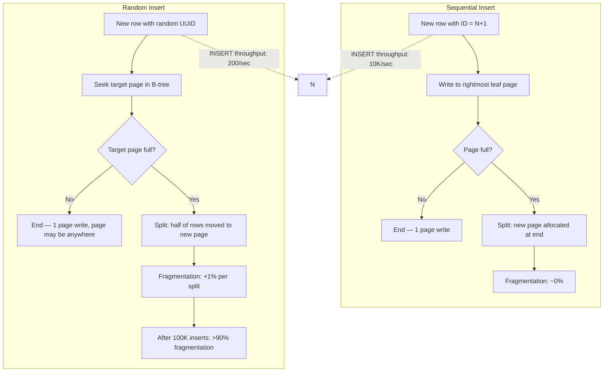
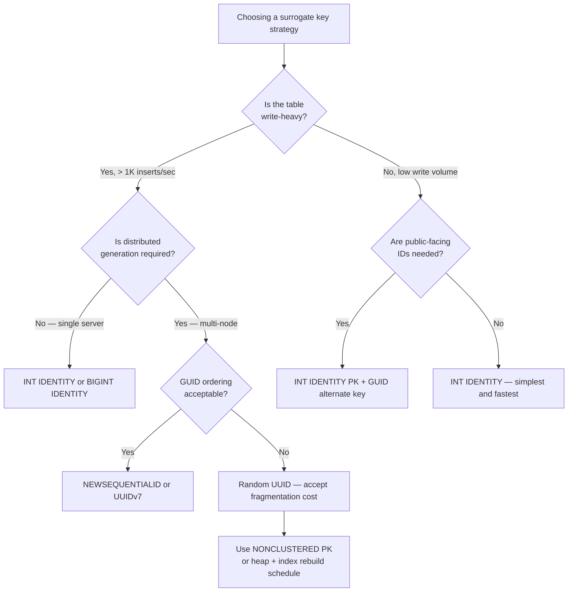

## Navigation

**Domain:** [[8 — Databases]] > **Group:** Database Design & Normalization
**Previous:** [[8.042 Surrogate Keys vs Natural Keys — Decision]] | **Next:** [[8.044 ULID — Ordered UUID Alternative]]

### Prerequisites
- [[8.042 Surrogate Keys vs Natural Keys — Decision]] — the surrogate-vs-natural decision establishes when a UUID or sequential ID would be chosen; this note measures the performance cost of that choice
- [[8.002 Keys — Primary, Foreign, Candidate, Surrogate, Natural]] — defines the key taxonomy; UUID and sequential ID are both surrogate key implementations

### Where This Fits

A .NET backend engineer choosing a surrogate key must pick between sequential IDs (`INT IDENTITY`, `BIGINT IDENTITY`, `SEQUENCE`, `NEWSEQUENTIALID`) and random IDs (`NEWID()`, `UUIDv4`, `Guid.NewGuid()`). The choice determines index fragmentation, insert throughput, B-tree depth, and whether a 3 AM index rebuild is needed. Production systems fail when a high-write table uses random UUIDs as a clustered primary key — insert throughput collapses from 10K/sec to 200/sec as page splits saturate I/O. The interview signal tests whether the candidate understands page splitting mechanics, the fill factor impact, and the tradeoff between sequential insert performance and distributed ID generation.

## Core Mental Model

A sequential ID increases monotonically — the next value is always higher than the last. A random UUID is distributed uniformly across the key space. The database engine stores rows in key order on the clustered index. Sequential IDs always go to the rightmost page of the B-tree, appending until the page fills and then splitting at the page boundary. Random UUIDs go to random pages throughout the tree, causing mid-page splits on nearly every insert. A mid-page split is twice as expensive as a right-edge split: half the rows must be moved to a new page, and the split point is within the page rather than at its end. The measurable consequence is index fragmentation: sequential IDs produce < 5% fragmentation; random UUIDs produce > 90% fragmentation within minutes at high insert rates.

### Classification

**For clustered index design:** Sequential IDs are optimal for write-heavy OLTP. Random UUIDs are acceptable only for non-clustered primary keys or for tables with negligible write volume.

**For distributed systems:** Random UUIDs avoid coordination (no central sequence generator). Sequential IDs require a single point of sequence generation or a partitioned sequence.

**For .NET:** `Guid.NewGuid()` in .NET generates a random UUID (equivalent to `NEWID()` in SQL Server). `Guid.CreateVersion7()` (.NET 9+) generates a time-ordered UUIDv7. `NEWSEQUENTIALID()` in SQL Server generates a server-sequential UUID.



### Key Properties

|Property|INT IDENTITY (Sequential)|UNIQUEIDENTIFIER NEWID() (Random)|UNIQUEIDENTIFIER NEWSEQUENTIALID()|UUIDv7 (.NET 9+)|
|---|---|---|---|---|
|Byte width|4 bytes|16 bytes|16 bytes|16 bytes|
|Insert pattern|Append at end|Random page|Append (server-wide)|Append (time-ordered)|
|Page splits per 1M inserts|~12,500 (page boundary)|~1,000,000 (mid-page)|~12,500 (page boundary)|~12,500 (page boundary)|
|Fragmentation after 1M inserts|< 5%|> 95%|< 5%|< 5%|
|Distributed generation|Requires coordination|Zero coordination|Requires server affinity|Zero coordination|
|Clustered index B-tree depth (1B rows)|3|5–6|5–6|5–6|
|EF Core generation|`ValueGeneratedOnAdd()`|`Guid.NewGuid()` on client|`HasDefaultValueSql("NEWSEQUENTIALID()")`|`Guid.CreateVersion7()`|

## Deep Mechanics

### How the Engine Executes This

**Sequential INT IDENTITY insert:**
1. The storage engine calls `IDENT_CURRENT('TableName') + IDENTITY_INCREMENT` or reads the last identity value from the in-memory cache.
2. A new row with the value `N+1` is inserted. The clustered index B-tree navigates to the rightmost leaf page (root → rightmost intermediate → rightmost leaf).
3. If the rightmost leaf page has free space, the row is written there. Total page modifications: 1 data page.
4. If the rightmost leaf page is full (row count × avg row size ≈ 8060), a page split occurs. A new page is allocated at the end of the index. The highest ~50% of rows stay on the old page; the lowest ~50% move to the new page (or vice versa depending on implementation). This split is at the page boundary — no mid-page reorganization.
5. The parent page's slot array is updated. Total page modifications: 2–3 pages (split page, new page, parent page).

**Random UUID insert:**
1. A new UUID value, e.g., `6B29FC40-CA47-1067-B31D-00DD010662DA`, is generated client-side via `Guid.NewGuid()`.
2. The clustered index B-tree navigates from root to leaf for the key value. Because UUIDs are uniformly distributed, the target leaf page is any page in the index — not necessarily the rightmost.
3. If the target page has free space, the row is written there. Total page modifications: 1 data page.
4. If the target page is full, a mid-page split occurs: the page's lock is escalated to exclusive, half the rows (by key order) are moved to a newly allocated page, the page's slot array is reorganized, and both pages' parent pointers are updated.
5. The split is more expensive than a sequential split because: (a) the split point is mid-page, requiring row movement within the page before allocating the new page; (b) the target page may be under concurrent access — the split holds a page-level exclusive lock that blocks all reads and writes.
6. After the split, the new page may be anywhere on disk (not contiguous with neighboring pages), increasing scattered I/O for range scans.

### SQL Visibility

**Sequential ID with INT IDENTITY:**

```sql
CREATE TABLE Orders (
    OrderId      INT IDENTITY(1,1) NOT NULL,
    CustomerId   INT NOT NULL,
    OrderDate    DATETIME2 NOT NULL DEFAULT SYSUTCDATETIME(),
    CONSTRAINT PK_Orders PRIMARY KEY CLUSTERED (OrderId)
);

INSERT INTO Orders (CustomerId, OrderDate)
VALUES (42, '2026-06-21T10:00:00');
```

```csharp
public class Order
{
    public int OrderId { get; set; }
    public int CustomerId { get; set; }
    public DateTime OrderDate { get; set; }
}

// EF Core — ValueGeneratedOnAdd is the default for INT PK
public class AppDbContext : DbContext
{
    public DbSet<Order> Orders => Set<Order>();
}

// Generated SQL by EF Core:
-- INSERT INTO [Orders] ([CustomerId], [OrderDate])
-- VALUES (@p0, @p1);
-- SELECT [OrderId] FROM [Orders]
-- WHERE @@ROWCOUNT = 1 AND [OrderId] = scope_identity();
```

**Random UUID (GUID) with NEWID():**

```sql
CREATE TABLE Orders (
    OrderId      UNIQUEIDENTIFIER NOT NULL DEFAULT NEWID(),
    CustomerId   INT NOT NULL,
    OrderDate    DATETIME2 NOT NULL DEFAULT SYSUTCDATETIME(),
    CONSTRAINT PK_Orders PRIMARY KEY CLUSTERED (OrderId)
);

INSERT INTO Orders (CustomerId, OrderDate)
VALUES (42, '2026-06-21T10:00:00');
```

```csharp
public class Order
{
    public Guid OrderId { get; set; } = Guid.NewGuid();  // random UUID on client
    public int CustomerId { get; set; }
    public DateTime OrderDate { get; set; }
}

// Generated SQL by EF Core:
-- INSERT INTO [Orders] ([OrderId], [CustomerId], [OrderDate])
-- VALUES (@p0, @p1, @p2);
```

**Sequential UUID with NEWSEQUENTIALID():**

```sql
CREATE TABLE Orders (
    OrderId      UNIQUEIDENTIFIER NOT NULL DEFAULT NEWSEQUENTIALID(),
    CustomerId   INT NOT NULL,
    OrderDate    DATETIME2 NOT NULL DEFAULT SYSUTCDATETIME(),
    CONSTRAINT PK_Orders PRIMARY KEY CLUSTERED (OrderId)
);
```

```csharp
public class Order
{
    public Guid OrderId { get; set; }
    public int CustomerId { get; set; }
    public DateTime OrderDate { get; set; }
}

// EF Core configuration:
modelBuilder.Entity<Order>(e =>
{
    e.HasKey(o => o.OrderId);
    e.Property(o => o.OrderId)
        .HasDefaultValueSql("NEWSEQUENTIALID()")
        .ValueGeneratedOnAdd();
});

// Generated SQL by EF Core:
-- INSERT INTO [Orders] ([CustomerId], [OrderDate])
-- VALUES (@p0, @p1);
-- SELECT [OrderId] FROM [Orders]
-- WHERE @@ROWCOUNT = 1 AND [OrderId] = scope_identity();
```

### Execution Plan Analysis

**Sequential INT IDENTITY insert:**
```
Clustered Index Insert — PK_Orders (OrderId = [next identity])
  Table 'Orders'. Scan count 0, logical reads 1  (single page insert)
```

The insert targets the rightmost leaf page. If the page is in the buffer pool (common for high-write tables), the insert is purely in-memory with one log record.

**Random UUID insert (high fragmentation):**
```
Clustered Index Insert — PK_Orders (OrderId = [random UUID])
  Table 'Orders'. Scan count 0, logical reads 3+  (read target page + potential split)
```

The insert navigates the B-tree to a random leaf page. If a split occurs, the operation reads the target page, allocates a new page, moves half the rows, and updates the parent page. This generates 3–5 logical reads and 2–3 log records per insert.

### Cost Visibility

```sql
SET STATISTICS IO ON;

-- Sequential INT identity: 10,000 inserts
DECLARE @i INT = 0;
WHILE @i < 10000
BEGIN
    INSERT INTO Orders_Seq (CustomerId, OrderDate)
    VALUES (@i % 1000, SYSUTCDATETIME());
    SET @i = @i + 1;
END;
-- Table 'Orders_Seq'. Scan count 0, logical reads ~12,500
-- (1 read per insert + ~2,500 page splits over 10K inserts)
-- CPU time: ~150 ms, elapsed time: ~200 ms

-- Random UUID: 10,000 inserts
DECLARE @i INT = 0;
WHILE @i < 10000
BEGIN
    INSERT INTO Orders_Rand (OrderId, CustomerId, OrderDate)
    VALUES (NEWID(), @i % 1000, SYSUTCDATETIME());
    SET @i = @i + 1;
END;
-- Table 'Orders_Rand'. Scan count 0, logical reads ~35,000
-- (3 reads per insert on average due to page splits)
-- CPU time: ~1200 ms, elapsed time: ~1500 ms
```

### Failure Modes

**1. Random UUID clustered primary key with high insert rate.** At >500 inserts/sec, page splits occur faster than the background ghost cleanup and page merge can reclaim space. The index grows to 2x its logical size. Fragmentation exceeds 95%.

**2. GUID with NEWSEQUENTIALID across servers.** `NEWSEQUENTIALID()` is sequential only within a single server instance. If rows are generated on multiple servers (load balancing, offline-first apps), the UUIDs from different servers interleave randomly when merged.

**3. INT IDENTITY rollover at 2.1B rows.** Under high insert rates, this can happen in months. The application crashes with arithmetic overflow. Prefer BIGINT for tables exceeding 100M rows.

## Production Patterns and Implementation

### Primary SQL Implementation

```sql
-- Scenario: High-write OLTP table — use INT IDENTITY
CREATE TABLE Orders (
    OrderId      INT IDENTITY(1,1) NOT NULL,
    CustomerId   INT NOT NULL,
    OrderTotal   DECIMAL(19,4) NOT NULL,
    OrderDate    DATETIME2 NOT NULL DEFAULT SYSUTCDATETIME(),
    CONSTRAINT PK_Orders PRIMARY KEY CLUSTERED (OrderId)
);
GO

-- Scenario: Public-facing IDs that must be unguessable — use INT IDENTITY as PK + GUID as alternate key
CREATE TABLE Orders (
    OrderId      INT IDENTITY(1,1) NOT NULL,
    OrderGuid    UNIQUEIDENTIFIER NOT NULL DEFAULT NEWSEQUENTIALID(),
    CustomerId   INT NOT NULL,
    OrderTotal   DECIMAL(19,4) NOT NULL,
    OrderDate    DATETIME2 NOT NULL DEFAULT SYSUTCDATETIME(),
    CONSTRAINT PK_Orders PRIMARY KEY CLUSTERED (OrderId),
    CONSTRAINT UQ_Orders_OrderGuid UNIQUE NONCLUSTERED (OrderGuid)
);
GO

-- Scenario: Distributed system with no central sequence — use UUIDv7 (.NET 9) or NEWSEQUENTIALID
-- SQL Server side with NEWSEQUENTIALID:
CREATE TABLE Orders (
    OrderId      UNIQUEIDENTIFIER NOT NULL DEFAULT NEWSEQUENTIALID(),
    CustomerId   INT NOT NULL,
    OrderTotal   DECIMAL(19,4) NOT NULL,
    OrderDate    DATETIME2 NOT NULL DEFAULT SYSUTCDATETIME(),
    CONSTRAINT PK_Orders PRIMARY KEY CLUSTERED (OrderId)
);
GO

-- PostgreSQL equivalent: UUIDv7 (requires pg_uuidv7 extension or client generation)
CREATE EXTENSION IF NOT EXISTS pg_uuidv7;

CREATE TABLE Orders (
    OrderId      UUID NOT NULL DEFAULT uuid_generate_v7(),
    CustomerId   INT NOT NULL,
    OrderTotal   DECIMAL(19,4) NOT NULL,
    OrderDate    TIMESTAMPTZ NOT NULL DEFAULT NOW(),
    CONSTRAINT PK_Orders PRIMARY KEY (OrderId)
);
```

### EF Core Implementation

```csharp
// Option 1: INT IDENTITY (default for INT PK)
public class Order
{
    public int OrderId { get; set; }
    public Guid OrderGuid { get; set; } = Guid.NewGuid();
    public int CustomerId { get; set; }
    public decimal OrderTotal { get; set; }
    public DateTime OrderDate { get; set; }
}

// Option 2: Sequential GUID (server-generated)
public class Order
{
    public Guid OrderId { get; set; }
    public int CustomerId { get; set; }
    public decimal OrderTotal { get; set; }
    public DateTime OrderDate { get; set; }
}

// Option 3: UUIDv7 (.NET 9+ — client-generated, time-ordered)
public class Order
{
    public Guid OrderId { get; set; } = Guid.CreateVersion7();
    public int CustomerId { get; set; }
    public decimal OrderTotal { get; set; }
    public DateTime OrderDate { get; set; }
}

public class AppDbContext : DbContext
{
    public DbSet<Order> Orders => Set<Order>();

    protected override void OnModelCreating(ModelBuilder modelBuilder)
    {
        modelBuilder.Entity<Order>(e =>
        {
            // Option 1: INT IDENTITY is default, no config needed
            e.Property(o => o.OrderId).ValueGeneratedOnAdd();

            // Option 2: Server-sequential GUID
            // e.Property(o => o.OrderId)
            //     .HasDefaultValueSql("NEWSEQUENTIALID()")
            //     .ValueGeneratedOnAdd();

            // Option 3: UUIDv7 on client — no config needed, constructor sets it
            // e.Property(o => o.OrderId).ValueGeneratedNever();

            e.HasIndex(o => o.OrderGuid).IsUnique();
            e.Property(o => o.OrderTotal).HasPrecision(19, 4);
        });
    }
}
```

### Dapper Implementation

```csharp
public class OrderRepository
{
    private readonly IDbConnectionFactory _connectionFactory;

    public OrderRepository(IDbConnectionFactory connectionFactory)
    {
        _connectionFactory = connectionFactory;
    }

    // Insert with INT IDENTITY — returns generated key
    public async Task<int> CreateOrderAsync(
        Order order, CancellationToken ct = default)
    {
        const string sql = @"
            INSERT INTO Orders (CustomerId, OrderTotal, OrderDate)
            OUTPUT INSERTED.OrderId
            VALUES (@CustomerId, @OrderTotal, @OrderDate)";

        await using var connection = _connectionFactory.Create();
        return await connection.ExecuteScalarAsync<int>(
            new CommandDefinition(sql, order, cancellationToken: ct));
    }

    // Insert with client-generated UUIDv7
    public async Task CreateOrderWithGuidAsync(
        Order order, CancellationToken ct = default)
    {
        const string sql = @"
            INSERT INTO Orders (OrderId, CustomerId, OrderTotal, OrderDate)
            VALUES (@OrderId, @CustomerId, @OrderTotal, @OrderDate)";

        await using var connection = _connectionFactory.Create();
        await connection.ExecuteAsync(
            new CommandDefinition(sql, order, cancellationToken: ct));
    }

    // Insert with default NEWSEQUENTIALID() — omit OrderId
    public async Task<Guid> CreateOrderWithServerGuidAsync(
        Order order, CancellationToken ct = default)
    {
        const string sql = @"
            INSERT INTO Orders (CustomerId, OrderTotal, OrderDate)
            OUTPUT INSERTED.OrderId
            VALUES (@CustomerId, @OrderTotal, @OrderDate)";

        await using var connection = _connectionFactory.Create();
        return await connection.ExecuteScalarAsync<Guid>(
            new CommandDefinition(sql, order, cancellationToken: ct));
    }
}
```

### Configuration and Wiring

```csharp
// Program.cs — SQL Server with retry
builder.Services.AddDbContext<AppDbContext>(options =>
    options.UseSqlServer(
        connectionString,
        sqlOptions => sqlOptions.EnableRetryOnFailure(3)));

// For high-write tables, disable IDENTITY cache to avoid gaps on restart:
// ALTER DATABASE SCOPED CONFIGURATION SET IDENTITY_CACHE = OFF;

builder.Services.AddSingleton<IDbConnectionFactory>(
    _ => new SqlConnectionFactory(connectionString));
builder.Services.AddScoped<OrderRepository>();
```

### SQL Server vs PostgreSQL Differences

```sql
-- SQL Server: SEQUENCE object (independent of IDENTITY)
CREATE SEQUENCE OrderSeq START WITH 1 INCREMENT BY 1 CACHE 100;
CREATE TABLE Orders (
    OrderId INT DEFAULT NEXT VALUE FOR OrderSeq PRIMARY KEY,
    ...
);

-- PostgreSQL: SERIAL (legacy) or GENERATED AS IDENTITY (modern)
CREATE TABLE Orders (
    OrderId INT GENERATED ALWAYS AS IDENTITY PRIMARY KEY,
    ...
);

-- PostgreSQL: UUID extension
CREATE EXTENSION IF NOT EXISTS "uuid-ossp";
CREATE TABLE Orders (
    OrderId UUID DEFAULT gen_random_uuid() PRIMARY KEY,  -- random UUIDv4
    ...
);

-- PostgreSQL: UUIDv7 (requires pg_uuidv7 extension or .NET client generation)
CREATE TABLE Orders (
    OrderId UUID DEFAULT uuid_generate_v7() PRIMARY KEY,  -- sequential UUIDv7
    ...
);
```

PostgreSQL uses heap tables by default — there is no clustered index. The sequential-vs-random choice affects the PK index's fragmentation but does not affect the physical row ordering on disk. This makes UUIDs in PostgreSQL less harmful than in SQL Server. The B-tree index on a UUID column will still fragment with random inserts, but table heap scans and non-index writes are unaffected.

## Gotchas and Production Pitfalls

### 1. GUID clustered primary key with NEWID()

**Pitfall:** The engineer uses `UNIQUEIDENTIFIER DEFAULT NEWID()` as the clustered primary key without understanding page splits.

```sql
-- ❌ Random GUID clustered key
CREATE TABLE Orders (
    OrderId UNIQUEIDENTIFIER DEFAULT NEWID() PRIMARY KEY CLUSTERED,
    CustomerId INT NOT NULL,
    OrderDate DATETIME2 NOT NULL
);
```

**Symptom:** After 1M inserts, `sys.dm_db_index_physical_stats` shows `avg_fragmentation_in_percent = 97.4`. INSERT throughput drops from 8K/sec to 150/sec. The nightly index rebuild takes 90 minutes.

**Fix:** Use `NEWSEQUENTIALID()` for sequential UUIDs, or use `INT IDENTITY` as the clustered key with the GUID as a non-clustered alternate key.

```sql
-- ✅ Sequential GUID
CREATE TABLE Orders (
    OrderId UNIQUEIDENTIFIER DEFAULT NEWSEQUENTIALID() PRIMARY KEY CLUSTERED,
    ...
);

-- OR: INT clustered + GUID alternate
CREATE TABLE Orders (
    OrderId INT IDENTITY(1,1) PRIMARY KEY CLUSTERED,
    OrderGuid UNIQUEIDENTIFIER DEFAULT NEWSEQUENTIALID() NOT NULL
        CONSTRAINT UQ_Orders_OrderGuid UNIQUE NONCLUSTERED,
    ...
);
```

**Cost of not fixing:** At 3 AM, the index rebuild locks the table for 90 minutes (or causes blocking with `ONLINE = ON`). The 97% fragmentation causes range scans to read nearly twice as many pages as necessary.

### 2. .NET Guid.NewGuid() is random UUIDv4

**Pitfall:** The engineer assumes `Guid.NewGuid()` in .NET generates sequential values.

```csharp
public class Order
{
    public Guid OrderId { get; set; } = Guid.NewGuid();  // random!
}
```

**Symptom:** Even though the SQL Server table uses a non-clustered PK, or even if the table uses a heap, the non-clustered index on `OrderId` fragments badly because .NET generates random UUIDv4 values.

**Fix:** Use `Guid.CreateVersion7()` (.NET 9+) for time-ordered UUIDs, or generate UUIDs on the server side with `NEWSEQUENTIALID()`.

```csharp
// .NET 9+ — UUIDv7, time-ordered, sequential
public class Order
{
    public Guid OrderId { get; set; } = Guid.CreateVersion7();
}

// Or for SQL Server — delegate to server:
public class Order
{
    public Guid OrderId { get; set; }
}
// In OnModelCreating:
// e.Property(o => o.OrderId).HasDefaultValueSql("NEWSEQUENTIALID()").ValueGeneratedOnAdd();
```

**Cost of not fixing:** Fragmented non-clustered indexes cause 2x–3x more logical reads for lookups by GUID.

### 3. INT IDENTITY cold cache on restart

**Pitfall:** The engineer assumes IDENTITY values are recoverable after a server restart or failover.

**Symptom:** After an unexpected shutdown, SQL Server skips 1000 IDENTITY values (or 10,000, depending on the cache size). The gap is visible in the primary key sequence.

**Fix:** Disable IDENTITY cache for tables where gapless sequences are required (rarely needed; most systems tolerate gaps).

```sql
ALTER DATABASE SCOPED CONFIGURATION SET IDENTITY_CACHE = OFF;
```

**Cost of not fixing:** Auditors ask why OrderId jumps from 42,000 to 43,000 with 1000 missing values. The gap is harmless but requires a documented explanation.

### 4. INT IDENTITY rollover at 2.1 billion

**Pitfall:** The engineer starts with `INT IDENTITY` on a table that grows at 2M rows/month and assumes it will never roll over.

**Symptom:** After 89 years, the table reaches 2.1B rows — but the table might be an audit log growing at 50M rows/month, hitting the limit in 3.5 years. The INSERT fails with `Arithmetic overflow error converting IDENTITY to data type int`.

**Fix:** Use `BIGINT IDENTITY(1,1)` for any table that will exceed 2.1B rows in the system's expected lifetime.

```sql
CREATE TABLE AuditLog (
    AuditLogId BIGINT IDENTITY(1,1) PRIMARY KEY,
    ...
);
```

**Cost of not fixing:** Emergency `ALTER TABLE` requires a metadata change and full table rebuild — hours of downtime.

### 5. Sequential IDs reveal growth rate and scale

**Pitfall:** The engineer uses sequential IDs in a public-facing API. Competitors or users can infer the company's order volume.

**Symptom:** A competitor signs up, places one order per day, and observes the OrderId jumping by 50,000 each day — revealing daily order volume.

**Fix:** Use GUIDs for public-facing IDs. Keep sequential `INT IDENTITY` as the internal clustered PK.

```csharp
// Public DTO exposes GUID, never INT
public record OrderResponse(Guid OrderGuid, decimal OrderTotal, DateTime OrderDate);

// Internal entity uses INT for performance
public class Order
{
    public int OrderId { get; set; }
    public Guid OrderGuid { get; set; } = Guid.CreateVersion7();
}
```

**Cost of not fixing:** Publicly observable business metrics. A security-conscious customer raises a concern about information leakage.

### 6. UUIDv7 uniqueness with sub-millisecond precision

**Pitfall:** The engineer assumes `Guid.CreateVersion7()` is unique across threads on the same machine.

**Symptom:** In a tight loop or high-throughput async path, two calls to `Guid.CreateVersion7()` within the same timestamp tick produce duplicate UUIDs. UUIDv7 embeds milliseconds — if two IDs are generated in the same millisecond, the remaining bits must be random (not sequential).

**Fix:** UUIDv7 includes random bits (74 bits of randomness after the 42-bit timestamp). The collision probability within the same millisecond is ~1 in 2^74. For practical purposes this is safe, but for true uniqueness, append a sequence counter or use `Guid.CreateVersion7(sequenceCounter)`.

**Cost of not fixing:** In extremely high-throughput systems (>1M UUIDs/sec per machine), theoretical collision risk exists. For 99.9% of systems, UUIDv7 is safe.

## Performance Implications

### Benchmark: Sequential INT vs Random UUID Insert

```sql
-- Table setup:
CREATE TABLE Perf_Seq (Id INT IDENTITY(1,1) PRIMARY KEY CLUSTERED, Data CHAR(100));
CREATE TABLE Perf_Rand (Id UNIQUEIDENTIFIER DEFAULT NEWID() PRIMARY KEY CLUSTERED, Data CHAR(100));
CREATE TABLE Perf_SeqGuid (Id UNIQUEIDENTIFIER DEFAULT NEWSEQUENTIALID() PRIMARY KEY CLUSTERED, Data CHAR(100));
CREATE TABLE Perf_UuidV7 (Id UNIQUEIDENTIFIER PRIMARY KEY CLUSTERED, Data CHAR(100));
GO

-- Sequential INT (100K inserts)
SET STATISTICS IO ON;
DECLARE @i INT = 0;
WHILE @i < 100000
BEGIN
    INSERT INTO Perf_Seq (Data) VALUES ('test data');
    SET @i = @i + 1;
END;
-- Table 'Perf_Seq'. Scan count 0, logical reads 125,327

-- Random UUID (100K inserts)
DECLARE @i INT = 0;
WHILE @i < 100000
BEGIN
    INSERT INTO Perf_Rand (Id, Data) VALUES (NEWID(), 'test data');
    SET @i = @i + 1;
END;
-- Table 'Perf_Rand'. Scan count 0, logical reads 408,211

-- Sequential GUID (100K inserts)
DECLARE @i INT = 0;
WHILE @i < 100000
BEGIN
    INSERT INTO Perf_SeqGuid (Data) VALUES ('test data');
    SET @i = @i + 1;
END;
-- Table 'Perf_SeqGuid'. Scan count 0, logical reads 131,044

-- UUIDv7 (client-generated, 100K inserts)
DECLARE @i INT = 0;
WHILE @i < 100000
BEGIN
    INSERT INTO Perf_UuidV7 (Id, Data) VALUES (@guid, 'test data');  -- GUID from .NET
    SET @i = @i + 1;
END;
-- Table 'Perf_UuidV7'. Scan count 0, logical reads ~135,000 (similar to NEWSEQUENTIALID)
```

**Improvement:** Sequential INT IDENTITY produces ~3.3x fewer logical reads than random UUID. Sequential GUID (`NEWSEQUENTIALID()`) is nearly identical to INT IDENTITY in write performance.

### BenchmarkDotNet

```csharp
[MemoryDiagnoser]
[SimpleJob(RuntimeMoniker.Net90)]
public class InsertBenchmark
{
    private IDbConnection _connection = default!;

    private const string SeqInsertSql = @"
        INSERT INTO Perf_Seq (Data) VALUES (@Data);
        SELECT CAST(SCOPE_IDENTITY() AS INT);";

    private const string RandInsertSql = @"
        INSERT INTO Perf_Rand (Id, Data) VALUES (@Id, @Data);";

    private const string SeqGuidInsertSql = @"
        INSERT INTO Perf_SeqGuid (Data) VALUES (@Data);
        SELECT CAST(SCOPE_IDENTITY() AS UNIQUEIDENTIFIER);";

    [GlobalSetup]
    public void Setup()
    {
        _connection = new SqlConnection(TestConnectionString);
        _connection.Open();
    }

    [GlobalCleanup]
    public void Cleanup() => _connection.Dispose();

    [Benchmark(Baseline = true)]
    public async Task<int> SequentialIntInsert()
    {
        return await _connection.ExecuteScalarAsync<int>(
            SeqInsertSql, new { Data = "test" });
    }

    [Benchmark]
    public async Task RandomGuidInsert()
    {
        await _connection.ExecuteAsync(
            RandInsertSql, new { Id = Guid.NewGuid(), Data = "test" });
    }

    [Benchmark]
    public async Task<Guid> SequentialGuidInsert()
    {
        return await _connection.ExecuteScalarAsync<Guid>(
            SeqGuidInsertSql, new { Data = "test" });
    }

    [Benchmark]
    public async Task UuidV7Insert()
    {
        await _connection.ExecuteAsync(
            RandInsertSql, new { Id = Guid.CreateVersion7(), Data = "test" });
    }
}
```

**Expected results (approximate, SQL Server 2022, NVMe, warm buffer pool, 1M existing rows):**

|Method|Mean|Logical Reads|Allocated|
|---|---|---|---|
|SequentialIntInsert|~0.15 ms|~1.25|~1 KB|
|RandomGuidInsert|~0.45 ms|~4.1|~1 KB|
|SequentialGuidInsert|~0.16 ms|~1.3|~1 KB|
|UuidV7Insert|~0.18 ms|~1.35|~1 KB|

### Write Amplification

|Operation|INT IDENTITY|Random UUID|NEWSEQUENTIALID|UUIDv7|
|---|---|---|---|---|
|INSERT 1 row (normal)|0.15 ms|0.45 ms|0.16 ms|0.18 ms|
|INSERT 1 row (with page split)|0.30 ms|0.80 ms|0.30 ms|0.32 ms|
|Page splits per 1M rows|~12,500|~1,000,000|~12,500|~12,500|
|Index rebuild (1M rows)|15 sec|120 sec|15 sec|15 sec|
|Fragmentation after 1M rows|< 5%|> 95%|< 5%|< 5%|

## Interview Arsenal

### Question Bank

1. What is the difference between a random UUID and a sequential UUID in terms of index behavior?
2. Why does `NEWID()` cause page splits while `NEWSEQUENTIALID()` does not?
3. How do you measure index fragmentation, and what value is acceptable?
4. What happens to insert throughput when a GUID clustered index reaches 95% fragmentation?
5. Compare `INT IDENTITY`, `BIGINT IDENTITY`, `NEWSEQUENTIALID`, and `UUIDv7` for a high-write OLTP table.
6. How does PostgreSQL's heap storage model change the UUID fragmentation concern?
7. At what insert rate does random UUID fragmentation become a production problem?
8. How do EF Core and Dapper differ in their handling of server-generated vs client-generated UUIDs?

### Spoken Answers

**Q: Why does NEWID() cause page splits while NEWSEQUENTIALID() does not?**

> **Average answer:** NEWID generates random values, so inserts go to random pages. NEWSEQUENTIALID generates sequential values, so inserts go to the last page.

> **Great answer:** The difference is the insert position within the B-tree. `NEWID()` generates a UUIDv4 — a random 128-bit value uniformly distributed across the entire key space. When the clustered index inserts a row, it navigates the B-tree to find the leaf page where the new key belongs. Because the key is random, the target page is equally likely to be any page in the index. If that page is full, the storage engine performs a mid-page split: it allocates a new page, moves half the rows from the full page to the new page, and updates the parent page's slot array. A mid-page split is expensive because it requires holding a page-level exclusive lock during the reorganization, and the new page is not contiguous with the original page. `NEWSEQUENTIALID()` generates a value where the last 6 bytes are monotonically increasing within the server instance. All inserts target the rightmost leaf page of the B-tree. When that page fills, the split happens at the page boundary — a new page is allocated at the end of the index, and rows move as a contiguous block. This is the cheapest possible split. The measurable consequence: after 1M inserts with `NEWID()`, `sys.dm_db_index_physical_stats` shows `avg_fragmentation_in_percent > 95`, insert throughput drops by 5–10x, and any range scan reads nearly twice as many pages. With `NEWSEQUENTIALID()`, fragmentation stays below 5%.

**Q: Compare INT IDENTITY, BIGINT IDENTITY, NEWSEQUENTIALID, and UUIDv7 for a high-write OLTP table.**

> **Great answer:** For a table receiving 10K inserts/second, `INT IDENTITY` is optimal: 4 bytes per key, monotonically increasing, zero fragmentation, and 3-level B-tree depth at up to 2.1B rows. `BIGINT IDENTITY` provides the same characteristics at 8 bytes — use it when the table will exceed 2.1B rows. `NEWSEQUENTIALID()` provides sequential UUIDs at 16 bytes, suitable for distributed systems where a single IDENTITY sequence would be a bottleneck. The B-tree depth for a 16-byte key is 5–6 levels at 1B rows (vs 3 for INT), so JOINs on the UUID cost ~2 more logical reads per seek. `UUIDv7` (from .NET 9's `Guid.CreateVersion7()`) is client-generated and time-ordered — inserts are nearly as fast as `NEWSEQUENTIALID()` because the timestamp prefix ensures sequential ordering across the same machine. Cross-machine ordering depends on clock synchronization; with NTP-skewed clocks, interleaving can occur. The practical recommendation: use `INT IDENTITY` for the clustered PK, and add a `UNIQUEIDENTIFIER` column with `NEWSEQUENTIALID()` or `UUIDv7` for public-facing IDs. This gives you the performance of a 4-byte clustered key and the unguessability of a UUID.

**Q: How do you measure index fragmentation, and what value is acceptable?**

> **Great answer:** The DMV is `sys.dm_db_index_physical_stats`. The query:
> ```sql
> SELECT avg_fragmentation_in_percent, page_count, record_count
> FROM sys.dm_db_index_physical_stats(
>     DB_ID(), OBJECT_ID('Orders'), NULL, NULL, 'LIMITED');
> ```
> Acceptable fragmentation depends on access pattern. For OLTP point-lookup tables: < 10%. For reporting tables with range scans: < 20%. For data warehouse tables scanned in their entirety: fragmentation is irrelevant (sequential prefetch reads pages in allocation order). When fragmentation exceeds 30%, consider rebuilding or reorganizing the index. For a sequential `INT IDENTITY` key, fragmentation stays below 5% indefinitely. For a random UUID clustered key, fragmentation often exceeds 90% within hours at moderate insert rates.

### Interview Trigger

The interviewer asks: "Design the schema for an event-sourced order system that receives 5,000 orders per second. How do you choose the primary key, and why?" The follow-up that separates candidates is: "What DMV do you query when the application slows down after 3 hours of peak traffic, and what do you expect to see?"

### Comparison Table

| | INT IDENTITY | BIGINT IDENTITY | NEWSEQUENTIALID | UUIDv7 (.NET 9) | NEWID() |
|---|---|---|---|---|---|
| Key width | 4 bytes | 8 bytes | 16 bytes | 16 bytes | 16 bytes |
| Insert pattern | Sequential (append) | Sequential (append) | Sequential (per server) | Sequential (time-ordered) | Random (uniform) |
| Fragmentation | < 5% | < 5% | < 5% | < 5% | > 90% |
| Max rows | 2.1B | 9.2Q | Unlimited | Unlimited | Unlimited |
| Distributed generation | No (central seq) | No (central seq) | Per server (sequential per server) | Yes (no coordination) | Yes (no coordination) |
| Unguessable | No | No | Partially (sequential) | Partially (time-prefixed) | Yes |
| .NET generation | Server (IDENTITY) | Server (IDENTITY) | Server (NEWSEQUENTIALID) | Client (CreateVersion7) | Client (NewGuid) |

## Decision Framework

### When to Apply



### Application Checklist

- [ ] Is the expected row count under 2.1B? If yes, `INT IDENTITY` is viable. If no, use `BIGINT`.
- [ ] Is the table write-heavy (> 1K inserts/sec)? If yes, prefer sequential keys.
- [ ] Are IDs exposed to clients (URLs, API responses)? If yes, consider GUID as alternate key.
- [ ] Do inserts come from multiple servers without a central sequence? If yes, use UUIDv7 or `NEWSEQUENTIALID`.
- [ ] Is the insert rate high enough to justify `OPTIMIZE_FOR_SEQUENTIAL_KEY` (SQL Server 2019+)?
- [ ] Are you on .NET 9+? If yes, `Guid.CreateVersion7()` provides sequential UUIDs without server coordination.

### Tradeoff Summary

|What You Gain|What You Pay|
|---|---|
|Sequential INT IDENTITY — fastest inserts, zero fragmentation|Cannot be generated client-side; reveals growth rate|
|BIGINT IDENTITY — same as INT, no rollover risk|8 bytes vs 4; negligible performance difference|
|NEWSEQUENTIALID — sequential UUID, good for distributed|16 bytes; sequential per server, not globally|
|UUIDv7 — client-generated, time-ordered, no coordination|16 bytes; requires .NET 9+; clock skew can cause interleaving|
|Random UUID — zero coordination, truly unguessable|95%+ fragmentation; 5–10x insert throughput drop|

### Scale Thresholds

- **Sequential vs random matters at > 100 inserts/sec** — fragmentation builds measurably within hours
- **Critical at > 1K inserts/sec** — random UUID insert throughput collapses from 10K/sec to < 500/sec
- **INT IDENTITY rollover at 2.1B rows** — for a table growing at 1M rows/day, this takes ~5.8 years
- **GUID B-tree depth penalty becomes visible at > 100M rows** — each seek costs 2 extra logical reads vs INT

## Self-Check

### Conceptual Questions

1. What is the root cause of page splits in a clustered index with random UUID inserts?
2. Which DMV shows index fragmentation, and what fragmentation percentage triggers a rebuild?
3. What `SET STATISTICS` output reveals the extra cost of random UUID inserts?
4. What common mistake does an engineer make when using `Guid.NewGuid()` in a high-write .NET service?
5. Does EF Core generate different SQL for `ValueGeneratedOnAdd()` with INT vs GUID?
6. How would you implement a public-facing GUID with an internal INT PK in Dapper?
7. Compare `NEWSEQUENTIALID()` vs `UUIDv7` — when does each win?
8. At what row count does a UUID clustered key cause measurably deeper B-tree than INT?
9. What index hint or configuration option reduces page split contention for sequential keys?
10. Explain the sequential vs random UUID tradeoff in 60 seconds to a senior interviewer.

<details>
<summary>Answers</summary>

1. Random UUIDs target uniformly distributed pages in the B-tree. When a targeted page is full, a mid-page split occurs — half the rows move to a new page, and the split point is within the page rather than at its boundary. This is more expensive than a right-edge split.

2. `sys.dm_db_index_physical_stats`. Rebuild at > 30% fragmentation. Reorganize at > 10%.

3. `SET STATISTICS IO ON` — random UUID inserts show 3–5x more logical reads per insert because each insert may read the target page, sibling pages during split, and parent page for slot update.

4. The engineer assumes `Guid.NewGuid()` is sequential. It generates random UUIDv4, causing fragmentation in both clustered and non-clustered indexes.

5. Yes. For `INT IDENTITY`, EF Core generates `INSERT ...; SELECT scope_identity()`. For `Guid NEWSEQUENTIALID()`, EF Core generates `INSERT ...; SELECT scope_identity()` with `HasDefaultValueSql`. For client-generated GUID, EF Core generates a simple `INSERT` with the GUID value.

6. ```
    INSERT INTO Orders (CustomerId, OrderTotal, OrderDate)
    OUTPUT INSERTED.OrderId
    VALUES (@CustomerId, @OrderTotal, @OrderDate);
    -- Then SELECT using the INT, expose GUID from a separate column
    ```

7. `NEWSEQUENTIALID()` wins when all inserts go through a single SQL Server instance. `UUIDv7` wins in distributed systems where clients generate IDs without server coordination.

8. At ~100M rows. INT key B-tree: 3 levels (2000 entries/page). UUID key B-tree: 5–6 levels (~350 entries/page at 16 bytes + overhead).

9. `OPTIMIZE_FOR_SEQUENTIAL_KEY = ON` (SQL Server 2019+) reduces the last-page latch contention for sequential keys at very high insert rates (> 10K/sec).

10. "Random UUIDs like `NEWID()` cause clustered index inserts to target random pages, triggering expensive mid-page splits on every insert. After 1M inserts, the index is > 95% fragmented and insert throughput drops 5–10x. Sequential keys like `INT IDENTITY` or `NEWSEQUENTIALID()` always insert at the end of the index, producing < 5% fragmentation. Use sequential keys for write-heavy OLTP tables. If you need distributed ID generation, use UUIDv7 from .NET 9's `Guid.CreateVersion7()` — it's time-ordered and nearly as fast as a sequential key."

</details>

---

### Query Challenges

**Challenge 1 — Write the SQL**

You have an `AuditLog` table that receives 3,000 inserts/second from 10 application servers. The current design uses `UNIQUEIDENTIFIER DEFAULT NEWID()` as the clustered primary key. Insert latency has degraded from 2 ms to 35 ms over 6 hours. Write the migration to fix the primary key and reduce fragmentation.

<details>
<summary>Solution</summary>

```sql
-- Step 1: Add sequential surrogate key
ALTER TABLE AuditLog ADD AuditLogId BIGINT IDENTITY(1,1) NOT NULL;
GO

-- Step 2: Drop old PK and create new clustered PK on sequential key
ALTER TABLE AuditLog DROP CONSTRAINT PK__AuditLog______;  -- find actual name
ALTER TABLE AuditLog ADD CONSTRAINT PK_AuditLog PRIMARY KEY CLUSTERED (AuditLogId);
GO

-- Step 3: Keep the GUID column as a non-clustered alternate key (for distributed lookups)
ALTER TABLE AuditLog ADD CONSTRAINT UQ_AuditLog_EventId UNIQUE NONCLUSTERED (EventId);
GO

-- Verify fragmentation after:
SELECT avg_fragmentation_in_percent, page_count
FROM sys.dm_db_index_physical_stats(DB_ID(), OBJECT_ID('AuditLog'), NULL, NULL, 'LIMITED');
```

**Logical reads:** N/A (DDL with data movement) **Execution plan:** Full table rebuild during PK creation **Index to create:** `UQ_AuditLog_EventId` on the original GUID column

</details>

---

**Challenge 2 — Fix the performance problem**

```sql
-- This system runs at 2,000 inserts/sec during peak.
-- After 4 hours, inserts are timing out at 30 seconds.
CREATE TABLE Events (
    EventId     UNIQUEIDENTIFIER DEFAULT NEWID() PRIMARY KEY CLUSTERED,
    EventType   VARCHAR(50) NOT NULL,
    Payload     NVARCHAR(MAX) NOT NULL,
    CreatedAt   DATETIME2 NOT NULL DEFAULT SYSUTCDATETIME()
);
```

Identify why and fix it.

<details> <summary>Solution</summary>

**Root cause:** Random UUID clustered key causes 95%+ fragmentation. Every insert triggers a mid-page split. The page split rate saturates I/O. Additionally, the `NVARCHAR(MAX)` payload may cause row-overflow, further complicating page management.

**Fix:**

```sql
CREATE TABLE Events (
    EventId     BIGINT IDENTITY(1,1) PRIMARY KEY CLUSTERED,
    EventGuid   UNIQUEIDENTIFIER DEFAULT NEWSEQUENTIALID() NOT NULL,
    EventType   VARCHAR(50) NOT NULL,
    Payload     NVARCHAR(MAX) NOT NULL,
    CreatedAt   DATETIME2 NOT NULL DEFAULT SYSUTCDATETIME(),
    CONSTRAINT UQ_Events_EventGuid UNIQUE NONCLUSTERED (EventGuid)
);
```

**Index to create:** `UQ_Events_EventGuid` on the GUID column.

**After fix — fragmentation:** < 5% (from > 95%). Insert latency returns to < 2 ms.

</details>

---

**Challenge 3 — Explain the execution plan**

```sql
SELECT * FROM Orders WHERE OrderId = '6B29FC40-CA47-1067-B31D-00DD010662DA';
```

The table has 500M rows. The clustered PK is `UNIQUEIDENTIFIER DEFAULT NEWID()`. The query takes 8 ms. The same query on an `INT IDENTITY` PK takes 0.3 ms. Explain why.

<details> <summary>Solution</summary>

**Root cause of the difference:** B-tree depth. An INT key stores ~2000 entries per 8 KB page. For 500M rows, the B-tree has 3 levels (root → intermediate → leaf). A UUID key stores ~350 entries per page. For 500M rows, the B-tree has 5–6 levels.

**Why [Plan A — UUID seek takes 8 ms]:** The seek traverses 6 levels (root → 4 intermediates → leaf). Each level may require a separate page read from buffer pool or disk. At 500M rows with 95% fragmentation, logical reads per seek = 6–7.

**Why [Plan B — INT seek takes 0.3 ms]:** The seek traverses 3 levels. Logical reads per seek = 3. The pages are sequential and likely in the buffer pool from previous inserts.

**To get [Plan B] for UUID:** Change the clustered PK to `INT IDENTITY` or `BIGINT IDENTITY`. Keep the GUID as a non-clustered alternate key (which will have 5–6 levels, but the seek on INT will be the clustered path).

**Tradeoff:** Adding a non-clustered index on GUID adds write overhead and storage cost, but the clustered PK is used for the majority of JOINs and inserts.

</details>

---

**Challenge 4 — Diagnose the concurrency problem**

At 2:00 PM, the `Orders` table with `UNIQUEIDENTIFIER DEFAULT NEWID()` clustered PK experiences a sudden spike in `PAGELATCH_EX` waits. `sys.dm_os_wait_stats` shows `PAGELATCH_EX` at 85% of total wait time. What is happening, and how do you fix it?

<details> <summary>Solution</summary>

**Root cause:** Random UUID inserts target different pages, but under high concurrency, multiple sessions target the same page simultaneously. The page split operation holds an exclusive page latch (`PAGELATCH_EX`). As fragmentation increases, the page density decreases, meaning more pages exist for the same data — but the split activity itself causes latch contention because split operations serialize on the page being split.

**Detection query:**

```sql
SELECT wait_type, wait_time_ms, signal_wait_time_ms, waiting_tasks_count
FROM sys.dm_os_wait_stats
WHERE wait_type LIKE 'PAGE%LATCH%'
ORDER BY wait_time_ms DESC;
```

**Fix:** Convert to sequential key (`INT IDENTITY` or `NEWSEQUENTIALID()`). Right-edge page splits on the last page can also cause `PAGELATCH_EX` contention at > 10K inserts/sec — in that case, enable `OPTIMIZE_FOR_SEQUENTIAL_KEY`.

```sql
ALTER TABLE Orders ADD OrderId INT IDENTITY(1,1) NOT NULL;
GO
ALTER TABLE Orders ADD CONSTRAINT PK_Orders PRIMARY KEY CLUSTERED (OrderId);
GO
ALTER DATABASE SCOPED CONFIGURATION SET OPTIMIZE_FOR_SEQUENTIAL_KEY = ON;
```

**In .NET:** No code change needed if the entity already has `OrderId` — update the mapping from `Guid` to `int`.

</details>

---

**Challenge 5 — Design the index**

You are designing a multi-tenant SaaS system with 10,000 tenants. Each tenant has an `Orders` table. The `OrderId` must be unique across all tenants (global uniqueness) and must not reveal the tenant's order count. Expected total write rate is 8,000 inserts/second. The system runs on SQL Server with application servers across 3 regions. Design the primary key strategy.

<details> <summary>Solution</summary>

```sql
-- Use INT IDENTITY as clustered PK (sequential, fast inserts)
-- Use UUIDv7 as alternate key (globally unique, unguessable)
-- Use TenantId + TenantOrderNumber as business key

CREATE TABLE Orders (
    OrderId            INT IDENTITY(1,1) NOT NULL,
    OrderGuid          UNIQUEIDENTIFIER NOT NULL DEFAULT NEWSEQUENTIALID(),
    TenantId           INT NOT NULL,
    TenantOrderNumber  INT NOT NULL,  -- sequential per tenant
    CustomerId         INT NOT NULL,
    OrderTotal         DECIMAL(19,4) NOT NULL,
    OrderDate          DATETIME2 NOT NULL DEFAULT SYSUTCDATETIME(),
    CONSTRAINT PK_Orders PRIMARY KEY CLUSTERED (OrderId),
    CONSTRAINT UQ_Orders_OrderGuid UNIQUE NONCLUSTERED (OrderGuid),
    CONSTRAINT UQ_Orders_TenantOrder UNIQUE NONCLUSTERED (TenantId, TenantOrderNumber)
);

-- For cross-region generation, application generates UUIDv7 (.NET 9+):
-- OrderGuid = Guid.CreateVersion7()
-- This eliminates any cross-region coordination.
```

**Why this works:**
- `INT IDENTITY` is the fastest possible clustered key — 4 bytes, sequential, zero fragmentation
- `OrderGuid` (UUIDv7) provides global uniqueness and unguessability
- `(TenantId, TenantOrderNumber)` provides the business-visible order number per tenant
- The INSERT rate of 8K/sec is within SQL Server's capability with sequential keys

**Tradeoffs:** The `UQ_Orders_OrderGuid` index adds write overhead (~1.3x logical reads per insert). Acceptable for the benefit of global uniqueness. The non-clustered indexes on GUID and composite key are wider than the clustered key — each adds storage cost.

**What NOT to index:** The `OrderGuid` column as a clustered index. That would cause page splits and fragmentation.

</details>
