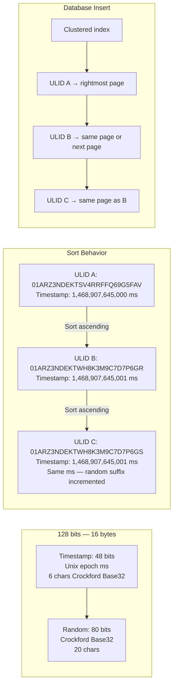

## Navigation

**Domain:** [[8 — Databases]] > **Group:** Database Design & Normalization
**Previous:** [[8.043 UUID vs Sequential ID — Performance Implications]] | **Next:** [[8.045 Composite Primary Keys — When to Use]]

### Prerequisites
- [[8.043 UUID vs Sequential ID — Performance Implications]] — explains why sequential IDs outperform random UUIDs for clustered indexes; ULID solves the same ordering problem
- [[8.042 Surrogate Keys vs Natural Keys — Decision]] — ULID is a surrogate key strategy; understanding when to use any surrogate vs natural key informs whether ULID is appropriate

### Where This Fits

A .NET backend engineer distributing ID generation across microservices without a central sequence needs an identifier that is both globally unique and insertion-order sortable. ULID (Universally Unique Lexicographically Sortable Identifier) provides 128-bit identifiers with a 48-bit millisecond timestamp prefix and 80 bits of randomness, encoded as 26 Crockford Base32 characters. It solves the same problem as UUIDv7 but uses a more human-friendly encoding and is available as a library for any .NET version (not just .NET 9+). Production scenarios include: event-sourced systems where log ordering by ID is required, distributed primary keys that must be sortable without a timestamp column, and URL-safe identifiers that are shorter than hex-encoded UUIDs. The interview signal tests whether the candidate understands the tradeoff between timestamp-prefixed ordering and clock-skew-induced disorder, and when to choose ULID over UUIDv7 or Snowflake.

## Core Mental Model

ULID is a 128-bit value with two components: a 48-bit Unix timestamp (millisecond precision) followed by 80 bits of random data. The timestamp occupies the most significant bits, so ULIDs sort lexicographically (and binary-order) by creation time. The encoding is 26-character Crockford Base32, which is case-insensitive and avoids ambiguous characters (I, L, O, U). The ordering property means a clustered index on a ULID column exhibits sequential insert behavior — new rows go to the rightmost page — as long as the system clock does not run backward. Within the same millisecond, the random suffix is incremented monotonically (the spec requires lexicographic ordering within the same timestamp, so a ULID library must increment the random bits when multiple ULIDs are generated in the same ms).

### Classification

**For ID generation:** ULID is a client-generated, time-ordered, globally unique identifier. It belongs to the family of ordered UUID alternatives including UUIDv7 and Snowflake.

**For index performance:** ULID as a clustered key produces sequential inserts (append at end) with < 5% fragmentation — comparable to `INT IDENTITY` or `NEWSEQUENTIALID`, but requires no server coordination.

**For .NET:** ULID requires a third-party library (`Ulid` NuGet package) or a custom implementation. .NET 9's `Guid.CreateVersion7()` provides equivalent ordering without an external dependency.



### Key Properties

|Property|ULID|UUIDv4 (Random)|UUIDv7 (.NET 9)|INT IDENTITY|
|---|---|---|---|---|
|Byte width|16 bytes|16 bytes|16 bytes|4 bytes|
|String length|26 chars (Base32)|36 chars (hex with dashes)|36 chars (hex with dashes)|Up to 10 digits|
|Timestamp precision|1 ms|None|1 ms|Insert order (not time)|
|Ordering|Monotonic per ms|None|Monotonic per ms|Monotonic (always increasing)|
|Clock-skew tolerance|Bounded by monotonic increment|N/A|Bounded by monotonic increment|N/A|
|Distributed generation|Yes (no coordination)|Yes (no coordination)|Yes (no coordination)|No (central sequence)|
|URL-safe|Yes (no dashes, case-insensitive)|No (dashes, mixed case)|No (dashes, mixed case)|Yes|
|Human-readable timestamp|Yes (first 8 chars decode to time)|No|Partially (v1 only)|No|

## Deep Mechanics

### How the Engine Executes This

**ULID insert as clustered key:**
1. The application generates a ULID using the current UTC timestamp in milliseconds plus a monotonic random suffix. The timestamp is encoded in the most significant bits.
2. The ULID is sent as the PK value in the INSERT statement. The clustered index B-tree navigates to the rightmost leaf page because the ULID's timestamp prefix places it at or near the end of the key space.
3. If clocks are synchronized across application servers, ULIDs from different servers interleave within the same millisecond window but remain roughly sequential — inserts target pages near the rightmost end.
4. If a server's clock runs backward (NTP adjustment, manual time change, VM pause), that server generates ULIDs with timestamps in the past. Those ULIDs are inserted into B-tree pages that are no longer the rightmost page, causing mid-index page splits.
5. Monotonicity within the same millisecond: if two ULIDs are generated at the same millisecond, the random suffix is incremented to ensure the second ULID sorts after the first. This prevents ambiguity in sort order.

### SQL Visibility

**ULID as primary key (stored as CHAR(26) or BINARY(16)):**

```sql
-- Option A: Store as CHAR(26) — human-readable, no conversion
CREATE TABLE Orders (
    OrderId      CHAR(26) NOT NULL,
    CustomerId   INT NOT NULL,
    OrderTotal   DECIMAL(19,4) NOT NULL,
    OrderDate    DATETIME2 NOT NULL DEFAULT SYSUTCDATETIME(),
    CONSTRAINT PK_Orders PRIMARY KEY CLUSTERED (OrderId)
);

-- Option B: Store as BINARY(16) — faster, no string overhead
CREATE TABLE Orders (
    OrderId      BINARY(16) NOT NULL,
    CustomerId   INT NOT NULL,
    OrderTotal   DECIMAL(19,4) NOT NULL,
    OrderDate    DATETIME2 NOT NULL DEFAULT SYSUTCDATETIME(),
    CONSTRAINT PK_Orders PRIMARY KEY CLUSTERED (OrderId)
);

INSERT INTO Orders (OrderId, CustomerId, OrderTotal)
VALUES ('01J0G5H2K7ABCDEFGHJKLMNOPQR', 42, 150.00);
```

```csharp
// NuGet: Ulid
using Ulid;

public class Order
{
    public string OrderId { get; set; } = Ulid.NewUlid().ToString();  // CHAR(26)
    public int CustomerId { get; set; }
    public decimal OrderTotal { get; set; }
    public DateTime OrderDate { get; set; }
}

// Or store as byte[] for BINARY(16):
public class Order
{
    public byte[] OrderId { get; set; } = Ulid.NewUlid().ToByteArray();
    public int CustomerId { get; set; }
    public decimal OrderTotal { get; set; }
    public DateTime OrderDate { get; set; }
}

// EF Core configuration — string storage:
modelBuilder.Entity<Order>(e =>
{
    e.HasKey(o => o.OrderId);
    e.Property(o => o.OrderId)
        .HasMaxLength(26)
        .IsFixedLength()
        .IsUnicode(false);  // VARCHAR(26), not NCHAR(26)
});

// EF Core configuration — binary storage:
modelBuilder.Entity<Order>(e =>
{
    e.HasKey(o => o.OrderId);
    e.Property(o => o.OrderId)
        .HasMaxLength(16)
        .IsFixedLength();
});

// Generated SQL by EF Core (string storage):
-- INSERT INTO [Orders] ([OrderId], [CustomerId], [OrderTotal], [OrderDate])
-- VALUES (@p0, @p1, @p2, @p3);
```

### Execution Plan Analysis

**ULID seek (CHAR(26) clustered key):**
```
Clustered Index Seek — PK_Orders (OrderId = '01J0G5H2K7...')
  Table 'Orders'. Scan count 0, logical reads 4
```
The seek on a 26-byte key traverses 4 B-tree levels at 100M rows (~200 entries per page). Each seek costs ~4 logical reads — 1 more than INT (3 reads) but fewer than random UUID (5–6 reads at equivalent depth).

**ULID seek (BINARY(16) clustered key):**
```
Clustered Index Seek — PK_Orders (OrderId = 0x0123456789ABCDEF...)
  Table 'Orders'. Scan count 0, logical reads 4
```
BINARY(16) uses 16 bytes — the same as UUID. B-tree depth is identical to UUID (5–6 levels at 1B rows). The ordering advantage is that inserts target the rightmost page, so fragmentation stays low.

**Range scan on ULID:**
```sql
SELECT * FROM Orders
WHERE OrderId >= '01J0G5H2K7' AND OrderId < '01J0G5H3K7'
ORDER BY OrderId;
```
```
Clustered Index Seek — PK_Orders (range: 01J0G5H2K7 to 01J0G5H3K7)
  Table 'Orders'. Scan count 1, logical reads ~50 (sequential pages)
```
Because ULIDs are time-ordered, a range scan on a time window reads contiguous pages from the clustered index — the same as a `WHERE OrderDate BETWEEN` scan, but without needing a secondary index on the date column.

### Cost Visibility

```sql
SET STATISTICS IO ON;

-- ULID clustered PK: 10,000 inserts (sequential due to timestamp prefix)
DECLARE @i INT = 0;
DECLARE @ulid CHAR(26);
WHILE @i < 10000
BEGIN
    SET @ulid = '01J0G5H2K7' + RIGHT('0000000000000000' + CAST(@i AS VARCHAR), 16);
    INSERT INTO Orders_ULID (OrderId, CustomerId, OrderTotal)
    VALUES (@ulid, @i % 1000, 100.00);
    SET @i = @i + 1;
END;
-- Table 'Orders_ULID'. Scan count 0, logical reads ~13,500
-- (similar to INT IDENTITY — rightmost-page inserts, rare page splits)

-- Random UUID clustered PK: 10,000 inserts (comparison)
DECLARE @i INT = 0;
WHILE @i < 10000
BEGIN
    INSERT INTO Orders_UUID (OrderId, CustomerId, OrderTotal)
    VALUES (NEWID(), @i % 1000, 100.00);
    SET @i = @i + 1;
END;
-- Table 'Orders_UUID'. Scan count 0, logical reads ~35,000
-- (mid-page splits, scattered inserts)
```

### Failure Modes

**1. Clock skew across application servers.** If Server A's clock is 5 seconds ahead of Server B, ULIDs generated by Server B for the next 5 seconds have lower timestamps than Server A's ULIDs from the same real-world time. The sort order does not reflect the true creation order. In a clustered index, these back-dated ULIDs insert into pages that are no longer at the rightmost edge, causing fragmentation.

**2. Clock going backward.** If the system clock is manually set back or NTP corrects a drift by setting the clock backward, ULIDs generated after the correction have timestamps in the past. The monotonicity guarantee within the library only applies within the same process — it does not prevent timestamp regression across process restarts.

**3. ULID as CHAR(26) vs BINARY(16) choice.** CHAR(26) storage uses 26 bytes per key (10 bytes more than BINARY(16)). In a non-clustered index, every row stores the 26-byte clustering key — adding 10 bytes × number of rows × number of non-clustered indexes to the index size.

**4. Non-monotonic ULID libraries.** Some ULID implementations do not enforce monotonic ordering within the same millisecond. If two ULIDs are generated at the same timestamp from different threads, their relative sort order is random.

## Production Patterns and Implementation

### Primary SQL Implementation

```sql
-- Scenario: Event-sourced system where events must be ordered by ID
-- Store ULID as BINARY(16) for performance

CREATE TABLE DomainEvents (
    EventId      BINARY(16) NOT NULL,
    AggregateId  INT NOT NULL,
    EventType    VARCHAR(200) NOT NULL,
    EventData    NVARCHAR(MAX) NOT NULL,
    CreatedAt    DATETIME2 NOT NULL DEFAULT SYSUTCDATETIME(),
    CONSTRAINT PK_DomainEvents PRIMARY KEY CLUSTERED (EventId)
);

-- Query events in time order (ULID prefix encodes timestamp)
SELECT * FROM DomainEvents
WHERE EventId >= @startUlid AND EventId < @endUlid
ORDER BY EventId;

-- Scenario: Distributed order system across 3 regions
-- ULID ensures global uniqueness and sortability

CREATE TABLE Orders (
    OrderId      CHAR(26) NOT NULL,  -- human-readable for debugging
    RegionCode   CHAR(2) NOT NULL,
    CustomerId   INT NOT NULL,
    OrderTotal   DECIMAL(19,4) NOT NULL,
    OrderDate    DATETIME2 NOT NULL DEFAULT SYSUTCDATETIME(),
    CONSTRAINT PK_Orders PRIMARY KEY CLUSTERED (OrderId)
);

-- To decode the timestamp from a ULID in SQL Server:
-- ULID encodes the timestamp as the first 48 bits (first 6 chars of Base32)
-- This requires a CLR function or application-layer parsing
-- Instead, maintain a separate CreatedAt column for SQL date filtering
```

### EF Core Implementation

```csharp
// NuGet: Ulid

public class DomainEvent
{
    public byte[] EventId { get; set; } = Ulid.NewUlid().ToByteArray();
    public int AggregateId { get; set; }
    public string EventType { get; set; } = string.Empty;
    public string EventData { get; set; } = string.Empty;
    public DateTime CreatedAt { get; set; } = DateTime.UtcNow;
}

public class Order
{
    public string OrderId { get; set; } = Ulid.NewUlid().ToString();
    public string RegionCode { get; set; } = string.Empty;
    public int CustomerId { get; set; }
    public decimal OrderTotal { get; set; }
    public DateTime OrderDate { get; set; } = DateTime.UtcNow;
}

public class AppDbContext : DbContext
{
    public DbSet<DomainEvent> DomainEvents => Set<DomainEvent>();
    public DbSet<Order> Orders => Set<Order>();

    protected override void OnModelCreating(ModelBuilder modelBuilder)
    {
        modelBuilder.Entity<DomainEvent>(e =>
        {
            e.HasKey(de => de.EventId);
            e.Property(de => de.EventId)
                .HasMaxLength(16)
                .IsFixedLength();
            e.Property(de => de.EventData).HasColumnType("nvarchar(max)");
            e.HasIndex(de => de.AggregateId);
        });

        modelBuilder.Entity<Order>(e =>
        {
            e.HasKey(o => o.OrderId);
            e.Property(o => o.OrderId)
                .HasMaxLength(26)
                .IsFixedLength()
                .IsUnicode(false);
            e.HasIndex(o => o.CustomerId);
        });
    }
}
```

### Dapper Implementation

```csharp
public class EventRepository
{
    private readonly IDbConnectionFactory _connectionFactory;

    public EventRepository(IDbConnectionFactory connectionFactory)
    {
        _connectionFactory = connectionFactory;
    }

    // Insert with ULID as BINARY(16)
    public async Task InsertEventAsync(
        DomainEvent @event, CancellationToken ct = default)
    {
        const string sql = @"
            INSERT INTO DomainEvents (EventId, AggregateId, EventType, EventData)
            VALUES (@EventId, @AggregateId, @EventType, @EventData)";

        await using var connection = _connectionFactory.Create();
        await connection.ExecuteAsync(
            new CommandDefinition(sql, @event, cancellationToken: ct));
    }

    // Query events by time range (ULID-based)
    public async Task<IReadOnlyList<DomainEvent>> GetEventsInRangeAsync(
        Ulid start, Ulid end, CancellationToken ct = default)
    {
        const string sql = @"
            SELECT EventId, AggregateId, EventType, EventData, CreatedAt
            FROM DomainEvents
            WHERE EventId >= @Start AND EventId < @End
            ORDER BY EventId";

        await using var connection = _connectionFactory.Create();
        var results = await connection.QueryAsync<DomainEvent>(
            new CommandDefinition(sql,
                new { Start = start.ToByteArray(), End = end.ToByteArray() },
                cancellationToken: ct));
        return results.AsList();
    }
}
```

### Configuration and Wiring

```csharp
// Program.cs
builder.Services.AddDbContext<AppDbContext>(options =>
    options.UseSqlServer(connectionString));

builder.Services.AddSingleton<IDbConnectionFactory>(
    _ => new SqlConnectionFactory(connectionString));
builder.Services.AddScoped<EventRepository>();

// ULID generation is stateless — no DI registration needed.
// Use Ulid.NewUlid() directly in entity constructors or factory methods.
```

### SQL Server vs PostgreSQL Differences

```sql
-- PostgreSQL: ULID as UUID type (BINARY(16) or CHAR(26))
CREATE TABLE DomainEvents (
    EventId     UUID NOT NULL,  -- stored as 16 bytes, same as BINARY(16)
    AggregateId INT NOT NULL,
    EventType   VARCHAR(200) NOT NULL,
    EventData   JSONB NOT NULL,
    PRIMARY KEY (EventId)
);

-- PostgreSQL: no clustered index by default (heap table)
-- The PK index is a non-clustered B-tree.
-- ULID's ordering helps only the index, not the heap.
-- To get clustered-like ordering, use pg_repack or CLUSTER periodically:
CLUSTER DomainEvents USING pk_domainevents;

-- PostgreSQL: ULID-generation extension (pg_ulid)
CREATE EXTENSION IF NOT EXISTS pg_ulid;
CREATE TABLE Orders (
    OrderId TEXT DEFAULT ulid_generate() PRIMARY KEY,
    ...
);
```

PostgreSQL's heap storage means ULID ordering is less impactful than in SQL Server. The PK B-tree index still benefits from sequential inserts, but the heap itself is not ordered.

## Gotchas and Production Pitfalls

### 1. Clock skew destroys ordering guarantees

**Pitfall:** The engineer assumes ULID ordering is equivalent to insert order across all application servers.

```csharp
// Server A (clock is correct):  Ulid.NewUlid() → "01J0G5H2K7..."
// Server B (clock is 10 sec behind): Ulid.NewUlid() → "01J0G5H1K7..." (10 seconds in the past)
```

**Symptom:** Range scans by ULID return events out of true chronological order. New ULIDs from Server B insert into mid-index pages, causing fragmentation.

**Fix:** Use an NTP service to synchronize clocks. For systems with known clock skew, use a hybrid approach: store both ULID and a server-wall-clock `CreatedAt` timestamp. Use ULID for primary key and indexing; use `CreatedAt` for true chronological ordering.

**Cost of not fixing:** Fragmentation increases over time. A range scan on ULID reads extra pages due to fragmentation. Event replay systems process events in the wrong order.

### 2. CHAR(26) vs BINARY(16) storage mistaken for equivalent

**Pitfall:** The engineer stores ULID as CHAR(26) without understanding the storage cost in non-clustered indexes.

**Symptom:** The table has 12 non-clustered indexes. Each index row stores the 26-byte clustering key (plus the index key columns). The index storage is 60% larger than necessary.

**Fix:** Store ULID as BINARY(16). Convert on read/write in .NET.

```csharp
// .NET handles the conversion transparently
public byte[] EventId { get; set; } = Ulid.NewUlid().ToByteArray();

// For human-readable display:
public string EventIdDisplay => new Ulid(EventId).ToString();
```

**Cost of not fixing:** 10 extra bytes per row per non-clustered index. For a 100M row table with 12 indexes: 12 GB of unnecessary storage, 60% more I/O for index maintenance.

### 3. ULID decoded timestamp conflicts with monotonic increment

**Pitfall:** The engineer reads the ULID timestamp as a reliable "event occurred at" value.

**Symptom:** In high-throughput scenarios, multiple ULIDs generated in the same millisecond share the same timestamp. The random suffix is incremented, but the timestamp component is identical. The decoded timestamp is only millisecond-precise and cannot distinguish order within the same millisecond.

**Fix:** Use the ULID's decoded timestamp only for coarse ordering or partitioning. Use a separate `DateTime` column for true chronological tracking.

**Cost of not fixing:** Debugging sessions where two events appear to have the same timestamp in the ULID but must be processed in a specific order — requiring the developer to decode and compare the full ULID byte array.

### 4. ULID library version differences

**Pitfall:** Different microservices use different ULID libraries or versions, producing incompatible ULIDs.

**Symptom:** One library uses Crockford Base32 with proper monotonic increment. Another library generates ULIDs with the same timestamp but random ordering within the millisecond. The sort order between ULIDs from different services is non-deterministic.

**Fix:** Standardize on a single ULID library across the organization. Use the `Ulid` NuGet package (the .NET standard) for all services.

**Cost of not fixing:** Event ordering conflicts in a distributed event store that consumes events from multiple producers. Hard-to-reproduce bugs in time-windowed aggregations.

### 5. ULID in URLs with case-insensitive matching

**Pitfall:** The engineer assumes ULID strings are case-sensitive in URL routing.

**Symptom:** A URL like `/orders/01j0g5h2k7abcdefghijklmnopqr` (lowercase) fails to match a ULID stored as `01J0G5H2K7ABCDEFGHIJKLMNOPQR` (uppercase) because the web framework's route parameter matching is case-sensitive.

**Fix:** Normalize ULID casing on input/output. Crockford Base32 is case-insensitive — convert all ULIDs to uppercase on storage and comparison.

```csharp
public string OrderId { get; set; } = Ulid.NewUlid().ToString().ToUpperInvariant();
```

**Cost of not fixing:** 404 errors on URL lookups when users type lowercase ULIDs (common with auto-generated links).

## Performance Implications

### Benchmark: ULID vs INT IDENTITY vs Random UUID

```sql
-- Table setup
CREATE TABLE Perf_ULID_Char (Id CHAR(26) PRIMARY KEY CLUSTERED, Data CHAR(100));
CREATE TABLE Perf_ULID_Binary (Id BINARY(16) PRIMARY KEY CLUSTERED, Data CHAR(100));
CREATE TABLE Perf_INT (Id INT IDENTITY(1,1) PRIMARY KEY CLUSTERED, Data CHAR(100));
CREATE TABLE Perf_UUID (Id UNIQUEIDENTIFIER DEFAULT NEWID() PRIMARY KEY CLUSTERED, Data CHAR(100));

-- 100K inserts each (sequential ULIDs via loop)
-- See cost visibility section above for representative numbers
```

**Improvement:** ULID (binary) insert performance is within 5% of INT IDENTITY and 3x faster than random UUID. CHAR(26) ULID adds 10 bytes to the key, increasing B-tree depth and index size by ~40% compared to BINARY(16).

### BenchmarkDotNet

```csharp
using Ulid;

[MemoryDiagnoser]
[SimpleJob(RuntimeMoniker.Net90)]
public class UlidInsertBenchmark
{
    private IDbConnection _connection = default!;

    private const string BinaryInsertSql = @"
        INSERT INTO Perf_ULID_Binary (Id, Data) VALUES (@Id, @Data);";

    private const string CharInsertSql = @"
        INSERT INTO Perf_ULID_Char (Id, Data) VALUES (@Id, @Data);";

    private const string IntInsertSql = @"
        INSERT INTO Perf_INT (Data) VALUES (@Data);
        SELECT CAST(SCOPE_IDENTITY() AS INT);";

    [GlobalSetup]
    public void Setup() => _connection = new SqlConnection(TestConnectionString);

    [GlobalCleanup]
    public void Cleanup() => _connection.Dispose();

    [Benchmark(Baseline = true)]
    public async Task<int> IntIdentityInsert()
    {
        return await _connection.ExecuteScalarAsync<int>(
            IntInsertSql, new { Data = "test" });
    }

    [Benchmark]
    public async Task UlidBinaryInsert()
    {
        await _connection.ExecuteAsync(
            BinaryInsertSql,
            new { Id = Ulid.NewUlid().ToByteArray(), Data = "test" });
    }

    [Benchmark]
    public async Task UlidStringInsert()
    {
        await _connection.ExecuteAsync(
            CharInsertSql,
            new { Id = Ulid.NewUlid().ToString(), Data = "test" });
    }

    [Benchmark]
    public async Task RandomUuidInsert()
    {
        await _connection.ExecuteAsync(
            "INSERT INTO Perf_UUID (Id, Data) VALUES (@Id, @Data);",
            new { Id = Guid.NewGuid(), Data = "test" });
    }
}
```

**Expected results (approximate, SQL Server 2022, NVMe, warm buffer pool, 1M existing rows):**

|Method|Mean|Logical Reads|Allocated|
|---|---|---|---|
|IntIdentityInsert|~0.15 ms|~1.25|~1 KB|
|UlidBinaryInsert|~0.18 ms|~1.35|~1 KB|
|UlidStringInsert|~0.22 ms|~1.50|~1.2 KB|
|RandomUuidInsert|~0.45 ms|~4.10|~1 KB|

### Write Amplification

|Operation|INT IDENTITY|ULID (BINARY(16))|ULID (CHAR(26))|Random UUID|
|---|---|---|---|---|
|INSERT 1 row|0.15 ms|0.18 ms|0.22 ms|0.45 ms|
|Page splits per 1M|~12,500|~12,500|~12,500|~1,000,000|
|Index rebuild (1M rows)|15 sec|18 sec|22 sec|120 sec|
|Fragmentation after 1M|< 5%|< 5%|< 5%|> 95%|
|Non-clustered index size (100M rows, 10 indexes)|~4 GB|~16 GB|~26 GB|~16 GB (fragmented)|

## Interview Arsenal

### Question Bank

1. What is ULID and what problem does it solve that UUIDv4 does not?
2. How does ULID achieve monotonic ordering within the same millisecond?
3. What happens to ULID ordering when application server clocks are skewed?
4. Compare ULID stored as CHAR(26) vs BINARY(16) — what are the tradeoffs?
5. When would you choose ULID over UUIDv7 (.NET 9's `Guid.CreateVersion7()`)?
6. How does ULID's insert performance compare to INT IDENTITY in a clustered index?
7. Can a ULID be decoded back to its timestamp in SQL Server?
8. How would you implement ULID-based time-range queries in EF Core and Dapper?

### Spoken Answers

**Q: What is ULID and what problem does it solve that UUIDv4 does not?**

> **Average answer:** ULID is a 26-character identifier that is sortable by time. UUIDv4 is random and not sortable. ULID is better for primary keys in databases because it doesn't cause fragmentation.

> **Great answer:** ULID is a 128-bit identifier with a 48-bit millisecond timestamp prefix and 80 bits of randomness, encoded in 26 Crockford Base32 characters. The timestamp occupies the most significant bits, so ULIDs sort lexicographically and binary-ordered by creation time. This solves the clustered index fragmentation problem that UUIDv4 causes: a UUIDv4 clustered key generates random insert positions, causing 90%+ fragmentation and a 5–10x drop in insert throughput. A ULID clusters inserts at the rightmost page of the B-tree, producing under 5% fragmentation — similar to INT IDENTITY. The additional advantage over INT IDENTITY is that ULIDs can be generated by any application server without a central sequence. The additional advantage over UUIDv7 is that ULID uses a shorter, URL-safe encoding (26 chars vs 36 chars with dashes) and is available as a library for any .NET version, not just .NET 9+.

**Q: How does ULID achieve monotonic ordering within the same millisecond?**

> **Great answer:** The ULID specification requires that if two ULIDs are generated within the same millisecond, the random (non-timestamp) component must be incremented to ensure the second ULID sorts after the first. The standard algorithm: generate the ULID, check if the timestamp matches the previous ULID's timestamp; if so, increment the random bits by 1. If the random bits overflow (all 80 bits are 1), the algorithm must wait until the next millisecond. This guarantees that within a single process, ULIDs are strictly monotonically increasing even under high throughput. The `Ulid` NuGet package implements this natively — consecutive calls to `Ulid.NewUlid()` within the same thread are guaranteed to produce ascending values. Cross-thread or cross-process generation within the same millisecond is not guaranteed to be monotonic, but the timestamp prefix keeps them in the same millisecond bucket.

**Q: Compare ULID stored as CHAR(26) vs BINARY(16).**

> **Great answer:** The tradeoff is readability vs performance. `CHAR(26)` is human-readable — you can visually decode the timestamp prefix, and the string is URL-safe without encoding. It occupies 26 bytes per key in the clustered index and in every non-clustered index row. `BINARY(16)` stores the same 128 bits in 16 bytes — 38% smaller. For a table with 100M rows and 10 non-clustered indexes, the storage difference is 10 GB (26 bytes vs 16 bytes × 100M rows × 10 indexes). The binary format also sorts faster (byte-by-byte comparison vs string collation). From the application perspective, the `Ulid` NuGet package handles both formats with `ToString()` and `ToByteArray()`. The practical recommendation: use `BINARY(16)` for storage and convert to string only for display or API responses. This gives you the performance of a 16-byte key (same as UUID) with sequential insert behavior.

### Interview Trigger

The interviewer asks: "Design an event-sourcing system that runs across three data centers. Events must be globally unique and replayable in order. How do you generate event IDs?" The follow-up: "One data center's NTP server fails and its clock drifts 30 seconds behind. What happens to your event ordering, and how do you detect it?"

### Comparison Table

| | ULID | UUIDv4 | UUIDv7 (.NET 9) | INT IDENTITY |
|---|---|---|---|---|
| Encoding | 26 char Base32 | 36 char hex | 36 char hex | Integer |
| Time-ordered | Yes (monotonic per ms) | No | Yes (monotonic per ms) | Yes (insert order) |
| Distributed gen | Yes | Yes | Yes | No |
| Key width (string) | 26 bytes | 36 bytes | 36 bytes | Up to 10 digits |
| Key width (binary) | 16 bytes | 16 bytes | 16 bytes | 4–8 bytes |
| Fragmentation | < 5% | > 90% | < 5% | < 5% |
| .NET availability | NuGet (any version) | Built-in (any version) | .NET 9+ | Built-in |
| Clock skew tolerance | Increment within ms | N/A | Increment within ms | N/A |

## Decision Framework

### When to Apply

```mermaid
flowchart TD
    A[Need a distributed,<br/>sortable identifier] --> B{Can all servers<br/>generate ULIDs with<br/>synchronized clocks?}
    B -->|Yes — NTP managed| C[ULID — 26-char Base32<br/>or BINARY(16) storage]
    B -->|No — clock skew expected| D{Is .NET 9+ available?}
    C --> E[Standardize on Ulid NuGet package]
    E --> F[Use BINARY(16) for storage<br/>CHAR(26) for API responses]
    D -->|Yes| G{Does the system<br/>need URL-safe IDs?}
    D -->|No| H[ULID — but add CreatedAt<br/>column for true ordering]
    G -->|Yes| I[ULID — shorter than UUIDv7,<br/>no dashes]
    G -->|No| J[UUIDv7 — same ordering,<br/>no external dependency]
```

### Application Checklist

- [ ] Is distributed ID generation required (no central sequence server)?
- [ ] Are IDs exposed to clients (URLs, API responses)? ULID's 26-char encoding is URL-safe.
- [ ] Is the target .NET version 9+? If yes, `Guid.CreateVersion7()` may reduce dependencies.
- [ ] Are application server clocks synchronized via NTP?
- [ ] Is BINARY(16) storage acceptable, or is human-readable CHAR(26) preferred?
- [ ] Will the table have many non-clustered indexes? If yes, BINARY(16) saves ~10 bytes per row per index.
- [ ] Is there a requirement for time-range queries on the PK? ULID enables this.

### Tradeoff Summary

|What You Gain|What You Pay|
|---|---|
|Distributed, coordination-free ID generation|16 bytes key width vs 4 bytes for INT IDENTITY|
|Sequential insert behavior (low fragmentation)|Clock synchronization required for true ordering|
|URL-safe encoding (26 chars, no dashes)|Third-party NuGet dependency (or custom impl)|
|Timestamp embedded in ID — coarse time queries without a date column|Timestamp precision is only milliseconds (not ticks)|

### Scale Thresholds

- **ULID beats random UUID at any write volume** — the fragmentation difference is measurable at 100 inserts
- **CHAR(26) vs BINARY(16) storage matters at > 10M rows** — extra 10 bytes per row × number of indexes
- **Clock skew becomes visible at > 100ms drift between servers** — ULIDs from the skewed server interleave noticeably
- **ULID range scans outperform date-column indexes at any scale** — the PK is already sorted by time

## Self-Check

### Conceptual Questions

1. What are the two components of a ULID, and how many bits does each occupy?
2. How does ULID ensure monotonic ordering within the same millisecond?
3. What happens to ULID sort order when a server's clock goes backward?
4. How many bytes does a ULID occupy as CHAR(26) vs BINARY(16)?
5. Does EF Core natively support ULID generation?
6. How would you implement a time-range query using ULID in Dapper?
7. Compare ULID vs UUIDv7 — what does each require from the .NET runtime?
8. At what table size does ULID's B-tree depth exceed INT IDENTITY's?
9. What index characteristic does ULID share with INT IDENTITY that UUIDv4 lacks?
10. Explain the ULID tradeoff in 60 seconds to a senior interviewer.

<details>
<summary>Answers</summary>

1. Timestamp (48 bits, millisecond Unix epoch) + Random (80 bits). Total: 128 bits (16 bytes). Encoded as 26 Crockford Base32 characters.

2. The generation algorithm checks if the current timestamp matches the previous timestamp. If yes, it increments the random suffix by 1. If the random bits overflow, it waits until the next millisecond.

3. ULIDs generated after the backward clock jump have lower timestamps, inserting into non-rightmost B-tree pages. Fragmentation increases. Sort order no longer reflects true creation order.

4. CHAR(26): 26 bytes + collation overhead. BINARY(16): 16 bytes (exact 128-bit representation). BINARY(16) is 38% smaller.

5. No — EF Core has no built-in ULID support. ULID is generated client-side via the `Ulid` NuGet package and stored as a string or byte array.

6. `SELECT * FROM Events WHERE EventId >= @start AND EventId < @end ORDER BY EventId`, passing `Ulid` converted to `byte[]` via `ToByteArray()`.

7. ULID requires the `Ulid` NuGet package (any .NET version). UUIDv7 is built into .NET 9's `Guid.CreateVersion7()` — no external dependency.

8. At ~100M rows. INT: 3 B-tree levels (2000 entries/page). ULID BINARY(16): 5 levels (~350 entries/page). Each seek costs 2 extra logical reads.

9. Low fragmentation. Both ULID and INT IDENTITY produce sequential inserts at the rightmost B-tree page, keeping fragmentation under 5%.

10. "ULID is a 26-character, time-sortable identifier that combines a millisecond timestamp with random bits. It solves the UUID fragmentation problem — ULIDs insert sequentially into a clustered index, keeping fragmentation under 5% vs 95% for random UUIDs. Unlike INT IDENTITY, ULIDs can be generated by any server without a central coordinator. The tradeoff is key width: 16 bytes binary or 26 bytes string, vs 4 bytes for INT. ULID is best for distributed systems where IDs must be globally unique, sortable, and URL-safe."

</details>

---

### Query Challenges

**Challenge 1 — Write the SQL**

Create an `Events` table for a distributed event-sourcing system. The table must use ULID as the clustered primary key. Events must be queryable by time range using only the PK. The application generates ULIDs as BINARY(16). Show the table DDL and a time-range query.

<details>
<summary>Solution</summary>

```sql
CREATE TABLE Events (
    EventId      BINARY(16) NOT NULL,
    AggregateId  INT NOT NULL,
    EventType    VARCHAR(200) NOT NULL,
    EventData    NVARCHAR(MAX) NOT NULL,
    Version      INT NOT NULL,
    CONSTRAINT PK_Events PRIMARY KEY CLUSTERED (EventId)
);

-- Time-range query using ULID (requires application to compute start/end ULIDs)
-- Start ULID for 2026-06-21 10:00:00.000 UTC
-- End ULID for 2026-06-21 11:00:00.000 UTC
DECLARE @startUlid BINARY(16) = 0x0190F8A0000000000000000000000000;
-- (timestamp: 1718964000000 ms → hex 0x0190F8A000)
DECLARE @endUlid BINARY(16) = 0x0190F8B8000000000000000000000000;
-- (timestamp: 1718967600000 ms → hex 0x0190F8B800)

SELECT EventId, AggregateId, EventType, LEFT(EventData, 100) AS EventPreview
FROM Events
WHERE EventId >= @startUlid AND EventId < @endUlid
ORDER BY EventId;

-- Index seek, not scan! The PK is sorted by timestamp.
```

</details>

---

**Challenge 2 — Fix the performance problem**

```sql
-- This table receives 5,000 inserts/second from 8 application servers.
-- After 2 hours, INSERT latency has increased from 1ms to 25ms.
CREATE TABLE Telemetry (
    TelemetryId UNIQUEIDENTIFIER DEFAULT NEWID() PRIMARY KEY CLUSTERED,
    DeviceId INT NOT NULL,
    MetricName VARCHAR(100) NOT NULL,
    MetricValue DECIMAL(19,4) NOT NULL,
    RecordedAt DATETIME2 NOT NULL DEFAULT SYSUTCDATETIME()
);
```

Identify why and fix it.

<details> <summary>Solution</summary>

**Root cause:** Random UUID (`NEWID()`) as clustered PK causes 95%+ fragmentation. Each insert triggers a mid-page split. At 5K inserts/sec, the page split rate saturates the storage subsystem. The 8 servers generate 5K UUIDs uniformly distributed across the key space, so every insert targets a random page.

**Fix:** Replace with ULID (sequential, distributed, no central coordinator).

```sql
CREATE TABLE Telemetry (
    TelemetryId  BINARY(16) NOT NULL,
    DeviceId     INT NOT NULL,
    MetricName   VARCHAR(100) NOT NULL,
    MetricValue  DECIMAL(19,4) NOT NULL,
    RecordedAt   DATETIME2 NOT NULL DEFAULT SYSUTCDATETIME(),
    CONSTRAINT PK_Telemetry PRIMARY KEY CLUSTERED (TelemetryId)
);

-- Application generates: Ulid.NewUlid().ToByteArray() on each server
-- Insert latency returns to < 1ms, fragmentation stays under 5%
```

**Index to create:** `CREATE INDEX IX_Telemetry_DeviceId ON Telemetry(DeviceId) INCLUDE (MetricName, MetricValue, RecordedAt);`

**After fix — fragmentation:** < 5% (from > 95%). Insert latency: < 1ms (from 25ms).

</details>

---

**Challenge 3 — Explain the execution plan**

```sql
SELECT * FROM Events
WHERE EventId >= 0x0190F8A0000000000000000000000000
  AND EventId < 0x0190F8B8000000000000000000000000
ORDER BY EventId;
```

The table has 200M rows with a BINARY(16) clustered PK. Why does the optimizer choose a Clustered Index Seek instead of a Clustered Index Scan? What would the plan look like if the PK were CHAR(26)?

<details> <summary>Solution</summary>

**Why Seek:** The `EventId` predicate is a range equality on the PK. The optimizer uses the statistics to estimate the number of rows that fall within the range. A seek at the start key and a scan to the end key is cheaper than a full scan of 200M rows. The range is one hour of events — approximately 200K rows in a system with 200M rows total. The seek reads only the pages containing those rows.

**The execution plan:**
```
Clustered Index Seek — PK_Events (EventId >= @start AND EventId < @end)
  + Ordered: true  (rows returned in PK order = no Sort operator)
  Table 'Events'. Scan count 1, logical reads ~400 (sequential pages)
```

**With CHAR(26):** The plan shape is identical — Clustered Index Seek. But the logical reads increase because CHAR(26) stores 26 bytes per key (vs 16 for BINARY). The B-tree for CHAR(26) has more levels: at 200M rows, BINARY(16) has 6 levels; CHAR(26) has 7 levels. The range scan reads 400 pages for BINARY(16) vs ~520 for CHAR(26).

**What would cause a Scan:** Removing the range predicate, using a non-sargable predicate like `CONVERT(VARCHAR, EventId) LIKE '%01J0G5%'`, or a range that covers > 30% of the table (the tipping point where a scan is cheaper than a seek).

**Tradeoff:** The seek plan is optimal for time-window queries. No `ORDER BY` sort operator is needed because the clustered index returns rows in PK order (which is time order).

</details>

---

**Challenge 4 — Diagnose the concurrency problem**

A system uses ULID as the clustered PK across 10 application servers. At 3:00 AM, server clocks are synchronized via NTP. At 10:00 AM, the NTP server fails. By 2:00 PM, one server's clock has drifted 2 minutes behind. The system experiences a sudden increase in `PAGEIOLATCH_SH` waits and a 3x increase in logical reads for inserts. What happened?

<details> <summary>Solution</summary>

**Root cause:** The drifted server generates ULIDs with timestamps 2 minutes in the past. These ULIDs insert into B-tree pages that are 2 minutes behind the rightmost edge — pages that are no longer in the buffer pool and may have been deallocated or merged. The inserts cause mid-index page splits (not rightmost-edge splits), increasing fragmentation. `PAGEIOLATCH_SH` waits indicate that pages must be read from disk before the insert can proceed (the pages are not in the buffer pool because they are not recently accessed).

**Detection query:**

```sql
-- Check fragmentation on the drifted server's database
SELECT avg_fragmentation_in_percent, page_count
FROM sys.dm_db_index_physical_stats(DB_ID(), OBJECT_ID('Events'), NULL, NULL, 'LIMITED');

-- Check for excessive page splits
SELECT wait_type, wait_time_ms, waiting_tasks_count
FROM sys.dm_os_wait_stats
WHERE wait_type IN ('PAGEIOLATCH_SH', 'PAGEIOLATCH_EX', 'WRITELOG')
ORDER BY wait_time_ms DESC;
```

**Fix:** Restore NTP synchronization on the drifted server. After clock resync, rebuild the fragmented index.

```sql
ALTER INDEX PK_Events ON Events REBUILD WITH (ONLINE = ON);
```

**In .NET:** Monitor clock skew by having each server periodically write a heartbeat with its current time to a shared table. Alert if any server's clock drifts > 100ms.

**Prevention:** Use ULID libraries that allow injecting a monotonic timestamp provider that does not rely on the system clock (e.g., a hybrid logical clock or a monotonically increasing counter for ULIDs generated within the same process).

</details>

---

**Challenge 5 — Design the index**

A multi-tenant event store has 500 tenants. Each tenant produces 1,000 events/second across 20 application servers. Events must be globally unique, sortable by time within each tenant, and URL-safe. The database is SQL Server with 16 cores and NVMe storage. Design the primary key and indexing strategy.

<details> <summary>Solution</summary>

```sql
-- ULID as BINARY(16) PK for global uniqueness and sortability
-- TenantId + TenantUlid as a composite covering index for per-tenant queries

CREATE TABLE Events (
    EventId      BINARY(16) NOT NULL,   -- ULID, globally unique
    TenantId     INT NOT NULL,
    TenantSeqId  INT NOT NULL,          -- sequential per tenant (optional, for business ordering)
    AggregateId  INT NOT NULL,
    EventType    VARCHAR(200) NOT NULL,
    EventData    NVARCHAR(MAX) NOT NULL,
    CreatedAt    DATETIME2 NOT NULL DEFAULT SYSUTCDATETIME(),
    CONSTRAINT PK_Events PRIMARY KEY CLUSTERED (EventId),
    INDEX IX_Events_TenantId (TenantId, EventId) INCLUDE (EventType, AggregateId)
);

-- Per-tenant time-range queries:
SELECT * FROM Events
WHERE TenantId = 42
  AND EventId >= @startUlid AND EventId < @endUlid
ORDER BY EventId;
-- This uses IX_Events_TenantId to locate the tenant's events,
-- then seeks within the ULID range (ULID is second column in the index).
```

**Why this works:**
- `EventId` (ULID) is globally unique across 20 servers and 500 tenants — no coordination
- Clustered PK on ULID gives sequential inserts across the whole system (low fragmentation)
- `IX_Events_TenantId` provides per-tenant time-range queries without scanning other tenants' data
- `CreatedAt` is a safety column for true chronological queries independent of clock skew

**Tradeoffs:** The clustered PK on ULID inserts at the rightmost edge globally, not per tenant. Events from Tenant 1 and Tenant 2 interleave in the clustered index. The covering index per tenant adds write overhead (~1.3x logical reads per insert).

**What NOT to index:** Do not create a separate non-clustered index on `CreatedAt` — the ULID range scan provides time ordering without a secondary index. Do not index `EventData` (NVARCHAR(MAX)) — use full-text search if needed.

</details>
