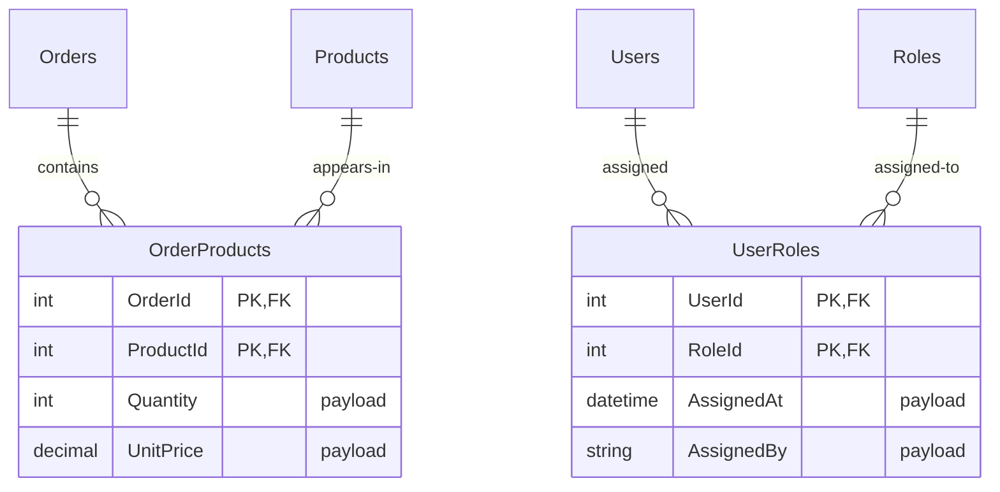

## Navigation

**Domain:** [[8 — Databases]] > **Group:** Database Design & Normalization
**Previous:** [[8.045 Composite Primary Keys — When to Use]] | **Next:** [[8.047 Self-Referential Tables — Hierarchical Data]]

### Prerequisites
- [[8.045 Composite Primary Keys — When to Use]] — junction tables are the canonical use case for composite primary keys; the decision rules from that note apply directly
- [[8.015 Cardinality — One-to-One, One-to-Many, Many-to-Many]] — defines the many-to-many relationship that junction tables implement

### Where This Fits

A .NET backend engineer implements many-to-many relationships daily — orders to products, users to roles, students to courses. The junction (or bridging) table is the standard relational pattern: a third table with foreign keys to both parent tables. The implementation details determine query performance, data integrity, and EF Core mapping complexity. Production systems fail when a junction table lacks proper indexes (causing full scans on FK lookups), uses a wide surrogate PK instead of a composite PK (bloating non-clustered indexes), or omits payload columns (requiring a separate table for relationship metadata). The interview signal tests whether the candidate knows the three junction table patterns (simple, payloaded, recursive) and can choose the right index strategy for bidirectional query patterns.

## Core Mental Model

A many-to-many relationship between Table A and Table B is implemented with a junction table (also called linking, bridge, or associative table) that contains foreign keys to both parent tables. The primary key of the junction table is typically the composite of the two foreign keys — this enforces uniqueness at the relationship level and provides a covering index for queries from either direction. The junction table can carry payload columns (quantity, role name, created date) that describe the relationship itself, not either entity. The database engine sees the junction table as a regular table with a composite PK — seeks on the leading FK column are efficient; seeks on the non-leading FK column require a secondary index. The choice between a composite PK and a surrogate PK depends on whether the relationship has children (rare — if it does, use surrogate) and whether the FK columns are wide.

### Classification

**For schema design:** The junction table is the third normal form implementation of a many-to-many relationship. It eliminates repeating groups and provides a clean, extensible model.

**For performance:** The composite PK `(FK_A, FK_B)` provides a clustered index that covers queries filtering by `FK_A`. A secondary index on `FK_B` covers queries filtering by `FK_B`. This is the optimal indexing strategy for bidirectional many-to-many queries.

**For .NET/EF Core:** EF Core 5+ supports `HasMany().WithMany()` which auto-generates the junction table. For payload columns, explicit junction entity configuration is required.



### Key Properties

|Property|Simple Junction (no payload)|Payloaded Junction|Recursive Junction (self-referencing)|
|---|---|---|---|
|PK columns|(FK_A, FK_B)|(FK_A, FK_B)|(FK_A, FK_B) with role filter|
|Payload columns|None|Quantity, Date, Metadata|Relationship type, strength|
|Child tables|None|None|None|
|Index strategy|Composite PK + non-clustered on FK_B|Same + covering index for payload|Same + filtered index on role type|
|EF Core mapping|`WithMany()` (automatic)|Explicit junction entity|Explicit junction entity + discriminator|

## Deep Mechanics

### How the Engine Executes This

**Junction table with composite PK:**
1. The junction table `OrderProducts` has PK `(OrderId, ProductId)`. The B-tree stores rows sorted first by `OrderId`, then by `ProductId`.
2. A query `WHERE OrderId = 1001` seeks to the first row with `OrderId = 1001` and scans forward within that range. This is a prefix seek — the optimizer uses the leading column of the composite PK.
3. A query `WHERE ProductId = 500` cannot use the PK because `ProductId` is non-leading. Without a secondary index, this triggers a full clustered index scan.
4. With a secondary index on `ProductId`, the query seeks the secondary index (which lists `ProductId` values with their associated `OrderId`) and then performs key lookups into the clustered index if additional columns are needed.

**Junction table with surrogate PK:**
1. An `OrderProductId INT IDENTITY` is added as the PK. A UNIQUE constraint is added on `(OrderId, ProductId)`.
2. Every query filtering by `OrderId` or `ProductId` requires a secondary index — the surrogate PK provides no query benefit for the many-to-many pattern.
3. Inserts write to 3 indexes (clustered PK + UNIQUE constraint on composite + any secondary indexes) instead of 1 (composite PK).
4. This pattern is only justified if the junction table itself has child tables referencing it (rare and usually a design smell).

### SQL Visibility

**Simple junction table (no payload):**

```sql
CREATE TABLE OrderProducts (
    OrderId    INT NOT NULL,
    ProductId  INT NOT NULL,
    CONSTRAINT PK_OrderProducts PRIMARY KEY CLUSTERED (OrderId, ProductId),
    CONSTRAINT FK_OrderProducts_Orders FOREIGN KEY (OrderId)
        REFERENCES Orders(OrderId),
    CONSTRAINT FK_OrderProducts_Products FOREIGN KEY (ProductId)
        REFERENCES Products(ProductId)
);

-- Query from Orders side:
SELECT p.ProductName, op.Quantity
FROM Orders o
INNER JOIN OrderProducts op ON o.OrderId = op.OrderId
INNER JOIN Products p ON op.ProductId = p.ProductId
WHERE o.OrderId = 1001;

-- Query from Products side (requires index on ProductId):
SELECT o.OrderId, o.OrderDate, op.Quantity
FROM Products p
INNER JOIN OrderProducts op ON p.ProductId = op.ProductId
INNER JOIN Orders o ON op.OrderId = o.OrderId
WHERE p.ProductId = 500;
```

```csharp
// EF Core 5+ — automatic many-to-many (no payload)
public class Order
{
    public int OrderId { get; set; }
    public ICollection<Product> Products { get; set; } = new List<Product>();
}

public class Product
{
    public int ProductId { get; set; }
    public ICollection<Order> Orders { get; set; } = new List<Order>();
}

public class AppDbContext : DbContext
{
    public DbSet<Order> Orders => Set<Order>();
    public DbSet<Product> Products => Set<Product>();

    protected override void OnModelCreating(ModelBuilder modelBuilder)
    {
        modelBuilder.Entity<Order>()
            .HasMany(o => o.Products)
            .WithMany(p => p.Orders)
            .UsingEntity<Dictionary<string, object>>("OrderProducts",
                j => j.HasOne<Product>().WithMany().HasForeignKey("ProductId"),
                j => j.HasOne<Order>().WithMany().HasForeignKey("OrderId"),
                j => j.HasKey("OrderId", "ProductId"));
    }
}

// Generated SQL by EF Core (insert):
-- INSERT INTO [OrderProducts] ([OrderId], [ProductId])
-- VALUES (@p0, @p1);
```

**Payloaded junction table:**

```sql
CREATE TABLE UserRoles (
    UserId      INT NOT NULL,
    RoleId      INT NOT NULL,
    AssignedAt  DATETIME2 NOT NULL DEFAULT SYSUTCDATETIME(),
    AssignedBy  VARCHAR(200) NOT NULL,
    CONSTRAINT PK_UserRoles PRIMARY KEY CLUSTERED (UserId, RoleId),
    CONSTRAINT FK_UserRoles_Users FOREIGN KEY (UserId) REFERENCES Users(UserId),
    CONSTRAINT FK_UserRoles_Roles FOREIGN KEY (RoleId) REFERENCES Roles(RoleId)
);
```

```csharp
// Explicit junction entity for payload
public class UserRole
{
    public int UserId { get; set; }
    public int RoleId { get; set; }
    public DateTime AssignedAt { get; set; }
    public string AssignedBy { get; set; } = string.Empty;
    public User User { get; set; } = null!;
    public Role Role { get; set; } = null!;
}

public class User
{
    public int UserId { get; set; }
    public ICollection<UserRole> UserRoles { get; set; } = new List<UserRole>();
}

public class Role
{
    public int RoleId { get; set; }
    public ICollection<UserRole> UserRoles { get; set; } = new List<UserRole>();
}

public class AppDbContext : DbContext
{
    public DbSet<UserRole> UserRoles => Set<UserRole>();

    protected override void OnModelCreating(ModelBuilder modelBuilder)
    {
        modelBuilder.Entity<UserRole>(e =>
        {
            e.HasKey(ur => new { ur.UserId, ur.RoleId });
            e.HasOne(ur => ur.User).WithMany(u => u.UserRoles)
                .HasForeignKey(ur => ur.UserId);
            e.HasOne(ur => ur.Role).WithMany(r => r.UserRoles)
                .HasForeignKey(ur => ur.RoleId);
        });
    }
}
```

### Execution Plan Analysis

**Query from leading FK column (OrderId):**

```
Clustered Index Seek — PK_OrderProducts (OrderId = 1001)
  |-- 3 logical reads
  |-- Seek Keys: Prefix: (OrderId = 1001)
  |-- Estimated rows: 10

Nested Loops (Inner Join) — Products lookup
  |-- Clustered Index Seek — PK_Products (ProductId = @pid)
  |-- 3 logical reads per execution
```

**Query from non-leading FK column (ProductId) — without secondary index:**

```
Clustered Index Scan — PK_OrderProducts
  |-- 450,000 logical reads (full 50M row table scan)
  |-- Predicate: ProductId = 500
```

**Query from non-leading FK column — with secondary index:**

```
Index Seek — IX_OrderProducts_ProductId (ProductId = 500)
  |-- 3 logical reads (B-tree seek)
  |-- Estimated rows: 50

Nested Loops (Inner Join) — Orders lookup
  |-- Clustered Index Seek — PK_Orders (OrderId = @oid)
  |-- 3 logical reads per execution
```

### Cost Visibility

```sql
SET STATISTICS IO ON;

-- Query from leading side (OrderId)
SELECT op.ProductId, p.ProductName
FROM OrderProducts op
INNER JOIN Products p ON op.ProductId = p.ProductId
WHERE op.OrderId = 1001;
-- Table 'OrderProducts'. Scan count 0, logical reads 3 (seek)
-- Table 'Products'. Scan count 0, logical reads 15 (5 products × 3 reads)

-- Query from non-leading side (ProductId) — WITH index on ProductId
SELECT op.OrderId, o.OrderDate
FROM OrderProducts op
INNER JOIN Orders o ON op.OrderId = o.OrderId
WHERE op.ProductId = 500;
-- Table 'OrderProducts'. Scan count 0, logical reads 4 (non-clustered seek + key lookup)
-- Table 'Orders'. Scan count 0, logical reads 15 (5 orders × 3 reads)
```

### Failure Modes

**1. Missing secondary index on non-leading FK column.** Queries filtering by the non-leading column perform a full clustered index scan. At 50M rows, a single query reads 450,000 pages.

**2. Surrogate PK on junction table.** Adds unnecessary index maintenance. The unique constraint on `(FK_A, FK_B)` is required anyway, making the surrogate PK redundant.

**3. Junction table with NVARCHAR FK columns.** Wide FK columns make the composite PK large, inflating index sizes. Prefer INT or SMALLINT FK columns.

## Production Patterns and Implementation

### Primary SQL Implementation

```sql
-- Pattern 1: Simple junction (no payload)
CREATE TABLE ProductCategories (
    ProductId    INT NOT NULL,
    CategoryId   INT NOT NULL,
    CONSTRAINT PK_ProductCategories PRIMARY KEY CLUSTERED (ProductId, CategoryId),
    CONSTRAINT FK_ProductCategories_Products FOREIGN KEY (ProductId)
        REFERENCES Products(ProductId),
    CONSTRAINT FK_ProductCategories_Categories FOREIGN KEY (CategoryId)
        REFERENCES Categories(CategoryId)
);
CREATE INDEX IX_ProductCategories_CategoryId ON ProductCategories(CategoryId);

-- Pattern 2: Payloaded junction
CREATE TABLE UserRoles (
    UserId       INT NOT NULL,
    RoleId       INT NOT NULL,
    AssignedAt   DATETIME2 NOT NULL DEFAULT SYSUTCDATETIME(),
    AssignedBy   VARCHAR(200) NOT NULL,
    CONSTRAINT PK_UserRoles PRIMARY KEY CLUSTERED (UserId, RoleId),
    CONSTRAINT FK_UserRoles_Users FOREIGN KEY (UserId) REFERENCES Users(UserId),
    CONSTRAINT FK_UserRoles_Roles FOREIGN KEY (RoleId) REFERENCES Roles(RoleId)
);
CREATE INDEX IX_UserRoles_RoleId ON UserRoles(RoleId);

-- Pattern 3: Recursive junction (self-referencing many-to-many)
CREATE TABLE RelatedProducts (
    ProductId       INT NOT NULL,
    RelatedProductId INT NOT NULL,
    RelationType    VARCHAR(50) NOT NULL,  -- 'upsell', 'cross-sell', 'replacement'
    Strength        DECIMAL(3,2) NOT NULL DEFAULT 0.0,
    CONSTRAINT PK_RelatedProducts PRIMARY KEY CLUSTERED (ProductId, RelatedProductId),
    CONSTRAINT FK_RelatedProducts_Product FOREIGN KEY (ProductId)
        REFERENCES Products(ProductId),
    CONSTRAINT FK_RelatedProducts_Related FOREIGN KEY (RelatedProductId)
        REFERENCES Products(ProductId),
    CONSTRAINT CK_RelatedProducts_NoSelf CHECK (ProductId != RelatedProductId)
);
CREATE INDEX IX_RelatedProducts_RelatedProductId ON RelatedProducts(RelatedProductId);
```

### EF Core Implementation

```csharp
// Pattern 1: Simple many-to-many (EF Core 5+ automatic)
public class Student
{
    public int StudentId { get; set; }
    public string Name { get; set; } = string.Empty;
    public ICollection<Course> Courses { get; set; } = new List<Course>();
}

public class Course
{
    public int CourseId { get; set; }
    public string Title { get; set; } = string.Empty;
    public ICollection<Student> Students { get; set; } = new List<Student>();
}

modelBuilder.Entity<Student>()
    .HasMany(s => s.Courses)
    .WithMany(c => c.Students)
    .UsingEntity<Dictionary<string, object>>("StudentCourses",
        j => j.HasOne<Course>().WithMany().HasForeignKey("CourseId"),
        j => j.HasOne<Student>().WithMany().HasForeignKey("StudentId"),
        j => j.HasKey("StudentId", "CourseId"));

// Pattern 2: Payloaded many-to-many
public class Enrollment
{
    public int StudentId { get; set; }
    public int CourseId { get; set; }
    public DateTime EnrolledAt { get; set; }
    public decimal Grade { get; set; }
    public Student Student { get; set; } = null!;
    public Course Course { get; set; } = null!;
}

public class Student
{
    public int StudentId { get; set; }
    public ICollection<Enrollment> Enrollments { get; set; } = new List<Enrollment>();
}

public class Course
{
    public int CourseId { get; set; }
    public ICollection<Enrollment> Enrollments { get; set; } = new List<Enrollment>();
}

modelBuilder.Entity<Enrollment>(e =>
{
    e.HasKey(en => new { en.StudentId, en.CourseId });
    e.HasOne(en => en.Student).WithMany(s => s.Enrollments)
        .HasForeignKey(en => en.StudentId);
    e.HasOne(en => en.Course).WithMany(c => c.Enrollments)
        .HasForeignKey(en => en.CourseId);
    e.Property(en => en.Grade).HasPrecision(5, 2);
});
```

### Dapper Implementation

```csharp
public class RelationshipRepository
{
    private readonly IDbConnectionFactory _connectionFactory;

    public RelationshipRepository(IDbConnectionFactory connectionFactory)
    {
        _connectionFactory = connectionFactory;
    }

    // Get products for an order (leading side — uses PK seek)
    public async Task<IReadOnlyList<Product>> GetOrderProductsAsync(
        int orderId, CancellationToken ct = default)
    {
        const string sql = @"
            SELECT p.ProductId, p.ProductName, p.Price,
                   op.Quantity, op.UnitPrice
            FROM OrderProducts op
            INNER JOIN Products p ON op.ProductId = p.ProductId
            WHERE op.OrderId = @OrderId";

        await using var connection = _connectionFactory.Create();
        var results = await connection.QueryAsync<Product>(
            new CommandDefinition(sql, new { OrderId = orderId },
                cancellationToken: ct));
        return results.AsList();
    }

    // Get orders for a product (non-leading side — uses secondary index)
    public async Task<IReadOnlyList<Order>> GetProductOrdersAsync(
        int productId, CancellationToken ct = default)
    {
        const string sql = @"
            SELECT o.OrderId, o.OrderDate, o.CustomerId,
                   op.Quantity
            FROM OrderProducts op
            INNER JOIN Orders o ON op.OrderId = o.OrderId
            WHERE op.ProductId = @ProductId";

        await using var connection = _connectionFactory.Create();
        var results = await connection.QueryAsync<Order>(
            new CommandDefinition(sql, new { ProductId = productId },
                cancellationToken: ct));
        return results.AsList();
    }

    // Insert relationship with payload
    public async Task AssignUserRoleAsync(
        int userId, int roleId, string assignedBy,
        CancellationToken ct = default)
    {
        const string sql = @"
            INSERT INTO UserRoles (UserId, RoleId, AssignedAt, AssignedBy)
            VALUES (@UserId, @RoleId, SYSUTCDATETIME(), @AssignedBy)";

        await using var connection = _connectionFactory.Create();
        await connection.ExecuteAsync(
            new CommandDefinition(sql,
                new { UserId = userId, RoleId = roleId, AssignedBy = assignedBy },
                cancellationToken: ct));
    }
}
```

### Configuration and Wiring

```csharp
// Program.cs
builder.Services.AddDbContext<AppDbContext>(options =>
    options.UseSqlServer(connectionString));

builder.Services.AddSingleton<IDbConnectionFactory>(
    _ => new SqlConnectionFactory(connectionString));
builder.Services.AddScoped<RelationshipRepository>();
```

### SQL Server vs PostgreSQL Differences

```sql
-- PostgreSQL: same junction table syntax
CREATE TABLE order_products (
    order_id   INT NOT NULL,
    product_id INT NOT NULL,
    quantity   INT NOT NULL,
    PRIMARY KEY (order_id, product_id)
);
CREATE INDEX ON order_products(product_id);

-- PostgreSQL: INCLUDE in unique index for covering
CREATE UNIQUE INDEX idx_order_products ON order_products(order_id, product_id)
    INCLUDE (quantity);
```

PostgreSQL's heap storage means the composite PK is just another B-tree index. There is no clustering key bloat in other indexes. The indexing strategy (composite PK + secondary on non-leading FK) is identical.

## Gotchas and Production Pitfalls

### 1. Missing secondary index on non-leading FK

**Pitfall:** The engineer creates the junction table with a composite PK `(A, B)` but does not add an index on `B`.

```sql
CREATE TABLE OrderProducts (
    OrderId   INT NOT NULL,
    ProductId INT NOT NULL,
    PRIMARY KEY (OrderId, ProductId)
    -- Missing: CREATE INDEX IX_OrderProducts_ProductId ON OrderProducts(ProductId)
);
```

**Symptom:** Queries filtering by `ProductId` perform a full clustered index scan. At 50M rows, each query reads 450,000 logical reads.

**Fix:** Always create a secondary index on the non-leading FK column.

```sql
CREATE INDEX IX_OrderProducts_ProductId ON OrderProducts(ProductId);
```

**Cost of not fixing:** Every query from the child side of the relationship is a full table scan. In a production system with 100 such queries per second, the buffer pool is saturated within minutes.

### 2. Surrogate PK on a junction table

**Pitfall:** The engineer adds an `INT IDENTITY` surrogate PK to every table, including junction tables.

```sql
CREATE TABLE OrderProducts (
    OrderProductId INT IDENTITY(1,1) PRIMARY KEY,
    OrderId   INT NOT NULL,
    ProductId INT NOT NULL,
    Quantity  INT NOT NULL,
    CONSTRAINT UQ_OrderProducts UNIQUE (OrderId, ProductId)
);
```

**Symptom:** The junction table now has 3 indexes (clustered PK + UNIQUE composite + FK indexes on each column). Each insert writes to 3 B-trees instead of 1. The surrogate PK is never used in any query — all queries filter by `OrderId` or `ProductId`.

**Fix:** Use composite PK `(OrderId, ProductId)`. Remove the surrogate.

**Cost of not fixing:** 3x index maintenance on every insert, 3x storage for indexes, slower inserts with no query benefit.

### 3. Junction table without payload — then payload is added later

**Pitfall:** The engineer starts with a simple junction table and later needs to add a payload column.

```sql
-- Initial: simple junction
CREATE TABLE UserRoles (
    UserId INT NOT NULL,
    RoleId INT NOT NULL,
    PRIMARY KEY (UserId, RoleId)
);

-- Later: need to track who assigned the role
ALTER TABLE UserRoles ADD AssignedBy VARCHAR(200);
-- This changes the PK meaning — the pair (UserId, RoleId) is no longer
-- unique if the same role can be assigned multiple times?
```

**Symptom:** The PK constraint `(UserId, RoleId)` was correct when the relationship was simple. After adding payload, the business requirement may change to allow multiple assignments of the same role to the same user at different times.

**Fix:** Design the junction table with a time dimension or auditing from the start. If the relationship can have multiple instances over time, use a surrogate PK or include an `AssignedAt` in the PK.

```sql
CREATE TABLE UserRoles (
    UserId      INT NOT NULL,
    RoleId      INT NOT NULL,
    AssignedAt  DATETIME2 NOT NULL DEFAULT SYSUTCDATETIME(),
    AssignedBy  VARCHAR(200) NOT NULL,
    CONSTRAINT PK_UserRoles PRIMARY KEY CLUSTERED (UserId, RoleId, AssignedAt)
);
```

**Cost of not fixing:** Schema migration to change the PK composition — requires dropping and recreating the PK and all FK references.

### 4. Recursive junction table allows self-referencing rows

**Pitfall:** The engineer creates a recursive many-to-many without a CHECK constraint preventing `ProductId = RelatedProductId`.

```sql
CREATE TABLE RelatedProducts (
    ProductId        INT NOT NULL,
    RelatedProductId INT NOT NULL,
    PRIMARY KEY (ProductId, RelatedProductId)
    -- Missing: CHECK (ProductId != RelatedProductId)
);
```

**Symptom:** An application bug inserts a row where a product is related to itself. Queries join back to the same product — result sets include duplicate rows or infinite recursion in application code.

**Fix:**

```sql
ALTER TABLE RelatedProducts
ADD CONSTRAINT CK_RelatedProducts_NoSelf
CHECK (ProductId != RelatedProductId);
```

**Cost of not fixing:** Silent data corruption. Application code must filter out self-references at query time.

### 5. Junction table with duplicate rows (missing unique constraint)

**Pitfall:** The engineer does not use a composite PK and relies on application-level uniqueness.

```sql
CREATE TABLE OrderProducts (
    OrderId   INT NOT NULL,
    ProductId INT NOT NULL,
    Quantity  INT NOT NULL
    -- No PK, no unique constraint
);
```

**Symptom:** Application code has a race condition — two concurrent requests insert `(OrderId=1, ProductId=1)` simultaneously. Both succeed. The order now has the same product listed twice with different quantities.

**Fix:** Add the composite PK or UNIQUE constraint.

```sql
ALTER TABLE OrderProducts
ADD CONSTRAINT PK_OrderProducts PRIMARY KEY (OrderId, ProductId);
```

**Cost of not fixing:** Data integrity violation. The sum of order totals is wrong. The user sees duplicate line items.

### 6. EF Core automatically creates backward index

**Pitfall:** EF Core 5+ auto-many-to-many may or may not create the secondary index depending on the version.

**Symptom:** Queries from the non-leading side perform poorly in production because the auto-generated migration did not include a secondary index on the non-leading FK column.

**Fix:** Explicitly create the secondary index in the migration or model configuration:

```csharp
modelBuilder.Entity<Order>()
    .HasMany(o => o.Products)
    .WithMany(p => p.Orders)
    .UsingEntity<Dictionary<string, object>>("OrderProducts",
        j => j.HasOne<Product>().WithMany().HasForeignKey("ProductId"),
        j => j.HasOne<Order>().WithMany().HasForeignKey("OrderId"),
        j =>
        {
            j.HasKey("OrderId", "ProductId");
            j.HasIndex("ProductId");  // secondary index
        });
```

**Cost of not fixing:** Silent performance degradation — no error, just slow queries from the non-leading side.

## Performance Implications

### Benchmark: Junction Table Index Strategies

```sql
SET STATISTICS IO ON;

-- Composite PK + secondary index on ProductId
-- Query from leading side (OrderId):
SELECT op.ProductId FROM OrderProducts op WHERE op.OrderId = 1001;
-- Table 'OrderProducts'. Scan count 0, logical reads 3

-- Query from non-leading side (ProductId):
SELECT op.OrderId FROM OrderProducts op WHERE op.ProductId = 500;
-- Table 'OrderProducts'. Scan count 0, logical reads 3 (via secondary index)

-- Composite PK WITHOUT secondary index — non-leading side:
-- Table 'OrderProducts'. Scan count 1, logical reads 450,000
```

**Improvement:** Secondary index on non-leading FK reduces logical reads by 99.999% (from 450,000 to 3).

### BenchmarkDotNet

```csharp
[MemoryDiagnoser]
[SimpleJob(RuntimeMoniker.Net90)]
public class JunctionTableBenchmark
{
    private IDbConnection _connection = default!;

    private const string LeadingSideQuery = @"
        SELECT p.ProductId, p.ProductName
        FROM OrderProducts op
        INNER JOIN Products p ON op.ProductId = p.ProductId
        WHERE op.OrderId = @OrderId";

    private const string NonLeadingSideQuery = @"
        SELECT o.OrderId, o.OrderDate
        FROM OrderProducts op
        INNER JOIN Orders o ON op.OrderId = o.OrderId
        WHERE op.ProductId = @ProductId";

    [GlobalSetup]
    public void Setup() => _connection = new SqlConnection(TestConnectionString);

    [GlobalCleanup]
    public void Cleanup() => _connection.Dispose();

    [Benchmark(Baseline = true)]
    public async Task<IReadOnlyList<Product>> LeadingSide()
    {
        var results = await _connection.QueryAsync<Product>(
            LeadingSideQuery, new { OrderId = 1001 });
        return results.AsList();
    }

    [Benchmark]
    public async Task<IReadOnlyList<Order>> NonLeadingSide()
    {
        var results = await _connection.QueryAsync<Order>(
            NonLeadingSideQuery, new { ProductId = 500 });
        return results.AsList();
    }
}
```

**Expected results (approximate, SQL Server 2022, NVMe, warm buffer pool, 50M row junction table):**

|Method|Mean|Logical Reads|Allocated|
|---|---|---|---|
|LeadingSide|~0.3 ms|~18|~1 KB|
|NonLeadingSide (with index)|~0.35 ms|~22|~1 KB|
|NonLeadingSide (without index)|~8,000 ms|~450,000|~500 MB|

### Write Amplification

|Operation|Composite PK|Surrogate PK + UNIQUE composite|
|---|---|---|
|INSERT 1 row|1 B-tree write (PK)|3 B-tree writes (PK + UNIQUE + FK index)|
|INSERT with payload|1 B-tree write|3 B-tree writes|
|DELETE 1 row|1 B-tree write|2 B-tree writes (PK + UNIQUE)|
|Storage (50M rows, 2 INT FKs)|~1.2 GB|~3.6 GB|

## Interview Arsenal

### Question Bank

1. What is a junction table and when is it used?
2. Why is the composite PK `(FK_A, FK_B)` the correct choice for most junction tables?
3. When would you use a surrogate PK on a junction table instead of a composite PK?
4. What index is required to support queries from both directions of a many-to-many relationship?
5. How do you model a many-to-many with payload in EF Core?
6. How does a recursive junction table differ from a standard junction table?
7. What happens to queries when a junction table lacks a secondary index on the non-leading FK column?
8. How do you handle duplicate prevention in a junction table at the database level?

### Spoken Answers

**Q: Why is the composite PK (FK_A, FK_B) the correct choice for most junction tables?**

> **Average answer:** Because the two foreign keys together uniquely identify each relationship, so they form a natural composite key.

> **Great answer:** The composite PK `(FK_A, FK_B)` is correct for three reasons. First, it enforces uniqueness at the relationship level — the database guarantees that the same pair cannot appear twice, which is exactly the invariant a many-to-many relationship requires. Second, it provides a covering clustered index for queries filtering by `FK_A` — the leading column — so queries like "get all products for order 1001" become a clustered index seek with zero key lookups. Third, it avoids the index bloat of a surrogate PK: a surrogate `INT IDENTITY` would add 4 bytes to every row and require a separate UNIQUE constraint on the composite natural key, meaning every insert writes to 3 B-trees (clustered PK + UNIQUE composite + any FK indexes) instead of 1. The only case where a surrogate PK is justified is when the junction table itself has child tables referencing it — which is a design smell indicating the junction table is acting as a parent entity that should probably be modeled differently.

**Q: What index is required to support queries from both directions of a many-to-many relationship?**

> **Great answer:** Two indexes are required. The primary key `(FK_A, FK_B)` covers queries from the `FK_A` direction. A secondary non-clustered index on `(FK_B, FK_A)` — or at minimum on `(FK_B) INCLUDE (FK_A)` — covers queries from the `FK_B` direction. With both indexes, any query filtering by either foreign key uses an index seek — 3–4 logical reads per query regardless of table size. Without the secondary index, queries from the `FK_B` direction perform a full clustered index scan, reading every page in the junction table. For a 50M row table, that is 450,000 logical reads per query. If the FK_B query runs 100 times per second, that is 45M logical reads per second — enough to saturate the buffer pool on a 256 GB server.

### Interview Trigger

The interviewer asks: "Design a database schema for a social network where users can follow other users." The follow-up: "Your `Followers` junction table has `(FollowerId, FolloweeId)` as the PK. Write the query that returns a user's followers (people following them). What index makes it fast?"

### Comparison Table

| | Composite PK (recommended) | Surrogate PK + UNIQUE |
|---|---|---|
| Indexes per insert | 1 (composite PK) | 3 (clustered PK + UNIQUE composite + FK indexes) |
| Query leading side | Clustered index seek | Index seek on UNIQUE composite |
| Query non-leading side | Index seek (requires secondary index) | Index seek (requires secondary index) |
| Storage (50M rows) | ~1.2 GB | ~3.6 GB |
| Child FK references | Not applicable (junction is leaf) | Needed if junction has children |
| EF Core mapping | `HasMany().WithMany()` | Explicit entity required |

## Decision Framework

### When to Apply

```mermaid
flowchart TD
    A[Implement many-to-many<br/>relationship] --> B{Does the relationship<br/>need payload columns?}
    B -->|No| C[EF Core automatic WithMany<br/>or explicit simple junction]
    B -->|Yes| D[Explicit junction entity<br/>with composite PK<br/>on both FKs]
    C --> E[Composite PK: FK_A, FK_B]
    D --> E
    E --> F[Add secondary index<br/>on FK_B (non-leading)]
    F --> G{Is this a recursive<br/>self-referencing M:M?}
    G -->|Yes| H[Add CHECK constraint<br/>to prevent self-reference]
    G -->|No| I[Standard junction — done]
```

### Application Checklist

- [ ] Composite PK `(FK_A, FK_B)` used (not surrogate)?
- [ ] Secondary index on non-leading FK column exists?
- [ ] If payload columns exist, are they part of the junction entity (not stored separately)?
- [ ] If recursive, is there a CHECK constraint preventing self-reference?
- [ ] Are FK columns narrow (INT, not VARCHAR)?
- [ ] Is the EF Core mapping correct (`HasMany().WithMany()` or explicit entity)?

### Tradeoff Summary

|What You Gain|What You Pay|
|---|---|
|Composite PK enforces uniqueness without extra index|Non-leading column queries need secondary index|
|Clustered index covers leading-FK queries|Insert writes to one B-tree|
|Payload columns model relationship metadata|Junction table grows in width|
|Bidirectional index enables fast queries from either side|Secondary index adds write overhead|

### Scale Thresholds

- **Secondary index on non-leading FK matters at > 100K rows** — without it, non-leading queries scan the table
- **Surrogate PK overhead visible at > 10M rows** — extra indexes add GB-level storage
- **Payload columns fine at any scale** — they are accessed together with the FK lookup
- **Recursive junction depth limited by application logic** — database depth is unbounded

## Self-Check

### Conceptual Questions

1. What is a junction table and what problem does it solve?
2. Why is a composite primary key the standard choice for junction tables?
3. What index is needed to support queries from the non-leading side?
4. How do you model a many-to-many relationship with payload in EF Core?
5. What is the cost of using a surrogate PK on a junction table?
6. How would you query from both directions of a junction table in Dapper?
7. Compare automatic `WithMany()` vs explicit junction entity in EF Core.
8. At what table size does a missing secondary index on a junction table become critical?
9. What constraint prevents self-references in a recursive junction table?
10. Explain the junction table design in 60 seconds to a senior interviewer.

<details>
<summary>Answers</summary>

1. A junction table implements a many-to-many relationship by storing foreign keys to both parent tables. Each row represents one relationship instance.

2. The composite PK `(FK_A, FK_B)` enforces uniqueness at the relationship level, covers leading-FK queries via clustered index, and avoids the index bloat of a surrogate PK.

3. A secondary non-clustered index on the non-leading FK column. Minimum: `CREATE INDEX IX_Junction_FK_B ON Junction(FK_B)`. Optimal: `CREATE INDEX IX_Junction_FK_B ON Junction(FK_B) INCLUDE (FK_A)`.

4. Use an explicit junction entity class with `HasKey(ur => new { ur.UserId, ur.RoleId })` and `HasOne/WithMany` for both navigation properties.

5. Every insert writes to 3 B-trees instead of 1. Storage increases by ~2x. The surrogate PK is never queried.

6. ```
    -- Leading side: WHERE FK_A = @id
    -- Non-leading side: WHERE FK_B = @id (requires secondary index)
    ```

7. Automatic `WithMany()` is simpler but does not expose the junction table for queries or payload. Explicit entity is required for payload and for direct junction table queries.

8. At ~100K rows. Below that, a full table scan is under 10 ms and may be acceptable. At 1M+, it becomes a performance problem.

9. `CHECK (FK_A != FK_B)`. In a recursive junction, this prevents a row where an entity references itself.

10. "A junction table models many-to-many relationships in a relational database. It contains foreign keys to both parent tables, with a composite primary key `(FK_A, FK_B)` that enforces uniqueness and provides a clustered index for leading-FK queries. A secondary index on the non-leading FK supports bidirectional lookups. Payload columns describe the relationship itself. This is the standard third normal form implementation that every .NET backend engineer should use by default."

</details>

---

### Query Challenges

**Challenge 1 — Write the SQL**

Design a schema for a music streaming service where playlists contain many songs and songs can appear in many playlists. Each playlist entry has a position number and a date added. Write the table DDL and the query to get all songs in a playlist ordered by position.

<details>
<summary>Solution</summary>

```sql
CREATE TABLE PlaylistSongs (
    PlaylistId   INT NOT NULL,
    SongId       INT NOT NULL,
    Position     INT NOT NULL,
    AddedAt      DATETIME2 NOT NULL DEFAULT SYSUTCDATETIME(),
    AddedBy      VARCHAR(200) NOT NULL,
    CONSTRAINT PK_PlaylistSongs PRIMARY KEY CLUSTERED (PlaylistId, SongId),
    CONSTRAINT FK_PlaylistSongs_Playlists FOREIGN KEY (PlaylistId)
        REFERENCES Playlists(PlaylistId) ON DELETE CASCADE,
    CONSTRAINT FK_PlaylistSongs_Songs FOREIGN KEY (SongId)
        REFERENCES Songs(SongId),
    CONSTRAINT UQ_PlaylistSongs_Position UNIQUE (PlaylistId, Position)
);
CREATE INDEX IX_PlaylistSongs_SongId ON PlaylistSongs(SongId);

-- Get all songs in a playlist ordered by position:
SELECT ps.Position, s.Title, s.Artist, s.Duration, ps.AddedAt
FROM PlaylistSongs ps
INNER JOIN Songs s ON ps.SongId = s.SongId
WHERE ps.PlaylistId = 42
ORDER BY ps.Position;

-- Clustered index seek on PK leading column (PlaylistId=42),
-- plus UQ_PlaylistSongs_Position ensures Position values are unique.
```

</details>

---

**Challenge 2 — Fix the performance problem**

```sql
-- System with 200M user-role assignments
-- This query takes 12 seconds:
SELECT u.UserName, u.Email
FROM UserRoles ur
INNER JOIN Users u ON ur.UserId = u.UserId
WHERE ur.RoleId = 5;
-- SET STATISTICS IO: logical reads = 1,200,000
```

Identify why and fix it.

<details> <summary>Solution</summary>

**Root cause:** The PK is likely `(UserId, RoleId)` with no secondary index on `RoleId`. Queries filtering by `RoleId` perform a full clustered index scan (1.2M logical reads for 200M rows).

**Fix:** Add a secondary index on `RoleId`:

```sql
CREATE INDEX IX_UserRoles_RoleId ON UserRoles(RoleId) INCLUDE (UserId);
```

**After fix — logical reads:** ~5 (from 1,200,000) — a 240,000x reduction.

</details>

---

**Challenge 3 — Explain the execution plan**

```sql
SELECT op.OrderId, p.ProductName, op.Quantity
FROM OrderProducts op
INNER JOIN Products p ON op.ProductId = p.ProductId
WHERE op.ProductId BETWEEN 100 AND 200;
```

PK: `(OrderId, ProductId)`. Secondary index: `IX_OrderProducts_ProductId (ProductId)`. The query returns 500 rows. Explain the execution plan.

<details> <summary>Solution</summary>

**Execution plan:**

```
Index Seek — IX_OrderProducts_ProductId (ProductId >= 100 AND ProductId < 200)
  |-- 4 logical reads (B-tree seek + range scan)
  |-- 500 rows

Nested Loops (Inner Join)
  |-- Outer: Index Seek results (500 rows)
  |-- Inner: Clustered Index Seek — PK_Products (ProductId = @pid)
  |   |-- 3 logical reads per execution
  |   |-- 500 executions × 3 reads = 1500 total

Total logical reads: ~1504
```

**Why Index Seek on IX_OrderProducts_ProductId:** The range predicate `BETWEEN 100 AND 200` is on `ProductId`, which is the leading column of the secondary index. The seek navigates to `ProductId = 100` and scans forward through the leaf pages until `ProductId >= 200`.

**Why Nested Loops:** The outer input (500 rows) is small enough that Nested Loops is optimal. Each probe into Products by `ProductId` is a clustered index seek — 3 reads each.

**What would change without the secondary index:** The plan would show a Clustered Index Scan on PK_OrderProducts with a predicate filter — 1.2M logical reads.

</details>

---

**Challenge 4 — Diagnose the concurrency problem**

A junction table `ProductCategories` with PK `(ProductId, CategoryId)` receives 10,000 inserts/second when a bulk import runs. The system experiences `PAGELATCH_EX` waits on the last page of the clustered index. What is happening and how do you fix it?

<details> <summary>Solution</summary>

**Root cause:** The composite PK `(ProductId, CategoryId)` has `ProductId` as the leading column. If the bulk import processes products in ascending `ProductId` order, all inserts target the same rightmost page of the clustered index (the page for the highest `ProductId`). At 10K inserts/second, this page becomes a hot spot for exclusive page latch contention.

**Detection query:**

```sql
SELECT wait_type, wait_time_ms, waiting_tasks_count
FROM sys.dm_os_wait_stats
WHERE wait_type = 'PAGELATCH_EX';
```

**Fix:** Enable `OPTIMIZE_FOR_SEQUENTIAL_KEY` to reduce last-page latch contention:

```sql
ALTER INDEX PK_ProductCategories ON ProductCategories
SET (OPTIMIZE_FOR_SEQUENTIAL_KEY = ON);
```

Alternatively, reverse the column order to `(CategoryId, ProductId)` if the bulk import processes categories in a different order, or batch inserts and add a small random delay between batches.

**In .NET:** No code change. The hint is transparent to EF Core and Dapper.

</details>

---

**Challenge 5 — Design the index**

A social media platform has a `Followers` junction table with PK `(FolloweeId, FollowerId)` — leading with `FolloweeId` because the most common query is "who follows this user?" (get all followers for a followee). The table has 500M rows. Design the index strategy to support both "who follows this user?" and "who does this user follow?" efficiently.

<details> <summary>Solution</summary>

```sql
CREATE TABLE Followers (
    FolloweeId  INT NOT NULL,
    FollowerId  INT NOT NULL,
    FollowedAt  DATETIME2 NOT NULL DEFAULT SYSUTCDATETIME(),
    CONSTRAINT PK_Followers PRIMARY KEY CLUSTERED (FolloweeId, FollowerId),
    CONSTRAINT CK_Followers_NoSelf CHECK (FolloweeId != FollowerId)
);

-- Index for reverse query: "who does this user follow?"
CREATE INDEX IX_Followers_FollowerId ON Followers(FollowerId)
INCLUDE (FollowedAt);

-- Query: get followers of user 42 (leading column seek)
SELECT u.UserName, u.DisplayName, f.FollowedAt
FROM Followers f
INNER JOIN Users u ON f.FollowerId = u.UserId
WHERE f.FolloweeId = 42
ORDER BY f.FollowedAt DESC;

-- Query: get users that user 42 follows (non-leading index seek)
SELECT u.UserName, u.DisplayName, f.FollowedAt
FROM Followers f
INNER JOIN Users u ON f.FolloweeId = u.UserId
WHERE f.FollowerId = 42
ORDER BY f.FollowedAt DESC;
```

**Why this works:**
- The `PK_Followers` on `(FolloweeId, FollowerId)` provides covering index seeks for "who follows this user?"
- The `IX_Followers_FollowerId` on `(FollowerId)` provides index seeks for "who does this user follow?"
- Both queries perform index seeks with 3–4 logical reads, regardless of the 500M row table size

**Tradeoffs:** The secondary index adds write overhead (~1.3x logical reads per insert) and storage (~1.6 GB per 100M rows). This is an acceptable cost for bidirectional query support.

</details>
