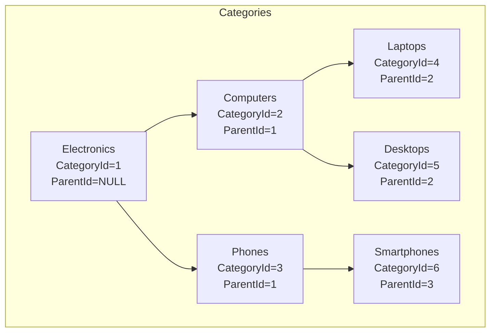
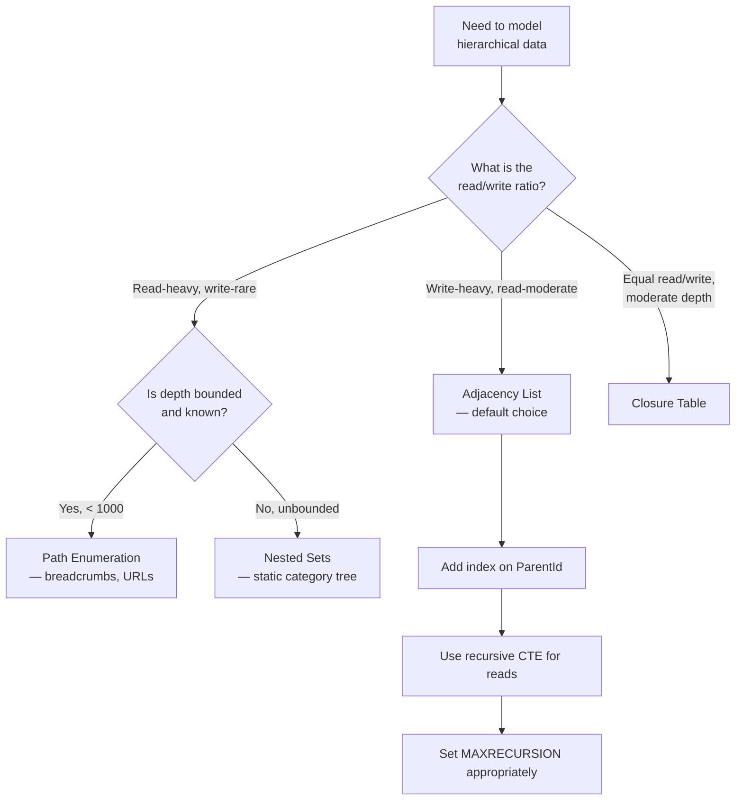

## Navigation

**Domain:** [[8 — Databases]] > **Group:** Database Design & Normalization
**Previous:** [[8.046 Relationship Tables — Many-to-Many Implementation]] | **Next:** [[8.048 Soft Delete — IsDeleted Pattern]]

### Prerequisites
- [[8.046 Relationship Tables — Many-to-Many Implementation]] — self-referential tables are a specialization of relationship tables where both FKs point to the same parent table
- [[8.045 Composite Primary Keys — When to Use]] — closure tables for hierarchical data use composite keys; the decision rules from that note apply

### Where This Fits

A .NET backend engineer models hierarchical data in nearly every domain: organization charts (manager → reports), product categories (parent category → subcategories), comment threads (parent comment → replies), and bill-of-materials (assembly → components). The self-referential table — a single table with a foreign key back to its own primary key — is the simplest implementation, but its query patterns determine whether it scales or fails. Production systems suffer when a recursive CTE exceeds 100 levels (default `MAXRECURSION`), when `N+1` queries fetch each level from application code, or when a node moves and every parent-path label must be updated. The interview signal tests whether the candidate knows the four hierarchical patterns (adjacency list, nested sets, closure table, path enumeration) and can choose the right one based on the query profile.

## Core Mental Model

A self-referential table contains a foreign key column that references its own primary key. A row with a `NULL` parent is a root node; rows referencing a parent are children. This is called the adjacency list pattern — each row stores only its immediate parent, and the full tree is reconstructed by traversing parent-child links. The database engine can traverse this hierarchy using a recursive Common Table Expression (CTE), which iterates level by level: start with roots, find their children, find those children's children, and so on until no more children are found. The cost scales with depth: each level adds a full index scan or seek on the parent FK column. For a tree of depth 10, a recursive CTE performs 10 index seeks. For a tree of depth 100 (deeply nested comments or categories), the CTE performs 100 seeks and may hit `MAXRECURSION`.

### Classification

**For schema design:** The adjacency list (single `ParentId` column) is the standard implementation. It is the only pattern that supports arbitrary-depth trees with simple DML (insert, move, delete).

**For query patterns:**
- **Adjacency list:** Best for writes, worst for reads (recursive CTE required for full tree)
- **Nested sets:** Best for reads (single query for full subtree), worst for writes (recalculates left/right values)
- **Closure table:** Best for mixed read/write with moderate depth (stores all ancestor-descendant pairs)
- **Path enumeration:** Best for breadcrumbs and ancestry lookups (stores materialized path string)

**For .NET:** EF Core 2+ supports self-referencing navigation properties `Parent` and `Children`. Queries require explicit recursive logic (application-side loops or raw SQL recursive CTEs).



### Key Properties

|Property|Adjacency List|Nested Sets|Closure Table|Path Enumeration|
|---|---|---|---|---|
|Storage|1 FK column per row|2 float/int columns per row|Separate table (all ancestor-descendant pairs)|1 VARCHAR column per row|
|Full tree query|Recursive CTE (depth iterations)|Single SELECT (WHERE lft BETWEEN @lft AND @rgt)|Single SELECT (JOIN closure WHERE ancestor = @root)|`LIKE 'path%'` (no recursion)|
|Subtree query|Recursive CTE|Single SELECT|Single SELECT|`LIKE 'path%'`|
|Insert cost|1 row insert|All left/right values shift|N inserts (one per ancestor)|Update children's paths|
|Move subtree|Update 1 ParentId|Recalculate all left/right values|Delete + reinsert pairs or INSERT new pairs|Update all child paths|
|Depth limit|Unlimited (MAXRECURSION)|Bounded by float precision|Unlimited|Limited by VARCHAR length|
|EF Core support|Navigation property (Parent/Children)|Custom (no native)|Custom (junction entity)|Custom (string manipulation)|

## Deep Mechanics

### How the Engine Executes This

**Adjacency list — recursive CTE execution:**
1. The anchor query selects all root rows (`ParentId IS NULL`). This produces an index seek on an index over `ParentId` (or a scan if no index exists and `ParentId IS NULL` is not selective).
2. The recursive member joins the CTE's previous level output to the table on `ParentId = ChildId`. This is a nested loops join: for each row from the previous level, it seeks into the `IX_Table_ParentId` index to find children.
3. The recursive iteration repeats until no new rows are produced. Each iteration is an index seek per parent row from the previous level.
4. The total cost is: (anchor seek) + (number of non-leaf nodes × parent FK seek cost). For a balanced tree of 1M nodes with fan-out 10 and depth 6, this is approximately 1 (anchor) + 111,111 (non-leaf nodes) × 3 reads = ~333,333 logical reads.

**Nested sets — subtree query execution:**
1. Find the left/right values of the root node (1 seek, 3 reads).
2. SELECT all nodes WHERE `lft BETWEEN @rootLft AND @rootRgt` — a clustered index range scan on the PK or an index on `lft`.
3. Single scan, no recursion. Cost: 3 reads for root + range scan covering the subtree's pages.

### SQL Visibility

**Adjacency list (self-referential table):**

```sql
CREATE TABLE Categories (
    CategoryId   INT IDENTITY(1,1) NOT NULL,
    ParentId     INT NULL,
    CategoryName VARCHAR(200) NOT NULL,
    CONSTRAINT PK_Categories PRIMARY KEY CLUSTERED (CategoryId),
    CONSTRAINT FK_Categories_Parent FOREIGN KEY (ParentId)
        REFERENCES Categories(CategoryId)
);

CREATE INDEX IX_Categories_ParentId ON Categories(ParentId);

-- Recursive CTE: full tree from root
WITH CategoryHierarchy AS (
    -- Anchor: root nodes
    SELECT CategoryId, ParentId, CategoryName, 0 AS Level,
           CAST(CategoryName AS VARCHAR(500)) AS Path
    FROM Categories
    WHERE ParentId IS NULL

    UNION ALL

    -- Recursive: children of previous level
    SELECT c.CategoryId, c.ParentId, c.CategoryName,
           ch.Level + 1,
           CAST(ch.Path + ' → ' + c.CategoryName AS VARCHAR(500))
    FROM Categories c
    INNER JOIN CategoryHierarchy ch ON c.ParentId = ch.CategoryId
)
SELECT CategoryId, ParentId, CategoryName, Level, Path
FROM CategoryHierarchy
ORDER BY Path;
```

```csharp
public class Category
{
    public int CategoryId { get; set; }
    public int? ParentId { get; set; }
    public string CategoryName { get; set; } = string.Empty;
    public Category? Parent { get; set; }
    public ICollection<Category> Children { get; set; } = new List<Category>();
}

public class AppDbContext : DbContext
{
    public DbSet<Category> Categories => Set<Category>();

    protected override void OnModelCreating(ModelBuilder modelBuilder)
    {
        modelBuilder.Entity<Category>(e =>
        {
            e.HasKey(c => c.CategoryId);
            e.HasOne(c => c.Parent)
                .WithMany(c => c.Children)
                .HasForeignKey(c => c.ParentId)
                .OnDelete(DeleteBehavior.Restrict);  -- prevents cascade cycles
            e.HasIndex(c => c.ParentId);
        });
    }
}

// EF Core — loading a full tree (application-side recursion):
public async Task<List<Category>> GetCategoryTreeAsync(CancellationToken ct = default)
{
    var all = await dbContext.Categories
        .OrderBy(c => c.ParentId)  -- ensures parents come before children
        .ToListAsync(ct);

    var lookup = all.ToLookup(c => c.ParentId);
    foreach (var category in all)
    {
        category.Children = lookup[category.CategoryId].ToList();
    }

    return lookup[null].ToList();  // root nodes
}

// EF Core — using raw SQL recursive CTE:
var tree = await dbContext.Categories
    .FromSqlRaw(@"
        WITH CategoryHierarchy AS (
            SELECT CategoryId, ParentId, CategoryName, 0 AS Level
            FROM Categories WHERE ParentId IS NULL
            UNION ALL
            SELECT c.CategoryId, c.ParentId, c.CategoryName, ch.Level + 1
            FROM Categories c
            INNER JOIN CategoryHierarchy ch ON c.ParentId = ch.CategoryId
        )
        SELECT CategoryId, ParentId, CategoryName
        FROM CategoryHierarchy
        ORDER BY Level, CategoryName")
    .ToListAsync(ct);
```

### Execution Plan Analysis

**Recursive CTE execution plan:**

```
Clustered Index Scan — Categories (WHERE ParentId IS NULL) [anchor]
  |-- 3 logical reads (small number of roots)

Concatenation
  Table Spool (Lazy Spool) — stores anchor rows for recursion

Nested Loops (Inner Join) [recursive member]
  |-- Outer: Table Spool (previous level rows)
  |-- Inner: Index Seek — IX_Categories_ParentId (ParentId = @id)
  |   |-- 3 logical reads per seek
  |   |-- Repeated for each non-leaf row from previous level

Table Spool (Eager Spool) — stores recursive output for next iteration
```

The plan contains a spool for each level. For a tree of depth 6 with fan-out 10, the plan performs ~111K index seeks.

### Cost Visibility

```sql
SET STATISTICS IO ON;

-- Recursive CTE for full tree (1M nodes, depth 6, fan-out 10)
WITH CategoryHierarchy AS (
    SELECT CategoryId, ParentId, CategoryName, 0 AS Level
    FROM Categories WHERE ParentId IS NULL
    UNION ALL
    SELECT c.CategoryId, c.ParentId, c.CategoryName, ch.Level + 1
    FROM Categories c
    INNER JOIN CategoryHierarchy ch ON c.ParentId = ch.CategoryId
)
SELECT * FROM CategoryHierarchy;
-- Table 'Categories'. Scan count 111,112 (anchor + recursive seeks)
-- Logical reads: ~333,336 (1 anchor + 111,111 non-leaf nodes × 3)

-- Nested sets: single-subtree query (same data)
SELECT * FROM Categories_Nested
WHERE lft BETWEEN 1 AND 2000000;
-- Table 'Categories_Nested'. Scan count 1, logical reads 5000 (sequential range scan)
```

### Failure Modes

**1. Recursive CTE exceeds MAXRECURSION (default 100).** A tree deeper than 100 levels causes `The statement terminated. The maximum recursion 100 has been exhausted before statement completion.` Fix: `OPTION (MAXRECURSION 1000)` or loop-based approach.

**2. N+1 query pattern in application code.** Loading children individually in a loop: `GetChildren(parentId)` called for each node. At 1000 nodes, 1001 queries.

**3. Cyclic reference.** A bug inserts a row where `Child.ParentId = Parent.CategoryId` but also `Parent.ParentId = Child.CategoryId`. The recursive CTE runs infinitely until MAXRECURSION.

**4. No index on ParentId.** Every recursive seek scans the full table instead of seeking. For a 1M row table, each level adds a 450K-logical-read scan.

## Production Patterns and Implementation

### Primary SQL Implementation

```sql
-- Adjacency list: standard self-referential table
CREATE TABLE Employees (
    EmployeeId   INT IDENTITY(1,1) NOT NULL,
    ManagerId    INT NULL,
    FullName     VARCHAR(200) NOT NULL,
    JobTitle     VARCHAR(200) NOT NULL,
    HireDate     DATE NOT NULL,
    CONSTRAINT PK_Employees PRIMARY KEY CLUSTERED (EmployeeId),
    CONSTRAINT FK_Employees_Manager FOREIGN KEY (ManagerId)
        REFERENCES Employees(EmployeeId),
    CONSTRAINT CK_Employees_NoSelfManager CHECK (ManagerId != EmployeeId)
);

CREATE INDEX IX_Employees_ManagerId ON Employees(ManagerId);

-- Get the org chart for a specific manager (subtree)
WITH OrgChart AS (
    SELECT EmployeeId, ManagerId, FullName, JobTitle, 0 AS Depth,
           CAST(FullName AS VARCHAR(500)) AS Path
    FROM Employees
    WHERE EmployeeId = @ManagerId

    UNION ALL

    SELECT e.EmployeeId, e.ManagerId, e.FullName, e.JobTitle,
           oc.Depth + 1,
           CAST(oc.Path + ' → ' + e.FullName AS VARCHAR(500))
    FROM Employees e
    INNER JOIN OrgChart oc ON e.ManagerId = oc.EmployeeId
)
SELECT EmployeeId, FullName, JobTitle, Depth, Path
FROM OrgChart
ORDER BY Path
OPTION (MAXRECURSION 50);

-- Get the management chain for an employee (ancestors)
WITH ManagementChain AS (
    SELECT EmployeeId, ManagerId, FullName, JobTitle, 0 AS Depth
    FROM Employees
    WHERE EmployeeId = @EmployeeId

    UNION ALL

    SELECT e.EmployeeId, e.ManagerId, e.FullName, e.JobTitle,
           mc.Depth + 1
    FROM Employees e
    INNER JOIN ManagementChain mc ON e.EmployeeId = mc.ManagerId
)
SELECT EmployeeId, FullName, JobTitle, Depth
FROM ManagementChain
ORDER BY Depth DESC;
```

### EF Core Implementation

```csharp
public class Employee
{
    public int EmployeeId { get; set; }
    public int? ManagerId { get; set; }
    public string FullName { get; set; } = string.Empty;
    public string JobTitle { get; set; } = string.Empty;
    public DateTime HireDate { get; set; }
    public Employee? Manager { get; set; }
    public ICollection<Employee> DirectReports { get; set; } = new List<Employee>();
}

public class AppDbContext : DbContext
{
    public DbSet<Employee> Employees => Set<Employee>();

    protected override void OnModelCreating(ModelBuilder modelBuilder)
    {
        modelBuilder.Entity<Employee>(e =>
        {
            e.HasKey(emp => emp.EmployeeId);
            e.HasOne(emp => emp.Manager)
                .WithMany(emp => emp.DirectReports)
                .HasForeignKey(emp => emp.ManagerId)
                .OnDelete(DeleteBehavior.Restrict);
            e.HasIndex(emp => emp.ManagerId);
        });
    }
}

// Load subtree using raw SQL recursive CTE:
public async Task<List<Employee>> GetOrgChartAsync(
    int managerId, CancellationToken ct = default)
{
    const string sql = @"
        WITH OrgChart AS (
            SELECT EmployeeId, ManagerId, FullName, JobTitle, 0 AS Depth
            FROM Employees WHERE EmployeeId = @ManagerId
            UNION ALL
            SELECT e.EmployeeId, e.ManagerId, e.FullName, e.JobTitle,
                   oc.Depth + 1
            FROM Employees e
            INNER JOIN OrgChart oc ON e.ManagerId = oc.EmployeeId
        )
        SELECT EmployeeId, ManagerId, FullName, JobTitle, Depth
        FROM OrgChart
        ORDER BY Depth, FullName
        OPTION (MAXRECURSION 50)";

    await using var connection = _connectionFactory.Create();
    var results = await connection.QueryAsync<Employee>(
        new CommandDefinition(sql, new { ManagerId = managerId },
            cancellationToken: ct));
    return results.AsList();
}

// Load full tree with application-side recursion (single query):
public async Task<List<Employee>> GetFullOrgChartAsync(
    CancellationToken ct = default)
{
    var all = await dbContext.Employees
        .OrderBy(e => e.ManagerId)
        .ToListAsync(ct);

    var lookup = all.ToLookup(e => e.ManagerId);
    foreach (var emp in all)
    {
        emp.DirectReports = lookup[emp.EmployeeId].ToList();
    }

    return lookup[null].ToList();  // top-level managers (no manager)
}
```

### Dapper Implementation

```csharp
public class EmployeeRepository
{
    private readonly IDbConnectionFactory _connectionFactory;

    public EmployeeRepository(IDbConnectionFactory connectionFactory)
    {
        _connectionFactory = connectionFactory;
    }

    // Get all descendants (subtree)
    public async Task<IReadOnlyList<Employee>> GetDescendantsAsync(
        int employeeId, CancellationToken ct = default)
    {
        const string sql = @"
            WITH Descendants AS (
                SELECT EmployeeId, ManagerId, FullName, JobTitle, 0 AS Depth
                FROM Employees WHERE EmployeeId = @EmployeeId
                UNION ALL
                SELECT e.EmployeeId, e.ManagerId, e.FullName, e.JobTitle,
                       d.Depth + 1
                FROM Employees e
                INNER JOIN Descendants d ON e.ManagerId = d.EmployeeId
            )
            SELECT EmployeeId, ManagerId, FullName, JobTitle, Depth
            FROM Descendants
            WHERE EmployeeId != @EmployeeId  -- exclude root
            ORDER BY Depth, FullName
            OPTION (MAXRECURSION 50)";

        await using var connection = _connectionFactory.Create();
        var results = await connection.QueryAsync<Employee>(
            new CommandDefinition(sql, new { EmployeeId = employeeId },
                cancellationToken: ct));
        return results.AsList();
    }

    // Get all ancestors (management chain)
    public async Task<IReadOnlyList<Employee>> GetAncestorsAsync(
        int employeeId, CancellationToken ct = default)
    {
        const string sql = @"
            WITH Ancestors AS (
                SELECT EmployeeId, ManagerId, FullName, JobTitle, 0 AS Depth
                FROM Employees WHERE EmployeeId = @EmployeeId
                UNION ALL
                SELECT e.EmployeeId, e.ManagerId, e.FullName, e.JobTitle,
                       a.Depth + 1
                FROM Employees e
                INNER JOIN Ancestors a ON e.EmployeeId = a.ManagerId
            )
            SELECT EmployeeId, ManagerId, FullName, JobTitle, Depth
            FROM Ancestors
            ORDER BY Depth DESC
            OPTION (MAXRECURSION 50)";

        await using var connection = _connectionFactory.Create();
        var results = await connection.QueryAsync<Employee>(
            new CommandDefinition(sql, new { EmployeeId = employeeId },
                cancellationToken: ct));
        return results.AsList();
    }

    // Move a subtree (update single ParentId)
    public async Task MoveSubtreeAsync(
        int employeeId, int? newManagerId,
        CancellationToken ct = default)
    {
        const string sql = @"
            UPDATE Employees
            SET ManagerId = @NewManagerId
            WHERE EmployeeId = @EmployeeId";

        await using var connection = _connectionFactory.Create();
        await connection.ExecuteAsync(
            new CommandDefinition(sql,
                new { EmployeeId = employeeId, NewManagerId = newManagerId },
                cancellationToken: ct));
    }
}
```

### Configuration and Wiring

```csharp
// Program.cs
builder.Services.AddDbContext<AppDbContext>(options =>
    options.UseSqlServer(connectionString));

builder.Services.AddSingleton<IDbConnectionFactory>(
    _ => new SqlConnectionFactory(connectionString));
builder.Services.AddScoped<EmployeeRepository>();
```

### SQL Server vs PostgreSQL Differences

```sql
-- PostgreSQL: recursive CTE uses RECURSIVE keyword (standard SQL)
WITH RECURSIVE OrgChart AS (
    SELECT EmployeeId, ManagerId, FullName, 0 AS Depth
    FROM Employees WHERE ManagerId IS NULL
    UNION ALL
    SELECT e.EmployeeId, e.ManagerId, e.FullName, oc.Depth + 1
    FROM Employees e
    INNER JOIN OrgChart oc ON e.ManagerId = oc.EmployeeId
)
SELECT * FROM OrgChart;

-- PostgreSQL: cycle detection via CYCLE clause (SQL standard)
WITH RECURSIVE OrgChart AS (
    SELECT EmployeeId, ManagerId, FullName, 0 AS Depth,
           ARRAY[EmployeeId] AS Path
    FROM Employees WHERE ManagerId IS NULL
    UNION ALL
    SELECT e.EmployeeId, e.ManagerId, e.FullName, oc.Depth + 1,
           oc.Path || e.EmployeeId
    FROM Employees e, OrgChart oc
    WHERE e.ManagerId = oc.EmployeeId
        AND NOT e.EmployeeId = ANY(oc.Path)  -- cycle detection
)
SELECT * FROM OrgChart;
```

PostgreSQL's `WITH RECURSIVE` follows the SQL standard. SQL Server uses `WITH` (without `RECURSIVE`) but behaves identically. PostgreSQL also supports `SEARCH DEPTH FIRST BY` and `CYCLE` clauses for cleaner cycle detection.

## Gotchas and Production Pitfalls

### 1. Recursive CTE exceeds MAXRECURSION

**Pitfall:** A tree with depth > 100 (deeply nested comments, categories, or org charts).

```sql
WITH Hierarchy AS (
    SELECT * FROM Comments WHERE ParentId IS NULL
    UNION ALL
    SELECT c.* FROM Comments c
    INNER JOIN Hierarchy h ON c.ParentId = h.CommentId
)
SELECT * FROM Hierarchy;
-- The statement terminated. The maximum recursion 100 has been exhausted.
```

**Symptom:** Query fails with recursion limit error. Default `MAXRECURSION` is 100.

**Fix:** Specify `OPTION (MAXRECURSION N)` where N is the maximum expected depth, or `OPTION (MAXRECURSION 0)` for unlimited (risks infinite loop on cyclic data).

**Cost of not fixing:** Production query fails during peak load when a deep subtree is queried. The error surfaces as a 500 to the user.

### 2. Cyclic reference in self-referential table

**Pitfall:** A bug creates a cycle: `A.ParentId = B` and `B.ParentId = A`.

**Symptom:** Recursive CTE runs infinitely. Even with `MAXRECURSION`, the query either fails or runs for the maximum allowed iterations (producing incorrect results at depth > actual depth).

**Fix:** Add a CHECK constraint to prevent self-referencing (`ManagerId != EmployeeId`). Add application-level validation to prevent cycles. Use a cycle-detection CTE pattern.

```sql
-- Detect cycles:
WITH Hierarchy AS (
    SELECT EmployeeId, ManagerId, 0 AS Depth,
           CAST(',' + CAST(EmployeeId AS VARCHAR) + ',' AS VARCHAR(MAX)) AS Path
    FROM Employees
    UNION ALL
    SELECT e.EmployeeId, e.ManagerId, h.Depth + 1,
           h.Path + CAST(e.EmployeeId AS VARCHAR) + ','
    FROM Employees e
    INNER JOIN Hierarchy h ON e.ManagerId = h.EmployeeId
    WHERE h.Path NOT LIKE '%,' + CAST(e.EmployeeId AS VARCHAR) + ',%'
)
SELECT * FROM Hierarchy;
```

**Cost of not fixing:** The recursive CTE either crashes (MAXRECURSION) or returns a corrupted result set with duplicate rows.

### 3. No index on ParentId causes full scan per level

**Pitfall:** The self-referential table has no index on the `ParentId` foreign key column.

**Symptom:** Each recursive iteration performs a full clustered index scan instead of a seek. At 1M rows and depth 6, total logical reads = 6 × 450K = 2.7M.

**Fix:**

```sql
CREATE INDEX IX_Categories_ParentId ON Categories(ParentId);
```

**Cost of not fixing:** Every recursive CTE on the table is pathologically slow. A query that should take 50ms takes 30 seconds.

### 4. Application-side N+1 recursion

**Pitfall:** The engineer loads the tree by querying children one parent at a time.

```csharp
// ❌ N+1: one query per node
async Task<List<int>> GetChildIds(int parentId)
{
    return await dbContext.Categories
        .Where(c => c.ParentId == parentId)
        .Select(c => c.CategoryId)
        .ToListAsync();
}
// Called recursively in application code
```

**Symptom:** At 1000 nodes, 1001 database round-trips. Total latency = 1001 × RTT (e.g., 100 ms = 100 seconds).

**Fix:** Use a single recursive CTE or load all rows into memory and build the tree in application code (the `ToLookup` pattern).

**Cost of not fixing:** The page load time grows linearly with tree size. At a few hundred nodes, it is already noticeable (> 1 second). At 10K nodes, it times out.

### 5. ON DELETE CASCADE causes unintended mass deletion

**Pitfall:** The foreign key constraint uses `ON DELETE CASCADE`, enabling deletion of an entire subtree unintentionally.

```sql
CREATE TABLE Categories (
    CategoryId INT PRIMARY KEY,
    ParentId INT NULL REFERENCES Categories(CategoryId) ON DELETE CASCADE
);
```

**Symptom:** Deleting the root `Electronics` category cascades to delete `Computers`, `Phones`, `Laptops`, `Smartphones` — every descendant. All products in those categories lose their category assignment.

**Fix:** Use `ON DELETE NO ACTION` (default) and implement soft delete or application-level cascade logic.

**Cost of not fixing:** A single DELETE statement destroys an entire category tree. Recovery requires a point-in-time restore.

### 6. Moving a node in adjacency list is deceptively simple

**Pitfall:** The engineer assumes `UPDATE Employee SET ManagerId = @NewManagerId WHERE EmployeeId = @Id` is safe without checking sub-tree size constraints.

**Symptom:** Moving a manager with 5000 reports under a different manager is a single-row UPDATE — fast. But any application logic that caches the tree (in-memory cache, denormalized path column) must be invalidated.

**Fix:** After moving a node, invalidate the cache or rebuild the path column for all descendants.

**Cost of not fixing:** Stale data in UI. Users see the old org chart for minutes until cache TTL expires.

## Performance Implications

### Benchmark: Adjacency List vs Nested Sets

```sql
SET STATISTICS IO ON;

-- Adjacency list: recursive CTE for full tree (100K nodes, depth 8)
WITH Tree AS (
    SELECT * FROM Categories_Adj WHERE ParentId IS NULL
    UNION ALL
    SELECT c.* FROM Categories_Adj c
    INNER JOIN Tree t ON c.ParentId = t.CategoryId
)
SELECT * FROM Tree;
-- Table 'Categories_Adj'. Scan count 9999 (anchor + recursive seeks)
-- Logical reads: ~30,000

-- Nested sets: single query for same subtree
SELECT * FROM Categories_Nested
WHERE lft BETWEEN 1 AND 200000;
-- Table 'Categories_Nested'. Scan count 1, logical reads 1200 (sequential scan)
```

**Improvement:** Nested sets reads are ~25x cheaper for full subtree queries. But nested sets writes (insert/move) are O(n) vs adjacency list O(1).

### BenchmarkDotNet

```csharp
[MemoryDiagnoser]
[SimpleJob(RuntimeMoniker.Net90)]
public class HierarchyBenchmark
{
    private IDbConnection _connection = default!;

    private const string AdjacencyCteSql = @"
        WITH Tree AS (
            SELECT CategoryId, ParentId, CategoryName, 0 AS Depth
            FROM Categories_Adj WHERE ParentId IS NULL
            UNION ALL
            SELECT c.CategoryId, c.ParentId, c.CategoryName, t.Depth + 1
            FROM Categories_Adj c
            INNER JOIN Tree t ON c.ParentId = t.CategoryId
        )
        SELECT * FROM Tree OPTION (MAXRECURSION 100)";

    private const string NestedSetSql = @"
        SELECT c.CategoryId, c.CategoryName, c.lft, c.rgt
        FROM Categories_Nested c
        WHERE c.lft BETWEEN @Lft AND @Rgt";

    [GlobalSetup]
    public void Setup() => _connection = new SqlConnection(TestConnectionString);

    [GlobalCleanup]
    public void Cleanup() => _connection.Dispose();

    [Benchmark(Baseline = true)]
    public async Task<IReadOnlyList<Category>> AdjacencyListTree()
    {
        var results = await _connection.QueryAsync<Category>(
            AdjacencyCteSql);
        return results.AsList();
    }

    [Benchmark]
    public async Task<IReadOnlyList<Category>> NestedSetSubtree()
    {
        var results = await _connection.QueryAsync<Category>(
            NestedSetSql, new { Lft = 1, Rgt = 200000 });
        return results.AsList();
    }
}
```

**Expected results (approximate, SQL Server 2022, NVMe, 100K nodes):**

|Method|Mean|Logical Reads|Allocated|
|---|---|---|---|
|AdjacencyListTree|~80 ms|~30,000|~5 MB|
|NestedSetSubtree|~5 ms|~1,200|~0.5 MB|

### Write Amplification

|Operation|Adjacency List|Nested Sets|Closure Table|Path Enumeration|
|---|---|---|---|---|
|Insert leaf|1 row insert|Update lft/rgt of all nodes to the right|N inserts (one per ancestor)|1 row insert|
|Insert with subtree moved|1 UPDATE|O(n) lft/rgt updates|O(n) pair deletes + inserts|O(n) path updates|
|Delete leaf|1 DELETE|Update lft/rgt of all nodes to the right|N deletes (one per ancestor)|1 DELETE|
|Move subtree|1 UPDATE|O(n) lft/rgt recalc|O(n) pair operations|O(n) path recalc|

## Interview Arsenal

### Question Bank

1. What is a self-referential table and what problem does it solve?
2. How does a recursive CTE traverse a tree stored as an adjacency list?
3. What is the default MAXRECURSION value and what happens when it is exceeded?
4. Compare the four hierarchical patterns: adjacency list, nested sets, closure table, path enumeration.
5. When would you choose nested sets over adjacency list?
6. How do you prevent cyclic references in a self-referential table?
7. How does the N+1 query problem manifest with hierarchical data in EF Core?
8. How do you move a subtree in each hierarchical pattern?

### Spoken Answers

**Q: How does a recursive CTE traverse a tree stored as an adjacency list?**

> **Average answer:** It starts with the root nodes and repeatedly joins to find children until no more are found.

> **Great answer:** A recursive CTE has two parts: the anchor query and the recursive member. The anchor selects the root rows — typically `WHERE ParentId IS NULL`. That set forms iteration 0. Then the recursive member joins the CTE's previous iteration output to the table on `ParentId = ChildId` — this is an inner join that uses the index on `ParentId` to seek children for each parent from the previous level. The union of all iterations produces the full tree. The optimizer executes this in a loop: each iteration feeds its output into a table spool, which the next iteration reads as the outer input of a nested loops join. The total cost is proportional to the number of non-leaf nodes multiplied by the seek cost on the `ParentId` index. For a tree of 100K nodes with depth 8, that is about 99K seeks at 3 logical reads each = ~300K logical reads. The default maximum is 100 iterations. If the tree depth exceeds 100, the query fails with `MAXRECURSION` — fix by specifying `OPTION (MAXRECURSION N)`.

**Q: Compare the four hierarchical patterns.**

> **Great answer:** The four patterns trade off read complexity against write complexity. Adjacency list is the simplest: a single `ParentId` column. Reads require a recursive CTE (depth iterations). Writes are O(1) — insert a row with a parent pointer, move a subtree by updating one `ParentId`. This is the default choice for most applications. Nested sets assign `lft` and `rgt` values to each node such that a subtree is a contiguous range. Reads are O(1) — a single `WHERE lft BETWEEN @lft AND @rgt` query. Writes are O(n) — inserting a node shifts the `lft`/`rgt` values of every node to the right. Nested sets are chosen only for read-heavy, write-rare hierarchies like a static category tree. Closure table stores all ancestor-descendant pairs in a separate junction table. Reads are O(1) — `SELECT descendant FROM Closure WHERE ancestor = @root`. Writes require N inserts for a new leaf (one per ancestor). Closure table supports both reads and writes efficiently for moderate depths. Path enumeration stores a materialized path string like `"Electronics/Computers/Laptops"`. Reads use `LIKE 'path%'` — a range scan if indexed. Writes require updating all children's paths when a node moves. Path enumeration is best for breadcrumbs and ancestry lookups where depth is bounded (e.g., URL paths).

### Interview Trigger

The interviewer asks: "Design a database schema for a comment system where users can reply to comments, and replies can nest arbitrarily deep. Users need to see the full thread sorted by creation time." The follow-up: "Now a query that shows the 10 most recent comments at any depth — how do you write it?"

### Comparison Table

| | Adjacency List | Nested Sets | Closure Table | Path Enumeration |
|---|---|---|---|---|
| Read subtree | Recursive CTE (O(depth)) | Single query (O(1)) | Single query (O(1)) | `LIKE 'path%'` (O(depth)) |
| Insert leaf | O(1) | O(n) (shift) | O(depth) | O(1) |
| Move subtree | O(1) | O(n) (recalc) | O(n) (pairs) | O(n) (paths) |
| Cycle detection | Manual (CHECK) | Impossible (lft/rgt invariant) | Manual (ancestor check) | Manual (path check) |
| EF Core support | Native (self-ref nav) | None (custom) | Custom (junction entity) | None (custom) |
| Storage per row | 4–8 bytes (ParentId) | 8–16 bytes (lft + rgt) | N bytes per ancestor pair | VARCHAR (path length) |

## Decision Framework

### When to Apply



### Application Checklist

- [ ] Adjacency list chosen as the default (single `ParentId` column)?
- [ ] Index on `ParentId` exists?
- [ ] Recursive CTE uses `OPTION (MAXRECURSION N)` where N > expected depth?
- [ ] Cycle detection in place (CHECK constraint + application validation)?
- [ ] Foreign key uses `ON DELETE NO ACTION` (not CASCADE)?
- [ ] Full-tree load via single query (`ToLookup` pattern) rather than N+1?
- [ ] Cache invalidation plan for subtree moves?

### Tradeoff Summary

|What You Gain|What You Pay|
|---|---|
|Adjacency list: simple schema, fast writes|Reads require recursive CTE (O(depth))|
|Nested sets: fast reads (single query)|Writes are O(n) — lft/rgt recalculation|
|Closure table: balanced read/write|Storage grows with depth (N pairs per node)|
|Path enumeration: human-readable paths|Path update on subtree move is O(n)|

### Scale Thresholds

- **Adjacency list fine up to depth ~50** — recursive CTE with 50 iterations is fast (< 100ms)
- **Adjacency list breaks at depth > 100** — default MAXRECURSION hit
- **Nested sets writes painful at > 10K nodes** — each insert shifts O(n) nodes
- **Closure table storage grows at O(depth × nodes)** — at depth 10, 10x storage vs adjacency list
- **Path enumeration VARCHAR limit at depth ~500** — 500 × 50 char average = 25 KB, approaching MAX

## Self-Check

### Conceptual Questions

1. What is a self-referential table and what does a NULL parent signify?
2. How does a recursive CTE differ from a regular CTE?
3. What does the anchor query in a recursive CTE select?
4. What index is critical for adjacency list query performance?
5. What happens when a recursive CTE exceeds MAXRECURSION?
6. How do you prevent N+1 queries when loading a tree in EF Core?
7. Compare adjacency list vs nested sets — when would you choose each?
8. How does the storage cost of a closure table compare to adjacency list?
9. What constraint prevents a self-referential cycle?
10. Explain the four hierarchical patterns in 60 seconds to a senior interviewer.

<details>
<summary>Answers</summary>

1. A table with a foreign key referencing its own primary key. NULL parent indicates a root node.

2. A recursive CTE references itself in the recursive member, creating a loop until no new rows are produced. A regular CTE is a single-scope named subquery.

3. The anchor selects the root rows — typically `WHERE ParentId IS NULL` or a specific starting node.

4. An index on `ParentId` — without it, each recursive iteration performs a full table scan.

5. The query fails with: `The statement terminated. The maximum recursion 100 has been exhausted.` Fix: `OPTION (MAXRECURSION N)`.

6. Load all rows with a single query, use `ToLookup(c => c.ParentId)` in memory, build the tree with a single pass.

7. Adjacency list for write-heavy, mutable hierarchies. Nested sets for read-heavy, static hierarchies.

8. Closure table stores one row per ancestor-descendant pair. At depth D, each node has D rows in the closure table. Storage = O(D × N) vs O(N) for adjacency list.

9. `CHECK (ParentId != ChildId)` prevents direct self-reference. Application logic and cycle-detection CTEs prevent indirect cycles.

10. "Hierarchical data in SQL is modeled four ways. Adjacency list — a `ParentId` column — is the simplest, with O(1) writes and recursive-CTE reads. Nested sets use left/right values for O(1) reads but O(n) writes. Closure tables store all ancestor-descendant pairs for balanced read/write at higher storage cost. Path enumeration stores materialized paths for breadcrumb-style lookups. Adjacency list is the default choice for most applications."

</details>

---

### Query Challenges

**Challenge 1 — Write the SQL**

Design a schema for a product category tree where users browse categories starting from a root. Write the recursive CTE that returns the full tree with depth and a breadcrumb path.

<details>
<summary>Solution</summary>

```sql
CREATE TABLE Categories (
    CategoryId   INT IDENTITY(1,1) PRIMARY KEY,
    ParentId     INT NULL REFERENCES Categories(CategoryId),
    CategoryName VARCHAR(200) NOT NULL,
    Slug         VARCHAR(200) NOT NULL,
    DisplayOrder INT NOT NULL DEFAULT 0
);
CREATE INDEX IX_Categories_ParentId ON Categories(ParentId);

-- Full tree with breadcrumb path
WITH CategoryTree AS (
    SELECT CategoryId, ParentId, CategoryName, Slug,
           0 AS Depth,
           CAST('/' + Slug AS VARCHAR(500)) AS Breadcrumb
    FROM Categories
    WHERE ParentId IS NULL

    UNION ALL

    SELECT c.CategoryId, c.ParentId, c.CategoryName, c.Slug,
           ct.Depth + 1,
           CAST(ct.Breadcrumb + '/' + c.Slug AS VARCHAR(500))
    FROM Categories c
    INNER JOIN CategoryTree ct ON c.ParentId = ct.CategoryId
)
SELECT CategoryId, REPLICATE('  ', Depth) + CategoryName AS IndentedName,
       Breadcrumb, Depth
FROM CategoryTree
ORDER BY Breadcrumb
OPTION (MAXRECURSION 20);
```

</details>

---

**Challenge 2 — Fix the performance problem**

```sql
-- This query loads a category tree of 500K nodes (depth 12).
-- It runs in 45 seconds.
WITH Tree AS (
    SELECT * FROM Categories WHERE ParentId IS NULL
    UNION ALL
    SELECT c.* FROM Categories c
    INNER JOIN Tree t ON c.ParentId = t.CategoryId
)
SELECT * FROM Tree;
```

Identify why and fix it.

<details> <summary>Solution</summary>

**Root cause (most likely):** No index on `ParentId`. Each recursive iteration scans the full 500K row table instead of seeking. At depth 12, that is 12 full scans = 5.4M logical reads.

**Fix:** Add the missing index:

```sql
CREATE INDEX IX_Categories_ParentId ON Categories(ParentId);
```

**After fix — logical reads:** ~30,000 (from 5.4M) — a 180x reduction. Execution time: < 1 second.

**Secondary issue:** The `SELECT *` pulls all columns including potentially large ones (e.g., `Description NVARCHAR(MAX)`). If the tree is used only for navigation (ID, Name), select only needed columns to reduce page reads.

</details>

---

**Challenge 3 — Explain the execution plan**

```sql
WITH OrgChart AS (
    SELECT EmployeeId, ManagerId, FullName, 0 AS Depth
    FROM Employees WHERE EmployeeId = 1
    UNION ALL
    SELECT e.EmployeeId, e.ManagerId, e.FullName, oc.Depth + 1
    FROM Employees e
    INNER JOIN OrgChart oc ON e.ManagerId = oc.EmployeeId
)
SELECT * FROM OrgChart
OPTION (MAXRECURSION 10);
```

Explain the execution plan and why the optimizer chooses a Nested Loops join for the recursive member.

<details> <summary>Solution</summary>

**Execution plan:**

```
Clustered Index Seek — PK_Employees (EmployeeId = 1)    [anchor]
  |-- 3 logical reads

Concatenation
  Table Spool (Lazy Spool)                                [store anchor for recursion]

Nested Loops (Inner Join)                                [recursive member]
  |-- Outer: Table Spool (previous level rows — small, < 100)
  |-- Inner: Index Seek — IX_Employees_ManagerId (ManagerId = @id)
  |   |-- 3 logical reads per seek

Table Spool (Eager Spool)                                [store output for next iteration]

-- Repeated for each depth level (up to MAXRECURSION 10)
```

**Why Nested Loops:** The outer input (the spooled previous level) produces a small number of rows — a manager has at most a few dozen direct reports. With < 100 rows in the outer input, pushing each into the inner index seek is the cheapest strategy. The optimizer estimates 5–10 rows per level (based on statistics) — well below the 10,000-row threshold where a Hash Match becomes competitive.

**Why Index Seek on ManagerId:** The index on `ManagerId` supports a seek for each outer row. Each seek costs 3 logical reads (B-tree depth for a 4-byte key).

**What would change without the index on ManagerId:** The inner side would show a Clustered Index Scan (500K rows) per iteration — 12 iterations × 500K rows = 6M logical reads. The plan would change to a Hash Match (if the optimizer estimates the scan cost at each level) or remain as Nested Loops with a scan on the inner side (catastrophically slow).

</details>

---

**Challenge 4 — Diagnose the concurrency problem**

A recursive CTE query that loads an org chart with 200K nodes and depth 10 runs slowly during business hours but fast during maintenance windows. The table has an index on `ParentId`. `sys.dm_os_wait_stats` shows high `PAGEIOLATCH_SH` waits during the CTE. What is happening and how do you fix it?

<details> <summary>Solution</summary>

**Root cause:** The recursive CTE needs pages from deeper levels of the tree, but those pages are not in the buffer pool. During business hours, the buffer pool is occupied with pages from other active queries (order processing, customer lookups). The CTE's pages are evicted between queries. Each recursive iteration incurs physical I/O to bring the `ParentId` index pages back into memory.

**Detection query:**

```sql
SELECT COUNT(*) AS pages_in_pool
FROM sys.dm_os_buffer_descriptors
WHERE database_id = DB_ID()
    AND OBJECT_NAME(object_id) = 'Employees';
```

**Fix:** Pre-warm the buffer pool for the `ParentId` index before executing the CTE:

```sql
-- Force the index pages into the buffer pool
SELECT COUNT(*) FROM Employees WITH (INDEX(IX_Employees_ManagerId));
```

Alternatively, increase the buffer pool size or separate the reporting workload from the OLTP workload (read-only replica).

**In .NET:** Execute a warm-up query before the CTE in the application startup or on first request:

```csharp
await dbContext.Database.ExecuteSqlRawAsync(
    "SELECT COUNT(*) FROM Employees WITH (INDEX(IX_Employees_ManagerId))");
```

</details>

---

**Challenge 5 — Design the index**

A forum has a `Comments` table with 10M comments. The most common query is loading the full thread for a given post — all comments sorted by creation time within their hierarchy level (children appear after their parent, but siblings are ordered by `CreatedAt`). The tree depth is typically 2–5, maximum 20. Design the indexing and query strategy.

<details> <summary>Solution</summary>

```sql
CREATE TABLE Comments (
    CommentId    INT IDENTITY(1,1) PRIMARY KEY,
    PostId       INT NOT NULL,
    ParentId     INT NULL,
    AuthorId     INT NOT NULL,
    Body         NVARCHAR(MAX) NOT NULL,
    CreatedAt    DATETIME2 NOT NULL DEFAULT SYSUTCDATETIME(),
    CONSTRAINT FK_Comments_Parent FOREIGN KEY (ParentId)
        REFERENCES Comments(CommentId),
    CONSTRAINT FK_Comments_Post FOREIGN KEY (PostId)
        REFERENCES Posts(PostId)
);

-- Critical index: find children by parent
CREATE INDEX IX_Comments_PostId_ParentId
ON Comments(PostId, ParentId)
INCLUDE (CommentId, AuthorId, CreatedAt);

/*
Query strategy:
Since depth is bounded (max 20), use a recursive CTE.
The index on (PostId, ParentId) filters to one post first,
then seeks by parent — avoiding cross-post page pollution.
*/

WITH CommentTree AS (
    SELECT CommentId, ParentId, AuthorId, Body, CreatedAt,
           0 AS Depth,
           CAST(RIGHT('0000000000' + CAST(CommentId AS VARCHAR), 10) AS VARCHAR(500)) AS SortPath
    FROM Comments
    WHERE PostId = @PostId AND ParentId IS NULL

    UNION ALL

    SELECT c.CommentId, c.ParentId, c.AuthorId, c.Body, c.CreatedAt,
           ct.Depth + 1,
           CAST(ct.SortPath + '.' + RIGHT('0000000000' + CAST(c.CommentId AS VARCHAR), 10) AS VARCHAR(500))
    FROM Comments c
    INNER JOIN CommentTree ct ON c.ParentId = ct.CommentId
    WHERE c.PostId = @PostId
)
SELECT * FROM CommentTree
ORDER BY SortPath
OPTION (MAXRECURSION 50);
```

**Why this works:** The `SortPath` column builds a dotted string where each comment ID is zero-padded to 10 digits. Sorting by this string produces depth-first order (parent first, then children sorted by their numeric comment ID ≈ creation order). The index on `(PostId, ParentId)` filters to one post before seeking by parent, keeping the seek range small.

</details>
