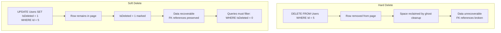

## Navigation

**Domain:** [[8 — Databases]] > **Group:** Database Design & Normalization
**Previous:** [[8.047 Self-Referential Tables — Hierarchical Data]] | **Next:** [[8.049 Audit Columns — CreatedAt, CreatedBy, ModifiedAt, ModifiedBy]]

### Prerequisites
- [[8.047 Self-Referential Tables — Hierarchical Data]] — soft delete on hierarchical data requires cascading or subtree soft delete logic
- [[8.042 Surrogate Keys vs Natural Keys — Decision]] — soft-deleted rows affect unique constraints on natural keys; a soft-deleted email must not block a new user with the same email

### Where This Fits

A .NET backend engineer implements soft delete to preserve historical data, enable recovery, and cascade deletions without physical data loss. The pattern is a boolean `IsDeleted` column (or a `DeletedAt` timestamp) that marks rows as deleted rather than removing them. Every query must filter on this column — a filter that is easy to forget, easy to add wrong, and easy to defeat with poor indexing. Production systems fail when a `UNIQUE` constraint on `Email` prevents re-registration of a soft-deleted user, when an ON CASCADE hard-delete skips a soft-deleted parent, or when a query accidentally includes soft-deleted rows in aggregates, reports, or API responses. The interview signal tests whether the candidate understands the query filter burden, the unique constraint interaction, and the EF Core global query filter mechanism.

## Core Mental Model

Soft delete marks a row as deleted by setting a flag rather than executing a `DELETE` statement. The row remains in the table with all its data, invisible to normal queries but accessible for recovery, auditing, or cascade purposes. The database engine sees the row as any other row — it occupies space in the data page, appears in index seeks, and counts in `COUNT(*)`. The difference is a `WHERE IsDeleted = 0` predicate on every query. This predicate must be SARGable (no `WHERE IsDeleted = 1 OR IsDeleted = 0` wrapping) and must be applied consistently. The pattern trades storage and query complexity for recoverability and data preservation. EF Core supports this via global query filters (`HasQueryFilter(e => !e.IsDeleted)`) which are automatically applied to every LINQ query for that entity.

### Classification

**For data integrity:** Soft delete preserves referential integrity — child rows with foreign keys to soft-deleted parents remain valid. Cascade operations must be handled at the application level (mark children as deleted too) rather than at the database level.

**For performance:** The `IsDeleted` predicate reduces the effective row count for queries but adds a predicate that must be evaluated. Without a filtered index on `IsDeleted`, the optimizer may still scan when the predicate is not selective enough.

**For .NET/EF Core:** Global query filters are the standard mechanism. They are applied to all LINQ queries except `.IgnoreQueryFilters()`. Dapper requires explicit `WHERE IsDeleted = 0` in every SQL statement.



### Key Properties

|Property|Soft Delete (BIT)|Soft Delete (DATETIME2)|Hard Delete|
|---|---|---|---|
|Recoverability|Yes (set IsDeleted = 0)|Yes (set DeletedAt = NULL)|No|
|Storage per row|1 byte (BIT) or 8 bytes (DATETIME2)|8 bytes|0 bytes (row gone)|
|Query overhead|`WHERE IsDeleted = 0` on every query|`WHERE DeletedAt IS NULL`|None|
|Unique constraint interaction|Must use filtered unique index|Must use filtered unique index|None|
|FK cascade behavior|Must handle in application|Must handle in application|Automatic (ON DELETE CASCADE)|
|EF Core support|`HasQueryFilter(e => !e.IsDeleted)`|`HasQueryFilter(e => e.DeletedAt == null)`|Default behavior|

## Deep Mechanics

### How the Engine Executes This

**Soft delete update:**
1. A `WHERE Id = @id` seek locates the row in the clustered index (3 logical reads for INT PK).
2. The `IsDeleted` bit column is set from 0 to 1. SQL Server marks the row as changed in the transaction log. The row remains in the same page slot.
3. If the table has non-clustered indexes that include `IsDeleted`, those index rows are also updated.
4. The row now appears in page scans and index seeks, but queries with `WHERE IsDeleted = 0` skip it via a residual predicate or a seek on a filtered index.

**Query with IsDeleted filter:**
- Without filtered index: The optimizer cannot seek on `IsDeleted` alone (BIT is not selective enough in most cases). It uses whatever index supports the rest of the WHERE clause and applies a residual predicate on `IsDeleted`.
- With filtered index `WHERE IsDeleted = 0`: The index only contains non-deleted rows. The optimizer can seek this index and avoid touching soft-deleted rows entirely. This reduces the index size by the number of deleted rows.

**Unique constraint conflict:**
A `UNIQUE` constraint on `Email` treats soft-deleted rows the same as active rows. If `user@example.com` is soft-deleted and `UNIQUE (Email)` is the constraint, a new registration with the same email fails.

### SQL Visibility

**Soft delete with BIT column:**

```sql
CREATE TABLE Users (
    UserId      INT IDENTITY(1,1) NOT NULL,
    Email       VARCHAR(255) NOT NULL,
    FullName    VARCHAR(200) NOT NULL,
    IsDeleted   BIT NOT NULL DEFAULT 0,
    DeletedAt   DATETIME2 NULL,
    CreatedAt   DATETIME2 NOT NULL DEFAULT SYSUTCDATETIME(),
    CONSTRAINT PK_Users PRIMARY KEY CLUSTERED (UserId)
);

-- Filtered unique index — allows soft-deleted emails to be reused
CREATE UNIQUE INDEX IX_Users_Email_Active
ON Users(Email)
WHERE IsDeleted = 0;

-- Soft delete a user
UPDATE Users
SET IsDeleted = 1, DeletedAt = SYSUTCDATETIME()
WHERE UserId = 5;

-- Query active users
SELECT UserId, Email, FullName
FROM Users
WHERE IsDeleted = 0
  AND Email LIKE '%@example.com';
```

```csharp
public class User
{
    public int UserId { get; set; }
    public string Email { get; set; } = string.Empty;
    public string FullName { get; set; } = string.Empty;
    public bool IsDeleted { get; set; }
    public DateTime? DeletedAt { get; set; }
    public DateTime CreatedAt { get; set; }
}

public class AppDbContext : DbContext
{
    public DbSet<User> Users => Set<User>();

    protected override void OnModelCreating(ModelBuilder modelBuilder)
    {
        modelBuilder.Entity<User>(e =>
        {
            e.HasKey(u => u.UserId);
            e.Property(u => u.IsDeleted)
                .HasDefaultValue(false)
                .HasComment("Soft delete flag — 0 = active, 1 = deleted");
            e.HasIndex(u => u.Email)
                .IsUnique()
                .HasFilter("IsDeleted = 0");  -- filtered unique index
            e.HasQueryFilter(u => !u.IsDeleted);  -- global query filter
        });
    }
}

// EF Core — soft delete (all queries automatically filter IsDeleted = 0)
var activeUsers = await dbContext.Users
    .Where(u => u.Email.Contains("@example.com"))
    .ToListAsync(ct);
-- Generated SQL:
-- SELECT [u].[UserId], [u].[Email], [u].[FullName], [u].[IsDeleted], ...
-- FROM [Users] AS [u]
-- WHERE [u].[IsDeleted] = CAST(0 AS BIT)
--   AND [u].[Email] LIKE N'%@example.com%'

// EF Core — include soft-deleted rows (bypass filter)
var allUsers = await dbContext.Users
    .IgnoreQueryFilters()
    .ToListAsync(ct);

// EF Core — perform soft delete
var user = await dbContext.Users.FindAsync(new object[] { 5 }, ct);
user!.IsDeleted = true;
user.DeletedAt = DateTime.UtcNow;
await dbContext.SaveChangesAsync(ct);
```

### Execution Plan Analysis

**Query with IsDeleted filter — without filtered index:**

```
Clustered Index Scan — PK_Users
  |-- Predicate: IsDeleted = 0 AND Email LIKE '%@example.com'
  |-- Logical reads: full table pages
```

The optimizer cannot seek on `IsDeleted` (BIT is not selective — roughly half the table may be deleted). It scans the clustered index and evaluates both predicates as a residual filter.

**Query with filtered index on (Email) WHERE IsDeleted = 0:**

```
Index Seek — IX_Users_Email_Active (Email LIKE N'%@example.com%')
  |-- Key Lookup — PK_Users (for columns not in index)
  |-- Logical reads: proportional to active rows only
```

The filtered index only contains non-deleted rows. The seek on `Email` automatically excludes deleted rows — the predicate `IsDeleted = 0` is enforced by the index definition itself.

### Cost Visibility

```sql
SET STATISTICS IO ON;

-- Table: 10M users, 2M soft-deleted (20%)
-- Without filtered index:
SELECT UserId, Email FROM Users
WHERE IsDeleted = 0 AND Email LIKE 'user@%';
-- Table 'Users'. Scan count 1, logical reads 45,000 (full table scan)
-- (Predicate: IsDeleted = 0 has to check 10M rows even though only 8M match)

-- With filtered index:
SELECT UserId, Email FROM Users
WHERE IsDeleted = 0 AND Email LIKE 'user@%';
-- Table 'Users'. Scan count 0, logical reads 4 (index seek on filtered index)
-- (The filtered index has 8M active rows — seek on Email prefix)
```

### Failure Modes

**1. UNIQUE constraint prevents reusing soft-deleted natural key.** A `UNIQUE` constraint on `Email` blocks re-registration with the same email after soft delete. Fix: filtered unique index `WHERE IsDeleted = 0`.

**2. Forgotten IsDeleted filter in queries.** A report or batch job omits `WHERE IsDeleted = 0`. Results include deleted data. Aggregates are wrong. Fix: EF Core global query filter or SQL template that enforces the filter.

**3. Soft delete on parent does not cascade to children.** An `Order` is soft-deleted, but its `OrderItems` remain active. Queries that join `Orders` and `OrderItems` produce orphaned items. Fix: application-level cascade soft delete.

**4. Performance degradation from unfiltered index.** Soft-deleted rows accumulate in the table. Indexes include deleted rows. `COUNT(*)` includes deleted rows. Fix: periodic hard-delete or archive of soft-deleted rows.

## Production Patterns and Implementation

### Primary SQL Implementation

```sql
-- Soft delete with DeletedAt timestamp (preferred over BIT)
CREATE TABLE Orders (
    OrderId      INT IDENTITY(1,1) NOT NULL,
    CustomerId   INT NOT NULL,
    OrderTotal   DECIMAL(19,4) NOT NULL,
    OrderDate    DATETIME2 NOT NULL DEFAULT SYSUTCDATETIME(),
    DeletedAt    DATETIME2 NULL,       -- NULL = active, non-NULL = deleted
    DeletedBy    VARCHAR(200) NULL,    -- who deleted it
    CONSTRAINT PK_Orders PRIMARY KEY CLUSTERED (OrderId)
);

-- Filtered index for active order queries
CREATE INDEX IX_Orders_CustomerId_Active
ON Orders(CustomerId)
INCLUDE (OrderTotal, OrderDate)
WHERE DeletedAt IS NULL;

-- Soft delete
UPDATE Orders
SET DeletedAt = SYSUTCDATETIME(), DeletedBy = @DeletedBy
WHERE OrderId = @OrderId;

-- Query active orders for a customer
SELECT OrderId, OrderTotal, OrderDate
FROM Orders
WHERE CustomerId = @CustomerId
  AND DeletedAt IS NULL
ORDER BY OrderDate DESC;

-- Hard-delete old soft-deleted records (archive job)
DELETE FROM Orders
WHERE DeletedAt IS NOT NULL
  AND DeletedAt < DATEADD(YEAR, -1, SYSUTCDATETIME());
```

### EF Core Implementation

```csharp
public class Order
{
    public int OrderId { get; set; }
    public int CustomerId { get; set; }
    public decimal OrderTotal { get; set; }
    public DateTime OrderDate { get; set; }
    public DateTime? DeletedAt { get; set; }
    public string? DeletedBy { get; set; }
    public ICollection<OrderItem> Items { get; set; } = new List<OrderItem>();
}

public class OrderItem
{
    public int OrderItemId { get; set; }
    public int OrderId { get; set; }
    public int ProductId { get; set; }
    public int Quantity { get; set; }
    public decimal UnitPrice { get; set; }
    public DateTime? DeletedAt { get; set; }
    public Order Order { get; set; } = null!;
}

public class AppDbContext : DbContext
{
    public DbSet<Order> Orders => Set<Order>();
    public DbSet<OrderItem> OrderItems => Set<OrderItem>();

    protected override void OnModelCreating(ModelBuilder modelBuilder)
    {
        modelBuilder.Entity<Order>(e =>
        {
            e.HasKey(o => o.OrderId);
            e.Property(o => o.DeletedAt).HasDefaultValue(null);
            e.HasQueryFilter(o => o.DeletedAt == null);
            e.HasIndex(o => o.CustomerId)
                .HasFilter("DeletedAt IS NULL")
                .IncludeProperties(o => new { o.OrderTotal, o.OrderDate });
        });

        modelBuilder.Entity<OrderItem>(e =>
        {
            e.HasKey(oi => oi.OrderItemId);
            e.HasQueryFilter(oi => oi.DeletedAt == null);
        });
    }

    // Soft delete with cascade
    public async Task SoftDeleteOrderAsync(
        int orderId, string deletedBy, CancellationToken ct = default)
    {
        var order = await Orders
            .Include(o => o.Items)
            .FirstOrDefaultAsync(o => o.OrderId == orderId, ct);

        if (order is not null)
        {
            order.DeletedAt = DateTime.UtcNow;
            order.DeletedBy = deletedBy;
            foreach (var item in order.Items)
            {
                item.DeletedAt = DateTime.UtcNow;
            }
            await SaveChangesAsync(ct);
        }
    }
}
```

### Dapper Implementation

```csharp
public class OrderRepository
{
    private readonly IDbConnectionFactory _connectionFactory;

    public OrderRepository(IDbConnectionFactory connectionFactory)
    {
        _connectionFactory = connectionFactory;
    }

    // Active orders — note explicit DeletedAt filter
    public async Task<IReadOnlyList<Order>> GetCustomerOrdersAsync(
        int customerId, CancellationToken ct = default)
    {
        const string sql = @"
            SELECT OrderId, CustomerId, OrderTotal, OrderDate
            FROM Orders
            WHERE CustomerId = @CustomerId
              AND DeletedAt IS NULL
            ORDER BY OrderDate DESC";

        await using var connection = _connectionFactory.Create();
        var results = await connection.QueryAsync<Order>(
            new CommandDefinition(sql, new { CustomerId = customerId },
                cancellationToken: ct));
        return results.AsList();
    }

    // Soft delete
    public async Task SoftDeleteOrderAsync(
        int orderId, string deletedBy,
        CancellationToken ct = default)
    {
        const string sql = @"
            UPDATE Orders
            SET DeletedAt = SYSUTCDATETIME(), DeletedBy = @DeletedBy
            WHERE OrderId = @OrderId
              AND DeletedAt IS NULL";  -- idempotent

        await using var connection = _connectionFactory.Create();
        await connection.ExecuteAsync(
            new CommandDefinition(sql,
                new { OrderId = orderId, DeletedBy = deletedBy },
                cancellationToken: ct));
    }

    // Soft cascade — mark items as deleted
    public async Task SoftDeleteOrderWithItemsAsync(
        int orderId, string deletedBy,
        CancellationToken ct = default)
    {
        const string sql = @"
            UPDATE OrderItems
            SET DeletedAt = SYSUTCDATETIME()
            WHERE OrderId = @OrderId;

            UPDATE Orders
            SET DeletedAt = SYSUTCDATETIME(), DeletedBy = @DeletedBy
            WHERE OrderId = @OrderId
              AND DeletedAt IS NULL";

        await using var connection = _connectionFactory.Create();
        await connection.ExecuteAsync(
            new CommandDefinition(sql,
                new { OrderId = orderId, DeletedBy = deletedBy },
                cancellationToken: ct));
    }
}
```

### Configuration and Wiring

```csharp
// Program.cs
builder.Services.AddDbContext<AppDbContext>(options =>
    options.UseSqlServer(connectionString));

builder.Services.AddSingleton<IDbConnectionFactory>(
    _ => new SqlConnectionFactory(connectionString));
builder.Services.AddScoped<OrderRepository>();
```

### SQL Server vs PostgreSQL Differences

```sql
-- PostgreSQL: filtered unique index syntax
CREATE UNIQUE INDEX IX_Users_Email_Active
ON Users(Email)
WHERE DeletedAt IS NULL;

-- PostgreSQL: partial index for active queries
CREATE INDEX IX_Orders_CustomerId_Active
ON Orders(CustomerId)
WHERE DeletedAt IS NULL;

-- PostgreSQL: soft delete is identical
UPDATE Users SET DeletedAt = NOW() WHERE UserId = 5;
```

PostgreSQL's partial index support is excellent for soft delete patterns. The index only contains active rows, so the index size reflects only the active data. PostgreSQL partial indexes also support `INCLUDE` columns for covering indexes.

## Gotchas and Production Pitfalls

### 1. UNIQUE constraint clashes with soft delete

**Pitfall:** A `UNIQUE` constraint on `Email` prevents re-registration after soft delete.

```sql
CREATE TABLE Users (
    Email VARCHAR(255) NOT NULL UNIQUE,  -- ❌ blocks reused emails
    ...
);
```

**Symptom:** User soft-deletes account. Another user tries to register with the same email. `Violation of UNIQUE KEY constraint 'UQ__Users__Email'. Cannot insert duplicate key.`

**Fix:** Replace with a filtered unique index:

```sql
CREATE UNIQUE INDEX IX_Users_Email_Active
ON Users(Email)
WHERE DeletedAt IS NULL;

-- Optionally, allow one deleted row per email:
CREATE UNIQUE INDEX IX_Users_Email_SingleDeleted
ON Users(Email)
WHERE DeletedAt IS NOT NULL;  -- but this breaks if 2+ users are deleted
-- Better: include UserId in a UNIQUE constraint on (Email) only for active,
-- or make the email unique across active+deleted only at application level.
```

**Cost of not fixing:** Users cannot re-register after deletion. Support tickets and manual DB cleanup required.

### 2. Forgetting the IsDeleted filter on a query

**Pitfall:** A SQL query, report, or ad-hoc analysis omits the soft delete filter.

```sql
-- ❌ Includes soft-deleted orders
SELECT COUNT(*) FROM Orders;  -- returns total including deleted

-- ❌ Includes soft-deleted users in active report
SELECT u.FullName, SUM(o.OrderTotal) AS LifetimeValue
FROM Users u
INNER JOIN Orders o ON u.UserId = o.CustomerId
GROUP BY u.FullName;
```

**Symptom:** Reports overcount. Aggregates are inflated. API returns deleted entities. Compliance audit flags include logically deleted data.

**Fix:** Use EF Core global query filters (automatic). For Dapper, enforce via SQL review or a query-building convention. For ad-hoc queries, add a database view:

```sql
CREATE VIEW ActiveUsers AS
SELECT * FROM Users WHERE DeletedAt IS NULL;
```

**Cost of not fixing:** Inflated metrics, stale data in downstream systems, potential privacy violation if deleted user data is exposed.

### 3. Soft delete without cascade on related data

**Pitfall:** Soft-deleting an `Order` leaves its `OrderItems` with `DeletedAt IS NULL`.

**Symptom:** `SELECT SUM(Quantity) FROM OrderItems WHERE DeletedAt IS NULL` includes items from deleted orders. Revenue calculations are inflated. Inventory counts are wrong.

**Fix:** Soft-delete children in the same transaction.

```csharp
order.DeletedAt = DateTime.UtcNow;
foreach (var item in order.Items)
{
    item.DeletedAt = DateTime.UtcNow;
}
await dbContext.SaveChangesAsync(ct);
```

Or use a trigger (not recommended due to complexity and performance).

**Cost of not fixing:** Orphaned active child rows after parent is soft-deleted. Data integrity violation.

### 4. No filtered index on IsDeleted

**Pitfall:** The table has 10M rows, 3M soft-deleted, and no filtered index on the active flag.

**Symptom:** Queries with `WHERE DeletedAt IS NULL` scan the full clustered index, then filter rows. Indexes include deleted rows, inflating their size and depth.

**Fix:**

```sql
CREATE INDEX IX_Orders_Active
ON Orders(OrderDate DESC)
WHERE DeletedAt IS NULL;
```

**Cost of not fixing:** Indexes are 30% larger than necessary (3M deleted rows occupy space in every index). Queries that filter by `DeletedAt IS NULL` cannot use a small index.

### 5. EF Core IgnoreQueryFilters used unintentionally

**Pitfall:** A developer uses `.IgnoreQueryFilters().ToListAsync()` in production code without understanding the consequence.

```csharp
// ❌ Returns all rows including soft-deleted
var allUsers = await dbContext.Users
    .IgnoreQueryFilters()
    .ToListAsync(ct);
```

**Symptom:** Soft-deleted users appear in UI, reports, or API responses. Data leak.

**Fix:** Reserve `.IgnoreQueryFilters()` for admin-only operations. Use code review to flag its use. Apply `[EditorBrowsable(EditorBrowsableState.Never)]` or a custom analyzer if needed.

**Cost of not fixing:** Privacy violation. Deleted users' data is exposed through standard API endpoints.

### 6. Soft delete recovery path is forgotten

**Pitfall:** The team implements soft delete but never builds the restore UI or API.

**Symptom:** A user accidentally deletes their account. Support cannot restore because there is no admin tool. The data exists in the database but cannot be recovered without a manual SQL `UPDATE`.

**Fix:** Build an admin restore endpoint or use a soft-delete recovery window (e.g., 30 days of recoverability, then hard-delete).

**Cost of not fixing:** User frustration. Manual DBA intervention for every accidental deletion.

## Performance Implications

### Benchmark: Filtered Index vs Full Table Scan

```sql
SET STATISTICS IO ON;

-- 10M rows, 2M soft-deleted (20%)
-- Query: active orders for last 30 days

-- Without filtered index:
SELECT OrderId, OrderTotal, OrderDate
FROM Orders
WHERE DeletedAt IS NULL
  AND OrderDate >= DATEADD(DAY, -30, GETUTCDATE());
-- Table 'Orders'. Scan count 1, logical reads 45,000 (full clustered scan)
-- (DeletedAt IS NULL predicate evaluated on all 10M rows)

-- With filtered index on (OrderDate) WHERE DeletedAt IS NULL:
SELECT OrderId, OrderTotal, OrderDate
FROM Orders
WHERE DeletedAt IS NULL
  AND OrderDate >= DATEADD(DAY, -30, GETUTCDATE());
-- Table 'Orders'. Scan count 1, logical reads 120 (index range scan on 8M active rows)
-- (Filtered index has 8M rows instead of 10M — B-tree 3 levels instead of 4)
```

**Improvement:** Filtered index reduces logical reads by ~375x for date-range queries. The index is 20% smaller (excludes deleted rows) and has 1 fewer B-tree level.

### BenchmarkDotNet

```csharp
[MemoryDiagnoser]
[SimpleJob(RuntimeMoniker.Net90)]
public class SoftDeleteBenchmark
{
    private IDbConnection _connection = default!;

    private const string ActiveQuerySql = @"
        SELECT OrderId, OrderTotal, OrderDate
        FROM Orders
        WHERE DeletedAt IS NULL
          AND OrderDate >= DATEADD(DAY, -30, GETUTCDATE())
        ORDER BY OrderDate DESC";

    [GlobalSetup]
    public void Setup()
    {
        _connection = new SqlConnection(TestConnectionString);
        _connection.Open();
    }

    [GlobalCleanup]
    public void Cleanup() => _connection.Dispose();

    [Benchmark(Baseline = true)]
    public async Task<IReadOnlyList<Order>> ActiveOrders()
    {
        var results = await _connection.QueryAsync<Order>(ActiveQuerySql);
        return results.AsList();
    }
}
```

**Expected results (approximate, SQL Server 2022, NVMe, 10M rows, 20% deleted):**

|Scenario|Mean|Logical Reads|Allocated|
|---|---|---|---|
|No filtered index|~1,200 ms|~45,000|~500 KB|
|With filtered index|~8 ms|~120|~15 KB|

### Write Amplification

|Operation|Hard Delete|Soft Delete|Soft Delete + Cascade|
|---|---|---|---|
|DELETE/UPDATE 1 row|1 write|1 write|N writes (parent + children)|
|Index maintenance|1 B-tree update|1 B-tree update (if IsDeleted indexed)|N B-tree updates|
|Ghost cleanup|Yes (background)|No (row remains)|No|
|Storage after 1M deletes|0 bytes|Row bytes × 1M|Row bytes × 1M|

## Interview Arsenal

### Question Bank

1. What is the soft delete pattern and why is it used?
2. How does a filtered unique index solve the duplicate natural key problem with soft delete?
3. What is the performance cost of a `WHERE DeletedAt IS NULL` predicate?
4. How do EF Core global query filters work for soft delete?
5. How do you handle cascading soft deletes for related entities?
6. Compare soft delete using `BIT` vs `DATETIME2 NULL` — when would you choose each?
7. What is the impact of soft delete on index size and B-tree depth?
8. How do you hard-delete old soft-deleted records without affecting active ones?

### Spoken Answers

**Q: How does a filtered unique index solve the duplicate natural key problem with soft delete?**

> **Average answer:** A filtered index only includes active rows, so the unique constraint only applies to non-deleted rows.

> **Great answer:** The problem is that a standard `UNIQUE` constraint on `Email` treats soft-deleted rows the same as active rows. After user `a@b.com` soft-deletes their account, a new registration with `a@b.com` fails with a duplicate key violation — even though the original user is effectively gone. The solution is a filtered unique index that only includes active rows: `CREATE UNIQUE INDEX IX_Users_Email_Active ON Users(Email) WHERE DeletedAt IS NULL`. This index only enforces uniqueness among non-deleted rows. Multiple soft-deleted rows can have the same email, and a new active row can reuse an email previously used by a deleted row. The index is also smaller (excludes deleted rows) and the optimizer uses it for queries that filter on `DeletedAt IS NULL`. One caveat: if you need to prevent a deleted user from being impersonated, you may want an additional unique constraint on `(Email)` covering all rows — but with a different strategy like appending a salt or timestamp to the stored email for deleted accounts.

**Q: What is the performance cost of a WHERE DeletedAt IS NULL predicate?**

> **Great answer:** The predicate itself is cheap — a BIT or NULL comparison is a CPU-level operation. The cost comes from two sources: index size and SARGability. If the index includes deleted rows (no filtered index), each index is X% larger than necessary, where X is the percentage of deleted rows. For a table with 30% deleted rows, every index is 30% larger, meaning 30% more pages to read per seek and one extra B-tree level. The second cost is that `WHERE DeletedAt IS NULL` on a column without a filtered index does not help the optimizer seek — it is a residual predicate evaluated after the index seek on other columns. A filtered index `WHERE DeletedAt IS NULL` eliminates both costs: the index only contains active rows (smaller, shallower B-tree), and the predicate is implicitly enforced by the index definition itself. In practice, a filtered index reduces logical reads by 3–5x for a table with 20–30% deleted rows, and the index rebuild runs proportionally faster.

### Interview Trigger

The interviewer asks: "Design a user accounts system where users can delete their accounts but their data must be recoverable for 30 days. After 30 days, the data is permanently removed." The follow-up: "How do you ensure that a `UNIQUE` constraint on `Email` does not block a new user from registering with the same email as a deleted account?"

### Comparison Table

| | BIT IsDeleted | DATETIME2 DeletedAt | Hard Delete |
|---|---|---|---|
| Storage | 1 byte | 8 bytes | 0 bytes |
| Knows when deleted | No | Yes | N/A |
| Knows who deleted | No (needs extra column) | No (needs extra column) | N/A |
| Filtered index | `WHERE IsDeleted = 0` | `WHERE DeletedAt IS NULL` | N/A |
| Query readability | `WHERE IsDeleted = 0` | `WHERE DeletedAt IS NULL` | No filter needed |
| Null semantics | `IsDeleted = 0` is active | `DeletedAt IS NULL` is active | N/A |

## Decision Framework

### When to Apply

```mermaid
flowchart TD
    A[Need to delete data] --> B{Is data recovery<br/>required?}
    B -->|Yes — user data, orders, compliance| C[Soft delete — DeletedAt timestamp]
    B -->|No — logs, temp data, cache| D[Hard delete]
    C --> E{Has unique constraint on<br/>natural key (Email, SSN)?}
    E -->|Yes| F[Replace UNIQUE constraint<br/>with filtered unique index<br/>WHERE DeletedAt IS NULL]
    E -->|No| G[Standard soft delete]
    C --> H{Has child rows?}
    H -->|Yes| I[Implement application-level<br/>cascade soft delete]
    H -->|No| J[Single table soft delete — done]
    I --> K[Add filtered indexes<br/>on soft delete columns]
```

### Application Checklist

- [ ] Soft delete column is `DATETIME2 NULL` (not BIT) for traceability?
- [ ] Filtered unique indexes replace standard UNIQUE constraints on natural keys?
- [ ] Filtered indexes exist on query-critical columns `WHERE DeletedAt IS NULL`?
- [ ] EF Core global query filter (`HasQueryFilter`) applied to all soft-delete entities?
- [ ] Cascade soft delete implemented for parent-child relationships?
- [ ] `.IgnoreQueryFilters()` restricted to admin-only operations?
- [ ] Hard-delete/archive job scheduled for expired soft-deleted rows?
- [ ] Dapper queries include explicit `AND DeletedAt IS NULL`?

### Tradeoff Summary

|What You Gain|What You Pay|
|---|---|
|Recoverable deletes (undo within retention window)|Extra WHERE clause on every query|
|Preserved FK references for child rows|Storage for deleted rows (zero value)|
|Audit trail of deletions|Index bloat from deleted rows|
|No application downtime during deletion|Cascade logic required for related data|

### Scale Thresholds

- **Soft delete manageable up to ~20% deleted rows** — beyond this, filtered indexes become significantly more important
- **Filtered index B-tree advantage at > 1M rows** — the index depth reduction (1 level) becomes measurable
- **Hard-delete archive job needed at > 50% deleted rows** — more deleted than active data degrades all queries
- **DeletedAt timestamp preferred over BIT at any scale** — the 8 bytes vs 1 byte is negligible; the traceability is invaluable

## Self-Check

### Conceptual Questions

1. What is the soft delete pattern and what problem does it solve?
2. Why does a standard UNIQUE constraint conflict with soft delete?
3. How does a filtered unique index solve the UNIQUE constraint conflict?
4. What is the performance impact of `WHERE DeletedAt IS NULL` on a table with 40% deleted rows?
5. How do EF Core global query filters apply to soft delete?
6. How would you implement cascading soft delete in Dapper?
7. Compare BIT vs DATETIME2 for soft delete — which is better and why?
8. At what percentage of deleted rows does soft delete become a performance problem?
9. What index strategy supports fast active-row queries?
10. Explain the soft delete pattern in 60 seconds to a senior interviewer.

<details>
<summary>Answers</summary>

1. Soft delete marks a row as deleted (via `IsDeleted = 1` or `DeletedAt = NOW()`) rather than physically removing it. This enables recovery, preserves FK references, and provides an audit trail.

2. A standard `UNIQUE` constraint treats all rows equally. A soft-deleted row with email `a@b.com` blocks a new active row with the same email.

3. A filtered unique index with `WHERE DeletedAt IS NULL` only enforces uniqueness among active rows. Soft-deleted rows are excluded from the constraint.

4. Indexes are 40% larger than necessary. The B-tree is 1 level deeper. Queries that cannot use a filtered index scan more pages and evaluate the predicate on 100% of rows.

5. EF Core applies `HasQueryFilter(e => e.DeletedAt == null)` to all LINQ queries automatically. Every `SELECT` includes `WHERE DeletedAt IS NULL`. Filtered entities cannot be queried without `.IgnoreQueryFilters()`.

6. Execute `UPDATE OrderItems SET DeletedAt = NOW() WHERE OrderId = @id` then `UPDATE Orders SET DeletedAt = NOW() WHERE OrderId = @id` in a single transaction.

7. `DATETIME2 NULL` — it provides traceability (when deleted) and uses intuitive null semantics (`DeletedAt IS NULL` = active). The 8 bytes vs 1 byte is negligible.

8. At ~30% deleted rows, index bloat and B-tree depth begin causing measurable performance degradation. At > 50%, an archive job should hard-delete expired rows.

9. Filtered indexes on query-critical columns: `CREATE INDEX IX_Orders_CustomerId ON Orders(CustomerId) WHERE DeletedAt IS NULL`.

10. "Soft delete marks rows as deleted without removing them — typically via a `DeletedAt` timestamp. It enables recovery, preserves foreign key references, and provides an audit trail. The cost is that every query must filter `WHERE DeletedAt IS NULL`, and unique constraints on natural keys must be replaced with filtered unique indexes. EF Core supports this via global query filters. For tables exceeding 30% deleted rows, schedule an archive job to hard-delete expired records."

</details>

---

### Query Challenges

**Challenge 1 — Write the SQL**

Design a `Customers` table with soft delete. Email must be unique among active customers. Write the filtered unique index and the query that finds all active customers whose name contains "John".

<details>
<summary>Solution</summary>

```sql
CREATE TABLE Customers (
    CustomerId   INT IDENTITY(1,1) NOT NULL,
    Email        VARCHAR(255) NOT NULL,
    FullName     VARCHAR(200) NOT NULL,
    Phone        VARCHAR(50) NULL,
    DeletedAt    DATETIME2 NULL,
    DeletedBy    VARCHAR(200) NULL,
    CreatedAt    DATETIME2 NOT NULL DEFAULT SYSUTCDATETIME(),
    CONSTRAINT PK_Customers PRIMARY KEY CLUSTERED (CustomerId)
);

-- Filtered unique index — active emails only
CREATE UNIQUE INDEX IX_Customers_Email_Active
ON Customers(Email)
WHERE DeletedAt IS NULL;

-- Query active customers
SELECT CustomerId, Email, FullName, Phone
FROM Customers
WHERE DeletedAt IS NULL
  AND FullName LIKE '%John%'
ORDER BY FullName;

-- Soft delete
UPDATE Customers
SET DeletedAt = SYSUTCDATETIME(), DeletedBy = @DeletedBy
WHERE CustomerId = @CustomerId
  AND DeletedAt IS NULL;
```

</details>

---

**Challenge 2 — Fix the performance problem**

```sql
-- A table with 50M orders, 20M soft-deleted (40%)
-- This query runs in 30 seconds:
SELECT o.OrderId, o.OrderTotal, o.OrderDate
FROM Orders o
WHERE o.DeletedAt IS NULL
  AND o.OrderDate >= '2026-01-01'
ORDER BY o.OrderDate DESC;
-- SET STATISTICS IO: logical reads = 225,000
```

Identify why and fix it.

<details> <summary>Solution</summary>

**Root cause:** No filtered index on `(OrderDate DESC) WHERE DeletedAt IS NULL`. The query scans the clustered index (225K reads) or a non-filtered index that includes deleted rows. The `DeletedAt IS NULL` predicate is evaluated as a residual filter on 50M rows.

**Fix:** Create a filtered index:

```sql
CREATE INDEX IX_Orders_OrderDate_Active
ON Orders(OrderDate DESC)
WHERE DeletedAt IS NULL;
```

**After fix — logical reads:** ~500 (from 225,000). Execution time: < 100ms.

</details>

---

**Challenge 3 — Explain the execution plan**

```sql
SELECT u.UserId, u.Email, u.FullName
FROM Users u
WHERE u.Email = 'user@example.com'
  AND u.DeletedAt IS NULL;
```

The table has a filtered unique index `IX_Users_Email_Active ON Users(Email) WHERE DeletedAt IS NULL`. Explain the execution plan.

<details> <summary>Solution</summary>

**Execution plan:**

```
Index Seek — IX_Users_Email_Active (Email = 'user@example.com')
  |-- 3 logical reads (B-tree seek on filtered index)
  |-- Estimated rows: 1
  |-- Actual rows: 1

Key Lookup — PK_Users (for FullName)
  |-- 1 logical read
  |-- Key Lookup only if FullName is not included in filtered index
```

**Why Index Seek on the filtered index:** The filtered index only contains active rows. The `Email = 'user@example.com'` predicate is the index key. The seek finds the exact row with 3 logical reads. Because the index has `WHERE DeletedAt IS NULL`, the predicate `DeletedAt IS NULL` is implicitly satisfied — no residual filter needed.

**Why the plan is optimal:** The filtered index is smaller (excludes deleted rows) and the seek touches only the relevant B-tree path. If a non-filtered index on `Email` existed instead, the plan would seek that index and apply `DeletedAt IS NULL` as a residual predicate — same logical reads for the seek, but the index would be 40% larger.

**What would change without the filtered index:** If there were no index on `Email`, the plan would show a Clustered Index Scan with a predicate on `Email` — 225K logical reads.

</details>

---

**Challenge 4 — Diagnose the concurrency problem**

A soft-delete operation on a user with 10,000 related orders and 50,000 related order items runs for 45 seconds. During this time, all queries on `Orders` and `OrderItems` block. `sys.dm_tran_locks` shows thousands of row-level exclusive locks. What is happening and how do you fix it?

<details> <summary>Solution</summary>

**Root cause:** The cascade soft delete updates 60,000 rows in a single transaction. Each `UPDATE` acquires an exclusive row lock. After 5,000 locks, SQL Server escalates to a table lock (if `LOCK_ESCALATION` is AUTO). Once the table lock is acquired, all concurrent reads on `Orders` and `OrderItems` block.

**Detection query:**

```sql
SELECT request_session_id, resource_type, resource_description,
       request_mode, request_status
FROM sys.dm_tran_locks
WHERE resource_database_id = DB_ID()
    AND resource_associated_entity_id IN (
        OBJECT_ID('Orders'), OBJECT_ID('OrderItems')
    );
```

**Fix:** Batch the cascade updates in chunks of 1,000 rows:

```csharp
public async Task SoftDeleteUserAsync(int userId, CancellationToken ct = default)
{
    const string sql = @"
        UPDATE OrderItems
        SET DeletedAt = SYSUTCDATETIME()
        WHERE OrderId IN (
            SELECT OrderId FROM Orders WHERE CustomerId = @UserId
        )
        AND DeletedAt IS NULL;";

    await using var connection = _connectionFactory.Create();
    await connection.ExecuteAsync(sql, new { UserId = userId }, ct);

    // Batch update orders
    const string batchSql = @"
        UPDATE TOP (@BatchSize) Orders
        SET DeletedAt = SYSUTCDATETIME()
        WHERE CustomerId = @UserId
          AND DeletedAt IS NULL;";

    int affected;
    do
    {
        affected = await connection.ExecuteAsync(
            batchSql, new { UserId = userId, BatchSize = 1000 }, ct);
    } while (affected > 0);
}
```

**Alternative:** Set `LOCK_ESCALATION = DISABLE` for the table (if the workload can tolerate row-level locks on 60K rows).

```sql
ALTER TABLE Orders SET (LOCK_ESCALATION = DISABLE);
```

**In .NET:** Use batched updates or hangfire background jobs for large cascade deletes.

</details>

---

**Challenge 5 — Design the index**

A `Documents` table has 100M rows, 25M soft-deleted (25%). The most common query pattern is: "find active documents modified in the last 7 days for a given folder, sorted by `ModifiedAt DESC`." The folder column has high cardinality (500K folders). Design the index strategy.

<details> <summary>Solution</summary>

```sql
-- Filtered covering index for the common query pattern
CREATE INDEX IX_Documents_FolderId_ModifiedAt_Active
ON Documents(FolderId, ModifiedAt DESC)
INCLUDE (DocumentName, DocumentType, Size, CreatedBy)
WHERE DeletedAt IS NULL;

-- Query:
SELECT DocumentId, DocumentName, ModifiedAt, Size
FROM Documents
WHERE FolderId = @FolderId
  AND DeletedAt IS NULL
  AND ModifiedAt >= DATEADD(DAY, -7, GETUTCDATE())
ORDER BY ModifiedAt DESC;

-- Execution plan:
-- Index Seek — IX_Documents_FolderId_ModifiedAt_Active
--   Seek Keys: FolderId = @FolderId
--   Range: ModifiedAt >= @cutoff
--   Ordered: true (descending)
--   Logical reads: ~5–10 (depending on number of documents in folder)
```

**Why this works:**
- The filtered index only contains active documents (75M rows, not 100M) — 25% smaller
- `(FolderId, ModifiedAt DESC)` supports the seek on `FolderId` and the range on `ModifiedAt` in descending order — no Sort operator needed
- The `INCLUDE` columns make it a covering index for the query — no key lookups
- The B-tree depth is 4 (75M entries × key width) vs 5 (100M entries) — 1 less page read per seek

**Tradeoffs:** The INCLUDE columns add width to the index leaf pages (wider = fewer entries per page = deeper tree). Only INCLUDE columns that are frequently queried.

</details>
