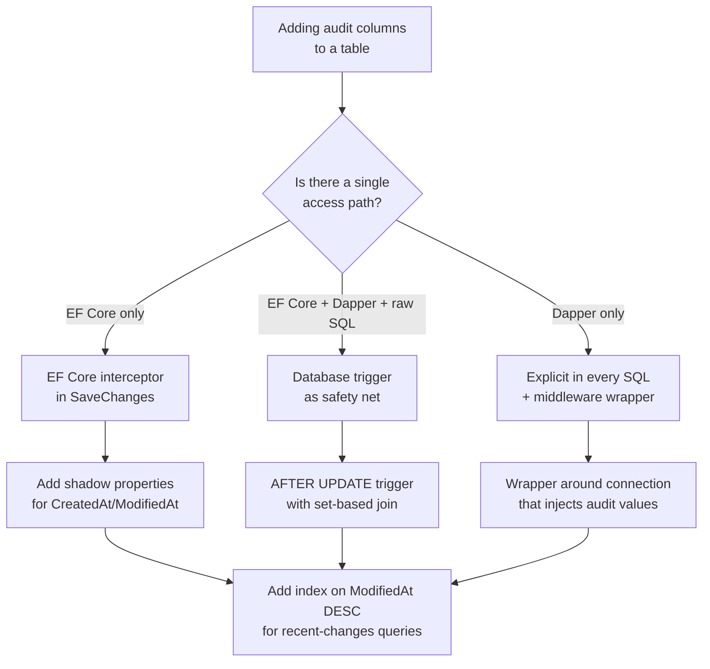

## Navigation

**Domain:** [[8 — Databases]] > **Group:** Database Design & Normalization
**Previous:** [[8.048 Soft Delete — IsDeleted Pattern]] | **Next:** [[8.050 Multi-Tenancy Schema — Shared vs Separate]]

### Prerequisites
- [[8.048 Soft Delete — IsDeleted Pattern]] — audit and soft delete columns are commonly added together; understanding the storage and query impact of timestamp columns applies to both
- [[8.002 Keys — Primary, Foreign, Candidate, Surrogate, Natural]] — audit columns are metadata that describes the row lifecycle; they are not key columns but interact with clustering and indexing

### Where This Fits

Every production table needs to answer: when was this row created? who created it? when was it last modified? who modified it? Audit columns — `CreatedAt`, `CreatedBy`, `ModifiedAt`, `ModifiedBy` — are the standard solution. They are not optional for any .NET backend system that faces users, processes financial data, or generates reports. Production systems fail when `ModifiedAt` is not updated on a row change (stale "last modified" timestamp), when `CreatedBy` is set by the application but `ModifiedBy` is forgotten, or when a bulk UPDATE bypasses the trigger or EF Core interceptor that maintains these columns. The interview signal tests whether the candidate can implement audit columns at the database level (defaults, triggers) and at the application level (EF Core interceptors, Dapper middleware) and understands the concurrency and indexing implications.

## Core Mental Model

Audit columns are metadata columns added to every table that track row creation and modification. `CreatedAt` and `CreatedBy` are set once on INSERT and never change. `ModifiedAt` and `ModifiedBy` are updated on every UPDATE. The database engine treats these as regular columns — they occupy space on the data page, can be indexed, and participate in execution plans. The critical invariant is that `ModifiedAt` must be set on every UPDATE, including bulk operations, or it becomes a source of stale data. EF Core supports audit columns via shadow properties and `SaveChanges` interceptors. SQL Server supports them via column defaults (`GETUTCDATE()`) for `CreatedAt` and triggers for `ModifiedAt`. The pattern separates structural data (what the row is) from lifecycle metadata (when and by whom the row was managed).

### Classification

**For schema design:** Audit columns are a cross-cutting concern. Every table should have them. They are typically the last 4 columns in the column order (no performance impact — SQL Server does not care about column order for fixed-length types).

**For performance:** `CreatedAt` and `ModifiedAt` are common query predicates ("find orders created last week", "find recently modified products"). An index on `ModifiedAt DESC` is often needed for "recently changed" queries. The columns add ~40 bytes per row (DATETIME2 = 8 bytes × 2 + VARCHAR = ~24 bytes × 2).

**For .NET/EF Core:** Shadow properties with `SaveChanges` interceptor provide automatic audit columns without entity changes. Dapper requires explicit column setting in every SQL statement or middleware.

```mermaid
flowchart TD
    subgraph INSERT Flow
        A[INSERT row] --> B[Set CreatedAt = GETUTCDATE()]
        B --> C[Set CreatedBy = @CurrentUser]
        C --> D[Set ModifiedAt = GETUTCDATE()]
        D --> E[Set ModifiedBy = @CurrentUser]
    end

    subgraph UPDATE Flow
        F[UPDATE row] --> G[Set ModifiedAt = GETUTCDATE()]
        G --> H[Set ModifiedBy = @CurrentUser]
        H --> I[CreatedAt and CreatedBy unchanged]
    end

    subgraph EF Core Interceptor
        J[SaveChangesAsync] --> K{Detect changes}
        K -->|Added entries| L[Set CreatedAt/CreatedBy]
        K -->|Modified entries| M[Set ModifiedAt/ModifiedBy]
        L --> N[Save to database]
        M --> N
    end
```

### Key Properties

|Property|CreatedAt|CreatedBy|ModifiedAt|ModifiedBy|
|---|---|---|---|---|
|Set on INSERT|Yes|Yes|Yes (same as CreatedAt)|Yes (same as CreatedBy)|
|Set on UPDATE|No|No|Yes|Yes|
|Data type|DATETIME2(7)|VARCHAR(200) or INT (FK to Users)|DATETIME2(7)|VARCHAR(200) or INT|
|Nullable|NOT NULL|NOT NULL|NOT NULL|NOT NULL|
|Default|`SYSUTCDATETIME()`|`SYSTEM_USER` or app user|N/A|N/A|
|Updated by|Database default|Application|Trigger or EF Core|Application|
|Index need|Common for time-range queries|Rare|Common for "recently changed"|Rare|

## Deep Mechanics

### How the Engine Executes This

**INSERT with audit columns:**
1. The storage engine writes the row with `CreatedAt = GETUTCDATE()` (set via column default), `CreatedBy = @user` (set by application), `ModifiedAt = GETUTCDATE()` (same as CreatedAt), `ModifiedBy = @user` (same as CreatedBy).
2. The row is placed in the clustered index at the position determined by the PK. The audit columns are part of the row data, not the key.
3. If a non-clustered index includes `ModifiedAt`, the index row is updated. For a filtered index like `WHERE ModifiedAt >= @cutoff`, only rows matching the filter appear in the index.

**UPDATE with audit columns (trigger or EF Core):**
1. The `UPDATE` statement modifies business columns (e.g., `OrderTotal`, `Status`).
2. After the update, a trigger or the application sets `ModifiedAt = GETUTCDATE()` and `ModifiedBy = @user`.
3. The row version (`sysrowversion` / `TIMESTAMP`) is also incremented if a concurrency token column exists.

**Query with ModifiedAt predicate:**
```sql
WHERE ModifiedAt >= @cutoff
```
Without an index on `ModifiedAt`, this is a clustered index scan. With an index on `(ModifiedAt DESC)`, it is an index seek + optional key lookup (if non-covering).

### SQL Visibility

**Audit columns with defaults and trigger:**

```sql
CREATE TABLE Orders (
    OrderId      INT IDENTITY(1,1) NOT NULL,
    CustomerId   INT NOT NULL,
    OrderTotal   DECIMAL(19,4) NOT NULL,
    OrderStatus  VARCHAR(50) NOT NULL DEFAULT 'Pending',
    CreatedAt    DATETIME2 NOT NULL DEFAULT SYSUTCDATETIME(),
    CreatedBy    VARCHAR(200) NOT NULL DEFAULT ORIGINAL_LOGIN(),
    ModifiedAt   DATETIME2 NOT NULL DEFAULT SYSUTCDATETIME(),
    ModifiedBy   VARCHAR(200) NOT NULL DEFAULT ORIGINAL_LOGIN(),
    CONSTRAINT PK_Orders PRIMARY KEY CLUSTERED (OrderId)
);
GO

CREATE TRIGGER TR_Orders_UpdateAudit
ON Orders
AFTER UPDATE
AS
BEGIN
    SET NOCOUNT ON;
    UPDATE o
    SET ModifiedAt = SYSUTCDATETIME(),
        ModifiedBy = ORIGINAL_LOGIN()
    FROM Orders o
    INNER JOIN inserted i ON o.OrderId = i.OrderId;
END;
GO

-- INSERT sets CreatedAt and ModifiedAt via defaults
INSERT INTO Orders (CustomerId, OrderTotal)
VALUES (42, 150.00);
-- CreatedAt = 2026-06-21 10:00:00.0000000
-- CreatedBy = DOMAIN\user
-- ModifiedAt = 2026-06-21 10:00:00.0000000
-- ModifiedBy = DOMAIN\user

-- UPDATE updates only ModifiedAt and ModifiedBy via trigger
UPDATE Orders SET OrderStatus = 'Shipped' WHERE OrderId = 1;
-- ModifiedAt = 2026-06-21 10:05:00.0000000 (updated)
-- ModifiedBy = DOMAIN\user (updated)
-- CreatedAt unchanged
```

```csharp
public class Order
{
    public int OrderId { get; set; }
    public int CustomerId { get; set; }
    public decimal OrderTotal { get; set; }
    public string OrderStatus { get; set; } = string.Empty;
    public DateTime CreatedAt { get; set; }
    public string CreatedBy { get; set; } = string.Empty;
    public DateTime ModifiedAt { get; set; }
    public string ModifiedBy { get; set; } = string.Empty;
}

public class AppDbContext : DbContext
{
    private readonly ICurrentUserService _currentUser;

    public AppDbContext(DbContextOptions<AppDbContext> options,
        ICurrentUserService currentUser) : base(options)
    {
        _currentUser = currentUser;
    }

    public DbSet<Order> Orders => Set<Order>();

    protected override void OnModelCreating(ModelBuilder modelBuilder)
    {
        modelBuilder.Entity<Order>(e =>
        {
            e.HasKey(o => o.OrderId);
            e.Property(o => o.CreatedAt).HasDefaultValueSql("SYSUTCDATETIME()");
            e.Property(o => o.ModifiedAt).HasDefaultValueSql("SYSUTCDATETIME()");
            e.Property(o => o.CreatedBy).HasMaxLength(200);
            e.Property(o => o.ModifiedBy).HasMaxLength(200);
        });
    }

    public override async Task<int> SaveChangesAsync(
        bool acceptAllChangesOnSuccess,
        CancellationToken ct = default)
    {
        var now = DateTime.UtcNow;
        var user = _currentUser.Name ?? "system";

        foreach (var entry in ChangeTracker.Entries())
        {
            if (entry.State == EntityState.Added)
            {
                entry.Property("CreatedAt").CurrentValue = now;
                entry.Property("CreatedBy").CurrentValue = user;
                entry.Property("ModifiedAt").CurrentValue = now;
                entry.Property("ModifiedBy").CurrentValue = user;
            }
            else if (entry.State == EntityState.Modified)
            {
                entry.Property("ModifiedAt").CurrentValue = now;
                entry.Property("ModifiedBy").CurrentValue = user;
            }
        }

        return await base.SaveChangesAsync(acceptAllChangesOnSuccess, ct);
    }
}

-- Generated SQL by EF Core (INSERT):
-- INSERT INTO [Orders] ([CustomerId], [OrderTotal], [CreatedAt], [CreatedBy], [ModifiedAt], [ModifiedBy])
-- VALUES (@p0, @p1, @p2, @p3, @p4, @p5);
-- SELECT [OrderId] FROM [Orders] WHERE @@ROWCOUNT = 1 AND [OrderId] = scope_identity();

-- Generated SQL by EF Core (UPDATE):
-- UPDATE [Orders] SET [OrderStatus] = @p0, [ModifiedAt] = @p1, [ModifiedBy] = @p2
-- WHERE [OrderId] = @p3;
```

### Execution Plan Analysis

**Query with ModifiedAt range predicate — without index:**

```
Clustered Index Scan — PK_Orders
  |-- Predicate: ModifiedAt >= @cutoff
  |-- Logical reads: 45,000 (full table)
```

**Query with ModifiedAt range predicate — with index on (ModifiedAt DESC):**

```
Index Seek (backward) — IX_Orders_ModifiedAt (ModifiedAt >= @cutoff)
  |-- Logical reads: ~150 (range scan on index pages)
  |-- Key Lookup — PK_Orders (for columns not in index)
  |-- 1 lookup per matching row
```

### Cost Visibility

```sql
SET STATISTICS IO ON;

-- Find orders modified in the last hour — without index
SELECT OrderId, CustomerId, OrderTotal, OrderStatus
FROM Orders
WHERE ModifiedAt >= DATEADD(HOUR, -1, GETUTCDATE());
-- Table 'Orders'. Scan count 1, logical reads 45,000 (full table scan)

-- Same query — with index on (ModifiedAt DESC)
-- CREATE INDEX IX_Orders_ModifiedAt ON Orders(ModifiedAt DESC) WHERE OrderStatus != 'Cancelled';
SELECT OrderId, CustomerId, OrderTotal, OrderStatus
FROM Orders
WHERE ModifiedAt >= DATEADD(HOUR, -1, GETUTCDATE());
-- Table 'Orders'. Scan count 1, logical reads 45 (index range scan)
```

### Failure Modes

**1. Direct SQL UPDATE bypasses trigger.** A bulk `UPDATE Orders SET OrderStatus = 'Cancelled' WHERE OrderDate < '2020-01-01'` does not fire the trigger per row if the trigger is not properly defined or if `DISABLE TRIGGER` is used. `ModifiedAt` and `ModifiedBy` are not updated.

**2. Trigger does not handle multiple rows.** `UPDATE TOP (1000) Orders SET ...` updates 1000 rows but the trigger assumes a single-row update: `SELECT @id = OrderId FROM inserted`. Only the last row's `ModifiedAt` is set. Fix: use set-based logic: `UPDATE o SET ModifiedAt = SYSUTCDATETIME() FROM Orders o INNER JOIN inserted i ON o.OrderId = i.OrderId`.

**3. Application time vs database time mismatch.** The application sets `CreatedAt = DateTime.UtcNow` on the client, but the web server clock is 5 seconds ahead of the database server. The audit timestamp is inconsistent. Fix: always use database defaults (`SYSUTCDATETIME()`) for `CreatedAt` and `ModifiedAt` rather than application-generated values.

**4. ModifiedAt indexed without filtered condition.** An index on `(ModifiedAt DESC)` on a table with 100M rows is large. If queries always filter by a business condition (e.g., `CustomerId`), a composite index `(CustomerId, ModifiedAt DESC)` is smaller and more useful.

## Production Patterns and Implementation

### Primary SQL Implementation

```sql
-- Standard audit columns on every table
CREATE TABLE Products (
    ProductId    INT IDENTITY(1,1) NOT NULL,
    ProductName  VARCHAR(200) NOT NULL,
    Price        DECIMAL(19,4) NOT NULL,
    CategoryId   INT NOT NULL,
    IsActive     BIT NOT NULL DEFAULT 1,
    CreatedAt    DATETIME2 NOT NULL DEFAULT SYSUTCDATETIME(),
    CreatedBy    VARCHAR(200) NOT DEFAULT ORIGINAL_LOGIN(),
    ModifiedAt   DATETIME2 NOT NULL DEFAULT SYSUTCDATETIME(),
    ModifiedBy   VARCHAR(200) NOT DEFAULT ORIGINAL_LOGIN(),
    CONSTRAINT PK_Products PRIMARY KEY CLUSTERED (ProductId)
);
GO

-- Trigger for ModifiedAt/ModifiedBy on UPDATE
CREATE TRIGGER TR_Products_UpdateAudit
ON Products
AFTER UPDATE
AS
BEGIN
    SET NOCOUNT ON;
    UPDATE p
    SET ModifiedAt = SYSUTCDATETIME(),
        ModifiedBy = ORIGINAL_LOGIN()
    FROM Products p
    INNER JOIN inserted i ON p.ProductId = i.ProductId;
END;
GO

-- Trigger for ModifiedBy on INSERT (if ORIGINAL_LOGIN default is not sufficient)
CREATE TRIGGER TR_Products_InsertAudit
ON Products
INSTEAD OF INSERT
AS
BEGIN
    SET NOCOUNT ON;
    INSERT INTO Products (ProductName, Price, CategoryId, IsActive, CreatedBy, ModifiedBy)
    SELECT ProductName, Price, CategoryId, IsActive, ORIGINAL_LOGIN(), ORIGINAL_LOGIN()
    FROM inserted;
END;
GO

-- Index for "recently modified products" queries
CREATE INDEX IX_Products_ModifiedAt
ON Products(ModifiedAt DESC)
INCLUDE (ProductName, Price)
WHERE IsActive = 1;
```

### EF Core Implementation

```csharp
public interface ICurrentUserService
{
    string Name { get; }
}

public class Product
{
    public int ProductId { get; set; }
    public string ProductName { get; set; } = string.Empty;
    public decimal Price { get; set; }
    public int CategoryId { get; set; }
    public bool IsActive { get; set; }
    public DateTime CreatedAt { get; set; }
    public string CreatedBy { get; set; } = string.Empty;
    public DateTime ModifiedAt { get; set; }
    public string ModifiedBy { get; set; } = string.Empty;
}

public class AppDbContext : DbContext
{
    private readonly ICurrentUserService _currentUser;

    public AppDbContext(DbContextOptions<AppDbContext> options,
        ICurrentUserService currentUser) : base(options)
    {
        _currentUser = currentUser;
    }

    public DbSet<Product> Products => Set<Product>();

    protected override void OnModelCreating(ModelBuilder modelBuilder)
    {
        modelBuilder.Entity<Product>(e =>
        {
            e.HasKey(p => p.ProductId);
            e.Property(p => p.CreatedAt)
                .HasDefaultValueSql("SYSUTCDATETIME()")
                .ValueGeneratedOnAdd();
            e.Property(p => p.ModifiedAt)
                .HasDefaultValueSql("SYSUTCDATETIME()")
                .ValueGeneratedOnAddOrUpdate();
            e.Property(p => p.CreatedBy).HasMaxLength(200);
            e.Property(p => p.ModifiedBy).HasMaxLength(200);
            e.HasIndex(p => p.ModifiedAt)
                .HasFilter("IsActive = 1")
                .IsDescending();
        });
    }

    public override async Task<int> SaveChangesAsync(
        bool acceptAllChangesOnSuccess,
        CancellationToken ct = default)
    {
        var now = DateTime.UtcNow;
        var user = _currentUser.Name ?? "system";

        foreach (var entry in ChangeTracker.Entries().Where(
            e => e.Entity is IAuditable))
        {
            if (entry.State == EntityState.Added)
            {
                entry.Property("CreatedAt").CurrentValue = now;
                entry.Property("CreatedBy").CurrentValue = user;
                entry.Property("ModifiedAt").CurrentValue = now;
                entry.Property("ModifiedBy").CurrentValue = user;
            }
            else if (entry.State == EntityState.Modified)
            {
                entry.Property("ModifiedAt").CurrentValue = now;
                entry.Property("ModifiedBy").CurrentValue = user;
            }
        }

        return await base.SaveChangesAsync(acceptAllChangesOnSuccess, ct);
    }
}

// Interface for auditable entities
public interface IAuditable
{
    DateTime CreatedAt { get; set; }
    string CreatedBy { get; set; }
    DateTime ModifiedAt { get; set; }
    string ModifiedBy { get; set; }
}

// Usage:
public class Product : IAuditable { ... }
```

### Dapper Implementation

```csharp
public interface ICurrentUserService
{
    string Name { get; }
}

public class ProductRepository
{
    private readonly IDbConnectionFactory _connectionFactory;
    private readonly ICurrentUserService _currentUser;

    public ProductRepository(IDbConnectionFactory connectionFactory,
        ICurrentUserService currentUser)
    {
        _connectionFactory = connectionFactory;
        _currentUser = currentUser;
    }

    public async Task<int> CreateProductAsync(
        Product product, CancellationToken ct = default)
    {
        const string sql = @"
            INSERT INTO Products (ProductName, Price, CategoryId, IsActive,
                                  CreatedBy, ModifiedBy)
            OUTPUT INSERTED.ProductId
            VALUES (@ProductName, @Price, @CategoryId, @IsActive,
                    @CreatedBy, @ModifiedBy)
            -- CreatedAt and ModifiedAt use SYSUTCDATETIME() default";

        await using var connection = _connectionFactory.Create();
        return await connection.ExecuteScalarAsync<int>(
            new CommandDefinition(sql, new
            {
                product.ProductName,
                product.Price,
                product.CategoryId,
                product.IsActive,
                CreatedBy = _currentUser.Name,
                ModifiedBy = _currentUser.Name
            }, cancellationToken: ct));
    }

    public async Task UpdateProductPriceAsync(
        int productId, decimal newPrice,
        CancellationToken ct = default)
    {
        const string sql = @"
            UPDATE Products
            SET Price = @NewPrice,
                ModifiedAt = SYSUTCDATETIME(),
                ModifiedBy = @ModifiedBy
            WHERE ProductId = @ProductId";

        await using var connection = _connectionFactory.Create();
        await connection.ExecuteAsync(
            new CommandDefinition(sql, new
            {
                ProductId = productId,
                NewPrice = newPrice,
                ModifiedBy = _currentUser.Name
            }, cancellationToken: ct));
    }

    // Recently modified products
    public async Task<IReadOnlyList<Product>> GetRecentlyModifiedAsync(
        int hours, CancellationToken ct = default)
    {
        const string sql = @"
            SELECT ProductId, ProductName, Price, CategoryId, IsActive,
                   CreatedAt, CreatedBy, ModifiedAt, ModifiedBy
            FROM Products
            WHERE ModifiedAt >= DATEADD(HOUR, -@Hours, GETUTCDATE())
              AND IsActive = 1
            ORDER BY ModifiedAt DESC";

        await using var connection = _connectionFactory.Create();
        var results = await connection.QueryAsync<Product>(
            new CommandDefinition(sql, new { Hours = hours },
                cancellationToken: ct));
        return results.AsList();
    }
}
```

### Configuration and Wiring

```csharp
// Program.cs
builder.Services.AddScoped<ICurrentUserService, CurrentUserService>();
builder.Services.AddDbContext<AppDbContext>((sp, options) =>
    options.UseSqlServer(connectionString));

builder.Services.AddSingleton<IDbConnectionFactory>(
    _ => new SqlConnectionFactory(connectionString));
builder.Services.AddScoped<ProductRepository>();
```

### SQL Server vs PostgreSQL Differences

```sql
-- PostgreSQL: audit columns with function defaults
CREATE OR REPLACE FUNCTION update_modified_at()
RETURNS TRIGGER AS $$
BEGIN
    NEW.ModifiedAt = NOW();
    NEW.ModifiedBy = current_user;
    RETURN NEW;
END;
$$ LANGUAGE plpgsql;

CREATE TABLE Products (
    ProductId    SERIAL PRIMARY KEY,
    ProductName  VARCHAR(200) NOT NULL,
    Price        NUMERIC(19,4) NOT NULL,
    CreatedAt    TIMESTAMPTZ NOT NULL DEFAULT NOW(),
    CreatedBy    VARCHAR(200) NOT NULL DEFAULT current_user,
    ModifiedAt   TIMESTAMPTZ NOT NULL DEFAULT NOW(),
    ModifiedBy   VARCHAR(200) NOT NULL DEFAULT current_user
);

CREATE TRIGGER tr_products_modify
    BEFORE UPDATE ON Products
    FOR EACH ROW
    EXECUTE FUNCTION update_modified_at();
```

PostgreSQL uses `NOW()` instead of `SYSUTCDATETIME()` (no `GETUTCDATE()` equivalent in the same form — `NOW()` returns the transaction timestamp). The trigger is `BEFORE UPDATE FOR EACH ROW` rather than SQL Server's `AFTER UPDATE` set-based trigger.

## Gotchas and Production Pitfalls

### 1. Trigger does not handle multi-row updates

**Pitfall:** The trigger assumes a single-row update and uses scalar variables.

```sql
CREATE TRIGGER TR_Orders_UpdateAudit
ON Orders AFTER UPDATE
AS
BEGIN
    DECLARE @id INT, @user VARCHAR(200);
    SELECT @id = OrderId FROM inserted;  -- ❌ only gets one row
    SELECT @user = ORIGINAL_LOGIN();
    UPDATE Orders SET ModifiedAt = SYSUTCDATETIME(), ModifiedBy = @user
    WHERE OrderId = @id;
END;
```

**Symptom:** When `UPDATE Orders SET Status = 'Shipped' WHERE OrderDate < '2024-01-01'` updates 50,000 rows, only the last row's `ModifiedAt` is updated.

**Fix:** Join with the `inserted` table set-based:

```sql
CREATE TRIGGER TR_Orders_UpdateAudit
ON Orders AFTER UPDATE
AS
BEGIN
    SET NOCOUNT ON;
    UPDATE o
    SET ModifiedAt = SYSUTCDATETIME(),
        ModifiedBy = ORIGINAL_LOGIN()
    FROM Orders o
    INNER JOIN inserted i ON o.OrderId = i.OrderId;
END;
```

**Cost of not fixing:** 49,999 rows have stale `ModifiedAt` timestamps. Downstream systems relying on `ModifiedAt` miss the changes.

### 2. EF Core does not update audit columns on raw SQL

**Pitfall:** The team uses EF Core's `SaveChanges` interceptor for audit columns, but also executes raw SQL for bulk operations.

```csharp
// EF Core interceptor sets ModifiedAt — works for LINQ queries
await dbContext.Orders
    .Where(o => o.OrderDate < new DateTime(2020, 1, 1))
    .ExecuteUpdateAsync(setters => setters
        .SetProperty(o => o.OrderStatus, "Archived"));
```

**Symptom:** `ExecuteUpdateAsync` does NOT trigger `SaveChanges` — it sends a SQL UPDATE directly. The interceptor's `SaveChanges` override is bypassed. `ModifiedAt` is not updated.

**Fix:** Include `ModifiedAt` and `ModifiedBy` in the `ExecuteUpdateAsync` call:

```csharp
await dbContext.Orders
    .Where(o => o.OrderDate < new DateTime(2020, 1, 1))
    .ExecuteUpdateAsync(setters => setters
        .SetProperty(o => o.OrderStatus, "Archived")
        .SetProperty(o => o.ModifiedAt, DateTime.UtcNow)
        .SetProperty(o => o.ModifiedBy, currentUser));
```

**Cost of not fixing:** Silent audit data corruption. Rows modified via bulk operations have incorrect `ModifiedAt`.

### 3. CreatedBy stores the application user but the DB connection uses a service account

**Pitfall:** `CreatedBy` is set via `ORIGINAL_LOGIN()` which returns the SQL login name (`app_svc`), not the actual application user.

```sql
CreatedBy VARCHAR(200) NOT NULL DEFAULT ORIGINAL_LOGIN()
-- Stores 'app_svc' instead of 'john.doe@company.com'
```

**Symptom:** The audit log shows `app_svc` for every row. Cannot trace who actually created or modified the data.

**Fix:** The application must pass the user context explicitly:

```sql
-- Remove default on CreatedBy/ModifiedBy
CREATE TABLE Orders (
    ...
    CreatedBy  VARCHAR(200) NOT NULL,  -- no default
    ModifiedBy VARCHAR(200) NOT NULL   -- no default
);

-- Application sets it
INSERT INTO Orders (..., CreatedBy, ModifiedBy)
VALUES (..., @appUser, @appUser);
```

**Cost of not fixing:** Zero audit value. The `CreatedBy` column is worse than useless — it actively misleads investigation.

### 4. ModifiedAt query without index

**Pitfall:** The application exposes a "recently modified" API endpoint without an index on `ModifiedAt`.

**Symptom:** `SELECT * FROM Orders WHERE ModifiedAt >= @cutoff ORDER BY ModifiedAt DESC` scans the full table. At 50M rows, this takes 10+ seconds every request.

**Fix:**

```sql
CREATE INDEX IX_Orders_ModifiedAt ON Orders(ModifiedAt DESC)
INCLUDE (CustomerId, OrderTotal, OrderStatus);
```

**Cost of not fixing:** The "recently modified" feature causes a table scan on every request. At moderate traffic, the buffer pool fills with scan pages, evicting hot data.

### 5. ModifiedAt updated on read (false modification)

**Pitfall:** A trigger or application code updates `ModifiedAt` when the row is selected, not when it is modified.

```sql
-- ❌ Never update ModifiedAt on SELECT
SELECT * FROM Orders WHERE OrderId = 1;
-- Some trigger updates ModifiedAt on SELECT — never do this
```

**Symptom:** A user views an order. The `ModifiedAt` changes. The next sync picks up the order as "recently modified" even though nothing changed.

**Fix:** Only update `ModifiedAt` and `ModifiedBy` in `AFTER UPDATE` triggers, not `AFTER SELECT` (which does not exist).

**Cost of not fixing:** False positives in change detection. Customers think their orders were modified without their knowledge. Audit trail is corrupted.

### 6. DateTime vs DateTime2 precision mismatch

**Pitfall:** `CreatedAt` in SQL Server is `DATETIME2(7)` (100ns precision) but the application sets `DateTime.UtcNow` (10ms precision on Windows, ~1ms on .NET 9+ Linux).

**Symptom:** The application sets `ModifiedAt = DateTime.UtcNow` via EF Core. SQL Server stores it with higher precision but the value was generated with lower precision. Two rapid updates within the same millisecond may produce duplicate timestamps.

**Fix:** Either let the database set the timestamp (`DEFAULT SYSUTCDATETIME()`) or use `DateTime.UtcNow.Ticks` for higher precision. Prefer database-generated timestamps for consistency.

**Cost of not fixing:** Rare but hard-to-debug concurrency issues where `ModifiedAt` is used as an optimistic concurrency token.

## Performance Implications

### Benchmark: ModifiedAt Query With and Without Index

```sql
SET STATISTICS IO ON;

-- 10M rows, querying last 24 hours of modifications (50K rows)
-- Without index:
SELECT OrderId, CustomerId, OrderTotal
FROM Orders
WHERE ModifiedAt >= DATEADD(HOUR, -24, GETUTCDATE());
-- Table 'Orders'. Scan count 1, logical reads 45,000

-- With index on (ModifiedAt DESC):
SELECT OrderId, CustomerId, OrderTotal
FROM Orders
WHERE ModifiedAt >= DATEADD(HOUR, -24, GETUTCDATE());
-- Table 'Orders'. Scan count 1, logical reads 150
-- (50K rows × 3 reads for key lookup if covering is partial)
```

**Improvement:** Index on `ModifiedAt DESC` reduces logical reads by ~300x.

### BenchmarkDotNet

```csharp
[MemoryDiagnoser]
[SimpleJob(RuntimeMoniker.Net90)]
public class AuditColumnBenchmark
{
    private IDbConnection _connection = default!;

    private const string RecentChangesSql = @"
        SELECT OrderId, CustomerId, OrderTotal, OrderStatus
        FROM Orders
        WHERE ModifiedAt >= DATEADD(HOUR, -24, GETUTCDATE())
        ORDER BY ModifiedAt DESC";

    [GlobalSetup]
    public void Setup()
    {
        _connection = new SqlConnection(TestConnectionString);
        _connection.Open();
    }

    [GlobalCleanup]
    public void Cleanup() => _connection.Dispose();

    [Benchmark(Baseline = true)]
    public async Task<IReadOnlyList<Order>> RecentChanges()
    {
        var results = await _connection.QueryAsync<Order>(RecentChangesSql);
        return results.AsList();
    }
}
```

**Expected results (approximate, SQL Server 2022, NVMe, 10M rows, 50K recent changes):**

|Scenario|Mean|Logical Reads|Allocated|
|---|---|---|---|
|No index|~8,000 ms|~45,000|~10 MB|
|With index on (ModifiedAt DESC)|~150 ms|~150|~1.5 MB|

### Write Amplification

|Operation|Without Audit Columns|With Audit Columns|Overhead|
|---|---|---|---|
|INSERT 1 row|1 write|1 write (defaults, no extra cost)|~0%|
|UPDATE 1 row|1 write|1 write (+ModifiedAt update in trigger)|~0% (same row)|
|UPDATE 1 row (with index on ModifiedAt)|1 write + potential index write|1 write + index write on ModifiedAt|+1 B-tree write|
|Bulk UPDATE 50K rows|50K writes|50K writes + trigger overhead|Minimal (same pages)|

## Interview Arsenal

### Question Bank

1. What are audit columns and why are they needed in every table?
2. How do you implement `ModifiedAt` updates at the database level vs the application level?
3. What is the risk of using `ORIGINAL_LOGIN()` for `CreatedBy` in a multi-user application?
4. How do EF Core interceptors handle audit columns?
5. How do you index `ModifiedAt` for "recently changed" queries?
6. What happens to audit columns during bulk operations (trigger bypass, EF Core ExecuteUpdate)?
7. Compare `CreatedAt` default via `SYSUTCDATETIME()` vs application-generated `DateTime.UtcNow`.
8. How do audit columns interact with concurrency tokens?

### Spoken Answers

**Q: How do you implement ModifiedAt updates at the database level vs the application level?**

> **Average answer:** Use a trigger for ModifiedAt. Or use EF Core's SaveChanges override.

> **Great answer:** There are three approaches, each with tradeoffs. Database-level triggers are the most reliable — they fire on every UPDATE regardless of how the change was made (EF Core, Dapper, SSMS, bulk operations). A well-written trigger joins the `inserted` pseudo-table set-based: `UPDATE t SET ModifiedAt = SYSUTCDATETIME(), ModifiedBy = ORIGINAL_LOGIN() FROM Table t INNER JOIN inserted i ON t.PK = i.PK`. This handles multi-row updates correctly. The downside is that triggers can be forgotten during schema migration, disabled, and they add a small overhead to every UPDATE. Application-level — EF Core's `SaveChanges` interceptor — is the approach I prefer for .NET applications. It sets `ModifiedAt` and `ModifiedBy` in-memory before the SQL is generated, so the database only stores the values. This avoids trigger maintenance and provides full control over the user identity (not `ORIGINAL_LOGIN()` which returns the SQL login). The catch is that bulk operations like `ExecuteUpdateAsync` or raw SQL bypass `SaveChanges` — they need explicit `ModifiedAt` inclusion. The best practice for .NET is a combination: use a trigger as a safety net at the database level, and an EF Core interceptor for LINQ-based updates. This ensures audit columns are always set, regardless of the access path.

**Q: How does indexing ModifiedAt affect performance?**

> **Great answer:** An index on `ModifiedAt DESC` is one of the most commonly needed but frequently missing indexes. The "show me recently changed records" query pattern exists in nearly every application. Without the index, the query scans the full table and sorts 100% of rows to find the ~0.1% that changed recently. With a descending index on `ModifiedAt`, the query seeks to the point where `ModifiedAt >= @cutoff` and scans forward — reading only the changed rows. The cost is write amplification: every UPDATE now updates the `ModifiedAt` index row, adding one B-tree write per modification. For tables with a high write rate (> 1K updates/sec), this index should be filtered: `CREATE INDEX IX_ModifiedAt ON Table(ModifiedAt DESC) WHERE IsActive = 1` if most queries only care about active rows. For tables with a 50/50 read/write ratio, the read improvement (300x fewer logical reads) far outweighs the write overhead.

### Interview Trigger

The interviewer asks: "Design an audit trail for a banking application where every modification to a customer record must be traceable to the user who made the change and the exact time." The follow-up: "Your application uses connection pooling with a single SQL login. How do you ensure `ModifiedBy` stores the actual user, not the SQL login?"

### Comparison Table

| | Database Trigger | EF Core Interceptor | Dapper Middleware | Application Code |
|---|---|---|---|---|
| Coverage | All SQL operations | LINQ SaveChanges only | Dapper operations | All (if consistently applied) |
| User identity | `ORIGINAL_LOGIN()` (SQL login) | Application user (via DI) | Application user | Application user |
| Multi-row UPDATE | Correct (set-based) | Correct (per entity) | Correct (per statement) | Depends on implementation |
| Bulk UPDATE risk | None (trigger fires) | Bypassed (ExecuteUpdate) | Bypassed (raw SQL) | Must include audit columns |
| Maintenance burden | Schema migration + disabled risk | Add to each DbContext | Add to each repository | Add to each SQL statement |

## Decision Framework

### When to Apply



### Application Checklist

- [ ] Every table has `CreatedAt`, `CreatedBy`, `ModifiedAt`, `ModifiedBy`?
- [ ] `CreatedAt` uses `SYSUTCDATETIME()` default (not application-generated)?
- [ ] `ModifiedAt` is updated on every UPDATE (trigger or application)?
- [ ] `CreatedBy`/`ModifiedBy` store the application user, not the SQL login?
- [ ] EF Core `SaveChanges` interceptor or trigger handles multi-row updates?
- [ ] `ExecuteUpdateAsync` and raw SQL include `ModifiedAt`/`ModifiedBy` explicitly?
- [ ] Index on `ModifiedAt DESC` exists for recent-changes queries?
- [ ] `ModifiedAt` is NOT a concurrency token (use `rowversion` instead)?

### Tradeoff Summary

|What You Gain|What You Pay|
|---|---|
|Row-level audit trail (who, when)|~40 bytes per row (8 + 200 + 8 + 200)|
|Recovery and investigation capability|Trigger maintenance (if DB-level)|
|EF Core: automatic via interceptor|Bulk operations bypass SaveChanges|
|Dapper: explicit control|Repetitive column setting in SQL|

### Scale Thresholds

- **Audit columns fine at any scale** — 40 bytes per row is negligible for OLTP tables
- **ModifiedAt index becomes critical at > 1M rows** — without it, recent-changes queries scan
- **Trigger overhead negligible up to ~10K updates/sec** — the trigger is a simple join + update
- **EF Core interceptor handles any scale** — it is in-memory, no database overhead

## Self-Check

### Conceptual Questions

1. What are the four standard audit columns and what does each track?
2. How does a database trigger ensure `ModifiedAt` is set on every UPDATE?
3. What is the risk of using `ORIGINAL_LOGIN()` for `CreatedBy` in a .NET application?
4. How do EF Core interceptors set audit columns on `SaveChanges`?
5. What index supports "recently modified" queries?
6. How do bulk operations (ExecuteUpdate, direct SQL) bypass EF Core audit interceptors?
7. Compare `SYSUTCDATETIME()` default vs application-generated `DateTime.UtcNow`.
8. What is the storage cost of audit columns per 100M rows?
9. How does a trigger handle a multi-row UPDATE correctly?
10. Explain the audit column implementation in 60 seconds to a senior interviewer.

<details>
<summary>Answers</summary>

1. `CreatedAt` (row creation timestamp), `CreatedBy` (row creator), `ModifiedAt` (last modification timestamp), `ModifiedBy` (last modifier).

2. An `AFTER UPDATE` trigger joins the `inserted` pseudo-table to the base table on PK and sets `ModifiedAt = SYSUTCDATETIME()` and `ModifiedBy = @user` for all affected rows.

3. `ORIGINAL_LOGIN()` returns the SQL Server login name — typically a service account like `app_svc`. It does not return the application user (e.g., `john.doe@company.com`). The audit column is useless for tracing.

4. Override `SaveChangesAsync`, iterate `ChangeTracker.Entries()`, detect `Added` vs `Modified` state, set property values, then call `base.SaveChangesAsync`.

5. `CREATE INDEX IX_Table_ModifiedAt ON Table(ModifiedAt DESC) INCLUDE (business columns)`. A filtered index `WHERE IsActive = 1` is often better.

6. `ExecuteUpdateAsync` sends a SQL UPDATE directly without calling `SaveChanges`. The interceptor's `SaveChanges` override is bypassed. Must include `ModifiedAt` and `ModifiedBy` in the `SetProperty` calls.

7. Database default ensures consistency regardless of access path. Application-generated values may differ across servers (clock skew). Prefer database defaults for `CreatedAt` and `ModifiedAt`.

8. 40 bytes per row × 100M = 4 GB. Negligible for most systems.

9. Use a set-based join: `UPDATE t SET ... FROM Table t INNER JOIN inserted i ON t.PK = i.PK`. Never use `SELECT @var = col FROM inserted` (scalar variable only captures one row).

10. "Every table should have `CreatedAt`, `CreatedBy`, `ModifiedAt`, and `ModifiedBy` columns. `CreatedAt` defaults to `SYSUTCDATETIME()`. `ModifiedAt` is updated via trigger or EF Core interceptor on every UPDATE. `CreatedBy` and `ModifiedBy` store the application user via the DI-scoped `ICurrentUserService`. An index on `ModifiedAt DESC` supports recent-changes queries. This gives us a full audit trail with minimal overhead."

</details>

---

### Query Challenges

**Challenge 1 — Write the SQL**

Create a `Customers` table with full audit columns, a trigger for `ModifiedAt` updates using the application user context, and an index for finding recently modified customers.

<details>
<summary>Solution</summary>

```sql
CREATE TABLE Customers (
    CustomerId   INT IDENTITY(1,1) NOT NULL,
    Email        VARCHAR(255) NOT NULL,
    FullName     VARCHAR(200) NOT NULL,
    Phone        VARCHAR(50) NULL,
    IsActive     BIT NOT NULL DEFAULT 1,
    CreatedAt    DATETIME2 NOT NULL DEFAULT SYSUTCDATETIME(),
    CreatedBy    VARCHAR(200) NOT NULL,
    ModifiedAt   DATETIME2 NOT NULL DEFAULT SYSUTCDATETIME(),
    ModifiedBy   VARCHAR(200) NOT NULL,
    CONSTRAINT PK_Customers PRIMARY KEY CLUSTERED (CustomerId)
);
GO

CREATE TRIGGER TR_Customers_UpdateAudit
ON Customers
AFTER UPDATE
AS
BEGIN
    SET NOCOUNT ON;
    UPDATE c
    SET ModifiedAt = SYSUTCDATETIME(),
        ModifiedBy = i.ModifiedBy  -- preserve the context from the UPDATE statement
    FROM Customers c
    INNER JOIN inserted i ON c.CustomerId = i.CustomerId;
END;
GO

CREATE INDEX IX_Customers_ModifiedAt
ON Customers(ModifiedAt DESC)
INCLUDE (Email, FullName, Phone)
WHERE IsActive = 1;
GO

-- Application sets CreatedBy and ModifiedBy on INSERT
INSERT INTO Customers (Email, FullName, Phone, CreatedBy, ModifiedBy)
VALUES ('john@example.com', 'John Doe', '555-0100', 'admin@company.com', 'admin@company.com');

-- Application sets ModifiedBy on UPDATE
UPDATE Customers
SET FullName = 'John Smith', ModifiedBy = 'admin@company.com'
WHERE CustomerId = 1;

-- Trigger updates ModifiedAt; ModifiedBy is from the UPDATE statement.
```

</details>

---

**Challenge 2 — Fix the performance problem**

```sql
-- This query returns "recently modified" products for a dashboard.
-- It runs in 15 seconds on a 20M row Products table.
SELECT ProductId, ProductName, Price, ModifiedAt, ModifiedBy
FROM Products
WHERE IsActive = 1
  AND ModifiedAt >= DATEADD(DAY, -7, GETUTCDATE())
ORDER BY ModifiedAt DESC;
-- SET STATISTICS IO: logical reads = 90,000
```

Identify why and fix it.

<details> <summary>Solution</summary>

**Root cause:** No index on `ModifiedAt`. The query scans the full clustered index (90K reads), filters by `IsActive = 1` and `ModifiedAt >= cutoff`, then sorts by `ModifiedAt DESC`.

**Fix:** Create a filtered, descending, covering index:

```sql
CREATE INDEX IX_Products_ModifiedAt_Active
ON Products(ModifiedAt DESC)
INCLUDE (ProductName, Price)
WHERE IsActive = 1;
```

**After fix — logical reads:** ~5–50 (depending on how many products were modified in the last 7 days). Execution time: < 50ms.

</details>

---

**Challenge 3 — Explain the execution plan**

```sql
SELECT OrderId, CustomerId, OrderTotal, ModifiedAt
FROM Orders
WHERE ModifiedAt >= '2026-06-14'
ORDER BY ModifiedAt DESC;
```

Index: `IX_Orders_ModifiedAt ON Orders(ModifiedAt DESC) INCLUDE (CustomerId, OrderTotal)`. The query returns 5,000 rows from a 10M row table. Explain the execution plan.

<details> <summary>Solution</summary>

**Execution plan:**

```
Index Seek (backward) — IX_Orders_ModifiedAt (ModifiedAt >= '2026-06-14')
  |-- 45 logical reads
  |-- 5000 rows
  |-- Ordered: true (descending — the index provides the order)

No Sort operator — the index is already sorted by ModifiedAt DESC.

No Key Lookup — the index INCLUDEs CustomerId and OrderTotal.
```

**Why Index Seek (backward):** The index key is `ModifiedAt DESC`. The seek navigates to the first index entry where `ModifiedAt >= '2026-06-14'`. Because the index is descending, this is a backward scan — starting from the seek point and scanning forward (which is actually backward in the index order to maintain descending output). The number of logical reads is proportional to the number of index pages covering the 5,000-row range: ~45 pages (5000 rows / ~110 rows per page at ModifiedAt + include columns width).

**Why no Key Lookup:** The `INCLUDE` columns cover all columns in the SELECT list except `OrderId`. Since `OrderId` is the clustered key, it is implicitly included in every non-clustered index. The query is fully covered by the index.

**What would change without INCLUDE columns:** The plan would add a Key Lookup operator — 5,000 key lookups, each reading the clustered index for `CustomerId` and `OrderTotal`. Total logical reads: ~45 (index seek) + 5,000 (key lookups) = ~5,045.

</details>

---

**Challenge 4 — Diagnose the concurrency problem**

A trigger on the `Orders` table updates `ModifiedAt` and `ModifiedBy` on every `UPDATE`. During a bulk operation — `UPDATE Orders SET OrderStatus = 'Archived' WHERE OrderDate < '2020-01-01'` updating 500,000 rows — the trigger causes a transaction log growth of 10 GB and the operation takes 20 minutes. What is happening and how do you fix it?

<details> <summary>Solution</summary>

**Root cause:** The trigger fires once for the 500K-row UPDATE (SQL Server's `AFTER UPDATE` trigger fires once per statement, not per row). However, the trigger's set-based `UPDATE ... FROM Orders INNER JOIN inserted` modifies 500,000 rows, each of which is logged (ModifiedAt and ModifiedBy column updates). The trigger itself does not add extra log entries beyond the column update — the 10 GB log growth is from the original UPDATE plus the audit column modifications.

**But the real issue may be:** If the trigger uses a cursor (unlikely in the fixed version) or if `ModifiedAt` has a non-clustered index, every row update causes an index page split for the `ModifiedAt DESC` index — each split is logged. At 500K updates, splits on a high-insert-rate index can generate significant log volume.

**Detection query:**

```sql
SELECT COUNT(*) AS modifications, SUM(modified_at_log_bytes) ...
-- Not straightforward — check log space usage during operation:
DBCC SQLPERF(LOGSPACE);
```

**Fix:** Batch the UPDATE in chunks to reduce log pressure and index fragmentation:

```sql
DECLARE @BatchSize INT = 10000;
DECLARE @Rows INT = 1;
WHILE @Rows > 0
BEGIN
    UPDATE TOP (@BatchSize) Orders
    SET OrderStatus = 'Archived', ModifiedAt = SYSUTCDATETIME(), ModifiedBy = 'system'
    WHERE OrderDate < '2020-01-01' AND OrderStatus != 'Archived';
    SET @Rows = @@ROWCOUNT;
    CHECKPOINT;  -- force log flush (or let log autoshrink handle)
END;
```

**In .NET:** Use `ExecuteUpdateAsync` with batching or a loop.

**Alternative:** Drop the `ModifiedAt` non-clustered index before the bulk update, then rebuild it after.

</details>

---

**Challenge 5 — Design the index**

A `Documents` table (100M rows) has audit columns `CreatedAt`, `CreatedBy`, `ModifiedAt`, `ModifiedBy`. The most common query patterns are:
1. Find documents modified in the last 7 days for a given folder, sorted by `ModifiedAt DESC` (runs 10K times/day).
2. Find documents created by a given user (runs 500 times/day).
3. Bulk archive of documents older than 5 years (runs weekly).

Design the index strategy.

<details> <summary>Solution</summary>

```sql
CREATE TABLE Documents (
    DocumentId   INT IDENTITY(1,1) NOT NULL,
    FolderId     INT NOT NULL,
    DocumentName VARCHAR(500) NOT NULL,
    CreatedAt    DATETIME2 NOT NULL DEFAULT SYSUTCDATETIME(),
    CreatedBy    VARCHAR(200) NOT NULL,
    ModifiedAt   DATETIME2 NOT NULL DEFAULT SYSUTCDATETIME(),
    ModifiedBy   VARCHAR(200) NOT NULL,
    IsArchived   BIT NOT NULL DEFAULT 0,
    CONSTRAINT PK_Documents PRIMARY KEY CLUSTERED (DocumentId)
);

-- Index 1: Covering index for the most common query (ModifiedAt + FolderId)
CREATE INDEX IX_Documents_FolderId_ModifiedAt
ON Documents(FolderId, ModifiedAt DESC)
INCLUDE (DocumentName)
WHERE IsArchived = 0;

-- Index 2: Supporting index for "created by user" queries
CREATE INDEX IX_Documents_CreatedBy
ON Documents(CreatedBy)
INCLUDE (DocumentId, DocumentName, FolderId, CreatedAt);

-- The filtered index (1) does not include archived documents —
-- the weekly bulk archive sets IsArchived = 1, moving rows out of the active index.
-- The archive job does:
-- UPDATE Documents SET IsArchived = 1
-- WHERE CreatedAt < DATEADD(YEAR, -5, GETUTCDATE());
-- This affects IX_Documents_FolderId_ModifiedAt minimally
-- (rows disappear from the filtered index during maintenance).
```

**Why this works:**
- Index 1 covers the 10K queries/day pattern: seek on `FolderId`, range scan on `ModifiedAt DESC`, covering with `DocumentName`. No key lookups.
- Index 2 covers the 500 queries/day pattern: seek on `CreatedBy`, covering all needed columns.
- The filtered index `WHERE IsArchived = 0` keeps the active index small (only active documents), reducing B-tree depth by 1 level.

**Tradeoffs:** Index 1 is wide (FolderId INT + ModifiedAt DATETIME2(8) + DocumentName VARCHAR(500) in leaf). Consider whether `DocumentName` in the INCLUDE is worth the width — if not, remove it and accept a key lookup.

**What NOT to index:** `ModifiedBy` — rarely queried independently. The column is for audit, not search.

</details>
