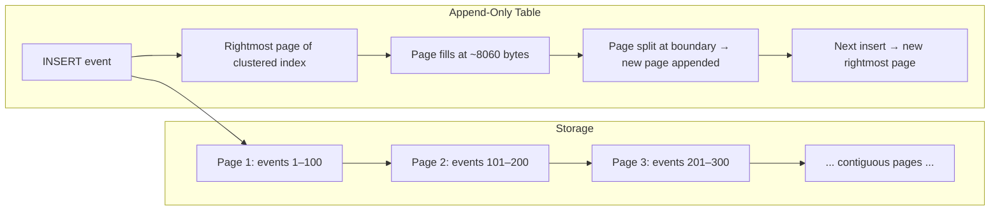

## Navigation

**Domain:** [[8 — Databases]] > **Group:** Database Design & Normalization
**Previous:** [[8.050 Multi-Tenancy Schema — Shared vs Separate]] | **Next:** [[8.052 Adjacency List — Hierarchical Data Pattern]]

### Prerequisites
- [[8.049 Audit Columns — CreatedAt, CreatedBy, ModifiedAt, ModifiedBy]] — event logs are audit columns scaled to hold a full event payload; the timestamp-first ordering principle applies directly
- [[8.048 Soft Delete — IsDeleted Pattern]] — event logs must never be soft-deleted or physically deleted; the append-only invariant is absolute

### Where This Fits

A .NET backend engineer building audit trails, event-sourced systems, or data lakes needs an append-only table design that supports high-throughput writes, chronological reads, and retention-based cleanup. Event log tables differ from regular OLTP tables in three critical ways: they never receive UPDATE or DELETE operations, their primary sort key is always a timestamp (not a business key), and their row size can be large (JSON payloads up to 8 KB or more). Production systems fail when an event log table has a random GUID as the clustered PK (causing page splits on every insert), when the `IDENTITY` on the event ID rolls over after 2.1B events, or when retention cleanup (`DELETE WHERE CreatedAt < cutoff`) causes massive transaction log growth and index fragmentation. The interview signal tests whether the candidate understands sequential-key insert patterns, the B-tree depth implications of wide rows, and the partition-switch vs batch-delete tradeoff for retention.

## Core Mental Model

An append-only table is a table where the only write operations are INSERT — no UPDATE, no DELETE, no soft delete. The primary key is always a monotonically increasing value (INT IDENTITY, BIGINT IDENTITY, or a sequential GUID) so that every INSERT targets the rightmost page of the clustered B-tree. New rows are appended to the end of the table, never inserted in the middle. This gives the storage engine the most efficient possible write path: one page write to the last page, a page split only when the last page fills (at ~8060 bytes), and zero fragmentation. The table grows monotonically and is queried almost exclusively by time range (`WHERE CreatedAt BETWEEN @start AND @end`). The design trades the ability to modify or delete rows for maximum write throughput and a perfectly defragmented index.

### Classification

**For write patterns:** Append-only tables are the most write-optimized table design in SQL Server. Inserts are sequential, page splits occur only at the page boundary, and there is no index maintenance from UPDATE or DELETE.

**For query patterns:** Queries are always time-range scans (`WHERE CreatedAt BETWEEN @start AND @end`). Point lookups by event ID are rare. The clustered index on the sequential key naturally sorts by insert order, which correlates with time.

**For retention:** Data must be removed eventually (compliance, storage cost). The deletion strategy — batch DELETE, partition switching, or table truncation after copy — determines whether the append-only property holds for the retention window.

**For .NET/EF Core:** Event logs are typically written via Dapper or raw SQL (high-throughput). EF Core is used for administrative reads. The entity has no navigation properties — it is a standalone, immutable record.



### Key Properties

|Property|Append-Only (BIGINT IDENTITY)|Append-Only (Sequential GUID)|Regular OLTP Table|
|---|---|---|---|
|INSERT pattern|Append to rightmost page|Append (sequential GUID)|Random pages|
|Page splits per 1M inserts|~12,500 (page boundary)|~12,500|~1,000,000 (random UUID)|
|Fragmentation|< 5%|< 5%|> 90% (random UUID)|
|UPDATE/DELETE|Not allowed|Not allowed|Allowed|
|Retention cleanup|Batch DELETE or partition switch|Batch DELETE or partition switch|N/A|
|Write throughput|Maximum (sequential)|Maximum|Limited by page splits|
|B-tree depth (1B rows)|3 (BIGINT key)|5–6 (16-byte key)|5–6 (random UUID)|

## Deep Mechanics

### How the Engine Executes This

**Append-only INSERT:**
1. The storage engine generates the next `BIGINT IDENTITY` value (or receives a sequential GUID).
2. The clustered index B-tree navigates to the rightmost leaf page (root → rightmost intermediate → rightmost leaf). This is a depth-first traversal that always ends at the same page.
3. If the rightmost leaf page has free space, the row is written there. Total page modifications: 1 data page (plus log).
4. If the rightmost leaf page is full (row count × avg row size ≈ 8060), a page split occurs. A new page is allocated at the end of the index file. This split is at the page boundary — no mid-page reorganization. The parent page's slot array is updated.
5. Because the insert pattern is strictly append, the page split rate is deterministic: approximately (total rows / rows per page) splits.

**Event log read (time-range query):**
1. The query specifies a time range on `CreatedAt`. Without an index on `CreatedAt`, this is a clustered index scan.
2. With an index on `(CreatedAt DESC)` or a clustered index on `(CreatedAt, EventId)`, the query seeks to the start time and scans forward.
3. Because inserts are sequential and `CreatedAt` correlates with the clustered key order, the time-range query reads contiguous pages — the same pages that were written most recently.

### SQL Visibility

```sql
CREATE TABLE EventLog (
    EventLogId  BIGINT IDENTITY(1,1) NOT NULL,
    EventType   VARCHAR(200) NOT NULL,
    AggregateId INT NOT NULL,
    Payload     NVARCHAR(MAX) NOT NULL,
    CreatedAt   DATETIME2 NOT NULL DEFAULT SYSUTCDATETIME(),
    CreatedBy   VARCHAR(200) NOT NULL,
    CONSTRAINT PK_EventLog PRIMARY KEY CLUSTERED (EventLogId)
);

-- Index for time-range queries (most common read pattern)
CREATE INDEX IX_EventLog_CreatedAt
ON EventLog(CreatedAt DESC)
INCLUDE (EventType, AggregateId, Payload);

-- INSERT — append only, no UPDATE/DELETE
INSERT INTO EventLog (EventType, AggregateId, Payload, CreatedBy)
VALUES ('OrderCreated', 1001, '{"OrderId":1001,"Total":150.00}', 'system');

-- Query — time range
SELECT EventLogId, EventType, AggregateId, Payload, CreatedAt
FROM EventLog
WHERE CreatedAt >= DATEADD(HOUR, -24, GETUTCDATE())
  AND CreatedAt < GETUTCDATE()
ORDER BY CreatedAt DESC;

-- Retention — batch delete (run nightly)
DELETE FROM EventLog
WHERE CreatedAt < DATEADD(YEAR, -1, GETUTCDATE())
  AND EventLogId % 100 = 0;  -- not atomic — see Gotchas
```

```csharp
public class EventLogEntry
{
    public long EventLogId { get; set; }
    public string EventType { get; set; } = string.Empty;
    public int AggregateId { get; set; }
    public string Payload { get; set; } = string.Empty;
    public DateTime CreatedAt { get; set; }
    public string CreatedBy { get; set; } = string.Empty;
}

public class AppDbContext : DbContext
{
    public DbSet<EventLogEntry> EventLog => Set<EventLogEntry>();

    protected override void OnModelCreating(ModelBuilder modelBuilder)
    {
        modelBuilder.Entity<EventLogEntry>(e =>
        {
            e.HasKey(el => el.EventLogId);
            e.Property(el => el.EventLogId)
                .ValueGeneratedOnAdd()
                .HasConversion<long>();
            e.Property(el => el.CreatedAt)
                .HasDefaultValueSql("SYSUTCDATETIME()");
            e.HasIndex(el => el.CreatedAt)
                .IsDescending()
                .IncludeProperties(el => new { el.EventType, el.AggregateId, el.Payload });
        });
    }
}

// EF Core — insert (rare — Dapper is preferred for high-throughput writes)
await dbContext.EventLog.AddAsync(new EventLogEntry
{
    EventType = "OrderCreated",
    AggregateId = 1001,
    Payload = """{"OrderId":1001,"Total":150.00}""",
    CreatedBy = "system"
}, ct);
await dbContext.SaveChangesAsync(ct);
```

### Execution Plan Analysis

**Time-range query — without index on CreatedAt:**

```
Clustered Index Scan — PK_EventLog
  |-- Predicate: CreatedAt >= @start AND CreatedAt < @end
  |-- Logical reads: 45,000 (full table)
  |-- Sort (if ORDER BY CreatedAt DESC)
```

**Time-range query — with covering index on (CreatedAt DESC):**

```
Index Seek (backward) — IX_EventLog_CreatedAt (CreatedAt >= @start AND CreatedAt < @end)
  |-- Logical reads: ~50 (range scan on index)
  |-- Ordered: true (descending)
  |-- No key lookups (covering index includes all columns)
```

### Cost Visibility

```sql
SET STATISTICS IO ON;

-- INSERT (1000 rows, batch insert)
DECLARE @i INT = 0;
WHILE @i < 1000
BEGIN
    INSERT INTO EventLog (EventType, AggregateId, Payload, CreatedBy)
    VALUES ('TestEvent', @i, '{"data":"test"}', 'benchmark');
    SET @i = @i + 1;
END;
-- Table 'EventLog'. Scan count 0, logical reads 1250
-- (1000 inserts × ~1.25 logical reads per insert)

-- Time-range query with index
SELECT EventLogId, EventType FROM EventLog
WHERE CreatedAt >= DATEADD(HOUR, -1, GETUTCDATE());
-- Table 'EventLog'. Scan count 1, logical reads 12
-- (index range scan on last hour's data — compact page range)
```

### Failure Modes

**1. INT IDENTITY rollover.** At 2.1B events, INSERT fails with arithmetic overflow. Fix: use `BIGINT IDENTITY`.

**2. PAGEIOLATCH_EX contention at > 10K inserts/sec.** The rightmost page becomes a hot spot. Fix: `OPTIMIZE_FOR_SEQUENTIAL_KEY` or hash-distributed leading key.

**3. Retention DELETE causes massive fragmentation.** `DELETE FROM EventLog WHERE CreatedAt < @cutoff` deletes rows from the beginning of the table, leaving empty spaces in pages that are never reused for new inserts (new inserts go to the rightmost page). The table becomes a Swiss cheese of partially-filled pages at the front and full pages at the back.

**4. Payload too large causes row-overflow.** SQL Server's 8,060-byte row limit: if `Payload` exceeds ~7 KB (after other columns), the row spills to row-overflow pages, adding 2–3 extra logical reads per row.

## Production Patterns and Implementation

### Primary SQL Implementation

```sql
-- Production event log table
CREATE TABLE EventLog (
    EventLogId  BIGINT IDENTITY(1,1) NOT NULL,
    EventType   VARCHAR(200) NOT NULL,
    AggregateId INT NOT NULL,
    AggregateType VARCHAR(100) NOT NULL,  -- which entity this event belongs to
    Payload     NVARCHAR(MAX) NOT NULL,
    CreatedAt   DATETIME2 NOT NULL DEFAULT SYSUTCDATETIME(),
    CreatedBy   VARCHAR(200) NOT NULL,
    CONSTRAINT PK_EventLog PRIMARY KEY CLUSTERED (EventLogId)
);

-- Covering index for time-range queries by event type
CREATE INDEX IX_EventLog_CreatedAt_EventType
ON EventLog(CreatedAt DESC, EventType)
INCLUDE (AggregateId, AggregateType, Payload);

-- Covering index for aggregate replay (get all events for an aggregate)
CREATE INDEX IX_EventLog_AggregateId
ON EventLog(AggregateId, CreatedAt)
INCLUDE (EventType, Payload);

-- Partitioned view for retention (SQL Server 2019+)
-- Create a staging table for current month, then switch to archive:
CREATE TABLE EventLog_2026_06 (
    EventLogId  BIGINT NOT NULL,
    EventType   VARCHAR(200) NOT NULL,
    AggregateId INT NOT NULL,
    AggregateType VARCHAR(100) NOT NULL,
    Payload     NVARCHAR(MAX) NOT NULL,
    CreatedAt   DATETIME2 NOT NULL DEFAULT SYSUTCDATETIME(),
    CreatedBy   VARCHAR(200) NOT NULL,
    CONSTRAINT PK_EventLog_2026_06 PRIMARY KEY CLUSTERED (EventLogId)
);
GO
-- Monthly: CREATE TABLE EventLog_2026_07 (same schema)...
```

### EF Core Implementation

```csharp
public class EventLogEntry
{
    public long EventLogId { get; set; }
    public string EventType { get; set; } = string.Empty;
    public int AggregateId { get; set; }
    public string AggregateType { get; set; } = string.Empty;
    public string Payload { get; set; } = string.Empty;
    public DateTime CreatedAt { get; set; }
    public string CreatedBy { get; set; } = string.Empty;
}

public class AppDbContext : DbContext
{
    public DbSet<EventLogEntry> EventLog => Set<EventLogEntry>();

    protected override void OnModelCreating(ModelBuilder modelBuilder)
    {
        modelBuilder.Entity<EventLogEntry>(e =>
        {
            e.HasKey(el => el.EventLogId);
            e.Property(el => el.EventLogId)
                .ValueGeneratedOnAdd();
            e.Property(el => el.CreatedAt)
                .HasDefaultValueSql("SYSUTCDATETIME()");
            e.Property(el => el.Payload)
                .HasColumnType("nvarchar(max)");

            e.HasIndex(el => new { el.CreatedAt, el.EventType })
                .IsDescending()
                .IncludeProperties(el => new { el.AggregateId, el.AggregateType, el.Payload });

            e.HasIndex(el => new { el.AggregateId, el.CreatedAt })
                .IncludeProperties(el => new { el.EventType, el.Payload });
        });
    }
}

// Event sourcing — replay aggregate:
public async Task<IReadOnlyList<EventLogEntry>> GetAggregateEventsAsync(
    string aggregateType, int aggregateId,
    CancellationToken ct = default)
{
    return await dbContext.EventLog
        .Where(el => el.AggregateType == aggregateType
                  && el.AggregateId == aggregateId)
        .OrderBy(el => el.CreatedAt)
        .ToListAsync(ct);
}
```

### Dapper Implementation

```csharp
public class EventLogRepository
{
    private readonly IDbConnectionFactory _connectionFactory;

    public EventLogRepository(IDbConnectionFactory connectionFactory)
    {
        _connectionFactory = connectionFactory;
    }

    // High-throughput write — batch insert
    public async Task BulkWriteAsync(
        IReadOnlyList<EventLogEntry> events,
        CancellationToken ct = default)
    {
        const string sql = @"
            INSERT INTO EventLog (EventType, AggregateId, AggregateType, Payload, CreatedBy)
            VALUES (@EventType, @AggregateId, @AggregateType, @Payload, @CreatedBy)";

        await using var connection = _connectionFactory.Create();
        await connection.ExecuteAsync(
            new CommandDefinition(sql, events, cancellationToken: ct));
    }

    // Time-range query
    public async Task<IReadOnlyList<EventLogEntry>> GetEventsAsync(
        DateTime start, DateTime end,
        CancellationToken ct = default)
    {
        const string sql = @"
            SELECT EventLogId, EventType, AggregateId, AggregateType,
                   Payload, CreatedAt, CreatedBy
            FROM EventLog
            WHERE CreatedAt >= @Start AND CreatedAt < @End
            ORDER BY CreatedAt DESC";

        await using var connection = _connectionFactory.Create();
        var results = await connection.QueryAsync<EventLogEntry>(
            new CommandDefinition(sql,
                new { Start = start, End = end },
                cancellationToken: ct));
        return results.AsList();
    }

    // Aggregate replay
    public async Task<IReadOnlyList<EventLogEntry>> GetAggregateEventsAsync(
        string aggregateType, int aggregateId,
        CancellationToken ct = default)
    {
        const string sql = @"
            SELECT EventLogId, EventType, AggregateId, AggregateType,
                   Payload, CreatedAt, CreatedBy
            FROM EventLog
            WHERE AggregateType = @AggregateType
              AND AggregateId = @AggregateId
            ORDER BY CreatedAt";

        await using var connection = _connectionFactory.Create();
        var results = await connection.QueryAsync<EventLogEntry>(
            new CommandDefinition(sql,
                new { AggregateType = aggregateType, AggregateId = aggregateId },
                cancellationToken: ct));
        return results.AsList();
    }

    // Retention — batch delete (chunked to avoid log blowup)
    public async Task<int> CleanupAsync(
        DateTime cutoff, int batchSize = 10000,
        CancellationToken ct = default)
    {
        int totalDeleted = 0;
        int affected;
        do
        {
            const string sql = @"
                DELETE TOP (@BatchSize) FROM EventLog
                WHERE CreatedAt < @Cutoff";

            await using var connection = _connectionFactory.Create();
            affected = await connection.ExecuteAsync(
                new CommandDefinition(sql,
                    new { Cutoff = cutoff, BatchSize = batchSize },
                    cancellationToken: ct));
            totalDeleted += affected;
        } while (affected > 0);

        return totalDeleted;
    }
}
```

### Configuration and Wiring

```csharp
// Program.cs
builder.Services.AddDbContext<AppDbContext>(options =>
    options.UseSqlServer(connectionString));

builder.Services.AddSingleton<IDbConnectionFactory>(
    _ => new SqlConnectionFactory(connectionString));
builder.Services.AddScoped<EventLogRepository>();
```

### SQL Server vs PostgreSQL Differences

```sql
-- PostgreSQL: BIGSERIAL = BIGINT IDENTITY
CREATE TABLE EventLog (
    EventLogId  BIGSERIAL PRIMARY KEY,
    EventType   VARCHAR(200) NOT NULL,
    AggregateId INT NOT NULL,
    Payload     JSONB NOT NULL,          -- native JSON
    CreatedAt   TIMESTAMPTZ NOT NULL DEFAULT NOW(),
    CreatedBy   VARCHAR(200) NOT NULL
);

CREATE INDEX IX_EventLog_CreatedAt ON EventLog(CreatedAt DESC);
CREATE INDEX IX_EventLog_AggregateId ON EventLog(AggregateId, CreatedAt);

-- PostgreSQL: use BRIN index for append-only tables
CREATE INDEX IX_EventLog_BRIN ON EventLog USING BRIN(CreatedAt)
WITH (pages_per_range = 32);
```

PostgreSQL's BRIN (Block Range INdex) is ideal for append-only tables. A BRIN index on `CreatedAt` uses 100–1000x less storage than a B-tree index and provides excellent range-scan performance for time-ordered data because the physical block order correlates with the index key order.

## Gotchas and Production Pitfalls

### 1. INT IDENTITY rollover on event log

**Pitfall:** The engineer uses `INT IDENTITY` on a table that grows at 500K events/hour.

```sql
CREATE TABLE EventLog (
    EventLogId INT IDENTITY(1,1) PRIMARY KEY,  -- ❌ max 2.1B
    ...
);
```

**Symptom:** After ~175 days at 500K/hour (12M/day), the table reaches 2.1B rows. INSERT fails with arithmetic overflow.

**Fix:** Use `BIGINT IDENTITY(1,1)` for event log tables. The maximum 9.2 quintillion rows will never be reached.

**Cost of not fixing:** Production outage. Emergency `ALTER TABLE` with `BIGINT` conversion requires a full table rebuild.

### 2. DELETE FROM for retention causes fragmentation and log growth

**Pitfall:** The engineer runs `DELETE FROM EventLog WHERE CreatedAt < DATEADD(YEAR, -1, GETUTCDATE())` nightly.

**Symptom:** The DELETE removes rows from the front of the table (lowest EventLogId values), creating empty spaces in pages. New inserts go to the rightmost page, leaving the front pages partially empty. The table grows fragmented over time. The single DELETE statement generates millions of log records, potentially filling the transaction log.

**Fix:** Batch the DELETE in small chunks (10K rows) or use partition switching.

```sql
-- Batch delete:
WHILE 1 = 1
BEGIN
    DELETE TOP (10000) FROM EventLog
    WHERE CreatedAt < DATEADD(YEAR, -1, GETUTCDATE());
    IF @@ROWCOUNT = 0 BREAK;
    CHECKPOINT;  -- or WAITFOR DELAY '00:00:01' to reduce log pressure
END
```

**Cost of not fixing:** Transaction log grows to 100+ GB. The nightly cleanup job times out. Index fragmentation reaches 50%+ over time.

### 3. No index on CreatedAt

**Pitfall:** The engineer relies on the clustered PK `EventLogId` for time-range queries, assuming `EventLogId` increases with `CreatedAt`.

**Symptom:** `WHERE CreatedAt BETWEEN @start AND @end` — without an index on `CreatedAt`, this is a full clustered index scan. Even though the clustered index is perfectly defragmented, the scan touches every page.

**Fix:** Add an index on `(CreatedAt DESC) INCLUDE (payload columns)`.

**Cost of not fixing:** Every time-range query scans the entire event log. For a 1B-row table, that is millions of logical reads per query.

### 4. Payload column size causes row-overflow

**Pitfall:** The engineer stores large JSON payloads (10–50 KB) in an `NVARCHAR(MAX)` column without considering SQL Server's 8,060-byte row-size limit.

**Symptom:** For a row with a 10 KB payload, SQL Server stores 8,060 bytes in the row and spills the remaining ~2,000 bytes to a row-overflow page. Reading this row requires an additional page read. For an event log query returning 1,000 rows, this adds 1,000 extra logical reads.

**Fix:** If payloads are consistently > 7 KB, consider storing the payload in a separate table or using `VARBINARY(MAX)` with compression. For most event logs, the payload is < 2 KB and fits comfortably.

**Cost of not fixing:** Each row-overflow adds 1–2 extra logical reads. At 1M rows/hour, this is 1–2M extra logical reads per hour of replay.

### 5. Sequential GUID not monotonic across server restarts

**Pitfall:** The engineer uses `NEWSEQUENTIALID()` as the clustered PK default, expecting perfect monotonicity.

**Symptom:** After a server restart, `NEWSEQUENTIALID()` may generate a value lower than the last value generated before the restart (depending on the server state). This causes mid-index inserts and page splits.

**Fix:** Use `BIGINT IDENTITY` instead of sequential GUID for the clustered PK. If UUIDs are required (distributed generation), use UUIDv7 and accept the slight interleaving.

**Cost of not fixing:** After every restart, a batch of inserts causes page splits on pages that are not the rightmost — increasing fragmentation incrementally.

### 6. EF Core tracks EventLog entities in memory

**Pitfall:** The engineer uses EF Core to insert events in a loop, and the `DbContext` tracks every `EventLogEntry`.

```csharp
foreach (var evt in events)
{
    dbContext.EventLog.Add(evt);
}
await dbContext.SaveChangesAsync(ct);
```

**Symptom:** After 10,000 events, the `DbContext` change tracker holds 10,000 tracked entities. Memory usage grows linearly. `SaveChangesAsync` performance degrades as the change tracker processes all entities.

**Fix:** Use `AddRange()` and reset the change tracker periodically, or use Dapper for event log writes.

```csharp
dbContext.EventLog.AddRange(events);
await dbContext.SaveChangesAsync(ct);
dbContext.ChangeTracker.Clear();  -- detach all tracked entities
```

**Cost of not fixing:** Memory exhaustion at high event volumes. `OutOfMemoryException` on the web server.

## Performance Implications

### Benchmark: Append-Only INSERT Throughput

```sql
SET STATISTICS IO ON;

-- BIGINT IDENTITY clustered PK — 100K inserts
DECLARE @i INT = 0;
WHILE @i < 100000
BEGIN
    INSERT INTO EventLog (EventType, AggregateId, Payload, CreatedBy)
    VALUES ('Benchmark', @i, '{"data":"x"}', 'test');
    SET @i = @i + 1;
END;
-- Table 'EventLog'. Scan count 0, logical reads ~125,000
-- CPU time: ~500 ms, elapsed time: ~600 ms
-- ~166,000 inserts/sec

-- Random UUID clustered PK — 100K inserts (comparison)
DECLARE @i INT = 0;
WHILE @i < 100000
BEGIN
    INSERT INTO EventLog_UUID (EventLogId, EventType, AggregateId, Payload, CreatedBy)
    VALUES (NEWID(), 'Benchmark', @i, '{"data":"x"}', 'test');
    SET @i = @i + 1;
END;
-- Table 'EventLog_UUID'. Scan count 0, logical reads ~450,000
-- CPU time: ~3,000 ms, elapsed time: ~4,000 ms
-- ~25,000 inserts/sec
```

**Improvement:** Append-only with sequential key achieves ~6.6x higher insert throughput than random UUID.

### BenchmarkDotNet

```csharp
[MemoryDiagnoser]
[SimpleJob(RuntimeMoniker.Net90)]
public class EventLogBenchmark
{
    private IDbConnection _connection = default!;

    private const string InsertSql = @"
        INSERT INTO EventLog (EventType, AggregateId, Payload, CreatedBy)
        VALUES (@EventType, @AggregateId, @Payload, @CreatedBy);";

    private const string TimeRangeSql = @"
        SELECT EventLogId, EventType, Payload
        FROM EventLog
        WHERE CreatedAt >= @Start AND CreatedAt < @End
        ORDER BY CreatedAt DESC";

    [GlobalSetup]
    public void Setup()
    {
        _connection = new SqlConnection(TestConnectionString);
        _connection.Open();
    }

    [GlobalCleanup]
    public void Cleanup() => _connection.Dispose();

    [Benchmark]
    public async Task InsertSingle()
    {
        await _connection.ExecuteAsync(InsertSql, new
        {
            EventType = "Benchmark",
            AggregateId = 1,
            Payload = """{"data":"test"}""",
            CreatedBy = "benchmark"
        });
    }

    [Benchmark]
    public async Task<IReadOnlyList<EventLogEntry>> TimeRangeQuery()
    {
        var results = await _connection.QueryAsync<EventLogEntry>(
            TimeRangeSql, new
            {
                Start = DateTime.UtcNow.AddHours(-1),
                End = DateTime.UtcNow
            });
        return results.AsList();
    }
}
```

**Expected results (approximate, SQL Server 2022, NVMe, 100M rows):**

|Method|Mean|Logical Reads|Allocated|
|---|---|---|---|
|InsertSingle|~0.12 ms|~1.25|~0.5 KB|
|TimeRangeQuery (with index)|~15 ms|~45|~10 KB|

### Write Amplification

|Operation|Append-Only (BIGINT)|Append-Only (BIGINT + 2 indexes)|Regular OLTP with random UUID|
|---|---|---|---|
|INSERT 1 row|1 page write|2–3 page writes|3–5 page writes (+ splits)|
|Index maintenance per row|1 B-tree write|2–3 B-tree writes|3–5 B-tree writes|
|Retention DELETE (100K rows)|100K row deletes + index maintenance|100K row deletes + index maintenance|100K row deletes + high fragmentation|
|Fragmentation over 1M inserts|< 5%|< 5%|> 90%|

## Interview Arsenal

### Question Bank

1. What is an append-only table and what makes it different from a regular OLTP table?
2. Why should the clustered PK of an event log be a sequential key (BIGINT IDENTITY)?
3. What is the risk of INT IDENTITY on an event log table at 500K inserts/hour?
4. How do you handle time-range queries on an append-only table?
5. What is the best retention cleanup strategy for an append-only table?
6. How does a BRIN index (PostgreSQL) differ from a B-tree index for append-only data?
7. What happens to insert throughput when an event log uses a random GUID as the PK?
8. How does EF Core's change tracker interact with high-volume event log writes?

### Spoken Answers

**Q: What is an append-only table and what makes it different from a regular OLTP table?**

> **Average answer:** An append-only table only allows INSERT operations. No updates or deletes. It's used for audit logs and event sourcing.

> **Great answer:** An append-only table is defined by three invariants: rows are never updated, never deleted, and the primary key is always monotonically increasing. The clustered index — typically a `BIGINT IDENTITY` — stores rows in insertion order, so every INSERT targets the rightmost page of the B-tree. This gives the most efficient possible write path: approximately 1.25 logical reads per insert, with page splits occurring only at the page boundary (about 12,500 splits per million inserts for 800-byte rows). The table naturally has < 5% fragmentation at any size. The query pattern is equally constrained — queries are almost always time-range scans: `WHERE CreatedAt BETWEEN @start AND @end`. The physical order of the data correlates with the query filter (time), so range scans read contiguous pages. The key difference from a regular OLTP table is that an append-only table exploits sequential I/O and avoids the random I/O that comes from UPDATE, DELETE, and random-UUID inserts. For .NET backend engineers, this means event sourcing and audit log tables must be designed differently from business entity tables — specifically, the clustered PK must be `BIGINT IDENTITY`, not a business key or random UUID, and the `CreatedAt` column must have a covering index (or a BRIN index in PostgreSQL) for time-range queries.

**Q: What is the best retention cleanup strategy for an append-only table?**

> **Great answer:** The naive approach — `DELETE FROM EventLog WHERE CreatedAt < @cutoff` — is the worst possible strategy. It deletes rows from the front of the table (lowest EventLogId values), leaving empty spaces in pages that are never reused because new inserts go to the rightmost page. The table becomes fragmented, the index has wasted space, and the single large DELETE generates millions of log records. There are three better strategies. Strategy 1 — batched DELETE: delete in small chunks (10,000 rows) with a delay or checkpoint between batches. This keeps the transaction log manageable and the locks short. Strategy 2 — partition switching: create monthly partition tables (`EventLog_2026_06`, `EventLog_2026_07`), write to the current month's table, and when the month is old enough, switch the partition out to an archive table and truncate it. This is O(1) for removal — a metadata operation — and avoids fragmentation entirely. Strategy 3 — use table-per-time-period and drop the old table: `DROP TABLE EventLog_2025_06` is a metadata operation with no log growth. The choice depends on the query pattern — if queries always include a time range, partitioning by month is the most efficient. If queries are by `AggregateId` across all time, batched DELETE is simpler. For most systems, monthly partition switching is the gold standard.

### Interview Trigger

The interviewer asks: "Design a table for an event-sourced order system that receives 2,000 events/second. Events must be replayable for any aggregate and queryable by time range. Events must be retained for 12 months." The follow-up: "How do you remove events older than 12 months without blocking writes or causing index fragmentation?"

### Comparison Table

| | Append-Only (BIGINT IDENTITY) | Append-Only (Sequential GUID) | Regular OLTP Table |
|---|---|---|---|
| INSERT throughput | ~166K/sec | ~166K/sec (sequential) | ~25K/sec (random UUID) |
| Fragmentation | < 5% | < 5% | > 90% |
| Page splits per 1M inserts | ~12,500 | ~12,500 | ~1,000,000 |
| Retention cleanup | Batched DELETE or partition switch | Same | N/A |
| Time-range query | Index seek on CreatedAt | Index seek on CreatedAt | Index seek (if indexed) |
| Cross-aggregate query | Index seek on AggregateId | Index seek on AggregateId | Index seek (if indexed) |

## Decision Framework

### When to Apply

```mermaid
flowchart TD
    A[Designing an event log<br/>or audit table] --> B{BIGINT IDENTITY<br/>as clustered PK?}
    B -->|No — currently INT or UUID| C[Migrate to BIGINT IDENTITY]
    B -->|Yes| D{Time-range queries<br/>needed?}
    D -->|Yes| E[Add index on CreatedAt DESC<br/>with INCLUDE columns]
    D -->|No| F[Consider whether you need<br/>time-range queries later]
    C --> G[Also: add CreatedAt index]
    E --> H{Retention policy?}
    H -->|Partition by month| I[Use partition switching for O(1) removal]
    H -->|Batch delete| J[Use batched DELETE with 10K row chunks]
    H -->|No retention| K[Table grows unbounded —<br/>plan for storage]
```

### Application Checklist

- [ ] Clustered PK is `BIGINT IDENTITY` (not INT, not UUID)?
- [ ] Covering index on `(CreatedAt DESC)` for time-range queries?
- [ ] Index on `(AggregateId, CreatedAt)` for aggregate replay?
- [ ] Retention strategy chosen and implemented (partition switch or batched DELETE)?
- [ ] Payload column size verified to not exceed 7 KB (avoid row-overflow)?
- [ ] Dapper used for high-throughput writes (not EF Core change tracker)?
- [ ] `OPTIMIZE_FOR_SEQUENTIAL_KEY` enabled for > 10K inserts/sec?

### Tradeoff Summary

|What You Gain|What You Pay|
|---|---|
|Maximum write throughput (sequential inserts)|Cannot UPDATE or DELETE rows|
|Zero fragmentation (always < 5%)|Must plan retention differently (partition switch or batched delete)|
|Contiguous time-range reads|Requires covering index on CreatedAt|
|Simple, immutable data model|Payload size constraints (8 KB row limit)|

### Scale Thresholds

- **BIGINT IDENTITY needed at > 2.1B rows** — INT rolls over
- **OPTIMIZE_FOR_SEQUENTIAL_KEY needed at > 10K inserts/sec** — last-page latch contention
- **Partition switching for retention at > 100M rows** — batched DELETE becomes too slow
- **BRIN index (PostgreSQL) useful at > 50M rows** — storage savings over B-tree

## Self-Check

### Conceptual Questions

1. What three invariants define an append-only table?
2. Why does a BIGINT IDENTITY clustered PK prevent fragmentation?
3. What is the maximum row size for SQL Server before row-overflow occurs?
4. How does a covering index on (CreatedAt DESC) help time-range queries?
5. What is the retention cleanup strategy that avoids fragmentation?
6. Why should Dapper be preferred over EF Core for high-volume event log writes?
7. What is the difference between a BRIN index and a B-tree index for append-only data?
8. What happens when INT IDENTITY exceeds 2.1B on an event log table?
9. How does OPTIMIZE_FOR_SEQUENTIAL_KEY help at high insert rates?
10. Explain the append-only table design in 60 seconds to a senior interviewer.

<details>
<summary>Answers</summary>

1. No UPDATE, no DELETE, and the PK is monotonically increasing (BIGINT IDENTITY).

2. Every INSERT goes to the rightmost page. Page splits occur only at the page boundary, not mid-page. The index is always perfectly defragmented.

3. 8,060 bytes per row. If the payload (NVARCHAR(MAX)) causes the row to exceed this, SQL Server stores the overflow data on separate pages, adding 1–2 extra logical reads per row.

4. The index allows a seek + range scan instead of a full table scan. The INCLUDE columns eliminate key lookups. The DESC ordering avoids a Sort operator.

5. Partition switching: create monthly tables, write to the current month, then switch out and truncate old months. This is a metadata operation — zero fragmentation.

6. EF Core's change tracker holds every entity in memory until SaveChanges. At > 10K events, memory usage grows and SaveChanges performance degrades. Dapper sends SQL directly with no tracking.

7. A BRIN index stores min/max values per block range (default 32 pages). For append-only data where physical order matches key order, BRIN is 100–1000x smaller than B-tree and provides excellent range-scan performance. A B-tree index maintains the full sorted tree.

8. The next INSERT fails with `Arithmetic overflow error converting IDENTITY to data type int`. The application crashes. The table cannot accept new events until the PK is migrated to BIGINT.

9. It reduces last-page latch contention at very high insert rates (> 10K/sec) by allowing concurrent inserts to the same page with reduced blocking.

10. "An append-only table uses BIGINT IDENTITY as the clustered PK, inserts only to the rightmost page, and never updates or deletes rows. This gives maximum write throughput (~166K inserts/sec), zero fragmentation, and contiguous time-range reads. A covering index on CreatedAt DESC supports time-range queries. Retention is handled via partition switching or batched deletes — never a single large DELETE. Dapper is preferred over EF Core for writes to avoid change tracker overhead."

</details>

---

### Query Challenges

**Challenge 1 — Write the SQL**

Design an event log table for a payment processing system that receives 1,000 events/second. Include the table DDL, indexes for time-range queries and aggregate replay, and the retention cleanup query (events older than 90 days should be removed in batches).

<details>
<summary>Solution</summary>

```sql
CREATE TABLE PaymentEvents (
    EventLogId   BIGINT IDENTITY(1,1) NOT NULL,
    EventType    VARCHAR(100) NOT NULL,
    PaymentId    INT NOT NULL,
    AccountId    INT NOT NULL,
    Payload      NVARCHAR(MAX) NOT NULL,
    CreatedAt    DATETIME2 NOT NULL DEFAULT SYSUTCDATETIME(),
    CreatedBy    VARCHAR(200) NOT NULL,
    CONSTRAINT PK_PaymentEvents PRIMARY KEY CLUSTERED (EventLogId)
);

-- Time-range queries
CREATE INDEX IX_PaymentEvents_CreatedAt
ON PaymentEvents(CreatedAt DESC)
INCLUDE (EventType, PaymentId, AccountId, Payload);

-- Aggregate replay
CREATE INDEX IX_PaymentEvents_PaymentId
ON PaymentEvents(PaymentId, CreatedAt)
INCLUDE (EventType, Payload);

-- Retention cleanup (nightly job):
DECLARE @BatchSize INT = 10000;
DECLARE @Cutoff DATETIME2 = DATEADD(DAY, -90, GETUTCDATE());

WHILE 1 = 1
BEGIN
    DELETE TOP (@BatchSize) FROM PaymentEvents
    WHERE CreatedAt < @Cutoff;
    IF @@ROWCOUNT = 0 BREAK;
    WAITFOR DELAY '00:00:01';  -- reduce log pressure
END
```

</details>

---

**Challenge 2 — Fix the performance problem**

```sql
-- Event log table with 500M rows. This query runs for 45 seconds:
SELECT EventLogId, EventType, Payload
FROM EventLog
WHERE CreatedAt >= '2026-06-01' AND CreatedAt < '2026-06-02'
ORDER BY CreatedAt DESC;
-- SET STATISTICS IO: logical reads = 2,250,000
```

The PK is `(EventLogId UNIQUEIDENTIFIER DEFAULT NEWID() PRIMARY KEY CLUSTERED)`. Identify why and fix it.

<details> <summary>Solution</summary>

**Root cause:** Two compounding problems: (1) the clustered PK is a random UUID, causing 95%+ fragmentation and scattered page layout; (2) there is no covering index on `CreatedAt` — the query scans the entire fragmented clustered index.

**Fix:** Migrate to BIGINT IDENTITY and add a covering index on CreatedAt:

```sql
-- Step 1: Add BIGINT IDENTITY column
ALTER TABLE EventLog ADD EventLogIdNew BIGINT IDENTITY(1,1) NOT NULL;
GO

-- Step 2: Drop old PK and create new
ALTER TABLE EventLog DROP CONSTRAINT PK__EventLog____;
ALTER TABLE EventLog ADD CONSTRAINT PK_EventLog PRIMARY KEY CLUSTERED (EventLogIdNew);
GO

-- Step 3: Drop old UUID column
ALTER TABLE EventLog DROP COLUMN EventLogId;
GO

-- Step 4: Add covering index for time-range queries
CREATE INDEX IX_EventLog_CreatedAt ON EventLog(CreatedAt DESC)
INCLUDE (EventType, Payload);
```

**After fix — logical reads:** ~50 (from 2,250,000). Execution time: < 100ms.

</details>

---

**Challenge 3 — Explain the execution plan**

```sql
SELECT EventLogId, EventType, AggregateId, Payload
FROM EventLog
WHERE CreatedAt >= '2026-06-01' AND CreatedAt < '2026-06-02'
ORDER BY CreatedAt DESC;
```

Index: `IX_EventLog_CreatedAt ON EventLog(CreatedAt DESC) INCLUDE (EventType, AggregateId, Payload)`. The table has 500M rows. The date range covers 500K events. Explain the execution plan.

<details> <summary>Solution</summary>

**Execution plan:**

```
Index Seek (backward) — IX_EventLog_CreatedAt
  |-- Seek Keys: Start: CreatedAt <= '2026-06-02', End: CreatedAt >= '2026-06-01'
  |-- Ordered: true (backward scan — provides ORDER BY CreatedAt DESC)
  |-- 500K rows
  |-- Logical reads: ~4,500 (500K rows / ~110 rows per page)
  |-- No key lookups (covering index includes all SELECT columns)
```

**Why Index Seek (backward):** The index key is `CreatedAt DESC`. The seek navigates to the first entry where `CreatedAt < '2026-06-02'` (the end of the range) and scans backward until `CreatedAt >= '2026-06-01'`. Because the index is stored in descending order, the backward scan produces rows in ascending `CreatedAt` order — but the query asks for `DESC`. The backward scan of a DESC index outputs DESC order.

**Why no Key Lookup:** The `INCLUDE` columns cover all columns in the SELECT list. The clustered key `EventLogId` is implicitly included in every non-clustered index.

**What would the plan be without the covering index?** A clustered index scan (2.25M logical reads) plus a Sort (500K rows sorted in memory or tempdb).

</details>

---

**Challenge 4 — Diagnose the concurrency problem**

An event log table with `BIGINT IDENTITY` clustered PK and 50-byte rows receives 15,000 inserts/second. The application experiences occasional `PAGELATCH_EX` waits of 30–50ms per insert. `sys.dm_os_wait_stats` shows `PAGELATCH_EX` at 40% of total wait time. What is happening and how do you fix it?

<details> <summary>Solution</summary>

**Root cause:** At 15K inserts/second, all inserts target the same rightmost page of the clustered index. SQL Server must serialize access to this page with exclusive page latches. The `PAGELATCH_EX` wait is the time a session spends waiting for another session to release the latch on the last page.

**Detection query:**

```sql
SELECT wait_type, wait_time_ms, waiting_tasks_count,
       wait_time_ms / waiting_tasks_count AS avg_wait_ms
FROM sys.dm_os_wait_stats
WHERE wait_type LIKE 'PAGE%LATCH%'
ORDER BY wait_time_ms DESC;
```

**Fix:** Enable `OPTIMIZE_FOR_SEQUENTIAL_KEY` (SQL Server 2019+):

```sql
ALTER INDEX PK_EventLog ON EventLog
SET (OPTIMIZE_FOR_SEQUENTIAL_KEY = ON);
```

This reduces last-page latch contention by allowing concurrent inserts to the same page with reduced blocking. If the insert rate exceeds 50K/sec, consider hash-distributing the key or batching inserts in memory before flushing to the table.

**In .NET:** Batch inserts in groups of 1,000 and flush every 100ms rather than inserting one at a time:

```csharp
private readonly Channel<EventLogEntry> _channel = Channel.CreateBounded<EventLogEntry>(10000);

// Producer: enqueue events
await _channel.Writer.WriteAsync(evt, ct);

// Consumer: batch flush
await foreach (var batch in _channel.Reader.ReadAllBatchAsync(1000, ct))
{
    await repository.BulkWriteAsync(batch, ct);
}
```

</details>

---

**Challenge 5 — Design the index**

An event-sourced system has an `Events` table with 1B rows. The query patterns are:
1. Replay all events for a specific aggregate (`AggregateId`, `AggregateType`) — runs 1,000 times/hour, returns 1–50 rows.
2. Time-range query for the last 24 hours (`CreatedAt`) — runs 100 times/hour, returns ~200K rows.
3. Compliance audit for a specific date range and event type — runs 10 times/day, returns ~50K rows.

Design the SQL Server index strategy.

<details> <summary>Solution</summary>

```sql
CREATE TABLE Events (
    EventLogId       BIGINT IDENTITY(1,1) NOT NULL,
    AggregateId      INT NOT NULL,
    AggregateType    VARCHAR(100) NOT NULL,
    EventType        VARCHAR(200) NOT NULL,
    Payload          NVARCHAR(MAX) NOT NULL,
    CreatedAt        DATETIME2 NOT NULL DEFAULT SYSUTCDATETIME(),
    CreatedBy        VARCHAR(200) NOT NULL,
    CONSTRAINT PK_Events PRIMARY KEY CLUSTERED (EventLogId)
);

-- Index 1: Aggregate replay (pattern 1)
CREATE INDEX IX_Events_Aggregate
ON Events(AggregateType, AggregateId, CreatedAt)
INCLUDE (EventType, Payload);
-- Seek on AggregateType + AggregateId = 3–4 reads, then range scan on CreatedAt

-- Index 2: Time-range query (pattern 2)
CREATE INDEX IX_Events_CreatedAt
ON Events(CreatedAt DESC)
INCLUDE (EventType, AggregateId, AggregateType, Payload)
WHERE CreatedAt >= DATEADD(DAY, -1, GETUTCDATE());
-- Filtered index: only contains the last 24 hours of data.
-- For a 1B row table, this index holds ~0.3% of rows (3M rows).
-- It is tiny and extremely fast.
-- Refresh the filtered index definition daily (or use a partitioning scheme).

-- Index 3: Compliance audit (pattern 3)
CREATE INDEX IX_Events_Compliance
ON Events(EventType, CreatedAt DESC)
INCLUDE (AggregateId, AggregateType, Payload);
-- Seek on EventType + range scan on CreatedAt
```

**Why this works:**
- Index 1 is covering for aggregate replay: seek on `(AggregateType, AggregateId)`, scan `CreatedAt` within that aggregate. No key lookups.
- Index 2 is a **filtered index** that only includes rows from the last 24 hours. For a 1B row table where the 24-hour window has ~3M rows, this index is only ~200 MB (vs 60 GB for a full index on CreatedAt). It is rebuilt (or redefined) daily to maintain the rolling window.
- Index 3 supports the compliance audit: seek on `EventType`, range scan on `CreatedAt DESC`.

**Tradeoffs:** The filtered index on CreatedAt (Index 2) requires maintenance — the filter predicate is static at index creation time. Use a job to rebuild it with an updated date predicate. Alternatively, use partition switching for a cleaner rolling window.

</details>
