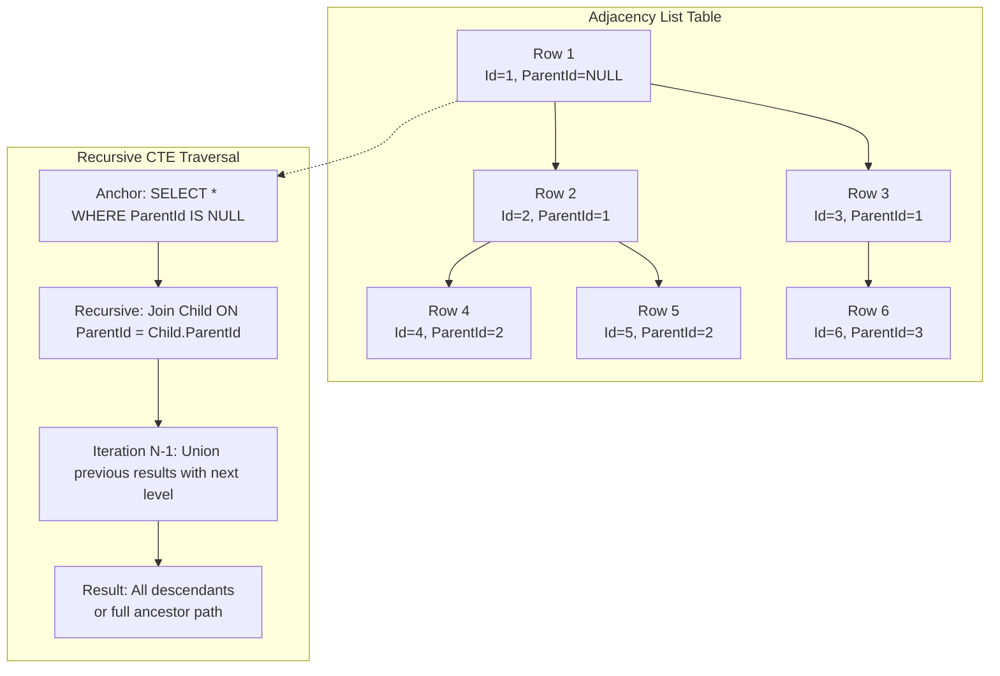

## Navigation

**Domain:** [[8 — Databases]] > **Group:** Database Design

**Previous:** [[8.051 — Event Log Table Design — Append-Only]] | **Next:** [[8.053 — Nested Sets — Hierarchical Data Pattern]]

### Prerequisites
- [[8.047 — Self-Referential Tables — Hierarchical Data]] — adjacency list is the simplest self-referential pattern; every row stores a reference to its parent row in the same table

### Where This Fits

The adjacency list is the most widely used hierarchical data pattern in relational databases because it maps naturally to a foreign key on the same table: each row has a `ParentId` column that references the row's own primary key. A .NET backend engineer encounters this in any domain with nested categories, organizational charts, folder trees, comment threads, or bill-of-materials structures. When this pattern is unknown, engineers either flatten hierarchies into application code or denormalize prematurely. When it is misapplied, engineers attempt to query entire subtrees with N queries instead of a single recursive CTE, causing exponential round-trips and logical read explosion. The interview signal is whether the candidate knows the four hierarchical patterns (adjacency list, nested sets, closure table, path enumeration) and can articulate the read/write tradeoffs on the spot.

---

## Core Mental Model

An adjacency list is a self-referential table where every row has a `ParentId` column that points to the primary key of the same table. A `NULL` ParentId marks a root node. The name comes from the graph concept of storing adjacent (connected) vertices: each row lists its parent as an adjacency edge. The database engine sees nothing special — this is just a foreign key. The hierarchy is implicit in the data, not explicit in the schema. Queries that need the entire path from leaf to root or all descendants of a node require recursive Common Table Expressions (CTEs) because SQL is set-based and cannot follow parent pointers natively.

### Classification

**For SQL topics:** the adjacency list is a structural schema pattern, not a specific operator. The critical SQL feature that makes it usable is the recursive CTE (`WITH ... AS (anchor UNION ALL recursive)`). The query optimizer cannot optimize recursive CTEs as well as non-recursive ones — recursion is bounded by the `MAXRECURSION` hint and the engine materializes intermediate results in TempDB spools. The `WHERE parent_id IS NULL` predicate for root nodes is SARGable if indexed. Joins through `ParentId` are SARGable on BOTH sides of a recursive CTE only if the index on `ParentId` exists.



### Key Properties

|Property|Value|Notes|
|---|---|---|
|Time Complexity (read subtree)|O(d * log N) per level via index seek|Each recursive level does one index seek on ParentId; d = depth, N = rows|
|Time Complexity (read path to root)|O(d * log N)|Same as subtree — one seek per ancestor level|
|Write Cost|Low|Single row INSERT — one row write, one index maintenance on ParentId|
|SARGable — root find|Yes|`WHERE ParentId IS NULL` uses index seek if indexed|
|SARGable — children find|Yes|`WHERE ParentId = @id` uses index seek on IX_ParentId|
|Recursive CTE|Not SARGable per se|Recursion is procedural, not set-based; optimizer cannot push predicates into the recursive member|

---

## Deep Mechanics

### How the Engine Executes This

When you write a recursive CTE on an adjacency list, SQL Server processes it in four phases:

1. **Anchor population:** The anchor member (`SELECT ... WHERE ParentId IS NULL`) executes once as a normal query. If `ParentId` has a non-clustered index with the filter `WHERE ParentId IS NULL`, this is an index seek; otherwise a scan. The result set is materialized into a spool (worktable) in TempDB.

2. **Recursive iteration:** The recursive member executes repeatedly, each time joining the previous iteration's result set (the spool) back to the table on `child.ParentId = previous.Id`. Each iteration's output is appended to the same spool. SQL Server uses a **Index Nested Loops Join** between the spool and the table's `IX_ParentId` index. Each loop is bounded by the number of rows from the previous iteration.

3. **Termination check:** After each iteration, SQL Server checks whether the recursive member returned any rows. If zero rows are returned, the loop terminates. Without a `MAXRECURSION` hint, the default limit is 100 iterations (levels). Exceeding this terminates the query with error 530.

4. **Final select:** The accumulated spool is returned as the CTE result set. The spool lives in TempDB for the duration of the statement; no dirty pages remain after the statement completes.

For the path-to-root direction (leaf to ancestors), the recursive join reverses: `ancestor.ParentId = child.Id`, following parent pointers up instead of down.

### SQL Visibility

```sql
-- Find all descendants of CategoryId = 5 (entire subtree)
WITH CategoryHierarchy AS (
    -- Anchor: the starting node
    SELECT
        CategoryId,
        ParentCategoryId,
        CategoryName,
        0 AS Level
    FROM ProductCategories
    WHERE CategoryId = 5

    UNION ALL

    -- Recursive: children of the previous level
    SELECT
        c.CategoryId,
        c.ParentCategoryId,
        c.CategoryName,
        ch.Level + 1
    FROM ProductCategories c
    INNER JOIN CategoryHierarchy ch ON c.ParentCategoryId = ch.CategoryId
)
SELECT CategoryId, ParentCategoryId, CategoryName, Level
FROM CategoryHierarchy
ORDER BY Level, CategoryName
OPTION (MAXRECURSION 50);
```

```csharp
// EF Core LINQ — recursive CTE requires FromSqlRaw or a raw query
var sql = @"
    WITH CategoryHierarchy AS (
        SELECT CategoryId, ParentCategoryId, CategoryName, 0 AS Level
        FROM ProductCategories
        WHERE CategoryId = {0}
        UNION ALL
        SELECT c.CategoryId, c.ParentCategoryId, c.CategoryName, ch.Level + 1
        FROM ProductCategories c
        INNER JOIN CategoryHierarchy ch ON c.ParentCategoryId = ch.CategoryId
    )
    SELECT CategoryId, ParentCategoryId, CategoryName, Level
    FROM CategoryHierarchy
    ORDER BY Level, CategoryName
    OPTION (MAXRECURSION 50)";

var descendants = await dbContext.ProductCategories
    .FromSqlRaw(sql, 5)
    .ToListAsync(cancellationToken);
```

**Generated SQL (from EF Core logs):**

```sql
-- EF Core passes the raw SQL verbatim when using FromSqlRaw.
-- When using Include() on a self-referencing navigation property:
-- EF Core generates N+1 SELECT statements by default (each level a separate query).
-- This is the lazy-loading anti-pattern. Always use FromSqlRaw for hierarchies.
```

### Execution Plan Analysis

```text
Expected plan shape for recursive CTE (descendants query):

  [Clustered Index Seek (PK_CategoryId, seek on Id=5)]  → anchor
  → [Compute Scalar (Level = 0)]
  → [Concatenation]
  → [Table Spool (Lazy, TempDB worktable)]
  → [Compute Scalar (Level = Level + 1)]
  → [Nested Loops (Inner Join)]
     → [Table Spool (Previous iteration)]
     → [Index Seek (IX_ParentCategoryId, seek on ParentCategoryId = spool.CategoryId)]
  → [Concatenation (append recursive output to spool)]
  → [Sort (by Level, CategoryName)]
  → [SELECT]

Estimated logical reads: Depth * (2 + rows_per_level * 3)
  For depth=5, avg 3 children/level: ~50 logical reads for the seek-based pattern
Estimated cost: Nested Loops cost dominates — each level is a separate join iteration
```

**Without the index on ParentCategoryId:**

```text
  [Clustered Index Scan (ParentCategoryId not indexed)]
  The recursive join becomes a full table scan on every iteration.
  Estimated logical reads: Depth * TableRowCount
  For 50K rows, depth=5: 250,000 logical reads instead of ~50
```

### Cost Visibility

```sql
SET STATISTICS IO ON;
SET STATISTICS TIME ON;

WITH CategoryHierarchy AS (
    SELECT CategoryId, ParentCategoryId, CategoryName, 0 AS Level
    FROM ProductCategories
    WHERE CategoryId = 5
    UNION ALL
    SELECT c.CategoryId, c.ParentCategoryId, c.CategoryName, ch.Level + 1
    FROM ProductCategories c
    INNER JOIN CategoryHierarchy ch ON c.ParentCategoryId = ch.CategoryId
)
SELECT CategoryId, ParentCategoryId, CategoryName, Level
FROM CategoryHierarchy
ORDER BY Level, CategoryName
OPTION (MAXRECURSION 50);

-- Expected output (with IX_ParentCategoryId):
-- Table 'ProductCategories'. Scan count 6, logical reads 24, physical reads 0
-- Table 'Worktable'. Scan count 0, logical reads 0, physical reads 0
-- SQL Server Execution Times: CPU time = 3ms, elapsed time = 4ms

-- Expected output (without IX_ParentCategoryId):
-- Table 'ProductCategories'. Scan count 6, logical reads 300,000, physical reads 0
-- Table 'Worktable'. Scan count 0, logical reads 0, physical reads 0
-- SQL Server Execution Times: CPU time = 450ms, elapsed time = 520ms
```

### Failure Modes

1. **Missing ParentId index:** Without `IX_ParentCategoryId`, each recursive iteration does a full clustered index scan. For depth=10 on 100K rows: 1M logical reads. The recursive CTE query plan shows a `Clustered Index Scan` feeding into the `Nested Loops` join — the scan repeats once per iteration.

2. **Cyclic references:** A row whose `ParentId` points to one of its own descendants creates an infinite loop. The CTE blows through MAXRECURSION and terminates with error 530. Detection: `SELECT ParentCategoryId, COUNT(*) FROM ProductCategories GROUP BY ParentCategoryId HAVING ParentCategoryId IN (SELECT CategoryId FROM ProductCategories)` does not catch cycles — you need a recursive cycle-detection query or a CHECK constraint using a UDF (which is unreliable).

3. **MAXRECURSION exceeded legitimately:** A hierarchy deeper than 100 levels hits the default limit. SQL Server error 530: "The statement terminated. The maximum recursion 100 has been exhausted before statement completion." Fix: `OPTION (MAXRECURSION 0)` — but this can mask infinite loops. Safer: set a realistic upper bound.

4. **NULL ParentId treated as unknown:** A `ParentId` column that allows NULL stores root nodes as `NULL`. But `WHERE ParentId = NULL` (using = instead of IS NULL) returns zero rows because NULL comparisons use three-valued logic. The anchor must be `WHERE ParentId IS NULL`.

---

## Production Patterns and Implementation

### Primary SQL Implementation

```sql
-- Schema: ProductCategories with adjacency list
CREATE TABLE ProductCategories (
    CategoryId        INT           NOT NULL IDENTITY(1,1),
    ParentCategoryId  INT           NULL,
    CategoryName      NVARCHAR(100) NOT NULL,
    SortOrder         INT           NOT NULL DEFAULT 0,
    IsActive          BIT           NOT NULL DEFAULT 1,
    CreatedAt         DATETIME2(3)  NOT NULL DEFAULT SYSUTCDATETIME(),

    CONSTRAINT PK_ProductCategories PRIMARY KEY CLUSTERED (CategoryId),
    CONSTRAINT FK_ProductCategories_Parent
        FOREIGN KEY (ParentCategoryId)
        REFERENCES ProductCategories(CategoryId),
    CONSTRAINT CK_NoSelfReference
        CHECK (CategoryId <> ParentCategoryId)
);

CREATE NONCLUSTERED INDEX IX_ProductCategories_ParentCategoryId
    ON ProductCategories(ParentCategoryId)
    INCLUDE (CategoryName, SortOrder, IsActive)
    WHERE ParentCategoryId IS NOT NULL;
-- Filtered index: root nodes (NULL) are a tiny set and should be queried separately

-- Insert root category
INSERT INTO ProductCategories (ParentCategoryId, CategoryName, SortOrder)
VALUES (NULL, 'Electronics', 1);

-- Insert child category
INSERT INTO ProductCategories (ParentCategoryId, CategoryName, SortOrder)
VALUES (1, 'Laptops', 2);

-- Path to root: given a leaf CategoryId, find all ancestors
WITH AncestorPath AS (
    SELECT CategoryId, ParentCategoryId, CategoryName, 0 AS Depth
    FROM ProductCategories
    WHERE CategoryId = 42
    UNION ALL
    SELECT pc.CategoryId, pc.ParentCategoryId, pc.CategoryName, ap.Depth + 1
    FROM ProductCategories pc
    INNER JOIN AncestorPath ap ON pc.CategoryId = ap.ParentCategoryId
)
SELECT CategoryId, CategoryName, Depth
FROM AncestorPath
ORDER BY Depth DESC;
-- Returns the leaf first (Depth=0), then parent, grandparent, etc.

-- Immediate children only (single level, no recursion)
SELECT CategoryId, CategoryName
FROM ProductCategories
WHERE ParentCategoryId = @ParentCategoryId
ORDER BY SortOrder;

-- All leaf nodes (nodes with no children)
SELECT pc.CategoryId, pc.CategoryName
FROM ProductCategories pc
WHERE NOT EXISTS (
    SELECT 1
    FROM ProductCategories child
    WHERE child.ParentCategoryId = pc.CategoryId
);

-- Move subtree: reassign parent
UPDATE ProductCategories
SET ParentCategoryId = 10  -- new parent
WHERE CategoryId = 5;      -- the root of the subtree being moved

-- Delete subtree (cascading)
DELETE FROM ProductCategories
WHERE CategoryId IN (
    WITH CategoryHierarchy AS (
        SELECT CategoryId FROM ProductCategories WHERE CategoryId = @RootId
        UNION ALL
        SELECT c.CategoryId FROM ProductCategories c
        INNER JOIN CategoryHierarchy ch ON c.ParentCategoryId = ch.CategoryId
    )
    SELECT CategoryId FROM CategoryHierarchy
);
-- Requires ON DELETE CASCADE on FK or manual recursive delete
```

### EF Core Implementation

```csharp
public class ProductCategory
{
    public int CategoryId { get; set; }
    public int? ParentCategoryId { get; set; }
    public string CategoryName { get; set; } = string.Empty;
    public int SortOrder { get; set; }
    public bool IsActive { get; set; }
    public DateTime CreatedAt { get; set; }

    public ProductCategory? Parent { get; set; }
    public ICollection<ProductCategory> Children { get; set; } = [];
}

public class ApplicationDbContext : DbContext
{
    public DbSet<ProductCategory> ProductCategories => Set<ProductCategory>();

    protected override void OnModelCreating(ModelBuilder modelBuilder)
    {
        modelBuilder.Entity<ProductCategory>(entity =>
        {
            entity.ToTable("ProductCategories");

            entity.HasKey(e => e.CategoryId);

            entity.Property(e => e.CategoryName).HasMaxLength(100);
            entity.Property(e => e.CreatedAt).HasDefaultValueSql("SYSUTCDATETIME()");

            entity.HasOne(e => e.Parent)
                  .WithMany(e => e.Children)
                  .HasForeignKey(e => e.ParentCategoryId)
                  .OnDelete(DeleteBehavior.Cascade);

            entity.HasIndex(e => e.ParentCategoryId)
                  .HasFilter("[ParentCategoryId] IS NOT NULL");
        });
    }
}

// Reading a subtree (recursive CTE via FromSqlRaw)
public async Task<IReadOnlyList<ProductCategory>> GetSubtreeAsync(
    int rootId,
    CancellationToken cancellationToken = default)
{
    const string sql = @"
        WITH CategoryHierarchy AS (
            SELECT CategoryId, ParentCategoryId, CategoryName, SortOrder, IsActive, CreatedAt, 0 AS Level
            FROM ProductCategories
            WHERE CategoryId = {0}
            UNION ALL
            SELECT c.CategoryId, c.ParentCategoryId, c.CategoryName, c.SortOrder, c.IsActive, c.CreatedAt, ch.Level + 1
            FROM ProductCategories c
            INNER JOIN CategoryHierarchy ch ON c.ParentCategoryId = ch.CategoryId
        )
        SELECT CategoryId, ParentCategoryId, CategoryName, SortOrder, IsActive, CreatedAt
        FROM CategoryHierarchy
        ORDER BY Level, SortOrder
        OPTION (MAXRECURSION 50)";

    return await dbContext.ProductCategories
        .FromSqlRaw(sql, rootId)
        .AsNoTracking()
        .ToListAsync(cancellationToken);
}

// Loading the entire hierarchy into memory for client-side tree building
public async Task<IReadOnlyList<ProductCategory>> LoadAllFlatAsync(
    CancellationToken cancellationToken = default)
{
    var all = await dbContext.ProductCategories
        .AsNoTracking()
        .OrderBy(c => c.ParentCategoryId ?? -1)
        .ThenBy(c => c.SortOrder)
        .ToListAsync(cancellationToken);

    var lookup = all.ToLookup(c => c.ParentCategoryId);
    foreach (var category in all)
    {
        category.Children = lookup[category.CategoryId].ToList();
    }

    return lookup[null].ToList(); // root nodes only
}
```

### Dapper Implementation

```csharp
public interface ICategoryRepository
{
    Task<IReadOnlyList<ProductCategory>> GetSubtreeAsync(
        int rootId,
        CancellationToken cancellationToken = default);

    Task<ProductCategory?> GetPathToRootAsync(
        int categoryId,
        CancellationToken cancellationToken = default);
}

public sealed class CategoryRepository : ICategoryRepository
{
    private readonly IDbConnectionFactory _connectionFactory;

    public CategoryRepository(IDbConnectionFactory connectionFactory)
    {
        _connectionFactory = connectionFactory;
    }

    public async Task<IReadOnlyList<ProductCategory>> GetSubtreeAsync(
        int rootId,
        CancellationToken cancellationToken = default)
    {
        const string sql = @"
            WITH CategoryHierarchy AS (
                SELECT CategoryId, ParentCategoryId, CategoryName, SortOrder, IsActive, CreatedAt, 0 AS Level
                FROM ProductCategories
                WHERE CategoryId = @RootId
                UNION ALL
                SELECT c.CategoryId, c.ParentCategoryId, c.CategoryName, c.SortOrder, c.IsActive, c.CreatedAt, ch.Level + 1
                FROM ProductCategories c
                INNER JOIN CategoryHierarchy ch ON c.ParentCategoryId = ch.CategoryId
            )
            SELECT CategoryId, ParentCategoryId, CategoryName, SortOrder, IsActive, CreatedAt
            FROM CategoryHierarchy
            ORDER BY Level, SortOrder
            OPTION (MAXRECURSION 50)";

        await using var connection = _connectionFactory.Create();
        var results = await connection.QueryAsync<ProductCategory>(
            new CommandDefinition(sql, new { RootId = rootId },
                cancellationToken: cancellationToken));
        return results.AsList();
    }

    public async Task<ProductCategory?> GetPathToRootAsync(
        int categoryId,
        CancellationToken cancellationToken = default)
    {
        const string sql = @"
            WITH AncestorPath AS (
                SELECT CategoryId, ParentCategoryId, CategoryName, SortOrder, IsActive, CreatedAt, 0 AS Depth
                FROM ProductCategories
                WHERE CategoryId = @CategoryId
                UNION ALL
                SELECT pc.CategoryId, pc.ParentCategoryId, pc.CategoryName, pc.SortOrder, pc.IsActive, pc.CreatedAt, ap.Depth + 1
                FROM ProductCategories pc
                INNER JOIN AncestorPath ap ON pc.CategoryId = ap.ParentCategoryId
            )
            SELECT CategoryId, ParentCategoryId, CategoryName, SortOrder, IsActive, CreatedAt, Depth
            FROM AncestorPath
            ORDER BY Depth DESC";

        await using var connection = _connectionFactory.Create();
        var path = await connection.QueryAsync<ProductCategoryWithDepth>(
            new CommandDefinition(sql, new { CategoryId = categoryId },
                cancellationToken: cancellationToken));
        return path.FirstOrDefault();
    }

    private sealed record ProductCategoryWithDepth : ProductCategory
    {
        public int Depth { get; init; }
    }
}
```

### Configuration and Wiring

```csharp
// Program.cs
builder.Services.AddSingleton<IDbConnectionFactory>(_ =>
    new SqlConnectionFactory(connectionString));

builder.Services.AddScoped<ICategoryRepository, CategoryRepository>();

builder.Services.AddDbContext<ApplicationDbContext>(options =>
    options.UseSqlServer(
        connectionString,
        sqlOptions =>
        {
            sqlOptions.EnableRetryOnFailure(3);
            sqlOptions.CommandTimeout(60);
        }));

// When using the EF Core approach with FromSqlRaw, the DbContext
// configuration above is sufficient — no additional setup.
```

### SQL Server vs PostgreSQL Differences

```sql
-- PostgreSQL recursive CTE uses the same syntax but:
-- 1. Requires RECURSIVE keyword explicitly (SQL Server makes it optional in many cases)
-- 2. No OPTION (MAXRECURSION N) — use session setting instead:
--    SET statement_timeout = '30s';
-- 3. Uses WITH NO SCHEMA BINDING for views wrapping recursive CTEs
-- 4. NULLS FIRST / NULLS LAST in ORDER BY for root-first sorting

WITH RECURSIVE CategoryHierarchy AS (
    SELECT CategoryId, ParentCategoryId, CategoryName, 0 AS Level
    FROM ProductCategories
    WHERE CategoryId = 5
    UNION ALL
    SELECT c.CategoryId, c.ParentCategoryId, c.CategoryName, ch.Level + 1
    FROM ProductCategories c
    INNER JOIN CategoryHierarchy ch ON c.ParentCategoryId = ch.CategoryId
)
SELECT CategoryId, ParentCategoryId, CategoryName, Level
FROM CategoryHierarchy
ORDER BY Level NULLS FIRST, CategoryName;

-- PostgreSQL uses Id INT GENERATED BY DEFAULT AS IDENTITY (IDENTITY(1,1) equivalent)
CREATE TABLE ProductCategories (
    CategoryId       INT GENERATED BY DEFAULT AS IDENTITY PRIMARY KEY,
    ParentCategoryId INT REFERENCES ProductCategories(CategoryId),
    CategoryName     TEXT NOT NULL,
    SortOrder        INT NOT NULL DEFAULT 0,
    IsActive         BOOLEAN NOT NULL DEFAULT TRUE,
    CreatedAt        TIMESTAMPTZ NOT NULL DEFAULT NOW()
);

CREATE INDEX IX_ProductCategories_ParentCategoryId
    ON ProductCategories(ParentCategoryId)
    WHERE ParentCategoryId IS NOT NULL;
```

---

## Gotchas and Production Pitfalls

### N+1 Query Pattern with EF Core Lazy Loading

**Pitfall:** Using `Include()` on a self-referencing navigation property or relying on lazy loading to traverse an unknown-depth hierarchy.

```csharp
// ❌ Wrong — generates one SELECT per level of depth
var root = await dbContext.ProductCategories
    .FirstAsync(c => c.CategoryId == 5);
TraverseAndPrint(root);

void TraverseAndPrint(ProductCategory node)
{
    Console.WriteLine(node.CategoryName);
    // EF Core lazy-loads children here — one query per node
    foreach (var child in node.Children)
        TraverseAndPrint(child);
}
```

**Symptom:** 50 queries for a 50-node hierarchy. Each query appears as `SELECT ... FROM ProductCategories WHERE ParentCategoryId = @p0` in the profiler. Total logical reads = sum of all leaf index seeks multiplied by number of iterations. On a hierarchy with depth 10 and branching factor 5, this produces 1 + 5 + 25 + 125 + ... = ~3906 separate queries.

**Fix:**

```csharp
// ✅ Correct — single recursive CTE via FromSqlRaw
var subtree = await dbContext.ProductCategories
    .FromSqlRaw(@"
        WITH Hierarchy AS (...)
        SELECT ... OPTION (MAXRECURSION 50)", rootId)
    .AsNoTracking()
    .ToListAsync(cancellationToken);
```

**Cost of not fixing:** 3900+ queries on a modest hierarchy. At 5ms per query, that is ~19 seconds of query latency. Blocking connection pool starvation when 10 users load the category tree simultaneously.

---

### Missing Index on ParentCategoryId

**Pitfall:** Creating the table with the foreign key but no non-clustered index on `ParentCategoryId`.

```sql
-- ❌ Wrong — FK alone does NOT create an index
CREATE TABLE ProductCategories (
    ...
    CONSTRAINT FK_Parent
        FOREIGN KEY (ParentCategoryId) REFERENCES ProductCategories(CategoryId)
);
```

**Symptom:** Recursive CTE shows a `Clustered Index Scan` feeding a `Nested Loops` join in the execution plan. Each recursion level scans the entire table. SET STATISTICS IO shows `Table 'ProductCategories'. Scan count N, logical reads N * TableRowCount`.

**Fix:**

```sql
CREATE NONCLUSTERED INDEX IX_ProductCategories_ParentCategoryId
    ON ProductCategories(ParentCategoryId)
    INCLUDE (CategoryName, SortOrder, IsActive);
```

**Cost of not fixing:** 300K logical reads on a 50K-row table with 6 levels of recursion. Queries that should complete in 5ms take 500ms+.

---

### Cyclic Reference Creating Infinite Recursion

**Pitfall:** Application code or data migration inserts a row where `ParentCategoryId` points to a descendant, creating a cycle.

**Symptom:** Error 530: "The statement terminated. The maximum recursion 100 has been exhausted before statement completion." Or with `MAXRECURSION 0`: the query runs until TempDB fills or the timeout kills it.

**Fix — detection query:**

```sql
-- ❌ Wrong — this catches only direct self-references, not cycles
SELECT CategoryId FROM ProductCategories
WHERE CategoryId = ParentCategoryId;

-- ✅ Correct — cycle detection via recursive CTE
WITH CycleDetector AS (
    SELECT CategoryId, ParentCategoryId, 0 AS Depth,
           CAST(CONCAT('/', CategoryId, '/') AS VARCHAR(MAX)) AS Path
    FROM ProductCategories
    WHERE ParentCategoryId IS NOT NULL
    UNION ALL
    SELECT c.CategoryId, c.ParentCategoryId, cd.Depth + 1,
           CAST(CONCAT(cd.Path, c.CategoryId, '/') AS VARCHAR(MAX))
    FROM ProductCategories c
    INNER JOIN CycleDetector cd ON c.ParentCategoryId = cd.CategoryId
    WHERE cd.Depth < 50
      AND cd.Path NOT LIKE CONCAT('%/',
           CAST(c.CategoryId AS VARCHAR(10)), '/%')
)
SELECT CategoryId, Path
FROM CycleDetector
WHERE Path LIKE CONCAT('%/', CAST(CategoryId AS VARCHAR(10)), '/%');
-- Any result means a cycle exists. The Path column shows the cycle.
```

**Cost of not fixing:** Application outage when any query on the hierarchy fails or hangs. TempDB fills the drive, causing all concurrent database operations to fail.

---

### MAXRECURSION Default Limit on Deep Hierarchies

**Pitfall:** Legitimate hierarchies deeper than 100 levels (comment threads, org charts in large enterprises, nested file systems).

**Symptom:** Error 530 after exactly 100 recursive iterations.

**Fix:**

```sql
-- ✅ Correct — set explicit upper bound based on business domain
WITH Hierarchy AS (
    ...
)
SELECT ... OPTION (MAXRECURSION 1000);

-- For unlimited depth (risk of infinite loop on cycles):
-- OPTION (MAXRECURSION 0);
-- Only use this with a cycle-detection guard in the recursive member
```

**Cost of not fixing:** Legitimate query fails for deep categories, leading to bug reports of "missing data" in nested folder views.

---

### Not Handling NULL in ParentId Comparisons

**Pitfall:** Writing `WHERE ParentCategoryId = NULL` or `WHERE ParentCategoryId <> NULL` instead of `IS NULL` / `IS NOT NULL`.

```sql
-- ❌ Wrong — returns zero rows every time
SELECT CategoryId, CategoryName
FROM ProductCategories
WHERE ParentCategoryId = NULL;

-- ✅ Correct
SELECT CategoryId, CategoryName
FROM ProductCategories
WHERE ParentCategoryId IS NULL;
```

**Symptom:** Root nodes never appear. The anchor of the recursive CTE returns zero rows, so the entire recursive query returns empty. Hard to debug because the query syntax is valid.

**Fix:** Always use `IS NULL` / `IS NOT NULL` for nullable references. Treat "is root" as `WHERE ParentCategoryId IS NULL`.

**Cost of not fixing:** Category tree shows empty. Users cannot navigate. Or root categories are treated as children of some phantom category, leading to orphan root queries.

---

## Performance Implications

### Benchmark: Before and After

```sql
-- Baseline: Missing IX_ParentCategoryId on 100K rows, depth 6
SET STATISTICS IO ON;

WITH Hierarchy AS (
    SELECT CategoryId, ParentCategoryId, 0 AS Level
    FROM ProductCategories
    WHERE CategoryId = 1
    UNION ALL
    SELECT c.CategoryId, c.ParentCategoryId, h.Level + 1
    FROM ProductCategories c
    INNER JOIN Hierarchy h ON c.ParentCategoryId = h.CategoryId
)
SELECT COUNT(*) FROM Hierarchy OPTION (MAXRECURSION 50);

-- Table 'ProductCategories'. Scan count 6, logical reads 600,000
-- Table 'Worktable'. Scan count 0, logical reads 0

-- Optimized: With IX_ParentCategoryId
-- Table 'ProductCategories'. Scan count 6, logical reads 33
-- Table 'Worktable'. Scan count 0, logical reads 0
```

**Improvement:** 18,182x reduction in logical reads, from 600,000 to 33.

### BenchmarkDotNet

```csharp
[MemoryDiagnoser]
[SimpleJob(RuntimeMoniker.Net90)]
public class AdjacencyListBenchmark
{
    private IDbConnection _connection = default!;
    private string _connectionString = default!;
    private const int RootId = 1;

    [GlobalSetup]
    public void Setup()
    {
        _connectionString = "Server=.;Database=Benchmark;Trusted_Connection=True;TrustServerCertificate=True;";
        _connection = new SqlConnection(_connectionString);
        // Seed: 100K categories, depth 6, branching factor ~6
    }

    [Benchmark(Baseline = true)]
    public async Task<int> NoIndex_RecursiveCTE()
    {
        const string sql = @"
            WITH Hierarchy AS (
                SELECT CategoryId FROM ProductCategories WHERE CategoryId = @RootId
                UNION ALL
                SELECT c.CategoryId FROM ProductCategories c
                INNER JOIN Hierarchy h ON c.ParentCategoryId = h.CategoryId
            )
            SELECT COUNT(*) FROM Hierarchy OPTION (MAXRECURSION 50)";

        await using var conn = new SqlConnection(_connectionString);
        return await conn.ExecuteScalarAsync<int>(
            new CommandDefinition(sql, new { RootId }));
    }

    [Benchmark]
    public async Task<int> WithIndex_RecursiveCTE()
    {
        const string sql = @"
            WITH Hierarchy AS (
                SELECT CategoryId FROM ProductCategories WITH (INDEX(IX_ProductCategories_ParentCategoryId))
                    WHERE CategoryId = @RootId
                UNION ALL
                SELECT c.CategoryId FROM ProductCategories c WITH (INDEX(IX_ProductCategories_ParentCategoryId))
                INNER JOIN Hierarchy h ON c.ParentCategoryId = h.CategoryId
            )
            SELECT COUNT(*) FROM Hierarchy OPTION (MAXRECURSION 50)";

        await using var conn = new SqlConnection(_connectionString);
        return await conn.ExecuteScalarAsync<int>(
            new CommandDefinition(sql, new { RootId }));
    }

    [GlobalCleanup]
    public void Cleanup()
    {
        _connection?.Dispose();
    }
}
```

**Expected results (approximate, SQL Server 2022, NVMe, 100K rows, depth 6):**

|Method|Mean|Logical Reads|Allocated|
|---|---|---|---|
|NoIndex_RecursiveCTE|~450 ms|~600,000|8 KB|
|WithIndex_RecursiveCTE|~3 ms|~33|1 KB|

### Write Amplification

|Operation|Without Index|With IX_ParentCategoryId|Overhead|
|---|---|---|---|
|INSERT 1 row (leaf)|2 ms|3 ms|+50% (one extra non-clustered index write)|
|UPDATE ParentCategoryId|2 ms|4 ms|+100% (delete + insert in the non-clustered index)|
|DELETE 1 row (leaf)|3 ms|5 ms|+67% (non-clustered index delete + FK check)|
|DELETE subtree (10 rows)|15 ms|25 ms|+67% (non-clustered index maintenance per deleted row)|

The `IX_ParentCategoryId` index is justified for any table with more than ~500 rows where hierarchy traversal queries run more than once per hour.

---

## Interview Arsenal

### Question Bank

1. **What is an adjacency list and what problem does it solve**
2. **How does SQL Server execute a recursive CTE on an adjacency list — walk through the engine behavior**
3. **What is the performance cost of a recursive CTE on a 1M-row adjacency list without the ParentId index**
4. **What happens when a cyclic reference exists in an adjacency list — how do you detect and prevent it**
5. **Adjacency list vs nested sets vs closure table — when do you choose each**
6. **What does the execution plan look like for a recursive CTE — name the operators**
7. **How does this pattern behave at 10M rows with 50 levels of depth**
8. **How do EF Core and Dapper handle adjacency list hierarchies — what is the N+1 trap**

### Spoken Answers

**Q: What is an adjacency list and what problem does it solve?**

> **Average answer:** It is a database pattern where each row has a ParentId column that references the same table. It models trees like org charts or category hierarchies.

> **Great answer:** An adjacency list is a self-referential table structure where each row stores a foreign key to its parent row in the same table. Root nodes have NULL for the ParentId. It solves the problem of representing hierarchical data — org charts, nested categories, folder structures, comment threads, bill-of-materials — within a relational model that has no native hierarchy type. The key tradeoff is that reads require recursive CTEs (procedural iteration in a set-based engine) while writes are cheap single-row operations. At the storage engine level, the hierarchy is implicit: SQL Server has no concept that this is a tree — it sees only integer foreign key values. Everything depends on the IX_ParentCategoryId index being present, without which every recursive iteration scans the entire table.

**Q: Adjacency list vs nested sets vs closure table — when do you choose each?**

> **Average answer:** Adjacency list is simple. Nested sets are for read-heavy hierarchies. Closure table is for fast reads and writes.

> **Great answer:** The choice depends on your read/write ratio and operation mix:
>
> **Adjacency list:** Choose when writes are frequent (INSERT/UPDATE/MOVE of subtrees), the hierarchy depth is modest (<20 levels), and single-parent traversal is the common case. Write cost is O(1) per row. Read subtree cost is O(d * log N). Best for org charts, comment threads, and category trees with moderate depth.
>
> **Nested sets:** Choose for read-heavy workloads where the entire subtree is frequently queried but hierarchy modifications are rare (batch-loaded static trees). Read subtree is O(log N) — one query with no recursion. Write cost is O(N) — every node's left/right values after the insertion point must be updated. Best for book table-of-contents, site maps, taxonomies.
>
> **Closure table:** Choose for multi-parent hierarchies and when path-to-root lookups must be O(1). Read subtree is O(1) — a single join on the closure table. Write cost is O(d^2) — every pair of ancestor-descendant relationships must be inserted. Best for bill-of-materials, graph-like hierarchies, and ACL group memberships.
>
> The interview question I watch for: the candidate who says "always use adjacency list" doesn't understand the write cost of nested sets or the storage cost (N^2 rows) of closure tables.

**Q: How do EF Core and Dapper handle adjacency list hierarchies — what is the N+1 trap?**

> **Average answer:** EF Core can use Include to load related data, but it may generate multiple queries.

> **Great answer:** EF Core's naive approach — lazy loading or `Include()` on a self-referencing navigation — generates N+1 queries: one for the root, then one per node to load children. For a 500-node hierarchy, that is 501 round-trips. EF Core cannot generate recursive CTEs from LINQ — the expression tree visitor has no recursion concept. The solution in both EF Core and Dapper is to use a raw recursive CTE via `FromSqlRaw` (EF Core) or `QueryAsync` (Dapper) that returns the entire subtree in one round-trip. After loading, the hierarchy is assembled client-side using a dictionary lookup or `ToLookup`. Dapper actually exposes this more naturally because there is no LINQ abstraction to fight — you just write the CTE SQL and map results to a flat list, then build the tree in O(N) time with a `GetChildrenByParentId` dictionary. The interviewer who asks this is checking whether the candidate knows when to abandon the ORM abstraction and drop to raw SQL.

### Interview Trigger

The interviewer asks "How would you model a category hierarchy in SQL Server?" The natural adjacency list answer triggers follow-ups: "How do you query the entire subtree?" (recursive CTE), "How do you prevent cycles?" (weep), "What is the maximum depth?" (MAXRECURSION), and the kill shot: "The application team says the hierarchy query is too slow — what do you check first?" (SET STATISTICS IO and the execution plan for Clustered Index Scan on ParentId). The candidate who immediately says "check for the IX_ParentCategoryId index and verify the execution plan shows Index Seek, not Scan" passes the depth test.

### Comparison Table

| | Adjacency List | Nested Sets | Closure Table |
|---|---|---|---|
| What it does | Each row stores ParentId | Each row stores left/right bounds | Dedicated table stores ancestor-descendant pairs |
| Read subtree cost | O(d * log N) — recursive CTE | O(log N) — BETWEEN on left/right | O(1) — single join on closure table |
| Write cost | O(1) per row | O(N) — shift all siblings | O(d^2) — insert all ancestor pairs |
| Move subtree | O(1) — update ParentId | O(N) — rebuild all left/right | O(d^2) — delete + insert all pairs |
| Storage overhead | 4 bytes (ParentId column) | 8 bytes (left + right columns) | O(N^2) rows in closure table |
| .NET implementation | Raw recursive CTE with FromSqlRaw | Raw SQL with BETWEEN clause | Raw SQL on closure join |
| When to choose | Frequent writes, low depth | Read-heavy, write-rare | Multi-parent, fast reads at any cost |

---

## Decision Framework

### When to Apply

```mermaid
flowchart TD
    A[Need to store hierarchical data] --> B{What is the write frequency?}
    B -->|High — frequent inserts, moves, deletes| C[Adjacency List]
    B -->|Low — trees loaded once, read many times| D{Depth of hierarchy?}
    D -->|Shallow (< 10 levels)| C
    D -->|Deep (10+ levels)| E{Need multi-parent?}
    E -->|Yes| F[Closure Table]
    E -->|No| G{Read performance critical?}
    G -->|Yes| H[Nested Sets]
    G -->|No| C
    C --> I[Requires IX_ParentCategoryId index<br/>Use recursive CTEs for traversal<br/>Set MAXRECURSION for depth limit]
```

### Application Checklist

- [ ] The data forms a strict tree (single parent per node) — adjacency list handles trees, not graphs
- [ ] The maximum depth is known and bounded — without MAXRECURSION adjustment, default limit is 100 levels
- [ ] An index on ParentCategoryId exists — filtered index for non-null values reduces index size
- [ ] The read/write ratio is balanced or write-heavy — if reads dominate with deep trees, consider nested sets or closure table
- [ ] The team is comfortable writing recursive CTEs — this is the #1 SQL pattern that .NET backend engineers struggle with
- [ ] Cycle detection is in place at the application or trigger level — FK constraint does not prevent cycles
- [ ] EF Core lazy loading is disabled or FromSqlRaw is used for hierarchy queries — N+1 is the most common production failure

### Tradeoff Summary

|What You Gain|What You Pay|
|---|---|
|Simple schema — one column, one FK|Recursive CTEs required for subtree queries|
|Cheap writes — single-row INSERT/UPDATE|Read cost grows with depth (one index seek per level)|
|Easy subtree move — one UPDATE on ParentId|Cycle detection requires application logic or trigger|
|No denormalization — no redundant data|No built-in depth constraint without a check|
|Standard SQL — every database supports self-referential FK|EF Core cannot generate recursive CTEs from LINQ|

### Scale Thresholds

- **Relevant when table exceeds ~500 rows** — below this, a table scan on every recursive iteration is negligible
- **Critical when depth exceeds ~10 levels** — each level adds one Nested Loops iteration; missing index causes full table scan per level
- **Required when hierarchy queries run more than ~100x/hour** — the cost of the missing IX_ParentCategoryId index compounds linearly with depth
- **Switch from adjacency list when writes are fewer than ~10/day and reads exceed ~10K/day** — nested sets or closure table amortize their write cost over millions of reads

---

## Self-Check

### Conceptual Questions

1. What is an adjacency list? Define it without looking up.
2. What does SQL Server actually do when executing a recursive CTE on an adjacency list?
3. Which DMV or SET STATISTICS output reveals that the ParentId index is missing in a recursive CTE?
4. What common mistake defeats a recursive CTE on an adjacency list entirely?
5. Does EF Core generate SARGable SQL for adjacency list hierarchy traversal?
6. How would you implement adjacency list subtree retrieval with Dapper?
7. Adjacency list vs closure table — what is the structural and performance difference?
8. At what row count and depth does the adjacency list pattern become problematic?
9. What index supports adjacency list queries and what is its column order?
10. Explain the adjacency list pattern to a senior interviewer in 60 seconds.

<details>
<summary>Answers</summary>

1. **What is an adjacency list?** A self-referential table pattern where each row has a `ParentId` foreign key pointing to the primary key of the same table. Root nodes have `NULL` ParentId. The hierarchy is implicit — edges are stored as parent references, and traversal requires recursive queries.

2. **What does SQL Server actually do?** Phase 1: execute the anchor member (e.g., `WHERE ParentId IS NULL`) and materialize results into a TempDB spool. Phase 2: iteratively join the spool back to the base table on `child.ParentId = spool.Id` using an Index Nested Loops join (if the index exists) or a full table scan (if not). Each iteration appends to the spool. Phase 3: stop when the recursive member returns zero rows. Phase 4: return the spool contents.

3. **Which SET STATISTICS output reveals the missing index?** SET STATISTICS IO shows `Table 'ProductCategories'. Scan count N, logical reads N * TableRowCount` instead of `logical reads ~depth * branch_factor`. The execution plan shows a `Clustered Index Scan` feeding into `Nested Loops` instead of an `Index Seek`.

4. **What common mistake defeats it?** Using `WHERE ParentCategoryId = NULL` instead of `WHERE ParentCategoryId IS NULL`. This causes the anchor to return zero rows because NULL comparison in SQL uses three-valued logic (UNKNOWN), not equality. The entire recursive query returns empty.

5. **Does EF Core generate SARGable SQL?** EF Core cannot generate recursive CTEs from LINQ queries. `Include()` on a self-referencing navigation generates N+1 separate SELECT statements. The only SARGable approach is `FromSqlRaw` with a hand-written recursive CTE.

6. **How would you implement with Dapper?** Write the recursive CTE as a string constant, pass parameters with `CommandDefinition(sql, new { RootId })`, call `connection.QueryAsync<ProductCategory>`, and assemble the hierarchy client-side using a `Lookup<int, ProductCategory>` keyed on `ParentCategoryId`.

7. **Adjacency list vs closure table:** Adjacency list stores one row per node with a single ParentId reference. Closure table stores one row per ancestor-descendant pair (O(N^2) rows in worst case). Adjacency list reads cost O(d * log N) via recursive CTE; closure table reads cost O(1) with a single join. Adjacency list writes cost O(1); closure table writes cost O(d^2).

8. **At what scale does it become problematic?** When depth exceeds 20 levels and the table exceeds 1M rows without the ParentId index — recursive CTEs force full table scans per level. With the index, the pattern is viable to 10M rows and depth 50, but query latency grows linearly with depth. At depth 100+, closure table or nested sets perform better.

9. **What index supports adjacency list?** `CREATE NONCLUSTERED INDEX IX_ProductCategories_ParentCategoryId ON ProductCategories(ParentCategoryId) INCLUDE (CategoryName, SortOrder) WHERE ParentCategoryId IS NOT NULL;` — a filtered index excluding root nodes (NULL) reduces index size and maintenance cost.

10. **60-second explanation:** "An adjacency list is the simplest way to store a tree in a relational database. Each row has a ParentId column that references another row in the same table. Roots have NULL ParentId. The big advantage is writes are very cheap — INSERT, UPDATE, DELETE — because you only touch one row. The cost is that read queries need recursive CTEs, which are procedural iterations the database engine materializes in TempDB. Without an index on ParentId, every recursion level scans the entire table. In production, the most common failure is the N+1 problem in EF Core — lazy loading traverses the tree one query per node. The fix is always `FromSqlRaw` with a hand-written recursive CTE. I would never use adjacency list for hierarchies deeper than 30 levels or where millions of reads per second are required — for those, I reach for closure table or nested sets."
</details>

---

### Query Challenges

**Challenge 1 — Write the SQL**

Given a `ProductCategories` table with columns `CategoryId`, `ParentCategoryId`, `CategoryName`, and `SortOrder`, write a query that returns the full path from a given category (CategoryId = @CategoryId) to the root, displaying each ancestor's name and the depth from the starting category. For example, "Laptops (depth 0) → Electronics (depth 1) → Root (depth 2)".

<details>
<summary>Solution</summary>

```sql
WITH AncestorPath AS (
    SELECT
        CategoryId,
        ParentCategoryId,
        CategoryName,
        0 AS Depth
    FROM ProductCategories
    WHERE CategoryId = @CategoryId

    UNION ALL

    SELECT
        pc.CategoryId,
        pc.ParentCategoryId,
        pc.CategoryName,
        ap.Depth + 1
    FROM ProductCategories pc
    INNER JOIN AncestorPath ap ON pc.CategoryId = ap.ParentCategoryId
)
SELECT
    CategoryName,
    Depth,
    REPLICATE('  ', Depth) + CategoryName AS IndentedPath
FROM AncestorPath
ORDER BY Depth DESC;
```

**Logical reads:** ~Depth * 3 (index seeks on PK_CategoryId) | **Execution plan:** Clustered Index Seek (anchor) → Nested Loops → Clustered Index Seek (recursive, following parent pointers up) | **EF Core equivalent:**

```csharp
var path = await dbContext.ProductCategories
    .FromSqlRaw(@"
        WITH AncestorPath AS (
            SELECT CategoryId, ParentCategoryId, CategoryName, 0 AS Depth
            FROM ProductCategories WHERE CategoryId = {0}
            UNION ALL
            SELECT pc.CategoryId, pc.ParentCategoryId, pc.CategoryName, ap.Depth + 1
            FROM ProductCategories pc
            INNER JOIN AncestorPath ap ON pc.CategoryId = ap.ParentCategoryId
        )
        SELECT CategoryId, ParentCategoryId, CategoryName, Depth
        FROM AncestorPath
        ORDER BY Depth DESC", categoryId)
    .AsNoTracking()
    .ToListAsync(cancellationToken);
```

</details>

---

**Challenge 2 — Fix the performance problem**

```sql
-- This query loads the category tree for a dropdown. It runs in 12 seconds on a 500K row table.
SELECT CategoryId, ParentCategoryId, CategoryName
FROM ProductCategories
ORDER BY CategoryId;
-- SET STATISTICS IO: logical reads = 180,000
```

<details>
<summary>Solution</summary>

**Root cause:** The query loads the entire table (500K rows) and depends on the client to build the tree. Even though this is a single scan, 180K logical reads is too high for a dropdown. The real problem is that the client is likely iterating children with separate queries (N+1) or this query is called on every page load without caching.

**Fixed approach:** Load only root-level categories for the first dropdown level, then lazy-load children on user interaction (the "expand" pattern). For the initial load:

```sql
-- Fetch only root categories (first level)
SELECT CategoryId, CategoryName
FROM ProductCategories
WHERE ParentCategoryId IS NULL
ORDER BY SortOrder;
-- Logical reads: ~5 (index seek on filtered index)

-- When user expands a node:
SELECT CategoryId, CategoryName
FROM ProductCategories
WHERE ParentCategoryId = @ExpandedCategoryId
ORDER BY SortOrder;
-- Logical reads: ~3 per expansion (index seek on IX_ParentCategoryId)
```

**Index to verify:**

```sql
-- Ensure this index exists:
CREATE NONCLUSTERED INDEX IX_ProductCategories_ParentCategoryId
    ON ProductCategories(ParentCategoryId)
    INCLUDE (CategoryName, SortOrder)
    WHERE ParentCategoryId IS NOT NULL;
```

**After fix — logical reads:** ~5 per page load instead of 180,000.

</details>

---

**Challenge 3 — Explain the execution plan**

```sql
SELECT pc.CategoryId, pc.CategoryName
FROM ProductCategories pc
WHERE pc.ParentCategoryId = @ParentCategoryId
ORDER BY pc.SortOrder;
```

The optimizer chooses a Clustered Index Scan (estimated cost 72%) over the available non-clustered index on `ParentCategoryId`. Why?

<details>
<summary>Solution</summary>

**Why Clustered Index Scan:** The non-clustered index on `ParentCategoryId` does NOT include `SortOrder` as a key or included column. The optimizer estimates that sorting by `SortOrder` after the index seek would require a Sort operator, and the sort's memory grant + CPU cost exceeds the cost of scanning the clustered index (which is already ordered by the clustered key, though that order does not help here).

The actual reason: the non-clustered index seek would return, say, 12 rows. Then the Sort operator on 12 rows costs almost nothing. The optimizer may be choosing scan because of parameter sniffing from a previous execution where `@ParentCategoryId` was NULL or very common. Check with `OPTION (RECOMPILE)` or parameterize correctly.

**To get an Index Seek:**

```sql
-- Option 1: Include SortOrder in the index
CREATE INDEX IX_ProductCategories_ParentCategoryId_SortOrder
    ON ProductCategories(ParentCategoryId, SortOrder)
    INCLUDE (CategoryName)
    WHERE ParentCategoryId IS NOT NULL;

-- Option 2: Add query hint to force the seek
SELECT pc.CategoryId, pc.CategoryName
FROM ProductCategories pc WITH (INDEX(IX_ProductCategories_ParentCategoryId))
WHERE pc.ParentCategoryId = @ParentCategoryId
ORDER BY pc.SortOrder;
```

**Tradeoff:** Adding SortOrder to the index key increases index size by 4 bytes per row and adds sort-order maintenance on INSERT/UPDATE of SortOrder. For a 500K-row table, this is ~2 MB extra index space.

</details>

---

**Challenge 4 — Diagnose the concurrency problem**

A nightly job moves a large subtree in the `ProductCategories` table (5000 categories) by updating their `ParentCategoryId`. During the job execution, all category page loads time out. The blocker query shows `LCK_M_U` waits on the `ProductCategories` table for 30+ seconds.

<details>
<summary>Solution</summary>

**Root cause:** The subtree move runs as a single transaction with `UPDATE ProductCategories SET ParentCategoryId = @NewParent WHERE CategoryId IN (5000 IDs)`. The UPDATE acquires U-locks on all rows, then converts to X-locks. Concurrent SELECT queries requesting S-locks are blocked by the X-locks.

**Detection query:**

```sql
SELECT
    request_session_id,
    resource_type,
    resource_description,
    request_mode,
    request_status,
    blocking_session_id
FROM sys.dm_tran_locks
WHERE resource_database_id = DB_ID()
  AND resource_associated_entity_id = OBJECT_ID('ProductCategories');
```

**Fix:**

```sql
-- Batch the update into smaller transactions (500 rows per batch)
DECLARE @BatchSize INT = 500;
DECLARE @Offset INT = 0;
DECLARE @Total INT;

SELECT @Total = COUNT(*) FROM ProductCategories
WHERE ParentCategoryId = @OldParent;

WHILE @Offset < @Total
BEGIN
    UPDATE pc
    SET pc.ParentCategoryId = @NewParent
    FROM (
        SELECT CategoryId
        FROM ProductCategories
        WHERE ParentCategoryId = @OldParent
        ORDER BY CategoryId
        OFFSET @Offset ROWS FETCH NEXT @BatchSize ROWS ONLY
    ) AS batch
    INNER JOIN ProductCategories pc ON pc.CategoryId = batch.CategoryId;

    SET @Offset = @Offset + @BatchSize;

    WAITFOR DELAY '00:00:00.100'; -- yield to concurrent readers
END
```

**In .NET:**

```csharp
public async Task MoveSubtreeBatchedAsync(
    int oldParentId, int newParentId,
    CancellationToken cancellationToken = default)
{
    const string sql = @"
        UPDATE TOP (@BatchSize) pc
        SET pc.ParentCategoryId = @NewParent
        FROM ProductCategories pc
        WHERE pc.ParentCategoryId = @OldParent";

    int affected;
    do
    {
        affected = await dbContext.Database.ExecuteSqlRawAsync(
            sql,
            new SqlParameter("@BatchSize", 500),
            new SqlParameter("@NewParent", newParentId),
            new SqlParameter("@OldParent", oldParentId));

        await Task.Delay(100, cancellationToken);
    }
    while (affected > 0);
}
```

</details>

---

**Challenge 5 — Design the index**

**Scenario:** You have an `Employees` table with 200K rows using an adjacency list (EmployeeId, ManagerId). The query workload:
- 60%: "Show me my organization tree" — manager clicks "My Team" and needs 4 levels of direct and indirect reports (runs 5000x/hour)
- 30%: "Show my reporting chain" — employee views "Who do I report to?" showing path to CEO (runs 2000x/hour)
- 10%: "Move employee to new manager" — HR transfers an employee subtree (runs 50x/day)

Design the optimal index strategy.

<details>
<summary>Solution</summary>

```sql
-- Index 1: Primary index for subtree queries (the 60% workload)
-- Key: ManagerId (seek by parent to find children)
-- Include: columns needed by the "My Team" view
CREATE NONCLUSTERED INDEX IX_Employees_ManagerId_Reports
    ON Employees(ManagerId)
    INCLUDE (EmployeeId, FirstName, LastName, JobTitle, DepartmentId, HireDate)
    WHERE ManagerId IS NOT NULL;
-- Filtered: root nodes (CEO) have NULL ManagerId; excluding them saves ~1 row of index space

-- Index 2: Primary key (clustered) already exists on EmployeeId
-- This covers the "reporting chain" workload via the PK seek in the recursive CTE
-- No additional index needed for the ancestor path direction

-- Index 3: For the "Move employee" workload (10%)
-- The move updates ManagerId on one row (or a small subtree)
-- No additional index needed — the FK constraint uses IX_Employees_ManagerId_Reports
```

**Tradeoffs:**

- **Write overhead accepted:** Index 1 adds one non-clustered index write on every INSERT/UPDATE/DELETE of an employee row. On 50 moves/day, this is negligible (~50 extra index writes).
- **Storage cost:** Index 1 is ~12 MB on 200K rows (key: 4 bytes ManagerId + 4 bytes uniqueifier + include columns). The filtered predicate reduces size by ~1 row (the CEO).
- **What queries benefit:** The "My Team" recursive CTE becomes an Index Seek on IX_Employees_ManagerId_Reports per iteration instead of a full clustered scan. The "reporting chain" CTE uses PK seeks.

**What NOT to index:** Do not add a composite index on `(ManagerId, EmployeeId)` unless queries frequently filter by both manager and employee — the recursive CTE always joins on ManagerId alone.

**Write cost disclosure:** Index 1 adds approximately 1 additional page write per INSERT on Employees (non-clustered index leaf page insert) and 2 page writes per UPDATE of ManagerId (delete from old position in the non-clustered index + insert into new position). On 200K rows with 3 existing indexes, this is a ~15% increase in total index write cost per row modification.

</details>

---

</details>
