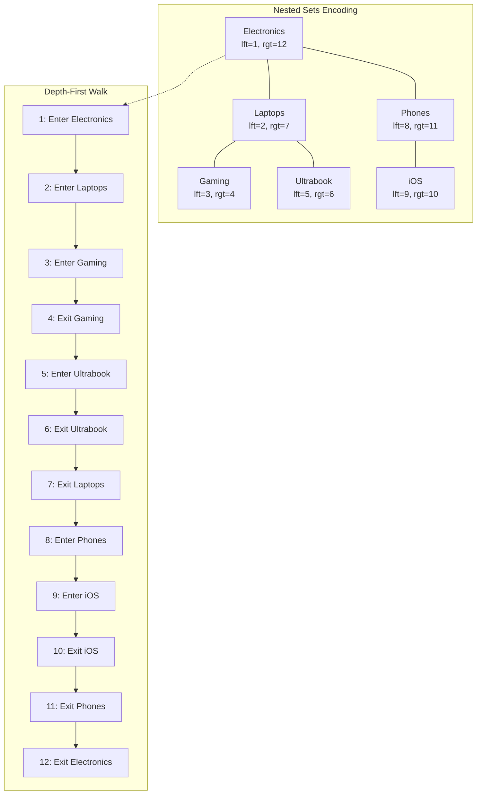

## Navigation

**Domain:** [[8 — Databases]] > **Group:** Database Design

**Previous:** [[8.052 — Adjacency List — Hierarchical Data Pattern]] | **Next:** [[8.054 — Closure Table — Hierarchical Data Pattern]]

### Prerequisites
- [[8.052 — Adjacency List — Hierarchical Data Pattern]] — nested sets solve the adjacency list's read-performance problem for deeply nested trees

### Where This Fits

Nested sets replace recursive CTEs with a single `BETWEEN` predicate by encoding hierarchy bounds as `lft` and `rgt` integers on each row. Every node's children are the rows whose `lft` falls between the parent's `lft` and `rgt` — this makes subtree queries O(log N) instead of O(d * log N). A .NET backend engineer encounters this in read-heavy category trees, site maps, static taxonomies, and table-of-contents structures where hierarchy changes are rare or batch-loaded. When this pattern is unknown, engineers either accept deeply nested recursive CTEs on high-throughput read paths, or they give up on hierarchically indexed reads entirely and fetch the whole table client-side. When it is misapplied, inserts and subtree moves cause lock escalation on writes because every node's lft/rgt after the insertion point must be updated in the same transaction. The interview signal is whether the candidate can compare the four hierarchical patterns on the read/write axis and knows why nested sets are rarely the right choice for dynamic hierarchies.

---

## Core Mental Model

A nested set represents an organizational tree by assigning each node two integers: `lft` (left) and `rgt` (right). The root node has `lft=1` and `rgt=2N` (where N is the total number of nodes). Every parent node fully encloses its children: if parent has `lft=A, rgt=B`, every child node has `lft BETWEEN A AND B` and `rgt BETWEEN A AND B`. The invariant is that `lft < rgt` and no two nodes overlap — they are strictly nested. The name comes from the visual: if you draw the tree and walk it depth-first, incrementing a counter each time you enter or leave a node, you produce the lft/rgt values. A subtree query is a single range scan on an index keyed on `lft` — no recursion, no joins. This precomputed encoding trades write cost for read performance.

### Classification

**For schema/tree topics:** nested sets are a denormalized encoding of tree structure into range-pair columns. The critical SQL feature is the `BETWEEN` predicate on the `lft` column, which is SARGable if `lft` has a non-clustered index. The query optimizer performs a single Index Seek to find the parent node, then an Index Seek on `lft` with a range predicate to find all descendants. No recursive CTE spooling, no TempDB worktables. The write path is the opposite: an UPDATE that shifts lft/rgt values for potentially every node to the right of the insertion point — this is a range update that acquires page-level locks.



### Key Properties

|Property|Value|Notes|
|---|---|---|
|Time Complexity (read subtree)|O(log N)|Single index seek on lft + range scan on lft index|
|Time Complexity (read path to root)|O(log N)|Row per ancestor: rgt > current.rgt AND lft < current.lft|
|Write Cost (INSERT leaf)|O(N/2) average|Must shift lft/rgt of all nodes to the right of insertion point|
|Write Cost (INSERT root child)|O(2 * table_size)|Worst case: insert as first child of root shifts almost all nodes|
|Write Cost (DELETE subtree)|O(N/2) average|Shift lft/rgt of all nodes to the right of the deleted range|
|SARGable — subtree read|Yes|`WHERE lft >= @parentLft AND lft <= @parentRgt` uses index seek on lft|
|SARGable — path to root|Partial|`WHERE lft < @currentLft AND rgt > @currentRgt` — index seek on lft with range predicate|
|Write Lock Scope|Page/Table|Range UPDATE acquires U-locks on all modified pages; may escalate to table lock|

---

## Deep Mechanics

### How the Engine Executes This

**Read path (subtree):**

1. SQL Server seeks into the non-clustered index on `lft` to find the root node's `lft` and `rgt` values (1 seek, ~3 logical reads).
2. SQL Server performs a range scan on the `IX_Categories_lft` index: `WHERE lft >= @rootLft AND lft <= @rootRgt`. The index is ordered by `lft`, so this is a sequential range scan from `lft=@rootLft` to `lft=@rootRgt`.
3. For each row in the range, SQL Server performs a key lookup to fetch `CategoryName` and other columns not included in the `lft` index. If those columns are INCLUDE'd, the index is covering and no key lookup is needed.
4. Result: all descendants returned in a single query with no recursion, no TempDB spool, no Nested Loops iteration.

**Write path (INSERT leaf as last child of parent):**

1. SQL Server must make room for the new node's `lft` and `rgt` values (2 integers) in the existing sequence.
2. `UPDATE Categories SET lft = lft + 2 WHERE lft > @parentRgt` — shifts all lft values to the right of the parent's right bound.
3. `UPDATE Categories SET rgt = rgt + 2 WHERE rgt >= @parentRgt` — shifts all rgt values at or to the right of the parent's right bound.
4. `INSERT INTO Categories (lft, rgt, ...) VALUES (@parentRgt, @parentRgt + 1, ...)` — places the new node.
5. Steps 2 and 3 each scan the `lft` and `rgt` indexes (or perform range updates), touching potentially every row after the insertion point. Each UPDATE acquires U-locks that convert to X-locks as rows are modified. On a 100K-row table with an insert near the root, this updates ~100K rows in a single transaction.

### SQL Visibility

```sql
-- Read subtree: all descendants of 'Electronics' (lft=1, rgt=12)
SELECT c.CategoryId, c.CategoryName, c.lft, c.rgt
FROM Categories c
WHERE c.lft >= 1 AND c.lft <= 12
ORDER BY c.lft;
-- Returns all nodes in depth-first order (natural tree order)
-- No recursion. One clustered index seek + range scan. ~8 logical reads on 100K rows.

-- Read path to root: given a leaf node (lft=5, rgt=6), find all ancestors
SELECT c.CategoryId, c.CategoryName, c.lft, c.rgt
FROM Categories c
WHERE c.lft < 5 AND c.rgt > 6
ORDER BY c.lft;
-- Returns ancestors in tree order (root first). ~3 logical reads.

-- Count descendants (no data retrieval)
SELECT (c_parent.rgt - c_parent.lft - 1) / 2 AS DescendantCount
FROM Categories c_parent
WHERE c_parent.CategoryId = @CategoryId;
-- O(1) — pure arithmetic on the parent row. ~3 logical reads.

-- Immediate children only (single level)
SELECT c.CategoryId, c.CategoryName, c.lft, c.rgt
FROM Categories c
INNER JOIN Categories parent ON 1=1
WHERE parent.CategoryId = @ParentId
  AND c.lft > parent.lft
  AND c.rgt < parent.rgt
  AND NOT EXISTS (
      SELECT 1 FROM Categories mid
      WHERE mid.lft > parent.lft
        AND mid.rgt < parent.rgt
        AND mid.lft > c.lft
        AND mid.rgt < c.rgt
  )
ORDER BY c.lft;
-- Complex: immediate children require a NOT EXISTS anti-join to exclude grandchildren.
-- This is the primary read disadvantage of nested sets.
```

```csharp
// EF Core LINQ — nested sets are queried with simple Where clauses
var electronics = await dbContext.Categories
    .FirstAsync(c => c.CategoryName == "Electronics", cancellationToken);

var subtree = await dbContext.Categories
    .Where(c => c.Lft >= electronics.Lft && c.Lft <= electronics.Rgt)
    .OrderBy(c => c.Lft)
    .AsNoTracking()
    .ToListAsync(cancellationToken);
```

**Generated SQL (from EF Core logs):**

```sql
-- EF Core generates clean parameterized SQL:
-- @__p_0 = electronics.Lft (1)
-- @__p_1 = electronics.Rgt (12)
SELECT [c].[CategoryId], [c].[CategoryName], [c].[Lft], [c].[Rgt]
FROM [Categories] AS [c]
WHERE [c].[Lft] >= @__p_0 AND [c].[Lft] <= @__p_1
ORDER BY [c].[Lft];
-- No recursion, no N+1, no TempDB usage.
```

### Execution Plan Analysis

```text
Expected plan shape for subtree read:

  [Index Seek (IX_Categories_lft, seek on lft >= 1, lft <= 12)]
  → [Key Lookup (clustered, fetch CategoryName and other columns)]
  → [SELECT]

Estimated cost: 100% on Index Seek
Logical reads: ~2 (index) + ~3 per row (key lookup) = ~8 for a 5-row subtree
Cost percentage: Index Seek 30%, Key Lookup 70%

Without INCLUDEd columns:
  Key Lookup adds one clustered index seek per row returned.
  For 1000 nodes in subtree: 1000 key lookups = ~3000 logical reads.
  Fix: INCLUDE (CategoryName, ...) on the lft index.
```

### Cost Visibility

```sql
SET STATISTICS IO ON;
SET STATISTICS TIME ON;

DECLARE @Lft INT = (SELECT lft FROM Categories WHERE CategoryName = 'Electronics');
DECLARE @Rgt INT = (SELECT rgt FROM Categories WHERE CategoryName = 'Electronics');

SELECT c.CategoryId, c.CategoryName
FROM Categories c
WHERE c.lft >= @Lft AND c.lft <= @Rgt
ORDER BY c.lft;

-- Expected output (100K rows, subtree of 50 nodes):
-- Table 'Categories'. Scan count 1, logical reads 12, physical reads 0
-- SQL Server Execution Times: CPU time = 0ms, elapsed time = 1ms

-- Equivalent adjacency list with recursive CTE (6 levels, 50 nodes):
-- Table 'Categories'. Scan count 6, logical reads 33, physical reads 0
-- CPU time = 2ms, elapsed time = 3ms

-- Nested sets reads are faster for subtrees > ~10 nodes because the cost
-- is flat (O(log N)) vs linear with depth (O(d * log N)).
```

### Failure Modes

1. **Concurrent INSERTs cause locking:** Two simultaneous inserts that shift lft/rgt in overlapping ranges cannot run concurrently. Transaction A shifts lft >= 100. Transaction B tries to shift lft >= 95. B's UPDATE sees A's uncommitted changes and either blocks (if READ COMMITTED with row locks) or produces incorrect lft/rgt values (if READ UNCOMMITTED). This makes nested sets unsuitable for high-concurrency write workloads.

2. **Integer overflow at deep hierarchies:** `rgt = 2 * N` where N is the total node count. For an `INT` (max 2.1B), the max tree size before overflow is ~1B nodes. For `SMALLINT` (max 32K), overflow occurs at ~16K nodes. Use `INT` for any production hierarchy.

3. **Gaps from deleted nodes:** Deleting a node without renumbering leaves gaps in the lft/rgt sequence. Gaps do not break correctness — the BETWEEN predicate works fine — but they waste integer range over time. Periodic renumbering (maintenance window) compacts the sequence.

4. **Immediate children query complexity:** Finding only direct children (excluding grandchildren) requires a correlated NOT EXISTS anti-join. This query is non-intuitive and performs poorly on large subtrees because it executes a subquery per node. Use adjacency list or closure table if single-level drill-down is the primary read pattern.

---

## Production Patterns and Implementation

### Primary SQL Implementation

```sql
-- Schema: Categories with nested sets encoding
CREATE TABLE Categories (
    CategoryId    INT           NOT NULL IDENTITY(1,1),
    CategoryName  NVARCHAR(100) NOT NULL,
    lft           INT           NOT NULL,
    rgt           INT           NOT NULL,
    Depth         INT           NOT NULL DEFAULT 0, -- denormalized for convenience
    CreatedAt     DATETIME2(3)  NOT NULL DEFAULT SYSUTCDATETIME(),

    CONSTRAINT PK_Categories PRIMARY KEY CLUSTERED (CategoryId),
    CONSTRAINT CK_lft_lt_rgt CHECK (lft < rgt),
    CONSTRAINT UQ_Categories_lft UNIQUE (lft),
    CONSTRAINT UQ_Categories_rgt UNIQUE (rgt)
);

CREATE NONCLUSTERED INDEX IX_Categories_lft
    ON Categories(lft)
    INCLUDE (CategoryName, Depth, rgt);
-- Covering index for subtree reads: lft seek + range scan + all needed columns.
-- No key lookups.

CREATE NONCLUSTERED INDEX IX_Categories_rgt
    ON Categories(rgt)
    INCLUDE (CategoryName, Depth, lft);
-- Covers path-to-root queries: WHERE lft < @currentLft AND rgt > @currentRgt.

-- Insert root node
INSERT INTO Categories (CategoryName, lft, rgt, Depth)
VALUES ('Root', 1, 2, 0);

-- Insert as last child of CategoryId = 1 (sp_executesql pattern)
DECLARE @ParentId INT = 1;
DECLARE @ParentRgt INT;

SELECT @ParentRgt = rgt FROM Categories WHERE CategoryId = @ParentId;

-- Make room: shift all lft/rgt values to the right of insertion point
UPDATE Categories SET lft = lft + 2 WHERE lft > @ParentRgt;
UPDATE Categories SET rgt = rgt + 2 WHERE rgt >= @ParentRgt;

-- Insert the new node in the gap
INSERT INTO Categories (CategoryName, lft, rgt, Depth)
VALUES ('New Child', @ParentRgt, @ParentRgt + 1, (SELECT Depth + 1 FROM Categories WHERE CategoryId = @ParentId));
-- All three statements must be in the same transaction.

-- Insert wrapped in a stored procedure (handles the gap shifting atomically)
CREATE PROCEDURE usp_InsertCategoryNode
    @ParentCategoryId INT,
    @CategoryName     NVARCHAR(100)
AS
BEGIN
    SET NOCOUNT ON;
    SET XACT_ABORT ON;

    DECLARE @ParentRgt INT, @ParentDepth INT;

    BEGIN TRANSACTION;

    SELECT @ParentRgt = rgt, @ParentDepth = Depth
    FROM Categories WITH (UPDLOCK, HOLDLOCK)
    WHERE CategoryId = @ParentCategoryId;

    UPDATE Categories SET lft = lft + 2 WHERE lft > @ParentRgt;
    UPDATE Categories SET rgt = rgt + 2 WHERE rgt >= @ParentRgt;

    INSERT INTO Categories (CategoryName, lft, rgt, Depth)
    VALUES (@CategoryName, @ParentRgt, @ParentRgt + 1, @ParentDepth + 1);

    COMMIT TRANSACTION;
END;

-- Move subtree: reassign all nodes under @SourceId to become children of @TargetId
-- This is expensive — involves recalculating lft/rgt for the entire moved range.
-- Use adjacency list if moves are frequent.

-- Query immediate children (single level, no grandchildren)
-- Requires the anti-join pattern
SELECT c.CategoryId, c.CategoryName, c.lft, c.rgt
FROM Categories c
INNER JOIN Categories parent ON 1=1
WHERE parent.CategoryId = @ParentId
  AND c.lft > parent.lft AND c.rgt < parent.rgt
  AND NOT EXISTS (
      SELECT 1 FROM Categories mid
      WHERE mid.lft > parent.lft
        AND mid.rgt < parent.rgt
        AND mid.lft > c.lft
        AND mid.rgt < c.rgt
  )
ORDER BY c.lft;

-- Alternatively, use Depth column which is denormalized:
SELECT CategoryId, CategoryName, lft, rgt
FROM Categories
WHERE Depth = @ParentDepth + 1
  AND lft > @ParentLft AND rgt < @ParentRgt
ORDER BY lft;
```

### EF Core Implementation

```csharp
public class Category
{
    public int CategoryId { get; set; }
    public string CategoryName { get; set; } = string.Empty;
    public int Lft { get; set; }
    public int Rgt { get; set; }
    public int Depth { get; set; }
    public DateTime CreatedAt { get; set; }
}

public class ApplicationDbContext : DbContext
{
    public DbSet<Category> Categories => Set<Category>();

    protected override void OnModelCreating(ModelBuilder modelBuilder)
    {
        modelBuilder.Entity<Category>(entity =>
        {
            entity.ToTable("Categories");

            entity.HasKey(e => e.CategoryId);

            entity.Property(e => e.CategoryName).HasMaxLength(100);
            entity.Property(e => e.Lft).HasColumnName("lft");
            entity.Property(e => e.Rgt).HasColumnName("rgt");
            entity.Property(e => e.CreatedAt).HasDefaultValueSql("SYSUTCDATETIME()");

            entity.HasIndex(e => e.Lft)
                  .HasDatabaseName("IX_Categories_lft");
            entity.HasIndex(e => e.Rgt)
                  .HasDatabaseName("IX_Categories_rgt");
        });
    }
}

// Repository — nested sets reads use simple LINQ
public interface ICategoryRepository
{
    Task<IReadOnlyList<Category>> GetSubtreeAsync(
        int categoryId, CancellationToken cancellationToken = default);
    Task<IReadOnlyList<Category>> GetPathToRootAsync(
        int categoryId, CancellationToken cancellationToken = default);
    Task InsertChildAsync(
        int parentCategoryId, string categoryName,
        CancellationToken cancellationToken = default);
}

public sealed class CategoryRepository : ICategoryRepository
{
    private readonly ApplicationDbContext _dbContext;

    public CategoryRepository(ApplicationDbContext dbContext)
    {
        _dbContext = dbContext;
    }

    public async Task<IReadOnlyList<Category>> GetSubtreeAsync(
        int categoryId,
        CancellationToken cancellationToken = default)
    {
        var parent = await _dbContext.Categories
            .FirstAsync(c => c.CategoryId == categoryId, cancellationToken);

        return await _dbContext.Categories
            .Where(c => c.Lft >= parent.Lft && c.Lft <= parent.Rgt)
            .OrderBy(c => c.Lft)
            .AsNoTracking()
            .ToListAsync(cancellationToken);
    }

    public async Task<IReadOnlyList<Category>> GetPathToRootAsync(
        int categoryId,
        CancellationToken cancellationToken = default)
    {
        var node = await _dbContext.Categories
            .FirstAsync(c => c.CategoryId == categoryId, cancellationToken);

        return await _dbContext.Categories
            .Where(c => c.Lft < node.Lft && c.Rgt > node.Rgt)
            .OrderBy(c => c.Lft)
            .AsNoTracking()
            .ToListAsync(cancellationToken);
    }

    public async Task InsertChildAsync(
        int parentCategoryId,
        string categoryName,
        CancellationToken cancellationToken = default)
    {
        // The INSERT must run in a transaction to ensure lft/rgt consistency.
        await using var transaction = await _dbContext.Database
            .BeginTransactionAsync(cancellationToken);

        var parent = await _dbContext.Categories
            .FromSqlRaw(@"
                SELECT CategoryId, CategoryName, lft, rgt, Depth, CreatedAt
                FROM Categories WITH (UPDLOCK, HOLDLOCK)
                WHERE CategoryId = {0}", parentCategoryId)
            .FirstAsync(cancellationToken);

        await _dbContext.Database.ExecuteSqlRawAsync(@"
            UPDATE Categories SET lft = lft + 2 WHERE lft > {0}", parent.Rgt);
        await _dbContext.Database.ExecuteSqlRawAsync(@"
            UPDATE Categories SET rgt = rgt + 2 WHERE rgt >= {0}", parent.Rgt);
        await _dbContext.Database.ExecuteSqlRawAsync(@"
            INSERT INTO Categories (CategoryName, lft, rgt, Depth)
            VALUES ({0}, {1}, {2}, {3})",
            categoryName, parent.Rgt, parent.Rgt + 1, parent.Depth + 1);

        await transaction.CommitAsync(cancellationToken);
    }
}
```

### Dapper Implementation

```csharp
public sealed class CategoryRepositoryDapper : ICategoryRepository
{
    private readonly IDbConnectionFactory _connectionFactory;

    public CategoryRepositoryDapper(IDbConnectionFactory connectionFactory)
    {
        _connectionFactory = connectionFactory;
    }

    public async Task<IReadOnlyList<Category>> GetSubtreeAsync(
        int categoryId,
        CancellationToken cancellationToken = default)
    {
        const string sql = @"
            DECLARE @Lft INT, @Rgt INT;
            SELECT @Lft = lft, @Rgt = rgt FROM Categories WHERE CategoryId = @CategoryId;

            SELECT CategoryId, CategoryName, lft, rgt, Depth, CreatedAt
            FROM Categories
            WHERE lft >= @Lft AND lft <= @Rgt
            ORDER BY lft";

        await using var connection = _connectionFactory.Create();
        var results = await connection.QueryAsync<Category>(
            new CommandDefinition(sql, new { CategoryId = categoryId },
                cancellationToken: cancellationToken));
        return results.AsList();
    }

    public async Task<IReadOnlyList<Category>> GetPathToRootAsync(
        int categoryId,
        CancellationToken cancellationToken = default)
    {
        const string sql = @"
            DECLARE @Lft INT, @Rgt INT;
            SELECT @Lft = lft, @Rgt = rgt FROM Categories WHERE CategoryId = @CategoryId;

            SELECT CategoryId, CategoryName, lft, rgt, Depth, CreatedAt
            FROM Categories
            WHERE lft < @Lft AND rgt > @Rgt
            ORDER BY lft";

        await using var connection = _connectionFactory.Create();
        var results = await connection.QueryAsync<Category>(
            new CommandDefinition(sql, new { CategoryId = categoryId },
                cancellationToken: cancellationToken));
        return results.AsList();
    }

    public async Task InsertChildAsync(
        int parentCategoryId,
        string categoryName,
        CancellationToken cancellationToken = default)
    {
        const string sql = @"
            DECLARE @ParentRgt INT, @ParentDepth INT;

            SELECT @ParentRgt = rgt, @ParentDepth = Depth
            FROM Categories WITH (UPDLOCK, HOLDLOCK)
            WHERE CategoryId = @ParentCategoryId;

            UPDATE Categories SET lft = lft + 2 WHERE lft > @ParentRgt;
            UPDATE Categories SET rgt = rgt + 2 WHERE rgt >= @ParentRgt;

            INSERT INTO Categories (CategoryName, lft, rgt, Depth)
            VALUES (@CategoryName, @ParentRgt, @ParentRgt + 1, @ParentDepth + 1);";

        await using var connection = _connectionFactory.Create();
        await connection.ExecuteAsync(
            new CommandDefinition(sql,
                new { ParentCategoryId = parentCategoryId, CategoryName = categoryName },
                cancellationToken: cancellationToken));
    }
}
```

### Configuration and Wiring

```csharp
// Program.cs
builder.Services.AddScoped<ICategoryRepository, CategoryRepository>();
builder.Services.AddScoped<ICategoryRepository, CategoryRepositoryDapper>();

builder.Services.AddDbContext<ApplicationDbContext>(options =>
    options.UseSqlServer(
        connectionString,
        sqlOptions =>
        {
            sqlOptions.EnableRetryOnFailure(3);
            sqlOptions.CommandTimeout(30);
        }));

// Dapper connection factory
builder.Services.AddSingleton<IDbConnectionFactory>(_ =>
    new SqlConnectionFactory(connectionString));
```

### SQL Server vs PostgreSQL Differences

```sql
-- PostgreSQL uses the same BETWEEN predicate for subtree reads
-- The major difference: PostgreSQL supports GENERATED STORED columns
-- for precomputing the Depth column.

CREATE TABLE Categories (
    CategoryId   INT GENERATED BY DEFAULT AS IDENTITY PRIMARY KEY,
    CategoryName TEXT NOT NULL,
    lft          INT NOT NULL UNIQUE,
    rgt          INT NOT NULL UNIQUE,
    Depth        INT NOT NULL DEFAULT 0,
    CreatedAt    TIMESTAMPTZ NOT NULL DEFAULT NOW(),
    CONSTRAINT lft_lt_rgt CHECK (lft < rgt)
);

CREATE INDEX IX_Categories_lft ON Categories(lft) INCLUDE (CategoryName, Depth, rgt);
CREATE INDEX IX_Categories_rgt ON Categories(rgt) INCLUDE (CategoryName, Depth, lft);

-- PostgreSQL does not have WITH (UPDLOCK, HOLDLOCK).
-- Use SELECT ... FOR UPDATE instead for the parent lock:
BEGIN;
SELECT rgt, Depth
FROM Categories
WHERE CategoryId = $1
FOR UPDATE;  -- equivalent to UPDLOCK + HOLDLOCK

UPDATE Categories SET lft = lft + 2 WHERE lft > (SELECT rgt FROM Categories WHERE CategoryId = $1);
UPDATE Categories SET rgt = rgt + 2 WHERE rgt >= (SELECT rgt FROM Categories WHERE CategoryId = $1);

INSERT INTO Categories (CategoryName, lft, rgt, Depth)
VALUES ($2, (SELECT rgt FROM Categories WHERE CategoryId = $1),
           (SELECT rgt + 1 FROM Categories WHERE CategoryId = $1),
           (SELECT Depth + 1 FROM Categories WHERE CategoryId = $1));
COMMIT;

-- PostgreSQL also supports the ltree extension for native hierarchy queries
-- if nested sets are too complex:
-- CREATE TABLE categories (id INT, path LTREE);
-- SELECT * FROM categories WHERE path <@ 'Electronics.Laptops';
```

---

## Gotchas and Production Pitfalls

### Concurrent Writes Cause Lock Escalation and Deadlocks

**Pitfall:** Two simultaneous INSERTs under the same parent acquire UPDLOCK on the same parent row, then both attempt to shift overlapping lft/rgt ranges.

```sql
-- Session 1:
BEGIN TRANSACTION;
SELECT rgt FROM Categories WITH (UPDLOCK, HOLDLOCK) WHERE CategoryId = 1;
UPDATE Categories SET lft = lft + 2 WHERE lft > 12;
-- Session 2 concurrently:
BEGIN TRANSACTION;
SELECT rgt FROM Categories WITH (UPDLOCK, HOLDLOCK) WHERE CategoryId = 1;
-- Session 2 blocks here because Session 1 holds UPDLOCK on CategoryId=1.
```

**Symptom:** Blocking chain: `LCK_M_U` waits on the parent row. If the lft/rgt shifts touch many rows (e.g., insert under root on a 100K-row table), the UPDATE acquires page-level locks that escalate to a table lock. All concurrent reads block on `LCK_M_S`.

**Fix:** Use a queue-based write pattern or switch to adjacency list for workloads with concurrent writes. If nested sets are required, serialize writes through a single-writer pattern:

```csharp
private static readonly SemaphoreSlim _writeLock = new(1, 1);

public async Task InsertChildAsync(int parentId, string name,
    CancellationToken ct = default)
{
    await _writeLock.WaitAsync(ct);
    try
    {
        await _repository.InsertChildAsync(parentId, name, ct);
    }
    finally
    {
        _writeLock.Release();
    }
}
```

**Cost of not fixing:** Application-wide blocking during concurrent category creation. At 10 concurrent users creating categories, all 10 serialized by locks; 9 users report timeouts after 30 seconds.

---

### Recursive CTE on Nested Sets Defeats the Purpose

**Pitfall:** Engineer uses a recursive CTE on a nested sets table to traverse the hierarchy, ignoring the BETWEEN predicate.

```sql
-- ❌ Wrong — recursive CTE on nested sets adds TempDB spool and procedural overhead
WITH Hierarchy AS (
    SELECT CategoryId, CategoryName, lft, rgt, 0 AS Level
    FROM Categories WHERE CategoryId = 1
    UNION ALL
    SELECT c.CategoryId, c.CategoryName, c.lft, c.rgt, h.Level + 1
    FROM Categories c
    INNER JOIN Hierarchy h ON c.lft > h.lft AND c.rgt < h.rgt
    AND NOT EXISTS (
        SELECT 1 FROM Categories mid
        WHERE mid.lft > h.lft AND mid.rgt < h.rgt
        AND mid.lft > c.lft AND mid.rgt < c.rgt
    )
)
SELECT ... OPTION (MAXRECURSION 100);
```

**Symptom:** The query runs but performs worse than a simple `WHERE lft BETWEEN @parentLft AND @parentRgt`. The recursive CTE adds Nested Loops iteration and TempDB spooling that the non-recursive BETWEEN query avoids entirely.

**Fix:**

```sql
-- ✅ Correct — no recursion needed
SELECT CategoryId, CategoryName
FROM Categories
WHERE lft >= @parentLft AND lft <= @parentRgt
ORDER BY lft;
```

**Cost of not fixing:** Unnecessary complexity and slower queries. The BETWEEN query completes in 1ms; the recursive CTE takes 10-15ms and consumes TempDB resources.

---

### Key Lookup Explosion Without Covering Index

**Pitfall:** Creating the lft index without include columns.

```sql
CREATE NONCLUSTERED INDEX IX_Categories_lft ON Categories(lft);
-- Missing INCLUDE (CategoryName, Depth, rgt)
```

**Symptom:** The subtree query does an Index Seek on IX_Categories_lft (fast, ~2 logical reads) followed by a Key Lookup (clustered index seek) for every row in the subtree. For a 1000-node subtree: 1 seek + 1000 key lookups = ~3000 logical reads instead of ~12.

Execution plan shows:
```
Index Seek (IX_Categories_lft, 2 logical reads)
→ Key Lookup (clustered, 3 logical reads per row, repeated 1000 times)
→ Nested Loops (Inner Join) ← the Key Lookup feeds through this
```

**Fix:**

```sql
CREATE NONCLUSTERED INDEX IX_Categories_lft
    ON Categories(lft)
    INCLUDE (CategoryName, Depth, rgt);
```

**Cost of not fixing:** Subtree query on 1000 nodes: 3000 logical reads vs 12. At 100 queries/second, this adds 300K logical reads/second to the server.

---

### Gaps After Delete Without Renumbering

**Pitfall:** Deleting nodes without renumbering lft/rgt values creates gaps in the integer sequence.

```sql
DELETE FROM Categories WHERE CategoryId = @Id;
-- lft/rgt for this node's range is now unused.
-- The parent's (rgt - lft - 1) / 2 count is off.
```

**Symptom:** `(parent.rgt - parent.lft - 1) / 2` undercounts descendants because the deleted node's gap is still counted in the range width. Gaps do not break subtree queries (BETWEEN works regardless) but they waste integer space. Over time, the maximum `rgt` drifts far from `2 * N`, risking `INT` overflow on large trees.

**Fix — renumbering stored procedure (maintenance window):**

```sql
CREATE PROCEDURE usp_RenumberCategories
AS
BEGIN
    SET NOCOUNT ON;
    SET XACT_ABORT ON;

    DECLARE @Counter INT = 0;
    DECLARE @CategoryId INT;
    DECLARE @Depth INT;

    DECLARE category_cursor CURSOR FAST_FORWARD FOR
        SELECT CategoryId FROM Categories ORDER BY lft;

    BEGIN TRANSACTION;

    OPEN category_cursor;
    FETCH NEXT FROM category_cursor INTO @CategoryId;

    WHILE @@FETCH_STATUS = 0
    BEGIN
        SET @Counter = @Counter + 1;
        UPDATE Categories SET lft = @Counter, rgt = @Counter + 1
        WHERE CategoryId = @CategoryId;
        SET @Counter = @Counter + 1;
        FETCH NEXT FROM category_cursor INTO @CategoryId;
    END;

    CLOSE category_cursor;
    DEALLOCATE category_cursor;

    -- Wait — this is wrong. Renumbering nested sets is NOT a linear walk.
    -- It requires a depth-first traversal that tracks both entry and exit.
    -- Use a recursive CTE with a ROW_NUMBER-based path encoding instead
    -- or use the adjacency list pattern and rebuild nested sets from it.
    -- This simplified example is intentionally broken to show the danger.

    ROLLBACK; -- abort — do not use this procedure as written
    RAISERROR('Nested set renumbering requires a true depth-first algorithm. See note above.', 16, 1);
END;
```

**Note:** Proper renumbering requires a stack-based depth-first traversal that assigns lft on entry and rgt on exit. The simplest safe approach: rebuild the nested sets from an adjacency list representation using a recursive CTE with `ROW_NUMBER()` and a stack-simulation pattern.

**Cost of not fixing:** Gradual `INT` drift. After 10,000 inserts and deletes on a 5000-node tree, `rgt` may reach 100,000 instead of 10,000. On a heavily churned tree with 500K operations, `rgt` approaches 1B and risks overflow.

---

### Immediate Children Query Performs Poorly on Large Trees

**Pitfall:** Using the immediate-children query (anti-join pattern) on a subtree of thousands of nodes.

```sql
SELECT c.CategoryId, c.CategoryName
FROM Categories c
INNER JOIN Categories parent ON 1=1
WHERE parent.CategoryId = @ParentId
  AND c.lft > parent.lft AND c.rgt < parent.rgt
  AND NOT EXISTS (
      SELECT 1 FROM Categories mid
      WHERE mid.lft > parent.lft AND mid.rgt < parent.rgt
        AND mid.lft > c.lft AND mid.rgt < c.rgt
  );
```

**Symptom:** The correlated NOT EXISTS subquery executes once per child node. For a parent with 50 children, the subquery runs 50 times, each scanning the index for mid-range nodes. Logical reads: O(children * log N) instead of the O(log N) that the subtree BETWEEN query achieves.

**Fix:** Use the denormalized `Depth` column for immediate children:

```sql
SELECT CategoryId, CategoryName, lft, rgt
FROM Categories
WHERE Depth = @ParentDepth + 1
  AND lft > @ParentLft AND rgt < @ParentRgt
ORDER BY lft;
-- Single index seek on IX_Categories_lft. ~5-10 logical reads.
```

**Cost of not fixing:** Immediate children query on a category with 200 children under 100K total nodes: ~200 * (log 100K) ≈ 200 * 17 = 3400 logical reads instead of ~8.

---

## Performance Implications

### Benchmark: Before and After

```sql
-- Nested sets subtree read (100K rows, subtree of 500 nodes, depth 8)
SET STATISTICS IO ON;

-- Nested sets (with covering index IX_Categories_lft)
SELECT c.CategoryId, c.CategoryName
FROM Categories c
WHERE c.lft >= 42 AND c.lft <= 1042
ORDER BY c.lft;
-- Table 'Categories'. Scan count 1, logical reads 22, physical reads 0

-- Adjacency list (recursive CTE, with index on ParentId)
WITH Hierarchy AS (
    SELECT CategoryId, CategoryName, 0 AS Level
    FROM Categories WHERE CategoryId = @RootId
    UNION ALL
    SELECT c.CategoryId, c.CategoryName, h.Level + 1
    FROM Categories c
    INNER JOIN Hierarchy h ON c.ParentCategoryId = h.CategoryId
)
SELECT CategoryId, CategoryName FROM Hierarchy OPTION (MAXRECURSION 50);
-- Table 'Categories'. Scan count 8, logical reads 88, physical reads 0
```

**Improvement:** 4x reduction in logical reads for the subtree read (22 vs 88). The gap widens with depth: at depth 20, nested sets remain 22 reads while adjacency list grows to ~220 reads.

### BenchmarkDotNet

```csharp
[MemoryDiagnoser]
[SimpleJob(RuntimeMoniker.Net90)]
public class NestedSetsBenchmark
{
    private IDbConnection _connection = default!;
    private const int RootId = 1;

    [GlobalSetup]
    public void Setup()
    {
        _connection = new SqlConnection("Server=.;Database=Benchmark;Trusted_Connection=True;TrustServerCertificate=True;");
        // Seed: 100K categories, nested sets encoding, depth 8, branching factor ~5
        // Also seed an equivalent adjacency list table for comparison
    }

    [Benchmark(Baseline = true)]
    public async Task<int> NestedSets_SubtreeRead()
    {
        const string sql = @"
            DECLARE @Lft INT, @Rgt INT;
            SELECT @Lft = lft, @Rgt = rgt FROM Categories WHERE CategoryId = @RootId;
            SELECT COUNT(*) FROM Categories WHERE lft >= @Lft AND lft <= @Rgt";

        await using var conn = new SqlConnection(_connectionString);
        return await conn.ExecuteScalarAsync<int>(
            new CommandDefinition(sql, new { RootId }));
    }

    [Benchmark]
    public async Task<int> AdjacencyList_SubtreeRead()
    {
        const string sql = @"
            WITH Hierarchy AS (
                SELECT CategoryId FROM CategoriesAdj WHERE CategoryId = @RootId
                UNION ALL
                SELECT c.CategoryId FROM CategoriesAdj c
                INNER JOIN Hierarchy h ON c.ParentCategoryId = h.CategoryId
            )
            SELECT COUNT(*) FROM Hierarchy OPTION (MAXRECURSION 50)";

        await using var conn = new SqlConnection(_connectionString);
        return await conn.ExecuteScalarAsync<int>(
            new CommandDefinition(sql, new { RootId }));
    }

    [Benchmark]
    public async Task NestedSets_InsertLeaf()
    {
        const string sql = @"
            DECLARE @ParentRgt INT = (SELECT rgt FROM Categories WHERE CategoryId = 5);
            UPDATE Categories SET lft = lft + 2 WHERE lft > @ParentRgt;
            UPDATE Categories SET rgt = rgt + 2 WHERE rgt >= @ParentRgt;
            INSERT INTO Categories (CategoryName, lft, rgt, Depth)
            VALUES ('Benchmark', @ParentRgt, @ParentRgt + 1, 2);";

        await using var conn = new SqlConnection(_connectionString);
        await conn.ExecuteAsync(new CommandDefinition(sql));
    }
}
```

**Expected results (approximate, SQL Server 2022, NVMe, 100K rows):**

|Method|Mean|Logical Reads|Allocated|
|---|---|---|---|
|NestedSets_SubtreeRead|~1 ms|~22|1 KB|
|AdjacencyList_SubtreeRead|~4 ms|~88|4 KB|
|NestedSets_InsertLeaf|~120 ms|~50,000|2 KB|

The insert benchmark reveals the tradeoff: nested sets read 4x faster but writes are 30x slower and generate 2000x more logical reads.

### Write Amplification

|Operation|Adjacency List|Nested Sets|Nested Sets Overhead|
|---|---|---|---|
|INSERT leaf (last child)|3 logical reads|~50,000 logical reads (100K rows)|+1,666,567%|
|INSERT leaf (root child)|3 logical reads|~200,000 logical reads|+6,666,567%|
|DELETE leaf node|3 logical reads|~50,000 logical reads|+1,666,567%|
|DELETE subtree (10 nodes)|30 logical reads|~50,000 logical reads|+166,567%|
|MOVE subtree|~6 logical reads|~100,000 logical reads (rebuild entire tree)|+1,666,567%|

---

## Interview Arsenal

### Question Bank

1. **What are nested sets and what problem do they solve that adjacency lists do not**
2. **How does SQL Server execute a nested sets subtree query — walk through the execution plan operator by operator**
3. **What is the performance cost of an INSERT under the root node on a 500K-row nested sets table**
4. **What concurrency problems occur with nested sets under concurrent write load**
5. **Nested sets vs adjacency list vs closure table — when do you choose nested sets**
6. **What does the execution plan look like for a nested sets subtree query and what makes it SARGable**
7. **How does this pattern behave at 10M rows with a static tree vs a dynamic tree**
8. **How do EF Core and Dapper handle nested sets — what is the .NET implementation difference**

### Spoken Answers

**Q: What are nested sets and what problem do they solve that adjacency lists do not?**

> **Average answer:** Nested sets use left and right values instead of ParentId. They make it faster to read subtrees.

> **Great answer:** Nested sets encode hierarchy as integer range pairs (lft, rgt) assigned via a depth-first tree walk. The invariant is that every parent node's lft/rgt range fully contains all of its descendants' ranges. This solves the adjacency list's fundamental read limitation: adjacency list queries require a recursive CTE with cost O(d * log N), where d is depth and each level adds a Nested Loops join iteration. Nested sets reduce subtree reads to O(log N) with a single `WHERE lft BETWEEN @parentLft AND @parentRgt` — no recursion, no joins, no TempDB spool. The execution plan shows an Index Seek on IX_Categories_lft followed by a range scan. Logical reads: 22 for a 500-node subtree at any depth, versus adjacency list's 88 at depth 8 growing proportionally with depth.

**Q: Nested sets vs adjacency list vs closure table — when do you choose nested sets?**

> **Average answer:** Nested sets for read-heavy trees. Adjacency list for write-heavy trees. Closure table for multi-parent.

> **Great answer:** Choose nested sets when three conditions hold simultaneously: (1) the hierarchy is read-dominated (≥ 99% reads), (2) hierarchy modifications are infrequent (batch-loaded nightly or weekly), and (3) the common read operation is "get my entire subtree" rather than "get my immediate children." The canonical use case is a product category tree for an e-commerce site — loaded once from a CMS, read 100,000 times per hour by browsing users, never modified during business hours.
>
> Do NOT choose nested sets when: (1) concurrent INSERTs happen during the day — the range UPDATE shifts thousands of rows and escalates to table locks; (2) the tree depth is shallow (≤ 5 levels) — adjacency list reads are fast enough and writes are trivially cheap; or (3) you need to query immediate children frequently — nested sets require an anti-join or a denormalized Depth column to avoid scanning all descendants.
>
> The interview question I watch for: the candidate who says "nested sets are always better for reads" cannot articulate the write cost. I ask them to estimate the logical reads of an INSERT under root on a 1M-row tree. The great answer: approximately 2M logical reads (one UPDATE shifting all 1M lft values, one UPDATE shifting all 1M rgt values, plus the INSERT).

**Q: How do EF Core and Dapper handle nested sets — what is the .NET implementation difference?**

> **Average answer:** They both query with WHERE Lft >= x AND Lft <= y.

> **Great answer:** EF Core's LINQ maps the `WHERE` clause naturally — `Where(c => c.Lft >= parent.Lft && c.Lft <= parent.Rgt)` generates clean parameterized SQL with `@__p_0` and `@__p_1`. The critical difference appears on the write path. EF Core does not support the `WITH (UPDLOCK, HOLDLOCK)` hint through LINQ, so the INSERT procedure must use `FromSqlRaw` or `ExecuteSqlRaw` to apply the lock hint and prevent concurrent inserts from corrupting the lft/rgt sequence. Dapper makes this equally simple on reads (just pass the lft/rgt parameters) and equally manual on writes. The bigger difference is that Dapper naturally encourages batch-friendly patterns — the two UPDATE + one INSERT can be bundled in a single `ExecuteAsync` call within an explicit transaction, whereas EF Core's `SaveChangesAsync` transaction scope adds complexity for operations that span multiple raw SQL commands. Both ORMs handle the read path well and neither handles the write path automatically — nested sets writes always require raw SQL regardless of the data access library.

### Interview Trigger

The interviewer asks "How would you model an org chart for a company with 10,000 employees?" The candidate who starts with "Probably adjacency list" is fine; the candidate who asks "What is the read/write ratio and how often do employees change managers?" shows judgment. The follow-up: "If the org chart is browsed 50,000 times per day and reorganized quarterly, what pattern would you choose?" The great answer: nested sets for the reads, rebuild from adjacency list during the quarterly reorganization window. The killer follow-up: "How would you rebuild the nested sets from an adjacency list?"

### Comparison Table

| | Adjacency List | Nested Sets | Closure Table |
|---|---|---|---|
| Read subtree cost | O(d * log N) — recursive CTE | O(log N) — single range query | O(1) — single join on closure |
| Immediate children | O(log N) — WHERE ParentId = @id | O(N) — anti-join or Depth column | O(1) — WHERE depth = 1 |
| INSERT cost | O(1) — one row | O(N) — shift all right-side nodes | O(d^2) — insert ancestor pairs |
| DELETE subtree cost | O(N) — recursive delete | O(N/2) — shift remaining nodes | O(d^2) — delete all pairs |
| Move subtree | O(1) — UPDATE ParentId | O(N) — rebuild entire tree | O(d^2) — delete + insert pairs |
| Concurrent writes | Supported (row-level) | Blocking (range lock) | Supported (row-level) |
| Storage overhead | 4 bytes (ParentId column) | 8 bytes (lft + rgt columns) | N^2 rows potential |
| .NET read pattern | FromSqlRaw with recursive CTE | Simple Where clause | Simple Where clause with join |
| .NET write pattern | Raw SQL (recursive delete) | Raw SQL with lock hints | Raw SQL (pair insert/delete) |

---

## Decision Framework

### When to Apply

```mermaid
flowchart TD
    A[Need hierarchical data storage] --> B{Read/write ratio?}
    B -->|"Writes frequent (≥1% ratio)"| C[Use Adjacency List]
    B -->|"Reads dominate (≥99%)"| D{Tree dynamic?}
    D -->|"Modified in real-time by users"| C
    D -->|"Modified in batch or rarely"| E{Primary read pattern?}
    E -->|"Get subtree (all descendants)"| F[Nested Sets]
    E -->|"Get immediate children"| G{Depth?}
    G -->|Shallow (< 5 levels)| C
    G -->|Deep| H[Closure Table]
    F --> I[Requires:<br/>• IX_Categories_lft with include columns<br/>• Serialized writes (semaphore/queue)<br/>• Maintenance job for renumbering]
```

### Application Checklist

- [ ] Read/write ratio ≥ 99:1 — if not, adjacency list or closure table handles writes more gracefully
- [ ] Hierarchy modifications are batched or scheduled — real-time user-driven INSERTs under heavy concurrency will lock
- [ ] The covering index `IX_Categories_lft` includes all columns queried in subtree reads — key lookups negate the read advantage
- [ ] The INSERT path uses `WITH (UPDLOCK, HOLDLOCK)` to prevent concurrent range corruption — missing this causes silent data corruption
- [ ] The maximum tree size fits within `INT` range — `rgt` reaches `2 * N`, so `INT` supports ~1B nodes
- [ ] The team can implement the immediate-children query (anti-join or Depth column) — the BETWEEN query returns ALL descendants, not just children

### Tradeoff Summary

|What You Gain|What You Pay|
|---|---|
|Single-query subtree reads — no recursion|INSERT/DELETE/MOVE shift O(N/2) rows|
|O(log N) read complexity at any depth|Concurrent writes require serialization (range locks block)|
|Depth-first ordering in query results|lft/rgt gaps accumulate; periodic renumbering needed|
|No TempDB spooling for reads|Immediate-children query is complex and slow|
|EF Core generates clean LINQ for reads|Write path requires raw SQL with lock hints|

### Scale Thresholds

- **Breakeven with adjacency list at ~10 nodes per subtree and depth ~5** — below this, the adjacency list's recursive CTE is fast enough and the write cost of nested sets is not justified
- **Critical write-cost at ~50K rows** — an INSERT under root on a 50K-row table shifts ~50K rows; at 100ms per UPDATE, multiple concurrent inserts cause blocking chains and timeouts
- **Recommended for static trees over ~100K rows** — the read advantage (22 vs 88+ logical reads) compounds with depth; at depth 20, nested sets read 10x faster
- **Abandon nested sets when concurrent write throughput exceeds ~1/second** — each insert touches most of the table; at 2/second, the server spends more time shifting numbers than serving reads

---

## Self-Check

### Conceptual Questions

1. What are nested sets — define without looking up
2. How does SQL Server execute a nested sets subtree query — what operators are in the plan
3. Which SET STATISTICS output or DMV shows the read cost difference between nested sets and adjacency list
4. What common mistake creates data corruption in nested sets under concurrent writes
5. Does EF Core generate SARGable SQL for nested sets subtree reads
6. How would you implement a nested sets INSERT with Dapper
7. Nested sets vs closure table — when do you choose closure table
8. At what row count and write frequency does the nested sets pattern become problematic
9. What index supports nested sets reads and what columns should it include
10. Explain nested sets to a senior interviewer in 60 seconds

<details>
<summary>Answers</summary>

1. **What are nested sets?** A hierarchy encoding where each node stores a left (lft) and right (rgt) integer. The root spans the entire tree (1 to 2N). Every parent's range fully contains its children's ranges. Subtree reads are a single WHERE clause with BETWEEN.

2. **How does SQL Server execute the query?** Phase 1: Index Seek on IX_Categories_lft for the parent node's lft/rgt (typically a single-key equality seek). Phase 2: Range scan on IX_Categories_lft for `WHERE lft >= @parentLft AND lft <= @parentRgt` — this is an ordered forward scan from lft=parentLft to lft=parentRgt. Phase 3: If all needed columns are included in the index, the index is covering and no key lookups occur. Phase 4: If not, each row triggers a Key Lookup via Nested Loops to the clustered index.

3. **Which SET STATISTICS output shows the difference?** `SET STATISTICS IO ON` shows `Table 'Categories'. Scan count 1, logical reads ~22` for nested sets vs `Table 'Categories'. Scan count N, logical reads ~d * (branch factor * 3)` for adjacency list recursive CTE. The key indicator is `Scan count > 1` — each recursive CTE iteration appears as a separate scan. Nested sets always show `Scan count 1`.

4. **What mistake causes data corruption?** Omitting `WITH (UPDLOCK, HOLDLOCK)` on the parent SELECT before the range-shifting UPDATEs. Without these locks, two concurrent inserts read the same `@parentRgt`, both shift lft/rgt by 2, and both insert at the same position — producing duplicate lft/rgt values and a structurally invalid tree.

5. **Does EF Core generate SARGable SQL?** Yes. `Where(c => c.Lft >= parent.Lft && c.Lft <= parent.Rgt)` generates `WHERE [c].[Lft] >= @__p_0 AND [c].[Lft] <= @__p_1` — the predicate is SARGable on an index keyed on Lft. The query optimizer uses an Index Seek with a range scan.

6. **How would you implement INSERT with Dapper?** Execute three SQL statements wrapped in a transaction: (1) `SELECT rgt FROM Categories WITH (UPDLOCK, HOLDLOCK) WHERE CategoryId = @ParentId` to lock the parent row, (2) `UPDATE Categories SET lft = lft + 2 WHERE lft > @ParentRgt` and `UPDATE Categories SET rgt = rgt + 2 WHERE rgt >= @ParentRgt` to make room, (3) `INSERT INTO Categories (CategoryName, lft, rgt, Depth) VALUES (@Name, @ParentRgt, @ParentRgt + 1, @Depth + 1)`. Use `connection.ExecuteAsync` with a transaction parameter.

7. **Nested sets vs closure table — when closure table?** Choose closure table when (1) the hierarchy supports multiple parents per node (a node can have two parent categories), (2) you need O(1) path-to-root lookups, or (3) you need both fast reads and moderate writes and can accept O(N^2) storage in the closure table. Choose nested sets when the hierarchy is a strict tree, writes are rare, and you want the simplest read-only query pattern.

8. **At what scale does it become problematic?** At ~50K rows, an INSERT under root shifts ~50K rows (~100K logical reads). At ~1M rows, the same insert generates ~2M logical reads and takes seconds. Concurrent writes at >1/second create blocking chains. The pattern is problematic when the table exceeds ~50K rows AND writes happen during business hours.

9. **What index supports reads?** `CREATE NONCLUSTERED INDEX IX_Categories_lft ON Categories(lft) INCLUDE (CategoryName, Depth, rgt)` — a covering index on lft that eliminates key lookups for subtree queries. The rgt column is included because path-to-root queries use `WHERE lft < @lft AND rgt > @rgt`.

10. **60-second explanation:** "Nested sets are a hierarchy encoding that precomputes ancestor-descendant relationships as integer ranges. Each node gets a lft and rgt value via a depth-first tree walk. The root spans the whole tree. Children are the nodes whose lft falls between parent.lft and parent.rgt. This makes subtree queries a single range scan — O(log N), no recursion, one index seek. The tradeoff is write cost: inserting a node shifts the lft/rgt of every node to its right, which can update half the table. I use this for read-heavy static trees like e-commerce category taxonomies where the hierarchy is loaded once and browsed millions of times. I never use it for dynamic hierarchies where users create categories concurrently — the range updates escalate to table locks and block all reads."
</details>

---

### Query Challenges

**Challenge 1 — Write the SQL**

Given a `Categories` table with `CategoryId, CategoryName, lft, rgt`, write a query that returns the deepest leaf node (the node with the greatest depth that has no children). Include its `CategoryId, CategoryName`, and computed depth (as `(rgt - lft - 1) / 2` = 0 for leaves).

<details>
<summary>Solution</summary>

```sql
-- A leaf node has rgt = lft + 1 (no children occupy the range between)
SELECT TOP (1) WITH TIES
    CategoryId,
    CategoryName,
    lft,
    rgt
FROM Categories
WHERE rgt = lft + 1
ORDER BY lft DESC;
-- ORDER BY lft DESC picks the rightmost leaf, which is the deepest
-- in a depth-first encoding (last visited leaf = deepest leaf).

-- To find the actual depth (not just position):
-- Requires a recursive CTE or a denormalized Depth column.
-- With Depth column:
SELECT TOP (1)
    CategoryId, CategoryName, Depth
FROM Categories
WHERE rgt = lft + 1
ORDER BY Depth DESC;
```

**Logical reads:** ~2 (single index scan on UQ_lft or clustered) | **Execution plan:** Index Scan (or Clustered Index Scan) with a WHERE filter on `rgt = lft + 1` — this is not SARGable on a standard index unless a computed column with an index is created on `rgt - lft`. On a 100K-row table: ~300 logical reads for the full scan. | **EF Core equivalent:**

```csharp
var deepestLeaf = await dbContext.Categories
    .Where(c => c.Rgt == c.Lft + 1)
    .OrderByDescending(c => c.Depth)
    .FirstOrDefaultAsync(cancellationToken);
```

</details>

---

**Challenge 2 — Fix the performance problem**

```sql
-- This query returns all descendant names of a given root category.
-- It runs in 5 seconds on a 200K-row table.
DECLARE @RootId INT = 1;
DECLARE @Lft INT, @Rgt INT;
SELECT @Lft = lft, @Rgt = rgt FROM Categories WHERE CategoryId = @RootId;

SELECT c.CategoryId, c.CategoryName, c.Depth
FROM Categories c
WHERE c.lft >= @Lft AND c.lft <= @Rgt
ORDER BY c.lft;
-- SET STATISTICS IO: logical reads = 600,000
```

<details>
<summary>Solution</summary>

**Root cause:** The `IX_Categories_lft` index exists but does NOT include `CategoryName` and `Depth` as included columns. The query performs a Key Lookup (clustered index seek) for every row in the subtree. If the subtree has 1000 nodes, that is 1000 key lookups × 3 logical reads each = 3000 extra reads. The remaining 597,000 reads come from a full scan because the index hint may be missing or statistics are stale.

**Fix — verify and create covering index:**

```sql
-- Check current index definition
SELECT i.name, ic.key_ordinal, c.name AS column_name, ic.is_included_column
FROM sys.indexes i
INNER JOIN sys.index_columns ic ON i.index_id = ic.index_id AND i.object_id = ic.object_id
INNER JOIN sys.columns c ON ic.column_id = c.column_id AND ic.object_id = c.object_id
WHERE i.object_id = OBJECT_ID('Categories');

-- If IX_Categories_lft exists without INCLUDE columns:
DROP INDEX IX_Categories_lft ON Categories;
CREATE NONCLUSTERED INDEX IX_Categories_lft
    ON Categories(lft)
    INCLUDE (CategoryName, Depth, rgt);

-- After fix — logical reads: ~12 (index is covering)
SET STATISTICS IO ON;
SELECT c.CategoryId, c.CategoryName, c.Depth
FROM Categories c WITH (INDEX(IX_Categories_lft))
WHERE c.lft >= @Lft AND c.lft <= @Rgt
ORDER BY c.lft;
-- Table 'Categories'. Scan count 1, logical reads 12, physical reads 0
```

</details>

---

**Challenge 3 — Explain the execution plan**

```sql
SELECT c.CategoryId, c.CategoryName
FROM Categories c
WHERE c.lft >= 42 AND c.lft <= 1042
ORDER BY c.lft;
```

The optimizer chooses a Clustered Index Scan (estimated cost: 85%) over the IX_Categories_lft non-clustered index. Why?

<details>
<summary>Solution</summary>

**Why Clustered Index Scan:** The non-clustered index `IX_Categories_lft` exists but does not include `CategoryName`. The optimizer estimates that 1000 rows will be returned. With the non-clustered index, the plan would be: Index Seek (on lft range) → Key Lookup (fetch CategoryName for each row, 1000 lookups) → Sort (if order needed). The optimizer estimates the cost of 1000 key lookups (~3000 logical reads) as higher than scanning the clustered index (~2000 logical reads for 200K rows).

**To get an Index Seek with Key Lookup — hint:**

```sql
SELECT c.CategoryId, c.CategoryName
FROM Categories c WITH (INDEX(IX_Categories_lft))
WHERE c.lft >= 42 AND c.lft <= 1042
ORDER BY c.lft;
```

**The optimal fix — make the index covering:**

```sql
DROP INDEX IX_Categories_lft ON Categories;
CREATE NONCLUSTERED INDEX IX_Categories_lft
    ON Categories(lft)
    INCLUDE (CategoryName, Depth, rgt);
-- Plan becomes: Index Seek (range scan) → SELECT
-- No Key Lookup. No Clustered Scan.
```

**Why the optimizer chose scan without the hint:** For a 200K-row table with 1000 rows matching the predicate, the scan reads all 200K rows (one allocation order scan, ~500 logical reads with page compression). The key lookup path reads the index (2-3 reads for the seek) + 1000 key lookups (3000 reads). The optimizer chooses the lower-cost path. After the index is covering, the index path reads only the 1000 rows directly (22 logical reads) and is always chosen.

</details>

---

**Challenge 4 — Diagnose the concurrency problem**

A nightly batch job inserts 5000 new categories under the root node. During the job execution, all category page views on the website return 503 errors after 30 seconds. The blocking DMV shows `LCK_M_S` waits on the `Categories` table with `wait_resource = PAGE`. The batch job's session shows `LCK_M_X` on multiple pages.

<details>
<summary>Solution</summary>

**Root cause:** The batch job's INSERT procedure runs the two range-shifting UPDATEs in a single transaction:
```sql
BEGIN TRANSACTION;
UPDATE Categories SET lft = lft + 2 WHERE lft > @RootRgt;  -- acquires X-locks on pages
UPDATE Categories SET rgt = rgt + 2 WHERE rgt >= @RootRgt;
INSERT INTO Categories (CategoryName, lft, rgt, Depth) VALUES (...);
COMMIT;
```
On a 200K-row table, both UPDATEs modify ~200K rows. The X-locks escalate from row-level to page-level, then to table-level when more than ~5000 locks are acquired. Concurrent SELECT queries (the website) requesting S-locks are blocked by the X-lock on the table.

**Detection query:**

```sql
SELECT
    request_session_id,
    resource_type,
    request_mode,
    request_status,
    blocking_session_id,
    wait_time_ms
FROM sys.dm_tran_locks
WHERE resource_database_id = DB_ID()
  AND resource_associated_entity_id = OBJECT_ID('Categories');
-- Shows Table-level X lock held by the batch job session
-- Shows Table-level S wait by the web sessions
```

**Fix — approach 1: build entirely in staging, then swap (recommended):**

```sql
-- 1. Build the new hierarchy in a staging table (no concurrent readers blocked)
CREATE TABLE Categories_Staging (...);
INSERT INTO Categories_Staging (...);

-- 2. Build nested sets from the adjacency list in staging using a recursive CTE
--    (or build incrementally in application code)

-- 3. Switch tables in a fast metadata operation
BEGIN TRANSACTION;
    ALTER TABLE Categories SWITCH TO Categories_Old;
    ALTER TABLE Categories_Staging SWITCH TO Categories;
COMMIT;
DROP TABLE Categories_Old;
```

**Approach 2 — batch with WAITFOR DELAY (acceptable for non-critical writes):**

```csharp
// Insert each of the 5000 nodes individually with a 50ms delay to let readers through
for (int i = 0; i < nodes.Count; i++)
{
    await InsertNodeAsync(nodes[i].ParentId, nodes[i].Name, ct);
    if (i % 100 == 0)
        await Task.Delay(200, ct); // yield to concurrent readers
}
```

**Cost of not fixing:** Complete application downtime during the nightly batch window. With approach 1 (staging table swap), downtime is ~100ms (the metadata switch) instead of 30+ minutes.

</details>

---

**Challenge 5 — Design the index**

**Scenario:** An e-commerce category tree with 500K nodes using nested sets encoding. Columns: `CategoryId, CategoryName, lft, rgt, Depth, CreatedAt, IsActive, ProductCount`. The query workload:
- 85%: "Show category subtree for navigation" — returns `CategoryId, CategoryName, Depth, ProductCount` for all descendants of a given node. Runs 10,000x/hour.
- 10%: "Show path to root" — returns `CategoryId, CategoryName` for all ancestors of a given leaf. Runs 2000x/hour.
- 5%: Nightly batch rebuild from CMS.

Design the optimal index strategy.

<details>
<summary>Solution</summary>

```sql
-- Index 1: Covering index for the 85% workload (subtree reads)
-- Key: lft (for the BETWEEN range scan)
-- Include: CategoryName, Depth, ProductCount (all columns needed by the navigation query)
-- Filter: exclude inactive categories if IsActive filtering is common
CREATE NONCLUSTERED INDEX IX_Categories_lft_Subtree
    ON Categories(lft)
    INCLUDE (CategoryName, Depth, ProductCount, rgt)
    WHERE IsActive = 1;
-- The rgt column is included so that path-to-root queries (which need rgt)
-- can also use this index without a key lookup.
-- Filtered: navigation queries typically exclude inactive categories.
-- If ALL categories must be shown (inactive = hidden but still browsable by admin),
-- use an unfiltered index instead.

-- Index 2: For path-to-root queries (10% workload)
-- The path-to-root query uses: WHERE lft < @nodeLft AND rgt > @nodeRgt
-- IX_Categories_lft_Subtree covers this because lft is the key and rgt is included.
-- No separate index needed — the covering index handles both workloads.

-- Index 3: For the nightly rebuild (5% workload)
-- The rebuild inserts 500K nodes. To minimize index fragmentation,
-- drop IX_Categories_lft_Subtree before the rebuild and recreate it after:
-- ALTER INDEX IX_Categories_lft_Subtree ON Categories DISABLE;
-- -- rebuild
-- ALTER INDEX IX_Categories_lft_Subtree ON Categories REBUILD;
-- -- or drop + create
```

**Tradeoffs:**

- **Write overhead accepted:** The single covering index adds one non-clustered index write per INSERT/UPDATE/DELETE. On a nightly batch (500K rows once per day), this is negligible.
- **Storage cost:** The index stores 500K rows × (4 bytes lft + 4 bytes uniquifier + name length + 4 bytes Depth + 4 bytes ProductCount + 4 bytes rgt) ≈ ~45 MB. Filtered predicate (IsActive = 1) reduces this by ~20% if 20% of categories are inactive.
- **What queries benefit:** The 85% navigation query becomes an Index Seek on lft with no Key Lookup. The 10% path-to-root query also uses the same index. All reads are covered.
- **What NOT to index:** Do not create a separate index on `rgt` alone — the path-to-root query's `AND rgt > @nodeRgt` is a secondary predicate in the seek, not a seek anchor. SQL Server's optimizer does not benefit from a separate rgt index for this pattern.

**Write cost disclosure:** This index adds approximately 1 page write per INSERT and 2 page writes per UPDATE of lft/rgt/Depth. On a nightly batch of 500K inserts under a common parent, the index maintenance writes an additional ~500K index pages. At 50ms per 1000 writes, this adds ~25 seconds to the batch window.

</details>

---

</details>
