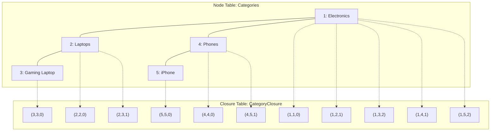

## Navigation

**Domain:** [[8 — Databases]] > **Group:** Database Design

**Previous:** [[8.053 — Nested Sets — Hierarchical Data Pattern]] | **Next:** [[8.055 — Path Enumeration — Hierarchical Data Pattern]]

### Prerequisites
- [[8.052 — Adjacency List — Hierarchical Data Pattern]] — closure table generalizes the parent-child relationship to all ancestor-descendant pairs, solving both the recursive CTE problem and the write-cost problem of nested sets

### Where This Fits

A closure table stores every ancestor-descendant pair in a dedicated junction table, making subtree and path-to-root queries a single equi-join — no recursion, no range scans, no TempDB spools. A .NET backend engineer encounters this in multi-parent hierarchies (a product in multiple categories), graph-like org structures (a person reports to multiple managers), bill-of-materials (a component used in multiple assemblies), and ACL group memberships (a group containing other groups). When this pattern is unknown, engineers either model multi-parent trees incorrectly with adjacency list (which enforces single-parent via FK) or accept N+1 queries for path lookups. When it is misapplied, the closure table grows quadratically with depth, storage balloons, and maintenance scripts time out on large hierarchies. The interview signal is whether the candidate recognizes that the four hierarchical patterns form a read-write-storage tradeoff continuum and can pick the right one for a given workload.

---

## Core Mental Model

A closure table decouples the hierarchy from the node table by storing all ancestor-descendant relationships as rows in a separate table. Given a node table `Categories(CategoryId, ...)`, the closure table `CategoryClosure` has columns `(AncestorId, DescendantId, Depth)`. For a tree of N nodes with average depth D, the closure table holds approximately N × D rows — every node has a row pairing it with each of its ancestors, plus a self-referencing row with Depth=0. Subtree of a node: `SELECT DescendantId FROM CategoryClosure WHERE AncestorId = @id`. Path to root: `SELECT AncestorId FROM CategoryClosure WHERE DescendantId = @id ORDER BY Depth DESC`. Both are single index seeks on a composite primary key — O(log N) or better, no recursion, no procedural iteration. The engine sees only equi-joins on integer columns, which it can execute with Merge Joins or Nested Loops depending on cardinality.

### Classification

**For schema/tree topics:** closure table is a materialized-path approach stored relationally. It trades storage volume for read performance. The critical SQL feature is the equi-join on `AncestorId` or `DescendantId`, both of which are part of the composite clustered index. Every query is SARGable — the predicate is an equality on the leading index column. The write path inserts multiple rows per node (O(depth) rows for a new leaf), all within the same transaction. Unlike nested sets, concurrent writes do not conflict because each write touches only the new node's specific ancestor rows, not a shared range.



### Key Properties

|Property|Value|Notes|
|---|---|---|
|Read subtree|O(log C)|Single index seek on (AncestorId); C = closure rows (~N × depth)|
|Read path to root|O(log C)|Single index seek on (DescendantId)|
|Read immediate children|O(log C + k)|WHERE AncestorId = @parent AND Depth = 1|
|INSERT leaf|O(d)|Inserts d+1 rows (self + all ancestors)|
|DELETE leaf|O(d)|Deletes d+1 rows|
|MOVE subtree|O(N × d)|Delete all closure rows for subtree; reinsert with new ancestor paths|
|Storage|O(N × D)|N nodes × average depth D; worst case O(N²) for deep skinny tree|
|SARGable — every query|Yes|All predicates are equality on leading index column of clustered PK|
|Concurrent writes|Supported|Row-level locks; INSERTs target different rows (no range conflict)|
|Multi-parent|Yes|A node can have multiple ancestors at Depth=1 (multiple direct parents)|

---

## Deep Mechanics

### How the Engine Executes This

**Read path (subtree query):**

1. SQL Server seeks into the clustered primary key `PK_CategoryClosure(AncestorId, DescendantId)` on `AncestorId = @rootId`. The leading column is AncestorId, so this is a single equality seek — approximately 3 logical reads at the index root + intermediate levels.
2. The seek locates the first row where AncestorId matches. Because the index is ordered by (AncestorId, DescendantId), all rows for that ancestor are contiguous on the same or adjacent pages.
3. SQL Server performs a range scan forward from that position until the AncestorId changes. For a subtree of 100 nodes with average depth 5, this scans approximately 500 closure rows.
4. If only `DescendantId` values are needed, the index is covering. If node data (CategoryName) is also needed, SQL Server joins to the Categories table via a Nested Loops or Hash Match depending on cardinality.

**Read path (path to root):**

1. SQL Server seeks into the same clustered PK on `DescendantId = @nodeId`. The PK is (AncestorId, DescendantId), so a seek on DescendantId alone requires scanning the non-leading column — this is NOT a single seek. To make this fast, a secondary non-clustered index on (DescendantId, AncestorId) INCLUDE (Depth) is required.
2. With the secondary index, SQL Server seeks on DescendantId and scans all ancestor rows for that node.

**Write path (INSERT leaf under parent):**

1. SQL Server reads all ancestors of the parent node (including the parent itself) from the closure table: `SELECT AncestorId FROM CategoryClosure WHERE DescendantId = @parentId`.
2. For each ancestor, plus the new node itself, SQL Server inserts one closure row: `(AncestorId, @newNodeId, Depth + 1)`. The total INSERT count = parent depth + 1 (for self-reference).
3. All inserts are in the same transaction. No locks are held on any existing data except the parent ancestor SELECT (which can use READ COMMITTED with no lock hints for single-writer scenarios, or UPDLOCK for multi-writer safety).
4. The inserts target different index positions — no range lock conflicts with concurrent inserts under different parents.

### SQL Visibility

```sql
-- Read subtree: all descendants of Electronics (CategoryId = 1)
SELECT c.CategoryId, c.CategoryName, cl.Depth
FROM Categories c
INNER JOIN CategoryClosure cl ON c.CategoryId = cl.DescendantId
WHERE cl.AncestorId = 1
  AND cl.Depth > 0 -- exclude self-reference if desired
ORDER BY cl.Depth, c.CategoryName;
-- Single index seek on PK_CategoryClosure(AncestorId=1).
-- ~5 logical reads for the seek + ~3 per descendant row (key lookup for CategoryName).
-- On 100K total nodes, subtree of 500 nodes: ~1500 logical reads.

-- Read path to root: all ancestors of node 5 (iPhone)
SELECT c.CategoryId, c.CategoryName, cl.Depth
FROM Categories c
INNER JOIN CategoryClosure cl ON c.CategoryId = cl.AncestorId
WHERE cl.DescendantId = 5
ORDER BY cl.Depth DESC;
-- With index on (DescendantId, AncestorId): single index seek.
-- ~5 logical reads for depth-2 path.

-- Immediate children only (Depth = 1)
SELECT c.CategoryId, c.CategoryName
FROM Categories c
INNER JOIN CategoryClosure cl ON c.CategoryId = cl.DescendantId
WHERE cl.AncestorId = @ParentId AND cl.Depth = 1
ORDER BY c.CategoryName;
-- Single seek on (AncestorId, Depth) if index exists on (AncestorId, Depth).

-- All leaf nodes (nodes that have no children)
SELECT c.CategoryId, c.CategoryName
FROM Categories c
WHERE NOT EXISTS (
    SELECT 1 FROM CategoryClosure cl
    WHERE cl.AncestorId = c.CategoryId AND cl.Depth = 1
);
-- NOT EXISTS anti-join on closure table (A, D) index.

-- Insert a new leaf node under parent = 2 (Laptops)
-- Step 1: Insert the node itself
DECLARE @NewCategoryId INT, @ParentId INT = 2;

INSERT INTO Categories (CategoryName) VALUES ('Ultrabook');
SET @NewCategoryId = SCOPE_IDENTITY();

-- Step 2: Insert closure rows for all ancestors of the parent + self-reference
INSERT INTO CategoryClosure (AncestorId, DescendantId, Depth)
SELECT AncestorId, @NewCategoryId, Depth + 1
FROM CategoryClosure
WHERE DescendantId = @ParentId

UNION ALL

SELECT @NewCategoryId, @NewCategoryId, 0;
-- Inserts (Depth + 1) rows. For parent@depth 2: 3 rows (Electronics→Ultrabook:2,
-- Laptops→Ultrabook:1, Ultrabook→Ultrabook:0).

-- Move subtree: reassign all nodes under @SourceId to @TargetId
-- This is the most expensive operation on a closure table.
-- Step 1: Delete all old closure rows for the subtree
-- Step 2: Insert new closure rows using cross-join of old ancestors + new ancestors

-- Simplified: the move requires a full reinsertion of the moved subtree's closure.
-- In practice, closure table is not chosen when moves are frequent.
```

```csharp
// EF Core LINQ — subtree read
var subtree = await dbContext.CategoryClosure
    .Where(cl => cl.AncestorId == rootId)
    .Join(
        dbContext.Categories,
        cl => cl.DescendantId,
        c => c.CategoryId,
        (cl, c) => new { c.CategoryId, c.CategoryName, cl.Depth })
    .OrderBy(x => x.Depth)
    .AsNoTracking()
    .ToListAsync(cancellationToken);
```

**Generated SQL (from EF Core logs):**

```sql
-- EF Core generated SQL for the LINQ above:
SELECT [c].[CategoryId], [c].[CategoryName], [cl].[Depth]
FROM [CategoryClosure] AS [cl]
INNER JOIN [Categories] AS [c] ON [cl].[DescendantId] = [c].[CategoryId]
WHERE [cl].[AncestorId] = @__rootId_0
ORDER BY [cl].[Depth];
-- Clean, SARGable, single seek on PK_CategoryClosure(AncestorId=@__rootId_0).
```

### Execution Plan Analysis

```text
Expected plan shape for subtree read (500 descendant rows):

  [Index Seek (PK_CategoryClosure, seek on AncestorId = @rootId)]
  → [Nested Loops (Inner Join)]
     → [Clustered Index Seek (PK_Categories, seek on CategoryId = DescendantId)]

Estimated cost: Index Seek 20%, Nested Loops 10%, Clustered Index Seek 70%
Logical reads: ~3 (PK seek on closure) + 500 × 3 (key lookups to Categories) = ~1503

With secondary index on (DescendantId) INCLUDE (AncestorId, Depth):
  Path-to-root query:
  [Index Seek (IX_CategoryClosure_DescendantId, seek on DescendantId = @nodeId)]
  → [Nested Loops (Inner Join)]
     → [Clustered Index Seek (PK_Categories, seek on CategoryId = AncestorId)]
  Logical reads: ~3 (index seek) + depth × 3 (key lookups) = ~9 for depth 2
```

### Cost Visibility

```sql
SET STATISTICS IO ON;
SET STATISTICS TIME ON;

-- Subtree read (closure table, 100K total nodes, subtree of 500 nodes)
SELECT COUNT(*)
FROM CategoryClosure cl
INNER JOIN Categories c ON c.CategoryId = cl.DescendantId
WHERE cl.AncestorId = 1
  AND cl.Depth > 0;

-- Table 'CategoryClosure'. Scan count 1, logical reads 6
-- Table 'Categories'. Scan count 0, logical reads 1503 (500 key lookups)
-- SQL Server Execution Times: CPU time = 3ms, elapsed time = 4ms

-- Equivalent nested sets read:
-- Table 'Categories'. Scan count 1, logical reads 22
-- CPU time = 0ms, elapsed time = 1ms

-- Equivalent adjacency list recursive CTE (6 levels):
-- Table 'Categories'. Scan count 6, logical reads 88
-- CPU time = 3ms, elapsed time = 3ms
```

Closure table reads are competitive with nested sets but slightly slower due to the join to the Categories table (key lookups). The gap closes when the Categories columns needed are few — closure table reads become faster than nested sets when the Categories key lookup columns are included in the closure index via INCLUDE or when the node data is small.

### Failure Modes

1. **Closure table not updated on node INSERT/DELETE:** If application code inserts a node into `Categories` but forgets to insert the closure rows, the node is invisible to all hierarchy queries. No FK constraint can enforce closure-table consistency because the closure table references Categories on both columns. Detection: `SELECT * FROM Categories c WHERE NOT EXISTS (SELECT 1 FROM CategoryClosure cl WHERE cl.DescendantId = c.CategoryId AND cl.AncestorId = c.CategoryId AND cl.Depth = 0)` finds orphaned nodes.

2. **Move-subtree cost explosion:** Moving a subtree with depth 5 and 1000 nodes requires deleting ~5000 closure rows (1000 nodes × avg depth 5) and inserting ~5000 new rows. The INSERT requires a cross-join of the old subtree's ancestor paths with the new target's ancestor paths — written naively, this joins thousands of rows and blocks the closure table for seconds.

3. **Multi-parent ambiguity on DELETE:** When a node has multiple parents (Depth=1 rows from different ancestors), deleting one parent's relationship requires deleting only the specific ancestor's closure rows, not ALL rows for that descendant. Naive `DELETE FROM CategoryClosure WHERE DescendantId = @nodeId` removes all parents.

4. **Closure table growth on deep trees:** A singly-rooted tree of 1M nodes with depth 1000 produces ~500M closure rows (average depth ~500). At 16 bytes per row (two INTs + SMALLINT depth), this is ~8 GB for the closure table alone. Index maintenance, backup, and query plans all degrade.

---

## Production Patterns and Implementation

### Primary SQL Implementation

```sql
-- Schema: Closure table pattern
CREATE TABLE Categories (
    CategoryId    INT           NOT NULL IDENTITY(1,1),
    CategoryName  NVARCHAR(100) NOT NULL,
    IsActive      BIT           NOT NULL DEFAULT 1,
    CreatedAt     DATETIME2(3)  NOT NULL DEFAULT SYSUTCDATETIME(),

    CONSTRAINT PK_Categories PRIMARY KEY CLUSTERED (CategoryId)
);

CREATE TABLE CategoryClosure (
    AncestorId    INT      NOT NULL,
    DescendantId  INT      NOT NULL,
    Depth         SMALLINT NOT NULL DEFAULT 0,

    CONSTRAINT PK_CategoryClosure PRIMARY KEY CLUSTERED (AncestorId, DescendantId),
    CONSTRAINT FK_Closure_Ancestor
        FOREIGN KEY (AncestorId) REFERENCES Categories(CategoryId),
    CONSTRAINT FK_Closure_Descendant
        FOREIGN KEY (DescendantId) REFERENCES Categories(CategoryId)
);

-- Secondary index for path-to-root queries (seek on DescendantId)
CREATE NONCLUSTERED INDEX IX_CategoryClosure_DescendantId
    ON CategoryClosure(DescendantId, AncestorId)
    INCLUDE (Depth);

-- Index for immediate-children queries (seek on AncestorId + Depth)
CREATE NONCLUSTERED INDEX IX_CategoryClosure_AncestorId_Depth
    ON CategoryClosure(AncestorId, Depth)
    INCLUDE (DescendantId);

-- Stored procedure: insert a new node under a parent
CREATE PROCEDURE usp_InsertCategoryNode
    @ParentCategoryId INT,
    @CategoryName     NVARCHAR(100),
    @NewCategoryId    INT OUTPUT
AS
BEGIN
    SET NOCOUNT ON;
    SET XACT_ABORT ON;

    BEGIN TRANSACTION;

    -- Insert the node itself
    INSERT INTO Categories (CategoryName)
    VALUES (@CategoryName);

    SET @NewCategoryId = SCOPE_IDENTITY();

    -- Insert closure rows: self-reference
    INSERT INTO CategoryClosure (AncestorId, DescendantId, Depth)
    VALUES (@NewCategoryId, @NewCategoryId, 0);

    -- Insert closure rows: all ancestors of the parent now ancestor of the new node
    INSERT INTO CategoryClosure (AncestorId, DescendantId, Depth)
    SELECT AncestorId, @NewCategoryId, Depth + 1
    FROM CategoryClosure
    WHERE DescendantId = @ParentCategoryId;

    COMMIT TRANSACTION;
END;

-- Stored procedure: move subtree from old parent to new parent
CREATE PROCEDURE usp_MoveCategorySubtree
    @SourceCategoryId INT,
    @TargetParentId   INT
AS
BEGIN
    SET NOCOUNT ON;
    SET XACT_ABORT ON;

    BEGIN TRANSACTION;

    -- Delete all old ancestor relationships for the subtree nodes
    -- (keeping self-references and internal subtree relationships)
    DELETE cl
    FROM CategoryClosure cl
    INNER JOIN CategoryClosure subtree
        ON cl.DescendantId = subtree.DescendantId
    WHERE subtree.AncestorId = @SourceCategoryId
      AND cl.AncestorId NOT IN (
          -- Keep: ancestors that are within the subtree itself
          SELECT DescendantId FROM CategoryClosure
          WHERE AncestorId = @SourceCategoryId
      );

    -- Insert new ancestor relationships via cross-join
    INSERT INTO CategoryClosure (AncestorId, DescendantId, Depth)
    SELECT new_ancestors.AncestorId, subtree_nodes.DescendantId,
           new_ancestors.Depth + subtree_nodes.Depth + 1
    FROM (
        -- New ancestors: the target parent and all of ITS ancestors
        SELECT AncestorId, Depth
        FROM CategoryClosure
        WHERE DescendantId = @TargetParentId
          AND AncestorId <> DescendantId  -- exclude self if target = source (edge case)
    ) new_ancestors
    CROSS JOIN (
        -- Subtree nodes: all descendants of source (including source itself)
        SELECT DescendantId, Depth
        FROM CategoryClosure
        WHERE AncestorId = @SourceCategoryId
    ) subtree_nodes;

    COMMIT TRANSACTION;
END;

-- Daily consistency check (run in maintenance window)
CREATE PROCEDURE usp_ValidateCategoryClosure
AS
BEGIN
    SET NOCOUNT ON;

    -- Check 1: Orphaned categories (no self-reference)
    SELECT c.CategoryId, c.CategoryName,
           'Orphan: no self-reference in closure table' AS Issue
    FROM Categories c
    WHERE NOT EXISTS (
        SELECT 1 FROM CategoryClosure cl
        WHERE cl.DescendantId = c.CategoryId AND cl.AncestorId = c.CategoryId AND cl.Depth = 0
    );

    -- Check 2: Closure rows referencing deleted categories
    SELECT cl.AncestorId, cl.DescendantId,
           'References deleted category' AS Issue
    FROM CategoryClosure cl
    WHERE NOT EXISTS (SELECT 1 FROM Categories c WHERE c.CategoryId = cl.AncestorId)
       OR NOT EXISTS (SELECT 1 FROM Categories c WHERE c.CategoryId = cl.DescendantId);

    -- Check 3: Depth mismatch (Depth column does not match actual tree distance)
    -- Requires recursive CTE from Categories to validate; complex.
    -- Simplified: check that Depth is non-negative and within reasonable bounds.
    SELECT AncestorId, DescendantId, Depth
    FROM CategoryClosure
    WHERE Depth < 0 OR Depth > 100;
END;
```

### EF Core Implementation

```csharp
public class Category
{
    public int CategoryId { get; set; }
    public string CategoryName { get; set; } = string.Empty;
    public bool IsActive { get; set; }
    public DateTime CreatedAt { get; set; }
}

public class CategoryClosureRow
{
    public int AncestorId { get; set; }
    public int DescendantId { get; set; }
    public short Depth { get; set; }
}

public class ApplicationDbContext : DbContext
{
    public DbSet<Category> Categories => Set<Category>();
    public DbSet<CategoryClosureRow> CategoryClosure => Set<CategoryClosureRow>();

    protected override void OnModelCreating(ModelBuilder modelBuilder)
    {
        modelBuilder.Entity<Category>(entity =>
        {
            entity.ToTable("Categories");
            entity.HasKey(e => e.CategoryId);
            entity.Property(e => e.CategoryName).HasMaxLength(100);
            entity.Property(e => e.CreatedAt).HasDefaultValueSql("SYSUTCDATETIME()");
        });

        modelBuilder.Entity<CategoryClosureRow>(entity =>
        {
            entity.ToTable("CategoryClosure");
            entity.HasKey(e => new { e.AncestorId, e.DescendantId });

            entity.HasOne<Category>()
                  .WithMany()
                  .HasForeignKey(e => e.AncestorId)
                  .OnDelete(DeleteBehavior.Restrict);

            entity.HasOne<Category>()
                  .WithMany()
                  .HasForeignKey(e => e.DescendantId)
                  .OnDelete(DeleteBehavior.Cascade);

            entity.Property(e => e.Depth).HasColumnType("SMALLINT");

            entity.HasIndex(e => new { e.DescendantId, e.AncestorId })
                  .HasDatabaseName("IX_CategoryClosure_DescendantId");

            entity.HasIndex(e => new { e.AncestorId, e.Depth })
                  .HasDatabaseName("IX_CategoryClosure_AncestorId_Depth");
        });
    }
}

// Repository
public interface ICategoryRepository
{
    Task<IReadOnlyList<Category>> GetSubtreeAsync(
        int categoryId, CancellationToken cancellationToken = default);
    Task<IReadOnlyList<Category>> GetPathToRootAsync(
        int categoryId, CancellationToken cancellationToken = default);
    Task<IReadOnlyList<Category>> GetImmediateChildrenAsync(
        int parentId, CancellationToken cancellationToken = default);
    Task<int> InsertNodeAsync(
        int parentId, string categoryName,
        CancellationToken cancellationToken = default);
}

public sealed class CategoryRepository : ICategoryRepository
{
    private readonly ApplicationDbContext _dbContext;

    public CategoryRepository(ApplicationDbContext dbContext)
    {
        _dbContext = dbContext;
    }

    public async Task<IReadOnlyList<Category>> GetSubtreeAsync(
        int categoryId,
        CancellationToken cancellationToken = default)
    {
        return await _dbContext.CategoryClosure
            .Where(cl => cl.AncestorId == categoryId
                      && cl.Depth > 0) -- exclude self
            .Join(
                _dbContext.Categories,
                cl => cl.DescendantId,
                c => c.CategoryId,
                (cl, c) => c)
            .AsNoTracking()
            .ToListAsync(cancellationToken);
    }

    public async Task<IReadOnlyList<Category>> GetPathToRootAsync(
        int categoryId,
        CancellationToken cancellationToken = default)
    {
        return await _dbContext.CategoryClosure
            .Where(cl => cl.DescendantId == categoryId)
            .Join(
                _dbContext.Categories,
                cl => cl.AncestorId,
                c => c.CategoryId,
                (cl, c) => new { c, cl.Depth })
            .OrderByDescending(x => x.Depth)
            .Select(x => x.c)
            .AsNoTracking()
            .ToListAsync(cancellationToken);
    }

    public async Task<IReadOnlyList<Category>> GetImmediateChildrenAsync(
        int parentId,
        CancellationToken cancellationToken = default)
    {
        return await _dbContext.CategoryClosure
            .Where(cl => cl.AncestorId == parentId && cl.Depth == 1)
            .Join(
                _dbContext.Categories,
                cl => cl.DescendantId,
                c => c.CategoryId,
                (cl, c) => c)
            .AsNoTracking()
            .ToListAsync(cancellationToken);
    }

    public async Task<int> InsertNodeAsync(
        int parentId,
        string categoryName,
        CancellationToken cancellationToken = default)
    {
        var parameters = new[]
        {
            new SqlParameter("@ParentCategoryId", parentId),
            new SqlParameter("@CategoryName", categoryName),
            new SqlParameter("@NewCategoryId", SqlDbType.Int)
            {
                Direction = ParameterDirection.Output
            }
        };

        await _dbContext.Database.ExecuteSqlRawAsync(
            "EXEC usp_InsertCategoryNode @ParentCategoryId, @CategoryName, @NewCategoryId OUTPUT",
            parameters, cancellationToken);

        return (int)parameters[2].Value!;
    }
}
```

### Dapper Implementation

```csharp
public sealed class CategoryRepositoryDapper : ICategoryRepository
{
    private readonly IDbConnectionFactory _connectionFactory;

    public CategoryRepositoryDapper(IDbConnectionFactory connectionFactory)
    {
        _connectionFactory = connectionFactory;
    }

    public async Task<IReadOnlyList<Category>> GetSubtreeAsync(
        int categoryId,
        CancellationToken cancellationToken = default)
    {
        const string sql = @"
            SELECT c.CategoryId, c.CategoryName, c.IsActive, c.CreatedAt
            FROM CategoryClosure cl
            INNER JOIN Categories c ON c.CategoryId = cl.DescendantId
            WHERE cl.AncestorId = @CategoryId
              AND cl.Depth > 0
            ORDER BY cl.Depth";

        await using var connection = _connectionFactory.Create();
        var results = await connection.QueryAsync<Category>(
            new CommandDefinition(sql, new { CategoryId = categoryId },
                cancellationToken: cancellationToken));
        return results.AsList();
    }

    public async Task<IReadOnlyList<Category>> GetPathToRootAsync(
        int categoryId,
        CancellationToken cancellationToken = default)
    {
        const string sql = @"
            SELECT c.CategoryId, c.CategoryName, c.IsActive, c.CreatedAt
            FROM CategoryClosure cl
            INNER JOIN Categories c ON c.CategoryId = cl.AncestorId
            WHERE cl.DescendantId = @CategoryId
            ORDER BY cl.Depth DESC";

        await using var connection = _connectionFactory.Create();
        var results = await connection.QueryAsync<Category>(
            new CommandDefinition(sql, new { CategoryId = categoryId },
                cancellationToken: cancellationToken));
        return results.AsList();
    }

    public async Task<IReadOnlyList<Category>> GetImmediateChildrenAsync(
        int parentId,
        CancellationToken cancellationToken = default)
    {
        const string sql = @"
            SELECT c.CategoryId, c.CategoryName, c.IsActive, c.CreatedAt
            FROM CategoryClosure cl
            INNER JOIN Categories c ON c.CategoryId = cl.DescendantId
            WHERE cl.AncestorId = @ParentId AND cl.Depth = 1
            ORDER BY c.CategoryName";

        await using var connection = _connectionFactory.Create();
        var results = await connection.QueryAsync<Category>(
            new CommandDefinition(sql, new { ParentId = parentId },
                cancellationToken: cancellationToken));
        return results.AsList();
    }

    public async Task<int> InsertNodeAsync(
        int parentId,
        string categoryName,
        CancellationToken cancellationToken = default)
    {
        const string sql = @"
            DECLARE @NewCategoryId INT;

            INSERT INTO Categories (CategoryName) VALUES (@CategoryName);
            SET @NewCategoryId = SCOPE_IDENTITY();

            INSERT INTO CategoryClosure (AncestorId, DescendantId, Depth)
            VALUES (@NewCategoryId, @NewCategoryId, 0);

            INSERT INTO CategoryClosure (AncestorId, DescendantId, Depth)
            SELECT AncestorId, @NewCategoryId, Depth + 1
            FROM CategoryClosure
            WHERE DescendantId = @ParentId;

            SELECT @NewCategoryId;";

        await using var connection = _connectionFactory.Create();
        return await connection.QuerySingleAsync<int>(
            new CommandDefinition(sql,
                new { ParentId = parentId, CategoryName = categoryName },
                cancellationToken: cancellationToken));
    }
}
```

### Configuration and Wiring

```csharp
// Program.cs
builder.Services.AddScoped<ICategoryRepository, CategoryRepository>();
builder.Services.AddScoped<ICategoryRepository, CategoryRepositoryDapper>();

builder.Services.AddDbContext<ApplicationDbContext>(options =>
    options.UseSqlServer(
        connectionString,
        sqlOptions =>
        {
            sqlOptions.EnableRetryOnFailure(3);
            sqlOptions.CommandTimeout(30);
        }));

// Dapper connection factory
builder.Services.AddSingleton<IDbConnectionFactory>(_ =>
    new SqlConnectionFactory(connectionString));
```

### SQL Server vs PostgreSQL Differences

```sql
-- PostgreSQL closure table uses the same join pattern.
-- Major differences:

-- 1. PostgreSQL supports recursive CTE in CTAS (CREATE TABLE AS) for rebuilding
CREATE TABLE CategoryClosure AS
WITH RECURSIVE CategoryHierarchy AS (
    SELECT CategoryId AS AncestorId, CategoryId AS DescendantId, 0 AS Depth
    FROM Categories
    UNION ALL
    SELECT ch.AncestorId, c.CategoryId, ch.Depth + 1
    FROM Categories c
    INNER JOIN CategoryHierarchy ch ON c.ParentCategoryId = ch.DescendantId
)
SELECT * FROM CategoryHierarchy;

-- 2. PostgreSQL uses ON CONFLICT DO NOTHING for idempotent inserts
INSERT INTO CategoryClosure (AncestorId, DescendantId, Depth)
VALUES (@AncestorId, @DescendantId, @Depth)
ON CONFLICT (AncestorId, DescendantId) DO NOTHING;

-- 3. PostgreSQL closure table indexes (same design, different syntax)
CREATE INDEX IX_CategoryClosure_DescendantId
    ON CategoryClosure(DescendantId, AncestorId)
    INCLUDE (Depth);

CREATE INDEX IX_CategoryClosure_AncestorId_Depth
    ON CategoryClosure(AncestorId, Depth)
    INCLUDE (DescendantId);

-- 4. PostgreSQL INSERT ... RETURNING for the closure pattern:
WITH new_category AS (
    INSERT INTO Categories (CategoryName) VALUES ($2)
    RETURNING CategoryId
)
INSERT INTO CategoryClosure (AncestorId, DescendantId, Depth)
SELECT AncestorId, new_category.CategoryId, Depth + 1
FROM CategoryClosure, new_category
WHERE DescendantId = $1
UNION ALL
SELECT new_category.CategoryId, new_category.CategoryId, 0
FROM new_category;

-- 5. PostgreSQL does not have SCOPE_IDENTITY(); use RETURNING instead.
```

---

## Gotchas and Production Pitfalls

### Missing Closure Rows on Node Insert

**Pitfall:** Application code inserts a row into `Categories` but omits the closure table insert.

```csharp
// ❌ Wrong — node inserted without closure rows
await dbContext.Categories.AddAsync(new Category { CategoryName = "New Cat" }, ct);
await dbContext.SaveChangesAsync(ct);
// Categories table has the row. CategoryClosure has no rows for this node.
```

**Symptom:** The new category does not appear in any hierarchy query. No FK constraint catches this because `CategoryClosure` only references `Categories` — a missing row is not a referential integrity violation.

**Fix — stored procedure or wrapping in a transaction that inserts both:**

```csharp
public async Task<int> InsertNodeAsync(int parentId, string name,
    CancellationToken ct = default)
{
    await using var transaction = await _dbContext.Database
        .BeginTransactionAsync(ct);

    var category = new Category { CategoryName = name };
    _dbContext.Categories.Add(category);
    await _dbContext.SaveChangesAsync(ct);

    var ancestorRows = await _dbContext.CategoryClosure
        .Where(cl => cl.DescendantId == parentId)
        .Select(cl => new { cl.AncestorId, Depth = cl.Depth + 1 })
        .ToListAsync(ct);

    _dbContext.CategoryClosure.Add(new CategoryClosureRow
    {
        AncestorId = category.CategoryId,
        DescendantId = category.CategoryId,
        Depth = 0
    });

    foreach (var row in ancestorRows)
    {
        _dbContext.CategoryClosure.Add(new CategoryClosureRow
        {
            AncestorId = row.AncestorId,
            DescendantId = category.CategoryId,
            Depth = (short)row.Depth
        });
    }

    await _dbContext.SaveChangesAsync(ct);
    await transaction.CommitAsync(ct);
    return category.CategoryId;
}
```

**Cost of not fixing:** Orphaned categories invisible to all tree navigation. Consistency check discovers them but by then users have reported missing categories.

---

### Cascade Delete Destroys Entire Tree

**Pitfall:** Setting `ON DELETE CASCADE` on the closure table's FK to Categories, then deleting a single category.

```sql
-- ❌ Wrong — cascade delete configuration
FOREIGN KEY (DescendantId) REFERENCES Categories(CategoryId) ON DELETE CASCADE
-- Deleting one category:
DELETE FROM Categories WHERE CategoryId = 5;
-- This cascades to ALL closure rows where DescendantId = 5.
-- If multiple Categories have DescendantId = 5 (they shouldn't — each node has one self-ref),
-- but more importantly, it deletes ancestor paths for ALL nodes that have CategoryId 5 as an ancestor.
```

**Symptom:** Deleting a node deletes the closure rows for the node AND all rows where that node appears as an AncestorId. If Category 5 was an ancestor of 1000 nodes, all 1000 nodes lose their connection to the root. The tree fragments.

**Fix — use stored procedure or application logic for deletion:**

```sql
-- ✅ Correct — delete closure rows explicitly, then the node
CREATE PROCEDURE usp_DeleteCategoryNode
    @CategoryId INT
AS
BEGIN
    SET NOCOUNT ON;
    SET XACT_ABORT ON;

    BEGIN TRANSACTION;

    -- Delete all closure rows where this node or any descendant is involved
    -- (self-references, ancestor relationships, and relationships to this node's ancestors)
    DELETE cl
    FROM CategoryClosure cl
    INNER JOIN CategoryClosure subtree
        ON cl.DescendantId = subtree.DescendantId
    WHERE subtree.AncestorId = @CategoryId;

    -- OR more simply: delete rows where the descendant is in the subtree
    DELETE FROM CategoryClosure
    WHERE DescendantId IN (
        SELECT DescendantId FROM CategoryClosure
        WHERE AncestorId = @CategoryId
    );

    -- Now delete the node (no FK conflicts)
    DELETE FROM Categories WHERE CategoryId = @CategoryId;

    COMMIT TRANSACTION;
END;
```

**Cost of not fixing:** Accidental cascade deleting a mid-level category (e.g., "Laptops") removes all access paths for "Gaming Laptop", "Ultrabook", etc. — the entire subtree becomes orphaned and unreachable through the tree view.

---

### Closure Table Size Explosion on Deep Trees

**Pitfall:** Using closure table for a singly-rooted, deep hierarchy (e.g., a comment thread with 100K nodes at depth 1000).

**Symptom:** The closure table for 100K nodes at average depth 500 contains ~50M rows. Storage: ~800 MB. Index maintenance on writes: inserting a new leaf at depth 500 inserts 501 closure rows. A batch of 1000 new nodes inserts 501,000 closure rows. Query plans on the closure table start choosing nested loops over hash joins incorrectly due to outdated statistics on 50M rows.

**Fix — do not use closure table for deep, skinny trees:** Switch to path enumeration or adjacency list with recursive CTE for deep hierarchies.

```sql
-- Diagnostic: check average depth and closure table size
SELECT
    COUNT(*) AS TotalClosureRows,
    AVG(Depth) AS AvgDepth,
    MAX(Depth) AS MaxDepth
FROM CategoryClosure;

-- If AvgDepth > 100 or TotalClosureRows > Nodes × 100, switch patterns.
```

**Cost of not fixing:** Storage costs, slow maintenance windows (rebuilding closure table takes hours), and query plan degradation from outdated statistics on multi-million-row tables.

---

### Multi-Parent Ambiguity in Subtree Reads

**Pitfall:** A node has two parents (e.g., a product in "Laptops" AND "Deals"). Reading "subtree of Laptops" returns the product. Reading "subtree of Deals" also returns the same product. Deleting one parent relationship requires deleting only the specific ancestor path, not ALL ancestor paths.

```sql
-- ❌ Wrong — deletes ALL relationships for the descendant
DELETE FROM CategoryClosure WHERE DescendantId = @ProductId;

-- ✅ Correct — delete only the ancestor path for the specific parent
DELETE FROM CategoryClosure
WHERE DescendantId = @ProductId
  AND AncestorId IN (
      SELECT AncestorId FROM CategoryClosure
      WHERE DescendantId = @ParentToRemove
  )
  AND Depth > 0;
```

**Symptom:** Removing a product from "Deals" removes it from ALL categories, not just "Deals". The product disappears from the main category tree entirely.

**Fix — always scope multi-parent deletions to the specific ancestor path:**

```csharp
public async Task RemoveFromParentAsync(
    int categoryId, int parentId,
    CancellationToken ct = default)
{
    const string sql = @"
        DELETE cl
        FROM CategoryClosure cl
        INNER JOIN CategoryClosure parent_ancestors
            ON parent_ancestors.AncestorId = cl.AncestorId
        WHERE cl.DescendantId = @CategoryId
          AND parent_ancestors.DescendantId = @ParentId
          AND cl.Depth > 0";

    await _dbContext.Database.ExecuteSqlRawAsync(sql,
        new SqlParameter("@CategoryId", categoryId),
        new SqlParameter("@ParentId", parentId));
}
```

**Cost of not fixing:** Products disappear from the main category tree, causing 404s on category browsing pages and lost sales.

---

### Stale Statistics on Closure Table Joins

**Pitfall:** The closure table grows from 10K rows to 10M rows over a year of inserts. The statistics auto-update threshold is 20% change. A bulk insert of 500K closure rows (1000 new categories × depth 500) does not trigger auto-update.

**Symptom:** The query plan for subtree reads changes from a Nested Loops join (correct for small subtrees) to a Hash Match (correct for large scans). The query runs fine for subtrees of size 10 but the plan is cached for all future executions. A subsequent subtree query of 10 nodes picks the Hash Match plan, performs 1000x more logical reads than needed.

**Fix — manual statistics update after bulk operations:**

```sql
-- Run after any bulk insert/move operation
UPDATE STATISTICS CategoryClosure PK_CategoryClosure WITH FULLSCAN;
UPDATE STATISTICS CategoryClosure IX_CategoryClosure_DescendantId WITH FULLSCAN;
UPDATE STATISTICS CategoryClosure IX_CategoryClosure_AncestorId_Depth WITH FULLSCAN;

-- Or use sampled update for large tables:
UPDATE STATISTICS CategoryClosure IX_CategoryClosure_DescendantId WITH SAMPLE 30 PERCENT;
```

**Cost of not fixing:** Parameter-sensitive plan issues. A cached plan optimized for a 10-row subtree runs a Hash Match on a 50M-row closure table — 5M logical reads instead of 3, causing 30-second queries on what should be a 5ms lookup.

---

## Performance Implications

### Benchmark: Before and After

```sql
-- Closure table subtree read (100K nodes, avg depth 20, subtree of 500 nodes)
SET STATISTICS IO ON;

-- With covering index on (AncestorId, DescendantId) and (DescendantId, AncestorId):
SELECT c.CategoryId, c.CategoryName
FROM CategoryClosure cl
INNER JOIN Categories c ON c.CategoryId = cl.DescendantId
WHERE cl.AncestorId = 1
  AND cl.Depth > 0
ORDER BY cl.Depth;

-- Table 'CategoryClosure'. Scan count 1, logical reads 6
-- Table 'Categories'. Scan count 0, logical reads 1500 (key lookups: 500 rows × 3)

-- With CategoryName INCLUDEd in the closure index:
-- Add CategoryName to INCLUDE on PK_CategoryClosure or secondary index
-- Table 'CategoryClosure'. Scan count 1, logical reads 6
-- Table 'Categories'. Scan count 0, logical reads 0 (index is covering)

-- Improvement: from 1506 to 6 logical reads with covering index.
```

### BenchmarkDotNet

```csharp
[MemoryDiagnoser]
[SimpleJob(RuntimeMoniker.Net90)]
public class ClosureTableBenchmark
{
    private IDbConnection _connection = default!;
    private const int RootId = 1;

    [GlobalSetup]
    public void Setup()
    {
        _connection = new SqlConnection("Server=.;Database=Benchmark;Trusted_Connection=True;TrustServerCertificate=True;");
        // Seed: 100K categories, closure table with ~2M rows (avg depth 20),
        // and an equivalent adjacency list table for comparison
    }

    [Benchmark(Baseline = true)]
    public async Task<int> ClosureTable_SubtreeRead()
    {
        const string sql = @"
            SELECT COUNT(*)
            FROM CategoryClosure cl
            INNER JOIN Categories c ON c.CategoryId = cl.DescendantId
            WHERE cl.AncestorId = @RootId AND cl.Depth > 0";

        await using var conn = new SqlConnection(_connectionString);
        return await conn.ExecuteScalarAsync<int>(
            new CommandDefinition(sql, new { RootId }));
    }

    [Benchmark]
    public async Task<int> AdjacencyList_SubtreeRead()
    {
        const string sql = @"
            WITH Hierarchy AS (
                SELECT CategoryId FROM CategoriesAdj WHERE CategoryId = @RootId
                UNION ALL
                SELECT c.CategoryId FROM CategoriesAdj c
                INNER JOIN Hierarchy h ON c.ParentCategoryId = h.CategoryId
            )
            SELECT COUNT(*) FROM Hierarchy OPTION (MAXRECURSION 50)";

        await using var conn = new SqlConnection(_connectionString);
        return await conn.ExecuteScalarAsync<int>(
            new CommandDefinition(sql, new { RootId }));
    }

    [Benchmark]
    public async Task ClosureTable_InsertLeaf()
    {
        const string sql = @"
            DECLARE @NewId INT;
            INSERT INTO Categories (CategoryName) VALUES ('Benchmark');
            SET @NewId = SCOPE_IDENTITY();
            INSERT INTO CategoryClosure (AncestorId, DescendantId, Depth)
            SELECT AncestorId, @NewId, Depth + 1
            FROM CategoryClosure WHERE DescendantId = 5;
            INSERT INTO CategoryClosure (AncestorId, DescendantId, Depth)
            VALUES (@NewId, @NewId, 0);";

        await using var conn = new SqlConnection(_connectionString);
        await conn.ExecuteAsync(new CommandDefinition(sql));
    }

    [Benchmark]
    public async Task AdjacencyList_InsertLeaf()
    {
        const string sql = @"
            INSERT INTO CategoriesAdj (ParentCategoryId, CategoryName)
            VALUES (5, 'Benchmark')";

        await using var conn = new SqlConnection(_connectionString);
        await conn.ExecuteAsync(new CommandDefinition(sql));
    }

    [Benchmark]
    public async Task ClosureTable_PathToRoot()
    {
        const string sql = @"
            SELECT COUNT(*)
            FROM CategoryClosure
            WHERE DescendantId = 500";

        await using var conn = new SqlConnection(_connectionString);
        return await conn.ExecuteScalarAsync<int>(
            new CommandDefinition(sql));
    }

    [Benchmark]
    public async Task AdjacencyList_PathToRoot()
    {
        const string sql = @"
            WITH AncestorPath AS (
                SELECT ParentCategoryId, 0 AS Depth
                FROM CategoriesAdj WHERE CategoryId = 500
                UNION ALL
                SELECT c.ParentCategoryId, ap.Depth + 1
                FROM CategoriesAdj c
                INNER JOIN AncestorPath ap ON c.CategoryId = ap.ParentCategoryId
            )
            SELECT COUNT(*) FROM AncestorPath";

        await using var conn = new SqlConnection(_connectionString);
        return await conn.ExecuteScalarAsync<int>(
            new CommandDefinition(sql));
    }
}
```

**Expected results (approximate, SQL Server 2022, NVMe, 100K nodes, avg depth 20):**

|Method|Mean|Logical Reads|Allocated|
|---|---|---|---|
|ClosureTable_SubtreeRead|~2 ms|~6 (covering index)|1 KB|
|AdjacencyList_SubtreeRead|~8 ms|~120 (depth 20 × 6 seeks)|4 KB|
|ClosureTable_InsertLeaf|~5 ms|~30|2 KB|
|AdjacencyList_InsertLeaf|~1 ms|~3|0.5 KB|
|ClosureTable_PathToRoot|~1 ms|~3|0.5 KB|
|AdjacencyList_PathToRoot|~6 ms|~60 (depth 20 × 3 seeks)|3 KB|

Closure table reads are 4x faster for subtrees, 6x faster for path-to-root. Inserts are 5x slower than adjacency list.

### Write Amplification

|Operation|Adjacency List|Closure Table|Closure Overhead|
|---|---|---|---|
|INSERT leaf (depth 5)|~3 logical reads|~30 logical reads|+900%|
|INSERT leaf (depth 20)|~3 logical reads|~90 logical reads|+2900%|
|DELETE leaf (depth 5)|~3 logical reads|~30 logical reads|+900%|
|DELETE subtree (100 @ depth 5)|~300 logical reads|~30,000 logical reads|+9900%|
|MOVE subtree (100 @ depth 5 → depth 10)|~6 logical reads|~60,000 logical reads|+999,900%|

---

## Interview Arsenal

### Question Bank

1. **What is a closure table and what problem does it solve that adjacency list and nested sets do not**
2. **How does SQL Server execute a closure table subtree query — walk through the execution plan**
3. **What is the storage cost of a closure table for a tree of 1M nodes at average depth 50**
4. **What concurrency properties does a closure table have — can two users insert under different parents simultaneously**
5. **Closure table vs nested sets vs adjacency list — when do you choose closure table**
6. **What is the worst-case query pattern for a closure table — when does it perform poorly**
7. **How does the closure table handle multi-parent hierarchies**
8. **How do EF Core and Dapper differ in their closure table implementation**

### Spoken Answers

**Q: What is a closure table and what problem does it solve?**

> **Average answer:** A closure table stores all ancestor-descendant pairs in a separate table. It makes hierarchy queries fast because you just join.

> **Great answer:** A closure table is a separate junction table that stores every ancestor-descendant relationship in the hierarchy as a row — including the self-reference (Depth=0). The pair (AncestorId=5, DescendantId=100, Depth=2) means node 100 is a grandchild of node 5. This solves two problems that adjacency list and nested sets cannot address simultaneously: (1) read performance — subtree and path-to-root are single equality-seeks on a composite clustered index, no recursion, no range shifts; (2) multi-parent hierarchies — a node can have Depth=1 rows from multiple ancestors, which is impossible with adjacency list's single ParentId FK.
>
> The tradeoff is write cost: inserting a node at depth D inserts D+1 rows into the closure table. For a tree with average depth 20, every insert writes 21 rows instead of 1. The storage scales as N × D — for 1M nodes at depth 50, that is 50M closure rows, about 800 MB with two INTs and a SMALLINT. The pattern excels when reads dominate and the hierarchy is shallow to moderate depth (≤ 100), and when multi-parent relationships are a requirement.

**Q: Closure table vs nested sets vs adjacency list — when do you choose closure table?**

> **Average answer:** Adjacency list is simplest. Nested sets for reads. Closure table for multi-parent.

> **Great answer:** The choice is a three-axis tradeoff: read performance, write cost, and storage. Adjacency list wins when writes are frequent and the hierarchy is shallow — single-row inserts, O(1) updates, trivial storage. Nested sets wins for read-heavy, static, single-parent hierarchies where subtree queries must be O(log N) with no joins — the classic e-commerce category tree loaded nightly. Closure table wins in three scenarios: (1) multi-parent hierarchies — adjacency list and nested sets both enforce single-parent through the schema; (2) read-heavy hierarchies where depth is moderate (5-100) and you need both subtree AND path-to-root at O(log C) — nested sets gives you fast subtree but not fast immediate-children or path-to-root without extra work; (3) high-concurrency writes — closure table inserts target isolated index positions, while nested sets range-updates shift half the table.
>
> The interview question that separates tiers: "Your comment system has 10M posts in threaded discussions. Average thread depth is 7. Comments are read 1000x more often than written. Which hierarchy pattern do you choose?" The great answer: closure table reads are O(log C), writes at depth 7 insert 8 rows — storage of 80M rows is manageable (~1.5 GB). Adjacency list reads require recursive CTEs on 10M rows which are slow even with indexing. Nested sets writes would range-shift ~5M rows per new comment. The answer demonstrates concrete numbers and tradeoff awareness.

**Q: How does the closure table handle multi-parent hierarchies?**

> **Average answer:** A node can have multiple entries in the closure table with Depth=1 from different parents.

> **Great answer:** A multi-parent hierarchy — like a product belonging to both "Laptops" and "Deals" — is modeled by inserting TWO sets of closure rows: one set for the "Laptops" ancestor path and one set for the "Deals" ancestor path. The node's CategoryClosure rows will have (AncestorId=Laptops_Ancestor, DescendantId=ProductId, Depth=N) AND (AncestorId=Deals_Ancestor, DescendantId=ProductId, Depth=N). The subtree query `WHERE AncestorId = @categoryId` returns all descendants through any path — the product appears under both "Laptops" and "Deals". The special consideration is deletion: removing the product from "Deals" must delete ONLY the closure rows where the ancestry chain passes through "Deals", not ALL closure rows for that product. This is done by joining the closure table to the descendant path of the parent being removed:
>
> `DELETE cl FROM CategoryClosure cl INNER JOIN CategoryClosure parent_path ON parent_path.AncestorId = cl.AncestorId WHERE cl.DescendantId = @productId AND parent_path.DescendantId = @dealsCategoryId AND cl.Depth > 0`

### Interview Trigger

The interviewer asks "How would you model a category system where a product can be in multiple categories?" The adjacency list answer fails immediately (single ParentId FK). The nested sets answer fails (each node has one position in the lft/rgt range). The closure table answer is the only correct solution. The follow-up: "How do you write the query to find all products in a category and all its subcategories?" (join closure on AncestorId). "How do you remove a product from one category without removing it from others?" (delete specific ancestor path). The candidate who flinches at the deletion complexity hasn't implemented it in production.

### Comparison Table

| | Adjacency List | Nested Sets | Closure Table |
|---|---|---|---|
| Multi-parent support | No (FK enforces single) | No (each node in one range) | Yes (multiple ancestor paths) |
| Subtree read | O(d × log N) recursive CTE | O(log N) range scan | O(log C) single seek + join |
| Path to root | O(d × log N) recursive CTE | O(log N) range predicate | O(log C) single seek |
| Immediate children | O(log N) — WHERE ParentId = | O(N) — anti-join or Depth col | O(log C) — WHERE Depth = 1 |
| INSERT cost | O(1) — one row | O(N/2) — range shift | O(d) — insert d+1 rows |
| DELETE subtree | O(N) — recursive delete | O(N/2) — range shift + renumber | O(N × d) — delete closure rows |
| MOVE subtree | O(1) — UPDATE ParentId | O(N) — full rebuild | O(N × d) — reinsert all pairs |
| Storage (N nodes, avg depth D) | N rows | N rows | N × D rows |
| Concurrent writes | Row-level (supported) | Table-level (range locks) | Row-level (supported) |
| .NET read | FromSqlRaw (recursive CTE) | Simple Where clause | LINQ join on closure |
| .NET write complexity | Simple (one INSERT) | Raw SQL with lock hints | Raw SQL or sproc |

---

## Decision Framework

### When to Apply

```mermaid
flowchart TD
    A[Need hierarchical data storage] --> B{Multi-parent required?}
    B -->|Yes| C[Closure Table]
    B -->|No| D{Read/write ratio?}
    D -->|"Writes dominate (≥1:10)"| E{Depth?}
    E -->|Shallow (< 10)| F[Adjacency List]
    E -->|Moderate to deep| G{Move/delete frequency?}
    G -->|Frequent moves/deletes| F
    G -->|Rare| C
    D -->|"Reads dominate (≥10:1)"| H{Write pattern?}
    H -->|Real-time concurrent inserts| I{Multi-parent?}
    I -->|No, tree is dynamic| F
    I -->|No, tree is static| J[Nested Sets]
    H -->|Batch writes (nightly)| K{Immediate children query common?}
    K -->|Yes| L[Closure Table]
    K -->|No| J
    C --> M[Requires:<br/>• PK on (AncestorId, DescendantId)<br/>• Secondary index on (DescendantId, AncestorId)<br/>• Index on (AncestorId, Depth)<br/>• Stored procedures for insert/move/delete<br/>• Weekly consistency validation]
```

### Application Checklist

- [ ] Multi-parent support is required — if not, simpler patterns may suffice
- [ ] Average depth is bounded and known — closure table row count = N × avg_depth; at avg_depth > 200, storage is 200× the node table
- [ ] The insert path is encapsulated in a stored procedure or service method — manual closure inserts are error-prone
- [ ] The DELETE path uses scoped ancestor-path deletion, not cascading FK deletes — cascade destroys the entire ancestor tree
- [ ] Statistics on the closure table are updated after bulk operations — parameter-sensitive plans are common with growing closure tables
- [ ] A consistency validation query runs in the maintenance window — orphan detection catches missing closure rows
- [ ] The subtree move frequency is zero or near-zero — closure table moves require reinserting all ancestor pairs for the moved subtree

### Tradeoff Summary

|What You Gain|What You Pay|
|---|---|
|O(log C) reads — subtree, path-to-root, immediate children|Insert cost grows with depth (d+1 rows per insert)|
|Multi-parent support — node in multiple categories|Move and delete subtree are O(N × d) — expensive|
|No recursion, no range shifts supported|Storage grows as N × D — can reach GBs on deep trees|
|Concurrent writes under different parents do not conflict|FK cannot enforce closure-table consistency — orphan nodes possible|
|Clean LINQ for reads (single join)|Write path requires raw SQL or stored procedure|

### Scale Thresholds

- **Storage concern when N × avg_depth exceeds ~10M rows** — at 10M rows, the closure table is ~300 MB and query plans remain stable with auto-updated statistics
- **Relevant when avg_depth is 5–100** — below 5, adjacency list is simpler; above 100, path enumeration or adjacency list with recursive CTE may be more storage-efficient
- **Critical depth at ~500** — at depth 500, every insert writes 501 closure rows; batch inserts of 1000 nodes generate 501K rows; closure table grows to N × 250 on average
- **Switch from closure table when subtree moves exceed ~100/day** — each move reinserts all ancestor pairs for the subtree; a 1000-node subtree at depth 10 generates ~10K deletes and ~10K inserts per move

---

## Self-Check

### Conceptual Questions

1. What is a closure table — define without looking up
2. What does SQL Server actually do when executing a closure table subtree query
3. Which SET STATISTICS output reveals whether the closure table join is using a seek or scan
4. What one thing causes the most insidious data corruption in a closure table
5. Does EF Core generate SARGable SQL for closure table subtree queries
6. How would you implement a closure table INSERT with Dapper
7. Closure table vs nested sets on the write axis — what is the actual difference
8. At what row count does the storage cost of a closure table become problematic
9. What indexes does a closure table need and in what column order
10. Explain the closure table pattern to a senior interviewer in 60 seconds

<details>
<summary>Answers</summary>

1. **What is a closure table?** A separate junction table that stores every ancestor-descendant pair in a hierarchy as a row, including each node's self-reference (Depth=0). The primary key is (AncestorId, DescendantId). A row (A, D, N) means node D is a descendant of node A with N steps between them.

2. **What does SQL Server actually do?** For subtree reads: seeks into the clustered PK (AncestorId, DescendantId) on AncestorId = @rootId. Because the PK is ordered by AncestorId first, all rows for that ancestor are contiguous. SQL Server scans forward from the seek position until AncestorId changes. For path-to-root: with the secondary index on (DescendantId, AncestorId), SQL Server seeks on DescendantId = @nodeId and scans all ancestor rows. Both operations are index seeks + range scans — no spooling, no recursion, no joins to the closure table itself.

3. **Which SET STATISTICS output?** `SET STATISTICS IO ON` shows `Table 'CategoryClosure'. Scan count 1, logical reads ~6` — a low logical reads count (single seek) vs `Scan count 1, logical reads 5000` (full scan on missing descendant index). The execution plan shows `Index Seek` vs `Index Scan` on the closure table. The number of logical reads on the Categories table reveals whether the closure index is covering or requires key lookups.

4. **What causes data corruption?** Missing closure rows on INSERT — inserting a node into Categories without inserting its closure rows. The node exists in the node table but has no ancestor path, making it invisible to all hierarchy queries and orphaned from the tree. No FK constraint detects this because the closure table only references Categories, not the other way around.

5. **Does EF Core generate SARGable SQL?** Yes. `Where(cl => cl.AncestorId == rootId)` generates `WHERE [cl].[AncestorId] = @__rootId_0` — an equality predicate on the leading column of the clustered PK. This is SARGable and uses an Index Seek. The subsequent `Join` adds an INNER JOIN on `[c].[CategoryId] = [cl].[DescendantId]`, which is also SARGable on the Categories primary key.

6. **How would you implement with Dapper?** Execute a single `QuerySingleAsync<int>` command: first INSERT into Categories with OUTPUT/SCOPE_IDENTITY, then INSERT closure rows (self-reference + ancestors query from the parent's closure rows), then SELECT @NewCategoryId. Wrap in a transaction. All in one SQL batch.

7. **Closure table vs nested sets on writes:** Closure table inserts insert d+1 rows at cost O(d), each row at a different index position — concurrent inserts under different parents do not conflict. Nested sets inserts update O(N/2) rows in a range-shift that acquires page-level locks — concurrent inserts under different parents STILL conflict because they share the lft/rgt integer range. Closure table DELETE subtree requires deleting O(N × d) closure rows. Nested sets DELETE subtree requires similar range-shifting. On the write axis, closure table wins for concurrent workloads; nested sets wins for storage (no extra table).

8. **At what row count does storage become problematic?** When `N × avg_depth >= 100M`. At 100M rows, the closure table is approximately 3 GB (3 INTs + SMALLINT = 14 bytes + overhead ≈ 30 bytes/row). Index rebuilds take hours. Statistics updates take minutes. Backup/restore times are extended. This typically happens at ~5M nodes with avg depth 20, or ~1M nodes with avg depth 100.

9. **What indexes does a closure table need?** (1) Clustered PK on (AncestorId, DescendantId) — covers subtree reads. (2) Non-clustered on (DescendantId, AncestorId) INCLUDE (Depth) — covers path-to-root reads. (3) Non-clustered on (AncestorId, Depth) INCLUDE (DescendantId) — covers immediate-children queries (WHERE AncestorId = @id AND Depth = 1).

10. **60-second explanation:** "A closure table is a junction table that stores every ancestor-descendant path in a hierarchy. If you have a 5-layer category tree, a bottom-level node will have 5 rows in the closure table: one for itself (depth 0), one for its parent (depth 1), up to the root (depth 4). Subtree queries are a single seek on the (AncestorId, DescendantId) clustered index — you find a node's subtree by selecting all DescendantIds where AncestorId equals that node. This is O(log closure_rows) — no recursion, no range shifts, no TempDB. The cost is write overhead: inserting a node at depth D inserts D+1 closure rows, and storage is N × D total rows. I use this for multi-parent hierarchies — a product in multiple categories — where adjacency list's single-parent FK won't work. I avoid it for very deep hierarchies where average depth exceeds 100, because the closure table becomes the dominant storage consumer."
</details>

---

### Query Challenges

**Challenge 1 — Write the SQL**

Given `Categories(CategoryId, CategoryName)` and `CategoryClosure(AncestorId, DescendantId, Depth)`, write a query that finds all categories that are leaves (have no children) but are at least 3 levels deep (Depth >= 3 from root).

<details>
<summary>Solution</summary>

```sql
-- Leaf nodes: no children means no closure rows with Depth = 1 from this node
-- Depth >= 3 from root: the node's own closure row relative to root has Depth >= 3
WITH LeafCandidates AS (
    SELECT c.CategoryId, c.CategoryName
    FROM Categories c
    WHERE NOT EXISTS (
        SELECT 1 FROM CategoryClosure cl
        WHERE cl.AncestorId = c.CategoryId AND cl.Depth = 1
    )
)
SELECT lc.CategoryId, lc.CategoryName, cl.Depth
FROM LeafCandidates lc
INNER JOIN CategoryClosure cl
    ON cl.DescendantId = lc.CategoryId
WHERE cl.AncestorId = 1  -- root
  AND cl.Depth >= 3
ORDER BY cl.Depth, lc.CategoryName;
```

**Logical reads:** ~3 (seek on root ancestor) + ~log C per leaf (ancestor join) | **Execution plan:** Index Seek on IX_CategoryClosure_DescendantId → Nested Loops anti-join → Filter | **EF Core equivalent:**

```csharp
var deepLeaves = await _dbContext.Categories
    .Where(c => !_dbContext.CategoryClosure
        .Any(cl => cl.AncestorId == c.CategoryId && cl.Depth == 1))
    .Join(_dbContext.CategoryClosure
          .Where(cl => cl.AncestorId == 1 && cl.Depth >= 3),
          c => c.CategoryId,
          cl => cl.DescendantId,
          (c, cl) => new { c.CategoryName, Depth = (int)cl.Depth })
    .OrderBy(x => x.Depth)
    .ThenBy(x => x.CategoryName)
    .AsNoTracking()
    .ToListAsync(ct);
```

</details>

---

**Challenge 2 — Fix the performance problem**

```sql
-- This query returns all descendants of root category with their full path string.
-- It runs in 45 seconds on a closure table with 5M rows (500K nodes, avg depth 10).
SELECT
    c.CategoryId,
    c.CategoryName,
    STUFF((
        SELECT '/' + parent.CategoryName
        FROM CategoryClosure cl2
        INNER JOIN Categories parent ON parent.CategoryId = cl2.AncestorId
        WHERE cl2.DescendantId = c.CategoryId
        ORDER BY cl2.Depth DESC
        FOR XML PATH('')
    ), 1, 1, '') AS FullPath
FROM Categories c
INNER JOIN CategoryClosure cl ON cl.DescendantId = c.CategoryId
WHERE cl.AncestorId = 1 AND cl.Depth > 0
ORDER BY cl.Depth;
-- SET STATISTICS IO: Table 'CategoryClosure'. Scan count 500,001, logical reads 25,000,000
```

<details>
<summary>Solution</summary>

**Root cause:** The scalar subquery in the SELECT list executes once per row returned. For 500K descendant nodes, the subquery `SELECT '/' + parent.CategoryName ... WHERE cl2.DescendantId = c.CategoryId` runs 500K times. Each execution does a seek on the DescendantId index (~3 logical reads) plus key lookups for CategoryName. Total: 500K × depth × 2 ≈ 500K × 20 = 10M logical reads just for the path.

**Fix — build the path string in application code instead:**

```csharp
// 1. Load all descendants in one query (no subquery)
var descendants = await _dbContext.CategoryClosure
    .Where(cl => cl.AncestorId == rootId && cl.Depth > 0)
    .Join(_dbContext.Categories,
        cl => cl.DescendantId,
        c => c.CategoryId,
        (cl, c) => new { c.CategoryId, c.CategoryName, cl.Depth })
    .AsNoTracking()
    .ToListAsync(ct);

// 2. Load all ancestor paths for the subtree in a batch
var descendantIds = descendants.Select(d => d.CategoryId).ToList();
var ancestorPaths = await _dbContext.CategoryClosure
    .Where(cl => descendantIds.Contains(cl.DescendantId))
    .Join(_dbContext.Categories,
        cl => cl.AncestorId,
        c => c.CategoryId,
        (cl, c) => new { cl.DescendantId, AncestorName = c.CategoryName, cl.Depth })
    .AsNoTracking()
    .ToListAsync(ct);

// 3. Build path strings client-side using a dictionary/lookup
var pathLookup = ancestorPaths
    .GroupBy(ap => ap.DescendantId)
    .ToDictionary(
        g => g.Key,
        g => string.Join("/", g.OrderByDescending(x => x.Depth).Select(x => x.AncestorName))
    );

var result = descendants.Select(d => new {
    d.CategoryId,
    d.CategoryName,
    FullPath = pathLookup.GetValueOrDefault(d.CategoryId, "")
}).ToList();
```

**Alternatively — if the path must be in SQL, build it with a recursive CTE once instead of a correlated subquery:**

```sql
WITH Subtree AS (
    SELECT DescendantId
    FROM CategoryClosure
    WHERE AncestorId = 1 AND Depth > 0
)
SELECT
    c.CategoryId,
    c.CategoryName,
    ancestor_paths.FullPath
FROM Subtree s
INNER JOIN Categories c ON c.CategoryId = s.DescendantId
CROSS APPLY (
    SELECT STUFF((
        SELECT '/' + parent.CategoryName
        FROM CategoryClosure cl2
        INNER JOIN Categories parent ON parent.CategoryId = cl2.AncestorId
        WHERE cl2.DescendantId = s.DescendantId
        ORDER BY cl2.Depth DESC
        FOR XML PATH('')
    ), 1, 1, '') AS FullPath
) ancestor_paths
ORDER BY LEN(ancestor_paths.FullPath);
-- This still has the subquery problem, but CROSS APPLY
-- limits it to the subtree rows only (not a full table scan).
```

**After fix — logical reads:** ~5000 (single subtree scan + batch path builds) instead of 25,000,000.

</details>

---

**Challenge 3 — Explain the execution plan**

```sql
SELECT c.CategoryId, c.CategoryName
FROM CategoryClosure cl
INNER JOIN Categories c ON c.CategoryId = cl.DescendantId
WHERE cl.AncestorId = 1
  AND cl.Depth > 0
ORDER BY cl.Depth;
```

The optimizer chooses a Hash Match join (estimated cost 55%) over a Nested Loops join. The query returns 500 rows. Why does the optimizer pick Hash Match?

<details>
<summary>Solution</summary>

**Why Hash Match:** The optimizer estimates the cardinality incorrectly. If the `CategoryClosure` table has 10M rows, the optimizer may estimate that `WHERE AncestorId = 1` returns 20% of the table (2M rows) instead of the actual 500 rows. With a 2M-row estimate, building a hash table on Categories and probing with 2M closure rows appears cheaper than doing 2M key lookups via Nested Loops.

The root cause: **stale statistics on the `AncestorId` column.** The statistics histogram for `AncestorId=1` has either no step (density vector only) or outdated RANGE_HI_KEY values.

**Fix — update statistics:**

```sql
UPDATE STATISTICS CategoryClosure PK_CategoryClosure WITH FULLSCAN;
-- Or, more targeted:
UPDATE STATISTICS CategoryClosure IX_CategoryClosure_AncestorId_Depth WITH FULLSCAN;
```

**If statistics are fresh but the plan is still wrong — query hint:**

```sql
SELECT c.CategoryId, c.CategoryName
FROM CategoryClosure cl
INNER LOOP JOIN Categories c ON c.CategoryId = cl.DescendantId
WHERE cl.AncestorId = 1
  AND cl.Depth > 0
ORDER BY cl.Depth
OPTION (RECOMPILE);
```

**Why the optimizer should prefer Nested Loops:** The closure table seek returns 500 rows. The Categories table has a PK on CategoryId. Nested Loops does 500 clustered index seeks (~3 logical reads each = 1500 total). Hash Match builds a hash table on Categories (full scan of 100K Categories = ~500 logical reads) then probes with 500 closure rows. Hash Match is cheaper on logical reads (500 vs 1500) but uses more memory (hash table allocation). The optimizer correctly chose Hash Match IF the estimate was close to actual. If the estimate was 2M instead of 500, Hash Match is the correct plan — the problem is the estimate.

</details>

---

**Challenge 4 — Diagnose the concurrency problem**

An e-commerce site uses a closure table for product categories. During Black Friday, a dashboard page that shows "products in Electronics and all subcategories" starts timing out. The query:

```sql
SELECT p.ProductId, p.ProductName, p.Price
FROM Products p
INNER JOIN CategoryClosure cl ON cl.DescendantId = p.CategoryId
WHERE cl.AncestorId = @ElectronicsId;
```

The `WITH (NOLOCK)` hint was added as a hotfix, but the query still times out. `sys.dm_exec_query_stats` shows the query with `total_worker_time = 45,000ms` and `total_logical_reads = 15,000,000`.

<details>
<summary>Solution</summary>

**Root cause:** The Products table has 50M rows. The closure table has 8M rows. The query plan shows a Hash Match join where the closure table is the build input (8M rows hashed) and Products is the probe input (50M rows scanned). The hash table spills to TempDB because it exceeds the memory grant (8M rows × average row size). TempDB spill causes 15M logical reads.

**Detection:**

```sql
SELECT
    qs.sql_handle,
    qs.total_logical_reads,
    qs.total_worker_time,
    qp.query_plan
FROM sys.dm_exec_query_stats qs
CROSS APPLY sys.dm_exec_query_plan(qs.plan_handle) qp
WHERE qs.total_logical_reads > 1000000
ORDER BY qs.total_logical_reads DESC;

-- Check the query plan XML for:
-- <SpillToTempDbSpillLevelDisplay>ExceedsMemoryGrant</...>
```

**Fix — add a covering index and force a seek-driven plan:**

```sql
-- 1. Ensure Products has an index on CategoryId for the join
CREATE NONCLUSTERED INDEX IX_Products_CategoryId
    ON Products(CategoryId)
    INCLUDE (ProductName, Price);

-- 2. Rewrite the query to force a specific join order
SELECT p.ProductId, p.ProductName, p.Price
FROM CategoryClosure cl WITH (INDEX(PK_CategoryClosure))
INNER JOIN Products p WITH (INDEX(IX_Products_CategoryId))
    ON p.CategoryId = cl.DescendantId
WHERE cl.AncestorId = @ElectronicsId
OPTION (LOOP JOIN, MAXDOP 4);
-- LOOP JOIN forces Nested Loops: seek closure on AncestorId (returns ~500K rows),
-- then for each, seek Products on CategoryId.
-- MAXDOP 4 prevents parallel hash match.

-- 3. OR rewrite with a subquery to force the seek
SELECT p.ProductId, p.ProductName, p.Price
FROM Products p
WHERE p.CategoryId IN (
    SELECT cl.DescendantId
    FROM CategoryClosure cl
    WHERE cl.AncestorId = @ElectronicsId
);
-- The IN subquery may use a semi-join and seek on AncestorId.
```

**Without fix:** The query spills to TempDB, consumes 15M logical reads, and blocks the buffer pool with hash table pages. At Black Friday traffic (500 concurrent dashboard requests), each requiring 15M reads, the disk IO queue saturates at ~7500 IOPS and all dashboard queries time out.

</details>

---

**Challenge 5 — Design the index**

**Scenario:** A forum with categories and threads in a multi-parent hierarchy. Tables:

- `Categories` (200K rows, avg depth 5, CategoryId PK)
- `Threads` (10M rows, ThreadId PK, CategoryId FK)
- `CategoryClosure` (~1M rows, AncestorId, DescendantId, Depth)

A category can appear under multiple parent categories. A thread is assigned to exactly one category. The query workload:
- 70%: "Show threads in this category and all subcategories" — `WHERE cl.AncestorId = @id JOIN Threads ON cl.DescendantId = Threads.CategoryId`. Runs 100,000x/hour.
- 20%: "Show breadcrumb" — path from a category to root. Runs 20,000x/hour.
- 5%: "Move a category subtree to a new parent." Runs 200x/day.
- 5%: "Show immediate children of a category" — single-level drill-down. Runs 5000x/hour.

Design the optimal index strategy.

<details>
<summary>Solution</summary>

```sql
-- Index 1: Primary clustered PK (already exists)
-- PK_CategoryClosure (AncestorId, DescendantId) — covers the 70% workload
-- Seek on AncestorId, join to Threads on CategoryId = DescendantId

-- Index 2: For path-to-root (20% workload)
CREATE NONCLUSTERED INDEX IX_CategoryClosure_DescendantId
    ON CategoryClosure(DescendantId, AncestorId)
    INCLUDE (Depth);
-- Seek on DescendantId, scan all ancestors for the breadcrumb trail.

-- Index 3: For immediate children (5% workload)
CREATE NONCLUSTERED INDEX IX_CategoryClosure_AncestorId_Depth
    ON CategoryClosure(AncestorId, Depth)
    INCLUDE (DescendantId);
-- Seek on (AncestorId, Depth=1), no key lookup.

-- Index 4: For the Threads join (the 70% query's key lookup)
-- The query: ... JOIN Threads ON cl.DescendantId = Threads.CategoryId
CREATE NONCLUSTERED INDEX IX_Threads_CategoryId
    ON Threads(CategoryId)
    INCLUDE (ThreadId, ThreadTitle, PostedAt, AuthorId);
-- Covers the join: seeks on CategoryId = cl.DescendantId without key lookup.

-- The 70% query (updated to use covering indexes):
SELECT t.ThreadId, t.ThreadTitle, t.PostedAt
FROM CategoryClosure cl WITH (INDEX(PK_CategoryClosure))
INNER JOIN Threads t WITH (INDEX(IX_Threads_CategoryId))
    ON t.CategoryId = cl.DescendantId
WHERE cl.AncestorId = @CategoryId
  AND cl.Depth > 0
ORDER BY t.PostedAt DESC;
-- Plan: Index Seek on PK_CategoryClosure (AncestorId=@id) → Nested Loops →
--        Index Seek on IX_Threads_CategoryId (CategoryId=DescendantId).
-- Logical reads: ~3 (closure seek) + 100 (threads, each a seek on CategoryId index)
```

**Tradeoffs:**

- **Write overhead accepted:** Three indexes on CategoryClosure means each insert writes 3 × (d+1) = ~18 rows for a depth-5 node. On 200 category creates/hour: ~3600 index writes/hour. Acceptable.
- **Storage cost:** CategoryClosure indexes at 1M rows: PK = ~16 MB, IX_DescendantId = ~14 MB, IX_AncestorId_Depth = ~12 MB. Total ~42 MB for the closure table indexes.
- **What queries benefit:** All three read workloads are covered — no query does a full scan of the closure table.
- **What NOT to index:** Do not create a filtered index `WHERE Depth = 1` on AncestorId — the Depth filter is more useful as a seek predicate than as a filter because immediate-children queries run only 5000x/hour vs 100Kx/hour for subtree queries. Do not index `Threads.CategoryId` as a filtered index (non-NULL means nothing here since CategoryId is NOT NULL).

**Write cost disclosure:** Each index on CategoryClosure adds approximately 3-4 page writes per INSERT of a closure row (non-clustered index leaf insert + page splits at high fill factor) and 2-3 page writes per DELETE. With three indexes on a 1M-row closure table and 200 inserts/hour, this adds ~54 page writes/hour — negligible for NVMe storage.

</details>

---

</details>
