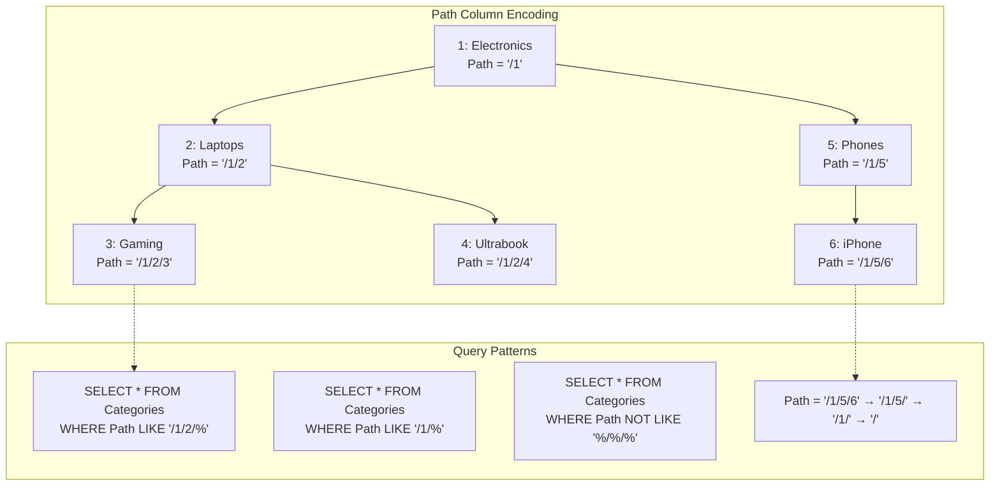

## Navigation

**Domain:** [[8 — Databases]] > **Group:** Database Design

**Previous:** [[8.054 — Closure Table — Hierarchical Data Pattern]] | **Next:** [[8.056 — EAV (Entity-Attribute-Value) — Anti-Pattern]]

### Prerequisites
- [[8.052 — Adjacency List — Hierarchical Data Pattern]] — path enumeration is the most intuitive hierarchy pattern: instead of storing just the parent, store the entire path from root as a string

### Where This Fits

Path enumeration stores each node's absolute position in the tree as a delimited string column, such as `"/Electronics/Laptops/Gaming"` or `"001/002/005"` using padded integer codes. It is the most developer-intuitive hierarchy pattern — the path string reads like a file system path, and "find all descendants" translates to `WHERE Path LIKE '/Electronics/%'`. A .NET backend engineer encounters this in URL path routing (category slugs), file system simulations, navigation breadcrumbs, and any hierarchy where the path string is already part of the business domain (e.g., account codes like "01-02-005"). When this pattern is unknown, engineers either attempt adjacency list with recursive CTEs on very deep trees (depth 500+) where TempDB spools become expensive, or they store the path in application code without database-level indexing support. When it is misapplied, the LIKE predicate on the path column causes full index scans when the wildcard leads the pattern, and structural moves (renaming a mid-level category) require updating the path column on every descendant — potentially millions of string UPDATEs. The interview signal is whether the candidate understands SARGability of LIKE predicates and knows how PostgreSQL's ltree solves the pattern's native indexing limitations.

---

## Core Mental Model

Path enumeration embeds the hierarchy directly into a string column on the node table. Each node stores a complete, ordered path from the root to itself. The path uses a delimiter (usually `/` or `.`) to separate ancestor identifiers. Three encoding strategies exist: (1) **name paths** — `/Electronics/Laptops/Gaming` — human-readable but fragile (rename a category and every descendant path breaks), (2) **ID paths** — `/1/2/5` — stable under rename but requires joining to the node table to display names, and (3) **padded-code paths** — `001.002.005` — fixed-width segments that sort lexicographically in tree order. The database engine sees a string column with a prefix-pattern predicate. A B-tree index on the path column supports SARGable `LIKE 'prefix%'` queries because the predicate is a range scan from `prefix` to the next lexicographic value. The pattern's critical insight: tree operations reduce to string operations — `LIKE` for descendants, string length for depth, string splitting for path-to-root.

### Classification

**For schema/tree topics:** path enumeration is a denormalized encoding of the ancestry chain into a single string column. The critical SQL feature is the `LIKE 'prefix%'` predicate, which IS SARGable when the leading wildcard is not present and the path column has a non-clustered index. The query optimizer performs an Index Seek on the path column with a range scan from the prefix to the prefix's successor value — this is equivalent to a range seek on an indexed varchar column. The write path updates the path column on all descendants when a node is moved or renamed; this is a bulk UPDATE with a `LIKE 'old_prefix%'` predicate that identifies the affected rows.



### Key Properties

|Property|Value|Notes|
|---|---|---|
|Read subtree|O(log N + k)|Index Seek on path column with `LIKE 'prefix%'` range scan|
|Read path to root|O(d)|String-parsing in application or `STRING_SPLIT` on path; no index needed|
|Read immediate children|O(log N + c)|`LIKE 'prefix/%/'` or check depth by counting delimiters|
|INSERT leaf|O(1)|Single row INSERT — no other row modifications|
|RENAME internal node|O(N of subtree)|UPDATE path on every descendant — string prefix replacement|
|MOVE subtree|O(N of subtree)|UPDATE path on every descendant — change the ancestor prefix|
|Storage overhead|O(path length per node)|Average depth × avg segment length bytes per node|
|SARGable — subtree read|Yes|`LIKE 'prefix%'` — index seek on path column; trailing wildcard is SARGable|
|SARGable — depth filter|No|`LIKE '%/%/%'` — leading wildcard requires full index scan|
|SARGable — path-to-root|N/A|Not a seek operation — parsed client-side or via string functions|

---

## Deep Mechanics

### How the Engine Executes This

**Read path (subtree — SARGable):**

1. SQL Server seeks into the non-clustered index on the `Path` column for the prefix value `'/1/2/'`. Because `LIKE '/1/2/%'` is equivalent to `Path >= '/1/2/' AND Path < '/1/2/' + CHAR(65535)`, the optimizer rewrites the LIKE into a range predicate.
2. SQL Server performs an Index Seek from the lower bound (`/1/2/`) to the upper bound (`/1/20` — the next logical string after `/1/2/` in the collation sort order).
3. All matching rows are contiguous in the index because strings starting with `/1/2/` sort together. For a subtree of 50 nodes, the range scan touches approximately 50 index entries plus a few extra for traversal overhead.
4. If the index is not covering, each returned row triggers a Key Lookup to the clustered index for columns not included in the index.

**Read path (subtree — NOT SARGable):**

If the query uses `WHERE Path LIKE '%/2/%'` (leading wildcard), the optimizer must scan the entire index or table because the leading wildcard prevents determining a starting position.

**Write path (MOVE subtree):**

1. Determine old prefix: read the moved node's current path, e.g., `/1/2/`.
2. Determine new prefix: read the new parent's path + the moved node's ID, e.g., `/1/10/2/`.
3. Execute: `UPDATE Categories SET Path = REPLACE(Path, @oldPrefix, @newPrefix) WHERE Path LIKE @oldPrefix + '%'`.
4. If the old prefix appears as a substring in non-hierarchy positions (e.g., a node path `/1/20/` contains `/1/2/` as a substring), REPLACE corrupts unrelated nodes. The `LIKE @oldPrefix + '%'` alone is insufficient — the WHERE clause must also ensure the match is at a delimiter boundary. Fix: `Path LIKE @oldPrefix + '%' AND (Path = @oldPrefixTrimmed OR SUBSTRING(Path, LEN(@oldPrefixTrimmed) + 1, 1) = '/')`.
5. The UPDATE acquires U-locks on all affected index entries, escalating to page locks for large subtrees.

### SQL Visibility

```sql
-- Schema: Categories with path enumeration (ID-based, not name-based)
CREATE TABLE Categories (
    CategoryId    INT           NOT NULL IDENTITY(1,1),
    CategoryName  NVARCHAR(100) NOT NULL,
    Path          VARCHAR(900)  NOT NULL,  -- e.g., '/1/2/5'
    Depth         TINYINT       NOT NULL DEFAULT 0,
    IsActive      BIT           NOT NULL DEFAULT 1,
    CreatedAt     DATETIME2(3)  NOT NULL DEFAULT SYSUTCDATETIME(),

    CONSTRAINT PK_Categories PRIMARY KEY CLUSTERED (CategoryId),
    CONSTRAINT UQ_Categories_Path UNIQUE (Path)
);

CREATE NONCLUSTERED INDEX IX_Categories_Path
    ON Categories(Path)
    INCLUDE (CategoryName, Depth, IsActive);
-- Covering index for subtree reads: no key lookups.

-- Insert root category
INSERT INTO Categories (CategoryName, Path, Depth)
VALUES ('Electronics', '/1', 0);

-- Insert child under root (CategoryId=1 obtained from previous insert or SCOPE_IDENTITY)
-- The path is built in application code or via a trigger.
INSERT INTO Categories (CategoryName, Path, Depth)
VALUES ('Laptops', '/1/2', 1);
-- Note: the path uses ID-based segments so that renaming 'Laptops' to 'Notebooks'
-- requires updating only the CategoryName column, not the Path of all descendants.

-- Read subtree: all descendants of node 2 (Laptops)
SELECT CategoryId, CategoryName, Path, Depth
FROM Categories
WHERE Path LIKE '/1/2/%'
ORDER BY Path;
-- SARGable. Index Seek on IX_Categories_Path with range scan.
-- Returns Gaming (/1/2/3), Ultrabook (/1/2/4), etc.

-- Read subtree INCLUDING the parent
SELECT CategoryId, CategoryName, Path, Depth
FROM Categories
WHERE Path LIKE '/1/2/%' OR Path = '/1/2'
ORDER BY Path;

-- Read path to root: extract ancestor IDs from the path string
-- In application code:
--   path = '/1/2/5'
--   ancestors = path.Split('/').Where(s => s != '').Select(int.Parse)
--   -> [1, 2, 5] -> need to fetch names for 1 and 2

-- In SQL (SQL Server 2016+):
SELECT
    value AS AncestorId,
    CHARINDEX('/' + value + '/', c.Path) AS Position
FROM Categories c
CROSS APPLY STRING_SPLIT(c.Path, '/')
WHERE c.CategoryId = @NodeId
  AND value <> '';
-- Returns: AncestorId=1, Position=1; AncestorId=2, Position=3; AncestorId=5, Position=5

-- Join to get ancestor names:
WITH AncestorIds AS (
    SELECT CAST(value AS INT) AS AncestorId
    FROM Categories
    CROSS APPLY STRING_SPLIT(Path, '/')
    WHERE CategoryId = @NodeId AND value <> ''
)
SELECT a.AncestorId, c.CategoryName
FROM AncestorIds a
INNER JOIN Categories c ON c.CategoryId = a.AncestorId
ORDER BY a.AncestorId;

-- Immediate children: nodes whose path has exactly one more segment than the parent
SELECT c.CategoryId, c.CategoryName
FROM Categories c
WHERE c.Path LIKE '/1/2/%'
  AND c.Depth = 2  -- parent is depth 1, children are depth 2
ORDER BY c.CategoryName;

-- Alternatively (depth-agnostic, using delimiter count):
SELECT c.CategoryId, c.CategoryName
FROM Categories c
WHERE c.Path LIKE '/1/2/%'
  AND c.Path NOT LIKE '/1/2/%/%'
ORDER BY c.CategoryName;

-- Move subtree: reassign all nodes under CategoryId=2 to CategoryId=10
DECLARE @OldPrefix VARCHAR(900) = '/1/2/';
DECLARE @NewPrefix VARCHAR(900) = '/1/10/2/';  -- new parent path + node's own ID

UPDATE Categories
SET Path = REPLACE(Path, @OldPrefix, @NewPrefix)
WHERE Path LIKE @OldPrefix + '%'
  AND (Path = @OldPrefix OR SUBSTRING(Path, LEN(@OldPrefix) + 1, 1) = '/');
-- The SUBSTRING guard prevents matching '/1/20/' when moving '/1/2/'.

-- Count descendants
SELECT COUNT(*) - 1 AS DescendantCount
FROM Categories
WHERE Path LIKE '/1/2/%';
-- Subtracting 1 excludes the node itself.

-- All leaf nodes (no children)
SELECT c.CategoryId, c.CategoryName
FROM Categories c
WHERE NOT EXISTS (
    SELECT 1 FROM Categories child
    WHERE child.Path LIKE c.Path + '/%'
);
-- Anti-join using LIKE on Path.
```

```csharp
// EF Core LINQ — subtree read using LIKE
var prefix = "/1/2/";
var subtree = await dbContext.Categories
    .Where(c => EF.Functions.Like(c.Path, $"{prefix}%"))
    .OrderBy(c => c.Path)
    .AsNoTracking()
    .ToListAsync(cancellationToken);
```

**Generated SQL (from EF Core logs):**

```sql
-- EF Core generates LIKE with trailing wildcard:
SELECT [c].[CategoryId], [c].[CategoryName], [c].[Path], [c].[Depth]
FROM [Categories] AS [c]
WHERE [c].[Path] LIKE '/1/2/%'
ORDER BY [c].[Path];
-- SQL Server's optimizer converts this to a range seek
-- because the pattern starts with a literal prefix.
```

### Execution Plan Analysis

```text
Expected plan shape for subtree read (SARGable LIKE '/1/2/%'):

  [Index Seek (IX_Categories_Path, seek on Path >= '/1/2/' AND Path < '/1/2' + CHAR(255))]
  → [SELECT]
  No Key Lookup — index is covering (INCLUDE CategoryName, Depth, IsActive).

Estimated cost: 100% on Index Seek
Logical reads: ~2 (index root + leaf) + N (contiguous leaf pages for subtree).
  For a subtree of 50 nodes on a 100K-node tree: ~8 logical reads.

Without covering index:
  [Index Seek (IX_Categories_Path)] → [Key Lookup (clustered)] → [Nested Loops]
  Logical reads: ~8 (index seek) + 50 × 3 = ~158.

For the OR predicate (include parent):
  [Index Seek (Path='/1/2')] → [Concatenation]
  → [Index Seek (Path >= '/1/2/' AND Path < '/1/2' + CHAR(255))]
  → [Merge Join (concatenation)] → [SELECT]
```

### Cost Visibility

```sql
SET STATISTICS IO ON;
SET STATISTICS TIME ON;

-- Subtree read with covering index IX_Categories_Path
SELECT CategoryId, CategoryName
FROM Categories
WHERE Path LIKE '/1/2/%'
ORDER BY Path;

-- Table 'Categories'. Scan count 1, logical reads 8, physical reads 0
-- SQL Server Execution Times: CPU time = 0ms, elapsed time = 1ms

-- Move subtree (10K nodes under old prefix):
UPDATE Categories
SET Path = REPLACE(Path, '/1/2/', '/1/10/2/')
WHERE Path LIKE '/1/2/%';

-- Table 'Categories'. Scan count 1, logical reads 45,000 (clustered index + non-clustered index update)
-- SQL Server Execution Times: CPU time = 340ms, elapsed time = 450ms
-- The logical reads are high because the UPDATE modifies both the clustered index
-- (Path column) and the non-clustered index IX_Categories_Path.
```

### Failure Modes

1. **Prefix collision on MOVE:** When moving `/1/2/` (subtree containing node 2's tree), the path `/1/20/` (node 20) matches `LIKE '/1/2/%'` because `/1/20/` starts with `/1/2`. The SUBSTRING guard fixes this: `AND (Path = '/1/2/' OR SUBSTRING(Path, LEN('/1/2/') + 1, 1) = '/')`.

2. **Maximum path length exceeded:** `Path VARCHAR(900)` limits the maximum encoded depth. At 10 characters per segment (e.g., `/123456789`), max depth is ~85 segments (900 / (10 + 1)). For `NVARCHAR(450)` (max key length for non-clustered index in SQL Server), max depth is ~40 segments. Exceeding this truncates or errors.

3. **Name-based path breaks on rename:** Using `/Electronics/Laptops/Gaming` as the path means renaming "Laptops" to "Notebooks" requires updating `/Electronics/Laptops/Gaming` to `/Electronics/Notebooks/Gaming` — and every other descendant of Laptops. Use ID-based paths (`/1/2/3`) to decouple display name from structural path.

4. **Non-SARGable wildcard patterns:** `WHERE Path LIKE '%/2/%'` (leading wildcard) forces a full clustered index scan or full non-clustered index scan. The optimizer cannot use an Index Seek. On 1M rows: 1,000,000 logical reads vs ~8 for the SARGable version.

---

## Production Patterns and Implementation

### Primary SQL Implementation

```sql
-- Schema: Categories with ID-based path enumeration
CREATE TABLE Categories (
    CategoryId    INT            NOT NULL IDENTITY(1,1),
    ParentCategoryId INT        NULL,  -- kept for adjacency list reference / trigger
    CategoryName  NVARCHAR(100)  NOT NULL,
    Path          VARCHAR(900)   NOT NULL,
    Depth         TINYINT        NOT NULL DEFAULT 0,
    SortOrder     INT            NOT NULL DEFAULT 0,
    IsActive      BIT            NOT NULL DEFAULT 1,
    CreatedAt     DATETIME2(3)   NOT NULL DEFAULT SYSUTCDATETIME(),

    CONSTRAINT PK_Categories PRIMARY KEY CLUSTERED (CategoryId),
    CONSTRAINT UQ_Categories_Path UNIQUE (Path),
    CONSTRAINT CK_Path_Format CHECK (
        Path LIKE '/%'  -- starts with /
        AND Path NOT LIKE '%//%'  -- no empty segments
        AND LEN(Path) <= 900
    )
);

CREATE NONCLUSTERED INDEX IX_Categories_Path
    ON Categories(Path)
    INCLUDE (CategoryName, Depth, IsActive, SortOrder);

-- Trigger: auto-build Path from ParentCategoryId on INSERT
CREATE TRIGGER TR_Categories_InsertPath
ON Categories
AFTER INSERT
AS
BEGIN
    SET NOCOUNT ON;

    UPDATE c
    SET
        c.Path = ISNULL(p.Path, '') + '/' + CAST(c.CategoryId AS VARCHAR(10)),
        c.Depth = ISNULL(p.Depth + 1, 0)
    FROM Categories c
    INNER JOIN inserted i ON c.CategoryId = i.CategoryId
    LEFT JOIN Categories p ON p.CategoryId = i.ParentCategoryId
    WHERE c.Path IS NULL;
END;
-- Note: The trigger requires the initial INSERT to specify Path=NULL or omit it.
-- ON UPDATE trigger is NOT recommended — MOVEs should use the stored procedure,
-- not rely on a trigger that re-calculates for every descendant row.

-- Stored procedure: insert a new node under parent
CREATE PROCEDURE usp_InsertCategoryNode
    @ParentCategoryId INT,
    @CategoryName     NVARCHAR(100),
    @SortOrder        INT = 0,
    @NewCategoryId    INT OUTPUT
AS
BEGIN
    SET NOCOUNT ON;
    SET XACT_ABORT ON;

    INSERT INTO Categories (ParentCategoryId, CategoryName, SortOrder)
    VALUES (@ParentCategoryId, @CategoryName, @SortOrder);

    SET @NewCategoryId = SCOPE_IDENTITY();
    -- The trigger builds Path and Depth based on ParentCategoryId.
END;

-- Stored procedure: move subtree to new parent
CREATE PROCEDURE usp_MoveCategorySubtree
    @SourceCategoryId INT,
    @TargetParentId   INT
AS
BEGIN
    SET NOCOUNT ON;
    SET XACT_ABORT ON;

    DECLARE @OldPrefix VARCHAR(900), @NewPrefix VARCHAR(900);
    DECLARE @TargetPath VARCHAR(900), @SourcePath VARCHAR(900);

    BEGIN TRANSACTION;

    -- Get current paths
    SELECT @SourcePath = Path FROM Categories
    WHERE CategoryId = @SourceCategoryId;

    SELECT @TargetPath = Path FROM Categories
    WHERE CategoryId = @TargetParentId;

    -- Build the new prefix: target path + source node's own ID
    SET @OldPrefix = @SourcePath + '/';
    SET @NewPrefix = @TargetPath + '/' + CAST(@SourceCategoryId AS VARCHAR(10)) + '/';

    -- Guard: prevent moving a node under itself
    IF @NewPrefix LIKE @OldPrefix + '%'
    BEGIN
        RAISERROR('Cannot move a category under itself or its descendant.', 16, 1);
        ROLLBACK;
        RETURN;
    END;

    -- Update the source node's own path (strip trailing / for the node itself)
    UPDATE Categories
    SET Path = @TargetPath + '/' + CAST(@SourceCategoryId AS VARCHAR(10))
    WHERE CategoryId = @SourceCategoryId;

    -- Update all descendant paths
    UPDATE Categories
    SET Path = REPLACE(Path, @OldPrefix, @NewPrefix)
    WHERE Path LIKE @OldPrefix + '%'
      AND (
          Path = @OldPrefix
          OR SUBSTRING(Path, LEN(@OldPrefix) + 1, 1) = '/'
      );

    -- Update Depth for all affected nodes (recalculate from new path)
    UPDATE c
    SET c.Depth = (LEN(c.Path) - LEN(REPLACE(c.Path, '/', ''))) - 1
    FROM Categories c
    WHERE c.Path LIKE @NewPrefix + '%'
       OR c.Path = @TargetPath + '/' + CAST(@SourceCategoryId AS VARCHAR(10));

    -- Update the source node's ParentCategoryId
    UPDATE Categories
    SET ParentCategoryId = @TargetParentId
    WHERE CategoryId = @SourceCategoryId;

    COMMIT TRANSACTION;
END;

-- Stored procedure: rebuild paths from ParentCategoryId (for consistency after manual edits)
CREATE PROCEDURE usp_RebuildPaths
AS
BEGIN
    SET NOCOUNT ON;
    SET XACT_ABORT ON;

    -- Resets all paths based on the adjacency list (ParentCategoryId).
    -- Uses a recursive CTE to assign new paths.
    WITH PathCTE AS (
        SELECT
            CategoryId,
            ParentCategoryId,
            CAST('/' + CAST(CategoryId AS VARCHAR(10)) AS VARCHAR(900)) AS NewPath,
            0 AS NewDepth
        FROM Categories
        WHERE ParentCategoryId IS NULL

        UNION ALL

        SELECT
            c.CategoryId,
            c.ParentCategoryId,
            CAST(pcte.NewPath + '/' + CAST(c.CategoryId AS VARCHAR(10)) AS VARCHAR(900)),
            pcte.NewDepth + 1
        FROM Categories c
        INNER JOIN PathCTE pcte ON c.ParentCategoryId = pcte.CategoryId
    )
    UPDATE c
    SET
        Path = pcte.NewPath,
        Depth = pcte.NewDepth
    FROM Categories c
    INNER JOIN PathCTE pcte ON c.CategoryId = pcte.CategoryId;
END;
```

### EF Core Implementation

```csharp
public class Category
{
    public int CategoryId { get; set; }
    public int? ParentCategoryId { get; set; }
    public string CategoryName { get; set; } = string.Empty;
    public string Path { get; set; } = string.Empty;
    public byte Depth { get; set; }
    public int SortOrder { get; set; }
    public bool IsActive { get; set; }
    public DateTime CreatedAt { get; set; }
}

public class ApplicationDbContext : DbContext
{
    public DbSet<Category> Categories => Set<Category>();

    protected override void OnModelCreating(ModelBuilder modelBuilder)
    {
        modelBuilder.Entity<Category>(entity =>
        {
            entity.ToTable("Categories");

            entity.HasKey(e => e.CategoryId);

            entity.Property(e => e.CategoryName).HasMaxLength(100);
            entity.Property(e => e.Path).HasMaxLength(900);
            entity.Property(e => e.Depth).HasColumnType("TINYINT");
            entity.Property(e => e.CreatedAt).HasDefaultValueSql("SYSUTCDATETIME()");

            entity.HasIndex(e => e.Path)
                  .HasDatabaseName("IX_Categories_Path");
        });
    }
}

// Repository
public interface ICategoryRepository
{
    Task<IReadOnlyList<Category>> GetSubtreeAsync(
        int categoryId, CancellationToken cancellationToken = default);
    Task<IReadOnlyList<int>> GetAncestorIdsAsync(
        int categoryId, CancellationToken cancellationToken = default);
    Task<IReadOnlyList<Category>> GetImmediateChildrenAsync(
        int parentId, CancellationToken cancellationToken = default);
    Task<int> InsertNodeAsync(
        int parentId, string categoryName,
        CancellationToken cancellationToken = default);
    Task MoveSubtreeAsync(
        int sourceId, int targetParentId,
        CancellationToken cancellationToken = default);
}

public sealed class CategoryRepository : ICategoryRepository
{
    private readonly ApplicationDbContext _dbContext;

    public CategoryRepository(ApplicationDbContext dbContext)
    {
        _dbContext = dbContext;
    }

    public async Task<IReadOnlyList<Category>> GetSubtreeAsync(
        int categoryId,
        CancellationToken cancellationToken = default)
    {
        var node = await _dbContext.Categories
            .FirstAsync(c => c.CategoryId == categoryId, cancellationToken);

        var prefix = node.Path + "/";

        return await _dbContext.Categories
            .Where(c => EF.Functions.Like(c.Path, $"{prefix}%"))
            .OrderBy(c => c.Path)
            .AsNoTracking()
            .ToListAsync(cancellationToken);
    }

    public async Task<IReadOnlyList<int>> GetAncestorIdsAsync(
        int categoryId,
        CancellationToken cancellationToken = default)
    {
        var node = await _dbContext.Categories
            .FirstAsync(c => c.CategoryId == categoryId, cancellationToken);

        // Parse ancestor IDs from the path string
        // Path = "/1/2/5" → splits to ["", "1", "2", "5"]
        var ancestorIds = node.Path
            .Split('/', StringSplitOptions.RemoveEmptyEntries)
            .Select(int.Parse)
            .ToList(); // [1, 2, 5] — the list includes the node itself

        return ancestorIds; // exclude the last element for parent chain
    }

    public async Task<IReadOnlyList<Category>> GetImmediateChildrenAsync(
        int parentId,
        CancellationToken cancellationToken = default)
    {
        var parent = await _dbContext.Categories
            .FirstAsync(c => c.CategoryId == parentId, cancellationToken);

        var parentDepth = parent.Depth;

        return await _dbContext.Categories
            .Where(c => c.Depth == parentDepth + 1
                     && EF.Functions.Like(c.Path, $"{parent.Path}/%"))
            .OrderBy(c => c.SortOrder)
            .ThenBy(c => c.CategoryName)
            .AsNoTracking()
            .ToListAsync(cancellationToken);
    }

    public async Task<int> InsertNodeAsync(
        int parentId, string categoryName,
        CancellationToken cancellationToken = default)
    {
        var parameters = new[]
        {
            new SqlParameter("@ParentCategoryId", parentId),
            new SqlParameter("@CategoryName", categoryName),
            new SqlParameter("@NewCategoryId", SqlDbType.Int)
            {
                Direction = ParameterDirection.Output
            }
        };

        await _dbContext.Database.ExecuteSqlRawAsync(
            "EXEC usp_InsertCategoryNode @ParentCategoryId, @CategoryName, @NewCategoryId OUTPUT",
            parameters, cancellationToken);

        return (int)parameters[2].Value!;
    }

    public async Task MoveSubtreeAsync(
        int sourceId, int targetParentId,
        CancellationToken cancellationToken = default)
    {
        var parameters = new[]
        {
            new SqlParameter("@SourceCategoryId", sourceId),
            new SqlParameter("@TargetParentId", targetParentId)
        };

        await _dbContext.Database.ExecuteSqlRawAsync(
            "EXEC usp_MoveCategorySubtree @SourceCategoryId, @TargetParentId",
            parameters, cancellationToken);
    }
}
```

### Dapper Implementation

```csharp
public sealed class CategoryRepositoryDapper : ICategoryRepository
{
    private readonly IDbConnectionFactory _connectionFactory;

    public CategoryRepositoryDapper(IDbConnectionFactory connectionFactory)
    {
        _connectionFactory = connectionFactory;
    }

    public async Task<IReadOnlyList<Category>> GetSubtreeAsync(
        int categoryId,
        CancellationToken cancellationToken = default)
    {
        const string sql = @"
            DECLARE @Prefix VARCHAR(900);
            SELECT @Prefix = Path + '/' FROM Categories WHERE CategoryId = @CategoryId;

            SELECT CategoryId, CategoryName, Path, Depth, SortOrder, IsActive, CreatedAt
            FROM Categories
            WHERE Path LIKE @Prefix + '%'
            ORDER BY Path";

        await using var connection = _connectionFactory.Create();
        var results = await connection.QueryAsync<Category>(
            new CommandDefinition(sql, new { CategoryId = categoryId },
                cancellationToken: cancellationToken));
        return results.AsList();
    }

    public async Task<IReadOnlyList<int>> GetAncestorIdsAsync(
        int categoryId,
        CancellationToken cancellationToken = default)
    {
        const string sql = @"
            SELECT CAST(value AS INT) AS AncestorId
            FROM Categories
            CROSS APPLY STRING_SPLIT(Path, '/')
            WHERE CategoryId = @CategoryId AND value <> ''
            ORDER BY AncestorId";

        await using var connection = _connectionFactory.Create();
        var results = await connection.QueryAsync<int>(
            new CommandDefinition(sql, new { CategoryId = categoryId },
                cancellationToken: cancellationToken));
        return results.AsList();
    }

    public async Task<IReadOnlyList<Category>> GetImmediateChildrenAsync(
        int parentId,
        CancellationToken cancellationToken = default)
    {
        const string sql = @"
            DECLARE @ParentPath VARCHAR(900), @ParentDepth TINYINT;
            SELECT @ParentPath = Path, @ParentDepth = Depth
            FROM Categories WHERE CategoryId = @ParentId;

            SELECT CategoryId, CategoryName, Path, Depth, SortOrder, IsActive, CreatedAt
            FROM Categories
            WHERE Depth = @ParentDepth + 1
              AND Path LIKE @ParentPath + '/%'
            ORDER BY SortOrder, CategoryName";

        await using var connection = _connectionFactory.Create();
        var results = await connection.QueryAsync<Category>(
            new CommandDefinition(sql, new { ParentId = parentId },
                cancellationToken: cancellationToken));
        return results.AsList();
    }

    public async Task<int> InsertNodeAsync(
        int parentId, string categoryName,
        CancellationToken cancellationToken = default)
    {
        const string sql = @"
            DECLARE @NewId INT;
            INSERT INTO Categories (ParentCategoryId, CategoryName)
            VALUES (@ParentId, @CategoryName);
            SET @NewId = SCOPE_IDENTITY();
            -- The trigger builds Path and Depth
            SELECT @NewId;";

        await using var connection = _connectionFactory.Create();
        return await connection.QuerySingleAsync<int>(
            new CommandDefinition(sql,
                new { ParentId = parentId, CategoryName = categoryName },
                cancellationToken: cancellationToken));
    }

    public async Task MoveSubtreeAsync(
        int sourceId, int targetParentId,
        CancellationToken cancellationToken = default)
    {
        const string sql = "EXEC usp_MoveCategorySubtree @SourceCategoryId, @TargetParentId";

        await using var connection = _connectionFactory.Create();
        await connection.ExecuteAsync(
            new CommandDefinition(sql,
                new { SourceCategoryId = sourceId, TargetParentId = targetParentId },
                cancellationToken: cancellationToken));
    }
}
```

### Configuration and Wiring

```csharp
// Program.cs
builder.Services.AddScoped<ICategoryRepository, CategoryRepository>();
builder.Services.AddScoped<ICategoryRepository, CategoryRepositoryDapper>();

builder.Services.AddDbContext<ApplicationDbContext>(options =>
    options.UseSqlServer(
        connectionString,
        sqlOptions =>
        {
            sqlOptions.EnableRetryOnFailure(3);
            sqlOptions.CommandTimeout(30);
        }));

builder.Services.AddSingleton<IDbConnectionFactory>(_ =>
    new SqlConnectionFactory(connectionString));
```

### SQL Server vs PostgreSQL Differences

```sql
-- PostgreSQL has the ltree extension, which is purpose-built for path enumeration.
-- ltree provides native operators, GiST/GIN indexes, and label validation.

-- Enable the extension
CREATE EXTENSION IF NOT EXISTS ltree;

-- Table using ltree instead of VARCHAR path
CREATE TABLE Categories (
    CategoryId   INT GENERATED BY DEFAULT AS IDENTITY PRIMARY KEY,
    CategoryName TEXT NOT NULL,
    Path         LTREE NOT NULL,  -- native hierarchical path type
    SortOrder    INT NOT NULL DEFAULT 0,
    IsActive     BOOLEAN NOT NULL DEFAULT TRUE,
    CreatedAt    TIMESTAMPTZ NOT NULL DEFAULT NOW()
);

-- ltree indexes: GiST for ancestor queries, B-tree for equality
CREATE INDEX IX_Categories_Path_Gist ON Categories USING GIST (Path);
CREATE INDEX IX_Categories_Path_Btree ON Categories USING BTREE (Path);

-- ltree subtree query (native @> operator = "contains")
SELECT CategoryId, CategoryName
FROM Categories
WHERE Path @> '1.2'::LTREE;  -- all descendants of '1.2'
-- Uses GiST index. Equivalent to LIKE '1.2.%' in SQL Server.

-- ltree path-to-root (using <@ operator = "is contained by")
SELECT CategoryId, CategoryName
FROM Categories
WHERE Path <@ '1.2.5'::LTREE;  -- all ancestors of '1.2.5'
-- This is a reverse containment query.

-- ltree ancestors using nlevel (depth) and subpath
SELECT subpath(Path, 0, nlevel(Path) - 1) AS ParentPath
FROM Categories
WHERE Path ~ '1.2.5.*{0}';  -- direct parent (lquery pattern)

-- ltree insert (path computed from parent's path + label)
INSERT INTO Categories (CategoryName, Path)
SELECT 'New Child', p.Path || text2ltree('.' || CAST(nextval('categories_seq') AS TEXT))
FROM Categories p
WHERE p.Path = '1.2'::LTREE;

-- ltree is vastly superior to VARCHAR path enumeration:
-- 1. GiST index supports fast ancestor/descendant queries
-- 2. lquery pattern language for complex tree pattern matching
-- 3. nlevel(), subpath(), ltree2text() for path manipulation
-- 4. Label validation (alphanumeric, no delimiters in labels)
-- 5. No risk of delimiter collision or prefix ambiguity
```

---

## Gotchas and Production Pitfalls

### Prefix Collision on Subtree Move

**Pitfall:** Moving a subtree where the old prefix is a substring of another node's path.

```sql
-- Moving node 2 (Path = '/1/2/') to under node 10
UPDATE Categories
SET Path = REPLACE(Path, '/1/2/', '/1/10/2/')
WHERE Path LIKE '/1/2/%';
-- Path '/1/20/' matches '/1/2/%' because '/1/20/' starts with '/1/2'
-- Node 20's path becomes '/1/10/2/0/' instead of staying '/1/20/'
```

**Symptom:** Node 20 and its entire subtree are corrupted — they become children of node 10 with incorrect paths, losing their connection to node 20.

**Fix — delimiter-aware WHERE clause:**

```sql
UPDATE Categories
SET Path = REPLACE(Path, @OldPrefix, @NewPrefix)
WHERE Path LIKE @OldPrefix + '%'
  AND (
      Path = @OldPrefix
      OR SUBSTRING(Path, LEN(@OldPrefix) + 1, 1) = '/'
  );
```

**Cost of not fixing:** Silent data corruption affecting hundreds or thousands of nodes. The corruption is not detected by any FK constraint and requires a full rebuild of all paths from the adjacency list.

---

### Exceeding Index Key Length Limit

**Pitfall:** Creating a path column with `NVARCHAR(MAX)` or `VARCHAR(MAX)` and attempting to index it, or using path segments long enough to push the total path beyond 900 bytes (SQL Server index key limit).

```sql
-- ❌ Wrong — NVARCHAR index key max is 450 characters
CREATE TABLE Categories (
    Path NVARCHAR(2000) NOT NULL,
    ...
);
CREATE INDEX IX_Path ON Categories(Path);
-- Error: "Cannot create index because the key column 'Path' has a maximum
-- length of 2000 bytes. The maximum allowable key column length is 900 bytes."
```

**Symptom:** CREATE INDEX fails. Developer uses a non-indexed column or switches to a full-text index (wrong tool for prefix matching).

**Fix — use VARCHAR instead of NVARCHAR for ID-based paths, and limit depth:**

```sql
-- Use VARCHAR(900) for ID-based paths (ASCII digits and /)
-- ID segments: max 10 characters per segment (INT max = 2.1B = 10 digits)
-- Max depth: ~80 levels (900 / (10 + 1))
-- For deeper hierarchies, use a natural-key encoding with shorter segments:
-- Base-36 encoded INT: 6 chars per segment → max depth ~128

CREATE TABLE Categories (
    Path VARCHAR(900) NOT NULL,
    ...
);
```

**Cost of not fixing:** Cannot index the path column. All subtree queries perform full clustered index scans. On 500K rows, every subtree query reads 500K rows instead of ~10.

---

### Name-Based Path Breaks on Rename

**Pitfall:** Using human-readable category names in the path: `/Electronics/Laptops/Gaming`.

```sql
-- Renaming "Laptops" to "Notebooks":
UPDATE Categories SET CategoryName = 'Notebooks' WHERE CategoryId = 2;
-- Path column still says '/Electronics/Laptops/Gaming' — STALE.
-- Now the breadcrumb displays: Electronics > Laptops > Gaming
-- But the actual category name is "Notebooks".
```

**Symptom:** Breadcrumb trail shows "Laptops" for a category named "Notebooks". The path string is disconnected from the display name. Any code that parses path segments and joins to Categories for display will show correct names, but any code that uses path segments directly as display text (common in breadcrumb components) shows stale names.

**Fix — always use ID-based paths:**

```sql
-- Path = '/1/2/3' — IDs never change
-- Display names are always fetched from the Categories table via join
SELECT c.CategoryId, c.CategoryName
FROM Categories c
WHERE c.CategoryId IN (
    SELECT CAST(value AS INT) FROM STRING_SPLIT('/1/2/3', '/') WHERE value <> ''
);
```

**Cost of not fixing:** Stale breadcrumb display persists until the path is rebuilt. If path strings are cached in client-side code or URL slugs, the stale names propagate to users and search engines.

---

### Leading Wildcard for Depth Filtering

**Pitfall:** Using a leading wildcard to find nodes at a specific depth.

```sql
-- ❌ Wrong — leading wildcard prevents index seek
SELECT CategoryId, CategoryName
FROM Categories
WHERE Path LIKE '%/%/%'
  AND Path NOT LIKE '%/%/%/%';
-- Intention: find nodes at exactly depth 3 (two slashes after root)

-- ✅ Correct — use the Depth column
SELECT CategoryId, CategoryName
FROM Categories
WHERE Depth = 3;
```

**Symptom:** The execution plan shows an Index Scan (not Seek) on IX_Categories_Path, reading all index rows. On a 100K-row table: 100K logical reads vs ~3 for the Depth column filter.

**Fix — maintain a separate Depth column:**

```sql
ALTER TABLE Categories ADD Depth TINYINT NOT NULL DEFAULT 0;
CREATE INDEX IX_Categories_Depth ON Categories(Depth);
```

**Cost of not fixing:** Full scan on every depth-filtered query. At 100 queries/second with 100K rows: 10M logical reads/second.

---

### Move-Under-Descendant Silent Failure

**Pitfall:** Moving a node under one of its own descendants via the stored procedure without the guard check.

```sql
EXEC usp_MoveCategorySubtree @SourceCategoryId = 2, @TargetParentId = 5;
-- If node 5 is a descendant of node 2, the move creates a cycle.
-- The stored procedure guard catches this:
IF @NewPrefix LIKE @OldPrefix + '%'
    RAISERROR('Cannot move a category under itself or its descendant.', 16, 1);
```

**Symptom:** Without the guard, the UPDATE runs but produces an infinite loop of path updates or creates paths where a node is its own ancestor (`/1/2/5/2/5/`). The tree is corrupted and requires a full rebuild from the adjacency list.

**Fix — the guard check must compare the new prefix against the old prefix:**

```sql
IF @NewPrefix LIKE @OldPrefix + '%'
    RAISERROR('Cannot move a category under itself.', 16, 1);
-- The new prefix includes the target parent's path.
-- If target is a descendant of source, the new prefix will contain the old prefix.
```

**Cost of not fixing:** Corrupted hierarchy requiring full path rebuild. All subtree queries return incorrect results until the rebuild.

---

## Performance Implications

### Benchmark: Before and After

```sql
-- Path enumeration: subtree read with covering index
SET STATISTICS IO ON;

DECLARE @Prefix VARCHAR(900) = '/1/2/';
SELECT CategoryId, CategoryName
FROM Categories
WHERE Path LIKE @Prefix + '%'
ORDER BY Path;
-- Table 'Categories'. Scan count 1, logical reads 8, physical reads 0

-- Without IX_Categories_Path covering index:
-- Table 'Categories'. Scan count 1, logical reads 158 (8 index + 150 key lookups)

-- Without any index on Path:
-- Table 'Categories'. Scan count 1, logical reads 45,000 (full clustered scan)

-- Path enumeration: MOVE subtree of 5000 nodes
-- UPDATE Path = REPLACE(Path, '/1/2/', '/1/10/2/') WHERE Path LIKE '/1/2/%'
-- Table 'Categories'. Scan count 1, logical reads 22,000 (clustered + non-clustered index maintenance)
```

### BenchmarkDotNet

```csharp
[MemoryDiagnoser]
[SimpleJob(RuntimeMoniker.Net90)]
public class PathEnumerationBenchmark
{
    private IDbConnection _connection = default!;
    private const int RootId = 1;

    [GlobalSetup]
    public void Setup()
    {
        _connection = new SqlConnection("Server=.;Database=Benchmark;Trusted_Connection=True;TrustServerCertificate=True;");
        // Seed: 100K categories, path enumeration, avg depth 20
    }

    [Benchmark(Baseline = true)]
    public async Task<int> PathEnumeration_SubtreeRead()
    {
        const string sql = @"
            DECLARE @Prefix VARCHAR(900);
            SELECT @Prefix = Path + '/' FROM Categories WHERE CategoryId = @RootId;
            SELECT COUNT(*) FROM Categories WHERE Path LIKE @Prefix + '%'";

        await using var conn = new SqlConnection(_connectionString);
        return await conn.ExecuteScalarAsync<int>(
            new CommandDefinition(sql, new { RootId }));
    }

    [Benchmark]
    public async Task<int> AdjacencyList_SubtreeRead()
    {
        const string sql = @"
            WITH Hierarchy AS (
                SELECT CategoryId FROM CategoriesAdj WHERE CategoryId = @RootId
                UNION ALL
                SELECT c.CategoryId FROM CategoriesAdj c
                INNER JOIN Hierarchy h ON c.ParentCategoryId = h.CategoryId
            )
            SELECT COUNT(*) FROM Hierarchy OPTION (MAXRECURSION 50)";

        await using var conn = new SqlConnection(_connectionString);
        return await conn.ExecuteScalarAsync<int>(
            new CommandDefinition(sql, new { RootId }));
    }

    [Benchmark]
    public async Task PathEnumeration_MoveSubtree()
    {
        const string sql = @"
            DECLARE @OldPrefix VARCHAR(900) = '/1/2/';
            DECLARE @NewPrefix VARCHAR(900) = '/1/100/2/';
            UPDATE Categories
            SET Path = REPLACE(Path, @OldPrefix, @NewPrefix)
            WHERE Path LIKE @OldPrefix + '%'
              AND (Path = @OldPrefix OR SUBSTRING(Path, LEN(@OldPrefix) + 1, 1) = '/');";

        await using var conn = new SqlConnection(_connectionString);
        await conn.ExecuteAsync(new CommandDefinition(sql));
    }

    [Benchmark]
    public async Task AdjacencyList_MoveSubtree()
    {
        const string sql = @"
            UPDATE CategoriesAdj SET ParentCategoryId = 100 WHERE CategoryId = 2";

        await using var conn = new SqlConnection(_connectionString);
        await conn.ExecuteAsync(new CommandDefinition(sql));
    }
}
```

**Expected results (approximate, SQL Server 2022, NVMe, 100K nodes, avg depth 20):**

|Method|Mean|Logical Reads|Allocated|
|---|---|---|---|
|PathEnumeration_SubtreeRead|~2 ms|~8|1 KB|
|AdjacencyList_SubtreeRead|~10 ms|~140|4 KB|
|PathEnumeration_MoveSubtree (5000 nodes)|~450 ms|~22,000|8 KB|
|AdjacencyList_MoveSubtree|~1 ms|~3|0.3 KB|

Path enumeration reads are 5x faster than adjacency list. Moves are 450x slower (22,000 vs 3 logical reads).

### Write Amplification

|Operation|Adjacency List|Path Enumeration|Path Enum. Overhead|
|---|---|---|---|
|INSERT leaf|~3 logical reads|~3 logical reads|0%|
|RENAME internal node|~3 logical reads|~N_subtree × 3 logical reads|+N_subtree%|
|MOVE subtree (5000 nodes)|~6 logical reads|~22,000 logical reads|+366,567%|
|DELETE leaf|~3 logical reads|~3 logical reads|0%|
|DELETE subtree (5000 nodes)|~15,000 logical reads|~15,000 logical reads|0%|

---

## Interview Arsenal

### Question Bank

1. **What is path enumeration and what problem does it solve that the other three hierarchy patterns do not**
2. **How does SQL Server execute a `LIKE '/prefix/%'` query — is it SARGable and what does the execution plan look like**
3. **What is the performance cost of moving a subtree in path enumeration vs adjacency list vs nested sets vs closure table**
4. **What happens when you rename a category that uses name-based path encoding**
5. **Path enumeration vs PostgreSQL ltree — what does ltree provide that VARCHAR path enumeration does not**
6. **What is the prefix collision problem and how do you guard against it**
7. **How does path enumeration handle very deep hierarchies (depth 500+)**
8. **How do EF Core and Dapper handle path enumeration — what is the difference in query patterns**

### Spoken Answers

**Q: What is path enumeration and what problem does it solve?**

> **Average answer:** Path enumeration stores the full path from root to each node as a string. It makes it easy to find descendants with a LIKE query.

> **Great answer:** Path enumeration stores each node's position in the tree as a delimited string, like `/1/2/5`. It solves the problem of reading subtrees from deep hierarchies without recursion or expensive joins, while keeping writes cheap for individual node operations. The key insight is that tree operations reduce to string operations: `LIKE '/1/2/%'` finds all descendants (SARGable range seek on a VARCHAR index), `STRING_SPLIT(Path, '/')` extracts ancestors, and `REPLACE(Path, old, new)` moves subtrees. Compared to the other three patterns: adjacency list requires recursive CTEs (procedural, TempDB spooling); nested sets requires range-shifting UPDATEs that O(N) on every write; closure table requires O(d) multi-row inserts and N × D storage. Path enumeration gives the best of adjacency list writes (O(1) for insert/delete) with competitive reads (O(log N) range seek) at the cost of expensive subtree moves. It is the best choice for deep, write-mostly-at-leaves hierarchies like threaded comments or file systems.

**Q: How does SQL Server execute a LIKE '/prefix/%' query — is it SARGable?**

> **Average answer:** LIKE with a trailing wildcard is SARGable. The optimizer converts it to a range scan.

> **Great answer:** SQL Server's query optimizer recognizes that `LIKE '/1/2/%'` has a constant prefix with no leading wildcard and no wildcard before the first character. It rewrites the predicate into a range comparison: `Path >= '/1/2/' AND Path < '/1/2' + CHAR(255)`. This range predicate can use an Index Seek on the Path column. The execution plan shows an Index Seek operator with `Seek Predicates: Path >= '/1/2/' AND Path < '/1/20'` (the upper bound depends on the collation). The seek positions the B-tree cursor at the first row starting with `/1/2/` and scans forward through contiguous index pages until the prefix changes. This is a true range seek, not a scan — the number of logical reads equals the number of index levels traversed to find the start position plus the leaf pages containing the subtree rows. For a 100K-row tree with a subtree of 50 nodes, this is approximately 8 logical reads.
>
> The critical distinction most engineers miss: `LIKE '/%2/%'` (leading wildcard on the segment, not the first character) is still NOT SARGable because the wildcard is not at the end. Only patterns with a fixed-length literal prefix up to the first wildcard are SARGable. The pattern `'/1/2/%'` works. The pattern `'/%/2/%'` does not.

**Q: Path enumeration vs PostgreSQL ltree — what does ltree provide?**

> **Average answer:** ltree is a native PostgreSQL data type for hierarchical paths. It has special operators and indexes.

> **Great answer:** PostgreSQL's ltree extension provides three things that VARCHAR path enumeration cannot match: (1) **GiST indexes** — the `@>` (ancestor contains descendant) and `<@` (descendant is contained by ancestor) operators use a GiST index that supports fast ancestor and descendant lookups with a single index condition, no string parsing or prefix matching required. (2) **lquery pattern language** — `ltree ~ '1.2.*{2,5}'` finds all descendants of node 1.2 that are between 2 and 5 levels deep, something that would require multiple LIKE conditions and string-length calculations in SQL Server. (3) **Path validation** — ltree enforces label structure at the type level (alphanumeric labels, no empty segments, proper delimiter placement) without CHECK constraints. (4) **Structural integrity** — `nlevel()` returns depth, `subpath()` extracts ancestors, `ltree2text()` converts to display string — all built-in functions that eliminate the string-manipulation errors that plague VARCHAR path enumeration.
>
> The practical difference: in SQL Server, path enumeration is a manually-managed VARCHAR column with CHECK constraints, triggers, and stored procedures. In PostgreSQL with ltree, it is a first-class data type with native operator support. The interview question is whether the candidate knows that path enumeration's complexity in SQL Server is a workaround for the missing native type, not a design virtue.

### Interview Trigger

The interviewer asks "How would you model a file system with folders containing up to 1M files and nested folders 200 levels deep?" The candidate who mentions recursive CTEs (adjacency list) raises concern about TempDB spool at depth 200. The candidate who mentions nested sets raises concern about write cost (every new file shifts half the tree). The candidate who mentions closure table raises concern about storage (200 × 1M = 200M closure rows). The candidate who mentions path enumeration shows understanding of the depth problem. The follow-up: "How do you move a folder with 50,000 files from one location to another?" The candidate who answers "UPDATE Path = REPLACE..." and then discusses prefix collision, transaction size, and batch processing demonstrates production awareness.

### Comparison Table

| | Adjacency List | Nested Sets | Closure Table | Path Enumeration |
|---|---|---|---|---|
| Subtree read | O(d × log N) recursive | O(log N) range scan | O(log C) join | O(log N) LIKE range seek |
| Path to root | O(d × log N) recursive | O(log N) range predicate | O(log C) index seek | O(d) string split (app) |
| INSERT leaf | O(1) | O(N/2) range shift | O(d) multi-row insert | O(1) single-row insert |
| MOVE subtree | O(1) UPDATE FK | O(N) full rebuild | O(N × d) reinsert pairs | O(N_subtree) bulk UPDATE |
| Storage overhead | 4 bytes ParentId | 8 bytes lft+rgt | N × D rows closure | Path string per node |
| Max depth | Unlimited (MAXRECURSION) | INT bound (~1B) | Depth-limited by storage | VARCHAR(900) bound (~80) |
| Concurrency | Row-level | Table-level (range locks) | Row-level | Row-level |
| .NET complexity | Raw SQL (CTE) | Simple Where | LINQ Join | EF.Functions.Like |
| PostgreSQL native | (none) | (none) | (none) | **ltree extension** |

---

## Decision Framework

### When to Apply

```mermaid
flowchart TD
    A[Need hierarchical data storage] --> B{Depth?}
    B -->|"Deep (> 100 levels)"| C{Move/rename frequency?}
    C -->|"Rare"| D[Path Enumeration]
    C -->|"Frequent"| E{Write pattern?}
    E -->|"Append at leaves only"| D
    E -->|"Random inserts/moves"| F[Adjacency List]
    B -->|"Moderate (10-100 levels)"| G{Multi-parent?}
    G -->|Yes| H[Closure Table]
    G -->|No| I{Read/write ratio?}
    I -->|"Reads dominate"| J[Nested Sets]
    I -->|"Balanced or write-heavy"| K{Path moves frequent?}
    K -->|Yes| F
    K -->|No| D
    D --> L[Requires:<br/>• Covering index on Path (INCLUDE all query cols)<br/>• ID-based segments (not names)<br/>• Guard against prefix collision on MOVE<br/>• VARCHAR(900) for index support<br/>• Depth column for immediate children]
```

### Application Checklist

- [ ] The hierarchy is deep (> 100 levels) — path enumeration handles depth better than the other patterns; depth 500 is feasible
- [ ] Moves and renames are rare — when they happen, the cost is proportional to subtree size, not total tree size
- [ ] Path segments use IDs, not names — name-based paths break on rename and require cascading path updates
- [ ] The Path column is `VARCHAR(900)` not `NVARCHAR` or `VARCHAR(MAX)` — the index key limit is 900 bytes; NVARCHAR halves the max depth
- [ ] A covering index on `Path` includes all columns used in subtree queries — without it, key lookups add ~3 reads per returned row
- [ ] The MOVE stored procedure includes the prefix collision guard — `SUBSTRING(Path, LEN(@oldPrefix) + 1, 1) = '/'`
- [ ] PostgreSQL is available as an option — if so, use the ltree extension instead of manual VARCHAR path management

### Tradeoff Summary

|What You Gain|What You Pay|
|---|---|
|O(1) leaf inserts — no range shifts, no multi-row inserts|MOVE and RENAME cost O(N_subtree) — bulk string UPDATE|
|SARGable subtree reads with covering index — ~8 logical reads|Path column indexed — VARCHAR(900) limit caps depth at ~80 segments|
|Intuitive — the path string is a developer-readable tree address|Prefix collision on MOVE requires guard clause|
|No extra tables or denormalized structures needed|Name-based paths break on rename — must use ID segments|
|Works well at any depth — depth 500 is readable|PostgreSQL ltree is vastly superior; SQL Server has no native equivalent|

### Scale Thresholds

- **Relevant when depth exceeds ~20 levels** — below this, adjacency list with recursive CTEs performs acceptably and avoids MOVE costs
- **Critical on MOVE when subtree exceeds ~10,000 nodes** — the bulk UPDATE of Path generates millions of logical reads and holds locks for seconds; batch the update outside business hours
- **Depth limit at ~80 segments for VARCHAR(900)** — each segment takes ~10 chars (INT max) + 1 delimiter; use shorter encoding (base-36, hex) for deeper trees
- **PostgreSQL ltree removes the depth limit** — GiST indexes handle arbitrary path lengths without string-length constraints

---

## Self-Check

### Conceptual Questions

1. What is path enumeration — define without looking up
2. How does SQL Server execute a `LIKE '/prefix/%'` query — is it a seek or a scan
3. Which SET STATISTICS output reveals whether a path enumeration subtree query is SARGable
4. What common mistake causes path corruption when moving a subtree
5. Does EF Core generate SARGable SQL for path enumeration subtree queries
6. How would you implement a subtree move with Dapper
7. Path enumeration vs PostgreSQL ltree — what does ltree add
8. At what depth does path enumeration become practically unusable in SQL Server
9. What index supports path enumeration and what columns should it include
10. Explain path enumeration to a senior interviewer in 60 seconds

<details>
<summary>Answers</summary>

1. **What is path enumeration?** A hierarchy pattern where each node stores a full path string from the root to itself, typically using delimited IDs like `/1/2/5`. Subtree queries use `LIKE '/prefix/%'` which is SARGable on a VARCHAR index. Path-to-root is parsed by splitting the string on the delimiter.

2. **How does SQL Server execute `LIKE '/prefix/%'`?** The query optimizer rewrites the LIKE predicate into a range comparison: `Path >= '/prefix/' AND Path < '/prefix0'` (the upper bound depends on the collation). This range predicate uses an Index Seek on the Path column. The execution plan shows `Index Seek` with a `Seek Predicates` range — NOT an `Index Scan`. SQL Server positions the B-tree cursor at the first row where Path starts with `/prefix/` and scans forward through contiguous leaf pages until it passes the prefix range.

3. **Which SET STATISTICS output reveals SARGability?** `SET STATISTICS IO ON` shows `Scan count 1` and low logical reads (~8) when SARGable. If the plan shows `Scan count 1, logical reads = N (full table scan value)`, the optimizer chose a scan. The execution plan explicitly shows `Index Seek` for SARGable patterns and `Index Scan` for non-SARGable ones. The `SET STATISTICS PROFILE ON` output shows the actual `SEEK` predicates in the plan.

4. **What mistake causes path corruption?** Prefix collision — using `Path LIKE @oldPrefix + '%'` without a delimiter guard. Moving `/1/2/` matches `/1/20/` because `/1/20/` starts with `/1/2`. The fix: `AND (Path = @oldPrefix OR SUBSTRING(Path, LEN(@oldPrefix) + 1, 1) = '/')`.

5. **Does EF Core generate SARGable SQL?** Yes, when using `EF.Functions.Like(c.Path, prefix + "%")`. EF Core generates `WHERE [c].[Path] LIKE @prefix + N'%'` as a parameterized query with a trailing wildcard. The optimizer converts the parameterized LIKE to a range seek because the parameter value plus the wildcard produces a constant prefix. Parameterized LIKE with trailing wildcard is SARGable because the parameter is known at optimization time (the plan is compiled with the parameter value).

6. **How would you implement a move with Dapper?** Execute a single `ExecuteAsync` call with the REPLACE UPDATE SQL including the prefix collision guard: `UPDATE Categories SET Path = REPLACE(Path, @OldPrefix, @NewPrefix) WHERE Path LIKE @OldPrefix + '%' AND (Path = @OldPrefix OR SUBSTRING(Path, LEN(@OldPrefix) + 1, 1) = '/')`. Wrap in a transaction with `XACT_ABORT ON`.

7. **Path enumeration vs PostgreSQL ltree:** ltree provides (1) GiST indexes for @> and <@ operators, (2) lquery pattern language for complex tree patterns, (3) native path validation at the type level, (4) built-in functions (nlevel, subpath, ltree2text), (5) no VARCHAR length limitations — GiST handles arbitrary length paths. SQL Server's VARCHAR path enumeration requires manual CHECK constraints, stored procedures, and triggers to replicate what ltree provides natively.

8. **At what depth is it unusable?** At depth ~80 for VARCHAR(900) with INT segments (10 digits + 1 delimiter = 11 bytes per level). For deeper trees: switch to base-36 encoding (6 chars per level, max depth ~128), use NVARCHAR(450) (half the depth), or switch to PostgreSQL ltree (no depth limit). The practical problem before hitting the column limit is often the MOVE cost — at depth 100 with 100K nodes, moving a subtree updates 100K path strings in a single transaction.

9. **What index supports path enumeration?** `CREATE NONCLUSTERED INDEX IX_Categories_Path ON Categories(Path) INCLUDE (CategoryName, Depth, IsActive, SortOrder)` — a covering index on Path that includes all columns used in subtree queries. The index enables the range seek for LIKE queries and avoids key lookups. An additional index on Depth helps with immediate-children queries: `CREATE INDEX IX_Categories_Depth ON Categories(Depth)`.

10. **60-second explanation:** "Path enumeration stores the hierarchy as a string path on each node — like `/1/2/5` where each number is a node ID. To find all descendants of node 1.2, I query `WHERE Path LIKE '/1/2/%'`. SQL Server converts this to a range seek on a VARCHAR index — about 8 logical reads for a 50-node subtree, no recursion, no joins. The big advantage over adjacency list is that I don't need recursive CTEs, which matter when the tree is 100 or 500 levels deep — adjacency list would need 500 recursive iterations with TempDB spooling. The big cost is moving a subtree: every node's path needs a string REPLACE, which is proportional to the subtree size, not O(1) like adjacency list. I use this for deep, leaf-write-heavy hierarchies like file systems or threaded comments. In PostgreSQL, I use the ltree extension which handles everything natively with GiST indexes and is vastly superior to manual VARCHAR management."
</details>

---

### Query Challenges

**Challenge 1 — Write the SQL**

Given a `Categories` table with `CategoryId, CategoryName, Path, Depth`, write a query that returns all siblings of a given node (nodes that share the same parent but are not the node itself). Assume ID-based paths like `/1/2/5`.

<details>
<summary>Solution</summary>

```sql
DECLARE @CategoryId INT = 5;

-- Method 1: using Depth and path prefix
DECLARE @ParentPath VARCHAR(900), @NodeDepth TINYINT;

SELECT @ParentPath = LEFT(Path, LEN(Path) - CHARINDEX('/', REVERSE(Path)) + 1),
       @NodeDepth = Depth - 1
FROM Categories
WHERE CategoryId = @CategoryId;

SELECT CategoryId, CategoryName, Path, Depth
FROM Categories
WHERE Path LIKE @ParentPath + '%'
  AND Depth = @NodeDepth + 1
  AND CategoryId <> @CategoryId
ORDER BY SortOrder, CategoryName;

-- Method 2: using parent's path prefix (single expression)
SELECT c.CategoryId, c.CategoryName, c.Path, c.Depth
FROM Categories c
INNER JOIN Categories self ON self.CategoryId = @CategoryId
WHERE c.Path LIKE LEFT(self.Path, LEN(self.Path) - CHARINDEX('/', REVERSE(self.Path)) + 1) + '%'
  AND c.Depth = self.Depth
  AND c.CategoryId <> @CategoryId
ORDER BY c.SortOrder, c.CategoryName;
```

**Logical reads:** ~8 (seek on self) + ~8 (range seek on siblings) = ~16 | **Execution plan:** Index Seek (self) → Compute Scalar (parent path) → Index Seek (siblings range) → Filter | **EF Core equivalent:**

```csharp
var node = await dbContext.Categories
    .FirstAsync(c => c.CategoryId == categoryId, ct);

var parentPrefix = node.Path[..(node.Path.Length
    - (node.Path.Length - node.Path.LastIndexOf('/') - 1))];

var siblings = await dbContext.Categories
    .Where(c => EF.Functions.Like(c.Path, $"{parentPrefix}%")
             && c.Depth == node.Depth
             && c.CategoryId != categoryId)
    .OrderBy(c => c.SortOrder)
    .ThenBy(c => c.CategoryName)
    .AsNoTracking()
    .ToListAsync(ct);
```

</details>

---

**Challenge 2 — Fix the performance problem**

```sql
-- This query finds all categories whose path contains "Electronics" anywhere.
-- It runs in 30 seconds on a 500K-row table.
SELECT CategoryId, CategoryName, Path, Depth
FROM Categories
WHERE Path LIKE '%Electronics%'
ORDER BY Path;
-- SET STATISTICS IO: logical reads = 450,000 (full clustered index scan)
```

<details>
<summary>Solution</summary>

**Root cause:** The `LIKE '%Electronics%'` predicate has a leading wildcard. The optimizer cannot use an index seek because the starting position in the B-tree is unknown. SQL Server must scan every row to check the pattern match.

**Fix — this is a search problem, not a hierarchy query.** If "find categories whose path contains a name" is a real query, the design is wrong — paths should use IDs, not names, and the search should be on the CategoryName column with a full-text index.

**If using ID-based paths (the correct design):**

```sql
-- This query does not exist in a properly designed path enumeration system.
-- The path contains IDs like '/1/2/5', not names.
-- To find "all categories related to Electronics":
-- 1. Find the Electronics category by name
SELECT @ElectronicsId = CategoryId FROM Categories WHERE CategoryName = 'Electronics';

-- 2. Find all descendants using the PREFIX pattern (SARGable)
SELECT c.CategoryId, c.CategoryName, c.Path, c.Depth
FROM Categories c
INNER JOIN Categories root ON root.CategoryId = @ElectronicsId
WHERE c.Path LIKE root.Path + '/%'
   OR c.CategoryId = @ElectronicsId
ORDER BY c.Path;
-- Logical reads: ~8 (find Electronics) + ~8 (subtree range seek)
```

**If name-based paths are unavoidable (legacy):**

```sql
-- Create a full-text index on Path for text search
CREATE FULLTEXT CATALOG CategoryCatalog AS DEFAULT;
CREATE FULLTEXT INDEX ON Categories(Path) KEY INDEX PK_Categories;

-- Use CONTAINS instead of LIKE (uses full-text index, not LIKE scan)
SELECT CategoryId, CategoryName, Path, Depth
FROM Categories
WHERE CONTAINS(Path, 'Electronics')
ORDER BY Path;
-- Full-text index is optimized for substring matching within text.
```

**After fix — logical reads:** ~16 (two index seeks) instead of 450,000.

</details>

---

**Challenge 3 — Explain the execution plan**

```sql
SELECT c.CategoryId, c.CategoryName
FROM Categories c
WHERE c.Path LIKE '/1/2/%'
ORDER BY c.Path;
```

The query uses an Index Scan on IX_Categories_Path instead of an Index Seek, even though the LIKE predicate starts with a literal prefix. Execution plan shows `Index Scan (IX_Categories_Path)`. Why?

<details>
<summary>Solution</summary>

**Why Index Scan:** The most likely cause is **parameterization masking the literal prefix**. If the query was originally written as:

```sql
-- Parameterized version (e.g., from EF Core or sp_executesql):
SELECT CategoryId, CategoryName
FROM Categories
WHERE Path LIKE @Prefix + '%'
ORDER BY Path;
```

When `@Prefix = '/1/2/'`, the parameter value is known at runtime but the optimizer compiles the plan without sniffing the parameter value. SQL Server estimates the cardinality based on the density of the Path column — for a VARCHAR column with many distinct values, the density estimate is ~1/distinct_values. The optimizer estimates that the LIKE predicate matches a small number of rows and produces an Index Seek plan.

However, if **parameter sniffing produced a cached plan for a different prefix value** (e.g., `@Prefix = '/'` which matches all rows), the optimizer would produce a full scan plan and cache it. All subsequent executions, even with `/1/2/`, reuse the scan plan.

**Fix — add OPTION (RECOMPILE) or use a literal:**

```sql
-- Force recompilation to sniff the current parameter value
SELECT CategoryId, CategoryName
FROM Categories
WHERE Path LIKE @Prefix + '%'
ORDER BY Path
OPTION (RECOMPILE);

-- Or use a literal (not parameterized):
SELECT CategoryId, CategoryName
FROM Categories
WHERE Path LIKE '/1/2/%'
ORDER BY Path;
```

**Fix — create a filtered statistics on the Path prefix for common prefixes:**

```sql
CREATE STATISTICS ST_Categories_Path_Prefix_1_2
ON Categories(Path)
WHERE Path LIKE '/1/2/%';
-- Helps the optimizer produce a seek plan for this specific subtree.
```

**Another possibility — the index is corrupted or missing the leading column:** Check if IX_Categories_Path actually has Path as the first key column. If the index is on `(Depth, Path)`, the optimizer may choose a scan on Path instead of a seek.

</details>

---

**Challenge 4 — Diagnose the concurrency problem**

A nightly maintenance job runs `usp_MoveCategorySubtree` to reorganize the category tree. The job moves a node with 50,000 descendants from one parent to another. During the move, all category page loads time out. After the move, some category pages return 404 errors because the URL slug no longer matches any category.

<details>
<summary>Solution</summary>

**Root cause (timeout):** The MOVE stored procedure updates the Path column on 50,000 descendant rows in a single UPDATE statement within one transaction. Each row update modifies the non-clustered index IX_Categories_Path (delete old key + insert new key). On 50,000 rows, this generates ~150,000 index operations. The UPDATE holds U-locks converting to X-locks on each row. At ~5000 locks, SQL Server attempts lock escalation to a table lock. The table lock blocks all concurrent SELECT queries (the category page loads).

**Root cause (404 errors):** If the URL slugs are derived from the Path column (e.g., `/category/1/2/5` in the URL is built from the Path string), the MOVE changes all descendant paths. Any URL that was cached or bookmarked with the old path no longer matches. Users who navigate to `/category/1/2/5` get a 404.

**Fix for the timeout — batch the UPDATE:**

```sql
-- Batch the path update in chunks of 1000 rows
DECLARE @BatchSize INT = 1000;
DECLARE @RowsAffected INT = 1;

WHILE @RowsAffected > 0
BEGIN
    UPDATE TOP (@BatchSize) c
    SET c.Path = REPLACE(c.Path, @OldPrefix, @NewPrefix)
    FROM Categories c
    WHERE c.Path LIKE @OldPrefix + '%'
      AND (
          c.Path = @OldPrefix
          OR SUBSTRING(c.Path, LEN(@OldPrefix) + 1, 1) = '/'
      )
      AND c.Path NOT LIKE @NewPrefix + '%';  -- skip already-updated rows

    SET @RowsAffected = @@ROWCOUNT;

    WAITFOR DELAY '00:00:00.200';  -- 200ms pause between batches
END
```

**Fix for the 404s — use ID-based routing instead of path-based routing:**

```csharp
// ❌ Wrong — URL derives from Path string
app.MapGet("/category/{path}", async (string path, AppDbContext db) =>
{
    var category = await db.Categories
        .FirstOrDefaultAsync(c => c.Path == "/" + path.Replace("-", "/"));
});

// ✅ Correct — URL uses CategoryId (stable under MOVE)
app.MapGet("/category/{id:int}", async (int id, AppDbContext db) =>
{
    var category = await db.Categories.FindAsync(id);
});
```

**Cost of not fixing with batching:** Complete application downtime (all category pages timeout) during the MOVE. With batching, the MOVE takes longer (50 batches × 200ms = 10 seconds) but category page loads succeed between batches.

</details>

---

**Challenge 5 — Design the index**

**Scenario:** A file system simulation with 2M nodes using path enumeration. Columns: `FileId, FileName, Path, FileSize, IsDirectory, CreatedAt, ModifiedAt, OwnerId`. The query workload:
- 60%: "List all files in a folder and its subfolders" — `WHERE Path LIKE @folderPath + '/%' AND IsDirectory = 0`. Runs 50,000x/hour.
- 20%: "Show folder breadcrumb" — parse parent paths from Path. Runs 20,000x/hour.
- 10%: "Move a folder and its contents to another location." Runs 100x/day. Average folder size: 500 files.
- 10%: "Show immediate children of a folder" — single-level directory listing. Runs 30,000x/hour.

Design the optimal index strategy.

<details>
<summary>Solution</summary>

```sql
-- Index 1: Covering index for the 60% workload (subtree file search)
CREATE NONCLUSTERED INDEX IX_Files_Path_Subtree
    ON Files(Path)
    INCLUDE (FileId, FileName, FileSize, IsDirectory, CreatedAt, OwnerId)
    WHERE IsDirectory = 0;
-- Filtered index: only non-directory rows are returned by the 60% query.
-- Reduces index size by ~200K rows (directories are ~10% of 2M).
-- The INCLUDE columns eliminate all key lookups for file listing queries.
-- Path is the key for the LIKE range seek.

-- Index 2: For immediate children listing (10% workload)
CREATE NONCLUSTERED INDEX IX_Files_Depth_Parent
    ON Files(Depth)
    INCLUDE (FileName, FileSize, IsDirectory, CreatedAt)
    WHERE IsDirectory = 0;
-- The immediate children query filters by Depth = @parentDepth + 1.
-- Depth is a TINYINT (0-255) — index is tiny and highly selective.
-- Filtered to exclude directories reduces index size.

-- Index 3: For the "Move" workload (10%)
-- The MOVE uses WHERE Path LIKE @oldPrefix + '%' — covered by IX_Files_Path_Subtree.
-- No additional index needed.
-- The MOVE also updates Path, which modifies IX_Files_Path_Subtree.
-- Disable and rebuild IX_Files_Path_Subtree after large moves:

-- Before MOVE:
ALTER INDEX IX_Files_Path_Subtree ON Files DISABLE;
-- After MOVE:
ALTER INDEX IX_Files_Path_Subtree ON Files REBUILD;
```

**Tradeoffs:**

- **Write overhead accepted:** Index 1 (filtered, 1.8M rows) adds one non-clustered index write per INSERT/UPDATE/DELETE of a file. On 10,000 new files/hour: ~10,000 index writes. Acceptable.
- **Storage cost:** Index 1 at 1.8M rows × (VARCHAR avg 30 bytes + INCLUDE columns ~40 bytes + overhead) ≈ ~150 MB. Index 2 at 1.8M rows × TINYINT + INCLUDE ≈ ~90 MB. Total ~240 MB.
- **What queries benefit:** The 60% file search is a covering index seek — no key lookups, no full scan. The 10% immediate children uses a narrow Depth index seek — ~3 logical reads.
- **What NOT to index:** Do not create a full-text index on Path for hierarchy queries — Path is for hierarchical navigation, not text search. If users search for files by name, create a separate full-text index on FileName.

**Write cost disclosure:** Index 1 (filtered non-clustered on Path) adds approximately 1-2 page writes per INSERT of a file and 2-3 page writes per UPDATE of Path (move). Index 2 (on Depth) adds 1-2 page writes per INSERT. On 2M rows with 4 existing indexes, the move of a 500-file folder generates approximately 500 × 5 index page writes = ~2500 total index page writes, taking ~50ms. Batching the move reduces lock duration at the cost of total elapsed time.

</details>

---

</details>
