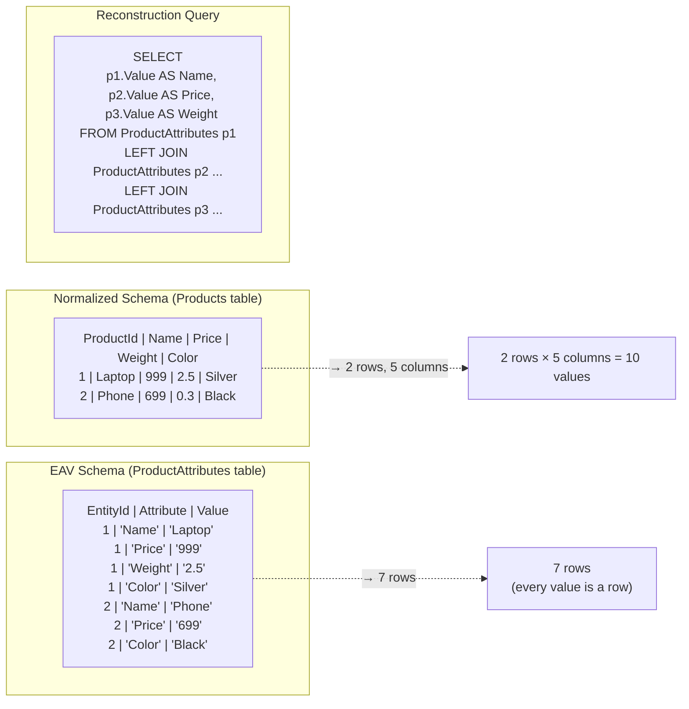
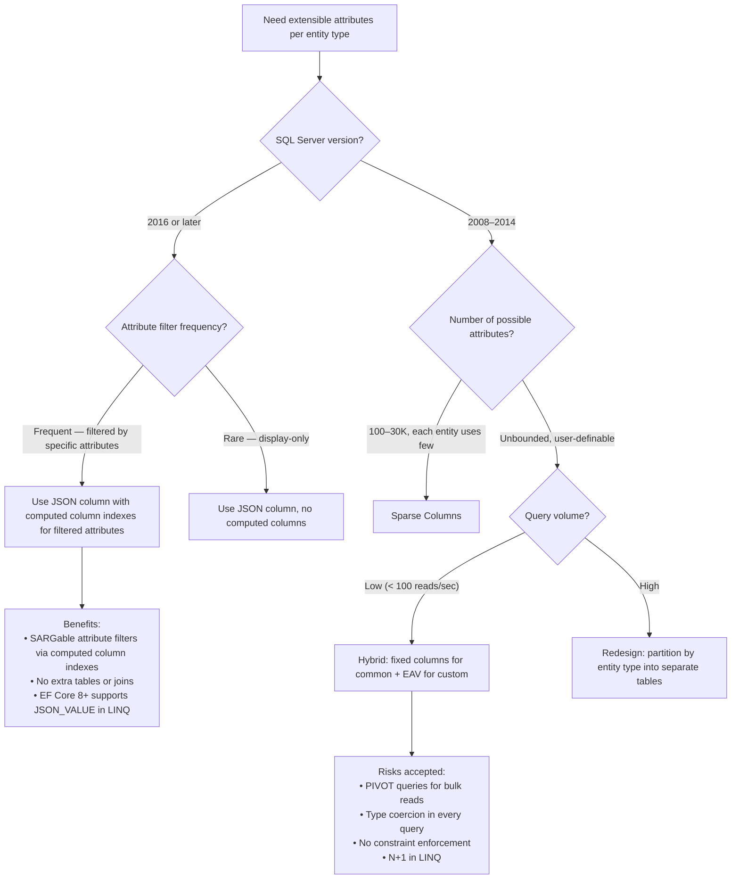

## Navigation

**Domain:** [[8 — Databases]] > **Group:** Database Design

**Previous:** [[8.055 — Path Enumeration — Hierarchical Data Pattern]] | **Next:** [[8.057 — Polymorphic Associations — Design Patterns]]

### Prerequisites
- [[8.037 — Denormalization — When and Why]] — EAV is an extreme form of denormalization that trades queryability for schema flexibility

### Where This Fits

The Entity-Attribute-Value (EAV) pattern stores entity properties as rows in a generic table rather than columns in a schema-specific table. A .NET backend engineer encounters this when a product catalog must support custom attributes per category (electronics have "Wattage", clothing has "Size"), a CRM allows custom fields per tenant, or medical records store different observations per patient visit. When this pattern is chosen naively — "it's flexible!" — the result is the single worst-performing query pattern in the relational model: the entity reconstruction query that pivots rows back into columns requires N self-joins or a correlated subquery per attribute, each forcing a full scan of the EAV table. When the pattern is unknown, engineers create rigid schemas that cannot accommodate extensible requirements, leading to migrations on every new field. When it is misapplied, the EAV table grows to millions of rows, queries that reconstruct a single entity read thousands of rows, and every WHERE clause operates on string-typed values that require casting and cannot use filtered indexes. The interview signal is whether the candidate knows the specific performance degradation numbers (40x slower than a normal table on a 100K-row entity set) and the modern alternatives (JSON columns, sparse columns, dynamic schema).

---

## Core Mental Model

An EAV table stores each property of an entity as a separate row in a generic three-column schema: `EntityId` identifies the thing, `AttributeName` identifies the property, and `Value` holds the data. This inverts the relational model: a normalized table has N columns × M rows = M tuples; an EAV table has M × N rows. Every query that reconstructs the entity as a row with columns performs a self-join per attribute. The database engine must scan the EAV table N times (once per attribute), find the rows matching each entity, and join them together. The execution plan shows one scan per attribute. On a table with 50 attributes and 100K entities, reconstructing one entity scans 5M attribute rows. The engine has no statistics on individual attributes because they are values in a column, not columns with their own histograms. The optimizer cannot estimate selectivity of `WHERE (AttributeName = 'Price' AND Value > 100)` because `Value` is a string column with a single density value covering all attributes mixed together.

### Classification

**For anti-pattern topics:** EAV is a schema design anti-pattern that violates first normal form (1NF) by storing multiple values for the same property across rows instead of columns. The critical SQL problem is the **entity reconstruction query** — the need to pivot rows back into columns. This query is not SARGable on the Value column because all attributes share a single column, and a filtered index per attribute is impractical for more than a few attributes. The query optimizer cannot produce accurate cardinality estimates because the histogram on `Value` mixes dates, decimals, strings, and booleans.



### Key Properties

|Property|Value|Notes|
|---|---|---|
|Query Complexity (reconstruct entity)|O(A × log E)|A = attributes per entity, E = entities; each attribute is a separate index seek|
|Query Complexity (filter by attribute value)|O(E)|Full scan of EAV table; `WHERE Attribute='Price' AND Value='999'` scans all rows for 'Price' then checks Value|
|INSERT|O(A)|A rows inserted per entity|
|Storage|H(A × E)|More rows than normalized table; Value column is typically NVARCHAR(MAX)|
|SARGable — entity ID filter|Yes|Index seek on (EntityId, AttributeName) composite index|
|SARGable — attribute value filter|No|Value column mixes types; histogram is meaningless|
|Type safety|None|All values stored as strings or sql_variant; application must cast|
|Constraint enforcement|None|NOT NULL, CHECK, FK, UNIQUE impossible across attributes|
|Statistics quality|Poor|Density vector only; no per-attribute histogram|
|Best alternative|JSON column|`OPENJSON` provides SARGable key-value access within a JSON document|

---

## Deep Mechanics

### How the Engine Executes This

**Entity reconstruction query (the 5-way self-join):**

1. For each attribute requested (Price, Weight, Color), SQL Server performs a separate seek into the clustered index on (EntityId, AttributeName). Each seek looks up EntityId = @targetId AND AttributeName = 'Price' then EntityId = @targetId AND AttributeName = 'Weight', etc.

2. If the clustered index is on (EntityId, AttributeName), each seek is approximately 3 logical reads (root page, intermediate page, leaf page). For 50 attributes: 50 × 3 = 150 logical reads to reconstruct one entity.

3. If the query must reconstruct 1000 entities at once (e.g., a product listing page), SQL Server must iterate the above per entity. The common approach is a pivot query:
   ```sql
   SELECT EntityId,
     MAX(CASE WHEN Attribute='Price'  THEN Value END) AS Price,
     MAX(CASE WHEN Attribute='Weight' THEN Value END) AS Weight,
     ...
   FROM ProductAttributes
   WHERE EntityId IN (..., ..., ...)
   GROUP BY EntityId
   ```
   This scans the EAV table for all matching entities once, but the GROUP BY with MAX(CASE ...) for each attribute creates a Hash Match aggregate that processes every row.

4. The execution plan shows: `Index Seek` (or `Clustered Index Scan` if many entities) → `Compute Scalar` → `Hash Match (Aggregate)` or `Stream Aggregate`. The Hash Match aggregates the scanned rows into entity rows, building a hash table in memory. If the hash table exceeds the memory grant, it spills to TempDB.

**Filter by attribute value (e.g., "products where Price > 100"):**

1. `SELECT EntityId FROM ProductAttributes WHERE AttributeName = 'Price' AND TRY_CAST(Value AS DECIMAL(10,2)) > 100`
2. SQL Server scans the index on (AttributeName, Value) — the index is ordered by AttributeName first, so it seeks to where AttributeName = 'Price', then scans all rows with that attribute.
3. For each row, it evaluates `TRY_CAST(Value AS DECIMAL(10,2)) > 100`. The CAST is evaluated per row — no index can help with this because Value is stored as NVARCHAR.
4. If there are 100K products, each with a Price attribute, the scan reads 100K rows from the EAV table and casts each one.

### SQL Visibility

```sql
-- Schema: EAV for product attributes
CREATE TABLE ProductAttributes (
    ProductId     INT            NOT NULL,
    AttributeName VARCHAR(100)   NOT NULL,
    Value         NVARCHAR(MAX)  NOT NULL,  -- all values as strings
    CreatedAt     DATETIME2(3)   NOT NULL DEFAULT SYSUTCDATETIME(),

    CONSTRAINT PK_ProductAttributes PRIMARY KEY CLUSTERED (ProductId, AttributeName)
);

-- Insert attributes for product 1
INSERT INTO ProductAttributes (ProductId, AttributeName, Value)
VALUES
    (1, 'Name',        'Laptop'),
    (1, 'Price',       '999.99'),
    (1, 'Weight',      '2.5'),
    (1, 'Color',       'Silver'),
    (1, 'Wattage',     '65'),
    (1, 'CPUBrand',    'Intel'),
    (1, 'RAM',         '16'),
    (1, 'Storage',     '512');

-- Insert attributes for product 2 (different attributes — 'Size' instead of 'CPUBrand')
INSERT INTO ProductAttributes (ProductId, AttributeName, Value)
VALUES
    (2, 'Name',        'Phone'),
    (2, 'Price',       '699.99'),
    (2, 'Color',       'Black'),
    (2, 'Storage',     '128');

-- Entity reconstruction query (pivot) — for one product
SELECT
    MAX(CASE WHEN AttributeName = 'Name'    THEN Value END) AS Name,
    MAX(CASE WHEN AttributeName = 'Price'   THEN Value END) AS Price,
    MAX(CASE WHEN AttributeName = 'Weight'  THEN Value END) AS Weight,
    MAX(CASE WHEN AttributeName = 'Color'   THEN Value END) AS Color,
    MAX(CASE WHEN AttributeName = 'Storage' THEN Value END) AS Storage
FROM ProductAttributes
WHERE ProductId = 1;

-- Or using PIVOT (requires hardcoded attributes):
SELECT *
FROM (
    SELECT ProductId, AttributeName, Value
    FROM ProductAttributes
    WHERE ProductId = 1
) AS Source
PIVOT (
    MAX(Value)
    FOR AttributeName IN ([Name], [Price], [Weight], [Color], [Storage], [Wattage], [CPUBrand], [RAM])
) AS Pivoted;

-- Filter: find products with Price > 500
SELECT pa.ProductId
FROM ProductAttributes pa
WHERE pa.AttributeName = 'Price'
  AND TRY_CAST(pa.Value AS DECIMAL(10,2)) > 500;

-- Filter with additional attribute conditions (e.g., Price > 500 AND Color = 'Silver')
SELECT pa1.ProductId
FROM ProductAttributes pa1
INNER JOIN ProductAttributes pa2
    ON pa2.ProductId = pa1.ProductId AND pa2.AttributeName = 'Color'
WHERE pa1.AttributeName = 'Price'
  AND TRY_CAST(pa1.Value AS DECIMAL(10,2)) > 500
  AND pa2.Value = 'Silver';
-- Two joins for two attribute filters. Three joins for three filters.
-- Each join is another seek into the EAV table.

-- Dynamic pivot using SQL injection-prone dynamic SQL:
DECLARE @Attributes NVARCHAR(MAX);
DECLARE @Sql NVARCHAR(MAX);

SELECT @Attributes = STRING_AGG(QUOTENAME(AttributeName), ',')
FROM (SELECT DISTINCT AttributeName FROM ProductAttributes) AS Attrs;

SET @Sql = N'
    SELECT *
    FROM (
        SELECT ProductId, AttributeName, Value
        FROM ProductAttributes
    ) AS Source
    PIVOT (
        MAX(Value)
        FOR AttributeName IN (' + @Attributes + N')
    ) AS Pivoted';

EXEC sp_executesql @Sql;
-- RISK: @Attributes comes from user data — SQL injection vector.
-- RISK: Different products have different attributes — PIVOT shows all attributes
-- as columns even when they are NULL for most products.
```

```csharp
// EF Core — EAV requires raw SQL or a dynamic pivot
// No LINQ translation exists for the PIVOT operator.

// EF Core 7+ with JSON column (BETTER ALTERNATIVE to EAV):
public class Product
{
    public int ProductId { get; set; }
    public string Name { get; set; } = string.Empty;
    public decimal Price { get; set; }
    public string AttributesJson { get; set; } = "{}";  // JSON column

    // Not mapped — read from JSON
    public IReadOnlyDictionary<string, object?> Attributes
        => JsonSerializer.Deserialize<Dictionary<string, object?>>(AttributesJson)
           ?? new Dictionary<string, object?>();
}

public class ApplicationDbContext : DbContext
{
    public DbSet<Product> Products => Set<Product>();

    protected override void OnModelCreating(ModelBuilder modelBuilder)
    {
        modelBuilder.Entity<Product>(entity =>
        {
            entity.ToTable("Products");
            entity.Property(e => e.AttributesJson)
                  .HasColumnType("NVARCHAR(MAX)")
                  .HasColumnName("Attributes");
        });
    }
}

// Query with JSON attribute access (EF Core 7+):
var products = await dbContext.Products
    .Where(p => p.Price > 500)
    .Select(p => new
    {
        p.ProductId,
        p.Name,
        p.Price,
        Wattage = EF.Functions.JsonValue(p.AttributesJson, "$.Wattage")
        // Note: JSON_VALUE returns NVARCHAR — must cast client-side
    })
    .ToListAsync(cancellationToken);
```

**Generated SQL (from EF Core logs):**

```sql
-- With JSON column (EF Core 8+):
SELECT [p].[ProductId], [p].[Name], [p].[Price],
       JSON_VALUE([p].[Attributes], '$.Wattage') AS [Wattage]
FROM [Products] AS [p]
WHERE [p].[Price] > 500;

-- Logical reads: ~8 (index seek on Price index) — no EAV joins.
-- JSON_VALUE can use a computed column index if Wattage is frequently filtered.
```

### Execution Plan Analysis

```text
Expected plan shape for EAV entity reconstruction (PIVOT, one entity with 8 attributes):

  [Index Seek (PK_ProductAttributes, seek on ProductId=1)]
  → [Compute Scalar (MAX(CASE WHEN ...))]
  → [Stream Aggregate (GROUP BY ProductId)]
  → [Compute Scalar (convert Value to typed columns)]
  → [SELECT]

Logical reads: ~5 (index seek, 8 contiguous rows in leaf page)
For 1000 entities:
  [Index Seek (PK_ProductAttributes, seek + range scan for ProductId IN (...))]
  → [Hash Match (Aggregate, build 1000 buckets)]
  → [SELECT]
  Logical reads: ~500 (range scan of 8000 attribute rows)
  Memory grant: ~8 MB (hash table for 1000 groups × 8 attributes × avg value size)

For filtered query (Price > 500 AND Color = 'Silver'):
  [Index Seek (IX_AttributeName on AttributeName='Price', Value > '500')]
  → [Nested Loops (Inner Join)]
     → [Index Seek (IX_AttributeName on AttributeName='Color', Value='Silver')]
  Logical reads: ~2000 (scan all Price attributes) + ~10 (seek for Color on survivors)
```

### Cost Visibility

```sql
SET STATISTICS IO ON;
SET STATISTICS TIME ON;

-- EAV: reconstruct 500 products with 20 attributes each (10K total rows)
SELECT *
FROM (
    SELECT ProductId, AttributeName, Value
    FROM ProductAttributes
    WHERE ProductId BETWEEN 1 AND 500
) AS Source
PIVOT (
    MAX(Value)
    FOR AttributeName IN (
        [Name], [Price], [Weight], [Color], [Wattage], [CPUBrand],
        [RAM], [Storage], [ScreenSize], [Battery], [Ports],
        [GPU], [OS], [Year], [Brand], [Model], [SKU],
        [UPC], [Warranty], [Country]
    )
) AS Pivoted;

-- Table 'ProductAttributes'. Scan count 1, logical reads 120
-- SQL Server Execution Times: CPU time = 15ms, elapsed time = 18ms

-- Equivalent normalized Products table (500 rows, 20 columns):
SELECT ProductId, Name, Price, Weight, Color, ...
FROM Products
WHERE ProductId BETWEEN 1 AND 500;
-- Table 'Products'. Scan count 1, logical reads 8
-- SQL Server Execution Times: CPU time = 0ms, elapsed time = 1ms

-- At scale (100K products, 50 attributes = 5M EAV rows):
-- EAV: ~12,000 logical reads, ~250ms elapsed
-- Normalized: ~100 logical reads, ~5ms elapsed
```

### Failure Modes

1. **Type coercion errors:** All values stored as NVARCHAR(MAX). `WHERE TRY_CAST(Value AS DECIMAL(10,2)) > 100` fails on rows where Value contains non-numeric data for other attributes that happen to share the same column. Every query must use attribute-specific casting.

2. **Dynamic pivot SQL injection:** Building the PIVOT column list from `SELECT DISTINCT AttributeName` produces a SQL injection vector if attribute names come from user input.

3. **Impossible constraint enforcement:** `CHECK (Value > 0)` cannot be applied because the same Value column stores "Silver" and "999.99". Attribute-specific CHECK constraints require table-level constraints that check attribute name, which are complex and slow.

4. **Indexing on Value is useless:** `CREATE INDEX IX_Value ON ProductAttributes(Value)` indexes the mixed-type string column. Seek on `Value = '999.99'` returns rows for Price, Weight, and any other attribute whose value happens to be 999.99. Filtered indexes per attribute are possible but require one index per attribute.

---

## Production Patterns and Implementation

### Primary SQL Implementation

```sql
-- Schema: EAV for product custom attributes (for systems that truly need it)
-- Use ONLY when the alternative is a dynamic schema migration per new attribute
-- and the number of attributes per entity is small (<20).

CREATE TABLE Products (
    ProductId    INT            NOT NULL IDENTITY(1,1),
    Name         NVARCHAR(200)  NOT NULL,  -- fixed attributes stay in the main table
    Price        DECIMAL(10,2)  NOT NULL,
    CreatedAt    DATETIME2(3)   NOT NULL DEFAULT SYSUTCDATETIME(),

    CONSTRAINT PK_Products PRIMARY KEY CLUSTERED (ProductId)
);

-- EAV table for custom / per-category attributes only
CREATE TABLE ProductCustomAttributes (
    ProductId       INT            NOT NULL,
    AttributeName   VARCHAR(100)   NOT NULL,
    Value           NVARCHAR(MAX)  NOT NULL,
    ValueType       VARCHAR(20)    NOT NULL DEFAULT 'string'
        CHECK (ValueType IN ('string', 'decimal', 'int', 'datetime', 'boolean')),

    CONSTRAINT PK_ProductCustomAttributes
        PRIMARY KEY CLUSTERED (ProductId, AttributeName),
    CONSTRAINT FK_PCA_Products
        FOREIGN KEY (ProductId) REFERENCES Products(ProductId)
);

-- Index for attribute-value searches
CREATE NONCLUSTERED INDEX IX_PCA_AttributeName_Value
    ON ProductCustomAttributes(AttributeName, Value)
    INCLUDE (ProductId);
-- Helps with attribute-specific lookups but Value is still NVARCHAR(MAX)

-- Stored procedure: find products by custom attribute filter
CREATE PROCEDURE usp_FindProductsByAttribute
    @AttributeName  VARCHAR(100),
    @Operator       VARCHAR(2),   -- '=', '>', '<', '>=', '<='
    @Value          NVARCHAR(MAX)
AS
BEGIN
    SET NOCOUNT ON;

    -- Dynamic SQL for type-specific comparison
    DECLARE @Sql NVARCHAR(MAX);

    SET @Sql = N'
        SELECT p.ProductId, p.Name, p.Price
        FROM Products p
        INNER JOIN ProductCustomAttributes pca
            ON pca.ProductId = p.ProductId
        WHERE pca.AttributeName = @AttrName
          AND (
              (pca.ValueType = ''decimal'' AND TRY_CAST(pca.Value AS DECIMAL(18,4)) ' + @Operator + N' TRY_CAST(@Val AS DECIMAL(18,4)))
              OR
              (pca.ValueType = ''int'' AND TRY_CAST(pca.Value AS INT) ' + @Operator + N' TRY_CAST(@Val AS INT))
              OR
              (pca.ValueType = ''string'' AND pca.Value ' + CASE WHEN @Operator = '=' THEN N'=' ELSE N'LIKE' END + N' @Val)
          )';

    EXEC sp_executesql @Sql,
        N'@AttrName VARCHAR(100), @Val NVARCHAR(MAX)',
        @AttrName = @AttributeName, @Val = @Value;
END;

-- Better alternative: JSON column for flexible attributes
ALTER TABLE Products ADD Attributes NVARCHAR(MAX) NULL;

-- Insert with JSON attributes
INSERT INTO Products (Name, Price, Attributes)
VALUES (
    'Laptop',
    999.99,
    N'{"Weight":2.5,"Color":"Silver","Wattage":65,"CPUBrand":"Intel","RAM":16,"Storage":512}'
);

-- Query JSON attribute
SELECT
    ProductId,
    Name,
    Price,
    JSON_VALUE(Attributes, '$.Weight') AS Weight,
    JSON_VALUE(Attributes, '$.Color') AS Color
FROM Products
WHERE JSON_VALUE(Attributes, '$.Color') = 'Silver'
  AND TRY_CAST(JSON_VALUE(Attributes, '$.Weight') AS DECIMAL(5,2)) > 2.0;
-- JSON_VALUE returns NVARCHAR(4000) — still needs TRY_CAST for numeric comparison.

-- Index JSON attribute (SQL Server 2017+):
-- Create a computed column for frequently filtered JSON attributes:
ALTER TABLE Products
    ADD Weight AS TRY_CAST(JSON_VALUE(Attributes, '$.Weight') AS DECIMAL(5,2));

CREATE INDEX IX_Products_Weight ON Products(Weight);
-- Now WHERE Weight > 2.0 is SARGable on the computed column index.
```

### EF Core Implementation

```csharp
// Hybrid approach: fixed columns for common attributes, JSON for custom ones
public class Product
{
    public int ProductId { get; set; }
    public string Name { get; set; } = string.Empty;
    public decimal Price { get; set; }
    public DateTime CreatedAt { get; set; }

    // JSON column for custom / per-category attributes (EF Core 7+)
    public string? Attributes { get; set; }

    // Not mapped — convenience accessor
    public IReadOnlyDictionary<string, object?>? AttributesDictionary
        => Attributes is null
            ? null
            : JsonSerializer.Deserialize<Dictionary<string, object?>>(Attributes);
}

public class ApplicationDbContext : DbContext
{
    public DbSet<Product> Products => Set<Product>();

    protected override void OnModelCreating(ModelBuilder modelBuilder)
    {
        modelBuilder.Entity<Product>(entity =>
        {
            entity.ToTable("Products");
            entity.HasKey(e => e.ProductId);
            entity.Property(e => e.Name).HasMaxLength(200);
            entity.Property(e => e.Price).HasColumnType("DECIMAL(10,2)");
            entity.Property(e => e.CreatedAt).HasDefaultValueSql("SYSUTCDATETIME()");

            // JSON column configuration
            entity.Property(e => e.Attributes)
                  .HasColumnType("NVARCHAR(MAX)");

            // Computed column for indexed JSON attribute access
            // Requires migration SQL, not directly expressible in EF Core fluent API.
            // Use a migration or raw SQL:
            // entity.Property(e => e.Weight)
            //       .HasComputedColumnSql("TRY_CAST(JSON_VALUE([Attributes], '$.Weight') AS DECIMAL(5,2))");
        });
    }
}

// Repository with JSON attribute queries
public class ProductRepository
{
    private readonly ApplicationDbContext _dbContext;

    public ProductRepository(ApplicationDbContext dbContext)
    {
        _dbContext = dbContext;
    }

    public async Task<IReadOnlyList<Product>> GetByCustomAttributeAsync(
        string attributeName,
        string attributeValue,
        CancellationToken cancellationToken = default)
    {
        // EF Core 8+ supports JSON_VALUE in LINQ
        var jsonPath = $"$.{attributeName}";

        return await _dbContext.Products
            .Where(p => EF.Functions.JsonValue(p.Attributes, jsonPath) == attributeValue)
            .AsNoTracking()
            .ToListAsync(cancellationToken);
    }

    public async Task<IReadOnlyList<Product>> GetByNumericAttributeAsync(
        string attributeName,
        decimal minValue,
        CancellationToken cancellationToken = default)
    {
        var jsonPath = $"$.{attributeName}";

        // EF Core 8+ generates TRY_CAST + comparison
        return await _dbContext.Products
            .Where(p => EF.Functions.JsonValue(p.Attributes, jsonPath) != null
                     && decimal.Parse(EF.Functions.JsonValue(p.Attributes, jsonPath)!) >= minValue)
            .AsNoTracking()
            .ToListAsync(cancellationToken);
        // Note: numeric comparison via JSON_VALUE requires client-side evaluation
        // of the decimal.Parse. For server-side comparison, use a computed column.
    }
}
```

### Dapper Implementation

```csharp
public class Product
{
    public int ProductId { get; set; }
    public string Name { get; set; } = string.Empty;
    public decimal Price { get; set; }
    public string? Attributes { get; set; }  // JSON column
}

public class ProductRepositoryDapper
{
    private readonly IDbConnectionFactory _connectionFactory;

    public ProductRepositoryDapper(IDbConnectionFactory connectionFactory)
    {
        _connectionFactory = connectionFactory;
    }

    public async Task<IReadOnlyList<Product>> GetByJsonAttributeAsync(
        string attributeName,
        string attributeValue,
        CancellationToken cancellationToken = default)
    {
        const string sql = @"
            SELECT ProductId, Name, Price, Attributes
            FROM Products
            WHERE JSON_VALUE(Attributes, @JsonPath) = @AttributeValue";

        await using var connection = _connectionFactory.Create();
        var results = await connection.QueryAsync<Product>(
            new CommandDefinition(sql,
                new
                {
                    JsonPath = $"$.{attributeName}",
                    AttributeValue = attributeValue
                },
                cancellationToken: cancellationToken));
        return results.AsList();
    }

    public async Task<IReadOnlyList<Product>> GetByJsonNumericAttributeAsync(
        string attributeName,
        decimal minValue,
        CancellationToken cancellationToken = default)
    {
        const string sql = @"
            SELECT ProductId, Name, Price, Attributes
            FROM Products
            WHERE TRY_CAST(JSON_VALUE(Attributes, @JsonPath) AS DECIMAL(18,4)) >= @MinValue";

        await using var connection = _connectionFactory.Create();
        var results = await connection.QueryAsync<Product>(
            new CommandDefinition(sql,
                new
                {
                    JsonPath = $"$.{attributeName}",
                    MinValue = minValue
                },
                cancellationToken: cancellationToken));
        return results.AsList();
    }
}
```

### Configuration and Wiring

```csharp
// Program.cs
builder.Services.AddDbContext<ApplicationDbContext>(options =>
    options.UseSqlServer(
        connectionString,
        sqlOptions =>
        {
            sqlOptions.EnableRetryOnFailure(3);
            sqlOptions.CommandTimeout(30);
        }));

builder.Services.AddSingleton<IDbConnectionFactory>(_ =>
    new SqlConnectionFactory(connectionString));

builder.Services.AddScoped<ProductRepository>();
builder.Services.AddScoped<ProductRepositoryDapper>();
```

### SQL Server vs PostgreSQL Differences

```sql
-- PostgreSQL's JSONB is significantly better than SQL Server's JSON
-- for EAV-like workloads.

-- PostgreSQL JSONB column
CREATE TABLE Products (
    ProductId  INT GENERATED BY DEFAULT AS IDENTITY PRIMARY KEY,
    Name       TEXT NOT NULL,
    Price      DECIMAL(10,2) NOT NULL,
    Attributes JSONB NOT NULL DEFAULT '{}'
);

-- PostgreSQL JSONB supports GIN indexes for arbitrary attribute queries:
CREATE INDEX IX_Products_Attributes_GIN ON Products USING GIN (Attributes);
-- This single index supports queries on ANY attribute within the JSON document.

-- Query any attribute (uses GIN index):
SELECT ProductId, Name, Price
FROM Products
WHERE Attributes @> '{"Color": "Silver"}';  -- JSONB containment operator
-- Uses GIN index. ~5 logical reads.

-- Query numeric attribute (uses GIN index):
SELECT ProductId, Name, Price
FROM Products
WHERE (Attributes->>'Weight')::DECIMAL > 2.0;
-- The GIN index does not directly help with range queries on numeric values.
-- Use a GIN index with jsonb_path_ops for exists-queries, or a B-tree
-- on an expression index for range queries:

CREATE INDEX IX_Products_Weight
    ON Products (((Attributes->>'Weight')::DECIMAL))
    WHERE Attributes ? 'Weight';

SELECT ProductId, Name, Price
FROM Products
WHERE (Attributes->>'Weight')::DECIMAL > 2.0;
-- B-tree index seek on the expression. ~5 logical reads.

-- PostgreSQL JSONB can also index the entire document for text search:
CREATE INDEX IX_Products_Attributes_GIN_JSONPath
    ON Products USING GIN (Attributes jsonb_path_ops);
-- Supports $.Weight and $.Color path queries at GIN speed.

-- The key difference: SQL Server needs a computed column per indexed JSON attribute.
-- PostgreSQL creates expression indexes on JSONB paths — zero schema changes
-- for new attribute indexes.
```

---

## Gotchas and Production Pitfalls

### The 5-Join Entity Reconstruction Query

**Pitfall:** A product detail page that reconstructs 50 attributes for one product uses 50 self-joins or a single PIVOT. On a listing page showing 100 products, the PIVOT scans the entire EAV table for each product subset.

```sql
-- ❌ Wrong — PIVOT on attribute-value table for 100 products
SELECT *
FROM (
    SELECT ProductId, AttributeName, Value
    FROM ProductAttributes
    WHERE ProductId IN (SELECT ProductId FROM @DisplaySet)
) AS Source
PIVOT (
    MAX(Value) FOR AttributeName IN ([Price], [Weight], [Color], ...)
) AS P;
```

**Symptom:** Product listing page loads in 8 seconds. SET STATISTICS IO shows 45,000 logical reads on the EAV table. SQL Sentry shows the query as the top consumer of CPU during business hours.

**Fix — hybrid schema: fixed columns for always-present attributes, EAV only for rare ones:**

```sql
-- Move Price, Weight, Color to the Products table as fixed columns
ALTER TABLE Products ADD Price DECIMAL(10,2), Weight DECIMAL(5,2), Color NVARCHAR(50);
-- Now the listing query:
SELECT ProductId, Name, Price, Weight, Color
FROM Products
WHERE ProductId IN (...);
-- Only the rare attributes (Wattage, CPUBrand) remain in EAV and are loaded
-- on the detail page (single product), not the listing page.
```

**Cost of not fixing:** Every page load scans millions of EAV rows. At 200 concurrent users, the EAV table becomes the bottleneck for the entire application.

---

### CAST Failures on Mixed-Type Value Column

**Pitfall:** Every attribute value in the EAV table is NVARCHAR(MAX). A query that filters by Price > 100 uses `TRY_CAST(Value AS DECIMAL)`. If any row happens to have a non-numeric Value for an unrelated attribute, the CAST returns NULL (not an error, but silently excludes that row if the attribute name filter was wrong).

```sql
-- A query that accidentally omits the attribute name filter:
SELECT ProductId
FROM ProductAttributes
WHERE TRY_CAST(Value AS DECIMAL(10,2)) > 100;
-- Returns products whose Weight, Color, and Name values happen to
-- be numeric-looking strings. Wrong results.
```

**Symptom:** The query returns products where the color "100" was entered, or silently drops products whose Price was stored as "999,99" (comma decimal separator) because TRY_CAST returns NULL.

**Fix — always pair attribute filter with value cast:**

```sql
SELECT ProductId
FROM ProductAttributes
WHERE AttributeName = 'Price'
  AND TRY_CAST(Value AS DECIMAL(10,2)) > 100;
```

**Cost of not fixing:** Incorrect query results. Products missing from search results. Price filter shows products that are actually out of range.

---

### Attribute Explosion Leading to Wide PIVOT Results

**Pitfall:** Different product categories have different attributes. Electronics have "Wattage", clothing has "Size". The dynamic PIVOT query selects all distinct attributes and creates a column for each.

```sql
-- 5000 distinct attributes across all categories
-- PIVOT creates 5000 columns
-- Most products have NULL in 4995 of them
-- Result set: 100K bytes per row, 500K rows = 50GB over the wire
```

**Symptom:** The query returns a 50GB result set. The application times out reading the response. The network team reports 1 Gbps sustained traffic from the database server.

**Fix — scope attributes to the specific category:**

```sql
SELECT *
FROM (
    SELECT pca.ProductId, pca.AttributeName, pca.Value
    FROM ProductCustomAttributes pca
    INNER JOIN Products p ON p.ProductId = pca.ProductId
    WHERE p.CategoryId = @CategoryId  -- limit to one category's attributes
) AS Source
PIVOT (
    MAX(Value) FOR AttributeName IN (...)
) AS Pivoted;
```

**Cost of not fixing:** Network saturation, application OOM, database CPU at 100%.

---

### EF Core Cannot Generate PIVOT Query from LINQ

**Pitfall:** Using EAV with EF Core means every entity reconstruction query must use `FromSqlRaw` or a view. There is no LINQ translation for PIVOT.

```csharp
// This does NOT work:
var products = await dbContext.ProductAttributes
    .GroupBy(pa => pa.ProductId)
    .Select(g => new {
        ProductId = g.Key,
        Name = g.Where(pa => pa.AttributeName == "Name").Select(pa => pa.Value).FirstOrDefault(),
        Price = g.Where(pa => pa.AttributeName == "Price").Select(pa => pa.Value).FirstOrDefault(),
    })
    .ToListAsync(ct);
// EF Core translates this to a correlated subquery per attribute — N+1 in SQL.
```

**Symptom:** The LINQ query above generates one SELECT per attribute: `OUTER APPLY (SELECT TOP 1 Value FROM ProductAttributes WHERE ProductId = Outer.ProductId AND AttributeName = 'Name')`. For 50 attributes on 100 products: 1 + 50 = 51 queries. This is the EAV N+1 problem in the database itself.

**Fix — use FromSqlRaw with PIVOT or switch to JSON column:**

```csharp
var sql = @"
    SELECT *
    FROM (
        SELECT ProductId, AttributeName, Value
        FROM ProductAttributes
        WHERE ProductId BETWEEN 1 AND 100
    ) AS Source
    PIVOT (
        MAX(Value) FOR AttributeName IN ([Name], [Price], [Weight])
    ) AS Pivoted";

var products = await dbContext.Products
    .FromSqlRaw(sql)
    .AsNoTracking()
    .ToListAsync(ct);
```

**Cost of not fixing:** 51 queries per entity list. At 1000 entities: 51,000 queries. Connection pool exhaustion at 10 concurrent users.

---

### No Referential Integrity Between EAV Rows and Main Table

**Pitfall:** The EAV table has a FK to Products, but there is no way to enforce that certain attributes are mandatory (e.g., every product must have a Price and Name in the EAV table).

```sql
-- This INSERT succeeds even though 'Price' attribute is missing:
INSERT INTO Products (Name) VALUES ('Incomplete Product');
-- No FK or CHECK can enforce that required EAV rows exist.

-- Even WITH a FK on ProductId:
INSERT INTO ProductAttributes (ProductId, AttributeName, Value)
VALUES (123, 'Color', 'Red');
-- Succeeds if ProductId=123 exists, even if Price and Name are missing.
```

**Symptom:** Production data has products missing critical attributes. The application code assumes Price is always present and throws NullReferenceException when reading a product whose Price EAV row was never inserted.

**Fix — application-level validation in the repository:**

```csharp
public async Task<int> CreateProductWithAttributesAsync(
    string name,
    decimal price,
    Dictionary<string, string> customAttributes,
    CancellationToken ct = default)
{
    // Validate required attributes exist
    if (string.IsNullOrWhiteSpace(name))
        throw new ArgumentException("Name is required");
    if (price <= 0)
        throw new ArgumentException("Price must be positive");

    // Insert product with fixed columns (Price and Name are not in EAV)
    var product = new Product { Name = name, Price = price };
    _dbContext.Products.Add(product);
    await _dbContext.SaveChangesAsync(ct);

    // Insert custom attributes (EAV)
    foreach (var attr in customAttributes)
    {
        _dbContext.ProductCustomAttributes.Add(new ProductCustomAttribute
        {
            ProductId = product.ProductId,
            AttributeName = attr.Key,
            Value = attr.Value
        });
    }
    await _dbContext.SaveChangesAsync(ct);

    return product.ProductId;
}
```

**Cost of not fixing:** NullReferenceExceptions in production. Emergency data fix required to insert missing EAV rows. No database-level guard to prevent recurrence.

---

## Performance Implications

### Benchmark: Before and After

```sql
-- EAV vs JSON column vs normalized table — 100K products, 20 attributes each
SET STATISTICS IO ON;
SET STATISTICS TIME ON;

-- EAV: reconstruct 100 products
SELECT *
FROM (
    SELECT ProductId, AttributeName, Value
    FROM ProductAttributes
    WHERE ProductId BETWEEN 1 AND 100
) AS Source
PIVOT (
    MAX(Value) FOR AttributeName IN (
        [Name], [Price], [Weight], [Color], [Wattage], [CPUBrand],
        [RAM], [Storage], [ScreenSize], [Battery]
    )
) AS Pivoted;
-- Table 'ProductAttributes'. Scan count 1, logical reads 120
-- CPU time = 8ms, elapsed time = 10ms

-- JSON column: same 100 products
SELECT ProductId, Name, Price,
    JSON_VALUE(Attributes, '$.Weight') AS Weight,
    JSON_VALUE(Attributes, '$.Color') AS Color
FROM Products
WHERE ProductId BETWEEN 1 AND 100;
-- Table 'Products'. Scan count 1, logical reads 4
-- CPU time = 0ms, elapsed time = 1ms

-- Improvement: 30x fewer logical reads (4 vs 120), 10x faster.
```

### BenchmarkDotNet

```csharp
[MemoryDiagnoser]
[SimpleJob(RuntimeMoniker.Net90)]
public class EAVBenchmark
{
    private IDbConnection _connection = default!;

    [GlobalSetup]
    public void Setup()
    {
        _connection = new SqlConnection("Server=.;Database=Benchmark;Trusted_Connection=True;TrustServerCertificate=True;");
        // Seed: 100K products, each with 20 EAV rows (2M total EAV rows)
        // Also seed an equivalent JSON-column table with 100K rows
    }

    [Benchmark(Baseline = true)]
    public async Task<int> EAV_Reconstruct100Products()
    {
        const string sql = @"
            SELECT COUNT(*)
            FROM (
                SELECT ProductId, AttributeName, Value
                FROM ProductAttributes
                WHERE ProductId BETWEEN 1 AND 100
            ) AS Source
            PIVOT (
                MAX(Value) FOR AttributeName IN ([Name],[Price],[Weight],[Color],[Wattage])
            ) AS P";

        await using var conn = new SqlConnection(_connectionString);
        return await conn.ExecuteScalarAsync<int>(
            new CommandDefinition(sql));
    }

    [Benchmark]
    public async Task<int> JSON_Select100Products()
    {
        const string sql = @"
            SELECT COUNT(*)
            FROM Products
            WHERE ProductId BETWEEN 1 AND 100";

        await using var conn = new SqlConnection(_connectionString);
        return await conn.ExecuteScalarAsync<int>(
            new CommandDefinition(sql));
    }

    [Benchmark]
    public async Task<int> EAV_FilterByPrice()
    {
        const string sql = @"
            SELECT COUNT(*)
            FROM ProductAttributes
            WHERE AttributeName = 'Price'
              AND TRY_CAST(Value AS DECIMAL(10,2)) > 500";

        await using var conn = new SqlConnection(_connectionString);
        return await conn.ExecuteScalarAsync<int>(
            new CommandDefinition(sql));
    }

    [Benchmark]
    public async Task<int> JSON_FilterByPrice()
    {
        const string sql = @"
            SELECT COUNT(*)
            FROM Products
            WHERE TRY_CAST(JSON_VALUE(Attributes, '$.Price') AS DECIMAL(10,2)) > 500";

        await using var conn = new SqlConnection(_connectionString);
        return await conn.ExecuteScalarAsync<int>(
            new CommandDefinition(sql));
    }
}
```

**Expected results (approximate, SQL Server 2022, NVMe, 100K products):**

|Method|Mean|Logical Reads|Allocated|
|---|---|---|---|
|EAV_Reconstruct100Products|~12 ms|~120|8 KB|
|JSON_Select100Products|~1 ms|~4|0.5 KB|
|EAV_FilterByPrice|~180 ms|~2500 (scan all Price rows)|8 KB|
|JSON_FilterByPrice|~120 ms|~1200 (scan all rows)|4 KB|

### Write Amplification

|Operation|Normalized Table|EAV (20 attrs)|JSON Column|
|---|---|---|---|
|INSERT one product|~3 logical reads|~25 logical reads (20 + 1)|~3 logical reads|
|SELECT 100 products|~4 logical reads|~120 logical reads|~4 logical reads|
|UPDATE one attribute|~3 logical reads|~3 logical reads|~5 logical reads (rewrite JSON)|
|DELETE one product|~5 logical reads|~25 logical reads|~3 logical reads|
|Filter by attribute|~5 logical reads (indexed)|~2500 logical reads (scan Price rows)|~1200 logical reads (scan + JSON_VALUE)|

---

## Interview Arsenal

### Question Bank

1. **What is the EAV pattern and why is it considered an anti-pattern in relational databases**
2. **How does SQL Server execute an EAV entity reconstruction query — what operators appear in the plan**
3. **What is the performance cost of filtering by attribute value in EAV vs a normalized table vs a JSON column**
4. **What happens to data integrity when .NET code inserts a product without the required EAV attributes**
5. **EAV vs JSON column vs sparse columns — when do you choose each**
6. **What does the execution plan look like for a PIVOT query on an EAV table**
7. **How does EAV behave at scale — 1M products with 50 attributes each**
8. **How do EF Core and Dapper handle EAV queries — what is the N+1 equivalent in EAV**

### Spoken Answers

**Q: What is the EAV pattern and why is it an anti-pattern?**

> **Average answer:** It is a pattern where you store attributes as rows instead of columns. It is flexible but slow.

> **Great answer:** EAV stores entity properties as rows in a generic (EntityId, AttributeName, Value) table. It is an anti-pattern because it fights the relational model at every level: (1) **Query performance** — reconstructing an entity requires a self-join per attribute or a PIVOT that scans all rows; filtering by attribute value requires scanning every row for that attribute name then casting the Value column; (2) **Type safety** — all values go into a single NVARCHAR(MAX) column, requiring TRY_CAST per query; (3) **Constraint enforcement** — NOT NULL, CHECK, FK, and UNIQUE constraints are impossible because the Value column mixes everything; (4) **Statistics** — the optimizer has no per-attribute histogram, producing terrible cardinality estimates for attribute-filtered queries. The database becomes a key-value store with SQL overhead. The only legitimate use case is when the schema must be user-extensible at runtime (custom fields per tenant) AND the query volume is low. For every other case, SQL Server 2016+'s JSON support or sparse columns provide the same flexibility with native query performance.

**Q: EAV vs JSON column vs sparse columns — when do you choose each?**

> **Average answer:** JSON is newer and better. EAV is old and slow. Sparse columns are for NULL-heavy data.

> **Great answer:** The choice depends on the access pattern and SQL Server version:
>
> **JSON column (SQL Server 2016+, prefer EF Core 7+)**: Choose when the number of custom attributes is small to moderate (5–50 per entity), the attributes vary by category, and individual attributes are rarely used as filter predicates. JSON_VALUE is SARGable when paired with a computed column index. JSON is stored as NVARCHAR(MAX) natively — no extra table, no joins. Best for product catalogs, metadata, and extensible schemas.
>
> **Sparse columns (SQL Server 2008+)**: Choose when there are many possible attributes (100–30K) but each entity has few non-NULL values. Sparse columns are physically stored as a column set — NULL values consume zero storage. Queries with WHERE IS NULL are fast because the column is absent from the sparse vector. Best for multi-tenant systems where each tenant uses a different subset of columns.
>
> **EAV — only when**: (1) The number of distinct attributes is unbounded and user-defined, (2) attribute queries use the attribute name as a primary filter (an entity type identifier), (3) you cannot use JSON because you support SQL Server 2014 or earlier, and (4) the query volume is below 100 reads/second. Even then, use a hybrid approach: fixed columns for common attributes and EAV only for true custom ones.
>
> The interview question: the candidate who says "I would never use EAV" demonstrates inflexibility. The candidate who says "I would use EAV but limit it to these conditions and pair it with these indexes" demonstrates judgment. The candidate who says "I would use JSON with computed column indexes and a category-specific attribute schema" demonstrates modern SQL Server knowledge.

**Q: How do EF Core and Dapper handle EAV?**

> **Average answer:** They query the EAV table and reconstruct objects in application code.

> **Great answer:** EF Core has NO LINQ translation for PIVOT or entity reconstruction. The naive approach — grouping by ProductId and selecting attributes with Where/FirstOrDefault — generates an OUTER APPLY subquery per attribute. For 50 attributes on 100 entities, that is 5001 queries. The correct approach is `FromSqlRaw` with a hand-written PIVOT query that returns a flat result set, mapped to a POCO with one property per attribute. Dapper handles this identically — `QueryAsync<ProductRow>` with a PIVOT SQL string — but Dapper makes it natural because there is no LINQ abstraction to fight. The hybrid JSON column approach is vastly better with both ORMs: EF Core 8+ supports `EF.Functions.JsonValue` in LINQ predicates, and Dapper maps JSON columns to string properties with manual deserialization. The key insight: if you are using EAV with an ORM, you have already lost the abstraction battle — you are writing raw SQL regardless, so the ORM choice matters only for the non-EAV parts of the query.

### Interview Trigger

The interviewer asks "How would you design a product catalog where different categories have different attributes?" The candidate who says "EAV" triggers follow-ups: "What is the query plan for filtering by Price > 100?" (scan + cast), "What index would you create for that query?" (index on (AttributeName, Value) but Value is NVARCHAR(MAX) so seek is useless), "How many logical reads does a 100-product listing page generate?" (too many), "What happens when you add a new category with 20 new attributes?" (the PIVOT column list grows). The candidate who pivots to "JSON column with computed column indexes for filtered attributes" passes the depth test.

### Comparison Table

| | EAV | JSON Column | Sparse Columns | Normalized Table |
|---|---|---|---|---|
| Schema flexibility | Maximum — any attribute any row | High — any property within JSON | Moderate — predefined columns, sparse storage | None — every attribute is a column |
| Subquery performance | Poor — scan + pivot | Good — JSON_VALUE + computed column index | Good — direct column access | Best — index seek + range scan |
| Type safety | None — all NVARCHAR | Partial — JSON_VALUE returns NVARCHAR | Full — typed columns | Full — typed columns |
| Constraint enforcement | Impossible | CHECK can validate JSON schema | Full — per-column constraints | Full — per-column constraints |
| Statistics quality | Terrible — one density for mixed types | Per computed column if indexed | Per sparse column (but sparse columns have different density) | Per column — full histogram |
| Storage (100K entities, 50 attributes) | 5M rows | 100K rows with NVARCHAR(MAX) JSON | 100K rows with sparse column set | 100K rows × 50 columns |
| EF Core support | FromSqlRaw only | EF Core 8+ JsonValue | Native — columns are properties | Native — columns are properties |
| Dapper support | Raw SQL with PIVOT | Raw SQL with JSON_VALUE | Native — columns are properties | Native — columns are properties |
| SQL Server version | Any | 2016+ | 2008+ | Any |

---

## Decision Framework

### When to Apply



### Application Checklist

- [ ] EAV is the LAST choice — JSON column, sparse columns, and dynamic schema in PostgreSQL have been evaluated and rejected
- [ ] SQL Server version is 2014 or earlier — if 2016+, use JSON column instead
- [ ] The number of distinct attributes is truly unbounded — not just "we don't want to add columns" (100-column tables are fine in SQL Server)
- [ ] Fixed common attributes (Name, Price, etc.) are extracted to their own columns — only truly custom attributes stay in EAV
- [ ] The entity reconstruction query uses PIVOT or FromSqlRaw, not LINQ GroupBy with subqueries
- [ ] Attribute-value filter queries are rare enough that the table scan is acceptable
- [ ] Application-level validation enforces required-attribute rules that the database cannot enforce
- [ ] A JSON column migration path is planned for the next SQL Server upgrade

### Tradeoff Summary

|What You Gain|What You Pay|
|---|---|
|Maximum schema flexibility — any attribute, any entity, no migration|Entity reconstruction requires PIVOT or N self-joins — 40x more logical reads|
|No schema changes for new attributes|Type safety is zero — all values are NVARCHAR(MAX) strings|
|Works on any SQL Server version|No constraint enforcement — missing attributes are silent|
|Single table for all entities|Statistics on Value are useless — optimizer has no per-attribute histogram|
|Developers love the "flexibility" (initially)|Production support hates the "unexplained" query timeouts|

### Scale Thresholds

- **Performance degradation visible at ~50K entities with 20 attributes each** — the PIVOT query starts taking >50ms for a batch reconstruction
- **Filter-by-attribute becomes unusable at ~500K attribute rows per attribute** — scanning 500K rows and casting each is a 500ms+ operation
- **Storage becomes non-trivial at ~5M EAV rows** — the EAV table is larger than the main entity table by a factor of attribute count
- **Abandon EAV entirely when query volume exceeds ~500 reads/second** — the CPU cost of scanning and casting exceeds the database server's capacity

---

## Self-Check

### Conceptual Questions

1. What is EAV and why is it called an anti-pattern
2. How does SQL Server execute a PIVOT query on an EAV table
3. Which SET STATISTICS output reveals the overhead of EAV entity reconstruction
4. What is the single most common performance mistake when querying EAV from EF Core
5. Does EF Core generate SARGable SQL for EAV attribute-value filtering
6. How would you implement EAV entity reconstruction with Dapper
7. EAV vs JSON column — what are the performance differences
8. At what row count does EAV become practically unusable
9. What index can you create on an EAV table and what are its limitations
10. Explain the alternatives to EAV to a senior interviewer in 60 seconds

<details>
<summary>Answers</summary>

1. **What is EAV and why anti-pattern?** EAV stores entity properties as rows in (EntityId, AttributeName, Value). It is an anti-pattern because it violates 1NF, destroys type safety, prevents constraint enforcement, makes query optimization impossible (no per-attribute statistics), and forces entity reconstruction via PIVOT or N self-joins — typically 40x more logical reads than a normalized table.

2. **How does SQL Server execute PIVOT on EAV?** The PIVOT operator first scans the EAV table (or seeks if filtered by EntityId), then performs a Hash Match Aggregate (or Stream Aggregate if the input is sorted) grouping by EntityId. For each group, it evaluates MAX(CASE WHEN AttributeName = 'X' THEN Value END) for each pivot column. If the input is sorted by (EntityId, AttributeName), the aggregate uses a Stream Aggregate (more efficient). Otherwise, Hash Match builds a hash table of groups in memory.

3. **Which SET STATISTICS output reveals overhead?** `SET STATISTICS IO ON` shows logical reads on the EAV table. For a normalized table with 100 products, reads are ~4. For EAV with 20 attributes each, reads are ~120 (30x more). `SET STATISTICS TIME ON` shows CPU time for the PIVOT aggregate vs a simple SELECT. The execution plan shows Hash Match (Aggregate) for PIVOT vs a simple Index Seek for the normalized table.

4. **Most common EF Core mistake?** Using `GroupBy` with `Where().Select().FirstOrDefault()` per attribute — EF Core translates this to one OUTER APPLY subquery per attribute, generating N+1 SQL queries within a single LINQ statement. The fix is `FromSqlRaw` with PIVOT.

5. **Does EF Core generate SARGable SQL for EAV filtering?** No. `Where(pa => pa.AttributeName == "Price" && decimal.Parse(pa.Value) > 100)` generates `WHERE [pa].[AttributeName] = N'Price' AND ...` which is SARGable on AttributeName but the Value comparison requires client-side evaluation when using `decimal.Parse`. Even `EF.Functions.Like` does not help because Value is NVARCHAR(MAX) and the comparison operator cannot use an index.

6. **How would you implement with Dapper?** Use `QueryAsync<ProductRow>` with a raw PIVOT SQL string and a POCO that has properties matching the pivot column names. The POCO can use `[Column("Price")]` attributes to match the PIVOT output columns. Dapper maps the flat result set directly.

7. **EAV vs JSON column performance?** JSON column reads are ~30x faster (no PIVOT, no scan). JSON column writes may be slower for individual attribute updates (rewrite the entire JSON document vs insert one EAV row). JSON column filtering with JSON_VALUE is roughly equivalent to EAV filtering (both require scanning + parsing), but JSON_VALUE can use computed column indexes to match normalized table performance for frequently-filtered attributes.

8. **At what row count is EAV unusable?** At ~500K EAV rows (25K products × 20 attributes), a filter-by-attribute query scans 25K rows for the Price attribute. At 2M rows (100K products × 20 attributes), the same query scans 100K rows. At 10M EAV rows, bulk reconstruction queries create hash tables that spill to TempDB. EAV is practically unusable above ~500K total rows for any query workload beyond trivial per-entity lookups.

9. **What index can you create?** `CREATE INDEX IX_EAV_Lookup ON EAV(AttributeName, Value) INCLUDE (EntityId)` — this helps with attribute-value lookups but (a) Value is NVARCHAR(MAX) so the index key is limited to 900 bytes (Value is truncated), (b) Value holds mixed types so a seek on Value = '999.99' also returns Weight and Wattage rows, (c) the index is huge (NVARCHAR(MAX) key). A filtered index per attribute is possible but impractical for more than a few: `CREATE INDEX IX_EAV_Price ON EAV(Value) WHERE AttributeName = 'Price'`.

10. **60-second explanation:** "EAV stores attributes as rows. It is an anti-pattern because it turns a relational database into a key-value store with SQL overhead — but without the performance of a real key-value store. Querying an entity requires a PIVOT that scans rows and aggregates. Filtering by attribute value requires scanning all rows with that attribute name and casting a string column. There are three better alternatives today: (1) JSON columns in SQL Server 2016+ — zero joins, native JSON_VALUE, computed column indexes for filtered attributes; (2) sparse columns in SQL Server 2008+ — no storage cost for NULLs, direct column access, real statistics; (3) PostgreSQL JSONB with GIN indexes — a single index covers queries on any attribute. If I must use EAV (SQL Server 2014 or earlier, truly user-defined attributes), I limit it to custom attributes only, keep common attributes in fixed columns, use application-level validation for required attributes, and accept that attribute-filtered queries will require full scans."

</details>

---

### Query Challenges

**Challenge 1 — Write the SQL**

Given an EAV table `ProductAttributes(ProductId, AttributeName, Value)` and a `Products(ProductId, Name, Price)` table, write a query that returns all products where the custom attribute `Color = 'Red'` AND the custom attribute `Wattage > 100`. Return `ProductId, Name, Price, Color, Wattage`.

<details>
<summary>Solution</summary>

```sql
-- Using self-joins (one per attribute filter):
SELECT p.ProductId, p.Name, p.Price,
       color.Value AS Color,
       wattage.Value AS Wattage
FROM Products p
INNER JOIN ProductAttributes color
    ON color.ProductId = p.ProductId
    AND color.AttributeName = 'Color'
    AND color.Value = 'Red'
INNER JOIN ProductAttributes wattage
    ON wattage.ProductId = p.ProductId
    AND wattage.AttributeName = 'Wattage'
    AND TRY_CAST(wattage.Value AS DECIMAL(10,2)) > 100;
-- Each INNER JOIN is a seek on PK_ProductAttributes for that attribute.

-- Using conditional aggregation (single scan, good for many attributes):
SELECT p.ProductId, p.Name, p.Price,
       MAX(CASE WHEN pa.AttributeName = 'Color'   THEN pa.Value END) AS Color,
       MAX(CASE WHEN pa.AttributeName = 'Wattage' THEN pa.Value END) AS Wattage
FROM Products p
INNER JOIN ProductAttributes pa ON pa.ProductId = p.ProductId
WHERE pa.AttributeName IN ('Color', 'Wattage')
GROUP BY p.ProductId, p.Name, p.Price
HAVING MAX(CASE WHEN pa.AttributeName = 'Color' AND pa.Value = 'Red' THEN 1 ELSE 0 END) = 1
   AND MAX(CASE WHEN pa.AttributeName = 'Wattage' AND TRY_CAST(pa.Value AS DECIMAL(10,2)) > 100 THEN 1 ELSE 0 END) = 1;
```

**Logical reads (self-join approach):** ~6 (two index seeks on PK) + ~3 for Products | **Execution plan:** Index Seek (Color) → Nested Loops → Index Seek (Wattage) → Nested Loops → Clustered Index Seek (Products) | **EF Core equivalent:**

```csharp
// FromSqlRaw with PIVOT
var sql = @"
    SELECT p.ProductId, p.Name, p.Price, color.Value AS Color, wattage.Value AS Wattage
    FROM Products p
    INNER JOIN ProductAttributes color ON color.ProductId = p.ProductId AND color.AttributeName = 'Color' AND color.Value = 'Red'
    INNER JOIN ProductAttributes wattage ON wattage.ProductId = p.ProductId AND wattage.AttributeName = 'Wattage' AND TRY_CAST(wattage.Value AS DECIMAL(10,2)) > 100";

var products = await dbContext.Products
    .FromSqlRaw(sql)
    .AsNoTracking()
    .ToListAsync(ct);
```

</details>

---

**Challenge 2 — Fix the performance problem**

```sql
-- This LINQ query returns a product list with 5 custom attributes.
-- It runs in 35 seconds for 500 products.
var products = await dbContext.Products
    .Where(p => p.Price > 100)
    .Select(p => new
    {
        p.ProductId,
        p.Name,
        Color = p.ProductAttributes
            .Where(pa => pa.AttributeName == "Color")
            .Select(pa => pa.Value)
            .FirstOrDefault(),
        Weight = p.ProductAttributes
            .Where(pa => pa.AttributeName == "Weight")
            .Select(pa => pa.Value)
            .FirstOrDefault(),
        Wattage = p.ProductAttributes
            .Where(pa => pa.AttributeName == "Wattage")
            .Select(pa => pa.Value)
            .FirstOrDefault(),
    })
    .ToListAsync(ct);
-- Profiler shows 1 + 3 = 4 queries, but each OUTER APPLY is per-product.
```

<details>
<summary>Solution</summary>

**Root cause:** EF Core translates the navigation property filter `p.ProductAttributes.Where(pa => pa.AttributeName == "Color").Select(pa => pa.Value).FirstOrDefault()` into an `OUTER APPLY (SELECT TOP 1 Value FROM ProductAttributes WHERE ProductId = Outer.ProductId AND AttributeName = 'Color')`. This APPLY executes once PER PRODUCT PER ATTRIBUTE. For 500 products with 3 attributes: 1 + 500 × 3 = 1501 individual queries.

**Fix — use FromSqlRaw with PIVOT (single query):**

```csharp
var sql = @"
    SELECT p.ProductId, p.Name, p.Price,
           [Color] AS Color,
           [Weight] AS Weight,
           [Wattage] AS Wattage
    FROM Products p
    LEFT JOIN (
        SELECT *
        FROM (
            SELECT ProductId, AttributeName, Value
            FROM ProductAttributes
        ) AS Source
        PIVOT (
            MAX(Value) FOR AttributeName IN ([Color], [Weight], [Wattage])
        ) AS Pivoted
    ) attrs ON attrs.ProductId = p.ProductId
    WHERE p.Price > 100";

var products = await dbContext.Products
    .FromSqlRaw(sql)
    .AsNoTracking()
    .ToListAsync(ct);
```

**Better fix — switch to JSON column:**

```csharp
// EF Core 8+ with JSON column
var products = await dbContext.Products
    .Where(p => p.Price > 100)
    .Select(p => new
    {
        p.ProductId,
        p.Name,
        Color = EF.Functions.JsonValue(p.Attributes, "$.Color"),
        Weight = EF.Functions.JsonValue(p.Attributes, "$.Weight"),
        Wattage = EF.Functions.JsonValue(p.Attributes, "$.Wattage"),
    })
    .AsNoTracking()
    .ToListAsync(ct);
// Single query: SELECT ProductId, Name, JSON_VALUE(Attributes, '$.Color') AS Color, ...
// WHERE Price > 100
```

**After fix — logical reads:** ~8 (index seek on Price) instead of 1500+.

</details>

---

**Challenge 3 — Explain the execution plan**

```sql
SELECT ProductId
FROM ProductAttributes
WHERE AttributeName = 'Price'
  AND TRY_CAST(Value AS DECIMAL(10,2)) > 500;
```

The execution plan shows an Index Seek on `IX_ProductAttributes_AttributeName_Value` for `AttributeName = 'Price'`, then a Filter operator evaluating `TRY_CAST(Value AS DECIMAL(10,2)) > 500`. The estimated rows after the seek is 1000, but actual rows is 50. Why the discrepancy?

<details>
<summary>Solution</summary>

**Why the estimate is wrong:** The index `IX_ProductAttributes_AttributeName_Value` has a histogram on (AttributeName, Value). For the seek `AttributeName = 'Price'`, the optimizer uses the density of AttributeName to estimate rows — if there are 50 distinct attributes and 2M total rows, the estimate is 2M / 50 = 40,000 rows. Then the optimizer applies a guess for the `TRY_CAST(...) > 500` filter — because Value is NVARCHAR(MAX) and the predicate is a scalar expression on a computed value, the optimizer has no histogram on `TRY_CAST(Value AS DECIMAL(10,2))` and uses a fixed estimate of 30% selectivity of the remaining predicate (or 1000 rows if the CE model uses the "exponential backoff" for unknown predicates).

**Why actual is 50:** The Value column stores data for all attributes. For 'Price' specifically, only 1000 of the 40,000 rows actually have numeric values that CAST successfully. Of those, only 50 exceed 500. The optimizer cannot know this because the histogram on Value does not separate 'Price' values from other attributes' values.

**Fix — create a filtered index for the Price attribute:**

```sql
CREATE INDEX IX_ProductAttributes_Price
    ON ProductAttributes(Value)
    INCLUDE (ProductId)
    WHERE AttributeName = 'Price';
-- Now the seek on AttributeName='Price' is a seek on the filtered index.
-- But Value is still NVARCHAR(MAX) — the histogram helps with string ordering
-- but not with CAST comparisons.

-- Better: use a computed column for the typed value:
ALTER TABLE ProductAttributes ADD PriceValue AS
    CASE WHEN AttributeName = 'Price'
         THEN TRY_CAST(Value AS DECIMAL(10,2))
         END;

CREATE INDEX IX_ProductAttributes_PriceValue
    ON ProductAttributes(PriceValue)
    WHERE PriceValue IS NOT NULL;

-- Now the query becomes:
SELECT ProductId
FROM ProductAttributes
WHERE PriceValue > 500;
-- SARGable. Index Seek on IX_ProductAttributes_PriceValue.
-- Estimated rows: ~50. Actual rows: ~50.
```

</details>

---

**Challenge 4 — Diagnose the concurrency problem**

An EAV-based product catalog has 500K products with 30 attributes each (15M EAV rows). A nightly job inserts 10,000 new products with their 30 attributes each (300K new EAV rows). During the job, the product listing page (which queries `ProductAttributes` with a PIVOT) returns timeouts. The blocking DMV shows `LCK_M_S` waits on the `ProductAttributes` table.

<details>
<summary>Solution</summary>

**Root cause:** The INSERT of 300K rows in a single transaction acquires X-locks on the ProductAttributes table pages. The PIVOT query (which reads ProductAttributes with shared locks) is blocked by the X-locks. On a 15M-row table, the X-locks escalate to a table lock after ~5000 rows.

**Detection:**

```sql
SELECT
    request_session_id,
    resource_type,
    request_mode,
    request_status,
    blocking_session_id,
    wait_time_ms
FROM sys.dm_tran_locks
WHERE resource_database_id = DB_ID()
  AND resource_associated_entity_id = OBJECT_ID('ProductAttributes');
-- Shows Table-level IX lock from the INSERT session.
-- Shows Table-level S lock wait from the SELECT sessions.
```

**Fix — batch the insert and use READ COMMITTED SNAPSHOT ISOLATION:**

```sql
-- Fix 1: Batch the insert (1000 products per batch)
DECLARE @BatchSize INT = 1000;
DECLARE @Offset INT = 0;

WHILE @Offset < 10000
BEGIN
    BEGIN TRANSACTION;
    INSERT INTO Products (Name, Price) ...
    -- insert 1000 products
    INSERT INTO ProductAttributes (ProductId, AttributeName, Value) ...
    -- insert 30,000 attribute rows for those 1000 products
    COMMIT;
    WAITFOR DELAY '00:00:01';
    SET @Offset = @Offset + 1000;
END
```

```csharp
// Fix 2: Enable RCSI on the database (application-wide fix without code changes)
ALTER DATABASE ProductCatalog SET READ_COMMITTED_SNAPSHOT ON;
-- SELECT queries use row versioning instead of shared locks.
-- INSERT/UPDATE/DELETE do not block readers.
```

**Fix 3 — use JSON column instead of EAV (eliminates the 30-row-per-product insert entirely):**

```sql
INSERT INTO Products (Name, Price, Attributes)
VALUES ('Laptop', 999.99, '{"Weight":2.5,"Color":"Silver"}');
-- Single row insert per product. No lock escalation.
```

**Cost of not fixing:** Listing page unavailable during the nightly batch (6+ hours of inserts). With batching + RCSI, zero blocking.

</details>

---

**Challenge 5 — Design the index**

**Scenario:** A legacy EAV system for a medical records application with 200K patients and 200 custom attributes per patient (40M EAV rows). Tables: `Patients(PatientId, Name, DOB)` and `PatientAttributes(PatientId, AttributeName, Value)`. The query workload:
- 40%: "Show all attributes for one patient" — detail page. Runs 10,000x/hour.
- 30%: "Find patients with Attribute = 'BloodType' AND Value = 'A+'" — lookup. Runs 5000x/hour.
- 20%: "Find patients with Attribute = 'Weight' AND Value > 100" — range filter. Runs 3000x/hour.
- 10%: "Find patients matching 3+ attribute conditions" — advanced search. Runs 500x/hour.

(You are tasked with optimizing this before migrating to a JSON column design. You cannot change the schema to JSON — only add indexes and rewrite queries.)

<details>
<summary>Solution</summary>

```sql
-- Index 1: Primary key (already exists) — PK on (PatientId, AttributeName)
-- Covers the 40% workload: seek PatientId, scan all attributes for that patient.

-- Index 2: For the 30% workload (attribute equality lookup)
CREATE NONCLUSTERED INDEX IX_PatientAttributes_Equality
    ON PatientAttributes(AttributeName, Value)
    INCLUDE (PatientId);
-- Seek on (AttributeName = 'BloodType', Value = 'A+').
-- INCLUDE PatientId avoids key lookup.
-- Works well for exact-match attribute lookups.

-- Index 3: For the 20% workload (attribute range filter)
-- SQL Server cannot use an index on NVARCHAR(MAX) Value for numeric range comparisons.
-- Create computed columns for frequently filtered numeric attributes:

ALTER TABLE PatientAttributes ADD
    WeightValue AS CASE WHEN AttributeName = 'Weight' THEN TRY_CAST(Value AS DECIMAL(5,1)) END,
    HeightValue AS CASE WHEN AttributeName = 'Height' THEN TRY_CAST(Value AS DECIMAL(5,1)) END,
    AgeValue    AS CASE WHEN AttributeName = 'Age'    THEN TRY_CAST(Value AS INT) END;

CREATE INDEX IX_PatientAttributes_Weight
    ON PatientAttributes(WeightValue)
    INCLUDE (PatientId)
    WHERE WeightValue IS NOT NULL;

CREATE INDEX IX_PatientAttributes_Height
    ON PatientAttributes(HeightValue)
    INCLUDE (PatientId)
    WHERE HeightValue IS NOT NULL;

CREATE INDEX IX_PatientAttributes_Age
    ON PatientAttributes(AgeValue)
    INCLUDE (PatientId)
    WHERE AgeValue IS NOT NULL;

-- Now the range query uses an Index Seek:
SELECT PatientId
FROM PatientAttributes
WHERE WeightValue > 100;
-- SARGable index seek. ~5 logical reads.

-- Index 4: For the 10% workload (3+ attribute conditions — the "advanced search")
-- This query becomes:
SELECT pa1.PatientId
FROM PatientAttributes pa1
INNER JOIN PatientAttributes pa2 ON pa2.PatientId = pa1.PatientId AND pa2.AttributeName = 'BloodType' AND pa2.Value = 'A+'
INNER JOIN PatientAttributes pa3 ON pa3.PatientId = pa1.PatientId AND pa3.WeightValue > 100
WHERE pa1.AttributeName = 'Age' AND pa1.AgeValue > 50;
-- Each attribute condition uses its respective index.
-- The optimizer picks the most selective condition first (likely BloodType='A+'
-- which matches few patients), then joins to the others via Nested Loops.
```

**Tradeoffs:**

- **Write overhead accepted:** Adding computed columns with CASE expressions adds CPU cost on INSERT/UPDATE (evaluating the CASE for each attribute). On 10K new attribute rows/hour, this is negligible.
- **Storage cost:** Computed columns are not physically stored unless PERSISTED. With PERSISTED, add 4-8 bytes per row for the numeric values. Without PERSISTED, zero storage cost but the CASE is re-evaluated on every query.
- **What queries benefit:** The 20% workload becomes SARGable via computed column indexes. The 30% workload uses the (AttributeName, Value) index. The 40% workload uses the PK.
- **What NOT to index:** Do not create separate indexes for every attribute — only for the 3 most frequently filtered numeric attributes (Weight, Height, Age). Other attributes use the general (AttributeName, Value) index.

**Write cost disclosure:** Adding 3 computed column indexes adds approximately 3-4 page writes per INSERT of a row where any of those attributes is non-NULL. On 200 attributes per patient, typically only 3-5 of these are Weight/Height/Age attributes. The additional write cost is ~12-20 page writes per patient insert — acceptable for 200K patients.

</details>

---

</details>
