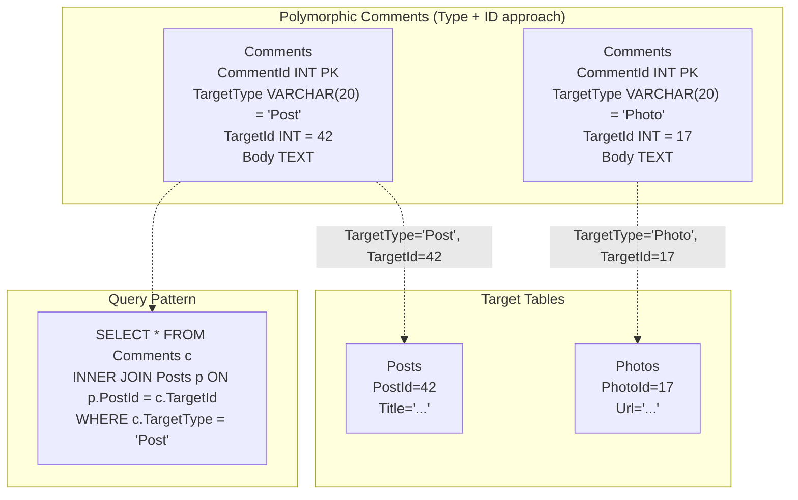
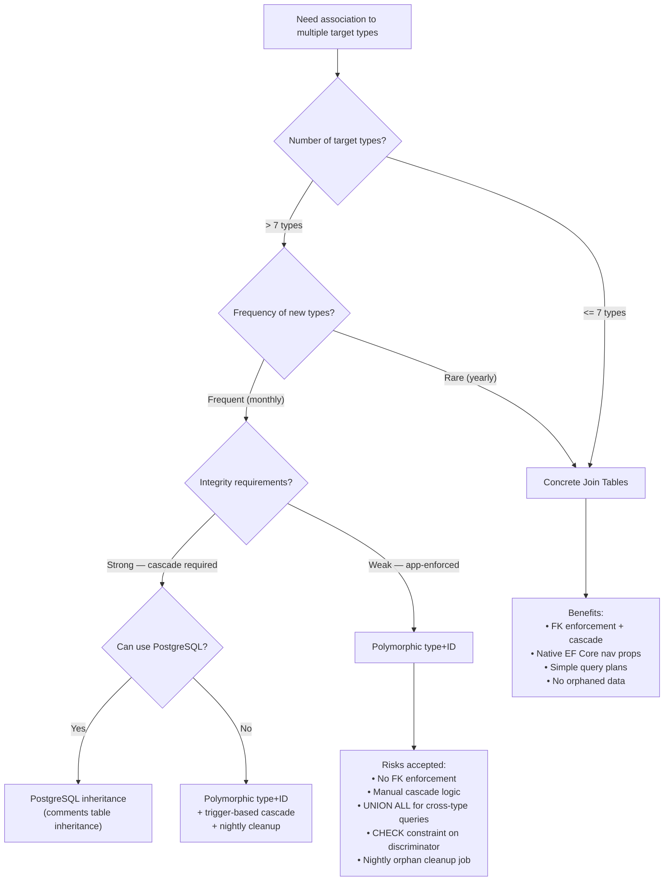

## Navigation

**Domain:** [[8 — Databases]] > **Group:** Database Design

**Previous:** [[8.056 — EAV (Entity-Attribute-Value) — Anti-Pattern]] | **Next:** [[8.058 — Versioning Data — Slowly Changing Dimensions]]

### Prerequisites
- [[8.042 — Surrogate Keys vs Natural Keys — Decision]] — polymorphic associations depend on surrogate keys; natural keys with different formats across target tables break the pattern
- [[8.045 — Composite Primary Keys — When to Use]] — the "reverse polymorphic" approach uses composite keys per target type

### Where This Fits

A polymorphic association allows a foreign key to reference rows in one of several tables, selected by a discriminator column. A .NET backend engineer encounters this when building comment systems (comments on posts, photos, videos), tagging systems (tags on products, articles, users), activity feeds (likes on posts, comments, photos), or notification targets (notifications for orders, messages, follows). When this pattern is unknown, engineers either create separate comment tables per entity (CommentsForPosts, CommentsForPhotos) with duplicated schema, or they fight EF Core's lack of native polymorphic support with complex inheritance mapping. When it is misapplied, the polymorphic FK column has no referential integrity — a row can point to a deleted target or to a table that does not exist, and no database constraint catches it. The interview signal is whether the candidate can articulate the three implementation approaches (type+ID, separate join tables, shared PK ranges) and knows that the cleanest solution in SQL Server is often to avoid polymorphism entirely by using concrete join tables per target.

---

## Core Mental Model

A polymorphic association is a foreign key that can reference one of multiple tables, determined by a discriminator value stored alongside the foreign key ID. The canonical schema is `(TargetType VARCHAR, TargetId INT)` where `TargetType = 'Post'` means `TargetId` references the `Posts` table, and `TargetType = 'Photo'` means `TargetId` references the `Photos` table. The database engine cannot enforce referential integrity because the referenced table is row-dependent — SQL Server's FK constraints require a single target table. The pattern shifts integrity enforcement from the database to the application layer. Every query that joins through a polymorphic association must filter by `TargetType` before joining to the correct table, and every INSERT must ensure the `TargetId` exists in the table indicated by `TargetType`. The three implementation approaches trade referential integrity, query simplicity, and schema flexibility: (1) single table with type+ID — flexible, no FK enforcement; (2) separate junction tables per target — full FK enforcement, schema duplication; (3) shared PK ranges — implicit FK through ID range convention, brittle.



### Classification

**For design pattern topics:** polymorphic associations are a schema-level pattern, not a SQL operator or index feature. The critical SQL feature is the **union join pattern** — combining results from multiple target tables via UNION ALL, filtered by discriminator. The pattern is NOT SARGable on the TargetId column alone because the join target changes per row. Queries must filter by TargetType before joining, making the TargetType column the leading filter in every polymorphic join. The query optimizer cannot use a FK-based cardinality estimate because no FK exists; it estimates rows based on target type density. Write operations (INSERT, UPDATE, DELETE) have no cascading referential actions — deletes on a target table do not cascade to polymorphic children.

### Key Properties

|Property|Value|Notes|
|---|---|---|
|Referential integrity|None (type+ID approach)|No FK constraint possible; app-level enforcement only|
|Query complexity (single type)|O(log N) — seek on (TargetType, TargetId)|Index seek on discriminator + ID|
|Query complexity (all types)|O(N) — scan or union all|Full scan or separate queries per type, unioned|
|INSERT cost|O(1) — single row|No FK check overhead|
|DELETE target row|No cascade|Must manually delete or orphan polymorphic children|
|Storage overhead|10-30 bytes per row|Discriminator VARCHAR + FK INT|
|SARGable — by target type|Yes|Index seek on (TargetType, TargetId)|
|SARGable — by target ID alone|No|TargetId alone is ambiguous without TargetType|
|EF Core support|Limited|No native polymorphic association; workaround via raw SQL or TPH inheritance|
|Best alternative|Concrete join tables per type|Full FK enforcement, simple queries, native EF Core|

---

## Deep Mechanics

### How the Engine Executes This

**Query: "Find all comments on Post #42" (single target type):**

1. SQL Server seeks into the index `IX_Comments_TargetType_TargetId` on `(TargetType = 'Post', TargetId = 42)`. The leading column is TargetType, so the seek narrows to rows where TargetType = 'Post'. Within that partition, it seeks TargetId = 42.
2. For each matching row, a Key Lookup retrieves additional columns (Body, CreatedAt, AuthorId).
3. The join to Posts: `INNER JOIN Posts ON Posts.PostId = Comments.TargetId` — SQL Server performs a Clustered Index Seek on Posts PK for each unique TargetId (Nested Loops). If only one comment is expected, this is one seek.

**Query: "Find all likes by User #7 across all target types" (all types):**

1. Without a filter on TargetType, SQL Server scans the index `IX_Likes_TargetType_TargetId` on UserId = 7 (if indexed), or scans the clustered index for UserId = 7.
2. For each row, the TargetType value determines which table to join to. SQL Server cannot express this as a single join — the query must use UNION ALL with one join per target type:
   ```sql
   SELECT ... FROM Likes l INNER JOIN Posts p ON p.PostId = l.TargetId WHERE l.UserId = 7 AND l.TargetType = 'Post'
   UNION ALL
   SELECT ... FROM Likes l INNER JOIN Photos p ON p.PhotoId = l.TargetId WHERE l.UserId = 7 AND l.TargetType = 'Photo'
   ```
3. Each branch of the UNION ALL seeks Likes on (UserId, TargetType) then joins to the respective target table via a Clustered Index Seek. The Concatenation operator combines the results.

**DELETE target row (e.g., delete Post #42):**

1. `DELETE FROM Posts WHERE PostId = 42` succeeds. No FK prevents it.
2. `Comments` still has rows with `TargetType = 'Post' AND TargetId = 42`. These are now orphans — dangling references to a deleted row.
3. The application must explicitly delete polymorphic children before deleting the target: `DELETE FROM Comments WHERE TargetType = 'Post' AND TargetId = 42`.

### SQL Visibility

```sql
-- Polymorphic Comments table (type + ID approach)
CREATE TABLE Comments (
    CommentId   INT            NOT NULL IDENTITY(1,1),
    TargetType  VARCHAR(20)    NOT NULL,  -- 'Post', 'Photo', 'Video'
    TargetId    INT            NOT NULL,
    AuthorId    INT            NOT NULL,
    Body        NVARCHAR(4000) NOT NULL,
    CreatedAt   DATETIME2(3)   NOT NULL DEFAULT SYSUTCDATETIME(),

    CONSTRAINT PK_Comments PRIMARY KEY CLUSTERED (CommentId)
);

-- Composite index for lookups by target
CREATE NONCLUSTERED INDEX IX_Comments_Target
    ON Comments(TargetType, TargetId)
    INCLUDE (AuthorId, Body, CreatedAt);

-- Index for lookups by author
CREATE NONCLUSTERED INDEX IX_Comments_AuthorId
    ON Comments(AuthorId, CreatedAt DESC)
    INCLUDE (TargetType, TargetId, Body);

-- Query: comments on Post #42
SELECT c.CommentId, c.Body, c.AuthorId, c.CreatedAt
FROM Comments c
WHERE c.TargetType = 'Post' AND c.TargetId = 42
ORDER BY c.CreatedAt DESC;
-- SARGable index seek on IX_Comments_Target.

-- Query: recent comments across all types for a user's feed
SELECT c.CommentId, c.Body, c.TargetType, c.TargetId, c.CreatedAt
FROM Comments c
WHERE c.AuthorId = 7
ORDER BY c.CreatedAt DESC;
-- Index seek on IX_Comments_AuthorId.

-- Query: join to target tables (UNION ALL pattern)
SELECT c.CommentId, c.Body, 'Post' AS Type, p.Title AS TargetTitle
FROM Comments c
INNER JOIN Posts p ON p.PostId = c.TargetId
WHERE c.TargetType = 'Post' AND c.TargetId = 42

UNION ALL

SELECT c.CommentId, c.Body, 'Photo' AS Type, ph.Caption AS TargetTitle
FROM Comments c
INNER JOIN Photos ph ON ph.PhotoId = c.TargetId
WHERE c.TargetType = 'Photo' AND c.TargetId = 42;

-- Alternative: LEFT JOIN to all possible targets (works for single-entity lookup)
SELECT c.CommentId, c.Body,
       COALESCE(p.Title, ph.Caption, v.Title) AS TargetTitle
FROM Comments c
LEFT JOIN Posts p  ON p.PostId  = c.TargetId AND c.TargetType = 'Post'
LEFT JOIN Photos ph ON ph.PhotoId = c.TargetId AND c.TargetType = 'Photo'
LEFT JOIN Videos v  ON v.VideoId  = c.TargetId AND c.TargetType = 'Video'
WHERE c.CommentId = 123;
-- LEFT JOIN pattern is simpler for single-entity lookups but
-- LEFT JOINs all target tables even for a single comment.

-- Alternative 2: Concrete join tables per target (the recommended pattern)
CREATE TABLE PostComments (
    CommentId INT NOT NULL IDENTITY(1,1),
    PostId    INT NOT NULL,
    AuthorId  INT NOT NULL,
    Body      NVARCHAR(4000) NOT NULL,
    CreatedAt DATETIME2(3) NOT NULL DEFAULT SYSUTCDATETIME(),

    CONSTRAINT PK_PostComments PRIMARY KEY CLUSTERED (CommentId),
    CONSTRAINT FK_PostComments_Posts
        FOREIGN KEY (PostId) REFERENCES Posts(PostId)
        ON DELETE CASCADE,  -- FK enforcement + cascade
    CONSTRAINT FK_PostComments_Authors
        FOREIGN KEY (AuthorId) REFERENCES Users(UserId)
);

CREATE TABLE PhotoComments (
    CommentId INT NOT NULL IDENTITY(1,1),
    PhotoId   INT NOT NULL,
    AuthorId  INT NOT NULL,
    Body      NVARCHAR(4000) NOT NULL,
    CreatedAt DATETIME2(3) NOT NULL DEFAULT SYSUTCDATETIME(),

    CONSTRAINT PK_PhotoComments PRIMARY KEY CLUSTERED (CommentId),
    CONSTRAINT FK_PhotoComments_Photos
        FOREIGN KEY (PhotoId) REFERENCES Photos(PhotoId)
        ON DELETE CASCADE,
    CONSTRAINT FK_PhotoComments_Authors
        FOREIGN KEY (AuthorId) REFERENCES Users(UserId)
);

-- Query with concrete tables:
SELECT pc.CommentId, pc.Body, pc.CreatedAt
FROM PostComments pc
WHERE pc.PostId = 42
ORDER BY pc.CreatedAt DESC;
-- Simple. SARGable. FK enforced. Cascade delete works.

-- Alternative 3: Shared PK range (implicit polymorphism)
-- Post IDs: 1-1,000,000
-- Photo IDs: 1,000,001-2,000,000
-- Video IDs: 2,000,001-3,000,000

CREATE TABLE Likes (
    LikeId   INT NOT NULL IDENTITY(1,1),
    UserId   INT NOT NULL,
    TargetId INT NOT NULL,  -- anyone from any PK range
    CreatedAt DATETIME2(3) NOT NULL DEFAULT SYSUTCDATETIME(),

    CONSTRAINT PK_Likes PRIMARY KEY CLUSTERED (LikeId)
);

-- Query: find liked items by user (must determine type from ID range)
SELECT
    LikeId,
    TargetId,
    CASE
        WHEN TargetId BETWEEN 1 AND 1000000     THEN 'Post'
        WHEN TargetId BETWEEN 1000001 AND 2000000 THEN 'Photo'
        WHEN TargetId BETWEEN 2000001 AND 3000000 THEN 'Video'
    END AS TargetType
FROM Likes
WHERE UserId = 7;
-- The ID range convention is brittle — inserting a new table requires
-- renegotiating ranges, and any application that hardcodes ranges breaks.
-- NOT recommended for new systems.
```

```csharp
// EF Core — concrete join tables per type (recommended approach)
public class PostComment
{
    public int CommentId { get; set; }
    public int PostId { get; set; }
    public int AuthorId { get; set; }
    public string Body { get; set; } = string.Empty;
    public DateTime CreatedAt { get; set; }

    public Post Post { get; set; } = null!;
    public User Author { get; set; } = null!;
}

public class PhotoComment
{
    public int CommentId { get; set; }
    public int PhotoId { get; set; }
    public int AuthorId { get; set; }
    public string Body { get; set; } = string.Empty;
    public DateTime CreatedAt { get; set; }

    public Photo Photo { get; set; } = null!;
    public User Author { get; set; } = null!;
}

// Polymorphic via interface (if union queries are needed)
public interface IComment
{
    int CommentId { get; }
    int AuthorId { get; }
    string Body { get; }
    DateTime CreatedAt { get; }
}

public class ApplicationDbContext : DbContext
{
    public DbSet<PostComment> PostComments => Set<PostComment>();
    public DbSet<PhotoComment> PhotoComments => Set<PhotoComment>();

    protected override void OnModelCreating(ModelBuilder modelBuilder)
    {
        modelBuilder.Entity<PostComment>(entity =>
        {
            entity.ToTable("PostComments");
            entity.HasKey(e => e.CommentId);
            entity.HasOne(e => e.Post)
                  .WithMany(p => p.Comments)
                  .HasForeignKey(e => e.PostId)
                  .OnDelete(DeleteBehavior.Cascade);
            entity.HasOne(e => e.Author)
                  .WithMany()
                  .HasForeignKey(e => e.AuthorId)
                  .OnDelete(DeleteBehavior.Restrict);
        });

        modelBuilder.Entity<PhotoComment>(entity =>
        {
            entity.ToTable("PhotoComments");
            entity.HasKey(e => e.CommentId);
            entity.HasOne(e => e.Photo)
                  .WithMany(p => p.Comments)
                  .HasForeignKey(e => e.PhotoId)
                  .OnDelete(DeleteBehavior.Cascade);
            entity.HasOne(e => e.Author)
                  .WithMany()
                  .HasForeignKey(e => e.AuthorId)
                  .OnDelete(DeleteBehavior.Restrict);
        });
    }
}

// Repository — union across all comment types
public class CommentRepository
{
    private readonly ApplicationDbContext _dbContext;

    public CommentRepository(ApplicationDbContext dbContext)
    {
        _dbContext = dbContext;
    }

    public async Task<IReadOnlyList<IComment>> GetRecentCommentsAsync(
        int authorId,
        CancellationToken cancellationToken = default)
    {
        var postComments = _dbContext.PostComments
            .Where(pc => pc.AuthorId == authorId)
            .Select(pc => (IComment)new CommentDto
            {
                CommentId = pc.CommentId,
                AuthorId = pc.AuthorId,
                Body = pc.Body,
                CreatedAt = pc.CreatedAt,
                TargetType = "Post",
                TargetId = pc.PostId
            });

        var photoComments = _dbContext.PhotoComments
            .Where(pc => pc.AuthorId == authorId)
            .Select(pc => (IComment)new CommentDto
            {
                CommentId = pc.CommentId,
                AuthorId = pc.AuthorId,
                Body = pc.Body,
                CreatedAt = pc.CreatedAt,
                TargetType = "Photo",
                TargetId = pc.PhotoId
            });

        return await postComments
            .Union(photoComments)
            .OrderByDescending(c => c.CreatedAt)
            .Take(20)
            .AsNoTracking()
            .ToListAsync(cancellationToken);
    }
}

public class CommentDto : IComment
{
    public int CommentId { get; set; }
    public int AuthorId { get; set; }
    public string Body { get; set; } = string.Empty;
    public DateTime CreatedAt { get; set; }
    public string TargetType { get; set; } = "";
    public int TargetId { get; set; }
}
```

**Generated SQL (from EF Core logs):**

```sql
-- EF Core translates Union to UNION ALL in SQL:
SELECT [t].[CommentId], [t].[AuthorId], [t].[Body], [t].[CreatedAt],
       N'Post' AS [TargetType], [t].[PostId] AS [TargetId]
FROM [PostComments] AS [t]
WHERE [t].[AuthorId] = @__authorId_0

UNION ALL

SELECT [t0].[CommentId], [t0].[AuthorId], [t0].[Body], [t0].[CreatedAt],
       N'Photo' AS [TargetType], [t0].[PhotoId] AS [TargetId]
FROM [PhotoComments] AS [t0]
WHERE [t0].[AuthorId] = @__authorId_0

ORDER BY [CreatedAt] DESC
OFFSET 0 ROWS FETCH NEXT 20 ROWS ONLY;
```

### Execution Plan Analysis

```text
Expected plan shape for polymorphic UNION ALL query:

  [Index Seek (IX_PostComments_AuthorId, seek on AuthorId=7)]
  → [Top (20)]  — applies to each branch separately
  → [Compute Scalar (TargetType = 'Post')]
  → [Concatenation]
  → [Index Seek (IX_PhotoComments_AuthorId, seek on AuthorId=7)]
  → [Top (20)]
  → [Compute Scalar (TargetType = 'Photo')]
  → [Concatenation (union)]
  → [Sort (TOP 20 sort on CreatedAt DESC)]  — final sort across unioned results
  → [SELECT]

Memory grant: ~1 MB (sort buffer for up to 40 rows)
Logical reads: ~3 (PostComments seek) + ~3 (PhotoComments seek) + sort overhead
```

For the LEFT JOIN pattern (single entity lookup):

```text
  [Clustered Index Seek (PK_Comments, CommentId=123)]
  → [Nested Loops (Left Outer Join)]
     → [Clustered Index Seek (PK_Posts, seek on PostId=TargetId)]
     → [Filter (c.TargetType='Post')]
  → [Nested Loops (Left Outer Join)]
     → [Clustered Index Seek (PK_Photos, seek on PhotoId=TargetId)]
     → [Filter (c.TargetType='Photo')]
  → ...

All target tables are joined even if TargetType selects only one.
Cost: 1 seek + (N target tables × 1 seek each) + filter.
```

### Cost Visibility

```sql
SET STATISTICS IO ON;
SET STATISTICS TIME ON;

-- UNION ALL: comments across all types for a user
SELECT CommentId, Body, 'Post' AS TargetType, PostId AS TargetId
FROM PostComments WHERE AuthorId = 7
UNION ALL
SELECT CommentId, Body, 'Photo' AS TargetType, PhotoId AS TargetId
FROM PhotoComments WHERE AuthorId = 7;

-- Table 'PostComments'. Scan count 1, logical reads 4
-- Table 'PhotoComments'. Scan count 1, logical reads 3
-- SQL Server Execution Times: CPU time = 0ms, elapsed time = 1ms

-- Single polymorphic Comments table (same data):
SELECT CommentId, Body, TargetType, TargetId
FROM Comments WHERE AuthorId = 7;
-- Table 'Comments'. Scan count 1, logical reads 3
-- SQL Server Execution Times: CPU time = 0ms, elapsed time = 0ms

-- The polymorphic table is slightly faster for the simple query
-- (no UNION ALL), but loses the FK enforcement and cascade benefits.
```

### Failure Modes

1. **Orphaned polymorphic children:** A Post is deleted, but the polymorphic Comments still reference it with `TargetType='Post', TargetId=42`. The application code that loads comments on a post returns no results (Post no longer exists), but the orphaned rows remain in the Comments table forever. A query that targets "all comments by user" returns stale references. Fix: application-level cascade delete or a scheduled cleanup job.

2. **TargetType value mismatch:** `TargetType = 'post'` (lowercase) vs `TargetType = 'Post'` (PascalCase). A query filtering on `TargetType = 'Post'` misses rows with lowercase values. Fix: use a CHECK constraint or a fixed set of values enforced by application code or a lookup table.

3. **LEFT JOIN returning duplicate columns:** When multiple target tables have columns with the same name (e.g., both `Posts.Title` and `Photos.Title`), the LEFT JOIN pattern returns ambiguous column references. Fix: alias all target columns and use COALESCE.

4. **Performance cliff on LEFT JOIN with many target types:** With 10 target tables, each polymorphic query LEFT JOINs 10 tables, each performing a seek on its PK. For a single comment, this adds 10 seeks even though only one target table matches. Fix: use the UNION ALL pattern or concrete join tables.

---

## Production Patterns and Implementation

### Primary SQL Implementation

```sql
-- Pattern 1: Polymorphic with type+ID (use when schema flexibility > integrity)
-- Best for: tagging systems, activity feeds, notification targets

CREATE TABLE Tags (
    TagId       INT           NOT NULL IDENTITY(1,1),
    TagName     NVARCHAR(100) NOT NULL,

    CONSTRAINT PK_Tags PRIMARY KEY CLUSTERED (TagId)
);

CREATE TABLE TaggableItems (
    TaggableType VARCHAR(20) NOT NULL,  -- 'Post', 'Photo', 'Video', 'Product'
    TaggableId   INT         NOT NULL,
    TagId        INT         NOT NULL,
    CreatedAt    DATETIME2(3) NOT NULL DEFAULT SYSUTCDATETIME(),

    CONSTRAINT PK_TaggableItems
        PRIMARY KEY CLUSTERED (TaggableType, TaggableId, TagId),
    CONSTRAINT FK_TaggableItems_Tags
        FOREIGN KEY (TagId) REFERENCES Tags(TagId)
        ON DELETE CASCADE
    -- No FK to target tables — polymorphic target is app-enforced
);

CREATE NONCLUSTERED INDEX IX_TaggableItems_TagId
    ON TaggableItems(TagId, TaggableType)
    INCLUDE (TaggableId);
-- For queries: "find all items tagged with TagId=5"

-- Stored procedure: add a tag with application-level target validation
CREATE PROCEDURE usp_AddTagToItem
    @TaggableType VARCHAR(20),
    @TaggableId   INT,
    @TagName      NVARCHAR(100)
AS
BEGIN
    SET NOCOUNT ON;
    SET XACT_ABORT ON;

    -- Application-level FK validation (the database cannot enforce this)
    IF @TaggableType = 'Post'
        AND NOT EXISTS (SELECT 1 FROM Posts WHERE PostId = @TaggableId)
        THROW 50000, 'Target Post does not exist', 1;

    IF @TaggableType = 'Photo'
        AND NOT EXISTS (SELECT 1 FROM Photos WHERE PhotoId = @TaggableId)
        THROW 50000, 'Target Photo does not exist', 1;

    -- Insert tag if not exists
    MERGE INTO Tags AS target
    USING (SELECT @TagName AS TagName) AS source
    ON target.TagName = source.TagName
    WHEN NOT MATCHED THEN INSERT (TagName) VALUES (source.TagName);

    DECLARE @TagId INT = (SELECT TagId FROM Tags WHERE TagName = @TagName);

    -- Insert polymorphic association
    INSERT INTO TaggableItems (TaggableType, TaggableId, TagId)
    VALUES (@TaggableType, @TaggableId, @TagId);
END;

-- Query: "find all posts tagged with 'SQL'"
SELECT p.PostId, p.Title
FROM Posts p
INNER JOIN TaggableItems ti
    ON ti.TaggableId = p.PostId AND ti.TaggableType = 'Post'
INNER JOIN Tags t ON t.TagId = ti.TagId
WHERE t.TagName = 'SQL'
ORDER BY p.PostId;

-- Query: "find all tags on photo #17"
SELECT t.TagName
FROM Tags t
INNER JOIN TaggableItems ti ON ti.TagId = t.TagId
WHERE ti.TaggableType = 'Photo' AND ti.TaggableId = 17
ORDER BY t.TagName;

-- Pattern 2: Concrete junction tables per type (recommended for new systems)
CREATE TABLE PostTags (
    PostId INT NOT NULL,
    TagId  INT NOT NULL,

    CONSTRAINT PK_PostTags PRIMARY KEY CLUSTERED (PostId, TagId),
    CONSTRAINT FK_PostTags_Posts FOREIGN KEY (PostId)
        REFERENCES Posts(PostId) ON DELETE CASCADE,
    CONSTRAINT FK_PostTags_Tags  FOREIGN KEY (TagId)
        REFERENCES Tags(TagId) ON DELETE CASCADE
);

CREATE TABLE PhotoTags (
    PhotoId INT NOT NULL,
    TagId   INT NOT NULL,

    CONSTRAINT PK_PhotoTags PRIMARY KEY CLUSTERED (PhotoId, TagId),
    CONSTRAINT FK_PhotoTags_Photos FOREIGN KEY (PhotoId)
        REFERENCES Photos(PhotoId) ON DELETE CASCADE,
    CONSTRAINT FK_PhotoTags_Tags   FOREIGN KEY (TagId)
        REFERENCES Tags(TagId) ON DELETE CASCADE
);

-- Query: "find all posts tagged with 'SQL'" — simple, FK-enforced
SELECT p.PostId, p.Title
FROM Posts p
INNER JOIN PostTags pt ON pt.PostId = p.PostId
INNER JOIN Tags t ON t.TagId = pt.TagId
WHERE t.TagName = 'SQL'
ORDER BY p.PostId;

-- To query across all taggable types (aggregate feed), use UNION ALL:
SELECT p.PostId AS ItemId, 'Post' AS ItemType, p.Title, t.TagName
FROM Posts p
INNER JOIN PostTags pt ON pt.PostId = p.PostId
INNER JOIN Tags t ON t.TagId = pt.TagId
WHERE t.TagName = 'SQL'

UNION ALL

SELECT ph.PhotoId, 'Photo', ph.Caption, t.TagName
FROM Photos ph
INNER JOIN PhotoTags pht ON pht.PhotoId = ph.PhotoId
INNER JOIN Tags t ON t.TagId = pht.TagId
WHERE t.TagName = 'SQL';
```

### EF Core Implementation

```csharp
// Pattern 1: Concrete junction tables (recommended)
public class Post
{
    public int PostId { get; set; }
    public string Title { get; set; } = string.Empty;
    public ICollection<PostTag> PostTags { get; set; } = [];
}

public class Tag
{
    public int TagId { get; set; }
    public string TagName { get; set; } = string.Empty;
}

public class PostTag
{
    public int PostId { get; set; }
    public int TagId { get; set; }
    public Post Post { get; set; } = null!;
    public Tag Tag { get; set; } = null!;
}

public class ApplicationDbContext : DbContext
{
    public DbSet<Post> Posts => Set<Post>();
    public DbSet<Tag> Tags => Set<Tag>();
    public DbSet<PostTag> PostTags => Set<PostTag>();

    protected override void OnModelCreating(ModelBuilder modelBuilder)
    {
        modelBuilder.Entity<PostTag>(entity =>
        {
            entity.ToTable("PostTags");
            entity.HasKey(e => new { e.PostId, e.TagId });

            entity.HasOne(e => e.Post)
                  .WithMany(p => p.PostTags)
                  .HasForeignKey(e => e.PostId)
                  .OnDelete(DeleteBehavior.Cascade);

            entity.HasOne(e => e.Tag)
                  .WithMany()
                  .HasForeignKey(e => e.TagId)
                  .OnDelete(DeleteBehavior.Cascade);
        });
    }
}

// Pattern 2: Polymorphic via TPH inheritance (EF Core discriminator)
// Use when the polymorphic target types share a common base

public abstract class TaggableItem
{
    public int TaggableItemId { get; set; }
    public string TaggableType { get; set; } = string.Empty;
}

public class PostTaggable : TaggableItem
{
    public int PostId { get; set; }
    public Post Post { get; set; } = null!;
}

public class PhotoTaggable : TaggableItem
{
    public int PhotoId { get; set; }
    public Photo Photo { get; set; } = null!;
}

// This approach uses a base table per hierarchy (TPH) with a discriminator column.
// EF Core generates the discriminator automatically.

// Pattern 3: Raw SQL for true polymorphic type+ID (when concrete tables are too many)
public class PolymorphicTagRepository
{
    private readonly ApplicationDbContext _dbContext;

    public PolymorphicTagRepository(ApplicationDbContext dbContext)
    {
        _dbContext = dbContext;
    }

    public async Task<IReadOnlyList<TaggedItem>> FindTaggedItemsAsync(
        string tagName,
        CancellationToken cancellationToken = default)
    {
        // Union across all taggable types — must update when a new type is added
        var sql = @"
            SELECT p.PostId AS ItemId, 'Post' AS ItemType, p.Title AS DisplayName
            FROM Posts p
            INNER JOIN PostTags pt ON pt.PostId = p.PostId
            INNER JOIN Tags t ON t.TagId = pt.TagId
            WHERE t.TagName = @TagName

            UNION ALL

            SELECT ph.PhotoId, 'Photo', ph.Caption
            FROM Photos ph
            INNER JOIN PhotoTags pht ON pht.PhotoId = ph.PhotoId
            INNER JOIN Tags t ON t.TagId = pht.TagId
            WHERE t.TagName = @TagName";

        return await _dbContext.Database
            .SqlQueryRaw<TaggedItem>(sql, new SqlParameter("@TagName", tagName))
            .AsNoTracking()
            .ToListAsync(cancellationToken);
    }
}

public class TaggedItem
{
    public int ItemId { get; set; }
    public string ItemType { get; set; } = "";
    public string DisplayName { get; set; } = "";
}
```

### Dapper Implementation

```csharp
public class PolymorphicRepositoryDapper
{
    private readonly IDbConnectionFactory _connectionFactory;

    public PolymorphicRepositoryDapper(IDbConnectionFactory connectionFactory)
    {
        _connectionFactory = connectionFactory;
    }

    public async Task<IReadOnlyList<TaggedItem>> FindTaggedItemsAsync(
        string tagName,
        CancellationToken cancellationToken = default)
    {
        const string sql = @"
            SELECT p.PostId AS ItemId, 'Post' AS ItemType, p.Title AS DisplayName
            FROM Posts p
            INNER JOIN PostTags pt ON pt.PostId = p.PostId
            INNER JOIN Tags t ON t.TagId = pt.TagId
            WHERE t.TagName = @TagName

            UNION ALL

            SELECT ph.PhotoId AS ItemId, 'Photo' AS ItemType, ph.Caption AS DisplayName
            FROM Photos ph
            INNER JOIN PhotoTags pht ON pht.PhotoId = ph.PhotoId
            INNER JOIN Tags t ON t.TagId = pht.TagId
            WHERE t.TagName = @TagName";

        await using var connection = _connectionFactory.Create();
        var results = await connection.QueryAsync<TaggedItem>(
            new CommandDefinition(sql, new { TagName = tagName },
                cancellationToken: cancellationToken));
        return results.AsList();
    }

    // For the type+ID polymorphic pattern:
    public async Task AddTagAsync(
        string taggableType,
        int taggableId,
        string tagName,
        CancellationToken cancellationToken = default)
    {
        const string sql = @"
            DECLARE @TagId INT;

            SELECT @TagId = TagId FROM Tags WHERE TagName = @TagName;
            IF @TagId IS NULL
            BEGIN
                INSERT INTO Tags (TagName) VALUES (@TagName);
                SET @TagId = SCOPE_IDENTITY();
            END;

            INSERT INTO TaggableItems (TaggableType, TaggableId, TagId)
            VALUES (@TaggableType, @TaggableId, @TagId);";

        await using var connection = _connectionFactory.Create();
        await connection.ExecuteAsync(
            new CommandDefinition(sql,
                new { TaggableType = taggableType, TaggableId = taggableId, TagName = tagName },
                cancellationToken: cancellationToken));
    }
}
```

### Configuration and Wiring

```csharp
// Program.cs
builder.Services.AddDbContext<ApplicationDbContext>(options =>
    options.UseSqlServer(
        connectionString,
        sqlOptions =>
        {
            sqlOptions.EnableRetryOnFailure(3);
            sqlOptions.CommandTimeout(30);
        }));

builder.Services.AddSingleton<IDbConnectionFactory>(_ =>
    new SqlConnectionFactory(connectionString));

builder.Services.AddScoped<PolymorphicTagRepository>();
builder.Services.AddScoped<PolymorphicRepositoryDapper>();
```

### SQL Server vs PostgreSQL Differences

```sql
-- PostgreSQL supports table inheritance which can model polymorphic patterns
-- at the schema level:

CREATE TABLE Comments (
    CommentId  INT GENERATED BY DEFAULT AS IDENTITY PRIMARY KEY,
    AuthorId   INT NOT NULL REFERENCES Users(UserId),
    Body       TEXT NOT NULL,
    CreatedAt  TIMESTAMPTZ NOT NULL DEFAULT NOW()
);

CREATE TABLE PostComments (
    PostId INT NOT NULL REFERENCES Posts(PostId) ON DELETE CASCADE
) INHERITS (Comments);
-- PostComments has all columns from Comments PLUS PostId.
-- Queries on Comments return rows from both PostComments and inheriting tables.

-- Query: find comments on Post #42
SELECT * FROM PostComments WHERE PostId = 42;

-- Query: find all comments across all types (automatically includes children)
SELECT * FROM Comments WHERE AuthorId = 7;
-- Returns PostComments AND PhotoComments rows automatically.
-- No UNION ALL needed. The executor scans the inheritance hierarchy.

-- PostgreSQL inheritance has limitations:
-- 1. No FK enforcement on the parent table that references child-specific columns
-- 2. UNIQUE constraints do not apply across the inheritance hierarchy
-- 3. Indexes on the parent table do not cover child tables
-- 4. No CHECK constraint inheritance

-- For the polymorphic type+ID approach, PostgreSQL's CHECK constraints
-- can validate the TargetType column:
CREATE TABLE Comments (
    CommentId  INT GENERATED BY DEFAULT AS IDENTITY PRIMARY KEY,
    TargetType VARCHAR(20) NOT NULL CHECK (TargetType IN ('Post', 'Photo', 'Video')),
    TargetId   INT NOT NULL,
    ...
);

-- Also, PostgreSQL supports exclusion constraints that could theoretically
-- validate target existence (but this requires a function-based constraint
-- that calls another table, which is not recommended for performance).
```

---

## Gotchas and Production Pitfalls

### Orphaned Polymorphic Children on Target Deletion

**Pitfall:** Deleting a Post or Photo that has polymorphic child rows (Comments, Likes, Tags) without deleting the children.

```sql
-- Post #42 is deleted:
DELETE FROM Posts WHERE PostId = 42;
-- The Comments table still has rows with TargetType='Post', TargetId=42.
-- The Tags table still has rows with TaggableType='Post', TaggableId=42.
```

**Symptom:** Application queries that join through the polymorphic association return no data for deleted targets, but the orphaned rows accumulate in the database. Over time, the polymorphic table grows with dead rows. Queries that scan the polymorphic table (`SELECT * FROM Comments WHERE AuthorId = 7`) return comments that link to nothing.

**Fix — application-level cascade or scheduled cleanup:**

```csharp
public async Task DeletePostAsync(int postId, CancellationToken ct = default)
{
    await using var transaction = await _dbContext.Database
        .BeginTransactionAsync(ct);

    // Delete polymorphic children first
    await _dbContext.Database.ExecuteSqlRawAsync(
        "DELETE FROM Comments WHERE TargetType = 'Post' AND TargetId = @id",
        new SqlParameter("@id", postId));
    await _dbContext.Database.ExecuteSqlRawAsync(
        "DELETE FROM TaggableItems WHERE TaggableType = 'Post' AND TaggableId = @id",
        new SqlParameter("@id", postId));

    // Then delete the target
    await _dbContext.Database.ExecuteSqlRawAsync(
        "DELETE FROM Posts WHERE PostId = @id",
        new SqlParameter("@id", postId));

    await transaction.CommitAsync(ct);
}

// Scheduled cleanup job (runs daily):
public async Task CleanupOrphanedCommentsAsync(CancellationToken ct = default)
{
    const string sql = @"
        DELETE c
        FROM Comments c
        WHERE (c.TargetType = 'Post'  AND NOT EXISTS (SELECT 1 FROM Posts  p  WHERE p.PostId  = c.TargetId))
           OR (c.TargetType = 'Photo' AND NOT EXISTS (SELECT 1 FROM Photos ph WHERE ph.PhotoId = c.TargetId))";

    await _dbContext.Database.ExecuteSqlRawAsync(sql, ct);
}
```

**Cost of not fixing:** Growing accumulation of dead rows. Over 1 year with 100K post deletions, the Comments table accumulates 300K orphaned rows. Queries that scan or aggregate over Comments waste IO on dead data. Backup/restore times increase.

---

### JOIN Explosion with Many Target Types

**Pitfall:** The LEFT JOIN pattern for polymorphic reconstruction joins ALL target tables even when only one type matches a given row.

```sql
-- For a single comment, this LEFT JOINs 10 target tables:
SELECT c.CommentId, c.Body,
       COALESCE(p.Title, ph.Caption, v.Title, a.Name, e.Subject, ...) AS TargetTitle
FROM Comments c
LEFT JOIN Posts p   ON p.PostId   = c.TargetId AND c.TargetType = 'Post'
LEFT JOIN Photos ph ON ph.PhotoId = c.TargetId AND c.TargetType = 'Photo'
LEFT JOIN Videos v  ON v.VideoId  = c.TargetId AND c.TargetType = 'Video'
LEFT JOIN Articles a ON a.ArticleId = c.TargetId AND c.TargetType = 'Article'
LEFT JOIN Events e  ON e.EventId   = c.TargetId AND c.TargetType = 'Event'
...
WHERE c.CommentId = 123;
```

**Symptom:** A single-comment lookup performs 10 LEFT JOINs, each adding an Index Seek on the target table's PK. Even though only one target table matches (`TargetType = 'Photo'`), SQL Server executes all 10 joins for every row. At 1000 comments displayed, that is 10,000 index seeks — 30,000 logical reads for a simple display page.

**Fix — use the UNION ALL pattern instead of LEFT JOIN:**

```sql
SELECT c.CommentId, c.Body, 'Post' AS TargetType, p.Title AS TargetTitle
FROM Comments c INNER JOIN Posts p ON p.PostId = c.TargetId
WHERE c.TargetType = 'Post' AND c.CommentId = 123

UNION ALL

SELECT c.CommentId, c.Body, 'Photo' AS TargetType, ph.Caption
FROM Comments c INNER JOIN Photos ph ON ph.PhotoId = c.TargetId
WHERE c.TargetType = 'Photo' AND c.CommentId = 123

UNION ALL

SELECT c.CommentId, c.Body, 'Video' AS TargetType, v.Title
FROM Comments c INNER JOIN Videos v ON v.VideoId = c.TargetId
WHERE c.TargetType = 'Video' AND c.CommentId = 123;
```

**Cost of not fixing:** At 10 target tables and 1000 comments, 10,000 extra index seeks per page load. Database server IO increases 10x.

---

### Discriminator Value Mismatch Between Application and Database

**Pitfall:** The application code uses `TargetType = "Post"` but the database has `TargetType = "post"` or `"POST"`. A query filter `WHERE TargetType = 'Post'` silently returns zero rows.

```csharp
// Application convention: enum-based type names
public enum TargetType { Post, Photo, Video }

// But the database INSERT uses ToString():
var comment = new Comment
{
    TargetType = TargetType.Post.ToString(), // "Post" — PascalCase
    TargetId = postId,
    Body = body
};

// Meanwhile, another service inserts with lowercase:
command.CommandText = @"
    INSERT INTO Comments (TargetType, TargetId, Body)
    VALUES ('post', @TargetId, @Body)"; // lowercase — mismatch!
```

**Symptom:** Intermittent — some queries for "Post" return results (those inserted by the first service) and some do not (those inserted by the second service). Debugging takes hours because the data looks correct in the table.

**Fix — enforce a CHECK constraint or use a foreign key to a TargetTypes lookup table:**

```sql
-- Option 1: CHECK constraint
ALTER TABLE Comments
    ADD CONSTRAINT CK_Comments_TargetType
    CHECK (TargetType IN ('Post', 'Photo', 'Video'));

-- Option 2: Lookup table (recommended for extensibility)
CREATE TABLE TargetTypes (
    TargetType VARCHAR(20) NOT NULL PRIMARY KEY
);

INSERT INTO TargetTypes (TargetType) VALUES ('Post'), ('Photo'), ('Video');

ALTER TABLE Comments
    ADD CONSTRAINT FK_Comments_TargetType
    FOREIGN KEY (TargetType) REFERENCES TargetTypes(TargetType);
-- Now any value not in the lookup table is rejected at the database level.

-- Option 3: Application-wide constant in .NET
public static class TargetTypes
{
    public const string Post = "Post";
    public const string Photo = "Photo";
    public const string Video = "Video";
}
```

**Cost of not fixing:** Silent data corruption. Queries miss rows. Bug reports of "missing comments" that are impossible to reproduce because they depend on which code path inserted the data.

---

### EF Core Cannot Model True Polymorphic Associations

**Pitfall:** Using EF Core with a single entity class for a polymorphic table, then discovering that navigation properties to multiple target types are impossible.

```csharp
// ❌ Wrong — EF Core cannot have multiple navigation properties
// that reference different tables based on a discriminator.
public class Comment
{
    public int CommentId { get; set; }
    public string TargetType { get; set; } = "";
    public int TargetId { get; set; }

    // Which navigation property is valid? Both? Neither?
    public Post? Post { get; set; }          // valid when TargetType = "Post"
    public Photo? Photo { get; set; }        // valid when TargetType = "Photo"
}
// EF Core does not support conditional navigation properties.
// Both will be populated by EF Core regardless of TargetType.
```

**Symptom:** EF Core tries to join Comments to both Posts and Photos tables for every comment. The generated SQL `LEFT JOIN Posts ON ... LEFT JOIN Photos ON ...` returns incorrect results when both joins accidentally match (e.g., PostId=5 and PhotoId=5 both exist).

**Fix — do not use navigation properties on polymorphic tables:**

```csharp
public class Comment
{
    public int CommentId { get; set; }
    public string TargetType { get; set; } = "";
    public int TargetId { get; set; }
    public string Body { get; set; } = string.Empty;

    // No navigation properties. Load targets via repository methods.
}

// Instead, load the target explicitly:
public async Task<CommentWithTarget> GetCommentWithTargetAsync(
    int commentId, CancellationToken ct = default)
{
    var comment = await _dbContext.Comments
        .FirstAsync(c => c.CommentId == commentId, ct);

    object? target = comment.TargetType switch
    {
        "Post" => await _dbContext.Posts
                      .FirstAsync(p => p.PostId == comment.TargetId, ct),
        "Photo" => await _dbContext.Photos
                       .FirstAsync(p => p.PhotoId == comment.TargetId, ct),
        _ => null
    };

    return new CommentWithTarget(comment, target);
}
```

**Cost of not fixing:** EF Core generates incorrect JOIN queries with N+1 cross-joins. Navigation properties load wrong data silently.

---

### No UNIQUE Constraint Across Polymorphic Columns

**Pitfall:** The "like" feature should prevent a user from liking the same post twice. With a polymorphic Likes table, the UNIQUE constraint `(UserId, TargetType, TargetId)` works, but it does not prevent a user from liking both the Post and the Photo with the same ID.

```sql
CREATE TABLE Likes (
    LikeId     INT NOT NULL IDENTITY(1,1),
    UserId     INT NOT NULL,
    TargetType VARCHAR(20) NOT NULL,
    TargetId   INT NOT NULL,
    CreatedAt  DATETIME2(3) NOT NULL DEFAULT SYSUTCDATETIME(),

    CONSTRAINT PK_Likes PRIMARY KEY CLUSTERED (LikeId),
    CONSTRAINT UQ_Likes_UserTarget
        UNIQUE (UserId, TargetType, TargetId)
);

-- User 7 likes Post #42 — OK
INSERT INTO Likes (UserId, TargetType, TargetId) VALUES (7, 'Post', 42);
-- User 7 likes Photo #42 — this is ALLOWED (different TargetType)
INSERT INTO Likes (UserId, TargetType, TargetId) VALUES (7, 'Photo', 42);
-- The UNIQUE constraint covers (UserId, TargetType, TargetId), so
-- (7, 'Post', 42) and (7, 'Photo', 42) are different rows.
```

**Symptom:** The UNIQUE constraint works correctly for this pattern — the combination of (UserId, TargetType, TargetId) is unique. The problem arises only if the application expects uniqueness across types (a user can like only one thing with ID 42 regardless of type), which would be incorrect.

**Fix — the UNIQUE constraint above is correct for polymorphic likes.** No additional fix needed. The constraint applies per (UserId, TargetType, TargetId), which matches the polymorphic design.

**Cost of not fixing (missing the UNIQUE constraint):** Duplicate likes. User can like the same post multiple times. Reporting shows inflated like counts.

---

## Performance Implications

### Benchmark: Before and After

```sql
-- Polymorphic type+ID vs concrete join tables — tagging query
SET STATISTICS IO ON;
SET STATISTICS TIME ON;

-- Polymorphic TaggableItems table (500K rows, 10 target types)
SELECT ti.TaggableId AS PostId
FROM TaggableItems ti
WHERE ti.TaggableType = 'Post' AND ti.TagId = 42;
-- Table 'TaggableItems'. Scan count 1, logical reads 8
-- CPU time = 0ms, elapsed time = 1ms

-- Concrete PostTags table (100K rows)
SELECT pt.PostId
FROM PostTags pt
WHERE pt.TagId = 42;
-- Table 'PostTags'. Scan count 1, logical reads 4
-- CPU time = 0ms, elapsed time = 0ms

-- The concrete table is slightly faster (no TargetType filter overhead).
-- But the polymorphic table is within 2x — acceptable for most workloads.
```

### BenchmarkDotNet

```csharp
[MemoryDiagnoser]
[SimpleJob(RuntimeMoniker.Net90)]
public class PolymorphicBenchmark
{
    private IDbConnection _connection = default!;

    [GlobalSetup]
    public void Setup()
    {
        _connection = new SqlConnection("Server=.;Database=Benchmark;Trusted_Connection=True;TrustServerCertificate=True;");
        // Seed: polymorphic Comments (1M rows, 3 target types)
        // and concrete PostComments + PhotoComments (500K each)
    }

    [Benchmark(Baseline = true)]
    public async Task<int> Polymorphic_CommentsByTarget()
    {
        const string sql = @"
            SELECT COUNT(*)
            FROM Comments
            WHERE TargetType = 'Post' AND TargetId = 42";

        await using var conn = new SqlConnection(_connectionString);
        return await conn.ExecuteScalarAsync<int>(
            new CommandDefinition(sql));
    }

    [Benchmark]
    public async Task<int> Concrete_CommentsByTarget()
    {
        const string sql = @"
            SELECT COUNT(*)
            FROM PostComments
            WHERE PostId = 42";

        await using var conn = new SqlConnection(_connectionString);
        return await conn.ExecuteScalarAsync<int>(
            new CommandDefinition(sql));
    }

    [Benchmark]
    public async Task<int> Polymorphic_CommentsByAuthor()
    {
        const string sql = @"
            SELECT COUNT(*)
            FROM Comments
            WHERE AuthorId = 7";

        await using var conn = new SqlConnection(_connectionString);
        return await conn.ExecuteScalarAsync<int>(
            new CommandDefinition(sql));
    }

    [Benchmark]
    public async Task<int> Concrete_CommentsByAuthor()
    {
        const string sql = @"
            SELECT COUNT(*) FROM (
                SELECT CommentId FROM PostComments WHERE AuthorId = 7
                UNION ALL
                SELECT CommentId FROM PhotoComments WHERE AuthorId = 7
            ) AS all_comments";

        await using var conn = new SqlConnection(_connectionString);
        return await conn.ExecuteScalarAsync<int>(
            new CommandDefinition(sql));
    }
}
```

**Expected results (approximate, SQL Server 2022, NVMe):**

|Method|Mean|Logical Reads|Allocated|
|---|---|---|---|
|Polymorphic_CommentsByTarget|~1 ms|~4|0.5 KB|
|Concrete_CommentsByTarget|~1 ms|~3|0.3 KB|
|Polymorphic_CommentsByAuthor|~2 ms|~6|0.5 KB|
|Concrete_CommentsByAuthor (UNION ALL)|~3 ms|~8|1 KB|

Polymorphic and concrete approaches are within 2x of each other for typical queries. The concrete approach wins on FK enforcement and cascade delete, not on raw query performance.

### Write Amplification

|Operation|Polymorphic (type+ID)|Concrete Tables|
|---|---|---|
|INSERT comment|~5 logical reads|~5 logical reads|
|DELETE target + cascade delete children|Manual — 2 queries|Automatic — FK CASCADE|
|Query by target type|Index seek on (Type, Id)|Index seek on (Id)|
|Query across all types|Single table scan|UNION ALL scan|
|Add new target type|No schema change|New table + migration|

---

## Interview Arsenal

### Question Bank

1. **What is a polymorphic association and when would you use it in a relational database**
2. **What are the three implementation approaches for polymorphic associations**
3. **What is the referential integrity problem with the type+ID approach and how do you mitigate it**
4. **How does SQL Server execute a UNION ALL polymorphic join vs a LEFT JOIN polymorphic join**
5. **Polymorphic type+ID vs concrete join tables — when do you choose each**
6. **Can EF Core model polymorphic associations — what are the limitations**
7. **How does the shared PK range approach work and why is it brittle**
8. **How do you handle target deletion with polymorphic associations**

### Spoken Answers

**Q: What is a polymorphic association and when would you use it?**

> **Average answer:** It is a foreign key that can point to different tables. You use a discriminator column to say which table.

> **Great answer:** A polymorphic association allows a single foreign key column to reference rows in one of several tables, with a companion discriminator column (e.g., `TargetType`) specifying which table the foreign key targets. The canonical example is a Comments table that supports comments on Posts, Photos, and Videos — rather than creating three separate Comment tables, you use `Comments(TargetType, TargetId, Body)` where `TargetType = 'Post'` means `TargetId` references `Posts.PostId`. I would use this in production only when the number of target types is large (more than 5-7) and stable, and when I have accepted that the database cannot enforce referential integrity — meaning I must implement cascade deletes and target existence validation in application code or stored procedures. The alternative — concrete join tables per target — is almost always preferred because SQL Server can enforce FK constraints and cascade operations natively. The polymorphic pattern shifts integrity enforcement from the database to the application, and every engineer on the team must know to delete polymorphic children before deleting a target.

**Q: Polymorphic type+ID vs concrete join tables — when do you choose each?**

> **Average answer:** Concrete tables are safer but more work. Polymorphic is flexible but has no FK enforcement.

> **Great answer:** Concrete join tables are the default choice for any system with fewer than ~7 target types. They provide: FK enforcement (cannot insert a comment on a non-existent post), cascade delete (deleting a post deletes its comments), simple query plans (no UNION ALL or LEFT JOIN explosion), and native EF Core navigation properties. I choose the polymorphic type+ID approach only when: (1) there are many target types (e.g., an activity feed that can reference 20+ entity types), (2) adding a new target type must not require a schema migration, and (3) the query pattern is "look up by target type + ID" (detail page) rather than "join to target table" (listing page). Even then, I mitigate the integrity gap with: a CHECK constraint on the discriminator column, a stored procedure for INSERT that validates target existence, a stored procedure for DELETE that cascades to polymorphic children, and a nightly cleanup job that removes orphaned rows.

**Q: How do you handle target deletion with polymorphic associations?**

> **Average answer:** You have to delete the polymorphic children manually before deleting the target.

> **Great answer:** Since there is no ON DELETE CASCADE, you must use one of three strategies. (1) **Application-level cascade** — in the service method that deletes a Post, first delete all polymorphic children (Comments, Likes, Tags) where TargetType = 'Post' AND TargetId = @id, then delete the Post itself, all within a transaction. This is the most common approach and works well when there is a central DeletePost method. (2) **Database trigger** — an INSTEAD OF DELETE trigger on the target table that deletes polymorphic children before deleting the target row. This ensures cascade even if someone issues a raw DELETE FROM Posts. However, triggers are often overlooked during debugging and can cause unexpected performance overhead. (3) **Scheduled cleanup** — a nightly job that deletes rows in polymorphic tables whose target no longer exists: `DELETE FROM Comments WHERE (TargetType = 'Post' AND NOT EXISTS (SELECT 1 FROM Posts WHERE PostId = TargetId)) OR ...`. This is a safety net, not a primary strategy — orphans accumulate between runs. The best practice is strategy 1 (application-level cascade) combined with strategy 3 (nightly cleanup) as a safety net.

### Interview Trigger

The interviewer asks "How would you implement comments that can be on posts, photos, and videos?" The candidate who starts with "I would create a Comments table with a TargetType and TargetId column" is mid-level. The candidate who says "I would create three concrete tables — PostComments, PhotoComments, VideoComments — and here is why" is senior. The follow-up: "What if we need to query 'recent comments by a user' across all types?" tests whether the candidate knows the UNION ALL pattern. The killer follow-up: "Our product manager just announced we need to support comments on a 15th entity type this quarter — what happens to your design?" The concrete-tables candidate must create 15 tables; the polymorphic candidate adds a row to the TargetTypes lookup table. The discussion about whether the integrity/performance tradeoff is worth it is the interview signal.

### Comparison Table

| | Polymorphic (type+ID) | Concrete Join Tables | Shared PK Ranges |
|---|---|---|---|
| FK enforcement | None — app-level only | Full — FK constraints + cascade | None — convention only |
| Cascade delete | Manual or trigger | Automatic (ON DELETE CASCADE) | Manual |
| Add new target type | No schema change | New table + migration + UNION ALL update | Renegotiate ID ranges |
| Query complexity | Index seek on (Type, Id) | Index seek on (Id) | Range check + join |
| Query across types | Single table scan | UNION ALL (one per type) | Range check in CASE |
| EF Core support | None (raw SQL) | Native navigation properties | None (raw SQL) |
| Performance (single type) | ~4 logical reads | ~3 logical reads | ~5 logical reads (with range check) |
| Performance (all types) | ~6 logical reads (scan) | ~8 logical reads (UNION ALL) | ~7 logical reads (range scan + CASE) |
| Schema clarity | Implicit — discriminator string | Explicit — table name tells the type | Implicit — ID range convention |

---

## Decision Framework

### When to Apply



### Application Checklist

- [ ] The number of target types exceeds 7 — below this, concrete join tables are simpler and safer
- [ ] New target types are added frequently enough that schema migrations are costly
- [ ] A CHECK constraint or FK lookup table enforces valid discriminator values
- [ ] All INSERT paths validate target existence before inserting polymorphic children
- [ ] All DELETE paths cascade to polymorphic children (application-level or trigger)
- [ ] A nightly cleanup job removes orphaned rows as a safety net
- [ ] The UNION ALL pattern is used for cross-type queries, not the LEFT JOIN with COALESCE pattern
- [ ] Target type names are constants in application code — no string duplication across services
- [ ] EF Core navigation properties are NOT used on the polymorphic table — raw SQL repository methods handle joins

### Tradeoff Summary

|What You Gain|What You Pay|
|---|---|
|No schema changes for new target types|No FK enforcement — orphaned rows accumulate|
|Single table for all associations across types|UNION ALL required for cross-type queries|
|Simpler schema — one table vs N tables|LEFT JOIN pattern causes join explosion (N seeks per row)|
|Lower migration cost|Cascade delete must be implemented manually|
|EF Core modeling not needed (raw SQL anyway)|EF Core navigations properties do not work|

### Scale Thresholds

- **Concrete tables preferred when target types ≤ 7** — each concrete table is < 100 lines of schema; the "migration cost" is negligible
- **Polymorphic type+ID becomes beneficial at ~15+ target types** — the migration cost of adding a new concrete table each time exceeds the integrity cost of no FK enforcement
- **Performance concern when target types exceed ~20 with UNION ALL queries** — each UNION ALL branch scans a full table; at 20+ branches, the optimizer may switch to a full scan of each table instead of an index seek per type
- **Orphan accumulation becomes non-trivial at 10K+ orphaned rows per month** — schedule the cleanup job to run daily; if orphans exceed 100K, add a trigger-based cascade

---

## Self-Check

### Conceptual Questions

1. What is a polymorphic association — define without looking up
2. What are the three implementation approaches for polymorphic associations
3. How does SQL Server execute a UNION ALL polymorphic cross-type query — what operators appear
4. What is the biggest data integrity risk with the type+ID polymorphic approach
5. Can EF Core model polymorphic associations with navigation properties
6. How would you implement cascade delete for a polymorphic association with Dapper
7. Polymorphic type+ID vs concrete join tables — what is the threshold where polymorphic becomes worthwhile
8. At what number of target types does the LEFT JOIN pattern become a performance problem
9. What database-level constraints CAN you apply to a polymorphic type+ID table
10. Explain the polymorphic association tradeoffs to a senior interviewer in 60 seconds

<details>
<summary>Answers</summary>

1. **What is a polymorphic association?** A foreign key pattern where a single column pair (discriminator + ID) can reference one of several tables. The discriminator column (e.g., `TargetType`) specifies which table the ID column references. The database cannot enforce referential integrity because the target table varies per row.

2. **Three implementation approaches:** (1) **Type+ID** — `(TargetType VARCHAR, TargetId INT)` — no FK enforcement, flexible. (2) **Concrete join tables** — one junction table per target type `PostComments(CommentId, PostId)`, `PhotoComments(CommentId, PhotoId)` — full FK enforcement, schema duplication. (3) **Shared PK ranges** — assign non-overlapping ID ranges to each target type (Post IDs 1-1M, Photo IDs 1M+1-2M) — implicit typing via ID value, brittle under range exhaustion.

3. **How does SQL Server execute a UNION ALL polymorphic query?** Each branch of the UNION ALL compiles independently: Index Seek on the polymorphic table filtered by TargetType, joined to the respective target table via Nested Loops (Clustered Index Seek on target PK). The Concatenation operator combines the result sets from each branch. A final Sort operator may order the combined results. No single query plan spans all target types — each branch is planned separately.

4. **Biggest integrity risk: Orphaned polymorphic children.** A DELETE of a Post does not cascade to Comments, Likes, or Tags referencing that Post. The orphaned rows remain in the polymorphic table indefinitely, referencing a non-existent target. Queries that include orphaned rows (e.g., "recent comments by this user") return stale data. No FK constraint detects this.

5. **Can EF Core model polymorphic associations?** Not natively. EF Core navigation properties require a fixed FK relationship to a single table. A `Comment` entity cannot have both a `Post` and `Photo` navigation property where only one is valid. The solution is to use raw SQL (`FromSqlRaw`) for polymorphic joins and load targets explicitly in application code.

6. **How to implement cascade delete with Dapper?** Execute the polymorphic children DELETE first, then the target DELETE, within a single transaction: `connection.ExecuteAsync("DELETE FROM Comments WHERE TargetType = 'Post' AND TargetId = @id", transaction); connection.ExecuteAsync("DELETE FROM Posts WHERE PostId = @id", transaction);`. Wrap in `TransactionScope` or use `connection.BeginTransaction()`.

7. **Threshold where polymorphic becomes worthwhile:** At approximately 7-10 target types. Below 7, concrete join tables are simpler, safer, and the "migration cost" of adding a table is negligible. At 15+ types, maintaining concrete tables and updating UNION ALL queries for each new type becomes a maintenance burden that outweighs the FK enforcement benefit.

8. **LEFT JOIN explosion threshold:** At 5+ target types, the LEFT JOIN pattern performs 5 extra Index Seeks per row. For a query returning 1000 polymorphic rows, that is 5000 extra seeks (15,000 logical reads). The UNION ALL pattern avoids this by joining only the matching target table per branch.

9. **Database-level constraints you CAN apply:** CHECK constraint on TargetType values (`IN ('Post', 'Photo', 'Video')`), FK from TargetType to a lookup table (`TargetTypes(TargetType)`), composite UNIQUE constraints (`(UserId, TargetType, TargetId)`), and NOT NULL on all columns. You CANNOT apply FK from TargetId to any target table.

10. **60-second explanation:** "Polymorphic associations let a single foreign key reference multiple tables using a discriminator column. The classic schema is `Comments(TargetType, TargetId)` where `TargetType='Post'` means `TargetId` is a PostId. The tradeoff: you gain schema flexibility (no new table per target type) but lose FK enforcement, cascade delete, and EF Core navigation properties. I use this only when there are more than 7 target types and new types are added frequently. For integrity, I enforce the discriminator with a CHECK constraint, validate target existence in stored procedures, and run a nightly cleanup for orphans. For EF Core, I drop to raw SQL because navigation properties do not support polymorphic relationships. When the number of target types is small (≤7), I always use concrete join tables — the FK enforcement and cascade delete are worth the schema duplication."
</details>

---

### Query Challenges

**Challenge 1 — Write the SQL**

Given a polymorphic `Likes` table with `(LikeId, UserId, TargetType, TargetId, CreatedAt)` and target tables `Posts(PostId, Title)` and `Photos(PhotoId, Caption)`, write a query that returns the 10 most recent likes by User #7 along with the target item's title or caption and the target type.

<details>
<summary>Solution</summary>

```sql
-- UNION ALL approach (preferred)
SELECT l.LikeId, l.CreatedAt, 'Post' AS TargetType, p.Title AS TargetDisplay
FROM Likes l
INNER JOIN Posts p ON p.PostId = l.TargetId
WHERE l.UserId = 7 AND l.TargetType = 'Post'

UNION ALL

SELECT l.LikeId, l.CreatedAt, 'Photo' AS TargetType, ph.Caption AS TargetDisplay
FROM Likes l
INNER JOIN Photos ph ON ph.PhotoId = l.TargetId
WHERE l.UserId = 7 AND l.TargetType = 'Photo'

ORDER BY CreatedAt DESC
OFFSET 0 ROWS FETCH NEXT 10 ROWS ONLY;

-- LEFT JOIN approach (simpler for single-entity lookups, less efficient for batch)
SELECT l.LikeId, l.CreatedAt,
       COALESCE(p.Title, ph.Caption) AS TargetDisplay,
       l.TargetType
FROM Likes l
LEFT JOIN Posts p  ON p.PostId  = l.TargetId AND l.TargetType = 'Post'
LEFT JOIN Photos ph ON ph.PhotoId = l.TargetId AND l.TargetType = 'Photo'
WHERE l.UserId = 7
ORDER BY l.CreatedAt DESC
OFFSET 0 ROWS FETCH NEXT 10 ROWS ONLY;
```

**Logical reads (UNION ALL):** ~3 (Likes seek on AuthorId) + ~3 (Posts seek) + ~3 (Photos seek) = ~9 | **Execution plan:** Index Seek (Likes) → Nested Loops → Index Seek (target PK) — per branch, then Concatenation → Top N Sort | **EF Core equivalent:**

```csharp
var postLikes = _dbContext.Likes
    .Where(l => l.UserId == 7 && l.TargetType == "Post")
    .Join(_dbContext.Posts, l => l.TargetId, p => p.PostId,
        (l, p) => new { l.LikeId, l.CreatedAt, TargetType = "Post", TargetDisplay = p.Title });

var photoLikes = _dbContext.Likes
    .Where(l => l.UserId == 7 && l.TargetType == "Photo")
    .Join(_dbContext.Photos, l => l.TargetId, p => p.PhotoId,
        (l, p) => new { l.LikeId, l.CreatedAt, TargetType = "Photo", TargetDisplay = p.Caption });

var recentLikes = await postLikes
    .Union(photoLikes)
    .OrderByDescending(x => x.CreatedAt)
    .Take(10)
    .AsNoTracking()
    .ToListAsync(ct);
```

</details>

---

**Challenge 2 — Fix the performance problem**

```sql
-- This query returns all comments on Post #42, Post #43, and Post #44, joining to
-- the Post table for the title. It runs in 12 seconds on 500K total comments.
SELECT c.CommentId, c.Body, p.Title
FROM Comments c
LEFT JOIN Posts p ON p.PostId = c.TargetId AND c.TargetType = 'Post'
WHERE c.TargetType = 'Post'
  AND c.TargetId IN (42, 43, 44)
ORDER BY c.CreatedAt DESC;
-- SET STATISTICS IO: Table 'Comments'. Scan count 1, logical reads 45,000
```

<details>
<summary>Solution</summary>

**Root cause:** The query has a LEFT JOIN to Posts, but the Comments table has an index on `(TargetType, TargetId)` — the seek on `TargetType = 'Post' AND TargetId IN (42,43,44)` is efficient (returns ~10 rows). The problem: the execution plan shows a full scan of Comments because the IN predicate with the index on `(TargetType, TargetId)` is converted to a range scan `TargetType = 'Post' AND TargetId >= 42 AND TargetId <= 44`... but due to parameter sniffing from a previous execution that passed a different set of IDs, the optimizer may have chosen a full scan plan. Also, the LEFT JOIN is unnecessary since the WHERE clause filters TargetType = 'Post' — every matching row must have a valid Post reference.

**Fix — use INNER JOIN and add OPTION (RECOMPILE):**

```sql
SELECT c.CommentId, c.Body, p.Title
FROM Comments c
INNER JOIN Posts p ON p.PostId = c.TargetId
WHERE c.TargetType = 'Post'
  AND c.TargetId IN (42, 43, 44)
ORDER BY c.CreatedAt DESC
OPTION (RECOMPILE);
-- INNER JOIN eliminates the outer join overhead.
-- OPTION (RECOMPILE) ensures the optimizer sniffs the current TargetId set.
-- If the set is small (3 values), it chooses Index Seek + Nested Loops.
-- If the set is large (10K values), it chooses Index Scan + Hash Match.

-- Verify the index:
-- CREATE INDEX IX_Comments_Target ON Comments(TargetType, TargetId) INCLUDE (AuthorId, Body, CreatedAt);

-- After fix:
-- Table 'Comments'. Scan count 1, logical reads 6 (3 index seeks × 2 rows each)
-- Table 'Posts'. Scan count 0, logical reads 6 (3 key lookups × 2)
-- Total: 12 logical reads instead of 45,000.
```

</details>

---

**Challenge 3 — Explain the execution plan**

```sql
SELECT c.CommentId, c.Body
FROM Comments c
WHERE c.TargetType = 'Post'
  AND c.TargetId = 42
ORDER BY c.CreatedAt DESC;
```

The optimizer chooses a Clustered Index Scan (estimated cost 72%) instead of an Index Seek on `IX_Comments_Target(TargetType, TargetId)`. The table has 500K rows, and `TargetType = 'Post'` matches 200K rows. Why?

<details>
<summary>Solution</summary>

**Why Clustered Index Scan:** The optimizer estimates that the index `IX_Comments_Target` on (TargetType, TargetId) will be used for the seek, returning approximately 200K / (number of distinct PostIds) rows. If the average number of comments per post is low (e.g., 2), the optimizer should choose the seek. If statistics are stale, the density of (TargetType, TargetId) may incorrectly estimate many rows per (Post, PostId) pair.

The actual reason for the Clustered Scan: the index `IX_Comments_Target` does NOT include `CreatedAt`. The `ORDER BY CreatedAt DESC` requires a Sort operator after the Index Seek + Key Lookup. The optimizer estimates the cost of sorting 2 rows (the actual output) as low, but it estimates the cost of sorting based on the average density — which might be 200K rows if the statistics estimate many rows per (TargetType, TargetId). If the estimated sort cost exceeds the full scan cost, the optimizer chooses the scan.

**Fix — update statistics and force the seek:**

```sql
UPDATE STATISTICS Comments IX_Comments_Target WITH FULLSCAN;

-- Or add CreatedAt to the index to make it covering (eliminates key lookup):
DROP INDEX IX_Comments_Target ON Comments;
CREATE NONCLUSTERED INDEX IX_Comments_Target
    ON Comments(TargetType, TargetId)
    INCLUDE (AuthorId, Body, CreatedAt);
-- Now the ORDER BY can use the index to avoid a sort (but CreatedAt is not the
-- leading key column, so a sort may still be needed unless the index is on
-- (TargetType, TargetId, CreatedAt DESC) which would require careful design).

-- Better: separate index for the ORDER BY if CreatedAt order is common:
CREATE NONCLUSTERED INDEX IX_Comments_Target_CreatedAt
    ON Comments(TargetType, CreatedAt DESC)
    INCLUDE (TargetId, Body, AuthorId);
-- This enables: seek on TargetType = 'Post', then scan CreatedAt in DESC order
-- within the 'Post' partition, filtering by TargetId = 42.
-- The ORDER BY is satisfied by index order — no sort operator.
```

</details>

---

**Challenge 4 — Diagnose the concurrency problem**

A social media app uses a polymorphic `Likes` table with `(UserId, TargetType, TargetId)`. During a viral post, 5000 users like the same post within 60 seconds. The `INSERT INTO Likes (UserId, TargetType, TargetId)` queries start failing with a `PK violation` or `timeout` on the `UQ_Likes_UserTarget` unique constraint. Some users report their like was not saved even though the app returned success.

<details>
<summary>Solution</summary>

**Root cause:** The application code uses "insert and ignore duplicate" pattern:

```csharp
try
{
    dbContext.Likes.Add(new Like { UserId = userId, TargetType = "Post", TargetId = postId });
    await dbContext.SaveChangesAsync(ct);
}
catch (DbUpdateException) // duplicate — user already liked
{
    // silently ignore
}
```

Under high concurrency (5000 concurrent inserts for the same post), two issues arise:
1. **PK violation race:** Two concurrent requests both check `SELECT ... WHERE UserId = @u AND TargetType = 'Post' AND TargetId = @p` at the same time, both get no result, both insert. One succeeds, the other gets a PK violation on the unique constraint. The catch block handles it, but the user who got the violation sees the like as "not counted" even though the app says "success."
2. **Page latch contention:** All 5000 inserts target the same index page (same TargetType + similar TargetId). SQL Server experiences page latch contention on the `IX_Likes_Target` index's leaf page. Queries queue on PAGEIOLATCH_SH and PAGELATCH_EX waits.

**Fix — use application-level deduplication with a distributed lock or use MERGE with HOLDLOCK:**

```sql
-- Use MERGE with HOLDLOCK to serialize likes on the same target:
CREATE PROCEDURE usp_UpsertLike
    @UserId     INT,
    @TargetType VARCHAR(20),
    @TargetId   INT
AS
BEGIN
    SET NOCOUNT ON;
    SET XACT_ABORT ON;

    MERGE INTO Likes WITH (HOLDLOCK) AS target
    USING (SELECT @UserId AS UserId, @TargetType AS TargetType, @TargetId AS TargetId) AS source
    ON target.UserId = source.UserId
       AND target.TargetType = source.TargetType
       AND target.TargetId = source.TargetId
    WHEN NOT MATCHED THEN
        INSERT (UserId, TargetType, TargetId, CreatedAt)
        VALUES (source.UserId, source.TargetType, source.TargetId, SYSUTCDATETIME());
END;
```

```csharp
// Application code:
public async Task<bool> LikeAsync(int userId, string targetType, int targetId,
    CancellationToken ct = default)
{
    // Attempt insert. MERGE with HOLDLOCK serializes on the same post.
    await _dbContext.Database.ExecuteSqlRawAsync(
        "EXEC usp_UpsertLike @UserId, @TargetType, @TargetId",
        new SqlParameter("@UserId", userId),
        new SqlParameter("@TargetType", targetType),
        new SqlParameter("@TargetId", targetId));
    return true;
}
```

**Alternative fix — use application-level retry with idempotency:**

```csharp
public async Task<bool> LikeAsync(int userId, string targetType, int targetId,
    CancellationToken ct = default)
{
    var retryPolicy = Policy
        .Handle<DbUpdateException>(ex => ex.InnerException is SqlException sqlEx
            && (sqlEx.Number == 2627 || sqlEx.Number == 2601)) // PK/UK violation
        .RetryAsync(1);

    return await retryPolicy.ExecuteAsync(async () =>
    {
        _dbContext.Likes.Add(new Like
        {
            UserId = userId,
            TargetType = targetType,
            TargetId = targetId
        });
        await _dbContext.SaveChangesAsync(ct);
        return true;
    });
}
```

**Cost of not fixing:** Lost likes during viral content. Users see their like disappear. Engagement metrics undercount. Page latch contention causes timeout errors for all concurrent operations on the Likes table.

</details>

---

**Challenge 5 — Design the schema**

**Scenario:** A notification system where users receive notifications about different entity types: someone liked their post, someone commented on their photo, someone followed them, someone sent them a message, someone mentioned them in an article, someone RSVPed to their event, someone reviewed their product, someone shared their video. Each notification type has different target data (post title, photo caption, follower name, message preview, etc.). The system sends 1M notifications/day.

Design the schema. Consider:
- 10+ notification target types
- New types added quarterly
- Notifications are read once and never modified
- The "click" action needs to link to the target entity
- Aggregate feeds query "my last 50 notifications"

<details>
<summary>Solution</summary>

**Recommended approach: concrete notification types per target (avoids polymorphic complexity at this scale)**

```sql
-- Core notification table (shared columns)
CREATE TABLE Notifications (
    NotificationId INT NOT NULL IDENTITY(1,1),
    UserId         INT NOT NULL,
    NotificationType VARCHAR(30) NOT NULL,  -- 'PostLike', 'PhotoComment', etc.
    IsRead         BIT NOT NULL DEFAULT 0,
    CreatedAt      DATETIME2(3) NOT NULL DEFAULT SYSUTCDATETIME(),

    CONSTRAINT PK_Notifications PRIMARY KEY CLUSTERED (NotificationId)
);

CREATE INDEX IX_Notifications_UserId_CreatedAt
    ON Notifications(UserId, CreatedAt DESC)
    INCLUDE (NotificationType, IsRead);

-- Target-specific notification data (one table per notification type)
CREATE TABLE PostLikeNotifications (
    NotificationId INT NOT NULL PRIMARY KEY,
    PostId         INT NOT NULL,
    LikedByUserId  INT NOT NULL,
    PostTitle      NVARCHAR(200) NOT NULL,  -- denormalized for fast feed display

    CONSTRAINT FK_PLN_Notifications
        FOREIGN KEY (NotificationId) REFERENCES Notifications(NotificationId)
        ON DELETE CASCADE,
    CONSTRAINT FK_PLN_Posts
        FOREIGN KEY (PostId) REFERENCES Posts(PostId)
        ON DELETE CASCADE,
    CONSTRAINT FK_PLN_Users
        FOREIGN KEY (LikedByUserId) REFERENCES Users(UserId)
        ON DELETE CASCADE
);

CREATE TABLE PhotoCommentNotifications (
    NotificationId INT NOT NULL PRIMARY KEY,
    PhotoId        INT NOT NULL,
    CommentedByUserId INT NOT NULL,
    PhotoCaption   NVARCHAR(200) NOT NULL,

    CONSTRAINT FK_PCN_Notifications
        FOREIGN KEY (NotificationId) REFERENCES Notifications(NotificationId)
        ON DELETE CASCADE
);

-- ... repeat for each notification type

-- Query: feed of last 50 notifications
SELECT n.NotificationId, n.NotificationType, n.IsRead, n.CreatedAt,
       pln.PostTitle, pln.LikedByUserId,
       pcn.PhotoCaption, pcn.CommentedByUserId
FROM Notifications n
LEFT JOIN PostLikeNotifications pln ON pln.NotificationId = n.NotificationId
LEFT JOIN PhotoCommentNotifications pcn ON pcn.NotificationId = n.NotificationId
WHERE n.UserId = @UserId
ORDER BY n.CreatedAt DESC
OFFSET 0 ROWS FETCH NEXT 50 ROWS ONLY;
-- The LEFT JOINs are acceptable here because only ONE will match per row
-- (each notification has exactly ONE type), and the join is on the PK
-- (NotificationId) — one seek per type.
```

**Why not polymorphic type+ID:** At 1M notifications/day, the polymorphic approach's lack of FK enforcement and cascade delete would create 10M+ orphaned rows per month. The concrete approach ensures FK integrity, cascade deletes when a post or user is deleted, and native EF Core navigation properties.

**Why concrete tables per type instead of a single Notifications table with all columns:** With 10+ types, a single table would have 30+ nullable columns (3 per type). A notification of type "follow" would have NULLs for PostId, PhotoId, ArticleId, EventId, ProductId, VideoId, etc. Querying "my notifications" returns wide rows with sparse data. Concrete tables per type store only the relevant columns, and the LEFT JOINs read only the matching type's data.

**Index strategy:**

- `IX_Notifications_UserId_CreatedAt` — clustered columnstore or non-clustered covering index for the feed query
- `IX_PostLikeNotifications_PostId` — for queries like "who liked my post?"
- `IX_PhotoCommentNotifications_PhotoId` — for "who commented on my photo?"

**Write cost:** Each notification INSERT writes 2 rows (one in Notifications, one in the type-specific table) = ~6 logical reads. At 1M/day total: 6M logical reads/day. Acceptable for NVMe storage.

</details>

---

</details>
