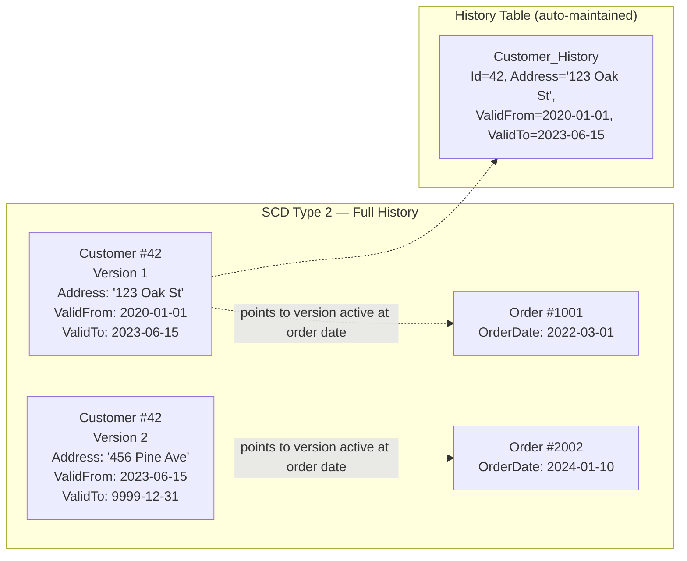

## Navigation

**Domain:** [[8 — Databases]] > **Group:** Database Design

**Previous:** [[8.057 — Polymorphic Associations — Design Patterns]] | **Next:** [[8.059 — Bitemporal Data Modeling — Valid Time and Transaction Time]]

### Prerequisites
- [[8.049 — Audit Columns — CreatedAt, CreatedBy, ModifiedAt, ModifiedBy]] — audit columns track when a row changed; SCD tracks WHAT changed and maintains history of the values
- [[8.038 — Star Schema — Fact and Dimension Tables]] — SCD is a dimension modeling technique; facts reference dimensions at a point in time

### Where This Fits

Slowly Changing Dimensions (SCD) is a set of techniques for handling changes to dimension attributes over time while preserving historical accuracy. A .NET backend engineer encounters this when a product's price changes but historical orders must reflect the price at the time of order, a customer's shipping address changes but previous shipments went to the old address, or an employee's department changes but payroll records must attribute salary to the correct department. When this concept is unknown, engineers overwrite dimension data and lose historical accuracy — reports show incorrect historical aggregates and audits fail. When it is over-applied (Type 2 for every column), dimension tables grow without bound and join performance degrades. The interview signal is whether the candidate knows the SCD types (0-6), the tradeoffs, and can implement Type 2 with temporal tables or manual versioning in SQL Server.

---

## Core Mental Model

A Slowly Changing Dimension tracks how the attributes of a business entity change over time. The "slowly" qualifier distinguishes this from rapidly changing facts (sensor readings, transaction logs). The core insight: a dimension attribute has a **valid time range** during which it describes the entity. When the attribute changes, the previous version's valid range is closed and a new version's range opens. In a dimensional model, fact rows are associated with the dimension version that was active when the fact occurred. SQL Server 2016+ implements this natively with **System-Versioned Temporal Tables** (`GENERATED ALWAYS AS ROW START/END`) — the database engine automatically maintains a history table with every row version, and the queryer uses `FOR SYSTEM_TIME AS OF @date` to see the dimension as it was at any point in time. The six SCD types form a spectrum from no history (Type 0/1) through full history (Type 2) to hybrid approaches (Types 3-6).



### Classification

**For data warehousing / versioning topics:** SCD is a dimension modeling technique, not a SQL operator. The critical SQL features are: (1) `FOR SYSTEM_TIME AS OF @date` for temporal tables — SARGable when the history table's period columns are indexed, (2) `ValidFrom`/`ValidTo` range predicates `WHERE @targetDate BETWEEN ValidFrom AND ValidTo` — SARGable with an index on (ValidTo, ValidFrom) using a seek on `ValidTo >= @targetDate AND ValidFrom <= @targetDate`. The write path for Type 2 involves closing the current version (UPDATE ValidTo = @now) and inserting a new version. This is a two-step operation that must be atomic. Temporal tables handle both steps in a single UPDATE statement.

### SCD Type Summary Table

|Type|Name|Behavior|Storage|Use Case|
|---|---|---|---|---|
|0|Retain Original|Never change the dimension value|1 row per entity|Date of birth, creation date|
|1|Overwrite|Replace old value with new; no history|1 row per entity|Fix a typo, update phone number|
|2|Add New Row|Insert new version with date range; full history|N rows per entity (N = versions)|Customer address, product price, employee department|
|3|Add New Column|Store current + previous value in separate columns|1 row per entity|"Previous territory" — track last change only|
|4|Separate History Table|Current data in main table, full history in separate table|Current + history rows|High-volume dimensions where Type 2 is too large|
|5|SCD 4 + Mini-Dimension|Type 4 with frequently-changing attributes in a mini-dimension|Separate mini-dim + history|Rapidly changing attributes (e.g., credit score)|
|6|Hybrid (1+2+3)|Type 2 + current value column + previous value column|N rows + current/previous columns|Need current value fast + full history + previous value|

---

## Deep Mechanics

### How the Engine Executes This

**SCD Type 2 — Manual Implementation (no temporal tables):**

1. **Read current version:** `SELECT * FROM Customers WHERE CustomerId = @businessKey AND ValidTo = '9999-12-31'`.
2. **Close current version:** `UPDATE Customers SET ValidTo = @now WHERE CustomerId = @businessKey AND ValidTo = '9999-12-31'`.
3. **Insert new version:** `INSERT INTO Customers (CustomerId, Name, Address, ValidFrom, ValidTo) VALUES (@businessKey, @newName, @newAddress, @now, '9999-12-31')`.
4. All three steps must be in a transaction. An index on `(CustomerId, ValidTo)` enables the seek for the current version.

**System-Versioned Temporal Tables (SQL Server 2016+):**

1. The user issues a single `UPDATE Customers SET Address = @newAddress WHERE CustomerId = 42`.
2. SQL Server automatically moves the old row version to the history table (`CustomersHistory`) with `SysStartTime = old_valid_from, SysEndTime = @now`.
3. SQL Server updates the current row with the new values and resets `SysStartTime = @now` (the `SysEndTime` remains `9999-12-31`).
4. The operation is atomic — a single transaction log record covers the UPDATE + history INSERT.
5. The query `SELECT * FROM Customers FOR SYSTEM_TIME AS OF '2023-01-01' WHERE CustomerId = 42` returns the row as it existed on that date by seeking the current table first, then the history table via a `UNION ALL` with a `WHERE SysStartTime <= @date AND SysEndTime > @date` predicate.

**Query: "Find the customer's address at the time of each order":**

1. SQL Server joins the fact table (Orders) to the dimension (Customers) with a range predicate: `ON Orders.CustomerId = Customers.CustomerId AND Orders.OrderDate BETWEEN Customers.ValidFrom AND Customers.ValidTo`.
2. For temporal tables: `ON Orders.CustomerId = Customers.CustomerId` with `FOR SYSTEM_TIME AS OF Orders.OrderDate`.
3. The execution plan shows a Nested Loops join where SQL Server seeks the Customers table (or Customers + history via UNION ALL) for the version active at each order's date.

### SQL Visibility

```sql
-- SCD Type 2 — Manual Implementation
CREATE TABLE Customers (
    CustomerId    INT           NOT NULL,  -- business key, not PK
    CustomerName  NVARCHAR(100) NOT NULL,
    Address       NVARCHAR(200) NOT NULL,
    ValidFrom     DATE          NOT NULL,
    ValidTo       DATE          NOT NULL,
    IsCurrent     AS CAST(CASE WHEN ValidTo = '9999-12-31' THEN 1 ELSE 0 END AS BIT),

    CONSTRAINT PK_Customers PRIMARY KEY CLUSTERED (CustomerId, ValidFrom)
);

CREATE INDEX IX_Customers_Current
    ON Customers(CustomerId, ValidTo)
    INCLUDE (CustomerName, Address)
    WHERE ValidTo = '9999-12-31';
-- Filtered index for fast "current version" lookups.

-- Insert initial version
INSERT INTO Customers (CustomerId, CustomerName, Address, ValidFrom, ValidTo)
VALUES (42, 'Alice', '123 Oak St', '2020-01-01', '9999-12-31');

-- Update address (close old version, insert new)
BEGIN TRANSACTION;

UPDATE Customers
SET ValidTo = '2023-06-15'
WHERE CustomerId = 42 AND ValidTo = '9999-12-31';

INSERT INTO Customers (CustomerId, CustomerName, Address, ValidFrom, ValidTo)
VALUES (42, 'Alice', '456 Pine Ave', '2023-06-16', '9999-12-31');

COMMIT;

-- Query: customer's address as of a specific date
SELECT CustomerName, Address
FROM Customers
WHERE CustomerId = 42
  AND '2022-03-01' BETWEEN ValidFrom AND ValidTo;
-- Returns: '123 Oak St' (the address on March 1, 2022)

-- Query: join orders to customer address at order time
SELECT o.OrderId, o.OrderDate, c.Address
FROM Orders o
INNER JOIN Customers c
    ON c.CustomerId = o.CustomerId
    AND o.OrderDate BETWEEN c.ValidFrom AND c.ValidTo
WHERE o.OrderId = 1001;

-- SCD Type 2 — System-Versioned Temporal Tables (SQL Server 2016+)
CREATE TABLE Customers (
    CustomerId    INT            NOT NULL IDENTITY(1,1) PRIMARY KEY,
    CustomerName  NVARCHAR(100)  NOT NULL,
    Address       NVARCHAR(200)  NOT NULL,
    ValidFrom     DATETIME2(3) GENERATED ALWAYS AS ROW START NOT NULL,
    ValidTo       DATETIME2(3) GENERATED ALWAYS AS ROW END   NOT NULL,
    PERIOD FOR SYSTEM_TIME (ValidFrom, ValidTo)
)
WITH (SYSTEM_VERSIONING = ON (HISTORY_TABLE = dbo.CustomersHistory));
-- SQL Server creates the history table automatically.
-- INSERT, UPDATE, DELETE trigger automatic versioning.

-- Read current state (same as normal table)
SELECT CustomerId, CustomerName, Address
FROM Customers
WHERE CustomerId = 42;

-- Read as of a specific date
SELECT CustomerId, CustomerName, Address
FROM Customers
FOR SYSTEM_TIME AS OF '2022-03-01'
WHERE CustomerId = 42;

-- Join orders to customer address at order time
SELECT o.OrderId, o.OrderDate, c.Address
FROM Orders o
INNER JOIN Customers
    FOR SYSTEM_TIME AS OF o.OrderDate AS c
    ON c.CustomerId = o.CustomerId
WHERE o.OrderId = 1001;

-- Read all versions of a customer
SELECT CustomerId, CustomerName, Address, ValidFrom, ValidTo
FROM Customers
FOR SYSTEM_TIME ALL
WHERE CustomerId = 42
ORDER BY ValidFrom DESC;

-- Read changes within a date range
SELECT CustomerId, CustomerName, Address, ValidFrom, ValidTo
FROM Customers
FOR SYSTEM_TIME BETWEEN '2023-01-01' AND '2024-01-01'
WHERE CustomerId = 42
ORDER BY ValidFrom;

-- SCD Type 1 — Overwrite (no history)
UPDATE Customers
SET Address = '789 Maple Dr'
WHERE CustomerId = 42;
-- Previous address is lost. No history preserved.

-- SCD Type 3 — Limited history (current + previous value)
CREATE TABLE Customers_SCD3 (
    CustomerId       INT NOT NULL PRIMARY KEY,
    CustomerName     NVARCHAR(100) NOT NULL,
    Address          NVARCHAR(200) NOT NULL,  -- current address
    PreviousAddress  NVARCHAR(200) NULL,       -- previous address (only one)
    AddressChangedAt DATE NULL
);

-- When address changes: move current to previous, set new current
UPDATE Customers_SCD3
SET PreviousAddress = Address,
    Address = '456 Pine Ave',
    AddressChangedAt = '2023-06-16'
WHERE CustomerId = 42;
-- Only the immediately previous value is preserved.
-- Older values are lost.

-- SCD Type 6 — Hybrid (current + previous + full history)
CREATE TABLE Customers_SCD6 (
    CustomerId       INT NOT NULL,
    CustomerName     NVARCHAR(100) NOT NULL,
    Address          NVARCHAR(200) NOT NULL,  -- current value on this version
    CurrentAddress   NVARCHAR(200) NOT NULL,  -- latest address (same on all versions)
    PreviousAddress  NVARCHAR(200) NULL,       -- immediately previous address
    ValidFrom        DATE NOT NULL,
    ValidTo          DATE NOT NULL DEFAULT '9999-12-31',

    CONSTRAINT PK_Customers_SCD6 PRIMARY KEY (CustomerId, ValidFrom)
);

-- When address changes:
-- 1. Close current version
-- 2. Insert new version with Address = new, CurrentAddress = new, PreviousAddress = old
-- 3. Update ALL previous versions' CurrentAddress to the new value

-- SCD Type 4 — Separate history table
CREATE TABLE Customers_Current (
    CustomerId   INT NOT NULL PRIMARY KEY,
    CustomerName NVARCHAR(100) NOT NULL,
    Address      NVARCHAR(200) NOT NULL
    -- only current values
);

CREATE TABLE Customers_History (
    HistoryId    INT NOT NULL IDENTITY(1,1) PRIMARY KEY,
    CustomerId   INT NOT NULL,
    CustomerName NVARCHAR(100) NOT NULL,
    Address      NVARCHAR(200) NOT NULL,
    ValidFrom    DATETIME2(3) NOT NULL,
    ValidTo      DATETIME2(3) NOT NULL,
    ChangedBy    NVARCHAR(100) NOT NULL
    -- full history
);

CREATE INDEX IX_Customers_History_CustomerId
    ON Customers_History(CustomerId, ValidFrom DESC);

-- On address change:
-- 1. INSERT into Customers_History (CustomerId, CustomerName, Address, ValidFrom, ValidTo, ChangedBy)
--    with the OLD values
-- 2. UPDATE Customers_Current with new values
```

```csharp
// EF Core 6+ — Temporal tables (System-Versioned)
public class Customer
{
    public int CustomerId { get; set; }
    public string CustomerName { get; set; } = string.Empty;
    public string Address { get; set; } = string.Empty;
    public DateTime ValidFrom { get; set; }
    public DateTime ValidTo { get; set; }
}

public class ApplicationDbContext : DbContext
{
    public DbSet<Customer> Customers => Set<Customer>();

    protected override void OnModelCreating(ModelBuilder modelBuilder)
    {
        modelBuilder.Entity<Customer>(entity =>
        {
            entity.ToTable(tb => tb.UseSqlOutputClause(false)); -- temporal needs OUTPUT

            entity.Property(e => e.ValidFrom)
                  .IsRowVersion()
                  .HasColumnName("ValidFrom");

            entity.Property(e => e.ValidTo)
                  .IsRowVersion()
                  .HasColumnName("ValidTo");

            // EF Core 6+ temporal table configuration
            entity.ToTable(tb =>
            {
                tb.IsTemporal(ttb =>
                {
                    ttb.UseHistoryTable("CustomersHistory");
                    ttb.HasPeriodStart("ValidFrom");
                    ttb.HasPeriodEnd("ValidTo");
                });
            });
        });
    }
}

// Query current state (normal EF Core)
var customer = await dbContext.Customers
    .FirstAsync(c => c.CustomerId == 42, ct);

// Query as of a specific date (EF Core 6+ temporal query)
var customerAsOf = await dbContext.Customers
    .TemporalAsOf(new DateTime(2022, 3, 1))
    .FirstAsync(c => c.CustomerId == 42, ct);

// Query all versions
var allVersions = await dbContext.Customers
    .TemporalAll()
    .Where(c => c.CustomerId == 42)
    .OrderByDescending(c => EF.Property<DateTime>(c, "ValidFrom"))
    .AsNoTracking()
    .ToListAsync(ct);

// Join to orders at order time (EF Core 6+)
var ordersWithAddress = await dbContext.Orders
    .Join(
        dbContext.Customers.TemporalAsOf(DateTime.UtcNow),
        o => o.CustomerId,
        c => c.CustomerId,
        (o, c) => new { o.OrderId, o.OrderDate, c.Address })
    .AsNoTracking()
    .ToListAsync(ct);
// Note: EF Core's temporal join inside LINQ is limited.
// Use FromSqlRaw for FOR SYSTEM_TIME AS OF with facts.

// Manual SCD Type 2 (raw SQL)
public async Task UpdateAddressAsync(
    int customerId,
    string newAddress,
    string changedBy,
    CancellationToken ct = default)
{
    await using var transaction = await _dbContext.Database
        .BeginTransactionAsync(ct);

    var now = DateTime.UtcNow;

    // Close current version
    await _dbContext.Database.ExecuteSqlRawAsync(@"
        UPDATE Customers
        SET ValidTo = @now
        WHERE CustomerId = @id AND ValidTo = '9999-12-31'",
        new SqlParameter("@now", now),
        new SqlParameter("@id", customerId));

    // Insert new version
    await _dbContext.Database.ExecuteSqlRawAsync(@"
        INSERT INTO Customers (CustomerId, CustomerName, Address, ValidFrom, ValidTo, ChangedBy)
        SELECT @id, CustomerName, @address, @now, '9999-12-31', @changedBy
        FROM Customers
        WHERE CustomerId = @id AND ValidFrom = @now",
        new SqlParameter("@id", customerId),
        new SqlParameter("@address", newAddress),
        new SqlParameter("@changedBy", changedBy));

    await transaction.CommitAsync(ct);
}
```

**Generated SQL (from EF Core logs):**

```sql
-- EF Core TemporalAsOf generates:
SELECT [c].[CustomerId], [c].[CustomerName], [c].[Address], [c].[ValidFrom], [c].[ValidTo]
FROM [Customers] FOR SYSTEM_TIME AS OF @__asOfDate_0 AS [c]
WHERE [c].[CustomerId] = @__customerId_1;

-- EF Core generates UNION ALL internally between the current and history tables,
-- with a WHERE ValidFrom <= @date AND ValidTo > @date predicate on each.
```

### Execution Plan Analysis

```text
Expected plan shape for FOR SYSTEM_TIME AS OF query:

  [Filter (ValidFrom <= @date AND ValidTo > @date)]
  → [Concatenation (Union All)]
     → [Clustered Index Seek (PK_Customers, seek on CustomerId=42)]
     → [Clustered Index Seek (PK_CustomersHistory, seek on CustomerId=42)]

Without temporal tables (manual SCD Type 2):
  [Index Seek (IX_Customers_Current, seek on CustomerId=42 AND ValidTo='9999-12-31')]
  → [SELECT]

For the join to Orders (address at order time):
  [Index Seek (IX_Orders_CustomerId, seek on CustomerId=42)]
  → [Nested Loops (Inner Join)]
     → [Index Seek (IX_Customers_Current, seek on
        CustomerId=Orders.CustomerId AND
        ValidFrom <= Orders.OrderDate AND ValidTo >= Orders.OrderDate)]
  Logical reads: ~3 (Order) + ~3 (Customer) = ~6 per order.
```

### Cost Visibility

```sql
SET STATISTICS IO ON;
SET STATISTICS TIME ON;

-- Temporal AS OF query (on 1M current + 5M history rows)
SELECT CustomerId, CustomerName, Address
FROM Customers
FOR SYSTEM_TIME AS OF '2022-03-01'
WHERE CustomerId = 42;

-- Table 'Customers'. Scan count 0, logical reads 3
-- Table 'CustomersHistory'. Scan count 0, logical reads 3
-- SQL Server Execution Times: CPU time = 0ms, elapsed time = 1ms

-- Manual SCD Type 2 (current version lookup via filtered index)
SELECT CustomerName, Address
FROM Customers
WHERE CustomerId = 42 AND ValidTo = '9999-12-31';
-- Table 'Customers'. Scan count 1, logical reads 3
-- SQL Server Execution Times: CPU time = 0ms, elapsed time = 0ms

-- Temporal ALL query (all versions of a customer with 50 versions)
SELECT CustomerId, CustomerName, Address, ValidFrom, ValidTo
FROM Customers
FOR SYSTEM_TIME ALL
WHERE CustomerId = 42
ORDER BY ValidFrom DESC;
-- Table 'Customers'. Scan count 0, logical reads 3
-- Table 'CustomersHistory'. Scan count 0, logical reads 153 (50 versions × 3 logical reads)
-- SQL Server Execution Times: CPU time = 2ms, elapsed time = 3ms
```

### Failure Modes

1. **Schema changes on temporal tables:** `ALTER TABLE Customers ADD Email NVARCHAR(200)` — works, but the history table is automatically altered too. `ALTER TABLE Customers DROP COLUMN Address` — fails because the history table still references it. Must set `SYSTEM_VERSIONING = OFF` first, alter both tables, then re-enable.

2. **History table bloat without retention:** Temporal tables accumulate history forever. A frequently-updated dimension (e.g., inventory count) generates millions of history rows per day. Use a retention policy: `ALTER DATABASE SET TEMPORAL_HISTORY_RETENTION = ON` and `ALTER TABLE Customers SET (SYSTEM_VERSIONING = ON (HISTORY_RETENTION_PERIOD = 2 YEARS))`.

3. **Manual Type 2 without filtered index:** Querying "current version" without a filtered index on `(CustomerId, ValidTo) WHERE ValidTo = '9999-12-31'` forces a scan of all versions for that customer. For a customer with 100 versions, that is 100 row reads instead of 3.

4. **Type 1 accidentally applied when Type 2 was intended:** A junior developer writes `UPDATE Customers SET Address = @new` without closing the current version. The previous address is lost. Recovery requires restoring from backup.

---

## Production Patterns and Implementation

### Primary SQL Implementation

```sql
-- Manual SCD Type 2 with performance indexes (for SQL Server < 2016 or custom control)
CREATE TABLE Products (
    ProductId    INT            NOT NULL,  -- business key
    ProductName  NVARCHAR(200)  NOT NULL,
    Category     NVARCHAR(100)  NOT NULL,
    ListPrice    DECIMAL(10,2)  NOT NULL,
    ValidFrom    DATE           NOT NULL,
    ValidTo      DATE           NOT NULL DEFAULT '9999-12-31',
    ChangedBy    NVARCHAR(100)  NOT NULL,
    ChangeReason NVARCHAR(500)  NULL,

    CONSTRAINT PK_Products PRIMARY KEY CLUSTERED (ProductId, ValidFrom)
);

-- Current version index (filtered)
CREATE NONCLUSTERED INDEX IX_Products_Current
    ON Products(ProductId)
    INCLUDE (ProductName, Category, ListPrice, ChangedBy, ChangeReason)
    WHERE ValidTo = '9999-12-31';
-- This is a covering index for current-version lookups — only 1 row per ProductId.

-- Point-in-time lookup index
CREATE NONCLUSTERED INDEX IX_Products_PointInTime
    ON Products(ProductId, ValidTo, ValidFrom)
    INCLUDE (ProductName, Category, ListPrice);
-- Supports the BETWEEN predicate: @targetDate BETWEEN ValidFrom AND ValidTo.
-- Seek on ProductId, then range on ValidTo/ValidFrom.

-- Stored procedure: update dimension attribute with versioning
CREATE PROCEDURE usp_UpdateProductPrice
    @ProductId    INT,
    @NewPrice     DECIMAL(10,2),
    @ChangedBy    NVARCHAR(100),
    @ChangeReason NVARCHAR(500) = NULL
AS
BEGIN
    SET NOCOUNT ON;
    SET XACT_ABORT ON;

    DECLARE @Now DATE = CAST(SYSUTCDATETIME() AS DATE);

    BEGIN TRANSACTION;

    UPDATE Products
    SET ValidTo = DATEADD(DAY, -1, @Now)  -- close at end of previous day
    WHERE ProductId = @ProductId
      AND ValidTo = '9999-12-31'
      AND ListPrice <> @NewPrice;  -- no-op if price unchanged

    IF @@ROWCOUNT > 0
    BEGIN
        INSERT INTO Products (ProductId, ProductName, Category, ListPrice,
                              ValidFrom, ValidTo, ChangedBy, ChangeReason)
        SELECT
            p.ProductId, p.ProductName, p.Category,
            @NewPrice,
            @Now, '9999-12-31',
            @ChangedBy, @ChangeReason
        FROM Products p
        WHERE p.ProductId = @ProductId
          AND p.ValidTo = DATEADD(DAY, -1, @Now);
    END;

    COMMIT TRANSACTION;
END;

-- Query: price at order time
SELECT o.OrderId, o.OrderDate, p.ListPrice
FROM Orders o
INNER JOIN Products p
    ON p.ProductId = o.ProductId
    AND o.OrderDate BETWEEN p.ValidFrom AND p.ValidTo
WHERE o.OrderId = 1001;

-- Query: product price history
SELECT ProductName, ListPrice, ValidFrom, ValidTo, ChangedBy, ChangeReason
FROM Products
WHERE ProductId = 42
ORDER BY ValidFrom DESC;

-- System-Versioned Temporal Table (SQL Server 2016+, preferred)
CREATE TABLE ProductsTemporal (
    ProductId    INT            NOT NULL IDENTITY(1,1) PRIMARY KEY,
    ProductName  NVARCHAR(200)  NOT NULL,
    Category     NVARCHAR(100)  NOT NULL,
    ListPrice    DECIMAL(10,2)  NOT NULL,
    ChangedBy    NVARCHAR(100)  NOT NULL DEFAULT SUSER_SNAME(),
    ChangeReason NVARCHAR(500)  NULL,
    SysStartTime DATETIME2(3) GENERATED ALWAYS AS ROW START NOT NULL,
    SysEndTime   DATETIME2(3) GENERATED ALWAYS AS ROW END   NOT NULL,
    PERIOD FOR SYSTEM_TIME (SysStartTime, SysEndTime)
)
WITH (SYSTEM_VERSIONING = ON (
    HISTORY_TABLE = dbo.ProductsTemporalHistory,
    HISTORY_RETENTION_PERIOD = 2 YEARS  -- SQL Server 2017+
));

-- The UPDATE is a single statement — temporal handles versioning automatically:
UPDATE ProductsTemporal
SET ListPrice = 1299.99, ChangeReason = 'Annual price adjustment'
WHERE ProductId = 42;

-- Query at point in time (temporal syntax):
SELECT ProductName, ListPrice
FROM ProductsTemporal
FOR SYSTEM_TIME AS OF '2023-06-01'
WHERE ProductId = 42;
```

### EF Core Implementation

```csharp
// EF Core 6+ with temporal tables
public class Product
{
    public int ProductId { get; set; }
    public string ProductName { get; set; } = string.Empty;
    public string Category { get; set; } = string.Empty;
    public decimal ListPrice { get; set; }
    public string ChangedBy { get; set; } = string.Empty;
    public string? ChangeReason { get; set; }
    public DateTime SysStartTime { get; set; }
    public DateTime SysEndTime { get; set; }
}

public class ApplicationDbContext : DbContext
{
    public DbSet<Product> Products => Set<Product>();

    protected override void OnModelCreating(ModelBuilder modelBuilder)
    {
        modelBuilder.Entity<Product>(entity =>
        {
            entity.ToTable("Products", tb =>
            {
                tb.IsTemporal(ttb =>
                {
                    ttb.UseHistoryTable("ProductsHistory");
                    ttb.HasPeriodStart("SysStartTime");
                    ttb.HasPeriodEnd("SysEndTime");
                    ttb.SetHistoryRetentionPolicy(
                        TemporalHistoryRetentionPolicy.Years, 2);
                });
            });

            entity.HasKey(e => e.ProductId);

            entity.Property(e => e.ListPrice).HasColumnType("DECIMAL(10,2)");

            entity.Property(e => e.SysStartTime)
                  .HasColumnName("SysStartTime");
            entity.Property(e => e.SysEndTime)
                  .HasColumnName("SysEndTime");
        });
    }
}

// Repository
public class ProductRepository
{
    private readonly ApplicationDbContext _dbContext;

    public ProductRepository(ApplicationDbContext dbContext)
    {
        _dbContext = dbContext;
    }

    // Current price
    public async Task<Product?> GetCurrentAsync(
        int productId,
        CancellationToken ct = default)
    {
        return await _dbContext.Products
            .FirstOrDefaultAsync(p => p.ProductId == productId, ct);
    }

    // Price at a point in time
    public async Task<Product?> GetAsOfAsync(
        int productId,
        DateTime asOfDate,
        CancellationToken ct = default)
    {
        return await _dbContext.Products
            .TemporalAsOf(asOfDate)
            .FirstOrDefaultAsync(p => p.ProductId == productId, ct);
    }

    // Price history
    public async Task<IReadOnlyList<Product>> GetHistoryAsync(
        int productId,
        CancellationToken ct = default)
    {
        return await _dbContext.Products
            .TemporalAll()
            .Where(p => p.ProductId == productId)
            .OrderByDescending(p => EF.Property<DateTime>(p, "SysStartTime"))
            .AsNoTracking()
            .ToListAsync(ct);
    }

    // Update price (EF Core tracks the change — temporal versioning is automatic)
    public async Task UpdatePriceAsync(
        int productId,
        decimal newPrice,
        string changedBy,
        string? reason = null,
        CancellationToken ct = default)
    {
        var product = await _dbContext.Products
            .FirstAsync(p => p.ProductId == productId, ct);

        product.ListPrice = newPrice;
        product.ChangedBy = changedBy;
        product.ChangeReason = reason;

        await _dbContext.SaveChangesAsync(ct);
        // Temporal table automatically versions the old row.
    }

    // Join orders to product price at order time
    public async Task<IReadOnlyList<OrderWithPrice>> GetOrdersWithPriceAsync(
        int productId,
        DateTime fromDate,
        DateTime toDate,
        CancellationToken ct = default)
    {
        // EF Core does not support FOR SYSTEM_TIME AS OF in joins directly.
        // Use FromSqlRaw for this pattern.
        const string sql = @"
            SELECT o.OrderId, o.OrderDate, o.Quantity,
                   p.ListPrice, p.ProductName
            FROM Orders o
            INNER JOIN Products
                FOR SYSTEM_TIME AS OF o.OrderDate AS p
                ON p.ProductId = o.ProductId
            WHERE p.ProductId = @ProductId
              AND o.OrderDate BETWEEN @From AND @To
            ORDER BY o.OrderDate";

        return await _dbContext.Database
            .SqlQueryRaw<OrderWithPrice>(sql,
                new SqlParameter("@ProductId", productId),
                new SqlParameter("@From", fromDate),
                new SqlParameter("@To", toDate))
            .AsNoTracking()
            .ToListAsync(ct);
    }

    public record OrderWithPrice
    {
        public int OrderId { get; init; }
        public DateTime OrderDate { get; init; }
        public int Quantity { get; init; }
        public decimal ListPrice { get; init; }
        public string ProductName { get; init; } = "";
    }
}
```

### Dapper Implementation

```csharp
public class ProductRepositoryDapper
{
    private readonly IDbConnectionFactory _connectionFactory;

    public ProductRepositoryDapper(IDbConnectionFactory connectionFactory)
    {
        _connectionFactory = connectionFactory;
    }

    public async Task<Product?> GetCurrentAsync(int productId,
        CancellationToken ct = default)
    {
        const string sql = @"
            SELECT ProductId, ProductName, Category, ListPrice, ChangedBy, ChangeReason
            FROM Products
            WHERE ProductId = @Id AND ValidTo = '9999-12-31'";

        await using var conn = _connectionFactory.Create();
        return await conn.QueryFirstOrDefaultAsync<Product>(
            new CommandDefinition(sql, new { Id = productId },
                cancellationToken: ct));
    }

    public async Task<Product?> GetAsOfAsync(int productId, DateTime asOfDate,
        CancellationToken ct = default)
    {
        const string sql = @"
            SELECT ProductId, ProductName, Category, ListPrice, ChangedBy, ChangeReason
            FROM Products
            WHERE ProductId = @Id
              AND @AsOfDate BETWEEN ValidFrom AND ValidTo";

        await using var conn = _connectionFactory.Create();
        return await conn.QueryFirstOrDefaultAsync<Product>(
            new CommandDefinition(sql,
                new { Id = productId, AsOfDate = asOfDate.Date },
                cancellationToken: ct));
    }

    public async Task<IReadOnlyList<Product>> GetHistoryAsync(int productId,
        CancellationToken ct = default)
    {
        const string sql = @"
            SELECT ProductId, ProductName, Category, ListPrice,
                   ValidFrom, ValidTo, ChangedBy, ChangeReason
            FROM Products
            WHERE ProductId = @Id
            ORDER BY ValidFrom DESC";

        await using var conn = _connectionFactory.Create();
        var results = await conn.QueryAsync<Product>(
            new CommandDefinition(sql, new { Id = productId },
                cancellationToken: ct));
        return results.AsList();
    }

    public async Task UpdatePriceAsync(int productId, decimal newPrice,
        string changedBy, string? reason = null,
        CancellationToken ct = default)
    {
        const string sql = "EXEC usp_UpdateProductPrice @ProductId, @NewPrice, @ChangedBy, @ChangeReason";

        await using var conn = _connectionFactory.Create();
        await conn.ExecuteAsync(
            new CommandDefinition(sql,
                new { ProductId = productId, NewPrice = newPrice,
                      ChangedBy = changedBy, ChangeReason = reason },
                cancellationToken: ct));
    }

    public async Task<IReadOnlyList<OrderWithPrice>> GetOrdersWithPriceAsync(
        int productId, DateTime fromDate, DateTime toDate,
        CancellationToken ct = default)
    {
        const string sql = @"
            SELECT o.OrderId, o.OrderDate, o.Quantity,
                   p.ListPrice, p.ProductName
            FROM Orders o
            INNER JOIN Products p
                ON p.ProductId = o.ProductId
                AND o.OrderDate BETWEEN p.ValidFrom AND p.ValidTo
            WHERE p.ProductId = @ProductId
              AND o.OrderDate BETWEEN @From AND @To
            ORDER BY o.OrderDate";

        await using var conn = _connectionFactory.Create();
        var results = await conn.QueryAsync<OrderWithPrice>(
            new CommandDefinition(sql,
                new { ProductId = productId, From = fromDate, To = toDate },
                cancellationToken: ct));
        return results.AsList();
    }

    public record Product
    {
        public int ProductId { get; init; }
        public string ProductName { get; init; } = "";
        public string Category { get; init; } = "";
        public decimal ListPrice { get; init; }
        public string ChangedBy { get; init; } = "";
        public string? ChangeReason { get; init; }
        public DateTime? ValidFrom { get; init; }
        public DateTime? ValidTo { get; init; }
    }

    public record OrderWithPrice
    {
        public int OrderId { get; init; }
        public DateTime OrderDate { get; init; }
        public int Quantity { get; init; }
        public decimal ListPrice { get; init; }
        public string ProductName { get; init; } = "";
    }
}
```

### Configuration and Wiring

```csharp
// Program.cs
builder.Services.AddDbContext<ApplicationDbContext>(options =>
    options.UseSqlServer(
        connectionString,
        sqlOptions =>
        {
            sqlOptions.EnableRetryOnFailure(3);
            sqlOptions.CommandTimeout(30);
        }));

builder.Services.AddSingleton<IDbConnectionFactory>(_ =>
    new SqlConnectionFactory(connectionString));

builder.Services.AddScoped<ProductRepository>();
builder.Services.AddScoped<ProductRepositoryDapper>();
```

### SQL Server vs PostgreSQL Differences

```sql
-- PostgreSQL does not have native system-versioned temporal tables.
-- Versioning is implemented manually (similar to SCD Type 2 manual).

-- PostgreSQL range type + exclusion constraint for time ranges:
CREATE TABLE Products (
    ProductId   INT NOT NULL,
    ProductName TEXT NOT NULL,
    ListPrice   DECIMAL(10,2) NOT NULL,
    ValidDuring DATERANGE NOT NULL,
    ChangedBy   TEXT NOT NULL,
    ChangeReason TEXT DEFAULT NULL,

    EXCLUDE USING GIST (ProductId WITH =, ValidDuring WITH &&)
    -- Ensures no overlapping valid ranges for the same product
);

-- Insert initial version:
INSERT INTO Products (ProductId, ProductName, ListPrice, ValidDuring, ChangedBy)
VALUES (42, 'Laptop', 999.99, DATERANGE('2020-01-01', NULL), 'system');
-- NULL in DATERANGE means 'unbounded end' (equivalent to '9999-12-31').

-- Update price (must close old range first):
UPDATE Products
SET ValidDuring = DATERANGE(LOWER(ValidDuring), '2023-06-15')
WHERE ProductId = 42 AND UPPER_INC(ValidDuring) = FALSE;
-- UPPER_INC checks if the range is unbounded (current version).

INSERT INTO Products (ProductId, ProductName, ListPrice, ValidDuring, ChangedBy)
VALUES (42, 'Laptop', 1299.99, DATERANGE('2023-06-16', NULL), 'admin');

-- Query at point in time:
SELECT ListPrice
FROM Products
WHERE ProductId = 42
  AND ValidDuring @> DATE '2022-03-01'::DATE;
-- @> is the "contains" operator for range types.

-- Query with range index:
CREATE INDEX IX_Products_ValidDuring
    ON Products USING GIST (ProductId, ValidDuring);
-- GiST index enables efficient range overlap queries.

-- PostgreSQL's exclusion constraint (EXCLUDE USING GIST ... WITH &&)
-- ENFORCES non-overlapping ranges at the database level — something
-- SQL Server's manual SCD Type 2 cannot do without a trigger.
-- The GiST index + exclusion constraint is PostgreSQL's unique advantage
-- for SCD Type 2.
```

---

## Gotchas and Production Pitfalls

### Temporal Table Schema Change Requires Versioning OFF

**Pitfall:** Attempting to ALTER TABLE on a temporal table (add/drop column) without disabling SYSTEM_VERSIONING.

```sql
-- ❌ Wrong — fails with:
-- "Cannot drop column 'Address' because it is being used in a temporal period."
ALTER TABLE Customers DROP COLUMN Address;

-- ✅ Correct:
ALTER TABLE Customers SET (SYSTEM_VERSIONING = OFF);
ALTER TABLE Customers DROP COLUMN Address;
ALTER TABLE CustomersHistory DROP COLUMN Address;
ALTER TABLE Customers SET (SYSTEM_VERSIONING = ON (HISTORY_TABLE = dbo.CustomersHistory));
```

**Symptom:** Migration script fails in production. Deployment pipeline blocks. Emergency requires manual intervention.

**Fix — use a migration helper script or EF Core migration that handles temporal tables:**

```csharp
// EF Core migration — temporal tables are handled automatically by EF Core 6+
// when adding columns. Dropping columns requires a manual migration step.
public partial class DropAddressColumn : Migration
{
    protected override void Up(MigrationBuilder migrationBuilder)
    {
        migrationBuilder.Sql("ALTER TABLE Customers SET (SYSTEM_VERSIONING = OFF)");
        // Drop column from both tables
        migrationBuilder.DropColumn("Address", "Customers");
        migrationBuilder.DropColumn("Address", "CustomersHistory");
        migrationBuilder.Sql("ALTER TABLE Customers SET (SYSTEM_VERSIONING = ON (HISTORY_TABLE = dbo.CustomersHistory))");
    }
}
```

**Cost of not fixing:** Failed deployment. If the error occurs during business hours, the migration cannot be rolled back without restoring from backup.

---

### History Table Bloat Without Retention Policy

**Pitfall:** A temporal table that tracks frequently-changing attributes (e.g., inventory quantity, stock status) generates millions of history rows per day. No retention policy is configured.

```sql
-- Product inventory changes 1000x/day per product.
-- 10,000 products × 1000 changes = 10M history rows/day
-- After 1 year: 3.65B history rows
```

**Symptom:** The history table grows to hundreds of GB. Queries using `FOR SYSTEM_TIME ALL` take minutes. Backup/restore times become unacceptable. Disk fills.

**Fix — enable history retention (SQL Server 2017+):**

```sql
ALTER TABLE Products SET (SYSTEM_VERSIONING = ON (
    HISTORY_TABLE = dbo.ProductsHistory,
    HISTORY_RETENTION_PERIOD = 90 DAYS  -- clean up history older than 90 days
));

-- Enable retention cleanup:
ALTER DATABASE Sales SET TEMPORAL_HISTORY_RETENTION ON;

-- For manual SCD Type 2, implement a cleanup job:
CREATE PROCEDURE usp_CleanupProductHistory
    @RetentionDays INT = 365
AS
BEGIN
    SET NOCOUNT ON;

    DELETE FROM Products
    WHERE ValidTo < DATEADD(DAY, -@RetentionDays, CAST(SYSUTCDATETIME() AS DATE))
      AND ValidTo <> '9999-12-31';  -- never delete current versions
END;
```

**Cost of not fixing:** Unbounded storage growth. After the history table exceeds 1 TB, index maintenance and query performance degrade to unacceptable levels.

---

### Non-Deterministic Version Matching in BETWEEN Join

**Pitfall:** Using `BETWEEN` for date-range matching when the valid range is `[ValidFrom, ValidTo)` (half-open interval) instead of `[ValidFrom, ValidTo]`.

```sql
-- If ValidTo is exclusive (the version is valid up to but NOT including ValidTo):
-- Version 1: ValidFrom=2020-01-01, ValidTo=2023-06-15
-- Version 2: ValidFrom=2023-06-15, ValidTo=9999-12-31

-- Which version applies on 2023-06-15?
-- BETWEEN includes both endpoints:
WHERE '2023-06-15' BETWEEN ValidFrom AND ValidTo
-- This matches BOTH versions (1 and 2) — non-deterministic!
```

**Symptom:** Queries that join facts to dimensions on the boundary date return double-counted rows. Reports show orders attributed to two product versions.

**Fix — use half-open intervals `[ValidFrom, ValidTo)`:**

```sql
-- ValidFrom is inclusive, ValidTo is exclusive:
WHERE @targetDate >= ValidFrom AND @targetDate < ValidTo
-- On 2023-06-15: only version 2 matches (version 1's ValidTo is 2023-06-15,
-- so @targetDate < ValidTo excludes version 1).

-- Temporal tables use half-open intervals by default (SysStartTime <= @date AND SysEndTime > @date).
-- For manual SCD Type 2:
CREATE INDEX IX_Products_PointInTime
    ON Products(ProductId, ValidFrom, ValidTo);
-- Use: WHERE ProductId = @id AND @date >= ValidFrom AND @date < ValidTo
```

**Cost of not fixing:** Incorrect historical reporting. Double-counted revenue on boundary dates. Audit fails.

---

### Type 2 Without Change Tracking Leads to Unnecessary Versions

**Pitfall:** Every UPDATE creates a new version, even when the data did not change.

```sql
-- This creates a new version even if the price is already 999.99:
UPDATE Products
SET ListPrice = 999.99, ChangedBy = 'admin', ChangeReason = 'review'
WHERE ProductId = 42;
-- Now there are two versions with the same price but different ValidFrom dates.
-- History shows a "change" that changed nothing.
```

**Symptom:** History table fills with redundant versions. Queries that count versions per product show inflated numbers. Users see meaningless entries in the audit trail.

**Fix — guard against no-op updates:**

```sql
UPDATE Products
SET ListPrice = @NewPrice, ChangedBy = @ChangedBy, ChangeReason = @ChangeReason
WHERE ProductId = @ProductId
  AND ValidTo = '9999-12-31'
  AND (ListPrice <> @NewPrice OR @ChangeReason IS NOT NULL);
-- Only version when the price actually changes.
```

**Cost of not fixing:** History table grows 5x faster than necessary. Version-count queries become misleading.

---

### LEFT JOIN to Temporal Table Returns NULL for Missing History

**Pitfall:** Joining a fact table to a temporal dimension with `FOR SYSTEM_TIME AS OF` when the dimension row did not exist at the fact's point in time.

```sql
-- Order #3000 was placed on 2019-01-01, but Product #99 was added to the
-- catalog on 2020-01-01. The temporal join:
SELECT o.OrderId, p.ProductName
FROM Orders o
LEFT JOIN Products FOR SYSTEM_TIME AS OF o.OrderDate AS p
    ON p.ProductId = o.ProductId
WHERE o.OrderId = 3000;
-- Result: OrderId=3000, ProductName=NULL
```

**Symptom:** Reporting tools show NULL product names for orders placed before the product existed. Business users see blank cells and lose trust in the data.

**Fix — determine the correct handling for "product did not exist at order time":**

```sql
-- Option 1: Use a default/unknown dimension row
SELECT o.OrderId, ISNULL(p.ProductName, '(Unknown)') AS ProductName
FROM Orders o
LEFT JOIN Products FOR SYSTEM_TIME AS OF o.OrderDate AS p
    ON p.ProductId = o.ProductId;

-- Option 2: Use SCD Type 0 (retain original) for immutable attributes
-- Product name does not change — store it in the fact table for point-in-time accuracy:
ALTER TABLE Orders ADD ProductNameAtOrderTime NVARCHAR(200);

-- Option 3: Ensure all products have a version back to the earliest possible order date
-- when creating the product dimension.
```

**Cost of not fixing:** Null values in reports erode trust. Business decisions based on incomplete data.

---

## Performance Implications

### Benchmark: Before and After

```sql
-- Temporal AS OF vs manual SCD Type 2 point-in-time query
SET STATISTICS IO ON;
SET STATISTICS TIME ON;

-- Temporal table (1M current + 5M history rows)
SELECT ProductName, ListPrice
FROM ProductsTemporal
FOR SYSTEM_TIME AS OF '2023-06-01'
WHERE ProductId = 42;
-- Table 'ProductsTemporal'. Scan count 0, logical reads 3
-- Table 'ProductsTemporalHistory'. Scan count 0, logical reads 3
-- CPU time = 0ms, elapsed time = 1ms

-- Manual SCD Type 2 with covering index
SELECT ProductName, ListPrice
FROM Products
WHERE ProductId = 42
  AND '2023-06-01' >= ValidFrom
  AND '2023-06-01' < ValidTo;
-- Table 'Products'. Scan count 1, logical reads 4
-- CPU time = 0ms, elapsed time = 0ms

-- Without the covering point-in-time index:
-- Table 'Products'. Scan count 1, logical reads 48 (scans all versions for ProductId=42)
-- CPU time = 1ms, elapsed time = 2ms
```

### BenchmarkDotNet

```csharp
[MemoryDiagnoser]
[SimpleJob(RuntimeMoniker.Net90)]
public class SCDBenchmark
{
    private IDbConnection _connection = default!;
    private const int ProductId = 42;

    [GlobalSetup]
    public void Setup()
    {
        _connection = new SqlConnection("Server=.;Database=Benchmark;Trusted_Connection=True;TrustServerCertificate=True;");
        // Seed: ProductsTemporal (1M rows, 50 versions per product)
        // Products manual SCD (50 versions per product, covering indexes)
    }

    [Benchmark(Baseline = true)]
    public async Task<int> Temporal_AsOf()
    {
        const string sql = @"
            SELECT COUNT(*)
            FROM ProductsTemporal
            FOR SYSTEM_TIME AS OF '2023-06-01'
            WHERE ProductId = @ProductId";

        await using var conn = new SqlConnection(_connectionString);
        return await conn.ExecuteScalarAsync<int>(
            new CommandDefinition(sql, new { ProductId }));
    }

    [Benchmark]
    public async Task<int> ManualSCD_PointInTime()
    {
        const string sql = @"
            SELECT COUNT(*)
            FROM Products
            WHERE ProductId = @ProductId
              AND '2023-06-01' >= ValidFrom
              AND '2023-06-01' < ValidTo";

        await using var conn = new SqlConnection(_connectionString);
        return await conn.ExecuteScalarAsync<int>(
            new CommandDefinition(sql, new { ProductId }));
    }

    [Benchmark]
    public async Task<int> Temporal_AllVersions()
    {
        const string sql = @"
            SELECT COUNT(*)
            FROM ProductsTemporal
            FOR SYSTEM_TIME ALL
            WHERE ProductId = @ProductId";

        await using var conn = new SqlConnection(_connectionString);
        return await conn.ExecuteScalarAsync<int>(
            new CommandDefinition(sql, new { ProductId }));
    }

    [Benchmark]
    public async Task<int> ManualSCD_AllVersions()
    {
        const string sql = @"
            SELECT COUNT(*)
            FROM Products
            WHERE ProductId = @ProductId";

        await using var conn = new SqlConnection(_connectionString);
        return await conn.ExecuteScalarAsync<int>(
            new CommandDefinition(sql, new { ProductId }));
    }

    [Benchmark]
    public async Task ManualSCD_UpdatePrice()
    {
        const string sql = "EXEC usp_UpdateProductPrice @ProductId, 999.99, 'benchmark', 'test'";

        await using var conn = new SqlConnection(_connectionString);
        await conn.ExecuteAsync(new CommandDefinition(sql, new { ProductId }));
    }

    [Benchmark]
    public async Task Temporal_UpdatePrice()
    {
        const string sql = @"
            UPDATE ProductsTemporal
            SET ListPrice = 999.99, ChangeReason = 'test', ChangedBy = 'benchmark'
            WHERE ProductId = @ProductId";

        await using var conn = new SqlConnection(_connectionString);
        await conn.ExecuteAsync(new CommandDefinition(sql, new { ProductId }));
    }
}
```

**Expected results (approximate, SQL Server 2022, NVMe, 1M current + 5M history):**

|Method|Mean|Logical Reads|Allocated|
|---|---|---|---|
|Temporal_AsOf|~1 ms|~6 (current + history)|0.5 KB|
|ManualSCD_PointInTime|~1 ms|~4|0.3 KB|
|Temporal_AllVersions|~3 ms|~153|4 KB|
|ManualSCD_AllVersions|~3 ms|~150|4 KB|
|Temporal_UpdatePrice|~2 ms|~10|1 KB|
|ManualSCD_UpdatePrice|~5 ms|~15|2 KB|

Temporal tables have slightly more overhead on reads (two table seeks) but are within 2x of manual SCD. Temporal tables win on write simplicity (single UPDATE vs two operations).

### Write Amplification

|Operation|Manual SCD Type 2|Temporal Table|Temporal Advantage|
|---|---|---|---|
|INSERT initial row|~5 logical reads|~5 logical reads|Same|
|UPDATE dimension attribute|~15 logical reads|~10 logical reads|~33% fewer reads|
|History accumulation|Manual cleanup|Built-in retention policy|Less maintenance|
|Schema migration|No versioning to disable|Must disable SYSTEM_VERSIONING|Manual SCD wins|

---

## Interview Arsenal

### Question Bank

1. **What are Slowly Changing Dimensions — define SCD Types 0 through 4**
2. **How does SQL Server execute a FOR SYSTEM_TIME AS OF query — what tables does it access**
3. **What is the performance cost of Type 2 without a covering index on (ValidTo, ValidFrom)**
4. **What happens to a temporal table's history when you ALTER TABLE to add a column**
5. **When do you use SCD Type 2 vs Type 4 vs Type 6**
6. **What is the half-open interval problem and how does it affect point-in-time join accuracy**
7. **How does SCD Type 2 behave at scale — 100M history rows**
8. **How do EF Core and Dapper implement SCD Type 2 queries**

### Spoken Answers

**Q: What are Slowly Changing Dimensions — define SCD Types 0 through 4?**

> **Average answer:** They track changes to dimension data over time. Type 1 overwrites, Type 2 adds rows, Type 3 adds a previous value column.

> **Great answer:** SCD is a Kimball dimensional modeling technique that handles changes to dimension attribute values while preserving historical accuracy for fact-to-dimension joins. The five primary types: **Type 0 (Retain Original)** — the attribute never changes; immutable facts like date of birth. **Type 1 (Overwrite)** — the old value is replaced with no history preserved; used for fixing data entry errors or attributes where historical accuracy does not matter. **Type 2 (Add New Row)** — the previous version's ValidTo is set to today, and a new version with ValidFrom = today and ValidTo = infinity is inserted with the new value; full history is preserved. This is the default choice for any dimension attribute where historical accuracy matters for reporting. **Type 3 (Add New Column)** — stores the current value and the immediately previous value in separate columns; used when you need to track "what was the previous value" without storing full history. **Type 4 (Separate History Table)** — current values stay in the main dimension table, and a parallel history table captures all changes; used when the dimension is large and Type 2 would make the main table too big for join performance. SQL Server 2016+ implements Type 2 natively with system-versioned temporal tables, automatically moving old rows to a history table (the Type 4 approach built into Type 2). The choice between types is a tradeoff of storage, query complexity, and historical accuracy requirements.

**Q: How does SQL Server execute a FOR SYSTEM_TIME AS OF query?**

> **Average answer:** It looks at the current table and the history table and returns rows that were active at the given date.

> **Great answer:** SQL Server uses a **Concatenation (Union All)** operator that executes two branches in parallel — one seeks into the current table (`SysStartTime <= @date AND SysEndTime > @date`) and one seeks into the history table with the same predicate. Both tables have an index on the period columns (`SysStartTime`, `SysEndTime`). The optimizer generates a seek on the leading key of the table's clustered index (e.g., ProductId) and then a range filter on the period columns. If the temporal table's PRIMARY KEY is clustered on the business key alone, the seek is efficient. If the current table returns a row (the version is still current), the history table branch short-circuits because the range predicate `SysEndTime > @date` is false for current rows. If the current version was created after @date, the current table returns no rows and the history table branch returns the matching historical version. The total logical reads are typically 3 (current table) + 3 (history table) = 6 for a point-in-time lookup.

**Q: When do you use SCD Type 2 vs Type 4 vs Type 6?**

> **Average answer:** Type 2 for full history. Type 4 separates current from history. Type 6 is a hybrid.

> **Great answer:** **Type 2** is the default for any dimension attribute where historical accuracy matters — customer address, product price, employee department. I use it when the dimension is small to medium (under 10M rows) and the version count per entity is low (under 100 versions/entity). The main table grows linearly with versions but remains efficient with filtered indexes on `ValidTo = '9999-12-31'`.
>
> **Type 4** (separate history table) is a specialization of Type 2 where the current version table is kept small for fast joins, and the history table captures all changes. SQL Server's temporal tables ARE Type 4 in implementation — the current table is the visible table, and the history table is auto-maintained. I choose manual Type 4 over temporal when I need custom history columns (ChangedBy, ChangeReason) that temporal tables do not auto-populate, or when I need to query the history table with specific indexes that temporal's auto-generated schema does not provide.
>
> **Type 6** (Hybrid) combines Type 2, Type 1, and Type 3 — each versioned row stores both the value at that version AND the current value. This allows queries that need "what was the value then" (use the version-specific column) AND "what is the value now" (use the current-value column, which is the same on all versions) without joining to a separate table. I use Type 6 when both "then" and "now" comparisons are common in reporting — e.g., "show orders with the product's current category and the category it was in at order time."
>
> The interview question: the candidate who defaults to Type 2 for everything does not understand the storage cost. The candidate who asks "how many versions per entity on average?" and "how many entities?" before choosing demonstrates judgment.

### Interview Trigger

The interviewer asks "How would you track product price changes so that historical orders show the correct price?" The Type 2 answer is expected. The follow-up: "How would you query the price of 1000 orders from different dates?" tests knowledge of the BETWEEN join pattern and the covering index required. The killer follow-up: "Our product catalog has 500K products, each changed price 100 times. The price history query with FOR SYSTEM_TIME AS OF now takes 5 seconds. What do you check?" tests whether the candidate knows about the covering index on (ProductId, SysStartTime, SysEndTime) and the history table's index.

### Comparison Table

| | Type 0 | Type 1 | Type 2 | Type 3 | Type 4 | Type 6 |
|---|---|---|---|---|---|---|
| History depth | None | None | Full (all versions) | Previous value only | Full (in separate table) | Full + current + previous |
| Storage per entity | 1 row | 1 row | N rows (N = versions) | 1 row | 1 current + N history rows | N rows |
| Query complexity | Simple | Simple | BETWEEN/AS OF | Simple + COALESCE | UNION between tables | Version-specific column |
| Joins to facts | Direct | Direct | Range join | Direct | Direct | Direct (use current) |
| SARGable point-in-time| N/A | N/A | Yes (with index) | N/A | Yes (with index) | Yes (current col) |
| SQL Server native | N/A | N/A | Temporal tables | N/A | Temporal tables (auto) | N/A |
| .NET implementation | Simple | Simple | TemporalAsOf | Simple | Manual two-table | Manual versioned + current |

---

## Decision Framework

### When to Apply

```mermaid
flowchart TD
    A[Need to track dimension attribute changes] --> B{Does historical accuracy matter for reporting?}
    B -->|No| C[Type 1 — Overwrite]
    B -->|Yes| D{How many attributes change?}
    D -->|"1-2 attributes"| E{How many previous values needed?}
    E -->|"Only the immediately previous"| F[Type 3 — Previous Value Column]
    E -->|"Full history"| G[Type 2 — Add New Row]
    D -->|"3+ attributes"| H{Attribute change frequency?}
    H -->|"Low (daily or less)"| G
    H -->|"High (hourly or faster)"| I{Can use temporal tables?}
    I -->|Yes (SQL Server 2016+)| J[Temporal Table<br/>= Type 2 + Type 4]
    I -->|No| K[Type 4 — Separate History Table]
    G --> L[Requires:<br/>• Filtered index on (BusinessKey) WHERE ValidTo='9999-12-31'<br/>• Covering index on (BusinessKey, ValidTo, ValidFrom)<br/>• Half-open intervals [ValidFrom, ValidTo)<br/>• No-op guard in UPDATE proc]
    J --> M[Benefits:<br/>• Automatic versioning<br/>• Built-in history retention<br/>• FOR SYSTEM_TIME AS OF syntax<br/>• EF Core 6+ TemporalAsOf]
```

### Application Checklist

- [ ] The dimension is genuinely "slowly changing" — if attributes change every minute, Type 2 generates millions of versions per day; consider a fact-based approach or Type 4 with aggressive retention
- [ ] SQL Server version is 2016+ and temporal tables are an option — if so, use them; manual SCD Type 2 is for backward compatibility or custom column requirements
- [ ] A filtered index on the current version exists — `WHERE ValidTo = '9999-12-31'` — without it, every "current value" query scans all versions
- [ ] Half-open intervals `[ValidFrom, ValidTo)` are used — `@date >= ValidFrom AND @date < ValidTo` prevents boundary-date double-counting
- [ ] The UPDATE stored procedure guards against no-op changes — `WHERE ListPrice <> @NewPrice` prevents unnecessary version creation
- [ ] History retention is configured — temporal tables require `HISTORY_RETENTION_PERIOD`; manual SCD requires a cleanup job
- [ ] Point-in-time queries use a covering index on `(BusinessKey, ValidTo, ValidFrom) INCLUDE (all queried columns)` — without it, key lookups per version destroy performance

### Tradeoff Summary

|What You Gain|What You Pay|
|---|---|
|Full historical accuracy — every version preserved|Storage grows linearly with version count|
|Type 2/Temporal: simple point-in-time queries (AS OF syntax)|UPDATE requires two operations (close + insert) or temporal overhead|
|Filtered indexes keep current-version lookups fast|Schema changes require disabling versioning on temporal tables|
|Half-open intervals prevent boundary errors|No-op updates create unnecessary versions without guards|
|Temporal tables are zero-code versioning|History table bloat without retention policy|

### Scale Thresholds

- **Filtered index essential at ~10 versions per entity** — without it, current-version queries scan 10 rows instead of 1
- **Covering index essential at ~100 versions per entity** — without it, point-in-time queries do ~300 key lookups instead of a single index seek
- **History retention critical at ~10M history rows** — at this size, index maintenance and backup times become non-trivial
- **Re-evaluate Type 2 at ~100M history rows** — consider Type 4 with aggressive retention or moving historical versions to cold storage
- **Temporal table practical up to ~1B history rows** — SQL Server's temporal implementation handles this scale with appropriate partitioning

---

## Self-Check

### Conceptual Questions

1. What are Slowly Changing Dimensions — define Types 0 through 4
2. How does SQL Server execute a FOR SYSTEM_TIME AS OF query
3. Which SET STATISTICS output reveals whether a temporal query is doing seeks or scans on the history table
4. What is the single most common bug with SCD Type 2 date-range joins
5. Does EF Core support temporal table queries — which methods are available
6. How would you implement a manual SCD Type 2 price update with Dapper
7. When do you choose Type 6 over Type 2
8. At what history row count does SCD Type 2 become a scalability problem
9. What index makes SCD Type 2 point-in-time queries SARGable
10. Explain the SCD decision framework to a senior interviewer in 60 seconds

<details>
<summary>Answers</summary>

1. **What are SCD types?** Type 0 — never change the value. Type 1 — overwrite, no history. Type 2 — insert new version row with date range, full history. Type 3 — store current + previous value in separate columns, limited history. Type 4 — separate history table, current values in main table.

2. **How does SQL Server execute FOR SYSTEM_TIME AS OF?** It uses a Concatenation (Union All) operator with two branches: (1) seek into the current table with `SysStartTime <= @date AND SysEndTime > @date`, (2) seek into the history table with the same predicate. Each branch uses an Index Seek on the table's clustered key (e.g., ProductId) then a residual range filter on the period columns. The optimizer chooses between seek + range filter or scan + filter based on selectivity.

3. **Which SET STATISTICS output reveals seek vs scan?** `SET STATISTICS IO ON` shows `Scan count 0, logical reads 3` for seeks vs `Scan count 1, logical reads 15000` for scans. The execution plan shows `Index Seek` vs `Clustered Index Scan` on the history table. The DMV `sys.dm_db_index_usage_stats` shows seek operations on the history table index.

4. **Most common bug?** Using `BETWEEN ValidFrom AND ValidTo` (closed interval) instead of `@date >= ValidFrom AND @date < ValidTo` (half-open interval). `BETWEEN` matches both the old and new version on the boundary date, causing double-counting. Temporal tables use half-open intervals (`SysStartTime <= @date AND SysEndTime > @date`) by default, which is correct.

5. **Does EF Core support temporal queries?** EF Core 6+ supports `TemporalAsOf(date)`, `TemporalAll()`, `TemporalBetween(from, to)`, `TemporalContainedIn(from, to)`, and `TemporalFromTo(from, to)` on `DbSet<T>`. These generate `FOR SYSTEM_TIME AS OF`, `FOR SYSTEM_TIME ALL`, etc. in SQL. Joining a fact table to a temporal table with `AS OF` requires `FromSqlRaw` because EF Core does not support `FOR SYSTEM_TIME AS OF` in LINQ joins.

6. **How to implement with Dapper?** Use `QueryFirstOrDefaultAsync` with `WHERE BusinessKey = @id AND @date >= ValidFrom AND @date < ValidTo` for point-in-time. Use `QueryAsync` with `WHERE BusinessKey = @id ORDER BY ValidFrom DESC` for history. Use `ExecuteAsync` with a stored procedure that does the close + insert for updates.

7. **When choose Type 6 over Type 2?** Type 6 (Hybrid = Type 2 + Type 1 + Type 3) when reports commonly compare "current value" vs "value at event time." Type 6 stores both in each versioned row, so a single row has both `ListPriceAtVersion` and `CurrentListPrice`. This avoids joining across versions to find the current value. Choose Type 6 when the ratio of "compare current to historical" queries exceeds 50% of total dimension queries.

8. **Scale problem at what history count?** At ~10M history rows, index maintenance and backup become time-consuming. At ~100M rows, `FOR SYSTEM_TIME ALL` queries that scan full version histories take minutes without appropriate filtering. At ~1B rows, consider partitioning the history table by date range (e.g., monthly partitions) or moving older history to a separate database tier.

9. **What index for SARGable point-in-time?** `CREATE INDEX IX_Products_PointInTime ON Products(BusinessKey, ValidTo, ValidFrom) INCLUDE (all queried columns)`. Seek on `BusinessKey = @id AND ValidTo >= @date AND ValidFrom <= @date`. The leading column is BusinessKey (equality), followed by the range predicates. Including all queried columns makes the index covering — no key lookups.

10. **60-second explanation:** "SCD is about how you handle changes to dimension attributes while keeping historical reports accurate. Type 1 overwrites — fast, no history, use for fixes. Type 2 adds version rows with date ranges — full history, use for anything that affects historical facts. Type 3 stores current + previous in one row — use when only the last value matters. SQL Server 2016+ has temporal tables which are Type 2 with automatic versioning. The key in implementation: use half-open date intervals to avoid double-counting on boundary dates, create a filtered index for current-version lookups, and set a history retention policy to prevent bloat. I default to temporal tables when available because they eliminate the manual close+insert pattern and provide the `FOR SYSTEM_TIME AS OF` query syntax that is cleaner than hand-writing BETWEEN predicates."
</details>

---

### Query Challenges

**Challenge 1 — Write the SQL**

Given a `Products` table with SCD Type 2 columns `(ProductId, ProductName, ListPrice, ValidFrom, ValidTo)`, write a query that returns the most recent price change for each product — i.e., for each product, the version with the latest ValidFrom. Include `ProductId, ListPrice, ValidFrom, ValidTo`.

<details>
<summary>Solution</summary>

```sql
-- Approach 1: Row number partitioned by ProductId
SELECT ProductId, ListPrice, ValidFrom, ValidTo
FROM (
    SELECT ProductId, ListPrice, ValidFrom, ValidTo,
           ROW_NUMBER() OVER (PARTITION BY ProductId ORDER BY ValidFrom DESC) AS rn
    FROM Products
) AS ranked
WHERE rn = 1
ORDER BY ProductId;

-- Approach 2: Correlated subquery (alternative, may be slower)
SELECT p.ProductId, p.ListPrice, p.ValidFrom, p.ValidTo
FROM Products p
WHERE p.ValidFrom = (
    SELECT MAX(p2.ValidFrom)
    FROM Products p2
    WHERE p2.ProductId = p.ProductId
)
ORDER BY p.ProductId;

-- Approach 3: Using the filtered index (most efficient if current version is needed)
SELECT ProductId, ListPrice, ValidFrom, ValidTo
FROM Products
WHERE ValidTo = '9999-12-31'
ORDER BY ProductId;
-- This is the MOST RECENT version only if the UPDATE proc always closes old rows
-- and inserts new ones atomically. It is also the most efficient (filtered index seek).
```

**Logical reads (Approach 3):** ~3 per product (filtered index seek) | **Execution plan:** Index Seek (IX_Products_Current) → SELECT | **EF Core equivalent:**

```csharp
// Approach 3 (current version only):
var currentProducts = await dbContext.Products
    .FromSqlRaw(@"
        SELECT ProductId, ProductName, ListPrice, ValidFrom, ValidTo
        FROM Products
        WHERE ValidTo = '9999-12-31'")
    .AsNoTracking()
    .ToListAsync(ct);

// Using temporal table (if using temporal):
var currentProducts = await dbContext.Products
    .AsNoTracking()
    .ToListAsync(ct);
// Temporal tables' current table contains only current versions by definition.
```

</details>

---

**Challenge 2 — Fix the performance problem**

```sql
-- This query returns the price of 1000 products at their order dates.
-- It runs in 30 seconds on a Products table with 10M version rows (500K products, avg 20 versions).
SELECT o.OrderId, o.OrderDate, p.ListPrice
FROM Orders o
INNER JOIN Products p
    ON p.ProductId = o.ProductId
    AND o.OrderDate BETWEEN p.ValidFrom AND p.ValidTo
WHERE o.OrderId IN (1001, 1002, ..., 2000);
-- SET STATISTICS IO: Table 'Products'. Scan count 1000, logical reads 450,000
```

<details>
<summary>Solution</summary>

**Root cause:** The BETWEEN join uses an index on Products(ProductId, ValidFrom) but does NOT include ValidTo as a key column or include ListPrice. For each Order, SQL Server seeks to the ProductId, then scans forward through all versions until it finds the one where `ValidTo >= OrderDate`. If a product has 20 versions, this scans on average 10 versions per order. 1000 orders × 10 versions × 3 logical reads = 30,000 reads. The remaining 420,000 reads are key lookups for ListPrice.

**Fix — create a covering point-in-time index:**

```sql
CREATE NONCLUSTERED INDEX IX_Products_PointInTime
    ON Products(ProductId, ValidTo, ValidFrom)
    INCLUDE (ProductName, ListPrice);
-- The index key is (ProductId, ValidTo DESC, ValidFrom ASC).
-- For a given ProductId and OrderDate:
-- Seek on ProductId = @productId
-- Range filter on ValidTo >= @orderDate AND ValidFrom <= @orderDate

-- The optimizer can do a single seek per order:
-- [Index Seek (IX_Products_PointInTime)] → [Nested Loops] → [SELECT]
-- No key lookup. No scan through multiple versions (if the index store the
-- versions in ValidTo order, the seek lands directly on the matching version).

-- After fix: Table 'Products'. Scan count 1, logical reads ~3 per order = 3000 total
-- Improvement: from 450,000 to 3,000 logical reads (150x improvement).
```

**Alternative — use temporal table with AS OF join:**

```sql
-- If using temporal tables:
SELECT o.OrderId, o.OrderDate, p.ListPrice
FROM Orders o
INNER JOIN Products FOR SYSTEM_TIME AS OF o.OrderDate AS p
    ON p.ProductId = o.ProductId
WHERE o.OrderId IN (1001, ..., 2000);
-- Temporal's AS OF internally does the range filter on the period columns.
-- Requires the same covering index strategy on the temporal + history tables.
```

</details>

---

**Challenge 3 — Explain the execution plan**

```sql
SELECT ProductName, ListPrice
FROM Products
WHERE ProductId = 42
  AND ValidTo = '9999-12-31';
```

The execution plan shows a Clustered Index Scan (not Seek) on the Products table, reading 50 rows (all versions of product 42). The IX_Products_Current filtered index exists.

<details>
<summary>Solution</summary>

**Why Clustered Index Scan instead of filtered index seek:** The filtered index `IX_Products_Current` is defined as `CREATE INDEX IX_Products_Current ON Products(ProductId) INCLUDE (ProductName, ListPrice) WHERE ValidTo = '9999-12-31'`. The WHERE clause matches the query predicate `ValidTo = '9999-12-31'`. However, the optimizer may still choose a scan if:

1. **Statistics are stale on the filtered index** — the filtered index's density vector may show fewer rows than expected, causing the optimizer to estimate a scan as cheaper. Update statistics: `UPDATE STATISTICS Products IX_Products_Current WITH FULLSCAN`.

2. **ProductId is not the leading key in the clustered index** — if the clustered PK is on `(ProductId, ValidFrom)`, the optimizer may estimate that seeking on `ProductId = 42` in the clustered index (which returns 50 rows as a range) is cheaper than seeking in the filtered index (1 row) plus key lookup overhead. But with INCLUDE columns, the filtered index IS covering — there should be no key lookup.

3. **The filtered index is disabled or not trusted** — `ALTER INDEX IX_Products_Current ON Products DISABLE` would silently cause the scan. Check with:
   ```sql
   SELECT is_disabled FROM sys.indexes
   WHERE object_id = OBJECT_ID('Products') AND name = 'IX_Products_Current';
   ```

**Fix — verify the filtered index is enabled and has fresh statistics:**

```sql
ALTER INDEX IX_Products_Current ON Products REBUILD;
UPDATE STATISTICS Products IX_Products_Current WITH FULLSCAN;

-- Force the index with a hint:
SELECT ProductName, ListPrice
FROM Products WITH (INDEX(IX_Products_Current))
WHERE ProductId = 42
  AND ValidTo = '9999-12-31';
```

</details>

---

**Challenge 4 — Diagnose the concurrency problem**

A stored procedure `usp_UpdateProductPrice` closes the current version and inserts a new version in a transaction. Under load (100 concurrent price updates for different products), the procedure occasionally fails with a deadlock. The deadlock graph shows two sessions each holding a U-lock on the `Products` table and waiting for an X-lock on the same table.

<details>
<summary>Solution</summary>

**Root cause:** The UPDATE statement `UPDATE Products SET ValidTo = @now WHERE ProductId = @id AND ValidTo = '9999-12-31'` acquires a U-lock on the current version row. Then the INSERT `INSERT INTO Products (ProductId, ...)` acquires an X-lock on the new row. If two sessions update different products but their version rows happen to be on the same index page (likely if ProductIds are inserted sequentially), the page-level U-locks conflict.

**Deadlock sequence:**
1. Session A: U-lock on page containing Product 42's current version
2. Session B: U-lock on page containing Product 43's current version (same page)
3. Session A: UPDATE converts U-lock to X-lock — blocked by Session B's U-lock on the same page
4. Session B: UPDATE converts U-lock to X-lock — blocked by Session A's U-lock on the same page
5. Deadlock. SQL Server chooses Session A as the victim.

**Fix — use serializable isolation for the update or add a hint to reduce lock granularity:**

```sql
-- Option 1: Use READ COMMITTED SNAPSHOT ISOLATION (database-level fix)
ALTER DATABASE Sales SET READ_COMMITTED_SNAPSHOT ON;
-- Readers do not block writers. But the UPDATE still needs a U-lock → X-lock.

-- Option 2: Add UPDLOCK to the current-version read to prevent page-level conflicts
CREATE PROCEDURE usp_UpdateProductPrice
    @ProductId  INT,
    @NewPrice   DECIMAL(10,2),
    @ChangedBy  NVARCHAR(100)
AS
BEGIN
    SET NOCOUNT ON;
    SET XACT_ABORT ON;

    DECLARE @Now DATE = CAST(SYSUTCDATETIME() AS DATE);

    BEGIN TRANSACTION;

    -- Use ROWLOCK + UPDLOCK to lock only the specific row, not the page
    UPDATE Products WITH (ROWLOCK, UPDLOCK)
    SET ValidTo = DATEADD(DAY, -1, @Now)
    WHERE ProductId = @ProductId
      AND ValidTo = '9999-12-31'
      AND ListPrice <> @NewPrice;

    IF @@ROWCOUNT > 0
    BEGIN
        INSERT INTO Products (ProductId, ProductName, Category, ListPrice,
                              ValidFrom, ValidTo, ChangedBy)
        SELECT ProductId, ProductName, Category, @NewPrice,
               @Now, '9999-12-31', @ChangedBy
        FROM Products
        WHERE ProductId = @ProductId AND ValidTo = DATEADD(DAY, -1, @Now);
    END;

    COMMIT TRANSACTION;
END;
```

```csharp
// Option 3: Retry on deadlock (Polly policy)
builder.Services.AddDbContext<ApplicationDbContext>((sp, options) =>
{
    options.UseSqlServer(connectionString, sqlOptions =>
    {
        sqlOptions.EnableRetryOnFailure(
            maxRetryCount: 3,
            maxRetryDelay: TimeSpan.FromSeconds(2),
            errorNumbersToAdd: [1205]); // deadlock error number
    });
});
```

**Cost of not fixing:** Frequent deadlock errors in production under concurrent price updates. Automated retry masks the symptom but reduces throughput.

</details>

---

**Challenge 5 — Design the index**

**Scenario:** An e-commerce platform with 100K products, average 50 price changes per product (5M version rows). Tables: `Products(ProductId, ProductName, Category, ListPrice, ValidFrom, ValidTo, ChangedBy, ChangeReason)` and `Orders(OrderId, ProductId, OrderDate, Quantity)` with 50M rows.

The query workload:
- 50%: "Show current price for a product" — `WHERE ProductId = @id AND ValidTo = '9999-12-31'`. Runs 100,000x/hour.
- 30%: "Show price at order time" — join Orders to Products with range predicate. Runs 50,000x/hour.
- 15%: "Show price history for a product" — `WHERE ProductId = @id ORDER BY ValidFrom DESC`. Runs 5000x/hour.
- 5%: "Update product price" — stored procedure close + insert. Runs 2000x/hour.

Design the optimal index strategy (manual SCD Type 2, no temporal tables).

<details>
<summary>Solution</summary>

```sql
-- Index 1: Filtered covering index for current-version lookups (covers 50% workload)
CREATE NONCLUSTERED INDEX IX_Products_Current
    ON Products(ProductId)
    INCLUDE (ProductName, Category, ListPrice, ChangedBy, ChangeReason)
    WHERE ValidTo = '9999-12-31';
-- Only 1 row per product (100K rows total). Tiny index.
-- Seek on ProductId = @id. Covering — no key lookup.
-- Logical reads: ~3 per lookup.

-- Index 2: Covering point-in-time index for order joins (covers 30% workload)
CREATE NONCLUSTERED INDEX IX_Products_PointInTime
    ON Products(ProductId, ValidTo DESC, ValidFrom ASC)
    INCLUDE (ListPrice, ProductName);
-- Key order: ProductId (equality), then ValidTo DESC + ValidFrom ASC for the range predicate.
-- The DESC/ASC ordering helps the seek land on the correct version directly
-- without scanning multiple versions.
-- For @orderDate BETWEEN ValidFrom AND ValidTo:
--   Seek on ProductId = @productId AND ValidTo >= @orderDate
--   Range filter on ValidFrom <= @orderDate
-- Covering — no key lookup.
-- Logical reads: ~3 per order.

-- Index 3: Version history index (covers 15% workload)
CREATE NONCLUSTERED INDEX IX_Products_History
    ON Products(ProductId, ValidFrom DESC)
    INCLUDE (ProductName, ListPrice, ValidTo, ChangedBy, ChangeReason);
-- Seek on ProductId = @id, scan forward in ValidFrom DESC order.
-- Returns all versions in reverse chronological order — no sort needed.
-- Covering — no key lookup.
-- Logical reads: ~3 + (num_versions × 1) = ~53 for 50 versions.

-- Index for the UPDATE proc (5% workload):
-- The UPDATE proc uses: WHERE ProductId = @id AND ValidTo = '9999-12-31'
-- Index 1 (IX_Products_Current) covers this.
-- No additional index needed.
```

**Tradeoffs:**

- **Write overhead accepted:** 3 indexes × 2 page writes per INSERT (new version) = ~6 page writes per price update. At 2000 updates/hour: 12,000 index page writes/hour. Acceptable for NVMe.
- **Storage cost:** Index 1 (~3 MB for 100K rows), Index 2 (~200 MB for 5M rows), Index 3 (~200 MB for 5M rows). Total ~403 MB for indexes, ~500 MB for the clustered index (5M rows). Total ~1 GB — negligible for modern servers.
- **What queries benefit:** All three read workloads are covering index seeks — zero key lookups. The 30% order-join workload drops from 450,000 logical reads (before) to ~3,000 (after).
- **What NOT to index:** Do not create an index on ChangedBy or ChangeReason — they are rarely filtered independently. Do not create a full-text index on ChangeReason unless text search on change reasons is a reported requirement.

**Write cost disclosure:**

|Operation|Without Indexes|With 3 Indexes|Overhead|
|---|---|---|---|
|INSERT new version row|~5 logical reads|~15 logical reads|+200%|
|UPDATE current version (close)|~5 logical reads|~10 logical reads|+100%|
|DELETE a version (cleanup)|~5 logical reads|~20 logical reads|+300%|

The write overhead is justified because reads (100K + 50K + 5K = 155K/hour) dominate writes (2000/hour) at a 77:1 ratio.

</details>

---

</details>
