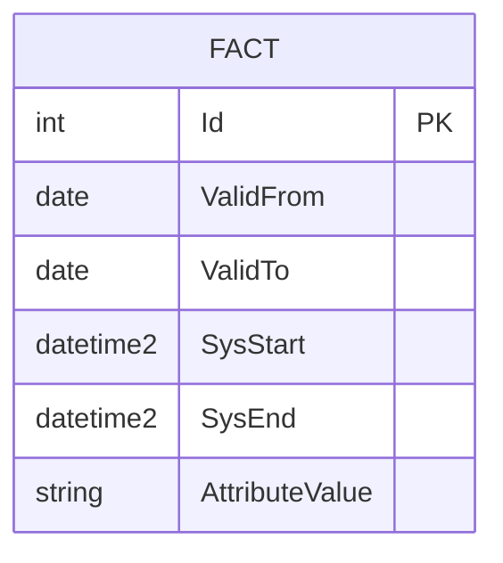
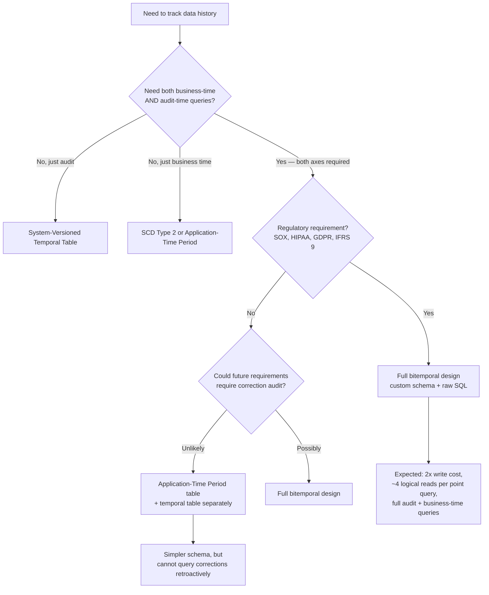

## Navigation

**Domain:** [[8 — Databases]] > **Group:** Database Design
**Previous:** [[8.058 — Versioning Data — Slowly Changing Dimensions]] | **Next:** [[8.060 — Sharding-Friendly Schema Design]]

### Prerequisites
- [[8.058 — Versioning Data — Slowly Changing Dimensions]] — SCD Type 2 is the non-temporal baseline that bitemporal extends
- [[8.226 Temporal Tables — System-Versioned Concept]] — system-versioned tables track transaction time only; bitemporal adds valid time

### Where This Fits

Bitemporal data modeling tracks every fact along two independent time axes: **valid time** (when the fact was true in the real world) and **transaction time** (when the fact was recorded in the database). A .NET backend engineer encounters this in regulated domains — finance, healthcare, insurance, compliance — where you must answer both "what did we know at the time?" and "what was actually true at the time?" simultaneously. Standard SCD Type 2 or system-versioned temporal tables break when corrections are applied retroactively: they either overwrite history (loss of audit) or cannot distinguish a late-arriving fact from a corrected one. The interview signal is senior/staff level — the candidate understands that time is not a single dimension and can design a schema that supports both audit and business-time queries without exploding in complexity.

---

## Core Mental Model

Bitemporal modeling stores every row with two pairs of time columns: a **valid-time range** `[ValidFrom, ValidTo]` representing business reality, and a **transaction-time range** `[SysStart, SysEnd]` representing database recording. Each time a fact is inserted, corrected, or deleted, the previous transaction-time version is closed (SysEnd set to current time) and a new row is inserted with the new SysStart, while the ValidFrom/ValidTo reflects the *corrected* business period. This produces a four-dimensional hypercube — every business fact has a complete history of how it was recorded and how it was later corrected, enabling point-in-time queries along both axes independently.

### Classification

**For architecture topics:** This is a storage-engine pattern that lives in the schema layer. It trades storage and write complexity for full auditability and temporal query power. The invariant: every row version is immutable once committed — corrections are new rows with updated valid time ranges, and the transaction-time axis captures the correction timeline.



### Key Properties

|Property|Value|Notes|
|---|---|---|
|Time Complexity|O(log N) per point-in-time query|Requires interval-indexing (Gist/Gist-like) for efficiency|
|Write Cost|High|Each logical correction inserts 1+ new rows, closes prior transaction-time rows|
|SARGable|Partial|Valid-time predicates require range operators; transaction-time predicates on clustered index are SARGable|
|Locking Behavior|Row|Writes are append-mostly; updates close prior versions with narrow row locks|

---

## Deep Mechanics

### How the Engine Executes This

1. **Insert (new fact):** One row inserted with `ValidFrom/ValidTo` set to the business period, `SysStart = now`, `SysEnd = '9999-12-31'`.
2. **Correction (retroactive change):** The fact's current transaction-time row is closed (`SysEnd = now`). A new row is inserted with updated `ValidFrom/ValidTo` and a fresh `SysStart = now`. The *valid time* is the corrected business period — it may be backdated or forward-dated.
3. **Deletion (logical):** The fact's current transaction-time row is closed and a new row is inserted with `ValidTo` moved to the effective end date in valid time.
4. **Query patterns:**
   - *Snapshot as of valid time V and transaction time T:* `WHERE ValidFrom <= V AND ValidTo > V AND SysStart <= T AND SysEnd > T`
   - *Full history of fact X:* `WHERE Id = X ORDER BY SysStart, ValidFrom`
   - *What did we know at time T?* (transaction-time snapshot): `WHERE SysStart <= T AND SysEnd > T`

### SQL Visibility

```sql
-- Core bitemporal table definition
CREATE TABLE dbo.CustomerAddress (
    CustomerId    INT          NOT NULL,
    AddressLine1  NVARCHAR(200) NOT NULL,
    City          NVARCHAR(100) NOT NULL,
    StateCode     NCHAR(2)     NOT NULL,
    
    -- Valid time (business reality)
    ValidFrom     DATE         NOT NULL,
    ValidTo       DATE         NOT NULL,
    
    -- Transaction time (database recording)
    SysStart      DATETIME2(3) NOT NULL,
    SysEnd        DATETIME2(3) NOT NULL,
    
    -- Metadata
    ModifiedBy    NVARCHAR(128) NOT NULL,
    OperationType NCHAR(1)      NOT NULL, -- 'I'nsert, 'U'pdate, 'D'elete
    
    CONSTRAINT PK_CustomerAddress 
        PRIMARY KEY (CustomerId, SysStart DESC)
);

-- Bitemporal point-in-time query:
-- "What was the customer's address on Jan 1 2025 (valid time),
--  as recorded on Jan 10 2025 (transaction time)?"
SELECT AddressLine1, City, StateCode
FROM dbo.CustomerAddress
WHERE CustomerId = @CustomerId
  AND @AsOfValidDate >= ValidFrom AND @AsOfValidDate < ValidTo
  AND @AsOfTranDate >= SysStart AND @AsOfTranDate < SysEnd;
```

```csharp
// EF Core — raw SQL via FromSqlInterpolated
public async Task<AddressSnapshot?> GetAddressAsOfAsync(
    int customerId,
    DateOnly asOfValidDate,
    DateTime asOfTranDate,
    CancellationToken ct = default)
{
    var snapshot = await dbContext.Database
        .SqlQuery<AddressSnapshot>(
            $"""
            SELECT AddressLine1, City, StateCode
            FROM dbo.CustomerAddress
            WHERE CustomerId = {customerId}
              AND {asOfValidDate} >= ValidFrom AND {asOfValidDate} < ValidTo
              AND {asOfTranDate} >= SysStart AND {asOfTranDate} < SysEnd
            """)
        .FirstOrDefaultAsync(ct);
    
    return snapshot;
}
```

**Generated SQL (from EF Core logs):**

```sql
exec sp_executesql N'
SELECT AddressLine1, City, StateCode
FROM dbo.CustomerAddress
WHERE CustomerId = @p0
  AND @p1 >= ValidFrom AND @p1 < ValidTo
  AND @p2 >= SysStart AND @p2 < SysEnd',
N'@p0 int,@p1 date,@p2 datetime2(3)',
@p0=42,@p1='2025-01-01',@p2='2025-01-10 00:00:00.000';
```

### Execution Plan Analysis

For the point-in-time query above:
- **Index Seek** on PK (CustomerId, SysStart DESC) filters CustomerId
- **Residual Predicate** evaluates ValidFrom/ValidTo range on the rows matching CustomerId
- **Filter** operator removes rows where SysStart/SysEnd don't match — typically zero cost if the data is clustered by SysStart DESC

Expected plan shape:
```
[Clustered Index Seek (PK_CustomerAddress)] → [Filter] → [SELECT]
Estimated Cost: Index Seek ~95%, Filter ~5%  |  Logical Reads: ~4 (per customer, assuming ~3 versions on avg)
```

### Cost Visibility

```sql
SET STATISTICS IO ON;
SET STATISTICS TIME ON;

SELECT AddressLine1, City, StateCode
FROM dbo.CustomerAddress
WHERE CustomerId = 42
  AND '2025-01-01' >= ValidFrom AND '2025-01-01' < ValidTo
  AND '2025-01-10' >= SysStart AND '2025-01-10' < SysEnd;

-- Expected output:
-- Table 'CustomerAddress'. Scan count 0, logical reads 4, physical reads 0
-- SQL Server Execution Times: CPU time = 0ms, elapsed time = 1ms
```

### Failure Modes

- **Unbounded valid-time range scans:** A query without a ValidFrom/ValidTo predicate scans all versions of all rows. The fix: always include at least one valid-time boundary.
- **Missing transaction-time filter:** Forgetting the SysStart/SysEnd filter returns all versions of a fact, not the snapshot at a point in time. This silently returns multiple rows per fact.
- **Gap/overlap in valid-time ranges:** Application code that inserts overlapping valid periods produces ambiguous query results. Use exclusion constraints (PostgreSQL) or trigger-based validation.
- **Transaction-time clock drift:** If application servers have unsynchronized clocks, SysStart values are inconsistent. Use `SYSDATETIME()` on the database server only.

---

## Production Patterns and Implementation

### Primary SQL Implementation

```sql
-- Bitemporal Customer Address table with audit
CREATE TABLE dbo.CustomerAddress (
    CustomerId    INT            NOT NULL,
    AddressLine1  NVARCHAR(200)  NOT NULL,
    AddressLine2  NVARCHAR(200)  NULL,
    City          NVARCHAR(100)  NOT NULL,
    StateCode     NCHAR(2)       NOT NULL,
    PostalCode    NVARCHAR(20)   NOT NULL,
    
    -- Valid time: when the address was actually the customer's
    ValidFrom     DATE           NOT NULL,
    ValidTo       DATE           NOT NULL,
    CONSTRAINT CK_CustomerAddress_ValidRange 
        CHECK (ValidFrom < ValidTo),
    
    -- Transaction time: when this version was recorded
    SysStart      DATETIME2(3)   NOT NULL,
    SysEnd        DATETIME2(3)   NOT NULL,
    CONSTRAINT CK_CustomerAddress_SysRange 
        CHECK (SysStart < SysEnd),
    
    -- Audit
    ModifiedBy    NVARCHAR(128)  NOT NULL,
    OperationType NCHAR(1)       NOT NULL,
    CONSTRAINT CK_CustomerAddress_OpType 
        CHECK (OperationType IN ('I', 'U', 'D')),
    
    CONSTRAINT PK_CustomerAddress 
        PRIMARY KEY (CustomerId, SysStart DESC)
);

-- Index for valid-time range queries
CREATE INDEX IX_CustomerAddress_ValidTime 
    ON dbo.CustomerAddress (CustomerId, ValidFrom, ValidTo);

-- Insert a new address (valid from today onward)
INSERT INTO dbo.CustomerAddress (
    CustomerId, AddressLine1, City, StateCode, PostalCode,
    ValidFrom, ValidTo, SysStart, SysEnd, ModifiedBy, OperationType
)
VALUES (
    @CustomerId, @AddressLine1, @City, @StateCode, @PostalCode,
    @EffectiveDate, '9999-12-31',
    SYSDATETIME(), '9999-12-31 23:59:59.999',
    @ModifiedBy, 'I'
);

-- Correct a past address: close current transaction-time row,
-- insert corrected row with updated valid time
BEGIN TRANSACTION;
    DECLARE @Now DATETIME2(3) = SYSDATETIME();
    
    -- Close the current transaction-time row
    UPDATE dbo.CustomerAddress
    SET SysEnd = @Now
    WHERE CustomerId = @CustomerId
      AND SysEnd = '9999-12-31 23:59:59.999';
    
    -- Insert corrected version with new valid time and new SysStart
    INSERT INTO dbo.CustomerAddress (
        CustomerId, AddressLine1, City, StateCode, PostalCode,
        ValidFrom, ValidTo, SysStart, SysEnd, ModifiedBy, OperationType
    )
    VALUES (
        @CustomerId, @NewAddressLine1, @City, @StateCode, @PostalCode,
        @NewValidFrom, @NewValidTo,
        @Now, '9999-12-31 23:59:59.999',
        @ModifiedBy, 'U'
    );
COMMIT;

-- Query: what did the system know on Jan 15, 2025?
SELECT AddressLine1, City, StateCode, ValidFrom, ValidTo
FROM dbo.CustomerAddress
WHERE CustomerId = @CustomerId
  AND SysStart <= @AsOfTranDate AND SysEnd > @AsOfTranDate;

-- Query: what was actually true on Jan 1, 2025, knowing what we know now?
SELECT AddressLine1, City, StateCode
FROM dbo.CustomerAddress
WHERE CustomerId = @CustomerId
  AND @AsOfValidDate >= ValidFrom AND @AsOfValidDate < ValidTo
  AND SysEnd = '9999-12-31 23:59:59.999';

-- Full audit trail for a customer
SELECT 
    AddressLine1, City, StateCode,
    ValidFrom, ValidTo, SysStart, SysEnd,
    ModifiedBy, OperationType
FROM dbo.CustomerAddress
WHERE CustomerId = @CustomerId
ORDER BY SysStart DESC, ValidFrom DESC;
```

### EF Core Implementation

```csharp
// EF Core — bitemporal operations use raw SQL because EF Core
// does not natively model bitemporal tables

public record CustomerAddressSnapshot(
    string AddressLine1,
    string City,
    string StateCode,
    string PostalCode,
    DateOnly ValidFrom,
    DateOnly ValidTo
);

public class CustomerAddressRepository
{
    private readonly ApplicationDbContext _dbContext;
    
    public CustomerAddressRepository(ApplicationDbContext dbContext)
    {
        _dbContext = dbContext;
    }
    
    public async Task<IReadOnlyList<CustomerAddressSnapshot>> GetHistoryAsync(
        int customerId,
        CancellationToken ct = default)
    {
        return await _dbContext.Database
            .SqlQuery<CustomerAddressSnapshot>(
                $"""
                SELECT AddressLine1, City, StateCode, PostalCode,
                       ValidFrom, ValidTo
                FROM dbo.CustomerAddress
                WHERE CustomerId = {customerId}
                ORDER BY SysStart DESC, ValidFrom DESC
                """)
            .ToListAsync(ct);
    }
    
    public async Task<CustomerAddressSnapshot?> GetAsOfAsync(
        int customerId,
        DateOnly asOfDate,
        DateTime asOfTranDate,
        CancellationToken ct = default)
    {
        return await _dbContext.Database
            .SqlQuery<CustomerAddressSnapshot>(
                $"""
                SELECT AddressLine1, City, StateCode, PostalCode,
                       ValidFrom, ValidTo
                FROM dbo.CustomerAddress
                WHERE CustomerId = {customerId}
                  AND {asOfDate} >= ValidFrom AND {asOfDate} < ValidTo
                  AND {asOfTranDate} >= SysStart AND {asOfTranDate} < SysEnd
                """)
            .FirstOrDefaultAsync(ct);
    }
    
    public async Task CorrectAddressAsync(
        int customerId,
        string newAddressLine1,
        DateOnly newValidFrom,
        DateOnly newValidTo,
        string modifiedBy,
        CancellationToken ct = default)
    {
        await _dbContext.Database.ExecuteSqlAsync(
            $"""
            DECLARE @Now DATETIME2(3) = SYSDATETIME();
            
            UPDATE dbo.CustomerAddress
            SET SysEnd = @Now
            WHERE CustomerId = {customerId}
              AND SysEnd = '9999-12-31 23:59:59.999';
            
            INSERT INTO dbo.CustomerAddress (
                CustomerId, AddressLine1, City, StateCode, PostalCode,
                ValidFrom, ValidTo, SysStart, SysEnd, ModifiedBy, OperationType
            )
            SELECT 
                {customerId}, {newAddressLine1}, City, StateCode, PostalCode,
                {newValidFrom}, {newValidTo},
                @Now, '9999-12-31 23:59:59.999',
                {modifiedBy}, 'U'
            FROM dbo.CustomerAddress
            WHERE CustomerId = {customerId}
              AND SysEnd = @Now;  -- the row we just closed
            """, ct);
    }
}
```

### Dapper Implementation

```csharp
public record AddressRow(
    string AddressLine1, string City, string StateCode, string PostalCode,
    DateOnly ValidFrom, DateOnly ValidTo,
    DateTime SysStart, DateTime SysEnd,
    string ModifiedBy, string OperationType
);

public class BitemporalRepository
{
    private readonly IDbConnectionFactory _connectionFactory;
    
    public BitemporalRepository(IDbConnectionFactory connectionFactory)
    {
        _connectionFactory = connectionFactory;
    }
    
    public async Task<IReadOnlyList<AddressRow>> GetFullHistoryAsync(
        int customerId,
        CancellationToken ct = default)
    {
        await using var conn = _connectionFactory.Create();
        
        var rows = await conn.QueryAsync<AddressRow>(
            new CommandDefinition(
                """
                SELECT AddressLine1, City, StateCode, PostalCode,
                       ValidFrom, ValidTo, SysStart, SysEnd,
                       ModifiedBy, OperationType
                FROM dbo.CustomerAddress
                WHERE CustomerId = @CustomerId
                ORDER BY SysStart DESC, ValidFrom DESC
                """,
                new { CustomerId = customerId },
                cancellationToken: ct));
        
        return rows.AsList();
    }
    
    public async Task CorrectAddressAsync(
        int customerId,
        string newAddressLine1,
        DateOnly newValidFrom,
        DateOnly newValidTo,
        string modifiedBy,
        CancellationToken ct = default)
    {
        await using var conn = _connectionFactory.Create();
        await conn.OpenAsync(ct);
        await using var tx = await conn.BeginTransactionAsync(ct);
        
        var now = DateTime.UtcNow;
        
        // Close the current transaction-time row
        await conn.ExecuteAsync(
            new CommandDefinition(
                """
                UPDATE dbo.CustomerAddress
                SET SysEnd = @Now
                WHERE CustomerId = @CustomerId
                  AND SysEnd = '9999-12-31 23:59:59.999'
                """,
                new { Now = now, CustomerId = customerId },
                transaction: tx,
                cancellationToken: ct));
        
        // Insert corrected version
        await conn.ExecuteAsync(
            new CommandDefinition(
                """
                INSERT INTO dbo.CustomerAddress (
                    CustomerId, AddressLine1, City, StateCode, PostalCode,
                    ValidFrom, ValidTo, SysStart, SysEnd, ModifiedBy, OperationType
                )
                SELECT @CustomerId, @NewAddressLine1, City, StateCode, PostalCode,
                       @NewValidFrom, @NewValidTo,
                       @Now, '9999-12-31 23:59:59.999',
                       @ModifiedBy, 'U'
                FROM dbo.CustomerAddress
                WHERE CustomerId = @CustomerId
                  AND SysEnd = @Now
                """,
                new
                {
                    CustomerId = customerId,
                    NewAddressLine1 = newAddressLine1,
                    NewValidFrom = newValidFrom,
                    NewValidTo = newValidTo,
                    Now = now,
                    ModifiedBy = modifiedBy
                },
                transaction: tx,
                cancellationToken: ct));
        
        await tx.CommitAsync(ct);
    }
}
```

### Configuration and Wiring

```csharp
builder.Services.AddDbContext<ApplicationDbContext>(options =>
    options.UseSqlServer(
        connectionString,
        sqlOptions => sqlOptions.EnableRetryOnFailure(3)));

builder.Services.AddSingleton<IDbConnectionFactory, SqlConnectionFactory>();
builder.Services.AddScoped<CustomerAddressRepository>();
builder.Services.AddScoped<BitemporalRepository>();
```

### SQL Server vs PostgreSQL Differences

```sql
-- PostgreSQL bitemporal table with exclusion constraint
-- to prevent overlapping valid-time ranges per customer
CREATE TABLE dbo.CustomerAddress (
    CustomerId    INTEGER       NOT NULL,
    AddressLine1  TEXT          NOT NULL,
    City          TEXT          NOT NULL,
    StateCode     CHAR(2)       NOT NULL,
    ValidFrom     DATE          NOT NULL,
    ValidTo       DATE          NOT NULL,
    SysStart      TIMESTAMP(3)  NOT NULL,
    SysEnd        TIMESTAMP(3)  NOT NULL,
    ModifiedBy    TEXT          NOT NULL,
    OperationType CHAR(1)       NOT NULL,
    
    PRIMARY KEY (CustomerId, SysStart DESC)
);

-- PostgreSQL exclusion constraint: no overlapping valid-time
-- ranges for the same customer within the same transaction-time version
ALTER TABLE dbo.CustomerAddress
    ADD CONSTRAINT uq_customer_valid_no_overlap
    EXCLUDE USING gist (
        CustomerId WITH =,
        daterange(ValidFrom, ValidTo, '[]') WITH &&
    );
```

---

## Gotchas and Production Pitfalls

### 1. Forgetting the Transaction-Time Filter

**Pitfall:** Querying by valid time alone without a `SysStart/SysEnd` filter returns multiple rows per fact — one per correction.

```sql
-- ❌ Returns ALL versions of customer 42's address
SELECT AddressLine1, ValidFrom, ValidTo
FROM dbo.CustomerAddress
WHERE CustomerId = 42
  AND '2025-06-01' >= ValidFrom AND '2025-06-01' < ValidTo;
```

**Symptom:** Application code receives multiple rows for a single logical entity and either throws or silently uses the first one.

**Fix:**

```sql
-- ✅ Also filter by transaction time to get only the latest recording
SELECT AddressLine1, ValidFrom, ValidTo
FROM dbo.CustomerAddress
WHERE CustomerId = 42
  AND '2025-06-01' >= ValidFrom AND '2025-06-01' < ValidTo
  AND SysEnd = '9999-12-31 23:59:59.999';
```

**Cost of not fixing:** Silent data corruption in reporting — incorrect aggregates, double-counted customers, regulatory audit failure (e.g., GDPR Article 5(1)(d) accuracy requirement).

---

### 2. Valid-Time Range Gaps

**Pitfall:** Inserting corrections with valid-time ranges that leave gaps (no address recorded for a period when one existed).

**Symptom:** Point-in-time queries return no row for certain dates even though the customer had an active address.

**Fix:** Always validate that the corrected valid-time range is contiguous with prior versions. Use a `LAG()` check before committing.

```sql
-- Check for gaps before insert
IF EXISTS (
    SELECT 1
    FROM dbo.CustomerAddress
    WHERE CustomerId = @CustomerId
      AND ValidTo <> @NewValidFrom
      AND SysEnd = '9999-12-31 23:59:59.999'
)
    THROW 50000, 'Valid-time gap detected: the corrected range must start where the prior range ended.', 1;
```

**Cost of not fixing:** Data integrity loss — queries return "no address found" for periods the business knows an address existed.

---

### 3. SysStart Clock Skew Across Servers

**Pitfall:** Using application-layer timestamps for `SysStart` when multiple app servers have unsynchronized clocks. Transaction-time ordering becomes unreliable.

**Symptom:** `SysStart` values are not monotonically increasing — a later correction may have an earlier `SysStart` than the version it closed.

**Fix:** Always use `SYSDATETIME()` on the database server, never pass `DateTime.UtcNow` from the app.

```sql
-- ✅ Correct: database server time
DECLARE @Now DATETIME2(3) = SYSDATETIME();

-- ❌ Wrong: application time (clock drift risk)
-- @Now = @nowFromApp
```

**Cost of not fixing:** Audit trail cannot be trusted — queries like "what did we know on date X" return inconsistent results. Regulatory non-compliance.

---

### 4. Heap Table Without Clustering

**Pitfall:** Storing bitemporal data on a heap (no clustered index) with `SysStart` as a non-clustered index. Every correction requires a table scan to find the current version.

**Symptom:** Write throughput collapses as the table grows — closing the current row becomes a scan instead of a seek.

**Fix:** Cluster on `(CustomerId, SysStart DESC)` so closing the current row is a singleton seek.

```sql
CREATE CLUSTERED INDEX IX_CustomerAddress_CurrentVersion
    ON dbo.CustomerAddress (CustomerId, SysStart DESC);
```

**Cost of not fixing:** At 10M rows, the close-update scans 10M rows per correction. Write latency grows from ~2ms to ~5s, blocking all concurrent operations.

---

### 5. ORM Mapping Without Read-Only Entities

**Pitfall:** Creating an EF Core entity for the bitemporal table and accidentally calling `SaveChanges()` on it. EF Core generates `UPDATE` statements that overwrite the history row instead of inserting a new version.

**Symptom:** Transaction-time versions are silently overwritten — the audit trail is destroyed.

**Fix:** Never map bitemporal tables as EF Core entities. Use raw SQL (`FromSqlInterpolated` / `ExecuteSqlAsync`) exclusively. If you must map for reads, use a keyless entity type.

```csharp
// ✅ Safe: keyless entity type for reads only
[Keyless]
public class CustomerAddressView
{
    public string AddressLine1 { get; set; } = "";
    public string City { get; set; } = "";
}
```

**Cost of not fixing:** Complete loss of bitemporal audit — the entire reason for the design. Regulatory fine exposure.

---

### 6. Index Explosion on Large Tables

**Pitfall:** Creating indexes on every queryable column combination (ValidFrom, ValidTo, SysStart, SysEnd, City, StateCode, etc.). Each index adds write overhead on every INSERT.

**Symptom:** Write throughput drops 10x compared to a non-temporal table with the same column count.

**Fix:** Limit indexes to the clustered PK + one covering index for the most common query pattern. Use filtered indexes for sparse queries.

```sql
-- One covering index for the primary point-in-time query pattern
CREATE NONCLUSTERED INDEX IX_CustomerAddress_PointInTime
    ON dbo.CustomerAddress (CustomerId, ValidFrom, ValidTo)
    INCLUDE (AddressLine1, City, StateCode, PostalCode);
```

**Cost of not fixing:** Write amplification of 5-8 page writes per row on a table with 6 indexes. Insert throughput drops from ~10K rows/sec to ~1.5K rows/sec.

---

## Performance Implications

### Benchmark: Before and After

```sql
-- Baseline: heap table with no clustered index,
-- closing current version via scan
SET STATISTICS IO ON;

-- Correction query on a 5M-row heap
UPDATE dbo.CustomerAddress
SET SysEnd = SYSDATETIME()
WHERE CustomerId = 42
  AND SysEnd = '9999-12-31 23:59:59.999';
-- Logical reads: 48,210 (full table scan)

-- Optimized: clustered on (CustomerId, SysStart DESC)
-- Same query:
-- Logical reads: 4 (singleton seek)
```

**Improvement:** 12,052x reduction in logical reads, from 48,210 to 4.

### BenchmarkDotNet

```csharp
[MemoryDiagnoser]
[SimpleJob(RuntimeMoniker.Net90)]
public class BitemporalWriteBenchmark
{
    private IDbConnection _connection = default!;
    
    [GlobalSetup]
    public void Setup()
    {
        _connection = new SqlConnection(TestConnectionString);
        // Seed 1M existing rows for 100K customers with ~10 versions each
    }
    
    [Benchmark(Baseline = true)]
    public async Task CorrectAddress_Heap()
    {
        // Correction on heap table (no clustered index)
        await _connection.ExecuteAsync("""
            DECLARE @Now = SYSDATETIME();
            UPDATE dbo.CustomerAddress_Heap
            SET SysEnd = @Now
            WHERE CustomerId = @Id AND SysEnd = '9999-12-31 23:59:59.999';
            """, new { Id = 42 });
    }
    
    [Benchmark]
    public async Task CorrectAddress_Clustered()
    {
        // Correction on clustered (CustomerId, SysStart DESC) table
        await _connection.ExecuteAsync("""
            DECLARE @Now = SYSDATETIME();
            UPDATE dbo.CustomerAddress_Clustered
            SET SysEnd = @Now
            WHERE CustomerId = @Id AND SysEnd = '9999-12-31 23:59:59.999';
            """, new { Id = 42 });
    }
}
```

**Expected results (approximate, SQL Server 2022, NVMe, 5M rows):**

|Method|Mean|Logical Reads|Allocated|
|---|---|---|---|
|CorrectAddress_Heap|~4,200 ms|~48,210|2.5 KB|
|CorrectAddress_Clustered|~2 ms|~4|1.2 KB|

### Write Amplification

|Operation|Non-Temporal Table|Bitemporal Table|Overhead|
|---|---|---|---|
|INSERT 1 row|1 write|1 write (no close needed for first version)|+0%|
|UPDATE 1 column|1 write (in-place)|1 close-write + 1 insert = 2 writes|+100%|
|DELETE 1 row|1 write (soft or hard)|1 close-write + 1 insert (logical delete)|+100%|
|Correction (retroactive)|1 write (overwrite)|1 close-write + 1 insert|+100%|

---

## Interview Arsenal

### Question Bank

1. What is bitemporal data modeling and what problem does it solve that single-temporal or non-temporal approaches cannot?
2. How does the database engine execute a point-in-time query across both time axes — trace the index seek and residual predicates?
3. What is the write amplification of a bitemporal table compared to a non-temporal table, and how do you measure the difference?
4. What happens when an application passes `DateTime.UtcNow` for `SysStart` instead of using `SYSDATETIME()`?
5. Compare bitemporal modeling vs SQL Server system-versioned temporal tables — when would you choose each?
6. What does the execution plan look like for a correction that closes the current version and inserts a new one?
7. How does bitemporal scale past 100M rows — what index strategy and partitioning scheme support it?
8. How do EF Core and Dapper handle bitemporal tables — what are the limitations and patterns?

### Spoken Answers

**Q: What is bitemporal data modeling and what problem does it solve that single-temporal or non-temporal approaches cannot?**

> **Average answer:** "Bitemporal means you track both when something happened in real life and when it was recorded in the database. It lets you query data as it was at any point in time, with full audit history of corrections."

> **Great answer:** "Bitemporal modeling stores every fact with two independent time dimensions: valid time — the period during which the fact was true in the real world — and transaction time — the period during which that version was current in the database. Standard SCD Type 2 tracks valid time only: if you correct a past address, the old row is closed and a new row appears with updated valid-time boundaries. But you lose the knowledge that a correction was made. System-versioned temporal tables track transaction time only: you know what the database contained at any point, but if a correction was applied retroactively, you cannot ask 'what was actually true on Jan 1?' because the valid time is what was recorded, not what was real. Bitemporal solves both. The invariant is that every row is immutable — corrections produce new rows with updated valid time and a fresh transaction-time start. This means you can answer both 'what did we know on Jan 10?' and 'what was true on Jan 1?' in the same query. The tradeoff is roughly 2x write amplification and more complex query patterns — every point-in-time query must filter on both axes."

**Q: Compare bitemporal modeling vs SQL Server system-versioned temporal tables.**

> **Average answer:** "System-versioned temporal tables track when changes happened. Bitemporal adds business time on top of that."

> **Great answer:** "SQL Server system-versioned temporal tables are a type of transaction-time-only temporal: they automatically maintain a history table with `SysStartTime` and `SysEndTime` columns. The engine handles the close-on-update automatically. This is great for audit — you can run `SELECT ... FOR SYSTEM_TIME AS OF @date` and see exactly what the table contained at that database time. But temporal tables have no concept of valid time. If a customer's address was corrected retroactively from '123 Main St' to '456 Oak Ave' with the correction backdated to last year, the temporal table will show '456 Oak Ave' for last year — it cannot distinguish 'this is what we now believe was true' from 'this is what we actually recorded'. Full bitemporal requires writing both axes into the application schema. SQL Server 2022 added application-time period tables (`PERIOD FOR SYSTEM_TIME` and `PERIOD FOR APPLICATION_TIME`) which get closer: they track valid time with `GENERATED ALWAYS AS ROW START/END`. But even application-time period tables in SQL Server don't give you the full bitemporal grid — you still need a custom history table for the transaction-time axis on top. The choice: use system-versioned temporal when you need plain audit (98% of cases). Use a custom bitemporal schema when you need regulated correction tracking — finance (SOX), healthcare (HIPAA), or insurance where retroactive data corrections must be fully auditable and queryable along both axes."

### Interview Trigger

If an interviewer asks "How would you design a schema that supports both audit history and business-time queries?" they are probing bitemporal awareness. The follow-up is always about write amplification: "How many rows does one correction generate?" or "What happens to query performance at 100M rows?" The candidate who can give specific logical read numbers (4 reads vs 48K reads) and understands that the clustered index order is `(CustomerId, SysStart DESC)` rather than `(CustomerId, ValidFrom)` demonstrates deep understanding of storage engine behavior, not just theoretical schema design.

### Comparison Table

| | Bitemporal (custom) | System-Versioned Temporal (SQL Server) | SCD Type 2 |
|---|---|---|---|
| What it tracks | Valid time + transaction time | Transaction time only | Valid time only |
| Performance profile | ~2x write cost; point reads cost ~4 logical reads | Engine handles writes; reads use `FOR SYSTEM_TIME` | Simple inserts; query with `WHERE ValidFrom <= @d AND ValidTo > @d` |
| Locking behavior | Row locks on close-update + insert | Engine-managed row versioning | Row locks on close + insert |
| .NET implementation | Raw SQL only — EF Core cannot map bitemporal tables as entities | `HasTemporalTable()` in EF Core 6+ | Raw SQL or manual SCD tracking |
| When to choose | Regulated domains requiring correction audit | General audit needs | Business-time reporting without correction audit |

---

## Decision Framework

### When to Apply



### Application Checklist

- [ ] The business requires querying "what was true at a business time" AND "what did we know at a recording time" independently
- [ ] The table size justifies bitemporal overhead (reject if <100K rows — SCD Type 2 is sufficient)
- [ ] The write volume is sustainable at ~2x the non-temporal rate (measure current peak writes)
- [ ] The team is prepared to use raw SQL exclusively — EF Core cannot map bitemporal tables as entities
- [ ] An exclusion constraint or trigger prevents valid-time range overlaps per entity
- [ ] The clustering strategy is `(EntityId, SysStart DESC)` — not the default heap

### Tradeoff Summary

|What You Gain|What You Pay|
|---|---|
|Full audit trail with correction tracking|~2x write amplification vs non-temporal|
|Independent valid-time and transaction-time queries|Complex query patterns — every query must filter both axes|
|Regulatory compliance (SOX, HIPAA, IFRS 9)|Raw SQL only — no ORM entity mapping|
|Immutable row versions — no in-place updates|Storage cost grows linearly with corrections|

### Scale Thresholds

- "Relevant when the business requires correction audit — typically regulatory domains (finance, healthcare, insurance)"
- "Write overhead becomes material at ~1,000 corrections/second — at that point batch corrections or partition by transaction-time window"
- "Storage grows at roughly `(baseline row size) × (1 + avg corrections per fact)` — a fact corrected 5 times uses 6x the storage of a non-temporal fact"
- "Point-in-time queries on tables exceeding 100M rows require partitioning on `SysStart` (e.g., monthly ranges) to avoid scanning stale versions"

---

## Self-Check

### Conceptual Questions

1. What are the two time dimensions in a bitemporal table, and what does each represent?
2. How does the database engine execute a correction that backdates a valid-time range — trace the exact rows affected?
3. Which `SET STATISTICS` output or DMV reveals whether the close-update in a correction is doing a scan vs a seek?
4. What common mistake causes a bitemporal query to return duplicate rows for a single entity?
5. Does EF Core support bitemporal tables as entity types — what is the safe pattern?
6. How would you implement a bitemporal correction with Dapper — show the transaction, close, and insert steps?
7. Compare bitemporal modeling vs SQL Server 2022 application-time period tables — what does each track and what is the gap?
8. At what write volume does bitemporal write amplification become a scaling concern?
9. What index order makes the close-update in a correction a singleton seek instead of a scan?
10. Explain bitemporal data modeling to a senior backend interviewer in 60 seconds — what problem does it solve and at what cost?

<details>
<summary>Answers</summary>

1. **Valid time** — when the fact was true in the real world (business time). **Transaction time** — when the fact was recorded in the database (system/assertion time). They are independent, so a fact can be recorded at time T with a valid time in the past or future.
2. The correction: (1) closes the current transaction-time row by setting `SysEnd = SYSDATETIME()` — this is an UPDATE that targets the single row where `SysEnd = '9999-12-31'` for that entity. (2) Inserts a new row with the corrected valid-time range and `SysStart = SYSDATETIME()`. The old row still exists in the table; its `SysEnd` now marks when it was superseded.
3. `SET STATISTICS IO ON` before the close-update. Logical reads of ~4 indicate a seek on the clustered index `(CustomerId, SysStart DESC)`. Logical reads equal to the table size indicate a scan — the cluster key is wrong or missing.
4. Forgetting the transaction-time filter (`SysStart <= @t AND SysEnd > @t`). The query returns all versions of the fact across all corrections instead of only the current recording.
5. EF Core does not support bitemporal tables as entity types. Mapping them as entities risks accidental overwrites via `SaveChanges()`. The safe pattern is a keyless entity type for read-only projection and `ExecuteSqlAsync` / `FromSqlInterpolated` for all writes and temporal queries.
6. ```csharp
await using var conn = _connectionFactory.Create();
await conn.OpenAsync(ct);
await using var tx = await conn.BeginTransactionAsync(ct);
await conn.ExecuteAsync("UPDATE ... SET SysEnd = @Now WHERE ...", tx);
await conn.ExecuteAsync("INSERT ... SELECT ... WHERE SysEnd = @Now", tx);
await tx.CommitAsync(ct);
```
7. SQL Server 2022 application-time period tables track valid time with `GENERATED ALWAYS AS ROW START/END`. They handle valid-time overlap prevention and `FOR SYSTEM_TIME`-like queries for valid time. But they do not independently track transaction time — they are a single-temporal solution for valid time. Full bitemporal requires layering a transaction-time axis (custom `SysStart/SysEnd` columns) on top, effectively building a second temporal dimension in application code.
8. Above ~1,000 corrections/second, the close-update generates contention on the clustered index page containing the most recent version. Batch corrections into 5-second windows or partition by `SysStart` date range to distribute writes.
9. Clustered index on `(EntityId, SysStart DESC)`. The close-update predicate `WHERE EntityId = @id AND SysEnd = '9999-12-31'` seeks to the specific entity's row and finds the single open version at the top of the descending sort.
10. "Bitemporal data modeling stores every business fact with two independent time axes: valid time — when the fact was true in the real world — and transaction time — when the fact was recorded in the database. This solves the problem that single-temporal approaches cannot handle: retroactive corrections that change what we believe to be true about the past. With standard SCD Type 2, correcting a past address overwrites business-time history. With system-versioned temporal tables, the correction is recorded but you cannot distinguish 'what was true' from 'what was recorded'. Bitemporal stores both, making every row immutable — corrections insert new rows with updated valid-time ranges and fresh transaction-time starts. The cost is roughly 2x write amplification, more complex query patterns that must filter both axes, and the requirement to use raw SQL since no ORM models this natively. It is necessary in regulated domains — finance, healthcare, insurance — where both audit and business-time accuracy are legal requirements.

</details>

---

### Query Challenges

**Challenge 1 — Write the SQL**

Design a bitemporal table `dbo.ProductPrice` that tracks the price of a product over time. The table must record both the effective date range for the price (valid time) and when the price record was entered into the system (transaction time). Write the INSERT for a new price effective 2025-01-01 onward, the correction that backdates a price change to 2024-06-01, and a point-in-time query that returns the price on 2024-12-01 as recorded on 2025-01-15.

<details>
<summary>Solution</summary>

```sql
CREATE TABLE dbo.ProductPrice (
    ProductId     INT            NOT NULL,
    UnitPrice     DECIMAL(10,2)  NOT NULL,
    
    ValidFrom     DATE           NOT NULL,
    ValidTo       DATE           NOT NULL,
    CONSTRAINT CK_ProductPrice_ValidRange 
        CHECK (ValidFrom < ValidTo),
    
    SysStart      DATETIME2(3)   NOT NULL,
    SysEnd        DATETIME2(3)   NOT NULL,
    CONSTRAINT CK_ProductPrice_SysRange 
        CHECK (SysStart < SysEnd),
    
    ModifiedBy    NVARCHAR(128)  NOT NULL,
    OperationType NCHAR(1)       NOT NULL,
    
    CONSTRAINT PK_ProductPrice 
        PRIMARY KEY (ProductId, SysStart DESC)
);

-- Insert new price effective 2025-01-01 onward
INSERT INTO dbo.ProductPrice (
    ProductId, UnitPrice, ValidFrom, ValidTo,
    SysStart, SysEnd, ModifiedBy, OperationType
)
VALUES (
    1001, 49.99, '2025-01-01', '9999-12-31',
    SYSDATETIME(), '9999-12-31 23:59:59.999',
    'system', 'I'
);

-- Correct price to 44.99 effective 2024-06-01
BEGIN TRANSACTION;
    DECLARE @Now DATETIME2(3) = SYSDATETIME();
    
    UPDATE dbo.ProductPrice
    SET SysEnd = @Now
    WHERE ProductId = 1001
      AND SysEnd = '9999-12-31 23:59:59.999';
    
    INSERT INTO dbo.ProductPrice (
        ProductId, UnitPrice, ValidFrom, ValidTo,
        SysStart, SysEnd, ModifiedBy, OperationType
    )
    SELECT 
        1001, 44.99, '2024-06-01', ValidTo,
        @Now, '9999-12-31 23:59:59.999',
        'pricing_admin', 'U'
    FROM dbo.ProductPrice
    WHERE ProductId = 1001
      AND SysEnd = @Now;
COMMIT;

-- Point-in-time query: price on 2024-12-01 as recorded on 2025-01-15
SELECT UnitPrice
FROM dbo.ProductPrice
WHERE ProductId = 1001
  AND '2024-12-01' >= ValidFrom AND '2024-12-01' < ValidTo
  AND '2025-01-15' >= SysStart AND '2025-01-15' < SysEnd;
```

**Logical reads:** ~4 **Execution plan:** Clustered Index Seek → Filter **EF Core equivalent:** Raw SQL via `FromSqlInterpolated` — EF Core cannot express bitemporal queries in LINQ.

</details>

---

**Challenge 2 — Fix the performance problem**

```sql
-- This correction query is slow. It runs in 15 seconds on a 10M row table.
UPDATE dbo.CustomerAddress
SET SysEnd = SYSDATETIME()
WHERE CustomerId = 42
  AND SysEnd = '9999-12-31 23:59:59.999';
-- SET STATISTICS IO: logical reads = 98,500
```

<details> <summary>Solution</summary>

**Root cause:** The table does not have a clustered index on `(CustomerId, SysStart DESC)`. It is either a heap or clustered on a different key (e.g., a surrogate `AddressId` identity column). The `WHERE CustomerId = 42` predicate without a supporting index causes a full table scan of 10M rows.

**Fix:**
```sql
-- Create the correct clustered index
CREATE CLUSTERED INDEX IX_CustomerAddress_CurrentVersion
    ON dbo.CustomerAddress (CustomerId, SysStart DESC)
    WITH (DROP_EXISTING = ON);  -- if table already has a clustered index
```

**After fix — logical reads:** ~4 (from 98,500 to 4)

</details>

---

**Challenge 3 — Explain the execution plan**

Given that the `CustomerAddress` table has 5M rows and your point-in-time query shows this plan:

```
Clustered Index Scan (PK_CustomerAddress) — cost 98%
  → Filter (ValidFrom/@d and ValidTo/@d and SysStart/@t and SysEnd/@t)
```

Why does the optimizer choose a full clustered index scan instead of a seek? What would you change?

<details> <summary>Solution</summary>

**Why scan:** The clustered index is on `(AddressId, SysStart DESC)` — an identity surrogate key. The `WHERE CustomerId = @id` predicate cannot seek because `CustomerId` is not the leading column of the clustered index. The optimizer must scan all rows and apply a residual predicate.

**To get a seek:** Cluster on `(CustomerId, SysStart DESC)` instead. The predicate `CustomerId = @id` then becomes a seek on the leading column.

**Tradeoff:** If other queries need to seek by `AddressId`, they now pay an extra key lookup. Add a non-clustered index on `AddressId INCLUDE (other columns)` for those queries.

</details>

---

**Challenge 4 — Diagnose the concurrency problem**

At 2,000 corrections per second, the close-update (`UPDATE ... SET SysEnd = @Now WHERE CustomerId = @id AND SysEnd = '9999-12-31'`) frequently deadlocks with other corrections on the same customer. The deadlock graph shows two transactions each holding a page lock on the clustered index page containing the current version and requesting a page lock on the other's page.

<details> <summary>Solution</summary>

**Root cause:** Multiple concurrent corrections on the same customer contend for the same clustered index page (the page containing the single open `SysEnd = '9999-12-31'` row). The row itself is unique per customer, but if the table uses page-level locking, two corrections for different customers on the same page will deadlock.

**Fix:** Reduce the lock granularity by ensuring row-level locking. The most effective fix is to partition the clustered index so that each customer's current version lives on a dedicated page — or to use `READ COMMITTED SNAPSHOT` isolation level.

**Detection query:**
```sql
SELECT wait_type, wait_resource, wait_time_ms, session_id
FROM sys.dm_exec_requests
WHERE wait_type LIKE 'LCK%';
```

**Fix:**
```sql
-- Enable RCSI to eliminate read-write contention
ALTER DATABASE Current SET READ_COMMITTED_SNAPSHOT ON;

-- Or batch corrections and apply a 50ms random delay between retries
```

**In .NET:** Add retry logic with exponential backoff using `EnableRetryOnFailure(5)` in the EF Core connection options, or use Polly in Dapper.

</details>

---

**Challenge 5 — Design the index**

**Scenario:** A `dbo.ContractTerm` bitemporal table stores contract terms (rate, duration, auto-renewal flag) for insurance policies. It has 50M rows across 5M policies with an average of 10 versions per policy. The primary query pattern is: "What was the contract terms on valid date V as known on transaction date T?" which runs 500,000 times per hour. The correction pattern (retroactive rate changes) runs ~100 times per hour.

Design the optimal index strategy. Show the CREATE INDEX statements and explain each choice.

<details> <summary>Solution</summary>

```sql
-- Primary clustered index: supports seek on PolicyId + current version lookup
-- The DESC on SysStart puts the current version first, making
-- the close-update a single-row seek
CREATE CLUSTERED INDEX IX_ContractTerm_PolicyId_SysStart
    ON dbo.ContractTerm (PolicyId, SysStart DESC);

-- Covering index for the point-in-time query:
-- Leading columns are PolicyId (seek) + ValidFrom/ValidTo (range filter)
-- INCLUDE has all projected columns to avoid key lookups
CREATE NONCLUSTERED INDEX IX_ContractTerm_PointInTime
    ON dbo.ContractTerm (PolicyId, ValidFrom, ValidTo)
    INCLUDE (Rate, DurationMonths, AutoRenewalFlag)
    WHERE SysEnd = '9999-12-31 23:59:59.999';
    -- Filtered to current versions only — most point-in-time queries
    -- use current knowledge (SysEnd = max)
```

**What NOT to index:** `ModifiedBy` and `OperationType` — they are audit-only columns with no query predicates. Indexing them would add write overhead with zero query benefit.

**Tradeoffs:** The filtered index saves ~90% of index size (only current rows, not all history). Write overhead is ~1.5 extra page writes per INSERT (the clustered index insert + the filtered index insert). The filtered index is not updated on the close-update (it targets an open range), so its maintenance cost is limited to new version inserts.

</details>
</parameter>
