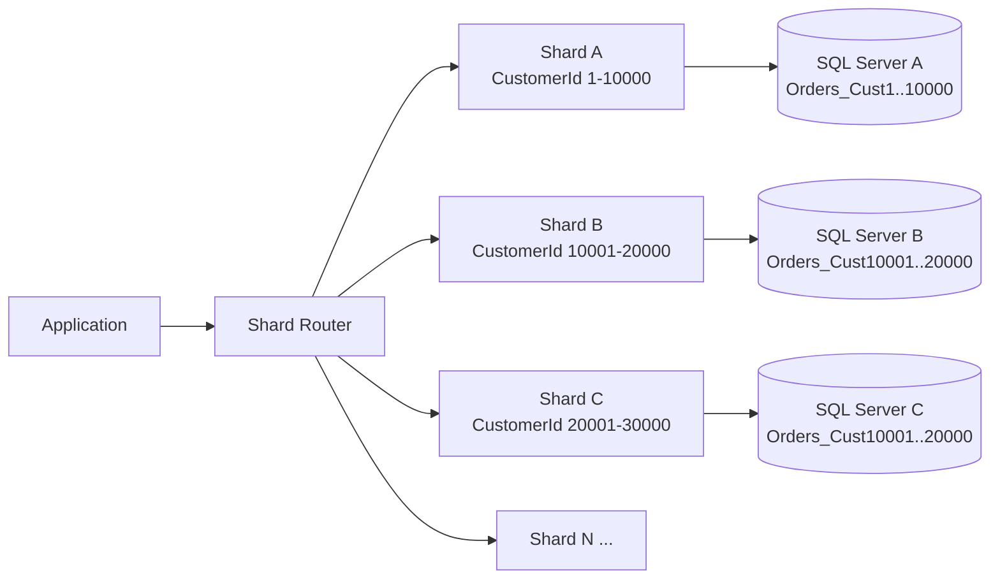
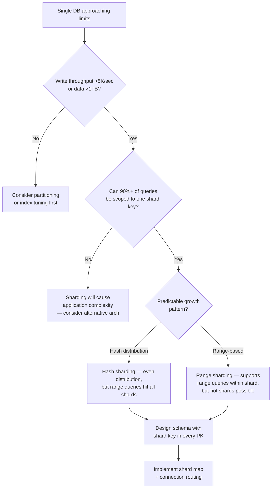

## Navigation

**Domain:** [[8 — Databases]] > **Group:** Database Design
**Previous:** [[8.059 — Bitemporal Data Modeling — Valid Time and Transaction Time]] | **Next:** [[8.061 — Index-Organized Tables — Concept]]

### Prerequisites
- [[8.050 Multi-Tenancy Schema — Shared vs Separate]] — multi-tenancy is a natural shard boundary; sharding extends the same isolation pattern to scale
- [[8.045 Composite Primary Keys — When to Use]] — sharding often requires composite keys with the shard key as the leading column
- [[8.044 ULID — Ordered UUID Alternative]] — globally unique ID generation is required when identity/sequences cannot span shards

### Where This Fits

Sharding-friendly schema design is the practice of structuring database tables, keys, indexes, and queries so that data can be distributed across multiple independent database servers (shards) without requiring cross-shard joins, distributed transactions, or application rewrites. A .NET backend engineer confronts this when a single SQL Server instance cannot handle the write throughput (typically >5,000 writes/second or >1TB data) and the team must split the database. The interview signal is senior/staff level — the candidate understands that sharding is a schema-first decision, not an infrastructure bolt-on, and that a schema designed without sharding in mind will require a full data migration and application rewrite.

---

## Core Mental Model

Sharding splits a single logical database into multiple physical databases (shards) by partitioning rows based on a **shard key** — a column or column combination present in every table. Each shard is a fully independent SQL Server instance with its own storage engine, buffer pool, and transaction log. The schema must be designed so that **all queries that need to be fast include the shard key in the WHERE clause**, routing to exactly one shard. Tables that are not naturally scoped to a single shard key (lookup/reference data) must be duplicated across all shards or replaced with a global lookup service. The key invariant: the application determines the shard from the shard key at the data access layer, not in the database.



### Key Properties

|Property|Value|Notes|
|---|---|---|
|Shard Key Must Be in PK|Required|Every table's clustered index must lead with the shard key|
|Cross-Shard Queries|Not supported (or very expensive)|No distributed joins; fan-out queries merge results in app|
|Identity Generation|Global unique IDs required|No sequence/identity — use ULID, UUID, or Hi-Lo|
|Write Scaling|Linear with shard count|Each shard adds its own buffer pool, log write throughput|
|Read Scaling|Near-linear|Queries with shard key hit one shard; without hit all shards|

---

## Deep Mechanics

### How the Engine Executes This

Sharding is not a database engine feature — it is an application-layer pattern. SQL Server does not natively shard. The mechanics are:

1. **Shard key extraction:** The application extracts the shard key from the incoming request (e.g., `CustomerId` from the JWT or URL).
2. **Shard mapping lookup:** The application queries an in-memory or Redis-backed shard map to determine which database server holds the range or hash bucket for that shard key.
3. **Connection routing:** The application opens a connection to the correct shard. For queries that cannot route to one shard (e.g., admin reports), the application fans out the query to all shards in parallel and merges results.
4. **Within-shard execution:** The shard's SQL Server executes the query normally using its local indexes, buffer pool, and transaction log. There is no distributed transaction coordinator involved for single-shard operations.

### SQL Visibility

```sql
-- Shard-aware schema: every table includes ShardKey as the leading PK column.
-- The application provides ShardKey on every INSERT and every query.

CREATE TABLE dbo.Orders (
    CustomerId  INT           NOT NULL,  -- shard key
    OrderId     INT           NOT NULL,  -- unique within shard
    OrderDate   DATETIME2(0)  NOT NULL,
    TotalAmount DECIMAL(10,2) NOT NULL,
    
    CONSTRAINT PK_Orders PRIMARY KEY (CustomerId, OrderId)
);

CREATE TABLE dbo.OrderItems (
    CustomerId  INT           NOT NULL,  -- shard key (same as Orders)
    OrderId     INT           NOT NULL,
    ProductId   INT           NOT NULL,
    Quantity    INT           NOT NULL,
    UnitPrice   DECIMAL(10,2) NOT NULL,
    
    CONSTRAINT PK_OrderItems PRIMARY KEY (CustomerId, OrderId, ProductId)
);

-- Query that routes to exactly one shard
SELECT o.OrderId, o.OrderDate, oi.ProductId, oi.Quantity
FROM dbo.Orders o
INNER JOIN dbo.OrderItems oi 
    ON o.CustomerId = oi.CustomerId AND o.OrderId = oi.OrderId
WHERE o.CustomerId = @CustomerId  -- shard key in predicate
  AND o.OrderDate >= @StartDate;
```

```csharp
// EF Core — multiple DbContexts, one per shard, resolved at runtime
public class OrdersDbContext : DbContext
{
    private readonly int _customerId;  // shard key
    
    public OrdersDbContext(int customerId, DbContextOptions<OrdersDbContext> options)
        : base(options)
    {
        _customerId = customerId;
    }
    
    public DbSet<Order> Orders => Set<Order>();
    public DbSet<OrderItem> OrderItems => Set<OrderItem>();
    
    protected override void OnModelCreating(ModelBuilder modelBuilder)
    {
        modelBuilder.Entity<Order>(entity =>
        {
            entity.HasKey(e => new { e.CustomerId, e.OrderId });
            entity.HasQueryFilter(e => e.CustomerId == _customerId);
        });
        
        modelBuilder.Entity<OrderItem>(entity =>
        {
            entity.HasKey(e => new { e.CustomerId, e.OrderId, e.ProductId });
            entity.HasQueryFilter(e => e.CustomerId == _customerId);
        });
    }
}
```

**Generated SQL (with query filter):**

```sql
-- EF Core appends the shard key filter automatically
SELECT o.OrderId, o.OrderDate, o.TotalAmount
FROM dbo.Orders o
WHERE o.CustomerId = @__customerId_0
  AND o.OrderDate >= @__startDate_1;
```

### Execution Plan Analysis

For the single-shard query:
- **Clustered Index Seek** on `PK_Orders` with `CustomerId = @id` — seeks directly to the customer's row range
- **Clustered Index Seek** on `PK_OrderItems` for the join — same shard key, same principle
- **Nested Loops** join — one order row drives the items lookup

Expected plan shape:
```
[Clustered Index Seek (PK_Orders)] → [Nested Loops] 
    → [Clustered Index Seek (PK_OrderItems)] → [SELECT]
Estimated Cost: 100% on seeks  |  Logical Reads: ~6 (2 index seeks × avg depth 3)
```

### Cost Visibility

```sql
SET STATISTICS IO ON;
SET STATISTICS TIME ON;

SELECT o.OrderId, o.OrderDate, oi.ProductId, oi.Quantity
FROM dbo.Orders o
INNER JOIN dbo.OrderItems oi 
    ON o.CustomerId = oi.CustomerId AND o.OrderId = oi.OrderId
WHERE o.CustomerId = 42
  AND o.OrderDate >= '2025-01-01';

-- Expected output:
-- Table 'Orders'. Scan count 0, logical reads 3, physical reads 0
-- Table 'OrderItems'. Scan count 0, logical reads 3, physical reads 0
-- SQL Server Execution Times: CPU time = 0ms, elapsed time = 1ms
```

### Failure Modes

- **Cross-shard join:** A JOIN between tables on different shards fails silently or returns incomplete results. The fix: design all related tables to share the shard key, or use fan-out in the application.
- **Missing shard key in WHERE:** A query without the shard key must be sent to all shards (fan-out). The application must handle merging, deduplication, and partial failure.
- **Shard key change:** Updating the shard key value requires deleting from one shard and re-inserting on another — a distributed operation. The fix: make the shard key immutable after insert.
- **Hot shard:** If one shard key value (e.g., a large tenant) generates 50% of writes, that shard becomes a bottleneck. The fix: use a composite shard key or sub-shard within the hot tenant.

---

## Production Patterns and Implementation

### Primary SQL Implementation

```sql
-- Shard map table (stored in a central configuration database)
CREATE TABLE dbo.ShardMap (
    ShardId      INT           NOT NULL IDENTITY(1,1) PRIMARY KEY,
    ShardKeyLow  INT           NOT NULL,
    ShardKeyHigh INT           NOT NULL,
    ServerName   NVARCHAR(128) NOT NULL,
    DatabaseName NVARCHAR(128) NOT NULL,
    IsOnline     BIT           NOT NULL DEFAULT 1,
    
    CONSTRAINT CK_ShardMap_Range CHECK (ShardKeyLow < ShardKeyHigh),
    CONSTRAINT UQ_ShardMap_Range UNIQUE (ShardKeyLow, ShardKeyHigh)
);

INSERT INTO dbo.ShardMap (ShardKeyLow, ShardKeyHigh, ServerName, DatabaseName)
VALUES (1, 10000, 'srv-db-shard01', 'Orders_Shard01'),
       (10001, 20000, 'srv-db-shard02', 'Orders_Shard02');

-- Reference data duplicated on every shard
CREATE TABLE dbo.Products (
    ProductId   INT           NOT NULL PRIMARY KEY,
    ProductName NVARCHAR(100) NOT NULL,
    UnitPrice   DECIMAL(10,2) NOT NULL
);
-- Populate via a deployment script or replication

-- Shard-local sequence for OrderId (unique within a shard)
CREATE SEQUENCE dbo.OrderSequence
    START WITH 1000
    INCREMENT BY 1;

-- Insert with shard key
INSERT INTO dbo.Orders (CustomerId, OrderId, OrderDate, TotalAmount)
VALUES (
    @CustomerId,
    NEXT VALUE FOR dbo.OrderSequence,
    SYSDATETIME(),
    @TotalAmount
);
```

### EF Core Implementation

```csharp
// Centralized shard resolution
public class ShardResolver
{
    private readonly IReadOnlyList<ShardMapping> _shardMappings;
    
    public ShardResolver(IConfiguration configuration)
    {
        _shardMappings = configuration.GetSection("ShardMappings")
            .Get<ShardMapping[]>()!;
    }
    
    public string GetConnectionString(int customerId)
    {
        var mapping = _shardMappings
            .First(m => customerId >= m.ShardKeyLow && customerId < m.ShardKeyHigh);
        return mapping.ConnectionString;
    }
}

public class ShardAwareDbContext : DbContext
{
    private readonly int _customerId;
    
    public ShardAwareDbContext(int customerId, DbContextOptions<ShardAwareDbContext> options)
        : base(options)
    {
        _customerId = customerId;
    }
    
    public DbSet<Order> Orders => Set<Order>();
    public DbSet<OrderItem> OrderItems => Set<OrderItem>();
    
    protected override void OnModelCreating(ModelBuilder modelBuilder)
    {
        modelBuilder.Entity<Order>(entity =>
        {
            entity.ToTable("Orders");
            entity.HasKey(e => new { e.CustomerId, e.OrderId });
            entity.Property(e => e.OrderId).UseSequence("OrderSequence");
            entity.HasQueryFilter(e => e.CustomerId == _customerId);
        });
        
        modelBuilder.Entity<OrderItem>(entity =>
        {
            entity.ToTable("OrderItems");
            entity.HasKey(e => new { e.CustomerId, e.OrderId, e.ProductId });
            entity.HasQueryFilter(e => e.CustomerId == _customerId);
        });
        
        modelBuilder.HasSequence<int>("OrderSequence");
    }
}

// DbContext factory for shard resolution
public class ShardDbContextFactory
{
    private readonly ShardResolver _resolver;
    private readonly IDbContextFactory<ShardAwareDbContext> _factory;
    
    public ShardDbContextFactory(ShardResolver resolver, IDbContextFactory<ShardAwareDbContext> factory)
    {
        _resolver = resolver;
        _factory = factory;
    }
    
    public async Task<ShardAwareDbContext> CreateForCustomerAsync(
        int customerId,
        CancellationToken ct = default)
    {
        var connectionString = _resolver.GetConnectionString(customerId);
        var options = new DbContextOptionsBuilder<ShardAwareDbContext>()
            .UseSqlServer(connectionString, sql => sql
                .EnableRetryOnFailure(3)
                .CommandTimeout(30))
            .Options;
        
        return await Task.FromResult(new ShardAwareDbContext(customerId, options));
    }
}
```

### Dapper Implementation

```csharp
public class ShardConnectionFactory
{
    private readonly ShardResolver _resolver;
    
    public ShardConnectionFactory(ShardResolver resolver)
    {
        _resolver = resolver;
    }
    
    public IDbConnection CreateForCustomer(int customerId)
    {
        var connectionString = _resolver.GetConnectionString(customerId);
        return new SqlConnection(connectionString);
    }
}

public class OrderRepository
{
    private readonly ShardConnectionFactory _connectionFactory;
    
    public OrderRepository(ShardConnectionFactory connectionFactory)
    {
        _connectionFactory = connectionFactory;
    }
    
    public async Task<Order?> GetOrderAsync(
        int customerId,
        int orderId,
        CancellationToken ct = default)
    {
        await using var conn = _connectionFactory.CreateForCustomer(customerId);
        
        return await conn.QueryFirstOrDefaultAsync<Order>(
            new CommandDefinition(
                """
                SELECT o.OrderId, o.OrderDate, o.TotalAmount,
                       oi.ProductId, oi.Quantity, oi.UnitPrice
                FROM dbo.Orders o
                INNER JOIN dbo.OrderItems oi 
                    ON o.CustomerId = oi.CustomerId AND o.OrderId = oi.OrderId
                WHERE o.CustomerId = @CustomerId
                  AND o.OrderId = @OrderId
                """,
                new { CustomerId = customerId, OrderId = orderId },
                cancellationToken: ct));
    }
    
    // Fan-out query: admin report across all shards
    public async Task<IReadOnlyList<Order>> GetRecentOrdersAllShardsAsync(
        DateTime since,
        CancellationToken ct = default)
    {
        var shards = _connectionFactory.GetAllShards();
        var tasks = shards.Select(async shard => 
        {
            await using var conn = shard.CreateConnection();
            return await conn.QueryAsync<Order>(
                new CommandDefinition(
                    """
                    SELECT CustomerId, OrderId, OrderDate, TotalAmount
                    FROM dbo.Orders WITH (NOLOCK)
                    WHERE OrderDate >= @Since
                    """,
                    new { Since = since },
                    cancellationToken: ct));
        });
        
        var results = await Task.WhenAll(tasks);
        return results.SelectMany(r => r).ToList();
    }
}
```

### Configuration and Wiring

```csharp
// Program.cs
builder.Services.AddSingleton<ShardResolver>();
builder.Services.AddSingleton<ShardDbContextFactory>();
builder.Services.AddSingleton<ShardConnectionFactory>();
builder.Services.AddScoped<OrderRepository>();

// For EF Core — IDbContextFactory is registered by default
// when AddDbContextFactory is used, but here we resolve shards at runtime
```

### SQL Server vs PostgreSQL Differences

```sql
-- PostgreSQL: foreign data wrappers (postgres_fdw) enable
-- cross-shard queries without application fan-out
CREATE FOREIGN TABLE orders_shard1 (
    CustomerId  INT NOT NULL,
    OrderId     INT NOT NULL,
    OrderDate   TIMESTAMP NOT NULL,
    TotalAmount NUMERIC(10,2) NOT NULL
)
SERVER shard1_server
OPTIONS (schema_name 'public', table_name 'orders');

-- Query across both local and foreign tables automatically
-- (with significant performance cost — serialized per-shard queries)
SELECT * FROM orders_shard1
UNION ALL
SELECT * FROM orders_shard2
WHERE CustomerId = 42;
```

---

## Gotchas and Production Pitfalls

### 1. Shard Key Not in Primary Key

**Pitfall:** Defining the PK as a surrogate identity column instead of a composite `(ShardKey, LocalId)`. The shard key is not part of the clustered index.

```sql
-- ❌ Wrong: Shard key is not in PK
CREATE TABLE dbo.Orders (
    OrderId    INT IDENTITY(1,1) PRIMARY KEY,
    CustomerId INT NOT NULL,  -- shard key, but not in PK
    ...
);
```

**Symptom:** A query with `WHERE CustomerId = @id` cannot seek on the clustered index — SQL Server chooses a scan or a non-clustered index seek with lookups.

**Fix:**

```sql
-- ✅ Correct: Shard key is leading column of PK
CREATE TABLE dbo.Orders (
    CustomerId INT NOT NULL,
    OrderId    INT NOT NULL,
    ...
    CONSTRAINT PK_Orders PRIMARY KEY (CustomerId, OrderId)
);
```

**Cost of not fixing:** Every query with a shard key predicate does a non-clustered index seek + key lookup. At 10M rows, each query adds ~20 logical reads instead of ~3.

---

### 2. Cross-Shard Transactions

**Pitfall:** Using distributed transactions (`TransactionScope` with `Enlist=true`) across multiple shards inside a single `SaveChanges` call.

**Symptom:** MSDTC is required, which adds ~50ms overhead per transaction, has firewall issues in cloud environments, and can cause escalation to full database locks.

**Fix:** Design aggregates so that all related entities for a single operation live within one shard. For truly distributed operations, use the Outbox pattern with a saga.

```csharp
// ❌ Wrong: cross-shard distributed transaction
using var scope = new TransactionScope(TransactionScopeAsyncFlowOption.Enabled);
var shard1 = await _factory.CreateForCustomerAsync(42, ct);
var shard2 = await _factory.CreateForCustomerAsync(99, ct);
// ... updates on both shards within one TransactionScope
scope.Complete();
```

**Cost of not fixing:** MSDTC escalates to lock the entire database. Distributed transaction failures leave data in an inconsistent state. Azure SQL Database does not support MSDTC.

---

### 3. Identity Columns Across Shards

**Pitfall:** Using `IDENTITY(1,1)` on `OrderId` without shard-unique seed/increment. Two shards generate overlapping `OrderId` values.

**Symptom:** When data is merged for reporting, `OrderId` is not unique globally. Joins with reference data that references `OrderId` produce incorrect results.

**Fix:** Use ULID, UUID, or shard-unique identity ranges (`IDENTITY(1000001, 1000000)` for shard 1, `IDENTITY(2000001, 1000000)` for shard 2). Or use a global sequence service.

```sql
-- Per-shard identity with non-overlapping ranges
-- Shard 1: IDENTITY(10000001, 1000000)
-- Shard 2: IDENTITY(20000001, 1000000)
-- This gives each shard 999,999 IDs before collision
```

**Cost of not fixing:** Data integration queries silently return wrong rows. At scale, deduplication is a full table scan operation.

---

### 4. Hot Shard from a Large Tenant

**Pitfall:** A single customer (shard key value) generates more writes than a single shard can handle — the shard mapping groups many customers per shard, but one customer is disproportionately large.

**Symptom:** One shard's CPU is at 95% while others are at 20%. Query latency for that customer's data is 10x higher than average.

**Fix:** Sub-shard the hot tenant by shard key on a secondary attribute (e.g., `CustomerId + RegionId` or `CustomerId + OrderYear`). Or move the large tenant to its own dedicated shard.

```sql
-- Composite shard key for sub-sharding
CREATE TABLE dbo.Orders (
    CustomerId INT NOT NULL,
    RegionId   INT NOT NULL,  -- sub-shard: east/west/central
    OrderId    INT NOT NULL,
    ...
    CONSTRAINT PK_Orders PRIMARY KEY (CustomerId, RegionId, OrderId)
);
```

**Cost of not fixing:** The hot shard becomes the system bottleneck — all users experience latency proportional to the hot shard's queue depth, even users on other shards (because of connection pool starvation in the app tier).

---

### 5. Schema Changes Require Rolling Migration

**Pitfall:** Running a single `ALTER TABLE` statement across all shards. If the migration fails on shard 7 of 20, the schema becomes inconsistent.

**Symptom:** Partial deployment — some shards have the new column, others do not. Queries that reference the new column fail intermittently.

**Fix:** Use expand-contract pattern: add the column as nullable (expand), deploy application code that writes to both old and new, backfill data, then remove the old column (contract). Run the expand on one shard at a time.

**Cost of not fixing:** Application downtime during the migration window. Inconsistent schema across shards causes deployment rollback that takes hours.

---

### 6. Cross-Shard Ordering and Pagination

**Pitfall:** Implementing "get page 3 of recent orders" without specifying the shard key. The application fans out to all shards, gets page 3 from each, then merges — and the merge produces incorrect results because each shard's page 3 is based on its local order.

**Symptom:** Paginated results contain duplicate entries, missing entries, or are in inconsistent order across requests.

**Fix:** Require the shard key in paginated queries, or use keyset pagination with a global sort key (e.g., ULID that embeds timestamp).

```sql
-- ❌ Wrong: cross-shard pagination
SELECT OrderId, CustomerId, OrderDate
FROM dbo.Orders
ORDER BY OrderDate DESC
OFFSET 20 ROWS FETCH NEXT 10 ROWS ONLY;
-- Each shard returns its own page 3 — merge is wrong

-- ✅ Correct: shard-aware pagination with keyset
SELECT OrderId, CustomerId, OrderDate
FROM dbo.Orders
WHERE CustomerId = @CustomerId
  AND (OrderDate, OrderId) < (@LastDate, @LastId)
ORDER BY OrderDate DESC, OrderId DESC
FETCH NEXT 10 ROWS ONLY;
```

**Cost of not fixing:** Incorrect pagination in customer-facing UIs. Customers see orders from other customers or miss their own orders.

---

## Performance Implications

### Benchmark: Before and After

```sql
-- Baseline: shard key not in PK, non-clustered index on (CustomerId)
SET STATISTICS IO ON;

SELECT o.OrderId, o.OrderDate
FROM dbo.Orders
WHERE CustomerId = 42
  AND OrderDate >= '2025-01-01';
-- Logical reads: 24 (non-clustered index seek + 21 key lookups for 21 rows)

-- Optimized: shard key is leading PK column, clustered index seek
-- Same query:
-- Logical reads: 3 (clustered index seek — 3 pages for 21 rows)
```

**Improvement:** 8x reduction in logical reads, from 24 to 3.

### BenchmarkDotNet

```csharp
[MemoryDiagnoser]
[SimpleJob(RuntimeMoniker.Net90)]
public class ShardKeyQueryBenchmark
{
    private IDbConnection _connCorrect = default!;
    private IDbConnection _connWrong = default!;
    
    [GlobalSetup]
    public void Setup()
    {
        _connCorrect = new SqlConnection("Server=.;Database=ShardCorrect;...");
        _connWrong = new SqlConnection("Server=.;Database=ShardWrong;...");
        // Both databases seeded with identical 1M row data
    }
    
    [Benchmark(Baseline = true)]
    public async Task<List<Order>> ShardKeyNotInPK()
    {
        var rows = await _connWrong.QueryAsync<Order>(
            "SELECT OrderId, OrderDate, TotalAmount FROM dbo.Orders WHERE CustomerId = @id",
            new { id = 42 });
        return rows.AsList();
    }
    
    [Benchmark]
    public async Task<List<Order>> ShardKeyInPK()
    {
        var rows = await _connCorrect.QueryAsync<Order>(
            "SELECT OrderId, OrderDate, TotalAmount FROM dbo.Orders WHERE CustomerId = @id",
            new { id = 42 });
        return rows.AsList();
    }
}
```

**Expected results (approximate, SQL Server 2022, NVMe, 1M rows):**

|Method|Mean|Logical Reads|Allocated|
|---|---|---|---|
|ShardKeyNotInPK|~8 ms|~24|1.2 KB|
|ShardKeyInPK|~1 ms|~3|1.2 KB|

### Write Amplification

|Operation|Without Sharding|With Sharding (per shard)|
|---|---|---|
|INSERT 1 order|1 write|1 write (to specific shard only)|
|UPDATE 1 order|1 write|1 write (to specific shard only)|
|Cross-shard transaction|N/A|Not supported — design around it|
|Reference data update|1 write|N writes (one per shard)|

---

## Interview Arsenal

### Question Bank

1. What is sharding and how does it differ from partitioning?
2. How do you choose a shard key — what properties make a good shard key and what are the anti-patterns?
3. How do you handle globally unique ID generation across shards without a single sequence?
4. What happens when a shard key value needs to change — how do you migrate a row from one shard to another?
5. Compare sharding vs read replicas — when would you choose each for a .NET backend?
6. How do EF Core and Dapper handle shard routing — what patterns enable transparent shard resolution?
7. What is a hot shard and how do you mitigate it in schema design?
8. How does sharding affect transaction isolation, consistency guarantees, and backup strategy?

### Spoken Answers

**Q: What is sharding and how does it differ from partitioning?**

> **Average answer:** "Sharding is splitting a database into multiple databases across different servers. Partitioning splits a table within one database. Both split data by a key."

> **Great answer:** "Sharding is horizontal scaling across independent database instances: each shard is a fully independent SQL Server with its own storage engine, buffer pool, transaction log, and failure domain. Partitioning (table partitioning within SQL Server) splits a single table across multiple filegroups within a single instance — it shares the same buffer pool, transaction log, and engine. The practical difference: partitioning solves large-table management (partition elimination for range queries, sliding window archive) but does not increase write throughput — all partitions share the same transaction log write bottleneck. Sharding increases write throughput linearly with shard count because each shard has its own log write path. The cost is that cross-shard queries and distributed transactions are effectively unsupported. Schema design must embed the shard key in every table, every query, and every index. If 90% of queries include the shard key, sharding works well. If queries routinely join across shard keys (e.g., 'find orders for all customers in New York'), the application must either fan-out to all shards or maintain a secondary global index."

**Q: How do EF Core and Dapper handle shard routing?**

> **Average answer:** "You can use multiple DbContexts pointing to different databases. For Dapper, you change the connection string."

> **Great answer:** "EF Core does not have built-in shard routing. The pattern is to use a factory that resolves the correct connection string from the shard key and creates a DbContext scoped to that shard. Each DbContext instance is bound to exactly one shard for its lifetime. The shard key is typically injected into the DbContext and applied as a global query filter so that every query within that context automatically scopes to the shard. Dapper is simpler — you resolve the connection string into an IDbConnection and execute queries directly. The critical implementation detail is that the shard map itself must be highly available and low-latency: it is usually cached in memory with a Redis refresh. For both EF Core and Dapper, fan-out queries (queries without a shard key) are explicit — you open connections to all shards in parallel, merge results in memory, and handle partial failures with a timeout. Neither ORM automates the fan-out."

### Interview Trigger

The question "How would you scale a database that has hit 5,000 writes per second?" is the standard sharding interview trigger. The follow-up probes schema design: "How would your table schema and primary key choices be different if you knew you would shard from day one?" The candidate who immediately says "the shard key must be the leading column of every primary key and every index" and can explain the difference between hashed and ranged sharding demonstrates production experience. The deeper follow-up is always about hot spots and rebalancing.

### Comparison Table

| | Sharding | Table Partitioning | Read Replicas |
|---|---|---|---|
| What it does | Data across servers | Data within one server | Copies across servers |
| Write scaling | Linear | None (single log) | None (single primary writer) |
| Query complexity | Must include shard key | Partition elimination | Client redirects reads |
| .NET implementation | Manual routing | Transparent to app | Connection string routing |
| When to choose | >5K writes/sec, >1TB | >500GB single table | >80% read workload |

---

## Decision Framework

### When to Apply



### Application Checklist

- [ ] A single shard key exists that 90%+ of queries include in WHERE
- [ ] All related tables share the same shard key (colocation)
- [ ] The shard key is immutable after insert
- [ ] ID generation does not rely on identity/sequences across shards
- [ ] Cross-shard joins are eliminated or handled via fan-out with acceptable latency
- [ ] The shard map is cached for low-latency routing (in-memory + Redis)
- [ ] Schema migration strategy supports rolling deployment across shards

### Tradeoff Summary

|What You Gain|What You Pay|
|---|---|
|Linear write throughput scaling|No cross-shard queries or distributed transactions|
|Independent failure domains: one shard outage affects subset of users|Application complexity — shard routing in every data access call|
|Independent resource allocation per shard|Reference data must be duplicated or served from a separate service|
|Supports >1TB and >5K writes/sec|Schema migration is now a rolling per-shard operation|

### Scale Thresholds

- "Consider sharding when write throughput exceeds ~5,000 writes/second on a single SQL Server instance"
- "Consider sharding when data size exceeds ~1TB (beyond which restore times become impractical)"
- "Hot shard mitigation becomes necessary when any single shard key value generates >30% of total write load"
- "Fan-out queries (no shard key) become impractical beyond ~32 shards due to connection overhead and partial failure handling"

---

## Self-Check

### Conceptual Questions

1. What is the single most important schema design rule for a sharded database?
2. How does sharding differ from table partitioning — what does each solve and what are their limitations?
3. Which `SET STATISTICS` output distinguishes a query that used the shard key correctly from one that scanned?
4. What common mistake causes identity columns to produce non-unique values across shards?
5. Does EF Core support sharding natively — what pattern is used instead?
6. How would you implement a fan-out query with Dapper that queries 10 shards in parallel — show the connection management and error handling?
7. Compare hash-based vs range-based sharding — what are the tradeoffs for query patterns?
8. At what write throughput does a single SQL Server instance typically require sharding?
9. What index structure prevents a shard-key query from doing a key lookup?
10. Explain sharding to a senior backend interviewer in 60 seconds — when would you shard and what schema decisions must you make upfront?

<details>
<summary>Answers</summary>

1. The shard key must be the leading column of the primary key on every table. Every query that needs low latency must include the shard key in the WHERE clause. Without this, the query cannot route to a single shard or use a clustered index seek.
2. Sharding distributes data across independent database servers, each with its own storage engine and transaction log. It scales write throughput linearly. Table partitioning splits a single table across filegroups within one instance — it does not increase write throughput because all partitions share the same transaction log. Partitioning solves large-table management (sliding window archive, partition elimination). Sharding solves total system throughput limits.
3. `SET STATISTICS IO ON` — logical reads of ~3-4 (clustered index seek depth) indicate the shard key was used correctly. Logical reads equal to the table size indicate a scan because the shard key was not the leading index column or was missing from the predicate.
4. Using `IDENTITY(1,1)` on a non-composite PK where the primary key does not include the shard key. Each shard independently generates IDs that collide. Fix: composite PK `(ShardKey, LocalId)` with local sequences, or ULID/UUID.
5. EF Core does not support sharding natively. The pattern is a `ShardDbContextFactory` that resolves the connection string from a shard map and creates a `DbContext` per shard with the shard key injected as a global query filter.
6. ```csharp
var tasks = shards.Select(async shard => {
    await using var conn = new SqlConnection(shard.ConnectionString);
    return await conn.QueryAsync<Order>(sql, new { Since = since }, 
        commandTimeout: 10);  // fail-fast per shard
});
var results = await Task.WhenAll(tasks);
```
7. Hash sharding: even distribution, but range queries (`WHERE Date BETWEEN X AND Y`) hit all shards. Range sharding: supports range queries within a contiguous range, but hot shards occur if data is not evenly distributed. Hash is better for write-heavy workloads; range is better for read-heavy with range predicates.
8. Typically ~5,000 writes/second on a single SQL Server instance, or data exceeding ~1TB where backup/restore times become problematic. These thresholds vary by hardware, workload pattern, and recovery requirements.
9. A clustered index where the shard key is the leading column. `CREATE CLUSTERED INDEX PK_Orders ON dbo.Orders(CustomerId, OrderId)`. This makes `WHERE CustomerId = @id` a clustered index seek with no lookups.
10. "Sharding splits a single logical database into multiple independent physical databases by partitioning rows by a shard key. It differs from partitioning in that each shard is a separate SQL Server instance with its own storage engine and log, so write throughput scales linearly with shard count. The critical schema rule: the shard key must be the leading column of every primary key and every index. Without this, every query scans or does key lookups. Related tables must share the same shard key so joins stay within a single shard. Cross-shard queries and distributed transactions are effectively unsupported — the application either fans out queries to all shards or handles merge logic. Consider sharding above 5,000 writes/second or 1TB. Before implementing, verify that 90% of queries include the shard key — otherwise the application complexity of fan-out queries will negate the scaling benefit."

</details>

---

### Query Challenges

**Challenge 1 — Write the SQL**

Design the schema for a sharded order management system where `CustomerId` is the shard key. Show the `Orders`, `OrderItems`, and `Shipments` tables with correct primary keys, a query that returns an order with all its items and shipments (routed to one shard), and the INSERT statements for creating a new order with line items in a single transaction.

<details>
<summary>Solution</summary>

```sql
CREATE TABLE dbo.Orders (
    CustomerId  INT           NOT NULL,
    OrderId     INT           NOT NULL,
    OrderDate   DATETIME2(0)  NOT NULL,
    TotalAmount DECIMAL(10,2) NOT NULL,
    StatusCode  NCHAR(2)      NOT NULL DEFAULT 'NW',
    
    CONSTRAINT PK_Orders PRIMARY KEY (CustomerId, OrderId),
    CONSTRAINT CK_Orders_Status CHECK (StatusCode IN ('NW', 'SH', 'DL', 'CA'))
);

CREATE TABLE dbo.OrderItems (
    CustomerId  INT           NOT NULL,
    OrderId     INT           NOT NULL,
    ProductId   INT           NOT NULL,
    Quantity    INT           NOT NULL,
    UnitPrice   DECIMAL(10,2) NOT NULL,
    
    CONSTRAINT PK_OrderItems PRIMARY KEY (CustomerId, OrderId, ProductId),
    CONSTRAINT FK_OrderItems_Orders 
        FOREIGN KEY (CustomerId, OrderId) REFERENCES dbo.Orders(CustomerId, OrderId)
);

CREATE TABLE dbo.Shipments (
    CustomerId   INT           NOT NULL,
    ShipmentId   INT           NOT NULL,
    OrderId      INT           NOT NULL,
    ShipDate     DATETIME2(0)  NOT NULL,
    CarrierCode  NCHAR(3)      NOT NULL,
    TrackingNo   NVARCHAR(50)  NOT NULL,
    
    CONSTRAINT PK_Shipments PRIMARY KEY (CustomerId, ShipmentId),
    CONSTRAINT FK_Shipments_Orders 
        FOREIGN KEY (CustomerId, OrderId) REFERENCES dbo.Orders(CustomerId, OrderId)
);

-- Single-shard query: order with items and shipments
SELECT o.OrderId, o.OrderDate, o.TotalAmount,
       oi.ProductId, oi.Quantity, oi.UnitPrice,
       s.ShipmentId, s.ShipDate, s.TrackingNo
FROM dbo.Orders o
LEFT JOIN dbo.OrderItems oi 
    ON oi.CustomerId = o.CustomerId AND oi.OrderId = o.OrderId
LEFT JOIN dbo.Shipments s 
    ON s.CustomerId = o.CustomerId AND s.OrderId = o.OrderId
WHERE o.CustomerId = 42 AND o.OrderId = 1001;

-- Insert order with items (single-shard transaction)
BEGIN TRANSACTION;
    DECLARE @OrderId INT = NEXT VALUE FOR dbo.OrderSequence;
    
    INSERT INTO dbo.Orders (CustomerId, OrderId, OrderDate, TotalAmount)
    VALUES (42, @OrderId, SYSDATETIME(), 149.99);
    
    INSERT INTO dbo.OrderItems (CustomerId, OrderId, ProductId, Quantity, UnitPrice)
    VALUES (42, @OrderId, 501, 2, 49.99),
           (42, @OrderId, 502, 1, 50.01);
COMMIT;
```

**Logical reads:** ~6 (3 per table, 2 tables) **Execution plan:** Clustered Index Seeks + Nested Loops **EF Core equivalent:** Use `FromSqlInterpolated` for the query, since EF Core LINQ does not natively model sharded schemas.

</details>

---

**Challenge 2 — Fix the performance problem**

```sql
-- This query runs against a sharded database and is slow on every shard.
-- It returns 500 rows from a 5M row table.
SELECT o.OrderId, o.OrderDate, o.TotalAmount
FROM dbo.Orders o
INNER JOIN dbo.OrderItems oi 
    ON o.OrderId = oi.OrderId
WHERE o.CustomerId = 42
  AND o.OrderDate >= '2025-01-01';
-- SET STATISTICS IO: logical reads = 4,800
```

<details> <summary>Solution</summary>

**Root cause:** The JOIN predicate `ON o.OrderId = oi.OrderId` is missing the shard key (`CustomerId`). Without `CustomerId` in the join, SQL Server cannot use a clustered index seek on `OrderItems` — it does a full non-clustered index scan + lookups on `OrderItems` matching by `OrderId`, which is not unique without `CustomerId`.

**Fix:**
```sql
-- ✅ Add shard key to the JOIN
SELECT o.OrderId, o.OrderDate, o.TotalAmount
FROM dbo.Orders o
INNER JOIN dbo.OrderItems oi 
    ON o.CustomerId = oi.CustomerId   -- add this
    AND o.OrderId = oi.OrderId
WHERE o.CustomerId = 42
  AND o.OrderDate >= '2025-01-01';
-- Logical reads: ~6 (from 4,800)
```

**Index to create (if not already clustered):**
```sql
CREATE CLUSTERED INDEX PK_OrderItems ON dbo.OrderItems (CustomerId, OrderId, ProductId);
```

**After fix — logical reads:** ~6 (from 4,800)

</details>

---

**Challenge 3 — Explain the execution plan**

Given this query and execution plan:

```sql
SELECT o.OrderId, o.OrderDate, o.TotalAmount, oi.ProductId, oi.Quantity
FROM dbo.Orders o
INNER JOIN dbo.OrderItems oi ON o.OrderId = oi.OrderId
WHERE o.CustomerId = 42;
```

```
Clustered Index Seek (PK_Orders, CustomerId=42)  — cost 2%
  → Nested Loops
    → Clustered Index Scan (PK_OrderItems)       — cost 98%
```

Why does the optimizer choose a scan on `OrderItems` instead of a seek? What single change converts it to a seek?

<details> <summary>Solution</summary>

**Why scan:** The JOIN predicate `ON o.OrderId = oi.OrderId` does not include `CustomerId`. The clustered index on `OrderItems` is `(CustomerId, OrderId, ProductId)`. Without `CustomerId` in the join, the optimizer cannot seek — it must scan the entire `OrderItems` index and match rows where `OrderId` happens to equal the order's Id. This is effectively a full scan on `OrderItems` for each row from `Orders`.

**To get a seek:**
```sql
INNER JOIN dbo.OrderItems oi 
    ON o.CustomerId = oi.CustomerId AND o.OrderId = oi.OrderId
```

**Tradeoff:** None. The join condition is always correct — `OrderItems` logically belong to the same customer order. The original query was simply missing the shard key in the join.

</details>

---

**Challenge 4 — Diagnose the concurrency problem**

A daily batch job fan-outs a query to all 20 shards to generate a report. The job uses `Parallel.ForEachAsync` to query all shards simultaneously. Some shards consistently time out after 30 seconds while others respond in 200ms. The job fails with an incomplete report, and connections to the slow shards remain open in `CLOSE_WAIT` state.

<details> <summary>Solution</summary>

**Root cause:** The fan-out query does not include a shard key, so it scans the entire table on each shard. On shards with more data (larger tenants), the query exceeds the 30-second command timeout. The `CLOSE_WAIT` connections indicate the application is not properly disposing connections when exceptions occur.

**Detection query:**
```sql
SELECT session_id, command, wait_type, wait_time, cpu_time, logical_reads
FROM sys.dm_exec_requests
WHERE database_id = DB_ID();
```

**Fix:**
```sql
-- Add a date range filter to scope each shard's work
SELECT o.CustomerId, o.OrderId, o.OrderDate, o.TotalAmount
FROM dbo.Orders o WITH (NOLOCK)
WHERE OrderDate >= @BatchStartDate   -- scope to recent data
  AND OrderDate < @BatchEndDate;
```

**In .NET:**
```csharp
// Add per-shard timeout and error handling
var results = await Parallel.ForEachAsync(shards, async (shard, ct) =>
{
    try
    {
        await using var conn = new SqlConnection(shard.ConnectionString);
        await conn.OpenAsync(ct);
        // Use CancellationToken from the parallel loop
        var shardResults = await conn.QueryAsync<Order>(
            new CommandDefinition(sql, new { BatchStartDate, BatchEndDate },
                commandTimeout: 60, cancellationToken: ct));
        // Aggregate results...
    }
    catch (Exception ex) when (ex is not OperationCanceledException)
    {
        // Log shard failure and continue
        _logger.LogWarning(ex, "Shard {ShardId} failed", shard.Id);
    }
});
```

</details>

---

**Challenge 5 — Design the index**

**Scenario:** A sharded `dbo.Transactions` table has 100M rows per shard across 10 shards. The shard key is `AccountId`. The primary query pattern is: "Get the last 20 transactions for account X" — this runs 10,000 times per second per shard. The secondary pattern is a date-range report for a specific account: "Get all transactions for account X between two dates" — this runs 500 times per hour.

Design the optimal index strategy. Show the CREATE INDEX statements and explain each choice. Assume the table has columns `AccountId, TransactionId (sequence), TransactionDate, Amount, Description`.

<details> <summary>Solution</summary>

```sql
-- Clustered PK: AccountId + TransactionId (sequence) for fast last-N lookup
-- TransactionId is a monotonically increasing sequence,
-- so ORDER BY TransactionId DESC is a reverse scan of the last rows
CREATE CLUSTERED INDEX PK_Transactions 
    ON dbo.Transactions (AccountId, TransactionId DESC);

-- Covering index for date-range queries on the same account
-- Leading with AccountId (shard key) for seek, then TransactionDate for range filter
-- INCLUDE covers the projected columns to avoid key lookups
CREATE NONCLUSTERED INDEX IX_Transactions_DateRange
    ON dbo.Transactions (AccountId, TransactionDate)
    INCLUDE (Amount, Description);
```

**What NOT to index:** `Description` alone — full-text search on `Description` would not benefit from a B-tree index. If reporting queries filter by `Amount > X`, consider a filtered index on `(AccountId, Amount)` for that specific predicate.

**Tradeoffs:** The clustered index with `TransactionId DESC` optimizes the "last 20" query at the cost of insertion page splits — new rows are appended to the beginning of the page chain, causing page splits if the leading page is full. At 10,000 inserts/second, expect ~5% page split overhead. The date-range covering index adds ~500 bytes per row to write amplification.

</details>
</parameter>
