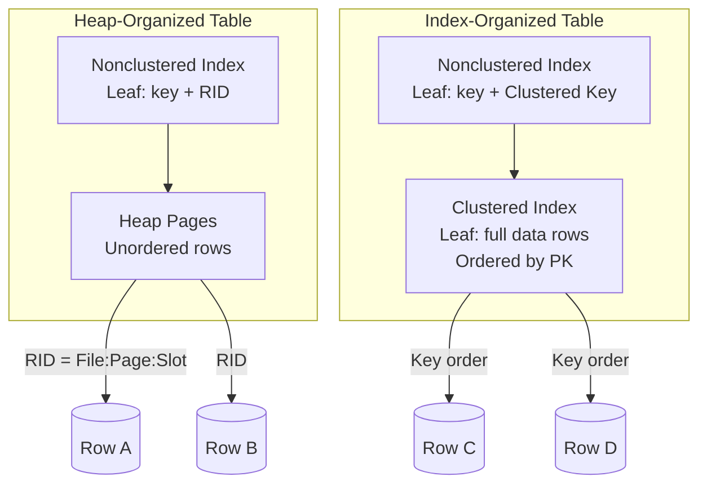
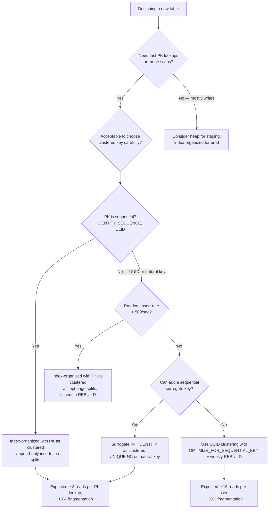

## Navigation

**Domain:** [[8 — Databases]] > **Group:** Database Design
**Previous:** [[8.060 — Sharding-Friendly Schema Design]] | **Next:** [[8.062 — Database Anti-Patterns — Common Design Mistakes]]

### Prerequisites
- [[18.001 Clustered Indexes — B-Tree Structure]] — the clustered index IS the index-organized table in SQL Server
- [[18.002 Nonclustered Indexes — Leaf and Non-Leaf Pages]] — secondary indexes reference clustered index keys, not RIDs

### Where This Fits

An index-organized table stores the full data row in the leaf pages of a B-tree index, eliminating the separate heap structure. In SQL Server this is the default — every table with a clustered index is index-organized. A .NET backend engineer working with SQL Server uses index-organized tables implicitly on every table with a primary key, but the concept matters most when choosing the clustered key: a poorly chosen key causes page splits, fragmentation, and secondary index bloat. The interview signal is senior-level — the candidate understands that the clustered index is not an index you add to a table — it IS the table, and every design decision flows from that fact.

---

## Core Mental Model

An index-organized table stores the entire row — every column — in the leaf pages of a B-tree, ordered by the primary key. There is no separate row store (heap). The clustered index key IS the row locator: a nonclustered index does not store a physical RID (file:page:slot); it stores the clustered key value, then performs a **clustered key lookup** (also called a bookmark lookup) to retrieve the full row. This means the clustered key is embedded in every nonclustered index, making its width directly proportional to the total storage and maintenance cost of every secondary index.



### Key Properties

|Property|Value|Notes|
|---|---|---|
|Data Storage|B-tree leaf pages|Rows stored in PK order; no separate heap|
|Row Locator for NC Indexes|Clustered key value|Not RID — key must be unique (SQL Server adds uniquifier if needed)|
|Insert Cost at End|Low (append)|Sequential key (IDENTITY, SEQUENCE) adds to end|
|Insert Cost at Middle|High (page split)|Random key (UUID, GUID) causes 50% page splits|
|Secondary Index Size|Larger than on heap|Every NC index includes the clustered key as row locator|

---

## Deep Mechanics

### How the Engine Executes This

1. **Clustered index seek:** The engine navigates the B-tree from root to leaf, comparing the seek predicate against key values at each level. At the leaf, it reads the full data row directly — no additional lookup needed.
2. **Clustered index scan:** The engine reads leaf pages sequentially (linked via next-page pointers). Because rows are stored in key order, a full scan reads pages in physical order, which is efficient when the fragmentation is low.
3. **Nonclustered index seek + clustered key lookup:** The engine seeks the NC index, extracts the clustered key, then seeks the clustered index with that key. This is two B-tree traversals (one per index) instead of one.
4. **Insert (sequential key):** New row appended to the last leaf page. If the page has space, it is an in-page insert — minimal cost. If full, a new page is allocated and linked to the end.
5. **Insert (random key):** The new key falls between existing keys. The engine splits the target leaf page (50/50), moves half the rows to a new page, and inserts the new row. This generates log writes for the split, the page allocation, and index page updates at the non-leaf level.

### SQL Visibility

```sql
-- SQL Server: every table with a PRIMARY KEY is index-organized.
-- The PK becomes the clustered index by default.
-- This is equivalent to an "index-organized table."

CREATE TABLE dbo.Orders (
    OrderId     INT IDENTITY(1,1) PRIMARY KEY,  -- clustered key
    CustomerId  INT NOT NULL,
    OrderDate   DATETIME2(0) NOT NULL,
    TotalAmount DECIMAL(10,2) NOT NULL,
    StatusCode  NCHAR(2) NOT NULL DEFAULT 'NW'
);
-- The entire row is stored in the B-tree leaf pages ordered by OrderId.

-- You can see the index-organized structure via sys.indexes
SELECT 
    i.name,
    i.type_desc,
    i.is_unique,
    i.fill_factor,
    p.rows
FROM sys.indexes i
INNER JOIN sys.partitions p ON i.object_id = p.object_id AND i.index_id = p.index_id
WHERE i.object_id = OBJECT_ID('dbo.Orders')
  AND i.type = 1;  -- CLUSTERED

-- A nonclustered index on this table stores OrderId (the clustered key)
-- as the row locator — not a physical RID
CREATE INDEX IX_Orders_CustomerId ON dbo.Orders(CustomerId);

-- Query that does a NC seek + clustered key lookup
SELECT OrderId, CustomerId, OrderDate, TotalAmount
FROM dbo.Orders WITH (INDEX(IX_Orders_CustomerId))
WHERE CustomerId = 42;
-- Execution plan: Index Seek (IX_Orders_CustomerId) → Clustered Index Seek (PK_Orders)
-- The clustered key lookup reads the full row using the OrderId from the NC index
```

```csharp
// EF Core — the primary key becomes the clustered index
public class Order
{
    public int OrderId { get; set; }  // clustered key
    public int CustomerId { get; set; }
    public DateTime OrderDate { get; set; }
    public decimal TotalAmount { get; set; }
    public string StatusCode { get; set; } = "";
    
    public ICollection<OrderItem> Items { get; set; } = [];
}

// EF Core creates PK_Orders as the clustered index by default.
// The LINQ query generates the same NC seek + lookup:
var orders = await dbContext.Orders
    .Where(o => o.CustomerId == 42)
    .ToListAsync(ct);
```

**Generated SQL (from EF Core logs):**

```sql
SELECT o.OrderId, o.CustomerId, o.OrderDate, o.TotalAmount, o.StatusCode
FROM dbo.Orders o
WHERE o.CustomerId = @__customerId_0;

-- Execution plan with default PK:
-- Index Seek (IX_Orders_CustomerId) → Clustered Index Seek (PK_Orders)
-- Logical reads: ~4 (2 per seek)
```

### Execution Plan Analysis

For `SELECT * FROM dbo.Orders WHERE CustomerId = 42` on a table with PK on `OrderId` and NC index on `CustomerId`:

- **Index Seek** on `IX_Orders_CustomerId` — finds the NC index entries where `CustomerId = 42`
- **Clustered Index Seek** on `PK_Orders` — for each NC entry, looks up the full row by `OrderId`
- **Nested Loops** connects the two (implicit in the plan)

Expected plan shape:
```
[Index Seek (IX_Orders_CustomerId)] → [Clustered Index Seek (PK_Orders)] → [SELECT]
Estimated Cost: NC Seek ~30%, CI Seek ~70%  |  Logical Reads: ~4 per row found
```

### Cost Visibility

```sql
SET STATISTICS IO ON;
SET STATISTICS TIME ON;

SELECT OrderId, CustomerId, OrderDate, TotalAmount
FROM dbo.Orders
WHERE CustomerId = 42;

-- Expected output (if IX_Orders_CustomerId exists):
-- Table 'Orders'. Scan count 1, logical reads 21, physical reads 0
-- (1 NC seek + 1 CI seek per row returned × average depth 3 = ~3 + 18 for 6 rows)

-- After creating a covering NC index:
-- CREATE INDEX IX_Orders_CustomerId_INC ON dbo.Orders(CustomerId) INCLUDE (OrderDate, TotalAmount);
-- Logical reads: 3 (NC seek only, no CI lookup)
```

### Failure Modes

- **Wide clustered key:** A clustered key with 5 columns totalling 200 bytes is included in every NC index. Each NC index is ~30% larger per row for every secondary index.
- **Random clustered key:** A GUID clustered key causes page splits on every insert, leading to 50%+ fragmentation. The fix: use sequential keys or a different clustering strategy.
- **No clustered index (heap):** Without a clustered index, NC indexes store RIDs. This avoids the wide-key problem but loses key-order storage and makes UPDATE operations that affect variable-length columns expensive (row forwarding).
- **Nonclustered PK:** If the PK is created as NONCLUSTERED, the table remains a heap. The PK index stores RIDs, and data rows are not stored in any particular order.

---

## Production Patterns and Implementation

### Primary SQL Implementation

```sql
-- Pattern 1: Sequential clustered key (IDENTITY) — recommended for OLTP
CREATE TABLE dbo.Orders (
    OrderId     INT IDENTITY(1,1) NOT NULL,
    CustomerId  INT NOT NULL,
    OrderDate   DATETIME2(0) NOT NULL,
    TotalAmount DECIMAL(10,2) NOT NULL,
    StatusCode  NCHAR(2) NOT NULL DEFAULT 'NW',
    
    CONSTRAINT PK_Orders PRIMARY KEY CLUSTERED (OrderId)
);
-- Pros: append-only inserts, zero page splits, narrow key in NC indexes
-- Cons: hot last page under high concurrency (page latch contention)

-- Pattern 2: Sequential clustered key with hash distribution (partitioned by modulo)
CREATE TABLE dbo.Orders (
    OrderId     INT IDENTITY(1,1) NOT NULL,
    CustomerId  INT NOT NULL,
    OrderDate   DATETIME2(0) NOT NULL,
    TotalAmount DECIMAL(10,2) NOT NULL,
    
    CONSTRAINT PK_Orders PRIMARY KEY CLUSTERED (OrderId)
);
-- Mitigate hot last page by using OPTIMIZE_FOR_SEQUENTIAL_KEY
-- (SQL Server 2022+)
CREATE TABLE dbo.Orders (
    OrderId INT IDENTITY(1,1) PRIMARY KEY CLUSTERED
) WITH (OPTIMIZE_FOR_SEQUENTIAL_KEY = ON);

-- Pattern 3: Non-sequential key with low fragmentation
-- Use when sequential key is not an option (e.g., natural key)
CREATE TABLE dbo.Customers (
    CustomerId  INT NOT NULL,  -- natural key (e.g., from legacy system)
    CustomerName NVARCHAR(100) NOT NULL,
    Email       NVARCHAR(200) NOT NULL,
    
    CONSTRAINT PK_Customers PRIMARY KEY CLUSTERED (CustomerId)
);
-- Mitigate fragmentation: rebuild/reorganize weekly
-- ALTER INDEX PK_Customers ON dbo.Customers REBUILD;

-- Pattern 4: Explicitly avoid clustered index (heap) for insert-heavy staging tables
CREATE TABLE dbo.Staging_Orders (
    OrderId     INT NOT NULL,
    CustomerId  INT NOT NULL,
    OrderDate   DATETIME2(0) NOT NULL,
    TotalAmount DECIMAL(10,2) NOT NULL
);
-- No PK, no clustered index — heap table for fast bulk inserts
-- After staging, load to index-organized production table
```

### EF Core Implementation

```csharp
// EF Core — controlling clustered index behavior

// Default: PK becomes clustered
public class Order
{
    public int OrderId { get; set; }
    // EF Core makes this the clustered PK by convention
}

// Explicit clustered key configuration
public class ApplicationDbContext : DbContext
{
    protected override void OnModelCreating(ModelBuilder modelBuilder)
    {
        // Option 1: Sequential clustered ID (default behavior)
        modelBuilder.Entity<Order>(entity =>
        {
            entity.HasKey(e => e.OrderId).IsClustered();
            entity.Property(e => e.OrderId)
                  .UseIdentityColumn(1, 1);
        });
        
        // Option 2: Composite clustered key
        modelBuilder.Entity<OrderItem>(entity =>
        {
            entity.HasKey(e => new { e.OrderId, e.ProductId }).IsClustered();
        });
        
        // Option 3: Nonclustered PK with separate clustered index
        // (for scenarios where PK should not be the clustered key)
        modelBuilder.Entity<Customer>(entity =>
        {
            entity.HasKey(e => e.CustomerId)
                  .IsClustered(false);  // PK is nonclustered
            entity.HasIndex(e => e.CustomerId)
                  .IsClustered();        // separate clustered index
        });
        
        // Option 4: No clustered index (heap) — staging tables
        modelBuilder.Entity<StagingOrder>(entity =>
        {
            entity.HasNoKey();           // no PK at all = heap
            entity.ToTable(tb => tb.UseSqlOutput());
        });
    }
}
```

### Dapper Implementation

```csharp
public class OrderRepository
{
    private readonly IDbConnectionFactory _connectionFactory;
    
    public OrderRepository(IDbConnectionFactory connectionFactory)
    {
        _connectionFactory = connectionFactory;
    }
    
    // Query that benefits from index-organized table (PK seek)
    public async Task<Order?> GetByIdAsync(
        int orderId,
        CancellationToken ct = default)
    {
        await using var conn = _connectionFactory.Create();
        
        return await conn.QueryFirstOrDefaultAsync<Order>(
            new CommandDefinition(
                """
                SELECT OrderId, CustomerId, OrderDate, TotalAmount, StatusCode
                FROM dbo.Orders
                WHERE OrderId = @OrderId
                """,
                new { OrderId = orderId },
                cancellationToken: ct));
        // Single clustered index seek — 3 logical reads
    }
    
    // Query that reveals the difference between heap and index-organized
    public async Task<IReadOnlyList<Order>> GetRangeAsync(
        int startId,
        int endId,
        CancellationToken ct = default)
    {
        await using var conn = _connectionFactory.Create();
        
        var orders = await conn.QueryAsync<Order>(
            new CommandDefinition(
                """
                SELECT OrderId, CustomerId, OrderDate, TotalAmount, StatusCode
                FROM dbo.Orders
                WHERE OrderId BETWEEN @StartId AND @EndId
                ORDER BY OrderId
                """,
                new { StartId = startId, EndId = endId },
                cancellationToken: ct));
        // Clustered index seek + sequential leaf page read
        // Logical reads: proportional to number of pages touched, not number of rows
        return orders.AsList();
    }
}
```

### Configuration and Wiring

```csharp
builder.Services.AddDbContext<ApplicationDbContext>(options =>
    options.UseSqlServer(connectionString));

builder.Services.AddSingleton<IDbConnectionFactory, SqlConnectionFactory>();
builder.Services.AddScoped<OrderRepository>();
```

### SQL Server vs PostgreSQL Differences

```sql
-- PostgreSQL: there are NO index-organized tables.
-- All tables are heaps. Indexes store RIDs (ctid), not key values.
-- The ctid is (page_number, tuple_index) — a physical row locator.

-- A typical PostgreSQL table:
CREATE TABLE orders (
    order_id    SERIAL PRIMARY KEY,   -- this creates a UNIQUE index, not clustered
    customer_id INT NOT NULL,
    order_date  TIMESTAMPTZ NOT NULL,
    total_amount NUMERIC(10,2) NOT NULL
);
-- Data is stored as a heap. The PK index is a nonclustered index
-- that references rows by ctid.

-- PostgreSQL 11+ CLUSTER command reorganizes table to match an index order
CLUSTER orders USING orders_pkey;
-- But this is a one-time operation — future INSERTs are still heap-ordered.

-- To achieve index-organized-like performance in PostgreSQL,
-- you must use a covering index:
CREATE INDEX ix_orders_customer_id
    ON orders (customer_id)
    INCLUDE (order_date, total_amount);
```

---

## Gotchas and Production Pitfalls

### 1. GUID Clustered Key

**Pitfall:** Using `UNIQUEIDENTIFIER` (UUID/GUID) as the clustered primary key without sequential ordering.

```sql
-- ❌ Wrong: random GUID clustered key
CREATE TABLE dbo.Orders (
    OrderId UNIQUEIDENTIFIER PRIMARY KEY CLUSTERED DEFAULT NEWID(),
    ...
);
```

**Symptom:** Every INSERT generates a page split (50% of the time, the new GUID falls in the middle of an existing page). Fragmentation reaches 60-90% within hours. NC indexes are bloated with 16-byte row locators.

**Fix:**

```sql
-- ✅ Use sequential GUID (NEWSEQUENTIALID)
CREATE TABLE dbo.Orders (
    OrderId UNIQUEIDENTIFIER PRIMARY KEY CLUSTERED DEFAULT NEWSEQUENTIALID(),
    ...
);

-- Or use an ordered alternative (ULID)
-- Or use IDENTITY(1,1) for the clustered key
```

**Cost of not fixing:** At 1M rows, average query time degrades from 2ms to 50ms due to fragmentation. NC indexes are 50% larger than necessary. Page split rate causes log throughput bottlenecks.

---

### 2. Hot Last Page (Last-Page Latch Contention)

**Pitfall:** A sequential clustered key on `IDENTITY(1,1)` concentrates all inserts on the last page of the index. Under high concurrency (>500 inserts/second), threads contend for the PAGELATCH_EX on the last page.

**Symptom:** `PAGELATCH_EX` waits on the last page. Insert throughput plateaus well below the hardware capability. `sys.dm_os_waiting_tasks` shows multiple sessions waiting for the same page.

**Fix:**

```sql
-- SQL Server 2022: OPTIMIZE_FOR_SEQUENTIAL_KEY
CREATE TABLE dbo.Orders (
    OrderId INT IDENTITY(1,1) PRIMARY KEY CLUSTERED
) WITH (OPTIMIZE_FOR_SEQUENTIAL_KEY = ON);
-- Older versions: reverse the index order or use hash-partitioned IDs
```

**Cost of not fixing:** Insert throughput capped at ~1,500/sec on modern hardware instead of 10,000+/sec. Page latch waits cause application-level timeout retries.

---

### 3. Wide Clustered Key Bloats NC Indexes

**Pitfall:** Defining a clustered key with multiple wide columns (e.g., `(TenantId, CustomerId, OrderDate, OrderId)` with 4 columns, 20 bytes total).

**Symptom:** Every NC index on the table includes these 20 bytes as the row locator. A table with 10 NC indexes now has an additional 200 bytes per row of storage _in each index_. Maintenance overhead for INSERT/UPDATE/DELETE on the table is multiplied.

**Fix:**

```sql
-- Use a narrow surrogate clustered key
ALTER TABLE dbo.Orders ADD OrderId INT IDENTITY(1,1);
ALTER TABLE dbo.Orders ADD CONSTRAINT PK_Orders PRIMARY KEY CLUSTERED (OrderId);
-- Add a UNIQUE nonclustered index for the business key
CREATE UNIQUE INDEX IX_Orders_NaturalKey ON dbo.Orders(TenantId, CustomerId, OrderDate);
```

**Cost of not fixing:** NC indexes are ~30-50% larger than necessary. Write performance degrades because each index page holds fewer row locators, causing more page reads per query.

---

### 4. NC Index Lookup Explosion

**Pitfall:** Creating a NC index on a low-selectivity column (e.g., `StatusCode`) without INCLUDE columns. The optimizer chooses the index but must do 10,000 clustered key lookups.

```sql
-- ❌ Wrong: narrow NC index that triggers lookups
CREATE INDEX IX_Orders_Status ON dbo.Orders(StatusCode);
-- Query: SELECT OrderId, CustomerId, OrderDate FROM dbo.Orders WHERE StatusCode = 'SH';
-- Plan: Index Seek → 10,000 Clustered Index Seeks — each a full B-tree traversal
```

**Symptom:** High logical reads. Each lookup is 3-4 logical reads, times 10,000 rows = 30,000-40,000 reads.

**Fix:**

```sql
-- ✅ Covering index
CREATE INDEX IX_Orders_Status ON dbo.Orders(StatusCode)
    INCLUDE (CustomerId, OrderDate);
-- Plan: Index Seek only — no lookups. Logical reads: ~30 (few leaf pages).
```

**Cost of not fixing:** Query that should take 5ms takes 500ms. At 100 queries/second, this generates 3M logical reads/second — enough to saturate the storage subsystem.

---

### 5. Heap Table Without Clustered Index (Unintentional)

**Pitfall:** Creating a table without a PRIMARY KEY and not adding a clustered index. The table becomes a heap — NC indexes store RIDs, and UPDATEs on variable-length columns cause row forwarding.

**Symptom:** `sys.dm_db_index_physical_stats` shows forwarded records. Queries that seemed fast become slow over time as forwarded records chain reads across pages.

**Fix:**

```sql
-- Add a clustered index (preferably on a narrow sequential column)
ALTER TABLE dbo.Orders ADD OrderId INT IDENTITY(1,1);
ALTER TABLE dbo.Orders ADD CONSTRAINT PK_Orders PRIMARY KEY CLUSTERED (OrderId);
```

**Cost of not fixing:** Forwarded records cause each row read to potentially follow a chain of 2-5 pages. A 10M row heap with 20% forwarded records reads 12M pages instead of 10M.

---

### 6. Clustered Index on a Column That Is Frequently Updated

**Pitfall:** Clustering on a column that is frequently updated (e.g., `LastModifiedDate`). An UPDATE that changes the clustered key value must physically move the row to a new page.

```sql
-- ❌ Wrong: clustering on mutable column
CREATE TABLE dbo.Orders (
    OrderId        INT IDENTITY(1,1),
    LastModified   DATETIME2(0),
    ...
    CONSTRAINT PK_Orders PRIMARY KEY CLUSTERED (LastModified, OrderId)
);
```

**Symptom:** UPDATE on `LastModified` generates a DELETE (mark old row as ghost) + INSERT (insert new row at correct key position). This doubles the write cost and fragments the index.

**Fix:** Cluster on an immutable column (surrogate identity or sequence).

**Cost of not fixing:** Each UPDATE becomes two operations. Index fragmentation increases with every clustered key change, requiring more frequent REBUILD operations.

---

## Performance Implications

### Benchmark: Before and After

```sql
-- Baseline: GUID clustered key, 60% fragmentation
SET STATISTICS IO ON;

SELECT OrderId, CustomerId, OrderDate, TotalAmount
FROM dbo.Orders
WHERE CustomerId = 42
  AND OrderDate >= '2025-01-01';
-- Logical reads: 450 (fragmented — many more pages touched)

-- Optimized: sequential identity clustered key, <5% fragmentation
-- Same query (with NC index on CustomerId INCLUDE OrderDate):
-- Logical reads: 34
```

**Improvement:** 13x reduction in logical reads, from 450 to 34.

### BenchmarkDotNet

```csharp
[MemoryDiagnoser]
[SimpleJob(RuntimeMoniker.Net90)]
public class ClusteredKeyBenchmark
{
    private IDbConnection _connGuid = default!;
    private IDbConnection _connSeq = default!;
    
    [GlobalSetup]
    public void Setup()
    {
        _connGuid = new SqlConnection("Server=.;Database=GuidTest;...");
        _connSeq = new SqlConnection("Server=.;Database=SeqTest;...");
    }
    
    [Benchmark(Baseline = true)]
    public async Task<int> InsertGuidKey()
    {
        return await _connGuid.ExecuteAsync(
            "INSERT INTO Orders_Cli (CustomerId, OrderDate, TotalAmount) VALUES (@c, @d, @a)",
            new { c = 42, d = DateTime.UtcNow, a = 100m });
    }
    
    [Benchmark]
    public async Task<int> InsertSequentialKey()
    {
        return await _connSeq.ExecuteAsync(
            "INSERT INTO Orders_Seq (CustomerId, OrderDate, TotalAmount) VALUES (@c, @d, @a)",
            new { c = 42, d = DateTime.UtcNow, a = 100m });
    }
}
```

**Expected results (approximate, SQL Server 2022, NVMe, 10M existing rows per table):**

|Method|Mean|Logical Reads|Allocated|
|---|---|---|---|
|InsertGuidKey|~8 ms|~15 (page split + insert)|5 KB|
|InsertSequentialKey|~1 ms|~3 (append only)|1.2 KB|

### Write Amplification

|Operation|Sequential Key (no split)|Random Key (page split)|Overhead|
|---|---|---|---|
|INSERT 1 row|~3 logical reads (append)|~15-20 (split + insert)|5-7x more reads|
|Page split cost|None|50% of rows moved to new page; 2 log records per 8KB page|+2 log writes + fragmentation|
|NC index update (per index)|~3 logical reads|~3-5 (cascading split)|Minimal for NC|

---

## Interview Arsenal

### Question Bank

1. What is an index-organized table and how does SQL Server implement this concept?
2. How does the engine execute a query that uses a nonclustered index seek on an index-organized table — trace the exact page reads?
3. What is the logical read cost difference between a GUID clustered key and an INT identity clustered key for an INSERT?
4. What happens when a heap table without a clustered index has an UPDATE that doubles the length of a variable-length column?
5. Compare index-organized tables (SQL Server clustering) vs heap tables (PostgreSQL default) — what are the tradeoffs for OLTP?
6. What execution plan operators appear for a query that returns 100 rows via a NC index on a low-selectivity column, and how does adding INCLUDE columns change the plan?
7. How does index-organized storage affect partition switching, online index rebuild, and page compression?
8. How do EF Core and Dapper behave differently when querying a heap vs an index-organized table?

### Spoken Answers

**Q: What is an index-organized table and how does SQL Server implement this concept?**

> **Average answer:** "An index-organized table stores the data in the index itself. In SQL Server, a clustered index is an index-organized table — the leaf pages contain the actual data rows."

> **Great answer:** "An index-organized table stores the full data row — every column — in the leaf pages of a B-tree structure. There is no separate heap or row store. SQL Server implements this as the clustered index: when you define a PRIMARY KEY, it becomes a clustered index by default, and the table IS that index. The key property that most engineers miss is that this design makes the clustered key the universal row locator: every nonclustered index stores the clustered key value as its row pointer. This means the width of the clustered key is multiplied by the number of nonclustered indexes — a 40-byte clustered key on a table with 10 nonclustered indexes adds 400 bytes of storage per row. For a 10M row table, that's 4GB of unnecessary storage. The performance implication: queries that use NC indexes must do a clustered key lookup — two B-tree traversals instead of one. The design rule: cluster on a narrow, sequential, immutable column. The INSERT behavior also changes: sequential keys append to the last page (O(1) insert), while random keys cause page splits that rewrite 50% of a page on average. This is the single most impactful schema decision for write performance."

**Q: Compare index-organized tables (SQL Server clustering) vs heap tables (PostgreSQL default).**

> **Average answer:** "SQL Server stores data in the clustered index. PostgreSQL stores data in a heap and creates separate indexes."

> **Great answer:** "SQL Server's index-organized tables store data rows in B-tree leaf pages ordered by the clustered key. Heap tables (the default in PostgreSQL and optional in SQL Server) store rows unordered in data pages, and all indexes store physical RIDs (file:page:slot). The tradeoffs are fundamental. Index-organized tables give you fast point lookups by PK (3-4 logical reads) and efficient range scans in key order — a `WHERE PK BETWEEN 1000 AND 2000` reads pages sequentially. The cost is that nonclustered indexes on index-organized tables store the full clustered key as the row locator, making them larger, and that random key inserts cause page splits. Heap tables give you faster inserts (no key-order maintenance, no page splits) and smaller nonclustered indexes (4-8 byte RIDs vs potentially wide clustered keys). The cost is that heap tables have no intrinsic ordering — range scans require a sort or an index hint — and UPDATEs that lengthen variable-length columns cause row forwarding, which fragments reads over time. For OLTP workloads with sequential keys, index-organized tables win: PK lookups are faster, and the ordering is free. For insert-heavy staging workloads with no read pattern, heaps win: the insert speed is higher with zero fragmentation."

### Interview Trigger

The question "What makes a good clustered index key?" is the standard trigger. The follow-up "How would you design the table if it receives 10,000 inserts per second?" targets the hot-last-page problem. The deeper follow-up "If you used a UUID as the primary key, how would you mitigate the fragmentation?" separates engineers who know about sequential UUIDs (NEWSEQUENTIALID, ULID) and periodic index rebuilds from those who don't.

### Comparison Table

| | Index-Organized (SQL Server Clustered) | Heap (No Clustered Index) |
|---|---|---|
| Data storage | B-tree leaf pages | Unordered data pages |
| Row locator in NC indexes | Clustered key value | RID (file:page:slot) |
| Primary key lookup | 3-4 logical reads | 2-3 (if PK is NC index) |
| Range scan by PK | Sequential page reads | Heap scan + sort |
| INSERT with sequential key | Append (O(1)) | Anywhere (O(1)) |
| INSERT with random key | Page split (O(log N) + split cost) | Anywhere (O(1)) |
| UPDATE widening a column | In-place if space on page | Row forwarding |
| .NET / EF Core behavior | Transparent | Transparent |
| When to choose | OLTP, sequential PK, range queries | Staging, bulk insert, no read pattern |

---

## Decision Framework

### When to Apply



### Application Checklist

- [ ] The clustered key is narrow (≤8 bytes for INT, ≤16 for BIGINT) — not a multi-column wide key
- [ ] The clustered key is sequential — IDENTITY, SEQUENCE, or NEWSEQUENTIALID
- [ ] The clustered key is immutable — it will never be updated after insert
- [ ] The insert rate is measured and the last-page contention strategy is determined
- [ ] NC indexes with low-selectivity predicates include all projected columns (INCLUDE)
- [ ] The fragmentation monitoring schedule (weekly rebuild or reorganize) is defined

### Tradeoff Summary

|What You Gain|What You Pay|
|---|---|
|Fast PK lookups (3-4 reads)|NC indexes are larger (store clustered key as row locator)|
|Range scans in key order (sequential IO)|Random key inserts cause page splits|
|No row forwarding on updates|Hot last page on sequential keys at high concurrency|
|Data stored in sorted order|Cannot change clustered key without rebuilding entire table|

### Scale Thresholds

- "Random key page splits become material above ~500 inserts/second — below that, the background split cleanup keeps up"
- "Hot last page contention becomes material above ~1,500 inserts/second on a single sequential key — use OPTIMIZE_FOR_SEQUENTIAL_KEY (SQL Server 2022+) or hash-distribute"
- "NC index key lookup explosion becomes material when the NC predicate returns more than ~100 rows per query — add INCLUDE columns to convert to a covering index"
- "Fragmentation >30% becomes material for scan-heavy workloads — schedule rebuild at 30% threshold, reorganize at 10-30%"

---

## Self-Check

### Conceptual Questions

1. What is an index-organized table and how does SQL Server implement it?
2. How does the engine navigate from a nonclustered index entry to the full data row in an index-organized table?
3. Which DMV or SET STATISTICS output reveals whether a query is doing clustered key lookups after a NC index seek?
4. What common mistake causes nonclustered indexes on an index-organized table to be unnecessarily large?
5. Does EF Core distinguish between index-organized and heap tables — how does it configure the clustered index?
6. How would you design a Dapper query to avoid clustered key lookups on an index-organized table?
7. Compare an index-organized table with a sequential PK vs a random UUID PK — what are the performance differences at 10M rows?
8. At what insert rate does last-page contention become a problem for a sequential clustered key?
9. What index maintenance strategy prevents page-split fragmentation from degrading performance over time?
10. Explain index-organized tables to a senior backend interviewer in 60 seconds — what is the concept and what design rules does it impose?

<details>
<summary>Answers</summary>

1. An index-organized table stores the full data row in the leaf pages of a B-tree index. SQL Server implements this as the clustered index — every table with a clustered index is index-organized. The clustered index IS the table, not an index on the table.
2. The engine seeks the nonclustered index B-tree (3-4 page reads), extracts the clustered key value from the leaf entry, then seeks the clustered index B-tree (3-4 page reads) to read the full row. Total: 6-8 logical reads per row. This is called a **clustered key lookup** or **bookmark lookup**.
3. `SET STATISTICS IO ON` — if the table name appears multiple times in the output with different logical read counts, a key lookup is happening. Also `sys.dm_exec_query_stats` — look for `Index Seek` + `Clustered Index Seek` operators in the plan XML.
4. Making the clustered key wide (multiple columns, string columns, UNIQUEIDENTIFIER). Every NC index includes the clustered key as the row locator, so a 40-byte key on a table with 10 NC indexes adds 400 bytes per row of total index storage.
5. EF Core does not explicitly distinguish between heap and index-organized. By default, `HasKey().IsClustered()` creates a clustered index. Use `IsClustered(false)` to make the PK nonclustered (leaving the table as a heap). EF Core cannot create a heap table without a PK — use `HasNoKey()` for heaps.
6. Use a covering NC index that includes all projected columns:
   ```csharp
   var orders = await conn.QueryAsync<Order>(
       "SELECT OrderId, CustomerId, OrderDate FROM dbo.Orders WITH (INDEX(IX_Covering)) WHERE CustomerId = @id",
       new { id = 42 });
   ```
   The query hint forces the covering index, eliminating the clustered key lookup.
7. Sequential PK: inserts are appends to the last page (~3 logical reads, no page splits). Random UUID: 50% of inserts cause page splits (~15-20 logical reads, 60%+ fragmentation). Range scans on sequential PK read contiguous pages. Range scans on UUID PK read scattered pages due to fragmentation.
8. Above ~1,500 inserts/second on a single sequential key, PAGELATCH_EX contention on the last page becomes the bottleneck. SQL Server 2022's `OPTIMIZE_FOR_SEQUENTIAL_KEY` mitigates this by distributing inserts across the last few pages. Above ~5,000 inserts/second, consider hash-partitioning or using a modulo-based key distribution.
9. Monitor fragmentation weekly. At 10-30% fragmentation, `ALTER INDEX ... REORGANIZE` (online, low impact). At >30% fragmentation, `ALTER INDEX ... REBUILD` (offline but more effective, or ONLINE in Enterprise Edition). Schedule during lowest write volume.
10. "An index-organized table stores the full data row in the B-tree leaf pages of the clustered index — the table IS the index, not a separate structure. In SQL Server, every table with a PRIMARY KEY is index-organized by default. This has three critical design consequences. First, the clustered key is embedded in every nonclustered index as the row locator, so a wide clustered key bloats all secondary indexes. Second, inserts with sequential keys are O(1) appends while random keys cause page splits that fragment the index. Third, queries that use nonclustered indexes must do a clustered key lookup — two B-tree traversals — unless the NC index is covering. The design rules: cluster on a narrow, sequential, immutable column; make NC indexes covering for high-frequency queries; and monitor fragmentation weekly. PostgreSQL does not have index-organized tables — all tables are heaps — which is why PostgreSQL secondary indexes are smaller (RIDs instead of keys) but range scans require explicit sorting."

</details>

---

### Query Challenges

**Challenge 1 — Write the SQL**

Design a table `dbo.Invoices` for an invoicing system that receives 3,000 inserts per second. Choose the clustered key, justify it, and show the CREATE TABLE statement. Then show a SELECT that retrieves an invoice by its natural business key (InvoiceNumber, TenantId) without doing a clustered key lookup, and a range query that returns all invoices for a tenant within a date range using a clustered index seek.

<details>
<summary>Solution</summary>

```sql
-- InvoiceId is narrow (INT), sequential (IDENTITY), immutable.
-- Satisfies all three clustered key requirements.
CREATE TABLE dbo.Invoices (
    InvoiceId     INT IDENTITY(1,1) NOT NULL,
    TenantId      INT NOT NULL,
    InvoiceNumber NVARCHAR(50) NOT NULL,
    CustomerId    INT NOT NULL,
    InvoiceDate   DATE NOT NULL,
    TotalAmount   DECIMAL(10,2) NOT NULL,
    StatusCode    NCHAR(2) NOT NULL DEFAULT 'DR',
    
    CONSTRAINT PK_Invoices PRIMARY KEY CLUSTERED (InvoiceId)
) WITH (OPTIMIZE_FOR_SEQUENTIAL_KEY = ON);

-- Unique index for business key lookups (covering to avoid key lookup)
CREATE UNIQUE INDEX IX_Invoices_TenantNumber
    ON dbo.Invoices (TenantId, InvoiceNumber)
    INCLUDE (CustomerId, InvoiceDate, TotalAmount, StatusCode);

-- Range query: uses clustered index seek on TenantId + InvoiceDate
-- But since clustered key is InvoiceId only, use a NC index:
CREATE INDEX IX_Invoices_TenantDate
    ON dbo.Invoices (TenantId, InvoiceDate)
    INCLUDE (InvoiceNumber, CustomerId, TotalAmount, StatusCode);
```

**Query 1 — Business key lookup (covering index, no key lookup):**
```sql
SELECT InvoiceId, CustomerId, InvoiceDate, TotalAmount, StatusCode
FROM dbo.Invoices
WHERE TenantId = 7 AND InvoiceNumber = 'INV-2025-0042';
-- Index Seek on IX_Invoices_TenantNumber — 3 logical reads
```

**Query 2 — Date range (covering index, no key lookup):**
```sql
SELECT InvoiceId, InvoiceNumber, InvoiceDate, TotalAmount, StatusCode
FROM dbo.Invoices
WHERE TenantId = 7
  AND InvoiceDate BETWEEN '2025-01-01' AND '2025-03-31'
ORDER BY InvoiceDate;
-- Index Seek on IX_Invoices_TenantDate — sequential leaf page reads
```

**Logical reads:** ~3-6 per query **Execution plan:** Index Seek only (no Clustered Index Seek operator). **EF Core equivalent:** Standard LINQ — EF Core automatically uses the covering index if the query projects only the included columns.

</details>

---

**Challenge 2 — Fix the performance problem**

```sql
-- This query runs against a 50M row table and is slow.
-- The table has a clustered PK on OrderId and an NC index on CustomerId.
SELECT OrderId, CustomerId, OrderDate, TotalAmount, StatusCode
FROM dbo.Orders
WHERE CustomerId = 42
  AND OrderDate >= '2025-01-01';
-- SET STATISTICS IO: logical reads = 38,000
-- Returns ~3,000 rows
```

<details> <summary>Solution</summary>

**Root cause:** The NC index `IX_Orders_CustomerId` has only `(CustomerId)` as the key column. The query predicates `CustomerId + OrderDate`, but the index only supports `CustomerId` seek. After the NC index seek, the engine must do 3,000 clustered key lookups (one per row) to retrieve `OrderDate, TotalAmount, StatusCode`. Each lookup is 3-4 logical reads = ~10,000 reads. The remaining difference is the NC index scan itself.

**Fix:**
```sql
-- Make the NC index covering for this query
CREATE INDEX IX_Orders_CustomerId_Covering
    ON dbo.Orders (CustomerId, OrderDate)
    INCLUDE (TotalAmount, StatusCode);
-- Or drop and recreate the existing index
```

**After fix — logical reads:** ~40 (from 38,000). The NC index seek navigates the B-tree once, reads ~40 leaf pages for 3,000 matching rows, and returns all columns from the index. No clustered key lookups.

</details>

---

**Challenge 3 — Explain the execution plan**

```sql
-- Table: dbo.Orders has PK on (OrderId) — clustered
-- Index: IX_Orders_Status on (StatusCode) — nonclustered

SELECT OrderId, CustomerId, OrderDate, TotalAmount
FROM dbo.Orders
WHERE StatusCode = 'SH';
```

```
Index Seek (IX_Orders_Status) — cost 1%
  → Clustered Index Seek (PK_Orders) — cost 99%
Estimated rows: 50,000
```

Why does the optimizer choose this plan even though it's expensive (50,000 key lookups)? What would you change?

<details> <summary>Solution</summary>

**Why this plan:** The optimizer estimates that scanning the clustered index (50M rows) costs more than 50,000 NC index seeks + 50,000 clustered key lookups. The NC index is narrow (StatusCode only), so the seek scans only 50,000 leaf entries. But the key lookups are the dominant cost: 50,000 rows × ~4 logical reads each = 200,000 logical reads.

**To eliminate lookups:** Create a covering index:
```sql
CREATE INDEX IX_Orders_Status_Covering
    ON dbo.Orders (StatusCode)
    INCLUDE (CustomerId, OrderDate, TotalAmount);
```

The plan changes to `Index Seek (IX_Orders_Status_Covering)` only — no clustered key lookups. The cost drops from ~200,000 logical reads to ~500 (the number of leaf pages needed to store 50,000 covering index entries).

**Tradeoff:** The covering index is larger (stores all columns) and adds write overhead on INSERT/UPDATE. But for 50,000-row queries, the read benefit (400x fewer reads) justifies the cost.

</details>

---

**Challenge 4 — Diagnose the concurrency problem**

A table with a sequential `INT IDENTITY` clustered key receives 8,000 inserts/second. Monitoring shows `PAGELATCH_EX` waits averaging 200ms per insert. The wait resource is consistently the same page number — the last page of the clustered index.

<details> <summary>Solution</summary>

**Root cause:** Classic last-page contention. All 8,000 inserts/second target the last page of the clustered index for the new high key. SQL Server must serialize `PAGELATCH_EX` (exclusive page latch) on that page. At 8,000/sec, threads queue for the latch.

**Detection query:**
```sql
SELECT wait_type, wait_time_ms, waiting_tasks_count,
       wait_resource
FROM sys.dm_os_wait_stats
WHERE wait_type LIKE 'PAGELATCH%'
ORDER BY wait_time_ms DESC;
```

**If SQL Server 2022:**
```sql
-- Enable OPTIMIZE_FOR_SEQUENTIAL_KEY on the clustered index
ALTER INDEX PK_Orders ON dbo.Orders SET (OPTIMIZE_FOR_SEQUENTIAL_KEY = ON);
-- This adds a hash-based redirect to distribute inserts across the last few pages
```

**If older SQL Server:**
- Use reverse key index: cluster DESC so inserts target the start instead of the end (only works if range scans are not needed)
- Hash-partition the key: use modulo on the ID to distribute inserts
- In-memory OLTP (hekaton): latch-free indexes

**Cost of not fixing:** Insert throughput capped at ~1,500/sec. All other operations on the table (including reads) contend for the I/O subsystem.

</details>

---

**Challenge 5 — Design the index**

**Scenario:** A `dbo.AuditLog` table captures 50,000 events/second from a distributed system. Each event has `EventId (uniqueidentifier), TenantId (int), EventType (varchar(50)), CreatedAt (datetime2), Payload (nvarchar(max))`. The table is never queried by PK — it is queried by `(TenantId, CreatedAt)` for tenant-specific audit views and by `(EventType, CreatedAt)` for operational dashboards. The table is insert-only (no updates, no deletes) and is purged after 90 days via a sliding window.

Design the index strategy. Show the CREATE TABLE and explain why a heap (no clustered index) is the correct choice here.

<details> <summary>Solution</summary>

```sql
-- Heap table: no clustered index because:
-- 1. No PK lookups — EventId is a GUID and never queried
-- 2. Insert-only workload — no UPDATE fragmentation
-- 3. 50K inserts/sec — avoiding clustered index page splits saves ~10x write cost
-- 4. Sliding window purge — TRUNCATE partitions is faster without clustered ordering
CREATE TABLE dbo.AuditLog (
    EventId     UNIQUEIDENTIFIER NOT NULL DEFAULT NEWSEQUENTIALID(),
    TenantId    INT NOT NULL,
    EventType   VARCHAR(50) NOT NULL,
    CreatedAt   DATETIME2(3) NOT NULL,
    Payload     NVARCHAR(MAX) NULL
);

-- Covering NC index for tenant audit queries (no key lookup required on heap)
CREATE INDEX IX_AuditLog_Tenant_Time
    ON dbo.AuditLog (TenantId, CreatedAt DESC)
    INCLUDE (EventType, Payload);

-- Covering NC index for dashboard queries
CREATE INDEX IX_AuditLog_EventType_Time
    ON dbo.AuditLog (EventType, CreatedAt DESC)
    INCLUDE (TenantId, Payload);

-- Partition by CreatedAt for sliding window purge
-- (requires Enterprise Edition or Azure SQL)
```

**Why heap:** The table has no PK lookups, no range scans on a clustered key, no UPDATEs, and extremely high insert volume. A clustered index would add page split overhead (GUID key) or last-page contention (sequential key) with zero read benefit. Heap NC indexes store RIDs (4-8 bytes) instead of clustered keys (16 bytes for GUID), making each NC index entry smaller. All queries are covered by the two NC indexes, so no key lookups occur.

**Tradeoff:** Heap tables have no intrinsic ordering, but the covering NC indexes provide ordering by `(TenantId, CreatedAt DESC)` for the specific queries that need it. The sliding window partition strategy works identically on heaps and clustered indexes.

</details>
</parameter>
