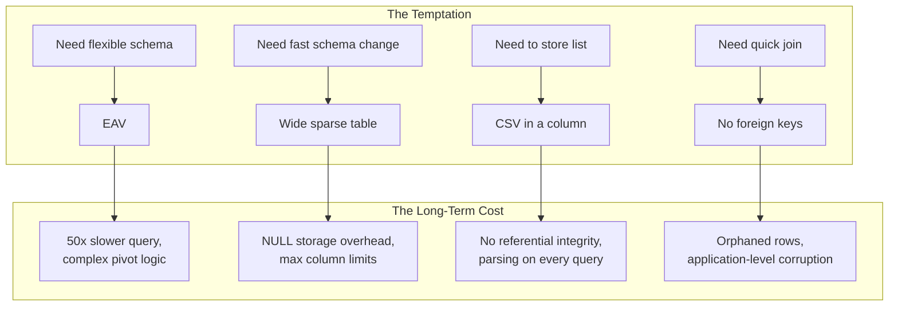
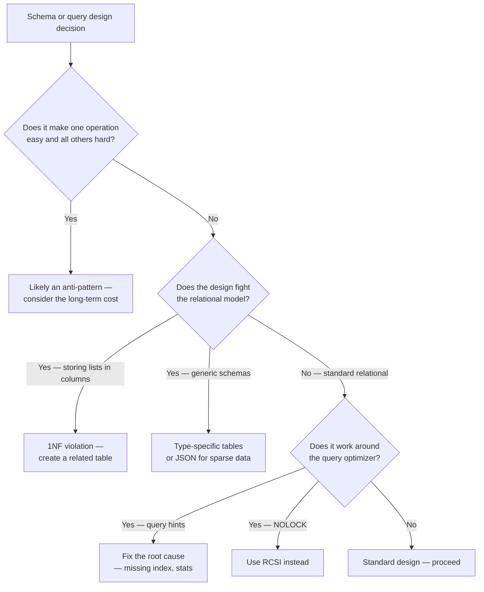

## Navigation

**Domain:** [[8 — Databases]] > **Group:** Database Design
**Previous:** [[8.061 — Index-Organized Tables — Concept]] | **Next:** [[8.063 — Schema Migration Planning — Backward Compatibility]]

### Prerequisites
- [[8.056 EAV (Entity-Attribute-Value) — Anti-Pattern]] — EAV is the most pervasive schema anti-pattern
- [[8.057 Polymorphic Associations — Design Patterns]] — polymorphic associations are a common anti-pattern with legitimate edge cases
- [[8.031 First Normal Form (1NF) — Eliminating Repeating Groups]] — many anti-patterns violate 1NF fundamentals

### Where This Fits

Database anti-patterns are recurring schema, query, and configuration decisions that appear to solve an immediate problem but create long-term performance, maintainability, or correctness debt. A .NET backend engineer who cannot recognize these patterns in code review produces systems that fail under load, lose data, or require expensive rewrites. The interview signal is senior-level — the candidate lists anti-patterns unprompted when asked "what kind of database problems have you seen in production" and can articulate both why the pattern is tempting and what the real fix costs.

---

## Core Mental Model

Every database anti-pattern is a tradeoff that was chosen before the tradeoff was understood. The engineer optimized for the wrong axis: schema flexibility instead of query performance (EAV), convenience instead of data integrity (comma-separated values in a column), or perceived performance instead of correctness (NOLOCK everywhere). The recognition pattern is a design decision that makes one operation trivially easy but makes every other operation disproportionately harder. The invariant: the relational model and the SQL optimizer both assume disciplined schemas; fighting either produces anti-patterns.



### Key Properties

|Property|Value|Notes|
|---|---|---|
|Detection Pattern|Every query needs complex application logic|The schema hides meaning from the optimizer|
|Root Cause|Optimizing for the wrong axis|Schema flexibility over query speed, convenience over correctness|
|Migration Cost|High to very high|Fixing an anti-pattern requires schema migration + application rewrite|
|Code Review Trigger|LOOK FOR: comma-separated, EAV, NOLOCK, SELECT *, no PK|Patterns that appear harmless in small tables but break at scale|
|.NET Signal|EF Core generates unreadable SQL or N+1 queries|The ORM reveals schema anti-patterns in the generated SQL|

---

## Deep Mechanics

### How Anti-Patterns Break the Engine

Each anti-pattern defeats a different part of the database engine:

- **EAV:** The optimizer cannot plan for queries because the schema is defined in data, not metadata. Every query becomes a PIVOT or a series of self-joins.
- **CSV in a column:** The predicate `WHERE column LIKE '%value%'` is non-SARGable and forces a full table scan. Referential integrity is impossible.
- **No indexes / wrong indexes:** The optimizer does scans or selects a suboptimal plan because no access path exists.
- **NOLOCK everywhere:** The storage engine skips the lock manager but returns uncommitted data, duplicates, or missing rows on page splits.
- **SELECT *:** The storage engine reads all columns from the page, including large LOB columns, even when only 2 columns are needed. This increases logical reads and defeats covering indexes.
- **Implicit conversion:** The optimizer must convert every value in the column to match the parameter type, making the predicate non-SARGable.

### SQL Visibility

```sql
-- Anti-Pattern 1: EAV (covered in depth in 8.056)
SELECT o.OrderId,
       MAX(CASE WHEN a.AttributeName = 'Weight' THEN a.AttributeValue END) AS Weight,
       MAX(CASE WHEN a.AttributeName = 'Dimensions' THEN a.AttributeValue END) AS Dimensions
FROM dbo.Orders o
LEFT JOIN dbo.OrderAttributes a ON o.OrderId = a.EntityId
WHERE o.OrderId = 1001
GROUP BY o.OrderId;

-- Anti-Pattern 2: CSV in a column (violates 1NF)
CREATE TABLE dbo.Orders (
    OrderId    INT PRIMARY KEY,
    ProductIds VARCHAR(500)  -- "101, 102, 103"
);

-- Query requires non-SARGable pattern matching
SELECT OrderId
FROM dbo.Orders
WHERE ProductIds LIKE '%102%';  -- Wrong: matches 102, 1102, 2102

-- Anti-Pattern 3: Polymorphic associations (covered in depth in 8.057)
CREATE TABLE dbo.Notes (
    NoteId        INT PRIMARY KEY,
    RelatedEntity VARCHAR(50) NOT NULL,  -- 'Order', 'Customer', 'Product'
    RelatedId     INT NOT NULL           -- OrderId, CustomerId, or ProductId
);
-- No FK possible. Queries are UNION-based.

-- Anti-Pattern 4: One True Lookup Table
CREATE TABLE dbo.Lookups (
    LookupType  VARCHAR(50) NOT NULL,
    LookupCode  VARCHAR(20) NOT NULL,
    LookupValue NVARCHAR(200) NOT NULL,
    PRIMARY KEY (LookupType, LookupCode)
);
-- All FK references point to generic (LookupType, LookupCode)
-- Instead of per-domain lookup tables (OrderStatus, CustomerType, etc.)
```

```csharp
// EF Core — EAV mapping (the ORM suffers as much as the database)
public class Order
{
    public int OrderId { get; set; }
    public ICollection<OrderAttribute> Attributes { get; set; } = [];
}

public class OrderAttribute
{
    public int OrderAttributeId { get; set; }
    public int OrderId { get; set; }
    public string Name { get; set; } = "";
    public string Value { get; set; } = "";
}

// Querying EAV in EF Core requires dynamic LINQ or multiple joins
var order = await dbContext.Orders
    .Select(o => new
    {
        o.OrderId,
        Weight = o.Attributes
            .Where(a => a.Name == "Weight")
            .Select(a => a.Value)
            .FirstOrDefault(),
        Dimensions = o.Attributes
            .Where(a => a.Name == "Dimensions")
            .Select(a => a.Value)
            .FirstOrDefault()
    })
    .FirstAsync(o => o.OrderId == 1001, ct);
// Generated SQL: LEFT JOIN × 2 with CASE expressions
```

### Execution Plan Analysis

For the EAV query above:
- **Clustered Index Seek** on `Orders` (1 row)
- **Index Scan** on `OrderAttributes` — scans all attributes for that order (10-50 rows)
- **Compute Scalar** — CASE expressions for PIVOT
- **Hash Match** or **Stream Aggregate** for GROUP BY

Expected plan shape (EAV):
```
[Clustered Index Seek (Orders)] → [Index Scan (OrderAttributes)] 
    → [Compute Scalar] → [Hash Match (Aggregate)] → [SELECT]
Logical Reads: ~20 (1 order + 15 attribute rows + aggregate overhead)
--- vs ---
[Clustered Index Seek (Orders)] → [SELECT]
Logical Reads: ~3 (normalized schema with Weight/Dimensions as columns)
```

### Cost Visibility

```sql
SET STATISTICS IO ON;

-- Normalized schema: columns in the Orders table
SELECT OrderId, Weight, Dimensions
FROM dbo.Orders
WHERE OrderId = 1001;
-- Logical reads: 3

-- EAV equivalent
SELECT o.OrderId,
       MAX(CASE WHEN a.AttributeName = 'Weight' THEN a.AttributeValue END) AS Weight,
       MAX(CASE WHEN a.AttributeName = 'Dimensions' THEN a.AttributeValue END) AS Dimensions
FROM dbo.Orders o
LEFT JOIN dbo.OrderAttributes a ON o.OrderId = a.EntityId
WHERE o.OrderId = 1001
GROUP BY o.OrderId;
-- Logical reads: 18 (6x more)
```

### Failure Modes

- **Over-normalization:** 15-way JOINs for a single entity page. The fix: selective denormalization or indexed views.
- **Under-normalization:** Duplicate data drifts over time — the same customer name is stored in 500 order rows, then updated in only 300 of them.
- **Indexing everything:** Every INSERT on a 50-column table with 30 indexes generates 30 additional page writes per index per row.
- **No WHERE clause in production:** `SELECT * FROM Orders` without pagination returns 50M rows to the application — memory overflow.
- **NOLOCK on financial data:** A balance read during a page split returns an incorrect intermediate value — the customer sees a balance that was never committed.

---

## Production Patterns and Implementation

### Anti-Pattern Catalog

#### 1. EAV — Entity-Attribute-Value

**What it is:** A general-purpose table `(EntityId, AttributeName, AttributeValue)` instead of typed columns.

**Why it is tempting:** The schema never needs ALTER TABLE for new attributes. Product managers can add fields through the UI.

**Why it breaks:**
- Every query requires PIVOT or `MAX(CASE WHEN ...)` — complex, slow, non-maintainable
- All values are stored as strings — no type safety, no CHECK constraints
- No FK relationships per attribute
- Reporting requires dynamic SQL or application-level pivoting

**The fix:** Use typed columns in the main table, or use JSON/XML columns for sparse schemas (SQL Server 2016+ supports JSON indexes via computed columns).

```sql
-- ❌ Anti-pattern
CREATE TABLE dbo.ProductAttributes (
    ProductId     INT NOT NULL,
    AttributeName VARCHAR(50) NOT NULL,
    AttributeValue NVARCHAR(MAX) NOT NULL
);

-- ✅ Fix 1: typed columns
ALTER TABLE dbo.Products ADD WeightKg DECIMAL(6,2), DimensionsCm NVARCHAR(50);

-- ✅ Fix 2: JSON column (for truly sparse schemas)
ALTER TABLE dbo.Products ADD Attributes NVARCHAR(MAX);
-- Create computed column index for queryable attributes
ALTER TABLE dbo.Products ADD WeightJson AS JSON_VALUE(Attributes, '$.WeightKg');
CREATE INDEX IX_Products_Weight ON dbo.Products(WeightJson);
```

**SQL Server vs PostgreSQL:** PostgreSQL JSONB with GIN index is more efficient than SQL Server's JSON support. For truly sparse schemas, PostgreSQL is the better choice.

---

#### 2. CSV in a Single Column (Violates 1NF)

**What it is:** Storing a list of related IDs as a comma-separated string in one column.

**Why it is tempting:** Avoids creating a junction table. Feels simpler in the ORM (one string property vs collection navigation).

**Why it breaks:**
- `LIKE '%value%'` is non-SARGable — full table scan on every search
- No FK enforcement — orphaned references are invisible
- String parsing for every JOIN or report
- 1NF explicitly says "no repeating groups in a single cell"

**The fix:** Create a junction table with proper FKs.

```sql
-- ❌ Anti-pattern
CREATE TABLE dbo.Orders (
    OrderId    INT PRIMARY KEY,
    ProductIds VARCHAR(500)  -- "101,102,103"
);

-- ✅ Fix: junction table
CREATE TABLE dbo.OrderItems (
    OrderId   INT NOT NULL REFERENCES dbo.Orders(OrderId),
    ProductId INT NOT NULL REFERENCES dbo.Products(ProductId),
    Quantity  INT NOT NULL,
    PRIMARY KEY (OrderId, ProductId)
);
```

---

#### 3. One True Lookup Table (OTLT)

**What it is:** A single `Lookups(LookupType, LookupCode, LookupValue)` table for all reference data (order statuses, customer types, payment methods, shipping carriers), with all FK references pointing to the same generic table.

**Why it is tempting:** One table instead of ten. The schema is "cleaner."

**Why it breaks:**
- FKs cannot enforce that a `StatusCode` column only references `LookupType = 'OrderStatus'` rows — any `LookupType` value is valid
- Every query self-joins to the same table with a `LookupType` filter
- Adding a new lookup type requires adding rows, not creating a proper table with CHECK constraints
- Changes to one lookup type can accidentally affect another if the filter predicate is wrong

**The fix:** One lookup table per domain. Each has its own schema, constraints, and FK targets.

```sql
-- ❌ Anti-pattern
CREATE TABLE dbo.Lookups (
    LookupType  VARCHAR(50)  NOT NULL,
    LookupCode  VARCHAR(20)  NOT NULL,
    LookupValue NVARCHAR(200) NOT NULL,
    SortOrder   INT NOT NULL DEFAULT 0,
    PRIMARY KEY (LookupType, LookupCode)
);
CREATE TABLE dbo.Orders (
    OrderId    INT PRIMARY KEY,
    StatusCode VARCHAR(20),   -- FK to Lookups, but can point to any LookupType
    ...
);

-- ✅ Fix: per-domain lookup tables
CREATE TABLE dbo.OrderStatuses (
    StatusCode VARCHAR(20) PRIMARY KEY,
    StatusName NVARCHAR(50) NOT NULL,
    SortOrder INT NOT NULL DEFAULT 0
);
CREATE TABLE dbo.CustomerTypes (
    TypeCode VARCHAR(20) PRIMARY KEY,
    TypeName NVARCHAR(50) NOT NULL
);
CREATE TABLE dbo.Orders (
    OrderId    INT PRIMARY KEY,
    StatusCode VARCHAR(20) REFERENCES dbo.OrderStatuses(StatusCode),
    ...
);
```

---

#### 4. Generic Primary Key Named `Id` Across All Tables

**What it is:** Every table has a single-column `INT IDENTITY` column named `Id`, with no semantic meaning. All FK references are named `XxxId`.

**Why it is tempting:** Convention-over-configuration in EF Core. The ORM assumes `Id` by default.

**Why it breaks:**
- `SELECT o.Id, c.Id FROM Orders o JOIN Customers c` — ambiguous without aliases
- No semantic information in the column name — `OrderId` vs `CustomerId` vs `Id`
- Prevents composite keys that would naturally enforce business rules
- Leads to `NaturalKey` columns that should be the PK but have only a UNIQUE index

**The fix:** Name PK columns semantically. EF Core 6+ explicitly recommends semantic names.

```csharp
// ❌ Anti-pattern
public class Order
{
    public int Id { get; set; }        // Ambiguous
    public int CustomerId { get; set; }
}

// ✅ Fix
public class Order
{
    public int OrderId { get; set; }   // Self-documenting
    public int CustomerId { get; set; }
}
```

---

#### 5. SELECT * in Production Code

**What it is:** `SELECT *` in views, stored procedures, ORM queries, or application SQL.

**Why it is tempting:** Shorter to write. "I need all the columns anyway."

**Why it breaks:**
- Logical reads include every column — including LOB columns that add 8KB per row read
- Adding a column to the table changes the result set shape — breaks downstream code silently
- Defeats covering indexes — the index must include ALL columns or the engine does a key lookup
- In EF Core, `SELECT *` is generated by `ToList()` without `Select()` — and it tracks every column in the change tracker

**The fix:** Always specify the exact columns needed. In EF Core, use `Select()` to project.

```csharp
// ❌ Anti-pattern (EF Core generates SELECT * FROM Orders)
var orders = await dbContext.Orders
    .Where(o => o.CustomerId == 42)
    .ToListAsync(ct);

// ✅ Fix: project only needed columns
var summaries = await dbContext.Orders
    .Where(o => o.CustomerId == 42)
    .Select(o => new OrderSummary
    {
        OrderId = o.OrderId,
        OrderDate = o.OrderDate,
        TotalAmount = o.TotalAmount
    })
    .ToListAsync(ct);
```

```sql
-- ❌ In a stored procedure
CREATE PROCEDURE GetOrders @CustomerId INT AS
BEGIN
    SELECT * FROM dbo.Orders WHERE CustomerId = @CustomerId;
END;

-- ✅ Fix
CREATE PROCEDURE GetOrders @CustomerId INT AS
BEGIN
    SELECT OrderId, OrderDate, TotalAmount, StatusCode
    FROM dbo.Orders
    WHERE CustomerId = @CustomerId;
END;
```

---

#### 6. NOLOCK / READ UNCOMMITTED as Default

**What it is:** Adding `WITH (NOLOCK)` to every query or setting `SET TRANSACTION ISOLATION LEVEL READ UNCOMMITTED` globally to "avoid blocking."

**Why it is tempting:** Queries never block on writes. Page splits and lock escalation never cause waits.

**Why it breaks:**
- **Dirty reads:** Reads uncommitted data that may be rolled back
- **Non-repeatable reads:** Same row read twice returns different values within the same transaction
- **Phantom reads:** Page splits cause rows to be read twice or missed entirely
- **Data integrity:** Financial reconciliations, inventory counts, and balance checks return incorrect values

**The fix:** Use `READ COMMITTED SNAPSHOT` (RCSI) at the database level. It gives read-committed consistency without blocking writes.

```sql
-- ✅ Enable RCSI instead of NOLOCK
ALTER DATABASE CurrentDB SET READ_COMMITTED_SNAPSHOT ON;

-- Now READ COMMITTED (default) provides:
-- 1. Consistent reads (no dirty reads)
-- 2. No blocking between readers and writers
-- 3. Row versioning in tempdb instead of locks
```

---

#### 7. Implicit Conversion in WHERE Clauses

**What it is:** Comparing columns of different data types, forcing SQL Server to convert one side. Common: `VARCHAR` column compared to `NVARCHAR` parameter, or `INT` column compared to `VARCHAR` parameter.

```sql
-- ❌ Anti-pattern: parameter is NVARCHAR but column is VARCHAR
-- SQL Server converts every row's OrderNumber from VARCHAR to NVARCHAR
SELECT * FROM dbo.Orders
WHERE OrderNumber = @OrderNumber;  -- @OrderNumber is NVARCHAR

-- ❌ Anti-pattern: column is INT, parameter is string
SELECT * FROM dbo.Orders
WHERE CustomerId = '42';  -- SQL Server converts '42' to INT per row
```

**Why it breaks:** The predicate is non-SARGable. The optimizer must scan the table, converting every column value before comparing. Even a perfect index on `OrderNumber` is useless.

**The fix:** Match types explicitly.

```sql
-- ✅ Fix: match the column type
-- If column is VARCHAR(50), pass VARCHAR
-- If column is INT, pass INT
DECLARE @OrderNumber VARCHAR(50) = 'ORD-2025-0042';
SELECT * FROM dbo.Orders WHERE OrderNumber = @OrderNumber;
```

---

#### 8. FLOAT for Monetary Values

**What it is:** Using `FLOAT` or `REAL` for prices, amounts, or financial totals.

**Why it breaks:** Floating-point arithmetic produces rounding errors. `0.1 + 0.2 = 0.30000000000000004`. Financial calculations must be exact to the cent.

**The fix:** Use `DECIMAL(p, s)` or `MONEY` (though `DECIMAL` is preferred for its ANSI standard portability).

```sql
-- ❌ Anti-pattern
CREATE TABLE dbo.Invoices (
    InvoiceId INT PRIMARY KEY,
    TotalAmount FLOAT    -- Rounding errors in sum, tax calculation, etc.
);

-- ✅ Fix
CREATE TABLE dbo.Invoices (
    InvoiceId  INT PRIMARY KEY,
    TotalAmount DECIMAL(18,2)   -- Exactly 2 decimal places
);
```

---

#### 9. Cascading Foreign Keys Without Understanding

**What it is:** Adding `ON DELETE CASCADE` to every FK relationship without understanding the chain of deletions.

**Why it breaks:** A single DELETE on a parent table can cascade-delete millions of rows across 10+ child tables, locking all of them for the duration of the transaction.

**The fix:** Use `ON DELETE NO ACTION` by default. Cascade only when the child is a true dependent (e.g., Order → OrderItems). For large tables, use soft delete or batch the cascade in application code.

```sql
-- ❌ Dangerous: cascade across the entire hierarchy
ALTER TABLE dbo.OrderItems ADD CONSTRAINT FK_Items_Orders
    FOREIGN KEY (OrderId) REFERENCES dbo.Orders(OrderId) ON DELETE CASCADE;

ALTER TABLE dbo.Shipments ADD CONSTRAINT FK_Shipments_Orders
    FOREIGN KEY (OrderId) REFERENCES dbo.Orders(OrderId) ON DELETE CASCADE;
-- Deleting one Order might cascade to 5M OrderItems and 2M Shipments

-- ✅ Safer: handle cascade in application with batch processing
-- Or ensure the cascade path is narrow and well-understood
```

---

#### 10. Storing Large BLOBs in the Database

**What it is:** Storing images, PDFs, or videos as `VARBINARY(MAX)` or `NVARCHAR(MAX)` columns in transactional tables.

**Why it breaks:**
- Transaction log grows dramatically on every BLOB write
- Buffer pool pages fill with BLOB data, evicting hot index pages
- Backups and restores take 10x longer
- `SELECT *` reads the BLOB into memory even when not needed

**The fix:** Store files in blob storage (Azure Blob, S3, local filesystem with UNC path) and store only the URI in the database.

```sql
-- ✅ Fix: store only the reference
CREATE TABLE dbo.InvoiceDocuments (
    InvoiceId    INT PRIMARY KEY REFERENCES dbo.Invoices(InvoiceId),
    BlobUri      NVARCHAR(500) NOT NULL,  -- https://storage.blob.core.windows.net/...
    ContentType  VARCHAR(100) NOT NULL,
    FileSizeBytes BIGINT NOT NULL,
    UploadedAt   DATETIME2(0) NOT NULL
);
```

---

#### 11. Using Cursors Instead of Set-Based Operations

**What it is:** Using a `CURSOR` to loop through rows one at a time for what could be a single UPDATE or INSERT...SELECT.

**Why it breaks:**
- Row-by-row operations are 10-100x slower than equivalent set-based operations
- Each cursor iteration is a separate transaction with log flush
- Locks are held for the entire cursor lifetime

**The fix:** Rewrite as a set-based operation.

```sql
-- ❌ Anti-pattern
DECLARE cur CURSOR FOR SELECT OrderId FROM dbo.Orders WHERE StatusCode = 'NW';
OPEN cur;
FETCH NEXT FROM cur INTO @OrderId;
WHILE @@FETCH_STATUS = 0
BEGIN
    UPDATE dbo.Orders SET StatusCode = 'PR' WHERE OrderId = @OrderId;
    FETCH NEXT FROM cur INTO @OrderId;
END;
CLOSE cur; DEALLOCATE cur;

-- ✅ Fix: set-based
UPDATE dbo.Orders SET StatusCode = 'PR' WHERE StatusCode = 'NW';
```

---

#### 12. NVARCHAR(MAX) for Everything

**What it is:** Declaring every string column as `NVARCHAR(MAX)` because "you never know how long it might be."

**Why it breaks:**
- `NVARCHAR(MAX)` columns are stored out-of-row (LOB storage) when the value exceeds 8KB — adding overhead for simple lookups
- Indexes on `NVARCHAR(MAX)` columns are limited — cannot be used in certain index operations
- The query optimizer budgets memory differently for MAX types
- EF Core reads MAX columns into separate `SqlDataReader` calls

**The fix:** Use the shortest appropriate length.

```sql
-- ❌ Anti-pattern
CREATE TABLE dbo.Users (
    UserName    NVARCHAR(MAX),  -- Should be NVARCHAR(50)
    Email       NVARCHAR(MAX),  -- Should be NVARCHAR(200)
    Biography   NVARCHAR(MAX)   -- Acceptable — genuinely variable length
);

-- ✅ Fix
CREATE TABLE dbo.Users (
    UserName    NVARCHAR(50) NOT NULL,
    Email       NVARCHAR(200) NOT NULL,
    Biography   NVARCHAR(MAX) NULL
);
```

---

#### 13. Mixing OLTP and OLAP in the Same Table

**What it is:** Running heavy aggregation queries (`SUM`, `COUNT`, `GROUP BY` on millions of rows) directly against the same tables that serve transactional workloads (single-row inserts and point lookups).

**Why it breaks:** OLAP queries scan millions of pages, evicting the OLTP working set from the buffer pool. OLTP inserts and updates then find cold cache, increasing latency from 2ms to 50ms.

**The fix:** Separate the read model (reporting views, indexed views, or a dedicated reporting database with ETL).

---

### EF Core Implementation

```csharp
// Recognizing anti-patterns in EF Core code

// ❌ EAV in EF Core (selective query is painful)
var orders = await dbContext.Orders
    .Where(o => o.CustomerId == 42)
    .Select(o => new
    {
        o.OrderId,
        Weight = o.Attributes
            .Where(a => a.Name == "Weight")
            .Select(a => a.Value)
            .FirstOrDefault()
    })
    .ToListAsync(ct);

// ❌ SELECT * with no projection (tracks ALL columns, reads LOBs)
var orders = await dbContext.Orders
    .Where(o => o.CustomerId == 42)
    .ToListAsync(ct);

// ❌ N+1 from ignoring Include
var orders = await dbContext.Orders.ToListAsync(ct);  // 1 query
foreach (var order in orders)
{
    // N queries — one per order
    Console.WriteLine(order.Customer.Name);
}

// ✅ Fix: explicit projection + eager loading
var summaries = await dbContext.Orders
    .Where(o => o.CustomerId == 42)
    .Include(o => o.Items)
    .Select(o => new OrderSummary
    {
        OrderId = o.OrderId,
        OrderDate = o.OrderDate,
        ItemCount = o.Items.Count,
        TotalAmount = o.Items.Sum(i => i.Quantity * i.UnitPrice)
    })
    .ToListAsync(ct);
```

### Dapper Implementation

```csharp
// ❌ Anti-pattern: SELECT * in Dapper
var sql = "SELECT * FROM dbo.Orders WHERE CustomerId = @Id";
var orders = await conn.QueryAsync<Order>(sql, new { Id = 42 });

// ✅ Fix: explicit columns
var sql = "SELECT OrderId, OrderDate, TotalAmount FROM dbo.Orders WHERE CustomerId = @Id";
var orders = await conn.QueryAsync<Order>(sql, new { Id = 42 });

// ❌ N+1 with Dapper
var orderIds = await conn.QueryAsync<int>("SELECT OrderId FROM dbo.Orders");
foreach (var id in orderIds)
{
    var items = await conn.QueryAsync<OrderItem>(
        "SELECT * FROM dbo.OrderItems WHERE OrderId = @Id", new { Id = id });
}

// ✅ Fix: batch
var orderIds = await conn.QueryAsync<int>("SELECT OrderId FROM dbo.Orders");
var items = await conn.QueryAsync<OrderItem>(
    "SELECT * FROM dbo.OrderItems WHERE OrderId IN @Ids", new { Ids = orderIds });
```

---

## Gotchas and Production Pitfalls

### 1. NOLOCK on Financial Transactions

**Pitfall:** Using `WITH (NOLOCK)` on queries that read account balances, invoice totals, or inventory counts.

**Symptom:** Users see account balances that change on refresh without any actual transaction occurring. A balance sheet may not balance by cents.

**Fix:** Remove `NOLOCK`. Use `READ COMMITTED SNAPSHOT` for read consistency without blocking.

**Cost of not fixing:** Audit failure. SOX compliance violation. Customers calling support about "missing money."

---

### 2. Indexing Every Column on a High-Write Table

**Pitfall:** Creating indexes on all 30 columns of a table that receives 5,000 inserts/second.

**Symptom:** Insert throughput is 200/second instead of 5,000. Each INSERT generates 30 nonclustered index writes + 1 clustered index write.

**Fix:** Index only the columns used in WHERE, JOIN, and ORDER BY predicates. Measure index usage with `sys.dm_db_index_usage_stats`.

```sql
SELECT OBJECT_NAME(i.object_id) AS TableName,
       i.name AS IndexName,
       us.user_seeks, us.user_scans, us.user_lookups, us.user_updates
FROM sys.indexes i
LEFT JOIN sys.dm_db_index_usage_stats us
    ON i.object_id = us.object_id AND i.index_id = us.index_id
WHERE i.object_id = OBJECT_ID('dbo.Orders')
ORDER BY us.user_updates DESC;
```

**Cost of not fixing:** Application write throughput collapses. Connection pool exhaustion from long-running inserts.

---

### 3. Stringly-Typed Discriminator Without Constraint

**Pitfall:** A `RelatedEntityType VARCHAR(50)` column that accepts any string — "Order", "orders", "ordr" all pass through with no validation.

**Symptom:** Some rows have `RelatedEntityType = 'Order'`, others `'Orders'`, others `'order'`. Queries miss rows.

**Fix:** Use a `CHAR(2)` code with a CHECK constraint, or use a proper FK to a discriminator lookup table.

```sql
ALTER TABLE dbo.Notes ADD CONSTRAINT CK_Notes_EntityType
    CHECK (RelatedEntityType IN ('OR', 'CU', 'PR'));
```

**Cost of not fixing:** Data quality degrades silently. Reports are trusted by the business but are missing 10% of records.

---

### 4. SELECT * in a View Used by Reports

**Pitfall:** `CREATE VIEW v_Orders AS SELECT * FROM dbo.Orders`. The view is used by 15 reports. An engineer adds a `Payload NVARCHAR(MAX)` column to the table.

**Symptom:** All 15 reports now read the Payload column into memory. Report execution time jumps from 2 seconds to 30 seconds. Buffer pool is flooded with NVARCHAR(MAX) data.

**Fix:** `SELECT *` is never acceptable in views or stored procedures used in production.

**Cost of not fixing:** Report timeouts at month-end close. The business cannot generate its financial statements.

---

### 5. Forcing Query Hints as a Permanent Solution

**Pitfall:** Adding `OPTION (RECOMPILE)`, `OPTION (FAST N)`, or `WITH (INDEX(...))` to production queries as a permanent fix instead of fixing the root cause (missing indexes, parameter sniffing, stale statistics).

**Symptom:** The hint works for the current data distribution but fails after data growth. `OPTION (RECOMPILE)` increases CPU 5-10x per execution.

**Fix:** Fix the root cause. Create the missing index, update statistics, or use `OPTIMIZE FOR UNKNOWN`.

**Cost of not fixing:** The query works today but breaks at 5M rows. Emergency index creation during production hours.

---

## Performance Implications

### Benchmark: Normalized vs EAV

```sql
-- Normalized schema: columns in Orders table
SET STATISTICS IO ON;
SELECT OrderId, Weight, Dimensions, Color
FROM dbo.Orders
WHERE OrderId = 1001;
-- Logical reads: 3

-- EAV schema
SELECT o.OrderId,
       MAX(CASE WHEN a.Name = 'Weight' THEN a.Value END) AS Weight,
       MAX(CASE WHEN a.Name = 'Dimensions' THEN a.Value END) AS Dimensions,
       MAX(CASE WHEN a.Name = 'Color' THEN a.Value END) AS Color
FROM dbo.Orders o
LEFT JOIN dbo.OrderAttributes a ON o.OrderId = a.EntityId
WHERE o.OrderId = 1001
GROUP BY o.OrderId;
-- Logical reads: 17
```

**Improvement:** 5.7x reduction in logical reads, from 17 to 3.

### BenchmarkDotNet

```csharp
[MemoryDiagnoser]
[SimpleJob(RuntimeMoniker.Net90)]
public class NormalizedVsEavBenchmark
{
    private IDbConnection _connNormalized = default!;
    private IDbConnection _connEav = default!;
    
    [GlobalSetup]
    public void Setup()
    {
        _connNormalized = new SqlConnection("Server=.;Database=Normalized;...");
        _connEav = new SqlConnection("Server=.;Database=Eav;...");
    }
    
    [Benchmark(Baseline = true)]
    public async Task<OrderDto> GetEavOrder()
    {
        return await _connEav.QueryFirstOrDefaultAsync<OrderDto>("""
            SELECT o.Id, ... (EAV pivot query)
            """);
    }
    
    [Benchmark]
    public async Task<OrderDto> GetNormalizedOrder()
    {
        return await _connNormalized.QueryFirstOrDefaultAsync<OrderDto>(
            "SELECT OrderId, Weight, Dimensions, Color FROM dbo.Orders WHERE OrderId = @id",
            new { id = 1001 });
    }
}
```

**Expected results (1M orders, 5 attributes per order on average):**

|Method|Mean|Logical Reads|Allocated|
|---|---|---|---|
|GetEavOrder|~12 ms|~17|4 KB|
|GetNormalizedOrder|~1 ms|~3|1 KB|

### Write Amplification (Index Everything Anti-Pattern)

|Indexes on Table|Insert Time (1 row)|Log Writes|
|---|---|---|
|1 clustered PK|~1 ms|~1 KB|
|1 PK + 5 NC|~5 ms|~6 KB|
|1 PK + 15 NC|~15 ms|~16 KB|
|1 PK + 30 NC|~45 ms|~31 KB|

---

## Interview Arsenal

### Question Bank

1. Name the top 3 database anti-patterns you have seen in production and explain why they fail.
2. Why is EAV considered an anti-pattern, and under what circumstances might it be acceptable?
3. What happens to the execution plan when a VARCHAR column is compared to an NVARCHAR parameter?
4. What is the NOLOCK anti-pattern and what alternative solves the same problem without the data integrity risk?
5. Compare the One True Lookup Table anti-pattern vs per-domain lookup tables — what are the performance and integrity implications?
6. How does SELECT * affect the execution plan, logical reads, and EF Core change tracking?
7. What is the "god stored procedure" anti-pattern and how does it affect deployment and maintainability?
8. How do you detect unused indexes and over-indexing in a production SQL Server instance?

### Spoken Answers

**Q: Name the top 3 database anti-patterns you have seen in production and explain why they fail.**

> **Average answer:** "SELECT * is bad because it reads all columns. NOLOCK gives dirty reads. EAV makes queries complex."

> **Great answer:** "The most damaging anti-pattern I have seen is EAV implemented for a product catalog. The schema used a single `ProductAttributes(ProductId, Name, Value)` table. Every product page required a PIVOT query with `MAX(CASE WHEN Name = '...' THEN Value END)` for 50+ attributes. The query had logical reads of ~500 per product because every attribute scan touched 50 rows and the aggregate sorted them all. Replacing EAV with typed columns on the Products table dropped logical reads from 500 to 4 per product page. The second most common is SELECT * in EF Core. Teams call `ToList()` on `DbSet<T>` without `Select()`, which generates `SELECT *` and tracks every column in the change tracker. Adding one `NVARCHAR(MAX)` column doubled the logical reads for every query on that table because the LOB column was read from separate pages. The fix was trivial: project with `Select()`. The third is the One True Lookup Table — a single `Lookups(LookupType, LookupCode, LookupValue)` table that stores order statuses, customer types, and payment methods together. Every query has `LEFT JOIN Lookups lt ON lt.LookupType = 'OrderStatus' AND lt.LookupCode = o.StatusCode`. This prevented FK enforcement and made the query plan include a scan on the Lookups table. Replacing it with typed lookup tables—`OrderStatuses`, `CustomerTypes`, `PaymentMethods`—eliminated the scan and added real FK constraints."

**Q: Why is NOLOCK dangerous and what should you use instead?**

> **Average answer:** "NOLOCK reads uncommitted data. Use snapshot isolation instead."

> **Great answer:** "NOLOCK is equivalent to `READ UNCOMMITTED` isolation. It tells the storage engine to skip the lock manager entirely — reads proceed without taking shared locks. This means it can read uncommitted data (dirty reads) that will be rolled back, see the same row twice (phantom reads on page splits), or miss rows entirely (if a page split moves a row that was already read past the scan position). In OLTP systems handling financial data, inventory counts, or any numeric aggregation, NOLOCK produces results that are mathematically incorrect. A balance sheet queried with NOLOCK may not balance by cents. The fix is `READ COMMITTED SNAPSHOT` (RCSI) at the database level. RCSI uses row versioning: every write generates a version in tempdb, and readers see the last committed version as of the start of the statement. This gives read-committed consistency — no dirty reads, no phantoms — without blocking writers. The tradeoff is tempdb space for version storage, which is typically 5-15% of database size. RCSI should be the default for any database that needs read consistency without writer blocking."

### Interview Trigger

The question "Tell me about a database design problem you fixed in production" is the standard trigger. The follow-up "What was the schema before, what was the schema after, and how did you measure the improvement?" separates candidates who made cosmetic changes from those who measured logical reads. The deeper follow-up "What would you do if the business said they need a flexible schema that can add attributes without ALTER TABLE?" tests whether the candidate knows the JSON alternative and its limitations.

### Comparison Table

|Anti-Pattern|Temptation|True Cost|Better Alternative|
|---|---|---|---|
|EAV|Schema never needs ALTER|Complex queries, no type safety|JSON column or typed columns|
|CSV in column|Avoid junction table|Non-SARGable, no RI|Junction table with FKs|
|One True Lookup Table|One table for all lookups|No FK enforcement, self-join scans|Per-domain lookup tables|
|SELECT *|Short to write|Reads LOBs, defeats covering indexes|Explicit column list|
|NOLOCK|Queries never block|Dirty reads, data integrity loss|RCSI snapshot isolation|
|Implicit conversion|Parameter type mismatch|Full table scan, index useless|Match column types exactly|
|FLOAT for money|It can store decimals|Rounding errors in arithmetic|DECIMAL(p,s)|
|Index everything|"Make it faster"|Insert throughput collapse|Index only queried columns|

---

## Decision Framework

### When to Apply



### Application Checklist

- [ ] Every column uses the shortest appropriate data type — no NVARCHAR(MAX) for names
- [ ] No comma-separated values in single columns
- [ ] No generic lookup tables — each domain has its own lookup table with proper CHECK constraints
- [ ] No SELECT * in views, stored procedures, or ORM queries
- [ ] No NOLOCK on queries that require consistency — RCSI is enabled if read-blocking is a concern
- [ ] Index usage is measured — indexes with zero seeks and scans are candidates for removal
- [ ] Implicit conversions are eliminated — column and parameter types match exactly

### Anti-Pattern Detection Queries

```sql
-- Find tables without a clustered index (heaps are often accidental)
SELECT SCHEMA_NAME(t.schema_id) AS SchemaName,
       t.name AS TableName,
       p.rows
FROM sys.tables t
INNER JOIN sys.indexes i ON t.object_id = i.object_id
INNER JOIN sys.partitions p ON i.object_id = p.object_id AND i.index_id = p.index_id
WHERE i.type = 0  -- HEAP
  AND p.rows > 10000
ORDER BY p.rows DESC;

-- Find queries with implicit conversions (from the plan cache)
SELECT qs.execution_count,
       qs.total_logical_reads,
       SUBSTRING(st.text, (qs.statement_start_offset/2)+1,
           ((CASE WHEN qs.statement_end_offset = -1
               THEN DATALENGTH(st.text)
               ELSE qs.statement_end_offset
           END - qs.statement_start_offset)/2) + 1) AS query_text,
       qp.query_plan
FROM sys.dm_exec_query_stats qs
CROSS APPLY sys.dm_exec_sql_text(qs.sql_handle) st
CROSS APPLY sys.dm_exec_query_plan(qs.plan_handle) qp
WHERE qp.query_plan.exist('//Warnings/@PlanAffectingConvert') = 1;

-- Find indexes that are maintained but never used
SELECT OBJECT_NAME(i.object_id) AS TableName,
       i.name AS IndexName,
       ius.user_updates AS MaintenanceWrites,
       ius.user_seeks + ius.user_scans + ius.user_lookups AS Reads
FROM sys.dm_db_index_usage_stats ius
INNER JOIN sys.indexes i 
    ON ius.object_id = i.object_id AND ius.index_id = i.index_id
WHERE ius.database_id = DB_ID()
  AND ius.user_updates > 10000
  AND (ius.user_seeks + ius.user_scans + ius.user_lookups) < 10
ORDER BY Reads ASC;
```

---

## Self-Check

### Conceptual Questions

1. What is the common structural pattern across EAV, One True Lookup Table, and Polymorphic Associations?
2. How does an implicit conversion in a WHERE clause affect the execution plan — what operator appears?
3. Which DMV shows whether an index is being maintained but never used?
4. What single database configuration change eliminates the need for NOLOCK across all queries?
5. Does EF Core generate SELECT * or explicit columns — how does `Select()` change the generated SQL?
6. How would you detect and fix a comma-separated values anti-pattern with Dapper?
7. Compare the performance cost of EAV vs JSON columns for sparse schema scenarios.
8. At what table size does the CSV-in-a-column anti-pattern become a production incident?
9. What index strategy prevents the SELECT * anti-pattern from causing key lookups?
10. Explain the difference between "intentional denormalization" and "accidental anti-pattern" to a senior interviewer.

<details>
<summary>Answers</summary>

1. All three push schema information into data instead of metadata. EAV uses rows for attributes, OTLT uses LookupType to separate domains, and Polymorphic Associations use RelatedEntityType in place of per-entity FKs. Result: the optimizer cannot use schema-level constraints or statistics.
2. A `CONVERT_IMPLICIT` warning appears in the execution plan. The operator is a **Table Scan** or **Index Scan** (not a seek) because every row must be converted before the comparison can be evaluated.
3. `sys.dm_db_index_usage_stats`. Filter on `user_updates > 10000 AND user_seeks + user_scans + user_lookups < 10` to find indexes that are maintained but never used for reads.
4. `ALTER DATABASE CurrentDB SET READ_COMMITTED_SNAPSHOT ON;`. This enables row versioning for the default READ COMMITTED isolation level, giving read consistency without blocking.
5. EF Core `ToList()` without `Select()` generates `SELECT *`. Adding `Select(o => new { o.OrderId, o.OrderDate })` generates `SELECT [o].[OrderId], [o].[OrderDate]` — only the projected columns.
6. In Dapper, you detect it by seeing `LIKE '%' + @value + '%'` in the SQL. Fix by normalizing: create a junction table, populate it with `STRING_SPLIT` on the CSV column, then query with `INNER JOIN`.
7. EAV: 5-6x more logical reads per entity query, requires PIVOT or MAX(CASE), cannot enforce types per attribute. JSON columns: 1.5-2x more logical reads than typed columns, but support indexes via computed columns. For <10 sparse attributes per entity, JSON is acceptable. For >10, measured throughput degrades.
8. Above ~100K rows, the CSV scan becomes a noticeable performance problem (full table scan on every query). Above ~1M rows, the LIKE query takes seconds even on modern hardware.
9. A covering index that includes all projected columns. `CREATE INDEX IX_Covering ON dbo.Orders(Status) INCLUDE (OrderDate, TotalAmount)` — the NC index provides the data without a key lookup, regardless of whether the query uses SELECT * or not.
10. Intentional denormalization is a measured tradeoff: the engineer measured the query cost, created the redundant column, added a trigger or application check to keep it synchronized, and documented the decision. An accidental anti-pattern is denormalization that happened because the engineer avoided a junction table (CSV in column) or avoided ALTER TABLE (EAV). The distinction: intentional denormalization has a synchronization mechanism and a documented rationale with performance measurements. Accidental anti-patterns have neither.

</details>

---

### Query Challenges

**Challenge 1 — Write the SQL**

You inherit a table `dbo.Orders` that stores product IDs as a comma-separated list in a `ProductIds VARCHAR(500)` column. Write a migration that normalizes this into a junction table `dbo.OrderItems`. Handle deduplication and ensure no data loss.

<details>
<summary>Solution</summary>

```sql
-- Step 1: Create the junction table
CREATE TABLE dbo.OrderItems (
    OrderId   INT NOT NULL,
    ProductId INT NOT NULL,
    Quantity  INT NOT NULL DEFAULT 1,
    CONSTRAINT PK_OrderItems PRIMARY KEY (OrderId, ProductId),
    CONSTRAINT FK_OrderItems_Orders FOREIGN KEY (OrderId) REFERENCES dbo.Orders(OrderId)
);

-- Step 2: Migrate data using STRING_SPLIT
INSERT INTO dbo.OrderItems (OrderId, ProductId, Quantity)
SELECT o.OrderId, CAST(s.value AS INT) AS ProductId, 1
FROM dbo.Orders o
CROSS APPLY STRING_SPLIT(o.ProductIds, ',') s
WHERE TRIM(s.value) <> ''
  AND ISNUMERIC(TRIM(s.value)) = 1;

-- Step 3: Verify row count matches expected
-- Expected: SUM(LEN(ProductIds) - LEN(REPLACE(ProductIds, ',', ''))) + COUNT(*) WHERE ProductIds IS NOT NULL

-- Step 4: Drop the CSV column (after verification in a transaction)
ALTER TABLE dbo.Orders DROP COLUMN ProductIds;
```

**Logical reads:** Full table scan on Orders + index insert per OrderItem **Execution plan:** Table Scan → Nested Lops → Compute Scalar → Index Insert

</details>

---

**Challenge 2 — Fix the performance problem**

```sql
-- This view is used by a financial report that runs every hour.
-- It scans 50M order rows and takes 45 seconds.
CREATE VIEW v_OrderSummary AS
SELECT * FROM dbo.Orders;

-- The report query:
SELECT CustomerId, COUNT(*) AS OrderCount, SUM(TotalAmount) AS TotalRevenue
FROM v_OrderSummary
WHERE OrderDate >= '2025-01-01'
GROUP BY CustomerId;
-- SET STATISTICS IO: logical reads = 850,000 (clustered index scan)
```

Identify two anti-patterns and fix both.

<details> <summary>Solution</summary>

**Anti-pattern 1:** `SELECT *` in the view — reads all columns including any LOB columns that may have been added.

**Anti-pattern 2:** No covering index for the report query pattern — clustered index scan reads all columns.

**Fix:**
```sql
-- Fix 1: Replace SELECT * with explicit columns
ALTER VIEW v_OrderSummary AS
SELECT OrderId, CustomerId, OrderDate, TotalAmount
FROM dbo.Orders;

-- Fix 2: Create a covering index for the report pattern
CREATE INDEX IX_Orders_ReportCovering
    ON dbo.Orders (OrderDate, CustomerId)
    INCLUDE (TotalAmount);

-- After fix, the execution plan becomes:
-- Index Seek on IX_Orders_ReportCovering (range: >= '2025-01-01')
-- → Stream Aggregate
-- Logical reads: ~2,000 (from 850,000)
```

**After fix — logical reads:** ~2,000 (from 850,000)

</details>

---

**Challenge 3 — Diagnose the query plan**

```sql
-- Both columns are in the table:
-- OrderNumber VARCHAR(50) NOT NULL
-- Query parameter is NVARCHAR(50)
DECLARE @OrderNumber NVARCHAR(50) = 'ORD-2025-0042';

SELECT OrderId, OrderDate, TotalAmount
FROM dbo.Orders
WHERE OrderNumber = @OrderNumber;
```

The execution plan shows a **Clustered Index Scan** (50M rows) despite an index on `OrderNumber`. Why? What is the single-character fix?

<details> <summary>Solution</summary>

**Why scan:** The column `OrderNumber` is `VARCHAR(50)` but the parameter is `NVARCHAR(50)` — wider type. SQL Server's type precedence rules convert the column value to `NVARCHAR` for comparison, which is equivalent to wrapping the column in `CONVERT()` — non-SARGable. The index on `OrderNumber` cannot be used for a seek.

**Fix:** Change the parameter type to match the column:
```sql
DECLARE @OrderNumber VARCHAR(50) = 'ORD-2025-0042';
-- Change NVARCHAR to VARCHAR — one character (N)
```

Or better, ensure the application passes the correct type:
```csharp
// C# — if column is VARCHAR, use DbType.AnsiString
connection.QueryAsync<Order>(
    "SELECT ... WHERE OrderNumber = @OrderNumber",
    new { OrderNumber = new DbString { Value = orderNumber, IsAnsi = true, Length = 50 } });
```

</details>

---

**Challenge 4 — Find unused indexes**

Write a query against `sys.dm_db_index_usage_stats` that returns all indexes on the `dbo.Orders` table that have been maintained (written to) more than 10,000 times but read fewer than 100 times, ordered by maintenance cost descending.

<details> <summary>Solution</summary>

```sql
SELECT i.name AS IndexName,
       ius.user_updates AS MaintenanceWrites,
       ius.user_seeks + ius.user_scans + ius.user_lookups AS TotalReads,
       ius.user_updates - (ius.user_seeks + ius.user_scans + ius.user_lookups) AS WasteRatio
FROM sys.dm_db_index_usage_stats ius
INNER JOIN sys.indexes i 
    ON ius.object_id = i.object_id AND ius.index_id = i.index_id
WHERE ius.database_id = DB_ID()
  AND i.object_id = OBJECT_ID('dbo.Orders')
  AND ius.user_updates > 10000
  AND (ius.user_seeks + ius.user_scans + ius.user_lookups) < 100
ORDER BY ius.user_updates DESC;

-- For each candidate, verify with the business before dropping:
-- 1. Check if any query hints reference the index
-- 2. Drop in a non-production environment first
-- 3. Script the CREATE for rollback
```

</details>

---

**Challenge 5 — Refactor the god stored procedure**

You inherit a stored procedure that:
- Accepts 15 optional parameters with NULL defaults
- Builds a dynamic SQL string with `WHERE 1=1` pattern
- JOINs 12 tables
- Contains 3 separate query paths controlled by a `@ReportType` parameter
- Is 800 lines long
- Has no error handling

Identify the anti-patterns and sketch the refactoring approach.

<details> <summary>Solution</summary>

**Anti-patterns:**
1. **God stored procedure** — one procedure does everything
2. **Dynamic SQL with WHERE 1=1** — no plan reuse (unless `sp_executesql` with parameters), risk of SQL injection
3. **Optional parameter explosion** — optimizer cannot produce a good plan for all parameter combinations (parameter sniffing nightmare)
4. **@ReportType routing** — three unrelated queries in one procedure
5. **No error handling** — unhandled errors leave open transactions
6. **800 lines** — unmaintainable

**Refactoring approach:**
```sql
-- Split into three procedures, one per report type
CREATE PROCEDURE rpt_OrderSummary
    @StartDate DATE = NULL,
    @EndDate DATE = NULL,
    @CustomerId INT = NULL
AS
BEGIN
    SET NOCOUNT ON;
    -- Single purpose query with OPTION (RECOMPILE) for parameter-driven optional filters
    SELECT CustomerId, COUNT(*) AS OrderCount, SUM(TotalAmount) AS TotalRevenue
    FROM dbo.Orders
    WHERE (OrderDate >= @StartDate OR @StartDate IS NULL)
      AND (OrderDate < DATEADD(DAY, 1, @EndDate) OR @EndDate IS NULL)
      AND (CustomerId = @CustomerId OR @CustomerId IS NULL)
    OPTION (RECOMPILE);
END;

-- Create focused indexes per report pattern instead of dynamic SQL
```

**In .NET:** Create dedicated repository methods per report type with specific SQL and testable parameters.

</details>
</parameter>
