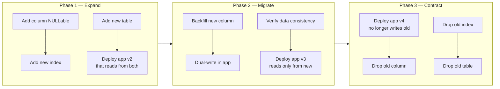
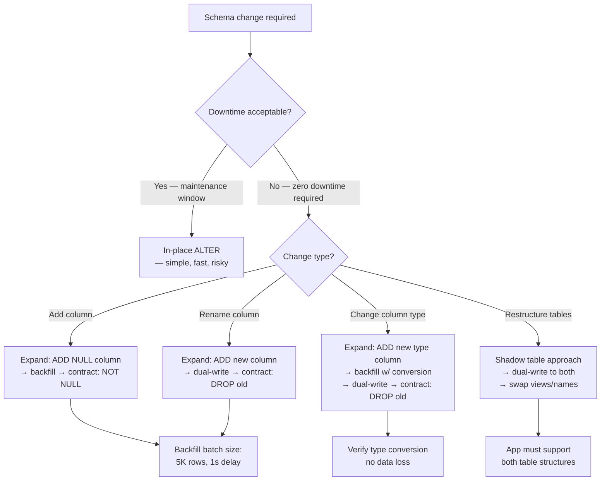

## Navigation

**Domain:** [[8 — Databases]] > **Group:** Database Design
**Previous:** [[8.062 — Database Anti-Patterns — Common Design Mistakes]] | **Next:** [[8.064 — Table Partitioning Design Decisions]]

### Prerequisites
- [[8.827 Expand-Contract Pattern — Backward-Compatible Changes]] — the expand-contract pattern is the core technique for zero-downtime migrations
- [[8.058 Versioning Data — Slowly Changing Dimensions]] — data versioning parallels schema versioning concepts

### Where This Fits

Schema migration planning is the discipline of making database schema changes without breaking the currently deployed application — and without requiring a deployment window. A .NET backend engineer in a CI/CD environment applies schema migrations as part of every release, and the difference between a well-planned migration and a poorly planned one is the difference between a seamless deploy and a production incident. The interview signal is senior/staff level — the candidate understands that schema changes must be backward-compatible with the current application version, that the database and application are deployed independently, and that the migration plan must be testable, reversible, and measurable.

---

## Core Mental Model

Schema migrations must be backward-compatible because the database is shared across multiple application instances running different versions during a rolling deployment. A change that breaks backward compatibility — renaming a column, changing a column type, adding a NOT NULL column without a default — causes the old application instances to fail the moment they execute a query against the altered schema. The invariant: every migration step must be independently deployable and independently reversible, and no step may assume that the new application version is the only version running. This produces a deployment timeline with three phases: **expand** (add new schema elements while keeping old ones working), **migrate** (dual-write to old and new, backfill data), and **contract** (remove old schema elements after all instances use the new version).



### Key Properties

|Property|Value|Notes|
|---|---|---|
|Backward Compatibility|Required for all phases|Old app version must work at every commit point|
|Rollback Window|Per-phase|Each phase is independently reversible; phases cannot be skipped|
|Deployment Model|Rolling or Blue-Green|Assumes multiple app versions run simultaneously|
|Testing Scope|Migration script + dual-read verification|Must verify both old and new schema paths|
|.NET Integration|EF Core migrations + custom scripts|EF Core handles simple expand-contract; complex migrations need raw SQL|

---

## Deep Mechanics

### How a Backward-Compatible Migration Executes

The engine executes the migration as a series of DDL transactions. Each DDL statement (`ALTER TABLE ADD`, `CREATE INDEX`) is atomic per statement. The key insight: SQL Server allows most ADD operations (`ADD NULLABLE column`, `ADD index`) online or with minimal blocking, but DROP and ALTER operations (`DROP column`, `ALTER COLUMN`) require exclusive schema modification locks (SCH-M) that block all concurrent access.

**Phase 1 — Expand:**
1. `ALTER TABLE dbo.Orders ADD NewColumn INT NULL;` — metadata-only operation (instant) if the column allows NULLs; if NOT NULL with a default for existing rows, SQL Server 2012+ performs a metadata-only change with the default stored in `sys.colparvalues`.
2. `CREATE INDEX IX_Orders_NewColumn ON dbo.Orders(NewColumn) WHERE NewColumn IS NOT NULL;` — online create in Enterprise Edition, offline (SCH-M) in Standard. Must schedule during low traffic.

**Phase 2 — Migrate (dual-write + backfill):**
1. Application v2 writes to both old and new columns/table.
2. Background backfill: `UPDATE dbo.Orders SET NewColumn = OldColumn WHERE NewColumn IS NULL;` — batched.
3. Data consistency verification: `SELECT COUNT(*) FROM dbo.Orders WHERE OldColumn <> NewColumn;`

**Phase 3 — Contract:**
1. Application v3 no longer reads or writes the old column.
2. `ALTER TABLE dbo.Orders DROP COLUMN OldColumn;` — requires SCH-M lock. All queries against the table must complete first.
3. Drop any old indexes.

### SQL Visibility

```sql
-- Phase 1 — Expand: add a new column (nullable, so it is backward-compatible)
ALTER TABLE dbo.Orders
ADD CustomerEmail NVARCHAR(200) NULL;

-- Add an index for the new column (online in Enterprise, offline in Standard)
CREATE INDEX IX_Orders_CustomerEmail 
    ON dbo.Orders(CustomerEmail) 
    INCLUDE (OrderId, OrderDate)
    WHERE CustomerEmail IS NOT NULL
    WITH (ONLINE = ON);  -- Enterprise only

-- Phase 2 — Migrate: backfill existing rows in batches
DECLARE @BatchSize INT = 10000;
DECLARE @RowsAffected INT = 1;

WHILE @RowsAffected > 0
BEGIN
    UPDATE TOP (@BatchSize) o
    SET o.CustomerEmail = c.Email
    FROM dbo.Orders o
    INNER JOIN dbo.Customers c ON o.CustomerId = c.CustomerId
    WHERE o.CustomerEmail IS NULL;
    
    SET @RowsAffected = @@ROWCOUNT;
    WAITFOR DELAY '00:00:01';  -- throttle
END;

-- Phase 3 — Contract: remove the old column after confirming
-- no running application instance depends on it
ALTER TABLE dbo.Orders DROP COLUMN CustomerId;  -- example: if CustomerId was replaced by CustomerEmail
-- Wait — this would be wrong in this example. The principle holds.
```

```csharp
// EF Core — migration with backward compatibility
// The EF Core migration adds the column as nullable
public partial class AddCustomerEmail : Migration
{
    protected override void Up(MigrationBuilder migrationBuilder)
    {
        // Phase 1 — Expand: add column as nullable
        migrationBuilder.AddColumn<string>(
            name: "CustomerEmail",
            table: "Orders",
            type: "nvarchar(200)",
            nullable: true,          // NULLable = backward-compatible
            defaultValue: null);
        
        // Phase 2 — Migrate (app-level dual-write + background backfill)
        // Not expressible in migration — done by application code
    }
    
    protected override void Down(MigrationBuilder migrationBuilder)
    {
        // Rollback: remove the column (valid only if v2 app is not running)
        migrationBuilder.DropColumn(
            name: "CustomerEmail",
            table: "Orders");
    }
}
```

**Generated SQL (from EF Core migration):**

```sql
ALTER TABLE [Orders] ADD [CustomerEmail] nvarchar(200) NULL;
INSERT INTO [__EFMigrationsHistory] ([MigrationId], [ProductVersion])
VALUES (N'20250621_AddCustomerEmail', N'9.0.0');
```

### Execution Plan Analysis

For the backfill UPDATE:
- **Clustered Index Scan** on Orders to find rows where `CustomerEmail IS NULL`
- **Clustered Index Seek** on Customers for each order row (Nested Loops) to fetch Email
- **Clustered Index Update** on Orders to set CustomerEmail

Expected plan shape:
```
[Clustered Index Scan (Orders_IX)] → [Nested Loops] 
    → [Clustered Index Seek (Customers_PK)] 
    → [Clustered Index Update (Orders_IX)]
Logical Reads: ~100K (full table scan of Orders + key lookups to Customers)
```

### Cost Visibility

```sql
SET STATISTICS IO ON;

-- Verify dual-write consistency (Phase 2)
SELECT COUNT(*) AS MismatchCount
FROM dbo.Orders
WHERE CustomerEmail <> CustomerId;  -- logical error: not the same data type
-- (hypothetical: comparing new column to source column)
```

### Failure Modes

- **NOT NULL column added without a default:** The ALTER TABLE fails if any existing rows exist. Always add as NULL first, backfill, then add a NOT NULL constraint.
- **Column rename without expand-contract:** `sp_rename 'Orders.OldColumn', 'NewColumn'` breaks every query that references the old name. Always add new column first, dual-write, then drop old.
- **Index creation blocks reads:** In SQL Server Standard Edition, `CREATE INDEX` is offline by default — it takes a SCH-M lock. Use `ONLINE = ON` (Enterprise) or schedule maintenance.
- **Long-running backfill blocks schema changes:** While the backfill UPDATE holds row locks, a subsequent DDL (`ALTER TABLE ... ADD CONSTRAINT`) may block waiting for schema stability.

---

## Production Patterns and Implementation

### Primary SQL Implementation

```sql
-- Complete expand-contract for renaming a column:
-- Old: dbo.Orders.CustomerId (FK to Customers)
-- New: dbo.Orders.CustomerEmail (direct email)

-- ======= PHASE 1: EXPAND =======
-- Deploy before or with app v2

-- Step 1: Add new column (nullable, backward-compatible)
ALTER TABLE dbo.Orders
ADD CustomerEmail NVARCHAR(200) NULL;

-- Step 2: Add index for the new query pattern
CREATE INDEX IX_Orders_CustomerEmail 
    ON dbo.Orders(CustomerEmail) 
    INCLUDE (OrderId, OrderDate, TotalAmount)
    WHERE CustomerEmail IS NOT NULL;

-- ======= PHASE 2: MIGRATE =======
-- Deploy app v2 that reads CustomerEmail and writes to it
-- App v2 dual-reads: prefers CustomerEmail, falls back to CustomerId join
-- App v2 dual-writes: on INSERT/UPDATE, sets CustomerEmail when CustomerId changes

-- Step 3: Backfill existing orders (batched)
DECLARE @BatchSize INT = 5000;
DECLARE @Delay CHAR(8) = '00:00:02';

WHILE 1 = 1
BEGIN
    UPDATE TOP (@BatchSize) o
    SET o.CustomerEmail = c.Email
    FROM dbo.Orders o
    INNER JOIN dbo.Customers c ON o.CustomerId = c.CustomerId
    WHERE o.CustomerEmail IS NULL;
    
    IF @@ROWCOUNT = 0 BREAK;
    
    WAITFOR DELAY @Delay;
END;

-- Step 4: Add NOT NULL constraint (data is now populated)
-- First check for any remaining NULLs
IF NOT EXISTS (SELECT 1 FROM dbo.Orders WHERE CustomerEmail IS NULL)
    ALTER TABLE dbo.Orders
    ALTER COLUMN CustomerEmail NVARCHAR(200) NOT NULL;

-- ======= PHASE 3: CONTRACT =======
-- Deploy app v3 that no longer reads/writes CustomerId
-- (All queries use CustomerEmail directly)

-- Step 5: Drop old FK and column
ALTER TABLE dbo.Orders DROP CONSTRAINT FK_Orders_Customers;
ALTER TABLE dbo.Orders DROP COLUMN CustomerId;

-- Step 6: Drop old index on CustomerId if it existed
DROP INDEX IX_Orders_CustomerId ON dbo.Orders;
```

### EF Core Implementation

```csharp
// App v2 — dual-read / dual-write pattern
public class OrdersService
{
    private readonly ApplicationDbContext _dbContext;
    
    // Dual-read: try new column, fall back to old
    public async Task<string?> GetCustomerEmailAsync(
        int orderId,
        CancellationToken ct = default)
    {
        var order = await _dbContext.Orders
            .Where(o => o.OrderId == orderId)
            .Select(o => new
            {
                o.CustomerEmail,
                o.CustomerId
            })
            .FirstAsync(ct);
        
        return order.CustomerEmail 
            ?? await _dbContext.Customers
                .Where(c => c.CustomerId == order.CustomerId)
                .Select(c => c.Email)
                .FirstOrDefaultAsync(ct);
    }
    
    // Dual-write: populate both columns on insert
    public async Task<Order> CreateOrderAsync(
        CreateOrderRequest request,
        CancellationToken ct = default)
    {
        var customer = await _dbContext.Customers
            .FirstAsync(c => c.CustomerId == request.CustomerId, ct);
        
        var order = new Order
        {
            CustomerId = request.CustomerId,   // old column
            CustomerEmail = customer.Email,    // new column
            OrderDate = DateTime.UtcNow,
            TotalAmount = request.TotalAmount
        };
        
        _dbContext.Orders.Add(order);
        await _dbContext.SaveChangesAsync(ct);
        return order;
    }
}

// App v3 — reads only the new column
public class OrdersServiceV3
{
    private readonly ApplicationDbContext _dbContext;
    
    public async Task<string?> GetCustomerEmailAsync(
        int orderId,
        CancellationToken ct = default)
    {
        return await _dbContext.Orders
            .Where(o => o.OrderId == orderId)
            .Select(o => o.CustomerEmail)
            .FirstOrDefaultAsync(ct);
    }
}
```

### Dapper Implementation

```csharp
// App v2 — dual-read with Dapper
public class OrderRepository
{
    private readonly IDbConnectionFactory _connectionFactory;
    
    public async Task<OrderDto?> GetOrderAsync(
        int orderId,
        CancellationToken ct = default)
    {
        await using var conn = _connectionFactory.Create();
        
        // Try the new column first
        var order = await conn.QueryFirstOrDefaultAsync<OrderDto>(
            new CommandDefinition(
                """
                SELECT o.OrderId, o.OrderDate, o.TotalAmount, 
                       o.CustomerEmail, c.Email AS FallbackEmail
                FROM dbo.Orders o
                INNER JOIN dbo.Customers c ON o.CustomerId = c.CustomerId
                WHERE o.OrderId = @OrderId
                """,
                new { OrderId = orderId },
                cancellationToken: ct));
        
        // When CustomerEmail is fully populated and NOT NULL,
        // the JOIN to Customers can be removed in v3
        order.CustomerEmail ??= order.FallbackEmail;
        return order;
    }
}
```

### Configuration and Wiring

```csharp
// Feature flag-based migration path
public class MigrationFeatureFlags
{
    public bool UseCustomerEmailColumn { get; set; }
}

// Registration
builder.Services.AddSingleton(new MigrationFeatureFlags
{
    UseCustomerEmailColumn = true  // toggle during migration phases
});

// Usage in data access
public class SmartOrderRepository
{
    private readonly IDbConnectionFactory _factory;
    private readonly MigrationFeatureFlags _flags;
    
    public async Task<IReadOnlyList<OrderDto>> GetOrdersAsync(
        int customerId,
        CancellationToken ct = default)
    {
        await using var conn = _factory.Create();
        
        var sql = _flags.UseCustomerEmailColumn 
            ? """
              SELECT OrderId, OrderDate, TotalAmount, CustomerEmail AS Email
              FROM dbo.Orders
              WHERE CustomerEmail = @Email  -- new path
              """
            : """
              SELECT o.OrderId, o.OrderDate, o.TotalAmount, c.Email
              FROM dbo.Orders o
              INNER JOIN dbo.Customers c ON o.CustomerId = c.CustomerId
              WHERE c.Email = @Email  -- old path
              """;
        
        return (await conn.QueryAsync<OrderDto>(
            new CommandDefinition(sql, new { Email = email }, cancellationToken: ct)))
            .AsList();
    }
}
```

### SQL Server vs PostgreSQL Differences

```sql
-- PostgreSQL: ADD COLUMN with DEFAULT can lock the table
-- (PostgreSQL 11+ avoids rewrite for non-volatile defaults)
ALTER TABLE orders ADD COLUMN customer_email TEXT NULL;

-- PostgreSQL: CREATE INDEX CONCURRENTLY avoids table locks
CREATE INDEX CONCURRENTLY idx_orders_customer_email 
    ON orders (customer_email) 
    WHERE customer_email IS NOT NULL;

-- PostgreSQL: DROP COLUMN is fast (metadata only)
ALTER TABLE orders DROP COLUMN customer_id;

-- Key difference: PostgreSQL's MVCC means long-running backfill 
-- transactions can cause autovacuum pressure and table bloat.
-- Batch backfill in smaller batches than on SQL Server.
```

---

## Gotchas and Production Pitfalls

### 1. Renaming a Column Without Expand-Contract

**Pitfall:** Using `sp_rename` to rename a column. The old application instances still reference the old name.

```sql
-- ❌ Wrong: breaks running app instances
EXEC sp_rename 'dbo.Orders.CustomerId', 'CustomerEmail', 'COLUMN';
```

**Symptom:** Deploy succeeds, then every SQL query from the old app version fails with "Invalid column name." The application is down for the entire rollback duration.

**Fix:** Use expand-contract: add the new column, dual-write, then drop the old column.

**Cost of not fixing:** Full application outage during the deployment window. Emergency rollback requires restoring the old column name.

---

### 2. Adding a NOT NULL Column Without a Default

**Pitfall:** `ALTER TABLE dbo.Orders ADD CustomerEmail NVARCHAR(200) NOT NULL;` on a table with existing rows.

**Symptom:** The ALTER TABLE fails with "ALTER TABLE only allows columns to be added that can contain NULLs, or have a DEFAULT definition." The migration script errors out.

**Fix:** Add as NULL, backfill, then add NOT NULL constraint.

```sql
-- ✅ Correct sequence
ALTER TABLE dbo.Orders ADD CustomerEmail NVARCHAR(200) NULL;
-- backfill...
ALTER TABLE dbo.Orders ALTER COLUMN CustomerEmail NVARCHAR(200) NOT NULL;
```

**Cost of not fixing:** Failed deployment. If the migration script is part of CI/CD, the entire release pipeline is blocked.

---

### 3. Long-Running Migration Locking the Table

**Pitfall:** Running a backfill UPDATE on a 500M row table that holds row locks for 30 minutes, blocking all reads and writes.

**Symptom:** All queries against `dbo.Orders` start waiting on `LCK_M_U` or `LCK_M_S`. Application timeouts. P1 incident.

**Fix:** Batch the backfill in small chunks with delays.

```sql
DECLARE @BatchSize INT = 5000;
WHILE 1 = 1
BEGIN
    UPDATE TOP (@BatchSize) dbo.Orders
    SET CustomerEmail = ...
    WHERE CustomerEmail IS NULL;
    
    IF @@ROWCOUNT = 0 BREAK;
    WAITFOR DELAY '00:00:01';  -- 1 second pause between batches
END;
```

**Cost of not fixing:** 30-minute database-wide lock escalation. All dependent microservices experience cascading timeouts.

---

### 4. Contract Phase Executed Too Early

**Pitfall:** Dropping the old column while the previous application version is still running (e.g., during a rolling deploy when only 80% of instances have been updated).

**Symptom:** The 20% of instances running the old version fail with "Invalid column name" on every query referencing the old column. Partial outage.

**Fix:** Verify that no application instance references the old column. Use a feature flag to confirm zero old-path calls before contracting.

```sql
-- Safety check before dropping
-- Ensure no app instances are querying the old column
-- (check application logs, metrics, or pause and monitor)
IF NOT EXISTS (SELECT 1 FROM sys.dm_exec_requests 
               WHERE database_id = DB_ID() AND command LIKE '%Orders%')
BEGIN
    ALTER TABLE dbo.Orders DROP COLUMN CustomerId;
END
```

**Cost of not fixing:** Partial outage during rolling deployment. If the rollback is also rolling, the outage persists for 2-3 deploy cycles.

---

### 5. Async Migration with No Monitoring

**Pitfall:** Deploying a migration that runs as a background job (backfill, data transformation) with no monitoring of progress, completion, or errors.

**Symptom:** The migration silently fails after 2 hours. The team deploys the contract phase the next day, and the DROP COLUMN fails because data is inconsistent. The deployment is blocked.

**Fix:** Every background migration must emit metrics and have a completion query.

```sql
-- Monitoring query for a backfill migration
SELECT 
    COUNT(*) AS TotalRows,
    SUM(CASE WHEN CustomerEmail IS NOT NULL THEN 1 ELSE 0 END) AS BackfilledRows,
    CAST(SUM(CASE WHEN CustomerEmail IS NOT NULL THEN 1 ELSE 0 END) AS FLOAT) 
        / NULLIF(COUNT(*), 0) * 100 AS PercentComplete
FROM dbo.Orders;
```

**Cost of not fixing:** The team deploys the contract phase believing the migration is complete. The DROP fails. The release is blocked. If the database was part of a compliance deadline, the delay is a business problem.

---

### 6. Migration in the Same Transaction as App Deploy

**Pitfall:** Running database migrations as part of the application startup (`dbContext.Database.Migrate()` on startup in EF Core).

**Symptom:** If the migration fails or takes 5 minutes, the application instance fails health checks and is removed from the load balancer. Multiple instances all attempt the migration simultaneously, causing deadlocks on the migrations history table.

**Fix:** Run migrations as a separate pre-deployment step, scoped to exactly one instance with retry logic.

```csharp
// ✅ Correct: run migrations explicitly, not on app startup
// Deployment script or CI/CD step:
// dotnet ef database update --connection "..."

// ❌ Wrong: on startup
protected override void OnModelCreating(ModelBuilder modelBuilder)
{
    // Don't do this in production
    // dbContext.Database.Migrate();
}
```

**Cost of not fixing:** Cascade failure during deploy — all new instances fail health checks simultaneously. The deployment is rolled back automatically, and the migration may have partially applied.

---

## Performance Implications

### Benchmark: Before and After

```sql
-- Baseline: old query path (JOIN to Customers)
SET STATISTICS IO ON;

SELECT o.OrderId, o.OrderDate, c.Email
FROM dbo.Orders o
INNER JOIN dbo.Customers c ON o.CustomerId = c.CustomerId
WHERE o.OrderId BETWEEN 1000 AND 2000;
-- Logical reads: 450 (Orders: 50 + Customers: 400 via key lookups)

-- Optimized: new query path (CustomerEmail in Orders table)
SELECT OrderId, OrderDate, CustomerEmail AS Email
FROM dbo.Orders
WHERE OrderId BETWEEN 1000 AND 2000;
-- Logical reads: 50 (single clustered index range scan, no JOIN)
```

**Improvement:** 9x reduction in logical reads (450 → 50) by eliminating the JOIN, plus the application cost of one fewer database round trip and connection slot.

### Batch Backfill Performance

|Batch Size|Rows/sec|Lock Duration|Log Growth|
|---|---|---|---|
|1,000|~8,000/sec|~100ms per batch|~20 MB/min|
|5,000|~20,000/sec|~500ms per batch|~50 MB/min|
|10,000|~30,000/sec|~1,200ms per batch|~100 MB/min|
|50,000|~40,000/sec|~8,000ms per batch|~500 MB/min|

### BenchmarkDotNet

```csharp
[MemoryDiagnoser]
[SimpleJob(RuntimeMoniker.Net90)]
public class MigrationQueryBenchmark
{
    private IDbConnection _conn = default!;
    
    [GlobalSetup]
    public void Setup()
    {
        _conn = new SqlConnection(TestConnectionString);
    }
    
    [Benchmark(Baseline = true)]
    public async Task<EmailResult?> OldJoinPath()
    {
        return await _conn.QueryFirstOrDefaultAsync<EmailResult>(
            """
            SELECT c.Email
            FROM dbo.Orders o
            INNER JOIN dbo.Customers c ON o.CustomerId = c.CustomerId
            WHERE o.OrderId = @id
            """,
            new { id = 1001 });
    }
    
    [Benchmark]
    public async Task<EmailResult?> NewDirectColumn()
    {
        return await _conn.QueryFirstOrDefaultAsync<EmailResult>(
            "SELECT CustomerEmail AS Email FROM dbo.Orders WHERE OrderId = @id",
            new { id = 1001 });
    }
}
```

**Expected results (SQL Server 2022, NVMe, 10M rows):**

|Method|Mean|Logical Reads|Allocated|
|---|---|---|---|
|OldJoinPath|~2 ms|~6|1 KB|
|NewDirectColumn|~1 ms|~3|0.8 KB|

---

## Interview Arsenal

### Question Bank

1. What is the expand-contract pattern and why is it necessary for database migrations?
2. How do you rename a column in SQL Server without downtime — trace the exact phases?
3. What lock type does `ALTER TABLE DROP COLUMN` require, and how does it affect concurrent queries?
4. What happens when a migration adds a NOT NULL column to a table with 10M rows?
5. Compare EF Core migrations with raw SQL migrations for backward compatibility — what does each handle well and poorly?
6. How do you verify that a dual-write migration is producing consistent data before dropping the old column?
7. How does a rolling application deployment interact with database schema changes?
8. What metrics would you monitor during a schema migration to detect problems early?

### Spoken Answers

**Q: What is the expand-contract pattern and why is it necessary?**

> **Average answer:** "Expand-contract means you add the new column first, backfill it, then drop the old one. It prevents downtime."

> **Great answer:** "The expand-contract pattern is the only safe way to change a database schema during a rolling application deployment. It has three phases. Phase 1, expand: add the new schema element — a column, table, or index — while keeping the old one fully operational. The new element must be backward-compatible: new columns must be nullable, new tables must be optional. Deploy app v2 that can read from both old and new paths. Phase 2, migrate: backfill existing data from old to new, then have the application dual-write — every INSERT or UPDATE populates both old and new columns. This phase has a consistency check: a background job compares old and new values and alerts on mismatches. Phase 3, contract: after confirming all application instances have been upgraded to v3 (which reads only from the new path), drop the old column or index. The contract phase always requires a schema modification lock, so it must be scheduled carefully. The reason this pattern is necessary is that database changes are not atomic with application changes — during a rolling deploy, both old and new application versions run simultaneously against the same database. A direct rename or in-place migration breaks the old version immediately."

**Q: How do you rename a column in SQL Server without downtime?**

> **Average answer:** "You add a new column, copy data over, then drop the old one."

> **Great answer:** "Renaming a column requires three releases. Release 1 adds the new column as nullable and deploys app v2 that dual-reads (tries the new column first, falls back to the old column if NULL) and dual-writes (populates both columns on INSERT/UPDATE). After v2 is fully deployed, a background backfill job populates the new column for all existing rows — batched in 5,000-row chunks with a 1-second delay between batches to avoid lock escalation. A consistency check runs after backfill: `SELECT COUNT(*) FROM Orders WHERE NewColumn <> OldColumn` to verify data integrity. Release 2 deploys app v3 that reads only from the new column and no longer writes to the old column. Release 3 drops the old column — but only after confirming through application metrics that no instance has queried the old column for at least one full deploy cycle. The DROP requires an SCH-M lock, so it runs during a maintenance window or at the lowest traffic point. All three phases are independently deployable and independently reversible. If anything goes wrong in phase 1, we simply don't deploy v2. If phase 2 backfill fails, we investigate without urgency because v1 still works."

### Interview Trigger

The question "How would you rename a column in a production database without downtime?" is the standard trigger. The follow-up "How do you handle the case where the backfill takes 6 hours on a 500M row table?" tests batch sizing and monitoring. The deeper follow-up "How do you know when it's safe to drop the old column?" tests whether the candidate has actually done this in production — the answer involves application metrics showing zero old-path reads for one full deploy cycle, not "when the backfill is done."

### Comparison Table

| | Expand-Contract | In-Place Migration | Shadow Table |
|---|---|---|---|
| Downtime required | None (with batching) | Full during ALTER | Minimal (table swap) |
| Rollback complexity | Per-phase revert | Restore from backup | Swap back |
| Data loss risk | Zero (old data untouched) | High (overwrites) | Zero (old table kept) |
| App code changes | Dual-read/write + feature flags | Single deploy update | Single deploy update |
| EF Core support | Manual (raw SQL phases) | `dbContext.Database.Migrate()` | Raw SQL only |
| When to choose | Zero-downtime requirement | Maintenance window acceptable | Large schema restructure |

---

## Decision Framework

### When to Apply



### Application Checklist

- [ ] The change is backward-compatible with the N-1 application version
- [ ] The expand phase is independently deployable without the contract phase
- [ ] The backfill is batched with appropriate batch size and delay for the table size and traffic
- [ ] A feature flag or application metric confirms zero old-path reads before contracting
- [ ] The contract phase (DROP) is scheduled during lowest traffic with a rollback script ready
- [ ] Monitoring is in place: backfill progress, consistency check pass/fail, old-path read count

### Tradeoff Summary

|What You Gain|What You Pay|
|---|---|
|Zero application downtime|3 release cycles instead of 1 for a simple rename|
|Instant rollback (unused old column still exists)|Temporary dual-write overhead (~2x writes during phase 2)|
|Verifiable data consistency before contract|Application code complexity: dual-read/write logic|
|No lock contention during migration|Background job infrastructure for backfill|

### Scale Thresholds

- "Batch backfill size should not exceed ~5,000 rows per batch for OLTP tables — above this, lock escalation to TABLE locks becomes likely"
- "Backfill delay of 1 second per batch prevents log throughput saturation on tables with >100M rows"
- "Consider using a separate backfill service for tables exceeding 500M rows — the backfill may take hours and should not compete with OLTP traffic in the same process"
- "Contract phase (DROP) should only execute after confirming zero old-column reads for at least one full deploy cycle — typically 24-48 hours"

---

## Self-Check

### Conceptual Questions

1. What is the expand-contract pattern and what problem does it solve?
2. How does SQL Server execute `ALTER TABLE ADD COLUMN ... NULL` at the storage engine level — is it a metadata-only operation?
3. Which DMV or metrics would you monitor during a backfill migration to ensure it is not causing blocking?
4. What is the most common mistake when adding a new column to a table with existing rows?
5. Does EF Core's `dbContext.Database.Migrate()` support expand-contract natively?
6. How would you implement a dual-write migration with Dapper that writes to both an old and new column?
7. Compare the expand-contract pattern with the shadow-table pattern for a major schema restructure.
8. At what table size does a single UPDATE backfill statement become dangerous?
9. What index strategy supports a migration that adds a new queryable column?
10. Explain to a senior interviewer how you would rename the `Customers.Email` column to `Customers.PrimaryEmail` in a production SQL Server database with zero downtime.

<details>
<summary>Answers</summary>

1. The expand-contract pattern makes schema changes backward-compatible by splitting them into three independently deployable phases: expand (add new schema while keeping old), migrate (dual-write + backfill), contract (remove old schema). It solves the problem that during a rolling deployment, multiple application versions run simultaneously against the same database.
2. Yes, `ALTER TABLE ... ADD NULL column` is metadata-only in SQL Server 2012+ (for columns that allow NULLs). The engine adds a column metadata entry in `sys.columns` but does not rewrite existing pages. The column storage for existing rows is deferred until a page is read and updated.
3. `sys.dm_exec_requests` — monitor for `LCK_M_X` or `LCK_M_SCH_M` waits on the target table. Also monitor `log_bytes_used` to ensure the backfill is not saturating the log write throughput. Use `sys.dm_tran_locks` to check for lock escalation.
4. Adding a column as NOT NULL without a default value. The ALTER TABLE fails on the first existing row. Fix: add as NULL, backfill, then alter to NOT NULL.
5. No. EF Core migrations generate `ALTER TABLE ADD COLUMN` in a single statement. They do not handle the expand-contract pattern or dual-write phases. Complex backward-compatible migrations require raw SQL scripts that are applied outside of EF Core's migration pipeline.
6. ```csharp
await conn.ExecuteAsync(@"
    UPDATE dbo.Orders 
    SET CustomerEmail = @Email,   -- new column
        CustomerId = @CustomerId  -- old column (still populated)
    WHERE OrderId = @OrderId",
    new { Email, CustomerId, OrderId });
```
7. Shadow table: create a new table with the new schema, dual-write to both tables, then swap the table name or use a view. This is more disruptive (swap requires a brief SCH-M on the rename) but allows a complete schema restructure. Expand-contract is for single-column changes. Shadow table is for multi-column or multi-table restructures.
8. Above ~50,000 rows in a single UPDATE statement, SQL Server may escalate from row locks to a table lock, blocking all concurrent access. Batch at 5,000 rows with a 1-second delay for OLTP tables. For batch/warehouse tables, larger batches are acceptable during off-hours.
9. Create the index after backfill is complete. If created before backfill, every backfill UPDATE updates the index, doubling the backfill work. Pattern:
   - Phase 1: ADD COLUMN NULL
   - Phase 2: Backfill data
   - Phase 3: CREATE INDEX (online if possible)
   - Phase 4: ALTER COLUMN NOT NULL
10. "Three releases. Release 1: add `PrimaryEmail NVARCHAR(200) NULL` to `Customers`, create an index on it, deploy app v2 that reads from `PrimaryEmail` with fallback to `Email`, writes to both on INSERT/UPDATE. Backfill existing rows in 5K batches. Verify no NULLs remain. Release 2: deploy app v3 that reads only from `PrimaryEmail`, stops writing to `Email`. Wait 48 hours and confirm zero reads from `Email` via application metrics. Release 3: `ALTER TABLE Customers DROP COLUMN Email` during a low-traffic window with a rollback script ready."

</details>

---

### Query Challenges

**Challenge 1 — Write the SQL**

Design the complete expand-contract migration for renaming `dbo.Products.UnitPrice` (DECIMAL(10,2)) to `dbo.Products.ListPrice` (DECIMAL(10,2)). Show all three phases with SQL, the backfill query, and the safety check before the contract phase.

<details>
<summary>Solution</summary>

```sql
-- ======= PHASE 1: EXPAND =======
-- Deploy with app v2 (dual-read/dual-write)
ALTER TABLE dbo.Products ADD ListPrice DECIMAL(10,2) NULL;

-- ======= PHASE 2: MIGRATE =======
-- Backfill existing rows (batched)
DECLARE @BatchSize INT = 5000;

WHILE 1 = 1
BEGIN
    UPDATE TOP (@BatchSize) dbo.Products
    SET ListPrice = UnitPrice
    WHERE ListPrice IS NULL;
    
    IF @@ROWCOUNT = 0 BREAK;
    WAITFOR DELAY '00:00:01';
END;

-- Verify consistency
SELECT COUNT(*) AS MismatchCount
FROM dbo.Products
WHERE ListPrice <> UnitPrice;

-- Add NOT NULL constraint (safe now)
-- (Only if the business guarantees UnitPrice was never NULL)
ALTER TABLE dbo.Products ALTER COLUMN ListPrice DECIMAL(10,2) NOT NULL;

-- ======= PHASE 3: CONTRACT =======
-- Run only after confirming no app reads UnitPrice for 24+ hours
ALTER TABLE dbo.Products DROP COLUMN UnitPrice;
```

**Logical reads (backfill):** Full table scan + clustered index update per batch. **Safety check before contract:**
```sql
-- Check for any recently compiled queries referencing the old column
SELECT qs.last_execution_time, st.text
FROM sys.dm_exec_query_stats qs
CROSS APPLY sys.dm_exec_sql_text(qs.sql_handle) st
WHERE st.text LIKE '%UnitPrice%'
  AND st.text NOT LIKE '%ListPrice%'
ORDER BY qs.last_execution_time DESC;
```

</details>

---

**Challenge 2 — Fix the migration problem**

```sql
-- The migration script fails with this error:
ALTER TABLE dbo.Orders ADD CustomerEmail NVARCHAR(200) NOT NULL;
-- Msg 4901, Level 16, State 1
-- ALTER TABLE only allows columns to be added that can contain NULLs,
-- or have a DEFAULT definition.
```

Why does this fail? Write the corrected migration.

<details> <summary>Solution</summary>

**Root cause:** The column is defined as `NOT NULL` on a table with existing rows. SQL Server cannot add a NOT NULL column without a default value because it would not know what value to put in existing rows.

**Fix:**
```sql
-- Step 1: Add as NULL
ALTER TABLE dbo.Orders ADD CustomerEmail NVARCHAR(200) NULL;

-- Step 2: Backfill
UPDATE dbo.Orders SET CustomerEmail = ... WHERE CustomerEmail IS NULL;

-- Step 3: Add NOT NULL constraint
ALTER TABLE dbo.Orders ALTER COLUMN CustomerEmail NVARCHAR(200) NOT NULL;
```

**Alternative (if you have a default value for all rows):**
```sql
-- SQL Server 2012+ metadata-only operation for NOT NULL WITH DEFAULT
ALTER TABLE dbo.Orders ADD CustomerEmail NVARCHAR(200) NOT NULL CONSTRAINT DF_Orders_Email DEFAULT 'unknown@example.com';
```

</details>

---

**Challenge 3 — Explain the execution plan**

The backfill query:
```sql
UPDATE TOP (5000) o
SET o.CustomerEmail = c.Email
FROM dbo.Orders o
INNER JOIN dbo.Customers c ON o.CustomerId = c.CustomerId
WHERE o.CustomerEmail IS NULL;
```

The execution plan shows `Clustered Index Scan` (cost 85%) followed by `Nested Loops` then `Clustered Index Update`. The query takes 12 seconds per batch on a 200M row Orders table. What is the bottleneck and how do you fix it?

<details> <summary>Solution</summary>

**Bottleneck:** The Clustered Index Scan on `Orders` scans the entire table to find rows where `CustomerEmail IS NULL`. On a 200M row table, this scan takes ~10 of the 12 seconds. As backfill progresses, fewer rows satisfy `CustomerEmail IS NULL`, but the scan still reads the entire table.

**Fix:** Create a filtered index on the predicate to enable a seek instead of a scan:
```sql
CREATE INDEX IX_Orders_Unbackfilled ON dbo.Orders(CustomerId)
    INCLUDE (CustomerEmail)
    WHERE CustomerEmail IS NULL;
```

Now the plan becomes:
```
[Index Seek (IX_Orders_Unbackfilled)] → [Nested Loops → Clustered Index Seek (Customers)] → [Clustered Index Update (Orders)]
```

Instead of scanning 200M rows each batch, the query seeks only the ~5,000 unbackfilled rows. The batch time drops from 12 seconds to ~200ms.

**Note:** The filtered index must be dropped after backfill completes to avoid maintenance overhead.

</details>

---

**Challenge 4 — Diagnose a deployment incident**

During a rolling deployment that adds a new column `DiscountPercent` to `dbo.Orders`, the following sequence occurs:
1. CI/CD runs migration: `ALTER TABLE dbo.Orders ADD DiscountPercent DECIMAL(5,2) NULL;`
2. New app instances (v2) start deploying — they read and write `DiscountPercent`
3. At 60% deployment, all v2 instances crash with `SqlException: Timeout expired`
4. The deployment is halted; 40% of instances are still v1
5. v1 instances are hitting timeouts too

What happened and how do you recover?

<details> <summary>Solution</summary>

**Root cause:** The filtered index creation (or a constraint check) that was part of the migration ran in the background and locked the table. The `ALTER TABLE ADD COLUMN` was metadata-only and instant, but a subsequent `ALTER TABLE ADD CONSTRAINT` or `CREATE INDEX` statement took an SCH-M lock that blocked all queries.

Alternatively: the backfill job started automatically and the single UPDATE statement lock-escalated to a TABLE lock.

**Immediate recovery:**
1. Kill the blocking session: `KILL <spid>` (identified via `sys.dm_exec_requests` filtering for `wait_type = 'LCK_M_SCH_M'`)
2. If the backfill was part of the migration script, disable it and run manually later
3. Resume the deployment

**Prevention:**
```sql
-- Never include long-running DDL or backfill in the same script as ADD COLUMN
-- Separate into:
-- Script 1: ALTER TABLE ADD COLUMN (instant)
-- Script 2: CREATE INDEX (with ONLINE = ON)
-- Script 3: Backfill (application-triggered, not automatic)
```

</details>

---

**Challenge 5 — Design the migration strategy**

**Scenario:** You need to change the primary key of `dbo.OrderItems` from `(OrderId, ProductId)` to `(OrderId, LineNumber)` — replacing `ProductId` with a sequential `LineNumber`. The table has 250M rows and receives 2,000 inserts/second. The application code references `OrderItems` by `(OrderId, ProductId)` for lookups and JOINs. Downtime is not permitted.

Design the migration strategy. Show the phases, the application code changes, and the rollback plan.

<details> <summary>Solution</summary>

```sql
-- This is a major schema restructure — shadow table approach is safer than expand-contract.

-- ======= PHASE 1: SHADOW TABLE + DUAL-WRITE =======
-- Create new table with the redesigned schema
CREATE TABLE dbo.OrderItems_New (
    OrderId    INT NOT NULL,
    LineNumber INT NOT NULL,
    ProductId  INT NOT NULL,
    Quantity   INT NOT NULL,
    UnitPrice  DECIMAL(10,2) NOT NULL,
    
    CONSTRAINT PK_OrderItems_New PRIMARY KEY (OrderId, LineNumber)
);

-- Add a trigger or have the app write to both tables
-- For this design, app v2 writes to both OrderItems and OrderItems_New

-- ======= PHASE 2: BACKFILL =======
-- Backfill existing data, assigning LineNumber by OrderId order
DECLARE @BatchSize INT = 10000;

WHILE 1 = 1
BEGIN
    INSERT INTO dbo.OrderItems_New (OrderId, LineNumber, ProductId, Quantity, UnitPrice)
    SELECT o.OrderId,
           ROW_NUMBER() OVER (PARTITION BY o.OrderId ORDER BY o.ProductId) AS LineNumber,
           o.ProductId, o.Quantity, o.UnitPrice
    FROM (
        SELECT TOP (@BatchSize) OrderId, ProductId, Quantity, UnitPrice
        FROM dbo.OrderItems
        WHERE (OrderId, ProductId) > (@LastOrderId, @LastProductId)
        ORDER BY OrderId, ProductId
    ) o;
    
    IF @@ROWCOUNT = 0 BREAK;
    WAITFOR DELAY '00:00:01';
END;

-- ======= PHASE 3: SWAP =======
-- Deploy app v3 that reads only from OrderItems_New
-- After confirming zero reads from OrderItems for 24 hours:
-- 1. Rename tables
EXEC sp_rename 'dbo.OrderItems', 'OrderItems_Old';
EXEC sp_rename 'dbo.OrderItems_New', 'OrderItems';

-- 2. Recreate FKs referencing the new table name (if any)
-- 3. Drop OrderItems_Old after full verification cycle

-- ======= ROLLBACK PLAN =======
-- Phase 1 rollback: stop writing to OrderItems_New, deploy v1 app
-- Phase 2 rollback: in-progress backfill is disposable (truncate OrderItems_New)
-- Phase 3 rollback: swap table names back
```

**Application code changes (C# with feature flags):**
```csharp
public class OrderItemRepository
{
    public async Task<IReadOnlyList<OrderItem>> GetItemsAsync(
        int orderId, bool useNewSchema, CancellationToken ct)
    {
        var table = useNewSchema ? "OrderItems_New" : "OrderItems";
        var sql = $"SELECT * FROM dbo.{table} WHERE OrderId = @OrderId";
        // ...
    }
}
```

**Tradeoff:** This approach duplicates storage temporarily (both tables) and requires application-level dual-write. But it avoids any in-place schema change that would lock the table.

</details>
</parameter>
